# 第一章：云计算对网络的影响

本章将探讨过去几年内私有数据中心中网络的变化以及如何演变。重点将放在公有云中的**亚马逊网络服务**（**AWS**）和私有云中的**OpenStack**的出现，以及它们如何改变开发人员使用网络的方式。它还将探讨 AWS 和 OpenStack 提供的现成网络服务，并展示它们提供的一些功能。最后，它将展示这些云平台如何将网络变成了类似基础设施的商品。

本章将涉及以下主题：

+   云计算方法概述

+   跨越树（Spanning Tree）网络与叶脊（Leaf-Spine）网络的区别

+   公有云引入后，网络发生的变化

+   亚马逊网络服务（AWS）网络方法

+   OpenStack 网络方法

# 云计算方法概述

云服务提供商市场目前已经饱和，存在多种不同的私有云、公有云和混合云解决方案，因此对于希望实施公有云、私有云或混合云解决方案的公司来说，选择不再是问题。

因此，选择云解决方案有时会是一个令人生畏的任务，因为市场上有众多不同的选择。

公有云与私有云之间的竞争仍处于起步阶段，尽管公有云被认为非常流行，但只有大约 25%的行业在使用公有云，解决方案如亚马逊网络服务、微软 Azure 和谷歌云占据了市场的大部分份额。然而，这仍意味着云市场有 75%的市场份额尚未被占领，因此云计算市场在未来几年可能会经历多次迭代。

那么，为什么许多公司最初考虑使用公有云，公有云与私有云和混合云又有什么不同呢？

## 公有云

公有云本质上是一组数据中心和基础设施，通过互联网公开提供给消费者。尽管名字中带有“云”，但它并非魔法或虚无缥缈的东西。亚马逊网络服务（Amazon Web Services）推出公有云的初衷是，在一年中忙碌的时期，他们可以将空闲的服务器租借给其他公司使用。

公有云资源可以通过**图形用户界面**（**GUI**）或通过一组 API 端点以编程方式访问。这使得公有云的最终用户能够创建基础设施和网络，以托管他们的应用程序。

企业使用公有云有多种原因，例如配置速度快，并且使用公有云资源的成本相对较低。一旦提供了信用卡信息，最终用户就可以自由创建自己的基础设施和网络，并在其上运行应用程序。

这种基础设施可以根据需要弹性地扩展和缩减，当然，所有这些都需要一定的费用，通过信用卡支付。

公有云已经变得非常流行，因为它解决了一些与**影子 IT**相关的历史性障碍。开发者不再受到官僚化和缓慢的内部 IT 流程强加的限制。因此，许多企业将公有云视为跳过这些障碍、以更灵活的方式工作的途径，使他们能够更频繁地将新产品推向市场。

当企业将其运营迁移到公有云时，他们是在迈出大胆的一步，停止托管自己的数据中心，而是使用一个公开的公有云服务提供商，如 Amazon Web Services、Microsoft Azure、IBM BlueMix、Rackspace 或 Google Cloud。

随后，依赖于公有云的正常运行时间和**服务等级协议**（**SLA**），这对一个成熟的企业来说可能是一个巨大的文化转变。

已经迁移到公有云的企业可能会发现，他们不再需要庞大的内部基础设施团队或网络团队，所有基础设施和网络都由第三方公有云提供，因此在某些情况下，这可能被视为放弃内部 IT。

公有云证明了对于许多初创公司来说是一个非常成功的模式，因为它提供的灵活性，初创公司可以迅速推出产品，利用软件定义的构件，而无需建立自己的数据中心，保持产品专注。

然而，运行所有企业基础设施在公有云中的**拥有总成本**（**TCO**）是一个备受争议的话题，如果没有正确的管理和维护，这可能是一个昂贵的模式。关于公有云与私有云 TCO 的辩论仍在继续，一些人认为公有云是一个很好的短期解决方案，但随着时间的推移，成本的增长意味着它可能不是与私有云相比的可行长期解决方案。

## 私有云

私有云实际上只是虚拟化解决方案（如 VMware、Hyper-V 和 Citrix Xen）最初带来的好处的延伸，这些虚拟化解决方案曾是虚拟化市场的基石。私有云的世界已经不再仅仅提供虚拟机，而是提供软件定义的网络和存储。

随着公有云的推出，如 Amazon Web Services，私有云解决方案已试图通过在当前基础设施上加一个软件定义层来提供类似的功能。这个基础设施可以像公有云一样通过图形界面（GUI）或通过 API 编程方式进行控制。

私有云解决方案，如 Apache CloudStack 和开源解决方案如 OpenStack，已被创建来弥合私有云和公有云之间的差距。

这使得厂商可以通过在现有硬件和网络之上叠加软件定义的构件，获得在自有数据中心内运行私有云操作的灵活性。

然而，私有云的主要好处在于这可以在公司自有数据中心的安全性范围内完成。并非所有企业都能出于合规性、常规性或性能原因使用公共云，因此一些企业在特定工作负载上仍然需要私有云。

## 混合云

混合云通常可以被视为多个云的结合体。这使得企业能够通过网络结构无缝地在多个云之间运行工作负载。企业可以根据成本或性能指标来选择工作负载的部署位置。

混合云通常可以由私有云和公共云组成。因此，举个例子，一个企业可能有一套需要在特定繁忙时期进行扩展的 Web 应用，这些应用更适合运行在公共云中，因此它们被部署在那里。然而，该企业还需要一个高度受监管、符合 PCI 标准的数据库，后者更适合部署在私有的本地云中。因此，真正的混合云为企业提供了这类选择和灵活性。

混合云的真正运作前提是根据不同的用例使用不同的云，其中每匹马（应用工作负载）需要跑特定的赛道（云）。因此，有时可以使用厂商提供的**平台即服务**（**PaaS**）层来跨多个云部署工作负载，或者使用不同的配置管理工具或容器编排技术来协调跨云的应用工作负载部署。

## 软件定义

公共云、私有云或混合云的选择实际上取决于企业，因此没有绝对的对错答案。随着公司文化和流程在未来几年内的发展，它们可能会使用混合云模型。

如果一个企业正在使用公共云、私有云或混合云，那么所有实现方式的共同主题就是它们都朝着软件定义的运营模式发展。

那么，*软件定义*到底是什么意思呢？简而言之，*软件定义*意味着在硬件上运行一个软件抽象层。这个软件抽象层允许对硬件进行图形化或编程化控制。因此，像基础设施、存储和网络这样的构件可以被软件定义，从而帮助简化操作、提高可管理性，尤其是在基础设施和网络扩展时。

在运行私有云时，需要对现有的数据中心进行修改，以使其准备好成为私有云；有时，这一点非常重要，因此私有数据中心需要进化以满足这些需求。

# 跨树和叶脊网络的区别

在考虑私有云时，传统上，公司的私有数据中心已实现基于**生成树协议**（**STP**）的 3 层二层网络，这对于现代的软件定义网络并不十分适用。因此，我们将深入了解什么是 STP 以及现代的叶脊网络架构。

## **生成树协议**

STP 的实现为网络架构师提供了多种实现选项，但也为网络增加了一层复杂性。实施 STP 可以让网络架构师确信它能够防止网络中发生二层环路。

典型的 3 层基于 STP 的二层网络表示如下：

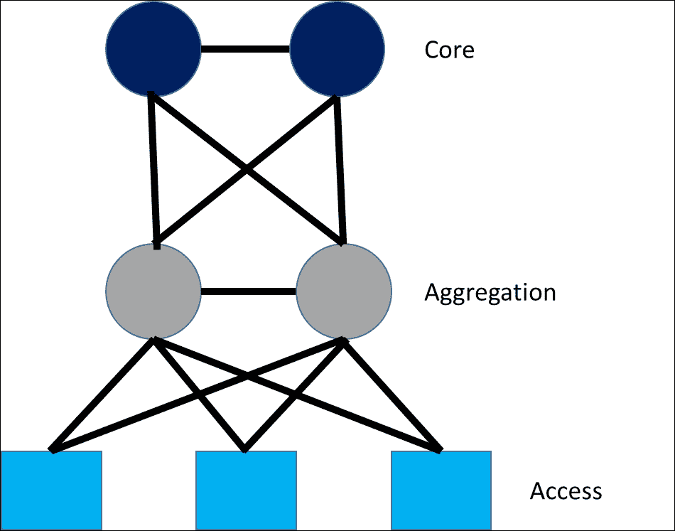

+   **核心**层为数据中心的其他部分提供路由服务，并包含核心交换机

+   **聚合层**提供与相邻**接入**层交换机的连接，并位于生成树核心的顶部

树的底部是**接入**层；这是裸金属（物理）或虚拟机连接到网络并使用不同 VLAN 进行分段的地方。

使用二层网络和 STP 意味着网络的接入层将使用遍布整个网络的 VLAN。这些 VLAN 位于接入层，虚拟机或裸金属服务器连接在此。通常，这些 VLAN 按应用类型分组，防火墙用于进一步隔离和保护它们。

传统网络通常被划分为以下几种组合：

+   **前端**：通常包含需要外部访问的 Web 服务器

+   **业务逻辑**：通常包含有状态服务

+   **后端**：通常包含数据库服务器

应用程序通过这些防火墙之间的隧道进行通信，使用特定的**访问控制列表**（**ACL**）规则，这些规则由网络团队提供服务，并由安全团队进行管理。

在二层网络中使用 STP 时，所有交换机都通过选举过程来确定根交换机，根交换机会授予具有最低桥接 ID 的交换机，桥接 ID 包括交换机的桥接优先级和 MAC 地址。

一旦选举完成，根交换机成为生成树的基础；生成树中的所有其他交换机被视为非根交换机，它们将计算到根交换机的最短路径，然后阻止任何冗余链路，从而形成一条清晰的路径。计算最短路径的过程称为网络收敛。（更多信息请参阅以下链接：[`etutorials.org/Networking/Lan+switching+fundamentals/Chapter+10.+Implementing+and+Tuning+Spanning+Tree/Spanning-Tree+Convergence/`](http://etutorials.org/Networking/Lan+switching+fundamentals/Chapter+10.+Implementing+and+Tuning+Spanning+Tree/Spanning-Tree+Convergence/))

Network architects designing the layer 2 Spanning Tree network need to be careful about the placement of the root switch, as all network traffic will need to flow through it, so it should be selected with care and given an appropriate bridge priority as part of the network reference architecture design. If at any point, switches have been given the same bridge priority then the bridge with the lowest MAC address wins.

Network architects should also design the network for redundancy so that if a root switch fails, there is a nominated backup root switch with a priority of one value less than the nominated root switch, which will take over when a root switch fails. In the scenario, the root switch fails the election process will begin again and the network will converge, which can take some time.

The use of STP is not without its risks, if it does fail due to user configuration error, data center equipment failure or software failure on a switch or bad design, then the consequences to a network can be huge. The result can be that loops might form within the bridged network, which can result in a flood of broadcast, multicast or unknown-unicast storms that can potentially take down the entire network leading to long network outages. The complexity associated with network architects or engineers troubleshooting STP issues is important, so it is paramount that the network design is sound.

## Leaf-Spine architecture

In recent years with the emergence of cloud computing, we have seen data centers move away from a STP in favor of a Leaf-Spine networking architecture. The Leaf-Spine architecture is shown in the following diagram:

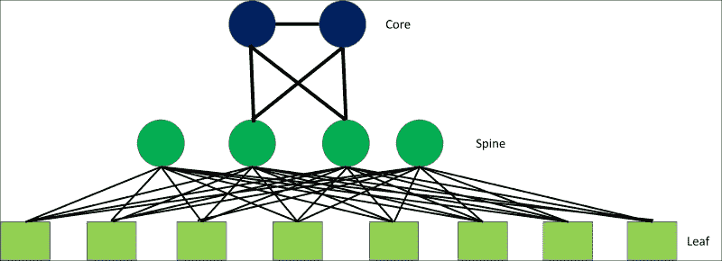

In a Leaf-Spine architecture:

+   Spine switches are connected into a set of core switches

+   Spine switches are then connected with Leaf switches with each Leaf switch deployed at the top of rack, which means that any Leaf switch can connect to any Spine switch in one hop

Leaf-Spine architectures are promoted by companies such as Arista, Juniper, and Cisco. A Leaf-Spine architecture is built on layer 3 routing principle to optimize throughput and reduce latency.

Both Leaf and Spine switches communicate with each other via **external Border Gate Protocol** (**eBGP**) as the routing protocol for the IP fabric. eBGP establishes a **Transmission Control Protocol** (**TCP**) connection to each of its BGP peers before BGP updates can be exchanged between the switches. Leaf switches in the implementation will sit at top of rack and can be configured in **Multichassis Link Aggregation** (**MLAG**) mode using **Network Interface Controller** (**NIC**) bonding.

MLAG 最初与**STP**一起使用，使得两个或更多交换机绑定在一起，模拟成一个交换机，作为冗余使用，从而在 STP 中显示为一个交换机。在发生故障时，这提供了多个上行链路作为冗余，因为交换机是对等的，并且可以绕过禁用冗余路径的需求。Leaf 交换机之间通常会配置**内部边界网关协议**（**iBGP**）以实现容错。

在 Leaf-Spine 架构中，Spine 交换机不会与其他 Spine 交换机连接，Leaf 交换机也不会直接与其他 Leaf 交换机连接，除非使用 MLAG 网卡绑定在机架顶部进行绑定。Leaf-Spine 架构中的所有链接都被设置为无环转发。Leaf-Spine 架构通常配置为实现**等成本多路径**（**ECMP**），允许在交换机上配置所有路由，从而可以访问层 3 路由结构中的任何 Spine 交换机。

ECMP 意味着 Leaf 交换机的路由表已配置了指向每个 Spine 交换机的下一跳。在 ECMP 配置中，每个 Leaf 节点都有多条与每个 Spine 交换机等距离的路径，因此如果某个 Spine 或 Leaf 交换机故障，只要还有其他活跃路径连接到相邻的 Spine 交换机，就不会受到影响。ECMP 用于负载均衡流量，并支持通过多条路径路由流量。与 STP 相比，STP 会在网络收敛时关闭除一条路径外的所有路径。

通常，为了实现高性能，Leaf-Spine 架构在 Leaf 交换机上使用 10G 接入端口，映射到 40G 的 Spine 端口。当设备端口容量成为问题时，可以通过将新 Leaf 交换机连接到网络中的每个 Spine 交换机，并将新配置推送到每个交换机，来添加新的 Leaf 交换机。这意味着网络团队可以轻松地横向扩展网络，而无需管理或中断交换协议，也不会影响网络性能。

后续会展示 Leaf-Spine 架构中使用的协议图示，Spine 交换机通过 BGP 和 ECMP 与 Leaf 交换机连接，Leaf 交换机位于机架顶部，并使用 MLAG 和 iBGP 配置以实现冗余：

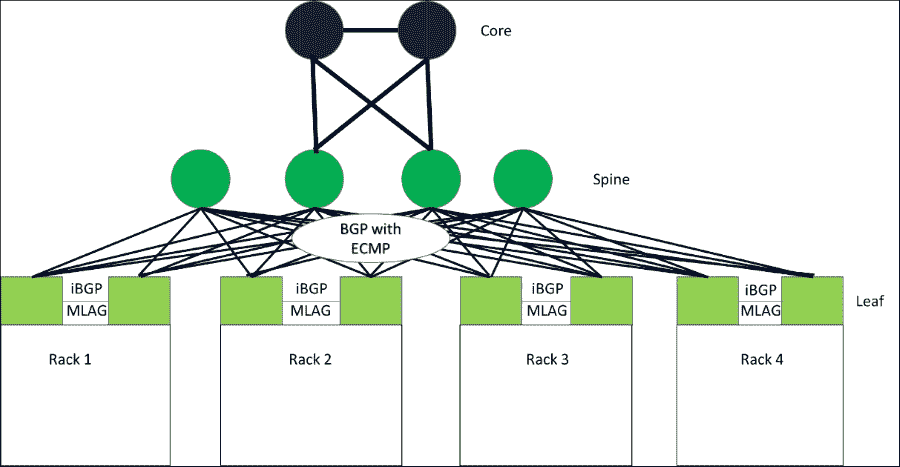

Leaf-Spine 架构的优势如下：

+   网络中的一致性延迟和吞吐量

+   所有机架的一致性性能

+   网络一旦配置完成，复杂性会大大降低

+   通过在机架顶部添加新的 Leaf 交换机，可以简单地扩展新机架。

+   所有机架之间的一致性性能、订阅和延迟

+   东西向流量性能优化（虚拟机到虚拟机的通信），以支持微服务应用

+   解决 VLAN 扩展问题，控制广播和故障域

Leaf-Spine 拓扑的一个缺点是它在数据中心中消耗的电缆数量。

## OVSDB

现代交换机已经开始采用开源标准，这样它们就可以使用相同的可插拔框架。虚拟交换机的开源标准是**Open vSwitch**，它源于需要提出一个开放标准，使虚拟交换机能够将流量转发到同一物理主机和物理网络上的不同虚拟机。Open vSwitch 使用**Open vSwitch 数据库**（**OVSDB**），该数据库具有标准的可扩展架构。

Open vSwitch 最初在虚拟化管理程序层面部署，但现在也被用于容器技术，这些技术为网络提供了 Open vSwitch 实现。

以下超管程序目前将 Open vSwitch 作为其虚拟交换技术：

+   KVM

+   Xen

+   Hyper-V

**Hyper-V** 最近已开始支持使用 Cloudbase ([`cloudbase.it/`](https://cloudbase.it/)) 创建的 Open vSwitch 实现，Cloudbase 在开源领域做出了出色的工作，这也证明了微软的商业模式在近年来如何发展并拥抱开源技术和标准。谁能想到呢？现在，微软的技术可以原生运行在 Linux 上。

Open vSwitch 交换**OpenFlow**数据，在虚拟交换机和物理交换机之间进行通信，并且可以通过编程扩展以适应供应商的需求。在下面的图示中，你可以看到 Open vSwitch 的架构。Open vSwitch 可以在使用 KVM、Xen 或 Hyper-V 虚拟化层的服务器上运行：

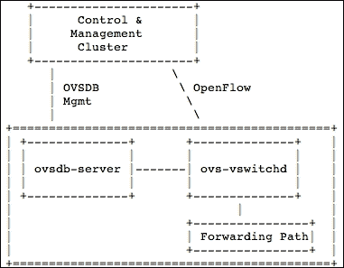

**ovsdb-server** 包含 OVSDB 架构，保存虚拟交换机的所有交换信息。**ovs-vswitchd** 守护进程与任何**控制与管理集群**通信，控制与管理集群可以是任何可以使用 **OpenFlow** 协议通信的 SDN 控制器。

控制器使用 OpenFlow 在虚拟交换机上安装流状态，OpenFlow 决定当虚拟交换机接收到数据包时应采取哪些操作。

当 Open vSwitch 接收到一个它从未见过并且没有匹配流条目的数据包时，它会将该数据包发送给控制器。控制器随后根据流规则决定如何处理此数据包，是阻止它还是转发它。在 Open vSwitch 上，可以配置**服务质量**（**QoS**）和其他统计信息。

Open vSwitch 用于在虚拟化管理程序的交换机级别配置安全规则并提供 ACL 规则。

Leaf-Spine 架构允许轻松构建覆盖网络，这意味着云环境和租户环境可以轻松地连接到第 3 层路由结构。硬件**Vxlan 隧道端点**（**VTEPs**）的 IP 地址与每个 Leaf 交换机或 MLAG 模式下的一对 Leaf 交换机关联，并通过**虚拟可扩展局域网**（**VXLAN**）与安装在虚拟化管理程序上的每个 Open vSwitch 连接到每个物理计算主机。

这使得由厂商提供的 SDN 控制器，例如思科（Cisco）、诺基亚（Nokia）和瞻博网络（Juniper），能够构建一个覆盖网络，通过 Open vSwitch 创建到物理虚拟化主机的 VXLAN 隧道。如果有新的计算节点扩展，新的 VXLAN 隧道会自动创建，之后 SDN 控制器可以在 Leaf 交换机上创建新的 VXLAN 隧道，因为它们与 Leaf 交换机的硬件**VXLAN 隧道终端**（**VTEP**）建立了对等连接。

现代交换机厂商，如 Arista、思科、Cumulus 等，使用 OVSDB，这使得 SDN 控制器能够在**控制与管理集群**层级进行集成。只要 SDN 控制器使用 OVSDB 和 OpenFlow 协议，它们就可以与交换机无缝集成，并且不受特定厂商的限制。这为最终用户在选择交换机厂商和 SDN 控制器时提供了更大的选择空间，因为它们使用相同的开放标准协议进行通信。

# 公有云引入后网络领域发生的变化

毋庸置疑，2006 年推出的 AWS 的出现彻底改变并塑造了网络格局。AWS 使公司能够在 AWS 平台上快速开发其产品。AWS 为最终用户创造了一套创新的服务，使他们能够管理基础设施、负载均衡，甚至数据库。这些服务引领了 DevOps 理念的实现，允许用户按需弹性地扩展和收缩基础设施。开发人员不再受到基础设施等待时间的限制，可以更高效地进行产品开发。AWS 丰富的技术功能集允许用户通过点击门户来创建基础设施，或者更多的高级用户通过配置管理工具（如**Ansible**、**Chef**、**Puppet**、**Salt**或**平台即服务**（**PaaS**）解决方案）来编程创建基础设施。

## AWS 概述

2016 年，AWS 的**虚拟私有云**（**VPC**）保护一组 Amazon EC2 实例（虚拟机），这些实例可以通过 VPN 连接连接到任何现有网络。这个简单的构造改变了开发人员希望和期望的网络消费方式。

2016 年，我们生活在一个以消费为主导的社会，手机让我们能即时访问互联网、电影、游戏，或是各种不同的应用程序来满足我们的一切需求，换句话说，我们生活在即时满足的时代，因此不难理解 AWS 对最终用户的吸引力。

AWS 允许开发人员通过 AWS 门户的图形用户界面，通过几次点击，选择不同的规格（CPU、RAM 和磁盘）来在他们自己的个人网络中配置实例（虚拟机），或者通过简单的 API 调用或使用 AWS 提供的 SDK 进行脚本编写。

那么现在有一个合理的问题，为什么开发人员在 AWS 可用的情况下，仍然需要在本地数据中心等待长时间才能处理基础设施或网络工单？这个问题其实不难回答。解决方案肯定是将其迁移到 AWS，或者创建一个能够提供相同敏捷性的私有云解决方案。然而，答案并非总是如此简单，下面是反对使用 AWS 和公有云的一些理由：

+   不知道数据实际上存储在哪里以及在哪个数据中心

+   无法将敏感数据存储在远程地点

+   无法保证所需的性能

+   高昂的运行成本

所有这些问题对于一些受高度监管、需要符合 PCI 合规性或必须满足特定监管标准的企业来说，都是实际的障碍。这些问题可能会阻碍一些企业使用公有云，因此，像大多数解决方案一样，并不是“一个解决方案适用于所有”。

在私有数据中心，有一个文化问题，即团队被设置为在孤岛中工作，并没有为成功的敏捷业务模型做准备，因此，很多时候，使用 AWS、微软 Azure 或谷歌云只是对破碎的运营模型的一个快速修复。

工单系统，作为破碎的内部运营模型的典型代表，并不是一个与速度相匹配的概念。提交给相邻团队的 IT 工单可能需要几天或几周才能完成，因此在虚拟或物理服务器提供给开发人员之前，请求会被排队等待。此外，对于网络变更也同样如此，例如对 ACL 规则的简单修改，由于工单积压，可能需要很长时间才能实施。

开发人员需要能够随时扩展服务器或原型化新功能，因此，长时间等待 IT 工单处理会妨碍新产品推向市场或现有产品的 bug 修复。在内部 IT 中，**信息技术基础架构库**（**ITIL**）的某些从业者将每周处理的工单数量作为成功的主要指标，这表明他们完全忽视了开发人员的客户体验。一些操作需要转交给开发人员，这些操作传统上是由内部 IT 或影子 IT 负责的，但在业务层面需要对操作流程进行调整，才能推动这些变化。

简而言之，AWS 改变了开发人员的期望以及对基础设施和网络团队的期望。开发人员应该能够像在手机上修改应用程序一样迅速满足自己的需求，摆脱公司内部 IT 操作模型带来的拖延。

但是对于可以使用 AWS 的初创公司和企业来说，若不受监管要求的限制，它就省去了雇佣团队去安装服务器、配置网络设备和支付数据中心运营成本的需求。这意味着他们可以通过输入信用卡信息来启动可行的业务并在 AWS 上运行，就像在亚马逊或 eBay 上购买新书一样简单。

## OpenStack 概述

对 AWS 的反应在竞争者中引起了恐慌，因为它打乱了云计算行业，并促使了**Cloud Foundry**和**Pivotal**等 PaaS 解决方案的出现，为混合云提供了一个抽象层。

当市场遭遇颠覆时，它会引发反应，由此催生了新的私有云的构思。2010 年，由 Rackspace 和 NASA 共同发起了一项名为 OpenStack 的开源云软件计划，因为 NASA 无法将其数据存储在公共云中。

OpenStack 项目旨在帮助组织提供基于标准硬件运行的云计算服务，并直接模仿 AWS 提供的模式。与 AWS 的主要区别在于，OpenStack 是一个开源项目，领先的供应商可以使用它将 AWS 类似的能力和敏捷性带到私有云中。

自 2010 年成立以来，OpenStack 已发展成为超过 500 家会员公司的一部分，这些公司通过 OpenStack 基金会积极推动社区发展，其中包括全球最大的 IT 供应商的铂金会员和黄金会员。

OpenStack 基金会的铂金会员包括：

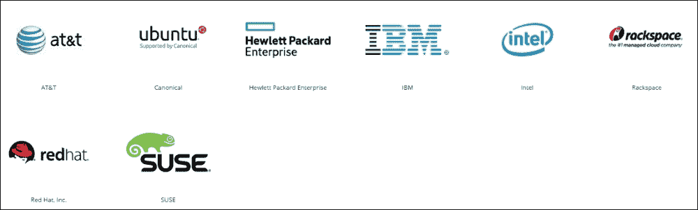

OpenStack 是一个开源项目，这意味着它的源代码是公开的，其底层架构可以供分析使用，不像 AWS 那样像一个魔法盒子，外表光鲜亮丽，但我们并不了解它是如何在内部运作的。

OpenStack 主要用于在私有云中提供**基础设施即服务**（**IaaS**）功能，它使得普通的 x86 计算、集中存储和网络功能可以被终端用户自助服务，无论是通过 Horizon 仪表板，还是通过一套常用的 API。

许多公司现在正在实施 OpenStack 来建立自己的数据中心。与自己独立完成不同，一些公司正在使用不同供应商提供的社区上游项目的加固发行版。已经证明，使用供应商加固的 OpenStack 发行版，可以大大提高 OpenStack 实施成功的可能性。对于一些公司来说，实施 OpenStack 最初可能会觉得很复杂，因为它是一个公司可能尚不熟悉的新技术。使用知名供应商的专业服务支持时，OpenStack 实施不太可能失败，并且它可以为企业解决方案（如 AWS 或 Microsoft Azure）提供一个可行的替代方案。

如 Red Hat、HP、Suse、Canonical、Mirantis 等供应商为客户提供不同的 OpenStack 发行版，并附带不同的安装方法。尽管源代码和功能相同，这些 OpenStack 供应商的商业模式是将 OpenStack 加固以便企业使用，而他们对客户的差异化服务是专业服务。

有许多不同的 OpenStack 发行版可供客户选择，以下供应商提供 OpenStack 发行版：

+   Bright Computing

+   Canonical

+   HPE

+   IBM

+   Mirantis

+   Oracle OpenStack for Oracle Linux，或称 O3L

+   Oracle OpenStack for Oracle Solaris

+   Red Hat

+   SUSE

+   VMware 集成 OpenStack（VIO）

OpenStack 供应商将支持构建、持续维护、升级或客户所需的任何定制服务，所有这些都将反馈给社区。OpenStack 作为开源项目的优势在于，如果供应商为客户定制了 OpenStack，并创造了真正的差异化或竞争优势，他们不能将 OpenStack 分支或单独销售此功能。相反，他们必须将源代码贡献回上游开源 OpenStack 项目。

这意味着所有竞争供应商都在推动 OpenStack 的成功，并从彼此的创新工作中受益。然而，OpenStack 项目不仅仅是为了供应商，任何人都可以贡献代码和功能，推动项目向前发展。

OpenStack 维持一个发布周期，每六个月会创建一个上游发布版本，并由 OpenStack 基金会进行管理。需要注意的是，许多公共云服务，如 AT&T、RackSpace 和 GoDaddy，也基于 OpenStack，因此它不仅限于私有云，它无可否认地已成为 AWS 公有云的私有云替代方案，并且现在广泛用于 **网络功能虚拟化**（**NFV**）。

那么 AWS 和 OpenStack 在网络方面是如何工作的呢？AWS 和 OpenStack 都由一些必需的和可选的项目组成，所有这些项目集成在一起，形成其参考架构。必需的项目包括计算和网络，这是任何云解决方案的基础，而其他项目则是可选的附加组件，用于增强或扩展功能。这意味着最终用户可以根据自己的兴趣挑选项目，形成个人化的组合。

# AWS 的网络方法

在讨论完 AWS 和 OpenStack 后，首先我们将探讨 AWS 的网络方法，然后再看看使用 OpenStack 的替代方法，并对这两种方法进行比较。在 AWS 中首次设置网络时，AWS 中的租户网络是通过 VPC 实例化的，VPC 在 2013 年之后废弃了 AWS 经典模式；但 VPC 到底是什么？

## 亚马逊 VPC

VPC 是新客户访问 AWS 时的默认设置。VPC 也可以通过允许 AWS 云扩展私有数据中心来连接到客户的网络（私有数据中心），以提高灵活性。将私有数据中心连接到 AWS VPC 的概念使用了 AWS 所称的客户网关和虚拟私有网关。简单来说，虚拟私有网关只是两个冗余的 VPN 隧道，它们从客户的私有网络实例化。

客户网关暴露来自客户站点的一组外部静态地址，这些地址通常是**网络地址转换穿越**（**NAT-T**），以隐藏源地址。UDP 端口`4500`应该在私有数据中心的外部防火墙中可访问。一个客户网关设备可以支持多个 VPC。

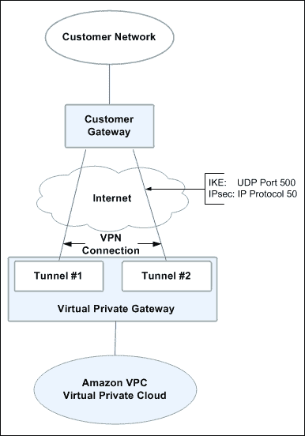

VPC 提供了一个隔离的视图，展示了 AWS 客户在 AWS 公有云中配置的所有内容。不同的用户账户可以使用 AWS **身份与访问管理（IAM）** 服务设置到 VPC 上，并可以设置自定义权限。

以下是一个 VPC 示例，展示了与一个或多个安全组映射并连接到不同子网的实例（虚拟机），这些子网通过 VPC 路由器连接：

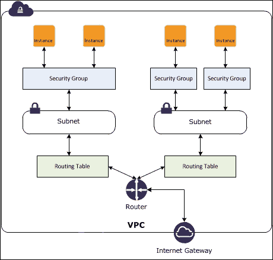

**VPC**通过将构件集成到软件中，大大简化了网络操作，并允许用户执行以下网络功能：

+   创建映射到子网的实例（虚拟机）

+   创建应用于实例的**域名系统**（**DNS**）条目

+   分配公共和私有 IP 地址

+   创建或关联子网

+   创建自定义路由

+   应用与关联的 ACL 规则的安全组

默认情况下，当一个实例（虚拟机）在 VPC 中实例化时，它将被放置在默认子网中，或者如果指定了自定义子网，则会放置在自定义子网中。

所有 VPC 在创建时都会有一个默认路由器，路由器可以添加额外的自定义路由，路由优先级也可以设置为将流量转发到特定的子网。

## 亚马逊 IP 地址分配

当一个实例在 AWS 中启动时，它将自动由**动态主机配置协议**（**DHCP**）分配一个必需的私有 IP 地址，并且还会分配一个公共 IP 和 DNS 记录，除非另有规定。私有 IP 地址用于 AWS 中的虚拟机之间的东西-东西流量路由，当虚拟机需要与同一子网上的相邻虚拟机进行通信时，而公共 IP 地址则通过互联网可用。

如果需要为实例分配一个持久的公共 IP 地址，AWS 提供了弹性 IP 地址功能，每个 VPC 账户最多可使用五个弹性 IP 地址，任何失败的实例的 IP 地址可以快速映射到另一个实例。需要注意的是，使用 AWS 时，公共 IP 地址的 DNS **生存时间**（**TTL**）传播可能需要长达 24 小时。

在吞吐量方面，AWS 实例支持 **最大传输单元** (**MTU**) 为 1,500，这可以传递给 AWS 中的实例，因此在考虑应用性能时需要考虑这一点。

## 亚马逊安全组

AWS 中的安全组是一种将许可访问控制列表（ACL）规则分组的方式，因此不允许显式拒绝。AWS 安全组充当实例的虚拟防火墙，可以与一个或多个实例的网络接口相关联。在 VPC 中，您可以将网络接口与最多五个安全组相关联，并为每个安全组添加最多 50 条规则，每个 VPC 的最大安全组数量为 500 个。AWS 账户中的 VPC 默认具有一个默认安全组，如果没有指定其他安全组，将自动应用此默认安全组。

默认安全组允许所有出站流量和来自同一 VPC 中其他使用默认安全组的实例的所有入站流量。默认安全组无法删除。自定义安全组在首次创建时不允许任何入站流量，但允许所有出站流量。

与安全组相关联的许可访问控制列表（ACL）规则控制入站流量，并可以通过 AWS 控制台（GUI）添加，如后文所示，或者可以通过 API 进行编程添加。与安全组相关联的入站 ACL 规则可以通过指定类型、协议、端口范围和源地址来添加。请参阅以下截图：

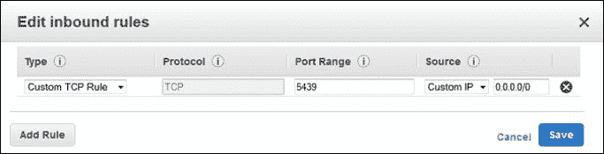

## 亚马逊区域和可用区

VPC 可以访问共享计算的不同区域和可用区，这决定了 AWS 实例（虚拟机）将部署在哪个数据中心。AWS 中的区域是完全隔离的地理区域，其中可用区是该特定区域中的独立位置，因此，可用区是区域的一个子集。

AWS 为用户提供了将资源放置在不同位置以实现冗余的能力，因为有时特定区域或可用区的健康状况可能会出现问题。因此，AWS 鼓励用户在部署生产工作负载时使用多个可用区。用户还可以选择在多个区域之间复制他们的实例和数据。

在每个独立的 AWS 区域内，存在子可用区。每个可用区通过低延迟链接与同区域的其他可用区相连。不同区域之间的所有通信都是通过公共互联网进行的，因此使用地理上距离较远的区域时会产生延迟。托管跨区域发送数据的应用时，还应考虑数据加密。

## 亚马逊弹性负载均衡

AWS 还允许在 VPC 中配置 **Elastic Load Balancing** (**ELB**) 作为附加服务。ELB 可以是内部的也可以是外部的。当 ELB 为外部时，它允许通过关联的 DNS 条目创建一个面向 Internet 的入口点，并在不同实例之间进行负载均衡。安全组会被分配给 ELB 以控制需要使用的访问端口。

下图展示了一个弹性负载均衡器，正在对 3 个实例进行负载均衡：

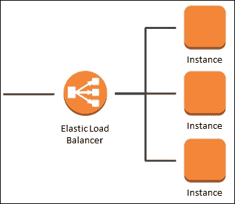

# OpenStack 的网络架构

在考虑了 AWS 网络之后，我们将探索 OpenStack 的网络架构，并查看其服务是如何配置的。

OpenStack 部署在数据中心的多个控制节点上，这些控制节点包含所有 OpenStack 服务，可以安装在虚拟机、裸机（物理）服务器或容器上。在生产环境中部署时，OpenStack 控制节点应以高度可用和冗余的方式托管所有 OpenStack 服务。

不同的 OpenStack 供应商提供不同的安装程序来安装 OpenStack。一些来自最著名的 OpenStack 发行版的安装程序示例包括 RedHat Director（基于 OpenStack TripleO）、Mirantis Fuel、HP 的 HPE 安装程序（基于 Ansible）和 Canonical 的 Juju，它们都可以安装 OpenStack 控制节点，并用作 OpenStack 工作流管理工具，帮助扩展 OpenStack 云上的计算节点。

## OpenStack 服务

安装在 OpenStack 控制节点上的核心 OpenStack 服务的详细说明如下：

+   **Keystone** 是 OpenStack 的身份服务，允许用户访问，发放令牌，并可以与 LDAP 或 Active Directory 集成。

+   **Heat** 是 OpenStack 基础设施的编排配置工具。

+   **Glance** 是 OpenStack 的镜像服务，用于存储虚拟机或裸机服务器的所有镜像模板。

+   **Cinder** 是 OpenStack 的块存储服务，允许集中式存储卷的配置，并可以将其附加到虚拟机或裸机服务器上，之后可以进行挂载。

+   **Nova** 是 OpenStack 的计算服务，用于配置虚拟机，并使用不同的调度算法来决定将虚拟机放置在哪些可用的计算节点上。

+   **Horizon** 是 OpenStack 的仪表板，用户可以通过它查看运行在租户网络中的虚拟机或裸机服务器的状态。

+   **Rabbitmq** 是 OpenStack 的消息队列系统。

+   **Galera** 是用于存储 OpenStack 数据的数据库，它存储所有 Nova（计算）和 Neutron（网络）数据库中的虚拟机、端口和子网信息。

+   **Swift** 是 OpenStack 的对象存储服务，可以作为一个冗余的存储后端，在多个服务器上存储对象的复制副本。Swift 与传统的块存储或文件存储不同；对象可以是任何非结构化数据。

+   **Ironic** 是 OpenStack 的裸金属配置服务。最初是 Nova 代码库的一个分支，它允许将镜像部署到裸金属服务器，并使用 IPMI 和 ILO 或 DRAC 接口来管理物理硬件。

+   **Neutron** 是 OpenStack 的网络服务，包含 ML2 和 L3 代理，并允许配置网络子网和路由器。

就 Neutron 网络服务而言，Neutron 架构在结构上与 AWS 非常相似。

### 注意

关于 OpenStack 服务的有用链接可以在以下位置找到：

[`docs.openstack.org/admin-guide/common/get-started-openstack-services.html`](http://docs.openstack.org/admin-guide/common/get-started-openstack-services.html)

[`www.youtube.com/watch?v=N90ufYN0B6U`](https://www.youtube.com/watch?v=N90ufYN0B6U)

## OpenStack 租户

一个项目，在 OpenStack 中通常被称为租户，提供一个团队在 OpenStack 云中所部署的所有资源的隔离视图。然后，可以通过 Keystone 身份服务为一个项目（租户）设置不同的用户帐户，Keystone 可以与 **轻量目录访问协议**（**LDAP**）或 Active Directory 集成，支持可定制的权限模型。

## OpenStack Neutron

OpenStack Neutron 执行 OpenStack 中的所有网络功能。

以下网络功能由 OpenStack 云中的 Neutron 项目提供：

+   创建与网络映射的实例（虚拟机）

+   使用内建的 DHCP 服务分配 IP 地址

+   DNS 条目从命名服务器应用到实例

+   分配私有 IP 地址和浮动 IP 地址

+   创建或关联网络子网

+   创建路由器

+   应用安全组

OpenStack 被设置为其 **模块化第二层**（**ML2**）和 **第三层**（**L3**）代理，这些代理配置在 OpenStack 控制节点上。OpenStack 的 ML2 插件允许 OpenStack 与使用 Open vSwitch 或 Linux Bridge 的交换机厂商集成，并充当一个与交换机厂商无关的插件，因此厂商可以创建插件，使其交换机与 OpenStack 兼容。ML2 代理在 hypervisor 上运行，通过 **远程过程调用**（**RPC**）与计算主机服务器进行通信。

OpenStack 计算主机通常使用一个 hypervisor 部署，该 hypervisor 使用 Open vSwitch。大多数 OpenStack 厂商发行版在其参考架构中默认使用 KVM hypervisor，因此这一组件由所选的 OpenStack 安装程序在每个计算主机上进行部署和配置。

OpenStack 中的计算主机连接到 STP 三层模型的接入层，或者在现代网络中连接到 Leaf 交换机，VLAN 与每个单独的 OpenStack 计算主机相连接。租户网络随后用于提供租户之间的隔离，并使用 VXLAN 和 GRE 隧道连接第二层网络。

Open vSwitch 在 KVM hypervisor 上的内核空间运行，并通过使用从交换机推送流数据的 OpenStack 安全组管理防火墙规则。 neutron L3 代理允许 OpenStack 在租户网络之间进行路由，并使用在租户网络内部部署的 neutron 路由器来完成此操作，没有 neutron 路由器，网络将彼此隔离以及其他所有内容。

## 配置 OpenStack 网络

在 Project（租户）网络中使用 neutron 设置简单网络时，将配置两个不同的网络，即内部网络和外部网络。内部网络用于实例之间的东西流量。如下所示在适当的**网络名称**下使用地平线仪表板创建：

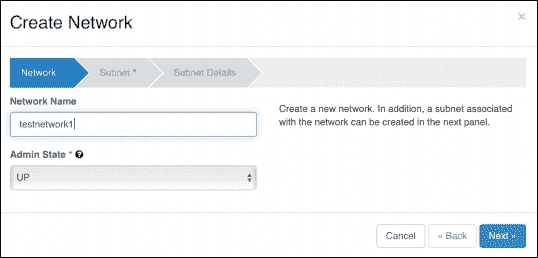

**子网名称**和子网范围随后在**子网**部分指定，如下截图所示：

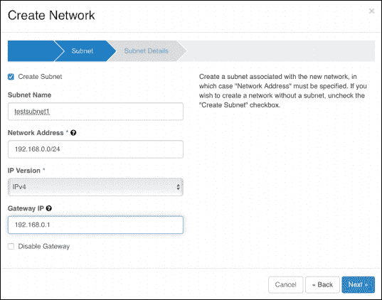

最后，在网络上启用 DHCP，并选择性配置任何名为**分配池**（指定子网中可用地址范围的名称）以及任何名为**DNS 名称服务器**，如下所示：

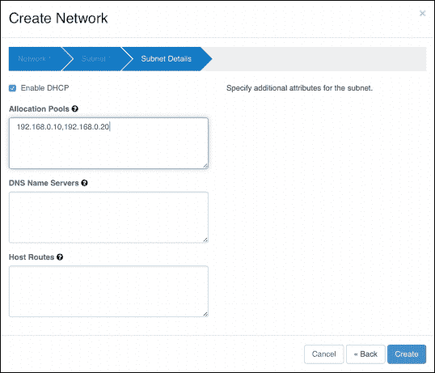

还需要创建外部网络，以便从 OpenStack 外部访问内部网络，当由管理员用户创建外部网络时，需要选择设置**外部网络**复选框，如下一截图所示：

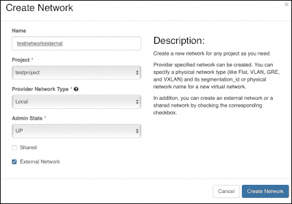

然后在 OpenStack 中创建路由器以路由数据包到网络，如下所示：

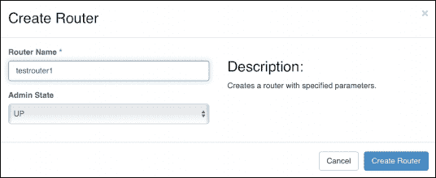

创建的路由器随后需要与网络关联；通过为私有网络上的路由器添加接口来实现，如下截图所示：

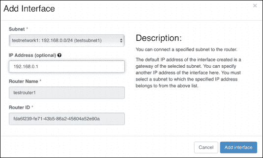

创建的**外部网络**随后需要设置为路由器的网关，如下截图所示：

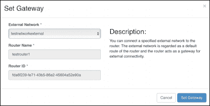

这样就完成了网络设置；内部和外部网络的最终配置如下所示，显示了一个连接到内部和外部网络的路由器：

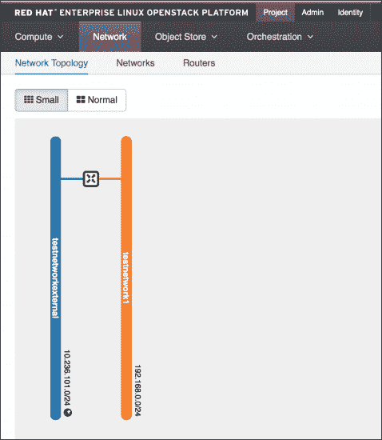

在 OpenStack 中，通过选择部署实例时选择私有网络 NIC 将实例配置到内部私有网络。 OpenStack 有一个公共 IP 地址池（浮动 IP）的分配约定，用于需要在 OpenStack 外部可路由的实例。

为设置一组浮动 IP 地址，OpenStack 管理员将使用来自外部网络的分配池来设置分配池，如下截图所示：

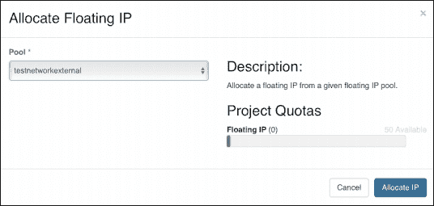

与 AWS 类似，OpenStack 使用安全组来设置实例之间的防火墙规则。与 AWS 不同，OpenStack 支持传入和传出的 ACL 规则，而 AWS 允许所有的出站通信，OpenStack 可以同时处理传入和传出的规则。根据需要创建定制的安全组，以便对 ACL 规则进行分组，如下所示：

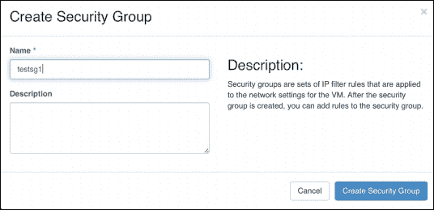

然后可以针对安全组创建传入和规则。**SSH** 访问被配置为针对父安全组的 ACL 规则，该规则被推送到 Open VSwitch 内核空间中的每个虚拟化主机，如下图所示：

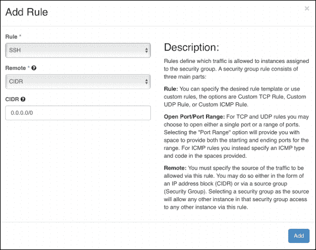

一旦项目（租户）拥有两个网络，一个内部网络和一个外部网络，并且配置了适当的安全组，实例就可以在私有网络上启动。

通过在 Horizon 中选择**启动实例**并设置以下参数来启动实例：

+   **可用区**

+   **实例名称**

+   **规格**（CPU、RAM 和磁盘空间）

+   **镜像名称**（基础操作系统）

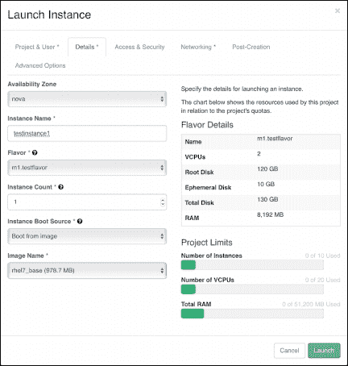

然后选择私有网络作为实例的**NIC**，并在**网络**选项卡下进行配置：

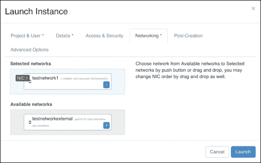

这意味着当实例启动时，它将使用 OpenStack 的内部 DHCP 服务从分配的子网范围中选择一个可用的 IP 地址。

还应该选择一个安全组来管理实例的 ACL 规则；在这个例子中，选择了 `testsg1` 安全组，如下图所示：

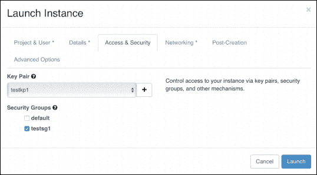

一旦实例已配置完成，可以从外部网络关联一个浮动 IP 地址：

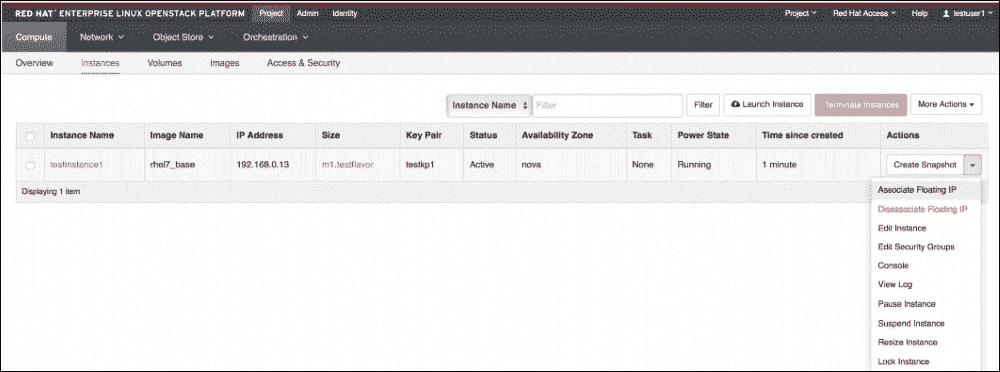

然后，从外部网络浮动 IP 地址池中选择一个浮动 IP 地址，并将其与实例关联：

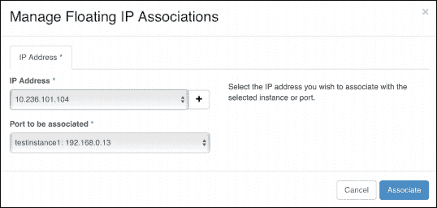

浮动 IP 地址将 OpenStack 部署在内部公网 IP 地址上的实例通过 NAT 映射到外部网络的浮动 IP 地址，从而允许实例从 OpenStack 外部访问。

## OpenStack 区域和可用区

与 AWS 一样，OpenStack 在实例创建时也使用区域和可用区。OpenStack 中的计算主机（虚拟化主机）可以被分配到不同的可用区。

在 OpenStack 中，可用区只是计算资源的虚拟划分。可用区可以进一步细分为主机聚合。需要注意的是，一个计算主机只能分配给一个可用区，但可以是同一可用区中多个主机聚合的一部分。

Nova 使用一个名为**Nova 调度器规则**的概念，规定了实例在资源配置时如何在计算主机上进行部署。Nova 调度器规则的一个简单例子是 `AvailabilityZoneFilter` 过滤器，意味着如果用户在配置时选择了一个可用性区，那么实例将只会被部署到该可用性区下的任意计算实例上。

另一个例子是 `AggregateInstanceExtraSpecsFilter` 过滤器，意味着如果一个自定义的 flavor（CPU、RAM 和磁盘）被标记为某个键值对，且一个主机聚合被标记为相同的键值对，那么如果用户使用该 flavor 部署，`AggregateInstanceExtraSpecsFilter` 过滤器将会把所有实例放置在该主机聚合下的计算主机上。

这些主机聚合可以分配给特定团队，这意味着团队可以选择性地决定与哪些应用共享其计算资源，同时也可以用来防止“噪声邻居”问题。OpenStack 提供了多种过滤器，允许以不同的顺序应用来决定实例调度。OpenStack 使得云操作员可以创建一个传统的云模型（有大量竞争资源的计算），也可以创建更为定制化的使用场景，在这些场景中需要为特定应用工作负载隔离计算资源。

以下示例显示了带有组的主机聚合，并展示了一个名为**1-Host-Aggregate**的主机聚合，归类在名为**DC1**的**可用性区**下，包含两台计算主机（hypervisors），它们可以分配给特定团队：

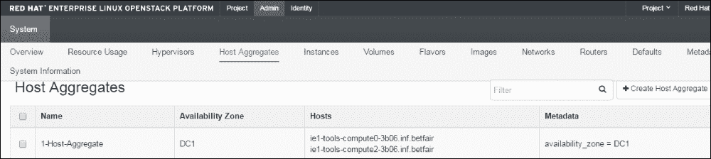

## OpenStack 实例资源配置工作流。

当在 OpenStack 中配置实例（虚拟机）时，将执行以下高级步骤：

+   Nova 计算服务将使用从 glance 镜像服务中选择的镜像发出请求以创建新的实例（虚拟机）。

+   Nova 请求可能会先通过**RabbitMQ**排队，然后才会被处理（RabbitMQ 使得 OpenStack 能够处理多个同时的资源配置请求）。

+   一旦新实例的请求被处理，该请求将在 Nova Galera 数据库中写入一个新行。

+   Nova 将查看在 OpenStack 控制节点上定义的 Nova 调度器规则，并使用这些规则将实例部署到一个可用的计算节点（KVM hypervisor）。

+   如果找到一个符合 Nova 调度器规则的可用 hypervisor，则资源配置过程将开始。

+   Nova 将检查所选 hypervisor 上是否已经存在镜像。如果不存在，镜像将从 hypervisor 转移并从本地磁盘启动。

+   Nova 将发出一个 Neutron 请求，这将创建一个新的 VPort 并将其映射到 Neutron 网络。

+   然后，VPort 信息将被写入 Nova 和 Neutron 数据库中的 Galera，以将实例与网络关联。

+   Neutron 将发出 DHCP 请求，从它所关联的子网中分配一个私有 IP 地址给实例。

+   随后，将分配一个私有 IP 地址，并且实例将开始在私有网络上启动。

+   随后，将联系 neutron 元数据服务以检索云初始化信息，并在启动时从指定的命名服务器为实例分配 DNS 条目（如果已指定）。

+   一旦 cloud-init 运行完毕，实例将准备就绪。

+   然后，可以为实例分配浮动 IP，以通过网络地址转换（NAT）访问外部网络，使实例能够公开访问。

## OpenStack LBaaS

像 AWS 一样，OpenStack 也提供**负载均衡即服务**（**LBaaS**）选项，允许将传入请求均匀地分配到指定的实例，使用**虚拟 IP**（**VIP**）。LBaaS 所支持的功能和特性取决于所使用的厂商插件。

OpenStack 中流行的 LBaaS 插件包括：

+   Citrix NetScaler

+   F5

+   HaProxy

+   Avi networks

这些负载均衡器向 OpenStack LBaaS 代理暴露不同程度的特性。利用 OpenStack 的 LBaaS 的主要驱动因素是，它允许用户将 LBaaS 作为负载均衡解决方案的中介，用户可以通过 OpenStack API 或通过 Horizon GUI 配置负载均衡器。

LBaaS 允许在 OpenStack 的租户网络中设置负载均衡。使用 LBaaS 意味着，如果用户出于某种原因希望使用新的负载均衡厂商而不是现有厂商，只要他们使用 OpenStack LBaaS，这一过程就变得更加简单。由于所有调用或管理都是通过 LBaaS 的 API 或 Horizon 进行的，因此不需要修改用于配置和管理负载均衡器的编排脚本，也不会绑定到每个厂商的自定义 API 中，负载均衡解决方案就成为了一种商品化的服务。

# 总结

在本章中，我们介绍了一些现代数据中心中使用的基本网络原理，特别关注了 AWS 和 OpenStack 云技术，这两者是当前最流行的解决方案之一。

阅读完本章后，你应该已经了解了 Leaf-Spine 与 Spanning Tree 网络架构的区别，理解了 AWS 网络架构，并对如何在 OpenStack 中配置私有网络和公共网络有了基本的了解。

在接下来的章节中，我们将基于这些基础网络结构，探讨如何使用配置管理工具以编程方式控制它们，并利用这些工具自动化网络功能。但首先，我们将关注一些软件定义网络控制器，这些控制器可用于进一步扩展 OpenStack 在私有云中相较于 neutron 的功能，以及它们带来的一些特性和优势，帮助简化网络运维管理。

### 注意

亚马逊内容的有用链接包括：

[`aws.amazon.com/`](https://aws.amazon.com/)

[`www.youtube.com/watch?v=VgzzHCukwpc`](https://www.youtube.com/watch?v=VgzzHCukwpc)

[`www.youtube.com/watch?v=jLVPqoV4YjU`](https://www.youtube.com/watch?v=jLVPqoV4YjU)

OpenStack 内容的有用链接包括：

[`wiki.openstack.org/wiki/Main_Page`](https://wiki.openstack.org/wiki/Main_Page)

[`www.youtube.com/watch?v=Qz5gyDenqTI`](https://www.youtube.com/watch?v=Qz5gyDenqTI)

[`www.youtube.com/watch?v=Li0Ed1VEziQ`](https://www.youtube.com/watch?v=Li0Ed1VEziQ)
