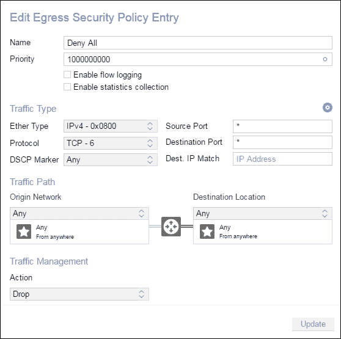
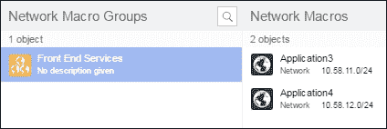

# 第二章 软件定义网络的出现

本章将讨论开放协议的出现，这些协议帮助了**软件定义网络**（**SDN**）解决方案。它将重点介绍 Nuage VSP SDN 解决方案，这是诺基亚（前身为阿尔卡特朗讯）提供的 SDN 平台，允许用户创建虚拟覆盖网络。我们将了解 Nuage VSP 在扩展性方面相对于 AWS 和 OpenStack 的开箱体验所提供的一些优势和特点。它将阐述这些网络解决方案为什么成为著名复杂私有云网络的必需品，通过简化网络结构并通过提供一套可编程 API 和 SDK 来帮助网络自动化。

本章将详细讨论以下主题：

+   为什么 SDN 解决方案是必要的

+   Nuage SDN 解决方案的工作原理

+   OpenStack 与 Nuage VSP 平台的集成

+   Nuage VSP 软件定义对象模型

+   Nuage VSP 如何支持 Greenfield 和 Brownfield 项目

+   Nuage VSP 的多播支持

# 为什么 SDN 解决方案是必要的

SDN 解决方案是必要的，因为它们使企业能够简化网络操作，同时还可以实现网络功能的自动化。它与 DevOps 倡议和使网络操作更灵活的需求非常契合。

SDN 的副产品是，它使得网络功能变得像在虚拟机监控器上创建新虚拟机一样精确且可重复。

来自供应商的 SDN 解决方案由一个集中式控制器组成，该控制器被实现为网络的神经中枢。SDN 控制器在很大程度上依赖于**Open vSwitch 数据库**（**OVSDB**），这是一种可编程的开放标准模式，利用 OpenFlow 协议，直接与交换机集成，用于路由网络中的数据包，并将 ACL 策略应用于特定的虚拟机、物理服务器或容器。

只要交换机能够支持 OVSDB 和 OpenFlow，就可以与常见的 SDN 控制器集成。目前市场上有各种各样的 SDN 控制器：

+   CISCO ACI

    [`www.cisco.com/c/en/us/solutions/data-center-virtualization/application-centric-infrastructure/index.html`](http://www.cisco.com/c/en/us/solutions/data-center-virtualization/application-centric-infrastructure/index.html)

+   诺基亚 Nuage VSP

    [`www.nuagenetworks.net/products/virtualized-services-platform/`](http://www.nuagenetworks.net/products/virtualized-services-platform/)

+   Juniper Contrail

    [`www.juniper.net/uk/en/products-services/sdn/contrail/`](http://www.juniper.net/uk/en/products-services/sdn/contrail/)

+   VMWare NSX

    [`www.vmware.com/products/nsx.html`](http://www.vmware.com/products/nsx.html)

+   Open Daylight

    [`www.opendaylight.org/`](https://www.opendaylight.org/)

+   MidoNet Midokura

    [`www.midokura.com/midonet/`](http://www.midokura.com/midonet/)

SDN 控制器为企业做以下事情：

+   为网络功能提供一个易于使用的解决方案，SDN 控制器将网络功能从硬件设备中抽象出来，而是暴露图形用户界面（GUI）和 API 端点，可以通过编程方式进行修改以控制网络操作。

+   SDN 控制器适用于 DevOps 模型，例如为开发人员提供自服务的网络操作，允许持续交付网络功能并增加团队间的协作。

+   提供更高的网络配置可见性，并通过易于理解的软件构造进行描述。

+   通过使用开放的网络标准提供更好的基础设施集成，这使得公司在选择集成的交换机厂商时有了更多选择。

+   允许在私有数据中心应用相同的策略，并跨私有和公有云进行应用。这使得将不同工作负载分配到不同云服务提供商的目标成为现实，并使得混合云的安全治理对于安全团队来说更加容易。

AWS 的出现无疑影响了网络厂商，使他们的解决方案更加注重软件方法，而非硬件，这反过来简化了网络操作，并使网络更容易扩展。

厂商现在已采用并实现开放协议，以允许集中管理网络功能，并使网络运营商能够使用 SDN 控制器管理整个网络。

企业正在使用软件定义网络（SDN）来最大化其网络性能，并创建可重复的网络操作工作流，就像虚拟化技术帮助基础设施团队自动化服务器配置和管理一样。

然而，根据我的个人经验，私有云中的软件定义网络被用于大规模运行 OpenStack。许多大型公司（如 Walmart、Ebay、PayPal、Go Daddy 以及我的公司 Paddy Power Betfair）不断采用 OpenStack 项目，这意味着公司正在转向 SDN 解决方案，以便达到必要的扩展目标并简化网络操作。

# Nuage SDN 解决方案如何工作

市场领先的 SDN 解决方案之一是 Nuage SDN（VSP）平台，它是诺基亚的 SDN 解决方案（前身为阿尔卡特朗讯），因此我们将探索这种市场领先的 SDN 解决方案是如何工作的。

Nuage VSP 平台包含三个主要组件——VSD、VSC 和 VRS。

+   **虚拟化服务目录**（**VSD**）：这是整个平台的策略引擎，提供图形用户界面，并暴露一个 restful API 供网络工程师使用和与网络功能进行交互。

+   **虚拟化服务控制器**（**VSC**）：这是 Nuage 的 SDN 控制器，使用 OpenFlow 和 OVSDB 管理协议将交换和路由信息分发给虚拟机监控器、裸金属服务器或容器。

+   **虚拟路由与交换**（**VRS**）：这是 Nuage 定制版本的 Open vSwitch，安装在计算节点（虚拟化主机）上。

Nuage VSP 可以与 OpenStack、CloudStack 和 VMWare 私有云平台或公共云解决方案（如 AWS）集成。Nuage 创建了一个覆盖网络，能够在隔离的租户网络中保护虚拟机、裸金属服务器和容器，因此根据需要部署的工作负载类型，具有高度的灵活性。

虚拟机当然是在物理虚拟化主机上作为虚拟抽象进行部署的，容器可以在虚拟机或物理服务器上运行。容器用于通过 Linux 命名空间和控制组隔离特定的进程或资源，这些命名空间和控制组在操作系统级别划分资源，因此虚拟机和容器的网络要求非常不同。容器因其可移植性而被使用，可以在虚拟机或裸金属（物理）服务器上运行。另一个优点是它们被 Linux 操作系统封装，多个容器可以在虚拟机或物理服务器上运行。

Nuage 还支持通过虚拟化主机或物理机在基础网络中路由多播流量，并将其泛洪到租户网络中的特定虚拟或物理机器，从而实现租户网络之间的多播。这在云解决方案中一直是一个问题，但 Nuage 提供了针对这一问题的解决方案。

Nuage VSP 的 SDN 控制器（VSC）通过硬件 VTEP（由交换机在网络的接入或叶层暴露）与交换机通过 OVSDB 集成。VSC 被冗余部署，并通过**多路径边界网关协议**（**MP-BGP**）与彼此通信，并将 VXLAN 封装程序编程到交换机上，因为它们是硬件 VTEP 识别的。

VSD 组件在一个包含三台 VSD 服务器的活动集群中设置，这些服务器通过可行的负载均衡器解决方案进行负载均衡。负载均衡器提供一个**虚拟 IP**（**VIP**），通过轮询模式对三台 VSD 服务器进行负载均衡。

VSD 的 VIP 提供 Nuage VSP 平台的图形用户界面，并作为 API 入口点，允许通过 REST 调用程序化控制覆盖网络。对 Nuage VSD GUI 执行的任何操作都会触发一个 REST API 调用到 VSD，因此 GUI 和 REST API 执行的是相同的程序化调用，所有操作都通过 REST API 公开。

Nuage VSD 管理第二层和第三层的域、区域、子网和 ACL 策略。VSD 使用**可扩展消息和存在协议**（**XMPP**）将策略信息传递给 VSC，VSC 使用 OpenFlow 将流信息推送到计算主机（虚拟化主机）上的定制版 Open vSwitch（VRS），以为应用程序创建防火墙策略。

Nuage VSP 还允许裸金属服务器通过将 OpenFlow 数据推送到**虚拟化服务网关**（**VSG**）并将路由信息泄漏到覆盖网络中，连接到覆盖网络。

以下图表概述了 VSP 平台协议集成：


# 将 OpenStack 与 Nuage VSP 平台集成

私有数据中心网络可能非常复杂，因此使用标准的 OpenStack Neutron 来满足所有用例可能无法提供所需的所有功能。需要注意的是，Neutron 中的功能随着每个新的 OpenStack 版本的发布而快速成熟，因此未来 Neutron 可能会与专用的 SDN 控制器一样功能丰富。

Neutron 通过提供 REST API 扩展，便于与 SDN 控制器集成，因此如果需要提供非常丰富的网络功能，SDN 控制器可以轻松地用来扩展 Neutron 提供的基础网络功能。

SDN 解决方案的使用帮助 OpenStack 实现了大规模扩展，因为它将 OpenStack 的网络方面从集中式的 L3 代理移开，转而将请求发送到专用的 SDN 控制器，并实现分布式防火墙功能。

这意味着一个 OpenStack 云可能会横向扩展支持的计算实例数量，而无需担心与当前 Neutron 网络架构相关的瓶颈或扩展问题。

OpenStack 是最受欢迎的私有云解决方案之一，Nuage VSP 平台通过 Nuage 插件与 OpenStack 集成。Nuage 插件安装在每个**高可用**（**HA**）OpenStack 控制器上。

在控制器上，Neutron ML2 和 L3 代理都被关闭，取而代之的是 Nuage 插件。下图展示了 OpenStack Neutron 的 SDN 控制器框架架构，其中 SDN 控制器通过 REST API 调用与 OpenStack Neutron 进行通信：


VSD，作为 Nuage 策略引擎，通过设置网络分区与 OpenStack 集成，网络分区可用于将一个 Nuage VSP 映射到 OpenStack 云，并通过 REST API 调用与 Neutron 进行通信。

通过使用网络分区，多个 OpenStack 实例可以映射到单一的 Nuage VSP。网络分区是一种方式，用来告诉 Nuage VSP 平台将哪个 OpenStack 实例映射到其子网，并等待发出 VPort 命令，这些命令表示 OpenStack nova 计算服务已经配置了需要由 Nuage ACL 策略管理的虚拟机实例。

当 Nuage VSP 与 OpenStack 集成时，OpenStack 厂商安装程序需要原生支持 Nuage，或者安装程序需要稍作定制，以便在 OpenStack 控制器上安装 Nuage 插件。每个部署在 OpenStack 云中的计算节点（虚拟化主机）上也需要安装 Nuage 版本的 OpenvSwitch（VRS）。

Nuage 插件通过以下工作流程与 OpenStack 控制器和 KVM 计算进行集成：


当发出一个 neutron 命令到 OpenStack 时，Nuage 插件使用 **REST API** 调用与 **Nuage** **VSD** 通信，告知已创建新的网络或在该网络上创建了新的 VPort，这得益于 neutron 的 SDN 控制器可插拔 **REST API** 架构。

**Nuage** **VSD** 策略引擎然后与 **VSC** 通信，通过 XMPP 推送流数据。**VSC**（SDN 控制器）随后将流数据（OpenFlow）管理到 **Nuage VRS**（Open vSwitch），并且 **Nuage VRS** 使用预定义的防火墙策略保护 OpenStack 虚拟机或物理服务器。

防火墙策略可以是 OpenStack 安全组或 Nuage ACL 规则，具体取决于选择了 OpenStack 管理模式还是 Nuage VSD 管理模式。

## Nuage 或 OpenStack 管理的网络

Nuage OpenStack 插件可以在两种操作模式下使用，以管理在 OpenStack 中配置的网络：

+   Nuage VSD 管理模式

+   OpenStack 管理模式

Nuage VSD 管理模式允许 Nuage 成为网络配置的主控；这使得 Nuage VSP 平台可以提供丰富的功能集来管理 OpenStack 环境中的网络。网络功能通过 VSD 直接配置，使用 Nuage REST API 通过 GUI 或直接 API 调用进行，并与 OpenStack 子网一对一映射。

另一种操作模式是 OpenStack 管理模式，该模式不需要在 VSD 上进行直接配置。所有命令通过 neutron 发出；但是，功能仅限于 OpenStack neutron 支持的命令。

所有在 Nuage 中创建的网络都在 OpenStack 中以一对一的映射方式复制，其中 Nuage VSD 在 VSD 管理模式下作为主控，而 OpenStack neutron 在 OpenStack 管理模式下作为配置主控。

在 OpenStack 管理模式下，所有的 ACL 规则由 OpenStack 安全组控制，而在 VSD 管理模式下，ACL 规则由 Nuage VSD 控制，并且安全组被禁用。

Nuage 通过设置网络分区与 OpenStack 集成。通过网络分区，单个 Nuage VSP 平台可以映射到多个 OpenStack 实例。网络分区是将 OpenStack 云映射到 Nuage 组织实体的方式。

使用 Nuage VSP 平台并命名组织为`Company`时，每当在组织下创建一个子网时，它会在创建时被分配一个唯一的`nuage_subnet_uuid`。为了将组织和 Nuage 子网映射到 OpenStack Neutron，发出以下命令：

```
neutron subnet-create "Subnet Application1" 10.102.144.0/24 --nuagenet nuage_subnet_uuid --net-partition "Company" --name "Subnet Application1"
```

一旦通过 Nuage VSP 平台和 OpenStack 建立了网络分区，防火墙策略会通过 Nuage VRS 在计算主机（虚拟化服务器）上得到保障。当在 Nuage 管理的子网中创建新实例时，会触发以下工作流：

Nuage 或 OpenStack 管理的网络

1.  一个实例被添加到一个由 Nuage VSP 平台拥有的 OpenStack 网络和子网中。

1.  一个占位符 VPort（虚拟机 ID，MAC 地址）由**Nuage 插件**在请求的第三层域内创建于**VSD**上。

1.  Nova 服务在**Hypervisor**上创建**虚拟机**。这被**VRS**（虚拟机 ID，MAC 地址）检测到。

1.  **VRS**查询**VSC**，然后**VSC**查询**VSD**以从占位符 VPort 中检索相关的网络信息。

1.  **VSD**根据虚拟机 ID、MAC 地址与其创建的 VPort 进行匹配，并将**虚拟机**与正确的网络服务关联。

1.  策略通过**VSD**通过**VSC**下载到**VRS**，使用 OpenFlow，所需的流将动态创建。

## Nuage VSP 软件定义对象模型

由于 Nuage 在软件中创建了覆盖网络，它需要一个简单的对象模型来让网络管理员进行管理。Nuage VSP 软件定义对象模型提供了一个网络的图形化层级结构，使得覆盖结构能够被轻松查看和审计。

### 对象模型概览

+   **组织**：它管理所有的第三层域。对象模型概览

+   **第三层域模板**：在创建子第三层域之前，需要一个第三层域模板。第三层域模板用于管理所有子第三层域将传播的整体默认策略。如果在模板级别更新了第三层域模板，那么该更新会立即在其下已创建的所有第三层域上实施。对象模型概览

+   **第三层域**：这可以用来划分不同的环境，以便用户无法从第三层测试域下部署的子网跳跃到相邻的第三层生产域。对象模型概览

+   **区域**：一个区域在应用层面上划分防火墙策略，因此每个微服务应用可以有自己的区域，并且每个第三层域可以有各自的 Ingress 和 Egress 策略。对象模型概览

+   第三层子网：这是虚拟机或裸金属服务器被部署的地方。

    在此示例中，我们看到**子网应用 1**和**子网应用 2**，如下所示：

    对象模型概览

Nuage VSD 中的层级结构如下所示：

+   创建了名为 **Company** 的一个组织。

+   创建了名为 **Test** 和 **Production** 的两个层 3 域在公司之下。

+   **Test** 层 3 区域具有 **Application1** 和 **Application2** 的区域，**Application1** 和 **Application2** 区域下各有 1 个子网。

+   **Production** 层 3 区域具有 **Application1** 和 **Application2** 的区域，**Application1** 下只有 1 个子网。**Application2** 区域目前没有子网。

出于安全和合规目的，向安全审计人员展示 **开发** 和 **生产** 环境之间的分隔非常重要。通常情况下，**开发** 环境不会应用与生产环境一样严格的控制。生产应用可以使用最小权限的约定进行安全保护，以最大程度地减少访问并降低安全漏洞的可能性。

Nuage VSP 平台可以使用其层 3 域模板结构设置环境之间的分隔。域模板可以设置默认的 **拒绝所有** 策略在入口和出口级别。这是所有策略中优先级最高的策略，将明确拒绝所有数据包无论协议是入站还是出站连接，除非对该特定应用程序的策略明确允许。默认的 **拒绝所有** 是应用于应用程序的 ACL 规则列表中的底部策略。

域模板上的 **出口安全策略** 显示为以下的 **底部策略**：


**出口安全策略** 的内容显示为具有最高可能优先级，如下所示：



同样，入口的明确禁用被应用到域模板作为 **底部策略**：


虽然域模板上的 **入口安全策略** 明确禁用如下所示：


应用于域模板 **Company L3 Domain Template** 的默认入口和出口策略如下图所示，显示应用于所有子层 3 域，例如 **Production** 和 **Test**。

域模板 **Company L3 Domain Template** 被显示链接到子层 3 域 **Production** 和 **Test**，显示从域模板继承的出口策略：


同样，域模板 **Company L3 Domain Template** 被链接到子层 3 域 **Production** 和 **Test**，显示从域模板继承的入口策略：


需要注意的是，由于使用 OpenFlow 将策略推送到 VRS，Nuage 中的入口和出口的 ACL 规则遵循以下原则：

+   **出口**：这是一个数据包从 VRS 流向子网或区域。

+   **入口**：这是一个数据包从子网或区域流向 VRS。

举个例子，一个出口 ACL 规则将指定来自 VRS 的任何出口流量从端口 `80` 将被转发到 **子网 Application1**：


在这个示例中，一个入口 ACL 规则将指定任何入口流量可以从端口 `80` 离开 **子网 Application1** 并转发到 VRS：


如果应用程序所有者遵循这样的原则：他们的应用程序部署所在的第 3 层子网，总是作为源或目的出现在各自应用程序策略的 ACL 规则中，那么一个应用程序的 ACL 规则将只存在于该自包含的策略中。如果遵循这一概念，它使得每个应用程序的 ACL 规则能够封装在独立的策略中，在第 3 层域内，这反过来意味着，安全团队审计这些规则将变得更加简便。这也意味着应用程序遵循最小权限原则，仅开放必要的端口以便应用程序之间通信，并且对那些不符合规则的流量施加显式丢弃。

显示了两项策略，分别适用于两个应用程序，**Application1** 和 **Application2**，它们分别有入口和出口的独立策略，**默认入口策略**指定对任何未显式允许的流量进行显式丢弃。

**入口安全策略**如下所示：


**出口安全策略**如下所示：


Nuage VSP 平台的第 3 层域模板允许使用区域进行第二级分段，因此传统的网络被划分为三个区域，其中应用程序将部署在以下层级：

+   前端

+   业务逻辑

+   后台

随着微服务架构的崛起，每个应用程序的配置文件并不总是适应这三种广泛的配置文件。有时，应用程序既可以是前端应用程序，也可以是业务逻辑应用程序，那么这种微服务应用程序应该如何放置在传统的三层架构中呢？

与可以在区域级别应用的前端、业务逻辑和后台分隔策略不同，应用程序之间在每个子网间的有意义微分段成为可能。那么，这如何在 Nuage 中实现呢？

如果一个应用程序希望与另一个应用程序进行通信，它将拥有一个 ACL 规则，指定子网到区域的通信，以便在第 3 层域中相邻子网上的应用程序之间进行东西向通信。Nuage 通过允许应用程序进行子网到区域的通信来实现这一点。


为了允许这种通信，**Application1**可以具有 ACL 策略，允许**Application2**区域允许流量进入`22`端口的子网，实现东西向通信，因此无论使用多少不同的子网，**Application1**都将始终能够与位于**Application2**区域下的任何应用程序进行通信。


在安全策略方面，这使得开发和安全团队能够通过查看应用程序策略了解哪些应用程序正在相互通信以及它们使用的端口。


# Nuage VSP 平台如何支持绿地和棕地项目

覆盖网络通常作为新的网络（绿地）站点进行设置，但单独的全新网络是没有用的，除非计划进行一次性的大规模迁移，将所有应用程序从遗留网络迁移到新网络。

如果选择阶段性应用程序迁移，仅将部分应用程序迁移到新网络中，那么新的覆盖网络将需要与遗留网络进行通信，并要求在棕地环境中运行。

棕地环境通常意味着应用程序会分阶段迁移到新平台，而不是一次性全部迁移，这有助于增加对新网络及其相关技术的信心。在将应用程序迁移到新平台时，通常需要在新网络中对迁移后的应用程序进行性能测试，之后才会将现有遗留网络的实时流量转移到迁移到新覆盖网络中的应用程序。

阶段性迁移的一个主要要求是要连接回遗留网络，以便处理托管在其中的应用程序依赖关系。这种连接是必要的，以便迁移后的应用程序能够有效运行。

Nuage VSP 平台使用其**虚拟化服务网关**（**VSG**）提供新覆盖网络和遗留网络之间的连接。两台 Nuage VSG 在虚拟底盘模式下冗余连接，并连接到位于遗留网络中路由器上的接口。VSG 根据从连接路由器接口的 VLAN 进入的数据包的目标 IP 执行路由表查找；然后它更新目标 MAC 地址为下一个跳跃地址，并将数据包转发到相应的 VXLAN 段。所有数据包都通过基础网络从遗留网络路由到 VSG。

这将新覆盖网络和遗留网络通过 VXLAN 终结于 VSG 进行连接。

以下是 Nuage VSD 中的一对活动 VSG：


Nuage VSG 通过将路由泄露到覆盖网络来允许与传统网络进行通信。每个 VSG 将使用 BGP 会话接收并通告 IPv4 路由，当使用叶脊拓扑结构并使用 iBGP 时，此 BGP 会话将在 VSG、VSC 和叶交换机之间建立。

VSG 必须将其本地系统 IP 通告给传统网络中的路由器，并且所有从本地网络接收到的路由将随后通过下层网络泄露到覆盖网络中的选定层 3 域。

在 Nuage VSP 平台中，泄露路由所需的设置是创建一个**GRThubDomain**层 3 域。在这个示例中，主机接口连接到传统网络中的前端、业务逻辑和后端路由器：


然后，Nuage VSP 平台允许将新创建的**GRThubDomain**与**Production**或**Test**层 3 域相关联，通过将泄露域与它们相关联。

在下面的示例中，**GRThubDomain**与**Production**层 3 域相关联。

在 Nuage GUI 中，泄露域通过以下图标显示，显示的是一个名为**GRThubDomain**的泄露域：


具有关联泄露域的生产域在 Nuage GUI 中显示如下：


泄露域的关联允许 Nuage VSP 平台通过下层网络将路由从传统网络泄露到新覆盖网络中，这意味着覆盖网络中的应用程序可以与传统网络中的应用程序进行通信，只要它们具有适当的 Ingress 和 Egress ACL 策略。

如前所述，**Test**和**Production**层 3 域有一个**Deny All**规则，用于 Ingress 和 Egress，这是**公司 L3 域模板**的一部分。因此，尽管所有路由都泄露到覆盖网络中，但除非明确说明，否则它们会被 VRS 丢弃。

Nuage VSP 平台具有应用 ACL 规则的能力，针对从外部传统网络泄露的路由，使用一种名为**网络宏**的概念。在 Nuage VSP 平台中，网络宏只是外部网络范围的一个花哨名称。

如果一个应用程序，**Application3**就是其中之一，位于传统网络中，并且它的路由已经通过**GRThubDomain**泄露域并泄露到**Test**层 3 域中，那么可以设置一个网络宏来描述所需的范围，并通过 Nuage ACL 规则隔离与之的连接。

在此实例中，网络范围`10.58.11.0/24`是**Application3**所在的范围，它是**GRThubdomain**中的前端范围的一部分，并已泄漏到覆盖网络中。**Application3**的**网络宏**在 Nuage 中显示如下：


然后，可以配置一个出站 ACL 策略，通过创建一个网络宏到子网的 ACL 规则，允许**Application3**的**网络宏**与**Subnet Application1**在端口`8080`上进行通信。

允许**Application3** **网络宏**与**Subnet Application1**通过端口`8080`通信的**出站安全策略**如下所示：


创建后，ACL 列表将更新，显示新的**网络宏**ACL：


这使得 Nuage VSP 能够锁定策略，并且覆盖网络仅允许来自传统网络的特定流量，就像它在同一第 3 层域内的子网或区域之间控制 ACL 策略一样。网络宏也可以用于在多个云技术以及不同数据中心之间进行路由，因此它们是连接网络并控制网络之间策略的强大方式。

多个网络宏可以组合成一个网络宏组，这样可以通过一个 ACL 规则控制多个范围。然后，这些范围在 VRS 的 OpenFlow 级别上被展开。Nuage 在 3.x 版本中每个 VPort 的 ACL 规则数量限制为 100，因此目前每个实例（虚拟机）只能应用 100 个 ACL 规则，因此在组合**网络宏**时需要特别小心。在 Nuage 平台的 4.x 版本中，ACL 规则的数量已增加到 500 个。

以下是一个网络宏组的示例，然后可以在出站 ACL 规则中使用**前端服务** **网络宏组**，而不是为**Application3**和**Application4**指定单独的策略：



允许**前端服务** **网络宏组**与**Subnet Application1**之间通过端口`8080`连接的**出站安全策略**：


实施**前端服务**网络宏的 ACL 可以在此找到：


# Nuage VSP 的多播支持

Nuage VSP 平台具有在以下 Nuage VSD 实体之间路由多播的能力：

+   第 2 层和第 3 层域

+   区域

+   子网

+   附加到虚拟机的 VPorts

多播可以路由到覆盖网络，这是 Nuage VSP 平台的独特功能。在 Nuage 中，通过在底层二层网络上配置专用 VLAN，并将其附加到计算节点上，将多播流量路由到覆盖网络。这使得底层网络上的计算节点（虚拟化管理程序）可以使用按机架分配的专用 VLAN 来发送和接收多播流量。

为了在底层网络上路由多播流量，Nuage VRS 将复制多播数据包，并以受控的方式将其泄漏到覆盖网络中。这样可以避免覆盖网络被不必要的多播流量洪泛，如果不加以控制，可能会对覆盖网络性能造成影响。这使得 Nuage 的多播设置具有高度的可扩展性，因为它只将多播流量引导到覆盖网络中需要的地方。

Nuage VSP 使用专用 VLAN 用于计算节点（虚拟化管理程序）的多播发送和接收。每个 VLAN 可以在每个虚拟化管理程序上进行配置，以便支持有多播需求的应用程序。

每个虚拟化管理程序都会为多播发送和接收分配一个 VLAN 和唯一的 IP 地址，这取决于虚拟化管理程序所在的机架，以便使用相应的交换机。

端口通道映射是 Nuage VSD 中用于将多播从底层网络泄露到覆盖网络的实体。如果多播需要在覆盖网络中从子网到子网路由，则需要端口通道映射。如果多播仅在同一子网中使用，则不需要**端口通道映射**，多播将在一个隔离的三层子网内工作，无需通过虚拟化管理程序上的 VLAN 路由流量。

在以下示例中，使用**多播通道映射**来为**应用程序 2**创建**多播范围**，该应用程序广播多播。这将通过虚拟化管理程序上的底层 VLAN，将多播从**子网应用程序 2**路由到 Nuage VRS，并将其洪泛到**子网应用程序 1**。

**多播通道映射**图标如下所示：


以下场景描述了一个应用程序在覆盖网络中将多播流量从一个三层子网路由到另一个子网的工作流程。

**应用程序 1**将部署在一个三层域下，属于自己的区域，位于一个/26 微子网中，并且在该子网下，两个虚拟机将连接到两个虚拟端口（VPort）。在 Nuage 中，虚拟机可以设置为多播的发送方或接收方，或者两者兼有：


在此实例中，**应用程序 1**是多播的发送方，想要将多播流发送到**应用程序 2**，该应用程序部署在一个三层域下，属于自己的区域，位于一个/26 微子网中，并且在该子网下，只有一台虚拟机将连接到一个虚拟端口。

所以需要在**Application1**上设置一个端口通道映射，并将其与每个**Application1**的 VPort 关联，这样 Nuage 就知道**Application1**是组播的发送方。

**Application2**将配置其 VPort 并设置端口通道映射，以便接收组播。

当**Application1**的两台虚拟机广播组播流量时，Nuage 现在知道将组播流量路由到与端口通道映射中指定的匹配组播范围相符的超管上，**Application1**部署于此。

Nuage 将使用发送者 VLAN 在超管二层域上传输组播。

每个超管的接收 IP 上的接收 VLAN 将会接收到组播的传输。

如果在超管上的任何虚拟机上指定了端口通道映射，并且匹配了已配置的**Multicast Ranges**，如**Application2**所做的那样，那么 Nuage VRS 将复制组播数据包，并将它们泄漏到覆盖网络中，传递给**Application2**。

这就是 Nuage 如何使用基础网络和发送者与接收者 VLAN 将组播流量泄漏到覆盖网络的方式。

# 总结

本章中，我们介绍了 Nuage VSP SDN 解决方案提供的一些高级网络功能，并简要介绍了市场上其他可用的 SDN 解决方案。阅读本章后，你应该已经熟悉了 Nuage SDN 控制器，并理解了 SDN 控制器能为 OpenStack 和私有云带来的丰富功能。

鉴于程序化 SDN 控制器、AWS 和 OpenStack 解决方案带来的优势，我们现在将转向关注在组织内实现这些令人振奋的技术所需的文化变革。仅仅实施新技术而不改变操作模型是不够的，人员和流程是成功 DevOps 模型的关键。

网络工程师的角色正在经历多年来最大的变革，因此企业不能仅仅实现新技术并期望更快的交付，而不处理人员和文化问题。首席技术官有责任通过实施包括网络功能的 DevOps 转型，为其网络团队的成功奠定基础，同时网络团队也需要学习新技能，如编程，以通过草根倡议推动自动化。

### 注意

关于 Nuage Networks 实际应用案例的有用链接如下：

[`www.youtube.com/watch?v=_ZfFbhmiNYo`](https://www.youtube.com/watch?v=_ZfFbhmiNYo)

[`www.youtube.com/watch?v=aKa2idHhk94`](https://www.youtube.com/watch?v=aKa2idHhk94)

[`www.youtube.com/watch?v=OjXII11hYwc`](https://www.youtube.com/watch?v=OjXII11hYwc)
