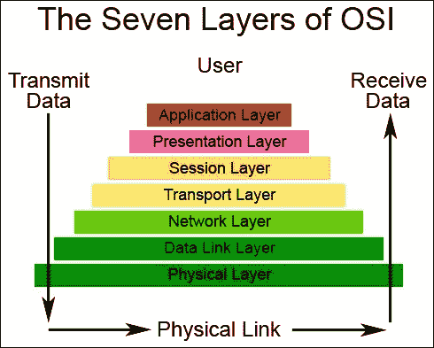
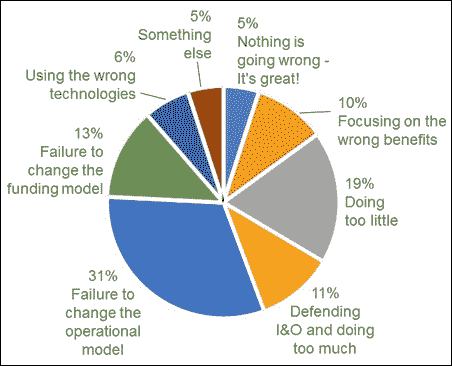
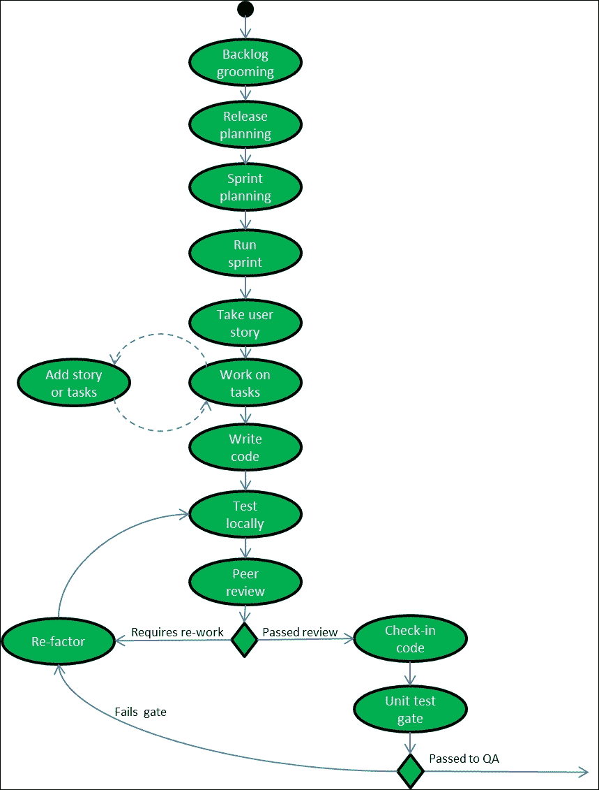
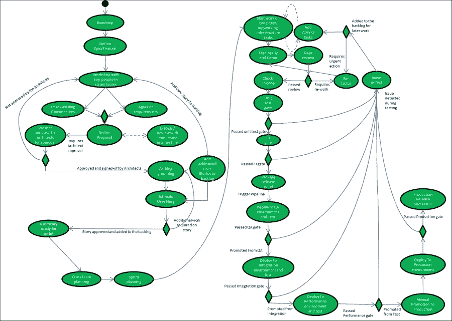

# 第三章：将 DevOps 引入网络运维

本章将重点转向人员和流程，而不是技术。DevOps 的初衷是打破开发与运维团队之间的壁垒，并改变公司运营模式。它将重点介绍解锁 IT 员工、帮助他们以更高效的方式工作的方法，但这些思维方式如今已被扩展到质量保证测试、安全性，甚至网络运维。本章将主要关注网络工程师的角色演变，这一角色与之前的运维工程师一样正在发生变化，网络工程师需要学习新技能，以便在行业朝着完全程序化控制的运营模型发展时，依然能保持现有的价值。

本章将探讨两种不同的角色：CTO / 高级经理与工程师，详细讨论可以用来促进所需文化变革的一些举措，这些变革对于实现整个组织的 DevOps 转型至关重要，或者至少帮助某个单独的部门通过自动化所有工作来改善其内部流程。

本章将涵盖以下主题：

+   启动行为变革

+   自上而下的 DevOps 倡议针对网络团队

+   针对网络团队的自下而上的 DevOps 倡议

# 启动行为变革

网络的 OSI 模型包含七个层级，但广泛建议在 OSI 模型中增加一个名为“用户层”的第八层，负责管理终端用户如何与网络进行集成和互动。显然，人与技术相比，更难以掌握和管理，因此不存在*一刀切*的解决方案来应对大量的人员问题。OSI 的七层结构如下图所示：

启动文化变革和行为变革是组织将面临的最困难任务，而且这不是一蹴而就的。要改变行为，首先必须有明显的商业利益。重要的是要先概述这些文化变革将为组织带来的好处，这将使经理或变革推动者能够为实施所需的变革提供商业正当性。

文化变革以及应对人员和流程的挑战是众所周知的困难，因此，将工具与人员和流程分开，专注于人员和流程的管理是任何 DevOps 项目或倡议成功的关键。文化变革需要经过精心规划，并成为公司的一项倡议。在最近一项由 Gartner 进行的研究中，数据显示，选择错误的工具并不是云项目失败的主要原因，失败的主要原因是未能改变操作模型：

## 实施 DevOps 的原因

在实施 DevOps 时，常常会流传一些误解，比如 DevOps 只适用于初创公司，它对某个特定团队没有任何价值，或者它只是一个流行词和潮流。

如果正确实施，DevOps 项目的可量化收益是不可否认的。这些收益包括对以下方面的改进：

+   变更的速度

+   平均解决时间

+   提升的正常运行时间

+   部署次数的增加

+   团队间的跨技能培训

+   消除单一故障点的风险

IT 行业中的任何团队都会从这些改进中受益，因此团队实际上不能不采用 DevOps，因为这无疑会改善他们的业务功能。

通过实施 DevOps 项目，能够促进可重复性、衡量和自动化。实施自动化自然提高了变更的速度，增加了团队在任何给定一天内可以进行的部署次数，并改善了产品上市时间。部署过程的自动化使得团队能够快速将修复推送到生产环境，同时也让组织能够将新产品和新功能迅速推向市场。

自动化的副产品是，基础设施问题的平均解决时间也会变得更快。如果基础设施或网络变更是自动化的，那么它们的应用效率要远高于人工执行。人工变更取决于实施变更的工程师的速度，而不是能够更精确地衡量的自动化脚本。

实施 DevOps 还意味着需要有效地进行衡量和监控，因此在所有基础设施和网络的各个部分拥有有效的监控至关重要，因为这意味着根本原因分析的速度得以提升。有效的监控有助于促进平均解决时间的缩短，因此当生产问题发生时，可以比让大量工程师登录控制台和服务器进行调试问题更快地找到问题的根源。

相反，一个良好实施的监控系统可以提供快速的通知，定位问题的根源，并消除因初步根本原因导致的任何警报，使问题能够高效地得到解决。

然后，监控会交给可重复的自动化流程，这些自动化流程可以将本地修复推送到生产环境。这个过程提供了一个高度精确的反馈循环，流程会日益改进。如果遗漏了警报，它们理想情况下会随着时间推移被纳入监控系统，成为事件事后分析的一部分。

有效的监控和自动化会导致更快的平均解决时间，从而带来更满意的客户，并改善产品的正常运行时间。利用自动化和有效的监控也意味着团队的所有成员都有机会看到流程如何运作以及修复和新功能是如何推送出去的。

这将减少对关键个人的依赖，消除*巴士因子*问题——即某个关键工程师需要做团队中的大部分工作，因为他是最熟练的个体，且所有系统知识都掌握在他脑中。

使用 DevOps 模型意味着非常高技能的工程师可以将他们的才华用来帮助*跨技能*其他团队成员，并创建有效的监控系统，帮助任何团队成员执行他们通常手动完成的根本原因分析。这将深厚的知识融入监控系统中，因此，监控系统，而非工程师本身，将成为发生问题时的首选参考点，或者理想情况下，监控系统将成为警报源，及时提醒事件，避免客户问题。为了提高跨技能，工程师理应帮助编写自动化流程，这样他们就不是唯一能够完成特定任务的团队成员。

## 实施 DevOps 以改善网络的原因

那么，DevOps 的一些好处如何适用于传统的网络团队呢？今天独立的网络团队常见的抱怨包括以下几点：

+   反应性工作

+   慢，通常通过工单系统进行协作

+   使用管理员终端执行手动操作

+   缺乏前期测试

+   手动错误导致网络中断

+   一直处于应急模式

+   日常流程中缺乏自动化

网络团队像之前的基础设施团队一样，通常习惯于在独立的团队中工作，通过工单系统或使用不够理想的流程与大组织中的其他团队互动。这种工作方式既不流畅也不优化，正是这种情况促使了 DevOps 倡议的诞生，旨在打破*开发*和*运维*团队之间的壁垒，但其范围已扩大。

网络团队似乎最初并未被纳入 DevOps 运动，但软件交付只能以最慢的组件速度运作。最慢的组件最终会成为整个交付过程的瓶颈或障碍。这个最慢的组件通常会成为一个独立团队中的明星工程师，因为他无法手动处理足够的工单来跟上需求，从而成为“巴士因子”（bus factor）。如果该工程师休假或生病，工作就会被阻塞，整个公司对他依赖过大，无法高效运作。

如果一个团队的运作方式与其他部门不同，那么所有其他部门的工作效率都会受到影响，因为该部门的工作不够灵活。简单来说，大多数公司中网络团队存在的原因是为开发团队提供服务。开发团队需要部署网络，这样他们才能测试产品更改，并将产品部署到生产环境中，一旦部署到生产环境，业务就能开始通过这些产品盈利。

网络对访问控制列表（ACL）策略、负载均衡规则以及为新应用程序提供新子网的变更，若需要数天、数月甚至数周才能完成，就不能再被视为成功。网络直接影响*变更速度*、*平均修复时间*、*正常运行时间*以及*部署次数*，这些都是成功 DevOps 倡议的四个关键绩效指标。因此，企业需要将网络纳入 DevOps 模型，否则这些可量化的收益将受到制约。

考虑到 AWS、Microsoft Azure、OpenStack 和**软件定义网络**（**SDN**）能够快速地在私有和公有云中配置网络功能，现在网络团队不再适应他们的运营流程并学习新技能已经不可接受。但有一个前提是，网络的演变非常迅速，他们需要支持和时间来完成这一过程。

如果实施了云解决方案，但运营模型没有改变，那么组织将无法感受到任何真正的可量化收益。云项目传统上并不是因为技术失败，而是因为现有的运营模型阻碍了它们的成功。如果公司不改变其运营模型，并允许最终用户使用 API 自助服务其请求，那么构建一个全新的 OpenStack 私有云——具备用于管理计算、网络和存储的开放可扩展 API——将毫无意义。

如果网络工程师仍在使用图形界面（GUI）进行指点、点击和复制粘贴，那么这并不能带来真正的业务价值，因为复制粘贴最慢的网络工程师就是瓶颈。公司完全可以继续使用现有的技术和流程，因为采用手动流程的私有云解决方案并不会加速市场发布的时间，也不会缩短从失败中恢复的时间。

然而，云不应成为贬低内部网络员工的借口，因为公司中现有的运营模型通常不是由当前的员工设计或设置的，而是继承下来的。迁移到公有云并不能解决公司网络团队的运营敏捷性问题，它只是一种权宜之计，掩盖了更深层次的文化挑战。

然而，更智能的工作方式结合自动化、测量和监控的使用，能帮助网络团队完善内部流程，并促进他们与开发和运营人员的日常协作。文化变革可以通过两种方式启动：一种是来自工程师的自下而上的草根倡议，另一种是来自高层管理的自上而下倡议。

# 面向网络团队的自上而下 DevOps 倡议

自上而下的 DevOps 倡议是指 CTO、总监或高级经理需要从公司获得支持，以对操作模型进行改变。这些改变是必要的，因为现有的操作模型被认为不够理想，并且无法像竞争对手一样快速交付软件，从而导致新产品或重要修复的推迟，影响市场的及时交付。

当从自上而下的管理层进行 DevOps 转型时，如果要对操作模型进行重大更改，必须先与相关团队进行一些基础工作，因为这种大规模的变动往往会导致现场员工的不安或压力。

在实施操作变革时，高层管理人员需要获得现场员工的支持，因为他们每天将会在这一模型下工作。让团队获得支持是非常重要的一环，否则，公司将面临员工不满的局面，这最终意味着最优秀的员工将离开。

在实施新的操作流程时，让高层管理人员与员工积极互动，并从一开始就透明处理任何担忧是非常重要的，而不是去参加一个外部管理会议，然后带着一个强制性的计划回来，这种情况太常见了。

管理层应对团队进行调查，以了解他们每天是如何运作的，喜欢当前流程的哪些方面，以及他们在哪些方面感到困惑。改变操作模型的最大障碍是误解现有的操作模型。所有的倡议理想情况下应该是由团队主导，而不是强加的。所以让我们重点关注一些可以帮助的具体自上而下的倡议。

## 分析成功的团队

一种方法是管理层查看组织内其他团队的运作情况，特别是那些流程运作良好且采用增量敏捷方式交付的团队。如果组织内没有团队以这种方式运作，可以联系其他公司。

询问是否可以参观其他公司的一天运营方式。大多数公司会很高兴将成功的项目作为案例在会议或聚会中展示，因为他们喜欢展示自己的成就，所以寻找那些已经克服了类似文化挑战的公司应该不难。参加一些 DevOps 会议并看看谁在发言，接触这些发言人，他们无疑会乐意提供帮助。

管理团队应首先与高效能团队安排一次会议，并进行问答环节，重点关注以下几点，如果是外部供应商，那么一次简单的介绍电话也可以。

在初次会议中需要提出的一些重要问题如下：

+   哪些流程通常运作得很好？

+   他们每天实际上使用什么工具？

+   工作是如何分配的？

+   他们如何跟踪工作进展？

+   团队结构是什么？

+   其他团队是如何向该团队提出请求的？

+   工作是如何优先排序的？

+   他们如何处理中断？

+   会议是如何组织的？

不要重新发明轮子，如果组织中的某个团队已经有一个经过验证的模板并且运行良好，那么这个团队在帮助推动网络团队的文化变革中也可能是无价的。如果将焦点放在外部团队作为传播者上，会稍微更具挑战性，因为这会带来一些借口，比如说他们公司因为 x、y、z 的原因，所以更容易做到。

当组织中的本地团队作为传播者时，一个好的策略是将一名网络工程师嵌入该团队几周，观察并反馈其他团队如何运作并记录他们的发现。这是至关重要的，确保网络工程师理解现场的流程。

灵活性同样重要，因为只有部分成功团队的流程可能适用于网络团队，因此不要期望两个团队的工作方式完全相同。团队的整体和个人的差异意味着每个团队都是不同的，因此应专注于目标，而不是严格的流程执行。如果团队通过稍微不同的方式达成相同的结果，只要工作可以追踪且对管理层可见，并且能够轻松报告，就不应该成为问题。

确保优先考虑节奏，选择特定的变革推动者，以确保团队对新流程感到舒适，因此，赋予网络团队的变革推动者选择工作方式的权力，通过与团队互动创建新流程，同时让他们负责最终的工具选择。然而，在选择任何工具之前，重要的是从流程开始，并就新的操作模型达成一致，以防止工具推动流程，这在 IT 领域是一个常见错误。

## 绘制活动图

一个好的建议是使用活动图作为视觉辅助工具，帮助理解团队互动如何运作以及如何改进。

这里展示了一个典型的开发活动图，包含手动交接给质量保证团队的流程：

使用活动图作为视觉辅助工具非常重要，因为它能够突出不理想的业务流程。在这个例子中，我们看到一个开发团队的活动图。这个流程是不理想的，因为它在**本地测试**和**同行评审**阶段没有包括质量保证团队。相反，它有一个正式的 QA 交接阶段，这个阶段出现在开发周期的后期，这种做法很不理想，因为它促成了开发和 QA 的孤岛效应，这是 DevOps 反模式。

更好的方法是让质量保证工程师负责创建测试任务和创建自动化测试，而开发团队负责编码任务。这将允许开发**同行评审**流程在开发生命周期的早期由质量保证工程师审查和测试开发人员的代码，并确保每段编写的代码在提交之前具有适当的测试覆盖率。

流程中的另一个缺点是，它未考虑到质量保证团队或客户在生产中发现的软件缺陷，因此将这些工作流引入活动图中也很有用，以展示所有潜在的反馈循环。

如果在整体活动图中漏掉了反馈循环，那么可能会导致流程流失，因此捕捉在映射工具前可以促进流程的所有排列组合是非常重要的。

每个团队都应考虑缩短互动时间的方法，以帮助减少解决时间并提高工作能够流经整体流程的速度。

管理层应该在他们的日程中安排一些时间与开发、基础设施、网络和测试团队会面，并绘制出他们认为各自团队流程的图示。保持高层次，这应该是一个简单的活动泳道，利用从接受工作开始到团队进行工作交付的过程。

每个团队绘制出初始方法后，应专注于优化它，并去除他们不喜欢的流程部分，并讨论团队如何改进流程的方式。可能需要多次迭代才能有效绘制出这一过程，所以不要急于此过程，应该将其视为每个团队的学习经验。

最终的活动图通常会以优化的方式结合管理和技术功能，以展示整体流程。在此阶段不要使用**业务流程管理**（**BPM**）软件，简单的白板足以保持简单和非正式。

在活动图中使用两层是一个良好的做法，因此第一层可以是一个简单的方框，仅写着**同行评审**，然后引用一个嵌套的活动图，概述团队的同行评审过程。两者都需要精细化，但业务流程的嵌套层应由各个团队决定，因为这些是特定于他们需求的，所以在这个层面给团队所需的灵活性非常重要。

将这两个层次分开是很重要的；否则，活动图的整体顶层将过于复杂，无法从中提取任何真正的价值，因此尽量减少顶层的复杂性，因为这将需要与其他团队的流程集成。这个活动不需要包含团队特定的细节，比如内部团队的**同行评审**流程如何操作，因为这将始终是该团队主观的；这应该包括在内，但将是一个不会被分享的嵌套层次活动。

另一个团队应该能够查看团队的顶层活动图并理解流程而无需解释。有时首先绘制高效团队的顶层活动图可以很有用，以展示一个集成的、连贯的业务流程应该是什么样子。

这将帮助那些在这些概念上有些困难的团队，并允许他们使用那个团队的活动图作为指南。这可以作为参考点，并展示这些团队如何解决他们的跨团队互动问题，并促进一个或多个团队在没有摩擦的情况下互动。这个练习的主要目的是连接业务流程，使它们不再在团队之间孤立，以便为集成的计划和执行尽可能地整合工作。

一旦每个团队完成了他们的个人活动图并将其优化到团队希望的方式，流程的第二阶段可以开始。这涉及将每个团队的顶层活动图分层，以创建一个集成的流程。

团队应该将这个分层练习作为借口来讨论次优的流程以及整个业务流程应该如何从头到尾看起来。利用这个会议来消除团队之间的感知瓶颈，完全忽略现有工具以及当前工具的约束，整个练习应该集中在流程而非工具上。

一个受工具约束的次优流程流程的良好示例是顶层活动图上的一个阶段，表示使用工单系统提出工单。应将其细分为以人为中心的工作，请求变更的人实际需要什么？

开发者的日常工作包括编写代码和构建优秀的功能和产品，所以如果一个新功能需要网络变更，那么网络应被视为该功能变更的一部分。因此，网络变更所需的时间需要作为该功能的规划和估算的一部分考虑，而不是作为一个单独的请求，当其作为事后想法被动执行时，会阻碍变更的速度。

当参与度高时，这通常是一次非常成功的练习，最好利用每个团队中的高级工程师和经理参与组合活动图层练习，更初级的工程师参与各自团队特定活动图练习。

## 更改网络团队的运营模式

活动图工作结束后，网络团队的操作模型应该理想地与整个业务完全融合。一旦新的操作模型与所有团队达成一致，就可以开始实施它。

需要注意的是，因为现场团队创建了操作模型并完成了协同活动图，它应该由所有相关方签署作为新的业务流程。因此，这消除了管理层强制模型的问题，因为使用该模型的人们参与了其创建。操作模型可以随着时间的推移进行迭代和改进，但互动不应该发生大的变化，尽管可能会增加最初遗漏的新互动点。然后，可以存储并更新业务流程的主副本，这样新加入公司的员工就知道如何与其他团队进行互动。

从短期来看，新的方法可能会使开发估算变慢，因为网络功能尚未实现自动化，因此当开发人员的功能需要网络更改时，估算会变得更高。

这通常只是对现实的更真实反映，因为最初的估算没有考虑到网络更改，这些更改后来成为了阻塞因素，尽管它们是票据，但一旦报告出来，就可以随着时间的推移进行优化和改进。

一旦整体活动图已合并并与所有团队达成一致，重要的是要记住，如果流程得到了妥善优化，图表上不应该有一大堆高层次的操作。如果互动过于冗长，任何变更都会需要几个小时来遍历活动图上的每一个步骤。

后面提到的活动图展示了一个协同的业务流程，其中工作从单一的路线图定义，产生适用于所有团队的用户故事。新的用户故事，作为工作单元，将由跨职能团队（包括开发人员、基础设施、质量保证和网络工程师）进行估算。每个团队将审查用户故事，确定完成功能所需的跨职能任务。

用户故事随即成为冲刺的一部分，跨职能团队一起工作，确保它在检查之前具备运行所需的一切。经过**同行评审**后，功能或更改将交给自动化流程，将代码、基础设施和网络更改交付到生产环境。

已检查的功能会经过单元测试、质量保证、集成和性能测试质量关卡，这些关卡将包括质量保证团队在检查前编写的任何新测试。一旦通过每个阶段，自动化流程将在按下按钮后被触发，将更改推送到生产环境。每个环境应用相同的网络更改，因此网络更改会先在测试环境中进行，然后再在生产环境中进行。

这一切依赖于将网络视为代码，意味着需要创建自动化的网络流程，以使网络团队能够像开发人员一样敏捷。

一旦达成一致的运营模式制定完毕，DevOps 转型才应开始。这将包括在每个阶段选择最合适的工具，以实现预期的结果，重点关注以下几个好处：

+   变更的速度

+   平均解决时间

+   提高正常运行时间

+   部署次数增加

+   跨团队技能共享

+   消除单点故障风险

每个公司的业务流程都不同，因此让各个部门参与其中，并获得所有管理者的支持，以确保这一活动的成功至关重要。

## 改变网络团队的行为

一旦新的运营模式在公司内建立起来，就要防止网络团队成为 DevOps 导向的持续交付模型中的瓶颈。

传统上，网络工程师习惯于操作命令行，并登录到网络设备的管理员控制台进行更改。基础设施工程师由于已经具备**bash**和**PowerShell**脚本编写经验，并且在 Linux 或 Windows 操作系统方面有扎实的基础，因此过渡到配置管理工具并不是一项艰巨的任务。

然而，最初说服网络工程师做出同样的转变可能会更为困难。让网络工程师向 API 编程并采用配置管理工具的过程可能最初看起来令人畏惧，因为这对入门门槛更高，但有经验的自动化工程师在场，可以帮助网络工程师顺利完成这一过渡。

保持耐心很重要，因此可以通过逐步设置一些自动化目标来改变网络团队的行为。这将鼓励正确的行为，并尝试给予奖励。可以通过提供培训或为团队购买特定的编码书籍来启动自动化计划。

还可以考虑举行一次初步的自动化黑客日；这将给网络工程师一天的时间，远离他们的日常工作，并尝试自动化一个他们每天都会重复执行的小流程。如果可能的话，可以将其设为强制性活动，要求工程师们参与，并安排其他团队替代网络团队的工作，这样他们就不容易分心。这是一个了解哪些网络团队成员可能愿意推广 DevOps 和自动化的好方法。如果某个特定的成员表现突出，可以与他们合作，帮助推动自动化计划向整个团队推广，使他们成为流程自动化的推动者。

建立一个内部的 DevOps 聚会，让各团队展示他们的自动化成就，也是推广网络团队自动化的好方法，并能保持动力。鼓励每个团队在每个季度展示他们所取得的有趣成果，并通过允许参与的团队从日常工作中抽出时间来参与，来激励他们。这样可以培养团队之间的社区感，展示他们是一个更大运动的一部分，这个运动为公司带来了真正的成本效益。这也有助于将团队的注意力集中在使公司变得更好的共同目标上，并在过程中打破团队之间的障碍。

必须避免的做法之一是让其他团队为网络团队编写所有的网络自动化。理想情况下，应该是网络团队自己发展并采纳自动化，因此赋予网络团队对网络自动化的所有权感非常重要。然而，这需要网络团队的全力支持，并且需要有纪律性，不能在出现问题时回归到手动任务。

为了顺利过渡，可以考虑从基础设施或开发团队中派一位自动化工程师加入网络团队，但这应该只是一个临时措施。重要的是选择一位受网络团队尊敬且具备网络知识的自动化工程师，因为没有人应该尝试自动化他们无法手动操作的网络流程，所以找一个精通网络的人员来帮助网络自动化至关重要，因为他们将负责培训网络团队，必须受到尊重。如果分配给网络团队的自动化工程师既不具备知识也不受尊重，那么这项计划可能会失败，因此必须谨慎选择。

重要的是要早期接受这样一个现实：向 DevOps 和自动化的过渡可能并不适合每个人，因此并不是每个网络工程师都能够走这条路。关键在于网络团队抓住机会，展现主动性和学习新技能的意愿。对于新的自动化倡议，任何破坏性或负面的行为都应该及早制止，因为它可能会对网络团队产生不良影响。

起初对新事物保持怀疑态度是可以理解的，但不尝试改变或学习新技能是不应该被容忍的，因为这会破坏团队的动态，应该对此进行监控，确保不会因为个别成员成为阻碍者或破坏者，导致自动化倡议失败或停滞不前。

每个组织都有其独特的文化，公司的变化速度将取决于新流程和新工作方式的文化接受度。在推动文化变革时，需要变革推动者，这些推动者可以来自内部 IT 员工或外部资源，具体取决于员工的变革能力和意愿。每个变革项目都是不同的，但确保有合适的人员参与，以及得到正确的管理层支持和背书，是成功的关键。

# 网络团队的自下而上的 DevOps 举措

**自下而上的 DevOps 举措**是指当工程师、团队领导或低层管理人员未必得到公司支持以改变操作模型时，他们意识到虽然不能对现有的操作模式进行整体性变革，但可以在自己的团队中运用 DevOps 思想，推动积极的变化，帮助团队更好地表现，并提高生产力。

在从自下而上的 DevOps 举措中实施时，有时会面临更多的困难和挑战，因为有些个人或团队可能不愿意改变自己的工作方式和操作方式，因为他们并没有必须改变的压力。但重要的是不要灰心丧气，尽力为业务做出最好的工作。

通过基层举措证明这一过程带来真正的业务好处，最终仍然有可能说服高层管理层实施 DevOps 举措。

## 在网络团队中推广 DevOps

尽量保持积极的态度，推动自下而上的举措有时可能会令人感到疲惫，但重要的是要适应各种挑战，不要太过于个人化。始终保持积极，先在自己的团队内部推广 DevOps 流程和正向行为的好处。首要的挑战是说服自己的团队，接受 DevOps 方法的优点，之后再尝试说服其他团队。

一种有效的做法是展示 DevOps 方法给其他公司带来的好处，比如 Google、Facebook 和 Etsy，重点讲述他们在网络领域所做的工作。个人可能会反驳，认为这些公司是独角兽企业，DevOps 之所以有效是因为它们的特殊性，因此要准备好接受挑战。寻找这些公司已经实施的、网络团队可以采纳的实际举措，这些举措也能真正适用于你的公司。

为了促进变革环境的形成，了解同事们的驱动力，是什么激励着他们？尝试根据个人的动机来调整说服策略，对工程师或经理的说服方式可能完全不同。一线工程师可能会受到以下因素的激励：

+   做更有趣的工作

+   发展技能和经验

+   帮助自动化繁琐的日常任务

+   学习受欢迎的配置管理技能

+   理解开发生命周期

+   学习编程

另一方面，经理可能更倾向于通过提供衡量关键绩效指标（KPI）来激励自己，使团队看起来更出色，例如：

+   实施变革所需时间

+   解决故障的平均时间

+   提高网络的正常运行时间

另一种促进参与的方法是邀请你的网络团队参加由前瞻性的网络供应商安排的 DevOps 聚会。他们可能会惊讶于大多数网络和负载均衡供应商现在都在积极推广自动化和 DevOps，而他们可能对此还不知情。这个领域的一些新创新可能足以改变他们的看法，并激发他们对一些新方法的兴趣，这样他们就能跟上行业的步伐。

## 寻求受人尊敬的经理或工程师的赞助

在让网络团队了解 DevOps 举措之后，下一步是将其推进到更高的层次。寻找网络团队中一个受人尊敬的经理或资深工程师，他们可能愿意尝试 DevOps 和自动化。重要的是要向此人推销这个“梦想”，阐明你对实施一些变革、帮助团队的热情，并表示你希望利用一些已经在其他成功公司中证明有效的最佳实践。

保持谦逊非常重要，尽量避免对同事大发牢骚或抛出泛化的 DevOps 术语，这可能会让人反感。始终要提出合理的论据并加以辩护，同时避免做出泛泛的陈述或概括。尽量避免让人觉得你在削弱经理或资深工程师的权威，相反，应该寻求他们的帮助，争取他们的支持和认可。此时，可能需要展开一些魅力攻势来说服经理或工程师这确实是一个好主意，但逐步推进请求可以帮助避免让人觉得请求毫无诚意。如果请求突然提出，可能会显得不真诚。可以尝试在午餐或饮品时分析情况，并判断他们是否对此感兴趣，因为如果对方固执己见，可能很难改变他们的态度，除非该举措来自上级。

一旦你鼓起勇气提出这个话题，接下来就是提出多个建议，说明在项目经理作为中介的帮助下，团队如何以不同的方式工作。请求在小范围内试行这个方法，并主动提出领导这一举措，同时请求他们的支持和背书。经理或资深工程师可能会对你的主动性印象深刻，并允许你继续推进这个想法，但他们可能会选择你执行的具体举措。因此，永远不要提出自己无法实现的建议，你可能只有一次机会，所以留下好印象至关重要。

尝试从一个小任务入手，这通常是一个痛点，并尝试自动化它。任何人都可以编写自动化脚本，但要尽量让自动化过程易于使用，找出团队在当前流程中喜欢的部分，并尝试将其融入其中。例如，如果他们经常看到命令行输出以特定方式显示，就编写自动化脚本，使输出仍然以相同的方式显示，这样流程就不会让他们感到完全陌生。

尽量避免将值硬编码到脚本中，而是将其提取到配置文件中，使自动化更具灵活性，这样它可能在不同的场景中再次使用。通过向工程师展示自动化的灵活性，能够鼓励他们更多地使用它，向团队中的其他人展示你如何编写自动化脚本，以及他们如何调整它来应用于其他活动。如果做得聪明，自动化将会被团队中的热情成员采纳，而你也将获得足够的动力，给赞助者留下深刻印象，从而推进更复杂的任务。

## 与网络团队一起自动化复杂问题

在通过自动化小的重复性任务建立信任之后，下一阶段的过程是解决一个更复杂的问题，这可以用来巩固未来在网络团队中使用自动化的地位。

这个过程的部分内容是让其他人有能力承担责任，并在未来主导自动化的工作，因此会花费更多的时间。至关重要的是，之前可能在初步自动化建设过程中故意避开的难合作工程师，这次必须参与进来。

这些工程师在这一阶段很可能完全没有涉及过自动化。这可能意味着团队中最有认证的成员和团队的领导者，没有人说过这会容易，但从长远来看，成功地说服最大的怀疑者相信 DevOps 和自动化的价值，将是值得的。在这个阶段，网络团队的自动化应该已经具备足够的可信度和动力，可以通过引用成功的使用案例来讨论这个话题。

在过程中涉及所有难以合作的个体，比起在过程结束时再向他们提出建议，要容易得多。如果难缠的高级工程师或经理在创建过程中参与其中并有所贡献，他们在同事面前更不可能驳回你的想法。

尽量保持尊重，即使你不同意他们的观点，但如果你认为自己是对的，也不要退缩或放弃。要以事实为基础，避免情绪化的争论，列出利弊，并记录任何担忧，不要忽视它们，你必须愿意妥协，但不能到贬低解决方案的程度。

实际上可能存在需要解决的真正风险，因此有效的观点不应被忽视或轻描淡写。如果你对某些问题不确定，或者感觉某些人态度不合理，尽量寻求你的赞助商的支持。

在实施复杂的自动化任务时，要作为团队而非个人进行工作，这对你自己以及其他人都是一种学习经历。尝试教网络团队使用配置管理工具，他们可能只是不敢尝试新事物，所以要采取温和的方法。可以适当暂停，尝试一些在线教程，让每个人熟悉工具，并尝试各种方法，以尽可能简单的方式解决问题。

尝试向网络工程师展示使用配置管理工具的简单性及其好处。不要使用复杂的配置管理工具，因为这可能让他们反感。目前大多数网络工程师不会编程，但这一点可能在未来几年发生变化。正如前面所说，基础设施工程师至少有一些 bash 或 PowerShell 的基础，这有助于他们入门，因此要选择他们喜欢的工具，并提供选择。尽量避免强制使用他们不喜欢的工具。在使用自动化时，网络工程师最关心的问题之一是同行评审，因为他们天然不信任自动化是否有效。尝试建立一些门控流程来解决这些问题，自动化并不意味着不需要同行评审，因此要创建一个轻量级的流程来帮助。通过使用源代码控制显示差异，确保自动化易于评审，并教育网络工程师如何执行此操作。

编码最初可能是一个令人生畏的任务，因此建议每周做一些团队练习，进行编码或配置管理任务。作为一个团队共同完成。这样可以减轻威胁感，重要的是要听取反馈。如果大家达成共识，认为某些东西没有发挥作用或没有带来好处，那就寻找替代方法，找到一种适合整个团队的方式实现相同的目标。在发布任何新的自动化流程之前，先在预生产环境中进行测试，并与经验丰富的工程师一起进行同行评审，并尝试让它在多个测试案例下失败。新流程只有一次给人留下第一印象的机会，因此一定要确保它是成功的。

尝试在团队之间设立知识共享会议，讨论自动化，并确保每个人都知道如何手动执行操作，这样他们就能轻松调试未来可能出现的问题，或者扩展或修改自动化。确保输出和日志对所有用户都是清晰的，因为在生产环境中使用时，所有人都需要支持自动化。

# 总结

在本章中，我们介绍了实践中的措施，这些措施结合起来，将使 IT 人员能够在其组织中实施成功的 DevOps 模型。它不仅仅关注部门问题，还提倡使用一套实用的策略来改变约束团队的日常操作模式。它还强调了网络工程师需要学习新技能和技术，以充分利用新的操作模型，避免成为交付过程中的瓶颈。

本章提供了实际的真实世界示例，帮助高级管理人员和工程师提升自己公司的能力，强调团队间的合作，并指出如今网络部门需要自动化所有网络操作，以满足企业的交付节奏。

本章的关键要点是，DevOps 不仅仅适用于开发和运维人员，它同样可以应用于网络团队。重要的是，在启动 DevOps 计划之前，要花时间分析成功的团队或公司，专注于他们成功的原因，但高级管理层的支持是创建成功 DevOps 模型的关键。

你们公司自己的模型不会完全照搬其他公司的模型，所以尽量避免照搬照抄。调整模型，使其适应你们公司的实际情况，允许团队创建自己的流程，但不要强制规定流程。同时，也要允许变革推动者发起团队可以接受的变更。

尝试自动化所有操作工作，从小做起，一旦团队适应了新的工作方式，再逐步解决更大、更复杂的问题。始终记住，成功的变革不会一蹴而就。它只能通过持续改进的模式来实现。

在接下来的章节中，我们将探讨如何将自动化应用于网络，并重点关注配置管理工具，例如**Ansible**。这些配置管理工具可以提高网络工程师实施变更的速度，并确保所有的网络变更都是以相同的方式进行，从而减少出错的可能性。

### 注意

关于 DevOps 的有用链接如下：

[`www.youtube.com/watch?v=TdAmAj3eaFI`](https://www.youtube.com/watch?v=TdAmAj3eaFI)

[`www.youtube.com/watch?v=gqmuVHw-hQw`](https://www.youtube.com/watch?v=gqmuVHw-hQw)
