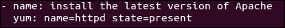
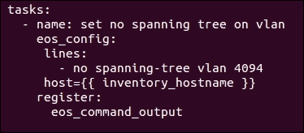
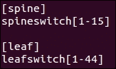

# 第四章。使用 Ansible 配置网络设备

本章将重点关注当今市场上最受欢迎的几个网络供应商，即 Cisco、Juniper 和 Arista，并探讨这些市场领先供应商如何开发自己的专有操作系统来控制网络操作。本书的目的不是讨论哪家网络供应商的解决方案更好，而是探讨网络运营商如何利用现有的配置管理工具来管理网络设备，因为大多数网络供应商已经创建了用于以编程方式控制网络的 API 和 SDK。

一旦建立了每个操作系统的基础知识，我们将转向来自 Red Hat 的非常流行的开源配置管理工具 Ansible（[`www.ansible.com/`](https://www.ansible.com/)）。

我们将探讨如何使用它来以编程方式配置网络设备并帮助网络运营。本章将展示可用于管理网络设备的实际配置管理流程。

本章将涵盖以下主题：

+   网络供应商的操作系统

+   Ansible 简介

+   当前用于网络自动化的 Ansible 模块

+   管理网络设备的配置管理流程

# 网络供应商的操作系统

市场领先的网络供应商，如 Cisco、Juniper 和 Arista，都开发了自己的操作系统，允许网络运营商通过命令行界面（CLI）向网络设备发出一系列命令。

每个供应商的 CLI 都是从他们专门的操作系统运行的：

+   Cisco IOS 和 Nxos

+   Juniper Junos

+   Arista Eos

所有这些操作系统都使得通过编程方式控制交换机、路由器和安全设备变得更加容易，因为它们试图简化操作网络设备。

在行业中 DevOps 的兴起也意味着不再可以不提供编程 API 或 SDK 来帮助自动化，现在网络供应商与配置管理工具（如 Puppet、Chef、Ansible 和 Salt）集成，以插入 DevOps 工具链。

## Cisco IOS 和 Nxos 操作系统

当 Cisco IOS 操作系统发布时，它是首个提供一组命令行的操作系统，网络运营商可以使用这些命令行来改变网络状态。然而，它仍然存在一些挑战；它具有单片架构，意味着所有进程共享相同的内存空间，并且在并行进程之间没有保护，因此它不适合并行更新，但在当时它是明确的市场领导者。这改变了网络操作方式，意味着网络工程师需要分别登录到网络交换机和路由器上，使用其功能齐全的 CLI 进行更新。

当时，这大大减少了网络操作的复杂性，Cisco 规范化了数据中心中网络操作的方式。网络管理员将登录到设备，运行一系列行业标准的命令行来修改路由器或交换机，Cisco 还开设了认证项目，教授管理员如何操作设备并学习所有命令。

如今，在效率和成本削减对于企业生存至关重要且业务流程向更加灵活的方式转变的背景下，这种现代数据中心模型在网络工程师与网络设备的比例上存在明显的扩展问题，*每个网络设备所需的网络工程师数量*。

私有云的出现意味着每个网络工程师需要管理的网络设备数量急剧增加，因此自动化成为了以一致的方式管理大量设备的关键。如果一个企业的竞争对手通过自动化的运营模型能够更快地将产品推向市场，那么他们将能比进行手动更改的组织更快地推出产品。自动化已成为跟上网络快速变化所必需的条件。随着 IT 的变化和发展，自动化已成为促进这一演变的前提。

随着近年来网络市场的演变，Cisco 开发了一个新的操作系统 **Nxos**，使其能够与开源技术集成并支持自动化。Nxos 操作系统已部署在所有新的 Nexus 交换机和路由器上，这一操作系统通过集成开源协议（如 **BGP**、**EVNP** 和 **VXLAN**）将 Cisco 推向开放和模块化的标准，且这些设备甚至可以运行 **LXC** 容器，这是一种操作系统级虚拟化方法，用于在虚拟机或物理服务器上运行多个隔离的进程。

Cisco 还提供了一套 REST API，允许网络运营商运行原生 Linux 和 bash shell 来执行常规的服务器端管理命令。在 AWS 和 OpenStack 提供的编程 API 可以用来变更网络基础设施的时代，网络供应商需要适应才能生存，否则就可能被淘汰。因此，Cisco 将其交换机和路由器的配置和操作简化到与虚拟设备一样容易。

Nxos 操作系统允许使用 Red Hat 企业版 Linux rpm 包管理器来控制软件更新。这意味着，软件更新可以以行业标准的方式在 Nxos 上进行，就像通过基础设施系统管理员对 Linux 客户操作系统进行打补丁一样。因此，Cisco 网络设备现在对 Linux 系统管理员来说更加直观，并且对最终用户来说更像原生 Linux，这无疑使得它们的管理变得更简单。

Cisco Nxos 操作系统意味着网络变更的推送速度得以提升，因为运营人员可以使用他们自己的工具链和配置管理工具来自动化更新。Nxos 操作系统已经变得不那么依赖厂商，因此，使用网络产品和自动化其产品套件的门槛变得更低。

## Juniper Junos 操作系统

Juniper Junos 操作系统驱动程序通过程序化控制来控制网络操作，Junos 操作系统的设计旨在提供 CLI，用户可以通过它执行以检索运行系统的相关信息。Junos 操作系统基于一个明确的层次模型，而不是使用一系列不相关的配置文件。层次模型还完整支持操作模式和配置模式。

直观地说，操作模式用于升级操作系统、监控系统以及检查 Juniper 设备的状态。而配置模式则允许网络管理员配置用户访问和安全性、接口、硬件以及设备上使用的协议集，这为安装系统的人员和操作系统的人员之间提供了清晰的角色分离。Junos 操作系统支持所有开放协议，如 BGP、VXLAN 和 EVPN，并且具备内建的前滚和回滚功能。

Juniper 提供了一款名为**PyEZ**的 Python 库，适用于 Junos 操作系统，并为 Windows 管理员提供了一个 PowerShell 选项，该选项利用了 Python 中封装的 PowerShell。Python 库 PyEZ 可以通过使用表格和视图来检索任何配置信息，这些表格和视图允许网络管理员根据 Junos 操作系统提供的运行时信息进行脚本编写。一旦通过利用 `get()` 方法的 Python 脚本提取了表格项，表格可以随后被视为 Python 字典并进行迭代，这使得用户可以在需要时执行复杂的脚本，从而允许网络管理员自动化所有网络操作。Junos PYEZ 库也完全可扩展，网络管理员可以使用其小部件系统添加他们认为合适的功能。

## Arista EOS 操作系统

Arista EOS 操作系统基于开放标准，旨在促进网络功能的自动化。它依赖于集中式的**CloudVision eXchange**（**CVX**），CVX 服务器保存网络的集中状态。EOS 操作系统通过 **Sysdb** 来分离每个交换机上的功能控制，Sysdb 是 Arista EOS 操作系统的数据库。Arista Sysdb 是一个运行在用户空间的内存数据库，包含 Arista 交换机的完整状态。Sysdb 存储在设备内存中，因此如果 Arista 交换机重新启动或断电，所有与该交换机相关的信息将丢失。

CVX 服务器作为聚合器，管理从每个交换机的 Sysdb 中收集的所有状态信息，并根据 CVX 服务器集群启用的服务，将信息汇总到网络范围的数据库中。当交换机的 Sysdb 中发生状态变化时，变化会推送到 CVX 集中数据库，随后更新其配置并通知 CVX 上运行的代理程序。

Arista EOS 操作系统支持现代开放协议，如 MLAG、ECMP、BGP 和 VXLAN。它利用 VXLAN 等覆盖技术，使得应用能够在现代数据中心中部署并保持可移植性。Arista 大力推广在 ECMP 下使用 Leaf-Spine 架构，允许实现扩展模型；这一架构与现代云解决方案如 OpenStack 一致，并使其与 SDN 控制器解决方案保持独立。

Arista EOS 操作系统是一个基于 Linux 的操作系统，旨在被程序化控制。EOS 操作系统的主要驱动力是允许网络操作员使用一套结构化的 API，包括 eAPI、CLI 命令以及作为其 SDK 产品组合的一部分的 Python、Ruby 和 GO 库，来执行网络操作。

EOS 操作系统还支持**智能系统升级**（**SSU**），通过实时修补和升级的简化及更直观的方式，支持 Arista 设备的扩展，这有助于支持企业的 99.99% 在线时间目标。交换机现在可以由数据中心运营团队在数据中心安装并接线，然后交给 Arista 的**零接触配置**（**ZTP**）过程，自动化交换机初始化，**零接触替换**（**ZTR**）允许交换机在数据中心中进行更换。

Arista EOS 解决方案 CVX 产品可以通过门户自动化网络工作流任务，如果用户需要交换机和路由器的可视化视图，CVX 允许通过 OVSDB、eAPI 或 OpenFlow 与 SDN 控制器集成。像 Cisco 和 Juniper 一样，EOS API 由于提供了多种 SDK 选项，因此 Arista 产品可以通过配置管理工具（如 Puppet、Chef、Ansible 和 Salt）轻松管理，从而避免手动进行任何网络操作。

# Ansible 简介

Ansible 主要是一个基于推送的配置管理工具，它使用一个 **Ansible 控制主机**，并且可以通过 SSH 连接到多个 Linux 客户操作系统以对其进行配置，最近还新增了 WinRM 支持，因此它现在也可以像配置 Linux 系统一样配置 Windows 客户机。由于 Ansible 可以同时连接到多个服务器，它帮助操作员通过允许他们在多个 Linux 或 Windows 服务器上同时执行统一的操作，从而简化了自动化重复任务的过程。Ansible 还可以作为一个集中式编排工具，连接到 API 端点并对 API 操作进行排序。

在这里，我们可以看到 Ansible 控制主机如何连接到服务器或充当集中式编排工具的示例：


Ansible 执行的每个操作都应该是幂等的，这意味着如果服务器上已经配置了期望的状态，Ansible 将检查来自 playbook 或角色的目标状态，如果服务器已处于正确状态，则不会采取任何操作。只有在状态与 playbook 或角色中指定的状态不同的情况下，操作才会被执行，从而改变服务器的状态。

Ansible 是一个基于 Python 的配置管理工具，它通过一个基于 Linux 的控制主机控制服务器，使用 YAML 文件来定义和描述期望的状态。Ansible 配备了一组丰富的可扩展模块，这些模块主要是用 Python 编写的，但也可以用任何用户希望的语言编写。Ansible 模块允许 Python SDK 或 REST API 被封装在 Ansible 的插件框架中，然后可以通过 Ansible 角色或 playbook 在易于使用的架构中进行调用。在深入了解更详细的示例之前，了解一些 Ansible 的术语是非常重要的。

## Ansible 目录结构

Ansible 由一系列 YAML 文件组成，这些文件布局在一个可自定义的目录结构中。

在这个自定义结构中，Ansible 控制节点具有以下目录结构：

+   `inventories` 文件夹包含 Ansible 库存

+   `library` 文件夹包含任何自定义的 Python 插件

+   `playbooks` 文件夹包含所有的 playbook

+   `roles` 文件夹包含所有的 Ansible 角色

总体目录结构如下所示：


这提供了所有 Ansible 组件的逻辑分组，随着 playbook 或角色的增多，这将非常有用。最好将 `ansible` 文件夹结构在源代码管理系统中进行版本控制，如 **Git**。Git 是一个分布式的开源版本控制仓库，旨在对开发代码进行版本控制，以提高速度和效率（[`en.wikipedia.org/wiki/Git）。`](https://en.wikipedia.org/wiki/Git)。)

## Ansible 库存

Ansible 库存文件实际上是一个在 YAML 文件中定义的 DNS 主机名或 IP 地址的集合。这允许 Ansible 连接到这些目标主机，并在服务器上执行特定命令。

Ansible 允许用户使用库存文件将服务器分组为特定类型或用例。例如，在网络术语中，当使用 Ansible 设置 Leaf-Spine 架构时，网络操作员可以为 Leaf 交换机创建一个组，为 Spine 交换机创建另一个组。这是因为配置每种交换机所需的运行手册命令不同，因此可以在执行时施加限制，只对特定组中的一小部分服务器执行命令。

以下图片展示了定义 Leaf 和 Spine 交换机的库存文件示例，显示了在库存文件中定义的两个组，一个是为 Leaf 交换机命名的`leaf`，另一个是为 Spine 交换机命名的`spine`，包含所有交换机的 DNS 条目：


相同的库存可以用简化的格式描述：


## Ansible 模块

Ansible 模块通常是用 Python 编写的，或者也可以用其他编程语言编写。Ansible 模块的代码定义了一组操作，用于向客户操作系统添加或删除功能，或者如果用于编排，它也可以针对 API 执行命令。Ansible 模块可用于封装简单的命令行、API 调用或用户希望程序化编写的任何其他操作。模块是以可复用的方式设置的，以便在多个剧本或角色中使用，从而促进代码重用和操作标准化。

在 Ansible 模块中指定的代码被封装在 Ansible 的模块模板中，模块模板结构化了模块的布局。该模板推动了一组标准，因此每个模块在设计上都是幂等的，这意味着代码会首先检测系统的状态，然后判断是否需要在执行操作之前更改状态。

当 Ansible 执行状态更改时，控制台会以黄色输出标明。如果没有进行任何操作，它将显示绿色，表示操作成功运行，但没有更改状态，而红色的控制台输出则表示模块失败。

Ansible 模块公开了一组命令行参数，这些参数可以是必需的也可以是可选的，并且可以有默认值。遵循 Ansible 标准的模块是通过一个包含 `present` 或 `absent` 的状态变量创建的，作为命令行变量之一。当模块设置为`present`时，它将添加由剧本指定的功能；而当设置为`absent`时，它将移除指定的功能。所有模块通常都具有处理这两种用例的代码。

一旦编写了 Ansible 模块，它就会被放置在`library`文件夹中，这意味着它作为库对 Python 解释器可用，代码可以通过在 Ansible 的`playbooks`或`roles`中定义来使用。Ansible 提供了一组预打包的核心模块和附加模块，所有这些模块都可以通过编写一些 YAML 来描述所需的操作进行访问，所有模块都附带有文档，文档是模块的样板部分，并且可以在 Ansible 官网上找到。

核心模块由 Ansible 核心团队与软件供应商的联合项目维护，通常具有较高的质量。附加模块也可以具有良好的质量，但不是由供应商维护的，有时是由用户维护的，这些用户将模块提交回 Ansible，以帮助开源社区。

在下面的截图中，可以看到一个简单的核心`yum`模块，由`yum:`提供，它带有两个命令行变量`name`，用于指定要安装的 rpm，以及`state`，它决定是否在目标服务器上安装或移除该 rpm：



## Ansible 角色

角色是 Ansible 中的进一步抽象层，也使用 YAML 文件定义。角色可以从剧本中调用；这旨在尽可能简化剧本。随着`playbooks`功能集的增加，它们可能变得杂乱且难以维护。如果将所有功能都放在一个文件中，剧本可能会变得很难管理。所以角色允许操作员创建最小化的剧本，然后从 Ansible 目录结构中拉取所有信息，从而决定需要在服务器上执行的配置步骤或本地运行的操作。

Ansible 角色试图剥离剧本中的可重复部分并将其分组，以便在需要时可以由多个剧本使用。角色是为了确定服务器配置文件应该是什么，而不仅仅是专注于多个临时指令，因此剧本可以命名为`spine.yml`，并且该剧本可以包含一组模块化的角色，用于定义特定 Spine 交换机的运行列表，执行此剧本时，它将在 Ansible 清单中指定的每个目标服务器上构建 Spine 交换机。如果设计得当，这些角色应该具有足够的模块化，以便在创建 Leaf 交换机时重复使用。

## Ansible 剧本

Ansible 剧本是一个 YAML 文件，用来指示在 Ansible 清单文件中定义的特定主机集上执行的运行列表。剧本指定了一组有序的指令，从 Ansible 控制节点或在 Ansible 清单文件中指定的目标主机上本地执行命令。

Ansible 剧本可以用来创建一个运行列表，调用模块或特定的角色，指示应该在服务器上执行的操作。

在这个示例中，我们看到一个针对清单文件中`spine`主机的剧本，并执行多个`roles`来设置 Spine 服务器：


另一个可行的剧本可能完全不使用角色，直接调用 Ansible 的 yum 核心模块，在名为 `server` 的清单组上安装 apache 的 `httpd-2.2.29` yum 包：


剧本还可以指定 `when` 条件，以决定是否根据前一个操作的输出执行剧本中的某个操作。`register` 命令用于存储任务的 JSON 输出，后续任务可以通过读取 JSON 结果并评估 when 条件来验证是否应当执行该任务。

从 2.x 版本开始，Ansible 剧本现在也可以使用块式恢复功能。因此，如果嵌套在块命令中的操作失败，则会触发剧本中的恢复部分。这对于清理失败的操作非常有用，使剧本更加健壮。

不应低估块式恢复操作的有用性，当需要将一个大数据库 `dmp` 文件复制到备份位置时，由于复制的数据量大，这个操作有时可能容易出错。所以，如果目标目录的磁盘空间太低，那么操作可能在中途失败，导致只有部分文件被复制，且服务器处于不可用状态，服务器也可能耗尽磁盘空间。因此，可以使用恢复命令立即清理复制的文件，这样在复制操作失败时，服务器就不会处于不良状态。恢复命令执行完成后，剧本将退出并报告错误，但保持在原始状态。

在以下示例中，我们可以看到一个剧本使用 copy: 模块将源文件 `/var/files/db.dmp` 复制到 `/backups/db.dmp`，如果原始命令失败，file: 模块将用于删除该文件：


## 执行 Ansible 剧本

在创建了剧本和清单文件，并使用了指定的文件夹结构后，可以通过指定 `ansible-playbook` 命令来执行它。

在以下示例中：

+   `ansible-playbook` 告诉 Ansible 应该指定一个 YAML 剧本文件

+   `-i` 标志用于指定清单文件

+   `-l` 限制执行仅限于清单组（servers）下的服务器

+   `-e` 在此示例中传递额外的变量到剧本，例如 production

+   `-v` 设置输出的详细程度：

    ```
    ansible-playbook –i inventories/inventory –l servers –e environment=production playbooks/devops-for-networking.yml -v

    ```

## Ansible var 文件和 jinja2 模板

Ansible 的 `var` 文件只是另一种 YAML 文件，指定了一组变量，这些变量将在运行时通过 Ansible 的 `include_vars` 语句被替换到剧本中。

`var` 文件只是一种方式，用于分离剧本或角色在运行时所需的变量。这意味着可以在运行时传递不同的 `var` 文件，而无需将变量硬编码到剧本或角色中。

以下截图展示了一个 `var` 文件语法示例，内容为包含一个名为 `cert_name` 的定义变量的 `common.yml` `var` 文件：


以下示例展示了上面提到的 `common.yml` 变量和其他 `environment.yml` 变量，二者都被加载到 playbook 中。`{{ environment }}` 变量非常有用，因为它意味着可以从 `ansible-playbook` 命令行传递不同的值，通过在运行时使用 `-e “environment=production”` 选项来控制导入到 playbook 中的变量：


`common.yml` 中的 `var` 文件变量值 cert1 可以通过在 playbook 中指定 `{{ cert_name }}` 变量来使用：


Ansible 还具有利用 Python jinja2 模板的能力，这些模板可以在运行时进行转换，以使用一组 `var` 文件填充配置信息；例如，在前面的示例中，`{{ environment }}` 变量可以在运行时指定，以加载填充唯一环境信息的变量。使用模板模块转换后的 jinja2 模板将被参数化，使用在 `environment.yml` 文件中指定的变量。

在以下示例中，我们可以看到 Ansible 的 `template:` 模块作为角色的一部分被执行，复制一个 jinja2 模板 `network_template.j2` 并将其转换为 `/etc/network.conf`：


## 使用 Ansible 配置网络设备的前提条件

本章中 *Ansible 入门* 部分介绍的基本构建块与 Ansible 网络模块密切相关，并且适用于希望使用 Ansible 进行配置管理的网络团队。在开始之前，重要的是与网络供应商确认所使用的网络操作系统版本是否能够与 Ansible 一起使用。下一步是配置一个小型的预配服务器，将其用作 Ansible 控制主机，通常该服务器会创建在管理网络上，以便它能够适当地访问所有交换机。

配置服务器可以相对较小，因为它只需要通过 SSH 连接到基于 Linux 的网络操作系统。确保在网络设备上启用了 API 命令行。创建一个临时用户帐户在每个网络设备上也是一个好主意，这将允许你在 Ansible 控制主机上设置公钥，并使用临时帐户将创建的 `id_rsa.pub` 通过 **安全复制** (**SCP**) 复制到网络设备上的 `authorized_keys` 文件夹。这将允许 Ansible 使用该私钥连接到所有主机，而无需处理密码。完成此设置活动后，可以从每个网络设备中删除临时密码，甚至可以使用 Ansible 作为第一步活动来完成此操作。

如果一切顺利，下一步将在配置服务器上创建 Ansible 文件夹结构，并填写 Ansible 清单文件，其中包含所有网络设备的 DNS 名称，最后安装 Ansible，当你准备开始执行 playbook 时即可使用。Ansible 现在由 Red Hat 以 rpm 格式打包，因此只要 Ansible 控制主机能够通过 CentOS 镜像或 Red Hat 企业 Linux 访问 Red Hat 仓库，就可以通过简单的 `yum install` 来安装 Ansible。当然，Ansible 也能在任何基于 Linux 的操作系统上运行，因为它仍然可以作为 PyPi 包在 Ubuntu 上安装。

## Ansible Galaxy

如果网络操作员寻找起点而且不擅长编码，他们可以在 Ansible Galaxy 上查找示例，Ansible Galaxy 托管了由开源社区开发的角色，这些角色执行了许多复杂的命令。

网络工程师可以导航到 Ansible Galaxy 仓库：[`galaxy.ansible.com/`](https://galaxy.ansible.com/)。


Ansible Galaxy 拥有成千上万的 Ansible 角色，这些角色由开源社区开发。

一些可用的网络角色示例包括 Arista EOS 角色，它可以用于自动化 Arista 交换机设备。或者，Cisco EVPN VXLAN Spine 角色可以用于在 Cisco 设备上构建 Spine 交换机，或者 Juniper Junos 角色可以用于自动化 Juniper 网络设备。因此，针对各种技术和用例，提供了广泛的模块选择。

请查看以下有用的链接：

+   Arista EOS ([`galaxy.ansible.com/arista/eos-system/`](https://galaxy.ansible.com/arista/eos-system/))

+   Cisco ([`galaxy.ansible.com/rogerscuall/evpn_vxlan-spine/`](https://galaxy.ansible.com/rogerscuall/evpn_vxlan-spine/))

+   Juniper ([`galaxy.ansible.com/Juniper/junos/`](https://galaxy.ansible.com/Juniper/junos/))

用户可以浏览角色并搜索特定的网络厂商。在这个示例中，搜索 Arista 返回了 **eos** 角色，如下图所示：


每个返回的角色都有一个指向其对应 GitHub 仓库的链接：


Ansible Galaxy 是一个非常有用的工具，用户可以以角色（roles）作为起点，并根据自己的需求进行自定义。而不仅仅是从社区获取，任何可能对其他人有用的新角色都应该回馈到 Ansible 社区。

# Ansible 核心模块可用于网络操作

自 Ansible 2.0 发布以来，Ansible 配置管理工具已经打包了来自 Arista、Citrix、Cumulus 和 Juniper 的一些核心网络模块。Ansible 可以用于编辑任何网络设备的配置，而不仅仅限于这些模块。Ansible Galaxy 拥有由开源社区开发的各种角色。

以下截图展示了 Ansible 2.x 网络模块的一个子集，重点展示了 **Junos**（Juniper）、**Eos**（Arista）、**Nxos**（Cisco）和 **Ios**（Cisco）：


Ansible 2.x 旨在通过为所有模块提供一组标准化的操作，简化网络模块的使用，使网络工程师感觉更加直观。由于许多网络工程师不熟悉配置管理工具，模块间的标准化简化了初次使用的门槛。当网络工程师看到他们日常使用的命令作为 playbook 或角色的一部分时，Ansible 可以首先作为调度工具使用，然后再深入使用更复杂的模块。

网络工程师在初次使用配置管理工具时的主要担忧之一是不信任系统或不了解其背后的运作方式。因此，能够轻松阅读 playbook 或角色，并查看正在执行的操作，有助于建立对工具的信心，并使其更容易被接受。

完全可以预见，随着时间的推移，开源社区将构建出更复杂的网络模块，其中一些已经通过 Ansible Galaxy 中的角色提供，例如来自 Arista、Juniper 和 Cisco 的角色。然而，以下 Ansible 核心模块已经标准化，允许以相同的方式配置 Arista、Cisco 和 Juniper 网络设备。这些模块可以在任何 playbook 或角色中使用。

## _command 模块

在 Ansible 2.x 中，主要与供应商的网络模块一起打包的模块是`_command`模块。这是 Ansible 的有意选择，因为网络工程师在初次使用配置管理工具时，使用原生网络命令更加直观。

该模块允许 Ansible 使用 SSH 连接到主机，因为网络设备的操作系统主要是基于 Linux 的操作系统。

`_command` 模块允许网络操作员通过从 Ansible 控制主机连接应用配置更改。Ansible 在此命令中使用的语法与网络操作员在网络设备上使用 CLI 执行的语法相同。

在下面的示例中，EOS 命令 `show ip bgp summary` 由 `eos_command` 执行，它连接到每个指定的 `{{ inventory_hostname }}`，这是一个特殊的 Ansible 变量，会替换为清单文件中指定的主机组中每个节点的 DNS 名称。然后，它将命令的输出注册到 `eos_command_output` 变量中。


Junos 语法是相同的。在下面的示例中，执行了一个类似的网络命令，在 Junos 上显示接口，并将 JSON 输出捕获到 `junos_command_output` 变量中。


Cisco 示例显示的是 Nxos，但配置在 IOS 中也是相同的。`nxos_command` 命令执行 `show version` 命令，并将结果放入 `nxos_command_output` 变量中：


## The _config module

`_config` 模块用于以确定性方式配置更新，可用于实现变更请求，通过批量执行多个命令。

此模块允许操作员以编程方式更新网络设备上的运行配置中的选定行或块。该模块将连接到设备，提取运行配置，然后以完全可预测的方式推送批量更新。

在下面的示例中，Arista 交换机的配置将通过该模块加载。如果运行配置与现有状态不匹配，`no spanning-tree vlan 4094` 命令将在 EOS 操作系统上执行，从而在交换机上实现所需的最终状态。



## The _template module

`_template` 模块用于利用 jinja2 模板文件更新配置。可以从网络设备的运行配置中提取该模板，进行更新，然后再推送回设备。

`_template` 模块的另一个使用场景是，允许网络管理员从一个网络设备中提取运行配置到 jinja2 模板，然后将其应用于其他交换机，以传播相同的更改。

`_template` 模块只会推送增量更改，除非指定强制命令作为命令行变量，这将执行覆盖操作。

在下面的示例中，`eos_config` jinja2 模板被推送到 Arista 设备上，并且如果 jinja2 模板中有配置变更，它会对配置进行增量更新。


# 配置管理流程，用于管理网络设备

DevOps 主要关注的是人和流程，因此，仅仅专注于一些单独的 playbook 或角色示例来操作交换机或防火墙，并不能帮助网络工程师解决他们每天遇到的现实网络挑战。在明确项目的实际目标后，选择正确的工具来促进流程也很重要。工具的选择应在业务需求明确之后，而不是反过来。

网络工程师可以像输入命令到 Ansible playbook 一样，轻松地将这些命令输入到网络操作系统中，因此，重要的是要考虑使用像 Ansible 这样的配置管理工具能为业务带来哪些真正的价值。

单独实现一个新工具并不能真正帮助网络团队提升效率，但在 Ansible 中创建的用于管理 Arista、Juniper 和 Cisco 的模块，是简化和标准化流程与方法的促进工具。然而，真正的关键区别在于将这些模块包裹和利用起来的流程。

Ansible 可以以多种方式帮助网络操作，但最好尝试将任务归类为以下几类：

+   期望状态

+   变更请求

+   自助服务操作

## 期望状态

第一天的 playbook 应该用于设置网络的期望状态，利用一组角色和模块来构建全新的网络设备，并控制网络的预期状态。一个第一天的 playbook 示例可能是网络工程师第一次配置使用 Arista Leaf 和 Spine 交换机的 Leaf-Spine 架构，刚开始时这可能看起来是个相当复杂的任务。但其中的优点是，整个底层网络的状态可以在 Ansible 中进行描述，同样的道理也适用于防火墙或任何其他设备。

在 Leaf-Spine 网络中，活动将包括配置多个 Leaf 和 Spine 交换机，因此，创建一组角色来抽象常见操作，并在 playbook 中调用它们是可取的，因为相同的配置将需要在多个服务器上执行。

网络工程师将从设置 Ansible 控制主机开始，如 Ansible 先决条件部分所述。接着，他们将创建自己的清单文件，用于配置 Leaf-Spine 架构中的网络设备。

网络工程师应定义他们计划配置的所有网络设备的清单。在以下示例中，我们看到两个主机组，包含两个 `spine` 交换机和四个 `leaf` 交换机：


网络操作员还需要指定他们希望在 `spine.yml` playbook 中执行的角色，如以下屏幕截图所示，首先使用期望的配置构建 Spine 交换机。

在以下的操作手册示例中，我们看到该操作手册针对 Spine 主机组，并对服务器执行 `common`、`interfaces`、`bridging`、`ipv4` 和 `bgp` 角色：


执行的角色执行以下配置：

+   **通用角色**：此角色用于配置 Spine 上的 IP 路由表。

+   **接口角色**：此角色用于配置 Spine 上的接口。

+   **桥接角色**：此角色用于配置 Spine 上的所有必要 VLAN 和交换端口。

+   **ipv4 角色**：此角色用于配置 Spine 的 IP 接口。

+   **bgp 角色**：此角色用于配置 BGP 协议，使交换机能够相互连接。

所有这些可重用的角色将用于配置 Arista Spine 交换机，并大量使用 `eos_command` 模块。

类似地，许多相同的模块可以用于在 `leaf.yml` 操作手册中配置 Leaf 交换机，该操作手册针对库存中的 Leaf 主机组，并执行 `common`、`interfaces`、`bridging`、`ipv4`、`bgp`、`ecmp` 和 `mlag` 角色，如下图所示：


执行的角色用于执行以下配置：

+   **通用角色**：此角色用于配置 Spine 上的 IP 路由表。

+   **接口角色**：此角色用于配置 Spine 上的接口。

+   **桥接角色**：此角色用于配置 Spine 上的所有必要 VLAN 和交换端口。

+   **ipv4 角色**：此角色用于配置 Spine 的 IP 接口。

+   **bgp**：此角色用于配置 BGP 协议，使交换机能够相互连接。

+   **ecmp**：此角色用于确保在 Leaf-Spine 拓扑中配置了等成本多路径。

+   **mlag**：此角色用于通过 mlag 在机架顶部配置交换机的冗余。

这表明，如果角色保持足够精细，角色可以被重用，`var` 文件提供必要的配置更改给角色，因此避免任何硬编码值是非常重要的。

Leaf-Spine 架构是一个从第一天开始的操作手册，但为什么网络工程师要花费大量时间设置这个架构，而它只会使用一次呢？当然，这是一种常见的误解，因为操作手册和角色描述了整个网络的期望状态，一旦初步的角色被写好，之后它们可以在任何时候用来修改网络的期望状态。

Ansible 操作手册和角色还可以以相同的方式用于构建第二个数据中心，作为灾难恢复解决方案，帮助在数据中心重新配置 IP 时修改状态，或者在数据中心扩展更多的 Spine 和 Leaf 交换机。

以最后一个例子为例，在扩展数据中心方面，这就像是向 Ansible 清单中添加更多 Spine 或 Leaf 交换机一样简单。一旦附加的 Arista 交换机在数据中心运维团队完成机架和布线后被零接触配置。

网络操作员然后只需要对`var`文件做小幅更新，以指定需要使用的 VLAN，并更新清单。

在下面的示例中，通过修改清单文件，基础设施扩展到 15 个 Spine 交换机和 44 个 Leaf 交换机：



尽管这是一个相当极端的扩展示例，但它应该突显投资于自动化的意义和好处。因为这样的扩展会让网络工程师花费数周的时间，而一旦初始角色搭建完成，Ansible 可以在几分钟内执行相同的操作。

这真的是值得投资的，这也意味着交换机的建设方式与其他交换机一致，从而减少了人工错误，并使网络变更的交付更加精确。有些人认为自动化是关于速度的，但在网络领域，它应该真正关注一致性。

相同的`spine.yml`和`leaf.yml`剧本也可以在扩展过程中对现有交换机执行，因为 Ansible 本质上是幂等的，意味着只有在配置发生变化时，状态变更才会被推送到交换机。如果角色不是幂等的，那么被调用的模块就是问题所在。

这种幂等性意味着相同的第一天剧本（`site.yml`）调用`spine.yml`和`leaf.yml`，可以在现有交换机上运行，不会改变任何配置，并且可以在不单独指定变化交换机的情况下重复使用。需要注意的是，所有 Ansible 变更在投入生产前应先在测试环境中进行测试。

## 变更请求

尽管有了自动化，网络工程师仍然需要一个单独的手动变更请求流程，对吧？简单的答案是否定的，手动变更会破坏在第一天的剧本中描述的期望状态。今后的所有网络变更都应该通过相同的配置机制进行推动；不应该存在单独的工作流或临时命令。

在流程外进行变更只会破坏用于维护期望状态的 Ansible 剧本和角色，从而破坏自动化。需要注意的是，利用网络自动化是一种全或无的方法，必须由所有团队成员采纳，且不能在流程外进行任何更改，否则会破坏可重复性和可靠性变更的模型。如果功能缺失，第一天的剧本应该扩展以纳入这些变更。

## 自助服务操作

使用 Ansible 进行网络操作时，典型的瓶颈之一是网络工程师不愿意让开发团队自己进行网络变更，因此这为网络团队带来了瓶颈，因为通常公司里开发人员的数量多于网络工程师。

这种不情愿是因为网络变更传统上较为复杂，而开发人员的专长是开发代码和创建应用程序，而不是登录到网络设备上为他们的应用程序进行防火墙配置更改。

然而，如果网络工程师创建了一个自助服务剧本，定义了一组安全的工作流操作，那么开发人员可以使用它以安全的方式与网络设备进行交互，这就打开了一个全新的机会，去消除瓶颈。

这使得网络工程师处于**主题专家**(**SME**)角色，通过架构设计和运用他们的网络经验来创建体现网络最佳实践的网络自动化，以服务开发团队的需求。

这意味着网络工程师不再执行手动操作，如在开发人员提交工单时手动打开防火墙端口。当然，这是一种角色变化，但自动化的方法正是行业发展的方向。

以防火墙请求为例，开发团队创建了一个新的应用程序，并需要一个测试环境来部署它。在配置测试环境时，它需要网络，网络工程师会询问开发人员需要在防火墙中打开哪些端口。

开发人员暂时不知道如何回答这个问题，因为他们还没有完成应用程序的最终版本，并希望在测试环境中逐步开发它。因此，每当需要打开新端口时，就意味着需要一个新的网络工单来打开开发团队发现的增量端口。这不是网络工程师或开发人员时间的最佳使用方式，因为这会导致双方的不满。网络工程师的时间应该更好地用于优化网络或增加改进的警报，而不是处理工单来打开防火墙端口。

相反，可以使用 Ansible 创建一个自助服务文件。开发人员可以创建一个 jinja2 模板，并将其提交到源代码管理中，列出用于通过 `template:` 模块进行防火墙变更的配置文件。该模板展示了现有的防火墙条目，并可供开发人员添加新的条目并提交拉取请求，以便在防火墙上打开端口。

网络工程师随后审查变更并批准或拒绝它。经过批准后，Ansible 可以自动触发，将变更推送到测试环境；这确保了配置的有效性。

在以下示例中，我们看到的是一个剧本，它用更新后的 jinja2 `firewall.j2` 模板替换了 `firewall.config` 文件，然后从新的模板中重新加载防火墙配置：


这使得网络团队能够启用自助服务模型。这加快了网络变更的速度。它还消除了网络团队作为瓶颈的角色，并推动他们为网络变更创建适当的测试和控制。

自助服务并不意味着网络工程师不再需要。这意味着他们成为流程的守门人，而不再是每天应对接连不断的临时请求。

# 总结

在本章中，我们探讨了如何使用 Ansible 进行网络设备的服务器端配置管理，并查看了一些行业领先的网络厂商，如 Arista、Cisco 和 Juniper，这些厂商已经改变了他们的运营模式，采用了适合自动化的开放标准和协议。

阅读本章后，您应该已经熟悉来自 Cisco、Juniper 和 Arista 的网络操作系统。了解了 Ansible 配置管理工具及其概念，如 Ansible Inventory、Ansible Modules、Ansible Playbooks、Ansible Roles、Ansible 变量文件和 Jinja2 模板。读者还应熟悉 Ansible Galaxy，这是用于网络自动化的核心 Ansible 模块，以及通过 Ansible 管理网络设备的方法。

本章让读者了解了可以使用像 Ansible 这样的工具来自动化网络工程师日常执行的网络操作的用例。同时，它也应当让读者了解到如何通过利用配置管理工具来改进网络自动化。

本章的主要收获是，像 Ansible 这样的配置管理工具现在本地支持网络操作，并且像 Cisco、Juniper 和 Arista 等厂商已经创建了模块来促进网络操作的自动化。现在没有理由不开始自动化网络操作，因为这些方法得到了领先网络厂商的完全支持，他们明白 SDN 操作是网络操作的未来。

我们已经见证了 Ansible 是一个非常灵活的工具。它的主要优点之一是能够编排 API 并帮助安排软件发布。负载均衡应用程序是软件开发发布过程中的一个基础组成部分，因此在下一章中，我们将探讨能够帮助编排负载均衡器的配置管理原则，帮助网络团队轻松维护复杂的负载均衡解决方案。

### 注意

Ansible 网络自动化的有用链接：

[`www.youtube.com/watch?v=7FphWEFQbac`](https://www.youtube.com/watch?v=7FphWEFQbac)

[`www.youtube.com/watch?v=VYEVjKvMKqU`](https://www.youtube.com/watch?v=VYEVjKvMKqU)

Cisco 的有用链接：

[`pynet.twb-tech.com/blog/automation/cisco-ios.html`](https://pynet.twb-tech.com/blog/automation/cisco-ios.html)

[`www.cisco.com/c/en/us/support/switches/nexus-7000-series-switches/products-command-reference-list.html`](http://www.cisco.com/c/en/us/support/switches/nexus-7000-series-switches/products-command-reference-list.html)

Juniper 的有用链接：

[`www.juniper.net/documentation/en_US/junos15.1/topics/concept/junos-script-automation-overview.html`](https://www.juniper.net/documentation/en_US/junos15.1/topics/concept/junos-script-automation-overview.html)

[`www.juniper.net/techpubs/software/junos-security/junos-security10.4/junos-security-cli-reference/junos-security-cli-reference.pdf`](http://www.juniper.net/techpubs/software/junos-security/junos-security10.4/junos-security-cli-reference/junos-security-cli-reference.pdf)

Arista 的有用链接：

[`www.arista.com/en/products/eos/automation`](https://www.arista.com/en/products/eos/automation)

[`www.arista.com/docs/Manuals/ConfigGuide.pdf`](https://www.arista.com/docs/Manuals/ConfigGuide.pdf)
