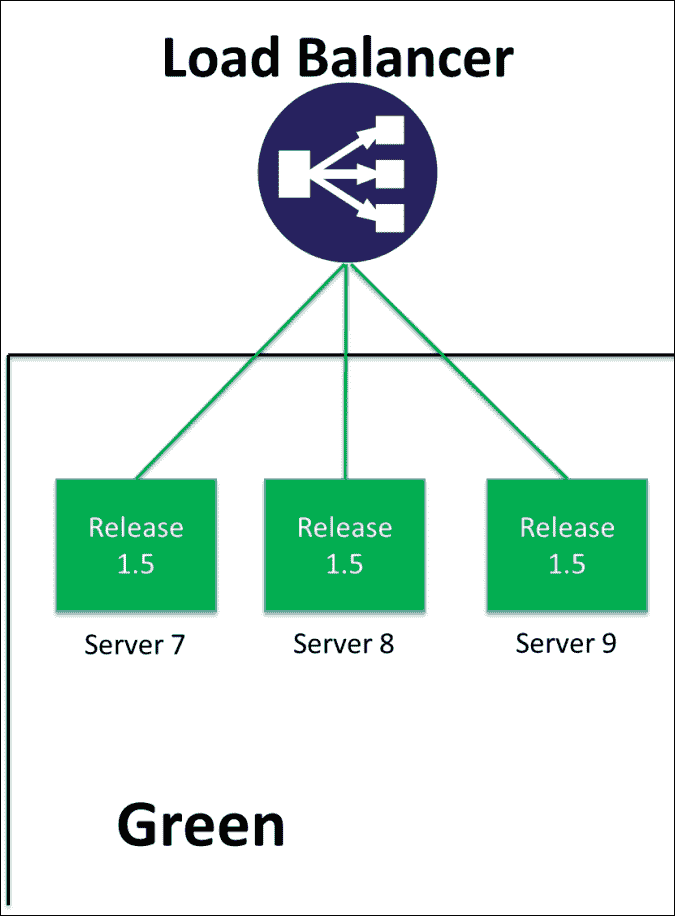

# 第五章：使用 Ansible 编排负载均衡器

本章将重点介绍一些当今流行的负载均衡解决方案，以及它们在负载均衡应用程序方面的策略。

随着云解决方案的出现，如 AWS、Microsoft Azure、Google Cloud 和 OpenStack，我们将探讨这些技术对负载均衡的影响，特别是分布式负载和集中式负载均衡策略。本章将展示可用于通过 Ansible 编排负载均衡器的实际配置管理过程，以帮助自动化应用程序的负载均衡需求。

本章将涵盖以下主题：

+   集中式和分布式负载均衡器

+   流行的负载均衡解决方案

+   负载均衡不可变和静态服务器

+   使用 Ansible 编排负载均衡器

# 集中式和分布式负载均衡器

随着微服务架构的引入，允许开发团队更频繁地对生产环境中的应用程序进行更改，开发者不再仅仅需要按季度发布软件。

随着持续交付（Continuous Delivery）和 DevOps 的推进，应用程序现在每周、每天，甚至每小时都会发布，且通常只更新和发布其中一个或部分微服务。

组织发现微服务架构更易于管理，因此逐渐摒弃了构建单体应用程序的方式。微服务应用程序将较大的应用程序拆分成更小的、可管理的模块。这使得应用程序功能可以更频繁地发布给客户，因为业务在每次发布时不需要重新部署整个产品。这意味着只需重新部署一个小的微服务即可发布一个新功能。由于发布过程更为频繁且持续进行，因此它更容易被理解，通常是完全自动化的，并最终得到负载均衡。

微服务架构对于跨多个办公室或国家的庞大企业也有益处，因为不同的团队可以拥有不同的微服务，并独立发布它们。

这当然意味着开发团队需要一种方式来测试依赖管理，并且要确保充分测试，以保证微服务在发布时不会破坏其他微服务。

结果是，开发者需要创建模拟和存根服务，以便在不部署完整生产环境的情况下有效测试微服务应用程序对多个软件版本的兼容性。

创建微服务架构是企业的一大思维转变，但这是保持竞争力的必要措施。发布单体应用程序通常对企业来说既困难又耗时，而采用季度发布周期的企业最终会被能够以更快、更精细的方式发布功能的竞争对手超越。

微服务架构的使用意味着，由于环境的动态性，能够在测试环境中使用与生产环境相同的负载均衡变得更加重要。

因此，测试环境的负载均衡配置必须尽可能接近生产环境。可以使用配置管理工具来控制负载均衡器的期望状态。

责任的委托也需要审查，以支持微服务架构，因此，部分负载均衡配置的控制应移交给开发团队，而不是向网络团队提出请求，这样既能使其易于管理，又不妨碍开发团队。这当然是一种文化变革，需要高级管理层的支持，以推动操作模型的必要变革。

使用微服务应用时，负载均衡的要求将随着应用程序的开发或规模的扩大而演变，因此，重要的是这些方面要提供给开发人员进行自助请求，而不是等待集中式网络团队来进行负载均衡的更改。

由于向微服务架构的转变，网络和负载均衡的领域也需要不断发展，以支持这些需求，许多供应商创建了 PaaS 解决方案来处理跨混合云的应用程序部署和负载均衡。

现成的 PaaS 解决方案是对于那些可能不太懂技术且无法使用配置管理工具（如 Chef、Puppet、Ansible、Salt 等）创建自己部署管道的公司来说的一个不错选择，帮助他们将应用程序部署到云环境中。

无论是采用哪种部署方式，自建还是现成的 PaaS 解决方案。在考虑公有云、私有云和混合云时，微服务和单体应用仍然需要得到支持。

因此，网络和负载均衡需要具备适应性，以支持不同的工作负载。虽然组织的最终目标是实现微服务架构，但大多数公司现实中必须采用混合方式，兼顾集中式和分布式负载均衡方法，以支持单体应用和云原生微服务。

## 集中式负载均衡

传统上，负载均衡器作为外部物理设备安装，设计非常复杂，并且使用非常昂贵的设备。负载均衡器会配置为为 Web 内容提供服务，并在昂贵的物理设备上终止 SSL 请求。

负载均衡器将有复杂的配置来通过上下文切换将请求路由到应用程序，且请求会直接传递给静态后端服务器。

这对单体配置来说是最优的，因为应用程序通常是自包含的，并且遵循三层模型：

+   前端 Web 服务器

+   业务逻辑层

+   数据库层

这并不需要大量的东西向流量，因为流量是南北向的，穿越了前端、业务逻辑和数据库。网络设计的目的是最小化处理请求并将其返回给最终用户所需的时间，并且每次都由核心网络提供服务。

## 分布式负载均衡

随着微服务架构的发展，应用程序的运行方式发生了一定变化。应用程序不再是自包含的，而是需要与同一租户网络内或跨多个租户的依赖微服务应用程序进行通信。

这意味着数据中心内的东西向流量大大增加，并且数据中心中的流量不再像以前那样始终通过核心网络。

微服务应用程序的集群被实例化并在租户网络内进行负载均衡，使用 x86 软件负载均衡解决方案，微服务集群的**虚拟 IP**（**VIP**）暴露给需要使用它的相邻微服务。

随着虚拟机、容器和软件定义覆盖网络的日益普及，这意味着软件负载均衡解决方案现在被用来在租户网络内部对应用程序进行负载均衡，而不再需要回到集中式的负载均衡解决方案。

因此，负载均衡供应商不得不适应并生产虚拟化或容器化版本的物理设备，以与开源软件负载均衡解决方案竞争，而这些解决方案通常与微服务一起使用。

# 常见的负载均衡解决方案

随着应用程序从单体架构转向微服务架构，负载均衡的需求无疑发生了变化。今天，我们看到有向开源负载均衡解决方案的转变，这些解决方案与虚拟机和容器紧密集成，用于在 AWS 中的 VPC 之间或 OpenStack 中的租户网络之间提供东西向流量，而不是依赖于集中式物理设备。

现在，开源负载均衡解决方案已经由**Nginx**和**HAProxy**提供，帮助开发人员对他们的应用程序进行负载均衡，或使用 AWS 的弹性负载均衡功能：

[`aws.amazon.com/elasticloadbalancing/`](https://aws.amazon.com/elasticloadbalancing/)

几年前，Citrix NetScalers（[`www.citrix.com/products/netscaler-adc/`](https://www.citrix.com/products/netscaler-adc/)）和 F5 Big-IP（[`f5.com/products/big-ip`](https://f5.com/products/big-ip)）解决方案在企业负载均衡领域拥有垄断地位，但随着众多新解决方案的出现，负载均衡领域发生了显著变化。

新兴的负载均衡初创公司，如 Avi Networks （[`avinetworks.com/`](https://avinetworks.com/)），专注于 x86 计算和软件解决方案，以提供负载均衡解决方案，这些解决方案旨在支持现代微服务应用程序和单体应用程序，支持分布式和集中式负载均衡策略。

本书的目的是讨论哪种负载均衡供应商解决方案最好；没有*一刀切*的解决方案，选择的负载均衡解决方案将取决于组织所需的流量模式、性能和可移植性。

本书不会深入探讨性能指标；它的目标是探讨当前各供应商提供的不同负载均衡策略以及可以用来完全自动化和编排负载均衡器的配置管理方法，这将帮助网络团队实现负载均衡网络操作的自动化。

## Citrix NetScaler

**Citrix NetScaler** 提供一系列产品来满足组织的负载均衡需求。Citrix 提供多种不同的产品供最终用户使用，如 **MPX**、**SDX**、**VPX**，以及最近推出的 **CPX** 设备，每种产品的许可证费用根据其支持的吞吐量提供灵活的定价。

MPX 和 SDX 是 NetScaler 的硬件设备，而 VPX 是虚拟化的 NetScaler，CPX 是容器化的 NetScaler。

所有这些产品根据所购买的许可证支持不同的吞吐量（[`www.citrix.com/products/netscaler-adc/platforms.html`](https://www.citrix.com/products/netscaler-adc/platforms.html)）。

Citrix NetScaler 系列产品共享相同的 API 和代码集，因此软件完全一致。NetScaler 提供 REST API 以及 Python、Java 和 C# Nitro SDK，暴露所有可以在 GUI 中进行操作的 NetScaler 功能。所有 NetScaler 产品允许以编程方式控制需要设置的 NetScaler 对象和实体，以控制 MPX、SDX、VPX 或 CPX 上的负载均衡或路由。

NetScaler MPX 设备是一个集中式的物理负载均衡设备，用于处理大量的**每秒事务数**（**TPS**）；MPX 具有众多安全特性，并且符合**有害物质限制**（**RoHS**）和**联邦信息处理标准**（**FIPS**），因此该解决方案可以被需要遵守特定监管标准的高监管行业所使用。

MPX 通常用于进行 SSL 卸载；它支持大量的 SSL 吞吐量，这对于需要高性能的应用程序非常有用，因此 SSL 卸载可以在硬件设备上完成。

MPX 可以通过第 4 层负载均衡和第 7 层上下文切换将流量引导到不同的租户网络，或者将流量引导到第二层负载均衡级别。

NetScaler SDX 设备也是一种集中式物理设备，用于处理高 TPS（每秒事务数）。SDX 允许多个 VPX 设备作为 HA 对在 SDX 上设置并部署，从而提高吞吐量和可靠性。

NetScaler 还支持 **全局服务器负载均衡**（**GSLB**），它允许在多个 VPX HA 对之间分配负载，采用扩展模型，并利用 **CNAME** 将流量引导到多个 HA 对：


VPX 可以安装在任何 x86 虚拟化平台上并作为虚拟机设备使用，此外还推出了新的 CPX，它将 NetScaler 放入 Docker 容器中，因此可以在租户网络内部署，而不是在集中式模型中设置。所有设备都允许分配和使用 SSL 证书。

每个 NetScaler 设备，无论是 MPX、SDX、VPX 还是 CPX，都采用相同的 IP 对象模型和代码，其中定义了以下显著的实体来执行应用负载均衡：

+   **服务器**：NetScaler 上的服务器实体将虚拟机或裸机服务器的 IP 地址绑定到服务器实体。这意味着一旦绑定到其他 NetScaler 实体，该 IP 地址就成为负载均衡的候选者。

+   **监控器**：NetScaler 上的监控器实体附加到服务或服务组，并提供用于监控附加服务器实体健康状况的健康检查。如果健康检查结果不正常（例如简单的网页 ping），则服务或服务组将被标记为不可用，NetScaler 将不会将流量引导到该服务。

+   **服务组**：服务组是 NetScaler 实体，用于将一个或多个服务器绑定到 `lbvserver` 实体；服务组可以与一个或多个监控器关联，以对关联的服务器进行健康检查。

+   **服务**：服务实体用于将一个服务器实体和一个或多个监控健康检查绑定到 `lbvserver` 实体，该实体指定用于检查服务器的协议和端口。

+   **lbvserver**：`lbvserver` 实体确定负载均衡策略，如轮询或最少连接，并与服务组实体或多个服务实体连接，暴露一个虚拟 IP 地址，供终端用户访问 Web 应用程序或 Web 服务端点。

+   **gslbvserver**：当需要在 NetScaler 设备之间进行 DNS 负载均衡时，使用 `gslbvserver` 实体来指定 `gslb` 域名和 TTL。

+   **csvserver**：`csvserver` 实体用于提供从 gslbvserver 域或 lbvserver IP 地址到其他 lbvservers 的第七层上下文切换。这用于通过 NetScaler 设备路由流量。

+   **gslbservice**: `gslbvservice` 实体将 `gslbvserver` 域绑定到一个或多个 `gslbservers` 实体，从而在 NetScaler 设备之间分配流量。

+   **gslbserver**: `gslbserver` 实体是启用了 gslb 的 NetScaler 设备的 IP 地址。

通过利用服务器、监视器、服务组/服务和 lbvserver 的组合，可以实现简单的负载均衡。通过 `gslbvserver` 和 `csvserver`，上下文切换允许复杂路由和弹性要求。

## F5 Big-IP

**F5 Big-IP** 套件基于 F5 自有的定制 TMOS 实时操作系统，该操作系统是自包含的并运行在 Linux 上。TMOS 包含一系列操作系统和固件，所有这些都运行在 BIG-IP 硬件设备或 BIG-IP 虚拟实例中。BIG-IP 和 TMOS（甚至 TMM）可以根据使用案例互换使用。

TMOS 是每个 F5 设备的核心，允许流量检查。它根据流量类型做出转发决策，功能类似防火墙，只允许预定义的协议通过 F5 系统。

TMOS 还具有 iRules，它是使用 F5 自有的 **工具命令语言**（**TCL**）编写的程序化脚本，使用户能够创建由特定事件触发的独特功能。这可以用于内容交换流量或重新排序 HTTP cookies；TCL 完全可扩展和可编程，能够执行众多操作。

F5 Big-IP 解决方案主要是硬件负载均衡解决方案，提供多种物理硬件设备，客户可以根据其吞吐量要求购买，硬件设备可以集群在一起以实现冗余。

F5 Big-IP 套件提供了多种产品，提供负载均衡、流量管理，甚至防火墙服务。

F5 Big-IP 套件提供的主要负载均衡服务如下：

+   **Big-IP DNS**: F5 的全球负载均衡解决方案。

+   **Local traffic manager**: F5 Big-IP 套件的主要负载均衡产品。

F5 Big-IP 解决方案与 Citrix NetScaler 类似，采用对象模型允许负载均衡被程序化定义和虚拟化。F5 允许将 SSL 证书与实体关联。

以下本地流量管理器对象实体允许 F5 Big-IP 进行应用负载均衡：

+   **Pool members**: 池成员实体映射到虚拟或物理服务器的 IP 地址，并且可以绑定到一个或多个池。池成员可以关联健康监视器。

+   **Monitor**: 监视器实体返回特定池成员的状态，并充当健康检查功能。

+   **Pool**: 池实体是一个逻辑分组，包含已关联的池成员集；池也可以与健康监视器以及 **服务质量**（**QoS**）相关联。

+   **虚拟服务器**：虚拟服务器实体与一个或多个池关联，虚拟服务器决定负载均衡策略，例如轮询或最少连接。F5 解决方案也提供基于容量或最快连接的负载均衡解决方案。利用 iRules 的第七层配置文件可以针对虚拟服务器进行配置，并用于暴露 IP 地址以访问池成员。

+   **iRules**：iRules 使用编程语言 TCL，用户可以基于事件（如切换到不同池）编写特定的负载均衡规则。

+   **速率类别**：速率类别实现了速率整形，用于控制特定负载均衡操作的带宽消耗，以限制吞吐量。

+   **流量类别**：流量类别实体用于根据特定事件调节流量流向。

## Avi Networks

**Avi Networks** 是一家相对较新的初创公司，但他们拥有一款非常有趣的负载均衡产品，真正体现了软件定义的理念。这是一款企业级软件负载均衡解决方案，包含可以部署在 x86 计算平台上的 **Avi Controller**。Avi 是一种纯软件解决方案，将分布式 Avi 服务引擎部署到租户网络中，并与 AWS VPC 及 OpenStack 租户进行集成：


Avi Networks 解决方案提供自动化的负载均衡服务配置功能，支持在 x86 虚拟化平台上进行自动扩展，根据用户配置的利用率规则，灵活地根据负载均衡需求进行扩展。

Avi Networks 解决方案支持多个或隔离的租户，并且拥有一个实时应用监控和分析引擎，可以定位网络中延迟的发生位置及数据包的路由来源地。

Avi 还支持丰富的图形界面，显示负载均衡实体，用户可以直观地查看负载均衡情况，同时还支持抗 DDoS 防护。

所有通过 GUI 或 API 发出的命令都使用相同的 REST API 调用。Avi Networks 解决方案支持 Python 和 REST API。Net Networks 对象模型有许多实体，类似于 NetScalers 和 F5，能够定义负载均衡。

+   **健康监测配置文件**：健康监测池配置文件实体指定池服务器的健康检查，使用健康属性进行监控。

+   **池**：池实体指定虚拟或物理服务器的 IP 地址，以服务器列表的形式呈现，并具有关联的健康监测配置文件；如果池出现故障，还可以通过数据脚本指定事件。一个或多个池与虚拟服务实体绑定。

+   **自定义策略**：自定义策略允许用户以编程方式指定虚拟服务的策略。

+   **应用配置文件**：应用配置文件实体允许将每个应用程序建模，并为其指定相关的 HTTP 属性、安全性、DDoS、缓存、压缩和 PKI 属性，这些都作为与虚拟服务关联的应用配置文件的一部分。

+   **分析配置文件**：分析配置文件利用 Avi 分析引擎，捕获威胁、指标、健康评分、延迟阈值以及失败代码，这些都映射到虚拟服务实体。

+   **TCP/UDP 配置文件**：TCP/UDP 配置文件管理是否使用 TCP 或 UDP，并设置任何 DDoS L3/L4 配置文件。

+   **SSL 配置文件**：SSL 实体管理虚拟服务实体将使用的 SSL 密码套件。

+   **PKI 配置文件**：PKI 配置文件实体绑定到虚拟服务实体，并指定虚拟服务的证书颁发机构。

+   **策略集**：策略集实体允许用户设置安全团队为每个虚拟服务设置针对请求和响应的策略。

+   **虚拟服务**：虚拟服务实体是负载均衡服务器池的入口点 IP 地址，并与所有配置文件关联，用于定义应用池的负载均衡，同时绑定到 TCP/UDP、应用、SSL、SSL 证书、策略和分析配置文件。

## Nginx

**Nginx** ([`www.nginx.com/`](https://www.nginx.com/)) 支持商业版和开源版。它是一个基于 x86 的软件负载均衡解决方案。Nginx 可以作为 HTTP 和 TCP 负载均衡器使用，支持 HTTP、TCP，甚至 UDP，还可以支持 SSL/TLS 终结。

Nginx 可以通过使用 *keepalived* 设置冗余模式，以便在一个 Nginx 负载均衡器发生故障时，能够无缝切换到备份服务器，并且零停机时间。

Nginx Plus 是商业版，功能比开源版更完整，支持主动健康检查、会话持久性和缓存等功能。

Nginx 的负载均衡是通过在 `nginx.conf` 文件中声明语法来设置的。其工作原理是简化负载均衡配置。与 NetScalers、F5 和 Avi Networks 不同，它不使用对象模型来定义负载均衡规则，而是通过声明式语法将负载均衡的虚拟或物理机器描述为后端服务器。

在以下简单示例中，我们看到三台服务器，`10.20.1.2`、`10.20.1.3` 和 `10.20.1.4`，所有的负载均衡都使用 Nginx 声明式语法在端口 `80` 上进行，并且它通过 `http://www.devopsfornetworking.com/devops_for_networking` 提供服务：


默认情况下，Nginx 会使用轮询负载均衡方法来负载均衡服务器，但它也支持其他负载均衡方法。

Nginx 的 `least_conn` 负载均衡方法会将请求转发到当前连接数最少的后端服务器，而 Nginx 的 `ip_hash` 负载均衡方法则意味着用户可以将相同的源地址绑定到同一目标后端服务器，以便整个请求过程中保持一致。

这对于某些应用程序非常有用，它们要求所有请求在事务处理过程中绑定到同一服务器上，即使用粘性会话。

然而，专有版本的 Nginx Plus 支持一种额外的负载均衡方法，名为 `least_time`，该方法基于后端服务器的活动连接数计算最低延迟，并根据这些计算结果适当地转发请求。

Nginx 负载均衡器在进行负载均衡时始终使用权重系统；默认情况下，所有服务器的权重为 `1`。如果服务器的权重设置为 `1` 以外的值，除非后端的其他服务器无法处理请求，否则该服务器不会接收请求。此功能在对后端服务器进行流量限制时非常有用。

在以下示例中，我们可以看到后端服务器配置了最少连接数的负载均衡方法。服务器 `10.20.1.3` 的权重为 `5`，这意味着只有当 `10.20.1.2` 和 `10.20.1.4` 达到最大负载时，才会将请求发送到 `10.20.1.3` 后端服务器：


默认情况下，Nginx 使用轮询负载均衡时，不会停止向未响应的服务器转发请求，因此需要利用 `max_fails` 和 `fail_timeouts` 进行处理。

在以下示例中，我们可以看到服务器 `10.20.1.2` 和 `10.20.1.4` 的 `max_fail` 计数为 `2`，并且 `fail_timeout` 为 `1` 秒；如果超过这个值，Nginx 将停止将流量引导到这些服务器：


## HAProxy

**HAProxy** ([`www.haproxy.org/`](http://www.haproxy.org/)) 是一款开源的 x86 软件负载均衡器，具有会话感知功能，并可以提供 4 层负载均衡。HAProxy 负载均衡器还可以根据请求的内容进行 7 层上下文切换，并支持 SSL/TLS 终止。

HAProxy 主要用于 HTTP 负载均衡，并可以通过使用 `keepalived` 配置和两台 Apache 配置以冗余方式进行设置，这样如果主服务器出现故障，备份服务器将成为主服务器，以确保终端用户服务不中断。

HAProxy 使用声明式配置文件来支持负载均衡，而不是采用专有负载均衡解决方案（如 NetScaler、F5 和 Avi Networks）所采用的对象模型。

HAProxy 配置文件包含以下声明式配置部分，以允许设置负载均衡：

+   **后端**：后端声明可以包含一个或多个服务器；后端服务器可以以 DNS 记录或 IP 地址的形式添加。可以在 HAProxy 服务器上设置多个后端声明。还可以选择负载均衡算法，如轮询或最少连接数。

    在以下示例中，我们看到两个后端服务器 `10.11.0.1` 和 `10.11.0.2`，使用轮询算法在端口 `80` 上进行负载均衡：

    

+   **检查**：检查可以避免用户在服务器因某种原因变得不可用时手动将其从后端移除，从而减少停机时间。HAProxy 的默认健康检查总是尝试使用默认端口和 IP 建立与服务器的 TCP 连接。如果服务器无法提供请求，HAProxy 会自动禁用该服务器以避免停机。服务器只有在通过健康检查后才会重新启用。如果后端所有服务器都未通过健康检查，HAProxy 会将整个后端报告为不可用。

    可以通过使用 `{health-check}` 选项对后端服务器进行多种健康检查；例如，在以下示例中，即使端口 `443` 正在进行负载均衡，`tcp-check` 也可以检查端口 `8080` 的健康状况。

    

+   **访问控制列表（ACL）**：ACL 声明用于检查头信息并根据头信息将流量转发到特定的后端服务器。HAProxy 中的 ACL 将尝试根据条件触发动作。

+   **前端**：前端声明允许 HAProxy 负载均衡器支持不同类型的流量。

    在以下示例中，HAProxy 将接受端口 `80` 上的 http 流量，使用 ACL 只匹配以 `/network` 开头的请求，并且当匹配 `/web-network` 的 ACL 时，它将被转发到 `high-perf-backend`：

    

# 负载均衡不可变和静态基础设施

随着 AWS 和 OpenStack 等公共和私有云解决方案的出现，已转向使用不可变基础设施，取代传统的静态服务器。

这引发了关于 *宠物与牲畜* 的争论，或者正如 Gartner 定义的那样，*双模式* ([`www.gartner.com/it-glossary/bimodal/`](http://www.gartner.com/it-glossary/bimodal/))。

Gartner 表示需要采取两种不同的策略，一种用于新的微服务，*牲畜*，另一种用于传统基础设施，*宠物*。*牲畜*是指一旦完成任务或出现问题就会被淘汰的服务器，通常生命周期为一个发布周期。相对地，*宠物*是指那些会有数月或数年正常运行时间并会由运维人员进行修补和照顾的服务器。

Gartner 将*宠物*定义为模式 1，将*牲畜*定义为模式 2。据说，*牲畜*方法更适合无状态的微服务云原生应用，而*宠物*则是指任何单体应用，或者是包含数据的应用，比如数据库。

很多人认为，不可变基础设施和像 OpenStack 和 AWS 这样的解决方案更倾向于*牲畜*，而单体应用和数据库仍然作为宠物，仍需要一个适用于长期运行服务器的平台。

就个人而言，我觉得*宠物*与*牲畜*的辩论是一个非常懒散的争论，令人有些疲惫。与其将应用程序划分为两类，不如把应用程序看作是一个软件交付问题，这就变成了无状态的读取应用和有状态的应用，后者涉及缓存和数据。云原生微服务应用仍然需要数据和状态，因此我对这种区分感到困惑。

然而，毫无争议的是，负载均衡器是不可变基础设施的关键，因为至少有一个版本的应用程序始终需要向客户或其他微服务公开，以确保该应用程序在任何时候都没有停机并保持运行状态。

## 静态和不可变服务器

在历史上，企业通常会使用运维团队执行以下服务器操作：

+   安装机架和电缆

+   提供固件更新

+   配置 RAID 配置

+   安装操作系统

+   打补丁操作系统

这一切发生在将服务器提供给开发人员之前。静态基础设施仍然可以存在于云环境中；例如，由于需要在本地磁盘上持久化大量数据，数据库通常仍作为静态的物理服务器部署。

静态服务器指的是一组通常会包含状态的长期运行服务器。

另一方面，不可变服务器意味着每次虚拟机发生变化时，都会部署一个新的虚拟机，配备新的操作系统和新发布的软件，彻底删除旧的内容。不可变基础设施意味着不会对服务器状态进行就地更改。

这避免了进行就地升级的痛苦，并确保雪花服务器配置成为过去，过去每台服务器尽管有最好的意图，但在一段时间后总会有轻微的偏离其期望状态。

发布软件时，有多少次软件只在五台机器中的四台上正常工作，浪费了数小时或数天的时间来调试为什么某个软件升级在特定服务器上无法正常工作。

不可变基础设施从已知状态构建服务器，推动相同的配置到质量保证、集成、性能测试和生产环境。

云基础设施的部分组件可以完全不可变，以此来获取这些优势。操作系统就是其中一个候选对象；与其进行就地修补，不如创建一个单一的金镜像，并使用自动化工具（如 Packer）进行完全自动化的补丁更新。

需要缓存层的应用程序本质上更有状态，因此缓存需要始终可用，以便为其他应用程序提供服务。这些缓存应用程序应该以集群的形式部署，并进行负载均衡，滚动更新将确保始终有一个版本的缓存数据可用。该缓存层的新软件版本应该在销毁之前的版本之前同步缓存数据。

另一方面，数据是持久的，因此可以存储在持久存储中，然后由操作系统挂载。当进行不可变的滚动更新时，操作系统层可以在发布过程中将数据挂载到持久或共享存储上。

可以将操作系统和数据分开，从而使所有虚拟机无状态。例如，可以利用 OpenStack Cinder（[`wiki.openstack.org/wiki/Cinder`](https://wiki.openstack.org/wiki/Cinder)）将持久数据存储在可以附加到虚拟机上的卷中。

考虑到所有这些使用场景，大多数应用程序可以通过适当的配置管理设计为不可变的部署，甚至是单体应用程序，只要它们不是单点故障。如果某些应用程序是单点故障，它们应该被重新架构，因为发布软件不应导致停机。尽管应用程序是有状态的，但每个状态可以分阶段更新，从而保持一个总体的不可变基础设施模型。

## 蓝绿部署

**蓝绿部署**过程并不是一个新概念。在云解决方案崭露头角之前，生产服务器通常会有一组由蓝色（无实时流量）和绿色（提供客户流量）服务器组成的服务器集群，这些服务器会交替使用。这些通常被称为蓝绿服务器，每次发布时会进行交替。

简单来说，蓝绿模型意味着，当需要进行软件升级时，蓝色服务器会被升级到最新的软件版本。升级完成后，蓝色服务器将成为新的绿色服务器，实时流量将切换到新升级的服务器上。

切换实时流量通常是通过将 DNS 条目切换到指向新升级服务器来完成的。因此，一旦 DNS **生存时间**（**TTL**）传播完成，最终用户的请求就会由新升级的服务器来处理。

这意味着，如果软件发布出现问题，可以通过将 DNS 条目切换回指向上一个软件版本来实现回滚。

典型的蓝绿部署过程如下所述：

**Release 1.1** 将部署在服务器 1、2 和 3 上，并通过负载均衡器向客户提供服务，并设置为绿色（上线）：


**Release 1.2** 将部署在服务器 4、5 和 6 上，然后打上最新的补丁版本，升级到最新的发布版本并进行测试。准备好后，运维团队将切换负载均衡器，将 4、5 和 6 号服务器设置为新的生产发布版本，如后续所示，而之前的绿色（上线）部署将变为蓝色，反之亦然：


当运维团队进行下一个发布时，服务器 1、2 和 3 将被打上最新的版本，升级到 **Release 1.3**（从 **Release 1.1** 升级），进行测试，准备好后，运维团队将使用负载均衡器将流量引导到新版本，使 **Release 1.2** 为蓝色，**Release 1.3** 为绿色，如下图所示：


传统上，这是使用静态服务器进行蓝绿部署的过程。

然而，在使用不可变模型时，与使用长寿命的静态服务器（例如服务器 1、2、3、4、5 和 6）不同，在发布成功后，服务器将被销毁，如此处所示，因为它们已经完成了使命：


下次需要服务器 4、5 和 6 时，不是进行就地升级，而是会从云环境中的黄金基础镜像创建三台新虚拟机。这些黄金镜像已经打好最新的补丁，因此全新的服务器 7、8 和 9 会在销毁旧服务器后部署 **Release 1.4**，如后续所示。

一旦服务器 7、8 和 9 上线，服务器 1、2 和 3 将被销毁，因为它们已经完成了使命：


# 使用 Ansible 协调负载均衡器

在 第四章，*使用 Ansible 配置网络设备* 中，我们介绍了 Ansible 的基本概念，以及如何使用 Ansible 控制主机、playbooks 和角色进行网络设备的配置管理。然而，Ansible 还有许多不同的核心操作可以帮助协调负载均衡器，我们将在本章中详细讨论。

## 委托

Ansible 委托是一种强大的机制，意味着从 playbook 或角色中，Ansible 可以通过 SSH 或 WinRM 连接到清单文件中指定的目标服务器，或者从 Ansible 控制主机上交替执行命令。

下图展示了这两种替代连接方法，Ansible 控制主机要么通过 SSH 登录到机器配置它们，要么直接从 Ansible 控制主机运行 API 调用：


这两种选项都可以通过相同的角色或剧本执行，使用 `delegate_to`，这使得剧本和角色非常灵活，因为它们可以结合 API 调用和服务器端配置管理任务。

委托的一个示例可以在后面找到，那里使用了 Ansible 附加的 HAProxy 模块，并使用 `delegate_to` 来触发一个协调操作，该操作禁用库存文件中的所有后端服务：


## 利用 serial 控制滚动百分比

为了在不打断服务的情况下发布软件，最好采用零停机时间的方法，因为它不需要维护窗口来安排更改或发布。Ansible 支持 *serial* 选项，它将百分比值传递给剧本。

*serial* 选项允许 Ansible 遍历库存，并仅对一部分机器执行操作，完成必要的剧本后，再移动到库存的下一部分。需要注意的是，Ansible 将库存传递为一个无序的字典，因此处理的库存百分比将不是按特定顺序进行的。

使用 *serial* 选项，Ansible 可以采用蓝绿策略，因此需要将机器从负载均衡器中移除并进行升级，然后再投入使用。与增加机器数量不同，三个机器是足够的，如下图所示，所有这些机器都运行 **版本 1.4**：


使用以下 Ansible 剧本，结合 `delegate_to` 和 `serial`，可以通过滚动更新升级每台服务器：


该剧本将执行以下步骤：

1.  `serial 30%` 表示一次只有一个服务器进行升级。因此，**服务器 7** 将通过在 Ansible 控制主机上使用本地 `delegate_to` 操作来从 HAProxy 的 `backend_nodes` 池中移除，禁用该服务，然后执行 `yum` 更新，升级服务器版本并安装新的 `application1` 发布 **版本 1.5**，如下所示：

1.  **服务器 7** 将再次启用，并通过本地 `delegate_to` 操作将其重新投入负载均衡器中。serial 命令将继续作用于 `server 8`，在 HAProxy 上禁用它，然后执行 `yum` 更新，升级服务器版本并安装新的 `application1` 发布 **版本 1.5**，如下所示：

1.  滚动更新将启用负载均衡器上的**服务器 8**，然后序列命令将切换到**服务器 9**，在 HAProxy 上禁用该服务器，然后执行 yum 更新，这将升级服务器并安装新的`application1`版本**1.5**，根据需要在本地服务器和远程服务器之间交替执行，如下所示：

1.  最后，剧本将通过在负载均衡器上启用**服务器 9**来完成，所有服务器将使用 Ansible 升级到**版本 1.5**，具体如下：

## 动态库存

在处理云平台时，仅使用静态库存有时并不够。了解已部署在资源中的服务器库存，并根据特征或配置文件选择其中的子集是非常有用的。

Ansible 有一个增强功能，称为动态库存。它允许用户使用 Python 脚本查询他们选择的云平台；这将作为自动发现工具，可以连接到 AWS 或 OpenStack，并返回 JSON 格式的服务器库存。

这允许 Ansible 将此 JSON 文件加载到剧本或角色中，以便进行迭代。同样，静态库存文件也可以通过变量传递。

动态库存适用于相同的命令行结构，而不是传递以下静态库存：

```
ansible-playbook –i inevntories/inevtontory –l qa –e current_build=9 playbooks/add_hosts_to_netscaler.yml

```

然后，可以传递 OpenStack 云提供商的动态库存脚本`openstack.py`：

```
ansible-playbook –i inevntories/openstack.py –l qa –e environment=qa playbooks/devops-for_networking.yml

```

动态库存脚本可以设置特定限制。在前述情况下，返回的唯一服务器库存是质量保证服务器，这是通过`–l qa`限制来控制的。

在使用 Ansible 配置不可变服务器时，可以利用静态库存文件来启动新的虚拟机，而静态库存则可以在虚拟机已经创建后查询资源并执行附加操作。

## 标签元数据

在 Ansible 中使用动态库存时，元数据变得非常重要，因为在云环境中部署的服务器可以使用标记在虚拟或物理机器上的元数据进行排序和过滤。

在配置 AWS、Microsoft Azure 或 OpenStack 实例时，可以在公共或私有云中为服务器标记元数据，以便对它们进行分组。

在以下示例中，我们可以看到一个剧本使用`os_server` OpenStack 模块创建新的 OpenStack 服务器。它将遍历静态库存，标记每个新创建的组，并释放机器上的元数据：


然后，可以使用`–l`参数过滤动态库存，指定`group: qa`的服务器。这将返回一个合并后的服务器列表。

## Jinja2 过滤器

**Jinja2 过滤器**允许 Ansible 过滤 playbook 或角色，从而控制在执行特定命令或模块之前需要满足哪些条件。Ansible 提供了多种现成的 Jinja2 过滤器，或者也可以编写自定义过滤器。

使用 Jinja2 过滤器的 playbook 示例将仅在服务器的元数据 `openstack.metadata.build` 值等于当前构建版本时，才将该服务器添加到 NetScaler 中：


执行 ansible-playbook `add_hosts_to_netscaler.yml` 命令，并通过 `–l` 限制为 `qa`，将仅返回 `qa` 元数据组中的主机作为库存。然后，主机可以在 playbook 或角色中进一步使用 when Jinja2 过滤器进行过滤，只有当主机的 `openstack.metadata.build` 值与 `current_build` 变量 `9` 匹配时，才会执行“加入负载均衡池”命令：

```
ansible-playbook –I inevntories/openstack.py –l qa –e environment=qa –e current_build=9 playbooks/add_hosts_to_netscaler.yml

```

结果将是，只有新的主机会被添加到 NetScaler 的 `lbvserver` VIP 中。

这些主机也可以以类似方式在同一 playbook 中使用 *不等于* 条件删除：


所有这些可以结合使用，同时配合串行百分比，将新版本逐步部署到负载均衡器中，并利用动态库存、委托、Jinja2 过滤器和 Ansible 的串行滚动更新功能一起实现简单的负载均衡器编排。

## 创建 Ansible 网络模块

由于 Ansible 可用于调度对负载均衡器的 API 命令，因此可以轻松地用它来构建出流行网络解决方案（如 Citrix NetScaler、F5 Big-IP 或 Avi Networks）所使用的负载均衡器对象模型。

随着微服务架构的推广，负载均衡配置需要拆分以保持可管理性，因此它是以应用为中心的，而不是存储在集中式的单体配置文件中。

这意味着在进行负载均衡更改时会涉及操作问题，因此网络操作员可以使用 Ansible 来构建复杂的负载均衡规则、应用 SSL 证书、设置更复杂的第 7 层上下文切换或公共 IP 地址，并将这些作为服务提供给开发人员。

利用负载均衡供应商提供的 Python API，每个操作可以作为一个模块创建，并使用一组 YAML `var` 文件来描述负载均衡器的预期状态。

在稍后的示例中，我们将探讨开发人员如何利用 Ansible 的变量文件为每个新的虚拟服务器创建服务和健康监控器，这些虚拟服务器运行在 NetScaler 上。然后，这些服务会绑定到由网络团队创建的 `lbvserver` 实体，并设置为 10% 的滚动百分比，可以加载到 playbook 的 `serial` 命令中。playbook 或角色用于创建服务、lbmonitors、34 个服务器并将服务绑定到 lbvservers，而变量文件则描述了这些 NetScaler 对象的期望状态：


# 摘要

在本章中，我们看到从专有供应商到开源解决方案都提供了各种负载均衡解决方案，并讨论了微服务对负载均衡的影响，将其从集中式模型转变为分布式模型，以帮助应对东西向流量。

然后，我们探讨了蓝绿部署模型、不可变和静态服务器的优点，以及如何在这两种模型中使用 Ansible 协调软件发布。在此过程中，我们展示了 Ansible 在协调负载均衡器时的有用性，通过利用动态库存、滚动更新、委派和 jinja2 过滤器，帮助实现负载均衡的需求。

本章的关键要点是，微服务应用程序改变了应用程序负载均衡的方式，分布式负载均衡在部署微服务应用程序时更为适合，因为微服务应用程序具有更多的东西-西行流量模式。

不可变基础设施为什么非常适合微服务应用程序的原因现在应该很清楚了。本章还定义了如何将状态和数据从操作系统中分离，以及支持无状态和有状态应用程序所需的不同滚动更新模型。在下一章中，我们将研究如何将这些相同的自动化原则应用到 SDN 控制器上，主要聚焦于 Nuage 解决方案。它将涵盖配置防火墙规则和其他 SDN 命令，从而使整个网络可以通过编程进行控制和自动化。
