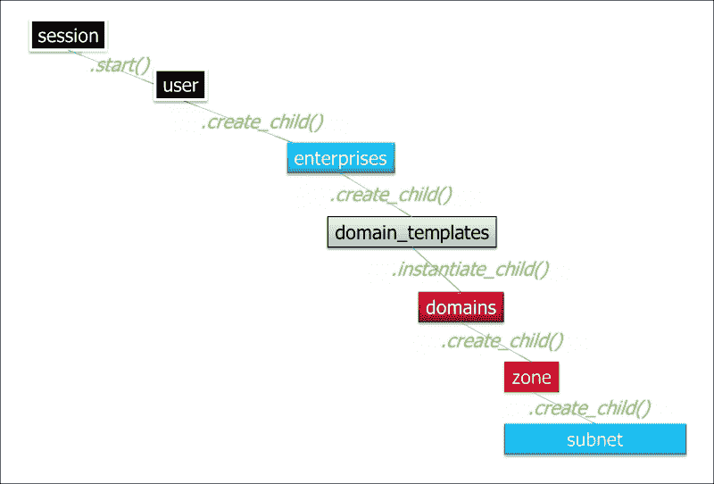

# 第六章：使用 Ansible 编排 SDN 控制器

本章将重点讨论 SDN 控制器及其如何帮助网络团队简化日常任务。

我们将探讨为什么 SDN 控制器被采纳，并重点介绍它们在正确使用时所带来的即时业务好处。重点讨论的是如何拆分网络操作，以便通过利用自动化扩展网络操作。

本章将讨论利用软件定义网络的好处，并介绍可用于编排 SDN 控制器 API 和对象模型的实际配置管理流程。最后，我们将探讨如何使用 Ansible 执行并包装一些这些配置管理流程，以 Nuage VSP 作为实际示例。

本章将涵盖以下主题：

+   关于软件定义网络的争议

+   为什么公司要使用 SDN？

+   网络操作的拆分

+   不可变的网络

+   使用 Ansible 编排 SDN 控制器

# 关于软件定义网络的争议

随着 AWS、Microsoft Azure 和 Google Cloud 等公共云的出现，网络现在被视为一种商品，并从硬件转向了软件。这使得开发人员能够根据应用程序的需求调整网络，而不是将应用程序强行适配到一个可能未针对现代微服务应用程序进行优化的老旧网络中。

因此，如果任何企业想要以不同的方式对待其内部数据中心网络，那么这似乎是没有意义的。然而，像所有新思想一样，接受和采用之前总是伴随着恐惧和不确定性，这与新的或不同的工作方式密切相关。

反对使用 Clos Leaf-Spine 架构和 SDN 控制器的常见争论围绕一个共同的主题，那就是它需要变革，而变革是困难的。我们回到 OSI 模型的传说中的第 8 层，那就是**用户**层：

网络操作员必须对实施的任何解决方案感到舒适。这一点非常重要，但同样重要的是**用户**层，因为它是由网络团队提供给最终用户的网络服务。因此，易用性在两个层面上都很重要：网络操作和提供给网络消费者的自服务操作。

在公司考虑实施软件定义网络之前，他们需要出于正确的理由，并根据需求来实施。单纯实施一个新工具，在这种情况下是 SDN 控制器，无法单独解决操作性问题。

组织需要弄清楚新的运营模式应是什么，并利用软件定义网络作为这些新业务流程的促进者，专注于运营速度，旨在消除网络作为应用交付瓶颈的存在。简而言之，网络运营需要适应 DevOps，否则它们会妨碍软件交付，拖慢整个应用生命周期。

## 增加的网络复杂性

反对使用覆盖网络的部分论点是，它们比传统的二层网络更复杂，拥有更多的动态组件，这些组件可能导致更广泛的故障。

尽管覆盖网络和基础网络的构建方式可能不同，但可以公平地说，软件定义网络仍然是一个相对较新的概念，许多人对改变感到恐惧。只要在网络可用性、冗余性、性能和变更速度等基本要求得到满足，就没有理由不实施软件定义网络。

对软件定义覆盖网络的恐惧可以类比为运营人员最初对服务器虚拟化的怀疑，他们最初反对引入虚拟机监控程序。这些新概念最初被视为额外的复杂层和抽象层，可能不会像预期那样具有良好的性能。

然而，通过运行虚拟机监控程序所带来的可移植性和机遇，远远超过了对绝大多数应用场景的性能影响。这些好处包括提高的可移植性、灵活性和操作速度。

当然，仍然存在一些边缘案例和不适用于虚拟化模型的应用，但虚拟化为 99%的数据中心带来的好处意味着，作为一种商业解决方案，它实在不能被忽视。

覆盖网络为网络带来的好处与虚拟机监控程序为服务器带来的好处相似。当然，在实施软件定义覆盖网络时，基础网络应该为冗余性构建，这样一旦发生故障，它会发生在基础网络上，而不会影响覆盖网络。

基础网络应具备横向扩展性且简单，以叶脊架构为例，架构中一系列脊交换机连接到位于每个机架顶部的叶交换机。引入更多配有叶交换机的机架，或者增加新的脊交换机来防止链路过载，可以实现横向扩展性。

关于覆盖网络增加复杂性的问题，任何一位花费数小时调试二层生成树网络中表现不佳的链路的系统可靠性工程师或网络工程师都会证明，生成树网络本身就非常复杂。系统可靠性工程师或网络工程师可能还会展示他们为了解决问题而绘制的网络图，作为复杂性的证据。

因此，网络在最好的时候也很复杂；然而，在使用承载网和叠加网时，承载网的主要关注点应是横向可扩展性和性能。它应确保网络运营商能够根据需求轻松扩展网络。

另一方面，叠加网络的重点是简洁性，因此它应该具有易于理解的软件结构，同时确保 API 端点能够处理来自消费者的所需数量的并发请求。

如果实施得当，网络应该分为两个不同的部分。叠加网络是用户友好的软件，类似于 AWS、Microsoft Azure、Google Cloud 或 OpenStack，而承载网则是需要网络架构师精心设计并为可扩展性构建的硬核网络。

## 缺乏软件定义网络技能

另一个反对不实施软件定义网络的论点是当前行业内缺乏技能；对于任何新技术来说，最初都会缺乏足够的熟练人员来支持它。一个观点是，公司将不得不雇佣全新的员工来实施软件定义网络。

然而，这可以通过与 SDN 供应商合作或利用提供的员工培训计划来弥补。这是一种业务转型，因此，网络人员需要在一段时间内不断培养新技能。

但是，网络人员需要随着软件定义网络带来的变化而发展，并像 IT 的其他团队一样培养新技能。实施软件定义网络一开始是一个巨大的变化，但优秀的网络人员应该感到兴奋并迎接这些变化。实施软件定义网络所能带来的效率和收益是不可否认的。

改变一开始可能令人畏惧，有时可能看起来像是一次巨大的文化变革或努力。要在大公司甚至小公司中成功发起变革，通常必须有自上而下的支持或支持。

采用软件定义网络将意味着改变业务的运营模式，并且自动化将在每个层面上得到采用；在使用 SDN 控制器时，叠加网络中的网络任务不能再是手动的。实施软件定义网络的组织还需要寻找自动化承载网的方法。在本书中，我们已经研究了如何利用 API 配置网络设备，因此，承载网和叠加网都需要实现自动化。

“软件定义数据中心”这一术语被厂商过度使用，但如果网络团队希望为公司其他部门提供卓越的用户体验，这背后的原则不能被忽视。如果公司将软件定义网络解决方案作为独立的举措来实施，但如果没有编写自动化以利用提供的丰富 API 来加速网络操作，那么它将没有真正的价值。如果公司要部署软件定义网络，并让网络工程师手动输入网络设备上的命令或使用 GUI，那么公司不如不做，因为他们可以使用任何现成的交换机或路由器来做到这一点；他们浪费了软件定义覆盖网络所提供的机会。

仅仅部署软件定义网络解决方案，而仍然让开发人员提出网络工单，将不会带来任何商业价值；它不会提高效率、市场上线时间或变更的可靠性。为了确保组织从软件定义网络中提取出显著的商业利益，你需要一种全有或全无的方法；网络操作要么完全自动化，要么随着时间推移变得碎片化并崩溃。

如果网络工程师坚持在自动化工作流外进行手动更新，那么它可能会打破整个操作模式。它会改变网络的期望状态，并可能完全破坏自动化。

在部署软件定义网络时，首先自动化所有常见操作，并允许开发人员自助服务，如果可能的话，确保它是不可变的。能够从源代码控制管理系统重建网络应该是目标，因为它充当了变更记录。

在第三章，*将 DevOps 引入网络操作*，我们讨论了如何启动文化变革。人类是习惯性动物，他们倾向于坚持自己知道的东西；网络工程师花了多年时间获得网络认证，学习如何配置生成树算法和二层网络，因此这是一次巨大的文化转变。

## 支持常规要求的有状态防火墙

软件定义网络的主要问题之一是缺乏有状态防火墙，因为 Open vSwitch 基于流量数据，并且传统上是无状态的。直到最近，反射规则被用来在内核用户空间级别模拟有状态防火墙。

然而，最近 Open vSwitch 的特性发展使得有状态防火墙得以实现。因此，Open vSwitch 的有状态防火墙问题不再存在。**连接跟踪**（**conntrack**），以前仅作为 iptables 的一部分，现在已从 iptables 中解耦，这意味着现在可以同时根据连接和流量数据进行匹配。

Nuage VSP 平台在其 4.x 版本中引入了有状态防火墙。Nuage VSP 平台用有状态规则取代了反射规则，以管理 Nuage VRS（Nuage 定制版 Open vSwitch）上的所有 ICMP 和 TCP ACL 规则：

# 为什么组织需要软件定义网络？

任何优秀的企业网络都应该以以下目标为基础构建：

+   性能

+   可扩展性

+   冗余性

网络首先需要具备*高性能*，以满足客户需求。客户可以是数据中心的最终用户，也可以是公共域中应用的最终用户。随着持续交付和部署的推进，如果网络在测试环境中阻碍了开发人员，可能会影响一个潜在功能或 bug 修复上线，因此，低于标准的预生产网络是不可接受的，它们应该设计为生产环境的缩小版功能副本。

*可扩展性*侧重于将网络横向扩展以支持公司增长和需求的能力。随着更多应用的增加，网络如何实现水平扩展？是否具有成本效益？是否可以轻松适应新的服务需求，如第三方 VPN 访问或点对点网络集成？在创建灵活且强大的网络设计时，所有这些问题都需要得到充分考虑。

*冗余性*建立在任何企业网络都不应有单点故障的概念上。这样网络可以从交换机故障或核心路由器问题中恢复过来，而不会导致客户中断。网络的每个部分都应该旨在最大限度地提高正常运行时间。

这三点似乎是过去优秀网络设计和建设的基础。然而，随着应用从单体应用转向微服务，成功的网络操作需要额外的要求。

传统上，单体应用通常有一个设置操作，然后保持相对静态，而微服务应用则需要更动态的网络，且网络的变化程度更大。

现代网络的需求已发生变化，网络需要迅速更新，以应对微服务架构的需求，而无需等待网络工程师处理工单。随着持续交付形成反馈循环，过程必须迅速且精益，问题能够快速修复，否则整个流程将崩溃并停滞不前。

## 软件定义网络增加了灵活性和精准性

软件定义网络，特别是覆盖网络，依然侧重于*性能*、*可扩展性*和*冗余性*；这些因素绝不能妥协，但它也带来了以下好处：

+   灵活性

+   恢复平均时间

+   精准性和可重复性

软件定义网络将网络放入具有关联对象模型的软件覆盖网络中，这使得网络可以通过暴露丰富的 API 集合来进行编程。这意味着，工作流可以用于设置网络功能，就像在云或虚拟化环境中控制基础设施一样。

由于网络是可编程的，请求新的子网或进行 ACL 更改可以像在虚拟机监控程序上启动虚拟机一样迅速完成。软件定义网络消除了传统的阻碍因素或操作限制。过去，这些往往包括需要向网络运维团队提出工单来更改网络，而这个过程通常受到冗长的变更控制流程的制约。相反，利用软件定义网络时，开发人员可以通过 API 调用控制网络操作的子网，从而能够快速进行更改。

使用软件定义网络时，*平均恢复时间*也得到了改善，因为网络更改是可编程的，因此网络清单可以存储在源代码管理系统中。这使得网络可以版本化，任何更改都会通过源代码管理进行交付，并使网络更改具备模块化、可审计和易于跟踪的特性。

如果覆盖网络发生了重大更改，可以通过源代码管理系统中的版本树查看自上次网络正常发布以来发生了什么变化。然后可以使用相同的可编程脚本快速回滚网络更改至之前的版本，解决问题。当然，这就是实现不可变网络的美妙之处，而不是静态网络，在这种网络中，状态始终保持与初始网络一样干净，可以根据需要向前或向后滚动。

软件定义网络中的*可重复性*是通过程序化操作工作流来实现的，以便所有网络更改都能以相同的方式由所有用户执行。这些操作可以通过网络团队批准的 API 工作流对覆盖网络进行执行。

程序化工作流的使用意味着网络更改可以融入到应用程序部署过程中，例如持续交付。这意味着，像代码一样，网络更改将被检查到源代码管理系统中，通过程序化工作流操作（以管理网络的期望状态）推送到测试环境，进行测试和验证，然后再推广到下一个测试环境或生产环境。

使用覆盖网络的可重复性确保了质量保证测试环境中的所有构造可以与生产环境相同，因为所有的网络构造都在软件中描述，并且容易复现。

## 对持续交付有良好的理解是关键。

寻求利用软件定义网络的组织，理想情况下应该已经为代码和基础设施建立了一个成熟的持续交付模型，然后再处理网络操作。那些致力于进行 DevOps 转型的公司，也会从围绕软件定义网络设计新运营模型中大大受益。

那些要求将其所有 IT 操作，包括网络功能，自动化的公司，将从使用 SDN 控制器帮助团队自动化网络中获得不可估量的量化收益。那些本身理解 DevOps、**持续集成**和**持续交付**的公司，更有可能充分利用 SDN 控制器的全部能力，并推动创新。

强调一点，如果覆盖网络是由网络工程师手动修改而不是程序化修改的，那么它将不会带来任何商业价值，公司也会错失关键。

实施软件定义网络时，操作模型需要改变，如果发生问题，需要将其纳入自动化流程中进行修复，以避免问题再次发生。任何复杂的流程在最初自动化时，可能会遇到一些意想不到的边缘情况，并在未预料到的条件下失败。因此，持续迭代和改进自动化流程非常重要。让团队采用持续改进的方法论，将确保自动化流程不断迭代和改进，从而随着时间的推移变得越来越稳健。

重要的是要认识到边缘情况会发生，并且在发生时不要惊慌；通过自动化修复问题会使所有用户受益，但同样，自动化中的问题可能会影响多个用户，因此它是一把双刃剑。在创建自动化流程时，进行充分的测试，以尽量在测试环境中捕捉这些边缘情况，变得至关重要。

自动化带来的好处之一是，所有变更都可以像一位高技能的网络工程师一样精确地执行，这位工程师可以将所有的知识传递给自动化系统。这意味着每一次自动化的网络变更都像公司中最优秀的网络工程师一样，经过同样的细心和精确操作。

自动化工作流的预先批准和明确定义的变更可以由公司中的任何人执行，而不仅仅是最优秀的工程师，如果这些变更是自动化的，这样就消除了瓶颈，网络团队可以腾出时间去处理比日常重复的**日常业务** (**BAU**)任务更有趣的任务，这些任务使用自动化会更准确地完成。

## 简化复杂网络

对于拥有非常复杂遗留网络的组织，软件定义网络将是一个理想的选择，因为修复现有网络可能不可行，原因是必须遵守 99%的正常运行时间目标。相反，可以在现有网络的基础上并行创建一个新的绿地网络。

这将允许应用负载随着时间的推移迁移到新的网络，并在此过程中简化现有网络的复杂性。在迁移期间，新建的绿地网络和旧的遗留网络共存时，可以使用 SDN 覆盖网络将应用程序依赖关系路由回遗留网络，直到这些依赖项迁移完成。

软件定义网络的另一个好处是，它可以让私有云解决方案在更大的规模上运行。如果私有云运行超过 100 个虚拟化管理程序，那么 SDN 解决方案将对其有益，例如扩展 OpenStack Neutron 功能，允许公司在大规模上运行 OpenStack，而不是部署多个较小的 OpenStack 云以应对瓶颈。

## 分割网络操作

随着软件定义网络（SDN）在公司或企业中的引入，运营责任必须发生转变。如果一个组织运行多个微服务应用程序，一个相当典型的情况是公司有 100 个开发人员开发这 200 个微服务。

这 200 个微服务共同部署公司面向客户的网站。

公司可能采用敏捷软件开发，将 100 个开发人员分成若干个交付团队，每个团队包含约 10 个开发人员，组成 scrum 团队，每个交付团队负责一组相对复杂的微服务。

公司有 10 个网络工程师，负责满足 100 个开发人员的网络需求，同时维护网络的正常运行。

然而，在这种模式下，如果所有网络操作都是手动进行的，那么网络工程师将无法跟上所需的变更请求，因此他们要么不得不加班工作，最终导致精疲力尽，生产力下降。在这种模式下，他们处于应急处理模式。

在这种模式下，开发人员的生产力也可能会受到影响，因为网络工程师将成为吞吐量的瓶颈。所描述的模式显然无法扩展，因此需要进行运营变革。

在描述的场景中，每十个开发人员需要一个网络工程师，随着公司未来的扩展，公司将希望投资开发人员来创造更多的产品。对于组织来说，扩大网络团队以支持这些网络操作无疑是更具挑战性的，因此在这种情况下，网络自动化成为必需，网络团队需要更加智能地工作。

在不改变网络团队操作方式的情况下引入新产品和开发者可能导致过度劳累，因此网络工程师能够支持 10 个开发者，但无法支持 20 个开发者进行所有网络操作手动操作。因此，在提倡自动化时，考虑开发者与网络工程师的比例非常重要，如下所示：

业务部门可能会将软件定义网络视为解决扩展问题的方案，目标是简化网络。这意味着网络工程师可以更快速地进行网络变更，以支持开发者的需求。

但仅仅引入像 CISCO ACI、Juniper Contrail、VMware NSX 或 Nuage Networks 这样的软件定义网络解决方案，并不能解决问题，除非流程已经自动化并且低效的业务流程得到了改进。

### 基于 API 驱动的网络中的新职责

因此，软件定义网络中网络工程师的角色必须发生变化；他们需要像操作人员为创建基础设施时一样，将部分权限下放给开发者。但软件定义网络不应意味着完全开放 API 访问给开发者。这也是灾难的导火索。需要建立有效的控制机制，作为质量关卡，而不是生产力的抑制器。

覆盖网络中的一些操作工作流程仍然应由合格的网络工程师控制，并受到安全性管理，但不应影响开发者的生产力和需求。

如果期望开发者足够精通网络技术，能够登录路由器并为其应用程序设置路由需求，显然不公平，因此必须找到一些中间解决方案。

允许开发者以不受控制的方式访问网络设备，存在网络中断的风险，这违反了三个主要网络原则之一，并且会妥协冗余性，网络工程师有责任确保系统的正常运行时间。

### 覆盖架构设置

在设置覆盖网络时，通常会在一个全新的环境中构建，作为应用程序迁移计划的一部分，并作为旧有网络的目标环境。应用程序迁移可以是逐步进行的，也可以一次性完成，其中所有内容都会迁移，然后作为迁移“大爆炸”式活动的一部分进行启用。

无论采用何种应用程序迁移方法，确保覆盖网络的设置能够实现以下目标是非常重要的：

+   敏捷性

+   最小化恢复平均时间

+   可重复性

+   可扩展性

网络性能将由底层组件和使用的硅片决定，但在实施 SDN 对象模型的构造和工作流程时需要正确定义覆盖网络，以确保任何操作都可以快速执行，具有可重复性，并且设计具有可扩展性和支持回滚。在实施 SDN 之前，应对其性能进行测试，以确保虚拟化开销不会影响性能。

因此，让我们快速回顾一下 Nuage VSP 对象模型，该模型在第二章中进行了详细讨论，*软件定义网络的出现*：

+   **组织**：管理所有第三层域

+   **第三层域模板**：在创建子第三层域之前需要一个**公司 L3 域模板**。**公司 L3 域模板**用于管理适用于所有子第三层域的总体默认策略。如果在模板级别更新了**公司 L3 域模板**，则会立即在所有已创建的子第三层域上实施更新。

+   **第三层域**：可用于将不同环境分割开来，使用户无法从部署在第三层**测试**域的子网跳转到第三层**生产**域的子网。

+   **区域**：区域段的防火墙策略位于应用程序级别，因此每个微服务应用程序可以拥有自己的区域和每个第三层域的入口和出口策略。

+   **第三层子网**：这是部署虚拟机或裸金属服务器的地方。在此示例中，我们看到**子网应用程序 1**和**子网应用程序 2**：

+   **应用程序特定出口策略**：用于出口规则的唯一应用程序策略，可用于查看每个单独应用程序的连接规则：

+   **应用程序特定入口策略**：用于入口规则的唯一应用程序策略，可用于查看每个单独应用程序的连接规则：

+   **泄露域**：用于通过第三层子网将路由泄露到覆盖网络中，以桥接绿地网络和传统网络之间的连接：

    所以，以 Nuage VSP 为例，我们有一个包含两个第三层域的组织，分别是测试和生产，每个微服务应用程序都有自己的区域，包含其独特的微子网和虚拟机：

    

    就网络设置而言，网络团队可以使用自动化，并控制覆盖网络中的以下结构：

+   **组织**：管理所有第 3 层域：

+   **第 3 层域模板**：用于管理默认策略：

+   **第 3 层域**：用于分隔开发和生产等环境之间的责任：

+   **泄漏域**：用于使遗留网络可以从覆盖网络访问：

组织最有可能是*第一天*的设置活动，而域模板策略可以由网络和安全团队定义和规定。跨所有网络应用的任何安全策略，不管它们部署在哪个域，都由域模板进行管理。因此，测试环境将与生产环境拥有相同的模板策略，并符合所有的安全、治理和合规要求。

开发团队随后可以在**测试**第 3 层域下创建独特的测试环境，采用相同的后续策略，无需网络团队逐一审计。开发人员使用的应用安全规则可以由安全团队与开发团队达成一致，网络团队无需直接参与，除非他们被请求提供有关设置 ACL 规则的最佳实践建议。

另一个*第一天*的设置活动可能是设置访问遗留网络，团队将从中迁移应用程序一段时间，因此它们仍然有依赖的应用程序驻留在该网络中。

Nuage VSG 是一个硬件网关设备，连接外部网络到 Nuage VSP 平台及其相关的泄漏域，能够实现这一功能。Nuage VSG 将外部网络的路由泄漏到覆盖网络中，并进入特定的第 3 层域。

Nuage VSP 平台允许网络团队定义利用 VSG 的软件中的**GRThubDomain** 泄漏域。在此示例中，泄漏域被设置为 IP 主机接口连接到遗留网络中的**前端**、**业务逻辑**和**后端**路由器：

Nuage VSP 平台随后允许将新创建的**GRThubDomain**与**生产**或**测试**第 3 层域相关联，通过将泄漏域与之关联。

在以下示例中，**GRThubDomain** 泄漏域与**生产**第 3 层域相关联，以允许从**生产**第 3 层域下的区域和子网访问遗留网络路由：

网络团队还将负责监控网络底层，并确保在引入更多计算资源时网络能够适当扩展，因此将根据新机架的扩展引入 Leaf 交换机，同时引入新的 Spine 交换机以避免链路饱和。

### 自助网络

重要的是要关注开发人员通常需要网络票证的网络操作作为起点。这些是开发人员常见的痛点，通常会成为生产力的障碍。通过查看开发团队在网络票务系统中提出的常见问题，可以有效地将网络操作分离。

这些是网络操作员应该使其成为自助服务的常见业务操作：

+   开放防火墙端口

+   创建新的开发环境

+   与其他应用的连接

这些操作应该作为软件定义网络中的自助服务操作进行设置。

在 Nuage VSP 对象模型中，网络操作员应允许开发人员控制以下对象模型实体：

+   **区域**：它们封装了一个微服务应用：

+   **第 3 层子网**：这些定义了微服务应用可用的 IP 范围：

+   **应用特定 Egress 策略**：定义微服务应用的 Egress ACL 策略：

+   **应用特定 Ingress 策略**：定义微服务应用的 Ingress ACL 策略：

这将允许网络操作团队为开发团队提供组织、层 3 域和层 3 域模板。

在**测试**或**生产**层的第 3 层域下，开发团队可以灵活地为每个微服务应用创建独特的新区域，然后创建任何它们需要配置的相关子网和虚拟机。

子网将是微型子网，因此类似于`/26`、`/27`或`/28`的子网可能是可以接受的。网络团队将提供子网架构，并提供一个预定系统，团队可以在 IPAM 解决方案中预定地址空间，如果他们正在引入一个应用或创建一个新应用，以避免与其他团队的冲突。

只要每个交付团队遵循这些结构，网络团队就无需参与新应用的配置或引入，这将变成自助服务，像 AWS、Microsoft Azure 或 Google Cloud 一样。

然而，为了更好地支持开发团队，网络团队应理想地创建自助服务自动化，使开发团队能够在 Nuage VSP 中与运维团队一起执行以下操作：

+   创建区域

+   删除区域

+   创建子网

+   删除子网

+   创建 Ingress 规则

+   删除入口规则

+   创建出口规则

+   删除出口规则

+   创建网络宏（外部子网）

+   删除网络宏（外部子网）

无论实施何种 SDN 解决方案，所需的自服务构造将是相似的，为了扩展网络操作，许多操作必须自动化并实现自服务。

理想情况下，这些自服务工作流操作可以添加到 Ansible playbooks 或角色中，并包含在部署流水线中，以便在部署基础设施的同时也配置网络。

## 不可变网络

为了充分利用软件定义网络的优势，使用不可变网络相比静态网络带来了多重好处。就像基础设施即代码一样，网络即代码，并且利用不可变网络意味着每次应用程序部署时，其网络都会从描述网络期望状态的源代码管理系统中重新部署。这意味着网络配置不会随着时间的推移发生漂移。

使用网络即代码模型来驱动不可变网络可以在生产环境之前测试应用程序的连接性。应使用与生产环境相似的测试环境，在将任何网络更改发布到生产之前检查应用程序的连接性。

将网络更改作为持续交付模型的一部分进行实施意味着，如果应用程序连接性在测试环境中被证明是错误的，那么在生产环境中应用程序连接性也将是错误的。因此，错误的连接性更改永远不应进入生产环境，而应通过创建反馈循环来在生产之前捕获这些问题，反馈循环会提醒团队网络更改不适合目的。捕获此类问题将防止停机和应用程序停机。

### A/B 不可变网络

因此，网络应该理想地与应用程序发布周期集成，并成为其一部分，网络将在每次发布时从头开始构建，并从源代码管理系统加载。可以使用不可变的 A/B 网络部署网络。

以集成了 OpenStack 的 Nuage VSP 为例：

+   一个网络将位于第 3 层域下

+   每个区域将与特定的微服务应用程序相关联

+   在区域下，将在 Nuage 和 OpenStack 中分别创建一个子网

+   每个发布的虚拟机将在 OpenStack 中创建，并与 Nuage 子网关联

**Application1** 版本 1.1 的第一次发布被部署到 **Test** 第 3 层域，在 **Subnet A Application1** 上部署两台虚拟机，这些虚拟机位于 **Application1** 区域下：

应用程序版本 1.2 的第二次发布被部署到 **Test** 第 3 层域，缩减发布，并在 **Subnet B Application1** 上部署一台虚拟机，该虚拟机位于 **Application1** 区域下：

一旦版本 1.2 已在负载均衡器上投入使用并进行滚动部署，新的虚拟机将在**Subnet B Application1**投入服务，**Subnet A Application1**随后可以与其虚拟机一起销毁，作为部署清理的一部分：

下一版**Application1**（版本 1.3）将被部署到**Subnet A Application1**，并再次扩展至两个虚拟机：

一旦版本 1.2 已在负载均衡器上投入使用并进行滚动部署，**Subnet A Application1**上的新虚拟机将投入服务，**Subnet B Application1**可以随后与其相关的虚拟机一起销毁，作为部署清理的一部分：

每次发布将交替在**Subnet A Application1**和**Subnet B Application1**之间进行，每次都会从源代码管理构建网络，并清理上一次发布的内容。

### 多余防火墙规则的清理

防火墙面临的主要技术债务问题之一是，随着时间的推移，随着应用程序的退役或网络连接的变化，它们会积累大量过时的 ACL 规则。进行清理往往存在风险，因为网络工程师担心可能会引发停机。因此，网络团队需要手动清理防火墙规则。

在使用 A/B 不变网络部署时，出站和入站策略与子网关联，这意味着在 Nuage VSP 中，当子网被删除时，所有与该子网关联的 ACL 策略也将作为发布过程的一部分自动清理。

在以下示例中，**Subnet A Application1**具有以下连接性，因此，当子网作为发布过程的一部分被删除时，所有这些特定于子网的 ACL 规则将被清理：

需要注意的是，由于 ACL 规则存在于子网到区域之间以满足应用程序依赖关系，因此如果 A 子网部署在服务中，B 子网部署将与其相关的 ACL 进出规则并行启动，以取代 A 部署。

所有依赖**Application1**的应用程序将需要一个指向区域而非子网的 ACL 规则，这意味着它们将不会失去与应用程序的连接，因为它们的规则将依赖于区域，而非子网。在不变子网模型中，子网到子网的规则是不可行的。

为了说明这一点，以下示例中，当前部署的子网 **Application1** 拥有连接到 **Application2** 的子网到区域的 ACL 规则。因此，尽管 **Application2** 的出口和入口策略每次在 A 和 B 部署之间交替，如下图所示：

所需的 ACL 规则始终作为**Application1**的依赖项可用，因为它订阅的是区域级别的连接，而非子网级别的连接：

### 应用程序退役

使用不可变子网使得当应用程序不再需要时，停用变得简单。子网和关联的 ACL 规则的清理逻辑已经存在，因此可以重新使用已创建的自动化来完全清理需要退役的微服务应用程序。

操作和网络团队可以轻松提供一个清理管道，供开发团队清理不再需要的应用程序。然后，他们分配的子网范围可以由 IPAM 解决方案释放，以便这些范围可以提供给需要入驻平台的新微服务应用程序。

## 使用 Ansible 编排 SDN 控制器

如在第五章中讨论的，*使用 Ansible 编排负载均衡器*，可以用来发布和配置服务器，并直接向**SDK**或**REST** **API**发出命令：

这对于编排提供 Restful API 端点和一系列 SDK 来控制软件定义对象模型的 SDN 控制器非常有用，这些模型使网络操作员能够自动化所有网络操作。

就 Nuage VSP 平台而言，构建覆盖网络的 VSD 组件在后台通过 REST API 调用，因此所有操作可以使用 Nuage 的 Java 或 Python SDK 进行编排，SDK 封装了 REST API 调用。

只需在 Ansible 控制主机上安装 Nuage VSPK SDK，然后就可以用它来编排 Nuage。由于 Ansible 是用 Python 编写的，因此可以轻松创建模块来编排 Nuage 实体树中的每个对象模型。

使用 Nuage VSPK 模块可以交替地用任何可用的编程语言编写，例如 Java，但 Ansible 的 Python 样板代码可能是创建模块的最简单方法。

Nuage VSPK 对象模型在实体之间具有父子关系，因此需要对父对象进行查找，以返回与实体相关联的唯一标识符所对应的子实体。

以下示例突出显示了构建 Nuage VSPK 对象树所需的操作列表：

1.  启动一个新的 Nuage `session`。

1.  `user` 用于创建子级 `enterprises`。

1.  创建一个 `domain_templates`，作为企业的子模板。

1.  `domains` 被实例化为域模板的子模板。

1.  在域下创建一个子 `zone`。

1.  在区域下创建一个子 `subnet`。

### 使用 SDN 进行灾难恢复

使用 Ansible 进行编排的主要好处之一是它可以用于创建一组 Day One playbooks，在开发人员自服务之前构建初始网络。因此，Nuage **组织**、**公司 L3 域模板** 和三层域的初始设置可以作为 Day One playbook 或角色来创建，其他必要的操作也可以包含其中。

可以利用 Nuage Python VSPK 来轻松创建名为 **公司** 的组织、名为 **L3 域模板** 的三层域模板，以及根据 Nuage VSPK 对象模型创建的两个三层域 **Test** 和 **Prod**，如下图所示：

这些 Python 命令可以很容易地封装在 Ansible 中，创建一组模块来利用 `delegate_to` localhost 创建一个 Day One playbook，该 playbook 将在 Ansible 控制主机上执行每个模块，然后连接到 Nuage APIs。

每个模块默认应该编写为幂等的，并在发出 `Create` 命令之前检测实体是否存在。如果实体已经存在，则不应该发出 `Create` 命令，尤其是在覆盖网络已经处于期望状态的情况下。

如果整个网络需要恢复，Day One playbook 可用于在灾难发生时从头构建整个网络。Day One playbook 应该存储在源代码管理中。而每个部署管道将根据最初定义的结构构建应用程序区域、子网和虚拟机。

如果需要，也可以将管理传统网络连接的泄漏域和泄漏域关联添加到 Day One playbook 中。

### 将 A/B 子网和 ACL 规则存储在 YAML 文件中。

Ansible 还可以用于将自服务子网和 ACL 规则信息存储在 `var` 文件中，这些文件将作为每个开发团队部署管道的一部分，通过一组自服务 playbook 被调用。每个应用环境可以存储在一组 `var` 文件中，定义每个 A/B 子网。

用于创建 A 或 B 子网的 playbook 将使用 `delegate_to` localhost 执行操作，针对 Nuage VSD API 进行创建操作。

该 playbook 将执行以下操作：

1.  如果尚未创建区域，则创建区域。

1.  使用子网 YAML 文件在 Nuage 中创建与 OpenStack 映射的子网。

1.  将 ACL 策略应用于进入和退出规则，直接将它们应用到子网。

与第一天的剧本一样，可以为每个 VSPK 命令编写独特的模块；在这个示例中，Python VSPK 创建了一个名为**Application1**的区域和一个名为**Subnet A Application1**的子网：

因此，这些命令也可以封装在 Ansible 模块中，应该是完全幂等的，网络的期望状态由存储在源代码控制中的 `var` 文件确定。

剧本中的逻辑会在部署时通过从源代码控制中拉取 `var` 文件来加载它们。然后，剧本会使用 Jinja2 过滤器条件来检测 A 或 B 子网是否存在，或者两者都不存在，并使用 when 条件。

如果两个子网都不存在，将创建子网 A；如果子网 A 存在，则会创建子网 B。

剧本可以从环境特定的 `var` 文件中读取这些信息，该文件在以下截图中指定。由于其幂等性，它将在区域上运行，如果该区域不存在，则会创建它，并使用 jinja2 剧本的 when 条件来创建子网 A 或 B：

一组独特的 A 和 B 子网将被提交到源代码控制中，作为每个所需环境的前提条件，每个第 3 层域下可以有一个或多个环境。

ACL 规则理想情况下应在所有封装在第 3 层域中的环境中保持一致，因此会创建一组明确的 ACL 规则，并将其分配给应用程序的独特策略，用于跨所有环境的入站和出站规则。

每个环境可以为每个第 3 层子网拥有其独特的入站和出站策略。如果在**测试**第 3 层域下存在多个环境，Ansible 剧本则可以为该环境的策略名称附加一个唯一标识符，适用于服务器集成、UAT 或其他测试环境。

一个应用程序的独特 ACL 规则可以由开发团队填写，作为将应用程序迁移到新平台的一部分，基于使应用程序功能所需的最小连接性，同时对第 3 层域模板应用“拒绝所有”规则。

ACL 规则应始终是子网到区域的关系，以满足相互依赖性，每个 ACL 规则将以子网作为源进行创建，以便在销毁子网时，ACL 规则会自动清除。

以下展示了自助服务 ACL 规则文件的示例，它将创建两个入站规则和一个出站规则，针对**Application1**策略：

自服务手册可以提供给开发团队，确保他们始终有一个标准的方式来创建区域和子网。`var`文件的 YAML 结构还将提供网络所需状态的模板。这意味着，只要将自动化管道指向另一个 Nuage 端点，整个网络就能从源控制中以编程方式构建。

# 总结

本章中，我们回顾了 SDN 控制器可以帮助自动化的不同网络操作，并试图澄清一些与软件定义网络相关的常见误解。

接下来，我们探讨了公司如何通过使用软件定义网络受益，并研究了 SDN 解决方案如何帮助解决一些与网络操作相关的挑战。

本章然后重点讨论了网络操作如何需要适应并拥抱自动化，使得开发团队能够自助完成一部分不同的网络任务，以及网络如何被划分并共享责任。接着，我们讨论了不可变 A/B 网络的好处，以及它如何帮助简化网络，构建一致的程序化控制网络，同时保持防火墙规则的简洁。

在本章中，您应该已经了解到为什么软件定义网络对于那些希望扩展网络操作的组织来说至关重要。我们还介绍了如何将叠加网络对象模型用于微服务应用程序，以及不可变网络和 A/B 子网的好处。

本章的关键要点还包括 SDN 控制器如何帮助网络运营商构建首日网络的不同方式，哪些网络操作可以实现自服务，以及如何通过 Rest API 调用或 SDK 编程控制网络操作。

在下一章中，我们将探讨持续集成以及网络操作如何借鉴开发团队的一些最佳实践，并将其应用于网络操作，从而确保网络版本管理得当，并能够滚动前进或回滚更改。

一旦我们建立了持续集成的基础，就会进入涵盖网络测试和持续交付的章节，这些章节将概述一套最佳实践，帮助网络团队将网络自动化集成到部署管道中。
