# 第七章：使用持续集成构建进行网络配置

本章将重点介绍持续集成，过程内容，以及为什么它适用于网络操作。我们将讨论在自动化网络操作时，为什么持续集成过程至关重要。

本章将讨论配置管理工具的好处，并将介绍一些实用的配置管理流程，这些流程可用于设置持续集成过程，以及支持持续集成过程的可用工具。

本章将涵盖以下主题：

+   持续集成概述

+   可用的持续集成工具

+   网络持续集成

# 持续集成概述

持续集成是一个用于提高开发更改质量的过程。应用于开发人员时，持续集成过程将新的代码更改与其余代码库集成。这是在开发生命周期的早期进行的，创建了即时反馈循环，并针对更改提供通过或失败的结果。

在 DevOps 的范畴内，持续集成是一个关键组成部分，因为它使用集中化的工具，使更改对其他用户可见，并促进软件开发生命周期早期的更改协作和集成。持续集成通常与持续交付过程一起使用，其中持续集成作为软件交付生命周期的第一部分。

在实施持续集成之前，开发人员有时只有在需要打包发布时，才会发现代码更改没有生效。此时，所有开发人员的更改由发布管理或运维团队进行合并。当发布准备好打包时，开发人员可能已经转向新的任务，并且不再处理该部分工作，这意味着修复问题会消耗更多时间，延误发布计划。

一个好的持续集成过程应该在每次开发人员提交更改时触发，意味着他们有一个及时的反馈周期，能够告知他们更改是否正确，而不是在几周或几个月后才发现提交存在问题，导致发布过程变慢。

持续集成基于尽早解决问题的前提，意味着在开发阶段进行修复，最远的右侧是生产环境。这个短语的意思是，如果在开发周期的早期发现问题，修复的成本较低，并且对业务的影响较小，因为理想情况下它永远不会进入生产环境。

持续集成过程遵循以下步骤：**提交更改**到**源代码管理**（**SCM**），然后验证仓库中的更改，并将结果（通过或失败）反馈给用户：

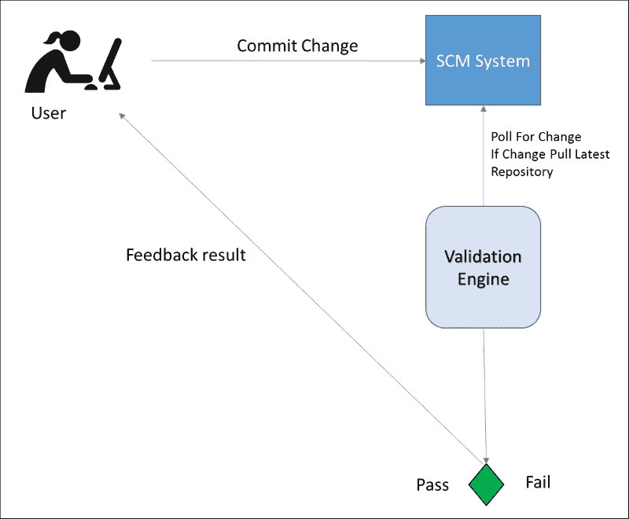

持续集成过程的输出应该是被发送到测试环境和生产服务器的内容。确保通过持续集成和相关测试的相同二进制文件与最终部署到生产服务器上的文件一致，这一点非常重要。

像持续集成这样的流程用于创建反馈循环，能够在问题发生时立即显示出来，从而节省成本。这意味着变更刚刚在实施者的脑海中出现，他们可以迅速修复或撤销该变更，目前开发人员正通过协作迭代代码，并在问题发生时及时修复。

虽然并非所有 IT 人员都遵循相同的部署策略，但反馈循环和验证过程不应仅限于开发人员。当然，进行网络更改时可能不需要编译过程，但可以通过网络设备或 SDN 控制器、负载均衡器上的更改来验证变更是否正确。

## 开发者持续集成

在其最纯粹的形式中，持续集成过程将开发人员的代码变更与其他开发人员的最新变更进行集成，并确保它正确编译。持续集成过程还可以选择性地对代码库运行一组单元测试或集成测试，打包编译后的二进制文件，然后将构建包上传到工件库，并用唯一的版本号标记代码仓库和构建包。

因此，一个简单的持续集成过程可以总结为以下反馈循环：

1.  开发人员将代码变更提交到**SCM 系统**并将其与代码库进行集成。

1.  代码库被拉取到**CI 构建服务器**。

1.  代码被编译以检查新的提交是否有效且不破坏，并且仓库会被标记为构建版本号。

1.  返回**通过**或**失败**的退出条件，并将**反馈结果**传递给用户。

1.  对下一个代码变更重复步骤 1-5。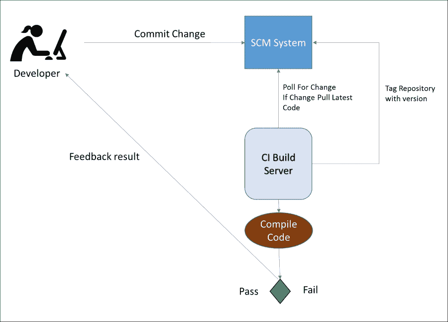

步骤 1（开发者提交）和步骤 2（在**CI 构建服务器**上创建仓库副本）是由**SCM 系统**处理的过程。

过去 10 年中，一些流行的版本控制管理系统（SCM）包括 Subversion、IBM Rational ClearCase、Microsoft Team Foundation Server、Perforce 和 Telelogic CM Synergy。近年来，分布式源代码控制管理系统逐渐从集中式系统转向 Git 和 Mercurial 等分布式系统。

过程中的步骤 3（代码编译）、步骤 4（代码编译反馈给用户）和步骤 5（重复过程）由持续集成构建服务器执行，这些服务器充当持续构建过程的调度代理。

如 Cruise Control、Hudson，或最近的 Jenkins、Travis 和 Thoughtworks Go 等工具用于调度持续集成。

第 4 步（将编译反馈给用户）可以使用如下编译工具进行：

+   Maven [`maven.apache.org/`](https://maven.apache.org/)

+   Ant [`ant.apache.org/`](http://ant.apache.org/)

+   MsBuild [`msdn.microsoft.com/en-us/library/ms171452(v=vs.90).aspx`](https://msdn.microsoft.com/en-us/library/ms171452(v=vs.90).aspx)

+   Rake [`rake.rubyforge.org/`](http://rake.rubyforge.org/)

+   Make [`www.cs.colby.edu/maxwell/courses/tutorials/maketutor/`](http://www.cs.colby.edu/maxwell/courses/tutorials/maketutor/)

所有这些工具，以及更多工具，可以根据所需的代码编译类型，作为过程中的主要验证步骤使用。

持续集成过程会持续进行，轮询每次新的开发者提交，进行代码编译并重复相同的过程，以提供持续的反馈循环。如果开发者破坏了持续集成构建，他们需要立即修复，以免阻碍其他开发变更的编译和验证。因此，开发人员使用持续集成来协作，并确保他们的变更成功集成。

额外的步骤，如单元测试或集成测试，可以在编译成功后加入到过程中，以增加对变更的验证。仅仅因为代码编译通过，并不意味着它总是能正常工作。当所有编译和测试完成并打包后，可能会引入第六步，将软件打包并部署到工件库。

所有良好的持续集成过程都应该基于编译、测试和打包的前提。因此，代码发布应该只打包一次，并在部署时将同一包分发到所有服务器。

## 数据库持续集成

在设置好持续集成以帮助提高代码发布质量之后，控制数据库变更的开发人员通常会考虑对数据库变更做类似的处理。由于数据库变更总是企业发布过程中的重要组成部分，数据库发布出现故障会阻碍软件的部署和发布给客户。

结果是，数据库架构更改或数据库编程存储过程也应该在持续集成过程中尽早集成，并以类似的方式通过快速验证和反馈循环进行测试。

从某种程度上来说，开发人员在考虑持续集成时比较轻松，因为编译过程是一个二元的通过或失败的度量，易于理解。当然，脚本语言是这个规则的例外，但可以通过单元测试来补充，以提供对各种代码操作的验证，并且良好的测试覆盖率能够提升代码质量。

在进行数据库模式更改时，需要满足一系列测试标准，才能将代码推送到生产环境。优秀的数据库开发人员在进行 SQL 更改时会提供前进和回滚脚本，并将其应用到生产数据库，通常会在将其提交到源代码管理系统之前在开发机器上进行测试。

数据库开发人员通过使用前进和回滚发布脚本来实现数据库变更，并将其存储在 SCM 系统中。回滚仅在紧急情况下执行，通常是在生产环境中应用时，如果前进脚本由于某种原因失败。

因此，一个典型的数据库发布过程将包含以下两个步骤：

+   使用发布脚本应用 SQL 表或列的创建、更新、删除或存储过程。

+   如果此步骤失败，请使用回滚发布脚本回滚 SQL 表或列的创建、更新、删除或存储过程。

因此，在任何生产发布之前，数据库开发人员的前进和回滚脚本应该经过测试。由于多个数据库开发人员参与同一版本发布，因此这些数据库发布脚本应按照它们在生产环境中应用的顺序进行应用，因为一个开发人员的变更可能会破坏另一个开发人员的变更。

在设置数据库持续集成之前，需要满足一些前提条件：

+   使用与生产匹配的数据库模式以及相关数据集，并确保所有特性一致，例如索引，以便我们能够测试与实际生产版本相似的环境。

+   持续集成过程还应该利用与数据库发布脚本序列化相同的部署运行器脚本，并在失败时提供回滚功能。

测试回滚脚本与测试前进脚本同样重要，因此数据库持续集成过程需要有效的测试来涵盖回滚。

数据库开发人员在本地工作站上应用的常见数据库部署工作流程如下所示：

1.  使用部署运行器脚本将前进数据库脚本应用到 CI 测试数据库。

1.  使用部署运行器脚本将回滚数据库脚本应用到 CI 测试数据库。

1.  使用部署运行器脚本将前进数据库脚本应用到 CI 测试数据库。

1.  使用部署运行器脚本将回滚数据库脚本应用到 CI 测试数据库。

如果前面的步骤成功，那么前进和回滚的数据库脚本在语法上是正确的，且在应用到生产数据库时不会失败。

前面的步骤还使用部署运行器检查顺序的有效性，并检查集成的数据库部署脚本是否协同工作且在回滚时不会冲突。

通过持续集成，我们已经排除了可能导致生产环境失败的多种情况。然而，仅仅依赖前述的持续集成过程是不够的，因为与代码编译一样，SQL 不返回错误并不意味着数据库的前滚和回滚脚本在技术上是有效的，因此数据库更改仍然需要通过功能测试进行补充。

持续集成的关键是将质量检查提前到交付生命周期，并创建反馈循环。持续集成并不是为了证明一个发布是 100% 有效的，而应该看作是证明已经遵循了检查过程，从而证明发布没有问题。

一个简单的持续集成数据库过程将为数据库开发人员提供以下反馈循环：

1.  开发人员将前滚和回滚更改提交到**SCM 系统**，并与代码库进行集成。

1.  代码库被拉取到**CI 构建服务器**。

1.  使用部署运行器脚本将前滚数据库脚本应用于 CI 测试数据库。

1.  使用部署运行器脚本将回滚数据库脚本应用于 CI 测试数据库。

1.  使用部署运行器脚本将前滚数据库脚本应用于 CI 测试数据库。

1.  使用部署运行器脚本将回滚数据库脚本应用于 CI 测试数据库。

1.  返回**通过**或**失败**退出条件并反馈给用户。

1.  重复步骤 1-7，进行下一个数据库更改。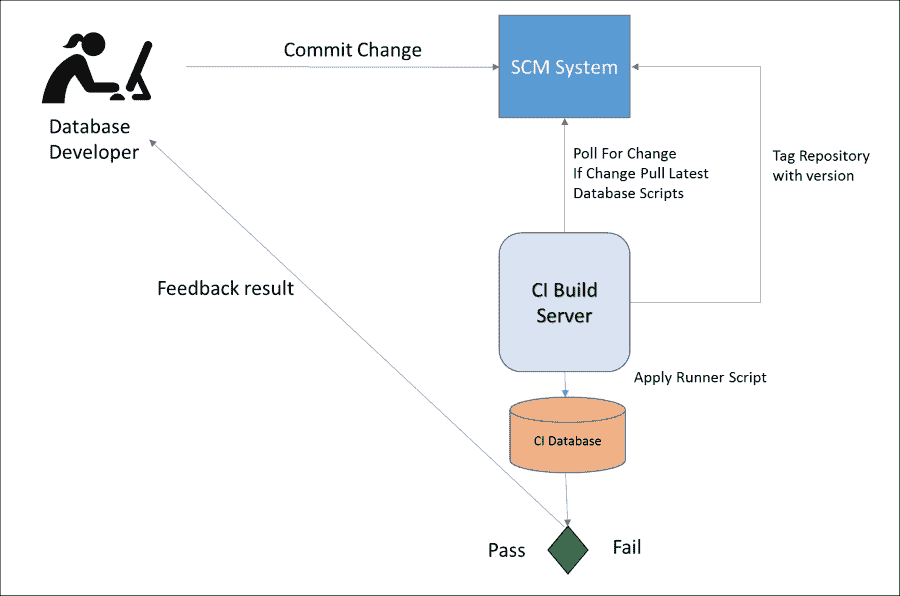

一旦发布准备好上线，数据库 CI 将应用最终的更改，为下一次发布、下一次数据库更改迭代以及下一批数据库脚本做好准备，这些脚本将由下次发布应用。或者，CI 数据库架构可以从生产环境中刷新。

一个好的做法是始终创建数据库的基准线，以便如果数据库开发人员不小心提交了错误的前滚和回滚操作，CI 数据库可以轻松恢复到所需的状态，而不会成为开发的瓶颈。

当然，这只是一种处理数据库更改验证的方法，其他方法也是可能的。微软提供了数据库项目来实现这一目的，但验证引擎并不重要，关键是要在发布生命周期的早期进行任何更改的验证。

确保没有任何内容进入生产环境，除非经过 CI 过程，这是非常重要的。如果设置了一个很好的流程，但又跳过它，那么这将使 CI 数据库架构失效，可能带来巨大的后果。

# 可用于持续集成的工具

有许多不同类型的配置管理工具可以帮助构建持续集成过程，因此有多种不同的选项可供选择，刚开始可能会显得让人不知所措。

工具应根据流程需求进行选择，并由团队或用户进行挑选。如 第三章《将 DevOps 带入网络运维》中所述，*将 DevOps 带入网络运维*，在选择任何工具之前，首先需要规划好需要解决的需求和期望的流程。

同样重要的是，避免工具的泛滥，这是大公司中常见的问题，应为每个操作选择一个最合适的工具，而不是让多个工具做相同的事情，因为这样会给业务带来额外的运营负担。

如果公司中已有用于持续集成的配置管理工具，那么它很可能能够满足需求。在考虑用于执行持续集成流程的工具时，需要以下工具：

+   SCM 系统

+   验证引擎

SCM 系统主要用于存储代码或配置管理的配置文件在源代码控制仓库中

验证引擎用于调度代码编译或验证配置。因此，持续集成构建服务器被用于调度，而许多编译或测试工具可用于提供验证功能。

## 源代码管理系统

SCM 系统提供了持续集成过程的核心，但无论选择哪个 SCM 系统，从基础层面来看，它应该具备以下基本功能：

+   对所有需要提交更改的用户都应该可访问

+   存储文件的最新版本

+   拥有一个可以被用户浏览的集中式 URL，以查看可用的仓库

+   具备基于角色的访问权限模型

+   支持版本回滚和文件版本树

+   显示提交更改的用户以及更改的日期和时间

+   支持仓库的标签管理，可以使用该标签来查看所有贡献于发布的文件

+   支持多个仓库分支以便进行并行开发

+   具备合并文件和处理合并冲突的能力

+   具备命令行

+   插件支持持续集成构建服务器

大多数 SCM 系统还将支持以下附加功能：

+   提供可编程的 API 或 SDK

+   能够与开发人员的 IDEs 容易集成

+   与 Active Directory 或 **轻量级目录访问协议** (**LDAP**) 集成，以实现基于角色的访问控制

+   支持与变更管理工具的集成，其中 SCM 提交可以与变更工单关联

+   支持与同行评审工具的集成

SCM 系统可以是集中式或分布式的，近年来，分布式源代码管理系统的使用越来越广泛。

### 集中式 SCM 系统

当最初创建 SCM 系统时，旨在促进开发团队工作，采用了集中式架构来构建这些系统。集中式 SCM 系统用于存储代码，开发人员会访问他们需要对其进行更改的代码库，并对集中式系统中的实时代码进行编辑。

为了确保开发人员的高效工作，集中式 SCM 系统始终需要保持在线并可用：

+   开发人员会访问他们希望修改代码的代码库

+   然后他们会签出他们希望编辑的文件

+   进行更改

+   然后将文件重新提交到代码中央分支

SCM 系统会有一个锁定机制，以避免冲突，确保同一时间内只有一个用户能够编辑文件。如果两个开发人员同时访问该文件，在线 SCM 系统会显示该文件已被另一位开发人员锁定，他们必须等待该开发人员完成修改后，才能继续签出代码并进行后续更改。

开发人员在进行更改时，会直接连接到集中式 SCM 系统中托管的代码库，以更新代码。当开发人员进行更改时，相应的更改状态会被写入集中式数据库，更新整体代码库的状态。

状态更改随后会自动同步到其他开发人员的视图中。集中式 SCM 系统的一个批评意见是，开发人员有时希望脱机工作，因此一些集中式源代码管理系统引入了快照视图的概念，作为永久在线更新代码库视图的替代方案，并引入了脱机更新功能。

在集中式 SCM 系统中，快照视图是某个时间点上，活跃代码库的快照副本。最佳实践要求，在将任何开发更改提交到集中式服务器之前，应该更新快照视图；任何合并冲突应在本地解决，之后再提交在快照视图中所做的更改。

开发人员会通过命令行接口或与开发人员集成的 IDE 图形界面与集中式 SCM 系统进行集成，以便于使用，这样他们就不需要在命令行和 IDE 之间切换。

一些优秀的集中式源代码管理系统示例如下：

+   IBM Rational ClearCase

+   Telelogic CM Synergy

+   IBM Rational Team Concert

+   微软 Team Foundation Server

+   Subversion

+   Perforce

### 分布式 SCM 系统

分布式 SCM 系统没有中央主控节点，而是将更改复制到多个位置。用户会创建代码库的副本，然后可以通过自己的本地副本进行拉取或推送操作，这些副本存储在开发人员的本地开发机器上。

分布式系统中的每个代码库都有一个所有者或维护者，用户将通过拉取请求的形式提交更改。开发人员会创建一个拉取请求，这类似于合并请求，但仓库的维护者可以决定是否接受该请求。一旦接受，提交的更改将被合并到分支中。

分布式 SCM 系统的主要优势之一是能够在离线时对代码库进行操作。更改可以提交到本地代码库，然后当开发人员准备好时，将其推送到主分支。

分布式 SCM 系统更容易进行合并且效率更高，因此它们更适合敏捷开发，这通常意味着为每个微服务提供多个小型代码库，而不是为单体应用提供大型集中式代码库。

分布式 SCM 系统的示例如下：

+   Git

+   Mercurial

+   Veracity

### 分支策略

分支策略用于满足现代软件开发的需求，不同的分支服务于不同的使用场景并支持代码的多个版本。

SCM 系统传统上依赖于**主干**分支，通常被称为**主线**或**主分支**。主干分支策略意味着主干/主线分支始终是干净且可工作的代码版本，该分支上的文件代表生产环境中的代码。

然后，为了支持最新版本的活跃开发，创建了开发分支；而发布分支用于在生产系统中发现错误时进行维护发布。

可以实现许多不同的分支策略；以下示例展示了主干分支策略。

主干/主线/主分支保持清洁，所有发布都通过将更改合并到该分支来进行，每次发布时都会给该分支打标签。这允许在标签之间进行差异对比，以查看发生了哪些变化。

开发分支用于活跃的开发，创建版本 1.0，然后合并到**发布分支 1.0**，此分支随后立即合并回**主干/主线/主分支**。

开发分支随后开始版本 2.0 的活跃开发，而**发布分支 1.0**则用于 1.x 的维护发布，特别是当需要修复 Bug 时：

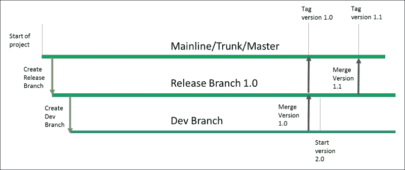

主干分支策略意味着需要大量的合并和协调，发布经理需要在发布日协调合并和版本发布。

中央化的配置管理系统被建立以支持主干式的软件开发方法，这在支持瀑布开发时是有效的。

瀑布式软件开发具有严格的项目阶段，包括分析、设计、实现和测试阶段，因此在团队每几个月只发布一次版本，而不是每天发布时，主线分支策略就足够用了，繁琐的合并过程并不是瓶颈。

然而，向敏捷软件开发的过渡意味着实现主线策略变得更加困难，因为现在团队发布频率更高，已经转向了持续部署和交付模型。

更适合敏捷开发的替代分支策略是使用功能分支。在敏捷软件开发中，工作被拆分成持续两周的冲刺。因此，主分支或主线分支仍然被使用，但在冲刺期间开发人员会创建非常短暂的功能分支。分布式 SCM 系统将合并的控制权交给开发人员，而不是使用集中式的发布管理团队来处理这些操作。

在以下示例中，我们可以看到功能分支的一个例子，在为期两周的冲刺中创建了三个不同的功能分支，**功能 A**、**功能 B** 和 **功能 C**。当开发人员完成了功能开发后，这些功能会合并回**主干/主分支**。

每当从一个功能分支进行提交时，变更会直接合并到**主干/主分支**，并且会启动一个持续集成过程来验证这些变更，每一次成功的提交都会成为潜在的发布候选版本。经过持续集成过程打包后的发布版本可以准备部署，如下图所示：

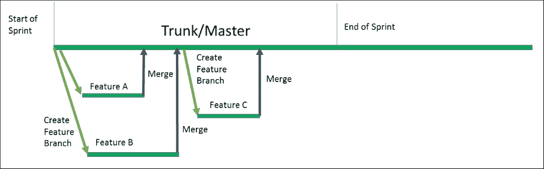

一些纯粹主义者会反对使用功能分支，倾向于始终在**主干/主分支**上工作。然而，这个决策交给各个团队来决定哪种方法最适合他们，这是一个主观问题。也有人会认为，功能分支可以在主干/主分支上的适当测试创建之前，增加额外的控制层级，以便在合并之前进行适当的同行评审。

当对一个分支进行提交时，应该触发持续集成构建并验证所提交的变更。这会在整个过程中形成反馈回路。任何进入任何分支的变更都应该由持续集成构建来管理，以筛选出良好的变更，并在发生破坏性变更时立即予以突出显示，以便及时修复。

## 持续集成构建服务器

各种持续集成构建服务器可用于帮助安排验证步骤或测试。最早的持续集成构建服务器之一是 Thoughtworks 的 Cruise Control，后来发展成为 Thoughtworks Go。

**Cruise Control** 允许用户配置一个 XML 文件，设置不同的持续集成构建任务。每个构建任务都会运行一组命令行选项；通常是针对代码仓库的编译过程，如果成功则返回绿色构建，若构建失败则返回红色构建。Cruise Control 会以构建日志的形式突出显示错误，通过 Cruise Control 仪表盘或电子邮件将反馈提供给用户。

当前市场领先的构建服务器是 Cloudbees Jenkins，这是一个开源项目，是原始 Hudson 项目的分支。Jenkins 使得不再需要配置 XML 文件，而是将所有设置操作转移到 GUI 或 API 中。它带有大量插件，几乎可以执行任何可能的持续集成操作。自 Jenkins 2.x 发布以来，它还深入到了持续交付领域。

下一代 CI 系统已朝云解决方案发展，Travis 成为开源项目的热门选择。这允许用户提交一个 Travis YAML 文件，该文件从源代码管理中创建构建配置，并可以与代码一起版本化。这是 Jenkins 2.x 当前所做的，使用 Jenkinsfile，并且 Jenkins 工作构建器项目一直在为 OpenStack 项目做这项工作。

在寻找持续集成构建服务器时，有许多不同的选项，考虑以下内容；无论选择哪种持续集成构建系统，基本层面上都应具备以下基本功能：

+   用于反馈的仪表盘

+   绿色构建和红色构建的概念

+   通用命令行的调度功能

+   基于退出条件的构建通过或失败，`0` 表示通过

+   与知名编译工具的插件支持

+   能够轮询 SCM 系统

+   能够与单元测试框架解决方案如 Junit、Nunit 等集成

+   基于角色的访问控制

+   能够显示已构建的仓库的最新提交的变更列表

大多数持续集成构建服务器还将支持其他功能，例如：

+   拥有可编程的 API 或 SDK

+   提供电子邮件或消息集成功能

+   与 Active Directory 或 LDAP 集成，实现基于角色的访问控制

+   支持与变更管理工具的集成，其中可以将 SCM 提交与变更票证关联

+   支持与同行评审工具的集成

# 网络持续集成

那么为什么网络工程师应该关注持续集成呢？如果网络团队希望改善以下几点内容，他们应该关注持续集成，这些内容在第三章《将 DevOps 引入网络运营》中有详细讲解，*将 DevOps 引入网络运营*：

+   变更速度

+   平均解决时间

+   提升的正常运行时间

+   部署次数增加

+   团队间的跨技能培训

+   取消单一故障点

持续集成带来的一个优势是，能够轻松追踪网络上发生了什么变化，并查看是哪个工程师做了变更。通过查看持续集成构建系统中的最新提交，可以获得这些信息。

回滚将像部署最后一次标签发布配置一样简单，而不是在发生错误时需要翻阅设备日志，查看网络设备上应用了哪些变更。

每个网络工程师都可以查看持续集成构建系统中的工作配置，了解其操作方式，这样每个网络工程师都知道流程是如何运作的，从而有助于技能的交叉培养。

拥有持续的反馈循环将使网络团队不断改进流程。如果某个网络流程不尽如人意，网络团队可以轻松地突出流程中的痛点，并在变更过程对所有工程师可见且一致的方式下进行修复。

当网络团队使用持续集成流程时，网络团队将摆脱应急处理模式，进入战术性的持续改进和优化模式。持续集成意味着网络变更的质量将得到提升，因为每次网络变更都有相关的验证步骤，这些步骤不再是手动的并且容易出错。

相反，这些检查和验证是内建的，并且每次网络操作员提交网络变更到 SCM 系统时都会执行。这些变更随着时间的推移积累，使得网络变更更不容易出错，并且赋予网络工程师与开发人员和基础设施团队相同的能力。

利用网络持续集成还消除了进行生产变更的恐惧，因为这些变更已经在持续集成过程中得到了验证和确认，因此生产变更可以视为一种日常业务活动，而不需要提前几周计划或担心。其理念是：如果某项活动存在问题，那就更频繁地进行它，不断迭代，改进，并让人们不再害怕去做。

已经涵盖了不同的 SCM 分支策略、持续集成构建服务器等主题，并展示了如何将持续集成用于代码和数据库变更，现在应该能清楚地理解什么是持续集成，并明白它不仅仅是代码的编译。相反，持续集成是验证并行变更，确保它们能够协同工作，并为用户提供反馈循环。

DevOps 运动强调与他人互动、消除瓶颈、加速产品上市并提高准确性，因此持续集成同样适用于网络。自动化流程以及团队之间基于类似概念的协作至关重要，因此持续集成确实是将基础设施和网络作为代码结合在一起的纽带。

对于网络工程师来说，像持续集成这样的概念一开始可能显得陌生，但与其讨论深度编译过程，不如聚焦于流程。如果询问任何网络工程师，是否能拥有一个快速且易于使用的流程来验证所有网络变更，确保在生产前进行验证并提供快速反馈回路，那么答案必定是肯定的。因此，持续集成可以成为一个有用的工具，减少生产环境中的问题变更。

本书中，在第四章，*使用 Ansible 配置网络设备*，第五章，*使用 Ansible 编排负载均衡器*，以及第六章，*使用 Ansible 编排 SDN 控制器*，我们探讨了如何将网络变更视作代码，并使用像 Ansible 这样的配置管理工具来配置网络设备、负载均衡器和 SDN 控制器。

因此，在考虑以下图示时，关于网络变更的持续集成问题并非是在问网络变更是否可以进行持续集成，而是应该在询问，在 SCM 提交后，哪些验证引擎可以用于网络变更，以便为网络操作员提供**通过**或**失败**的快速反馈回路：

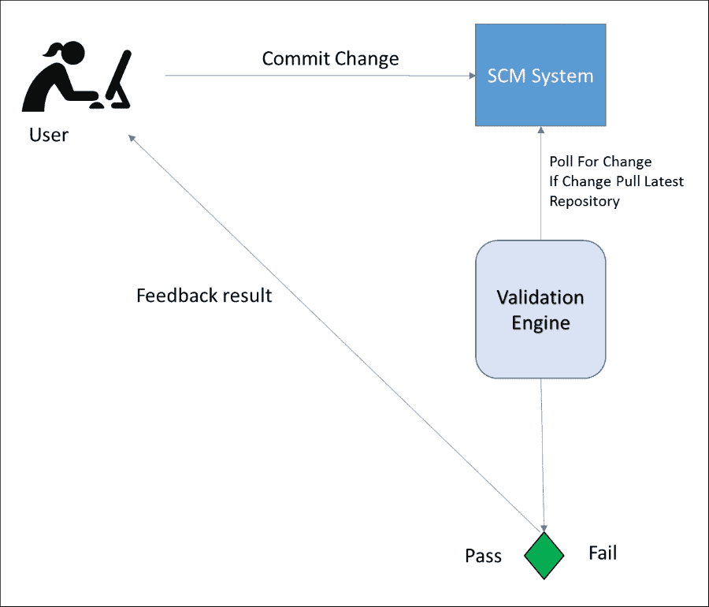

## 网络验证引擎

创建网络变更的持续集成构建时面临的挑战是使用什么作为验证引擎。使用 Ansible 进行网络变更时，依赖于 YAML 配置文件，因此可以首先进行的验证是检查 YAML `var`文件的有效性。

`var`文件用于描述网络的期望状态，因此检查这些 YAML 文件在语法上的有效性是一个有效的检查方式。为了实现这一点，可以使用如`yamllint`这样的工具来检查提交到源代码管理中的文件语法是否有效。

一旦 YAML 的`var`文件被提交到源代码控制系统，持续集成构建应创建一个标签，标明已发生新版本发布。所有源代码管理（SCM）系统应该都具备标签或基线功能。

打标签版本意味着当前网络发布版本可以与先前版本进行对比，以查看 YAML `var`文件中有哪些文件变更。如果在任何阶段发现问题，所有网络变更都会变得透明。

那么，其他可能的验证是什么呢？当关注网络设备的配置时，我们将配置更改推送到一个网络操作系统，如 Juniper Junos 或 Arista Eos。因此，能够运行新提交的更改，并确保语法在这些操作系统中是程序 matically 正确的，作为持续集成过程的一部分是非常理想的。如第四章 *《使用 Ansible 配置网络设备》*所述，大多数网络设备操作系统都是基于 Linux 的，因此，作为 CI 过程的一部分，拥有一个网络操作系统来发布命令似乎并不荒谬。

同样的情况也适用于检查用于编排负载均衡器或 SDN 控制器的配置，理论上，附加一个测试环境到持续集成过程中也是非常可取的。通过利用负载均衡器的软版本或 SDN 控制器的仿真版本将是非常有益的，这样网络工程师就可以在实施前检查他们的网络更改，确保 API 调用和语法正确。

然而，模拟 SDN 控制器或创建或模拟生产环境存在一些挑战，取决于供应商，他们可能会因为成本问题，在设置持续集成环境时面临巨大的开销。网络设备、负载均衡器和 SDN 供应商正在发展，以支持自动化和 DevOps 友好的流程，如持续集成。因此，网络供应商开始意识到提供小型测试环境的有效性；这就是虚拟化或容器化的负载均衡器或 SDN 控制器版本作为 API 端点来验证在 YAML 文件中设置的期望状态的地方。

另外，供应商可以提供一个 vagrant box 来测试在 YAML `var`文件中指定的期望配置是否有效，这些文件被检查到 SCM 系统中，然后再将其传播到第一个测试环境。在开发生命周期中，任何能够加速失败并尽可能将问题向左移动的过程增强都应该在可能的情况下实施。

所以，利用所有这些验证器，我们来看一下这些过程如何应用于网络设备，或者交替使用编排。所使用的验证器数量可能取决于所用的网络供应商，因此我们将首先看看一个针对网络设备的持续集成构建的起点，无论供应商如何，然后再看一些更高级的选项，这些选项可以在供应商提供软件负载均衡器或 SDN 仿真时使用。

## 网络设备的简单持续集成构建

由于大型组织在实施微服务应用程序时通常需要每天进行网络更改，因此为了满足这些需求，网络应尽可能自助服务。为了跟上需求，网络团队可能需要使用特性分支 SCM 策略，或者允许直接将自助服务 YAML 文件提交到主分支，如下图所示：

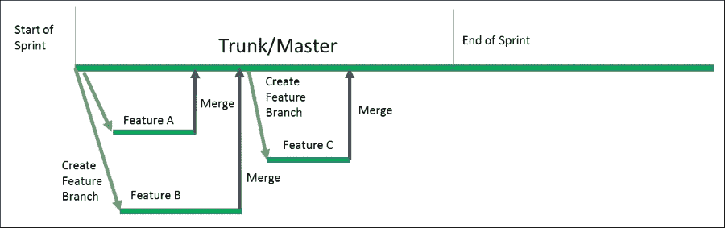

每次提交应在合并之前进行同行评审。理想情况下，自助服务流程应允许开发团队将网络更改与他们的代码更改一起打包，并遵循自助服务方法。

第一个应该为网络设备或编排设置的持续集成构建应专注于版本控制 Ansible YAML 文件，并对期望状态运行简单的 YAML 验证。

每次运行的持续集成构建还将标记仓库。标记 SCM 仓库意味着可以比较发布版本，或轻松回滚。它还将作为审计日志，显示哪个用户进行了更改，以及在环境中具体更改了什么。未经持续集成过程的更改不应应用于生产系统。

因此，一个简单的网络持续集成构建将遵循以下简单的验证步骤：

1.  对 YAML 文件进行语法检查。

1.  如果成功，仓库将在 SCM 系统中被标记。

因此，一个简单的网络持续集成构建将遵循以下步骤。网络操作员将把 YAML 文件提交到 SCM 系统，以更改网络的期望状态；如果 YAML Lint 操作发现仓库中的所有 YAML 文件具有有效的语法并返回正面结果，则持续集成构建服务器将标记该构建：

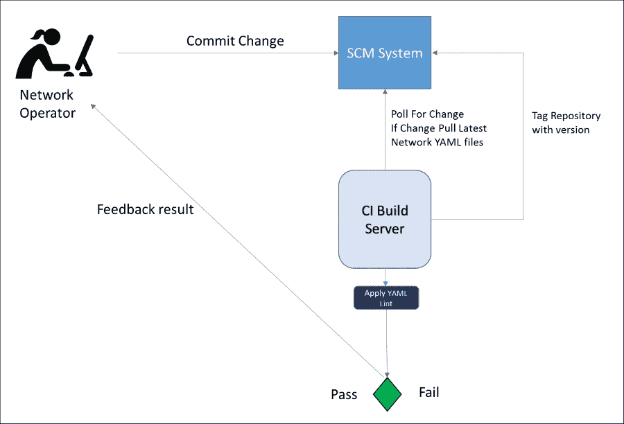

## 配置一个简单的 Jenkins 网络 CI 构建

这个简单的网络设备持续集成构建可以在 Jenkins CI 构建服务器上设置。`Rake` 和 `yamllint` gem 应该在将要执行构建的 Jenkins 从属机上进行配置。

一旦完成这些步骤，新的 Jenkins CI 构建可以在几分钟内创建。

首先，选择一个新的 Jenkins 自由风格作业：

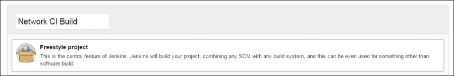

然后配置 SCM 系统，在本例中使用 Git，指定 `git@gitlab:devops/sdn.git` 作为仓库，并指定项目的 `*/master` 分支以及提供访问仓库所需的 SSH 密钥：

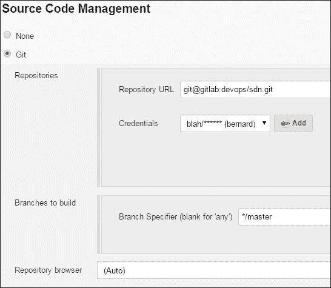

现在进行验证步骤，选择一个 shell 命令构建步骤，该步骤将在配置了 **Rakefile** 的 `git@gitlab:devops/sdn.git` 仓库中运行 `rake yamllint`，以便可以解析 YAML 文件：

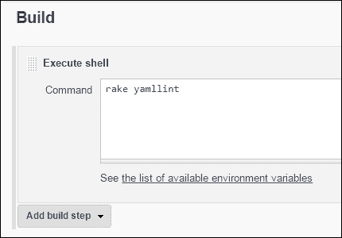

最后，配置构建任务，以便将 Jenkins 构建版本标记到`devops/sdn.git` gitlab 仓库，并**保存**构建：

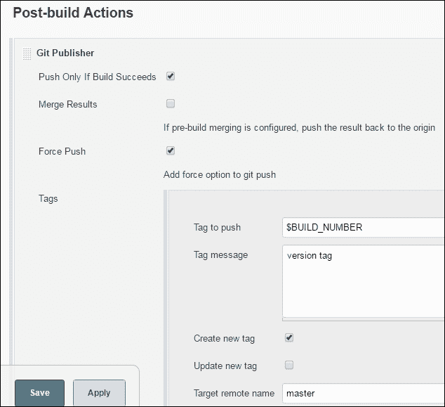

这配置了一个非常简单的 Jenkins CI 构建流程，它将轮询 Git 仓库以获取新变更，对仓库运行`yamllint`，然后在构建成功后标记 Git 仓库。

构建健康状态将在 Jenkins 中显示；绿色圆球表示构建处于健康状态，YAML 文件当前状态良好，检查持续时间显示执行构建花费了 6.2 秒，如下截图所示：

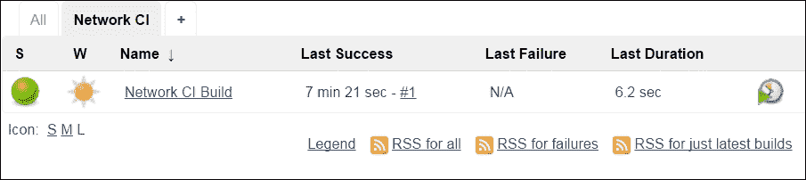

## 在网络持续集成构建中添加验证

在强调了需要更强大验证以确保网络设备的预飞行配置，并将故障尽可能地提前到开发生命周期的早期以减少修复成本之后，能够将任务关键型配置更改推送到网络操作系统（如 Cisco Nxos、Juniper Junos 或 Arista Eos）将是一个很好的持续集成验证。

因此，就像数据库验证 SQL 语法是否正确一样，能够运行新提交的更改，并确保应用到网络设备的网络命令或编排命令语法在程序上是正确的，应该成为持续集成构建的一部分。

随后，持续集成可以帮助提升网络变更的质量，因为错误的变更永远不会被推送到网络设备、负载均衡器或 SDN 控制器。当然，推送的配置功能可能不是所需的，但至少不会出现配置在部署时有语法错误的情况。

由于网络设备、负载均衡器和 SDN 控制器的变更是任务关键型的，这为任何网络变更和检查带来了额外的验证检查，并以快速、自动化的方式提供反馈，如果网络变更不符合要求，能够快速反馈。

### 网络设备的持续集成

在设置网络设备之前，需要进行一些前提条件的持续集成：

+   需要一个网络操作系统，并将生产配置推送到该系统，以及所有实时设置，这些可以托管在虚拟设备上

+   像 Jenkins 这样的持续集成构建工具需要在代理上设置 Ansible 控制主机，以便它能够执行 Ansible 操作手册

+   所有操作手册应该编写带有块状回滚机制，以便在操作手册执行失败时，后续的清理工作能够自动进行

一个典型的网络设备发布流程将包括以下两个步骤：

1.  应用网络变更自服务操作手册。

1.  由于操作手册是幂等的，只有发生更改时才会显示变更。

Ansible 操作手册应提供对状态更改的前进和回滚的弹性。之前的步骤还使用 Ansible 操作手册检查了顺序的有效性，并检查了对网络设备的调用是否有效。

一个简单的持续集成网络构建过程将为网络操作员提供以下反馈循环：

1.  网络操作员将 Ansible 操作手册或 YAML `var` 文件的更改提交到**SCM 系统**，并与代码库集成。

1.  代码库被拉取到**CI 构建服务器**。

1.  使用`yamllint`检查 YAML 文件。

1.  Ansible 操作手册应用于将网络更改推送到设备。

1.  返回**通过**或**失败**的退出条件并反馈给用户。

1.  对下一个网络设备更改重复步骤 1-5：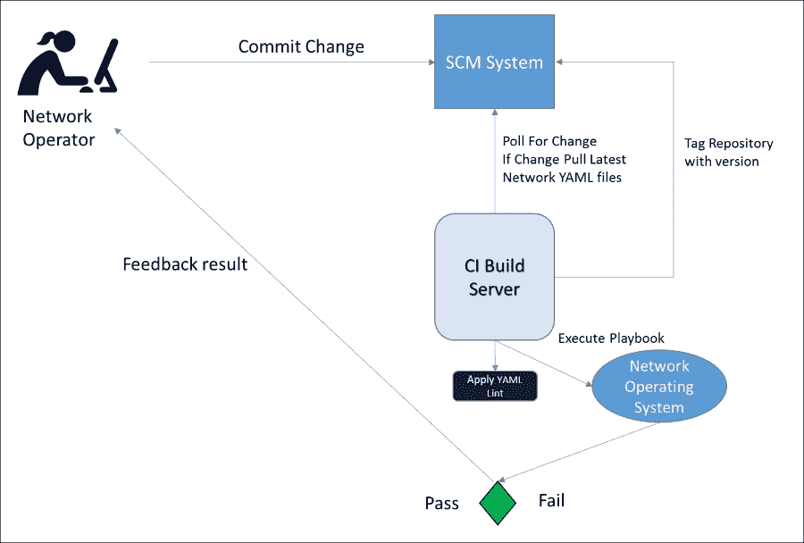

## 网络编排的持续集成构建

在为负载均衡器或 SDN 控制器设置网络编排之前，需要一些先决条件：

+   需要一个软件负载均衡器或模拟的 SDN 控制器，并将生产配置推送到其上以及所有实时设置。

+   像 Jenkins 这样的持续集成构建工具需要在代理上设置一个 Ansible 控制器，以便它可以执行 Ansible 操作手册，以及可以执行网络编排模块的 SDK。

+   所有操作手册应编写块级回滚，以便在操作手册执行失败时能够进行后续清理。

一个典型的网络设备发布过程将包括以下步骤：

+   将网络更改应用到自服务操作手册中。

+   由于操作手册是幂等的，只有在发生更改时，才会显示更改。

类似于网络设备更改，Ansible 操作手册应提供对状态更改的前进和回滚的弹性。可能需要在虚拟化平台上设置一些测试服务器，以模拟负载均衡，以便也能测试健康检查。

一个简单的持续集成网络编排持续集成过程将为网络操作员提供以下反馈循环：

1.  网络操作员将 Ansible 操作手册或 YAML `var` 文件的更改提交到**SCM 系统**，并与代码库集成。

1.  代码库被拉取到**CI 构建服务器**。

1.  使用`yamllint`检查 YAML 文件。

1.  一个 Ansible 操作手册被应用于编排 API 并创建必要的负载均衡器或 SDN 更改。

1.  返回**通过**或**失败**的退出条件并反馈给用户。

1.  对下一个网络编排更改重复步骤 1-5：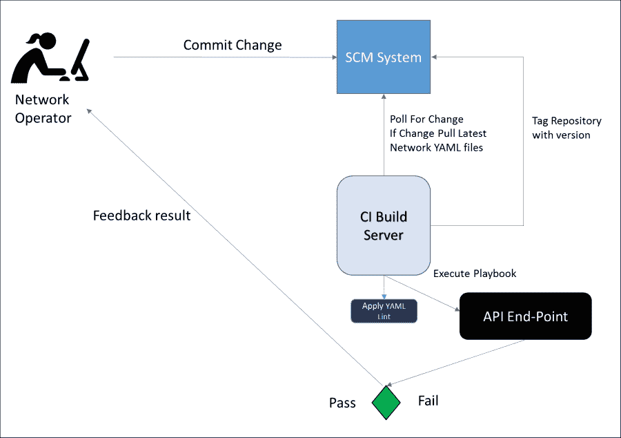

# 总结

在本章中，我们了解了持续集成是什么，以及如何将持续集成过程应用于代码和数据库。随后，本章探讨了如何将持续集成应用于网络操作，以提供反馈循环。

我们还探讨了不同的 SCM 方法论，集中式和分布式 SCM 系统的区别，以及如何在瀑布式和敏捷过程中使用分支策略。

然后，我们深入研究了用于创建持续集成过程的各种工具，重点展示了使用 Jenkins 设置简单网络持续集成构建的一些例子。

在这一章中，你学习了什么是持续集成，如何将其应用于网络操作、SCM 工具，以及集中式和分布式系统之间的差异，另外还介绍了常见的 SCM 分支策略。

本章的其他关键要点包括持续集成构建服务器及其用途，如何将网络更改集成到持续集成中，以及可能的持续集成验证引擎用于网络更改。

在下一章中，我们将了解各种测试工具以及它们如何应用于持续集成过程，以提供额外的验证。这将允许为网络操作创建单元测试，以确保在部署网络更改到持续交付流水线之前，所需的状态已经在设备上实现。
