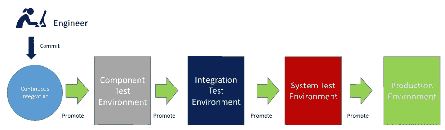
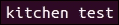

# 第八章：网络更改测试

本章将重点介绍软件开发生命周期、DevOps、测试和质量保证中的一个重要部分。将描述为什么将网络更改纳入持续集成过程并彻底测试它们至关重要。接着，我们将研究可用于帮助创建网络操作测试套件的开源测试工具。

本章将重点讨论整体质量保证过程，概述一些网络团队或实施网络操作团队可以采用的最佳实践方法。

我们还将探讨实施反馈循环、质量报告的好处，以及可以实施哪些检查以确保网络按预期运行。这些都是网络团队向代码驱动的网络操作过渡时的关键话题。

本章将涵盖以下主题：

+   测试概览

+   质量保证最佳实践

+   可用的测试工具

# 测试概览

有很多方法可以确保在进行操作或开发更改时保证质量。

当结合质量检查并对其进行排序时，它们可以用来形成一套质量门控，开发、基础设施甚至网络更改在到达生产环境之前应通过这些质量门控。我们将简要介绍一些常见的测试策略，这些策略用于确保系统或应用程序的任何更改都能有效运行，包含以下测试阶段：


## 单元测试

最流行的质量保证类型之一是单元测试。**单元测试**将测试每个独立的代码操作，并确保每个方法或函数在不同的输入下表现出预期的行为。

一个或多个单元测试是确保方法或函数按预期工作的必要条件。因此，可能需要编写多个单元测试来测试任何基本操作，基于一个独立操作验证通过或失败。

单元测试通常可以在已编译的二进制文件上进行，而不需要完整的测试环境。利用流行的测试框架，单元测试可以根据输入来验证通过或失败。

例如，对 Apache Tomcat Web 服务器的单元测试可能包括确保代码能够在 HTTP 端口 8080 上处理流量：


## 组件测试

**组件测试**涉及隔离地测试单一组件，并确保其作为自包含实体表现出应有的行为。

组件测试通常涉及将应用程序部署到测试环境，并对该组件执行一系列测试，测试其所有特性和功能。微服务应用程序是每次发布时都需要进行测试的小组件。

这可能涉及确保银行应用程序能够根据特定类型的账户正确处理交易。

## 集成测试

**集成测试**涉及多个微服务组件，因此，如果两个不同的组件被集成，就需要编写一组集成测试，确保它们都能集成并表现出预期的行为。

集成测试通常需要模拟一个数据库架构或多个组件，并在环境中一起部署和测试。虽然单元测试可以断言构建的二进制文件的行为，但集成测试要稍微复杂一些。

可以通过模拟或存根来模拟另一个应用程序的端点行为，并验证其是否按预期工作。

集成测试可以测试两个不同的微服务端点是否可以连接，并且像 TCP 握手这样的交易能否在发起方服务和接收方服务之间正确完成，通过接收 ACK 来确保两微服务应用程序之间的双向 TCP 握手正常工作：


## 系统测试

**系统测试**通常在一个完整的环境中进行，所有组件都已完全部署。系统测试将测试整个系统，通常作为生产前的最后一步进行。一些可以进行的测试包括用户旅程测试，例如设置一个完整的交易。这测试了完全集成的系统是否能通过所有的端到端测试，就像客户在生产环境中使用它一样。

这可能涉及将多个微服务应用程序集成在一起，例如微服务**A**、**B**、**C**和**D**，并确保它们能够在功能上集成并作为一个整体工作：


## 性能测试

**性能测试**是相当直观的，它会在第一次执行时为应用程序的性能设定基准。然后，它会使用该基准来检查每次新版本发布时应用程序是否有性能下降。

性能测试将用于检查性能指标，这对于查看代码提交是否导致系统整体性能问题非常有用。性能测试可以纳入系统测试阶段。

另外，性能测试也可以意味着**压力测试或负载测试**应用程序、网络或基础设施的极限，并通过编写测试来检查系统是否能够应对预期的流量模式。

**耐力测试**是指设定一个测试时间段，看看基础设施、网络或应用程序在固定时间内能承受多大的压力。

**峰值测试**是确保系统能够应对从低谷流量模式中突然激增的流量，测试系统是否能够处理高度变化的流量。

**可扩展性测试**另一方面可以意味着水平扩展基础设施或增加更多应用程序，直到达到没有性能提升的程度。这可以识别系统的扩展极限。

**负载测试**可以用来查看一个系统在给定时间内可以处理的事务或数据量。

下图展示了属于性能测试范畴的不同测试类型：


## 用户验收测试

**用户验收测试**涉及让最终用户测试新特性或功能。用户验收测试通常用于确保客户或产品经理对已经做出的开发更改感到满意。这种类型的测试通常是探索性的，并且相当手动。它通常用于测试网站或图形用户界面的外观和感受。

## 为什么测试对网络团队很重要？

质量保证是网络或基础设施更改的重要部分，它不仅仅是软件开发的问题。如果软件安装的网络或基础设施没有按预期运行，那么它将产生与软件漏洞相同的客户影响。

客户不会区分软件漏洞、基础设施或网络问题。客户只知道他们无法使用产品，并且在他们看来，企业没有满足他们的需求，也没有提供良好可靠的服务。

没有足够的测试对企业非常有害，因为企业的声誉可能会受到损害，而且社交媒体的兴起意味着，如果网站出现故障或无法正常运行，几乎一瞬间，停机信息就会在社交媒体平台上广泛传播。

如果有一个用户注意到问题，他们可以发推文，这会提醒其他客户注意到这个问题，一条推文变成多条，等到公司反应过来时，故障已经在 Twitter 或其他社交媒体上成为热议话题，现在全世界的人都知道该企业有问题。

这种情况是许多在线企业最担心的，如果网站无法上线、无法正常运行并提供良好的用户体验，那么企业就不再赚钱，客户可能会转向竞争对手。

任何开发、基础设施或网络团队的关键目标之一是为最终用户提供良好的服务，防止停机或故障。通常，使用一组**关键绩效指标**（**KPIs**）来量化性能，并设定目标，以判断企业是否满足客户需求。

因此，使网络变更的交付减少出错的可能性应该是任何网络团队的目标。在第四章，*配置网络设备使用 Ansible*，第五章，*使用 Ansible 管理负载均衡器*，以及第六章，*使用 Ansible 管理 SDN 控制器*中，我们研究了如何使用配置管理工具自动化网络设备、负载均衡器和 SDN 控制器。同时，拥有一套可重复执行的测试来验证任何网络变更，应该也是网络团队努力的目标。理想的场景是，网络团队在变更实施之前，就知道该变更会失败，而不会对客户产生影响。这意味着在批准变更之前，充分进行测试，并尽可能快地在测试环境中发现问题，以避免破坏性变更直接推送到生产环境。

网络工程师在初步转向自动化流程时，常见的担忧之一是对自动化缺乏信任。网络工程师习惯于在发布网络变更之前，进行尽职调查和一系列检查。仅仅因为实施了自动化，并不意味着网络工程师用于验证网络变更的手动检查清单就不再需要。

然而，考虑到软件交付时，整体流程的速度取决于最慢的环节，因此如果这些网络验证检查仍然是手动的，那么整个流程就会变慢。这将导致在自动化过程中插入手动步骤，最终不可避免地会拖慢新产品的交付速度。

简单的解决方案是自动化每一项网络检查清单，这样原本由网络工程师手动执行的验证就会变成一个自动化检查或测试，成为与自动化一起运行的自动化测试套件的一部分。

这些检查或测试是在一段时间内编写和构建的。所以，当发现边缘案例并且没有测试覆盖，导致失败时，应该采取的做法不是使用“自动化无法工作”的论点，并为恢复到经过验证的手动方法提供理由，而是网络工程师应该创建一个新的测试或检查，并将其添加到自动化验证包中，以便在问题影响最终用户之前，在测试环境中捕获并失败。

## 当前的网络变更与测试

网络团队仍然主要使用瀑布式方法，因此他们需要调整并采用更灵活的方法。这将使网络团队能够更好地与其他 IT 团队进行整合，成为持续交付过程中的参与者，而不仅仅是旁观者。

当瀑布方法成为交付软件开发项目的标准方法时，将会遵循一个非常严格的过程生命周期。

瀑布流程规定每个新特性将经历以下阶段：

+   分析

+   设计

+   实施

+   测试

瀑布方法的主要实施之一是**V 模型**，最初用于将项目简化为可交付的块。这意味着所有利益相关者都可以识别进展并寻找潜在的延迟。

这种简化使得项目经理和高层管理人员非常高兴，因为他们有一种简单的方式来跟踪项目进度，并判断是否按时完成或超出预算。

V 模型的结构如下所示：


在瀑布模型中，分析和设计阶段位于 V 模型的左侧，并会在过程开始时进行。简而言之，V 模型的左侧用于与利益相关者互动，进行必要的研究，并收集所有必要的高层和低层需求，以明确实现新产品或变更所需的内容。V 模型的左侧还涉及在架构层面记录整体过程。

在分析阶段完成初步需求收集后，分析阶段会签署结束，这意味着架构设计阶段可以开始，并对需求进行详细规划。作为设计阶段的一部分，将创建高层和低层设计文档，记录拟议的更改，并进行相关的审查、签署和批准流程。

一旦设计完成，V 模型的左侧也就完成了，变更或产品的实施将开始。实施阶段可能需要数周甚至数月时间才能交付所需的结果，并且这一生命周期阶段位于 V 模型的底部。

一旦所有需求实现完成，实施阶段将被签署结束，项目将进入 V 模型的右侧，测试阶段将开始。

然后，测试团队将对任何更改或新产品特性进行单元测试、集成测试，最后进行系统测试。实施阶段发现的任何问题都会导致变更请求。这意味着高层或低层设计需要更新，实施工作需要重新进行，然后测试需要重复或重新编写，以便对产品进行精炼。

随着在第三章中讨论的敏捷开发的推进，*将 DevOps 引入网络运营*，V 模型已被认为是一种次优的交付机制。从报告的角度来看，V 模型是理想的和透明的，但这意味着实施过程受到对工程师施加的严格限制。

V 模型没有考虑到工程师喜欢迭代过程的事实，而且他们在开始一个过程时写下的实际实现可能不是他们最终实施的设计。V 模型与原型制作的契合度较差，因为工程师通常喜欢花时间与系统互动，尝试、失败、迭代，然后改善实现。

不考虑原型制作会导致多个变更请求，这对企业带来成本影响，因此，在敏捷方法中使用两周的迭代开发周期来计划迭代开发被证明更为现实。尽管这仍然是高级经理们的一个难题，因为他们习惯了需要报告截止日期和里程碑，而截止日期在所有实际情况中不过是一个虚拟的日期。

在瀑布过程中，工程师仍然会进行相同数量的原型制作以交付实施，工作所需的时间是*x*，无论计划如何结构化。敏捷开发只是结构化以接受原型制作和时限内的突发工作。

所以，项目经理对工程师的老生常谈问题总是；*这什么时候完成？* 作为回答的“*我不知道*”在瀑布模型中是不可接受的。期望的是一个估算，或者在工程圈里是一个虚拟的日期，而项目经理很可能会在该日期未能完成时进行更改。

那么，这一切与网络变更和测试总体上有什么相关性呢？嗯，今天的网络团队通常在考虑进行网络变更时会实施一个迷你 V 模型。网络经理会充当项目经理，规划设计、实施和测试阶段的周期，并将其反馈给高层管理团队，因为网络变更被视为需要大量规划和测试才能实施的大型工作。

网络经理可能不会像传统方法那样将测试拆分为测试、集成和系统测试，因为网络测试通常没有这么复杂，但这并不允许网络工程师进行原型制作。

相反，网络工程师，像基础设施工程师或他们之前的任何运营团队一样，将被迫在一个严格的计划中做出改变。这个计划将体现以下标准的满足：

+   实施的变更是否按预期工作？

+   变更是否破坏了任何东西？

+   文档是否已更新以反映变更？

如果满足所有这些点，网络团队会认为这是一次成功的变更。

然而，这并没有讲述完整的故事，因为在持续交付模型下进行网络更改时，还需要考虑其他几个方面：

+   这个更改会破坏任何看不见的部分吗？

+   相同的更改是否也已在预生产环境中实施？

+   相同的更改是否已在预生产环境中进行了测试和验证？

前面提到的三个点是进行任何更改时的强制性要求，但剩下的三个点也应视为强制性要求，以维持成功的持续交付模型。这对网络工程师来说是一个思维方式的转变，他们需要在进行更改时将这些因素考虑在内。

网络工程师进行的所有网络更改都需要提交到源代码管理系统，并在推送到生产环境之前，通过所有必要的环境进行传播，如下图所示：



如果网络工程师直接手动在生产环境中进行更改，而没有先通过自动化在测试、预生产和生产环境中实施，那么测试环境中的网络配置将永远与生产环境不一致。这将导致严重的后果，因为测试、预生产环境和生产环境的配置将会逐渐偏离。

这意味着任何开发人员、基础设施人员或网络工程师，如果在使用测试和预生产环境时，期望它们是生产环境的副本以进行关键任务更改，将会感到失望。反过来，这也可能会影响在这些环境中运行的任何测试，因为它们不再能准确反映生产环境的状态。

那么，实践中这意味着什么呢？V 模型中的系统测试框可能在预生产环境中通过，但在生产环境中失败。这无法增强对持续交付过程的信心，而持续交付现在是业务中至关重要的部分。

无法过分强调，在进行任何网络、代码或基础设施更改之前，确保所有更改都推送到预生产环境，以保持所有环境的有效性。这一点对于网络工程师而言是一个心态转变，他们在做更改时需要考虑这一点。

这不仅用于测试更改，还用于保持预生产环境作为生产环境的缩小版镜像，从而避免所有测试在测试环境中通过，但部署到生产环境后却导致客户停机的情况。因此，这意味着，在将更改发布到生产之前，必须在相关的测试环境中完成所有验证测试。

如果手动更改直接推送到生产环境，即使是紧急情况，也需要立即将更改提交回**源代码管理系统**（**SCM**），源代码管理系统应始终作为所有配置的唯一真实来源。

如果应用了任何手动更改，雪花环境将变得普遍，具体表现如下。这里是指工程师在生产环境中进行了手动更改，但未通过部署流水线将更改推送到其他环境中：


为了使网络变更能够按预期的速度交付，网络变更和测试不能继续采用迷你 V 模型策略。如果网络团队和管理人员真心希望在持续交付模型和 DevOps 模型中进行协作，他们需要跟上开发和基础设施团队在敏捷变更方面的步伐。

然而，解决方案并不是停止验证更改和进行应有的尽职调查，而是从那些多年来成功应用于开发和基础设施变更的规范化质量保证流程中汲取经验，这些流程同样也能帮助测试网络变更。

# 质量保证最佳实践

质量保证团队在采用瀑布式 V 模型交付结构时，通常处于信息孤岛，只在开发团队完成后回顾性地测试开发变更。

这导致质量保证团队不得不对每个开发变更作出反应，因为他们需要为一个自己还没有见过的功能编写测试，或者理解该功能是如何完全运作的。这种情况经常发生，开发人员会在没有预警的情况下将功能提交到源代码管理系统，随后质量保证团队需要对其做出反应：


这种工作方式带来了许多挑战，例如：

+   开发人员更改了用户界面，因此质量保证团队的自动化测试失败了，因为测试工程师未意识到用户界面发生了变化。

+   测试工程师不了解新功能，导致没有编写适当的测试来正确地测试功能。

+   开发人员不得不花大量时间向质量保证测试人员解释功能是如何工作的，以便他们能够在提交后编写测试。

+   修复断裂的回归测试时的延迟，这些问题并不是由错误导致的，而是测试本身的问题。

+   质量保证团队以完全被动的方式行事，因为他们无法看到开发人员即将进行的更改。

+   质量保证包未通过测试，或者测试结果显示“通过”，意味着实际的软件问题会被漏掉。

因此，在考虑网络测试时，解决此问题的方法不是雇佣一个单独的测试团队。相反，它是将网络测试融入并整合到持续交付模型中。

敏捷开发表明，在编写代码更改的同时，将质量保证测试工程师嵌入到开发团队中意味着可以在提交前编写测试。这是一种更高效的工作方式。

将质量保证工程师从孤立的质量保证团队中调出，并让他们与开发人员一起在同一个 scrum 团队中工作，这意味着团队成员可以协作，确保提交的变更在每个阶段都能正常工作。

相关的回归测试、集成测试或系统测试将形成一组自动化的质量门控，变更将通过这些门控传播：


相较于使用传统的瀑布式方法，敏捷测试方法的主要优势是：

+   质量保证测试人员不再被动工作，而是完全能看到开发人员正在创建的内容。

+   每个敏捷用户故事可以编写适当的接受标准，其中包括自动化测试，允许质量保证工程师在开发人员编写新特性时进行测试任务。

+   当新特性被编码时，相关的测试会为新特性编写

+   新特性测试可以添加到回归测试包中，以便每次代码提交时都会进行该特性测试。

这一过程变更消除了障碍，即团队结构，并将两个团队结合起来，使得它们变得更加高效，这本质上是 DevOps 方式。

## 创建测试反馈循环

如果我们回顾一下第七章中的持续集成过程，*使用持续集成构建进行网络配置*，我们会发现有提交过程。提交基本上启动了整个持续交付过程。一旦提交发生，变更就已经开始进入生产流程。对主干/主线/主分支的任何提交都是最终变更，因此如果进行网络提交，它已经在向生产环境推进的过程中。

如果在检查后没有验证引擎或测试存在，那么变更会一直流经测试环境，直到到达生产环境。


这意味着利用具有适当测试门控的反馈循环至关重要，因此一旦代码提交发生，它将得到充分的测试，并提供即时指示，表明变更失败。一旦所有质量门控成功完成，变更才应该被提升到生产环境，这种模型促进了持续改进和快速失败。变更失败发生得越早，对业务的成本越低。

## 持续集成测试

在第七章中，*使用持续集成构建进行网络配置*，我们重点讨论了持续集成的过程以及如何将多种不同的检查作为验证引擎的一部分应用于用户提交。这确保了用户提交始终得到正确验证。

持续集成提供了一套反馈循环，其中代码提交到 SCM 后，验证引擎将返回通过或失败的结果。所有测试都可以构成更改的验证引擎：


当持续集成过程应用于开发时，采用的方式是将所有更改提交到**Trunk/Mainline/Master**分支：


新的开发功能将提交到**Trunk/Mainline/Master**分支。这个新的提交将被编译并立即与其他代码库集成，随后将执行单元测试，以检查构建二进制文件是否通过，如下图所示：


使用提交到**Trunk/Mainline/Master**的持续集成方法依赖于团队的纪律性。如果提交失败，且**CI 构建服务器**返回构建失败，那么做出失败提交的团队成员有责任立即修复构建，方法是回滚或修复破坏的提交。

在任何情况下，持续集成构建都不应处于失败状态，因为这意味着**Trunk/Mainline/Master**分支不处于干净状态，所有后续的代码提交将在构建修复之前无法进行有效的持续集成。这会减慢团队的生产力，因此持续集成是一个协作过程，失败应该视为一个学习的机会。

## 分支上的门控构建

另一种流行的方法是使用**功能分支**和**门控构建**。每当开发人员进行更改时，他们将提出一个合并请求，该请求将由团队的其他成员进行同行评审，然后再合并。

每当合并请求被接受时，它将启动合并过程，但作为合并过程的一部分，将执行一个称为门控构建（gated build）的过程。


在合并发生之前，会调用门控构建过程，并与**Trunk/Mainline/Master**集成。它将作为预提交运行等同于持续集成构建的过程，但只有在预提交构建的构建和单元测试通过时，合并请求的内容才会合并到**Trunk/Mainline/Master**分支。

门控构建过程意味着**Trunk/Mainline/Master**分支始终保持完全干净和功能正常。纯粹的持续集成可能会让开发人员破坏持续集成构建，而门控构建通过确保测试通过来防止这种情况发生。

## 将质量保证最佳实践应用于网络

网络团队可以通过采用一些最佳实践和经过验证的测试方法，极大地受益于测试开发或基础设施更改。

质量保证完全关乎原则和流程，因此测试方法论是相对中立的，实施这些流程的工具是次要的。

当团队在持续交付模型中工作时，对网络设备、负载均衡器，甚至是 SDN 控制器的任何变更都应该使用源代码管理工具定义，并通过像 Ansible 这样的编排和配置管理工具来进行。

在持续交付模型中，网络变更需要通过环境进行传播，并始终受到源代码管理系统的控制，源代码管理系统的状态就是网络的状态：


网络变更可以像代码变更一样处理，充分的测试可以作为网络团队的倡议创建，或通过与质量保证团队的合作来完成。每个阶段的测试类型可能与开发或基础设施团队在部署管道中运行的测试集略有不同。

然而，可以衍生出等效的网络特定测试，创建一套健全的测试，确保网络变更在部署到生产环境之前必须通过每个质量门控，通过将特定的网络测试与部署管道中的每个质量门控关联。

网络团队，如开发和基础设施团队，需要创建一套反馈循环来管理网络变更，以便在部署管道中执行不同类别的测试。

所有测试应理想地作为每个网络变更的一部分自动化，以一种主动的方式进行，并在网络变更排定时同时编写。这将使网络变更在开始时就可以以自动化的方式进行测试：


在设置持续集成时，选择持续集成或受限构建策略取决于网络团队或提交变更的工程师的偏好。

单元测试应该与网络持续集成过程集成。网络操作员首先会提交代码变更或更改网络状态。

**CI 构建服务器**将使用 Lint 检查 Ansible `var` YAML 文件，确保 YAML 文件的语法有效。

如果有效，则将在任何下游环境中执行的相同 playbook 会在 CI 测试环境中执行，以确保 playbook 在语法和执行方面成功。

最后，一组单元测试将在环境中执行，以验证在执行完 playbook 后，环境的功能和期望状态。


需要注意的重要事项是，单元测试作为持续集成过程的一部分执行，这些测试可以是合并请求验证的一部分，或者在提交到**Trunk/Mainline/Master**分支时执行。

## 将网络测试分配到质量门控

在查看网络团队可以进行哪些类型的测试以验证网络更改时，这些测试可以分为不同的测试类别，并分配到不同的质量门控。

本章涵盖的一些主要测试环境包括：

+   单元测试

+   集成测试

+   系统测试

在考虑将测试放在哪里之前，我们应该首先了解网络团队的需求。在一张空白画布上，哪些测试集对网络操作有益？

以下是一些想到的测试，但任何对特定团队有效的检查或验证都是适用的，应该包括在内：

+   网络工程师在进行更改时手动执行的网络检查清单

+   对网络自动化进行单元测试，以确保网络设备处于期望的状态

+   测试网络性能，查看期望的吞吐量，并测试网络部分在过载时是否需要扩展

+   测试网络设备的故障切换

+   测试网络代码质量

+   测试通过网络的不同用户旅程

+   测试服务质量

所有这些类型的测试可以分配到特定的测试环境，并创建质量门控：


# 可用测试工具

测试工具，像所有工具一样，应该用于促进测试过程和结果。因此，对于每一个测试质量门控，都需要工具来包装过程、安排和执行测试。

市面上有各种测试工具，网络工程师使用它们可以大大受益。

## 单元测试工具

如前所述，网络单元测试将成为持续集成构建过程的一部分，并由持续集成构建服务器安排。

一个可以帮助进行网络更改单元测试的开源工具是 Test Kitchen。**Test Kitchen**是一个单元测试工具，利用 Busser 框架，可以用于进行基础设施测试。Test Kitchen 支持许多测试框架，如**Bats**和**RSpec**。

**Test Kitchen 的 Busser**框架由以下架构组件组成：

+   驱动程序

+   配置工具

+   平台

+   套件

Test Kitchen 通过一个`kitchen.yml`文件定义其所有插件，该文件概述了用于测试的驱动程序、配置工具、平台和套件。

**驱动程序**可以是任何可以用于提供虚拟机或容器的平台。Test Kitchen 支持 Vagrant、Amazon、OpenStack 和 Docker，因此可以用于测试基础设施更改。

**Provisioner**是一种配置管理工具，如 Ansible、Chef、Puppet 或 Salt，用于将服务器配置为需要测试的状态。

**Platform**是 Provisioner 将执行操作的操作系统。可以为跨操作系统测试指定多个平台。当测试新版本的网络操作系统时，这非常有用，能够确保在进行软件升级时，这些操作系统的行为与前一版本相同。

**Suites**用于与 Platform 定义一起创建测试套件，因此如果定义了两个不同的平台，单元测试将以一致的方式在每个平台上执行。

## 使用 OpenStack 的 Test Kitchen 示例

`test kitchen` gem 需要预先安装在 Ansible 控制主机上。然后执行以下步骤：

1.  在 Ansible 控制节点中，进入包含顶级播放器文件结构的文件夹，如下图所示：

    在这里，执行以下命令：

    ```
    kitchen init –provisioner=ansible –driver=openstack

    ```

    这将创建一个`kitchen.yml`文件和一个测试子目录。

1.  接下来，需要创建`folder test`文件夹，该文件夹将存储单元测试：

    ```
    mkdir ./tests/integration/default/bats

    ```

1.  然后，需要将`test kitchen`文件填充上 Driver、Platform、Provisioner 和 Suites。

    在以下示例中：

    +   Driver 被指定为 OpenStack，使用`cumulus-vx`镜像，并创建 Platform。

    +   镜像的大小为`m1.large`，这指定了服务器的 CPU、内存和磁盘。

    +   实例将在`network_team`租户和`qa`可用区域中创建。

    +   一旦启动，`configure_device.yml` playbook 将被执行，以在第 2 步中定义的`test/integration`下的默认文件夹中配置网络设备。这告诉 Test Kitchen 执行的 Bats 测试的位置，用于测试设备的状态：

    

1.  每个测试可以被赋予一个唯一的名称，并使用`.bats`文件扩展名，在第 2 步中创建的`bats`目录下定义每个单元测试：

    ```
    Test/integration/default/bats/unit_test.bats

    ```

1.  使用 Bats 编写的测试示例如下：

    这检查`eth0`接口在执行时是否处于良好的工作状态。

1.  最后，要执行`test kitchen`，请输入以下截图中所示的命令：

    Test Kitchen 将执行以下工作流：

    1.  在 OpenStack 中创建实例。

    1.  运行 playbook。

    1.  安装 Busser 插件。

    1.  运行单元测试。

    1.  如果所有测试通过，则销毁实例。

## 网络检查清单

如前所述，网络工程师通常会有一套手动检查清单，用来验证网络变更是否成功。

有时，这可能涉及验证用户界面是否具有所需的配置，检查自动化是否按预期工作。

与其手动进行这些检查，不如使用 Selenium 执行图形用户界面检查。

Selenium 的工作流程可以总结为测试脚本调用 Selenium WebDriver，然后创建浏览器会话以测试网站或网页：


测试脚本可以用多种语言编写，如 Java、Python 或 Ruby。

在使用 Python 编写脚本时，可以通过执行 pip install 来安装 Selenium 的 Python 版本。

由于 Selenium 是基于浏览器的，它与多个浏览器兼容，如 Internet Explorer、Firefox、Chrome 和 Safari，并进行跨浏览器支持测试。

以下截图展示了一个 Selenium 测试示例；该脚本将在 Chrome 中启动 [google.co.uk](http://google.co.uk)，输入`DevOps For Networking`，然后点击 Google 上的**搜索**按钮：


因此，任何图形界面都可以进行屏幕抓取，例如负载均衡器或网络设备接口，以确认已输入并返回了正确的信息。如果旧的网络设备没有 API，这也会很有用。

## 网络用户旅程

一种好的测试方法是测试整个网络中的用户旅程。这可以通过在网络中进行点对点测试来实现。

一个网络用户旅程的好例子是测试**等成本多路径**（**ECMP**）在叶脊架构中的应用，以确保其按预期执行。

另一个测试可能是设置跨数据中心的点对点测试，以确保链路按预期工作，并且不会突然降级。

设置用户旅程测试意味着如果基线性能下降，则可以追溯到特定的网络变化，作为网络部署管道的一部分。这与应用程序性能基准测试非常相似，并确保新版本不会导致性能下降，从而影响最终用户。

网络用户旅程测试意味着如果在网络中发现性能不佳的路径，则可以快速定位并修复，从而提高问题发生时的平均解决时间。网络工程师可以使用像**iPerf**这样的工具，通过网络中的各个节点发送大量数据包。这可以帮助识别网络中的瓶颈，确保性能符合预期。

## 服务质量

现在许多网络工具提供**服务质量**（**QoS**），它允许网络运营商限制特定租户在网络中使用的带宽量。

这可以防止嘈杂的测试环境影响生产环境。由于网络设备可以为特定租户网络设定性能保证，因此这一点是可能的。这意味着某些应用程序工作负载总能保证一定的网络吞吐量，而其他不太重要的租户网络则可以在高峰期受到限制。

可以在网络设备上设置不同的阈值和告警，并且如果 QoS 在随机时刻下降，则可以检测到网络硬件故障。这还可以帮助网络工程师避免陷入老生常谈的：“*我觉得我们有网络问题*”。相反，他们可以证明问题是应用程序的问题，因为网络服务稳定且按预期运行，并且可以轻松显示。

最好在生产环境之外模拟和测试 QoS，并让网络团队提出不同的场景，设计最适合网络的方案，基于他们所托管的应用程序。

## 故障转移测试

**故障转移测试** 应该由网络团队定期进行测试，因为现代网络应该具备灾难恢复意识，并设计为可以容忍故障。

网络故障转移测试可以通过编写 Ansible 剧本或角色来模拟，禁用某个服务或重启交换机，确保系统能够适当地进行故障转移。

使用 `delegate_to: localhost`，可以通过 API 向网络设备（如交换机）发出命令，使用 API 程序化地禁用它们。或者，Ansible 可以 SSH 连接到网络设备的操作系统，并发出临时的强制重启命令。

在进行故障转移测试时，应设置补充监控，以确保网络不会丢包，并测试在初始主设备禁用后，网络设备故障转移的速度。

## 网络代码质量工具

在定义网络的期望状态时，请确保编写的 Python 代码以及使用的任何其他代码都具有高标准和良好的质量，以便创建 Ansible 模块。

**SonarQube** 是一款开源的代码质量工具，允许团队分析其代码质量。它的架构由三个主要组件组成：

+   SonarQube Runner

+   SonarQube 数据库

+   SonarQube 网络界面

Sonar 提供了一系列插件，可以配置用于提供单元测试报告、代码覆盖率或代码质量规则，并且可以为任何语言（如 Python、Java 或 C#）进行设置。

SonarQube 会在每次运行时拍摄代码仓库的快照，并存储项目在代码质量方面的历史。这些数据可以随着时间推移显示代码质量的提升或下降。Sonar 可以用来定义特定的最佳实践或规则，当提交违反这些规则时，会显示为违规。

**SonarQube Runner** 在运行时使用 `sonar.properties` 文件，该文件可以作为源代码管理系统的一部分进行包含。这个文件可以在持续集成过程中被拉取下来。这意味着在自定义 Ansible 模块进行新代码提交后，可以执行 SonarQube Runner 对代码进行测试，检查新提交的代码并查看其影响。

SonarQube Runner 将使用`sonar.properties`文件中规定的插件执行代码质量检查。在新或更改的 Ansible 模块的情况下，将调用特定于 Python 的代码质量测试组。分析完成后，信息将显示在 Sonar 的 Web 界面上。

该过程的工作流程如下面的截图所示，SonarQube Runner 触发整个过程：


以下截图展示了 SonarQube Python 项目仪表板的一个例子，概述了代码中需要修复的漏洞、缺陷和技术债务：


在任何公司实施持续改进模型时，跟踪代码质量和指标非常重要。因此，适当地衡量和分析代码中可以改进的地方，对于让工程师参与并编写测试至关重要。

# 总结

本章中，我们探讨了为什么测试网络更改是必要的。我们重点讲解了利用反馈循环持续改进网络操作的好处。接着，我们研究了网络团队在进行网络更改和测试时面临的一些挑战，以及他们如何需要适应并采纳质量保证最佳实践，以便在公司运行持续交付模型并辅以 DevOps 方法时保持竞争力。

然后我们探讨了网络团队如何为测试设置质量门，并查看了每个测试阶段可以映射的一些测试。最后，我们研究了一些可用于进行网络测试的工具，以实现单元测试、检查清单和代码质量检查。

在本章中，你学习了不同类型的测试策略，如单元测试、组件测试、集成测试、性能测试、系统测试和用户验收测试。关键要点还包括质量保证最佳实践，以及它们为何适用于网络，以及可以帮助确认自动化网络更改的不同类型的网络验证。

本章还深入探讨了可以帮助测试网络的测试工具，如 Test Kitchen（[`kitchen.ci/`](http://kitchen.ci/)）、SonarQube（[`www.sonarqube.org/`](http://www.sonarqube.org/)）和 iPerf（[`iperf.fr/`](https://iperf.fr/)）。

在下一章中，我们将重点关注部署管道，了解可以用来自动部署网络更改的工具。我们还将探讨持续交付和部署之间的差异，以及何时应采用每种方法。

以下博客和演示可能有助于进一步详细了解微服务测试策略：

+   [`martinfowler.com/articles/microservice-testing/`](http://martinfowler.com/articles/microservice-testing/)

+   [`www.youtube.com/watch?v=FotoHYyY8Bo`](https://www.youtube.com/watch?v=FotoHYyY8Bo)
