# 第九章. 使用持续交付管道部署网络变更

本章将重点介绍可以用来通过部署管道部署网络变更的不同方法。

它将首先介绍持续交付和持续部署过程，并阐述这些方法论在工作流中所涉及的内容。

我们还将探讨可以用来设置部署管道的不同部署工具、工件仓库和打包方法，以及如何将网络变更集成到这些管道中的方法。

本章将涵盖以下主题：

+   持续集成包管理

+   持续交付和部署概述

+   部署方法论

+   打包部署工件

+   部署管道工具

+   使用部署管道部署网络变更

# 持续集成包管理

在第七章，*使用持续集成构建进行网络配置*，我们探讨了持续集成的过程，而在第八章，*测试网络变更*，我们探讨了如何将测试添加到持续集成过程中，以便在发生故障时提供更多的验证和反馈循环。

在进行持续集成时，使用快速失败/快速修复的理念是可取的。这意味着要进行必要的验证检查，以判断构建是否有效，并向用户提供反馈循环。

这促进了团队在进行频繁的小规模增量变更时保持正确的行为，从而降低了变更的风险。尽管每个变更都通过**持续集成**（**CI**）引擎进行验证，并对变更提供即时反馈，但团队始终遵循持续改进的过程，努力提供通过所有质量检查的更强健的解决方案。

提供反馈循环同样重要，而成功的构建与此过程同样重要，因为这是产品推向市场的方式。当持续集成构建完成时，通常需要打包已处于适当状态的构建工件，以便将其部署到目标服务器。这通常被称为创建可交付的产品或工件。

任何持续集成过程应执行以下步骤：

+   提交

+   构建（编译/版本控制/标签）

+   验证

+   打包

+   推送

每次发生新的提交时，都会触发一个新的持续集成构建。这将导致从 SCM 系统中拉取代码，触发构建步骤，这可以是编译过程，或者如果构建过程没有使用编译语言，则是二进制文件的版本控制或标签操作。最后，将执行一系列验证步骤，包括任何必要的测试。

如果所有验证都成功，则需要执行一系列持续集成后的步骤。构建后的步骤将包括打包和推送过程，这意味着打包构建的二进制文件并将新版本的包推送到选择的工件仓库。

下图显示了一个包含**提交更改**、构建（**编译代码**）、验证（**单元测试**）、**打包**（工件）以及推送到**工件仓库**的示例过程：

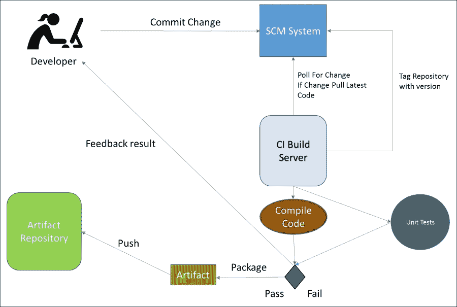

设置持续集成构建和打包持续集成工件时，需要记住的一个重要原则是：工件应只打包一次，而不是每次需要部署时都打包。

这是从可重复性角度看很重要的，同时也能减少部署所需的时间，因为构建过程可能很长，需要很多分钟。当构建已经打包时，所有测试和必要的验证都已经在工件上执行过，作为持续集成过程的一部分，因此，如果没有发生变化，就不需要再次重复这个过程。

我们必须确保在将工件推向生产环境之前，测试环境中部署的工件完全相同；这意味着各环境之间不会出现偏差。在不同的构建服务器上打包相同的源代码可能导致 Java 版本略有不同，甚至像环境变量不同这样的简单问题也可能导致构建的二进制文件被编译成不同的结果。

保持一致的部署工件，始终坚持“打包一次，部署多次”的原则。

包一次，部署多次的标准如下所示，其中单个工件用于初始化测试和生产环境：

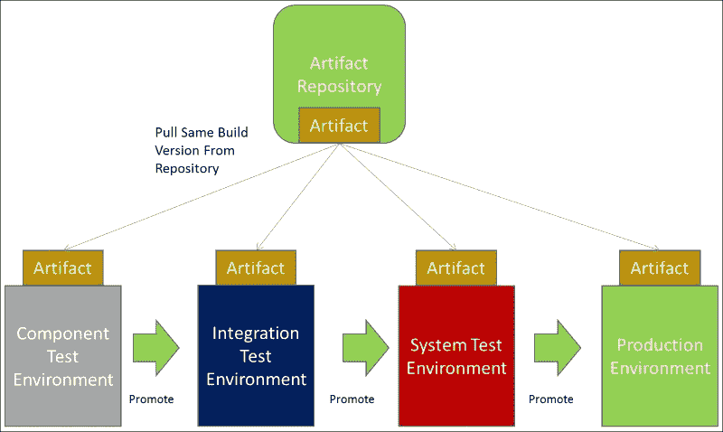

为每个环境创建不同的构建工件是不可取的；发布管理的最佳实践规定，构建包和工件应包含令牌，这样就不需要不同快照的相同包。

构建包的令牌可以在部署时进行转换。所有特定于环境的信息都保存在某种配置文件中，通常称为**环境**文件，该文件在部署时用于填充令牌。

打包持续集成构建工件时应遵循以下最佳实践：

+   工件应打包一次并分发多次。

+   工件包应与令牌化配置文件一起打包。

+   在部署时，应该通过环境文件来转换工件包配置文件。

+   如果部署配置对所有环境都相同，可以使用公共文件来补充环境文件，从而避免重复。

以下流行的配置管理工具能够通过利用配置文件转换令牌化模板。每个配置文件都扮演着环境文件的角色：

+   Puppet [`puppet.com/`](https://puppet.com/)

+   Chef [`www.chef.io/chef/`](https://www.chef.io/chef/)

+   Ansible [`www.ansible.com/`](https://www.ansible.com/)

+   Salt [`saltstack.com/`](https://saltstack.com/)

以 Ansible 为例，在第四章，*使用 Ansible 配置网络设备*一章中，我们介绍了 jinja2 模板的概念。Jinja2 模板允许模板文件用令牌填充，这些令牌在部署时会被特定的键值对替换。

Ansible 允许用户使用变量（令牌）填充 jinja2 模板。每个 `var` 文件可以配置成对每个环境唯一。环境文件可以通过命令行参数导入到剧本和角色中。这将进一步在部署时将 jinja2 模板转换为特定环境的信息。

在以下示例中，我们看到一个 Ansible 剧本 `configure_env.yml` 被执行，并且需要设置一个名为环境的独特环境变量：

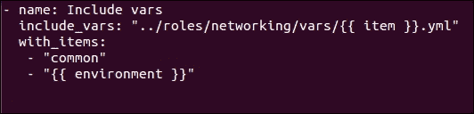

这些将被导入到 `configure_env.yml` 中，以便为每个环境加载一组独特的环境信息。

因此，以组件、集成、系统测试和生产环境为例，以下文件将被加载：

+   `../roles/networking/vars/comp.yml`

+   `../roles/networking/vars/int.yml`

+   `../roles/networking/vars/sys.yml`

+   `../roles/networking/vars/prod.yml`

对于每个独特的环境，部署命令的不同之处仅在于加载的环境文件，这将使部署环境具有特定性：

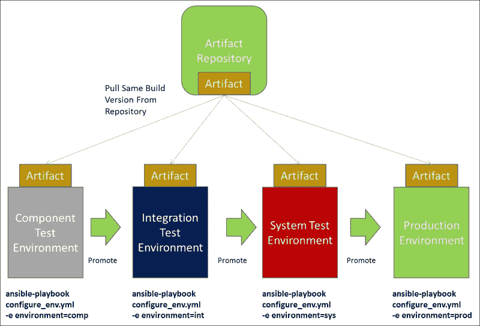

# 持续交付和部署概述

持续交付和部署是持续集成过程的自然延伸。持续交付和部署创建了一个一致的机制，将更改部署到生产环境，并创建一个传送带，将新功能传递给客户或最终用户。因此，从概念上讲，持续交付就像是一个传送带，但在实际过程上，如何实现这一目标呢？

持续集成过程将执行以下高层次的步骤：

+   提交

+   构建（编译/版本/标签）

+   验证

+   包

+   推送

一旦工件被推送到工件库，持续交付和部署就会接管。每一个由持续集成过程创建的构建工件都应视为发布候选版本，这意味着它可以在通过持续交付管道中的所有验证后，潜在地部署到生产环境。

像持续集成一样，持续交付和部署会创建一系列反馈循环，以指示验证测试是否在某个环境中失败。

持续交付流程将涵盖每个部署阶段的以下高层步骤：

+   部署（拉取/令牌化/设置）

+   验证（测试）

+   推广

部署管道中的一个阶段将包含一系列测试，用于帮助验证应用程序是否在发布到生产环境之前按要求正常工作。

部署管道中的每个阶段都会有一个部署步骤，它将从**Artifact Repository**拉取工件到目标服务器并执行部署步骤。部署过程通常涉及安装软件或配置服务器状态的更改。配置更改通常由配置管理工具管理，例如 Puppet、Chef、Ansible 或 Salt。

一旦部署完成，将在环境中进行一系列测试，以验证部署并测试应用程序或更改的功能。

持续交付意味着如果在测试环境中验证测试通过，那么构建工件会自动推广到下一个环境。在下一个环境中，部署、验证和推广步骤将以与前一个环境相同的方式进行。如果出现故障，发布候选版本将会失败，并且不会被推广到下一阶段。

使用持续交付时，自动推广会一直持续到生产前的环境，如下图所示：

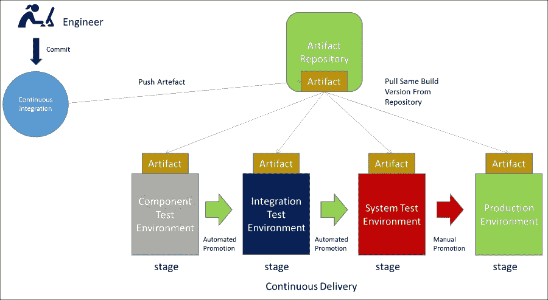

持续部署与持续交付不同，它在生产前没有暂停状态，并且自动部署到生产环境：

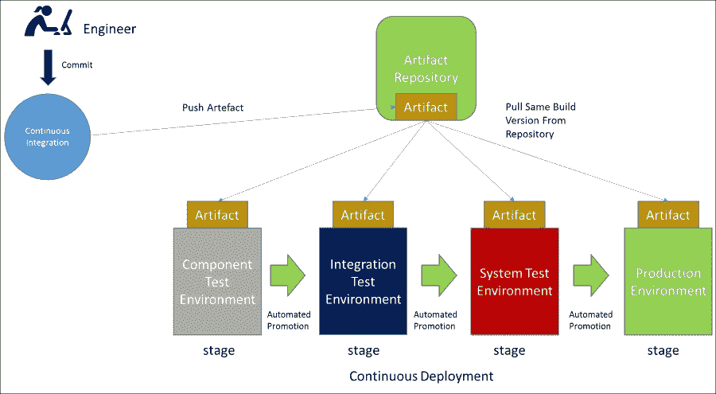

所以，持续交付和持续部署之间的唯一区别就是是否手动暂停将构建工件推广到生产环境。

实施持续交付而非持续部署的原因通常与治理或测试的成熟度有关。

刚开始时，全天候持续部署到生产环境可能显得非常令人生畏，因为它要求部署过程完全自动化，并且每个环境中的验证和测试必须足够成熟，以捕捉所有已知的错误。

在持续部署中，生产部署的触发器是 SCM 提交，因此它把大量的信任放在了部署系统上。这意味着期望分支策略被设置为从**主干/主线/主分支**拉取所有变更并触发部署流水线。拥有多个不同的分支将使部署过程变得复杂，因此重要的是实施一个最小化重复并避免部署流水线数量爆炸的分支策略。

如果实施不当，持续部署可能导致持续的停机时间，因此通常在建立持续集成后，企业和团队应从持续交付开始，目标是随着流程的成熟最终过渡到持续部署。

正如在第三章中所述，*将 DevOps 带入网络运营*，业务内部需要进行文化变革来实施持续交付模型，实际上这是一种全有或全无的方式，才能成功实现。

正如在第八章中所述，*测试网络变更*，手动更新环境可能会影响测试的有效性，因此应该尽一切可能避免，所有变更都应通过 SCM 流向下游环境。

持续交付促进了自动化和在每个部署流水线阶段创建测试包，但它也允许企业精挑细选最终部署到生产环境的发布候选版本。

这意味着在生产之前的停顿期间，可以手动进行额外的验证，以弥补构建制品未达到所需的测试覆盖率或测试水平。这对于受监管要求的公司来说尤其适用，因为它们可能只在指定的部署窗口内进行部署，而无法持续部署到生产环境。

持续交付意味着受监管的公司仍然可以受益于自动化环境和测试，但生产部署只是通过点击按钮来选择已经通过所有前述验证并部署到生产环境的制品。

# 部署方法论

在进行持续交付和部署时，并没有适合所有场景的统一部署策略。像 Puppet、Chef、Ansible 和 Salt 这样的配置管理工具在部署方法和保持服务器最新的方式上有所不同。

选择的工具并不重要，重要的是理想的工作流和流程，以支持交付一致、快速且准确的变更。

## 拉取模型

Puppet 和 Chef 等工具采用集中式配置管理方法，它们有一个集中的服务器，充当部署过程的“大脑”。

在 Puppet 的情况下，集中式服务器是 Puppet Master，而在 Chef 的情况下，集中式服务器是 Chef Server。这个集中式服务器是为存储服务器配置而提供的一套基础设施，按照配置管理工具的参考架构进行。

所有对服务器配置的更新首先推送到集中式服务器，然后通过代理推送到相应的服务器。这些代理可以轮询集中式服务器获取更新并立即应用，或者等待 Puppet Agent，或者在 Chef 的情况下，等待 Chef Client 启动，从集中式服务器到包含代理的服务器进行配置的融合。

拉取模型的主导原则是集中式服务器控制系统的状态，每个变更都需要通过 Puppet Master 或 Chef Server。

如果任何用户登录到服务器并更改状态，那么下一次从集中式服务器进行状态融合时，代理（Puppet Agent 或 Chef Client）运行时可能会覆盖这些手动更改，前提是该配置由集中式服务器管理。

在这种模型中，集中式服务器将控制所有应用版本信息和环境配置。

下图展示了一个拉取模型的示例。图中展示了 Chef 如何在持续交付过程中使用：

+   持续集成过程创建了一个新的构建工件，并将其推送到**工件仓库**。

+   Chef 的命令行客户端**knife**作为构建后动作被调用，它会将新版本的应用更新到**Chef Server**，该版本即将被部署。

+   然后，部署过程通过运行**Chef Client**在**组件测试环境**上触发，这将触发**Chef Client**与**Chef Server**进行状态检查。

+   在这种情况下，**Chef Client**基于上次**knife**更新检测到有新的应用版本可用，因此更新环境到新的应用版本。

+   最后，所有验证和测试步骤都会在推广到部署流水线的下一阶段之前执行。

+   仅在**组件测试环境**的推广成功后，才会触发后续的**集成测试环境**的融合！拉取模型

## 推送模型

像 Ansible 和 Salt 这样的工具采用推送模型来进行配置管理，它们有一个控制主机，通过 SSH 连接到服务器并进行配置。

Ansible 和 Salt 并不使用集中式服务器，而是使用一个控制主机，该主机在服务器上安装了命令行客户端。然后，控制主机通过 SSH（使用密码或 SSH 密钥）登录到服务器，推送更改到服务器。

由于 Ansible 和 Salt 是基于 Python 的，它们不需要代理，可以在任何 Linux 发行版上运行，因为 Python 是这些服务器的前提条件。Windows 机器通过 WinRM 连接并进行配置。

所有配置管理信息都存储在 SCM 系统中，并被拉取到控制主机，这些配置随后用于将更新推送到服务器。

推送模型的主要原则是将更改提交到 SCM 中。SCM 服务器，而不是集中式服务器，是状态、配置和版本控制的真实来源。

以下是推送模型的一个示例，展示了 Ansible 在持续交付过程中的使用：

+   持续集成过程创建了一个新的构建构件，并将其推送到**构件库**。

+   **构件库**中出现新构件时，会触发部署过程，Ansible 的剧本/角色会从**SCM 系统**下载到**Ansible 控制主机**。

+   然后在**组件测试环境**中触发部署过程，并对目标清单中所有服务器执行 Ansible。

+   最后，在将其提升到部署管道的下一个阶段之前，所有验证和测试步骤都会运行。

+   只有在**组件测试环境**的推广成功后，Ansible 才会在后续的集成测试环境中执行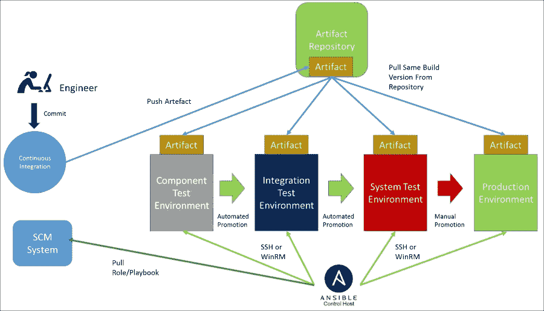

## 何时选择拉取或推送

在选择拉取或推送配置管理方法时，取决于个人偏好，应该根据基础设施的处理方式来选择。

拉取模型在处理长期存在的服务器基础设施时非常受欢迎。它非常适合补丁管理，以保持合规性。由于拉取模型具有一个集中式服务器来维护当前状态，如果从某个服务器中移除配置，集中式服务器会注册需要删除。推送模型只理解当前的期望状态，并且由于缺乏收敛性，不会考虑以前的状态。因此，如果从剧本中删除了一些配置，例如，在下次部署时不会自动清理这些已删除的配置。

拉取方法的缺点是需要维护集中式服务器的基础设施，而这可能会变得相对庞大；同时，由于它是基于代理的，还需要维护代理的版本。

推送模型非常适合协调和更新大量服务器。当使用不可变基础设施时，它们很受欢迎，因为服务器的旧状态并不重要。这意味着只有当前期望的状态才是相关的，因此不需要清理已删除的配置，因为服务器将在每次部署时重新部署。

使用不可变基础设施的拉取模型实际上是没有意义的，因为服务器只会聚合一次，然后销毁，因此为了处理聚合而运行大量集中式服务器是浪费的。

# 打包部署工件

仅使用配置管理工具来部署应用程序是不够的；持续交付和部署的速度取决于最慢的组件。因此，等待手动进行网络或基础设施更改并不可取；所有组件都需要被构建、版本控制，并且部署过程自动化。

在从头开始构建新环境时，需要使用多个部署工件来构建一个环境；应用程序代码只是拼图中的一块。

构建冗余环境所需的依赖项如下：

+   应用程序

+   基础设施（基础操作系统以及虚拟或物理服务器）

+   网络

+   负载均衡

+   部署脚本（配置管理）

如果这些组件没有一起版本控制，就意味着无法进行真正的回滚，因为如果回滚应用程序而网络状态已发生变化，组件可能会出现故障。

理想情况下，应用程序代码、基础设施、网络、负载均衡和部署脚本应当作为一个整体进行版本控制和测试。因此，如果需要回滚，操作员可以简单地回滚到最后一个已知的包，其中包含经过验证的应用程序代码、基础设施、网络、负载均衡和部署脚本，这些元素曾经一起正常工作。

一种选择是拥有一个单一的代码库，在这个代码库中对所有依赖项进行版本控制。对于处理大量应用程序时，这种方式可能缺乏灵活性，并且可能导致配置的重复。

版本控制所有组件的另一种方式是通过持续集成构建，每个组件可以有自己的持续集成构建来版本控制各个组件并创建一个独特的代码库。

应用程序将以打包实体的形式存在，可能是 Red Hat Linux 上的 RPM 文件、Ubuntu 上的 APT 文件，或 Windows 上的 NuGet 包。

基础设施将通过云服务提供商的 API（如 OpenStack、Microsoft Azure、Google Cloud 或 AWS）进行配置，因此需要使用版本控制的清单文件来指定所需的服务器数量。

基础操作系统镜像可以使用如 Packer 或 OpenStack Disk Image Builder 等工具创建，并上传到云服务提供商的镜像注册中心。

如第四章、*使用 Ansible 配置网络设备*、第五章、*使用 Ansible 配置负载均衡器*和第六章、*使用 Ansible 配置 SDN 控制器*中所述，使用 Ansible 进行网络配置通常采用`var`文件的形式，这些文件描述了系统的期望状态。

在使用 SDN 控制器时，子网范围和 ACL 防火墙规则可以在这些`var`文件中描述，并利用按特定顺序调度的模块在部署时应用它们。类似地，负载均衡配置对象模型可以存储在 Ansible 的`var`文件中，以进行负载均衡的设置。

每个仓库都应该标记为持续集成构建的一部分，然后可以为每个应用程序创建一个附加的包构建。这个包构建用于将所有依赖项汇总并通过清单文件一起版本化。

贡献到清单文件的持续集成构建如以下图所示：

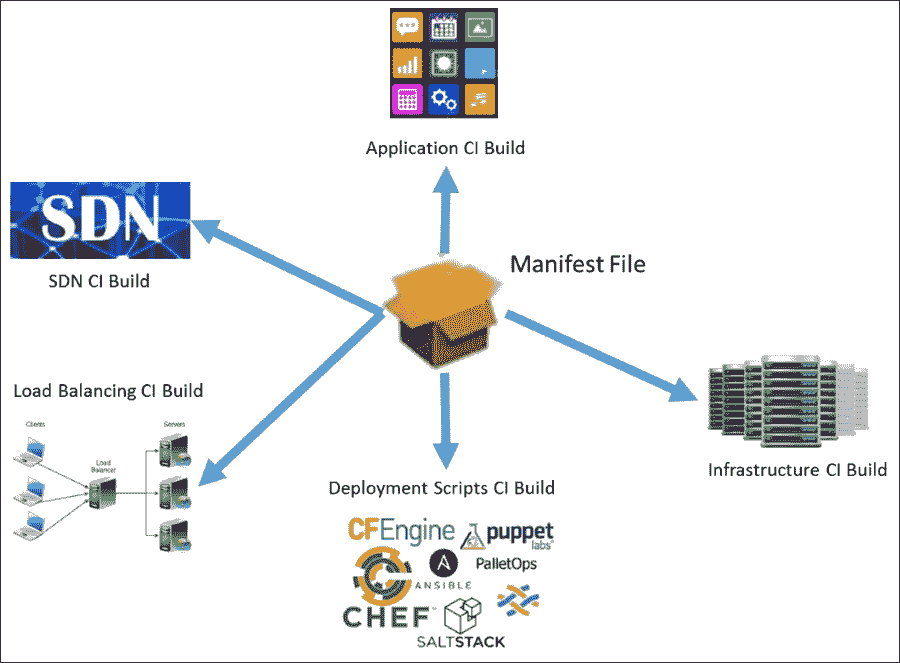

清单文件可以是简单的键值对文件或 JSON 文件。文件的格式并不重要，记录每个持续集成构建的最新标签版本是整个过程的关键。

在部署时，应该使用新的打包清单作为部署管道的触发器。部署管道的第一步将从工件仓库中拉取清单文件，然后可以读取其版本信息。

清单文件中列出的所有仓库版本随后可以被拉取到 Ansible 控制服务器，并用于部署所需的应用版本以及所需的基础设施、网络和负载均衡器，以满足每个环境的需求。

回滚将涉及将之前版本的清单文件传递给部署过程，进而恢复到已知能正常协作的应用程序代码、基础设施、网络、负载均衡和部署脚本的上一个已测试版本。

# 部署管道工具

部署管道涉及将不同工具链在一起，创建持续交付流程。

能够通过持续交付工具追踪流程是至关重要的，因为能够可视化管道过程对操作员来说非常重要，这样他们可以轻松跟踪。

了解流程的可见性使得调试变得容易，尤其是在发生错误时，因为错误会在任何流程中出现，且是不可避免的。持续交付管道的主要目标之一，除了自动化将更改交付到环境之外，就是提供反馈回路。因此，如果一个管道不容易跟踪和调试，它就没有达成其主要目标之一。

如果可能的话，应在管道中实现自动清理功能，这样如果部署过程中发生故障，可以将更改恢复到最后已知的良好状态，而无需人工干预。

从高层次来看，创建持续交付的部署管道时需要以下工具，包括**SCM 系统**、**CI 构建服务器**、**工件库**和**CD 管道调度器**：

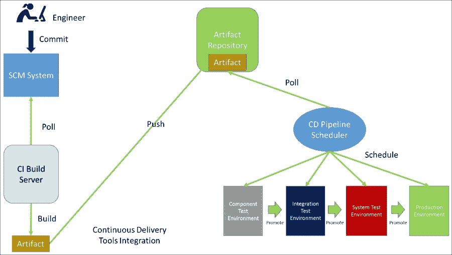

在第七章，*使用持续集成构建进行网络配置*，以及第八章，*单元测试网络更改*中，我们讨论了 SCM 系统和 CI 构建服务器在持续集成和测试中的重要性。在本章中，我们将重点介绍部署过程中所需的工具，包括工件库和用于调度配置管理工具的 CD 管道调度器。

## 工件库

工件库是任何部署管道中的关键组件；它们可以用来托管多种不同的库，甚至只是存放通用工件。

平台的黄金镜像可以以 ISO、AMI、VMDK 和 QCOW 格式存储和版本控制，并用作云提供商（如 AWS、Google Cloud、Microsoft Azure 和 OpenStack）的镜像注册表源。

清单文件也可以存储在发布库中，用于管理应用程序、基础设施、网络和负载均衡要求的前进和回滚。

### Artifactory

JFrog 的 Artifactory 是目前市场上最受欢迎的工件库之一，提供通过基于 NFS 的共享存储解决方案访问库的功能。Artifactory 与 Apache Tomcat Web 服务器捆绑在一起，作为安装包的一部分，可以在 Linux 或 Windows 上托管。

在负载均衡方面，Artifactory 可以设置为高度可用的三层集群以实现冗余。Artifactory 可以使用各种负载均衡器，如 Nginx 或 HAProxy，也可以使用专有负载均衡器，如 Citrix NetScaler、F5 Big-IP 或 Avi Networks。

Artifactory 由 MySQL 或 Postgres 数据库支持，需要 NFS 文件系统或 Amazon S3 存储来存储可供每个 Artifactory 的三个 HA 节点访问的工件。

**Artifactory**的架构概述如下图所示：

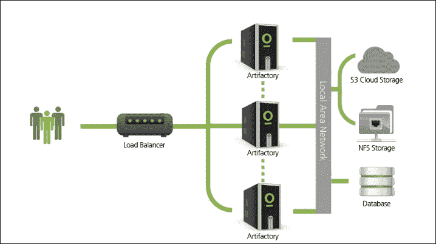

Artifactory 支持多种不同的仓库类型，这里展示了一些，因此它可以根据交付团队所开发的应用程序，托管多个不同的仓库：

+   Maven [`www.jfrog.com/confluence/display/RTF/Maven+Repository`](https://www.jfrog.com/confluence/display/RTF/Maven+Repository)

+   Ivy [`www.jfrog.com/confluence/display/RTF/Working+with+Ivy`](https://www.jfrog.com/confluence/display/RTF/Working+with+Ivy)

+   Gradle [`www.jfrog.com/confluence/display/RTF/Gradle+Artifactory+Plugin`](https://www.jfrog.com/confluence/display/RTF/Gradle+Artifactory+Plugin)

+   Git LFS [`www.jfrog.com/confluence/display/RTF/Git+LFS+Repositories`](https://www.jfrog.com/confluence/display/RTF/Git+LFS+Repositories)

+   NPM [`www.jfrog.com/confluence/display/RTF/Npm+Registry`](https://www.jfrog.com/confluence/display/RTF/Npm+Registry)

+   NuGet [`www.jfrog.com/confluence/display/RTF/NuGet+Repositories`](https://www.jfrog.com/confluence/display/RTF/NuGet+Repositories)

+   PyPi [`www.jfrog.com/confluence/display/RTF/PyPI+Repositories`](https://www.jfrog.com/confluence/display/RTF/PyPI+Repositories)

+   Bower [`www.jfrog.com/confluence/display/RTF/Bower+Repositories`](https://www.jfrog.com/confluence/display/RTF/Bower+Repositories)

+   YUM [`www.jfrog.com/confluence/display/RTF/YUM+Repositories`](https://www.jfrog.com/confluence/display/RTF/YUM+Repositories)

+   Vagrant [`www.jfrog.com/confluence/display/RTF/Vagrant+Repositories`](https://www.jfrog.com/confluence/display/RTF/Vagrant+Repositories)

+   Docker [`www.jfrog.com/confluence/display/RTF/Docker+Registry`](https://www.jfrog.com/confluence/display/RTF/Docker+Registry)

+   Debian [`www.jfrog.com/confluence/display/RTF/Debian+Repositories`](https://www.jfrog.com/confluence/display/RTF/Debian+Repositories)

+   SBT [`www.jfrog.com/confluence/display/RTF/SBT+Repositories`](https://www.jfrog.com/confluence/display/RTF/SBT+Repositories)

+   Generic [`www.jfrog.com/confluence/display/RTF/Configuring+Repositories`](https://www.jfrog.com/confluence/display/RTF/Configuring+Repositories)

这意味着 Artifactory 可以作为持续交付管道的单一仓库端点。Artifactory 最近引入了对 Vagrant boxes 和 Docker registry 的支持，因此可以用来存储 Vagrant 测试环境，这些环境可以用来存储网络操作系统或容器。这展示了市场领先的制品库所提供的一些功能。

## CD 管道调度器

尽管制品库的工作相对简单，但同样重要的是，选择正确的持续交付管道工具要困难得多。

有许多可用的选项，例如：

+   IBM Urban Code Deploy [`developer.ibm.com/urbancode/products/urbancode-deploy/`](https://developer.ibm.com/urbancode/products/urbancode-deploy/)

+   Electric Flow Deploy [`electric-cloud.com/products/electricflow/deploy-automation/`](http://electric-cloud.com/products/electricflow/deploy-automation/)

+   Jenkins [`jenkins.io/`](https://jenkins.io/)

+   Thoughtworks Go [`www.go.cd/`](https://www.go.cd/)

+   XL Deploy [`xebialabs.com/products/xl-deploy`](https://xebialabs.com/products/xl-deploy)

但是，在选择工具之前，需要考虑正在实现的过程。那么，持续交付流水线的主要目标是什么？

一个好的持续交付流水线应该达到以下目标：

+   根据新工件在工件仓库中的可用性触发部署

+   调度命令行

+   渲染流水线视图

+   将任务分解为阶段

+   提供良好的日志输出

+   反馈通过或失败

+   与测试的集成

选择工具时需要考虑所有这些点，因此我们将挑选最受欢迎的持续交付流水线调度工具之一 Jenkins，并查看它调度流水线的方式。

### Jenkins

Jenkins 最初是作为一个持续集成构建服务器而设计的。Jenkins 有一个可插拔框架，这意味着它通常会被定制以执行部署，插件如多任务插件被开发用来让它调度流水线。

然而，从 Jenkins 2.x 版本开始，Jenkins 将流水线作为其分发的核心功能组件，而不再依赖插件来满足其部署能力。

在以下示例中，可以看到 Jenkins 流水线任务类型：

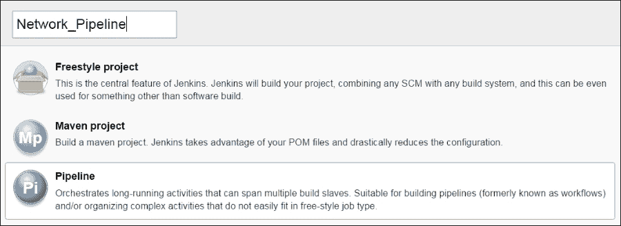

使用 Jenkins 流水线任务类型，用户可以使用`Pipeline Script`指定流水线，声明流水线的每个阶段。在这个示例中，已使用回显命令来模拟每个流水线阶段，展示`Pipeline script`的样子：

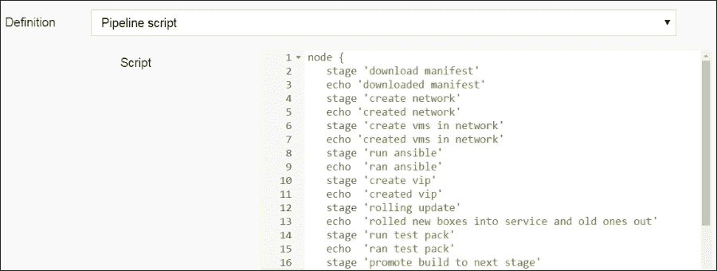

流水线脚本的可视化显示展示在**阶段视图**中。**阶段视图**显示了流水线在部署网络、虚拟机、应用程序和负载均衡器配置时所经历的八个阶段：

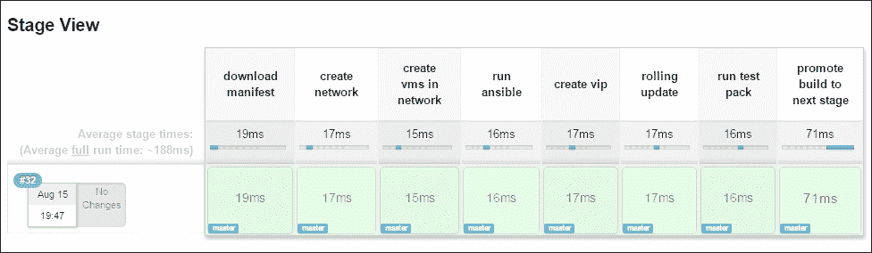

每个阶段的日志在 Jenkins 控制台日志中清晰显示，允许工具的用户看到成功和失败的反馈：

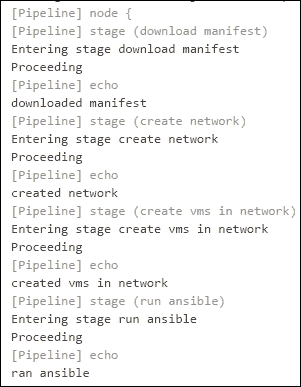

当将有效命令放入`Pipeline script`时，与我们在上面示例中模拟回显不同，Jenkins 允许用户使用 groovy 代码片段生成器将任何步骤转换为流水线脚本格式。

在这种情况下，需要一个 shell 命令来执行 Ansible 剧本，`create_vip.yml`，在组件测试环境上，因此使用代码片段生成器来创建它：

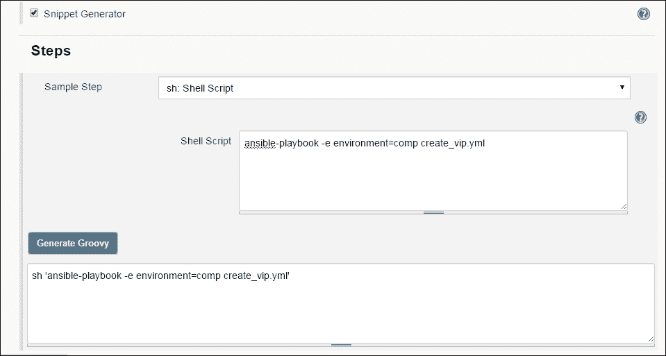

这个代码片段命令可以粘贴到在流水线脚本中创建的`create_vip.yml`阶段：

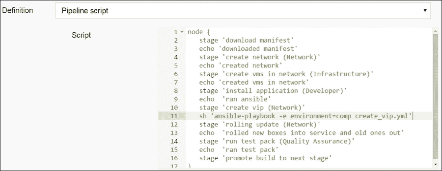

作业配置的输出是一个 Jenkins 文件，可以存储在 SCM 中，以版本控制部署管道的变更。

# 使用部署管道部署网络变更

在进行持续交付或部署时，必须包含网络变更。网络团队需要为部署管道贡献关键部分。

由于 CD 管道调度器允许在部署管道中指定不同的阶段，它提供了极大的灵活性，并允许所有团队贡献自己的部分，形成一个真正协作的 DevOps 模式。

有时网络团队的担忧是开发人员不应该拥有所有网络设备的必要访问权限，因为他们不是专家。事实上，开发人员并不想访问网络设备，他们只是希望有一个快速的方式来推动他们的变更，而不被网络变更的应用所阻碍。

## 网络自服务

允许开发人员自行处理网络变更非常重要，否则网络团队将成为持续交付过程中的瓶颈。

因此，提供给开发团队一个强化的 Ansible playbook 来创建日常网络功能，无疑会帮助减轻开发人员的痛苦，并使新的网络变更的部署成为自服务功能。

开发人员可以使用一个包含网络团队最佳实践的 playbook 来应用任何网络变更。这遵循了这样的模式：开发人员可以利用基础设施团队提供的 playbook 来创建新的虚拟机，并使用 IPAM 解决方案注册他们的 DNS 条目。

## 部署管道中的步骤

在创建部署管道时，重要的是将每个功能拆分成一组精细的步骤。这意味着如果任何步骤失败，可以轻松回滚。直观地理解部署管道也很重要，因为将复杂的操作拆解为小步骤使得调试失败变得不那么令人生畏。

现代应用程序的部署管道将在每次部署时，通过执行以下高级步骤来配置新的环境：

1.  下载清单

1.  创建网络

1.  在网络中创建虚拟机

1.  安装应用程序

1.  创建 VIP

1.  滚动更新

1.  运行测试包

1.  推广到下一个阶段

管道的第一阶段是触发新部署到第一个测试环境。在这种情况下，检测到一个新的清单文件工件。

清单工件将被下载到 CD 管道调度器并解析。Ansible `var` 文件结构将从 SCM 使用清单版本进行组装。

一旦组装完成，网络需要被配置。根据发布版本，将创建 A 或 B 网络，并将应用必要的入站和出站 ACL 规则。

虚拟机将被启动到新配置的网络中，并用其元数据配置文件进行标记，标明需要在其上安装的软件。

运行 Ansible 动态清单以拉取刚刚创建的虚拟机，Ansible 从虚拟机读取配置文件元数据和元数据标签，并根据指定的配置文件在新集群的虚拟机上安装所需角色。

如果负载均衡器上不存在 VIP，将创建一个 VIP，并应用其负载均衡策略。然后将新服务器加入服务并将旧服务器移出服务。新服务器将进行冒烟测试，以确保它们按预期运行，然后销毁之前的版本。

然后执行完整的质量保证测试包，如果成功，清单工件将被提升到下一个阶段。

这些步骤会一直重复，直到生产环境。在持续交付模型中，生产部署将是手动按下按钮触发管道，而在持续交付管道中，如果所有质量门都通过，管道将自动触发。

## 引入配置管理工具

在使用如 Jenkins 等 CD 调度器时，其代理（称为“从属”）可以用于安装 Ansible，并将其变为部署的 Ansible 控制主机。

部署管道中的每个阶段都可以是一个小型的模块化 Ansible 剧本，使开发人员能够自助处理网络需求。这些剧本可以由网络团队创建，并随着时间的推移不断改进。

因此，Jenkins `Pipeline 脚本`将如下所示，每个阶段都有一个独特的剧本：

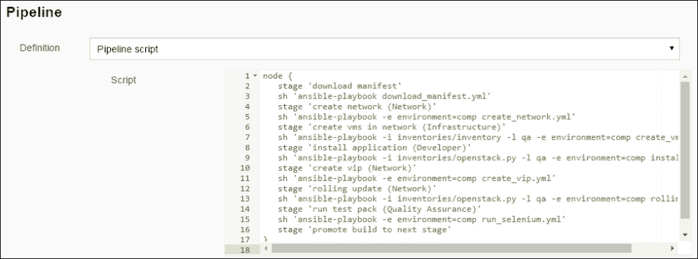

应用于每个测试环境的步骤应与生产环境保持一致，所有步骤都应由管道的服务账户执行。

每一个环境都应该通过实现不可变基础设施和网络从源代码控制构建。这样，所期望的状态始终是清单文件关联的代码库中指定的内容。

提供给每个剧本的 Ansible `var` 文件可以由开发团队填写，以设置防火墙策略或负载均衡策略。

这些 `var` 文件由相关的持续集成构建版本控制，用于 SDN 或负载均衡配置。每个与网络相关的 CI 构建在应用程序持续集成构建触发时会汇总到一个新的清单文件中。新清单文件的生成会触发部署管道的第一步。

## 网络团队在持续交付管道中的角色

在分析部署管道执行的步骤时，如果我们查看哪些团队具有执行每个管道阶段的必要权限，就能非常明显地看出将网络集成到持续交付流程中的重要性。

在部署应用程序的八个高级阶段中，三个阶段涉及与网络集成，分别是执行**创建网络**、**创建 vip**和**滚动更新**，如图所示：

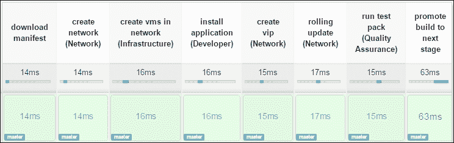

这表明，如果网络操作不是部署管道的一部分，那么真正的持续交付将无法实现。

## 快速失败和反馈循环

创建持续交付管道的一个关键目标是创建快速失败的反馈循环，并为开发人员创建一个可视化的仪表板。然而，随着持续交付向持续运营领域的扩展，涉及到基础设施、网络和质量保证，所有团队都需要关注故障并做出相应反应。

当管道阶段失败时，每次出现故障时都需要进行自动清理，这样可以保持管道的良好状态，避免下一个管道被阻碍。任何流程中的中断都会导致变更无法到达生产环境。

所以，尽管可能是一个测试环境出现故障，但它现在阻止了潜在的修复程序被部署到生产环境。如果发生故障，管道还应该暂停整个过程，而不是继续到下一个阶段，如下所示：

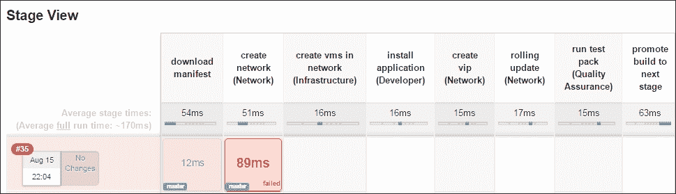

Ansible 的块救援功能在处理失败的管道阶段和清理时非常有用，它为 playbook 和角色提供了类似于 try 和 catch 的功能。

测试也应该被集成到部署管道中，这样如果管道的运行测试阶段失败，就会有关于测试失败的历史记录，可以进行审计。管道还帮助提供已应用于环境的所有变更的完整历史。虽然由服务帐户触发，但提交变更的用户应该对每次变更负责。

# 总结

在本章中，我们探讨了将网络变更集成到部署管道中，以便网络团队能够为持续交付过程做出贡献。然后，我们讨论了持续交付和部署之间的区别。

然后，我们探讨了软件包管理在将开发、基础设施、质量保证和网络变更结合在一起作为部署管道的一部分时的重要性。我们还以 Artifactory 和 Jenkins 为例，展示了一些市场领先的工件仓库和 CD 管道调度器。

最后，我们探讨了在持续交付和部署范围内设置部署管道时应该采用的最佳实践。接着，我们专注于网络团队如何通过为开发人员提供自助服务的部署脚本来贡献于部署管道，以便保持整体过程的快速、精简和自动化。

阅读完本章后，您应该理解为何应用程序应该仅编译一次并存储在构件仓库中，并且相同的二进制文件应部署到多个环境中，以确保部署过程的一致性。

本章还重点讲解了基于拉取模型的工具（如 Chef 和 Puppet）与基于推送模型的工具（如 Ansible 和 Salt）在配置管理中的差异。

关键要点还应包括如何利用 Artifactory 作为构件仓库，存储多种类型的构建产物，以及如何使用持续集成生成清单文件，以对代码、基础设施、网络和负载均衡进行版本控制。

读者应学习持续交付管道中的所有必要步骤，如何使用 Jenkins 2.x 设置部署管道，以及在持续交付模型中集成网络的重要性。

在下一章，我们将重点讨论容器，并探讨它们对网络和网络操作的影响。我们还将了解一些可以使用的不同编排选项，例如 Docker 和 Kubernetes。
