# 第十章 容器对网络的影响

现代 IT 书籍中没有一章关于容器的内容是 incomplete 的。在这一章中，我们将回顾容器的历史以及当前可以部署容器的选项。本章将探讨从网络角度支持容器运行所需的变化。接着，我们将重点讨论用于打包容器的一些技术，以及它们如何融入持续交付流程。最后，我们将重点讨论一些用于部署容器的编排工具。

本章将涵盖以下主题：

+   容器概述

+   容器打包

+   容器编排工具

+   容器如何适应持续集成和持续交付

# 容器概述

最近，IT 行业对容器的宣传非常多；你可能会认为，仅凭容器就能解决所有应用程序部署的问题。许多供应商的营销活动声称，实施容器会让企业更加敏捷，或者仅仅通过将应用程序部署到容器中，企业就已经在实施*DevOps*。如果你听到软件供应商在推广其容器技术或容器编排软件时这样说，那这无疑是他们的观点。

然而，容器并不是一个新概念。远不是：Solaris 10 早在 2005 年就引入了 Solaris Zones 的概念，这使得用户能够将操作系统分割为不同的组件并运行隔离的进程。现代技术如**Docker**或**Rocket**提供了一个容器工作流，允许用户打包和部署容器。

然而，像所有基础设施概念一样，容器只是流程的促进者，错误地将容器作为独立项目实施通常不会为公司带来业务价值。鉴于容器的近期流行，似乎大型软件供应商将容器解决方案作为其产品组合的一部分几乎已成必然。

容器，像所有工具一样，对于某些使用场景是非常有益的。在考虑容器时，重要的是要考虑它们对微服务架构带来的好处。可以公平地说，容器已被一些**平台即服务**（**PaaS**）公司视为开发与运维之间的桥梁。

容器技术使得开发人员能够以一致的方式将应用程序打包在容器中，同时描述他们希望如何使用 PaaS 技术在生产环境中运行微服务应用程序。开发和运维人员都能理解这一构建，因为他们都熟悉相同的容器技术和他们用于部署应用程序的构建方式。这意味着在开发工作站上部署的容器与在生产系统上运行时的行为是相同的。

这使得开发人员能够更加一致地定义应用程序拓扑和负载均衡需求，以便在测试和生产环境中通过共同的工具集进行相同的部署。

像 Netflix 这样的著名成功案例表明，将整个微服务架构容器化是可行的，并且能够取得成功。随着微服务应用的流行，常见的需求是将微服务应用程序打包并部署到多个混合云中。这为组织提供了选择使用哪家私有或公有云服务提供商的真实选择。

在微服务架构中，云原生微服务应用可以根据业务的繁忙或安静时段快速扩展或缩减。当使用公有云时，理想的做法是只利用所需的资源，这通常意味着微服务可以在一天中随时扩展或缩减，以节省运行成本。

基于利用率的弹性扩展是部署云原生微服务时的常见用例，这样微服务可以根据其监控系统或云服务提供商提供的数据进行动态扩展或缩减。

微服务沿袭了面向服务架构（**SOA**）的理念，并且可以被视为这一理念的现代实现。像 SOA 这样的微服务允许多个不同的组件通过服务网络和通用协议集进行通信。微服务旨在将服务解耦成具体的功能，使其可以单独进行测试，并将它们组合起来以创建整体系统，并且如所示，根据需求进行扩展或缩减。

在使用微服务架构时，不需要每次都部署整个系统，不同的组件版本可以独立部署，而不会导致系统停机。

从某种程度上看，容器可以被视为微服务应用程序的完美解决方案，因为它们可以用来独立执行特定功能。每个微服务应用可以在单独的容器构建中部署，并通过网络连接在一起，以便为最终用户提供整体服务。

容器本身已经原生支持在任何 Linux 操作系统上运行，并且具有轻量级的特点，这意味着在使用流行的容器技术时，如下所示，它们可以轻松部署、维护和更新：

+   Docker ([`www.docker.com/`](https://www.docker.com/))

+   Google Kubernetes ([`kubernetes.io/`](http://kubernetes.io/))

+   Apache Mesos ([`mesos.apache.org/`](http://mesos.apache.org/))

+   IBM Bluemix ([`www.ibm.com/cloud-computing/bluemix/containers/`](http://www.ibm.com/cloud-computing/bluemix/containers/))

+   Rackspace Catrina ([`thenewstack.io/rackspace-carina-bare-metal-caas-based-openstack/`](http://thenewstack.io/rackspace-carina-bare-metal-caas-based-openstack/))

+   CoreOS Rocket ([`coreos.com/blog/rocket/`](https://coreos.com/blog/rocket/))

+   Oracle Solaris Zones ([`docs.oracle.com/cd/E18440_01/doc.111/e18415/chapter_zones.htm#OPCUG426`](https://docs.oracle.com/cd/E18440_01/doc.111/e18415/chapter_zones.htm#OPCUG426))

+   Microsoft Azure Nano Server ([`technet.microsoft.com/en-us/windows-server-docs/get-started/getting-started-with-nano-server`](https://technet.microsoft.com/en-us/windows-server-docs/get-started/getting-started-with-nano-server))

+   VMware Photon ([`blogs.vmware.com/cloudnative/introducing-photon/`](http://blogs.vmware.com/cloudnative/introducing-photon/))

**容器化** 本质上是在操作系统上虚拟化进程，并将它们相互隔离成可管理的组件。容器编排技术随后创建网络接口，使多个容器能够跨操作系统相互连接，或者在更复杂的场景中，创建完整的覆盖网络，利用程序化 API 和键值存储进行服务发现，以连接运行在多个物理或虚拟服务器上的容器。

## Solaris Zones

2005 年，Solaris 引入了 **Solaris Zones** 的概念，并由此产生了容器化的概念。在用户登录到全新的 Solaris 操作系统后，他们会发现自己处于一个全局的 Solaris 区域中。

Solaris 随后为用户提供了创建新区域、配置它们、安装运行它们的包，并最终启动它们以便使用的选项。这使得每个隔离的区域能够作为单一 Solaris 操作系统内的独立部分使用。

Solaris 允许区域作为完全隔离的一组进程运行，这些进程在权限、磁盘和网络配置方面都来自默认的全局区域。不同的持久存储或原始设备可以被导出到区域并挂载，以使外部文件系统对区域可访问。这意味着多个不同的应用程序可以在各自独立的区域内运行，并与外部共享存储进行通信。

在网络方面，全球 Solaris Zone 将具有一个 IP 地址，并连接到默认路由器。所有新区域将具有相同子网内的唯一 IP 地址，并使用相同的默认路由器。如果需要，每个区域甚至可以有自己独特的 DNS 条目。Solaris Zones 的网络配置如图所示，通过访问`/zones`文件系统上的网络配置，两个区域连接到路由器：

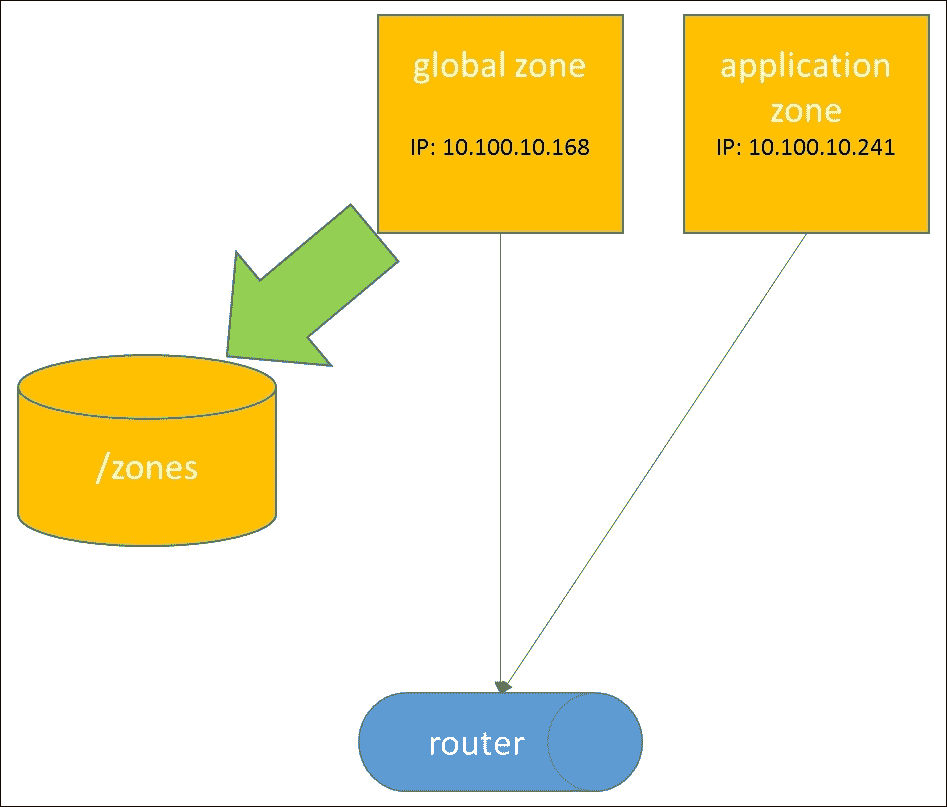

.

## Linux 命名空间

**Linux 命名空间**为系统进程创建了一个抽象层，对该进程的更改仅会影响同一命名空间中的其他进程。Linux 命名空间可用于隔离 Linux 操作系统上的进程；默认情况下，当 Linux 操作系统启动时，所有资源都运行在默认命名空间下，因此能够查看所有正在运行的进程。

命名空间 API 包含以下系统调用：

+   `clone`

+   `setns`

+   `unshare`

`clone`系统调用创建一个新进程，并将所有指定的进程与之关联；而`setns`系统调用用于将命名空间连接在一起，`unshare`系统调用则将进程从一个命名空间移出并移至新的命名空间。

以下是 Linux 上可用的命名空间：

+   挂载

+   进程 ID

+   进程间通信

+   UTS

+   网络

+   用户

mounts 命名空间用于隔离 Linux 操作系统的文件系统，使得特定的挂载点仅对属于同一命名空间的进程组可见。这使得不同的进程可以根据其所属的命名空间访问不同的挂载点，从而可以用于保护特定的文件。

**进程 ID**（**PID**）命名空间允许在 Linux 机器上重用 PID 进程，因为每组 PID 都是唯一的，并且属于特定命名空间。这允许容器在主机之间迁移，同时保持相同的 PID，从而确保操作不会中断容器。这也允许每个容器拥有独特的`init`进程，并使容器具有极高的可移植性。

**进程间通信**（**IPC**）命名空间用于隔离特定的资源，如进程之间的系统对象和消息队列。

UTS 命名空间允许容器拥有自己的域名和主机名；这在使用容器时非常有用，因为编排脚本可以针对特定的主机名，而不是 IP 进行操作。

网络命名空间在网络资源（如 IP 空间、IP 表和路由表）周围创建了一个隔离层。这意味着每个容器可以有其独特的网络规则。

用户命名空间用于管理用户对命名空间的权限。

因此，从网络角度来看，命名空间允许多个不同的路由表在同一 Linux 操作系统上共存，因为它们具有完全的进程隔离。这意味着每个容器可以根据需要应用其独特的网络规则。

## Linux 控制组

**控制组**（**cgroups**）的使用使用户能够控制属于命名空间的一部分的 Linux 操作系统资源。以下控制组可用于控制 Linux 资源：

+   CPU

+   内存

+   冰冻

+   块 I/O

+   设备

CPU 控制组可以使用两种不同类型的调度器：一种是**完全公平调度器**（**CFS**），基于加权系统分配 CPU。另一种是**实时调度器**（**RTS**），它是一种任务调度器，根据任务的实时使用情况来限制任务的执行。

内存控制组用于生成与控制组中的任务相关的内存利用率报告。它对与控制组相关的进程的内存使用设置限制。

冰冻控制组（freezer cgroup）用于控制与冰冻控制组相关的所有进程的状态。冰冻控制组可用于控制一批任务并发出`FREEZE`命令，这将停止用户空间中的所有进程；`THAW`命令则可以用来重新启动这些进程。

**块 I/O**（**blkio**）控制组监控对块设备的 I/O 访问，并对 I/O 带宽或对资源的访问引入限制。Blkio 使用 I/O 调度程序，并可以分配权重来分配 I/O，或通过设置最大限制来对进程在设备上读取或写入的数量进行限制，从而实现 I/O 限速。

设备控制组通过在`devices.allow`和`devices.deny`下定义任务来允许或拒绝访问设备，并可以通过`devices.list`列出设备访问。

## 容器的好处

容器具有许多优势，特别是在可移植性、敏捷性、安全性方面，正如本章前面所提到的，它们帮助了许多组织（如 Netflix）部署微服务架构。

容器还允许用户通过使用命名空间在操作系统上分配不同的资源，并通过控制组限制 CPU、内存、网络块 I/O 和网络带宽。

容器的配置非常快速，因此可以迅速进行横向扩展和缩减，以支持云环境中的弹性扩展。它们可以迅速扩大以满足需求，并且容器可以通过多种技术从一台服务器迁移到另一台服务器。

控制组可以根据系统的变化迅速进行配置，赋予用户对操作系统低级调度特性的完全控制，而这些通常是在使用虚拟机或裸金属服务器时交由基础操作系统来处理的。容器可以进行微调，以提供对性能的更精细控制。

在某些场景下，裸金属服务器上的所有资源并不会被充分利用，这可能会导致浪费，因此可以通过容器来利用客户操作系统上所有的 CPU 和内存，方法是在内核级别通过命名空间隔离运行多个相同应用程序的实例。这意味着对于每个进程，它们看起来像是在自己独特的操作系统上运行。

到目前为止，容器的主要缺点之一是它们通常是低级别的，并且在大规模管理时非常困难。因此，像大规模实施和协调引擎（例如 Docker Swarm、Google Kubernetes 和 Apache Mesos）等工具通过创建抽象层来管理容器，从而减轻了这种痛苦。

容器的另一个好处是它们非常安全，因为它们通过使用不同的命名空间，限制了攻击面，并为操作系统增加了额外的安全层。如果操作系统被攻击，攻击者仍然需要在命名空间级别攻破系统，而不是直接访问所有进程。

在运行多个相同进程的不同版本时，容器非常有用；例如，一个企业希望为不同的客户运行同一个应用程序的多个版本。他们希望防止一个客户的登录和交易激增影响到其他客户的应用层。容器在这种情况下是一个可行的解决方案。

## 部署容器

随着容器的日益流行，传统的 Linux 发行版在运行纯容器平台时被发现表现不佳且笨重。

因此，已经创建了非常精简的操作系统来托管容器，例如 CoreOS 和 Red Hat Atomic，这些操作系统专门设计用于运行容器。

在操作系统之间共享信息对于容器来说也是一个挑战，因为按照设计，它们通过命名空间（namespaces）和控制组（cgroups）被隔离到特定的主机操作系统上。**etcd**、**Consul** 和 **Zookeeper** 等键值存储可以用于跨主机群集和共享信息。

### CoreOS

**CoreOS** 是一个基于 Linux 的操作系统，专门设计用于提供一个最小化的操作系统来运行容器集群。它是目前最广泛使用的容器操作系统，旨在以大规模运行而无需频繁手动修补和更新操作系统上的软件。

任何在 CoreOS 上运行的应用程序都将以容器格式运行；CoreOS 可以在裸机或虚拟机上运行，支持 AWS 和 OpenStack 等公共和私有云。

CoreOS 通过自动拉取频繁的安全更新而不影响操作系统上运行的容器来工作。这意味着 CoreOS 不需要 Linux 管理员干预和修补服务器，因为 CoreOS 会通过零停机安全更新自动处理这些修补。

CoreOS 通过将应用程序依赖性从应用程序中剥离并转移到容器层来工作，因此容器依赖于其他容器来进行依赖管理。

### etcd

CoreOS 使用 etcd，这是一种分布式键值存储，允许跨多台机器的多个容器连接到它，以获取数据和状态信息。

Etcd 使用**Raft 算法**来选举领导者，并通过跟随者来保持一致性。当多个 etcd 主机运行时，状态从大多数实例中拉取并传播到跟随者，因此它用于保持集群的一致性和实时更新。

应用程序可以读取和写入数据到 etcd，并且它被设计用来处理故障和故障条件。Etcd 可以用来存储到端点的连接字符串或其他特定环境的数据存储。

## Docker

如果不提到 Docker，谈容器将是不可能的。2013 年，Docker 作为一个开源项目发布，可以用来打包和分发容器。Docker 最初是基于 Linux LXC 容器的，但随着项目的发展，它已经逐渐脱离了这一标准，并变得更加有主张和成熟。

Docker 基于在 Linux 内核中将每个容器进程隔离的原则工作。Docker 使用支持联合的文件系统、cgroups 和内核命名空间来运行容器并隔离进程。它具有命令行界面和经过深思熟虑的工作流。

## Docker 镜像仓库

当容器镜像被打包时，它们需要被推送到 Docker 的容器镜像仓库服务器，这是一个容器的镜像存储库。

**Docker 镜像仓库**用于存储容器，容器可以像软件包仓库一样进行标记和版本管理。这允许存储不同版本的容器，以便进行向前滚动和回滚。

默认情况下，Docker 镜像仓库是一个文件系统卷，并在本地文件系统上持久化数据。像 Artifactory 和 Nexus 这样的工件仓库现在也支持 Docker 镜像仓库作为一种仓库类型。Docker 镜像仓库可以通过身份验证和 SSL 证书来确保容器镜像的安全。

## Docker 守护进程

在安装过程中，Docker 会在目标操作系统上部署一个守护进程，用来运行容器。**Docker 守护进程**用于与 Docker 镜像仓库通信，并发出拉取命令以拉取最新的容器镜像或特定标签版本。然后，Docker 命令行可以用来调度启动容器，使用从仓库中拉取的容器镜像。默认情况下，Docker 守护进程会作为常驻进程运行在目标操作系统上，但可以通过 `systemd` 等进程管理器来启动或停止。

## 打包容器

容器可以以多种方式打包；其中两种最常见的打包方式是使用 Dockerfile，另外一种较少为人所知的方式是使用 **HashiCorp** 提供的工具 Packer。这两者在打包容器镜像时有略微不同的方法。

### Dockerfile

Docker 允许用户使用其自有的配置管理工具 **Dockerfile** 来打包容器。Dockerfile 会通过列出在构建时使用包管理器安装的包来说明容器的意图。

以下 Dockerfile 展示了通过执行`yum` `install`命令在 CentOS 上安装 NGINX，并将端口`80`暴露给来自打包容器的客户操作系统。暴露端口`80`是为了让 NGINX 能够外部访问：

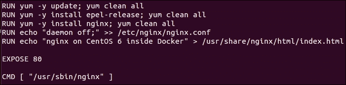

一旦创建了 Dockerfile，Docker 的命令行界面允许用户发出以下命令来构建容器：

```
docker build nginx

```

唯一的缺点是，应用程序通常使用配置管理工具，如 Puppet、Chef、Ansible 和 Salt 来安装。Dockerfile 非常脆弱，这意味着打包脚本需要完全重写。

### Packer-Docker 集成

**Packer** 是 HashiCorp 的一个命令行工具，使用多个驱动程序来打包虚拟机镜像，也支持创建 Docker 镜像文件。Packer 可用于打包**Amazon Machine Image**（**AMI**）镜像，用于 AWS，或**QEMU Copy On Write**（**QCOW**）镜像，这些镜像可以上传到 OpenStack Glance。

使用 Packer 时，省去了使用 Dockerfile 来创建 Docker 镜像的需求；相反，可以使用现有的配置管理工具，如 Puppet、Chef、Ansible 和 Salt，来配置和打包 Docker 容器镜像。

Packer 具有以下高级架构，并使用一个 JSON 文件来描述 Packer 工作流，主要分为三部分：

+   构建器

+   配置管理工具

+   后处理器

**构建器**用于启动一个 ISO、虚拟机在云平台上，或者在此情况下，从构建服务器上的镜像文件启动一个 Docker 容器。

一旦启动，配置管理**配置器**将运行一组安装步骤。这将创建镜像所需的状态，模拟 Dockerfile 将执行的操作。完成后，镜像将停止并被打包。

一组**后处理器**将被执行，将镜像推送到一个工件库或 Docker 注册表，在那里它会被标记并版本化。

使用 Packer 意味着可以使用现有的配置管理工具来打包虚拟机和容器，而不是为容器使用完全不同的配置管理机制。Docker 守护进程需要作为前提条件安装在用于打包容器的构建服务器上。

在以下示例中，创建了一个`nginx.json` Packer 文件；`builders`部分定义了类型为`docker`，这让 Packer 知道使用 Docker 构建器。

`export_path`是最终 Docker 镜像导出的位置，`image`是将从 Docker 注册表中拉取并启动的 Docker 镜像文件的名称。

一个`ansible-local`类型的配置管理器将执行`install_nginx.yml`剧本，以便使用 Ansible 剧本而不是 Dockerfile 来安装 NGINX 到 Docker 镜像中。

最后，后处理器将把打包的镜像（包含安装的 NGINX）导入到 Docker 注册表，并使用标签`1.1`：

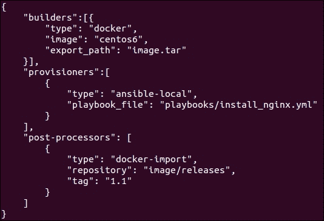

要执行 Packer 构建，只需执行以下命令并传入 `nginx.json` 文件：

```
packer build nginx.json

```

## Docker 工作流

**Docker 工作流** 很好地融入了我们在 第七章 中讲解的持续集成过程，*使用持续集成构建进行网络配置*，以及我们在 第九章 中讲解的持续交付工作流，*使用持续交付流水线部署网络变更*。在开发人员推送新的代码提交后，编译并可能打包新的代码，持续集成过程可以扩展为执行 Dockerfile，以作为部署后的步骤打包新的 Docker 镜像。

每个下游测试环境和生产环境都配置了 Docker 守护进程，作为基础操作系统的一部分。在部署时，Docker 守护进程会被调度拉取新打包的 Docker 镜像并创建一组新的容器进行滚动更新。

该流程图可以如下所示：

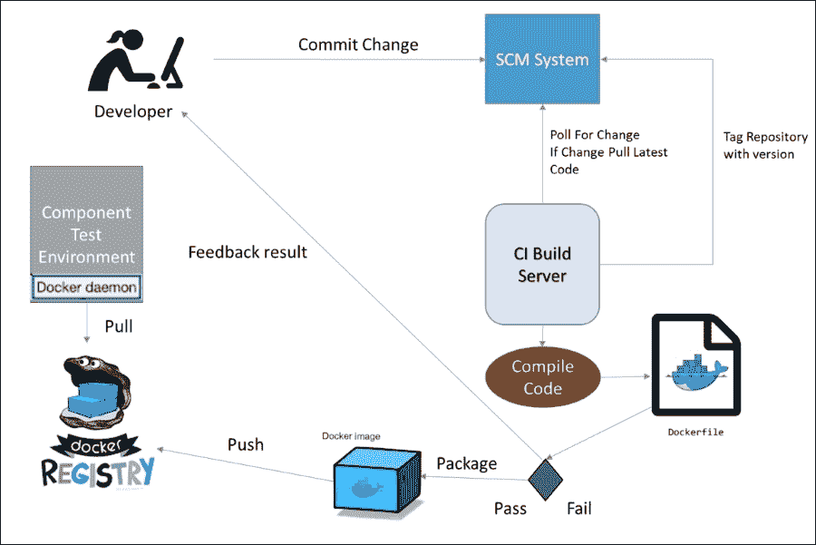

## 默认 Docker 网络

在网络方面，当安装 Docker 时，它会创建三个默认网络；创建的网络是 `bridge`、`none` 和 `host` 网络，如下图所示：

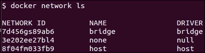

Docker 守护进程默认情况下使用桥接（`docker0`）网络来创建容器；当在目标操作系统上执行 `docker create` 和 `docker start` 命令时，或者可以只执行 `docker run` 命令。这些命令将根据定义的 Docker 镜像在主机操作系统上创建并启动新的容器。

`none` 网络用于创建特定于容器的网络，这允许容器启动并持续运行；但是它没有网络接口。`host` 网络将容器添加到与客户操作系统相同的网络中。

当容器在其上启动时，Docker 的桥接网络会为每个容器分配一个在桥接网络子网范围内唯一的 IP 地址。可以通过执行以下 `docker network inspect` 命令查看容器：

```
docker network inspect bridge

```

Docker 允许用户通过 `docker attach` 命令检查容器配置；在这种情况下，可以检查 `nginx` 容器：

```
docker attach nginx

```

一旦连接，可以检查 `/etc/hosts` 文件以查看网络配置。Docker 桥接使用 NAT 网络，并且可以使用以下 `–p` 命令行参数进行端口转发。例如，`-p 8080:8080` 将主机的端口 `8080` 转发到容器的端口 `8080`。这使得所有在操作系统上运行的容器都可以通过它们的 IP 地址直接通过 localhost 访问，使用端口转发。

在其默认网络模式下，Docker 允许使用`--links`命令行参数将容器互联，该参数用于连接容器，写入容器的`/etc/hosts`文件。

现在不建议使用默认的网络设置，而是有更复杂的网络配置，但它覆盖的概念仍然很重要。

Docker 允许定义用户定义网络来托管容器，使用网络驱动程序创建自定义网络，如自定义`bridge`、`overlay`或层 2`MACVlLAN`网络。

## Docker 用户定义的桥接网络

用户定义的桥接网络与默认的 Docker 网络非常相似，但意味着每个容器可以在同一桥接网络上与其他容器通信；与默认的 Docker 网络不同，无需链接。

要将容器放置在用户定义的网络上，可以使用以下命令在`devops_for_networking_bridge`用户定义的桥接网络上启动容器，并设置`--net`选项：

```
docker run –d –name load_balancer –net devops_for_networking_bridge nginx

```

每个启动的容器将驻留在同一操作系统客户机上。`Publish`用于暴露特定使用`-p 8080-8081:8080/tcp`命令的。因此，可以发布范围以便暴露网络的部分。

## Docker Swarm

虽然本书已经详细介绍了可以与 Docker 一起使用的 Overlay 网络，它们是网络的虚拟化抽象层。Docker 可以为容器创建 Overlay 网络，用于创建属于多个不同操作系统主机的容器网络。

Docker 不是将每个容器隔离到一个唯一网络的主机上，而是允许其 Overlay 网络将部署在不同主机上的多个容器群组连接在一起。

这意味着每个共享 Overlay 网络的容器将拥有唯一的 IP 地址和名称。要创建 Overlay 网络，Docker 使用其自己的编排引擎，称为**Docker Swarm**。

要在 Swarm 模式下运行 Docker，需要使用外部键值存储，如 etcd、Consul 或 Zookeeper 与 Docker 一起使用。此键值存储允许 Docker 在不同主机之间共享信息，包括共享 Overlay 网络。

### Docker machine

`docker-machine` 是一个有用的命令行实用程序，它允许在 VirtualBox、OpenStack、AWS 等许多平台上使用驱动程序虚拟机进行配置。

在以下示例中，我们可以看到如何使用`docker-machine`在 OpenStack 中启动机器：

```
docker-machine create –driver openstack (boot arguments and credentials) docker-dev

```

`docker-machine`更有用的功能之一是在云环境中启动虚拟机，并发出 Docker Swarm 命令。这允许在启动时设置所需的特定配置文件。

### Docker Compose

另一个有助于协调容器的工具是**Docker Compose**，因为对每个需要部署的容器运行命令行在大规模应用中不可行。因此，Docker Compose 允许用户以 YAML 格式指定微服务架构拓扑，从而将容器依赖关系连接在一起，形成一个完整的应用。

微服务将由不同类型的容器组成，这些容器共同构成一个完整的应用。Docker Compose 允许将每个微服务定义为 YAML 格式，写入`docker-compose`文件中，从而以可管理的方式一起部署。

在下面的`docker-compose.yml`文件中，`web`、`nginx`和`db`应用被配置并相互连接，负载均衡器在`8080`端口上公开，供公众访问，负载均衡`app1`，它连接到`redis`数据库后端：

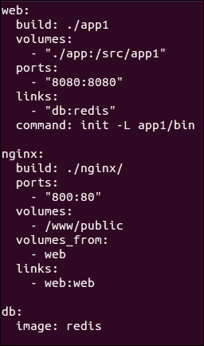

Docker Compose 可以在与 Docker Compose YAML 文件相同的目录下执行，以启动新的部署，应该执行以下命令：

```
docker-compose up

```

### Swarm 架构

Swarm 架构的工作原理是每个主机运行一个 Swarm 代理程序，并且有一个主机运行 Swarm 主节点。主节点负责协调运行在各个主机上的容器，这些主机的代理程序都属于同一个发现组（键值存储）。

Swarm 的一个重要原则是发现机制，这可以通过使用像 etcd、Consul 或 Zookeeper 这样的键值存储来实现。

要设置 Docker Swarm，可以使用已设置好的 Docker 机器来配置以下内容：

+   发现服务器（键值存储，如 etcd、Consul 或 Zookeeper）

+   安装了 Swarm 代理的 Swarm 主节点，指向一个键值存储

+   安装了 Swarm 代理的两个 Swarm 节点，指向一个键值存储

Docker Swarm 架构展示了一个主节点在两个 Docker 代理上调度容器，同时它们都在向键值存储广播，键值存储用于服务发现：

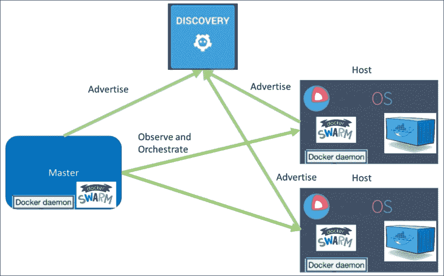

在设置 Swarm 代理时，以本例中的 Swarm 主节点为例，它们将通过以下选项启动：`--swarm-discovery`定义了发现服务的地址，而`--cluster-advertise`在网络上广播主机机器，`--cluster-store`则指向所选的键值存储：

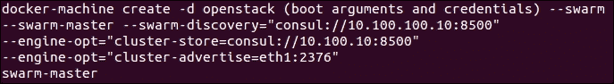

一旦架构设置完成，就需要创建一个覆盖网络来跨两个不同主机运行容器（在此示例中，覆盖网络被命名为`devops_for_networking_overlay`），可以通过以下命令执行：

```
docker network create –d overlay devops_for_networking_overlay

```

然后可以使用 Docker Swarm 主节点调度命令，在网络中根据镜像创建容器：

```
docker run -d –name loadbalancer –net devops_for_netwotking_overlay nginx

```

由于每个主机都运行在 Swarm 模式下，并且与键值存储相连，因此在创建时，网络信息元数据将由键值存储共享。这意味着所有使用相同键值存储的主机都可以看到这个网络。

然后，容器可以从任何一个 Swarm 主节点启动，加入相同的覆盖网络，将两个主机连接在一起。这将允许每个主机通过覆盖网络与其他容器进行通信，跨主机互联。

可以创建多个覆盖网络；不过容器只能在相同的覆盖网络中相互通信，不能跨不同的覆盖网络通信。为了解决这个问题，容器可以连接到多个不同的网络。

Docker Swarm 允许通过端口转发将多个特定容器分配并暴露，进行负载均衡。还可以进行滚动更新，以便升级容器中的应用版本。

由于其完全去中心化的设计，Docker Swarm 在可以解决的网络用例数量上非常灵活。

## Kubernetes

Kubernetes 是 Google 推出的一个流行的容器编排工具，创建于 2014 年，是一个开源工具。Kubernetes 并没有自己开发容器打包工具和打包仓库，而是可以无缝接入 Docker 注册表作为其容器镜像仓库。

Kubernetes 可以通过 **Dockerfile** 协调使用 Docker 创建的容器，或者使用 Packer 并配合如 Puppet、Chef、Ansible 和 Salt 等配置管理工具。

Kubernetes 可以看作是 Docker Swarm 的替代方案，但在架构设计上采取了略有不同的方法，并且拥有许多丰富的调度功能来帮助容器管理。

### Kubernetes 架构

在用户可以使用 Kubernetes 调度容器之前，需要先设置 Kubernetes 集群。市面上有许多配置管理工具，可以用来创建生产级别的 Kubernetes 集群，知名的解决方案有 Ansible、Chef 和 Puppet。

Kubernetes 集群由以下高层组件组成，每个组件又包含一组服务。从高层次看，一个 Kubernetes 集群由以下组件构成：

+   Kubectl

+   主节点

+   工作节点 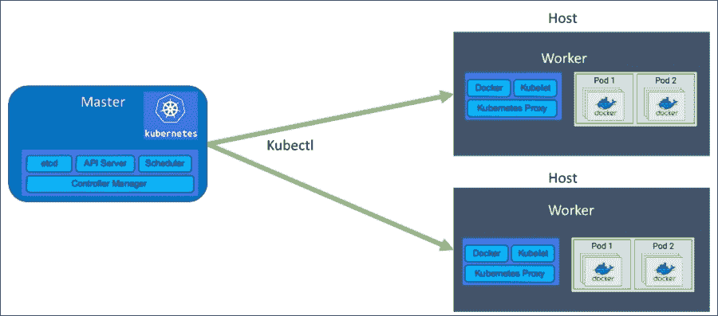

#### Kubernetes 主节点

主节点负责管理整个 Kubernetes 集群，用于协调工作节点，容器会在工作节点上进行调度。

部署后的主节点由以下高层组件组成：

+   API 服务器

+   Etcd 键值存储

+   调度器

+   控制器管理器

API 服务器提供了一个 RESTful API，允许管理员向 Kubernetes 发出命令。

如本章之前所述，Etcd 是一个键值存储，允许 Kubernetes 存储状态并在更改后将更改推送到集群的其余部分。Kubernetes 使用 Etcd 存储有关 Pod、服务、状态甚至命名空间的信息。

Kubernetes 调度器顾名思义，用于在服务或 Pod 上调度容器。调度器将检查 Kubernetes 集群的可用性，并根据资源的可用性做出调度决策，从而可以适当调度容器。

controller-manager 是一个守护进程，允许 Kubernetes 主节点运行不同类型的控制器。控制器用于分析集群的状态，并确保集群处于期望的状态，因此，如果某个 Pod 失败，它将被重新创建或重启。它遵循指定的阈值，并由 Kubernetes 管理员进行控制。

#### Kubernetes 工作节点

工作节点是 Pod 运行的地方；每个 Pod 都有一个 IP 地址并运行容器。Pod 决定容器的所有网络设置，并管理容器如何在不同的 Pod 之间进行通信。

工作节点将包含管理容器间网络通信所需的所有服务，与主节点进行通信，并用于分配资源给已调度的容器。

Docker 也在每个工作节点上运行，用于从 Docker 注册中心拉取容器并调度容器。

**Kubelet** 是工作服务，并安装在工作节点上。它与 Kubernetes 主节点上的 API 服务器进行通信，获取 Pod 的期望状态信息。Kubelet 还从 etcd 读取信息更新，并写入关于集群事件的更新。

`kube-proxy` 负责负载均衡和网络功能，如路由数据包。

#### Kubernetes kubectl

**Kubectl** 是 Kubernetes 的命令行工具，用于向主节点发出命令来管理 Kubernetes 集群。它还可以用来调用 YAML 或 JSON 文件，因为它与主节点上的 RESTful API 服务器进行通信。

Kubernetes 服务作为 Pod 之上的抽象层创建，可以通过标签选择器进行访问。

在以下示例中，kubectl 可以用来创建一个带有选择器 `app: nginx` 的 `loadbalancing_service` 服务部署，该选择器由 `loadbalancing_service.yml` 文件定义：

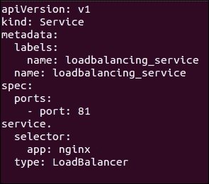

Kubectl 通过指定来执行 YAML 文件：

```
Kubectl create –f loadbalancing_service.yml

```

Kubectl 然后可以使用 `ReplicationController` 创建四个副本 Pod，这四个 Pod 将由服务进行管理，因为标签 `app: nginx` 与服务的选择器匹配，并使用 `nginx_pod.yml` 文件在每个 Pod 中启动一个 NGINX 容器：

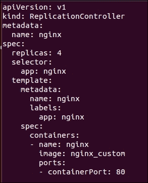

Kubectl 使用以下方式创建服务：

```
kubectl create –f nginx_pod.yml

```

#### Kubernetes SDN 集成

Kubernetes 支持多种网络技术，这些技术本身足以写一本完整的书。对于 Kubernetes，Pod 是网络的主要插入点。

Kubernetes 支持以下网络选项：

+   Google 计算引擎

+   Open vSwitch

+   二层 Linux 桥接

+   Project Calico

+   Romana

+   Contiv

Kubernetes 旨在提供一个可插拔的框架来控制 Pod 的网络配置，并希望为用户提供选择；如果需要一个平坦的二层网络，Kubernetes 可以满足这个需求；如果需要更复杂的三层覆盖网络，它也能应对。

Open vSwitch 广泛应用于企业 SDN 控制器，如 Nuage Networks VSP 平台，该平台在第二章中有所介绍，*软件定义网络的出现*，以及第六章，*使用 Ansible 编排 SDN 控制器*。这部分内容重点讨论了如何将流信息推送到每个虚拟化服务器上的 Open vSwitch，以创建有状态防火墙并管理 ACL 策略。

在集成 Kubernetes 时，执行类似的实现，Open vSwitch 部署到每个工作节点上，Pod 流量被转发到 Open vSwitch。

在 Nuage 的案例中，他们定制的 Open vSwitch 版本（称为 VRS）会部署到每个 Kubernetes 工作节点上，以管理由 VSD Nuage VSP 的策略引擎控制的策略。

Nuage SDN 与 Kubernetes 集成的工作流程如图所示，图中显示了企业 SDN 控制器如何与 Kubernetes 和 Docker 等编排引擎集成，以提供企业级网络：

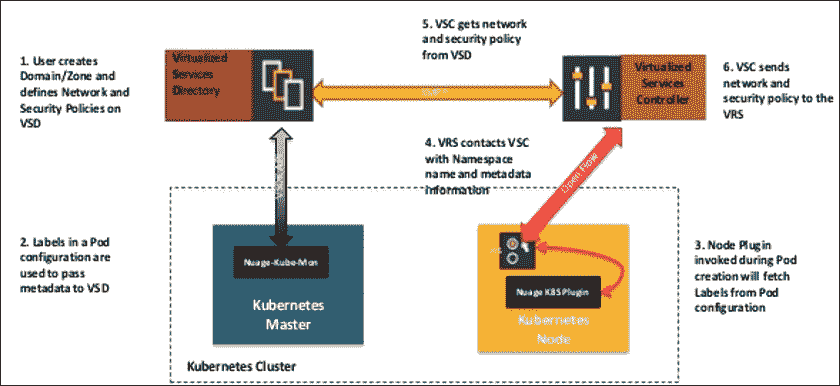

# 容器对网络的影响

容器无疑意味着大量网络功能已经转移到应用层，因此，容器实际上可以被视为其最真实形式的 PaaS 提供。

当然，仍然需要基础设施来运行容器，无论是在裸机服务器上还是虚拟机上。使用虚拟机来长期运行容器的优点是有争议的，因为这在某种程度上意味着双重虚拟化，任何使用嵌套虚拟化的人都知道，这并不总是对性能最优。因此，随着更多组织使用容器来部署它们的微服务架构，这无疑意味着用户对是否在虚拟机或物理机器上运行容器的选择将会有需求。

云计算通常意味着虚拟机，因此在虚拟机上运行容器可能是出于必要性而非选择的结果。能够在裸机服务器上协调容器，并在其上方使用覆盖网络，肯定更具吸引力，因为这样可以将容器更接近物理机器资源，而没有虚拟化开销。

这使得容器能够最大化物理机器资源，用户只需关注是否能跨多个云和数据中心运行服务，从而实现真正的灾难恢复。

随着混合云解决方案的发展，业界正超越了仅考虑机架冗余的思维模式。相反，业界正在向一种新的模式转变，这种模式将专注于将应用程序分布到多个云提供商之间。因此，能够使用 Docker Swarm 或 Kubernetes 等编排引擎以相同的方式编排网络和应用程序，将有助于实现这一目标。

这对网络运维人员意味着什么？这意味着角色正在演变，网络工程师的角色变为顾问，帮助开发人员以最佳方式设计网络，以支持其应用程序的运行。与其在私有云中将网络建设作为副项目，网络运维人员可以专注于为开发人员提供作为服务的覆盖网络，同时使基础网络架构快速且高效，从而能扩展以满足开发人员的需求。

# 总结

容器被认为是虚拟化市场的主要颠覆者。Gartner 已预测如下：

> *“到 2018 年，超过 50-60%的新工作负载将在应用程序生命周期的某一阶段部署到容器中。”*

这是基于 Gartner 对 IT 市场的分析，因此这是一个大胆的声明，但如果成真，它将证明是应用程序部署方式的巨大文化转变，正如虚拟化曾经带来的变化一样。

在本章中，我们展示了容器如何帮助组织部署微服务架构，并分析了容器带来的内部机制和好处。主要的好处包括可移植性、部署速度、弹性扩展、隔离和不同资源的最大化、性能控制、有限的攻击面以及对多种网络类型的支持。

除了容器带来的好处，本章还介绍了 Docker 工具，并说明了 Docker 工作流如何融入持续交付模型，而这一模型正是大多数 DevOps 项目的核心。

本章的重点随后转向了 Docker 网络和可用于网络化容器的第二层网络选项。我们展示了如何使用覆盖网络将多个主机连接起来，形成一个集群，并展示了容器技术如何通过 Open vSwitch 与 Nuage VSP 平台等 SDN 控制器进行集成。

本章还介绍了容器编排解决方案，如 Docker Swarm 和 Kubernetes，它们独特的架构，以及如何将它们用于在多个主机上网络化容器，并作为平台即服务（PaaS）层。

容器化的重要性及其对平台即服务（PaaS）解决方案的影响不容小觑，Forrester 曾表示：

> *“容器即服务（CaaS）正在成为新的平台即服务（PaaS）。随着开发人员对容器和微服务的兴趣激增，云服务提供商正在通过托管的容器管理服务抓住这一机遇。”*

总结来说，可以公正地得出结论，容器化可以带来许多好处，并帮助开发人员实现持续交付工作流和 PaaS 解决方案。容器化还提供了跨多个云提供商（无论是私有云还是公有云）部署工作负载的额外灵活性，使用像 Kubernetes、Apache Mesos 或 Docker Swarm 这样的通用编排层。

在接下来的章节中，重点将从容器转向在使用软件定义的覆盖网络和持续交付模型时确保网络安全。它将探讨一些技术，这些技术可以帮助在 API 驱动的环境中保障现代私有云的安全，以便在不妥协安全要求的情况下实现软件定义网络解决方案。
