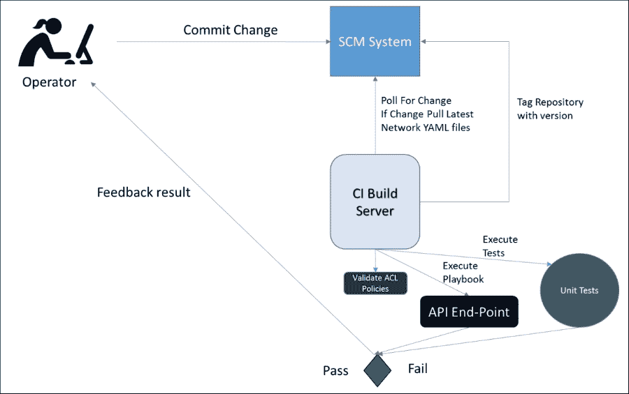

# 第十一章：网络安全

随着许多企业转向软件定义网络并使用 API 进行网络变更，确保网络安全的重要性成为一个突出问题。安全实施也需要发展，因为网络被虚拟化，并且现代协议用于构建 Leaf-Spine 架构以扩展多租户云环境。

本章将涵盖以下主题：

+   网络安全的发展与破解误区

+   保护软件定义网络

+   网络安全与持续交付

# 网络安全的发展与破解误区

随着网络工程师逐渐适应第一章中讨论的平面二层网络和生成树协议，*云对网络的影响*，网络安全及确保企业网络的方式在多年的发展中变得非常成熟，且已被安全团队充分理解。

大多数安全工程师对处理物理网络时应该实施的最佳实践都很熟悉。安全团队通常会实施一套严格的安全最佳实践，网络团队必须遵守这些实践，才能通过必要的认证。但是，这些最佳实践在实施软件定义网络时的适用性如何？

可以公平地说，目前仍然存在有关软件定义网络的知识差距，安全工程师甚至一些网络工程师对未知充满恐惧和不确定性。

本章希望能够帮助解开一些相关疑虑。作者是一个帮助运营软件定义网络的人员，这些内容并非理论或期望，而是基于坚实的事实。

所以，首先让我们回顾一下安全团队对网络安全的一些要求，并看看在处理软件定义网络时这些要求应如何调整。

## 帐户管理

在帐户管理方面，安全团队通常会要求在设置用户访问时遵循以下最佳实践：

+   访问生产服务器时应使用双因素认证

+   用户帐户应遵循最小权限原则，确保用户只拥有必要的权限

+   测试环境与生产环境之间应使用独立的用户帐户

+   **DenyAll** 应该是访问控制列表的默认设置

+   使用**终端访问控制器访问控制系统**（**TACACS**）或同等的认证方式来访问网络设备

在审查帐户管理时，安全从业者列出的所有要点仍然有效。任何**软件定义网络**（**SDN**）控制器或现代交换机厂商在评估时应该满足帐户管理要求。如果它们未满足这些要求，便不应在生产环境中实施。

当使用软件定义网络，并始终与持续交付模型保持一致时，服务账户将被自动化编排和配置管理工具（如**Ansible**）用来设置子网、网络和**ACL**策略，以执行任何网络更改。

提交到源代码管理系统的用户将不可避免地成为触发网络更改的人员，尽管这些更改是通过服务账户执行的。这个过程本身就是一种文化上的转变，因此应审查源代码管理库上的权限，以设置**Active Directory 域服务**（**ADDS**）或**轻量级目录访问协议**（**LDAP**）的访问权限，这样就可以追踪提交记录，并追溯到进行更改的用户。持续交付工具如**Jenkins**、**ThoughtWorks**、**Go**或其他许多持续集成构建服务器，可以满足这个需求。

可以使用单独的服务账户来编排测试和生产环境，以满足安全最佳实践。持续交付模型中的所有其他用户账户应为只读权限，用户可以查看由自动化驱动的持续交付部署的结果，除非是破玻账户，在紧急状态下可用。

安全团队必须理解，如果用户在不可变的软定义网络中进行手动干预，那么整体的持续交付模型可能会被破坏，因此没有进行手动配置的空间。所有的期望状态应通过源代码管理系统进行控制，并相应地推送到系统中。这再次是一个思维方式的转变，安全从业人员通常难以相信这一点，因为他们多年来一直看到网络工程师通过手动变更设备来做出任何修改，但这是一种新的方法，对于某些人来说是一个巨大的变化。

这一点在第九章《使用持续交付流水线部署网络变更》中得到了说明，文中提到，利用像 Ansible 这样的配置管理工具，将网络变更推送到测试和生产环境时：


这一概念最初对于安全从业人员来说难以理解，但**DevSecOps**运动正在帮助安全从业人员看到自动化持续交付过程带来的机会窗口。

自动化应意味着用户拥有更少的个人权限，并且批准的工作流操作是经过强化和签署的，控制允许进行何种交互。所有这些都通过持续交付流水线进行控制。

## 网络设备配置

关于网络设备配置的安全最佳实践，关注的是保持网络的最新可审计清单，定期对每个网络设备的操作系统层进行安全补丁更新，并使用来自相关信任存储的安全协议和**公钥基础设施**（**PKI**）证书。

因此，安全团队在配置网络设备时，常见的一组要求可能包括：

+   网络硬件清单应在**IP 地址管理**（**IPAM**）解决方案中可用

+   所有网络设备应定期进行补丁更新

+   配置 SNMP 版本 3 或以上

+   禁用未使用的端口

+   使用**传输层安全协议**（**TLS**）加密网络流量

网络设备配置的安全方法在设置上也不应改变，因为 SDN 控制器和现代交换机厂商应采用 TLS，定期打补丁，并通过 DNS 进行访问。

在使用 Leaf-Spine 架构和覆盖网络时，底层网络仍由物理网络设备构成，因此与这些设备相关的配置和安全最佳实践仍然完全有效且不可或缺。

SDN 控制器，如同网络交换机，部署在第二层底层网络上，因此应遵循与网络交换机相同的惯例，采用安全协议，并遵守补丁更新计划。

## 防火墙

安全团队在业内审视软件定义网络时的一个主要困惑源似乎与防火墙相关，部分人存在一些恐惧和不确定性，因为他们习惯在生产网络中使用物理**有状态**防火墙。

然而，只要虚拟防火墙满足安全要求，实现 SDN 控制器并允许它们通过虚拟化的微分段策略控制防火墙和网络分段应该没有问题。

安全团队通常会要求防火墙满足以下要求：

+   使用有状态防火墙

+   在 ACL 规则上使用显式许可和隐式拒绝

+   具备审核团队 ACL 访问权限的能力

+   记录防火墙上所有被拒绝的访问尝试

实施软件定义网络时应始终遵循防火墙最佳实践；然而，传统上，安全团队一直推动使用有状态的物理防火墙来分隔三层模型，三层分别为前端、业务逻辑和后端。

随着向微服务的迁移和软件定义网络（SDN）的采用，应用程序通常不适应这种结构，而**Open vSwitch**允许使用 OpenFlow 在虚拟化管理程序级别或操作系统主机级别实施**入口**和**出口**策略。

我们还看到，这一相同的过程可以应用于第十一章，*容器对网络的影响*，并且 Open vSwitch 可以安装在容器主机上，如 Core OS，甚至在裸金属服务器上，以控制防火墙策略。

只要遵循使用显式允许和隐式拒绝的最佳实践原则，并为防火墙上的所有拒绝尝试设置日志记录过程，那么就没有理由反对使用虚拟化防火墙的优点。

Open vSwitch 现在提供有状态防火墙功能，安全性与 Linux 操作系统上的 iptables 或物理防火墙相同，因此现在没有理由不将防火墙虚拟化用于企业网络。这与最初关于使用虚拟机管理程序进行基础设施服务的讨论相似，但它在可扩展性、可编程性、可审计性和可管理性方面为企业带来的好处，使得难以反对防火墙虚拟化。

## 漏洞检测

就漏洞和攻击的检测而言，叠加网络的安全要求也不应发生变化，尽管获取数据的方法可能需要稍微改变，因为像**边界网关协议**（**BGP**）和**虚拟可扩展局域网**（**VXLAN**）这样的协议需要不同的工具来跟踪网络中的数据包。

在进行漏洞检测和数据采样时，以下活动应定期安排：

+   定期漏洞扫描

+   深度数据包检查

在漏洞扫描方面，应当频繁地对网络及网络设备进行扫描。理想情况下，安全扫描器本身应在软件定义网络中具有独立的职责。安全扫描器应当能够访问基础网络进行全面扫描，另一个扫描器配置文件应当用于叠加网络。如果扫描器能够访问基础网络和叠加网络，它就会成为攻击向量，一旦被攻破，攻击者便能完全访问网络。因此，这是一个常常被忽视的重要问题；如果可能的话，叠加网络和基础网络设备及计算资源不应互相可路由。

安全团队通常要求能够通过深度数据包检查来检查网络数据包，以确保没有恶意活动。这在平面二层网络中已通过检查在 VLAN 之间传输的数据包来完成。

然而，随着叠加网络通过 VXLAN 封装传输数据包，网络能够扩展并缓解 4096 VLAN 限制。这意味着网络和安全团队将需要能够解封装 VXLAN 数据包的工具，以便像检查 VLAN 数据包一样检查数据包，否则安全工具将看到数据正在传输，但无法读取它。

设置能够进行 VXLAN 去封装的工具并非不可逾越的挑战。已有可用工具来完成这项任务，只需网络和安全团队调整他们当前使用的工具。

## 网络分段

实施软件定义覆盖网络时的最大变化之一是从平面二层网络原则和网络间的 VLAN 隔离转变过来。

安全团队习惯于处理物理网络，因此他们通常会规定需要满足以下要求：

+   使用 VLAN 来隔离流量类型（前端、业务逻辑和后端）

+   能够隔离**测试**和**生产**环境

+   在不同的网络层之间使用防火墙

然而，SDN 控制器在网络交换机上的硬件**虚拟隧道端点**（**VTEP**）之间创建 VXLAN 隧道，并将其扩展到每个硬件计算节点，以便在网络上构建虚拟化的覆盖基础网络。

SDN 控制器用于翻译来自交换机厂商的**Open vSwitch 数据库**（**OVSDB**）信息，并将流量数据推送到每个计算节点（虚拟化管理程序、容器或裸机服务器），这些都由 SDN 控制器的策略引擎决定，以创建防火墙和微分段。

这是一种不同的方法；每个微服务应用的防火墙由**OpenFlow**控制，并用于管理入口和出口策略。通过使用覆盖网络，应用可以与其他应用的微分段区域进行通信，如第二章中所示的**Nuage Networks** **虚拟服务平台**（**VSP**）所示，*软件定义网络的出现*。

在以下示例中，我们可以看到**应用 1**的微子网通过子网与区域进行通信，和**应用 2**进行通信：


使用按应用划分的防火墙规则进行微分段，避免了使用物理有状态防火墙对所有应用进行区域分段。相反，每个应用都会创建单独的防火墙来管理网络之间的分段，三层域会在更高层次上将**测试**和**生产**环境相互隔离。

在这种微分段模型中，每个应用都有自己的策略，这意味着安全团队能够审计防火墙策略，并了解每个应用与哪些应用进行通信。

因此，覆盖网络应该带来安全上的提升，因为它清晰地展示了应用的连接要求，并且连接拓扑不再丢失在一组庞大的物理有状态防火墙的访问控制列表（ACL）规则中，这些规则并未明确映射到每个应用上。

软件定义网络意味着每个应用初始时拒绝所有连接，仅开放最小的显式访问权限，以便它们能够访问网络中的其他应用或服务。

这比在有状态防火墙上开放端口范围要安全得多，因此，理论上，叠加网络在正确实施时应能提高复杂网络的安全性。如果使用了如第六章中所强调的不可变网络（如 A/B 子网），*使用 Ansible 编排 SDN 控制器*，那么旧的 ACL 规则也会默认自动清理，这一直是网络和安全团队面临的挑战，因为他们担心删除旧的策略会导致特定应用程序出现故障。

安全团队可以与开发团队一起审核这些策略，并提供任何需要更改的建议，确保开发团队实施的所有 ACL 策略都是部署应用程序所必需的，并且使用的显式入口和出口 ACL 规则的数量是最小的。

# 保护软件定义网络

到目前为止，本章重点介绍了一组最小的网络安全要求，以确保软件定义网络的安全性。

但为了最大化软件定义网络的安全性，我们应该关注叠加层和基础层网络如何可能被攻击者以新方式利用，并探讨可以采取的不同机制，以防止这种情况的发生。

软件定义网络被分为叠加层（包含所有虚拟化网络，承载虚拟机、物理机和容器）和基础层（包含所有裸机设备，如虚拟化管理程序、网络设备和 SDN 控制器）。

## 在叠加层的攻击

**叠加层**网络的创建旨在通过 API 以编程方式自动化网络，并通过简化软件中的网络结构来加快变化速度。

在持续交付的范围内，开发人员可以设置自服务的 ACL 规则来管理南北向和东西向的 ACL 策略。

重要的是要有隐式控制，确保常见工作流操作只允许团队从其微子网设置 ACL 规则到网络中的其他位置，而且他们不能妥协叠加层中任何其他网络的完整性，除了他们自己的网络。因此，应通过测试自服务自动化来向安全团队证明这一点。

微分段在以下示例中非常强大：

使用隐式允许时，团队 A 中的应用程序 1 只能与团队 B 维护的应用程序 2 通信，如果团队 B 允许显式入口规则来允许应用程序 1 与之通信。因此，团队之间需要协调，他们的应用程序只有在每个微服务应用程序的防火墙上都有出口和入口规则时，才能相互通信。

除此之外，一些应用可能需要向北的互联网访问，因此网络团队需要建立一个代理机制来访问互联网，而不是直接给团队提供访问权限。网络团队应实施受控的代理机制，以便有一个固定的机制来管理向北的互联网访问。

攻击者可能会试图攻破覆盖网络中的虚拟机或物理服务器。一旦他们获得对机器的访问权限，可能会尝试下载软件并破坏网络。攻击者还可能尝试进行**拒绝服务攻击**（**DoS**），以破坏特定的微子网，这可能会通过攻破微子网中的所有虚拟机来破坏关键服务。

微分段相对于二层网络的一个好处是，如果生产环境中的一台主机被攻破，攻击者可以访问整个前端、业务逻辑或后端区域，而在微分段的情况下，他们会被限制在特定的应用程序中。

关于外向互联网访问和设置代理，至关重要的是用于下载软件包到主机的上游仓库应该通过受控的代理服务器进行，使用基于**角色的访问控制**（**RBAC**），通过 Active Directory 域服务或 LDAP，如 **Artifactory** 或 **Nexus**。

这意味着覆盖网络中的服务器只能访问一组经过基础设施团队批准的第三方软件仓库。未经批准的仓库无法通过覆盖网络服务器访问，因为它们不通过软件仓库代理，从而防止将可疑的软件包安装到覆盖网络中的服务器上。

通过软件仓库代理意味着网络和安全团队可以采取措施，防止下载数据包嗅探软件到服务器上，从而发现相邻服务或由入口和出口流量数据决定的开放端口。

还可能需要禁用**互联网控制消息协议**（**ICMP**），以防攻击者通过路由追踪找到微子网中相邻服务器的 IP 地址或底层网络设备（如机架顶端交换机和 SDN 控制器）的地址。

如果覆盖网络中的服务器记录丢包，那么应该设置适当的警报，通知网络或安全团队，某些非法活动正在微子网内发生。

在这种情况下，可以通过标记被攻击的主机并使用像 Ansible 动态库存等工具来将它们整体定位，发出关闭命令或通过实时迁移将它们移至隔离网络，从而阻止潜在的网络攻击者访问网络中的其他服务器。

## 对底层网络的攻击？

**下层**网络可能成为潜在攻击者的目标，攻击者通过访问虚拟化管理程序并寻求妥协 Open vSwitch 来实现这一目标。这将使他们能够直接在 Open vSwitch 的流表中实例化新流，从而访问网络中的多个不同位置。

攻击者可能会嗅探流量，并对不同的网络组件执行 **中间人攻击**（**MitM**），因此虚拟化管理程序理想情况下应位于一个独立的网络上，以隔离计算服务器的访问，并且不允许从覆盖网络直接路由。

在下层网络中，交换机现在利用集中管理系统将更新推送到交换机。例如，**Arista CloudVision** 平台的 **CloudVision eXchange**（**CVX**）服务器用于将配置推送到所有 Arista 交换机，因此必须通过 HTTPS 来控制对其 API 端点的访问，并且交换机的管理应在完全独立的网络上进行。

如果 CVX 集群被妥协，攻击者可能会丢失每台交换机的整个配置，从而在网络上发起 DoS 攻击，这也意味着 SDN 控制器将丢弃所有路由。

应该理想地实现 **带外**（**OoB**）网络来管理对网络设备的访问，访问应通过 TACCs 账户提供。使用带外网络进行北向和南向通信可以帮助保护网络设备，并为网络设备提供额外的安全性。

下层和覆盖网络应位于完全不同的网络上，并且不可路由；这意味着如果下层网络中的虚拟化管理程序被妥协，攻击者将无法直接从下层网络跳转到覆盖网络。下层设备理想情况下应通过堡垒服务器和双因素认证进行保护，以确保没有服务器是直接可访问的。

SDN 控制器通常是 x86 计算机，并通过 REST API 调用进行通信，因此必须在 SDN 控制器上实现 TLS，如果可能的话，还应颁发 PKI CA 来管理信任、真实性和访问撤销。

在以下示例中，我们可以看到 **Arista CVX** 平台使用 **TLS** 与下层网络中的 Nuage **VSC** SDN 控制器通过 **OVSDB** 进行通信：


如果下层设备通过 HTTP 会话进行通信，则会使网络不仅容易受到下层网络的攻击，还容易受到覆盖网络的攻击。

以 **OpenStack** 平台为例，SDN 控制器与 OpenStack Neutron 插件通信时，将交换整个覆盖网络的所有入口和出口信息。如果此连接使用未加密的 REST API 调用，这意味着攻击者可以拦截或跟踪所有流量信息，并可能用此信息妥协覆盖网络中的任何租户网络。

## SDN 控制器的攻击

SDN 控制器上的北向 API 是一个理想的攻击向量，攻击者可以利用它来破坏整个覆盖网络。

为了防止这种情况，应实施 RBAC 并遵守足够的密码最佳实践。如果 SDN 控制器的北向 API 被攻破，攻击者可能会通过编程方式对覆盖网络创建新的流量数据。

这将使攻击者能够横向穿越网络并瞄准多个服务，从而绕过拒绝的防火墙策略并访问多个租户网络。

默认管理员账户应从第一天起更改其密码，以避免攻击者猜测默认账户的密码。始终应使用复杂密码。

应在 SDN 控制器上设置审计跟踪，并将日志记录到**syslog**服务器，这将允许网络和安全工程师检查攻击者是否进行了未经授权的更改。如果出现任何不正常的行为，应立即触发后续警报，并禁用该账户。

在 SDN 控制器上，应启用 SNMPv3 而不是早期版本，并设置 LDAP 账户或 SSH 密钥，以允许访问基于 Linux 的操作系统，而不是使用单一服务账户或 root 权限进行底层变更。

# 网络安全与持续交付

在使用自动化将网络更改推送到网络设备，或更改覆盖网络的期望状态时，应提升网络安全性。它应增加更改的可视性，因为所有更改都是通过集中式过程完成的，没有任何例外。

持续交付过程在设计上应允许安全团队清楚地看到哪个用户提交了网络变更。当通过持续交付过程将更改推送到网络设备或 SDN 控制器时，如果安全团队不批准这些更改，它将允许轻松回滚到先前的版本。然而，这仍然是非常被动的，持续集成和交付过程应将合规性和安全检查作为持续集成和交付过程的一部分。

将合规性检查作为持续交付的一部分，为网络和安全团队提供了很大的灵活性。这将使安全团队能够利用一些持续集成和交付的最佳实践来帮助保护网络，例如在部署管道的一部分中持续测试和验证集成的更改。

## 应用程序连接拓扑

在软件定义网络中，每个应用程序都是微分段的，因此它们具有可以由安全或网络团队审计的单独应用程序策略。这有助于安全合规性，因为它允许安全人员查看覆盖网络中特定应用程序的所有 Ingress 或 Egress 规则。

这一点在第二章，*软件定义网络的出现*中有详细阐述，展示了按应用程序细分的微分段策略，并为**应用程序 1**定义了 Egress 策略，如下所示：


应用程序的 Ingress 和 Egress ACL 规则应该可读并且可审计，可以使用 YAML 文件，或任何其他选定的配置文件来控制 SDN 控制器的期望状态，这些配置文件应存储在源代码管理系统中。

系统的实时状态也会出现在 SDN 控制器的图形用户界面（GUI）中，可以观察其是否与源代码管理系统中定义的内容一致。

安全从业人员必须能够读取和理解用于确定当前连接性和网络状态的配置文件。

网络和安全团队有着独特的目标，例如通过安全审计以保持业务的正常运转。安全团队能够查看应用程序连接矩阵并对连接进行全面可视化是非常重要的。

例如，在处理信用卡交易时，只有特定用户应该可以访问特定的租户网络。通过 SDN 强制执行这一点，并且通过易于理解的 SDN 策略证明这一点，可以使网络和安全团队的工作变得更容易，因为他们可以为每个应用程序提供实时的连接矩阵。

## 将安全检查纳入持续集成

安全检查理想情况下应内置于持续集成流程中，这一概念在第七章，*使用持续集成构建进行网络配置*中有深入探讨。否则，安全团队将无法跟上动态叠加网络和不断变化的网络策略所带来的日常变化。

合规性可以通过在开发人员为应用程序的自服务 ACL 文件应用的策略中禁止允许所有策略来与持续集成流程集成。

当用户将更改提交到源代码管理系统时，**CI 构建服务器**会启动一个新的持续集成构建。安全团队可以在持续集成构建过程中设置对 SDN 配置构建的验证，拒绝该配置并向用户提供即时反馈，因为这违反了合规性。

用户则需要将自服务 ACL 策略规则更改为隐式的，这样合规性就成了持续集成过程中的另一个验证，如下所示：



这与安全团队将 ACL 规则作为单独的手动检查进行审计相对立，后者当然会让违反安全策略的 ACL 规则漏网，使其进入生产环境，从而允许攻击者有可能利用应用程序的 ACL 规则过于宽松而进行攻击。这项验证甚至可以在**CI 构建服务器**之前进行，通过运行一个简单的 Git 钩子来完成，检测到 ACL 策略中的“允许所有”后拒绝提交。

## 使用云元数据

云元数据在 AWS、Microsoft Azure、Google Cloud 和 OpenStack 等公共和私有云中，以及其他云服务提供商中都是常见的使用方式。

使用特定元数据标记服务器有多种不同的用例，其中一部分用例在网络或安全团队应对特定网络安全挑战时可能会大有裨益。

正如本书中已涵盖的，云元数据是一系列应用于云服务器的键值对。如果我们以 2014 年导致一系列 DoS 攻击的安全漏洞 Shell Shock 为例，立即修复这些安全漏洞是非常重要的，以防止攻击者利用 Linux 服务器。

在持续交付的范围内，确保出现问题时，恢复的平均时间要尽可能短是非常重要的。

以漏洞扫描为例，每周，整个覆盖和底层网络都会使用安全扫描器进行日常扫描，最坏情况下为每周扫描一次。

每次每周的网络安全扫描运行在所有服务器上时，它会生成一份报告，记录每台服务器的漏洞列表。随后，服务所有者会对报告进行审查，安全团队将在数天内推荐特定的补丁或修复措施，因此如果重要漏洞被突出显示，解决问题的平均时间会较长。

如果网络安全扫描不是生成单独的报告，而是将特定的漏洞 ID 列表标记到服务器的云元数据中，那么整个网络的漏洞完整清单将可用，并可以据此进行实时更新。

以 OpenStack 为例，以下命令行可以在检测到漏洞时使用 `qualys_vul_ids` 键值对为服务器设置元数据：

```
nova meta-data (instance-uuid) set qualys_vul_ids (qualys_id_list)

```

以下示例将作为一个脚本的一部分执行，该脚本将在所有服务器上运行：

```
nova meta-data 061e8820-3abf-4151-83c8-13408923eb16 set qualys_vul_ids 23,122

```

这个键值对随后会传递给 OpenStack 元数据服务，后者会将所有在**Qualys**漏洞扫描过程中发现的相关漏洞标记到 OpenStack 实例上。

这将导致 OpenStack 实例包含以下元数据：


如果安全扫描暴露了诸如 shell shock 之类的漏洞，那么网络和安全团队可以识别出所有存在该漏洞的服务器。在这种情况下，`Qualys ID` `122`与 shell shock 相关，并立即对受影响的服务器进行补丁修复。

可以使用 Ansible 动态清单通过一个定制的`ad_hoc_patch.yml`剧本，仅在满足条件时执行该剧本，来定位易受攻击的服务器。如果服务器上的`qualys_vul_ids`元数据标签上标记了`Qualys ID` `122`，则执行补丁命令修复 Linux 服务器。

`ad_hoc_patch.yml`剧本将具有以下步骤：从元数据中设置事实，并仅在元数据标签包含正确的元数据时执行命令：


此剧本可以通过执行以下命令立即修复 shell shock **Bashdoor**漏洞：

```
ansible-playbook –i inventories/openstack.py –l Prod playbooks/ad_hoc_patch.yml

```

该剧本将对`Prod`可用区内所有面向客户的服务器执行补丁修复，针对存在漏洞的服务器，因此仅针对生产服务器。

该剧本仅对生产可用区中符合`122`元数据值的服务器执行，作为活动漏洞，使用`Ansible jinja2`中的过滤器，这将使基础设施工程师能够在几分钟内修复该漏洞。试想一下，如果安全扫描器将这种元数据标记作为其扫描器的一个功能，它将对安全性产生巨大帮助。

云元数据还有许多其他用例，例如在服务器上使用所有者元数据标签，如果安全团队检测到任何可疑活动，则发送有针对性的电子邮件或警报，或者在使用不可变基础设施时标记服务器进行重新部署以安装新补丁。

被攻破的服务器也可以通过安全监控工具使用元数据标记为**隔离**。简单来说，元数据允许团队通过元数据设置服务器配置文件，因此可以对其执行各种操作。

如果服务器被标记为隔离状态，可以设置触发器将服务器关闭，并将其迁移到 Overlay 网络中没有外部访问权限的隔离微网段。这将允许安全团队进行根本原因分析，查明服务器被攻破的原因并缓解攻击。

### 注意

需要注意的重要一点是，所有这些安全过程都可以自动化，以帮助最大化公共云和私有云提供的功能。它们应被视为可以帮助自动化和促进安全过程的工具，而不是妨碍安全的工具。

# 摘要

在本章中，我们探讨了网络安全以及安全实践如何发展以满足现代软件定义网络的需求，因为行业已经开始逐步远离扁平的二层网络，而是利用虚拟化的 Overlay 网络。

本章还希望揭示一些与保护软件定义网络相关的恐惧和不确定性，同时解决了如测试和生产环境的分离以及使用虚拟防火墙进行微分段的热门话题，而不是物理防火墙。

本章重点转向可以在最低安全要求之上采用的战略，并探讨了如何保护 SDN 控制器并最小化攻击向量的方法。这可以通过隔离网络、为网络设备创建带外网络、适当的身份验证以及使用 TLS 进行网络设备间通信来实现。

本章还探讨了实施软件定义网络带来的收益，例如应用间连接的透明性和可审计性。它还探讨了利用持续集成最佳实践来验证 ACL 策略作为持续集成构建的一部分，而不是完全分开的过程。它还探讨了利用云元数据执行紧急修补以减少手动开销的机会，并涵盖了其他使用云元数据的用例，如隔离服务器和向团队发送安全通知。

本章结束了本书的内容，探讨了如何将 DevOps 和持续交付原则应用于网络。本书希望向读者展示，网络不需要成为拖慢整个持续交付过程的一系列手动任务。

本书涵盖了多种主题，希望能提供一些思考的食物和可以采纳并实施以改善网络运营的想法。尽管网络自动化在行业中仍然相对稀少，但它并非必须如此；开发、基础设施和测试中应用的相同自动化原则同样适用于网络运营。

网络团队不应满足或接受现状，而是要大胆地发起真正的文化变革，并通过拥抱变革和学习新技能来帮助改进行业中的网络运营。

更多信息:

+   博客: [`devarmstrongops.blogspot.co.uk/`](http://devarmstrongops.blogspot.co.uk/)

+   领英: [`uk.linkedin.com/in/steven-armstrong-918629b1`](https://uk.linkedin.com/in/steven-armstrong-918629b1)

+   什么是软件定义网络: [`www.youtube.com/watch?v=lPL_oQT9tmc`](https://www.youtube.com/watch?v=lPL_oQT9tmc)

+   SDN 基础知识: [`www.youtube.com/watch?v=Np4p1CDIuzc`](https://www.youtube.com/watch?v=Np4p1CDIuzc)

+   SDN 和 OpenFlow: [`www.youtube.com/watch?v=l-DcbQhFAQs`](https://www.youtube.com/watch?v=l-DcbQhFAQs)
