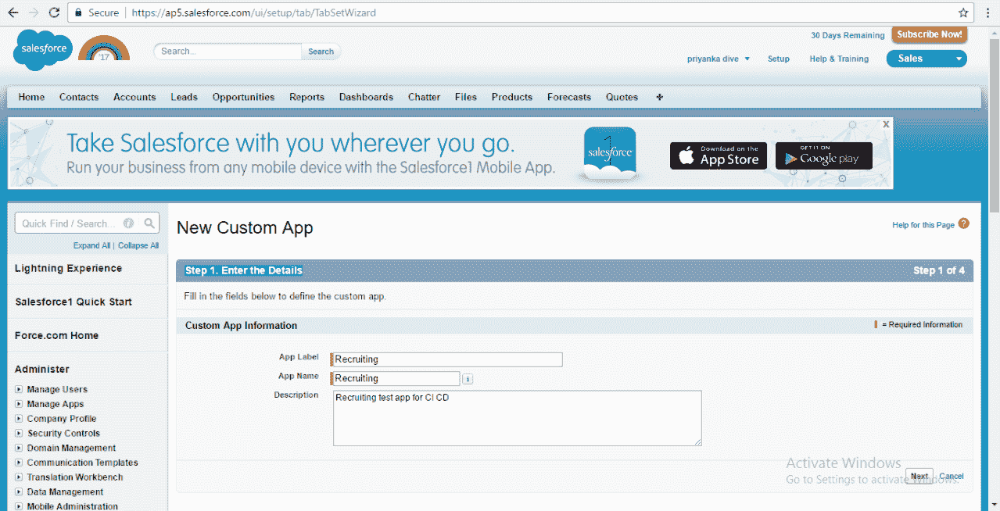
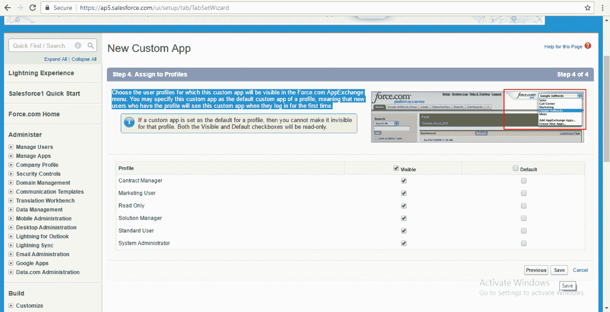
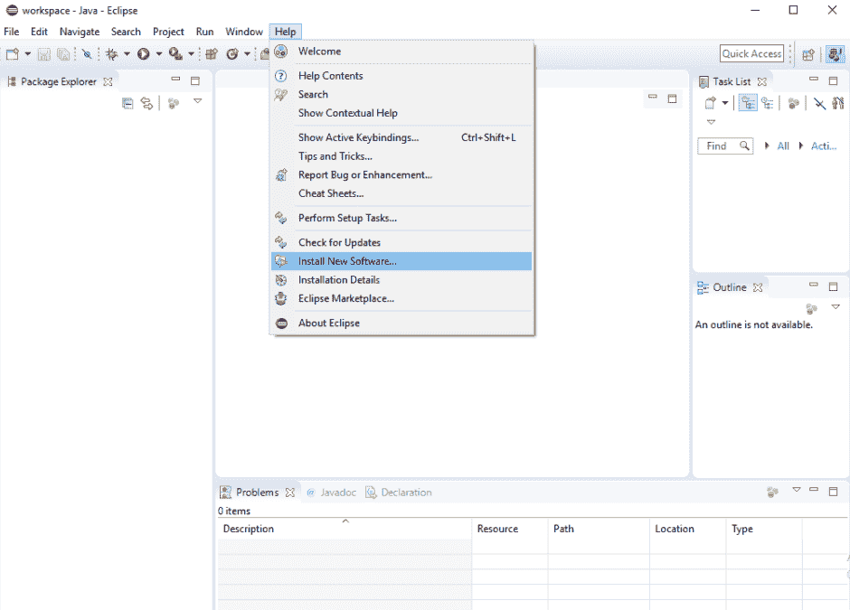
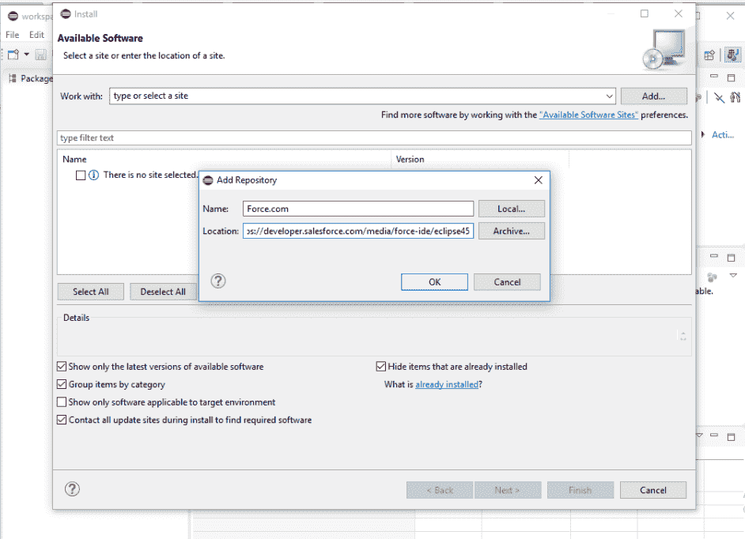
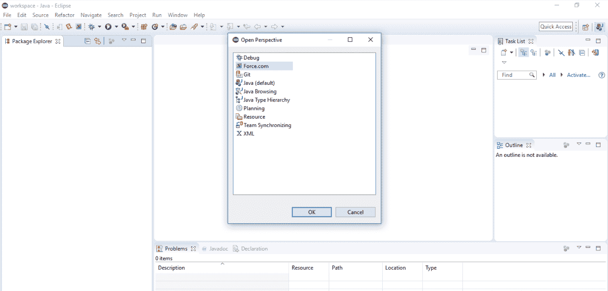
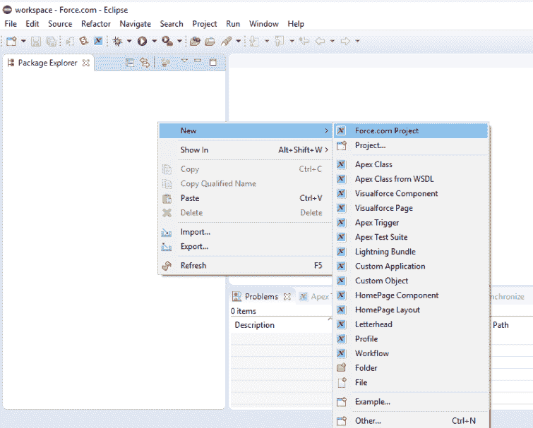
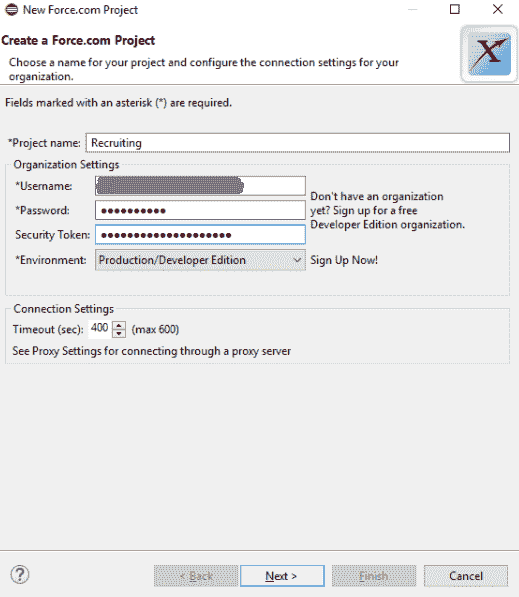

# Salesforce 开发和交付过程

在我们深入探讨 Salesforce 的 DevOps 过程或如何将 DevOps 应用于 Salesforce 应用程序之前，我们首先看一下典型的或传统的 Salesforce 开发是如何在组织中进行的。

在本章中，我们将了解 Salesforce 应用程序的传统开发过程。我们将概述一些 Salesforce 的概念，例如沙箱，包括不同类型的沙箱及其区别。我们将看到我们的示例应用程序——Recruiting 应用的开发过程，并解释 Salesforce 概念。我们还将讨论在 Salesforce 应用程序的开发、部署和交付过程中遇到的技术挑战。我们将讨论没有 DevOps 的 Salesforce 开发者的工作生活及 DevOps 的必要性。

在本章中，我们将学习以下主题：

+   典型的 Salesforce 开发过程（没有 DevOps）

+   沙箱

+   Salesforce 开发的 Eclipse 使用

+   商业和技术挑战

+   DevOps 的必要性

# 典型的 Salesforce 开发过程（没有 DevOps）

Salesforce 开发不同于其他堆栈开发平台。你所需的一切开发工具都可以通过云端获得，无需安装任何软件。基于沙箱的开发的主要缺点是沙箱不提供代码版本控制。因此，如果有人覆盖了你的代码，你将无法获取代码的先前版本。这会导致在多个开发人员共同参与的大型项目中出现严重的混乱。

我们将通过创建自己的 Salesforce 开发者版账户开始开发，且此账户免费。注册 Salesforce 免费账户并进行测试。以下是一些新 Salesforce 用户创建自己 Salesforce 应用程序的指南，使用 [`developer.salesforce.com/signup`](https://developer.salesforce.com/signup)：

1.  登录到你的 Salesforce 账户并提供用户名和密码。

1.  转到屏幕右上角的设置。然后在快速查找框中搜索“应用”，再选择“应用”。你将看到应用的欢迎页面。在欢迎页面上，你将看到一些已为你的组织启用的应用。

1.  我们想创建一个新的应用程序。点击“新建”按钮。由于你是新用户，选择“自定义应用”。输入`Recruiting`作为应用程序标签名。一个应用程序是一个由多个标签组成的集合，用于创建功能。用户可以在不同应用程序之间切换：

1.  在下一个屏幕上，你可以选择将用作应用程序徽标的图像。测试时，你可以使用默认图像或上传自己选择的图像。你可以稍后更改它。

1.  下一个屏幕让您指定在应用程序中想要查看的标签。已经有一些标准和自定义标签供您选择，或者您可以创建自己的自定义标签。对于示例应用程序，您可以接受默认设置并转到下一页。主页标签将作为默认标签显示。

1.  在下一个屏幕上，您需要选择哪些用户配置文件将能够访问该应用程序：

1.  使其对标准用户和系统管理员配置文件可见。

1.  保存并完成。

# 传统部署

部署代码到沙盒或生产环境进行测试有两种方式：

+   **变更集**：变更集用于将变更从开发沙盒迁移到生产环境。变更集不包含数据。变更集最适用于将相同的组件部署到多个组织。变更集适合小型部署，但不适用于大型部署。对于大型部署，可以使用 Force.com 迁移工具，因为部署组件可以更容易地进行管理。

+   **Force.com 迁移工具**：使用 Force.com 迁移工具需要一些设置。它是可脚本化的，因此适用于多阶段发布过程，在此过程中，我们可以轻松地编写脚本来检索和部署组件。可以使用参数进行重复部署。我们可以检索组织中的所有元数据，使用编辑器进行更改，并部署相同的组件子集。

# 传统部署的问题

沙盒环境中不提供版本控制，因此当多个开发人员在同一个项目上工作且未同步时，管理变得困难。跟踪项目中的所有变更就像在大海捞针。使用变更集进行部署不推荐用于大型项目，而且创建变更集无法脚本化，因此它成为一项重复性任务。

Force.com 迁移工具适用于大型项目，但我们没有版本控制，因此无法将代码恢复到先前版本。此外，我们也无法追踪开发人员所做的变更。

在几乎所有技术栈中，我们都有不同的环境，比如开发、测试、预发布和生产环境。在 Salesforce 中，我们使用沙盒来作为开发和测试环境。根据需求，沙盒有不同的类型，我们可以选择使用哪种沙盒。让我们看看不同类型的沙盒。

# 沙盒

"沙盒是生产组织的副本，包含相同的配置或元数据，如自定义对象和字段、流程构建器、流程等。"

沙盒类似于其他技术栈中的开发（dev）、测试（test）和阶段（stage）环境。它们主要用于 Salesforce 应用程序的开发和新功能的测试。我们不希望在生产环境中直接进行更改而不彻底测试。因此，我们需要这些不同类型的沙盒；根据我们可以在其中做的事情，我们可以选择使用哪种沙盒。有些沙盒仅包含来自生产的元数据，而有些则可能包含元数据和数据。沙盒的大小也各不相同。让我们来看看它们的区别。

沙盒用于开发和测试应用程序。根据你使用的沙盒类型，它也可能包含来自生产组织的数据副本。沙盒与生产组织完全隔离，因此开发人员所做的任何更改都不会影响生产组织中其他用户的数据、应用程序或日常活动。这对于开发复杂的自定义功能以最小化风险非常理想。

沙盒有多种类型：

+   **开发者**：开发者沙盒用于开发和测试。它为开发人员提供了一个独立的环境，用于编码和测试所做的更改。根据 Salesforce 的标准，一个开发者沙盒应该由一个开发人员在同一时间使用进行编码，但多个开发人员也可以同时登录。然而，开发者沙盒不会跟踪其中所做的更改，因此有很多可能性，开发人员可能会覆盖彼此的代码。开发者沙盒包含来自生产的元数据，但不包含数据。

+   **开发者专业版**：开发者专业版沙盒也是用于开发和测试目的，但该沙盒提供了更大的存储空间。由于存储空间的增加，这个沙盒可以处理更多的开发工作负载，并且可以用于数据加载和集成测试。

+   **部分复制**：部分复制沙盒包含来自生产组织的所有元数据，并且还包含生产组织数据的一个样本，这些数据是在创建部分复制沙盒时通过沙盒模板定义的。由于该沙盒包含样本数据，因此主要用于测试目的。我们可以将部分复制沙盒用于开发、测试，甚至用于培训目的。大多数人不建议将其用于负载测试。

+   **Full**：Full 沙箱是您生产环境的副本。它包含来自生产组织的所有元数据和数据。它包含所有数据，包括记录、附件等。您可以使用沙箱模板来决定从生产环境复制哪些数据到 Full 沙箱，具体取决于您要执行的测试操作。Full 沙箱可以用于许多目的，支持负载测试、性能测试和阶段测试。由于需要较长的刷新间隔，使用 Full 沙箱进行开发较为困难。

# 用于 Salesforce 开发的 Eclipse

首先，我们将介绍如何使用 Eclipse 进行 Salesforce 应用程序开发。我们将从最基本的步骤开始，比如安装 Eclipse 和 Force.com IDE，接着配置 Git 与 Eclipse 的结合。

# 安装带有 Force.com IDE 插件的 Eclipse Neon

我们将从在开发者机器上安装 Eclipse 开始。安装 Eclipse 之前，您需要至少安装 Java 6。如果未安装，可以通过官网安装：[`java.com/en/download/`](https://java.com/en/download/)。

我们将安装 Eclipse Neon。Eclipse Neon 需要 Java 7 版本。

以下是 Salesforce 开发环境的先决条件：

+   操作系统：

    +   Windows 7、8 或 10

    +   macOS 10.7、10.8、10.9、10.10 或 10.11

    +   Ubuntu 12.04 LTS 或 14.04 LTS

+   **Java SE 开发工具包**（**JDK**），运行环境 8 或更高版本（Java 下载页面）。

安装步骤如下：

1.  推荐使用 Eclipse 4.5 或更高版本。请访问下载网站：[`www.eclipse.org/downloads/`](https://www.eclipse.org/downloads/)。

1.  选择适用于您操作系统的可执行包。

1.  下载完成后，您可以继续进行 Eclipse 安装。如果您使用的是 Windows，请双击 `.exe` 文件。

1.  推荐的安装器是 Eclipse IDE for Java Developers 版本。

1.  选择一个安装文件夹用于安装 Eclipse，然后点击“安装”。安装 Eclipse 可能需要一些时间。

1.  安装完成后，启动 Eclipse。选择 Eclipse 的工作空间。

1.  您将看到 Eclipse 的欢迎页面。

现在我们已经在系统上安装了 Eclipse，接下来可以继续安装 Force.com IDE。

以下是安装 Force.com IDE 的步骤：

1.  启动 Eclipse，进入帮助选项，并从下拉列表中选择“安装新软件”选项：

1.  点击添加**。**

1.  在添加仓库对话框中，设置名称为 `Force.com IDE`，位置为 `https://developer.salesforce.com/media/force-ide/eclipse45`：

1.  点击确定**。**

1.  如果您没有使用 Java 8，请取消选择“仅显示最新版本的可用软件”，这样会显示插件的旧版本。

1.  Eclipse 将显示所有可用插件的列表。选择 Force.com IDE 插件，然后点击“下一步”。

1.  在安装详情对话框中，点击“下一步”。

1.  审查许可证，接受条款，并点击“完成”。

1.  Eclipse 开始下载 Force.com IDE 并安装它和其他所需的依赖项。安装完成后，你需要重启 Eclipse 以使更改生效。点击“是”。

1.  当 Eclipse 重启后，选择“窗口”|“打开视图”|“其他”。选择 Force.com，然后点击“确定”：

****

我们已经完成了在 Eclipse 中设置 Salesforce 开发环境。

# 在 Eclipse 中配置 Force.com 项目

我们有一个 Salesforce 应用，并且希望将 Salesforce 代码放入我们刚刚使用 Force.com IDE 创建的本地工作空间：

1.  右键单击 Package Explorer 区域，然后选择“新建”，选择 Force.com 项目：

1.  创建一个新的 Force.com 项目。你需要提供关于项目的详细信息。输入项目名称和组织设置的连接详情：

    +   用户名：提供一个用户名，并将沙箱名称附加到用户名后面。

    +   密码：为给定的用户名提供一个密码。

    +   安全令牌：你需要为沙箱提供一个安全令牌。

    +   环境**：**选择你正在使用的环境，例如沙箱或生产版：

1.  填写所有详情后，点击“下一步”。

我们将从 Salesforce 获取所有代码到 Eclipse 中。现在，无论开发人员在 Eclipse 中做出什么更改，都将与正在使用的沙箱保持同步。

# 技术和业务挑战

按照传统方法进行 Salesforce 项目的部署是费时的。而且，主要问题出在代码的版本管理上，这会在每个环境中引发问题。某个特性可能在开发者沙箱中运行完美，但我们可能会在生产环境中遇到问题。追踪开发人员和管理员所做的每一次更改是非常困难的，因此，团队之间的沟通不畅可能导致部署失败或产品交付延迟。

我们可以考虑一种情况，即某个特性需要尽快上线，而我们遇到了部署问题。我们可能无法及时解决这些问题，这将影响到我们的客户和业务。我们将面临以下挑战：

+   部署失败

+   无法追踪问题

+   没有代码覆盖率

+   测试用例失败

我们需要简化所有这些问题，并找到一个能够解决几乎所有问题的解决方案；在这里，DevOps 就发挥了作用！！

# Salesforce 的 DevOps？

是的，我们可以将 DevOps 实践应用于 Salesforce 项目，并实现 Salesforce 项目的持续集成、持续部署和持续测试。在 DevOps 中，我们有丰富的工具集，也可以用于 Salesforce 项目。

让我们一步一步地来讨论。第一个也是最重要的考虑因素是，如何在 Salesforce 中实现版本管理，因为 Salesforce 沙箱本身并不会存储代码的版本。Salesforce 沙箱仅会存储一些最基本的变更信息，比如哪个用户进行了上一次的修改及其时间戳。显然，这些信息不足以实现完整的版本管理。我们可以使用一个非常流行的源代码管理工具，Git，来管理 Salesforce 项目，其中沙箱将与 Eclipse 工作空间和 Git 仓库同步。

Salesforce 提供了一个非常有用的工具，用于将元数据从本地仓库迁移到沙箱，这就是 Force.com 迁移工具。Force.com 迁移工具是一个基于 Ant 的工具，用于将元数据从沙箱迁移到本地仓库。使用 Force.com 迁移工具，我们可以执行诸如从沙箱检索元数据和将元数据部署到沙箱等操作。

使用 Force.com 迁移工具和 Jenkins，我们可以构建持续集成任务。Jenkins 是一个自动化服务器，允许我们自动执行任务，如在特定环境下构建、测试和部署软件。Jenkins 是用 Java 编程语言编写的，允许我们创建持续集成任务。在接下来的章节中，我们将看到如何将 Force.com 迁移工具与 Jenkins 配合使用，并在 Salesforce 项目中自动化持续集成任务。

查找问题就像大海捞针。我们需要在项目中跟踪问题。目前有许多应用程序可以在我们的项目中使用，例如 Bug Tracker 和 Jira。这些工具帮助我们了解项目中的问题，以及它们所在的环境；同时，它们还帮助我们保持进度并保持最新状态。我们将在后续章节中详细介绍其中的一些应用程序。我们还将探讨如何将这些工具整合，并为 Salesforce 项目建立 CI-CD 管道。

借助 Selenium 和 Qualitia 等工具，可以实现 Salesforce 的持续测试。Selenium 是一个用于测试 Web 应用程序的测试框架。Qualitia 是一个无脚本自动化工具，帮助创建无需编写脚本/代码的测试用例。

你是否还对将 DevOps 应用到 Salesforce 存有疑问？答案可能是肯定的，也可能是否定的，但等等，不要把这个作为你最终的答案，因为你还需要阅读接下来的章节，我们将在这些章节中尝试提供一个更清晰的关于如何使用 DevOps 工具进行 Salesforce 项目的概念。此外，我们还将涵盖一些关于 DevOps 和 Salesforce 的示例和实时场景，所以请继续关注！

# 总结

在这一章中，我们概述了传统的 Salesforce 开发过程，介绍了哪些环境用于 Salesforce 开发，以及如何使用 Eclipse 和 Force.com IDE 设置 Salesforce 开发环境。我们还了解了沙盒以及 Salesforce 项目中使用的沙盒类型，并分析了它们之间的区别。

我们还获取了一些关于传统 Salesforce 项目部署方法的信息，例如变更集和 Force.com 迁移工具，并讨论了哪些方法适用于小型和大型项目。我们还探讨了 Salesforce 中的技术和业务挑战。

在下一章，我们将探讨如何将 DevOps 应用于 Salesforce 项目。我们将比较其他技术栈与 Salesforce，并了解将 DevOps 应用于 Salesforce 与其他技术栈中的 DevOps 有何不同。我们还将讨论将 DevOps 应用于 Salesforce 的各种方式。
