# 将 DevOps 应用于 Salesforce 应用程序

在上一章中，我们学习了关于 Salesforce 开发流程的一些基础知识，了解了什么是沙箱，沙箱的不同类型，以及如何根据我们的需求选择沙箱。我们使用 Salesforce 开发了自己的招聘应用程序，随后学习了 Salesforce 部署的传统方式。我们还了解了在传统的 Salesforce 应用部署过程中遇到的问题。我们学习了如何通过 Eclipse 设置 Salesforce 开发环境，并讨论了如何将 DevOps 应用于 Salesforce 应用程序。

本章中，我们将讨论为什么在 Salesforce 应用程序中需要 DevOps。我们还将讨论在涉及大量开发人员、测试人员等的大型项目中，我们面临的挑战。我们将尝试澄清将 DevOps 应用于 Salesforce 与将其应用于其他技术栈（例如简单的 Java 应用程序栈）之间的不同。我们将区分 Salesforce 应用程序开发过程中与其他技术栈（如 Java、PHP、Ruby 等）开发过程中所涉及的不同之处。我们还将详细了解 Java 应用程序中的 DevOps 流程，以便更清楚地了解 DevOps 持续集成和交付过程，以及如何使用 DevOps 工具进行操作。我们将逐步介绍如何使用 Jenkins 和 Git 设置一个简单的持续集成管道。我们还将学习如何安装所需的插件，如何在 Jenkins 中配置 Maven 插件，以及如何在 GitHub 项目中添加 Jenkins Webhook URL；我们还将实现使用 Jenkins 插件进行持续部署。最后，我们将了解如何在任何更改推送到 GitHub 时自动部署我们的代码。

本章中，我们将学习以下内容：

+   在 Salesforce 开发中对 DevOps 流程的需求。

+   Salesforce 的 DevOps 与其他技术栈的 DevOps 之间的区别。例如，Java 开发栈的典型 DevOps 流程。

# 在 Salesforce 开发中对 DevOps 流程的需求

正如在上一章中讨论的那样，我们可以在 Salesforce 项目中应用 DevOps 实践，以实现更快速的应用交付。那么，问题来了，*为什么我们需要 DevOps？*

让我们讨论一下 Salesforce 项目中的一些常见开发实践。在 Salesforce 中，一切都在云端，你只需要一个浏览器和互联网连接，就可以开始开发应用程序。但是随着开发团队的增长，构建不同功能并将它们部署到生产环境中的复杂性也变得更加困难。虽然我们可以根据需要使用不同类型的沙箱，但管理部署流程仍然是一个耗时的任务。

考虑到多个开发人员在不同的沙盒环境中处理不同的功能，我们需要从这些环境中挑选一些功能并将其部署到 **用户验收测试**（**UAT**）环境中。这个过程容易出错，因为它涉及多个阶段的人为操作。此外，我们没有任何版本控制系统来管理开发人员所做的更改。

假设我们设法与多个开发人员在多个沙盒环境中合作，并且不管理源代码（虽然这只是一个假设情况，但可以认为是可能的）。那么，如何测试应用程序中的新特性，更重要的是，如何确保不会破坏之前的应用程序呢？通过手动测试来实现这一点将需要大量的测试人员，而且我们仍然无法确保已测试每一个功能，从登录到我们刚刚在应用程序中引入的复杂功能。

为什么要做如此繁琐的工作，当我们可以借助 DevOps 实现更精简的交付呢？DevOps 减少了交付时间，使过程更不易出错；通过一系列开源工具，跟踪应用程序变得更加容易。我们可以通过将 Salesforce 应用程序开发过程与 DevOps 工具集（如 Git）集成，以保持源代码版本。我们将更详细地介绍如何在第六章*，持续集成*中实现这一点。

DevOps 帮助其他技术栈的应用程序提高生产力，并遵循更快的交付流程。我们可以通过对开发和交付流程进行一些修改，在 Salesforce 项目中实现快速交付。DevOps 将直接或间接地影响参与 Salesforce 应用程序开发、测试和部署的所有人员，以及其他终端用户。

# Salesforce 的 DevOps 与其他技术栈的差异

在 Salesforce 中应用 DevOps 与其他环境不同，让我们一步一步来看。

首先，我们将讨论开发过程。Salesforce 开发容易上手，因为你不需要在开发机器上进行任何安装或额外的设置。你所需要的只是一个互联网连接和一个 Salesforce 支持的浏览器，如 Internet Explorer、Google Chrome、Safari 等。如我们在上一章所示，Salesforce 中的示例应用程序只需几次点击就能轻松开发，因为 Salesforce 提供了一些现有的应用程序和标签供你重用。我们可以根据需求在应用程序中创建一些自定义标签。当谈到其他技术栈（如 Java）时，为了开始开发，我们需要在机器上安装 Java 并设置一些环境变量。

在 Java、JavaScript、PHP 和 Ruby 等技术栈中，最常见的做法是使用版本控制系统，如 Git、CVS、SVN 等，帮助追踪每个开发人员对应用所做的更改。版本控制系统使多个开发人员能够在同一个项目或模块上工作而不覆盖彼此的更改。在某些情况下，比如当出现问题且我们需要回滚更新时，版本控制非常有用。

当我们只有一两名开发人员在开发一个 Salesforce 应用时，可能不需要使用版本控制。但当团队中有多个开发人员在不同的沙箱中工作，开发不同的功能并在不同的时间线或冲刺中发布时，使用版本控制就变得必要，以便实现精简的开发和交付过程。

有几种方法可以将更改部署到 Salesforce 生产组织中，例如使用 Change Set、Eclipse 和 Ant。对于使用 Change Set 的部署，你需要通过部署连接来连接组织。Eclipse 使用元数据进行部署，主要由开发人员使用。使用 Ant 进行部署时，我们可以执行基于文件的部署到生产组织。

# 示例 – Java 开发栈的典型 DevOps 流程

前提条件如下：

+   Java 版本 1.6 或更高

+   Apache Maven 3.5.2

+   Jenkins 服务器

注意：请使用最新版本的软件。将来，先前的版本可能不兼容。

如果你还没有安装 Java，可以从官方网站下载：[`java.com/en/download/`](https://java.com/en/download/)。

使用以下命令来配置此示例 CI/CD 应用。我将使用一个 Ubuntu 16.04 实例进行设置。那么我们先开始安装 Java。

以普通用户身份登录到你的 Ubuntu 服务器机器。我们需要一个具有 `sudo` 权限的用户来安装机器上的软件包。这里我将使用 Ubuntu 的用户名作为示例：

```
# sudo apt-get update 
# sudo apt-get install default-jdk 
```

之前的命令将在机器上安装 Java 8 版本。可以使用以下命令验证：

注意：如果 Java 版本更新到一个稳定版本，则相同的设置应当能够正常工作。

```
$java -version
openjdk version "1.8.0_151"
OpenJDK Runtime Environment (build 1.8.0_151-8u151-b12-0ubuntu0.16.04.2-b12)
OpenJDK 64-Bit Server VM (build 25.151-b12, mixed mode)
```

现在我们已经安装了 Java，接下来我们将安装 Maven。安装步骤如下：

1.  从官方网站下载 Maven：

```
$wget http://www-eu.apache.org/dist/maven/maven-3/3.5.2/binaries/apache-maven-3.5.2-bin.tar.gz
```

1.  使用以下命令提取包：

```
$tar -xvf apache-maven-3.5.2-bin.tar.gz
```

1.  我们需要设置环境变量。在 `.bashrc` 中添加路径：

```
$export M2_HOME=/home/ubuntu/apache-maven-3.5.2
$export PATH=${M2_HOME}/bin:${PATH}
$source ~/.bashrc
```

1.  验证是否在机器上安装了 Maven：

```
$ mvn -v
Apache Maven 3.5.2 (138edd61fd100ec658bfa2d307c43b76940a5d7d; 2017-10-18T07:58:13Z)
Maven home: /home/ubuntu/apache-maven-3.5.2
Java version: 1.8.0_151, vendor: Oracle Corporation
Java home: /usr/lib/jvm/java-8-openjdk-amd64/jre
Default locale: en_US, platform encoding: ANSI_X3.4-1968
OS name: "linux", version: "4.4.0-1049-aws", arch: "amd64", family: "unix"
```

我们将在 Maven 中创建一个项目。这里我们将使用官方的 Maven 示例 *Maven in 5 Minutes*。你可以在参考部分找到链接。

接下来我们创建一个 Maven 示例项目：

```
$mvn archetype:generate -DgroupId=com.mycompany.app -DartifactId=my-app -DarchetypeArtifactId=maven-archetype-quickstart -DinteractiveMode=false
```

下载依赖项需要一些时间。命令执行完成后，它会创建一个目录，目录名称为传递给`DartifactId`的值，即`my-app`。

在这个示例中，`src/main/java` 包含源代码，`src/test/java` 包含测试代码，而 `pom.xml` 包含构建项目所需的所有信息。

以下是我们从示例应用中获得的源代码：

```
cat src/main/java/com/mycompany/app/App.java
package com.mycompany.app;
/**
 * Hello world!
 *
 */
public class App
{
 public static void main( String[] args )
 {
 System.out.println( "Hello World!" );
 }
}
```

现在我们来构建我们的示例项目：

```
#mvn package
```

这将编译项目并在目标文件夹中创建一个名为 `my-app-1.0-SNAPSHOT.jar` 的 JAR 文件。

使用以下命令测试 JAR 文件：

```
#java -cp target/my-app-1.0-SNAPSHOT.jar com.mycompany.app.App
```

我们得到以下输出：

```
Hello World!
```

现在，我们的示例应用已经运行起来了，但如果有多个开发人员在项目上工作怎么办？我们需要一个版本控制工具以及一些标准的部署流程，将该项目部署到服务器环境中。为此，我们将按照我们的示例 DevOps 流水线，使用 Git 和 Jenkins。

Git 是一个版本控制工具，它帮助我们跟踪源代码中的更改，并与不同的开发人员协调工作。它是当今最常用的版本控制工具。我们将在第五章*《版本控制》*中深入了解 Git。对于这个示例流水线，我们可以使用 GitHub 账户。

在 GitHub 上创建一个代码仓库，并将示例代码推送到该仓库：

```
$cd my-app
$Git init
$Git add .
$Git commit -m "first commit"
$Git remote add origin https://Github.com/priyankadive/devops-sample.Git
$Git push -u origin master
```

现在我们的版本控制准备好了，我们将继续下一步，使用 Jenkins 进行持续集成和持续交付。

Jenkins 是一个开源工具，用 Java 编写。它用于自动化持续集成和持续交付工作。我们将在第六章*《持续集成》*中详细介绍 Jenkins。

让我们开始使用 Jenkins：

1.  安装 Jenkins。我已在一台 Ubuntu 服务器上安装了 Jenkins。

1.  登录到 Jenkins 服务器。

1.  使用以下过程，在 Jenkins 服务器上安装所需的 Jenkins 插件。

1.  进入“管理 Jenkins” | “GitHub 插件”并搜索 `maven plugin`。

1.  如果在设置 Jenkins 时没有安装 Maven 插件，请在 Jenkins 中安装该插件。你需要在 Jenkins 全局工具配置中配置 Maven，因为我们已经安装了它。

# 在 Jenkins 服务器中配置 Maven

进入“管理 Jenkins” | “全局工具配置”。

我们已经在机器上安装了 Maven。所以输入 Maven 安装的名称和 `M2_HOME` 路径，如下所示：

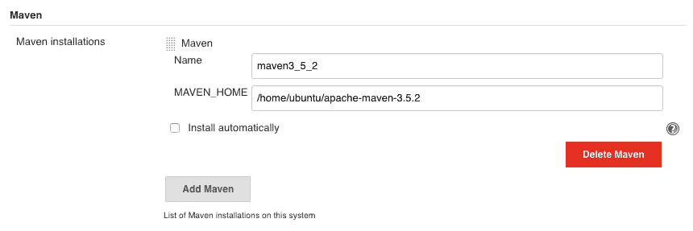

让我们配置我们的 Jenkins 任务，来构建我们的示例项目：

1.  点击创建新任务：

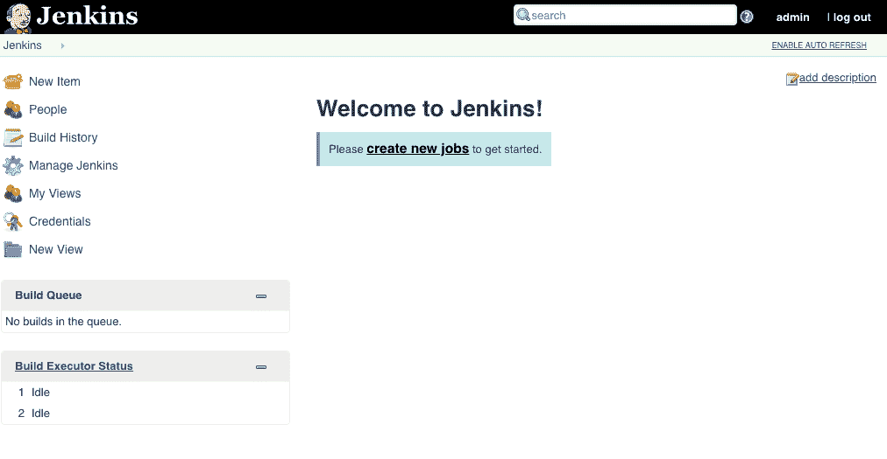

1.  创建一个带有 Maven 插件的 Jenkins 任务。提供任务名称 `devops-ci-cd`（如果你愿意，可以选择另一个项目名称）：

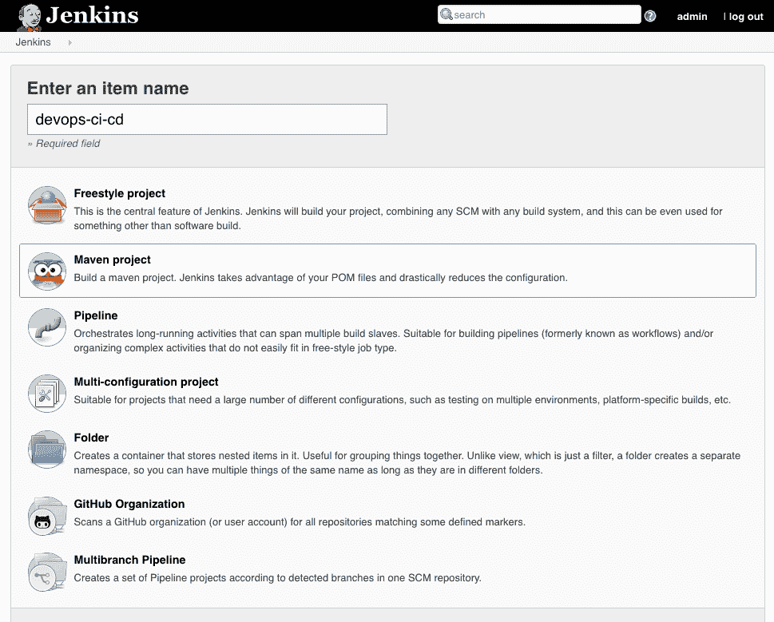

1.  在源代码管理部分，提供你的项目的 Git URL。提供凭据以便在 Jenkins 中克隆该仓库：

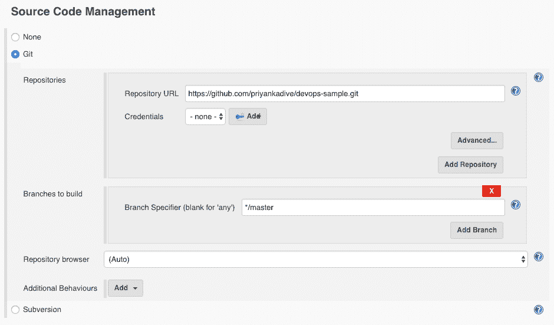

1.  在构建触发器中选择 GitHub 钩子触发器进行 GitScm 轮询。如果 Jenkins 收到来自前述仓库的 PUSH GitHub Webhook，它将触发该任务：

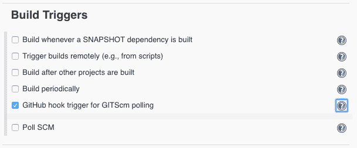

1.  提供 `pom.xml` 的根路径。这将是相对于模块根目录的路径。在构建中，添加根 POM 文件为 `pom.xml`，并将 Goals 和选项设置为 `package`：

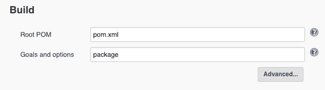

1.  保存您的工作并点击立即构建。

这将在 `"/var/lib/Jenkins/workspace/target"` 文件夹中创建 `my-app-1.0-SNAPSHOT.jar` 文件。在项目构建过程中，您可以查看控制台日志。

一旦 JAR 文件成功构建，您可以看到如下截图所示的控制台日志：

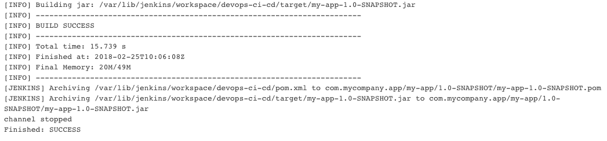

我们已经成功完成了持续集成任务。现在，我们需要在 GitHub 设置中添加 Jenkins webhook URL，以便每当有人将代码推送到我们的 GitHub 项目时，Jenkins 会自动触发构建。

# 在 GitHub 项目中添加 Jenkins webhook URL

要添加 Jenkins webhook URL，请按照以下步骤操作：

1.  从 "Manage Jenkins | Configure System | GitHub Web Hook Section" 获取您的 GitHub webhook URL。

示例 URL：`https://<your-domain-name or IP address>/web-hook/`

1.  转到 GitHub | 选择您的项目。进入设置并选择集成和服务。点击添加服务并搜索 `Jenkins`。结果中会显示两个服务：Jenkins（Git 插件）和 Jenkins（GitHub 插件）。根据您的项目选择其中一个。我们选择 Jenkins（GitHub 插件）：

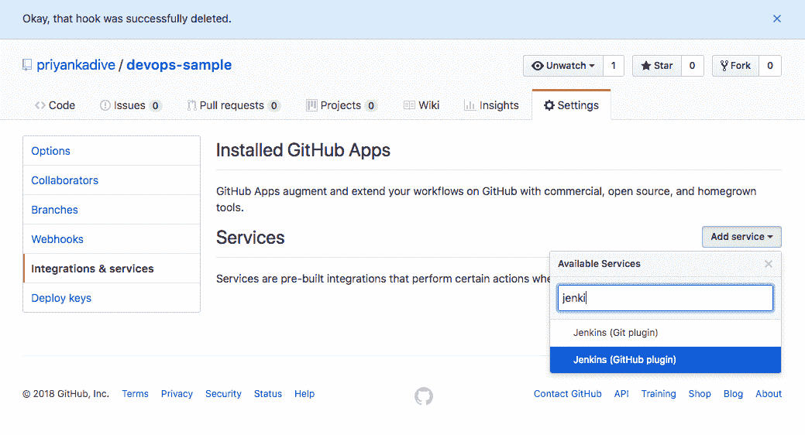

1.  添加您的 Jenkins webhook URL 并点击添加服务：

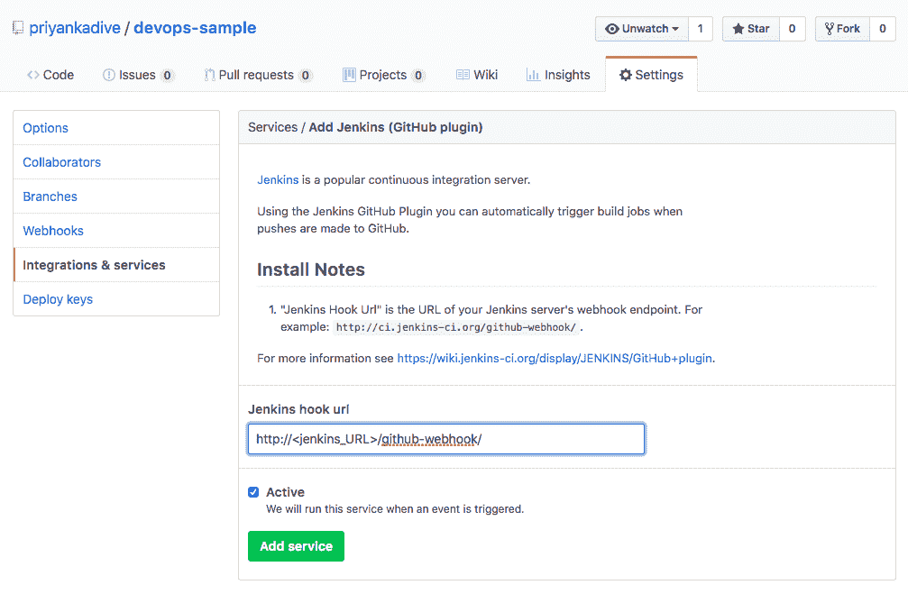

1.  通过点击测试服务来验证 hook 是否工作正常。它会将我们的测试负载发送到 Jenkins 服务器。如果一切正常，我们将看到 Jenkins webhook 前面有一个绿色勾选标记：

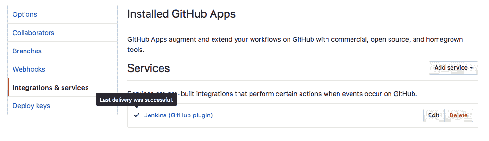

要测试您的持续集成管道，请在我们创建的 `README` 文件中添加一些更改。将更改推送到 GitHub。

1.  在 Jenkins 中，您可以看到如下面截图所示的 "devops-ci-cd" 构建已经自动启动：

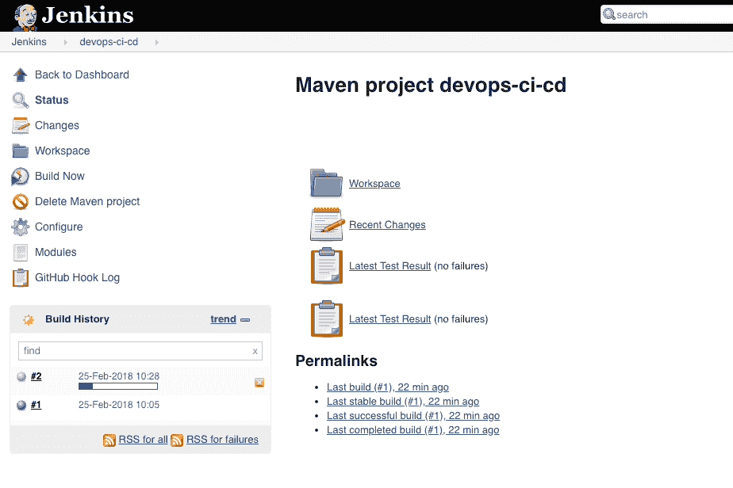

# 持续部署

我们已经完成了持续集成步骤。当 GitHub 项目的源代码更新时，我们的 Jenkins 服务器将构建一个 `.jar` 文件。接下来，我们需要将更新的代码部署到远程服务器。SSH 是一种广泛使用的安全外壳协议，用于安全地登录到远程系统。在这个示例应用程序中，我们将使用 Publish Over SSH 插件。该插件用于通过 SSH 协议将构建工件发送到远程服务器并执行命令。

# 在 Jenkins 服务器上安装 Publish Over SSH 插件

现在，我们将编辑之前创建的 Jenkins 任务。作为持续集成步骤的输出，我们在 Jenkins 工作空间中得到了创建的 `my-app-1.0-SNAPSHOT.jar` 文件。为了将此 JAR 部署到我们的测试服务器上，我们将使用一个简单的 Jenkins 插件——Publish Over SSH。这个插件允许我们将文件传输到远程服务器并运行命令。首先，我们需要在“管理 Jenkins”页面上设置 SSH 私钥。进入“管理 Jenkins”|“配置系统”，并提供以下信息：

+   密码短语：为密钥提供密码短语（如果未加密则留空）

+   密钥路径：密钥路径可以是绝对路径，也可以相对于 `$JENKINS_HOME`。

+   密钥：如果密钥不存在于 Jenkins 服务器上，则可以将其复制并粘贴到此字段中

+   添加 SSH 服务器的详细信息，如用户名、主机名和远程目录：

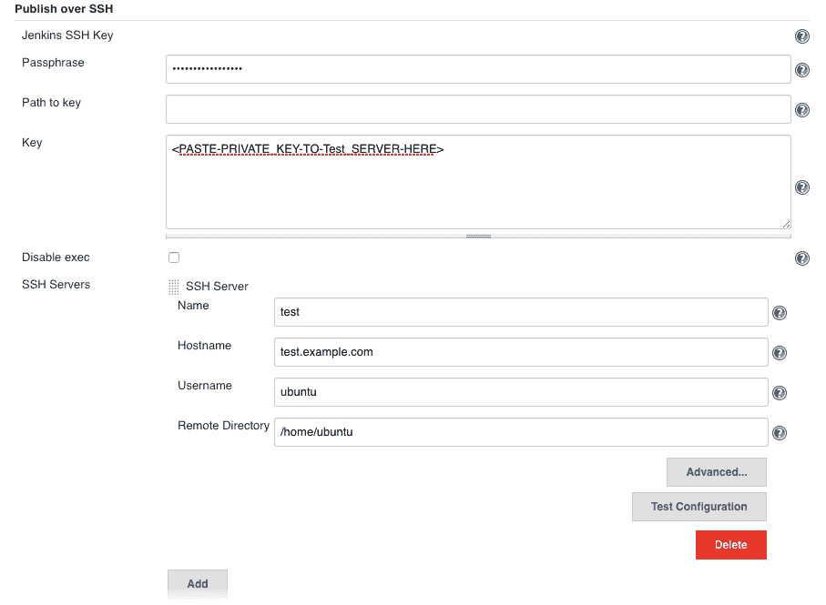

现在回到我们之前的 Jenkins 任务，并从“构建后步骤”中选择“仅在构建成功时运行”选项，这样只有在构建成功时，后续步骤才会被执行。

从“添加构建后步骤”下拉列表中选择“通过 SSH 发送文件或执行命令”选项：

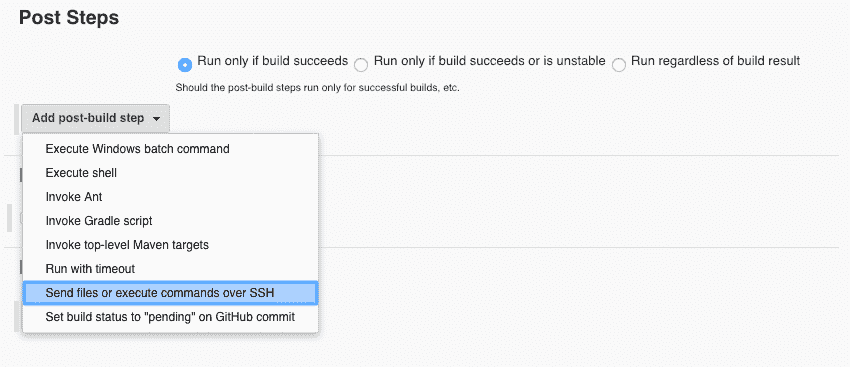

添加以下配置以将 JAR 文件复制到测试服务器并运行命令启动它：

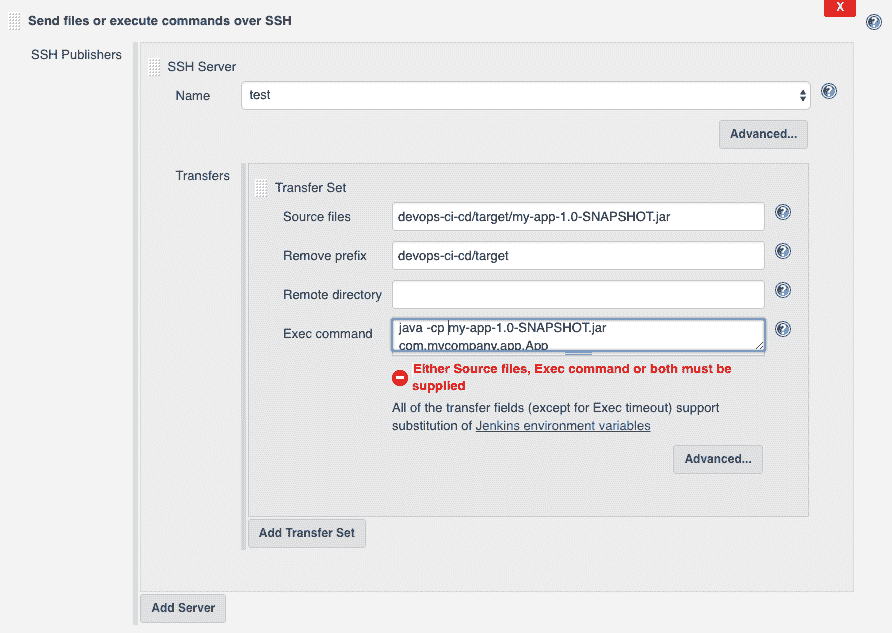

部署 `Hello world!` 的命令如下：

```
#java -cp target/my-app-1.0-SNAPSHOT.jar com.mycompany.app.App
```

我们已经完成了使用 Maven 和 Jenkins 对我们的示例 Java 应用程序进行持续集成和持续部署的过程。因此，每当开发者将代码提交到 Git 时，Jenkins 任务将被触发，执行构建步骤以创建 JAR 文件并将其部署到测试服务器，如果构建成功的话。我们可以添加一个步骤，在部署的应用程序上执行自动化测试用例，并获取我们新变更的结果。

# 总结

在本章中，我们讨论了为什么在 Salesforce 项目中需要 DevOps，以及在处理大型 Salesforce 项目的开发和部署时可能会面临的挑战。同时，我们还探讨了为什么 Salesforce 的 DevOps 与其他技术栈不同，以及从开发、设置环境和将变更部署到 Salesforce 生产环境与其他技术栈的区别。

我们了解了典型的 Java 开发栈的 DevOps 流程，在这个过程中我们创建了一个示例 Java 应用程序，并使用 Git 版本控制来跟踪在开发过程中所做的更改。我们学习了如何在 GitHub 项目中添加 Jenkins Webhook URL。我们设置了一个示例 Jenkins 任务，其中添加了一个 Maven 构建步骤，当任何人向 Git 主分支推送代码时，就会通过 Jenkins Webhook 创建一个 JAR 文件。在完成示例 Java 应用程序的持续集成步骤之后，我们在 Jenkins 任务中添加了一个使用 Publish Over SSH 插件进行持续部署的步骤。

在下一章中，我们将讨论 Salesforce 中传统部署方式的实现。我们将学习 Salesforce 中的部署方法，并讨论为什么部署过程中需要自动化，以及如何使用 Ant 脚本实现 Salesforce 部署的自动化。

# 参考文献

**5 分钟掌握 Maven**: [`maven.apache.org/guides/getting-started/maven-in-five-minutes.html`](https://maven.apache.org/guides/getting-started/maven-in-five-minutes.html)
