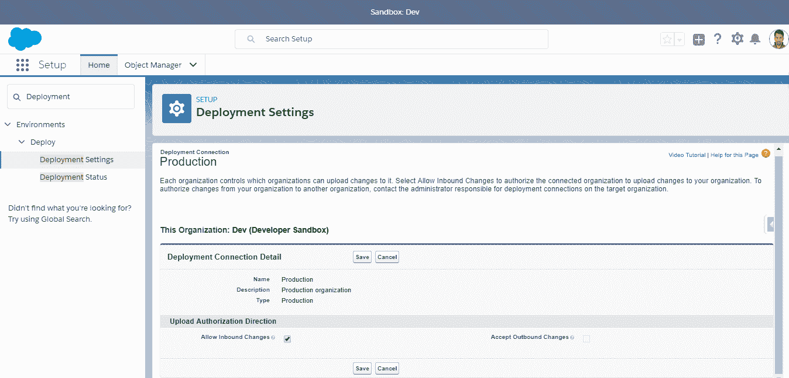

# 在 Salesforce 中的部署

在上一章中，我们讨论了在 Salesforce 应用程序部署中需要 DevOps，以及 DevOps 如何帮助大量开发人员在同一项目中协同工作。我们看到 DevOps 能够提供精简的交付，帮助我们使用开源工具跟踪应用程序问题。我们还看到了 Salesforce 与其他技术栈的不同之处。我们讲解了如何使用 Git 和 Jenkins 为 Java 开发栈设置 DevOps 的过程。

在本章中，我们将讨论如何以过渡的方式将 Salesforce 代码从一个沙盒部署到另一个沙盒，或者从沙盒部署到生产环境。部署代码有多种方式，例如使用变更集或迁移工具。

在本章中，我们将学习以下主题：

+   在 DevOps 中，什么是部署？

+   从沙盒到沙盒以及沙盒组织的部署

+   使用变更集进行部署

+   使用迁移工具进行部署

+   使用 Force.com IDE 进行部署

+   使用 Salesforce DX 插件的 Visual Studio Code 进行部署

+   使用第三方工具（利用元数据 API 或工具 API）进行部署

让我们首先来看看 Salesforce 中的部署。

# 在 DevOps 中，什么是部署？

成功地将代码更改部署到生产环境涉及许多任务，例如单元测试、集成测试、配置更改、避免停机、备份现有环境以防止部署失败导致的数据丢失、提供回滚更改的快速恢复方式等。在 DevOps 中，借助众多部署、配置管理、备份和恢复工具，可以轻松执行快速、零停机时间的部署。

在 DevOps 中，持续部署是将每个更改从开发环境部署到生产环境的过程，在此过程中，每个更改都会经过持续集成管道，并且自动进行测试。这个过程使我们能够更快速地将新特性和 bug 修复交付到生产环境中。

由于每个更改都经过 DevOps 管道处理，一切都被跟踪。例如，假设我们想要将 Java 应用程序代码从开发环境部署到生产环境，正如我们在第二章《将 DevOps 应用于 Salesforce 应用程序》中看到的那样。开发人员所做的代码更改将推送到 Git（一个版本控制系统），这会自动触发 Jenkins 作业来构建 JAR 文件并将其部署到测试环境。我们可以继续为构建作业添加持续测试阶段，在这个阶段运行测试用例，根据测试结果，构建将被推送到下一个环境阶段，然后进入生产环境。

Salesforce 中的部署过程与其他堆栈的部署过程不同。我们将讨论 Salesforce 中有哪些类型的部署以及它们之间的区别，并举一些示例场景。我们还将了解在 Salesforce 中有多少种方式可以部署项目，并探讨哪种方法最佳。

# Salesforce 中的部署

有很多不同的方法可以在生产环境中部署 Salesforce。Salesforce 部署仅仅是将 Salesforce 元数据迁移到生产环境。

有三种方法可以将元数据迁移到生产环境：

+   从沙箱到生产组织

+   从一个生产组织到另一个生产组织

+   从开发者组织到生产组织

有多种方法可以实现 Salesforce 元数据的部署：

+   变更集

+   Ant 迁移工具

+   Force.com IDE

+   使用元数据 API 或工具 API 的第三方工具

+   SOAP API

+   配有 Salesforce DX 插件的 Visual Studio Code

# 变更集

使用变更集时，必须将沙箱连接到生产组织。在前一章中，我们讨论了如何创建沙箱并建立沙箱与生产组织之间的连接。这是将配置和元数据变更从一个沙箱发送到另一个沙箱或从沙箱发送到生产组织的传统且最简单的方法。

变更集有两种不同类型。前往设置并使用`变更集`关键词搜索。

变更集有两种类型：传入变更集和外发变更集：

+   **外发变更集**：外发变更集需要在源沙箱中创建。通常，我们会在沙箱中创建外发变更集，并将其部署到生产组织。我们可以选择将变更从沙箱迁移到生产组织，从生产组织迁移到沙箱，或者从沙箱迁移到沙箱。你需要在源沙箱中进行更改，并将这些更改上传到目标沙箱或生产组织。

+   **传入变更集**：传入变更集一旦外发沙箱成功上传后，便会自动在目标沙箱或生产组织中显示。

# 部署连接

在沙箱或其他组织中创建变更集之前，我们需要在组织中授权部署连接。前往设置并使用`部署`关键词搜索：

设置页面

# 使用变更集进行部署

使用变更集部署有四个步骤，分别如下：

1.  创建部署连接

1.  创建外发变更集

1.  验证传入变更集

1.  使用快速部署来部署变更集

我们将在接下来的章节中讨论这些步骤。

# 创建部署连接

首先，前往设置并使用`部署`关键词搜索：

选择部署设置：

选择部署设置

在这里，我们可以找到沙箱列表及其连接状态。

有三种不同类型的符号：

+   绿色的右箭头

+   绿色的左右箭头

+   红色的破损箭头

选择编辑以修改入站更改：

修改入站更改

有一个复选框名为“允许入站更改”。这是为连接的组织设置的，允许该组织向我们的组织部署更改集。我们需要勾选此复选框以建立连接：

允许入站更改

有一个名为“接受出站更改”的复选框。这个字段是只读的——你不能在这里编辑此字段。如果连接的组织选中了“允许入站更改”复选框，系统会自动选择此选项：

允许出站更改

现在点击“保存”按钮以创建连接：

# 创建出站更改集

前往设置并使用`outbound`关键词进行搜索：

使用出站关键词进行搜索

出站更改集包含你想要从此组织发送到另一个组织的定制。这些定制可能包括新的组件或现有组件的修改，例如应用程序、对象、报告或 Apex 类和触发器。出站更改集不能用于删除或重命名另一个组织中的组件。

若要创建新的出站更改集，点击“新建”按钮。

输入更改集的名称，这是必填项，并填写其描述：

创建出站更改集

点击“保存”按钮以创建出站更改集。

更改集包含应用程序、对象、报告和电子邮件模板等组件的定制。你可以使用更改集将定制从一个组织迁移到另一个组织。

上传更改集后，其组件不会自动刷新，且不能添加或移除组件。要刷新组件源并修改组件列表，需克隆更改集。

点击“添加”将 Salesforce 组件加入到你的更改集中：

添加 Salesforce 组件

你将看到所有 Salesforce 组件的列表，可以选择你想要添加的组件及其类型：

选择需要迁移到生产组织的组件：

点击“添加到更改集”。

如果误添加了组件，我们可以将其移除。方法是点击“移除”链接：

移除组件

现在点击“上传”按钮上传更改集：

更改集选项

一旦上传此变更集，您将无法编辑或从目标组织中撤回它：

上传确认消息

选择您要将变更集发送到的组织，然后点击“上传”。您将看到一条确认消息，如以下截图所示：

# 验证传入的变更集

进入设置并使用 `inbound` 关键字进行搜索：

使用 inbound 关键字进行搜索

然后选择“传入变更集”，点击一个变更集名称查看其详细信息：

有三个选项：“验证”、“部署”和“删除”。点击“验证”以验证变更集，而不部署更改。

有四个选项用于验证变更集：

+   默认

+   运行本地测试

+   运行所有测试

+   运行指定的测试

这些选项显示在下面的截图中：

Salesforce 推荐您选择“运行指定的测试”选项。在以下屏幕中，我们需要添加特定的测试类：

点击“验证”以验证生产组织中的变更集：

在确认提示中点击“确定”：

# 使用快速部署来部署变更集

要跟踪验证进度，请点击“部署状态”：

我们可以看到组件列表和 Apex 测试类列表：

现在，变更集已启用快速部署验证过的变更集，跳过 Apex 测试作为部署的一部分：

快速部署选项

现在点击“快速部署”将变更集部署到生产组织中。

# 使用 Ant 迁移工具进行部署

Ant 迁移工具提供了一种从本地目录将元数据部署到 Salesforce 沙盒的方法。我们可以使用 Ant 命令行工具来自动化 Salesforce 中的部署任务。

Ant 迁移工具帮助我们从沙盒中检索并部署元数据。

此工具也可以用来备份您的沙盒元数据。要配置沙盒的访问权限，我们需要在 `build.properties` 文件中提供沙盒凭证。`build.xml` 文件包含检索或部署元数据的命令。`Package.xml` 包含要检索或部署的组件。

Ant 迁移工具通过第四章中的示例进行了详细解释，*Force.com 迁移工具介绍*。

我们将讨论一些可以使用 Ant 迁移工具部署类型的场景：

+   部署可能涉及许多设置更改，但使用 Web 界面进行这些更改是一项困难且耗时的工作。可以使用 Ant 迁移工具自动化设置更改的过程。

+   拥有多个环境时，需要重复部署到开发、测试和预发布环境，才能将任何更改部署到生产环境。自动化组件的获取和部署将有助于加速该过程。

+   我们可以设置自动备份，使其在午夜时分发生，复制沙盒的元数据并在需要时进行恢复。

# 使用 Force.com IDE 部署 Apex

Force.com IDE 是 Eclipse IDE 的一个插件。Force.com IDE 提供了一个统一的界面，用于构建和部署 Salesforce 应用程序。该 IDE 旨在为开发人员和开发团队提供加速 Salesforce 应用程序开发的工具，包括源代码编辑器、测试执行工具、向导和集成帮助。该工具包括基本的颜色编码、大纲视图、集成单元测试和在保存时自动编译并显示错误消息的功能。

Force.com IDE 是 Salesforce 提供的免费资源，旨在支持其用户和合作伙伴，但不被视为 Salesforce 主订阅协议中的一部分。

要将 Apex 从本地项目部署到 Salesforce 组织，可以使用“部署到服务器”向导。

如果你正在部署到生产组织，至少 75% 的 Apex 代码必须由单元测试覆盖，并且所有这些测试必须成功完成。

请注意以下几点：

+   在将组件部署到生产组织时，组织中的所有测试类默认都会执行

+   每个触发器中应该至少有 1% 的测试覆盖率

+   所有组件应成功编译

+   测试类和测试方法不计入 Apex 代码覆盖率

+   代码的某些部分不计入 Apex 代码覆盖率，例如调试、注释和空格不包括在内

要使用 Force.com IDE，必须首先安装 Eclipse。安装完 Eclipse 后，按照以下步骤安装 Force.com IDE：

1.  打开 Eclipse：

1.  现在输入工作区路径并点击确定：

1.  现在选择“帮助”，点击“安装新软件”：

1.  要添加新软件，请点击“添加...”按钮。

1.  在“添加仓库”对话框中，输入名称为 `Force.com`，并将位置输入为 `https://developer.salesforce.com/media/force-ide/eclipse45`：

我们将获得与 Force.com IDE 相关的所有内容的列表：

可用软件列表

1.  我们需要选择 Force.com IDE。我们还可以添加其他软件，如 Force.com 调试器和 Force.com Lightning 支持：

1.  点击下一步继续。如果有任何问题，我们可以取消安装：

安装所需的软件

1.  选择 保持我的安装不变并修改安装的项目以兼容 单选按钮。要继续，点击下一步。如果出现任何问题，我们可以取消安装：

1.  在审查许可中，接受条款并点击完成：

1.  点击确认继续。现在，Eclipse 成功安装了 Force.com IDE 和所需的依赖项。安装完成后，系统会提示重启。点击立即重启。此时只有 Eclipse 会重启，而不是你的电脑：

1.  等待 Eclipse 重启。现在选择 窗口 选项卡，在 打开透视图 选项卡中，选择其他。

1.  选择 Force.com 并点击确定。

按照这些步骤从 Force IDE 部署代码：

1.  首先，我们需要打开项目。然后右键点击项目，会显示很多选项。选择 Force.com 并点击项目属性：

在这里我们需要通过使用凭证创建与组织的连接。填写所有详细信息；即用户名、密码和安全令牌。

1.  选择环境为生产/开发者版本：

1.  点击应用并关闭按钮：

1.  再次右击项目。我们会看到很多选项；选择 Force.com 并点击部署到服务器...：

在这里我们需要添加凭证。填写所有详细信息（在 用户名、密码和安全令牌 字段中）：

1.  点击下一步按钮。将出现一个窗口，显示元数据组件的列表：

1.  通过相关的复选框选择要部署的组件：

1.  要验证组件，请点击验证部署。我们必须在实际部署之前验证所有组件：

1.  一旦验证成功完成，点击下一步。所有选中的组件将被部署到 Salesforce 组织中。

# 将 Salesforce DX 插件安装到 Visual Studio Code 中

执行以下步骤以设置 Visual Studio Code：

1.  从 [`code.visualstudio.com/download`](https://code.visualstudio.com/download) 下载并安装最新版本的 Visual Studio Code。

1.  安装完成后，打开 Visual Studio Code，在左侧工具栏中点击扩展图标。搜索 Salesforce Extensions for VS Code：

搜索结果中显示 Salesforce Extensions for VS Code

1.  点击相关的安装按钮以安装扩展包：

安装所需的扩展

1.  安装完成后，点击重新加载按钮：

# 总结

在本章中，我们学习了如何将 Salesforce 代码从一个沙箱部署到另一个沙箱，从沙箱部署到生产环境，以及从一个组织部署到另一个组织。我们了解了不同类型的代码部署。我们还学习了如何根据项目类型使用它们。我们学习了如何使用变更集（Change Sets）和 Force.com IDE 将代码迁移到生产环境，特别是在需要持续将代码迁移到生产环境的项目中，比如正在进行的项目。

在敏捷方法论中，我们主要使用 Ant 迁移工具（Ant Migration Tool），该工具使得代码能够在特定时间间隔或迭代中迁移。在下一章中，我们将更深入地讨论 Ant 迁移工具。
