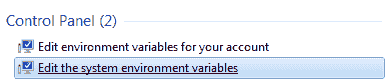
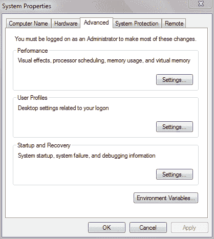
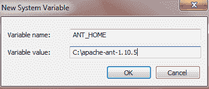
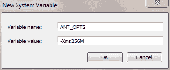
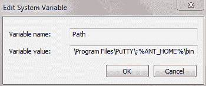
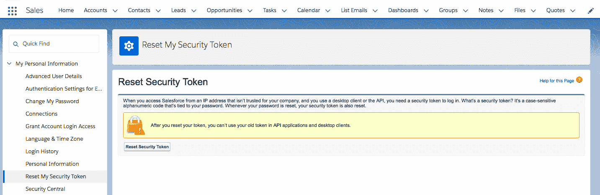
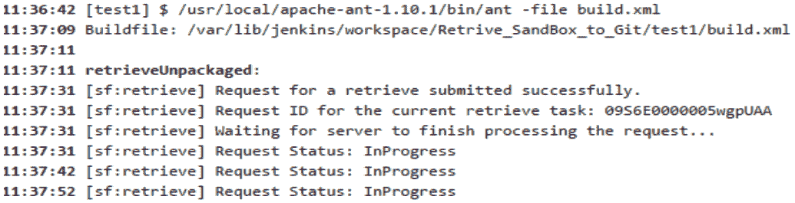

# 第四章：Force.com 迁移工具简介

在上一章，我们介绍了传统的 Salesforce 部署方式。我们学习了变更集部署、Salesforce 中的入站和出站变更，如何使用 Eclipse 将代码部署到沙盒，以及 Ant 脚本的使用。同时，我们还比较了 Salesforce 中的不同部署方法，分析了它们的优缺点，并学习了如何根据使用场景选择合适的部署方法。

本章中，我们将详细研究 Force.com 迁移工具。我们将了解如何安装和设置 Force.com 迁移工具。此外，我们将看到如何使用迁移工具从 Salesforce 沙盒中提取元数据组件，并将它们部署到另一个沙盒中。同时，我们还将解释一些重要操作，如部署代码和撤销部署代码。我们将讨论涉及沙盒操作的配置文件。

我们将解释从沙盒中提取元数据并构建项目清单的完整过程。我们将学习如何在 Force.com 迁移工具中配置沙盒凭证，以执行诸如部署或删除沙盒中的元数据文件等操作。

本章中，我们将学习以下主题：

+   什么是 Force.com 迁移工具？

+   如何设置 Force.com 迁移工具

+   Force.com 工具如何帮助开发人员和 DevOps

+   使用迁移工具从沙盒中提取元数据

+   在沙盒上部署元数据

+   使用`destructiveChanges.xml`从 Salesforce 组织中删除文件/组件

+   故障排除

# 什么是 Force.com 迁移工具？

Force.com 迁移工具提供了一种脚本化的方式，用于将元数据部署到 Salesforce 沙盒中，或从沙盒中提取元数据。它基于 Ant/Java。

Force.com 迁移工具帮助我们轻松地将 Salesforce 组件从一个组织复制到另一个组织。在实际操作中，我们通常有多个不同的环境，如开发、测试、UAT 和生产环境。开发人员在开发者沙盒中开发组件时，需要将这些更改移至测试或 UAT 环境，让测试人员进行测试并为功能/更改在生产环境中的发布提供批准。然而，这并不是一次性的过程。许多时候，功能或更改不能正常工作，或引入了一些 bug，测试人员会提出问题或 bug，开发人员会开始修复。一旦在开发环境中修复了 bug/问题，我们还需要将这些更改再次部署到测试/UAT 环境中。因此，由于多种原因，这成为了一个重复的过程。每次使用变更集进行部署并不是一个方便的选择，因此我们需要一个快速、简便且少出错的解决方案来执行此任务。

Ant 迁移工具提供了解决我们刚才讨论的所有问题的方案。Ant 迁移工具易于设置和使用。完成设置后，只需进行少量更改即可重复使用。Ant 迁移任务可以编写脚本，因此我们可以轻松地自动化大多数日常任务。Force.com 迁移工具是 Salesforce 支持的工具；我们无需过多担心它与应用程序的兼容性和安全性。

# 设置 Force.com 迁移工具

要设置 Force.com 迁移工具，需要安装以下部分提到的前提条件。我们可以在 Windows、Mac 或 Linux 操作系统上设置迁移工具。以下是设置 Linux 机器上 Force.com 迁移工具的步骤。

# 前提条件

设置的前提条件如下：

+   Java 1.7.x 或更高版本

+   Ant 工具

让我们在系统上安装这些工具。

# Java

推荐使用 Java 版本 1.7.x 或更高版本以确保更好的安全性。使用命令行检查系统上是否已安装 Java，如下所示：

1.  打开终端。

1.  输入`java -version`并按*Enter*键。

你将看到以下输出：

```
java version "1.7.0_21" 
Java(TM) SE Runtime Environment (build 1.7.0_21-b11) 
Java HotSpot(TM) 64-Bit Server VM (build 23.21-b01, mixed mode) 
```

如果系统上未安装 Java，请使用以下说明安装 Java：

1.  访问[`www.oracle.com/technetwork/java/javase/downloads/index.html`](http://www.oracle.com/technetwork/java/javase/downloads/index.html)。

1.  下载最新版本的 Java JDK 并安装 JDK。

1.  在命令提示符下输入`java -version`进行验证。

# Ant

要检查已安装的 Ant 版本，你需要执行以下步骤：

1.  打开终端。

1.  运行`ant -version`命令以验证系统上是否已安装 Ant。

输出将如下所示：

```
ant -version 
Apache Ant(TM) version 1.10.1 compiled on February 2 2017 
```

如果系统上未安装 Ant，可以使用以下步骤安装 Ant：

推荐的 Ant 版本是 1.5.x 或更高版本；你需要下载最新版本的 Ant。

1.  从[`ant.apache.org/bindownload.cgi`](http://ant.apache.org/bindownload.cgi)下载 Apache Ant。你需要下载一个版本高于 1.6 的 Ant 到`ANT_HOME`。请注意，在我们的案例中，它是`/usr/local/`：

```
$wget http://www-eu.apache.org/dist//ant/binaries/apache-ant-
1.9.13-bin.tar.gz
```

1.  解压 Apache Ant 到`ANT_HOME`：

```
$unzip apache-ant-1.9.13-bin.tar.gz
```

1.  将`bin`目录添加到你的路径中。

1.  将 Ant 的二进制路径添加到`.bashrc`文件中，如下所示：

```
export JAVA_HOME=/usr/lib/jvm/java-1.8.0 
export PATH=$PATH:$JAVA_HOME/bin 
export ANT_HOME=/usr/local/apache-ant-1.9.13 
export PATH=$PATH:$ANT_HOME/bin 
```

更多信息，请参见[`ant.apache.org/manual/install.html`](http://ant.apache.org/manual/install.html)。

# 在 Linux 上安装 Ant 迁移工具

安装步骤如下：

1.  从[`developer.salesforce.com/page/Force.com_Migration_Tool`](https://developer.salesforce.com/page/Force.com_Migration_Tool)下载 Force.com 迁移工具：

```
#wget https://gs0.Salesforce.com/dwnld/
SfdcAnt/Salesforce_ant_39.0.zip
```

1.  将`.zip`文件保存在本地并将内容解压到你选择的目录：

```
#unzip Salesforce_ant_39.0.zip 
```

请注意，在我们的案例中，它是`/home/devops/Force_com_tool`。

1.  解压`Salesforce_ant_39.0.zip`后，你会找到`ant-Salesforce.jar`文件；这是运行 Ant 任务所必需的。将`Salesforce_ant_39.0.zip`复制到另一个名为`Sample`的文件夹中，里面有用于从沙箱中部署和检索元数据的示例，包括`codepkgclasses`、`removecodepkg`。此外，`Sample`文件夹中还包含一个`build.properties`文件，我们在其中提供访问 Salesforce 沙箱的凭证。`Build.xml`文件中列出了 Ant 任务，这些任务使用`build.properties`中的凭证。

# 在 Windows 上安装 Ant 迁移工具

要在 Windows 机器上使用 Ant 迁移工具，我们需要在机器上安装 Java 和 Ant。安装 Java 和 Ant 的步骤已在前面的部分中提到。

以下步骤需要在 Windows 上设置`ANT_HOME`环境变量：

1.  在搜索框中输入`environment`：



1.  选择编辑系统环境变量。在“高级”选项卡下，选择“环境变量”：



1.  在系统环境变量下，创建一个新的`ANT_HOME`环境变量。将`ANT_HOME`的值设置为 Ant 二进制路径：



1.  创建一个新的环境变量，名称为`ANT_OPTS`，值为`-Xms256M`：



1.  编辑`Path`环境变量，并按以下截图所示添加`ANT_HOME`路径。点击“确定”，然后再次点击“确定”保存环境变量：



1.  打开命令提示符，使用`ant -version`命令检查 Ant 版本。你将看到如下输出：

```
Apache Ant(TM) version 1.10.5 compiled on July 10 2018
```

# 安装 Salesforce Ant 迁移工具

安装步骤如下：

1.  从[`developer.salesforce.com/docs/atlas.en-us.daas.meta/daas/forcemigrationtool_install.htm`](https://developer.salesforce.com/docs/atlas.en-us.daas.meta/daas/forcemigrationtool_install.htm)下载 Ant 迁移工具的 ZIP 文件

1.  将 ZIP 文件保存到你喜欢的任何目录。在本例中，我们将使用`C:\Demo`路径下的`Demo`文件夹。

1.  将`Salesforce_ant_43.0.zip`解压到`C:\Demo\Salesforce_ant_43.0`。ZIP 文件的内容已在*在 Linux 上安装 Ant 迁移工具*部分中说明。

# 从沙箱中检索元数据

要开始从沙箱中检索元数据，我们需要配置`build.xml`、`package.xml`和`build.properties`文件。`build.properties`文件用于指定 Salesforce 凭证，以在你的计算机和 Salesforce 沙箱之间建立连接。`build.xml`文件包含在沙箱中需要执行的 Ant 任务。`package.xml`是项目清单文件，包含需要检索或部署的包。

我们将通过常规流程，使用 Ant 迁移工具从 Salesforce 组织中检索元数据到本地计算机：

1.  前往提取 Force.com 迁移工具`.zip`文件的文件夹。你需要使用任何编辑器编辑`build.properties`文件。

1.  在此案例中，我们将使用 vim 编辑器。运行以下命令：

```
$vim build.properties 
```

1.  让我们看一下示例`build.properties`文件：

```
build.properties 
sf.username = devopsxxx@Salesforce.com.dev 
sf.password = mypassxxxxxxxxxxxxxxxxxxxxxxxxx 
sf.token = <Security Token Generated> 
#sf.sessionId = <Insert your Salesforce session id here. Use this or username/password above. Cannot use both> 
#sf.pkgName = <Insert comma separated package names to be retrieved> 
#sf.zipFile = <Insert path of the zipfile to be retrieved> 
#sf.metadataType = <Insert metadata type name for which listMetadata or bulkRetrieve operations are to be performed> 
# Use 'https://login.Salesforce.com' for production or developer edition (the default if not specified). 
# Use 'https://test.Salesforce.com for sandbox. 
sf.serverurl = https://test.Salesforce.com <ForSandbox>
sf.maxPoll = 20 
# If your network requires an HTTP proxy, see http://ant.apache.org/manual/proxy.html for configuration. 
Load properties from file 
```

1.  添加所需的登录凭证以连接到目标 Salesforce 组织，例如以下内容：

+   `Sf.username`：此字段指定你的 Salesforce 沙盒/生产环境的用户名。提供的用户名应该具有修改所有数据的权限。如果你连接的是沙盒实例，则需要在用户名后面附加沙盒名称。

+   例如，你可以按需指定用户名，但使用有意义的名称是一种良好的做法，它将帮助我们识别沙盒。如果你的用户名是`xxx@Salesforce.com`，并且你想连接沙盒`dev`，那么`sf.username`的值可以是`xxx@Salesforce.com.dev`。

+   `Sf.password`：此字段指定 Salesforce 用户名的密码。你需要将 Salesforce 安全令牌附加到密码后。安全令牌是一个 25 位的区分大小写的代码，用于 API 登录身份验证。当你使用 API 登录时，必须提供安全令牌。

+   例如，如果你的密码是`mypass`，安全令牌是`xxxxxxxxxxxxxxxxxxxxxxxxx`，那么`sf.password`字段的值应为`mypassxxxxxxxxxxxxxxxxxxxxxxxxx`。

+   如果你没有安全令牌，你可以重置它。重置安全令牌的步骤如下：

1.  登录到你的组织，并导航到顶部导航栏。前往<你的名字> | 我的设置 | 个人设置 | 重置我的安全令牌：



1.  +   1.  点击“重置安全令牌”。这将使你现有的令牌失效。

        1.  你将通过你的用户邮箱获取安全令牌。出于安全原因，安全令牌在重置设置中不会显示。

注意：如果你在登录时仍然遇到问题，你需要检查是否设置了登录 IP 范围，例如从 53.14.120.10 到 53.14.120.255。如果你不在相同的 IP 范围内，你需要删除登录 IP 范围。

+   `Sf.serverurl`：此字段指定 Salesforce 的服务器 URL。如果你想连接到生产组织或开发者版本组织，则该字段的值为`https://login.Salesforce.com`。如果你想使用沙盒环境，则字段的值为`https://test.Salesforce.com`。如果你使用自定义域名，可以将值设置为`https://custom-domain.my.salesforce.com`。

1.  现在我们需要列出所有要从沙盒中检索的组件。

1.  `package.xml`文件是一个项目清单文件，我们在其中列出了所有要检索或部署的组件。在我们的`package.xml`文件中，我们列出了项目中的所有 Apex 类组件。如果你想备份你的沙盒元数据，可以在`package.xml`中列出所有组件。例如，`package.xml`仅包含 Apex 类：

```
<?xml version="1.0" encoding="UTF-8"?> 
<Package > 
    <types> 
    <members>*</members> 
    <name>ApexClass</name> 
    </types> 
    <version>36.0</version> 
</Package> 
```

1.  下一个需要配置的文件是`build.xml`。该文件指定了一个目标来检索和部署元数据。Ant 任务在`build.xml`文件中提到。配置步骤如下：

    1.  转到`build.xml`所在的目录

    1.  运行`ant`命令，验证你是否正确安装了 Apache Ant。

    1.  `build.xml`文件加载`build.properties`文件以获取沙箱的访问权限。

    1.  要从沙箱中检索元数据，可以为每个`<sf:retrieve>`目标设置用户参数。

    1.  由于我们的检索目标是`DevOps/src`，所有的元数据将存储在这个目录中。

1.  例如，查看以下`build.xml`文件：

```
<project name="Force.com Migration Tool" default="retrieveUnpackaged" basedir="." > 
<taskdef uri="antlib:com.Salesforce" 
        resource="com/Salesforce/antlib.xml" 
        classpath="lib/ant-Salesforce.jar" 
    /> 
    <!-- Load properties from file --> 
    <property file="build.properties"/> 
    <!-- Load properites from environment --> 
    <!-- These will override properties from the file --> 
        <property environment="env"/> 
        <property name="sf.username" value="${env.SF_USERNAME}"/> 
        <property name="sf.password" value="${env.SF_PASSWORD}"/> 
        <property name="sf.token" value="${env.SF_TOKEN}"/> 
        <property name="sf.serverurl" value="${env.SF_SERVERURL}"/> 

        <!-- Retrieve an unpackaged set of metadata from your org --> 
        <!-- The attribute 'unpackaged' is where metadata will be stored --> 
        <target name="retrieveUnpackaged"> 
        <!-- Retrieve the contents into another directory --> 
                <sf:retrieve 
                        username="${sf.username}" 
                        password="${sf.password}${sf.token}" 
                        serverurl="${sf.serverurl}" 
                        retrieveTarget="DevOps/src" 
                        unpackaged="${basedir}/package.xml" 
                /> 
        </target> 
    <!-- Retrieve the information on all supported metadata types --> 
</project> 
```

1.  使用`ant`命令检索元数据。运行以下命令以检索 Apex 类元数据，即`DevOps/src`中的检索目标：

```
$ ant -file build.xml
```

1.  控制台日志如下所示：



如果构建成功，它将显示`BUILD SUCCESSFUL`消息。

# 在沙箱中部署元数据。

在前面的示例中，我们展示了如何从沙箱中检索元数据并部署到本地环境。我们可以使用 Eclipse 编辑代码并进行修改，或者添加新功能代码。开发者可以使用 Force.com 迁移插件将元数据与 Eclipse 中的工作区同步。修改代码后，开发者可以将更改部署到测试/UAT 沙箱。我们可以使用 Force.com 迁移工具将更改部署到沙箱。

我们将通过常见的程序，使用 Ant 迁移工具从本地机器将元数据部署到 Salesforce 组织。为了提供沙箱访问权限，我们需要在`build.properties`文件中添加沙箱凭证，就像我们在*步骤 3*中，在*从沙箱检索元数据*部分所提供的凭证一样。`Sf.serverurl`字段的值将取决于你希望部署更改的位置。如果你想部署到测试、UAT 沙箱，或任何其他开发沙箱，那么它的值将是`https://test.Salesforce.com`。如果你正在将更改部署到生产环境，则使用`https://login.Salesforce.com`。但在所有测试用例成功通过之前，我们不应直接将更改部署到生产环境；这样做可能会导致现有功能失败并破坏应用程序。

完成`build.properties`文件的更改后，我们需要将所有要部署到沙箱的组件添加到`package.xml`中：

```
<project name="Force.com Migration Tool" default="retrieveUnpackaged" basedir="." > 
<taskdef uri="antlib:com.Salesforce" 
        resource="com/Salesforce/antlib.xml" 
        classpath="lib/ant-Salesforce.jar" 
    /> 
        <property environment="env"/> 
        <property name="sf.username" value="${env.SF_USERNAME}"/> 
        <property name="sf.password" value="${env.SF_PASSWORD}"/> 
        <property name="sf.token" value="${env.SF_TOKEN}"/> 
        <property name="sf.serverurl" value="${env.SF_SERVERURL}"/> 

                      <sf:deploy 
                        username="${sf.username}" 
                        password="${sf.password}${sf.token}" 
                        serverurl="${sf.serverurl}" 
                        deployRoot="DevOps/src" 
                        maxPoll="1000"  
                                                  testLevel="NoTestRun" 
                                                  pollWaitMillis="10000"  
                                                  rollbackOnError="true" 
                /> 
        </target> 
    </project> 
```

在前面的文件中，有一些新的参数，例如以下内容：

+   `deployRoot`：这是一个必填参数。所有要部署的文件都将存放在这个目录中。

+   `maxPoll`：这是一个可选参数。该参数定义了轮询服务器以获取部署请求结果的次数。其默认值为 200。

+   `testLevel`: 这是一个可选参数，指定在特定沙盒上进行部署时要运行的测试。此参数的值可以根据沙盒类型和部署位置而异。对于开发沙盒，默认设置为 `NoTestRun`，不会运行任何测试。您可以指定其他选项，选择要运行的测试用例或在组织上运行所有测试，我们将在第七章“持续测试”中详细介绍。

+   `pollWaitMillis`: 这是一个可选参数，用于定义在等待部署结果时轮询的毫秒数。此参数的默认值为 10,000，因此我们可以相应地设置它。

# 使用 `destructiveChanges.xml` 从 Salesforce 组织中删除文件/组件

我们已经看到可以从沙盒检索元数据，并可以使用 Ant 迁移工具将更改部署到沙盒。但有时我们不需要某些功能，希望从 Salesforce 组织中删除某些组件或文件，如对象、字段等。我们需要创建一个与 `package.xml` 文件一起的额外文件，即 `destructiveChanges.xml`。删除清单的格式与 `package.xml` 相同，只是不接受通配符字符。

删除组件与使用删除清单文件部署组件的过程相同。我们需要在 `destructiveChanges.xml` 中添加要删除的组件列表。删除自定义对象的示例文件如下：

```
<?xml version="1.0" encoding="UTF-8"?> 
    <Package http://soap.sforce.com/2006/04/metadata">http://soap.sforce.com/2006/04/metadata"> 
    <types> 
        <members>MyTestObject__c</members> 
        <name>CustomObject</name> 
    </types> 
</Package> 
```

要部署破坏性更改，我们需要 `package.xml` 文件，其中仅包含 API 版本。它不应包含任何组件列表。`destructiveChanges.xml` 和 `package.xml` 文件应位于同一目录中。

# Force.com 工具如何帮助开发人员和 DevOps

Force.com 迁移工具为开发人员提供了一种轻松执行其沙盒上操作（如检索、部署和删除元数据）的方式。使用 Force.com 迁移工具，开发人员可以将代码部署到不同的沙盒，并在 Eclipse 上的工作空间之间切换。迁移工具易于在开发人员的机器上设置，并提供了与 Salesforce 组织安全通信的方式。

如果部署过程中出现问题，我们可能会遇到一些问题；在这种情况下，自动化的每日备份非常重要。Force.com 迁移工具提供了通过命令行从 Salesforce 沙盒中检索代码和配置的方式，因此 DevOps 或管理员可以自动化执行备份任务，备份 Salesforce 组织的代码和配置。此外，我们还可以利用开源的持续集成工具，如 Jenkins，来自动化备份 Salesforce 组织并将其保存到 Git 中的过程。在第六章*，持续集成*中，我们将逐步介绍如何使用 Jenkins 自动化 Salesforce 组织备份过程。

# 故障排除

在本节中，我们将查看一些故障排除的场景：

+   **连接问题**：在检索或部署元数据时，我们最常遇到的问题是连接问题。在检索或部署元数据时，我们使用的是异步请求类型，因此不会立即收到响应。部署操作调用是异步的，有时在部署过程中，Ant 迁移工具会因超时而失败。如果 Ant 迁移工具因超时而失败并且部署中存在错误，我们将无法看到错误日志。在这种情况下，我们需要配置`pollWaitMillis`和`maxPoll`参数。

+   **无效的凭证或用户被锁定**：如果你看到这个错误，说明你的`build.properties`文件存在问题。你需要验证用户名、密码、安全令牌和服务器 URL 是否正确。如果你有多次登录失败的尝试，可能会导致你的用户被锁定。因此，允许的失败尝试次数取决于你所在组织的设置。有时，验证代理设置也有助于解决凭证问题。

+   **测试用例失败**：如果你正在将变更部署到生产环境，根据 Salesforce 标准，你需要确保 75% 的代码被测试用例覆盖，并且所有测试用例都需要通过，才能成功将代码部署到生产环境。

# 摘要

在本章中，我们了解了 Force.com 迁移工具以及如何在你的环境中设置该工具。我们已经查看了使用 Ant 脚本从沙盒中检索元数据的逐步过程，学习了如何在`build.properties`中配置沙盒凭证以提供沙盒环境的访问权限，列出在`package.xml`项目清单中要检索的组件，并将内容检索到`build.xml`文件中提到的目录中。

在成功从沙箱将元数据检索到本地机器后，我们进入了下一步，即将更改部署到沙箱。我们已经看到了使用 Ant 迁移工具将元数据部署到开发者沙箱或测试沙箱的示例。有时，我们可能需要从沙箱中删除组件或文件。我们已经了解了如何使用`destructiveChanges.xml`从 Salesforce 组织中删除组件。

在下一章，我们将了解什么是源代码控制版本管理。我们还将学习使用 Git 的优点，Git 中的分支策略，以及如何为你的 Salesforce 项目设置一个 Git 仓库。我们还将介绍如何在使用 Eclipse 等代码编辑器时，进行 Git 的开发者流程。
