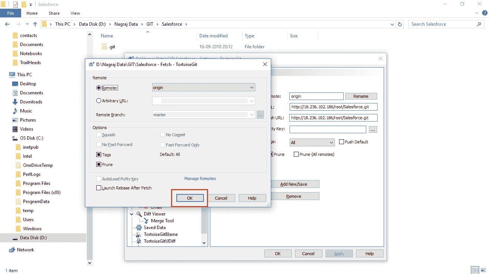
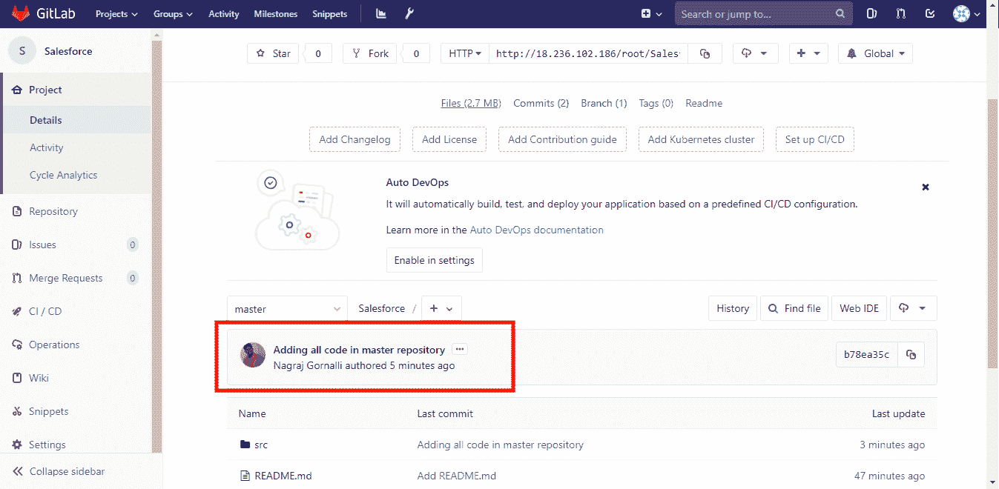

# 版本控制

在上一章中，我们学习了 Force.com 迁移工具。我们逐步讲解了如何在 Windows 和 Linux 机器上设置 Force.com 或 Ant 迁移工具，研究了从沙箱中提取元数据所需的文件，以及如何提供凭据来访问沙箱。我们还了解了在沙箱上部署元数据的过程，并讨论了 Force.com 如何帮助开发者和 DevOps 日常工作。

在本章中，我们将学习源代码版本控制系统及其类型。我们将主要关注 Git 分布式版本控制，以及在 Git 仓库上执行的操作，如提交、推送、合并等。我们还将逐步讲解如何搭建自己的 GitLab 服务器、添加仓库、添加用户以及创建分支。我们将讨论 Git 分支策略及保护分支的相关内容。最后，我们将学习如何在 Salesforce 项目中使用 Git，以及如何将 Salesforce 元数据保存到 Git 中。

# SCVS 是什么？

**源代码版本控制系统**（**SCVS**）顾名思义，它帮助管理源代码随时间的变化。有许多源代码版本控制系统可供选择，如 CVS、SVN、Git 等。版本控制维护每个文件变更的历史记录，并帮助开发者追踪应用程序中的变更。实施版本控制的主要原因是能够追踪应用程序中的变更，以及在出现问题时能够回滚。随着代码经历各种变化，版本控制帮助我们保持代码的可用版本，并且借助版本控制，我们还能维护不同的环境，如测试、预生产和生产环境。多个用户可以同时在同一应用程序源代码上进行工作。

版本控制有两种类型：集中式和分布式。在集中式版本控制中，有一个中央仓库，每个用户都获得自己的工作副本。如果有人提交更改到源代码控制系统，其他共同用户可以通过更新自己的工作副本来获取这些更改。Subversion 和 CVS 是集中式版本控制系统。

在分布式版本控制中，每个用户都拥有一个本地仓库和工作副本。用户所做的更改会在提交代码时保存到他们的本地仓库。其他用户可以在该用户将更改推送到远程仓库后获取这些更改。

# Salesforce 中的版本控制

Salesforce 在沙箱中跟踪变更的审计能力有限。在生产环境中进行更改是有风险的，而且我们无法查看文件版本或跟踪沙箱中的变更。

如果没有版本控制，回滚 Salesforce 中的代码是一个非常困难的任务。

为什么 Salesforce 不提供自己的版本控制？Salesforce 最初是为用户设计的，目的是让用户能够在云端运行应用程序，而无需深入理解代码。我们可以通过简单的点击构建小型应用程序，因此 Salesforce 并没有关注版本控制。 在 Salesforce 中，我们可以直接修改 Salesforce 组织，所以不需要在本地计算机上存储代码。

大多数在 Salesforce 工作的人认为，为 Salesforce 设置版本控制需要做很多工作，实际上只有在团队较大时才需要。要为 Salesforce 项目设置版本控制，开发人员和管理员需要学习如何使用版本控制系统，并且他们可能需要一些关于命令行指令的知识。但我们有许多 Git 的集成工具，不需要了解命令行指令，因为我们可以通过按钮或选项卡来操作。

正如我们在此提到的，Salesforce 不提供内置的版本控制功能，因此我们需要设置一个源代码版本控制系统。有很多版本控制系统，但最流行的版本控制系统是 Git。在接下来的部分中，我们将介绍 GitLab 的设置，并在 Salesforce 项目中使用 Git。

# Git 介绍

Git 是由 Linus Torvalds 发明的常用版本控制系统。它是一种分布式版本控制，允许多个开发者同时在同一个项目上工作。

它有助于维护源代码的版本，以便在出现问题时，您可以随时恢复到工作版本的源代码。要使用 Git，您需要一个可以存储源代码并使其对所有参与者可用的代码仓库。

Git 使用 GitHub 作为 Git 仓库的托管服务，因此，首先，您需要一个 GitHub 账户，以便能够创建一个仓库来存储您的源代码。Git 仓库有两种类型：

+   **公开仓库：**您可以免费在 GitHub 上托管公开仓库。这些仓库对所有人开放，因此，如果您打算将重要的源代码保存到 GitHub，您不应该将它保存在公开仓库中。

+   **私有仓库：**这些仓库是受保护的，除非您授予他人访问权限，否则任何人都无法访问它们。私有仓库需要付费。

我们已经介绍了 GitHub，但现在我们将使用 GitLab。GitLab 是一个功能齐全的开源 Git 服务器，您可以将其安装在自己的服务器上。GitLab 是一个数据库后台的 Web 应用程序，提供社区版和企业版两种版本。

让我们进入下一个主题，即设置我们自己的 GitLab 服务器。

# 在 Linux 实例上设置 GitLab 服务器

为了设置服务器，推荐使用全包安装。我们将在 Ubuntu 16.04 服务器上安装 GitLab 社区版。您也可以在其他操作系统上安装 GitLab，例如 Ubuntu、Centos、Debian 等；您可以在这里找到详细列表：[`about.gitlab.com/installation/`](https://about.gitlab.com/installation/)。全包安装是 GitLab 推荐的方法，因为设置过程简单，升级过程也非常顺利。

# 系统要求

GitLab 推荐使用以下配置的服务器：

+   2 核心

+   4 GB 内存

在安装 GitLab 社区版之前，安装所需的包：

```
$sudo apt-get update 
$sudo apt-get install ca-certificates curl openssh-server postfix 
```

对于 Postfix 安装，当系统提示时，选择“Internet Site”。在下一个屏幕中，输入您的服务器的域名或 IP 地址来配置将发送邮件的系统：


让我们继续 GitLab 服务器的安装。

# 安装 GitLab 服务器

我们已安装 GitLab 服务器所需的所有依赖项。运行以下命令以安装 GitLab：

```
$curl -LO https://packages.gitlab.com/install/repositories
/gitlab/gitlab-ce/script.deb.sh
% Total    % Received % Xferd  Average Speed   Time    Time     Time  Current Dload  Upload   Total   Spent    Left  Speed
100  5933    0  5933    0     0  23796      0 --:--:-- --:--:-- --:--:-- 23827  
```

您可以检查 `script.deb.sh` 并查看所有将要安装的包及其配置，因为您需要了解在服务器上安装了哪些内容。一旦您验证了 `script.deb.sh`，就可以继续安装的下一步：

```
$ sudo bash script.deb.sh 
Detected operating system as Ubuntu/xenial.
Checking for curl...
Detected curl...
Checking for gpg...
Detected gpg...
Running apt-get update... done.
Installing apt-transport-https... done.
Installing /etc/apt/sources.list.d/gitlab_gitlab-ce.list...done.
Importing packagecloud gpg key... done.
Running apt-get update... done.
```

仓库已设置完毕！您现在可以安装包了。

这个脚本将设置我们的服务器以使用 GitLab 维护的仓库。在完成此脚本之后，我们将使用 `apt` 安装实际的 GitLab 应用程序：

```
$sudo apt-get install gitlab-ce
```

这将安装系统所需的组件，GitLab 配置文件路径为 `/etc/gitlab/gitlab.rb`。您可以编辑配置文件并重新配置 GitLab 服务器：

```
$sudo gitlab-ctl reconfigure
```

安装完成后，访问您的 GitLab 外部 URL，并为 root 用户设置密码：


以 root 用户登录，您将看到 GitLab 的欢迎页面，如下图所示：


现在您已经成功设置了 GitLab，让我们开始使用它并创建您的第一个仓库。

# 在 GitLab 中创建您的第一个项目

登录到您的 GitLab 服务器，按照步骤创建您的第一个项目仓库：

1.  选择“创建项目”以在 GitLab 服务器上创建项目。在项目中，我们将存储所有与应用程序相关的代码、配置和其他信息。

1.  提供项目名称和描述。目前，我们将创建一个示例的 Hello World node 应用程序。我们的项目名称是 `Sample`*。*

1.  接下来，设置您的项目的可见性级别；它可以是公开的、内部的或私有的。

1.  公共仓库可以被任何人克隆；任何已登录的用户都可以克隆内部项目仓库。要克隆私有项目，用户需要明确的访问权限。

1.  目前我们将保持公开，并勾选“初始化仓库并附加 README 以快速开始”。

1.  点击“创建项目”：


1.  克隆项目 URL：


1.  如果你的计算机上已经安装了 Git 命令，运行以下命令将仓库克隆到本地计算机：

```
$git clone http://35.155.183.87/root/Sample.git
Cloning into 'Sample'...
remote: Enumerating objects: 3, done.
remote: Counting objects: 100% (3/3), done.
remote: Total 3 (delta 0), reused 0 (delta 0)
Unpacking objects: 100% (3/3), done.  
```

你会看到 `Readme.md` 文件已经在 `Sample` 项目中创建好了。你可以开始使用你的 Git 仓库了：

# 使用 Git 仓库

我们已经将 Sample 仓库克隆到本地计算机。现在我们将了解如何使用 Git 仓库：

1.  创建一个 Node.js Hello World 应用程序，该应用程序将创建一个 HTTP 服务器，并在 `8080` 端口上响应所有请求，返回字符串 `Hello World`。下面是 Node.js 应用程序的示例代码：

```
var http = require("http"); 

http.createServer(function (request, response) { 

   // Send the HTTP header  
   // HTTP Status 200 OK 
   // Content Type is text/plain 
   response.writeHead(200, {'Content-Type': 'text/plain'}); 

   // Send response body as "Hello World" 
   response.end('Hello World\n'); 
}).listen(8080); 

// Print message 
console.log('Server running at http://127.0.0.1:8080/'); 
```

1.  将代码保存在 `**main.js**` 中，并将此文件添加到我们的 Git 仓库中。

1.  使用以下命令检查我们 Git 仓库中的未跟踪更改：

```
$git status 
On branch master 
Your branch is up to date with 'origin/master'. 
Untracked files: 
  (use "git add <file>..." to include in what will be committed) 
   main.js 
nothing added to commit but untracked files present (use "git add" to track)
```

1.  默认情况下，GitLab 将 **master** 分支设置为我们的默认分支。新添加的 `main.js` 文件在远程仓库中不存在，它在本地 Git 中也没有被跟踪。

1.  Git 工作目录中的每个文件都可以是 **跟踪**、**未跟踪** 或 **忽略** 文件。已经提交或暂存过的文件是跟踪文件。没有暂存或提交的文件是未跟踪文件。你不想添加到仓库中的文件，例如包含凭据或机器生成的文件，会在 `.gitignore` 文件中提到。

1.  一个 `.gitignore` 文件的示例，用于忽略所有 `.log` 扩展名的文件如下所示：

```
.gitignore 
# ignore all logs 
*.log 
```

1.  让我们将 `main.js` 文件添加到本地仓库中；首先需要将其索引。`git add` 命令会使用工作目录中的内容更新索引。这些更改将被暂存以备提交。你可以使用 `*` 或 `-a` 选项将所有更改添加到索引中：

```
$git add . 
$ git status 
On branch master 
Your branch is up to date with 'origin/master'. 
Changes to be committed: 
  (use "git reset HEAD <file>..." to unstage) 
          new file:   main.js 
```

1.  下一步是将暂存的更改提交到本地仓库：

```
$git commit -m "Add main.js file" 
[master 9d8892d] Add main.js file 
 1 file changed, 15 insertions(+) 
 create mode 100644 main.js 
```

`commit` 命令用于提交本地仓库中的更改。其他开发人员将无法看到这些更改。提交更改时，重要的是使用 `-m` 选项提供提交信息。确保你的提交信息与代码中的更改相关，以便其他使用它的人能够理解你的更改。

如果你没有指定文件名，它将提交你在代码中所做的所有最近更改。

最后的步骤是将本地更改推送到远程仓库；推送操作是指将更改推送到远程仓库。在推送更改时，重要的是要提到更改的来源：

```
$ git push origin master 
Username for 'http://35.155.183.87': priyanka 
Password for 'http://priyanka@35.155.183.87':  
Counting objects: 3, done. 
Delta compression using up to 4 threads. 
Compressing objects: 100% (3/3), done. 
Writing objects: 100% (3/3), 547 bytes | 547.00 KiB/s, done. 
Total 3 (delta 0), reused 0 (delta 0) 
To http://35.155.183.87/priyanka/Sample.git 
   aad9bc9..9d8892d  master -> master 
```

Git 会要求你提供凭据以验证用户身份，并将更改推送到托管在 GitLab 服务器上的远程仓库。现在，你将能够在 GitLab 的网页 URL 上查看这些更改。

它将是这样的：


# 查看提交历史

您可以通过命令行查看日志，切换到 Git 仓库并运行 `git log` 命令，如下所示，以查看最近的提交。此命令没有任何附加参数时，会按逆序显示仓库中的提交。命令输出还包含信息，如 SHA-1 校验和、提交消息、提交的日期和时间，以及作者的详细信息：

```
$git log 
commit 9d8892da192fffb93a9a8a58fdf700632dabee3c (HEAD -> master, origin/master, origin/HEAD) 
Author: Priyanka Dive <user@example.com> 
Date:   Mon Aug 27 00:56:39 2018 +0530 

    Add main.js file 

commit aad9bc971f4e69242e550f9e1771e23c1785b5e2 
Author: priyanka <user@example.com> 
Date:   Sun Aug 26 18:47:08 2018 +0000 

    Initial commit 
```

您可以查看带有时间戳和用户详细信息的 Git 提交消息，如下所示：


# 向 GitLab 添加用户

添加用户的步骤如下：

1.  使用管理员用户（root）登录 GitLab。

1.  点击扳手图标（右上角）进入管理员区域：


1.  您将看到三个按钮：新项目、新用户和新组。点击“New user”：


1.  填写所需的信息——名称、用户名和电子邮件：


1.  根据您所在组织的规则提供项目用户限制。同时，如果您希望用户能够创建组，请勾选“Can create group”以授予其创建组的权限。如果您希望用户的访问权限有限，则选择“Access level”为 Regular；如果用户需要管理员权限，则选择“Access level”为 Admin：


1.  填写完所有必填信息后，点击“Create user”。这将创建用户并将密码重置链接发送到该用户的电子邮件。

# 故障排除

请考虑以下错误：

```
There was an error running gitlab-ctl reconfigure: 
execute[/opt/gitlab/embedded/bin/initdb -D /var/opt/gitlab/postgresql/data -E UTF8] (postgresql::enable line 80) had an error: Mixlib::ShellOut::ShellCommandFailed: Expected process to exit with [0], but received '1' 
---- Begin output of /opt/gitlab/embedded/bin/initdb -D /var/opt/gitlab/postgresql/data -E UTF8 ---- 
STDOUT: The files belonging to this database system will be owned by user "gitlab-psql". 
This user must also own the server process. 
STDERR: initdb: invalid locale settings; check LANG and LC_* environment variables 
---- End output of /opt/gitlab/embedded/bin/initdb -D /var/opt/gitlab/postgresql/data -E UTF8 ---- 
Ran /opt/gitlab/embedded/bin/initdb -D /var/opt/gitlab/postgresql/data -E UTF8 returned 1 
```

# 解决方案

这个问题可能是由于 Linux 系统中未设置 `LANG` 和 `LC_*` 变量导致的。在 omnibus 安装中，我们可以使用以下命令设置这些变量，并重新运行安装命令或重新配置 GitLab：

```
$export LC_ALL="en_US.UTF-8" 
$export LC_CTYPE="en_US.UTF-8" 
```

# 分支策略

分支是 Git 提供的一个非常有用的功能。它有助于并行开发多个功能。分支可以用于定义特定环境的代码，例如 develop、test、stage 和 production。通常，Git 分支与环境的映射关系为：例如，将开发环境的代码存储在 develop Git 分支中；测试环境使用 test Git 分支，以此类推。对于生产环境，我们使用 master 分支，因为它是创建任何 Git 仓库时默认创建的第一个分支。

让我们看看如何使用网页 UI 创建分支：

1.  登录 GitLab。

1.  转到我们在“*创建你的第一个 GitLab 项目*”部分创建的仓库 Sample*，*：


1.  如您在此截图中所见，我们只有一个分支，即 master，它是默认分支。

1.  点击“Branch”，您将被重定向到一个页面，您可以在该页面查看此仓库的所有活跃分支。目前，我们有一个 master 分支：


1.  点击新建分支，输入分支名称`develop`。我们将使用这个分支进行开发：


1.  点击创建分支。就这样，你可以看到从主分支创建的新分支。现在你可以从开发分支或主分支创建另一个分支。由于开发分支是从主分支创建的，因此目前开发分支中的所有代码都与主分支相同：


1.  现在，如果我们查看活动分支，我们可以在列表中看到两个分支。它们之间有所不同。主分支是默认分支和**受保护**分支，而新创建的开发分支不是受保护分支。只有被授权的用户才能在受保护的分支上进行修改，通常是高级开发人员或项目负责人。由于这个原因，我们可以避免多个开发人员同时在不同功能上进行工作的情况。

# 使用 Git CLI 处理分支

在 Git 克隆之后，默认情况下，你将获得仓库中设置的默认分支的代码。在我们的例子中，它是主分支。让我们通过以下命令检查我们克隆了哪个分支：

```
$git branch 
* master 
```

分支名称前的星号表示当前分支。

让我们创建一个**test**分支：

```
$git branch test
```

这将创建一个名为`test`的新分支，在你的本地 Git 仓库中：

```
    $git branch
    * master
      test

```

现在你将在本地 Git 仓库中看到两个分支，`git branch <BRANCH_NAME>`命令将从当前分支创建一个新分支。因此，测试分支是从主分支创建的。

切换到新创建的`test`分支并将其`push`到`remote`仓库：

```
    $git checkout test
    Switched to branch 'test'

    $git push origin test
    Username for 'http://54.202.196.64': root
    Password for 'http://root@54.202.196.64': 
    Total 0 (delta 0), reused 0 (delta 0)
    remote: 
    remote: To create a merge request for test, visit:
    remote:   http://54.202.196.64/root/Sample/merge_requests/new?merge_request%5Bsource_branch%5D=test
    remote: 
    To http://54.202.196.64/root/Sample.git
     * [new branch]      test -> test

```

验证是否能在 GitLab 网页 UI 中看到测试分支：


# 将更改从开发分支合并到主分支

让我们来看一下如何将更改从开发分支合并到主分支：

1.  你可以指定从 Git 仓库克隆哪个分支：

```
$git clone http://54.202.196.64/root/Sample.git -b develop
Cloning into 'Sample'...
remote: Enumerating objects: 6, done.
remote: Counting objects: 100% (6/6), done.
remote: Compressing objects: 100% (4/4), done.
remote: Total 6 (delta 0), reused 0 (delta 0)
Unpacking objects: 100% (6/6), done.  
```

1.  为了测试，我们将做一个小修改，比如将控制台日志消息从`Hello World`改为`Hello Git`。将更改添加到 Git 并将更改推送到远程开发分支：

```
$git add main.js
$git commit -m "Test merge request"
$git push origin develop
Counting objects: 3, done.
Delta compression using up to 4 threads.
Compressing objects: 100% (3/3), done.
Writing objects: 100% (3/3), 321 bytes | 321.00 KiB/s, done.
Total 3 (delta 1), reused 0 (delta 0)
remote: 
remote: To create a merge request for develop, visit:
remote: http://54.202.196.64/root/Sample/merge_requests/new?merge_request%5Bsource_branch%5D=develop
remote: 
To http://54.202.196.64/root/Sample.git
44fd847..a93bd41  develop -> develop
```

1.  如果你想创建合并请求，打开显示在`remote`的 URL。

1.  将其分配给有权接受主分支合并请求的人：


1.  在我们的例子中，分配给了管理员。填写所需的信息并点击提交合并请求。

1.  管理员用户可以看到合并请求，经过开发人员验证更改后，如果没有合并冲突且所有之前的检查都成功通过，那么管理员将通过点击合并来接受合并请求。测试中的更改将被移动到主分支：


管理员可以修改提交信息，并在不需要时删除源分支。如果发生错误，管理员也可以还原更改：


# 在 Eclipse IDE 中使用 Git

步骤 1 至 3 已在第一章中解释，*Salesforce 开发与交付流程*：

1.  Eclipse 安装

1.  安装 Force.com IDE 插件

1.  在 Eclipse 中配置 Force.com 项目

我们将在接下来的部分继续进行下一步操作。

# 配置 Git 并推送代码到 Git

现在我们需要配置 Git。

1.  右键点击文件夹并选择“在此创建 Git 仓库...”以在新文件夹中创建仓库：


1.  在这里，我们没有选择“Make it Bare”，点击确认：


1.  你将看到下一个屏幕。点击确认：


1.  右键点击文件夹，选择 TortoiseGit 并点击设置：


1.  你将看到下一个屏幕。点击确认：


1.  选择 Git 并输入名称和电子邮件：


1.  你将看到下一个屏幕。选择 Git 并点击“远程”：


1.  打开浏览器中的 Git 项目并选择该项目。

1.  从项目中复制 HTTP URL：


1.  在 URL 和 Push URL 中输入复制的 URL。选择标签字段中的全部，然后点击“添加新标签/保存”按钮：


1.  点击是按钮：


1.  你将看到此屏幕，点击确认：



1.  在此屏幕中输入 Git 凭证：


1.  点击确认：


1.  完成过程后，点击关闭按钮：


1.  最后，点击确认：


现在，你需要从 Git 仓库拉取文件，步骤如下：

1.  右键点击相同的文件并选择 TortoiseGit，点击拉取...：


1.  你会看到一个弹出窗口，如图所示。选择“...”以选择远程分支：


1.  在这里，你可以看到所有远程分支的列表，选择特定的分支并点击确认：


1.  安装完成后，点击关闭：


1.  现在，连接已经创建，所有文件已从 Git 仓库复制到本地文件夹。

1.  将你的文件添加到此文件夹：


1.  右键单击相同的文件夹，选择 TortoiseGit 并点击 Add...：


1.  选择所有文件并点击 OK：


1.  一旦过程完成，点击 Commit...：


1.  现在添加提交信息并点击 Commit & Push：


1.  要查看所有远程分支，点击 ... 按钮：


1.  这里你可以看到所有的分支，选择特定的分支：


1.  现在点击 OK：


1.  一旦过程完成，点击 Close：


1.  现在所有文件都已移动到 Git 仓库。检查 Git 仓库：



1.  检查所有文件是否已正确提交：


所有代码已成功提交到 Git 仓库。

# 总结

在本章节中，我们学习了版本控制系统。我们了解了 Salesforce 中的版本控制以及为什么我们需要像 Git 这样的版本控制系统。我们学习了如何使用 GitLab 官方推荐的方式——全套安装方法，在本地服务器上安装 GitLab。设置好自己的 GitLab 服务器后，我们学会了如何通过 Web UI 在 GitLab 中创建我们的第一个项目。我们使用 Git 命令（如 `git clone`、`add`、`commit`、`push` 等）操作 Git 仓库。

我们讨论了 Git 中的分支策略以及在一般场景中如何处理不同的分支。我们了解了受保护分支和默认分支等概念，还知道了如何从现有分支创建新分支，并将代码从一个分支合并到另一个分支。最后，我们学会了如何在 Eclipse 中使用 Git 进行 Salesforce 项目的开发。

在下一章节中，我们将进入下一阶段，即使用 Jenkins 服务器进行持续集成。我们将学习 Jenkins 如何帮助我们自动化日常任务，例如使用 Force.com 迁移工具和 Git 检索和部署元数据。
