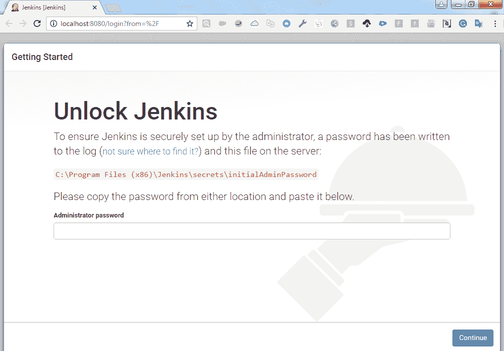

# 第六章：持续集成

在上一章中，我们了解了版本控制系统在项目中的重要性，以及如何在我们的 Salesforce 项目中实现版本控制。我们查看了如何设置自己的 GitLab 服务器，并将 Salesforce 组织中的元数据推送到 Git 仓库的说明。按照步骤在开发者机器上安装 Git 并与 Salesforce 沙盒同步后，开发人员将能够在 Git 仓库中进行并保存他们的更改。

在本章中，我们将学习如何通过 Git 集成与 Jenkins 自动备份和部署 Salesforce 元数据。我们将讨论 Jenkins，并查看如何在 Salesforce 中通过 Jenkins 和 Ant Migration Tool 实现持续集成。我们将查看如何配置 Ant Migration Tool 与 Jenkins 配合使用，以及如何配置 Jenkins 作业从沙盒中获取元数据。我们将提供逐步的说明，介绍如何使用 Jenkins 将更改部署到 UAT 或测试环境。

在本章中，我们将涵盖以下主题：

+   什么是 Jenkins？

+   安装 Jenkins

+   配置 Ant Migration Tool 与 Jenkins 配合使用

+   提供沙盒凭证给 Jenkins

+   配置 Jenkins 作业以从沙盒中获取元数据

+   配置 Jenkins 作业以在沙盒上部署元数据

# 什么是 Jenkins？

Jenkins 是一个用 Java 编写的持续集成服务器。Jenkins 是一个开源自动化服务器，你可以轻松地在你的机器上安装它。Jenkins 可以安装在 Windows、macOS 和 Linux 机器上。Jenkins 配置简单，并且有很多插件来支持持续集成和部署。如果你有使用容器的经验，可以使用 Docker 从注册表中获取 Docker 镜像来安装 Jenkins。

# 使用 Jenkins 的 CI

持续集成是指开发人员将他们的代码推送到共享的代码库，并通过定期构建进行测试，这样他们可以逐步发现代码中的问题。

有几种工具可以用于实现持续集成。

通过持续集成，你可以轻松地追溯代码出现问题的地方。如果你不遵循持续集成，那么在生产阶段发现代码错误将变得更加困难和昂贵。

以下是 CI 工具的列表：

+   Jenkins

+   TeamCity

+   Travis CI

+   Go CD

+   Bamboo

在本章中，我们将使用 Jenkins 实现持续集成。

Jenkins 是一个开源的跨平台 CI 工具。Jenkins 可以添加插件，这使得它非常灵活且易于集成。你可以通过 UI 或命令来配置 CI。

# 安装 Jenkins 服务器

让我们从 Windows 服务器上的 Jenkins 安装开始。Linux 服务器的安装过程已在第二章，*将 DevOps 应用到 Salesforce 应用程序*中介绍过。这里我们将介绍 Windows 机器上的 Jenkins 安装，以便 Windows 用户了解安装步骤。

以下是 Jenkins 服务器安装的硬件和软件要求。

硬件要求如下：

+   256 MB 的内存

+   1 GB 的硬盘空间

软件要求如下：

+   Java 8

+   一个网页浏览器：Jenkins 支持大多数流行的网页浏览器，如 Google Chrome、Mozilla Firefox、Microsoft Internet Explorer 以及最新版本的 Apple Safari。

访问以下网站下载最新的 Jenkins 服务器包适用于 Windows：[`mirrors.jenkins.io/windows/latest`](http://mirrors.jenkins.io/windows/latest)。你将获得最新版本的 Jenkins 包的 ZIP 文件。

下载完成后，解压 ZIP 文件并通过双击 `jenkins.msi` 文件启动安装。按照 Jenkins 安装向导完成 Jenkins 服务器安装。选择 Jenkins 服务器的安装路径并点击“下一步”：


在下一屏幕上，点击“安装”以继续安装：


Jenkins 安装完成后，你需要配置 Jenkins 服务器。如果是在本地机器上进行测试安装，请访问 `http://<Server-IP-address>:8080`。你也可以通过访问 [`http://localhost:8080`](http://localhost:8080) 来访问 Jenkins 服务器。如果看到“请稍等，Jenkins 正在准备工作...”的信息，你需要等待一段时间：



要解锁 Jenkins 服务器，你需要提供默认的 Jenkins 密码，密码存储在以下位置：`C:\Program Files (x86)\Jenkins\secrets\initialAdminPassword`。对于 Linux 系统，路径会有所不同。

在下一屏幕上，我们可以选择要安装的插件。点击“选择要安装的插件”：


我们只选择 Ant 插件和 Git 插件，因为在基本配置完成后可以安装其他插件：


这是下一页：


插件安装完成后，在“创建第一个管理员用户”中提供用户名、密码、全名和电子邮件地址：


点击“保存并完成”以完成 Jenkins 配置。

# 配置 Ant 迁移工具与 Jenkins

为了与 Salesforce 通信，我们需要在 Jenkins 服务器上安装 Ant 迁移工具。我们已经在第四章，*Force.com 迁移工具介绍*中涵盖了 Ant 迁移工具的安装步骤。在 Jenkins 服务器上安装 Ant 迁移工具并在 Jenkins 中配置路径。一旦在 Jenkins 中安装了 Ant 插件，您将能在“添加构建步骤”下拉菜单中看到“调用 Ant”选项，它将运行 `build.xml` 并执行脚本中提到的任务：


当开发者触发 Jenkins 作业时，我们将选择调用 Ant 来检索 Salesforce 元数据。构建成功后，元数据将保存在目录中，并触发 Jenkins 作业将元数据从 Jenkins 推送到 GitLab 仓库。验证 GitLab 仓库中的元数据。

现在，我们将在 Jenkins 中设置全局凭据。

转到“管理 Jenkins”并选择“全局工具配置”。在您的机器上，可执行文件可能不同。转到 Git 部分并提供 Git 可执行文件的路径，如下图所示：


# 配置一个 Jenkins 作业以从沙盒检索元数据

我们已经在第五章，*版本控制*中创建了一个包含来自 Salesforce 生产组织的元数据的 Git 仓库。我们将使用相同的示例项目和 GitLab 仓库 `Salesforce_demo`，以及来自 Salesforce 沙盒的当前生产代码。操作步骤如下：

1.  创建一个分支以从沙盒检索代码：

```
Branch : sandbox_to_git 
```

1.  登录 Jenkins 服务器并点击“新建项目”以创建 Jenkins 作业：


1.  将 Jenkins 作业命名为 `Retrive_sandbox_to_git`。由于我们正在处理一个 Ant 构建项目，选择“构建自由风格项目”。点击确定。自由风格项目类型用于创建一个可以使用任何构建系统的 Jenkins 项目：


1.  配置作业。创建作业后，我们将进入作业配置页面。在“常规”选项卡中，提供项目名称和描述，如下所示：

    +   项目名称：`Retrive_sandbox_to_git`。

    +   描述：用于从沙盒检索元数据并推送到 Git 的作业。

    +   源代码管理：保持为“无”，因为我们不需要在此作业中使用 SCM。

    +   构建触发器：不要选择任何触发器。

    +   构建环境：如果可用，选择“添加时间戳到控制台输出”：


1.  从“添加构建步骤”下拉菜单中选择调用 Ant，并提供 `build.xml` 的路径，以将元数据从沙盒检索到 Jenkins 工作区：


1.  配置构建：

    1.  目标：保持目标为空。在此，你可以指定一个你想运行的目标列表。如果我们将其保持为空，构建脚本中指定的目标将会执行。

    1.  构建文件：`build.xml` 文件的位置在 `<JENKINS_WORKSPACE>/<ITEM-NAME>`。你可以在此指定构建文件；默认情况下，Ant 会使用根目录中的 `build.xml` 文件。工作空间根目录的位置是：`<JENKINS_WORKSPACE>/$ITEM_NAME`。示例：在工作空间 `<JENKINS_WORKSPACE>/Retrive_SandBox_to_Git` 中构建。

    1.  Java 选项：`<-Xmn1024m>` 提供 Java 内存限制，因为如果内存不足，任务会抛出错误。

示例 `build.xml` 如下所示：

```
<project name="Force.com Migration Tool" default="retrieveUnpackaged" basedir="." > 
<taskdef uri="antlib:com.Salesforce" 
       resource="com/Salesforce/antlib.xml" 
       classpath="lib/ant-Salesforce.jar" 
   /> 
   <property file="build.properties"/> 
       <property environment="env"/> 
       <property name="sf.username" value="${env.SF_USERNAME}"/> 
       <property name="sf.password" value="${env.SF_PASSWORD}"/> 
       <property name="sf.token" value="${env.SF_TOKEN}"/> 
       <property name="sf.serverurl" value="${env.SF_SERVERURL}"/> 
             <target name="retrieveUnpackaged"> 
                     <sf:retrieve 
                       username="${sf.username}" 
                       password="${sf.password}${sf.token}" 
                       serverurl="${sf.serverurl}" 
                       retrieveTarget="DevOps/src" 
                       unpackaged="${basedir}/package.xml" 
               /> 
       </target> 
</project> 
```

这将从你的组织中检索一组未打包的元数据。在 `retrieveTarget` 中，指定元数据将存储的路径：


1.  在构建后操作中，我们将执行一个 Shell 脚本，将代码推送到 `sandbox_to_git` 分支：

    +   触发任务 `Retrive_SandBox_to_Git2`。它将推送 `DevOps/src` 中由 `Build.xml` 脚本检索到的所有代码。

    +   以下是一些推送代码到 Git 仓库的示例命令：

```
    $git add.
    $git commit -m "Retrieve metadata from sandbox"
    $git remote add origin <remote-repository-URL>
    $git push -u origin sandbox_to_git

```

1.  测试任务：确保 Jenkins 中的项目已*启用*。从项目列表中选择它，然后点击立即构建。

    1.  检查控制台输出。构建完成后，点击 “构建详情”，你也可以查看控制台输出，检查构建脚本中是否有错误：


1.  在 Jenkins 控制台查看控制台输出。如果构建成功，则会显示以下消息：BUILD SUCCESSFUL：


1.  验证 Git 分支 `sandbox_to_git` 中更新的代码。

# 再次触发相同的任务

要再次执行相同的 Jenkins 任务，请按照以下步骤操作：

1.  登录 Jenkins。

1.  选择你想运行的任务。

1.  点击立即构建。

1.  检查状态/控制台输出。

# 配置 Jenkins 任务以将元数据部署到沙盒

我们已在 Eclipse 中安装了 Force.com IDE 和 Git。开发者沙盒与 Eclipse 同步。开发者使用 Eclipse 和 Force.com IDE，沙盒将与 Eclipse 工作区同步。修改完成后，开发者将代码推送到 Git 分支，并在 `package.xml` 中提及部署组件。这个 Git 推送将触发 Jenkins 任务，执行 Ant 部署脚本，将开发者沙盒中的更改部署到测试沙盒：


使用的工具有：

+   **Git**：用于跟踪 Salesforce 更改在 Git 中的记录

+   **Force.com Migration Tool**：用于 Salesforce 部署

+   **Jenkins**：使用 Jenkins 和 Ant 脚本自动化部署到预 UAT 环境

配置步骤如下：

1.  创建一个 Jenkins 任务以将代码部署到沙盒。登录 Jenkins 服务器并点击新建项来创建 Jenkins 任务：


1.  配置源代码管理。复制你 Git 项目的项目 URL，并将其粘贴到仓库 URL 中。


1.  在 Jenkins 凭证中添加 Git 访问凭证。添加你的用户名和密码，并选择以下凭证：


1.  配置你希望构建的 Git 凭证和分支：


1.  选择构建并选择调用 Ant。配置构建文件和 `build.properties` 文件：


1.  开发者希望部署的组件将会在 `package.xml` 中列出，并在 Ant 任务中部署。部署任务的示例 `Build.xml` 如下：

```
<target name="deployCode">             
    <!-- Deploy Code From src to SandBox --> 
        <sf:deploy 
            username="${sf.username}" 
            password="${sf.password}${sf.token}" 
            serverurl="${sf.serverurl}" 
            deployroot="src" 
                        runAllTests="false" 
        /> 
</target> 
```

1.  一旦开发者将代码推送到相应的 Git 分支，Jenkins 任务将被触发，新代码将被部署到目标沙箱中。这个沙箱可以是 UAT 沙箱或生产环境。你可以使用同一个任务来处理不同的场景。

# 总结

在本章中，我们学习了如何自动化备份 Salesforce 元数据，并使用 Jenkins 将代码推送到 Git 仓库。通过 GitLab 和 Jenkins 任务，可以跟踪 Salesforce 中的变化。我们解释了如何配置 Ant 迁移工具与 Jenkins 配合使用，以及从沙箱到 Jenkins 服务器的代码提取流程，并使用备份脚本将其推送到 Git 分支。

我们学习了如何搭建自己的 Jenkins 服务器，并配置它从 Salesforce 沙箱中检索元数据。同时，我们还配置了一个 Jenkins 任务，将元数据从一个沙箱部署到另一个沙箱。关于部署任务，我们讨论了可以使用的工具，并通过图示解释了 UAT 或测试环境的部署流程。

在下一章中，我们将学习 Salesforce 中的持续测试和代码覆盖率。我们将讨论如何使用 Selenium 和 Qualitia 在 Salesforce 上进行测试的步骤。我们还将学习如何使用 Jenkins 自动化持续测试的过程。
