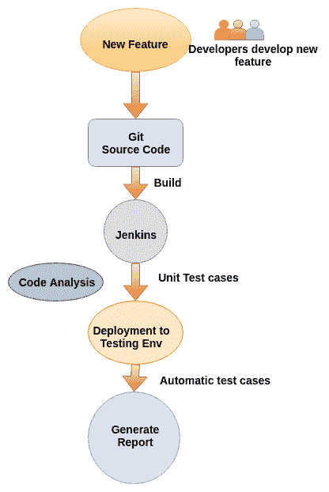

# 第七章：持续测试

在上一章中，我们学习了如何设置自己的 Jenkins 服务器并使用 Jenkins 进行持续集成，如何配置 Jenkins 从 Salesforce 沙盒中检索元数据，以及如何将代码推送到 Git 版本控制系统。我们还进行了将元数据部署到 UAT 沙盒的步骤，使用 Jenkins 和 Ant 迁移工具。

本章我们将学习使用 PMD 进行代码质量分析。我们将讨论在使用 Jenkins 进行部署时的持续测试和执行 Apex 测试。我们还将了解 Selenium，并学习如何使用 Firefox 设置 Selenium。我们还将介绍 Salesforce 示例应用程序的录制和回放。我们将讨论如何在 Jenkins 中使用 Qualitia 无脚本自动化工具，在其中我们可以获得 HTML 格式的测试报告。

# 什么是代码质量？

**代码质量**是基于一些参数识别的，例如最佳实践标准和规则集。当代码质量提高时，用户接受度测试问题和生产问题减少，生产力提高。通过使用由开源静态源代码分析器生成的 PMD 报告，我们可以分配更多时间来审查代码，从而提高产品质量，同时遵循最佳实践标准和有效的治理。

# 使用 PMD 报告检查代码质量

执行分析有两种方法。我们将在接下来的章节中讨论它们。

# 使用 Visual Studio (VS) Code 扩展进行 Salesforce Apex 的 PMD 静态分析

在这里，我们将学习如何直接在 VS Code 上分析 Apex 和 Visual force 文件。首先，你需要在你的机器上安装 Visual Studio Code。（我们已经在第三章中学习了如何安装 VS Code，*Salesforce 部署*）。

你需要执行以下步骤：

1.  打开 Visual Studio Code 并点击扩展 (*Ctrl* + *Shift* + *X*)：


1.  在市场扩展中的搜索框输入 `pmd`：


1.  选择 Apex PMD 并点击安装：


1.  安装完成后，点击重新加载，这将重启你的 VS Code：


1.  打开你想分析的文件，以查看 PMD 报告：


1.  现在，通过右键单击并选择**所有命令**，或者按 *Ctrl* + *Shift* + *P* 打开命令面板。在命令面板中输入 Apex `stat`：


1.  现在，点击 Apex 静态分析：在文件上。它将在 PROBLEMS 中显示所有分析结果。

1.  解决所有问题后，再次运行 Apex 静态分析：在文件上。

# 使用命令行进行 Salesforce Apex 的 PMD 静态分析

在这里，我们可以通过单个命令对所有文件执行 PMD 分析。步骤如下：

1.  首先，从[`sourceforge.net/projects/pmd/files/pmd-eclipse/update-site/`](https://sourceforge.net/projects/pmd/files/pmd-eclipse/update-site/)下载 PMD JAR 文件，然后查看此截图：


1.  解压 JAR 文件，进入 bin 文件夹，复制该文件夹的路径。

1.  现在，按下 Windows + *R* 打开 **运行**，然后输入命令以打开命令行面板。

1.  进入你的 bin 路径，方法是输入该文件夹的路径。如果你在另一个驱动器上，首先进入该驱动器并输入复制的路径：


1.  现在，创建你的命令：

```
pmd -d "Source Path" -R apex-ruleset -language Apex -f CSV > "Destination Ptah\ReportName.csv" //Source Path: Your Project Directory Path till src.
//Destination Path: Report Folder Path where you want to store the report.
```

1.  然后，执行此命令：


1.  你将获得一个导出的 CSV 文件：


1.  现在，打开那个 CSV 文件，并根据错误类型修改你的代码。

在 CSV 文件中，我们获取以下列：

+   **问题**：这是问题的序列号

+   **包**：在此列中，我们获取该文件的包名称

+   **文件**：在此列中，我们获取该文件的准确文件路径

+   **优先级**：有不同类型的优先级，从 1 到 3，它们被添加到此列中

+   **行**：在此列中，我们获取问题的准确行号

+   **描述**：在此列中，我们获取问题的单行描述

+   **规则集**：在此列中，我们获取规则集的名称

+   **规则**：在此列中，我们获取规则的名称

规则和规则集有不同的类型。以下是一些规则和规则集的示例：

+   最佳实践：

    +   `ApexUnitTestClassShouldHaveAsserts`

    +   `AvoidGlobalModifier`

    +   `AvoidLogicInTrigger`

+   代码风格：

    +   `ClassNamingConventions`

    +   `ForLoopsMustUseBraces`

    +   `IfElseStmtsMustUseBraces`

    +   `IfStmtsMustUseBraces`

    +   `MethodNamingConventions`

    +   `VariableNamingConventions`

+   设计：

    +   `AvoidDeeplyNestedIfStmts`

    +   `CyclomaticComplexity`

    +   `ExcessiveClassLength`

    +   `ExcessiveParameterList`

    +   `ExcessivePublicCount`

    +   `NcssMethodCount`

    +   `StdCyclomaticComplexity`

    +   `TooManyFields`

+   易出错：

    +   `AvoidHardcodingId`

    +   `EmptyCatchBlock`

    +   `EmptyStatementBlock`

+   性能：

    +   `AvoidSoqlInLoops`

+   安全：

    +   `ApexCRUDViolation`

    +   `ApexSharingViolations`

    +   `ApexSOQLInjection`

    +   `ApexXSSFromURLParam`

# 使用 Jenkins 在部署中执行 Apex 测试

在 Salesforce 代码中，Apex 组件的覆盖率应该超过 75%，才能将变更部署到生产环境。如果在部署过程中任何测试用例失败，则部署到生产环境也会失败。为了避免这种情况，建议先在沙盒环境中测试部署，再将其部署到生产环境。有时，Apex 组件的单个代码覆盖率可能低于 75%，但组织的整体代码覆盖率应该为 75%或更高。为了确保在生产环境中测试用例不失败，可以在沙盒环境中执行一部分测试用例。我们已经在上一章中看到从一个沙盒部署变更到另一个沙盒。我们只需要在`build.xml`中做少量更改，以指定在部署时要执行的测试子集。

下面是一个带有要执行的测试用例的`build.xml`示例：

```
<target name="deployCode"> 
    <sf:deploy username="${sf.username}" password="${sf.password}" 
           sessionId="${sf.sessionId}" serverurl="${sf.serverurl}" 
           deployroot="codepkg" testLevel="RunSpecifiedTests"> 
        <runTest>TestClassSample1</runTest> 
        <runTest>TestClassSample2</runTest> 
        <runTest>TestClassSample3</runTest> 
    </sf:deploy> 
</target> 
```

要运行特定的测试，应该将`testLevel`参数的值设置为`RunSpecifiedTests`。一个子元素`</runTest>`用于指定要运行的测试类。

要从`sf:deploy`任务中运行所有测试用例，并且带有`runAllTests="true"`属性，`package.xml`应该为空，如下所示：

```
<?xml version="1.0" encoding="UTF-8"?> <Package > <version>42.0</version> </Package> 
```

下面是一个示例`build.xml`，用于运行所有测试用例：

```
<target name="deployCode">              
    <!-- Deploy Code From src to sandBox --> 
    <sf:deploy 
        username="${sf.username}" 
        password="${sf.password}${sf.token}" 
        serverurl="${sf.serverurl}" 
        deployroot="src" 
        runAllTests="true" 
    />
</target> 
```

Jenkins 在部署中的角色将保持不变；开发人员只需要更改`build.xml`和`package.xml`配置文件中的参数。

# 什么是持续测试？

**持续测试**是指在新变化部署到环境后执行测试用例的过程。在持续测试中，我们在每个阶段评估部署，以便在软件开发周期的早期发现现有代码中引入的任何漏洞。软件变更持续从开发环境移至测试环境，测试团队需要测试所有现有功能以及新功能。手动测试需要更长时间完成，并且需要测试团队的反馈来做出进一步的应用交付决策。持续测试帮助我们获得即时反馈，并使测试周期变得更容易。实施持续测试可以减少由于发布包含缺陷的软件而带来的业务风险：



持续测试在前面的图示中已经定义。每当开发团队开发出任何新功能时，开发人员将代码推送到源代码版本管理系统（如 Git），以便跟踪变更。一旦开发环境中的功能准备就绪，它将被移至持续集成服务器，如 Jenkins。Jenkins 将构建源代码，一旦构建部署到测试环境，我们将配置 Jenkins 作业来执行测试用例。对于持续测试，我们可以使用工具编写并执行自动化测试用例，例如 Selenium、Katalon Studio、Qualitia 等。在本章中，我们将只关注 Selenium 测试框架。

# 引入 Selenium

Selenium 是一个开源工具，用于自动化我们在 Web 应用程序上运行的测试。Selenium 是一个基于 Web 的应用程序。我们可以使用 Selenium 来自动化测试。Selenium 支持多种浏览器，包括 Chrome、Firefox 和 Safari。你不需要脚本或开发知识就可以开始使用 Selenium，具有管理经验的人也可以开始设置 Selenium。使用 Selenium 的录制/回放工具，我们可以在没有脚本语言知识的情况下进行测试。Selenium 支持多个平台，包括 Windows、Linux 和 Mac。我们将查看在 Mac 上设置 Selenium 的步骤。

# 使用 Firefox 设置 Selenium

我们将在 macOS 上设置 Selenium 与 Firefox。Firefox 的安装步骤可能会有所不同，具体取决于你的操作系统。在本例中，我们使用的是 Mac。

以下是在 Mac 上安装 Firefox 的一些先决条件：

+   操作系统：macOS 10.9、10.10、10.11、10.12 和 10.13

+   推荐硬件：配备 Intel x86 处理器的 Macintosh 电脑

+   512 MB 内存

+   200 MB 硬盘空间

安装步骤如下：

1.  访问[`www.mozilla.org/firefox/new/?utm_medium=referral&utm_source=support.mozilla.org`](https://www.mozilla.org/firefox/new/?utm_medium=referral&utm_source=support.mozilla.org)。它将自动检测你所使用的平台，并在浏览器中提供下载链接。

1.  点击下载按钮，它将开始下载 Firefox。

1.  下载完成后，打开`Firefox.dmg`文件。

1.  将 Firefox 拖放到应用程序文件夹中：


它将开始将`Firefox.dmg`文件复制到**应用程序**文件夹中：


1.  从应用程序中打开 Firefox。你将看到一个警告，提示 Firefox 正从互联网安装。点击“打开”。

1.  我们的系统中已经安装了 Firefox。我们可以跳过 Firefox 中的邮箱验证。请在 Firefox 中打开[`www.seleniumhq.org/download/`](https://www.seleniumhq.org/download/)。

1.  转到 Selenium IDE 部分并点击“For Firefox”链接。它会将你重定向到添加 Selenium IDE 扩展页面：


1.  点击“添加到 Firefox”：


1.  该扩展需要一些权限才能正常工作。点击“添加”：


1.  一旦添加了**Selenium IDE**插件，你将看到弹出窗口：


1.  一旦 Selenium IDE 插件在 Firefox 中安装完成，你可以通过点击右上角的 Selenium IDE 图标来启动它：


# 使用 Selenium 录制测试

录制测试的步骤如下：

1.  一旦启动 Selenium，你将看到以下窗口。提供基础 URL：[`login.salesforce.com`](https://login.salesforce.com/)，然后点击“开始录制”：


1.  您在 Firefox 中执行的每一个操作都将被 Selenium 跟踪。打开 [`login.salesforce.com`](https://login.salesforce.com/)，提供用户名和密码进行登录，然后点击登录：


1.  一旦登录，您可以点击任何项目或执行任何操作。您将看到一个通知，表示 Selenium 正在录制命令：


1.  执行任务后，点击注销。您可以在此屏幕截图中看到 Selenium 录制的步骤：


1.  您可以在 Selenium IDE 中看到已存储的命令：


1.  打开 Selenium IDE 窗口，您将看到 Selenium 收集的数据。点击停止录制：


1.  将录制保存为任意名称，例如 `Sample`。您可以将名称指定为您执行的测试，以便遵循有意义的命名约定：


# 使用 Selenium 回放录制的测试

Selenium 完成了一条记录步骤。现在，我们可以使用相同的文件重新运行这些步骤。这个过程叫做**回放**：

1.  从 Firefox 浏览器打开 Selenium IDE。

1.  点击**打开项目**：


1.  浏览到我们在录制步骤中存储的文件 `Sample.side`。打开该文件并点击**运行** **当前测试**：


1.  Selenium 会打开 Salesforce UEL，并执行示例测试用例中的步骤。登录 Salesforce 后，执行完测试用例再注销。

1.  检查 Selenium 的**日志**控制台中的日志：


1.  如果要停止执行，请点击**停止测试执行**：


我们可以用任何语言编写测试用例，并在部署到 Salesforce 沙盒后执行测试用例。Selenium 可以用于自动化测试。每当我们将代码从开发沙盒部署到 UAT 沙盒，或从沙盒部署到生产环境时，我们可以使用 Selenium 执行测试用例，覆盖每一个场景，确保应用程序没有 bug。手动测试所有功能可能需要很长时间，最终会导致测试周期延长。频繁将更改发布到生产环境通常需要大量的测试和反馈循环，以确保应用程序的质量。

我们可以为在部署沙盒上使用 Selenium 执行测试用例创建一个 Jenkins 作业。如果沙盒不是完全复制沙盒，那么我们可能需要添加一些测试数据、修改用户的电子邮件 ID 等。对于这样的任务，我们可以使用 Selenium 来自动化并加速软件测试和交付的过程。

# 引入 Qualitia

**Qualitia** 是一个无脚本测试工具。Qualitia 是一个功能测试自动化平台，提供了一种无需编写脚本即可自动化测试的方法。Qualitia 也与 Jenkins 集成。Qualitia 基于 Selenium，不要求你编写任何脚本。执行 sandbox 中的测试用例后，Qualitia 会以 HTML 格式呈现测试用例的结果，以便最终用户可以阅读。我们可以将这些 HTML 文件托管在文件服务器上，开发人员和测试人员可以使用 Web 浏览器访问它们。

Qualitia 提供与 Jenkins 的集成。我们可以在部署到 UAT sandbox 后执行自动化测试用例。此外，我们还可以在我们的预生产或暂存 sandbox 中每天定时执行自动化测试。

# 使用 Qualitia 运行测试用例

要使用 Qualitia 运行测试用例，我们需要将其与 Jenkins 集成。Qualitia 的任务将在 Windows 服务器上执行，如果我们的 Windows 服务器上没有 Jenkins，我们可以将 Windows 客户端添加到 Jenkins 服务器，并在其上运行 Qualitia 测试用例。我们需要 Qualitia JAR 文件、XML 测试用例的路径和 Chrome 驱动程序，以便执行测试。Qualitia 将运行一个测试用例 sandbox，并生成 HTML 格式的报告。

# 用例 – 使用 Qualitia 进行持续测试

以下图表展示了开源工具与 Salesforce sandbox 的集成，并使用 GitLab、Force.com Migration 工具、Jenkins 和 Qualitia 提供版本控制、无脚本测试和自动化部署：


在前面的场景中，开发人员使用 Eclipse 和 Force.com IDE。sandbox 将与 Eclipse 工作空间保持同步。更改完成后，开发人员将把更改推送到 Git，并在 `package.xml` 文件中提及要部署的组件。此 Git 推送将触发 Jenkins 任务，执行 Ant 部署脚本，并将开发人员的 sandbox 更改部署到测试 sandbox。如果部署成功，将触发另一个任务运行 Qualitia 测试，并生成 HTML 格式的报告。

以下是所使用工具的列表：

+   **Git**：用于跟踪 Salesforce 更改的 Git

+   **Force.com Migration 工具**：用于 Salesforce 部署

+   **Jenkins**：用于自动化部署到预 UAT 环境，通过 Jenkins 和 Ant 脚本

+   **Qualitia**：无脚本测试工具

注意：我们可以使用 Selenium 进行自动化测试，代替 Qualitia。

# 总结

在本章中，我们学习了代码质量和持续测试。我们讨论了自动化测试中使用的工具，如 Selenium 和 Qualitia。我们学习了如何一步一步地设置 Selenium 与 Firefox 的集成。我们在一个示例 Salesforce 应用中执行了一个测试用例，使用 Selenium 的录制和回放功能。

我们讨论了 Qualitia 无脚本自动化工具的使用案例，该工具用于对 Salesforce 应用程序进行测试，并以 HTML 格式存储自动化测试的结果。我们演示了一个使用图表与 Git 进行版本控制、Jenkins 作为持续集成服务器，以及使用 Qualitia 执行 Salesforce 应用程序自动化测试的使用案例。如果需要，我们可以将 Qualitia 替换为 Selenium。
