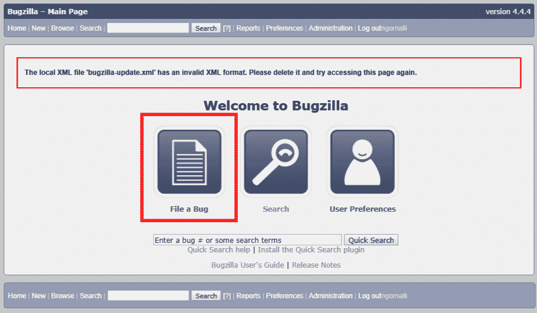

# 跟踪应用程序变更和将 DevOps 应用于 Salesforce 的投资回报率（ROI）

本章我们将讨论如何使用开源技术（例如 Git 源代码控制版本系统）来跟踪应用程序变更。我们将学习 Bugzilla 的基础知识，以及如何跟踪测试人员或用户报告的问题，直到问题/功能的修复部署到生产环境。

我们还将看到如何在 Jenkins 中添加一些构建后步骤，将构建状态报告给 Git。这将使开发人员能够获得与每个提交相关的构建状态信息。我们将讨论 DevOps 如何帮助任何 Salesforce 组织更快速地交付应用程序，以及将 DevOps 应用于 Salesforce 的投资回报率（ROI）。

# 如何跟踪应用程序变更

没有版本控制系统的情况下跟踪应用程序的变更，就像在大海捞针。我们已经在第五章《版本控制》中看到如何使用 GitLab 跟踪应用程序变更。每当测试人员报告 bug 时，我们会使用 Bugzilla 等 bug 跟踪工具来追踪 bug 的生命周期——从发现问题到修复发布到生产环境。当一个新的 bug 或功能被添加到 bug 跟踪工具中时，它会被分配给开发人员，开发人员开始处理该修复或新功能。当开发人员提交变更到相应的功能分支时，代码变更会被记录在 Git 仓库中。开发分支的提交信息应包含 bug ID，以便标识与特定 bug 或功能相关的变更。

如果添加了新功能或修复了某个问题，开发人员可以添加有意义的提交信息，帮助我们追踪新功能的变更。当我们想将变更合并到开发分支或对提交进行樱桃挑选时，带有 bug ID 的有意义提交信息让这一过程变得更容易。

# 介绍 Bugzilla

Bugzilla 是一款开源的错误跟踪系统。使用 Bugzilla，你可以创建一个 bug 并追踪这个 bug，直到它被关闭。Bugzilla 提供了项目管理和问题跟踪功能。Bugzilla 被用来提升性能和可扩展性。其他功能包括一个先进的查询应用，可以记住你的搜索记录以及集成的电子邮件功能。

首先，你需要在系统或服务器上安装 Bugzilla，通过浏览器访问 Bugzilla。步骤如下：

1.  你可以从[`www.bugzilla.org/docs/4.4/en/html/installation.html`](https://www.bugzilla.org/docs/4.4/en/html/installation.html)安装 Bugzilla 到一台机器上。

1.  现在通过浏览器打开 Bugzilla，屏幕会显示如下内容：

1.  点击登录并输入凭证。登录后，页面将显示如下内容：

1.  现在点击“用户偏好”或“管理”以打开管理面板。

1.  打开管理面板后，点击用户（Users）：

1.  在下一个页面，点击添加新用户（add a new user）：

1.  输入登录名、密码和真实姓名。最后，点击添加（Add）：

1.  选择相关权限并点击保存更改（Save Changes）：

1.  现在点击主页上的“报告 bug（File a Bug）”：

+   在下一个页面，你可以看到多个字段：

    +   产品：Git 演示项目

    +   报告人：ngornalli

    +   组件：Git 项目模型

    +   组件描述：此组件是为 Git 演示项目创建的

    +   版本：1.0

    +   严重性：高

    +   硬件：其他

    +   操作系统：Windows

    +   组织*：Transformer

    +   工单类型*：缺陷

    +   提出者：QA

    +   复现问题的步骤*：复现问题的步骤

    +   预期结果*：预期结果

    +   摘要：为 Git 演示项目添加了新缺陷

    +   描述：描述

    +   附件：如果有任何截图，请附在此处

1.  最后，点击提交 bug（Submit Bug）。

# 将构建报告发布到 Git

正如我们在第六章《*持续集成*》中看到的那样，我们可以通过 Git Webhook 在代码推送到 Jenkins 时触发 Jenkins 任务。Jenkins 将使用 Ant Migration Tool 启动构建并将元数据部署到沙箱中。然而，构建是否成功或失败并不会显示出来。所以我们需要修改 Jenkins 任务，使其从 Git 部署更改到沙箱。进入你想修改的 Jenkins 任务，点击配置（Configure）。

添加构建后 Git 发布器（Git Publisher）步骤，以将构建状态设置为 Git 提交：

在 GitLab 中，你可以查看 Jenkins 任务的状态，以检查它是成功还是失败。我们可以跟踪 Git 中的每次提交，查看沙箱构建的部署步骤是否通过。如果我们配置 Jenkins 任务在沙箱测试完成后运行自动化测试用例，我们可以在 Git 中获得自动化测试用例执行的状态：

# DevOps 如何帮助组织快速交付

版本控制帮助我们跟踪问题并回滚更改。在 GitLab 中区分分支变得更加容易。如果出现问题，查找 bug 或问题也变得更加简单，因为我们所有的更改都已在 Git 仓库中跟踪。并且，Jenkins 能够从沙箱中检索元数据并将其存储到 Git，这在进行备份时非常有用。我们无需重复相同的任务。我们可以配置 Jenkins 任务，在 Git 中备份元数据组件并发送通知邮件给相关管理员。

Jenkins 持续集成服务器帮助我们将更改从开发人员的机器部署到沙箱环境，或从一个沙箱环境部署到另一个沙箱环境。我们可以通过 Jenkins Webhooks 配置 Jenkins 作业，以便在更改推送到 Git 时自动进行部署。从开发人员沙箱到 UAT 沙箱的元数据部署可以自动化，并且 Salesforce 凭证安全地存储在 Jenkins 凭证中的密文文本中，仅在执行 Jenkins 作业时使用。

代码覆盖率对于提高开发人员编写的代码质量至关重要。我们可以确保在开发应用程序时遵循标准实践。通过 Jenkins 执行 Apex 测试来部署元数据到沙箱环境，是确保按照 Salesforce 标准实现 75% 代码覆盖率的简便方法。

# 提高生产力

当我们大部分部署任务通过 Jenkins 持续集成服务器自动化，并且所有更改都在 Git 等源代码版本控制系统中进行追踪时，开发人员可以将更多时间投入到实际的开发任务中。如 第七章《持续测试》中所示，借助自动化测试，我们可以更快地覆盖测试周期，并满足 Salesforce 中的代码覆盖率标准。Selenium 使得自动化测试用例变得更加简单。在软件开发周期的早期阶段发现缺陷非常重要，这可以确保软件无缺陷，并使得应用交付到生产环境的速度更快。

# 如何衡量投资回报率（ROI）？

使用开源工具（如 GitLab、Jenkins、Selenium 等）将 DevOps 方法应用于 Salesforce，帮助组织以最小成本和最小努力（仅需一次性设置和配置）建立自动化流程。

ROI 无法仅通过一个数字来衡量，但通过应用 DevOps 的 ROI 可以通过节省部署 Salesforce 所需的时间以及开发人员不小心覆盖彼此更改时需要返工的时间来衡量。在软件开发的早期阶段通过自动化测试更快地识别问题，使得修复问题变得更容易。修复生产环境中的缺陷所耗费的时间，比在测试或预生产环境中修复缺陷要多。生产环境中的缺陷会对我们的应用程序产生业务影响。

在将更改部署到生产环境时，维护窗口内的时间缩短和生产环境中问题数量的减少，帮助我们衡量将 DevOps 应用于 Salesforce 组织的 ROI。通过 Jenkins 持续集成，自动化测试用例可以将发布周期从几周缩短到几天。

通过将 DevOps 实践应用于 Salesforce 应用程序，我们可以实现客户满意度，并加快产品交付过程。开发人员无需在应用程序维护上花费过多时间，而可以更多地专注于开发新功能。

# 总结

在本章中，我们了解了如何跟踪应用程序变化，使用 Bugzilla，提升生产力以及衡量投资回报率（ROI）。

我们从对 DevOps 实践或相关工具几乎没有了解开始本书的学习。我们通过在 Salesforce 中创建一个示例应用程序，学习了一些 Salesforce 的基础知识，并讨论了不同的沙盒环境。通过将 Eclipse 与 Salesforce 结合使用，我们可以将 Git 与沙盒集成，实现源代码控制版本系统。我们了解了 Salesforce 中使用的不同部署方法，并使用 Jenkins 持续集成服务器自动化了 Salesforce 的部署。

我们学习了如何搭建自己的 GitLab 服务器，并将代码更改从 Salesforce 沙盒推送到 GitLab 仓库。在 Salesforce 环境中使用 Jenkins 服务器实现持续集成，帮助我们加速部署到 UAT 或其他沙盒环境。

我们学习了如何使用 Selenium 自动化测试 Salesforce 应用程序。我们通过一个示例 Salesforce 应用程序讨论了 Selenium 的录制与回放功能。自动化测试帮助我们将测试周期从几天缩短到几个小时。我们看到 DevOps 工具如何在 Salesforce 应用程序中发挥作用。你可以将本书中学到的概念应用到任何 Salesforce 应用程序中。在本书中，我们尽力为你提供有关 DevOps 工具的有益见解，并提供一步步的指导，帮助你使用开源工具设置自己的 DevOps 流程。本书中的大多数练习都可以通过免费 Salesforce 账户来完成。
