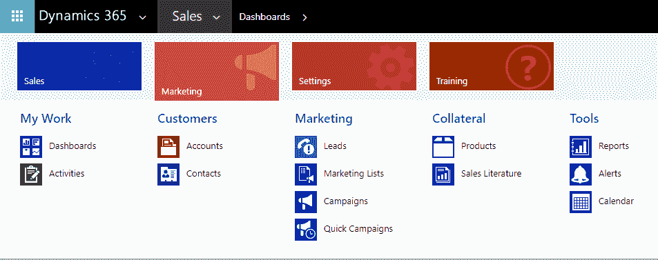
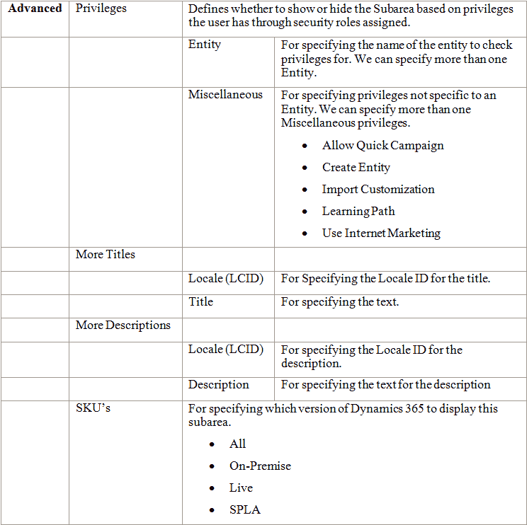

# 自定义应用程序导航

站点地图可以定义为一组链接，用户可以通过这些链接导航并浏览网站。在 Dynamics 365 及其早期版本中，站点地图是一个 XML 文件，用于定义应用程序或特定应用模块的用户导航。直到 CRM 2016，组织只有一个站点地图文件。随着 Dynamics 365 中应用程序的出现，现在每个应用模块都有一个站点地图文件。在自定义站点地图方面，直到现在，我们必须使用 XML 编辑器、文本编辑器或某些第三方工具进行更新。然而，在 Microsoft Dynamics 365 中，产品本身内置了站点地图设计器。该设计器允许管理员、定制员或具有适当权限的用户通过简单地添加、拖动和放置站点地图设计器画布中的组件，轻松定义应用程序的导航。在本章中，我们将涵盖以下内容：

+   Dynamics 365 中的站点地图概述

+   了解设计器界面及其组件——区域、组和子区域

+   可以在站点地图上执行的常见操作

# 站点地图概述

对于每个配置的应用程序，我们将为其定义一个单独的站点地图。默认情况下，我们将在配置 Dynamics 365 时配置一个 Dynamics 365 自定义应用程序。在 Dynamics 365 实例的配置过程中，我们还可以配置其他应用程序，如销售、现场服务、项目服务自动化或客户服务，如果我们在配置 Dynamics 365 时选择了这些应用程序。现在，让我们尝试了解如何使用 Dynamics 365 的站点地图设计器，以 Sales 应用为例。假设我们在配置 Microsoft Dynamics 365 时选择了销售，如下所示：


*Dynamics 365 企业计划 1 试用版*的链接可以在此处找到：[`signup.microsoft.com/Signup?OfferId=bd569279-37f5-4f5c-99d0-425873bb9a4b&dl=DYN365_ENTERPRISE_PLAN1`](https://signup.microsoft.com/Signup?OfferId=bd569279-37f5-4f5c-99d0-425873bb9a4b&dl=DYN365_ENTERPRISE_PLAN1)。

这将配置 Dynamics 365 的销售应用程序。以下是销售应用的导航界面：


现在，在我们已经了解了站点地图的基础知识后，让我们看看站点地图设计器的界面，它包含哪些组件，以及我们如何使用它来更新销售的站点地图。

# 站点地图设计器概述

要访问我们的销售应用程序的站点地图设计器，请执行以下步骤：

1.  使用具有系统定制员、系统管理员或任何适当安全角色的用户登录 Dynamics 365 销售应用程序，以便自定义站点地图。

1.  转到设置 | 解决方案。

1.  创建一个新的解决方案，并填写适当的详细信息。例如，我们创建了一个名为“网站地图解决方案”的解决方案，发布者为默认发布者，版本为 1.0.0.0。

我们还可以登录到默认的*Dynamics 365 - custom*应用程序，创建一个新的解决方案并将销售应用网站地图添加其中。

1.  点击客户端扩展并在其中添加销售应用网站地图，如下所示：


我们也可以进入设置 | 自定义并更新默认解决方案中的网站地图。然而，作为最佳实践，我们应该创建一个单独的解决方案，并在其中添加需要自定义的组件。

双击它将打开销售应用网站地图，在网站地图设计器中供我们编辑。网站地图设计器画布允许我们操作区域、组和子区域组件：


在设计器画布中，我们可以进行添加、剪切、复制、粘贴、克隆和删除操作。

让我们详细了解这些组件。

# 理解网站地图中的组件

网站地图由三个主要组件组成：

+   区域：区域可以定义为导航窗格中的主节点或区域，包含组及其相应的子区域。可以添加新的区域，或更新或删除现有区域。如果区域不包含任何可见的子区域，则该区域将被隐藏。

+   组：组可以定义为一个集合或子区域的组合。像区域一样，可以添加新的组，或更新或删除现有的组。

+   子区域：子区域可以定义为区域内的导航链接，定义了点击时在 CRM 的主面板中加载的内容。子区域可以指向仪表板、实体、URL 或 Web 资源。像区域和组一样，可以添加新的子区域，或更新或删除现有的子区域。

参考我们的销售应用界面：

+   销售、营销、设置和培训被称为区域。

+   我的工作、客户、销售、资料、营销、目标和工具是销售区域内的组。

+   仪表板、最新动态和活动是“我的工作”组中的子区域。

销售区域将具有特定于销售的子区域，这些子区域被安排在称为组的区域内。同样，营销、设置和培训区域将有相应的子区域，放置在相应的组内。如以下截图所示，营销区域包含仪表板、活动、账户、联系人、潜在客户、营销列表、活动、快速活动等。它还包括与营销模块相关的子区域。这些子区域被安排在“我的工作”、“客户”、“营销”、“资料”和“工具”组内：



现在，既然我们已经了解了网站地图组件的概况，让我们在下一节中查看这些组件的不同属性。

# 了解区域、组和子区域的属性

在开始自定义我们的销售应用导航之前，让我们先看看这些组件的不同属性。

+   区域组件包含以下属性：


+   组组件与区域组件共享大多数相同的属性：


将组设置为配置文件属性可能与 Dynamics 365 不相关，因为工作区区域从 CRM 2013 开始已被停用。

与区域和组相比，子区域有更多的属性：



+   如我们所知，站点地图本质上是一个 XML 文件，通过站点地图设计器进行的任何更改实际上是在后台更新站点地图的 XML：

+   要获取销售应用站点地图定义，请导出包含销售应用站点地图客户端扩展的解决方案并解压缩它。然后，打开 `customizations.xml` 文件并搜索 `SiteMap` 标签。

+   以下是销售应用站点地图中“我的工作”组的示例 XML。我们可以看到 `Area`、`Group` 和 `SubArea` 标签及其对应的属性：


+   如前所述，除了使用站点地图设计器，我们还可以使用任何文本编辑器手动更新站点地图的 XML，并可以将解决方案导入回去（并发布）以查看更改。

站点地图 XML 参考：[`msdn.microsoft.com/en-us/library/gg334430.aspx.`](https://msdn.microsoft.com/en-us/library/gg334430.aspx)

在本节中，我们查看了站点地图设计器的区域、组和子区域组件的属性。在下一节中，我们将学习如何通过站点地图设计器执行一些基本操作，如更新、添加、删除等。

# 使用站点地图设计器的常见操作

现在，我们已经详细了解了站点地图组件的所有属性，让我们看看如何使用站点地图设计器执行一些常见操作。

# 编辑站点地图中的现有组件

要编辑站点地图中的现有区域、组和子区域，我们需要在设计器中选择该组件，并转到该组件的属性标签。让我们通过一个简单的例子来理解这一点。假设我们想将现有的“培训”区域重命名为“帮助”，我们需要在站点地图中选择“培训”区域，转到其属性标签并更新其标题属性。


让我们将“帮助”指定为标题属性的值。这将把区域的标题从“培训”更新为 `Help`，如下所示：


我们还可以通过内联编辑更新站点地图组件的标题属性。为此，将鼠标悬停在组件上以显示铅笔图标。我们可以点击铅笔图标来编辑标题。同样，我们也可以编辑或更新组和子区域组件的相应属性，正如我们之前提到的，设计器中所做的任何更改都会反映在站点地图的 XML 中。

# 向站点地图添加组件

要向站点地图添加区域、组或子区域，我们需要点击站点地图设计器操作栏上的“添加”按钮。让我们在这里添加一个区域来理解这个过程。点击“添加”按钮并选择区域：


或者，从“组件”标签中拖放区域。

添加后，我们需要选择组件（此处为区域），然后在“属性”标签中编辑其属性。例如，下面的图片显示了新添加的区域组件的“属性”标签：


这将会在站点地图中添加一个名为“新区域”的新区域。

同样，我们也可以在导航中添加或拖放新的组和子区域组件，并指定它们的属性。

# 剪切、复制和粘贴组件到站点地图

通过站点地图设计器，我们还可以剪切、复制和粘贴站点地图组件。让我们选择我们的新区域，并点击操作栏上的剪切按钮以剪切该组件。该组件将变灰。

同样，我们可以选择该组件并点击复制按钮来复制该组件。粘贴按钮可以让我们选择将组件粘贴到右侧或左侧，针对区域和组组件，如下所示：


# 将组件克隆到站点地图

要克隆或复制现有的区域、组和子区域到站点地图，我们可以选择该组件并点击站点地图设计器操作栏上的克隆按钮。克隆后，将会在下一个克隆的组件旁添加相应的组件，并且该组件的标题后会加上“-Copy”后缀。例如，克隆“销售区域”，如下面的图片所示，将在克隆的销售区域旁添加一个名为“Sales-Copy”的新区域：


# 从站点地图中删除组件

要从站点地图中删除一个区域、组或子区域，选择该组件，然后点击操作栏上的删除按钮，或者按“删除”键：


删除一个区域也将删除其中的组和子区域。同样，删除组将删除其中的子区域。

# 在站点地图中组织组件

使用拖放功能，我们可以在重新排列站点地图之前，移动站点地图中的组件：


例如，我们可以将**销售区域**移到站点地图中的最后一个区域，将**我的工作**设置为销售区域内的第二个组，将**仪表盘**设置为**我的工作组**中的最后一个子区域，依此类推，具体如下所示：


我们还可以将一个子区域移到不同的组中。例如，**仪表盘**子区域可以移动到其他任何组，如**客户**、**销售**、**辅助资料**等，甚至将一个组移到不同的区域。也就是说，我们可以将**我的工作**组移到**设置**、**培训**和**销售**区域中。

# 在站点地图中保存、验证和发布更改

要反映前述任何更改（如添加、克隆、删除等），我们需要点击“保存”，然后在站点地图设计器画布中发布它。此时，*草稿表示有未保存的更改。


保存更改并点击“发布”后，它会变为“已发布”，表示更改已应用并且用户可以查看：


点击“保存”按钮也会验证站点地图，并在有任何错误时显示出来。例如，如果我们没有为任何必填字段提供值，或为某些属性指定了不允许的字符。在下方截图中，我们没有为子区域的实体属性提供值，并点击了“保存”，这是一个必填字段：


这将显示设计器中的错误信息通知，并附有所有详细信息。我们只有在修复错误后，才能保存并发布更改。

# 在站点地图中添加子区域组件

让我们以一个简单的场景来理解如何添加新的子区域组件。我们意识到，销售应用程序的用户会频繁访问 CRM 中的“开放潜在客户视图”，因此如果我们能够在销售区域的“我的工作”组中为他们添加一个“开放潜在客户视图”子区域，将会很有帮助。为了实现这一点，我们需要在“我的工作”组中添加一个新的类型为 URL 的子区域。为此，我们需要在站点地图设计器中的操作栏中点击“添加”，然后添加一个新的子区域，并将其拖动并放置到“我的工作”组中的活动子区域下面：


这里，视图的 URL 模式需要如下：

```
=/_root/homepage.aspx?etc=<entity code >&viewid=%7b<GUID value of view id>%7d"
```

对于 `etc` 和 `viewid` 查询参数，我们需要进入 CRM 中的“开放潜在客户视图”，然后点击“电子邮件链接 | 当前视图”功能区按钮，以获取链接：


链接将包含 `etc` 和 `viewid` 的值。我们将复制链接中 `etc` 和 `viewid` 查询字符串参数的值。然后，我们可以设置我们新子区域的属性，如下所示：


我们将保存并发布它。发布后，用户将在销售应用程序中看到名为“开放潜在客户”的新子区域：


点击“开放潜在客户”子区域将打开如下所示的“开放潜在客户”视图：


# 在站点地图中隐藏子区域组件

正如我们之前看到的，子区域组件有一个权限属性。它定义了是否根据用户通过安全角色分配的权限来显示或隐藏该子区域。让我们通过一个示例来理解这一点。假设我们只希望那些对潜在客户实体具有创建权限的用户能看到我们刚刚添加的“开放潜在客户”子区域。要定义这一点，让我们返回站点地图设计器中“开放潜在客户”子区域的“属性”选项卡。在那里，我们需要进入“高级”部分中的“权限”。在实体下拉菜单中，我们可以选择“潜在客户”实体，并点击“+”按钮来添加记录。我们将不勾选任何复选框，除了“创建”：


保存并发布更改。现在，让我们以只分配了销售人员安全角色的用户身份登录。在这里，我们已经更新了安全角色，并为潜在客户实体的“创建”权限设置为“无”；即我们在以下截图中看到的第一个选项：


没有“创建”权限的用户将无法在他们的站点地图中看到“开放潜在客户”子区域。

# 从站点地图向 URL 传递参数

正如我们之前看到的，子区域组件有一个“参数传递”复选框属性。它指定是否将组织和语言上下文的信息传递到 URL。该属性仅适用于类型为网页资源或 URL 的子区域。假设我们在子区域的 URL 属性中定义了以下 URL：

`http://mydomain/mypage.aspx`。

选中“参数传递”复选框将传递以下参数：

`http://mydomain/mypage.aspx/?orglcid=1033&orgname=org29d341dd&userlcid=1033`。

+   `orglcid`：组织的基础语言的语言代码标识符

+   `orgname`：组织的唯一名称

+   `userlcid`：当前用户使用的语言代码标识符

这些信息可用于创建支持多语言的解决方案。

创建支持多语言的解决方案的详细信息请参见[`msdn.microsoft.com/en-us/library/hh670609.aspx#Anchor_0`](https://msdn.microsoft.com/en-us/library/hh670609.aspx#Anchor_0)。

# 编辑站点地图并支持客户

让我们简要地看看除了站点地图设计器外，还可以通过其他方式编辑站点地图，以及客户在 Dynamics 365 中支持不同类型站点地图的方式。

# 站点地图编辑器

站点地图，正如我们所知道的，是一个 XML 文件。任何 XML 文本编辑器都足够用来编辑站点地图 XML 文件。为此，我们可以导出包含站点地图 XML 的非托管解决方案，在记事本、Visual Studio 或任何其他 XML 编辑器中编辑它，然后再导入回来。这里需要记住的重要一点是，如果我们作为托管解决方案导入站点地图，它将创建一个新的站点地图记录，并包含所有最新的更改；而在非托管情况下，现有的站点地图 XML 会被覆盖。

编辑带有模式验证的站点地图 XML 的详细信息请参考 [`msdn.microsoft.com/en-us/library/gg334493(v=crm.8).aspx`](https://msdn.microsoft.com/en-us/library/gg334493(v=crm.8).aspx)。

除了站点地图设计器外，我们还可以使用第三方站点地图编辑器来编辑站点地图。其中一个最受欢迎的工具是包含在 XRM 工具箱中的站点地图编辑器。这是我们的销售应用站点地图如何在站点地图编辑器中加载的：


与手动编辑 XML 相比，这个工具使得编辑站点地图变得更加容易。这个工具自 CRM 2011 以来一直是编辑站点地图最受欢迎的工具之一，并且最近更新以支持在 Dynamics 365 中可用的多个站点地图。另一种选择是通过编程更新站点地图。为此，我们可以使用站点地图实体，并更新其 `sitemapxml` 属性，如下所示：

+   创建站点地图实体的对象：

```
Entity siteMap = new Entity["sitemap"]; 
```

+   使用有效的 XML 更新其 `sitemapxml` 属性：

```
siteMap["sitemapxml"] = "valid site map xml"; 
```

+   使用组织服务实例更新实体：

```
service.Update(siteMap); 
```

+   使用 `PublishXmlRequest` 类发布更改：

```
PublishXmlRequest request = new PublishXmlRequest();
 request.ParameterXml = "<importexportxml><sitemaps><sitemap></sitemap></sitemaps></importexportxml>";
 service.Execute(request);
```

我们还可以通过编程创建和删除特定于应用的站点地图记录。然而，建议你使用站点地图设计器，而不是通过编程进行操作。另一个需要注意的点是，默认的站点地图记录无法创建或删除。

强烈建议我们在开始编辑之前导出现有的站点地图 XML 文件并保存一份副本，这样如果在编辑过程中发生错误，可以帮助我们恢复。

# 支持的客户端

默认站点地图，即用于 Dynamics 365 的站点地图 – 自定义应用，支持 Dynamics 365 Web 应用程序和 Dynamics 365 for Outlook。任何新的自定义应用程序的站点地图，或如销售、客户服务、现场服务和项目服务自动化等业务应用，只能通过 Dynamics 365 Web 应用程序进行支持。

# 摘要

在这一章中，我们了解了站点地图在 Dynamics 365 中的发展。现在，每个应用程序可以有多个站点地图，并且产品中内置的站点地图设计工具也可以使用。我们还详细了解了新的站点地图设计器以及可以通过它执行的一些常见操作。在下一章中，我们将介绍新的可视化流程设计器，以及如何使用它通过直观的拖放功能创建业务流程流。
