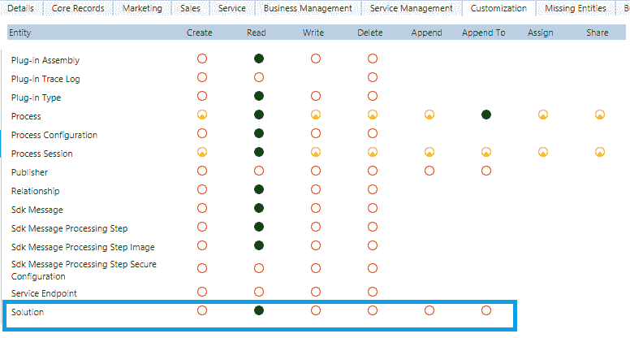
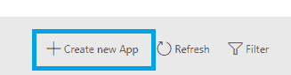

# 使用应用模块设计器设计应用程序

应用程序是 Dynamics 365 或 Dynamics CRM 9.x 版本中引入的新功能。在 Dynamics CRM 的后续版本之前，无法创建针对任何模块的自定义应用程序。曾经存在一个单一层次的站点地图，为整个组织提供了各种实体、仪表板等的链接。然而，随着 Microsoft Dynamics 365 的推出，微软引入了应用程序的概念，这些应用程序可以针对特定的业务领域或模块。同时，我们还可以在产品本身中使用内置的应用程序设计器。该设计器允许管理员、自定义人员或具有适当权限的用户，通过简单地添加、拖动和放置组件，在应用程序设计器画布内轻松设计应用程序。

本章将涵盖以下内容：

+   Dynamics 365 中应用程序概述

+   配置应用程序所需的前提权限

+   配置 Dynamics 365 应用程序

+   了解应用程序属性

+   了解应用程序设计器界面

+   添加和移除组件、验证、发布和保护应用程序

+   导出和导入应用程序

# Dynamics 365 中应用程序概述

应用程序是 Dynamics 365 中新增的功能，旨在为用户提供快速导航，以便他们能快速访问最相关的实体等内容。应用程序非常方便，每个应用程序都有自己的站点地图。关于在 Dynamics 365 中设计站点地图的详细信息，将在第一章中讨论，*自定义应用程序导航*。简而言之，**站点地图**是存储导航链接的组件，并且在 Dynamics 365 中以 XML 格式存储。应用程序可以包含以下组件：

+   实体

+   仪表板

+   表单

+   视图

+   图表

+   商业流程

# 配置应用程序所需的权限

在我们开始讨论配置 Dynamics 365 中应用程序所需的步骤之前，了解特定用户所需的前提安全权限是非常重要的，这样他们才能访问配置应用程序的功能。如果你希望授予一个高级用户或最终用户设计和使用自己应用程序的能力，这一点尤其重要。以下表格总结了配置 Dynamics 365 应用程序所需的最低权限：

| **序号** | **实体名称** | **读取** | **写入** | **创建** |
| --- | --- | --- | --- | --- |
| 1. | 应用程序 | 是 | 是 | 是 |
| 2. | 解决方案 | 是 | - | - |
| 3. | 自定义 | 是 | 是 | - |

这里详细介绍了通过 CRM 屏幕查看安全角色区域的内容：

1.  在 Dynamics 365 的自定义选项卡下，应配置应用程序的安全角色：读取、写入和创建权限。请参阅以下截图：

1.  在 Dynamics 365 的自定义选项卡下，应配置安全角色：自定义的读取和写入权限。请参阅以下截图：

1.  在 Dynamics 365 的“自定义”选项卡下，应配置安全角色：自定义的读取和写入权限。请参阅以下截图：

**注意**：系统管理员和系统定制者角色已经具备配置 Dynamics 365 应用程序的必要权限。如果需要其他安全角色（非上述角色）访问配置 Dynamics 365 应用程序，必须配置前述的安全权限。

# 配置 Dynamics 365 应用程序

在本部分中，我们将了解配置 Dynamics 365 应用程序所需的各个步骤。下图概述了配置 Dynamics 365 应用程序所需的步骤：

以下是每个步骤的描述：

1.  **配置应用程序属性：** 应用程序属性，如名称、唯一名称、图标等，需要作为配置应用程序的起点进行配置。下一部分将给出详细描述。

1.  **使用站点地图设计器配置应用程序导航：** 每个应用程序可以有自己的站点地图。详细描述请参阅第一章，*自定义应用程序导航*。

1.  **包含所需的应用组件：** 应用组件可以包括必须包含在应用中的工件或实体资产。

1.  **检查应用程序是否缺少任何必需的组件：** 需要检查应用程序是否缺少任何必需的组件。这可以通过在发布应用程序之前点击“验证”来完成。

1.  **通过发布使应用程序可供使用：** 要让用户能够访问该应用程序，必须发布该应用程序。详细描述请参阅以下部分。

1.  **为应用程序配置安全角色访问权限：** 可以通过安全设置限制应用程序的访问权限，确保只有特定的用户可以访问应用程序。详细描述请参阅以下部分。

# 了解应用程序属性和设计器界面

在配置应用程序之前，应用程序具有一些特定的属性，我们需要了解这些属性。配置应用程序之前需要提供以下属性。以下表格总结了这些属性：

| **序号** | **属性名称** | **属性描述** |
| --- | --- | --- |
| 1. | 名称 | 需要提供此属性以为应用程序指定唯一名称。 |
| 2. | 唯一名称 | 唯一名称会根据名称属性自动填充。它包含一个前缀，前缀从发布者的前缀中获取。唯一名称的唯一部分可以更改（前缀不能更改，因为它是从解决方案的发布者中获取的）。唯一名称只能包含英文字母或数字。 |
| 3. | 描述 | 此属性包含对应用程序旨在实现的目标的简短描述。**注意**：建议您使用此属性提供有意义的应用程序描述，因为这将是持续的 CRM 自定义和维护的有用信息。 |
| 4. | 图标 | 此属性的默认设置是**使用默认应用**缩略图，已选中。如果你希望为应用图标使用不同的 Web 资源，请取消选中此复选框，并指定 Web 资源作为应用图标。此图标将在应用的预览磁贴中显示。 |

| 5. | 客户端类型 | 此属性允许你选择应用的客户端类型行为。它可以是以下之一：

+   **Web：** 这是 Dynamics 365 的经典 Web 浏览器客户端界面。

+   **统一界面**：这是全新的改进版 Dynamics 365 Web 浏览器客户端界面，PC 和移动设备上的外观和体验相似。

|

| 6. | 应用 URL 后缀 | 应用 URL 属性会根据指定的应用名称自动填充。应用 URL 需要唯一。格式如下：

+   **本地部署：** `http://<server>/<org name>/Apps/<App URL>`

+   **在线部署：** `https://<server>. crm#.dynamics.com/Apps/<App URL>`

**注意：** 如果清除该选项，系统会自动生成一个带有应用 ID 的应用 URL。

| 7. | 使用现有解决方案创建应用 | 此属性可以用于从已安装的解决方案列表中创建应用。当选择此选项时，顶部的**完成**按钮将变为**下一步**。选择**下一步**后，你可以选择可用的解决方案。如果解决方案中配置了任何站点地图，它也会可供选择。选择了解决方案，必要时选择站点地图（如果它是解决方案的一部分），然后点击**完成**。解决方案或站点地图中存在的组件会自动添加到应用中。 |
| --- | --- | --- |
| 8. | 选择欢迎页面 | 此属性允许你选择一个 Web 资源，配置为应用的欢迎页面。这是一个有用的属性，可以配置有助于用户使用应用的链接，或者视频/升级说明链接等。此链接在用户打开应用时总是会在欢迎页面上显示。用户以后可以选择“下次不显示此欢迎页面”来禁用该页面，之后再次打开应用时该页面将不会显示。 |

# 了解应用程序设计器的界面并将组件添加到应用中

现在我们已经了解了上一节中的应用程序属性，是时候使用 Dynamics 365 应用程序设计器配置我们的第一个 Dynamics 365 应用，并了解其界面。可以通过以下步骤创建一个 Dynamics 365 应用：

1.  导航到“设置” | “我的应用”，如下图所示：

1.  在**我的应用**屏幕上，你将能够看到已经配置好的内置应用列表，或者你所在组织中已配置的任何其他自定义应用：

1.  在**我的应用**屏幕上，点击右上角的**创建新应用**按钮，如下图所示：

另外，你也可以选择在“我的应用”屏幕底部的“创建新应用”图块，在“正在编辑的应用”选项下：

1.  下一屏幕将展示应用设计器屏幕，包含我们在上一部分中描述的所有应用属性：

这张图片展示了应用设计器屏幕

1.  为应用选择一个有意义的名称。在我们的例子中，我们正在创建一个用于快速生成潜在客户的应用，因此我们将应用命名为潜在客户生成。注意，唯一名称、应用 URL 后缀和 Web URL 属性是自动生成的：

这张图片展示了潜在客户生成

**注意：** 在此步骤中，我们保持应用的默认属性。你可能希望覆盖这些自动生成的属性。

1.  提供应用的有意义描述（URL 应该是唯一的）：

同时，我们将保持客户端类型为 Web（经典 CRM Web 界面）。

1.  若要为应用选择不同的图标，请取消勾选“使用默认图片”复选框，然后选择你希望用作应用图标的 Web 资源：

我们将为这个特定应用选择经典 CRM 图标。注意，在选择图标后，你可以在右侧的应用图块预览区域看到应用图块的预览：

1.  可选地，你可以选择使用现有的解决方案来创建应用，并为应用选择一个欢迎页面。我们将跳过第一个 Dynamics 365 应用的设置，并点击右上角的完成按钮：

1.  点击完成后，应用设计器将跳转到选择不同组件的屏幕。

一个应用可以由两种不同类型的组件组成，如下表所述：

| **序号** | **组件名称** | **组件内容** |
| --- | --- | --- |
| 1 | **工件** | 实体、仪表板和业务流程 |
| 2 | **实体资产** | 表单、视图、图表等 |

现在让我们来了解一下应用设计器的布局。应用设计器分为两个不同的区域：

+   **画布**：在应用设计器的左侧，你会看到一个画布区域，在这里你可以添加应用组件。以下截图展示了画布区域的示例：

+   **组件属性**：在应用设计器的右侧，你将看到一个区域，你可以在这里选择各种组件及其属性。以下截图展示了组件及其属性区域的示例：

请注意，这里还提到了不同组件的分类，组件区域将组件分为两大类：ARTIFACTS 和 ENTITY ASSETS。在 App Designer 的画布上，如果选择了仪表板或业务流程，仪表板或业务流程下的所有实体会自动被 App Designer 选择。然后，您只需选择适当的实体资产，例如视图、表单和图表。

在我们的“潜在客户生成”应用中，由于未选择站点地图，站点地图区域将显示“配置缺失”：

1.  点击箭头图标后，在 App Designer 的画布区域中的站点地图区域，您将看到站点地图设计器。如以下截图所示，站点地图设计器将在第一章，*自定义应用程序导航*中详细讨论：

在以下站点地图编辑器屏幕上点击“保存并关闭”。

**注意：**有关网站地图和网站地图设计器的详细信息，请参见第一章，*自定义应用程序导航*。

1.  请注意，作为所选站点地图的一部分的“潜在客户”实体，已经在 App Designer 的 Entity View 中可用。类似地，所选站点地图上的所有组件都会自动出现在 App Designer 中：

1.  默认选择 ENTITY ASSETS 时，所选实体的所有表单和视图将显示在 Entity View 下。我们来更改视图。点击视图选择旁的“全部”，选择您希望在此应用程序中使用的视图。此处，仅选择了“所有潜在客户”和“已关闭的潜在客户”视图：

您还可以选择类似的表单和图表，并在屏幕右上角点击“保存”。

1.  接下来，我们来看看屏幕的工件部分。这里，您可以看到提供了站点地图、仪表板和业务流程，默认选择了“全部”：

1.  我们可以选择业务流程图块，点击显示“全部”的区域。完成后，您将看到选择当前应用程序中可用的业务流程的选项。由于这是“潜在客户生成”应用程序，因此我们仅选择了在现成的 Dynamics 365 中可用的“从潜在客户到机会销售”业务流程：

1.  一旦选择了特定的业务流程，App Designer 会自动选择该流程下的所有实体：

1.  接下来点击“保存”。然后点击右上角的“验证”按钮：

1.  在验证后，您可能会偶尔收到警告或错误，如下所示：

1.  在我们的例子中，这些只是潜在警告。因此，我们可以跳过它们；但是错误警告是无法跳过的。我们可以通过点击“发布”来发布我们的应用。这将成功发布应用：

# 使用自定义应用

在上一部分，我们发布了一个名为潜在客户生成的新自定义应用。在本部分中，我们将尝试使用我们新创建的自定义应用。请按照以下步骤使用您新创建的自定义应用：

1.  展开“Dynamics 365”区域，您应该能够找到新发布的潜在客户生成的 Dynamics 365 应用：

**注意：** 安全性考虑将在本章的下一部分进行讲解。由于当前用户是系统管理员角色，因此可以访问该应用。

或者，用户也可以导航到设置 | 我的应用并在已发布应用列表中查看该应用：

1.  请注意，现在新应用已启动，网站地图中的导航选项显示了我们之前配置的站点地图：

1.  此外，如实体资产配置中所选，潜在客户中仅提供两个视图供使用：

# 保护应用

在实际场景中，通常需要仅将特定应用访问权限授予某一特定用户组。对于这一需求，我们可以将应用保护为仅通过特定安全角色访问。

我们现在希望编辑潜在客户生成应用的安全权限，使其仅对销售经理和销售人员安全角色可用。我们可以通过仅为某些安全角色启用应用访问权限来实现这一点。请按照以下步骤仅为某些安全角色启用应用访问权限：

1.  导航到设置 | 我的应用，并在潜在客户生成应用下选择更多选项：

1.  选择“管理角色”选项。这将在屏幕右侧启动“管理角色”窗口，在此窗口中可以选择不同的安全角色。选择适当的角色并点击“保存”：

**注意：** 系统管理员和系统自定义角色默认对所有应用具有完全访问权限。建议您保持此设置，因为这些安全角色未来需要维护或自定义应用。

现在，潜在客户生成应用仅对销售经理和销售人员角色以及系统管理员和系统自定义角色可用。

# 编辑现有应用

如果我们希望编辑应用中任何工件或实体资产组件的布局或自定义设置，我们可以通过以下步骤来实现：

1.  导航到设置 | 我的应用，并在潜在客户生成应用下选择更多选项：

1.  选择“在应用设计器中打开”选项。此操作将启动该应用的应用设计器窗口：

现在，可以根据需要编辑“Lead Generation”应用并保存。然后，需要重新验证并发布以便将更改反映给用户。

# 导入和导出应用

应用可以作为 CRM 解决方案组件从一个环境打包到另一个环境。要导出“Lead Generation”应用，请按照以下步骤操作：

1.  导航到设置 | 解决方案并创建一个名为“Lead Generation”的新解决方案。你也可以选择打开正在使用的现有解决方案。在左侧，注意到有“应用”选项：

1.  接下来，选择“添加现有应用”按钮：

1.  选择“Lead Generation”应用并点击确定：

1.  如果你没有包含为该应用创建的自定义站点地图，系统将提示你包含所需组件。选择“是，包含所需组件”选项并点击确定：

1.  “Lead Generation”应用现在已添加到 CRM 解决方案中。现在可以将其作为 CRM 解决方案 ZIP 文件导出，并导入到任何其他环境中。

# 删除应用

有时，一个应用在 Dynamics 365 实例中不再需要，你可能想要删除该应用。按照以下步骤在 Dynamics 365 中删除一个应用：

1.  导航到包含应用的解决方案。在我们的例子中，我们为此目的创建了一个“Lead Generation”解决方案。导航到设置 | 解决方案下的“自定义”区域，并打开“Lead Generation”解决方案。点击左侧屏幕上可用的解决方案组件中的“应用”选项：

1.  选择“Lead Generation”应用并点击删除按钮：

1.  系统将提示你确认删除。点击删除：

**注意**：建议你同时删除为该应用在 CRM 实例中创建的站点地图，否则将来如果创建一个名称相似的应用，可能会导致问题。

1.  该应用现在已从 CRM 系统中移除。

# 应用设计器的浏览器和操作系统支持

应用设计器可以在以下操作系统和浏览器组合中使用：

+   Windows 10 上的 Microsoft Edge

+   Windows 10 或 Windows 8.1 上的 Internet Explorer 11

+   Windows 8.1 上的 Internet Explorer 11 现代版

+   Windows 8 上的 Internet Explorer 10

+   Windows 8 上的 Internet Explorer 10 现代版

+   Windows 8、Windows 8.1 或 Windows 10 上的 Mozilla Firefox

+   Windows 8、Windows 8.1 或 Windows 10 上的 Google Chrome

+   Apple Safari 在 MAC OS X 上

# 总结

在本章中，我们了解了应用程序是如何作为一个新的强大导航功能引入到 Dynamics 365 中的。我们还理解了应用程序如何为用户提供快速访问他们日常 CRM 工作所需的最相关选项。现在，我们可以为每个应用程序拥有多个站点地图，并且产品本身内置了应用设计器工具。我们还详细了解了新的应用设计器以及可以通过它执行的一些常见操作。

在下一章，我们将介绍新的站点地图设计器，以及如何利用它的直观拖放功能来创建站点地图。
