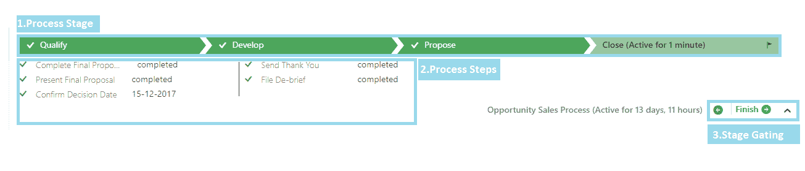
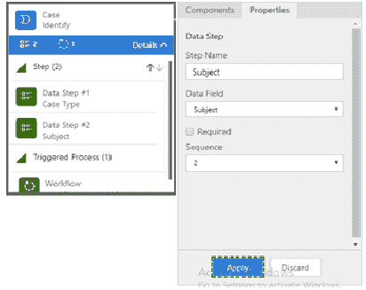

# 第三章：使用可视化流程设计器定义流程

Microsoft Dynamics 365 版本引入了一个新的编辑器，用于设计业务流程流，采用了改进的业务流程流设计器。通过业务流程流编辑器，系统管理员或系统定制员可以使用丰富的图形编辑器创建、编辑和配置业务流程流。业务流程流编辑器使组织能够提高用户生产力，并减少执行日常 CRM 活动所需的时间。

在本章中，我们将涵盖以下内容：

+   业务流程流概述

+   业务流程流所需的前提权限

+   业务流程流的基本组件

+   业务流程流设计器概述

+   创建和编辑业务流程流

+   任务流概述

+   任务流的基本组件

# 业务流程流概述

业务流程流提供了客户业务阶段的洞察，并允许管理在每个阶段需要捕捉的字段。它还帮助根据需要捕捉的字段限制在不同阶段之间的移动。最终用户会发现它更为方便，因为它简单易用，并通过业务流程流提供了对业务的直观理解。

业务流程流是 Dynamics 365 最终用户的引导性流程。它帮助引导 CRM 最终用户。

它易于可视化，并作为实体表单的可视元素出现。它由不同的指令阶段组成，帮助最终用户在系统中遵循业务流程，而无需详细的培训。

从最终用户的角度来看，业务流程流有两个基本组件：

+   第一个组件是**阶段**，它包括给用户的具体指示，以遵循该流程

+   第二个组件是**步骤**，它代表在特定阶段由最终用户填写的字段

一个阶段可以包含多个步骤。

Dynamics 365 业务流程流确保最终用户一致地输入数据，并在每次处理特定实体或实体集时遵循相同的步骤。

业务流程流帮助最终用户以标准方式完成工作，遵循逐步流程，在每个业务阶段填写应填的字段。简而言之，业务流程流作为最终用户的基本指南，提供特定流程以捕捉字段。

您可以添加与常见销售和服务方法相关的业务阶段，通过业务流程流进行映射。

# 理解业务流程流用户界面

以下图像概述了 Dynamics 365 中可用的业务流程流：

业务流程流包含不同的组件，这些组件在定制过程中是必需的；它包括以下主要组件：

1.  **阶段**：

阶段就像在业务流程流顶部给出的引导标签，用于指定该做什么：

1.  **步骤**：

步骤是为在阶段中使用的实体创建的字段：

1.  阶段门控、设置为激活、下一步、完成：

在业务流程图的右下角，此选项帮助您进入下一阶段或完成该过程：

1.  **工作流**：

工作流是一种用于在 CRM 中触发特定消息的过程。业务流程图具有新功能，可以在不同阶段进行时触发工作流。

1.  **条件**：

业务流程图支持条件分支；条件用于业务流程图中。这些条件允许在业务流程图中添加 `if...else` 逻辑，以便根据不同的字段值移动到不同的阶段。

# 创建业务流程图所需的前提条件和安全角色

在我们开始讨论在 Dynamics 365 中创建业务流程图所需的步骤之前，了解用户在能够创建和编辑业务流程图之前所需的前提安全权限是非常重要的。如果您希望为用户或最终用户提供设计和使用自己业务流程图的能力，这一点尤为重要。以下表格总结了在 Dynamics 365 中创建、配置和激活业务流程图所需的最低权限：

| **序号** | **实体名称** | **读取** | **写入** | **创建** |
| --- | --- | --- | --- | --- |
| 1. | 过程 | 是 | 是 | 是 |
| 2. | 解决方案 | 是 | - | - |
| 3. | 自定义 | 是 | 是 | - |

解决方案和自定义编辑权限是必需的，因为从特定解决方案创建和编辑流程是最佳实践。

在此提供通过 CRM 屏幕查看安全角色区域的详细信息：

1.  在 Dynamics 365 安全角色的自定义选项卡下，过程的读取、写入和创建权限应按如下所示进行配置：

此外，您还需要杂项权限才能激活该过程：

1.  在 Dynamics 365 安全角色的自定义选项卡下，应按如下所示配置自定义的读取和写入权限：

1.  在 Dynamics 365 安全角色的自定义选项卡下，应按如下所示配置自定义的读取和写入权限：

**注意**：系统管理员和系统定制者角色已经具备配置 Dynamics 365 业务流程图所需的权限。如果某些除上述角色外的安全角色需要创建或编辑 Dynamics 365 业务流程图，则需要配置先前的安全权限。

要在自定义实体上启用业务流程，需要进行少量自定义。需要在实体配置中选中业务流程复选框。下图列出了支持业务流程的开箱即用实体组：

| 客户 | 信函 | 联系人 | 报价 |
| --- | --- | --- | --- |
| 约会 | 营销列表 | 电子邮件 | 循环约会 |
| 活动 | 商机 | 权益 | 销售文献 |
| 活动活动 | 电话 | 传真 | 社交活动 |
| 活动响应 | 产品 | 案例 | 订单 |
| 竞争者 | 价格表项 | 发票 | 用户 |
| 团队 | 负责人 | 任务 | - |

# 业务流程设计器概述

现在我们已经熟悉了业务流程的基础知识，是时候探索新的业务流程编辑器了。以下图像详细显示了新改进的编辑器中提供的不同组件。图像后的文本概述了业务流程设计器中可用的各种组件：

在业务流程设计器中，可以看到以下组件：

1.  **画布上的组件**：当创建新的业务流程时，默认会创建此阶段。自定义人员可以向画布上添加更多组件并使用它。

1.  **添加组件按钮**：要在设计器画布上添加组件，点击添加按钮并选择您要添加组件的位置。

1.  **删除按钮**：要从设计器画布中删除组件，请选择该组件并使用删除选项。

1.  **截图按钮**：此选项允许您截取在画布上设计的业务流程的屏幕截图，用于文档记录。

1.  **连接器按钮**：当需要条件分支时，此选项非常有用，用于连接不同的组件。

1.  **保存**，**验证**，**另存为**，**启用**：

    +   保存：用于保存当前设计的业务流程

    +   验证：用于验证流程并查找业务流程中的错误

    +   另存为：用于以不同的名称保存业务流程

    +   启用：启用业务流程

1.  **订单流程**：此选项允许您在业务流程中添加序列号。如果某个实体有多个业务流程，则此选项允许您选择哪个业务流程优先向用户提供。

1.  **添加组件和属性**：此选项也可以用于向画布上添加组件。属性标签允许您设置组件的属性：

1\. **迷你地图**：迷你地图对于导航整个流程或部分流程非常有用。

2\. **全局工作流**：在业务流程中使用的全局工作流在此列出或添加。

**注意：** 编辑安全角色按钮可用于启用特定业务流程的不同安全角色。

# 创建业务流程

在了解业务流程之后，以下步骤将解释如何创建业务流程。由于用户界面友好，它非常简单：

1.  转到设置 | 流程：

1.  在操作工具栏上，点击“新建”：

1.  **创建流程**对话框将出现在屏幕上。接下来，按照这些规格完成所需的字段：

1\. 输入业务流程的**名称**。在本示例中，我们将创建一个“电话到案件”业务流程示例。

2\. 在类别中，指定流程类别，并选择业务流程。

3\. 从实体列表中选择实体，以指定你希望创建业务流程的实体。在这里，我们选择**案件**实体：

1.  一旦新流程创建完成，业务流程设计器将打开，并且会有一个已经创建的阶段。

1.  从“组件”选项卡中拖动并放置“阶段”组件，放置到设计区域或画布区域的“+”标志上。

1\. 要设置阶段的属性，请点击该阶段，然后在屏幕右侧的属性选项卡中设置属性。

2\. 输入所需的显示名称。

3\. 如有需要，选择该阶段的类别。

4\. 点击“应用”按钮以完成更改：

1.  要在业务流程中添加更多组件，请点击“组件”：

1.  向业务流程中添加阶段和步骤：

1\. 从组件中选择步骤组件，然后将其拖放到另一个阶段。

2\. 选择步骤并点击“属性”选项卡以设置步骤的属性。

3\. 添加步骤的显示名称。

4\. 从实体中提供的字段列表中选择适当的字段。

5\. 选择所需的复选框以使字段为必填项。

6\. 要保存并应用更改，请点击“应用”按钮：

1.  要在业务流程中包含一个分支（条件），请按照以下步骤操作：

1\. 从“组件”选项卡中选择“条件”组件，然后将其拖放到画布中。要连接阶段和条件，请将条件组件拖放到两个阶段之间的`+`标志上。

2\. 选择画布上的条件组件，从属性选项卡中设置条件组件的属性，并选择“应用”按钮保存并应用更改：

1.  要调用工作流到业务流程中，请将工作流组件拖动到相应的阶段或全局工作流：

1\. 从组件列表中选择工作流组件，然后将其拖放到某个阶段。

2\. 若要为该流程使用全局工作流，请选择工作流组件。将其拖动到全局工作流项上。

3\. 要设置工作流的属性，请点击“属性”。

4\. 为工作流添加显示名称。

5\. 选择工作流触发器并将其设置为**Stage Exit**。

6\. 选择触发器的工作流。

7\. 要保存并应用更改，请点击**Apply**按钮：

1.  点击操作栏上的**Validate**按钮，并验证业务流程流：

1.  要保存，请点击操作栏上的**Save**按钮：

1.  要激活该流程，点击操作栏上的**Activate**按钮：

# 编辑业务流程流

Dynamics 365 允许你编辑现有的业务流程流。在本节中，我们将编辑之前已创建的业务流程流，并向其中添加一个开箱即用的工作流来发送电子邮件：

1.  转到**设置 | 进程**：

1.  选择你想要编辑的现有业务流程。接下来，点击操作栏上的**EDIT**按钮：

1.  业务流程流设计器将会打开。展开业务流程流的第一阶段，选择**Add workflow component**：

1.  点击画布上的工作流组件并设置其属性。将触发条件设置为**Stage Exit**，选择工作流，然后选择**Send email workflow**。要保存并应用组件上的更改，请点击**Apply**按钮，如下所示：

**注意：** 发送电子邮件的工作流是一个预配置的开箱即用工作流，用于通过标准的开箱即用工作流编辑器在案例实体上单独发送电子邮件。

1.  可选地，要在第一阶段添加新字段，你需要在第一阶段添加一个新的步骤组件，并将属性设置为案例实体中的主题字段：

1.  要保存更改并更新业务流程流，点击**Update**按钮并关闭业务流程流设计器：

# 了解任务流

任务流是业务流程流的一种变体，或者我们简单地说，任务流是移动设备上使用业务流程的另一种方法。任务流与业务流程流有相似之处，但它的功能与业务流程流非常不同。例如，任务流可以在不同的用户设备上同时执行，同一记录上的不同用户可能会得到不同的结果。任务流还可以在移动设备上使数据透明化。

任务流中有不同的功能可供使用：

+   任务流是基于用户级别的，这意味着每个流程对用户来说都是唯一的

+   任务流可以由不同的用户在同一记录上使用，这些用户可能会得到不同于其他用户的结果

+   任务流具有来自多个实体的可编辑控制

+   在任务流中，条件分支更具灵活性

# 任务流的组件

请考虑以下几点：

1.  **页面**：

在任务流中显示的页面是为了某个目的或显示其上的所有字段。

页面设计是为了适应移动设备，使用设备的整个屏幕，而不是覆盖在实体上。页面只包含字段、标签和章节标签。任务流中至少需要添加一页。

1.  **条件**：

任务流条件类似于业务流程流中的条件，用于支持流程中的条件分支。如果在任务流中添加`if...else`情景会更有帮助。条件用于在页面之间添加条件分支。此条件基于页面内字段的值。

1.  **字段**：

实体字段用作任务流字段。

1.  **标签和章节标签**：

标签和章节标签有助于在页面上添加文本描述，并为最终用户提供文本指导。

# 创建任务流

任务流可以通过在 Dynamics 365 中按照以下步骤创建：

1.  转到设置 | 流程：

1.  在操作工具栏上，点击**新建**：

1.  转到创建流程对话框，选择“将流程作为任务流运行”选项：

1.  点击确定，任务流设计器将在新窗口中打开，界面类似于业务流程设计器。

1.  转到屏幕的右侧，拖动组件选项卡从页面中，发布后将其放到画布上：

1.  要给页面添加名称，请点击属性选项卡中的页面，输入新名称，然后点击应用按钮：

1.  要向任务流添加分支，请从组件选项卡中拖动条件组件，并将其放到适当位置的`+`符号上：

1.  要设置条件的属性，请点击条件，然后在属性选项卡中设置属性：

1\. 选择源实体

2\. 选择需要在条件中检查的实体字段

3\. 选择操作符和要比较的值

4\. 然后点击应用按钮以保存更改：

1.  如果要向页面添加字段、标签或章节标签，请将其从组件选项卡拖到相应的页面：

1.  要更改这些项目的属性，请点击项目，在属性选项卡中设置项目属性，然后点击应用按钮。在我们的示例中，我们在第一页添加客户和联系人字段，并添加一个标签，“客户信息”。这适用于第二页，添加服务级别字段：

1.  点击操作栏上的验证按钮，以验证任务流：

1.  点击屏幕顶部的**保存**，将过程保存为草稿（只要过程是草稿，最终用户将无法使用它）：

1.  要激活任务流，请点击**激活**：

1.  要检查任务流的工作情况，请打开 Dynamics 365 移动应用并使用您的凭证登录：

# **总结**

在本章中，我们了解了 Dynamics 365 中如何引入业务流程流增强功能。我们还详细看了新的业务流程流设计器，并了解了通过它可以执行的一些常见操作。

我们还查看了任务流和任务流设计器，它们可以为 Dynamics 365 的移动应用用户提供更加优化的不同业务阶段任务体验。

在下一章，我们将介绍新的业务规则设计器，以及它如何通过直观的拖放功能来创建业务规则。
