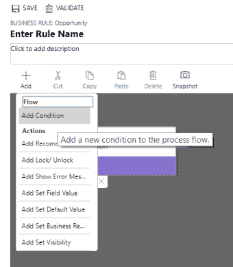

# 使用业务规则设计器定义业务规则

在上一章中，我们了解了如何使用新的可视化流程设计器通过拖放功能创建业务流程图。在本章中，我们将看到如何使用相同的可视化拖放流程设计器创建业务规则。业务规则首次在 Dynamics CRM 2013 中引入。基本上，业务规则允许我们定义规则，例如设置字段为必填/非必填、显示/隐藏字段、锁定/解锁字段等——也就是说，使用直观的界面轻松定义 CRM 表单/实体上的条件和操作，而之前我们需要编写 JavaScript 或开发插件才能实现。后续版本的 Dynamics CRM 进一步增强了业务规则。随着 Dynamics 365 的发布，业务规则设计器的界面得到了彻底改造，具备了拖放组件的能力，并新增了小地图、快照等功能。

在本章中，我们将涵盖以下内容：

+   Dynamics 365 中业务规则概览

+   了解新业务规则设计器中的不同组件及其使用方法

+   在 Dynamics 365 中实施新的推荐操作

+   业务规则设计器的其他功能

# 业务规则的发展

如前所述，业务规则首次在 CRM 2013 中引入。它提供了一个简单的声明性界面，系统自定义员、开发者或高级用户可以轻松创建验证和业务规则，而无需编写一行代码。业务规则界面由一组条件组成，满足这些条件时要执行的操作，以及作为约定的描述，以便理解业务规则的作用。

在 CRM 2015 中，许多 CRM 2013 的限制得到了改善。CRM 2013 中的业务规则仅限于在客户端运行。对于服务器端，仍然需要编写插件或其他自定义代码。这一问题在 CRM 2015 中得到了改善，新增了名为“实体范围”的选项。具有实体范围的业务规则将在客户端和服务器端都运行。

对于实体范围，如果规则是在表单中触发的，无论是在创建还是更新记录时，规则将首先在客户端运行，然后再在服务器端运行。因此，如果一个规则包含像“将销售金额设置为销售金额 + 10”这样的操作，就会导致规则验证失败，因为它会创建一个循环引用。

CRM 2015 中业务规则的第二大更新是支持 `if...else` 条件，并且可以使用 `AND`/`OR` 逻辑在条件中组合多个表达式。在 CRM 2013 中，要定义一个包含 `else` 条件的简单规则，我们必须编写两个业务规则。

在业务规则中，条件中的表达式只能使用 `AND` 条件或 `OR` 条件组合，但不能同时使用两者。

例如，在联系人表单中，如果“婚姻状况”字段的值为“已婚”，则将“配偶/伴侣姓名”字段设置为“业务必填”，否则将其设置为“无”。在这里，我们将只需编写一个业务规则，而不是过去需要编写两个业务规则，一个用于设置字段为业务必填，另一个用于将其设置为“无”，这得益于 CRM 2015 以来支持的`if...else`语句。

CRM 2015 的另一个更新是添加了名为“设置默认值”的新操作，用于设置字段的默认值。

CRM 2013 中的不同操作。以下截图显示了 Dynamics 2013 中可用的不同操作：

CRM 2015 中的不同操作（包括新的“设置默认值”操作）。以下截图显示了在 Dynamics 2015 中可用的不同操作，包括新的“设置默认值”操作：

CRM 2015 还引入了为字段设置默认值的操作，同时通过业务规则清除字段值的功能。

下一个版本，CRM 2016，添加了根据业务流程属性调用业务规则的功能。如下所示，我们在条件中定义了业务流程规则和活动阶段规则；即，如果业务流程等于“销售机会流程”并且活动阶段为“建议”。以下截图显示了在定义业务规则时使用业务流程流程的情况：

与 CRM 2016 中的活动阶段规则类似，我们可以根据 CRM 2016 中选择的阶段规则定义条件。

创建基于业务流程的业务规则的详细信息，请参阅 [`msdn.microsoft.com/en-us/library/mt639372.aspx`](https://msdn.microsoft.com/en-us/library/mt639372.aspx)。

随着 2016 年 12 月更新的 Dynamics 365，我们现在拥有了一个全新更新的编辑器，用于定义业务规则，一个称为“推荐”的新操作，以及一些新功能。

在本节中，我们详细介绍了业务规则从 CRM 2013 到 CRM 2016 的发展历程。现在，让我们详细查看 Dynamics 365 中的新业务规则设计器及其所有组件。

# 了解新业务规则设计器

要快速查看新设计器，请打开任何实体进行自定义，选择左侧导航中的“业务规则”，然后点击“新建”按钮。这将打开在 Dynamics 365 中引入的全新业务规则设计器，具有全新的外观和感觉。新设计器允许我们使用拖放功能添加组件，如条件和操作：

这里需要记住的关键点是，业务规则在本质上仍然是相同的；只是编辑器发生了更新。我们仍然可以使用之前可用的范围选项，即**实体**、**所有表单**以及该实体的单独表单：

让我们暂停一下，快速回顾一下范围：

| **范围类型** | **描述** |
| --- | --- |
| 实体 | 业务规则适用于该实体的所有表单，包括快速创建和服务器端。 |
| 所有表单 | 业务规则适用于该实体的所有表单，包括快速创建。 |
| **特定表单（信息、账户等）** | 业务规则仅在该实体的特定表单上运行。 |

业务规则设计器的组件基本上分为流程和操作。

条件组件属于流程，而可用的各种操作包括推荐、显示错误消息、设置默认值、设置可见性、锁定/解锁、设置字段值和设置业务必填项。

推荐是 Dynamics 365 中新增的一项操作，通过它我们可以根据某些条件建议用户执行某个活动。我们将在接下来的章节中详细介绍。

新的设计器还允许搜索这些组件。搜索是即时搜索类型，在我们仍在输入时就会显示结果。

例如，在搜索框中输入 set 会显示带有 set 名称的操作，并在下拉框中筛选出可见的组件：

每个组件——即条件和操作，都有其特定的属性。在查看这些组件的属性之前，让我们先看看如何在业务规则设计器画布中添加这些组件。

# 使用条件组件指定条件

在创建新的业务规则时，业务规则设计器会打开，并且已经添加了一个条件。

要添加更多条件，我们可以点击工具栏上的**添加**按钮并选择**添加条件**：

另一种选择是将条件组件从**组件**选项卡拖放到设计器画布中。选择设计器中的条件时，会在**属性**选项卡中显示该条件组件的特定属性：

让我们来看一下条件组件的一些属性。

点击 + 新建会在规则部分添加一个新规则。例如，以下图片中的规则 2：

以下图片显示了规则逻辑和属性选项卡中的条件表达式（文本视图）属性。**应用**按钮应用条件，而**丢弃**按钮可用于**撤销**上一步操作，类似于*Ctrl* + *Z*命令：

现在，让我们看看可用于业务规则的不同类型操作的属性。

# 使用操作组件对条件执行操作

可以像添加条件一样添加操作，方法是点击工具栏上的“添加”按钮，并选择我们要添加的操作。也可以通过从“组件”选项卡中拖动操作并将其与条件关联来添加操作，具体如下所示。这里，我们从“组件”选项卡中拖动了“显示错误消息”操作，并将其与我们现有的新条件链接：

这将“显示错误消息”（Show Error Message）操作添加到条件中：

现在让我们来看看所有不同操作的属性：

+   锁定/解锁：此操作可用于定义一个字段是否需要被锁定或解锁：

这是锁定字段“概率”（Probability）在商机表单中的显示方式：

+   显示错误消息（Show Error Message）：此操作可用于在特定字段上显示错误消息：

这是错误消息在商机表单中的显示方式。将鼠标悬停在红色叉图标上可以查看错误消息：

+   设置字段值：设置字段值操作可以用于为字段定义一个值。值可以使用以下选项设置。根据字段的数据类型，选项会有所不同：

+   值（Value）：此选项可以直接指定字段的值

    +   字段（Field）：此选项可用于将字段的值指定为另一个字段的值

    +   公式（Formula）：此选项可通过应用公式来指定字段的值（此选项适用于日期时间、整数和小数字段）

    +   清除（Clear）：此操作会清除字段的值（此选项对于布尔类型和选项集字段不可用）

例如，我们可以使用“设置字段值”（Set Field Value）操作来定义一个规则，利用公式将预计关闭日期设置为从商机创建之日起 100 天，具体如下所示：

+   设置业务必填（Set Business Required）：设置业务必填操作可用于将字段设置为“业务必填”或非强制性：

+   设置可见性：设置可见性部分可用于显示或隐藏字段：

+   推荐：如前所述，推荐是 Dynamics 365 中引入的新操作。推荐的不同属性如下：

推荐（Recommendation）是一种特殊类型的操作，它本身包含了其他操作：

该操作属于“设置字段值”（Set Field Value）类型：

这与我们之前讨论的设置字段值操作相同。为了看到所有组件的实际效果，让我们实现一个推荐业务规则。

# 推荐操作

现在我们对推荐操作的不同属性和业务规则设计器的不同组件有了一些基本了解，接下来我们将实现一个场景，看看它们如何发挥作用。我们将实现的场景是，如果选择的销售阶段是建议，我们将建议用户将概率设置为`80`。

让我们一步步地实现它。

在 CRM 中创建新业务规则有四种方式：

+   在字段级别：

    1.  打开实体进行自定义

    1.  点击并打开字段

    1.  在左侧导航中选择业务规则，并点击新建以创建一个新的业务规则：

+   在实体级别：

    1.  打开实体进行自定义

    1.  在左侧导航中选择业务规则，并点击新建以创建一个新的业务规则：

+   从表单：

    1.  打开自定义表单，点击业务规则功能区按钮：

1.  1.  这将在表单的右侧面板中打开业务规则资源管理器，允许我们通过点击新建业务规则按钮来创建新的业务规则：

1.  1.  另一种可以从表单内定义业务规则的方式是通过打开自定义表单，双击任何字段或选择任何字段，然后点击更改属性功能区按钮以打开字段属性对话框。然后我们可以选择业务规则选项卡并点击新建以创建新的业务规则。

    1.  回到我们的场景，选择机会实体进行自定义，并创建一个新的业务规则，详细信息如下：

| **规则名称** | 销售阶段推荐。 |
| --- | --- |
| **描述** | 将销售阶段-建议的概率推荐为 80。 |

1.  1.  选择条件组件并在属性选项卡中定义规则*当销售阶段等于建议时*，如下所示：

1.  点击应用以应用条件

1.  接下来，我们需要为此条件添加一个推荐操作

1.  可以点击工具栏上的添加按钮，或从组件选项卡中拖动推荐操作：

1.  选择推荐操作并定义其属性，如下所示，然后点击应用：

1.  接下来，我们需要定义作为推荐的一部分的操作（设置字段值）。为此，请在推荐中选择新建操作部分：

1.  我们将操作定义为`设置概率字段值为 80`，如下所示，然后点击应用：

这就是我们最终规则在设计器画布中的样子。点击“保存”以保存规则；它也会验证规则是否有错误。在我们定义规则的过程中，随时可以点击“验证”来验证规则：

验证成功后，我们将看到“验证成功”消息。

如果出现任何错误，“验证”将显示错误消息，并以红色高亮显示。我们可以查看属性标签页以找出错误原因。在保存并发布业务规则之前，我们需要修复所有错误：

接下来，我们需要点击激活按钮以激活规则。

要查看业务规则的实际应用，我们需要打开机会记录并将销售阶段的值设置为“提议”：

这将显示概率字段旁边的信息图标。点击它将打开推荐框，显示我们之前设置的推荐标题和详细信息：

我们可以点击“关闭”按钮来关闭推荐对话框。点击“应用”将把概率值更新为 80，这是我们在“设置字段值操作”中定义的，具体如下：

现在，我们已经实现了推荐规则。接下来，让我们在下一节中介绍业务规则设计器的其他附加功能。

# 业务规则设计器的附加功能

除了创建规则的功能外，新的业务规则设计器还引入了一些额外的功能，让我们快速浏览一下这些新功能。

# 剪切、复制和粘贴组件

业务规则设计器中的工具栏提供了剪切、复制、粘贴和删除组件的选项。

要剪切或复制组件，选择该组件并点击工具栏中的“剪切”或“复制”按钮。或者，我们也可以使用键盘快捷键（*CTRL* + *C* 或 *CTRL* + *X*）来复制或剪切：

点击“粘贴”（或*CTRL* + *V*）会显示一个带有+符号的区域，可以在该区域添加已复制的组件：

点击+会将复制的组件添加到指定位置。

# 删除组件

要删除组件，只需选择该组件并点击工具栏上的“删除”按钮（或按*CTRL* + *X*）。这将打开确认删除对话框。

在“确认删除”对话框中点击“确定”将删除该组件。

# 拍摄业务规则的快照

点击工具栏上的“快照”按钮将当前业务规则的状态保存为图像文件：

文件以业务规则的名称保存，扩展名为`.png`。

# 设置缩放级别并适应画布以提高可读性

我们可以通过点击 - 和 + 镜头来设置商务规则设计器的缩放级别。第三个选项是“适应画布”，它使商务规则定义自动调整以适应商务规则设计器的画布：

# 使用迷你地图轻松导航

商务规则设计器画布还具有迷你地图组件，可以提供已设计商务规则的迷你视图：

它还允许在设计器画布内轻松导航。使用迷你地图，我们可以轻松滚动到商务规则定义的右下角，在那里我们可以看到锁定/解锁操作组件，如下所示：

# 使用商务规则（文本视图）阅读商务规则

设计器画布中的商务规则（文本视图）组件显示定义的规则的文本视图。

对于我们之前定义的推荐规则：

商务规则（文本视图）将显示以下内容：

# 关于商务规则的几个关键点

以下是关于商务规则的一些重要要点，在我们决定是否使用它们之前需要考虑：

+   我们不能使用商务规则来隐藏表单的选项卡和部分。

+   如果通过商务规则设置字段的值，则该字段的 `OnChange` 事件将不会被触发。

+   商务规则中有一个 `if...else` 条件的限制，最多为 10 个。

+   如果商务规则引用了表单中没有的字段，它将不会运行，也不会显示任何错误消息。

+   如果商务规则没有定义为实体范围（Scope: Entity），它只会在表单加载时和字段值更改时运行。它不会在表单保存时运行。

+   商务规则按激活顺序执行。所以，如果我们为一个实体定义了多个相互关联的商务规则，首先激活的商务规则会先执行，之后的商务规则按激活顺序执行。

+   如果我们为某个特定字段定义了 JavaScript 和商务规则，JavaScript 将首先执行。

+   商务规则不支持具有时区、持续时间或语言格式的整数字段。

+   商务规则会在 Dynamics 365 的平板应用中进行缓存，当该应用打开时。如果有任何更改需要反映，必须关闭并重新打开该应用。

# 总结

在本章中，我们讨论了商务规则如何从 CRM 2013 到 Dynamics 365 的演变。我们有了一个全新的设计器，使得编写和定义商务规则更加直观。我们还详细了解了 Dynamics 365 中新增的推荐操作以及一系列新功能。

在下一章中，我们将了解 Microsoft PowerApps 及其如何用于创建自定义商务应用。
