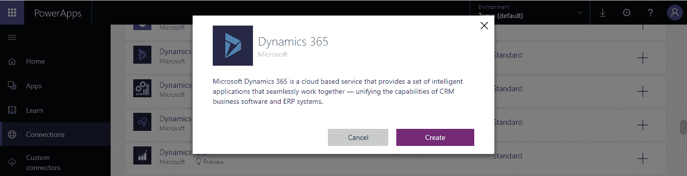
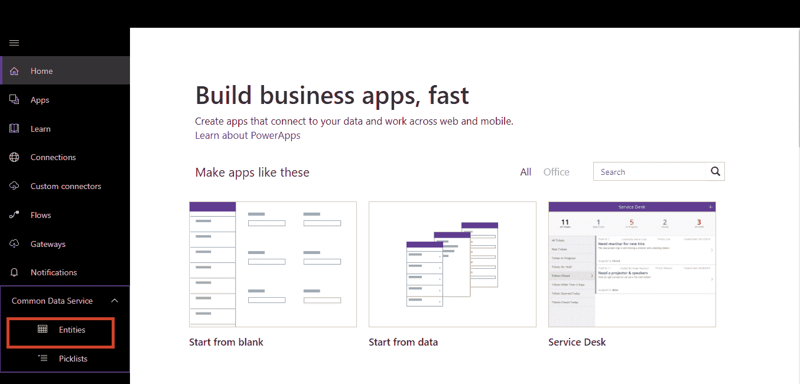
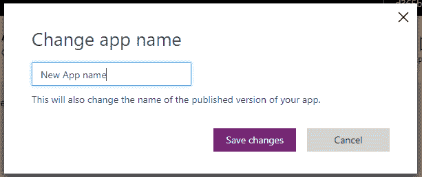
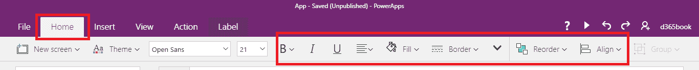
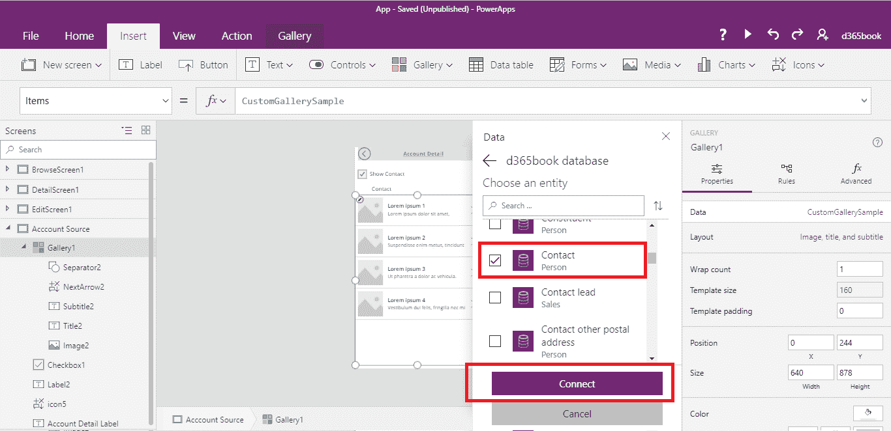

# 第五章：创建自定义业务应用

PowerApps 是一项服务，允许您跨平台创建、管理和使用自定义业务应用。它与客户现有的系统和数据源安全连接，允许自定义者在无需编写代码的情况下构建应用。通过发布，可以即时使这些应用适用于网页和移动用户。

在本章中，我们将涵盖以下几点内容：

+   PowerApps 概述

+   配置和创建 PowerApps 所需的权限

+   PowerApps 中的连接器

+   理解 PowerApps 的设计界面

+   使用 Dynamics 365 数据创建 PowerApps

+   在移动设备和平板设备上运行 PowerApps

+   PowerApps 中的数据连接服务

+   使用数据连接服务创建应用

+   在数据连接服务中创建实体

+   自定义 PowerApps

# PowerApps 在 Dynamics 365 中的概述

PowerApps 是一项服务，它与数据源（如 Azure、Dynamics 365 或 Office 365）建立安全连接，最小化组织对数据安全的担忧。任何用户都可以在 PowerApps 中设计应用，无需编写代码。发布这些 PowerApps 非常方便。

从员工的角度来看，PowerApps 提供了以下几种工作灵活性：

+   提供快速创建应用的能力

+   提供创建可在任何设备上运行的应用的能力

+   提供 Microsoft Office 的应用体验

+   提供内置的**连接**功能，能够与 PowerApps 建立连接，支持如 Dynamics 365 或 Office 365 等云服务

从开发者的角度来看，PowerApps 提供了以下功能：

+   将 Azure 服务纳入 PowerApps，提高用户端的性能和速度

+   容易创建与任何现有业务系统的数据连接和 API

+   在组织数据安全管理中的可靠性与稳健性

PowerApps 加速了工作进程，并减少了构建应用的时间。这对于那些初学者非常有效和高效，允许您直接将云端内容传输到移动设备。

PowerApps 节省了大量开发时间，同时也可以将云端数据源与最少的配置连接起来。

# 设计 PowerApps 的前提条件

在 PowerApps 中设计非常简单。在此之前，我们将讨论 PowerApps 的配置和设计流程。完成以下步骤以进行设计：

1.  使用 Dynamics 365 订阅创建 Office 365 实例

1.  使用您的 Office 365 登录 ID 登录 PowerApps 网站

1.  确保您的用户拥有 Office 365 全球管理员角色

# PowerApps 中的连接器

PowerApps 能够从云端获取数据。为此，首先需要创建连接器。连接器指定 PowerApps 的数据源。将数据从云端传输到 PowerApps 非常简单且安全，无需担心任何加密问题来确保数据的安全性。

PowerApps 连接器支持许多服务，如在线数据或本地数据。PowerApps 提供两种类型的连接器：

+   **标准连接器**：这些被称为标准连接器，因为 PowerApps 提供了对许多服务的支持，如 Dynamics 365、SharePoint 和 Excel。有许多连接器支持 PowerApps。

+   **自定义连接器**：自定义连接器仅在需要将 PowerApps 与自定义服务连接时创建；例如，由开发人员设计的自定义服务，用于从本地数据服务器获取数据到 PowerApps。

一些类型的连接器仅与特定的数据源配合使用；例如，表格数据源，如 SharePoint 或 Excel。一些连接器设计用于与基于功能的数据源协作，如 Outlook、Facebook 和 Twitter。当从这些数据源获取数据时，PowerApps 有自己的不同功能与数据进行交互。然而，基于功能的数据需要比表格数据更多的处理与 PowerApps 进行配合。

以下是 PowerApps 中可用的连接器列表：

| **10to8 预约调度** | **计算机视觉 API** | **Inoreader** | **Pivotal Tracker** |
| --- | --- | --- | --- |
| Act! | 内容转换 | Insightly | Planner |
| Adobe Creative Cloud | 内容审核 | Instagram | Plivo |
| Adobe Sign | DB2 | Instapaper | PostgreSQL |
| Amazon Redshift | Disqus | Intercom | Power BI |
| Apache Impala | DocFusion365 - SP | JIRA | PowerApps 通知 |
| AppFigures | DocuSign | JotForm | Project Online |
| 审批 | Dropbox | LeanKit | Redmine |
| Asana | Dynamics 365 | LinkedIn | RSS |
| AWeber | Dynamics 365 for Financials | LiveChat | Salesforce |
| Azure AD | Dynamics for Operations | LUIS | SendGrid |
| Azure 应用程序洞察 | Dynamics NAV | 邮件 | 服务总线 |
| Azure 自动化 | Easy Redmine | MailChimp | SFTP |
| Azure Blob 存储 | Elastic Forms | Mandrill | SharePoint |
| Azure Cosmos DB | Event Hubs | Medium | Skype for Business |
| Azure 数据湖 | Eventbrite | Microsoft Forms | Slack |
| Azure 事件网格 | Excel | Microsoft StaffHub | SmartSheet |
| Azure 事件网格发布 | 面部识别 API | Microsoft Teams | SMTP |
| Azure 文件存储 | Facebook | Microsoft Translator | SparkPost |
| Azure 日志分析 | 文件系统 | MSN 天气 | SQL Server |
| Azure 日志分析数据收集器 | Flic | Muhimbi PDF | Stripe |
| Azure 队列 | FlowForma | MySQL | SurveyMonkey |
| Azure 资源管理器 | FreshBooks | Nexmo | Teamwork Projects |
| Azure 表存储 | Freshdesk | 通知 | Teradata |
| Basecamp 2 | Freshservice | Office 365 预定 | Text Analytics |
| Basecamp 3 | FTP | Office 365 Groups | Todoist |
| Benchmark Email | GitHub | Office 365 Outlook | Toodledo |
| Bing 地图 | Gmail | Office 365 用户 | Trello |
| Bing 搜索 | Google 日历 | Office 365 视频 | Twilio |
| Bitbucket | Google 联系人 | OneDrive | Twitter |
| Bitly | Google Drive | OneDrive for Business | TypeForm |
| Bizzy (H3 Solutions, Inc.) | Google Sheets | OneNote (Business) | UserVoice |
| Blogger | Google Tasks | Oracle Database | Video Indexer |
| Box | GoToMeeting | Outlook Customer Manager | Vimeo |
| bttn | GoToTraining | Outlook Tasks | Visual Studio Team Services |
| Buffer | GoToWebinar | Outlook.com | WebMerge |
| Calendly | Harvest | PagerDuty | WordPress |
| Campfire | HelloSign | Parserr | Wunderlist |
| Capsule CRM | HipChat | Paylocity | Yammer |
| Chatter | HTTP with Azure AD | Pinterest | YouTube |
| Cognito Forms | Informix | Pipedrive | Zendesk |
| Common Data Service | Infusionsoft | Pitney Bowes Data Validation | - |

PowerApps 设计支持存储在云中的外部数据源；例如，从存储在 OneDrive 上的 Excel 文件中获取数据，还有其他数据源，如日历、电子邮件等，未来会支持该数据源的通知。

# 管理 PowerApps 数据

使用 PowerApps 中的数据并不是一个大挑战，借助连接器可以轻松使用数据，但从云端使用数据可能会导致大量数据进入应用程序。这对用户或系统本身都不好。非常重要的是创建一个高效、有效的应用程序来管理数据，因为获取数据就像是为应用程序用户获取所需的有用信息。这有助于减少内存占用、处理能力和网络带宽的需求。它还会通过获取有用的数据来提高 PowerApps 的响应时间和性能。

为了应对大量数据问题，**数据委派**被 PowerApps 用来进行处理。数据的委派只提供对用户有用的数据。这种数据排序能够节省大量网络流量。这意味着 PowerApps 会在加载设备之前处理数据。

委派就是在将数据发送到网络之前对数据应用公式。委派只支持表格数据源。

以下是数据源的列表，包含是否支持委派的信息：

| **数据源** | **支持委派** |
| --- | --- |
| Common Data Service | 是 |
| SharePoint | 是 |
| SQL Server | 是 |
| Dynamics 365 | 是 |
| Salesforce | 是 |
| Dynamics 365 for Operations | 否 |
| Dynamics 365 for Financials | 否 |
| Dynamics NAV | 否 |
| Google Sheets | 否 |

PowerApps 通过委派功能来实现委派。以下列表列出了连接支持的一些委派功能和数据源：

以下列表指定了每个数据源的筛选和查找委派谓词：

# 获取 PowerApps 本地数据

可以使用本地数据来创建 PowerApps。网关用于将本地数据与 PowerApps 连接。网关是连接本地服务器中可用数据与 PowerApps 之间的桥梁。网关能够通过以下连接与本地数据源建立连接：

+   文件系统

+   DB2

+   SharePoint

+   Informix

+   SQL Server

+   Oracle

# PowerApps 设计器

PowerApps 设计器用于管理 PowerApps。该设计器包含以下组件，供设计 PowerApps 时使用：

**屏幕**：屏幕是 PowerApps 中不同控件的容器。屏幕就是为用户交互设计的应用程序的可视前端。在 PowerApps 中，管理屏幕非常简单。

以下是 PowerApps 中可用的屏幕类型：

+   空白

+   可滚动屏幕

+   列表屏幕

+   表单屏幕

**控件**：设计 PowerApps 时，需要不同的 UI 元素。这些 UI 元素也称为控件。

以下列表指定了 PowerApps 设计器的控件：

1.  文本控件：

    +   标签

    +   文本输入

    +   HTML 文本

    +   笔输入

1.  控件：

    +   按钮

    +   下拉框

    +   日期选择器

    +   列表框

    +   复选框

    +   单选框

    +   切换

    +   滑块

    +   评分

    +   定时器

1.  图库：

    +   垂直

    +   水平

    +   灵活高度

    +   空白垂直

    +   空白水平

    +   空白灵活高度

1.  数据表

1.  表单：

    +   编辑

    +   显示

    +   实体表单

1.  媒体：

    +   图像

    +   相机

    +   条形码

    +   视频

    +   音频

    +   麦克风

    +   添加图片

1.  图表：

    +   柱状图

    +   折线图

    +   饼图

# 使用 Dynamics 365 数据创建 PowerApps

这是一种简单且可靠的创建 PowerApps 的选项。在本节中，我们将讨论如何创建 PowerApps；此外，我们还将介绍如何在 PowerApps 中配置 Dynamics 365。PowerApps 能够从云中检索数据，包括 Azure 和 Dynamics 365。将 PowerApps 发布到 Web 和移动平台非常容易。

创建 PowerApps，请按以下步骤操作：

1.  登录 Office 365 实例，并选择“浏览所有应用”选项：

1.  选择 PowerApps 选项。

1.  您将登录到 PowerApps 部分，或者您可以直接通过以下链接登录 PowerApps：[`web.powerapps.com/`](https://web.powerapps.com/)。使用与 PowerApps 登录相同的 Office 365 凭据：

1.  导航部分位于屏幕的左侧。要创建应用程序，首先创建一个连接。从导航中选择“连接”。

1.  PowerApps 会将您重定向到“连接”部分。在这里，要添加新连接，请点击右上角出现的“新建连接”选项：

1.  屏幕上将出现一个连接列表，如下图所示。从连接列表中选择 Dynamics 365：

1.  屏幕上将弹出一个确认对话框。点击“创建”按钮：

1.  现在，请检查“连接”部分；您将注意到屏幕上将显示 Dynamics 365 连接，如下图所示：

# 为案例实体创建 PowerApps

通过创建连接完成从云端提取数据的第一步。创建连接后，下一步是创建 PowerApps。有两种方法可以创建 PowerApps —— 使用 PowerApps 设计器从头开始创建 PowerApps，或者自动生成 PowerApps。

创建 PowerApps 将采用以下步骤：

1.  使用您的 Office 365 凭据登录 [`web.powerapps.com/`](https://web.powerapps.com/)。

1.  从导航中选择应用程序：

1.  选择“创建应用程序”按钮：

1.  在“以数据开始”下选择 Dynamics 365 Phone 布局选项：

1.  单击“连接”以查看所有连接列表。在选择连接后，**数据集**将显示在与**连接**对应的数据集列表中：

1.  选择与连接对应的适当数据集：

1.  将打开一个表格列表，对应于数据集。

1.  从列表中选择“案例”表，并单击“连接”按钮：

1.  完成此步骤后，PowerApps 站点将重定向您到 PowerApps Studio：

1.  要自定义应用程序，请首先从默认应用程序创建的屏幕列表中选择一个屏幕。要选择应用程序的屏幕以导航到 PowerApps Studio 左侧：

1.  PowerApps 根据案例记录接收的数据创建三个屏幕（请参考第 10 步中提到的屏幕）：

    +   BrowseScreen1: 当用户启动应用程序时，此默认屏幕显示应用程序。

    +   DetailScreen1: 当选择浏览屏幕上的项目时，此屏幕显示。

    +   EditScreen1: 当单击项目进行编辑时，此屏幕显示。

1.  要运行 PowerApps，请单击右上角的“运行”或预览应用程序：

1.  预览后，通过选择“文件”选项保存应用程序：

1.  单击“保存”。输入应用程序名称，并选择存储应用程序的位置：

# 在移动设备或平板电脑上运行 PowerApps

1.  在移动设备或平板电脑上安装 PowerApps。

1.  使用您的 Office 365 凭据登录。

1.  从应用程序列表中选择应用程序：

1.  打开所选的应用程序。

1.  PowerApps 将会启动：

    

# 通用数据服务

通用数据服务是一个基于 Azure 的云存储服务，旨在从多个应用收集数据并将其集中化，供用户使用。它被称为通用数据模型，包含数据实体。数据实体包含数据字段，用于存储数据。实体类似于数据源的表。PowerApps 可基于通用数据服务生成良好的应用。

以下是使用通用数据服务的优势：

+   将数据导入自定义或标准实体

+   创建支持不同场景和应用的自定义实体

+   将自定义字段添加到标准实体的能力

+   在应用中协作自定义和标准实体的能力

+   通过添加插件来提高生产力，以便从 Microsoft Excel 和 Outlook 访问数据

+   使用基于角色的安全性来保护自定义和标准实体的安全

+   使用预定义的数据选择列表的能力，例如国家或称呼

每个实体都包含一组记录，用户可以删除、读取、更新和创建这些记录。实体之间可以创建关系，这就像使用查找功能一样简单。

通用数据服务中的实体分为自定义实体和标准实体。这些实体负责确保数据存储的安全。以下是实体的好处：

+   **简单管理**：所有数据，包括数据和元数据，都存储在云端。

+   **简单共享**：高效且易于在多个用户之间共享数据。

+   **简单安全**：数据被安全存储，用户只有在获得授权时才能查看数据。基于角色的安全性允许你控制组织内不同用户对实体的访问。

+   **简单的元数据**：所有数据和关系都可以轻松存储在 PowerApps 上。

+   **生产力工具**：实体可以通过 Microsoft Excel 和 Outlook 等生产力工具轻松访问。

+   **选择列表**：易于使用的预定义数据选择列表。

通用数据服务中有两种实体类型：

+   **标准实体**：标准实体由通用数据服务提供，默认提供这些实体。

+   **自定义实体**：自定义实体是通用数据服务提供的扩展。当需要向通用数据服务添加新数据时，可以创建自定义实体。

实体包含字段。每个字段都有名称、数据类型、显示名称和一些简单的验证。数据类型可以是文本、日期、数字等。字段有三种类型：

+   系统字段

+   标准字段

+   自定义字段

**系统字段**：系统字段是最重要的字段，这些字段无法更改或删除。系统字段呈现所有实体，无论是标准的还是自定义的。以下字段是重要的系统字段。

+   创建记录日期

+   创建者

+   修改记录日期

+   最后修改者

**自定义字段**：当系统或自定义实体需要额外的数据字段时，我们可以在这些实体中添加自定义字段。

**标准字段**：每个标准实体都包含标准字段。

还可以在查找字段之间创建关系。查找数据类型用于表示实体之间的关系。

# 使用常见数据连接创建 PowerApps

我们已经了解了与常见数据连接相关的内容。为了理解常见数据连接，以下步骤将帮助创建常见数据连接：

1.  访问 PowerApps 网站并创建新的连接。选择常见数据服务：

1.  在“常见数据服务”对话框中选择“创建”按钮：

1.  使用您的 Office 365 凭证进行身份验证。

1.  通过导航到 PowerApps 导航栏检查常见数据连接。

1.  在导航栏中点击“应用”部分创建一个新应用，使用“常见数据服务”：

1.  从“选择实体”列表中选择“账户”实体，然后点击“连接”：

1.  系统将根据账户数据自动生成 PowerApps：

1.  点击**预览**按钮以运行应用：

1.  从菜单栏中选择“文件”选项。点击“另存为”选项，然后指定应用的位置和名称：

# 创建自定义实体

以下步骤将指定如何创建自定义实体：

1.  访问[www.powerapps.com](http://www.powerapps.com)，然后在左侧导航面板中展开“常见数据服务”部分，接着选择“实体”：

1.  选择“新建实体”按钮。填写“新建实体”对话框中的所有必填字段：

1.  实体将被创建，并显示所有字段：

1.  对于实体，存在多个部分可以添加，包括“字段”、“键”、“关系”和“字段组”。

1.  要添加“字段”，请选择“字段”部分，然后选择“添加字段”按钮。“添加字段”表单将会打开。

1.  完成必要的信息，并点击“添加字段”按钮：

1.  要添加关系，请按照相同的步骤，然后点击“关系”部分。选择“添加”按钮并填写以添加关系，指定相关实体：

1.  完成所有更改后，点击“保存实体”按钮：

# 自定义 PowerApps

PowerApps 提供了定制化的可行性。可以轻松地从 PowerApps 设计器中改变应用的外观、主题和控件。PowerApps 中可以进行以下定制：

为此目的，我们将在最后一部分创建一个应用：

**1. 编辑屏幕大小和方向**：

1.  打开最近创建的应用，进入 PowerApps 网站的导航窗格中的 Apps。

1.  选择应用带末尾的 `...` 符号。点击 Edit on the web 选项：

1.  PowerApps 设计器将在新标签页中打开：

1.  选择菜单栏中的 File 选项。

1.  然后点击 App settings 选项：

1.  在 App settings 中，选择 Screen size + orientation。将 Orientation 设置为 Portrait，然后点击 Apply 按钮保存更改：

1.  如果应用是针对平板的，则选择纵横比。纵横比和方向的锁定是可能的，但如果最终设备的纵横比与应用的纵横比不匹配，那么应用屏幕在最终设备上会显得不适合。作为好的实践，直到确保应用用户的终端设备相同时，不要锁定 PowerApps 的纵横比和方向。

**2\. 编辑 PowerApps 名称和图标**：

1.  现在，要更改应用名称，进入 File 菜单并选择 App settings。

1.  点击 App Name + Icon。

1.  点击 Edit app name，修改应用名称：

****

1.  PowerApps 网站页面将重定向到应用设置页面；你可以从此部分更改应用设置。点击 Edit app name 选项，屏幕上将出现一个更改应用名称的对话框：

****

1.  重命名应用并保存更改：

1.  在 PowerApps 中也允许编辑应用图标和符号：

1.  现在，点击导航中的 Save 选项，然后点击 Save app。它将显示一个发布应用的选项。点击 Publish this version 按钮，发布应用：

**3\. 在 PowerApps 中添加屏幕**：

设计应用的过程包括添加屏幕。要在应用中添加多屏幕，请按照以下步骤操作：

1.  在 PowerApps 设计器中的应用中，选择菜单中的 Home 按钮并点击 New screen。选择适合应用的屏幕，或者选择 Blank screen：

1.  要重命名屏幕名称，请点击左侧导航窗格中的 Screen 选项，然后选择重命名，或右键点击 Properties 并重命名屏幕。将其命名为 `Account Source`：

1.  添加屏幕后，在 DetailScreen1 上添加导航。选择 DetailScreen1，然后点击菜单上的 Insert 按钮：

1.  选择 Icons，添加一个前进图标到屏幕上，如下截图所示。如有需要，可以从属性中更改前进箭头的颜色：

1.  添加屏幕后，添加导航到 DetailScreen1。选择 DetailScreen1，然后点击菜单上的“插入”按钮：

1.  选择图标并在屏幕上添加一个前进图标。如果需要，可以更改前进箭头的颜色：

1.  选择并调整图标。在选择图标时，选择“操作”选项卡。在导航中，选择“OnSelect”，并将其属性设置为“Navigate”，如下面的截图所示：

1.  选择“帐户源”屏幕，并在屏幕上添加一个后退箭头：

1.  如下图所示设置图标的“操作”：

1.  现在点击**预览**按钮来运行和测试应用：

1.  点击应用的下一个按钮：

**4\. 在 PowerApps 中添加和配置控件**：

控件是屏幕上的 UI 元素，使应用更加互动。以下步骤是关于如何添加和配置屏幕上的控件。在上一节中，已向应用中添加了一个空白屏幕。接下来的步骤将在同一个应用中继续添加控件：

1.  在 PowerApps 设计器中打开应用并选择屏幕：

1.  从菜单栏选择“插入”选项。点击“标签”，该操作将添加一个标签到屏幕上：

1.  要更改新添加标签的属性，选择屏幕上的标签，然后点击右侧的“属性”选项卡。将标签的名称更改为`Account Detail Label`，文本更改为`Account Detail`。通过拖动其边缘来调整标签的大小：

1.  要配置控件，选择标签并点击菜单栏中的“主页”按钮。所有配置选项将可供使用：

1.  通过选择填充颜色，来更改标签的颜色，并选择合适的颜色：

1.  在屏幕上添加一个复选框和另一个标签：

1.  检查“联系”标签的可见性并将其关闭，然后为标签设置以下属性：

1.  `Contact`标签将根据复选框的值显示或隐藏：

1.  保存并发布更改。

**5\. 在 PowerApps 中添加列表和数据源**：

PowerApps 支持添加多个连接。我们将从上一节继续应用设计，添加不同的数据源，并使用 Gallery 控件添加一个列表：

1.  在 PowerApps 设计器中打开应用，并选择“帐户源”屏幕：

1.  选择“插入”按钮，然后点击“图库”以添加图库的垂直布局：

1.  调整图库和可见性条件，如下截图所示：

1.  向图库添加数据。首先，选择图库，然后点击“属性”选项卡。如果数据源尚未添加，选择“自定义数据源”，然后添加数据源：

1.  从连接列表中选择一个连接，或者创建一个新连接，然后点击“连接”。在此示例中，选择“通用数据服务”：

>

1.  从实体列表中选择联系人，然后点击“连接”按钮：

1.  选择联系人数据源：

1.  所有联系人将出现在图库控件中：

# 总结

在本章中，我们已经看到了所有 PowerApps 功能。我们还实现并配置了 PowerApps 连接和数据源。我们还使用 Dynamics 365 数据和通用数据服务数据创建并配置了不同的 PowerApps。 
