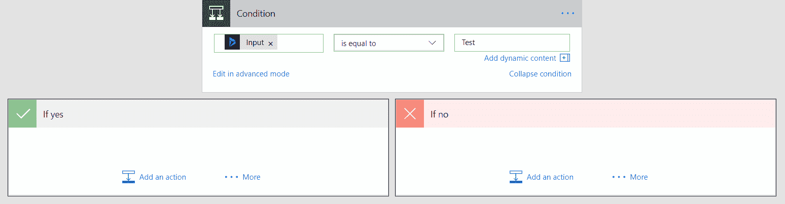
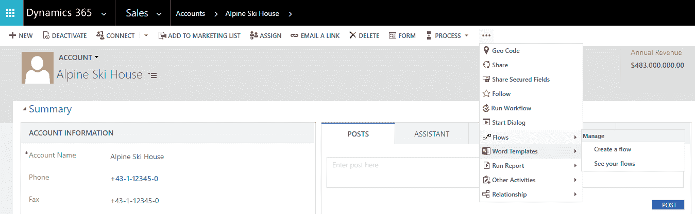
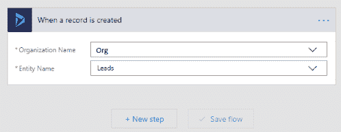
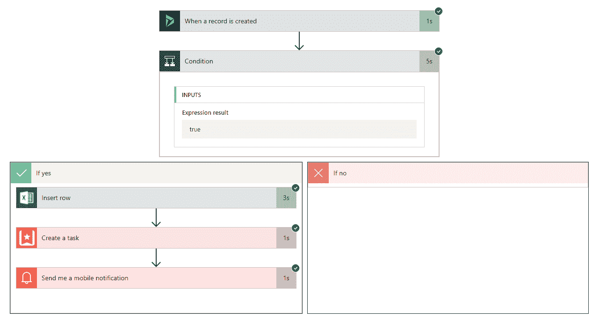
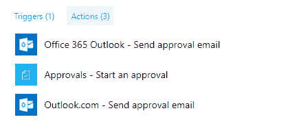

# 第六章：使用 Microsoft Flow 自动化业务流程

在上一章中，我们学习了如何使用 Microsoft PowerApps 来轻松创建自定义业务应用程序。在本章中，我们将学习 Microsoft Flow，它可以定义为一项基于云的服务，使用户能够构建工作流，自动化跨多个应用程序和服务的不同任务和流程。

本章将涵盖以下内容：

+   什么是 Microsoft Flow？

+   在 Dynamics 365 上下文中的 Microsoft Flow

+   使用 Microsoft Flow 自动化流程

+   Dynamics Workflow 与 Microsoft Flow 之间的区别

# 了解 Microsoft Flow

如前所述，Microsoft Flow 是一项基于云的服务，允许我们在不同的应用程序和服务之间创建自动化工作流。我们可以在 Microsoft Flow 中使用的应用程序和服务列表不断扩展。目前，Microsoft Flow 支持超过 170 种服务连接器，包括 Dynamics 365、Office 365 Outlook、OneDrive for Business、SharePoint、Twitter 和 Facebook 等流行应用程序。

查看 Microsoft Flow 中所有可用连接器的完整列表，请访问以下链接：

[`flow.microsoft.com/en-us/connectors/`](https://flow.microsoft.com/en-us/connectors/)

如果这还不够，我们还可以为我们的 RESTful API（使用 JSON）构建自己的连接器。

在 Microsoft Flow 中创建自定义连接器，网址为 [`flow.microsoft.com/en-us/documentation/register-custom-api/`](https://flow.microsoft.com/en-us/documentation/register-custom-api/)

除了基于云的服务，我们还可以连接到本地数据源。要连接到本地数据源（如 SharePoint、SQL Server、Oracle 等），我们可以创建本地数据网关。

在 Microsoft Flow 中管理本地数据网关，网址为 [`flow.microsoft.com/en-us/connectors/`](https://flow.microsoft.com/en-us/connectors/)

Microsoft Flow 提供了预定义的模板。这些模板是围绕流行服务和场景预构建的流程，我们可以立即开始使用。我们可以使用现有的模板来创建一个流程，或者如果某个特定场景未被现有模板涵盖，我们可以从头开始创建自己的流程——也就是从零开始创建一个。

若要查看 Microsoft Flow 中所有的模板列表，请访问以下链接：

[`flow.microsoft.com/en-us/templates/`](https://flow.microsoft.com/en-us/templates/)

一些最受欢迎的模板包括：

+   将 Office 365 的电子邮件附件保存到 OneDrive for Business

+   在 10 分钟后发送提醒给我自己

+   当我收到老板的电子邮件时，发送推送通知

这些模板被分为多个类别，例如审批、按钮、收集数据、电子邮件、移动设备、通知等。模板还可以按名称、流行度和发布时间进行排序，如下图所示：

要创建一个流，我们需要使用现有的 Microsoft 帐户（无论是工作、学校还是个人帐户）登录，否则我们需要先进行注册。

访问 Microsoft Flow 的主页（[`flow.microsoft.com`](https://flow.microsoft.com)）并点击“登录”或“免费注册”：

Microsoft Flow 不支持以 `.gov` 和 `.mil` 结尾的电子邮件地址。

# 选择合适的 Microsoft Flow 计划

在我们深入创建流之前，首先了解不同 Microsoft Flow 计划提供的功能。基本上，有两个 Microsoft Flow 计划——一个是免费计划，另一个是高级计划。

免费计划 Flow Free 包含无限流创建、每月 750 次运行（每个用户）以及 15 分钟检查（如果流在上次运行后的 15 分钟内被触发，它将排队等待）。

Flow Plan 1（付费版）提供无限流创建、每月 4,500 次运行和 3 分钟检查。它还包括高级连接器，如 Salesforce、Common Data Service、Adobe Creative Cloud 等。

查看完整的高级连接器列表请点击这里：

[`flow.microsoft.com/en-us/connectors/?filter=&category=premium`](https://flow.microsoft.com/en-us/connectors/?filter=&category=premium)

以下是一些高级连接器，如 Salesforce、DB2 和 DocuSign 等：

Flow Plan 2 提供无限流创建、每月 15,000 次运行以及 1 分钟检查，并包括高级连接器。Flow Plan 1 和 Flow Plan 2 提供 90 天的免费试用。

除了上述计划外，还有 Dynamics 365 计划和 Office 365 计划，这些计划包括 Microsoft Flow。这些计划提供无限流创建、每月 2,000 次运行，并且流的频率为 5 分钟。但它们不包括高级连接器。以下是两个包含 Dynamics 365 应用程序的计划：

# 理解流的不同组成部分

我们已经讨论了不同 Microsoft Flow 计划之间的差异，这有助于我们决定选择哪个计划。现在让我们了解一下流中的不同组成部分。

流的不同组成部分包括：

+   **服务**：服务可以定义为 Microsoft Flow 连接的不同应用程序，例如 Twitter、SharePoint、Facebook 等。这些服务既可以作为源，也可以作为流中的目标。以下是 Microsoft Flow 提供的一些服务的列表。目前，支持的服务有 160 个，且该列表还在不断增长。

+   **触发器**：触发器是 Flow 的起点。它们可以是 Microsoft Flow 中的手动触发器，需要最终用户手动启动，或者可以是自动触发的，按照计划在特定时间运行，或从另一个应用程序或服务启动。触发器还可以是基于事件的；当服务中发生事件时，它将触发 Flow。例如，在 CRM 中创建潜在客户记录或在 SharePoint 列表中添加新项可以作为触发器。以下是特定于 Dynamics 365 的触发器列表：

+   **操作**：操作定义了当 Flow 被触发时需要执行的步骤，换句话说，就是工作流执行的输出。操作可以是发送电子邮件、创建记录、在社交媒体（如 Twitter 或 Facebook）上发布内容等。以下是与 Dynamics 365 相关的一些操作：

+   **条件**：条件可以在 Flow 中放置 `if/then` 分支逻辑。它们基本上包括 Flow 在条件输出的基础上可以采取的“是”路径和“否”路径：

+   **循环和 Switch**：使用循环，我们可以在满足特定条件时多次执行某个操作，或者只执行一次。这可以通过 Apply to each 或 Do-Until 步骤来完成。同样，Switch 步骤可以用于在操作中指定类似于 switch case 的逻辑：

以下图片展示了一个空白的 Switch 步骤，包含一个 Apply to each 步骤和一个 Do Until 步骤：

我们可以通过 Flow Ideas 门户提交关于新连接器和触发器的建议：

[`powerusers.microsoft.com/t5/Flow-Ideas/idb-p/FlowIdeas`](https://powerusers.microsoft.com/t5/Flow-Ideas/idb-p/FlowIdeas)

在本节中，我们介绍了 Microsoft Flow 的概念，提供的不同计划，以及构成 Flow 的基本组件。在下一节中，我们将讨论 Microsoft Flow 在 Dynamics 365 背景下的应用。

# 在 Dynamics 365 背景下理解 Microsoft Flow

Microsoft Flow 提供了针对 Dynamics 365 的预构建模板，例如从 Excel 表格创建 Dynamics 365 潜在客户、通知团队新机会等。以下是一些特定于 Dynamics 365 的流行模板：

查看完整的 Dynamics 365 模板列表，请访问以下链接：

[`flow.microsoft.com/en-us/connectors/shared_dynamicscrmonline/dynamics-365`](https://flow.microsoft.com/en-us/connectors/shared_dynamicscrmonline/dynamics-365)

以下表格列出了可用于 Dynamics 365 的不同触发器：

在撰写本章时（2017 年 11 月），微软还为 Dynamics 365 添加了两个新的触发器和四个新的操作，这些内容作为版本 2 处于预览阶段。这些更新版本的触发器和操作将继续获得最新的功能。拥有独立的版本有助于在不干扰现有流程（使用旧版）流的情况下测试新功能。

新增了一个触发器，可以在创建和更新实体记录时调用。触发器和操作的更新版本支持将选项集作为本地化的字符串，而旧版仍然使用整数作为选项集值。

可用于 Dynamics 365 的操作列表：

以下是添加到 Dynamics 365 中的新触发器和操作：

**触发器**：

+   **当记录被创建时（预览）**：当在 Dynamics 365 中创建记录时，触发流程，且选项集作为字符串暴露

+   **当记录被创建或更新时（预览）**：当在 Dynamics 365 中创建或更新记录时，触发流程，且选项集作为字符串暴露

**操作**：

+   **创建新记录（预览）**：为实体创建一条新记录，选项集作为字符串暴露

+   **获取记录（预览）**：获取特定实体的记录，选项集作为字符串暴露

+   **列出记录（预览）**：获取实体的记录，选项集作为字符串暴露

+   **更新记录（预览）**：更新具有选项集并以字符串形式暴露的实体的现有记录

在 Dynamics 365 中，我们需要为自定义实体启用变更追踪，以便 Microsoft Flow 跟踪该实体记录的任何更新或删除。默认情况下，OOB 实体启用了变更追踪。对于自定义实体，转到设置 | 自定义 | 打开自定义实体 | 在常规标签的“数据服务”部分选中“变更追踪”复选框。

# 创建一个 Dynamics 365 流程

我们可以从 Microsoft Flow 的主页 ([`flow.microsoft.com/`](https://flow.microsoft.com/)) 创建流程，或者在 Dynamics 365 中，通过转到设置 | Microsoft Flows 创建一个流程。

我们还可以通过功能区上流程弹出菜单中的“创建流程”或“查看您的流程”菜单选项创建一个流程，如下图所示：

下图显示了添加到表单功能区中的新流程菜单：

让我们实现一个示例流程，看看所有组件如何运作。

我们将实现以下场景：

+   **场景**：在 Dynamics 365 中创建一个评分为高的潜在客户记录时，将潜在客户记录的详细信息添加到 OneDrive 内的 Excel 文件中的新行，创建 Wunderlist 中的跟进任务，并最终在 Microsoft Flow 移动应用中发送通知。

+   **触发器**：在 Dynamics 365 中创建潜在客户记录时触发。

+   **条件**：如果创建的潜在记录中的 Rating 字段值为 High。

+   **操作**：在 Excel 中插入行，创建 Wunderlist 任务并发送通知。

1.  访问 Microsoft Flow 主页([`flow.microsoft.com/`](https://flow.microsoft.com/))，使用 Microsoft 帐户登录，进入“我的流程”并点击“从空白创建”。

1.  指定流程名称，并在搜索框中搜索 Dynamics 365，筛选出与 Dynamics 365 相关的触发器和操作。在结果中，我们需要选择 Dynamics 365- 当记录创建时触发器：

1.  指定要连接的 CRM 的“组织名称”，并在实体名称中选择潜在：

1.  点击“新步骤”，然后选择“添加条件”以添加条件：

1.  将 Rating 设置为等于`1`，即 Lead 中 Rating 字段的选项“Hot”的`OptionSet`值，如下图所示：

1.  在“动态内容”选项卡的搜索框中搜索`Rating`字段，并将其添加到条件中。动态内容选项卡将列出所有潜在实体的字段。Rating 字段的值将在流程执行时从 Dynamics 365 中创建的潜在记录中获取，因此称之为动态内容。动态内容将在流程执行时，基本上包含新创建的潜在记录的详细信息：

1.  条件块具有与“是”路径和“否”路径相关联的分支。在“是”路径中点击“添加操作”以添加操作：

1.  搜索并选择 Excel - 插入行操作：

1.  如果需要，登录 OneDrive 账户并授权 Microsoft Flow。在`One Drive`文件夹中，选择要保存潜在记录详情的 Excel 文件及其中的表格。以下截图显示了我们 Excel 文件中现有的潜在表格，我们将在其中添加一行包含潜在记录详情的数据：

1.  将每一列与“插入行”操作中的相应字段（动态内容）进行映射，如下图所示：

1.  对于我们的下一个操作，添加一个新的操作，在 Wunderlist 中创建一个任务。为此，请点击先前添加的“插入行”操作中的“添加操作”，然后选择 Wunderlist - 创建任务操作，如下图所示：

1.  如果需要，登录 Wunderlist 并授权 Microsoft Flow。指定如下截图所示的详细信息：

1.  要向 Microsoft Flow 移动应用发送推送通知，请点击流程中的“添加操作”，然后选择“通知 - 发送移动通知”操作，如下图所示：

1.  指定如下图所示的详细信息：

1.  点击“创建流程”以创建流程。

1.  为了测试我们的流程，让我们创建一个潜在客户记录，评级为“热”，并指定如下图所示的其他详细信息：

1.  要检查流程的状态，在 Microsoft Flow 的首页选择“我的流程”，然后点击我们创建的流程：

1.  点击“查看所有选项”在“运行历史记录”中，将显示 Microsoft Flow 运行历史记录的所有详细信息：

1.  点击“成功”行将显示步骤的执行详情。在我们的案例中，所有步骤都成功完成，绿色勾号表示：

现在让我们检查每个操作在其相应应用中的输出：

1.  **插入 Excel 行操作**：此操作已将一个新行添加到我们的 Excel 表格中，包含创建的潜在客户记录的详细信息：

1.  Wunderlist 操作中的创建任务：此操作已在 Wunderlist 的收件箱中添加了一个新的待办任务：

1.  在 Microsoft Flow 移动应用中的“发送我移动通知”操作：此操作已在 Flow 移动应用中发送了一条有关创建的潜在客户记录的通知：

Microsoft Flow 移动应用适用于 Android、iOS 和 Windows Phone。使用移动应用，我们可以从模板创建流程，监控流程活动，并管理我们的流程：[`flow.microsoft.com/en-us/documentation/mobile-create-flow/`](https://flow.microsoft.com/en-us/documentation/mobile-create-flow/)

这完成了我们 Dynamics 365 流程的创建和测试。现在，要与其他用户共享此流程，我们可以将该用户添加为所有者：

1.  转到“我的流程” | 选择流程 | 点击“邀请其他所有者”：

1.  指定新所有者：

我们还可以将我们的流程提交为模板，发布到 Microsoft Flow 模板库：[`flow.microsoft.com/en-us/documentation/publish-a-template/`](https://flow.microsoft.com/en-us/documentation/publish-a-template/)

在本节中，我们看到了特定于 Dynamics 365 的不同模板、触发器和操作。我们还创建了一个自定义的 Dynamics 365 流程。在下一节中，我们将比较 Flow 和 Dynamics 365 工作流，帮助我们选择其中一个。

# Dynamics 365 工作流与 Microsoft Flow

有些场景可以通过 Dynamics 工作流或 Microsoft Flow 来实现。以下是我们在决策时可以考虑的一些要点：

如果某个场景可以在 Dynamics 365 中通过工作流实现，那么工作流是更好的选择。这是因为我们可以通过 CRM 中的系统作业轻松管理和监控它。而要管理和监控 Flow 流程，我们需要跳出 CRM，在 Flow 的门户中进行操作。

工作流可以同步和异步运行。当条件满足时，工作流会立即触发。因此，在我们希望立即采取行动的场景中，工作流是更好的选择。此外，工作流具有解决方案感知能力，因此可以轻松地从一个环境迁移到另一个环境。

在我们需要与第三方应用程序和服务（如 Twitter、Facebook、Yammer 等）无缝集成的场景中，Microsoft Flow 更为适用。要在工作流中实现这一点，可能需要开发工作，即编写自定义工作流活动。

使用工作流时，我们只能通过电子邮件发送通知；然而，使用 Flow，我们可以通过 SMS、推送通知（到 Flow 移动应用）、以及通过 Gmail、Hotmail 等账户发送电子邮件通知，且无需编写任何代码。

Microsoft Flow 通过特定的审批操作支持审批场景，如下图所示。审批请求可以发送给除了 Dynamics 365 用户以外的其他用户：

Microsoft Flow 拥有 Dynamics 365、列记录操作，可以用来检索实体的记录。我们可以使用它找到符合特定条件的实体记录列表，并对其进行处理。它还可以用来设计一个流，当父记录被更新或删除时，自动更新或删除子记录。通常，要实现这样的场景，我们必须在 CRM 中编写自定义的工作流活动或插件。使用 Microsoft Flow，我们可以无需编写任何代码即可实现这一点：

使用 Microsoft Flow 删除 Dynamics 365 中父记录被删除时的所有子记录：[`debajmecrm.com/2017/02/21/dynamics-crm-365-flows-using-microsoft-flows-generic-framework-to-delete-all-child-records-when-a-parent-record-is-deleted-in-dynamics-365/`](https://debajmecrm.com/2017/02/21/dynamics-crm-365-flows-using-microsoft-flows-generic-framework-to-delete-all-child-records-when-a-parent-record-is-deleted-in-dynamics-365/)

在动态工作流中，为了实现调度任务，我们最终会使用等待或超时条件，这可能会影响系统性能。另一方面，Microsoft Flow 支持**重复触发器**，可以在定期的、自定义的时间间隔触发事件：

简而言之，选择其中一种并没有明确的界限，因为两者都有各自的优点和不足。

# 总结

本章中，我们介绍了如何使用 Microsoft Flow 编写工作流，这些工作流可以与多个应用程序和服务无缝集成，且无需编写任何一行代码。我们还详细探讨了 Microsoft Flow 在 Dynamics 365 中的应用，并学习了如何编写一个简单的流，以集成多个应用程序。

在下一章中，我们将介绍 Web API 以及如何使用它们来创建与 Dynamics 365 集成的应用程序。
