# 第八章：利用 Dynamics 365 中的 Azure 扩展

在上一章中，我们学习了如何在 Dynamics 365 中使用新的 REST Web API 端点执行各种操作，并如何利用它来开发自定义的业务应用程序。在本章中，我们将学习 Dynamics 365 如何原生支持与 Microsoft Azure 的集成。本章假定你已经对 Microsoft Azure 的基础知识有基本的了解。

关于 Microsoft Azure 的参考资料—[`docs.microsoft.com/en-us/azure/fundamentals-introduction-to-azure`](https://docs.microsoft.com/en-us/azure/fundamentals-introduction-to-azure) 和 [`azure.microsoft.com/en-in/training/`](https://azure.microsoft.com/en-in/training/)

Microsoft Azure 可以定义为一个云计算平台或一组基于云的服务，开发人员和 IT 专业人员可以通过全球各地的数据中心，使用这些服务来构建、测试、部署和管理应用程序。Microsoft Azure 提供 **基础设施即服务**（**IaaS**）、**平台即服务**（**PaaS**）和 **软件即服务**（**SaaS**）。

使用 **IaaS**，我们基本上是在指 Azure 虚拟机，即托管在云中的服务器。云计算服务提供商（在这里是 Microsoft）管理基础设施，而我们需要为使用这些资源付费。在这种模式下，我们拥有完全的控制权，并且负责管理操作系统、中间件以及在其上运行的应用程序。我们还可以将 Dynamics 365 部署到 Microsoft Azure 虚拟机中的本地环境。

使用 **PaaS**，我们可以在云中获得完整的开发和部署环境，可以用来构建、部署和管理我们的云应用程序。我们只需为使用的云服务付费。在这里，我们只管理我们的应用程序和服务，而云服务提供商管理其他一切。

使用 **SaaS**，我们基本上是通过互联网连接并使用软件或基于云的应用程序。在这种模式下，我们只需要为所使用的云应用程序付费。云服务提供商管理所有内容，包括底层基础设施、中间件、应用程序软件等。我们只需连接到这些应用程序，通常通过浏览器在互联网上使用它们。Dynamics 365 在线版属于 SaaS。

在本章中，我们将涵盖以下内容：

+   理解 Azure 与 Dynamics 365 的集成

+   配置 Azure 与 Dynamics 365 的集成

+   编写支持 Azure 的插件和不同的监听器应用程序

# 理解 Azure 与 Dynamics 365 的集成

Microsoft Azure 服务总线是 Microsoft Azure Stack 中的主要组件，它使我们能够将 Dynamics 365 与 Microsoft Azure 连接。通过 Azure 服务总线，我们可以将 Dynamics 365 内部执行的操作详情传递给多个监听该信息的应用程序，并且这些应用程序可以读取和处理这些信息。

# Microsoft Azure 服务总线简介

Azure Service Bus 可以定义为在微软 Azure 数据中心运行的云消息传递服务。Azure Service Bus 使我们能够连接不同的应用程序、服务或设备，这些应用程序、服务或设备可能托管在云中或防火墙内的本地网络中。它可以用于连接不同的**业务线**（**LOB**）应用程序、平板电脑、手机，甚至任何家用电器或传感器。该 Azure Service Bus 支持两种不同的通信机制：经纪人消息传递（队列、主题和订阅）和中继服务。

Azure Service Bus 的经纪人消息传递功能包括可以在微软 Azure 数据中心创建和托管的队列和主题。应用程序可以连接到创建的队列或主题，并向其发送消息。这些消息将被持久存储。接收应用程序随后可以连接到这些队列或主题，接收并处理消息。发送应用程序和接收应用程序可以托管在云中，也可以托管在本地。队列提供单向异步通信，发布者发布消息，订阅者接收消息。每条消息只会被单个订阅者接收。主题同样提供单向异步消息传递基础设施，发布者发布消息，接收者像队列一样接收消息。主要区别在于，相同的消息可以被多个订阅者接收，订阅者可以选择性地指定一些标准，使其只接收符合规定规则的消息。由于它们通过经纪人提供单向异步通信，即发送者和接收者之间没有直接连接，因此不适用于我们希望发送者和接收者交换消息或直接连接，或希望它们之间进行同步通信的场景。为了解决这个问题，Azure Service 提供了中继服务。

Azure Service Bus 的中继服务提供应用程序之间的双向同步通信能力，不同于队列和主题。中继服务允许我们在云中暴露一个端点，作为我们托管在云中或本地服务的代理。任何能够访问互联网的客户端都可以调用这个端点，这些请求将被中继回防火墙后面托管的服务或任何其他侦听消息的应用程序。这为组织提供了一种非常可靠且具有成本效益的方式来暴露服务。

Azure Service Bus 文档：[`docs.microsoft.com/en-us/azure/service-bus-messaging/`](https://docs.microsoft.com/en-us/azure/service-bus-messaging/)。

# 理解 Dynamics 365 和 Azure Service Bus

在前一部分中，我们介绍了 Azure Service Bus 的基础知识，本部分将讨论 Dynamics 365 如何与 Azure Service Bus 集成。

下图显示了 Dynamics 365 如何与 Azure Service Bus 协作，连接到可以位于云端或托管在防火墙后面的应用程序：

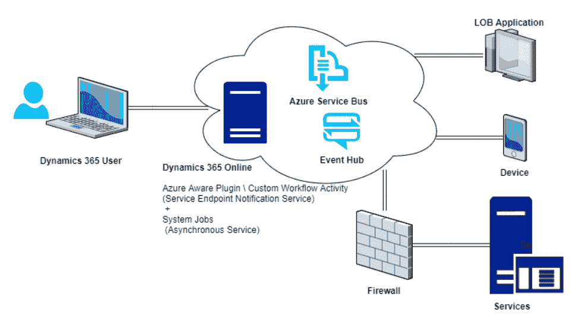

以下是该过程的逐步解释：

1.  Dynamics 365 用户在 CRM 内执行操作，例如创建潜在客户记录、更新机会等。

1.  这会触发已注册的 Azure 感知 OOB（开箱即用）插件或自定义 Azure 感知插件或工作流活动的执行，然后通知异步服务系统作业。

1.  一旦异步服务收到通知，它会处理将请求消息的数据上下文发布到 Azure Service Bus 的过程。此发布操作通过系统作业执行。Dynamics 365 用户可以在 Dynamics 365 Web 应用中检查系统作业的状态，（设置 | 系统作业）。

1.  Microsoft Azure Service Bus 随后将执行上下文转发给 Microsoft Azure Service Bus 监听应用程序。Azure Service Bus 还负责管理授权。发布数据到 Service Bus 的 Dynamics 365 和任何读取数据的监听应用程序，都是通过**访问控制服务**（**ACS**）或**共享访问签名**（**SAS**）进行授权的。

Azure Service Bus：身份验证与授权——[`docs.microsoft.com/en-us/azure/service-bus-messaging/service-bus-authentication-and-authorization`](https://docs.microsoft.com/en-us/azure/service-bus-messaging/service-bus-authentication-and-authorization)。

1.  注册在 Azure Service Bus 解决方案端点上的 Microsoft Azure Service Bus 监听应用可以读取并处理 Azure Service Bus 发布的 Dynamics 365 执行上下文。

1.  然后，Azure Service Bus 将相关系统作业的状态设置为完成。

SAS 授权在 CRM Online 2016 Update 1 中引入，并且比 ACS 性能更好。SAS 是推荐的 Dynamics 365 授权方法。有关将服务端点从 ACS 更新为 SAS 授权的内容，请参阅此处——[`msdn.microsoft.com/en-us/library/mt728940.aspx`](https://msdn.microsoft.com/en-us/library/mt728940.aspx)。

# 理解 Azure 感知插件

正如我们之前所见，我们可以在 Dynamics 365 中针对特定事件注册一个 Azure 感知插件，该插件将此执行上下文传递给 Azure Service Bus，然后由它将上下文转发给监听应用程序。在这里，我们可以使用 OOB Azure 感知插件，或者我们可以编写自己的自定义 Azure 感知插件或自定义工作流活动。

使用 Dynamics 365 Online Version 9.0 时，我们可以使用 Webhook 作为 Azure Service Bus 的替代方案，将关于事件的数据发送到 Web 应用程序——[`docs.microsoft.com/en-us/dynamics365/customer-engagement/developer/use-webhooks`](https://docs.microsoft.com/en-us/dynamics365/customer-engagement/developer/use-webhooks)。

对于 OOB Azure 感知插件，我们需要通过插件注册工具首先注册新的服务端点：

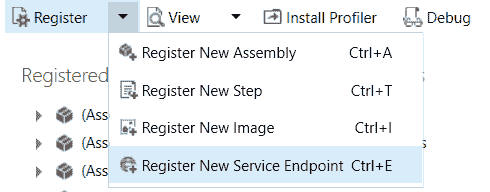

在服务端点注册中，我们需要指定一个连接到 Azure Service Bus 的地址，以便将插件事件传递给它：

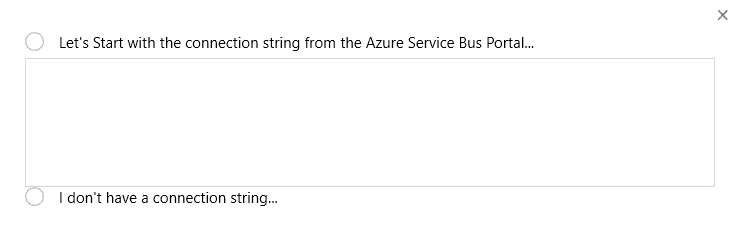

服务端点包含有关 Azure Service Bus 的授权信息，如 Service Bus 命名空间地址和 SAS 密钥。成功注册后，我们可以像处理常规插件程序集一样，为已添加的服务端点添加插件步骤。

这个 Azure 感知的现成插件以完全信任模式执行。然而，现成的 Azure 感知插件存在某些限制，例如它只能异步执行，不能调用 CRM SDK 方法，也不能编写跟踪语句用于日志记录或审计目的。

除了 Dynamics 365 提供的现成的 Azure 感知插件外，我们还可以创建自定义的 Azure 感知插件或自定义工作流活动。

传递给 IPlugin `Execute` 方法的 `IServiceProvider` 包含 `IServiceEndpointNotificationService` 的实例。我们可以调用其 `Execute` 方法，将执行上下文发布到 Azure Service Bus。`Execute` 方法需要一个服务端点的实体引用；我们可以从插件注册工具中获取服务端点 ID。添加这段代码以调用端点通知服务，使我们的插件**Azure 感知**：

```
public class AzureAwarePlugin : IPlugin 
{ 
public void Execute(IServiceProvider serviceProvider) 
{ 
// set the Service Endpoint Id 
var serviceEndpointId = "[ServiceEndpointGuid]"; 

// Obtain the execution context from the service provider. 
IPluginExecutionContext context = (IPluginExecutionContext) 
serviceProvider.GetService(typeof(IPluginExecutionContext)); 

// Extract the notification service for posting execution context 
IServiceEndpointNotificationService notificationService = (IServiceEndpointNotificationService) 
serviceProvider.GetService(typeof(IServiceEndpointNotificationService)); 
// Call the Execute method. 
var response = notificationService.Execute(new EntityReference("serviceendpoint", 
new Guid(serviceEndpointId)), context); 
} 
} 
```

自定义的 Azure 感知插件在沙盒中以部分信任模式执行。编写自定义插件的好处是我们可以调用 CRM SDK 方法，并且在双向中继服务的情况下，还可以接收监听应用程序的响应。此外，插件可以注册为同步或异步执行。

对于 Azure 感知插件，建议将其注册为异步执行，以获得最佳的系统性能。

# 了解 Dynamics 365 与 Azure 解决方案之间的不同合同

以下是在通过插件注册工具注册新服务端点时，可以定义的不同类型的合同：

**队列：**

对于队列合同，需要在 Azure Service Bus 中创建一个消息队列。监听应用程序等待 Service Bus 在队列中发布的消息。当队列中有消息时，监听应用程序可以读取并处理这些消息。在队列合同的情况下，监听应用程序不需要主动监听。

**单向：**

在单向合同的情况下，监听应用程序需要主动监听。如果没有活动的监听器，向 Service Bus 发送的请求会失败，系统作业在重试次数用尽后，其状态会被设置为“失败”。

监听应用程序需要实现`IServiceEndpointPlugin`接口的`Execute`方法，并结合`WS2007HttpRelayBinding`，`RemoteExecutionContext`由 Azure Service Bus 传递。

**双向：**

双向合同类似于单向合同，唯一的区别是，在双向合同中，可以将类型为字符串的消息从监听应用程序返回给发布消息到 Azure 服务总线的自定义插件工作流活动。

监听应用程序需要实现 `ITwoWayServiceEndpointPlugin` 接口的 `Execute` 方法，并配合使用 `WS2007HttpRelayBinding`，该绑定将 `RemoteExecutionContext` 从 Azure 服务总线传递过来。

**REST：**

REST 合同类似于双向合同。在这里，监听应用程序需要实现 `IWebHttpServiceEndpointPlugin` 接口的 `Execute` 方法，并配合使用 `WebHttpRelayBinding`，该绑定将 `RemoteExecutionContext` 从 Azure 服务总线传递过来。

**主题：**

主题类似于队列。然而，使用主题时，一个或多个监听器可以订阅该主题，以接收来自主题的消息。消息将经过筛选，并通过主题的相应订阅路由到订阅者。

**事件中心：**

Microsoft Azure 事件中心提供大规模的遥测服务。它们通常用于大规模应用程序遥测和物联网场景。多个设备或应用程序可以将遥测消息发送到事件中心。消息可以达到每秒数千或数百万条，并被读取和处理。创建事件中心解决方案应用程序类似于编写 Azure 服务总线监听应用程序。在这里，我们首先开始在 Microsoft Azure 中创建一个事件中心，就像在 Azure 服务总线中一样。接下来，我们需要在通过插件注册工具注册 Dynamics 365 服务端点时指定事件中心连接字符串。我们将在本章后面详细讨论这一点。

要为上述合同编写监听应用程序，我们需要使用 Azure SDK 版本 1.7 或更高版本—[`azure.microsoft.com/en-in/downloads/`](https://azure.microsoft.com/en-in/downloads/)。

现在，既然我们已经对 Dynamics 365 中可用的 Azure 扩展有了基本了解，接下来我们将在下一部分实施一个简单的业务场景，看看它是如何运作的。

# 配置 Dynamics 365 与 Azure 服务总线的集成

让我们以一个简单的场景为例进行实施，这将帮助我们理解如何在 Dynamics 365 中配置 Azure 扩展，以及如何为不同的合同类型编写不同的监听应用程序。监听应用程序本质上是一个第三方应用程序，当 Dynamics 365 中发生事件时，它需要被通知。监听应用程序和 Dynamics 365 是两个独立的、断开连接的应用程序。

场景：在 Dynamics 365 中创建潜在客户记录时，将其信息（执行上下文）通过 Azure 服务总线传递给监听应用程序。然后，监听应用程序可以读取并处理该信息。

让我们详细地逐步讲解：

1.  使用现有账户登录到 Azure 管理门户 [`portal.azure.com`](https://portal.azure.com)，或在 [`azure.microsoft.com/en-us/free/`](https://azure.microsoft.com/en-us/free/) 创建一个免费账户

1.  在门户中搜索并添加一个新的服务总线服务。提供所需的详细信息并点击创建命名空间，以创建服务总线命名空间。必须指定的名称需要在整个数据中心内唯一。这将为服务总线命名空间创建一个 URI，可以通过它在互联网上访问服务总线。此服务总线命名空间充当通信机制的容器，如中继服务和经纪消息（队列和主题）：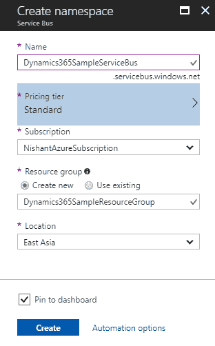

1.  接下来，我们将创建一个队列，用于将消息从 Dynamics 365 发布到该队列。打开服务总线，点击**+**队列按钮，创建一个包含所需详细信息的队列：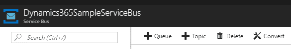

1.  按照此处显示的详细信息提供，并点击创建按钮以创建队列：

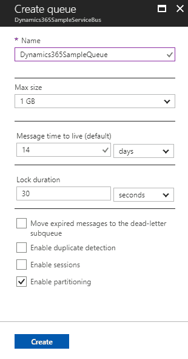

1.  对于创建的队列，选择共享访问策略并点击添加，创建一个新的共享访问策略。顾名思义，发送权限是将消息发送到命名空间监听器所需的权限，类似地，监听权限是监听应用程序在命名空间上开始监听所需的权限。管理权限是创建队列、删除队列、创建订阅、枚举主题、订阅等所需的权限。在这里，我们在添加 SAS 策略时选择了**发送**和**监听**复选框，因为我们将使用相同的策略同时进行发送和监听。我们也可以创建两个单独的策略，一个用于发送者，另一个用于监听应用程序。点击创建，以创建一个新的 SAS 策略：

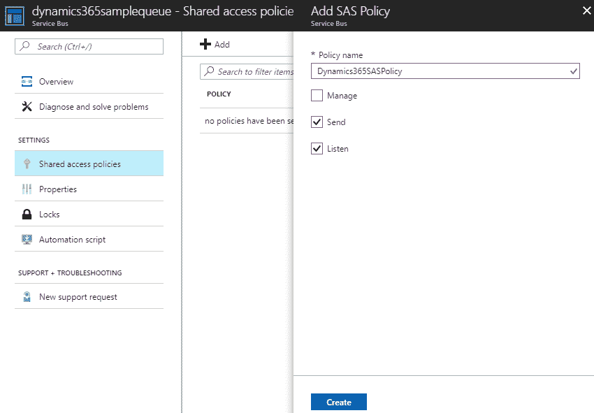

**服务总线操作**（**SAS**）所需的权限详细信息请参见此处—[`docs.microsoft.com/en-us/azure/service-bus-messaging/service-bus-sas#rights-required-for-service-bus-operations`](https://docs.microsoft.com/en-us/azure/service-bus-messaging/service-bus-sas#rights-required-for-service-bus-operations)

1.  选择已创建的共享访问策略并复制其主连接字符串。

1.  返回 Dynamics 365，我们需要通过插件注册工具注册一个服务端点。在插件注册工具中选择注册新服务端点。

从以下地址下载最新的 Microsoft Dynamics 365 SDK—[`www.microsoft.com/en-us/download/details.aspx?id=50032`](https://www.microsoft.com/en-us/download/details.aspx?id=50032)

1.  将连接字符串粘贴到注册新服务端点对话框中，并点击下一步：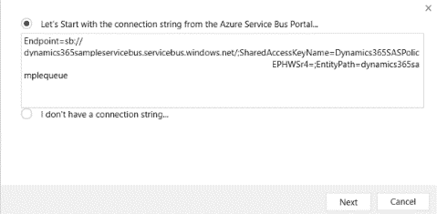

1.  这会自动填充服务端点注册的详细信息。点击保存：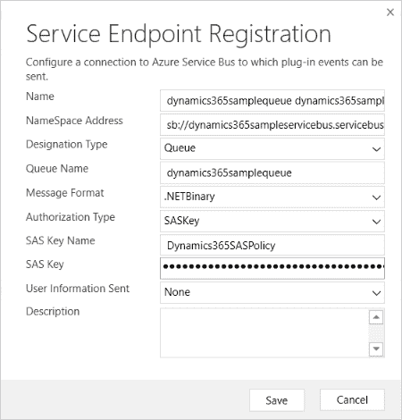

这将添加服务端点到插件注册工具。接下来，我们为在潜在客户实体上创建消息注册一个新步骤。设置执行模式为异步。如果我们尝试将其设置为同步模式，将会收到以下警告：只有异步步骤才支持服务端点插件，因为 OOB Azure 感知插件仅支持异步执行模式：

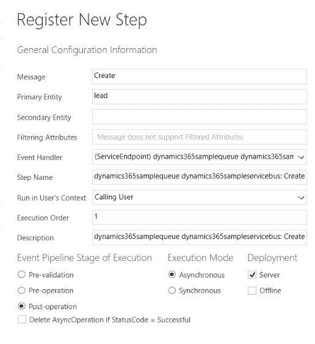

1.  现在，让我们在 Dynamics 365 中创建一个潜在客户记录以触发插件：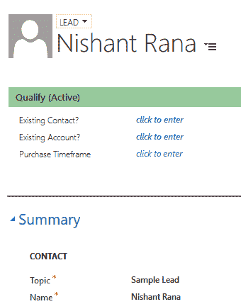

1.  转到设置 | 系统作业，相应的系统作业已创建，显示从异步服务发布到 Azure Service Bus 的消息状态：

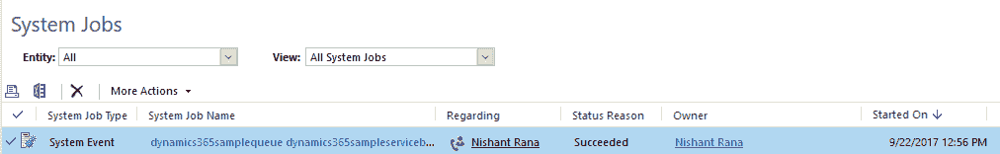

1.  返回我们的队列，我们可以看到一个新的消息已添加到 ACTIVE MESSAGE COUNT：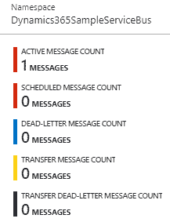

在下一部分，我们将创建监听应用程序来读取从 Dynamics 365 发布到 Azure Service Bus 的数据。

# 编写一个队列监听器

让我们创建一个简单的队列监听器来读取传递到队列的消息：

1.  打开 Visual Studio，选择项目类型为控制台应用程序。

1.  在项目中安装以下 NuGet 包——`WindowsAzure.ServiceBus`。它提供了用于 Microsoft Azure Service Bus 操作的客户端库。

1.  添加对`Microsoft.Xrm.Sdk`程序集的引用，或者安装以下 NuGet 包——`Microsoft.CrmSdk.Core`程序集。

1.  指定在插件注册工具中为服务端点定义的相同连接字符串。

1.  我们需要使用连接字符串创建一个`QueueClient`对象，并使用接收到的`BrokeredMessage`获取远程执行上下文。接下来，我们从`RemoteExecutionContext`中检索主题字段的值、实体名称和触发插件的消息，并将其写入控制台，如下所示：

```
// set the connection string of the Shared Access Policy created for the Queue 
var connectionString = "Endpoint=sb://[namespace].servicebus.windows.net/;SharedAccessKeyName=[KeyName];SharedAccessKey=[KeyValue];EntityPath=[QueueName]"; 

// create the Queue Client object 
var client = QueueClient.CreateFromConnectionString(connectionString); 

while (true) 
{ 
Console.Write("Press [Enter] to retrieve a message from the queue."); 
string line = Console.ReadLine(); 
Console.WriteLine("Waiting for a message from the queue... "); 
try 
{ 
// get the message from the Queue Client 
BrokeredMessage brokeredMessage = client.Receive(); 

// if message recieved 
if (brokeredMessage != null) 
{ 
// get the Remote Execution Context passed from the Azure Service Bus 
RemoteExecutionContext context = brokeredMessage.GetBody<RemoteExecutionContext>(); 

// cast to Entity object 
Entity entity = (Entity)context.InputParameters["Target"]; 

// get the lead's topic attribute value 
var leadTopic = entity.Attributes["subject"].ToString(); 

// output to console 
Console.WriteLine(string.Format("   Entity Name = {0}, Message Name = {1}, Lead's Topic = {2}", 
context.PrimaryEntityName, context.MessageName, leadTopic)); 

// marks message as processed and deleted 
brokeredMessage.Complete(); 
} 
} 
catch (TimeoutException ex) 
{ 
Console.WriteLine(ex.Message); 
continue; 
} 
catch (FaultException ex) 
{ 
Console.WriteLine(ex.Message); 
continue; 
} 
} 
```

1.  运行我们的应用程序时，我们可以看到以下细节作为`RemoteExecutionContext`传递到队列中的输出：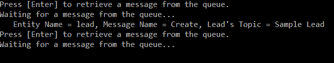

该示例应用程序运行时，将读取队列中的消息并在控制台中打印详细信息。

这里，队列的**消息生存时间**属性定义了消息如果未处理，将在队列中保留的时间跨度。之后，它将被移除或转为死信，即移动到另一个名为死信队列的次级子队列。死信队列保存未成功投递或处理的消息。

Azure Service Bus 死信队列——[`docs.microsoft.com/en-us/azure/service-bus-messaging/service-bus-dead-letter-queues`](https://docs.microsoft.com/en-us/azure/service-bus-messaging/service-bus-dead-letter-queues)。

队列的 **锁定持续时间** 属性指定一条消息被接收者接收后会被锁定的秒数。这指定了监听器应用程序处理消息的时间。如果消息未被处理，其他接收者将可以接收该消息。

# 编写主题监听器

让我们继续之前的潜在客户记录创建场景，并将其更新为使用主题而不是队列：

1.  登录 Azure 门户，通过点击 +主题来创建 Azure Service Bus 中的主题。

1.  添加所需的详细信息并点击创建按钮：

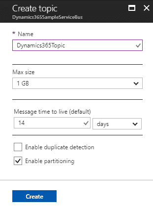

1.  在主题内，创建一个新的共享访问策略，并复制其主连接字符串。此连接字符串将在插件注册工具中注册新服务端点时使用，如此处所示：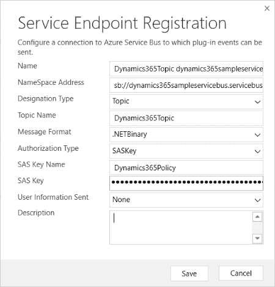

1.  向此已注册的服务端点添加一个新步骤，使其通过在 Dynamics 365 中创建潜在客户记录来触发。

1.  现在让我们回到我们创建的主题。点击主题内的 + 订阅按钮以添加一个新订阅。按此处所示指定所需的详细信息并点击创建：

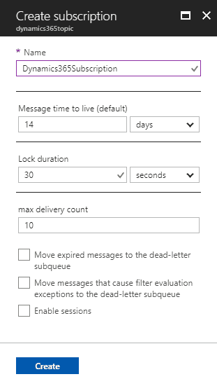

1.  这将在主题内创建一个新订阅。我们可以创建多个订阅，每个订阅都会收到已发布到 Azure Service Bus 的消息副本。

1.  以下是我们的主题监听器应用程序的示例代码。在这里，我们将使用一个 `SubscriptionClient` 对象来读取和处理传递的上下文，而不是使用 `QueueClient` 对象：

```
// set the connection string of the Shared Access Policy created for the Subscription 
// along with name of the Topic and Subscription 

var connectionString = "Endpoint=sb://[namespace].servicebus.windows.net/;SharedAccessKeyName=[KeyName];SharedAccessKey=[KeyValue];EntityPath=[TopicName]"; 

var topic = "[topic]"; 
var subscriptionName = "[subscription]"; 
```

```
// create the Subcription Client object 
var client = SubscriptionClient.CreateFromConnectionString(connectionString, topic, subscriptionName); 

while (true) 
{ 
Console.Write("Press [Enter] to retrieve a message from the topic."); 
string line = Console.ReadLine(); 
Console.WriteLine("Waiting for a message from the topic... "); 
try 
{ 
// get the message from the client 
BrokeredMessage brokeredMessage = client.Receive(); 

// get the Remote Execution Context passed from the Azure Service Bus 
RemoteExecutionContext context = brokeredMessage.GetBody<RemoteExecutionContext>(); 

// cast to Entity object 
Entity entity = (Entity)context.InputParameters["Target"]; 

// get the lead's topic attribute value 
var leadTopic = entity.Attributes["subject"].ToString(); 

// output to console 
Console.WriteLine(string.Format("  Entity Name = {0}, Message Name = {1}, Lead's Topic = {2}", 
context.PrimaryEntityName, context.MessageName, leadTopic)); 

// marks message as processed and deleted 
brokeredMessage.Complete(); 
} 
catch (TimeoutException ex) 
{ 
Console.WriteLine(ex.Message); 
continue; 
} 
catch (FaultException ex) 
{ 
Console.WriteLine(ex.Message); 
continue; 
} 
} 
```

1.  现在，让我们回到 Dynamics 365 并创建一个潜在客户记录，以触发我们的插件：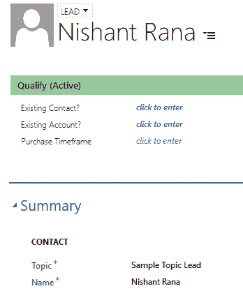

1.  在我们的主题中，我们可以看到为该主题创建的所有订阅都已接收到消息：

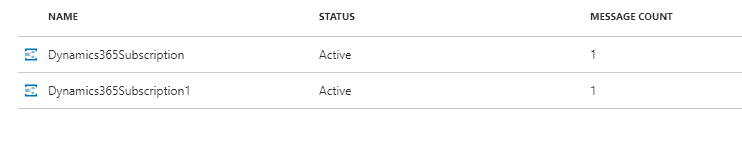

1.  运行我们的订阅监听器，我们得到了预期的输出：

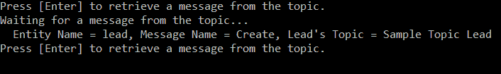

到目前为止，我们已经涵盖了如何为队列和主题编写监听器应用程序，在下一部分中，我们将介绍如何编写单向、双向和 REST 合约的监听器应用程序。

# 编写单向监听器

让我们逐步了解编写单向监听器所需的所有步骤：

1.  继续相同的场景，首先，我们需要注册我们的服务端点。为此，为 Azure Service Bus 命名空间创建一个新的共享访问策略。进入 Azure Service Bus 的共享访问策略设置，点击“添加”创建一个具有发送和监听权限的新策略，并复制其主连接字符串。

1.  将复制的连接字符串粘贴到插件注册工具中的注册服务端点对话框中。

当我们创建一个 Azure 服务总线命名空间时，会自动创建一个名为`RootManageSharedAccessKey`的策略。它具有一对主密钥和副密钥，授予对服务总线命名空间的发送、监听和管理权限。建议您创建其他策略，而不是使用这个默认的具有所有权限的策略。

1.  更新服务端点注册中的属性值，如下所示：

+   命名空间地址：将`sb`替换为`https`

+   指定类型：`OneWay`

+   路径：`MyPath`

以下截图显示了已填充适当值的服务端点注册对话框：

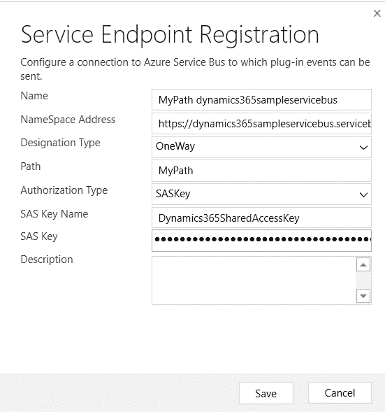

1.  注册一个步骤，在创建潜在客户记录时为注册的服务端点触发，并通过在 Dynamics 365 中创建潜在客户记录来触发它。

1.  转到设置 | 系统作业并检查相应创建的系统作业。

1.  在这里，系统作业将失败并显示以下消息：

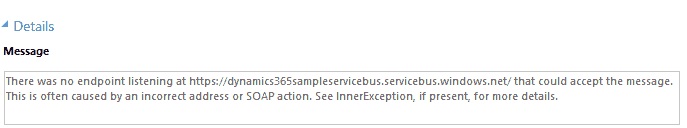

1.  如前所述，对于中继服务，要求有一个主动监听器，这与队列或主题不同。

1.  在我们的单向监听器应用程序中，需要实现`IServiceEndpointPlugin`接口，并使用`WS2007HttpRelayBinding`。

1.  在接下来的步骤中，我们将在控制台应用程序中自托管该服务：

```
[ServiceBehavior] 
class AzureExample : IServiceEndpointPlugin 
{ 
static void Main(string[] args) 
{ 
// get the shared access key name 
// shared access key value 
// service bus endpoint from the Shared Access Policy Connection String. 
var sharedAccessKeyName = "[keyName]"; 
var sharedAccessKey = "[keyValue]"; 
var serviceBusEndPoint = "https://[serviceBusNameSpace].servicebus.windows.net"; 

// initialize the ServiceHost 
var serviceHost = new ServiceHost(typeof(AzureExample)); 

// define the behaviour 
var transportClient = new TransportClientEndpointBehavior 
(TokenProvider.CreateSharedAccessSignatureTokenProvider(sharedAccessKeyName, sharedAccessKey)); 

// add the service endpoint 
serviceHost.AddServiceEndpoint(typeof(IServiceEndpointPlugin), 
new WS2007HttpRelayBinding(), serviceBusEndPoint).EndpointBehaviors.Add(transportClient); 

serviceHost.Open(); 

Console.ReadLine(); 
} 

void IServiceEndpointPlugin.Execute(RemoteExecutionContext context) 
{ 
// cast to Entity object 
Entity entity = (Entity)context.InputParameters["Target"]; 

// get the lead's topic attribute value 
var leadTopic = entity.Attributes["subject"].ToString(); 

// output to console 
Console.WriteLine(string.Format("  Entity Name = {0}, Message Name = {1}, Lead's Topic = {2}", 
context.PrimaryEntityName, context.MessageName, leadTopic)); 
} 
} 
```

1.  运行监听器应用程序，使其能够主动监听传递给它的消息，并在 Dynamics 365 中创建潜在客户记录。这将触发我们监听器应用程序中的`Execute`方法，并在控制台窗口中输出远程执行上下文的详细信息。

在这一部分中，我们学习了如何编写单向监听器，在下一部分我们将介绍如何编写双向监听器应用程序。

# 编写双向监听器和 Azure 感知插件

让我们详细地走一遍编写双向监听器的所有步骤：

1.  在双向合同的情况下，我们需要实现一个自定义的 Azure 感知插件，该插件可以接收来自双向监听器应用程序的响应，但在此之前，我们先注册一个新的服务端点用于双向合同，如下所示：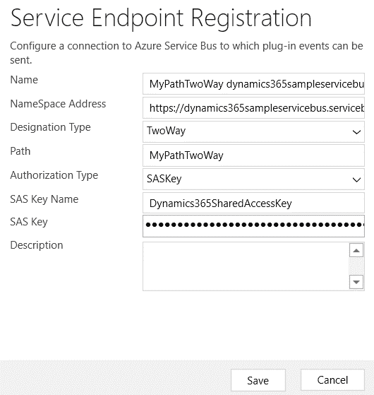

1.  双向监听器应用程序需要实现`ITwoWayServiceEndPointPlugin`接口，并使用`WS2007HttpRelayBinding`。此外，`Execute`方法返回一个字符串，启用双向通信。如前所述，使用中继时是实时的，因此监听器需要主动监听消息，不同于队列和主题。

1.  在接下来的步骤中，我们将在控制台应用程序中自托管该服务：

```
[ServiceBehavior] 
class AzureExample : ITwoWayServiceEndpointPlugin 
    { 
        static void Main(string[] args) 
        { 
            // get the shared access key name 
            // shared access key value 
            // service bus endpoint from the Shared Access Policy 
            Connection String. 
            var sharedAccessKeyName = "RootManageSharedAccessKey"; 
            var sharedAccessKey = "[KeyValue]"; 
            var serviceBusEndPoint =  
           "https://[ServiceBusNamespace].servicebus.windows.net"; 

            // initialize the ServiceHost  
            var serviceHost = new ServiceHost(typeof(AzureExample)); 

            // define the behaviour 
            var transportClient = new
            TransportClientEndpointBehavior 

        (TokenProvider.CreateSharedAccessSignatureTokenProvider
        (sharedAccessKeyName,  
          sharedAccessKey)); 

            // add the service endpoint 
            serviceHost.AddServiceEndpoint
           (typeof(ITwoWayServiceEndpointPlugin), 
                new WS2007HttpRelayBinding(),  
                serviceBusEndPoint).EndpointBehaviors.
                Add(transportClient); 

            serviceHost.Open(); 

            Console.ReadLine(); 
        }        

        string ITwoWayServiceEndpointPlugin.Execute
        (RemoteExecutionContext context) 
        { 
            // cast to Entity object 
            Entity entity =  
            (Entity)context.InputParameters["Target"]; 

            // get the lead's topic attribute value 
            var leadTopic = entity.Attributes["subject"].ToString(); 

            // output to console 
            Console.WriteLine(string.Format
            ("  Entity Name = {0}, Message Name = 
            {1}, 
            Lead's Topic = {2}", 
                context.PrimaryEntityName, 
               context.MessageName, leadTopic)); 

            // return the message back to the
            custom azure aware plugin 
            return "Message Processed"; 
        } 
    } 
```

1.  为了读取双向中继中从监听器应用程序返回的消息，让我们编写一个自定义的 Azure 感知插件。

1.  我们在这里需要的第一件事是我们注册的服务端点的 GUID。我们可以从服务端点的属性窗口中获取 GUID，ServiceEndpointId，如下所示：

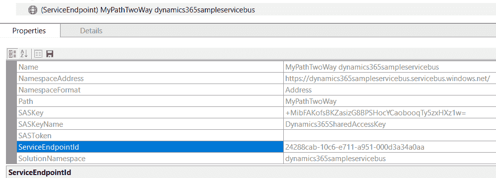

1.  在这里，`IServiceEndpointNotificationService`将为我们提供服务端点，我们将其服务端点实体引用传递给它。

1.  我们需要调用通知服务的`Execute`方法，将执行上下文发送到 Azure Service Bus。`Execute`方法返回从监听器应用程序接收到的响应，然后我们使用`ITracingService`在自定义的 Azure 感知插件中进行跟踪：

```
public class AzureAwarePlugin : IPlugin 
    { 
        public void Execute(IServiceProvider serviceProvider) 
        { 
            // set the Service Endpoint Id 
            var serviceEndpointId = "[serviceEndpointGUID]"; 

            // Obtain the execution context from 
            the service provider. 
            IPluginExecutionContext context = 
           (IPluginExecutionContext) 
                serviceProvider.GetService
                 (typeof(IPluginExecutionContext)); 

            //Extract the tracing service for use in debugging 
           sandboxed plug-ins. 
            ITracingService tracingService = 

          (ITracingService)serviceProvider.GetService
         (typeof(ITracingService)); 

            // Extract the notification service for posting 
            execution context 
            IServiceEndpointNotificationService 
            notificationService =  
           (IServiceEndpointNotificationService) 

           serviceProvider.GetService(typeof
          (IServiceEndpointNotificationService)); 

            var response = notificationService.Execute(new 
          EntityReference("serviceendpoint", new 
           Guid(serviceEndpointId)), context); 

            if (!string.IsNullOrEmpty(response)) 
            { 
                tracingService.Trace("Response = {0}", response); 
            } 
        } 
    } 
```

1.  注册插件并为**潜在客户创建**消息添加一个新的步骤。与 OOB Azure 感知插件不同，自定义的 Azure 感知插件可以注册为同步。

1.  创建一个潜在客户记录以触发插件。确保我们的双向监听器应用程序正在运行并准备好接收消息。

1.  听众应用程序在成功接收到来自 Azure Service Bus 传递的上下文后，返回字符串“Message Processed”。

1.  在 Dynamics 365 中，转到设置 | 插件跟踪日志进行验证：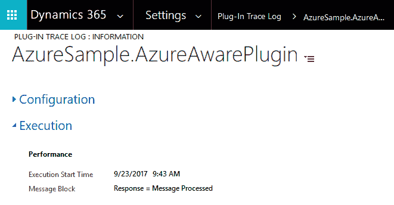

要启用插件跟踪日志的日志记录，请转到设置 | 系统设置 | 自定义选项卡。选择**所有选项**以启用插件跟踪日志字段的日志记录。

在接下来的部分中，我们将介绍如何编写 REST 监听器应用程序，这与双向监听器应用程序类似，主要区别在于它使用 REST 端点。

# 编写 REST 监听器

让我们详细介绍编写双向 REST 监听器的所有步骤。由于它使用 REST 端点，它允许我们在 Node.js 中创建一个中继服务，并可以在多个平台（如 macOS、Windows、Linux 等）上执行：

1.  在编写 REST 监听器之前，我们首先按照下图所示注册一个新的服务端点：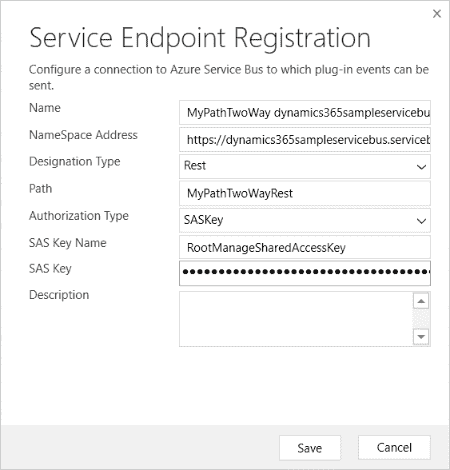

1.  REST 监听器需要实现`IWebHttpServiceEndpointPlugin`接口并使用`WebHttpRelayBinding`。在这里，我们再次在控制台应用程序中自托管该服务：

```
[ServiceBehavior] 
  class AzureExample : IWebHttpServiceEndpointPlugin 
    { 
        static void Main(string[] args) 
        { 
            // get the shared access key name 
            // shared access key value 
            // service bus endpoint from the Shared 
           Access Policy Connection String. 
            var sharedAccessKeyName = "RootManageSharedAccessKey"; 
            var sharedAccessKey = "[KeyValue]"; 
            var serviceBusEndPoint = 
            "https://[ServiceBusNamespace].servicebus.windows.net"; 

            // Create the service host for 
           Azure to post messages to. 
            var serviceHost = new 
           WebServiceHost(typeof(AzureExample)); 

            // define the behaviour 
            var transportClient = new 
            TransportClientEndpointBehavior 

        (TokenProvider.CreateSharedAccessSignatureTokenProvider
        (sharedAccessKeyName,  
           sharedAccessKey)); 

            // Using an HTTP binding instead of a 
            SOAP binding for this RESTful 
             endpoint. 
            WebHttpRelayBinding binding = new WebHttpRelayBinding(); 
            binding.Security.Mode = 
            EndToEndWebHttpSecurityMode.Transport; 

            // add the service endpoint 
            serviceHost.AddServiceEndpoint
             (typeof(IWebHttpServiceEndpointPlugin), 
               binding, serviceBusEndPoint).
              EndpointBehaviors.Add(transportClient); 

            // Begin listening for messages posted to Azure. 
            serviceHost.Open();            

            Console.ReadLine(); 
        } 

        string IWebHttpServiceEndpointPlugin.
         Execute(RemoteExecutionContext context) 
        { 
            // cast to Entity object 
            Entity entity = 
            (Entity)context.InputParameters["Target"]; 

            // get the lead's topic attribute value 
            var leadTopic = entity.Attributes["subject"].ToString(); 

            // output to console 
            Console.WriteLine(string.Format
            ("  Entity Name = {0}, Message Name = 
             {1}, 
             Lead's Topic = {2}", 
                context.PrimaryEntityName, 
                context.MessageName, leadTopic)); 

            // return the message back to the 
            custom azure aware plugin 
            return "Message Processed by Rest Listener"; 
        } 

    } 
```

1.  返回 Dynamics 365，创建一个潜在客户记录以触发插件，该插件调用监听器应用程序的`Execute`方法。监听器接收到消息后，返回字符串“Message Processed by Rest Listener”，该信息将在插件的插件跟踪日志中被追踪，如下所示：

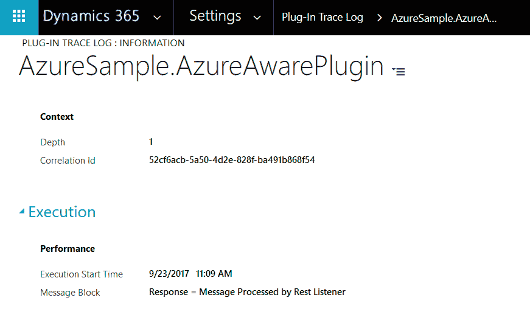

在本节中，我们学习了如何编写 REST 监听器，在接下来的部分中，我们将介绍如何编写事件中心监听器应用程序。

# 编写事件中心监听器

让我们详细介绍编写事件中心监听器的所有步骤。要创建事件中心监听器：

1.  转到 Azure 门户，搜索事件中心，并创建一个新的事件中心命名空间。

1.  在事件中心命名空间中选择事件中心，然后点击“添加事件中心”以创建一个新的事件中心。

1.  对于创建的事件中心，添加一个新的`SharedAccessKey`，并为其分配适当的权限，复制其连接字符串，并在插件注册工具中注册新的服务端点时使用，如下所示：

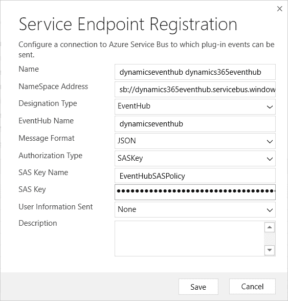

1.  添加一个步骤，以便在创建潜在客户记录时触发插件。

1.  对于事件中心监听器应用程序，创建一个新的控制台应用程序，添加以下 NuGet 包——`WindowsAzure.ServiceBus`。

1.  以下是我们事件中心监听器应用程序的示例代码。在这里，我们使用 `EventHubClient` 对象来创建接收器：

```
var connectionString = "Endpoint=sb://[namespace].servicebus.windows.net/;SharedAccessKeyName=[KeyName];SharedAccessKey=[KeyValue];EntityPath=[QueueName]"; 

// create the Event Hub Client object 
var client = EventHubClient.CreateFromConnectionString(connectionString); 

// create the event hub reciever 
EventHubConsumerGroup consumerGroup = client.GetDefaultConsumerGroup(); 
var eventHubReciever = consumerGroup.CreateReceiver(client.GetRuntimeInformation().PartitionIds[0]); 

while (true) 
{ 
Console.Write("Press [Enter] to retrieve a message from the Event Hub."); 
string line = Console.ReadLine(); 
Console.WriteLine("Waiting for a message from the eventhub... "); 

// call the Recieve method 
var message = eventHubReciever.Receive(); 

// get the JSON result 
string jsonResult = Encoding.UTF8.GetString(message.GetBytes()); 
// output to window 
Console.WriteLine("JSON Output" + jsonResult); 
} 
```

1.  在 Dynamics 365 中创建一个新的潜在客户。

1.  运行我们的事件中心监听器时，我们可以在控制台中看到预期的 JSON 输出：

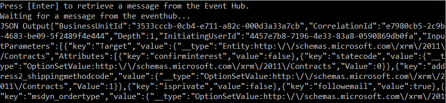

接收事件的推荐方式是使用事件处理器主机—[`docs.microsoft.com/en-us/azure/event-hubs/event-hubs-dotnet-standard-api-overview#event-processor-host-apis`](https://docs.microsoft.com/en-us/azure/event-hubs/event-hubs-dotnet-standard-api-overview#event-processor-host-apis)。 （本章的源代码包括使用事件处理器接收事件的示例。）

# 总结

本章我们讲解了 Dynamics 365 中提供的 Azure 扩展以及如何配置和编写监听应用程序来支持不同的合同类型。

在下一章中，我们将介绍 CRM 2016 引入的新可编辑网格及其支持的不同属性。
