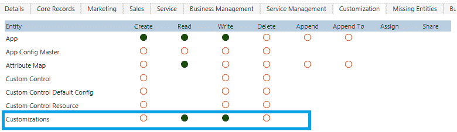
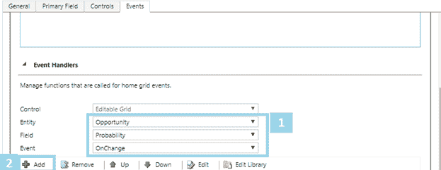
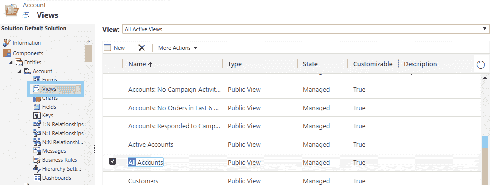

# 第九章：在应用程序中使用可编辑网格

Dynamics 365 中的可编辑网格功能允许最终用户直接从视图或网格更新记录，这使得更新记录更加方便和简便。虽然也可以使用 Excel 表格执行相同的任务，但使用 Excel 表格更新数据比从网格编辑记录花费更多时间。

在本章中，我们将讨论与可编辑网格相关的以下要点：

+   可编辑网格概述

+   配置可编辑网格所需的先决权限

+   支持的实体、视图和字段到可编辑网格

+   配置可编辑网格所需的步骤

+   使用 JavaScript 配置可编辑网格

+   使用业务规则配置可编辑网格

+   移动设备上的可编辑网格

# Dynamics 365 中的可编辑网格概述

可编辑网格支持多种功能。以下列表概述了可编辑网格支持的主要 CRM 组件：

+   实体或子网格级别的记录编辑

+   个人视图以及系统视图

+   移动客户端

+   支持键盘或鼠标导航

+   记录分组和排序

+   记录筛选

+   网格列的移动和调整大小

+   分页（支持带有多个记录的子网格以适应网格视图）

+   将分组、排序、筛选、分页、列移动和调整大小等更改保存到另一个会话中

+   查找字段

+   汇总字段和计算字段

+   安全角色

+   JavaScript 事件

+   业务规则

+   使用图表和搜索的最终用户也可以通过只读网格访问操作栏

# 配置可编辑网格所需的先决条件和安全权限

在讨论如何在 Dynamics 365 中配置可编辑网格之前，了解配置可编辑网格所需的先决安全权限非常重要，这些权限是特定用户在能够配置可编辑网格之前所需的。下表总结了配置 Dynamics 365 可编辑网格所需的最低权限：

| **序号** | **实体名称** | **读取** | **写入** | **创建** |
| --- | --- | --- | --- | --- |
| 1. | 解决方案 | 是 | - | - |
| 2. | 自定义 | 是 | 是 | - |

通过 CRM 屏幕详细了解安全角色区域，如下所示：

1.  导航到 设置 | 安全角色 并更新自定义的读取和写入权限，如下图所示：



1.  导航到 设置 | 安全角色 并更新解决方案的读取和写入权限，如下图所示：

**注意：** 系统管理员和系统定制者角色已经具备配置 Dynamics 365 可编辑网格所需的权限。如果需要其他安全角色访问创建或编辑 Dynamics 365 可编辑网格，则需要配置上述安全权限。

# 可编辑网格支持的实体和视图

大多数开箱即用的实体、视图等支持可编辑网格；然而，某些实体和视图在 Dynamics 365 中不支持可编辑网格。

如果您想为实体配置可编辑网格，需满足一些条件。配置可编辑网格时需满足下列条件：

+   实体是可定制的

+   实体应为引用或自定义实体

+   实体不应是子实体

可编辑子网格支持 Dynamics 365 中的所有视图类型，除了汇总视图和关联视图。

下列部分概述了基于平台（Web/平板/手机）支持的可编辑网格实体列表。

# 开箱即用的支持实体

# Web/平板/手机

下表列出了支持 Web、平板和手机用户界面的实体：

| 账户 | 案例 | 知识文章视图 | 评级模型 |
| --- | --- | --- | --- |
| 预约 | 类别 | 知识库记录 | 评级值 |
| 可预定资源 | 特征 | 潜在客户 | SLA KPI 实例 |
| 可预定资源预订 | 竞争对手 | 商机 | 社交活动 |
| 可预定资源预订头 | 联系人 | 订单 | 社交资料 |
| 可预定资源类别 | 电子邮件 | 电话呼叫 | 同步错误 |
| 可预定资源类别关联 | 权限 | 价格清单 | 任务 |
| 可预定资源特征 | 反馈 | 产品 | 团队 |
| 可预定资源组 | 发票 | 队列 | 用户 |
| 预订状态 | 知识文章 | 报价 | - |

# 仅限平板/手机

下表列出了支持 Dynamics 365 平板和手机用户界面的实体：

| 活动 | 电子邮件模板 | 备注 | 流程 |
| --- | --- | --- | --- |
| 附件 | 过期流程 | 商机产品 | 队列项 |
| 渠道访问配置文件规则项 | 发票产品 | 商机销售流程 | 报价产品 |
| 竞争对手地址 | 知识文章事件 | 订单产品 | Sharepoint 文档 |
| 连接 | 潜在客户到商机销售 | 组织 | 翻译流程 |
| 连接角色 | 邮箱 | 电话到案例流程 | - |
| 电子邮件签名 | 新流程 | 价格清单项 | - |

# 仅限 Web

下表列出了支持 Web 用户界面的实体：

| 活动 | 渠道访问配置文件规则 | 传真 | 快速活动 |
| --- | --- | --- | --- |
| 活动活动 | 合同 | 信函 | 定期预约 |
| 活动响应 | 权限模板 | 营销列表 | 销售文献 |
| 渠道访问配置文件 | 外部方 | 职位 | SLA |

# 可编辑网格支持的和不支持的数据类型

可编辑网格支持 Dynamics 365 中大多数字段类型。下列字段类型支持可编辑网格：

+   单行文本

+   多行文本

+   选项集

+   多选项集

+   两个选项

+   状态原因

+   整数

+   浮动小数

+   小数

+   货币

+   日期和时间

+   图像

下列字段类型不支持在可编辑网格中使用：

+   状态

+   客户类型字段

+   复合字段

+   方列表

+   基于查找字段的相关实体字段

# 配置主实体视图的可编辑网格

现在我们已经对支持的实体、视图和字段类型有了基本了解，接下来我们将看看如何为实体配置可编辑网格。

让我们以“帐户实体”的视图为例。当为任何实体配置可编辑网格时，所有可用的视图都将变得可编辑。

以下是配置 Dynamics 365 中帐户实体可编辑网格的步骤：

1.  转到设置 | **自定义**，如下面的截图所示：


1.  选择“自定义系统”，如下面的截图所示：


1.  选择帐户实体，如下面的截图所示：


1.  选择“控件”，然后点击“添加控件...”，如下面的截图所示：


1.  在“添加控件”对话框中，选择“可编辑网格”，然后点击“添加”按钮，如下面的截图所示：


1.  在添加的“可编辑网格”行中，选择要应用网格的表单类型。这将使可编辑网格成为所选表单类型的默认控件。在此示例中，我们选择的是“Web”选项：


1.  现在，保存更改并发布，如下面的截图所示：


1.  要查看更改，导航到**帐户**实体。点击当前视图中的任何实体行，并尝试编辑“地址”字段：


1.  编辑完字段后，点击**保存**按钮，将您的更改保存到帐户实体记录中。

# 配置表单的可编辑子网格

可编辑网格还可以配置为 Dynamics 365 实体表单中的子网格。可编辑网格使得从父实体表单编辑相关记录变得更加方便。例如，用户可以在帐户实体表单上，更新其中的相关联系人。

在这里，我们将在帐户实体表单上创建一个可编辑的联系人子网格。以下步骤将使帐户实体的联系人子网格可供用户编辑：

1.  转到设置 | 自定义，如下面的截图所示：


1.  点击“自定义系统”，如下面的截图所示：


1.  点击“帐户”实体，然后选择“表单”，如下面的截图所示：


1.  选择帐户的主表单并打开它：


1.  选择适当的联系人子网格，然后点击功能区上的“更改属性”：


1.  在设置属性对话框中，选择“控件”，点击“添加控件”，然后按照前面列出的步骤操作：


1.  在添加控件对话框中，选择“可编辑网格”：


1.  选择网页选项以启用子网格，然后点击“确定”按钮。保存表单如下所示：


1.  保存后，发布它：


1.  要查看更改，请进入一个帐户记录并检查联系人子网格：

# 在可编辑网格中使用 JavaScript

JavaScript 在 Dynamics 365 中用于提供客户端验证以及其他客户端需求。可编辑网格也支持 JavaScript。可编辑网格支持三种类型的事件，以下是这些事件：

+   **OnRecordSelect** – 该事件在用户选择可编辑网格中的记录时触发

+   **OnChange** – 该事件在可编辑网格实体行的任何列发生变化时触发

+   **OnSave** – 该事件由**保存**按钮触发

以下是使用 JavaScript 与可编辑网格结合的简要示例：

以下是一个场景，我们将在机会的可编辑网格中实现：

+   如果概率大于 70%，则将机会的评级设置为**热**

+   如果概率介于 50%到 69%之间，则将评级设置为**温暖**

+   如果概率低于 50%，则将评级设置为**冷**

前提条件：要开始处理此示例，首先将“评分”和“概率”这两个额外字段添加到机会实体的任意视图中。同时，按照本章前面说明的步骤，将机会实体的主网格配置为可编辑网格。

1.  创建一个新的 JavaScript Web 资源 `OpportunitySetRating`，并在其中使用以下代码：

```
    function OpportunitySetRating(executionContext) { 
      //Get opportunity entity 
      var OpportunityObject =   
       executionContext.getFormContext().data.entity; 
      //Get Attributes from Opportunity record 
      var probablityAttribute = 
       OpportunityObject.attributes.getByName("closeprobability"); 
      var ratingAttribute = 
       OpportunityObject.attributes.getByName("opportunityratingcode"); 
      //Rating options 
      var hotRatingOption = 1; 
      var warmRatingOption = 2; 
      var coldRatingOption = 3; 
      //Check Probability attribute contain data 
      if (probablityAttribute != null) { 
        //Check probablityValue attribute contain data 
        var probablityValue = probablityAttribute.getValue(); 

        // Check Probability Value 
        if (probablityValue < 50) { 
            ratingAttribute.setValue(coldRatingOption); 
        } 
        else 
            if (probablityValue > 50 && probablityValue < 70) { 
                ratingAttribute.setValue(warmRatingOption); 
            } 
            else 
                if (probablityValue > 70) { 
                    ratingAttribute.setValue(hotRatingOption); 
                } 
        // End of if else 
      } 
    }  
```

1.  在启用机会实体的可编辑网格后（如前所述为前提条件），点击实体自定义设置中的**事件**选项卡：


1.  将新创建的 JavaScript Web 资源添加到表单库：


1.  在事件处理程序中，选择字段为“概率”，并选择事件**OnChange**（类似地，如果需要，你可以选择 OnSave 和 OnRecordSelect 的处理程序。当前示例中不使用它们）：



1.  为事件设置事件处理程序属性，设置为 OpportunitySetRating（提及 JavaScript Web 资源中的函数名称）：


1.  最后，保存更改并发布所有自定义设置：


保存并发布

1.  现在，导航到机会实体并选择您已添加了**评级**和**概率**字段的视图。当您更改概率的值时，您会注意到评级字段的变化：


# 可编辑网格和业务规则

在 Dynamics 365 中，业务规则提供了一种便捷的方式来对实体字段应用验证。业务流程将在更改字段值时触发，以执行指定的操作。可编辑网格支持 Dynamics 365 中的业务规则。可编辑网格支持以下业务规则操作：

+   显示错误信息

+   设置字段值

+   设置业务必填

+   设置默认值

+   锁定或解锁字段

要在可编辑网格上使用业务规则，无需做更多配置。您可以通过在表单级别创建一个简单的业务规则来实现。当您在可编辑网格上更改记录的数据时，这个业务规则将会生效。

我们将创建一个简单的业务规则，如果首选联系方式为电话，则解锁主要电话字段，否则锁定该字段。以下是将业务规则应用于可编辑网格的步骤：

1.  转到设置 | 自定义，如以下截图所示：


1.  点击**自定义系统**，如以下截图所示：


1.  现在，展开账户实体并点击**视图**，如以下截图所示：



1.  选择**所有账户**视图并添加两个列：

1\. 首选联系方式

2\. 主要电话

这在以下截图中演示：


1.  现在创建一个新的业务规则，如前所述。添加一个条件，检查**首选联系方式**的值是否为电话，然后添加一个锁定/解锁规则，解锁主要电话，否则在 else 条件中设置锁定/解锁规则来锁定主要电话：


1.  完成上述步骤后，将业务规则的范围设置为实体：


1.  保存并激活业务规则，并确保发布您之前所做的所有更改。

1.  现在，导航到账户实体并选择**所有账户**视图。您会注意到视图中的字段现在更改了首选方法字段的值，并检查结果：


# 移动设备上的可编辑网格

可编辑网格在移动设备上受到支持，这使得可编辑网格非常有用，因为它们节省了用户在移动设备上的时间和数据。还有一些功能仅在移动设备上受到支持。主要的不同之处是，可编辑网格可在移动设备的仪表板上使用，而在网页上不可用。这使得可编辑网格在移动设备上成为一个更强大的功能。

让我们将“活动案例”视图设为可编辑，该视图在移动设备的仪表板上可用。

以下是让可编辑网格在移动设备的仪表板上显示的步骤：

1.  转到“设置 | 自定义”，如以下截图所示：


1.  单击“自定义系统”，如以下截图所示：


1.  展开实体并选择“案例”实体。在案例实体上添加一个可编辑网格控件，并确保它在手机上也可用：


控件标签下的可编辑网格

1.  保存并发布你所做的更改：


保存并发布

1.  要查看结果，请打开 Dynamics 365 移动应用并导航到“案例”：


1.  当“案例”记录出现在屏幕上时，选择记录并编辑记录主题，如下所示：


# 概要

在本章中，我们已看到可编辑网格的功能，它们在网页和移动平台上均受支持。我们还讨论了支持和不支持的实体、视图和字段，这些内容支持可编辑网格。

在下一章中，我们将学习如何配置 Microsoft 认知服务。
