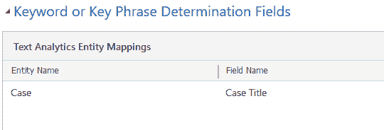
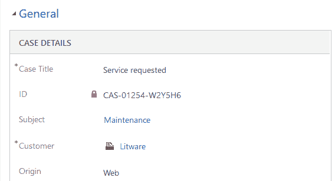
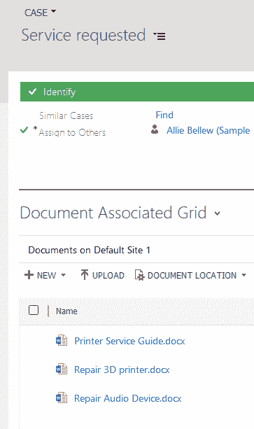
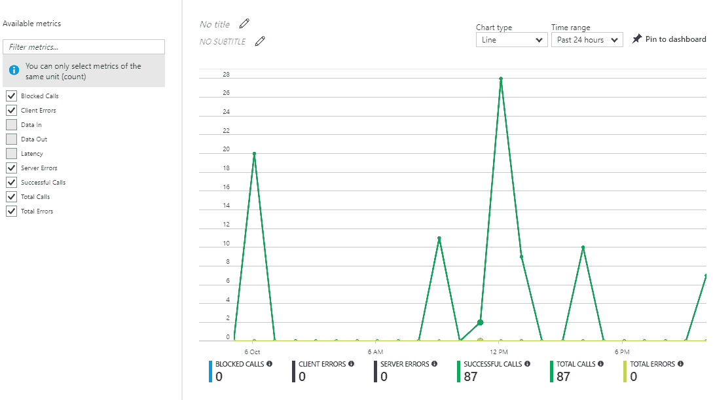

# 配置微软认知服务

在第九章，*在应用程序中使用可编辑网格*，我们学习了如何配置可编辑网格以及如何利用网格支持的不同方法和事件。在本章中，我们将探讨微软认知服务，以及如何将它们与 Dynamics 365 集成。微软认知服务是一组 API，可以用来将人工智能功能添加到应用程序中。

微软认知服务与 Dynamics 365 的集成仍处于公开预览阶段，仅适用于**美国**（**US**）区域的实例。

本章将涵盖以下内容：

+   微软认知服务概述

+   将 Dynamics 365 与微软认知服务连接

+   实现文本分析 API，用于建议知识文章、类似案例和文档建议

# 了解微软认知服务

微软认知服务可以定义为一组 API，这些 API 可以轻松配置和使用，将强大的人工智能功能带入应用程序、网站和机器人中。微软认知服务是基于 JSON 的标准 REST API，可以从许多流行的编程语言（如 Curl、C#、Java、JavaScript、PHP、Python 等）中进行调用。早在 2015 年，微软发布了一套名为 Project Oxford 的技术，允许开发人员构建更智能的应用程序，整合机器学习方面的功能，后来这些技术被重新命名为微软认知服务。目前，微软认知服务包含不同的 API，如计算机视觉 API、视频 API、Bing 语音 API、文本分析 API、推荐 API、Bing 图像搜索 API 等等，按视觉、语音、语言、知识和语音等类别进行分类。

可以在 [`azure.microsoft.com/en-in/services/cognitive-services/directory/`](https://azure.microsoft.com/en-in/services/cognitive-services/directory/) 查阅不同的微软认知服务 API 列表。

让我们快速了解这些不同的 API：

+   **视觉 API**：这些 API 允许应用程序识别面部、情绪，并理解图像和视频。它包括计算机视觉 API、视频 API、面部 API、情绪 API 等等。要查看面部 API 的实际应用，我们可以访问 [`azure.microsoft.com/en-us/services/cognitive-services/face/`](https://azure.microsoft.com/en-us/services/cognitive-services/face/)，提交一张图片，面部 API 将分析这张图片，并以 JSON 格式返回结果，如下截图所示，在检测结果中：

+   **语音 API**：这些 API 允许应用程序识别语音，将语音转换为文本，并将文本转换为语音。它包括语音识别 API 和文本转语音 API。要查看语音 API 的实际应用，请浏览 [`azure.microsoft.com/en-us/services/cognitive-services/speech/`](https://azure.microsoft.com/en-us/services/cognitive-services/speech/) 并播放任何示例或开始录音。语音识别 API 会将口语转换为文本，如下所示：

+   **语言 API**：这些 API 允许应用程序评估情感和话题，了解用户需求，检测并修正拼写错误等功能。它包括文本分析 API、翻译文本 API、Bing 拼写检查 API 等。要查看拼写检查功能的实际应用，请浏览 [`azure.microsoft.com/en-us/services/cognitive-services/spell-check/`](https://azure.microsoft.com/en-us/services/cognitive-services/spell-check/)。在输入 `Spell` 错误为 `Spel` 并点击提交后，它会自动更正为 Spell，如下图所示：

+   **知识 API**：这使得应用程序可以根据客户的需求、决策能力以及与来自网络、学术等丰富知识库的集成，提供推荐。它包括推荐 API、问答生成器 API、学术知识 API 等。组织可以使用推荐 API 来了解销售行为，并在客户购买时推荐相关产品，从而实现销售增长。要查看问答生成器 API 的实际应用，请浏览 [`azure.microsoft.com/en-us/services/cognitive-services/qna-maker/`](https://azure.microsoft.com/en-us/services/cognitive-services/qna-maker/) 并搜索特定的关键词。搜索 `Login` 会匹配到问题 *如何登录到问答生成器门户？* 并返回适当的答案，如下图所示：

+   **搜索 API**：通过这个 API，应用程序可以访问网页、图片、视频、新闻等，并利用 Bing API 的自动建议功能。它包括 Bing 自动建议 API、Bing 图片搜索 API、Bing 新闻搜索 API、Bing 网页搜索 API 等。要查看 Bing 新闻搜索 API 的实际应用，请浏览 [`azure.microsoft.com/en-us/services/cognitive-services/bing-news-search-api/`](https://azure.microsoft.com/en-us/services/cognitive-services/bing-news-search-api/) 并搜索 `Dynamics 365`。Bing 新闻搜索 API 将返回与 Dynamics 365 相关的所有新闻，如下图所示：

关于 Cognitive Services 的文档、快速入门、教程和示例，请访问 [`docs.microsoft.com/en-us/azure/#pivot=products&panel=cognitive`](https://docs.microsoft.com/en-us/azure/#pivot=products&panel=cognitive)

# 启用 Dynamics 365 Microsoft Cognitive Services 集成

Microsoft Dynamics 365 的 Cognitive Services 集成在 2016 年 12 月的更新中引入，适用于 Dynamics 365 Online。跨售产品推荐预览和使用 Text Analytics Topic Detection API 的案例主题分析预览在 2016 年 12 月更新中引入，但在 2017 年 7 月的 Dynamics 365 更新中已不再提供。

Microsoft 建议使用产品关系来进行跨售产品推荐，而不是推荐 API，因为该功能将在 2018 年 2 月 15 日后被移除。[`www.microsoft.com/en-US/dynamics/crm-customer-center/define-related-products-to-increase-chances-of-sales.aspx`](https://www.microsoft.com/en-US/dynamics/crm-customer-center/define-related-products-to-increase-chances-of-sales.aspx)

要在 Dynamics 365 中启用 Microsoft Cognitive Services 集成：

1.  打开 Dynamics 365，转到“设置”|“管理”

1.  点击“系统设置”，打开“预览”选项卡

1.  在“案例主题分析”、“建议相似案例”和“建议知识文章”部分下，选择启用 Dynamics 365 Text Analytics 预览

1.  在 Text Analytics 预览确认对话框中选择“确定”，以同意将数据与 Azure 机器学习 Text Analytics API 共享

现在，在我们已启用 CRM 中的功能后，接下来的部分将介绍如何将 Text Analytics API 与 Dynamics 365 连接。

# 将 Text Analytics API 与 Dynamics 365 连接

要将 Dynamics 365 与 Cognitive Services 连接：

1.  转到“设置”|“管理”，选择 Azure 机器学习 Text Analytics 服务配置

1.  点击“继续”以同意共享数据

1.  配置 Text Analytics 连接时，我们需要 Azure 服务 URL 和 Azure 帐户密钥

1.  使用现有帐户登录 Azure 门户 [`azure.microsoft.com/en-us/free/`](https://azure.microsoft.com/en-us/free/) 或设置免费试用 [`azure.microsoft.com/en-us/free/`](https://azure.microsoft.com/en-us/free/)

1.  点击“创建”，在 **AI + Cognitive Services** 下创建新的 Text Analytics API 服务

1.  提供所需的详细信息，如名称、订阅、位置、定价和资源组。勾选确认框并点击“创建”：

1.  打开创建的 Text Analytics API，转到“概览”部分并复制终结点

1.  同样，转到“密钥”部分，在“资源管理”下，复制密钥的值

1.  将 Azure 服务 URL 和 Azure 账户密钥字段的值粘贴到 Dynamics 365 中的文本分析连接内，并点击测试连接按钮验证连接。成功验证后，最后连接状态字段将显示为成功。点击激活以启用连接，如下图所示：

在本节中，我们成功将文本分析 API 与 Dynamics 365 连接。在下一节中，我们将看到如何利用文本分析 API 向用户推荐类似的知识库文章。

# 配置 Dynamics 365 中的知识库建议

通过知识库建议，Dynamics 365 可以向用户推荐与用户正在处理的案例相关的相似知识库文章。这可以帮助用户快速解决案例，从而提高客户满意度。

要启用知识库建议，首先，我们需要在 Dynamics 365 中设置知识搜索字段：

1.  转到设置 | 服务管理并选择知识搜索字段设置。

1.  点击新建创建一个知识搜索模型，如下图所示：

1.  对于**知识搜索模型**记录：

    +   **名称：**名称指定模型的名称。

    +   **源实体：**源实体指定启用文本搜索规则的实体，以查找匹配的记录。默认情况下，我们可以选择案例实体。要为其他实体启用它，我们需要打开该实体进行自定义，并在通信与协作下启用知识管理。在下图中，我们可以看到我们已为潜在客户实体启用了知识管理：

+   +   **最大关键短语数：**指定考虑的最大关键短语数量。允许的值在 0 到 1,000 之间。

    +   **描述：**指定该模型的可选描述。

1.  创建模型后，接下来我们需要定义用于关键词或关键短语判定的字段。在这里，我们已经在案例实体的案例标题字段上定义了一个文本分析实体映射记录，如下图所示：

1.  对于文本分析实体映射记录：

    +   **实体名称：**指定启用知识管理的源实体。在这里可以选择活动实体和与源实体具有*1 - N*或*N - 1*关系的实体。

    +   **字段名称：**指定选定实体的单行文本、多行文本和选项集字段，以查找匹配的知识库记录。

1.  点击 ACTIVATE 启用模型，如下图所示：

1.  更新案例表单以添加知识库建议。启用“开启自动建议”，并在“使用文本分析提供知识库（KB）建议”字段中选择文本分析，如下图所示：

1.  点击“确定”关闭属性对话框，然后点击“保存并发布”表单。

1.  要查看实际效果，打开任意案例记录，然后进入 KB 记录。在这里，根据案例标题——例如“需要帮助解决 3D 打印机组件问题”，点击“KB 记录”标签会显示与案例标题匹配的相应知识库文章，如下图所示：

同样，我们可以根据“主题”字段（作为关键词或关键短语的确定字段），为 Lead 实体（或任何启用知识管理的其他实体）定义模型，并可以自定义 Lead 来包括 KB 记录建议。根据“主题”（例如，Audio），KB 记录会建议一个标题中包含 Audio 的 KB 文章，如下图所示：

在本节中，我们介绍了配置知识库建议，接下来我们将学习如何配置 Dynamics 365 进行相似记录建议。

# 配置 Dynamics 365 中的相似记录建议

通过相似记录建议，用户在 Dynamics 365 中处理特定记录时，可以快速找到相似记录，并利用这些信息更好地服务客户。例如，在处理一个案例时，用户可以找到相似的案例，并使用这些相似案例中的信息来解决当前案例。

配置 Dynamics 365 中的相似记录建议：

1.  将文本分析连接与 Dynamics 365 连接，我们之前已经完成了此操作

1.  在 Dynamics 365 中，进入“设置”|“数据管理”，选择“相似记录建议设置”。

1.  为案例实体创建一个新的高级相似性规则，如下图所示：

在“高级相似性规则”记录中：

+   +   名称：指定规则的名称。

    +   来源实体：指定正在配置规则的实体。它支持 Lead、Opportunity、Contact、Account、Case 或与这些实体具有 *N - N* 关系的自定义实体。

    +   描述：指定规则的可选描述。

    +   使用文本分析进行目标匹配：指定是否使用文本分析服务或 Dynamics 365 进行关键词匹配。

    +   按状态筛选结果：指定结果的筛选标准。对于案例，可以是“活动中”、“已解决”和“已取消”。

    +   关键词最大数量：指定在执行文本搜索时要考虑的最大关键词数。允许的值为 0 到 1,000 之间。

1.  创建相似性规则后，我们需要定义匹配将基于的字段，并进行建议。创建一个新的案例记录匹配字段，如下所示，在案例标题字段上：

在文本分析实体映射记录中：

以下是可以定义的两种条件类型：

+   +   文本匹配：指定**案例标题**字段中的文本将用于查找关键短语或关键词进行匹配。

    +   精确匹配：指定文本应完全匹配。对于精确匹配，只能指定源实体字段。

    +   实体：指定将创建文本搜索规则的实体。可以指定源实体，如潜在客户、商机、联系人、帐户、案例，或与源实体相关的自定义实体以及像电子邮件、传真、信件等活动实体。

    +   字段：指定需要运行相似性分析的字段。字段类型可以是单行文本、多行文本或选项集。

1.  单击“激活”以启用规则。

1.  要查看实际效果，请打开任意一个案例记录。这里我们打开了一个标题为“请求的服务”的案例记录：

1.  向下滚动到**案例关系**选项卡，点击**+**（加号）在**相似案例**子网格中。

1.  查找相似案例对话框显示了所有相似的案例记录，如下所示：

1.  然后，我们可以选择建议的相似案例记录，并单击“找到解决方案”将该记录关联起来，如下所示：

1.  这通过连接将“即将需要服务”记录与“请求的服务”记录连接，如下所示：

在本节中，我们介绍了配置相似记录建议；在下一节中，我们将学习如何配置 Dynamics 365 的文档建议。

# 在 Dynamics 365 中配置文档建议

通过文档建议，用户可以了解到与他们正在处理的记录相关的所有重要文档，这在处理高优先级案例或重要商机时非常有帮助。建议的文档类型可以是 Word、Excel、PowerPoint、OneNote、Adobe PDF 和文本文件。Microsoft Azure 文本分析使用定义的相似性规则查找相关记录，然后显示与这些记录相关的建议文档列表。用户可以选择打开文档或将这些文档复制到当前记录中。文档建议仅搜索用户有权限访问的位置和文档。可以搜索的位置包括 SharePoint 站点、One Drive、Office 365 群组和外部 URL：

要设置 SharePoint 集成： [`technet.microsoft.com/library/dn531154.aspx`](https://technet.microsoft.com/library/dn531154.aspx) 要启用 OneDrive for Business： [`technet.microsoft.com/en-us/library/mt622109.aspx`](https://technet.microsoft.com/en-us/library/mt622109.aspx)

部署 Office 365 组： [`technet.microsoft.com/en-us/library/dn896591.aspx`](https://technet.microsoft.com/en-us/library/dn896591.aspx) 

在 Dynamics 365 中配置类似文档建议：

1.  将文本分析连接与 Dynamics 365 连接，我们已经完成了这一步。

1.  在 Dynamics 365 中，转到设置 | 文档管理，选择管理文档建议：

1.  如果实体未配置文档建议，我们将收到以下通知：

1.  让我们为案例实体启用此功能。打开案例实体进行自定义，启用文档管理并发布实体：

1.  在管理文档建议中选择案例实体并点击应用：

1.  启用文档建议后，下一步是为案例实体创建类似记录建议规则。进入设置 | 数据管理 | 类似记录建议设置。在这里，我们将使用我们之前基于案例标题创建的现有规则，如下图所示：

1.  为了展示实际效果，让我们打开之前在类似记录建议中打开的相同案例记录，即标题为“服务请求”的案例，结果建议了 10 个类似的案例记录，如下图所示：

1.  打开该案例记录的关联文档链接。

1.  点击文档关联网格中的**SHOW SUGGESTIONS**功能按钮：

1.  文档建议将列出所有与先前建议的类似案例记录关联的文档，如下所示：

1.  选择要复制到现有案例记录的文档并点击复制：

1.  这将复制选定的文档到当前案例记录中：

本节介绍了如何配置文档建议，在接下来的章节中，我们将学习如何在 Azure 门户中监控文本分析服务。

# 在 Azure 门户中监控文本分析服务

要监控我们配置的文本分析服务：

1.  登录 Azure 门户

1.  打开已创建的文本分析 API

1.  在“监控”部分选择“指标”，它允许我们选择各种指标，如数据输入、数据输出、总呼叫、总错误等，并以折线图的形式显示结果：

1.  下图显示了过去 24 小时内选择了“数据输入”和“数据输出”指标的折线图。我们还可以指定图表类型为柱状图，并可以筛选时间范围为“过去 1 小时”、“过去 1 周”或定义自定义范围：

1.  类似地，在这里我们可以看到包含不同指标的报告，比如被阻止的呼叫、客户端错误、服务器错误、成功呼叫、总呼叫和总错误：

# 总结

在本章中，我们概述了 Microsoft 认知服务，并介绍了如何使用文本分析 API 来建议知识文章、类似案例和 Dynamics 365 中的文档。

在第十一章《通过学习路径训练用户》中，我们将探讨学习路径的创建，它使我们能够为 Dynamics 365 用户定制自己的帮助体验。通过这一新功能，我们可以减少培训时间和成本，提高用户使用 Dynamics 365 的生产力。
