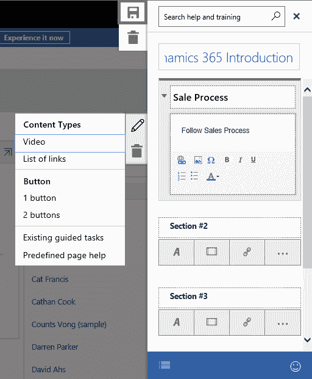
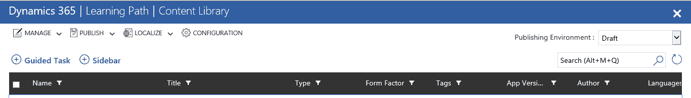
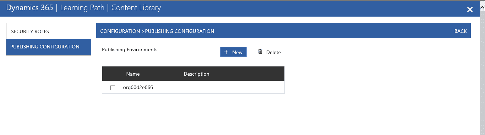

# 通过学习路径培训用户

Dynamics 365 学习路径在 Dynamics 365 版本 9.0 中首次推出。此功能允许在用户打开页面时向 Dynamics 365 中添加可自定义的帮助内容。它还允许用户同时跟随帮助并进行工作，提供适应性，并轻松学习 Dynamics 365。

本章将涵盖以下主题，以帮助您更好地理解学习路径：

+   学习路径概述

+   学习路径的先决条件

+   在 Dynamics 365 中启用学习路径

+   Dynamics 365 学习路径的内容库

+   创建和配置学习路径的步骤

+   理解学习路径

# 学习路径概述

Dynamics 365 学习路径是一个有效且高效的功能，使用户能够同时学习和适应 Dynamics 365。此功能仅适用于 Dynamics 365 在线版。

学习路径帮助可以在加载页面时或点击帮助按钮时提供给用户。学习路径为文本、视频和网址提供培训。它提供了在 Dynamics 365 中执行任务的完整流程。学习路径支持将内容导入和导出到不同的组织，这意味着可以方便地将学习路径从一个组织导出到另一个组织。

学习路径支持帮助内容的本地化，这意味着帮助内容是为使用学习路径的 Dynamics 365 用户创建的。所有帮助内容以选定语言提供给 Dynamics 365 用户；这一独特属性使得 Dynamics 365 学习路径对用户具有吸引力。

学习路径可以在平板电脑和移动设备上访问。它对不同地区更为可靠；很快将会在所有剩余地区提供访问。

# 使用学习路径的先决条件

学习路径为 Dynamics 365 用户带来了大量的好处。首先，需要完成以下先决条件才能使用学习路径：

+   Dynamics 365 学习路径仅在 Dynamics 365 版本 9.0 中受支持。在 Dynamics 365 2016 版本 1 中，用户只能看到 Microsoft 创建的默认帮助；要为学习路径创建内容，需要使用新的 Dynamics 365 版本 9.0。

+   系统自定义者或系统管理员角色需要被分配，以便创作学习路径内容。

+   在组织中，必须启用 Dynamics 365 中的学习路径。下一部分将介绍如何为组织启用学习路径。

+   添加用户到学习路径组非常重要。此任务将在下一部分中介绍。

# 在 Dynamics 365 中启用学习路径

由于默认情况下学习路径是关闭的，因此需要在 Dynamics 365 中开启学习路径。以下步骤将说明如何启用学习路径，并且如何将用户添加到 Dynamics 365 学习路径组：

1.  使用 Office 365 凭据登录到 Dynamics 365 9.0 实例。

1.  在 Dynamics 365 中，应启用“退出学习路径”功能。选择设置并点击“退出学习路径”。完成此阶段后，Dynamics 365 控件将被重定向到 Dynamics 365 主屏幕。请看以下截图：

1.  下一阶段是启用学习路径创作功能。进入设置 | 管理：

选择系统设置：

1.  选择系统设置 | 启用学习路径并启用学习路径创作。点击确认以保存更改，如下所示：

1.  现在，继续添加用户到学习路径组中。进入 Office 365 管理面板。选择组，点击学习路径创作者，然后将用户添加到该组，如下图所示：

# Dynamics 365 学习路径内容库

学习路径内容库用于展示为组织创建和可用的内容。此外，它还用于管理、创建和与控件交互。内容库可以从 Dynamics 365 网站地图的“培训”选项卡访问，或者点击侧边栏中的“内容库”选项。

下图将解释内容库的用户界面：

请考虑以下几点：

1.  引导任务：

引导任务包含一个或一系列步骤。启动引导任务非常简单。它通过逐步引导用户完成过程，帮助用户理解新任务。它确保你同时添加数据和执行任务。它为用户提供一个“下一步”按钮，如果用户正在执行任何任务，这使得它更加高效。

它支持许多功能，如添加视频、链接和更多信息，帮助用户更加熟悉 Dynamics 365 界面。

1.  侧边栏：

当用户点击帮助按钮、选择页面上的链接或按钮时，侧边栏会出现，并将页面导航到该自定义设计内容。Dynamics 365 支持创建主屏幕侧边栏，用户选择帮助按钮或打开主屏幕时，它会显示在屏幕上。

系统自定义器还可以创建错误侧边栏，当出现问题时，会显示给用户。侧边栏支持添加链接、信息和视频，以帮助最终用户。

1.  管理：此选项允许以以下方式管理内容：

    +   检入：此选项保存更改并使内容对其他用户可用

    +   删除：用来删除内容

    +   导出：将内容导出到其他组织

    +   导入：从其他组织导入内容

1.  发布：发布所有更改到内容并使其对最终用户可用。

1.  本地化：使用此选项添加内容的本地化。

1.  配置：此选项用于配置安全角色以及发布环境。

# 创建和配置学习路径的步骤

Dynamics 365 覆盖了从潜在客户到机会的销售流程。在此场景中，使用从潜在客户到机会的流程作为学习路径示例。以下步骤提供了如何为潜在客户到机会创建学习路径的指导：

1.  在 Dynamics 365 中，进入培训 | 内容库：

1.  内容库将会打开：

1.  选择侧边栏选项：

1.  学习侧边栏表单将会打开，填写所有必要的字段。输入名称，选择模板，并保存侧边栏表单：

1.  完成此步骤后，编辑侧边栏模板，输入侧边栏名称，必要时编辑部分，并向部分中添加 URLs 和图片：

1.  如果需要更新部分属性，请点击该部分的编辑按钮。此选项将添加内容类型、文本、按钮、链接列表等：

1.  选择侧边栏表单的保存选项：

1.  选择左侧的预览按钮查看预览：

1.  在查看预览后，发布或检查更改：

1.  选择学习路径首页按钮，此操作会将你重定向到学习路径库：

1.  选择“引导任务”选项以创建引导任务：

1.  填写所有必要的引导任务字段并保存，如下图所示：

1.  在流程编辑器中，添加从潜在客户到机会的引导选项。首先，收起流程编辑器，然后选择“Leads”实体：

然后选择“Leads”标签页，如下图所示：

1.  扩展流程编辑器，当潜在客户记录加载时：

1.  选择“添加新步骤”并点击“学习步骤”：

1.  将新创建的学习步骤拖放到新潜在客户按钮上。在学习步骤中添加标题和描述：

1.  点击保存按钮以保存学习步骤中的更改：

1.  点击创建新潜在客户记录的按钮并打开新的潜在客户表单。要向“联系方式”部分添加新步骤，请选择用户操作并点击下一步按钮。使用以下图片：

1.  拖放此学习步骤到潜在客户记录的联系人部分。添加步骤描述和名称。选择“保存”按钮以保存更改：

1.  对公司部分重复相同的过程：

1.  为 SAVE 按钮创建相同的学习步骤：

1.  对 QUALIFY 按钮重复此过程：

1.  为业务流程流的“Next”按钮添加另一个步骤：

1.  在机会记录中，选择带有“Next”按钮的学习步骤：

1.  拖放此步骤到机会名称上。对业务流程流、活动等重复此操作：

1.  现在，保存引导任务：

1.  查看预览并发布更改。

# 发布内容和发布组

除非已发布，否则 Dynamics 365 学习路径内容不可用。可以从内容库发布内容。要发布学习路径中的内容，首先需要进行签入。以下步骤将帮助你了解如何从内容库发布内容。

1.  转到内容库：

1.  选择要发布的内容列表中的内容。如果内容未签入，请确保将其签入：

1.  点击“发布”按钮以发布更改：

这些是非常简单的发布内容步骤。

发布组用于发布学习路径的内容。启用学习路径时，默认会创建一个发布组。该默认发布组的名称与组织名称相同。你也可以创建其他发布组，并且可以将多个组织添加到发布组中。多个组织可以是不同组的成员，从而实现将内容发布到不同组织。

以下步骤说明如何创建发布组：

1.  转到内容库：

1.  点击“配置”：

1.  在“发布配置”中选择新的发布组：

1.  完成名称和可选描述：

1.  将组织包含在发布组中。

1.  点击“保存”并点击“确定”。

# 总结

在本章中，我们了解了如何在 Dynamics 365 中操作学习路径，Dynamics 365 学习路径的内容库，创建和配置学习路径的步骤等。在下一章中，我们将讨论网页客户端刷新和统一界面，以及相关功能，如相关搜索和关系洞察。
