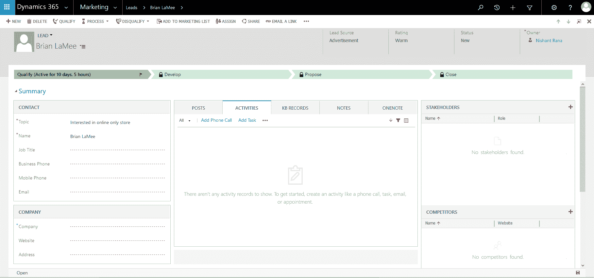
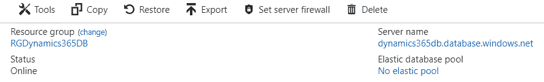
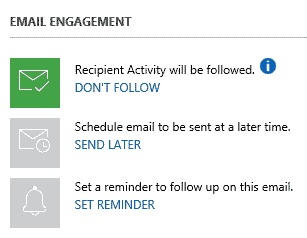
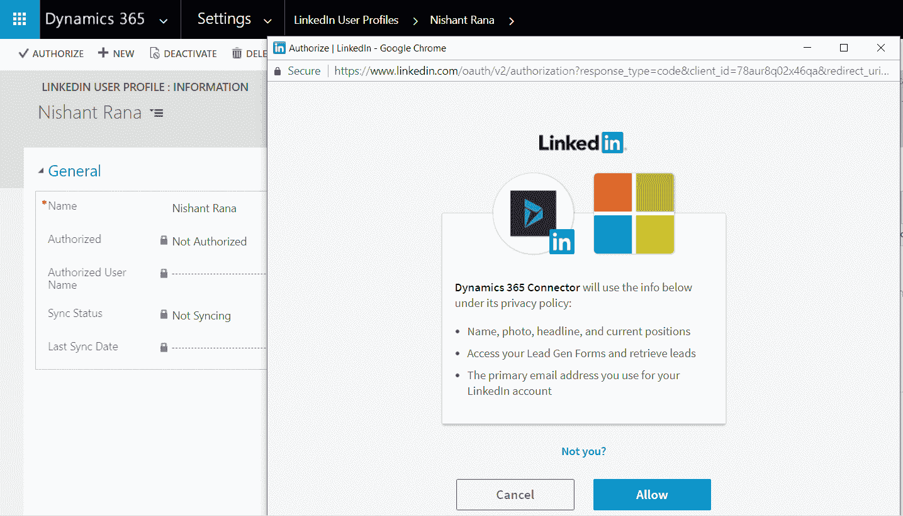

# Dynamics 365 中的其他新特性

在上一章中，我们了解了在 Dynamics 365 中新增的 *学习路径* 功能，该功能为最终用户提供了丰富的上下文内容。在本章中，我们将介绍一些在 2017 年 7 月和 2016 年 12 月的更新中引入的、我们在之前章节中未提及的新特性。

以下是本章将涵盖的一些主要话题：

+   Web 客户端刷新

+   统一界面

+   活动时间线

+   多选选项集

+   虚拟实体

+   自动编号

+   相关性搜索

+   数据导出服务

+   关系洞察

+   实时协助

+   LinkedIn 潜在客户生成表单

# Dynamics 365 中引入的顶级新特性

每次更新都会在 Dynamics 365 中添加许多新的功能、特性和改进。部分新功能面向那些每天使用系统的最终用户，而其他功能则面向管理员、自定义人员或开发人员，他们负责配置、定制和围绕该系统开发解决方案。本章将介绍一些之前章节未涉及的新功能。

# 理解 Web 客户端刷新中引入的视觉变化

Web 客户端刷新功能是 2017 年 7 月更新中引入的最大改进之一，旨在根据 Dynamics 365 用户对用户界面的反馈，提升产品体验。Web 客户端应用的用户界面经过了彻底的重设计，旨在通过提高可读性和可访问性，帮助用户在使用应用时提高工作效率。

下面是 Web 客户端的一些主要改进：

+   容器（如节）现在有了明确的边框，任何不属于内容的额外空白部分已被灰色阴影标示出来。类似地，主体内容被放置在白色容器中，以便将其与头部和其他内容分开。如果容器中没有数据，系统会通过图标和消息清晰地显示出来，如社交面板中的活动列表所示：



+   现在可以为表单中的标签和数值配置文本换行。我们需要进入系统设置 | 常规标签，并选择“是”以启用“允许在表单字段标签和数值中换行”选项：


+   这是启用文本换行后，表单中字段显示的样式：


样式变化包括三种新主题：

+   CRM 默认主题

+   CRM 蓝色主题

+   CRM 橙色主题

主题还包括通过页面头部填充颜色和面板头部填充颜色属性来定义页面头部和节头部的颜色选项。

在这里，我们为这些属性指定了以下值：

+   页面头部填充颜色 – `#ccffcc`

+   面板头部填充颜色 – `#ccffff`

这是这些更改在 Dynamics 365 界面中的显示方式：


我们现在可以为表单中的子网格标题定义颜色。打开表单进行自定义，选择子网格，在编辑属性对话框中，我们可以指定面板标题颜色，如下所示：


# 使用多选项集选择多个选项

多选项集现在作为 Dynamics 365 中的新属性类型可用。这是该新属性类型的一些关键功能：

+   多选项集可用于高级查找

+   它们适用于主表单、快速创建和快速查看表单

+   现有的全局选项集可以用于创建多选项集属性

+   现有的客户端 API 方法，特定于现有的单值选项集，适用于新的多选项集

+   多选项集不支持业务规则和工作流

以下截图显示了多选项集字段，其中三个项目已被选中：项目 1、项目 2 和项目 3：


# 使用“Does Not Contain Data”筛选器进行高级查找

现在，ADVANCED FIND 视图支持针对相关记录的“Does Not Contain Data”筛选器。所以基本上，我们现在可以编写这样的查询：`查找所有不包含相关任务的潜在客户记录`。但是，正如所示，我们目前无法为相关记录定义筛选条件：


这是前述查询的`fetch` XML 形式：

```
    <fetch version="1.0" output-format="xml-platform" mapping="logical" 
     distinct="true"> 
      <entity name="lead"> 
        <attribute name="fullname" /> 
        <attribute name="companyname" /> 
        <attribute name="telephone1" /> 
        <attribute name="leadid" /> 
        <order attribute="fullname" descending="false" /> 
        <link-entity name="task" from="regardingobjectid" to="leadid"
         link-type="outer" alias="ac" /> 
        <filter type="and"> 
          <condition entityname="ac" attribute="regardingobjectid" operator="null" /> 
        </filter> 
      </entity> 
    </fetch> 
```

# 定义 Web 资源依赖关系

对于 JavaScript 和 HTML Web 资源，我们现在可以指定依赖关系。这确保了在导出时，所有必需的依赖资源在解决方案中可用，或者已经存在于目标系统中（即解决方案正在导入的系统），否则会导致导出失败。它还确保我们不会意外删除任何组件，而不先删除其依赖关系。对于 HTML 和 JavaScript，我们可以定义对其他 Web 资源类型（如 CSS、HTML、JavaScript 库、RESX 和 XML）的依赖关系。对于 JavaScript，我们还可以定义对特定实体属性的依赖关系，如下所示：


# 了解新的统一界面

统一界面是 Dynamics 365 2017 年 7 月更新中引入的新框架。使用统一界面，我们现在在所有平台上都有相同的架构。目前，我们有以下应用程序，如客户服务中心（这是互动服务中心的新版本）、现场资源中心、项目资源中心和销售中心，这些都在统一界面上开发，如下所示：


统一界面从头开始构建，注重可访问性、一致性和性能。它还带来了更快的开发和部署时间，单一的定制集可以无缝地在不同设备间工作。对于最终用户，它将在平板电脑/手机客户端、移动 Web 客户端或 Outlook 应用中提供统一的体验，这使得用户体验更加一致、友好，并节省了培训成本。

新统一界面的好处包括：

+   轻松访问左侧导航面板中的收藏夹和最近的记录、仪表板和实体：


+   在统一界面中，最近使用的记录可以被固定，如下所示：


+   新的响应式统一客户端界面会根据屏幕大小自动适配。在调整浏览器窗口大小时，统一界面会显示适应小屏幕的界面，如右侧图片所示：


+   业务流程现在可以在浮动模式和停靠模式下显示：


+   业务流程可以像这里展示的那样垂直对齐：


+   新的统一界面时间轴控件将所有活动、笔记和帖子整合并提供单一视图，用户可以按记录类型、日期等进行筛选。它还允许用户根据记录类型执行各种操作，如下所示：


+   知识库的编辑器已得到增强，包括支持编辑 HTML 源代码，如下所示：


+   它还包括预览内容的选项，以检查其与不同设备的兼容性：


# 使用虚拟实体集成外部数据

在 2017 年 7 月的 Dynamics 365 更新中，我们现在可以创建一种虚拟类型的自定义实体。之所以称为虚拟实体，是因为该实体的数据并未保存在 Dynamics 365 内部。在运行时，虚拟实体在被访问时会从配置的外部数据源提供商获取数据。目前，它仅支持 OData V4 数据提供商。在 Dynamics 365 的早期版本中，若要从外部数据源获取或检索数据，我们需要编写自定义代码。现在，一旦 OData 服务准备好并已公开，它就成为 Dynamics 365 内部的配置内容，系统管理员或定制者可以处理，而无需依赖开发人员。

配置虚拟实体的方法：

1.  转到设置 | 管理，并选择虚拟实体数据源：


1.  点击“新建”以创建新的数据源。目前，它仅支持 OData V4 数据提供程序：


1.  指定 OData 服务的 URL，并提供所需的值以创建 OData 源记录：


1.  现在，数据源设置完成后，下一步是创建虚拟实体。转到设置 | 自定义 | 自定义系统 | 选择实体并点击“新建”以创建新实体。要创建虚拟实体，我们需要选择“虚拟实体”复选框。

1.  对于虚拟实体，External Name 属性和 External Collection Name 属性应与我们希望在 Dynamics 365 中配置的 OData 实体的实体名称和实体集名称相对应：


要了解更多关于 OData 的信息，请访问以下链接：

[`www.odata.org/documentation/`](http://www.odata.org/documentation/)

1.  在创建虚拟实体时，系统将自动创建两个字段，这些字段需要作为虚拟实体配置的一部分，映射到 OData 实体的相应字段。除了自动创建的字段，我们还可以创建新的自定义字段，然后将它们映射到 OData 实体的相应字段，以便它们在 Dynamics 365 中显示。

1.  在这里，我们将为虚拟实体创建的 ID 字段与我们的 OData 实体的主键字段（例如`EntityID`）进行映射。主键字段必须是 GUID 类型，否则我们将得到异常：


1.  一旦我们完成了所有虚拟实体字段的创建和映射，就可以发布更改。

1.  这个虚拟实体将像其他任何实体一样可用。我们可以打开**高级查找**视图，选择虚拟实体并针对其运行查询，或者打开为该实体创建的任何记录进行查看。

1.  在计划使用虚拟实体时，我们需要考虑以下几个要点：

    +   虚拟实体是只读的

    +   虚拟实体是组织所有的，但是，Dynamics 365 的安全功能不支持虚拟实体

    +   虚拟实体不能是活动类型

    +   我们不能针对虚拟实体配置 SLA（服务水平协议）或业务流程流

    +   虚拟实体不支持创建快速创建表单

    +   我们不能在它们上启用审计和重复检测

    +   虚拟实体字段不能用于汇总和计算字段

    +   尽管我们可以在高级查找中使用它，微软不推荐使用连接 Dynamics 365 原生数据与虚拟实体数据的查询

    +   我们不能针对虚拟实体编写工作流或插件

# 实现自动编号

自动编号作为一个特性，从 Dynamics 365 版本 3.0 开始就已经存在，但它一直仅限于少数几个实体，如合同、案例、文章、报价单等。

转到设置 | 管理，然后点击自动编号，查看我们可以配置自动编号的所有实体：


然而，现在通过 Dynamics 365 2017 年 7 月更新，我们终于可以为其他实体定义自动编号了。目前，我们只能使用 SDK 的`CreateAttribute`请求以编程方式定义它。我们没有用户界面来定义它。

下面是创建新的自动编号字段名称的示例代码，

`My Auto Number` 在联系人实体中：

```
    CreateAttributeRequest createAttributeRequest = new CreateAttributeRequest(); 
    createAttributeRequest.EntityName = "contact"; 

    var autoNumberAttributeMetadata = new StringAttributeMetadata() 
    { 
      AutoNumberFormat = "Auto Number - {SEQNUM:4} - {RANDSTRING:4} - 
       {DATETIMEUTC:yyyyMMddhhmmss}", 
      SchemaName = "new_autonumber1", 
      MaxLength = 100, 
      RequiredLevel = new AttributeRequiredLevelManagedProperty(
       AttributeRequiredLevel.ApplicationRequired), 
      DisplayName = new Microsoft.Xrm.Sdk.Label("My Auto Number", 1033), 
      Description = new Microsoft.Xrm.Sdk.Label("This is my first auto number
       field through SDK", 1033) 
    }; 

    createAttributeRequest.Attribute = autoNumberAttributeMetadata; 
    var response = organizationService.Execute(createAttributeRequest); 
```

以下图片展示了为联系人记录指定格式后生成的自动编号字段：


下面是这个新自动编号属性的特定属性：

| **AutoNumberFormat** | 指定自动编号字段的格式，静态字符串以及：`{SEQNUM:size}` - 顺序号的大小`{RANDSTRING:size}` - 生成的随机字符串的大小`{DATETIMEUTC:format}`- 日期时间的格式 |
| --- | --- |
| **架构名称** | 指定自动编号字段的架构名称 |
| **最大长度** | 指定自动编号字段的最大长度 |

| **必需级别** | 指定自动编号字段的必需级别：

+   无

+   推荐

+   应用程序要求

+   系统要求

|

| **显示名称** | 指定自动编号字段的显示名称 |
| --- | --- |
| **描述** | 指定自动编号字段的描述 |

我们可以使用由 Jonas Rapp 开发的 XrmToolBox 插件——Auto Number Manager，通过一个直观的用户界面来创建、更新和删除自动编号字段。[`anm.xrmtoolbox.com/`](http://anm.xrmtoolbox.com/)

使用`UpdateAttribute`请求，我们可以更新现有自动编号字段的格式。这仅适用于新创建的记录，不适用于现有记录。我们还可以为一个实体创建多个自动编号字段。

不支持将属性要求级别设置为系统要求的自动编号字段。

# 使用相关搜索提升搜索体验

相关性搜索将微软的 Azure Search 的强大功能带入 Dynamics 365，以提高搜索性能。来自 Dynamics 365 实体的数据以及为相关性搜索启用的字段与 Azure Search 数据库同步，后者对其进行直观的语义搜索，并按相关性显示结果。与按实体分组显示结果的分类搜索不同，相关性搜索会跨实体字段进行搜索，并按最相关到最不相关的顺序显示结果。此外，与仅能按实体过滤结果的分类搜索相比，相关性搜索允许 Dynamics 365 用户根据多个条件（如记录类型、所有者、修改日期、创建日期和为每个实体定义的其他筛选选项）过滤结果，这些选项基于面向的维度进行筛选。由于相关性搜索使用语义搜索，我们无需在搜索文本中指定通配符。相关性搜索还会高亮显示搜索结果中的匹配单词。基本上，一旦我们确定并配置了实体及其相应的字段进行相关性搜索，第一次进行完全同步时可能需要超过一个小时，具体时间取决于同步的数据量，之后在 Dynamics 365 中所做的任何更改可能最多需要 15 分钟才能出现在搜索结果中。

Azure Search 文档可以在这里找到：[`docs.microsoft.com/en-us/azure/search/`](https://docs.microsoft.com/en-us/azure/search/)。

# 启用相关性搜索

启用相关性搜索：

1.  进入“设置” | “管理” | “系统设置”。在“常规”选项卡中，勾选“在设置搜索部分启用相关性搜索”，并同意与外部系统共享数据：


1.  接下来，我们需要定义要进行相关性搜索的实体和字段。进入“自定义设置” | “实体”，点击“配置相关性搜索”以选择需要启用相关性搜索的实体：


1.  对于相关性搜索，可以选择的实体数量没有限制。限制在于每个组织的字段数量，最多为 1,000 个字段。这里，查找字段相当于添加 3 个字段，选项集相当于 2 个字段，其余字段为 1 个字段。

1.  我们可以将可用实体列表框中的实体添加到已选择实体列表框中，然后点击发布。进度条中的“总字段索引”字段显示已使用字段的总数：


1.  要为实体启用某一特定属性的相关性搜索，我们需要将该字段添加为该实体的“快速查找”视图中的查找列。只有单行文本和多行文本字段可以被搜索。

1.  在“快速查找”视图中定义的前四个字段将在用户界面的搜索结果中显示。

1.  同样，Quick Find 视图中的前四个可筛选字段，即除单行文本或多行文本以外的数据类型字段，将作为相关性搜索用户界面中的筛选项显示。

1.  在 Quick Find 视图中定义的过滤器也会应用于相关性搜索结果。但是，并非所有操作符都支持用于过滤。以下是相关性搜索不支持的操作符列表：

| `Like` | `NotLike` | `BeginsWith` | `DoesNotBeginsWith` |
| --- | --- | --- | --- |
| `EndWith` | `DoesNotEndWith` | `ChildOf` | `EqualUserLanguage` |
| `Mask` | `NotMask` | `MaskSelect` | `Above` |
| `Under` | `NotUnder` | `UnderOrEqual` | `AboveOrEqual` |

Quick Find 视图中的相关实体字段不会被相关性搜索视为查找列、视图列或筛选器。

1.  要执行相关性搜索，请点击导航栏中的搜索图标并输入文本以开始搜索。在这里，我们输入了`Eva`作为搜索文本：


1.  搜索结果将根据相关性以列表形式显示，并且包括来自所有可搜索实体的结果，这些结果可以根据记录类型、所有者、修改时间、创建时间或任何其他定义的筛选项进一步筛选。匹配项也会在结果中高亮显示。

1.  用户还可以定义默认的搜索体验，并为每个为相关性搜索配置的实体配置筛选字段：

    +   要定义默认的搜索体验，请导航到导航栏上的齿轮图标，选择“选项”以打开“设置个人选项”对话框。在“常规”选项卡中，我们可以定义相关性搜索、分类搜索，或者让最后一次使用的搜索成为默认搜索体验，如下所示：


+   同样，我们可以点击“配置”按钮来配置筛选器和筛选项，以定义相关性搜索的筛选项。我们可以为每个可搜索的实体定义最多四个字段，如下所示：


# 使用数据导出服务导出 Dynamics 365 数据

数据导出服务可以定义为一个可扩展且安全的云服务，它使得可以将 Dynamics 365 在线数据库复制到 Microsoft Azure SQL 数据库或 Microsoft Azure 虚拟机上的 SQL 数据库中。然后，这些 Dynamics 365 数据可以用于各种分析和报告场景，例如 Power BI 或基于 SQL 的 SSRS 报告，或者在其上构建任何自定义解决方案。数据导出服务基于定义的导出配置文件同步整个 Dynamics 365 数据，首次同步后，随后的运行仅同步增量变化。

# 配置数据导出服务

配置数据导出服务：

1.  我们首先需要将 Office 365 租户与 Azure 订阅关联（如果它们是分开的），请参见 [`docs.microsoft.com/zh-cn/azure/billing/billing-add-office-365-tenant-to-azure-subscription`](https://docs.microsoft.com/zh-cn/azure/billing/billing-add-office-365-tenant-to-azure-subscription)。

1.  接下来，我们创建一个 Azure SQL 数据库。为此，请登录 Azure 门户并点击“添加”以创建一个新的 SQL 数据库： [`docs.microsoft.com/zh-cn/azure/sql-database/sql-database-get-started-portal`](https://docs.microsoft.com/zh-cn/azure/sql-database/sql-database-get-started-portal)。

1.  在成功创建 Azure SQL 数据库后，打开 SQL Server Management Studio 以连接到 Azure SQL 数据库。我们可以从 Azure 门户获取服务器名称，并设置防火墙规则，以允许从 SQL Server Management Studio 连接到 Azure SQL 数据库：



1.  接下来，我们需要创建一个 SQL 用户，该用户将由数据导出服务用于在 Azure 数据库中写入数据。对于这个第一个用户，创建一个登录，选择主数据库：

```
      Create login [dataexportserviceuser] with PASSWORD = '**********';  
```

1.  为您创建的 Azure SQL 数据库分配数据库所有者角色，以便用于导出 Dynamics 365 数据：

```
      Create user [dataexportserviceuser] from login [dataexportserviceuser]; 

      Exec sp_addrolemember 'db_owner', 'dataexportserviceuser'; 
```

数据库用户所需的数据库权限，请参阅此处： [`technet.microsoft.com/zh-cn/library/mt744592.aspx#Anchor_1`](https://technet.microsoft.com/zh-cn/library/mt744592.aspx#Anchor_1)。

1.  现在，在设置好数据库后，我们需要在 Dynamics 365 中配置数据导出服务。导航到设置 | Dynamics 市场，找到数据导出服务并点击“立即获取”。同意条款和条件。这将把数据导出服务解决方案安装到 Dynamics 365 实例中：

1.  这会在 Dynamics 365 的设置中添加数据导出链接。点击后，我们会看到一个免责声明页面，在这里我们需要同意将数据导出到外部系统：


启用浏览器中 [`discovery.crmreplication.azure.net/`](https://discovery.crmreplication.azure.net/) 域的弹出窗口，以便在导航到设置 | 数据导出时自动登录**。**

1.  一旦我们自动登录，我们可以点击“新建”按钮来创建一个数据导出配置文件：


对于数据导出配置文件：

| 名称 | 指定导出配置文件的唯一名称。 |
| --- | --- |
| 密钥库 URL | 指定密钥库的 URL，该密钥库基本上包含安全存储在其中的 Azure SQL 数据库凭据和连接信息。 |
| 模式 | 指定数据库的模式。默认值是 dbo。 |
| 前缀 | 指定我们希望赋予在数据库中创建的表的前缀。 |
| 重试次数 | 指定在插入或更新记录失败时重试的次数。可接受的值为 0 到 20。默认值为 12。 |
| 重试间隔 | 指定在失败时每次重试的间隔时间。可接受的值为 0 到 3,600 秒。默认值为 5 秒。 |
| 写入删除日志 | 指定日志记录已删除记录的可选设置。 |

1.  对于密钥库 URL，微软提供了 PowerShell 脚本，我们需要使用它来生成密钥库 URL。要获取脚本，请点击密钥库 URL 文本框旁边的蓝色信息图标并复制它。基本上，在这里我们需要在 PowerShell 脚本中为以下占位符指定值，如下所示：


1.  转到 Azure SQL 数据库的概览部分，以获取订阅 ID、资源组名称、位置和连接字符串的值。

1.  对于连接字符串，我们需要复制 ADO.NET 连接字符串，并将用户名和密码替换为之前创建的 SQL DB 用户的凭据。

1.  对于组织 ID，请进入 Dynamics 365 中的设置 | 自定义并从 *实例参考信息* 部分复制 ID。

1.  对于租户 ID，请导航到 Azure 门户 | Azure Active Directory | 应用注册 | 端点，并从联合元数据文档 URL 中复制租户 ID。

1.  替换 PowerShell 脚本中的占位符并运行脚本。这将会在 Azure 门户中创建一个密钥库记录。要复制密钥库 URL，请导航到 Azure 门户 | 密钥库。选择已创建的密钥库并点击 Secrets。复制密钥标识符值，并将其粘贴到 Dynamics 365 中创建导出配置文件时的密钥值 URL 处，然后点击验证。

安装并配置 Azure PowerShell 扩展： [`docs.microsoft.com/en-us/powershell/azure/install-azurerm-ps?view=azurermps-3.8.0`](https://docs.microsoft.com/en-us/powershell/azure/install-azurerm-ps?view=azurermps-3.8.0)。

1.  在验证成功后，我们将收到成功消息。点击下一步选择我们希望导出的实体：


1.  在选择实体步骤中，我们选择了 Contact 实体。由于这里只选择了一个实体，因此在接下来的选择关系步骤中不会有关系可供选择。在最后的总结步骤中，检查详细信息，然后点击“创建并启用”以创建并启用配置文件，如下所示：


实体必须启用变更追踪才能将其添加到导出配置文件中。

1.  激活后将开始同步过程。我们可以点击刷新，检查导出配置文件记录的同步状态：


1.  在同步成功后，我们可以在 SQL Azure 数据库中看到 Contact 实体的导出数据：


# 配置关系洞察

关系洞察利用 Microsoft Azure 的机器学习能力，分析 Dynamics 365、Exchange 和 Office 365 中的信息，并引导用户帮助他们与客户建立更个性化和富有成效的关系。所有从这些来源捕获的洞察信息都显示在 Dynamics 365 中，因此用户无需离开 Dynamics 365，也无需在不同的应用程序之间切换，以便了解接下来需要采取的业务活动。

关系洞察的三个主要功能是：

+   关系助手

+   电子邮件参与

+   自动捕获

关系洞察仍处于预览阶段，该功能仅在**北美**（**NA**）地区可用。

# 启用关系洞察

启用关系洞察：

1.  进入设置 | 管理。打开系统设置，在预览选项卡中，选择“是”以在“关系洞察”部分启用它们：


1.  进入设置 | 关系洞察，点击安装。选择 Dynamics 365 管理页面中的 Dynamics 365 关系洞察解决方案，点击“管理”，然后选择“接受”以同意允许关系洞察访问 Dynamics 365 Online。这将为所选的 Dynamics 365 实例配置关系洞察：


# 配置关系助手

我们可以通过两种方式启用和配置关系助手：从设置 | 关系洞察或从个人选项设置。关系助手分析用户正在处理的客户记录的所有通信，并生成操作卡。这些操作卡提醒用户需要执行的操作，如今天需要发送的电子邮件，提醒用户即将到期的机会，或显示与何时打开电子邮件或附件、账户、案例、联系人等记录相关的分析或通知。这些操作卡分为不同类别，如下所示：


来自 Exchange 的电子邮件卡需要配置 Exchange Online。

操作卡可以在表单中的社交窗格的助手选项卡中查看。关系助手也可以作为仪表板中的一个组件添加。这里显示的示例操作卡提醒用户在 14 天内关闭机会的机会记录。用户可以从操作卡中打开机会记录并进行处理：


# 配置自动捕获

以下是配置自动捕获的步骤：

1.  进入设置 | 关系洞察，点击自动捕获选项卡以启用它。

1.  自动捕获需要服务器端同步和配置 Exchange Online。

配置服务器端同步：[`technet.microsoft.com/en-us/library/dn531109.aspx`](https://technet.microsoft.com/en-us/library/dn531109.aspx)。

1.  **自动捕获**会分析通过 Exchange Online 进行的电子邮件通信，并在 Dynamics 365 中显示相关的电子邮件以进行跟踪。目前，这些电子邮件是私密的，仅对当前用户可见。

1.  下面是从 Exchange 发送到联系人的电子邮件如何在 Dynamics 365 社交窗格的活动标签中显示：


1.  用户可以点击**跟踪**来跟踪 Dynamics 365 中的活动。状态会从“未跟踪”变为“跟踪待定”。在服务器端同步完成后（约 15 分钟内），电子邮件开始在 Dynamics 365 中被跟踪：


1.  一旦启用，**自动捕获**将为该 Dynamics 365 实例中的所有用户启用。用户可以通过点击齿轮图标，打开个人选项，选择**电子邮件**标签，并在活动列表选项中选择“不在 Dynamics 365 中显示未跟踪的电子邮件”来关闭此功能。

# 配置电子邮件参与

以下是配置电子邮件参与的步骤：

+   转到设置 | 关系洞察，选择 >**电子邮件参与**标签页并点击开始设置。这将开始配置电子邮件参与服务。

+   配置完成后，选择复选框以启用电子邮件参与。

为了提供关于附件的见解，我们需要在 Dynamics 365 中启用服务器端同步，以支持 SharePoint、Exchange 和 One Drive for Business：[`technet.microsoft.com/en-us/library/dn531154.aspx`](https://technet.microsoft.com/en-us/library/dn531154.aspx) 和 [`technet.microsoft.com/en-us/library/mt622109.aspx`](https://technet.microsoft.com/en-us/library/mt622109.aspx)。

1.  电子邮件参与提供关于电子邮件通信的见解，如电子邮件或附件是否已被打开，链接是否已被点击，基于打开率建议最佳的发送时间等。

1.  配置完 SharePoint 集成后，我们需要为电子邮件实体启用文档管理；转到设置 | 文档管理 | **文档管理设置**并勾选“电子邮件”复选框。如果我们希望在电子邮件活动中跟踪附件，这是必需的。

1.  电子邮件参与仅适用于从 Dynamics 365 内部发送的电子邮件。要查看其效果，请创建一个电子邮件活动。你会注意到在电子邮件活动的表单中新增了一个名为**电子邮件参与**的部分。默认情况下，创建的电子邮件会被跟踪。要取消跟踪，我们需要点击**不跟踪**链接：



1.  电子邮件还可以安排稍后发送：


1.  **设置提醒**允许我们设置何时希望收到通知的条件：


1.  我们可以看到调度信息已添加到活动记录中，如下所示：


1.  与电子邮件参与相关的操作卡片将显示在关系助手中：


1.  与电子邮件类似，附件也可以被跟踪。为此，在附件子网格中点击**+**按钮，这将打开管理附件对话框。文档上传成功后，我们将看到跟踪附件的选项：


1.  我们还可以看到一个名为“RECIPIENT ACTIVITY”（收件人活动）的部分，已添加到正在跟踪的电子邮件的电子邮件实体表单中。它为我们提供了电子邮件被打开的次数、附件被查看的次数、链接点击的次数以及回复的总数的概览视图。

1.  除了概览视图外，我们还可以查看邮件何时以及在哪个设备上被打开，链接何时被点击，附件何时被查看等等，如下所示：


1.  电子邮件参与功能也适用于电子邮件模板。如果我们使用电子邮件模板发送邮件，它会跟踪例如某个特定模板的邮件被打开多少次，邮件的打开率、回复次数、回复率以及模板被用于发送邮件的总次数，基于这些捕捉到的细节，会标记该邮件模板为推荐，如下所示：


# 配置 Dynamics 365 Live Assist

Dynamics 365 的 Live Assist 是 Dynamics 365 的一个附加组件，添加了聊天、共同浏览和视频功能。它允许 Dynamics 365 用户与客户进行更加个性化的互动，从而可能提高在线销售、加速问题解决等。

安装方法：

1.  进入设置 | Dynamics Marketplace，搜索 Live Assist 并点击免费试用以开始使用。

1.  验证 Dynamics 365 实例，并点击同意将应用程序添加到 Dynamics 365：


1.  这将打开 Live Assist 配置页面，选择 Dynamics 365 实例，提供联系电子邮件地址并点击提交以开始配置：

1.  配置完成后，一封确认邮件将发送到提供的联系电子邮件地址。邮件中会包含指向 Live Assist 管理门户的链接，我们可以使用 Dynamics 365 凭据登录，并按照说明完成 Live Assist 的设置。

1.  通过管理员门户（[`admin.na1.liveassistfor365.com/portal/`](https://admin.na1.liveassistfor365.com/portal/)），管理员可以管理订阅和用户，例如启用或禁用用户，或将监督者（管理员）角色分配给用户：


1.  在 Dynamics 365 内，我们可以看到 Live Assist 链接添加到设置中的业务区域：


1.  如下图所示，在 Dynamics 365 右侧的 Live Assist 面板中：


Live Assist for Microsoft Dynamics 365 的知识库：[`www.liveassistfor365.com/en/support/knowledge-base/`](https://www.liveassistfor365.com/en/support/knowledge-base/).

1.  要查看其操作方式，我们可以使用 Live Assist 演示站点。要访问它，我们需要在管理门户中点击“开始”按钮，转到其中的第 3 步，并启动 Dynamics 365 和演示站点：


1.  我们可以点击“启动 Dynamics 365”按钮以打开 Dynamics 365，点击“演示站点”按钮以打开 Live Assist 提供的演示站点，用于测试目的：


1.  演示站点是一个为测试设计的 CafeX 站点。Dynamics 组织的 Live Assist 标签将自动嵌入演示站点。

1.  在 Dynamics 365 中使用 Live Assist 的代理人可以在演示站点内与访客进行聊天和协助，如下图所示：

1.  代理人可以在 Dynamics 365 内的 Live Assist 小部件中搜索知识库、开放聊天活动，并创建案例记录：


1.  要开始共同浏览会话，用户可以在 Live Assist 小部件内点击蓝色屏幕共享图标。共同浏览允许客户或访客与代理人共享屏幕：


1.  我们还可以在全屏模式下打开聊天窗口，其中包括搜索联系人或案例、创建新联系人或案例记录的功能，同时提供有关访客、聊天、设备等的附加详细信息，如下图所示：


# 配置 Dynamics 365 Connector for LinkedIn Lead Gen Forms

使用 Dynamics 365 Connector for LinkedIn Lead Gen Forms，我们可以无缝同步 LinkedIn Lead Gen Forms 中的 LinkedIn 潜在客户到 Dynamics 365。这些潜在客户可以在 Dynamics 365 中进行培养。

设置 LinkedIn Lead Gen Forms：[`business.linkedin.com/marketing-solutions/native-advertising/lead-gen-ads`](https://business.linkedin.com/marketing-solutions/native-advertising/lead-gen-ads).

配置方法如下：

1.  转到“设置” | Dynamics Marketplace，在其中搜索`Dynamics 365 Connector for LinkedIn Lead Gen Forms`安装它。点击“免费试用”，按照说明开始安装过程。

1.  在 LinkedIn 组织选择器页面中，选择组织并点击“继续”以开始设置：


1.  安装成功后，我们将收到确认电子邮件。这会在 Dynamics 365 中安装`LinkedInLeadGenIntegration`解决方案。

1.  每当从 LinkedIn 同步一个新的潜在客户时，Dynamics 365 会查找在活动的 LINKEDIN 潜在客户匹配策略记录中定义的匹配字段，以确定是创建新潜在客户还是更新 Dynamics 365 中的现有潜在客户记录。

1.  LinkedIn 潜在客户是在 Dynamics 365 中创建的 LinkedIn 表单提交记录。它们包含 LinkedIn 用户在提交表单时提供的答案。现有的潜在客户记录会根据定义为匹配字段的字段与这些答案进行匹配。

1.  拥有 LinkedIn Lead Gen Forms Connector Administrator 安全角色的用户可以定义电子邮件潜在客户匹配策略。以下是在 Dynamics 365 中创建的默认记录，其中定义了基于电子邮件地址的匹配字段：


1.  在任何给定的时间点，只能激活一个策略。如果定义了多个字段，则所有字段必须匹配，现有的潜在客户记录才会被更新。如果只有部分字段匹配，则我们可以配置在 LinkedIn LeadGen 集成配置记录的“匹配失败时”属性中，是否应创建新的潜在客户记录，或者不采取任何操作：


1.  接下来，我们需要授权 Dynamics 365 从 LinkedIn 的广告活动管理器同步数据。转到设置 | LinkedIn 用户个人资料，点击“新建”以创建一个新的用户个人资料记录。要将 LinkedIn 帐户添加到这个新用户个人资料中，点击“授权”按钮。输入 LinkedIn 帐户凭据并选择“允许”：



1.  在接下来的屏幕中选择“是”，以允许 Dynamics 365 访问 LinkedIn 数据。

1.  这会将 LinkedIn 帐户添加到个人资料中并开始同步。我们也可以点击“同步提交”按钮手动启动同步。这将开始将 LinkedIn 表单提交记录与 Dynamics 365 进行同步：


1.  在 Dynamics 365 中，我们可以打开潜在客户记录并查看在 LinkedIn Lead 信息部分中捕获的详细信息，如下所示：


# 总结

本章中，我们介绍了 Dynamics 365 中的一些重大变化，如 Web 客户端刷新和统一界面，以及像相关性搜索和关系洞察等功能，这些功能将人工智能引入到 Dynamics 365 中。我们还了解了如何通过简单的配置步骤导出 Dynamics 365 数据，这些数据可以用于各种分析目的。
