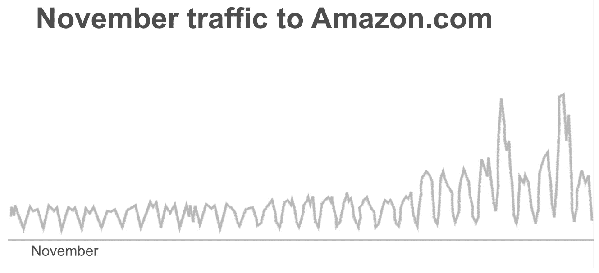
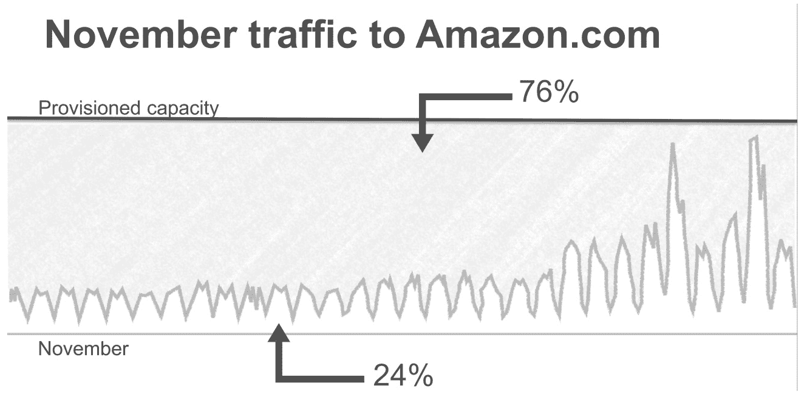
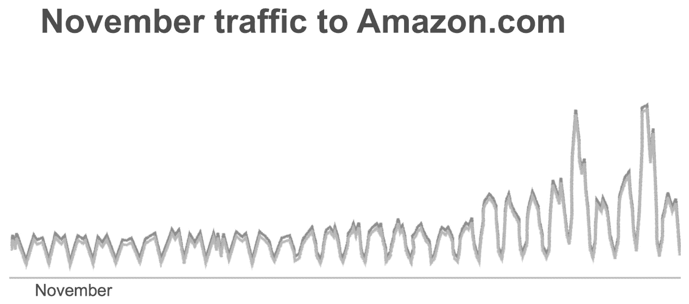
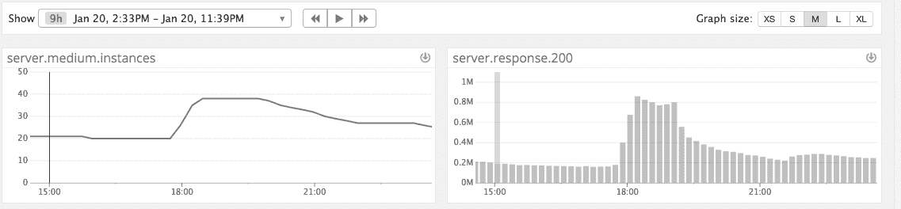
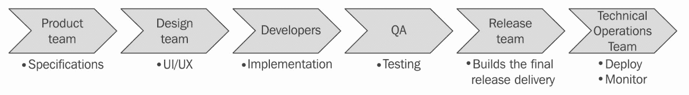
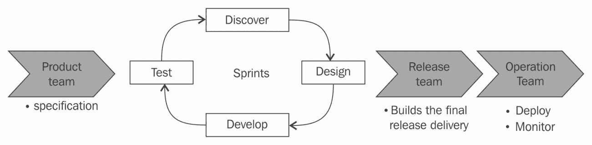
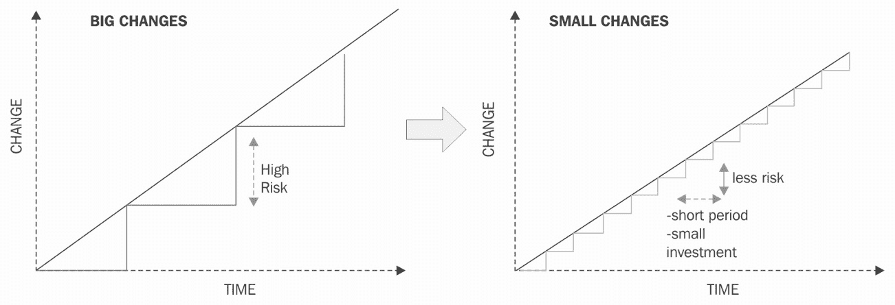
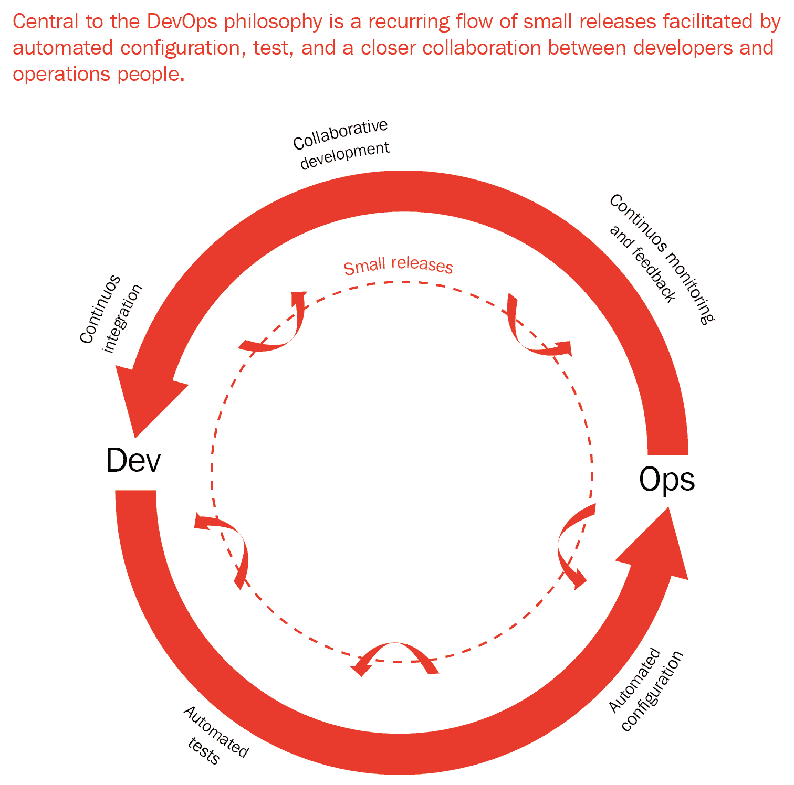
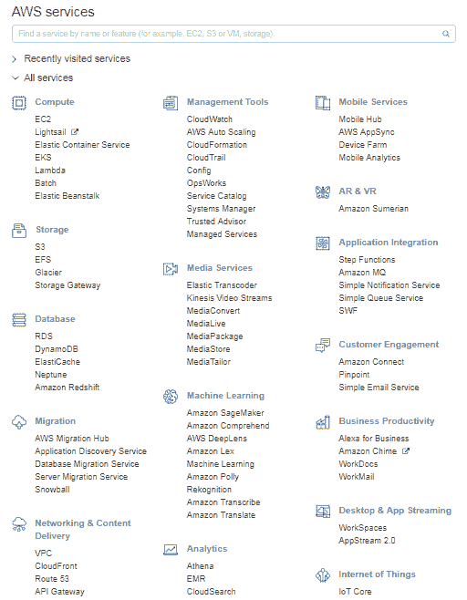

# 云计算与 DevOps 革命

科技行业正在不断变化。尽管互联网仅在二十多年前诞生，但它已经彻底改变了我们的生活方式。每天，有超过十亿人访问 Facebook；每分钟，大约有 300 小时的视频内容被上传到 YouTube；每秒，Google 处理约 40,000 个搜索查询。能够处理如此庞大的规模并不容易。然而，本书将为您提供有关部署哲学、工具及采用最佳实践的实用指南。通过使用**Amazon Web Services** (**AWS**)，您将能够构建管理和扩展基础设施、工程流程和应用程序所需的关键元素，且花费和精力最小。第一章将介绍以下主题的新范式：

+   从云的角度思考，而非从基础设施的角度

+   采用 DevOps 文化

+   在 AWS 中部署

# 从云的角度思考，而非从基础设施的角度

现在我们将描述一个发生在 2011 年 12 月底的数据中心实际事件，当时我们的实时监控系统收到了数十个警报。这是由于与数据中心的连接丧失所导致的。管理员立即赶往**网络操作中心** (**NOC**)，希望这只是监控系统中的一个小故障。由于有如此多的冗余，我们可能会疑惑一切是如何*离线*的。可惜的是，NOC 房间的大监控屏幕全部变成了红色，这可不是个好兆头。这是一个非常漫长噩梦的开始。

事实上，这次事故是由一名电工引发的，他在数据中心工作时不小心触发了火警警报。在发生此事件的几秒钟内，灭火系统启动，并将氩气释放到服务器机架上。不幸的是，这种灭火系统在释放气体时发出的噪音太大，声波瞬间摧毁了数百个硬盘，导致数据中心设施彻底停运。恢复过程花费了几个月的时间。

# 部署自有硬件与云端部署

不久前，大小科技公司都需要有一支合适的技术运营团队，能够搭建基础设施。这个过程大致是这样的：

1.  飞往您希望设置基础设施的地点。在这里，参观不同的数据中心及其设施。观察地板考虑因素、电力考量、**暖通空调** (**HVAC**)、防火系统、物理安全等。

1.  选择互联网服务提供商。最终，您需要考虑服务器和更多带宽，但过程是一样的——您希望为您的服务器获取互联网连接。

1.  一旦完成这一步，就到了购买硬件的时刻。做出正确的决策非常重要，因为你可能会花费公司大部分的资金来选择和购买服务器、交换机、路由器、防火墙、存储、UPS（用于停电时）、KVM、网络电缆、标签（每个系统管理员都重视这一点），以及一堆备件、硬盘、RAID 控制器、内存、电源线等。

1.  到了这一步，一旦硬件购买并运送到数据中心，你就可以将所有设备安装好，连接所有服务器，并启动所有设备。你的网络团队可以开始工作，通过不同的链路为新数据中心建立连接，配置边缘路由器、交换机、机架顶部交换机、KVM 和防火墙（有时）。接下来是存储团队，他们将提供急需的 **网络附加存储** (**NAS**) 或 **存储区域网络** (**SAN**)。然后是你的系统运维团队，他们将给服务器制作镜像、升级 BIOS（有时）、配置硬件 RAID，最后安装操作系统。

这不仅是一个大团队的全职工作，而且甚至在达到这个目标之前，你还需要花费大量的时间和金钱。正如你在本书中看到的，使用 AWS 启动新的服务器只需要几分钟。实际上，你很快会看到如何在几分钟内部署和运行多个服务，并且仅在需要时使用，采用 *按需付费* 模式。

# 成本分析

从成本角度来看，在像 AWS 这样的云基础设施中部署服务和应用程序通常比购买自己的硬件便宜得多。如果你选择部署自己的硬件，你必须提前支付所有前面提到的硬件费用（服务器、网络设备、存储等），并且在某些情况下，还需要支付许可软件费用。而在云环境中，*按需付费*。你可以迅速添加或移除服务器，且只需为服务器运行的时长付费。此外，如果你利用 PaaS 和 SaaS 应用程序，你通常会通过降低运营成本节省更多钱，因为你不需要那么多管理员来管理服务器、数据库、存储等。大多数云服务提供商（包括 AWS）还提供分层定价和量大优惠。随着服务的增长，你在每个存储单元、带宽等方面的费用会逐渐减少。

# 按需基础设施

如你所见，在云中部署时，你只需为所提供的资源付费。大多数云公司利用这一点，随时根据网站流量的变化调整基础设施的规模。能够随时按需添加或移除新服务器和服务，正是一个高效云基础设施的主要优势之一。

在以下示例中，您可以看到在 11 月期间，[`www.amazon.com/`](https://www.amazon.com/) 的流量情况。由于黑色星期五和网络星期一，月底时流量增加了三倍：

如果公司以传统方式托管其服务，它们将需要预留足够的服务器来处理这种流量，以便在这个月中，平均只有 24%的基础设施会被使用：

然而，由于能够动态扩展，它们仅能提供实际需要的资源，然后动态吸收黑色星期五和网络星期一所带来的流量激增：

您还可以看到，定期在多个组织中使用云服务时，快速自动扩展能力所带来的好处。这又是公司*medium*的一个实际案例，*非常频繁*。在这里，故事会迅速传播，流量大幅变化。2015 年 1 月 21 日，白宫在总统奥巴马开始演讲前发布了国情咨文的文字记录：[h](http://bit.ly/2sDvseP)[t](http://bit.ly/2sDvseP)[t](http://bit.ly/2sDvseP)[p](http://bit.ly/2sDvseP)[://b](http://bit.ly/2sDvseP)[i](http://bit.ly/2sDvseP)[t](http://bit.ly/2sDvseP)[.](http://bit.ly/2sDvseP)[l](http://bit.ly/2sDvseP)[y](http://bit.ly/2sDvseP)[/2s](http://bit.ly/2sDvseP)[D](http://bit.ly/2sDvseP)[v](http://bit.ly/2sDvseP)[s](http://bit.ly/2sDvseP)[e](http://bit.ly/2sDvseP)[P](http://bit.ly/2sDvseP)。正如您在下图中所看到的，得益于云端和自动扩展能力，平台能够通过将前端服务使用的服务器数量翻倍，吸收公告发布时瞬间的五倍流量激增。随后，当流量自然减少时，您可以自动从您的服务器群中移除一些主机[:](http://bit.ly/2sDvseP)

# 云的不同层次

云计算通常分为三种不同类型的服务，通常被称为**服务模型**，如下所示：

+   **基础设施即服务**（**IaaS**）：这是构建云服务的一项基本构件，云中一切的基础都建立在此之上。IaaS 通常是一个虚拟化环境中的计算资源，提供处理能力、内存、存储和网络的组合。最常见的 IaaS 实体是**虚拟机**（**VMs**）和网络设备，如负载均衡器或虚拟以太网接口，以及存储设备，如块存储。该层级非常接近硬件，提供了与将软件部署在云外时相同的灵活性。如果您有数据中心的经验，您会发现这层也大多适用于此。

+   **平台即服务** (**PaaS**)：这一层是云计算中真正有趣的地方。当构建一个应用程序时，你可能需要一些常见的组件，例如数据存储和队列。PaaS 层提供了许多现成的应用程序，帮助你构建自己的服务，而无需担心管理和操作第三方服务，如数据库服务器。

+   **软件即服务** (**SaaS**)：这一层是锦上添花。与 PaaS 层类似，你可以访问托管服务，但这一次，这些服务是完整的解决方案，专门用于特定目的，如管理或监控工具。

我们建议你阅读 *国家标准与技术研究院（NIST）云计算定义*，链接地址：[`nvlpubs.nist.gov/nistpubs/legacy/sp/nistspecialpublication800-145.pdf`](https://nvlpubs.nist.gov/nistpubs/legacy/sp/nistspecialpublication800-145.pdf)，以及 *NIST 云计算标准路线图*，链接地址：[`www.nist.gov/sites/default/files/documents/itl/cloud/NIST_SP-500-291_Version-2_2013_June18_FINAL.pdf`](https://www.nist.gov/sites/default/files/documents/itl/cloud/NIST_SP-500-291_Version-2_2013_June18_FINAL.pdf)[.](https://nvlpubs.nist.gov/nistpubs/legacy/sp/nistspecialpublication800-145.pdf) 这本书涵盖了 PaaS 和 SaaS 类型的多个服务。在构建应用程序时，依赖这些服务与传统的云外环境相比，能带来显著差异。部署或迁移到新基础设施时，另一个成功的关键因素是采纳 DevOps 思维方式。

# 采用 DevOps 文化

拥有 DevOps 文化的公司运营完全依赖于采纳正确的文化，使得开发人员和运维团队能够协同工作。DevOps 文化提倡实施几种工程最佳实践，并依赖于你将在本书中了解的工具和技术。

# DevOps 的起源

DevOps 是一个新的运动，正式开始于 2009 年的比利时，当时一群人在第一次由 Patrick Debois 组织的 DevOpsdays 会议上聚集，讨论如何将一些敏捷概念应用于基础设施。敏捷方法学改变了软件开发的方式。在传统的瀑布模型中，产品团队会提出规格；设计团队随后创建并定义用户体验和用户界面；工程团队会开始实施请求的产品或功能，然后将代码交给 QA 团队，QA 团队测试并确保代码根据设计规格正确运行。一旦修复了所有的错误，发布团队会将最终的代码打包，并交给技术运维团队，后者负责部署代码并随时间监控服务：

随着某些软件和技术开发复杂性的增加，传统的瀑布式流程暴露出了一些局限性。敏捷转型解决了其中一些问题，使设计师、开发人员和测试人员之间的互动更加频繁。这一变化提高了产品的整体质量，因为这些团队现在有更多的机会对产品开发进行迭代。然而，除了这一点之外，您仍然处于一个非常经典的瀑布式流程中，如下所示：

由这一新流程所增加的敏捷性并没有超出 QA 周期，是时候对软件开发生命周期的这一方面进行现代化了。敏捷流程的这一基础性变革，使设计师、开发人员和 QA 团队之间的合作更加紧密，这正是 DevOps 最初的目标，但很快，DevOps 运动开始重新思考开发人员和运维团队如何能够共同工作。

# 开发人员与运维团队的困境

在非 DevOps 文化中，开发人员负责开发新产品和功能，并维护现有代码，但最终，他们只有在代码发布时才能获得奖励。激励措施是尽可能快速地交付。另一方面，运维团队通常负责维护生产环境的正常运行。对于这些团队而言，变更是一件负面的事情。新特性和服务增加了停机的风险，因此，谨慎行动非常重要。为了最大限度地降低停机风险，运维团队通常需要提前安排任何部署，以便他们可以预先部署和测试生产部署，最大化成功的机会。企业软件公司通常会安排维护窗口，在这些情况下，生产变更每季度、半年或每年只能进行几次。不幸的是，许多时候，部署并不会成功，而且这背后有很多可能的原因。

# 一次性更改过多代码

变更的规模与引入关键缺陷的风险之间存在一定的相关性，如下所示：

# 生产环境的差异

许多时候，开发人员编写的代码在开发环境中工作良好，但在生产环境中却不行。很多时候，这是因为生产环境与其他环境差异很大，可能会出现一些无法预见的错误。常见的错误往往发生在开发环境中，因为服务通常在同一台服务器上共存，或者安全性水平不同。因此，服务在开发环境中可以互相通信，但在生产环境中却不能。另一个问题是开发环境可能运行的是某个库/软件的不同版本，因此与其通信的接口可能不同。开发环境中可能运行的是某个服务的更新版本，包含了生产环境中尚未出现的新功能；或者，这只是一个规模的问题。也许开发环境中使用的数据集没有生产环境中的数据集那么大，一旦新代码投入生产，扩展性问题就会显现出来。

# 沟通

信息技术中的一个最大困境是沟通不畅。

以下是根据 Conway 法则：

“设计系统的组织必然会受到这些组织的沟通结构的限制，从而生产出这些沟通结构的复制品。”

*—梅尔文·康威*

换句话说，你所构建的产品反映了你组织的沟通方式。很多时候，问题并不来自于技术，而是来自于围绕技术的人员和组织。如果你的开发团队和运维团队之间存在功能失调，这种问题会显现出来。在 DevOps 文化中，开发人员和运维人员有着不同的思维方式。他们通过共享责任、采用相似的方法论来打破围绕这些团队的隔阂，从而提高生产力。他们共同努力，尽可能地自动化所有可能的工作（并非一切都能一次性自动化），并使用指标来衡量成功。

# DevOps 文化的关键特征

正如我们所提到的，DevOps 文化依赖于一些原则。这些原则包括对一切进行源代码控制（版本控制）、自动化所有可能的工作，并衡量一切。

# 一切都进行源代码控制

版本控制软件已经存在了数十年，但通常只有产品代码被检查。在实践 DevOps 时，不仅应用代码需要检查，配置、测试、文档以及部署应用所需的所有基础设施自动化也需要检查。一切都经过 **源代码管理器** (**SCM**) 的常规审查过程。

# 自动化测试

自动化软件测试早于 DevOps 的历史，但它是一个很好的起点。开发人员常常专注于实现功能，却忘记为代码添加测试。在 DevOps 环境中，开发人员负责为其代码添加适当的测试。QA 团队仍然可以存在；然而，像其他工程团队一样，他们的工作是围绕测试构建自动化。

这个话题可以写成一本书，但简而言之，在开发代码时，要记住有四个层级的测试自动化需要关注，以便成功实施 DevOps：

+   **单元测试**：这是测试每个代码块和函数的功能。

+   **集成测试**：这是确保服务和组件能够协同工作。

+   **用户界面测试**：这通常是最具挑战性的组件，成功实现起来最为困难。

+   **系统测试**：这是端到端的测试。例如，在一个照片分享应用程序中，端到端测试可能是打开主页、登录、上传照片、添加标题、发布照片，然后注销。

# 自动化基础设施的供应和配置

在过去几十年里，平均基础设施的规模和堆栈的复杂性迅速增长。以前能够通过临时管理基础设施的方式，现在已经非常容易出错。在 DevOps 文化中，服务器、网络和服务的供应和配置通常通过自动化来完成。配置管理通常是 DevOps 运动的代名词。然而，正如你所知，这只是一个大拼图中的小部分。

# 自动化部署

正如你现在所知道的，按小块编写软件并尽早部署这些新块，以确保它们正常工作，变得更加容易。为了实现这一点，实践 DevOps 的公司依赖于持续集成和持续部署管道。每当新的代码块准备就绪时，持续集成管道便会启动。通过自动化测试系统，新代码会通过所有相关的可用测试。如果新代码没有明显的回归问题，它就被视为有效，并可以合并到主代码库中。到那时，在开发人员无需进一步参与的情况下，包含这些新更改的新版本服务（或应用程序）将被创建，并交给一个称为**持续部署系统**的系统。持续部署系统将接受这些新构建，并将其自动部署到不同的可用环境中。根据部署管道的复杂性，这可能包括预发布环境、集成环境，有时还包括预生产环境。最终，如果一切按计划进行（没有任何手动干预），这个新版本将被部署到生产环境中。

关于实践持续集成和持续部署的一个常见误解是，新的功能不需要在开发完成后立即向用户开放。在这种模式下，开发人员通常依赖功能标记和暗启动。基本上，每当你开发新的代码并希望隐藏它时，你会在服务配置中设置一个标记，描述谁能访问新功能以及如何访问。在工程层面，通过这种方式进行暗启动，你可以将生产流量发送到服务，但在 UI 中隐藏它，以查看它对数据库或性能的影响。例如，在产品层面，你可以决定只对一小部分用户启用新功能，以观察新功能是否正常工作，以及使用新功能的用户是否比对照组用户更活跃。

# 衡量一切

衡量一切是 DevOps 驱动的公司采用的最后一个主要原则。正如爱德华兹·戴明所说，*你无法改进无法衡量的东西。* DevOps 是一个不断发展的过程和方法论，通过这些指标来评估和改进产品及团队的整体质量。从工具和操作的角度来看，以下是大多数组织关注的一些指标：

+   每天推送到生产环境的构建次数

+   生产环境中回滚的频率（当你的测试未能发现一个重要问题时，通常会出现这种情况）

+   代码覆盖率的百分比

+   触发值班工程师立即关注的警报频率

+   故障发生的频率

+   应用性能

+   **平均修复时间**（**MTTR**），即故障或性能问题修复的速度

在组织层面，衡量转向 DevOps 文化的影响也很有意义。虽然这很难衡量，但你可以考虑以下几点：

+   团队之间的协作程度

+   团队自主性

+   跨职能的工作和团队协作

+   产品的流动性

+   开发与运维之间的沟通频率

+   工程师的幸福感

+   对自动化的态度

+   对指标的痴迷

正如你刚刚所学到的，拥有 DevOps 文化意味着首先要改变传统的思维方式，即开发和运维是两个独立的部门，并且让团队在软件开发生命周期的各个阶段进行更多的合作。

除了新的思维方式外，DevOps 文化还需要一套特定的工具，专注于自动化、部署和监控：

使用 AWS，亚马逊提供了许多 PaaS 和 SaaS 类型的服务，能帮助我们实现这一目标。

# 在 AWS 上部署

AWS 处于云服务提供商的前沿。自 2006 年推出 SQS 和 EC2 后，亚马逊迅速成为最大的 IaaS 提供商。它们拥有最大的基础设施和生态系统，并且不断增加新的功能和服务。2018 年，它们的活跃客户数超过了百万。在过去几年里，AWS 成功改变了人们对云计算的认知，现在部署新服务已经成为常态。使用 AWS 的托管工具和服务是大幅提升生产力、保持团队精简的方式。亚马逊不断倾听客户反馈并关注市场趋势。因此，当 DevOps 运动开始普及时，亚马逊发布了多项专门为实施 DevOps 最佳实践而设计的新服务。本书将展示这些服务如何与 DevOps 文化协同作用。

# 如何利用 AWS 生态系统？

亚马逊的服务就像乐高积木。如果你能想象最终产品的样子，那么就可以探索不同的服务并将它们组合在一起，从而构建出快速、高效搭建产品所需的技术栈。当然，在这种情况下，*如果*是一个很大的假设，且与乐高不同，理解每个服务的功能远不如乐高积木那样直观和色彩丰富。因此，本书以非常实用的方式编写；在各章节中，我们将以一个 Web 应用为例，像对待核心产品一样进行部署。你将看到如何扩展支撑它的基础设施，使得数百万用户能够使用，并且让它更安全。当然，我们会按照 DevOps 最佳实践进行操作。通过这一过程，你将了解 AWS 提供的多种托管服务和系统，帮助完成一系列常见任务，如计算、网络、负载均衡、数据存储、监控、程序化管理基础设施和部署、缓存以及排队等。

# AWS 如何与 DevOps 文化协同？

正如你在本章之前看到的，DevOps 文化的核心是重新思考工程团队如何协作，通过打破开发与运维之间的壁垒，并引入一组新工具，以便实施最佳实践。AWS 在这方面提供了许多不同的支持。对于一些开发者而言，运维世界可能是令人害怕且让人困惑的，但如果想要更好的工程师合作，就必须将服务运行的各个方面暴露给整个工程团队。

作为运维工程师，你不能对开发人员抱有守门员的心态。相反，更好的做法是通过让他们接触生产环境、参与平台各个组件的工作来让他们感到舒适。一个很好的起步方式是在 AWS 控制台中进行操作，如下所示：

尽管有些让人感到不知所措，但对于不熟悉浏览该 Web 界面的人来说，这仍然是比不断参考过时文档、使用 SSH 和随机操作来发现服务拓扑和配置的体验要好得多。当然，随着你技术的提升和应用的复杂化，操作的需求也会增加，Web 界面开始暴露出一些弱点。为了解决这个问题，AWS 提供了一个非常适合 DevOps 的替代方案。通过命令行工具和多个 SDK（包括 Java、JavaScript、Python、.NET、PHP、Ruby、Go 和 C++），可以访问 API。这些 SDK 让你能够管理和使用托管服务。最后，正如你在前一部分看到的，AWS 提供了许多符合 DevOps 方法论的服务，最终将使我们能够在短时间内实现复杂的解决方案。

你将在计算层面使用的主要服务之一是 Amazon **弹性计算云**（**EC2**），这是用于创建虚拟服务器的服务。之后，当你开始考虑如何扩展基础设施时，你会发现 Amazon EC2 自动扩展，这是一项允许你扩展 EC2 实例池的服务，以应对流量激增和主机故障。你还将通过 Amazon **弹性容器** **服务**（**ECS**）探索容器的概念。除此之外，你将使用 AWS Elastic Beanstalk 创建和部署应用程序，这样你可以完全控制提供应用程序所需的 AWS 资源；你可以随时访问底层资源。最后，你将通过 AWS Lambda 创建无服务器函数，运行自定义代码，而无需将其托管在我们的服务器上。为了实现持续集成和持续部署系统，你将依赖以下四项服务：

+   **AWS 简单存储服务**（**S3**）：这是一个对象存储服务，可以让我们存储工件

+   **AWS CodeBuild:** 这将帮助我们测试我们的代码

+   **AWS CodeDeploy:** 这将帮助我们将工件部署到我们的 EC2 实例上

+   **AWS CodePipeline:** 这将帮助我们协调如何构建、测试和部署代码到不同的环境中

为了监控和衡量一切，你将依赖 **AWS CloudWatch**，稍后还会依赖 **ElasticSearch/Kibana** 来收集、索引和可视化度量数据和日志。为了将一些数据流式传输到这些服务，你将依赖 **AWS Kinesis**。为了发送电子邮件和短信警报，你将使用 **Amazon SNS** 服务。对于基础设施管理，你将大力依赖 **AWS CloudFormation**，它提供了创建基础设施模板的能力。最终，当你探索如何更好地保护我们的基础设施时，你将遇到 **Amazon Inspector** 和 **AWS Trusted Advisor**，并将更详细地了解 IAM 和 VPC 服务。

# 总结

在本章中，你学到的内容是，采用 DevOps 文化意味着改变传统工程和运维团队的工作方式。与两个孤立的、目标和职责相对立的团队不同，拥有 DevOps 文化的公司通过互补的专业领域来更好地合作，采用新一套流程和工具。这些新流程和工具不仅包括自动化尽可能多的内容，从测试和部署到基础设施管理，还包括对所有内容进行衡量，以便你能随着时间的推移不断改进每个流程。说到云服务，AWS 在云服务目录中处于领先地位，其服务数量超过其他任何云服务提供商。所有这些服务都可以通过 API 和 SDK 使用，这对自动化非常有利。此外，AWS 为 DevOps 文化的每个关键特征提供了工具和服务。

在第二章《*部署你的第一个 Web 应用*》中，我们将终于动手并开始使用 AWS。本章的最终目标是拥有一个 Hello World 应用，任何人都可以通过互联网访问。

# 问题

1.  什么是 DevOps？

1.  什么是 DevOps – IaC？

1.  列出 DevOps 文化的关键特征。

1.  云中三个主要的服务模型是什么？

1.  什么是 AWS 云？

# 深入阅读

你可以在 [`aws.amazon.com/products/`](https://aws.amazon.com/products/) 上了解更多有关 AWS 服务的信息。
