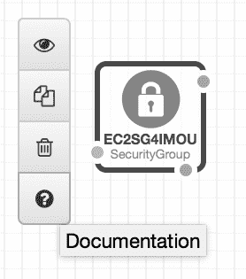
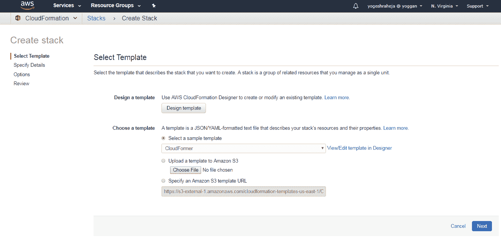

# 将基础设施视为代码

在上一章中，我们已经熟悉了 AWS。我们还创建了一个 EC2 实例并将 Hello World 网页应用部署到该实例上。然而，为了完成这些操作，我们必须经历一系列步骤来配置实例及其安全组。由于我们使用命令行界面以非常手动的方式完成这些操作，这些步骤将不可复用，也不可审计，正如你可能还记得在第一章实现 DevOps 最佳实践时提到的那样。你应该尽可能依赖的两个关键概念是源代码管理（版本控制）和自动化。在本章中，我们将探讨如何将这些原则应用于我们的基础设施。

在云环境中，几乎所有内容都被抽象化并通过虚拟资源中介提供，我们可以很容易地想象，代码可以描述网络拓扑和系统配置。要完成这一转变，我们将学习 DevOps 组织中两个关键的概念。第一个通常被称为**基础设施即代码**（**IAC**）。这是用代码的形式描述所有虚拟资源的过程。这些资源可能包括虚拟服务器、负载均衡器、存储、网络层等。第二个概念，虽然与 IAC 非常相近，但更专注于系统配置，被称为**配置管理**。通过配置管理系统，开发人员和系统管理员能够自动化操作系统配置、软件包安装，甚至应用程序部署。

进行这一转变是任何以 DevOps 为核心的组织的关键步骤。通过使用代码来描述不同的资源及其配置，我们将能够使用与开发应用程序时相同的工具和流程。我们将能够使用源代码管理，针对各个分支进行较小的更改，提交拉取请求，遵循标准的审核流程，并最终在将更改应用到生产环境之前进行测试。这将为我们提供更清晰的视角、更高的责任性以及更强的审计能力，以便管理基础设施的变化。正因如此，我们还能够管理更大规模的资源池，而不必增加更多的工程师，或者花费更多的时间来操作这些资源。这也为进一步的自动化打开了大门，正如我们在第五章中将看到的那样，*添加持续集成和持续部署*。在本章中，我们将覆盖以下主题：

+   使用 CloudFormation 管理基础设施

+   添加配置管理系统

# 技术要求

本章的技术要求如下：

+   AWS 控制台

+   AWS CloudFormation

+   AWS CloudFormation Designer

+   CloudFormer

+   Troposphere

+   Git

+   GitHub

+   Ansible

本章代码的 GitHub 链接如下：

+   [`raw.githubusercontent.com/yogeshraheja/Effective-DevOps-with-AWS/master/Chapter03/EffectiveDevOpsTemplates/helloworld-cf-template-part-1.py`](https://raw.githubusercontent.com/yogeshraheja/Effective-DevOps-with-AWS/master/Chapter03/EffectiveDevOpsTemplates/helloworld-cf-template-part-1.py)

+   [`raw.githubusercontent.com/yogeshraheja/Effective-DevOps-with-AWS/master/Chapter03/EffectiveDevOpsTemplates/helloworld-cf-template.py`](https://raw.githubusercontent.com/yogeshraheja/Effective-DevOps-with-AWS/master/Chapter03/EffectiveDevOpsTemplates/helloworld-cf-template.py)

+   [`github.com/yogeshraheja/Automation-with-Ansible-By-Yogesh-Raheja`](https://github.com/yogeshraheja/Automation-with-Ansible-By-Yogesh-Raheja)

+   [`github.com/yogeshraheja/Effective-DevOps-with-AWS/blob/master/Chapter03/ansible/roles/nodejs/tasks/main.yml`](https://github.com/yogeshraheja/Effective-DevOps-with-AWS/blob/master/Chapter03/ansible/roles/nodejs/tasks/main.yml)

+   [`github.com/yogeshraheja/Effective-DevOps-with-AWS/blob/master/Chapter03/ansible/roles/helloworld/tasks/main.yml`](https://github.com/yogeshraheja/Effective-DevOps-with-AWS/blob/master/Chapter03/ansible/roles/helloworld/tasks/main.yml)

+   [`github.com/yogeshraheja/Effective-DevOps-with-AWS/blob/master/Chapter03/ansible/roles/helloworld/meta/main.yml`](https://github.com/yogeshraheja/Effective-DevOps-with-AWS/blob/master/Chapter03/ansible/roles/helloworld/meta/main.yml)

+   [`github.com/yogeshraheja/Effective-DevOps-with-AWS/tree/master/Chapter03/ansible`](https://github.com/yogeshraheja/Effective-DevOps-with-AWS/tree/master/Chapter03/ansible)

+   [`github.com/yogeshraheja/EffectiveDevOpsTemplates/blob/master/ansiblebase-cf-template.py`](https://github.com/yogeshraheja/EffectiveDevOpsTemplates/blob/master/ansiblebase-cf-template.py)

# 使用 CloudFormation 管理基础设施

CloudFormation 引入了一种全新的方式来管理服务及其配置。通过创建 JSON 或 YAML 文件，CloudFormation 让你能够描述你希望构建的 AWS 架构。文件创建完成后，你只需将其上传到 CloudFormation，CloudFormation 将执行这些文件，自动创建或更新你的 AWS 资源。大多数 AWS 管理的工具和服务都支持这种方式。你可以在 [`amzn.to/1Odslix`](http://amzn.to/1Odslix) 查看到完整的支持列表。在本章中，我们将仅关注我们迄今为止所构建的基础设施，但在接下来的章节中我们会添加更多资源。在简要了解 CloudFormation 的结构之后，我们将创建一个最小化的堆栈，以重新创建来自第二章的 Hello World Web 应用程序，*部署你的第一个 Web 应用程序*。之后，我们将介绍另外两种创建 CloudFormation 模板的方式——设计器，它允许你在 Web GUI 中可视化编辑模板，以及 CloudFormer，这是一种可以从现有基础设施生成模板的工具。

# 开始使用 CloudFormation

正如你所期望的，你可以通过 AWS 控制台访问 CloudFormation，网址为 [`console.aws.amazon.com/cloudformation`](https://console.aws.amazon.com/cloudformation)，或者使用以下命令行：

```
$ aws cloudformation help # for the list of options 
```

该服务围绕堆栈的概念进行组织。每个堆栈通常描述一组 AWS 资源及其配置，以便启动应用程序。在使用 CloudFormation 时，你大部分时间都会花费在编辑这些模板上。开始编辑模板有不同的方法，其中一种最简单的方法是编辑现有的模板。AWS 提供了多个编写良好的示例，网址为 [`amzn.to/27cHmrb`](http://amzn.to/27cHmrb)。在最高层次上，模板的结构如下：

```
{ 
"AWSTemplateFormatVersion" : "version date", "Description" : "Description", "Resources" : { }, 
"Parameters" : { }, 
"Mappings" : { }, 
"Conditions" : { }, 
"Metadata" : { }, 
"Outputs" : { } 
} 
```

`AWSTemplateFormatVersion` 部分当前始终为 `2010-09-09`，表示使用的模板语言版本。这个版本目前是唯一有效的值。`Description` 部分用于总结模板的功能。`Resources` 部分描述了将实例化哪些 AWS 服务及其配置。当你启动模板时，你可以提供一些额外的信息给 CloudFormation，例如使用哪个 SSH 密钥对。例如，如果你想给 EC2 实例提供 SSH 访问权限，这类信息将放入 `Parameters` 部分。`Mappings` 部分在你尝试创建更通用的模板时非常有用。

例如，你可以定义在某个特定区域使用哪种 **Amazon Machine Image** (**AMI**)，以便在该 AWS 区域启动应用程序时使用相同的模板。`Conditions` 部分允许你为其他部分添加条件逻辑（如 if 语句、逻辑运算符等），而 `Metadata` 部分则允许你为资源添加更多任意信息。最后，`Outputs` 部分让你根据模板的执行结果提取并打印出有用信息，例如创建的 EC2 服务器的 IP 地址。除了这些示例，AWS 还提供了一些与 CloudFormation 模板创建相关的工具和服务。你可以用来创建模板的第一个工具叫做 CloudFormation Designer。

# AWS CloudFormation Designer

AWS CloudFormation Designer 是一个工具，允许你使用图形用户界面创建和编辑 CloudFormation 模板。Designer 隐藏了通过标准文本编辑器编辑 CloudFormation 模板时的大量复杂性。你可以直接访问 [`console.aws.amazon.com/cloudformation/designer`](https://console.aws.amazon.com/cloudformation/designer)，或者在点击创建堆栈按钮后通过 CloudFormation 仪表板访问，如下所示：

**

工作流程相当简单。你只需将资源从左侧菜单拖放到画布上。

一旦你的资源被添加，你就可以通过围绕每个资源图标的小圆点将它们连接到其他资源。在前面的示例中，我们将一个 EC2 实例连接到其安全组。有许多隐藏的宝藏可以帮助你在设计模板时。你可以右键点击资源，直接访问 CloudFormation 资源的文档，如下所示：



当拖动一个点来连接两个资源时，设计器将高亮显示与该连接兼容的资源。设计器底部的编辑器支持使用*Ctrl* + 空格键的自动补全功能：


一旦你的模板完成，你只需点击一个按钮，就可以从设计堆栈到启动堆栈。我们接下来要看的是名为**CloudFormer**的工具。

# CloudFormer

CloudFormer 是一个通过查看现有资源来创建 CloudFormation 模板的工具。如果你已经创建了一些临时的资源集，正如我们在本书中所做的那样，那么你可以使用 CloudFormer 将它们分组到一个新的 CloudFormation 模板下。之后，你可以使用文本编辑器甚至 CloudFormation 设计器自定义 CloudFormer 生成的模板，使其符合你的需求。与大多数 AWS 工具和服务不同，CloudFormer 并非完全由 AWS 管理；它是一个自托管的工具，你可以通过 CloudFormation 按需实例化。为此，请按照以下步骤操作：

1.  打开 [h](https://console.aws.amazon.com/cloudformation)[t](https://console.aws.amazon.com/cloudformation)[t](https://console.aws.amazon.com/cloudformation)[p](https://console.aws.amazon.com/cloudformation)[s](https://console.aws.amazon.com/cloudformation)[://c](https://console.aws.amazon.com/cloudformation)[o](https://console.aws.amazon.com/cloudformation)[n](https://console.aws.amazon.com/cloudformation)[s](https://console.aws.amazon.com/cloudformation)[o](https://console.aws.amazon.com/cloudformation)[l](https://console.aws.amazon.com/cloudformation)[e](https://console.aws.amazon.com/cloudformation)[.](https://console.aws.amazon.com/cloudformation)[a](https://console.aws.amazon.com/cloudformation)[w](https://console.aws.amazon.com/cloudformation)[s](https://console.aws.amazon.com/cloudformation)[.](https://console.aws.amazon.com/cloudformation)[a](https://console.aws.amazon.com/cloudformation)[m](https://console.aws.amazon.com/cloudformation)[a](https://console.aws.amazon.com/cloudformation)[z](https://console.aws.amazon.com/cloudformation)[o](https://console.aws.amazon.com/cloudformation)[n](https://console.aws.amazon.com/cloudformation)[.](https://console.aws.amazon.com/cloudformation)[c](https://console.aws.amazon.com/cloudformation)[o](https://console.aws.amazon.com/cloudformation)[m](https://console.aws.amazon.com/cloudformation)[/c](https://console.aws.amazon.com/cloudformation)[l](https://console.aws.amazon.com/cloudformation)[o](https://console.aws.amazon.com/cloudformation)[u](https://console.aws.amazon.com/cloudformation)[d](https://console.aws.amazon.com/cloudformation)[f](https://console.aws.amazon.com/cloudformation)[o](https://console.aws.amazon.com/cloudformation)[r](https://console.aws.amazon.com/cloudformation)[m](https://console.aws.amazon.com/cloudformation)[a](https://console.aws.amazon.com/cloudformation)[t](https://console.aws.amazon.com/cloudformation)[i](https://console.aws.amazon.com/cloudformation)[o](https://console.aws.amazon.com/cloudformation)[n](https://console.aws.amazon.com/cloudformation) 在你的浏览器中。

1.  现在，向下滚动 AWS 控制台屏幕，选择“从现有资源创建模板”选项，然后点击“启动 CloudFormer”按钮。

1.  在“选择一个样本模板”下拉菜单中，选择 CloudFormer 选项，然后点击“下一步”按钮，如下图所示：

****

1.  在该屏幕上，顶部你可以提供堆栈名称（可以保留默认名称`AWSCloudFormer`），在下方，你将被要求提供三个额外的参数：用户名、密码和 VPC 选择。此用户名和密码将用于稍后登录 CloudFormer。选择一个用户名和密码，选择默认的 VPC，然后点击“下一步”按钮。

1.  在下一屏幕上，你可以提供额外的标签和更高级的选项，但我们将继续点击“下一步”按钮。

1.  这将带我们进入审查页面，在这里我们将勾选复选框以确认这将导致 AWS CloudFormation 创建 IAM 资源。点击 **创建** 按钮。

1.  这将把我们带回 CloudFormation 控制台的主屏幕，在那里我们可以看到我们的 AWS CloudFormer 堆栈正在创建中。一旦状态列从 CREATE_IN_PROGRESS 变为 CREATE_COMPLETE，选择它并点击底部的 Outputs 标签。此时，你已经创建了使用 CloudFormer 所需的资源。为了使用它创建堆栈，请按照以下步骤操作：在 Outputs 标签（显示 CloudFormation 的 Outputs 部分）中，点击网站 URL 链接。这将打开 CloudFormer 工具。使用在前一组说明的第四步中提供的用户名和密码登录，你应该能看到类似以下内容：


1.  选择你想要创建模板的 AWS 区域，然后点击 **创建模板** 按钮。接下来会出现以下屏幕：


1.  按照工具所建议的工作流程选择你想要的不同资源，用于你的 CloudFormation 模板，直到最后一步。

1.  最后，你将能够下载生成的模板或直接将其保存到 S3。

CloudFormer 生成的 CloudFormation 模板通常需要稍作编辑，因为你通常会希望创建一个更灵活的堆栈，带有输入参数和 Outputs 部分。

# 使用 CloudFormation 重新创建我们的 Hello World 示例

Designer 和 CloudFormer 是在构建基础设施并尝试为设计添加源代码控制时非常有用的两个工具。也就是说，每当你戴上 DevOps 帽子时，情况就不同了。使用这些工具显著减少了 CloudFormation 通过使用 JSON 格式提供的附加价值。如果你有机会阅读一些现有的模板，或者尝试在现有的基础设施上使用 CloudFormer，你可能会注意到原始的 CloudFormation 模板通常相当长，并且不符合 **不要重复自己**（**DRY**）原则。

从 DevOps 的角度来看，CloudFormation 最强大的功能之一就是能够编写代码动态生成这些模板。为了说明这一点，我们将使用 Python 和一个名为 `troposphere` 的库来生成我们的 Hello World CloudFormation 模板。

还有一些更高级的工具可以帮助创建 CloudFormation 模板。如果你计划使用除 AWS 之外的其他第三方服务，可以看看 Hashicorp 提供的 Terraform（网址：[`www.terraform.io`](https://www.terraform.io)），它除了支持 CloudFormation 外，还处理其他多个云提供商和服务。

# 使用 Troposphere 创建我们模板的 Python 脚本

我们将首先安装`troposphere`库。同样，我们展示的是基于 CentOS 7.x 的 Linux 发行版的所有输出，但该过程同样适用于所有支持的平台。以下是安装`troposphere`库的命令：

```
$ pip install troposphere  
```

Troposphere 的一个已知问题是`setuptools`的升级版本。如果遇到以下问题，解决方案是使用`pip install -U setuptools`命令升级`setuptools`。

一旦运行了上述命令，您可能会遇到以下错误：

```
....
setuptools_scm.version.SetuptoolsOutdatedWarning: your setuptools is too old (<12)     
-----------------------------------
Command "python setup.py egg_info" failed with error code 1 in /tmp/pip-install-pW4aV4/cfn-flip/        
```

为了解决这个错误，您可以运行以下命令：

```
$ pip install -U setuptools 
Collecting setuptools
 Downloading https://files.pythonhosted.org/packages/ff/f4/385715ccc461885f3cedf57a41ae3c12b5fec3f35cce4c8706b1a112a133/setuptools-40.0.0-py2.py3-none-any.whl (567kB)
 100% |████████████████████████████████| 573kB 22.2MB/s
Installing collected packages: setuptools
 Found existing installation: setuptools 0.9.8
 Uninstalling setuptools-0.9.8:
 Successfully uninstalled setuptools-0.9.8
Successfully installed setuptools-40.0.0 
```

安装完成后，您可以创建一个名为`helloworld-cf-template.py`的新文件。

我们将通过从`troposphere`模块导入多个定义来开始我们的文件，如下所示：

```
"""Generating CloudFormation template."""

from troposphere import (
    Base64,
    ec2,
    GetAtt,
    Join,
    Output,
    Parameter,
    Ref,
    Template,
)  
```

我们还将定义第一个变量，这将使后续的代码编辑变得更加容易。因为我们将通过在这个初始模板的基础上构建新脚本：

```
ApplicationPort = "3000"  
```

从代码的角度来看，我们将做的第一件事是初始化一个`Template`变量。在脚本结束时，模板将包含我们基础设施的完整描述，我们将能够简单地打印其输出以获取我们的 CloudFormation 模板：

```
t = Template() 
```

在本书中，我们将并行创建并运行多个 CloudFormation 模板。为了帮助我们识别给定堆栈中的内容，我们可以提供一个描述。在模板创建后，按如下方式添加描述：

```
add_description("Effective DevOps in AWS: HelloWorld web application") 
```

当我们使用 Web 命令行界面启动 EC2 实例时，我们选择了用于 SSH 访问主机的密钥对。为了不失去这一功能，我们的模板首先会包含一个参数，允许 CloudFormation 用户在启动 EC2 实例时选择使用哪个密钥对。为此，我们将创建一个`Parameter`对象，并通过提供标识符、描述、参数类型、参数类型的描述以及帮助做出正确决策的约束描述来初始化它。为了使这个参数出现在我们的最终模板中，我们还将使用模板类中定义的`add_parameter()`函数：

```
t.add_parameter(Parameter(
    "KeyPair",
    Description="Name of an existing EC2 KeyPair to SSH",
    Type="AWS::EC2::KeyPair::KeyName",
    ConstraintDescription="must be the name of an existing EC2 KeyPair.",
))
```

接下来我们将关注的是安全组。我们将按照之前为`KeyPair`参数所做的方式进行操作。我们希望将`SSH/22`和`TCP/3000`开放给全球。端口`3000`之前在`ApplicationPort`变量中定义。此外，这次定义的信息不是像之前那样的参数，而是一个资源。因此，我们将使用`add_resource()`函数将该新资源添加如下：

```
t.add_resource(ec2.SecurityGroup(
    "SecurityGroup",
    GroupDescription="Allow SSH and TCP/{} access".format(ApplicationPort),
    SecurityGroupIngress=[
        ec2.SecurityGroupRule(
            IpProtocol="tcp",
            FromPort="22",
            ToPort="22",
            CidrIp="0.0.0.0/0",
        ),
        ec2.SecurityGroupRule(
            IpProtocol="tcp",
            FromPort=ApplicationPort,
            ToPort=ApplicationPort,
            CidrIp="0.0.0.0/0",
        ),
    ],
))
```

在下一部分中，我们将替换手动登录到我们的 EC2 实例并安装`helloworld.js`文件及其`init`脚本的需求。为此，我们将利用 EC2 提供的`UserData`功能。当您创建 EC2 实例时，`UserData`可选参数允许您提供一组命令，在虚拟机启动后执行（您可以在[`amzn.to/1VU5b3s`](http://amzn.to/1VU5b3s)上阅读更多有关此主题的内容）。`UserData`参数的一个限制是，脚本必须进行 base64 编码，才能添加到我们的 API 调用中。

我们将创建一个小脚本来重现我们在第二章中所做的步骤，*部署您的第一个 Web 应用程序*。在这里，我们将对我们的第一个 Web 应用程序的部署步骤进行 base-64 编码，并将其存储在一个名为`ud`的变量中。请注意，在`ec2-user`的`home`目录中安装应用程序并不非常整洁。现在，我们尽量保持与在第二章中所做的步骤一致，*部署您的第一个 Web 应用程序*。我们将在第五章，*添加持续集成和持续部署*中解决这个问题，并改进我们的部署系统。

```
ud = Base64(Join('\n', [
    "#!/bin/bash",
    "sudo yum install --enablerepo=epel -y nodejs",
    "wget http://bit.ly/2vESNuc -O /home/ec2-user/helloworld.js",
    "wget http://bit.ly/2vVvT18 -O /etc/init/helloworld.conf",
    "start helloworld"
]))
```

现在我们将关注我们模板的主要资源，即我们的 EC2 实例。创建该实例需要提供一个用于标识资源的名称、一个镜像 ID、一个实例类型、安全组、用于 SSH 访问的密钥对，以及用户数据。为了简化操作，我们将硬编码 AMI ID（`ami-cfe4b2b0`）和实例类型（`t2.micro`）。

创建 EC2 实例所需的其余信息是安全组信息和`KeyPair`名称，这些信息我们之前通过定义参数和资源收集过。在 CloudFormation 中，您可以通过使用`Ref`关键字引用模板中预先存在的子部分。在 Troposphere 中，这可以通过调用`Ref()`函数来完成。如前所述，我们将借助`add_resource`函数将生成的输出添加到我们的模板中。

```
...
t.add_resource(ec2.Instance(
    "instance",
    ImageId="ami-cfe4b2b0",
    InstanceType="t2.micro",
    SecurityGroups=[Ref("SecurityGroup")],
    KeyName=Ref("KeyPair"),
    UserData=ud,
)) 
...
```

在脚本的最后部分，我们将专注于生成模板的`Outputs`部分，该部分将在 CloudFormation 创建堆栈时填充。此选择允许您打印在堆栈启动过程中计算出的有用信息。在我们的例子中，有两条有用的信息——访问我们 Web 应用程序的 URL 和实例的公网 IP 地址，以便我们如果需要，可以通过 SSH 访问它。为了获取这些信息，CloudFormation 使用`Fn::GetAtt`函数。在 Troposphere 中，这被转换为`GetAtt()`函数。

```
...
t.add_output(Output(
    "InstancePublicIp",
    Description="Public IP of our instance.",
    Value=GetAtt("instance", "PublicIp"),
))

t.add_output(Output(
    "WebUrl",
    Description="Application endpoint",
    Value=Join("", [
        "http://", GetAtt("instance", "PublicDnsName"),
        ":", ApplicationPort
    ]),
)) 
...
```

到那时，我们可以让我们的脚本输出我们生成的模板的最终结果。

```
print t.to_json() 
```

脚本现在已经完成。我们可以保存并退出编辑器。创建的文件应该与以下链接中的文件类似：[`raw.githubusercontent.com/yogeshraheja/Effective-DevOps-with-AWS/master/Chapter03/EffectiveDevOpsTemplates/helloworld-cf-template-part-1.py`](https://raw.githubusercontent.com/yogeshraheja/Effective-DevOps-with-AWS/master/Chapter03/EffectiveDevOpsTemplates/helloworld-cf-template-part-1.py)。

现在我们可以运行脚本，给予适当的权限，并通过将脚本的输出保存到文件中来生成 CloudFormation 模板，如下所示：

```
$ python helloworld-cf-template.py > helloworld-cf.template 
```

`cloud-init` 是一组与大多数 Linux 发行版和云提供商兼容的 Python 脚本。它通过将大多数标准操作（如安装包、创建文件和运行命令）移动到模板的不同部分，来补充 `UserData` 字段。本书不涉及该工具，但如果你的 CloudFormation 模板严重依赖 `UserData` 字段，请查看它。你可以在[`bit.ly/1W6s96M`](http://bit.ly/1W6s96M)获取文档。

# 在 CloudFormation 控制台中创建堆栈

到此为止，我们可以按照以下步骤启动我们的模板：

1.  在浏览器中打开 CloudFormation 网络控制台，使用以下链接：[`console.aws.amazon.com/cloudformation`](https://console.aws.amazon.com/cloudformation)。点击“创建堆栈”按钮。

1.  在下一个页面中，我们将通过选择“上传模板到 Amazon S3”来上传我们新生成的模板`helloworld-cf.template`，然后浏览并选择我们的`helloworld-cf.template`文件。

1.  然后我们将选择一个堆栈名称，例如`HelloWorld`。

1.  在堆栈名称之后，我们可以看到模板的参数部分正在发挥作用。CloudFormation 允许我们选择使用哪个 SSH 密钥对。使用下拉菜单选择你的密钥对。

1.  在下一个页面中，我们可以为我们的资源添加可选标签；在“高级”部分，我们可以看到如何将 CloudFormation 与 SNS 集成，决定在发生故障或超时时采取什么行动，甚至添加堆栈策略来控制谁可以编辑堆栈。例如，暂时我们只需点击“下一步”按钮。

1.  这将带我们到审查页面，我们可以在其中验证所选的信息，甚至估算运行该堆栈的费用。点击“创建”按钮。

1.  这将带我们进入主要的 CloudFormation 控制台。在该页面上，我们可以在“事件”标签中查看资源的创建情况。

1.  当模板创建完成后，点击“输出”标签页，这将显示我们通过模板的输出部分生成的信息，如下所示：


1.  点击 WebUrl 键的值中的链接，将打开我们的 Hello World 页面。

# 将我们的模板添加到源控制系统中

既然我们已经测试了模板并确认它正常工作，我们将把它提交到我们的源代码管理系统。这将帮助我们跟踪更改，使我们能够像管理应用代码一样，管理基础设施代码（更多内容将在第五章 *添加持续集成与持续部署* 中讲解）。

为此，我们将依赖 Git。AWS 提供了一个名为 AWS CodeCommit 的服务（[`amzn.to/2tKUj0n`](http://amzn.to/2tKUj0n)），可以让你轻松管理 Git 仓库。然而，由于该服务的流行程度远低于 GitHub（[`github.com`](https://github.com/)），我们将使用后者。如果你还没有 GitHub 账号，先注册一个——完全免费。

登录 GitHub 后，为 CloudFormation 模板创建一个新的仓库：

1.  在浏览器中打开 [`github.com/new`](https://github.com/new)。

1.  将新的仓库命名为：`EffectiveDevOpsTemplates`。

1.  勾选“Initialize this repository with a README”选项框。

1.  最后，点击此处显示的“Create repository”按钮：


1.  创建仓库后，你需要将其克隆到你的电脑中。为此，你需要安装 Git（如果尚未安装，可以通过 Google 查找安装 Git 的操作系统相关教程）。对于 CentOS，只需运行 `yum -y install git`，因为 Git 包现在是 Linux 发行版的一部分：

```
$ git clone https://github.com/<your_github_username>/EffectiveDevOpsTemplates 
```

1.  既然仓库已经被克隆下来，我们将进入该仓库并将之前创建的模板复制到新的 GitHub 仓库中：

```
$ cd EffectiveDevOpsTemplates
$ cp <path_to_helloworld_template>/helloworld-cf-template.py .
```

1.  最后，我们将把新文件添加并提交到项目中，并将其推送到 GitHub，如下所示：

```
$ git add helloworld-cf-template.py
$ git commit -m "Adding helloworld Troposphere template"
$ git push  
```

**单一代码仓库与多仓库：**在管理代码时，有两种常见的方法来组织代码仓库。你可以为每个项目创建一个仓库，或者决定将整个组织的代码放在一个仓库中。我们将在本书中选择最简单的选项——每个项目一个仓库，但随着像谷歌的 Bazel、Facebook 的 Buck 或 Twitter 的 Pants 等多个开源项目的发布，使用单一仓库（monorepo）变得非常具有吸引力，因为它可以避免在对基础设施和服务进行大规模更改时，在多个仓库之间来回切换。

# 更新我们的 CloudFormation 堆栈

使用 CloudFormation 模板管理资源的最大优势之一是，CloudFormation 创建的资源与我们的堆栈紧密绑定。如果我们想对堆栈进行更改，可以更新模板，并将更改应用到现有的 CloudFormation 堆栈中。让我们来看看这个过程是如何工作的。

# 更新我们的 Python 脚本

我们的`helloworld-cf-template.py`脚本非常基础。目前，我们仅仅在使用 Python 的`troposphere`库来以比手动编写更愉快的方式生成 JSON 输出。当然，你可能已经意识到，我们仅仅触及了编写脚本来创建和管理基础设施所能做的事情的冰山一角。接下来的部分是一个简单的示例，将让我们编写几行 Python 代码，演示如何更新 CloudFormation 堆栈，并利用更多的服务和外部资源。

我们在前面的示例中创建的安全组向世界开放了两个端口：`22`（SSH）和`3000`（Web 应用端口）。我们可以通过只允许自己的 IP 使用 SSH 来加固安全性。这意味着需要在处理端口`22`流量的安全组中更改 Python 脚本中的**无类域间路由**（**CIDR**）IP 信息。网上有许多免费的服务可以帮助我们查看自己的公网 IP。我们将使用其中一个服务，地址为[`api.ipify.org`](https://api.ipify.org/)。我们可以通过一个简单的`curl`命令查看其效果：

```
$ curl https://api.ipify.org 54.164.95.231  
```

我们将在脚本中利用这个服务。使用这个特定服务的原因之一是它已经被打包成了一个 Python 库。你可以在[`github.com/rdegges/python-ipify`](https://github.com/rdegges/python-ipify)上了解更多内容。你可以首先按如下方式安装该库：

```
$ pip install ipify
```

如果遇到一些与`pip`相关的错误，如以下代码块所示，可以通过降级`pip`版本，安装`ipify`，然后再次将`pip`升级到最新版本来修复：

```
Cannot uninstall 'requests'. It is a distutils installed project and thus we cannot accurately determine which files belong to it which would lead to only a partial uninstall.    
```

前面的错误可以通过以下命令修复：

```
$ pip install --upgrade --force-reinstall pip==9.0.3
$ pip install ipify
$ pip install --upgrade pip  
```

我们的脚本需要一个 CIDR。为了将 IP 地址转换为 CIDR，我们还将安装另一个名为`ipaddress`的库。结合这些库的主要优势是，我们不必担心处理 IPv4 与 IPv6 的问题：

```
$ pip install ipaddress 
```

一旦这些库安装完成，重新打开`helloworld-cf-template.py`文件。在脚本的顶部，我们将导入这些库，然后，在`ApplicationPort`变量定义后，我们将定义一个名为`PublicCidrIp`的新变量，并结合前面提到的两个库，我们可以按如下方式提取 CIDR：

```
...
from ipaddress import ip_network
from ipify import get_ip
from troposphere import (
    Base64,
    ec2,
    GetAtt,
    Join,
    Output,
    Parameter,
    Ref,
    Template,
)

ApplicationPort = "3000"
PublicCidrIp = str(ip_network(get_ip()))
...
```

最后，我们可以按如下方式更改 SSH 组规则的`CidrIp`声明：

```
SecurityGroupIngress=[
        ec2.SecurityGroupRule(
            IpProtocol="tcp",
            FromPort="22",
            ToPort="22",
            CidrIp=PublicCidrIp,
        ),    
....
    ]
```

我们现在可以保存这些更改。创建的文件应该与[`github.com/yogeshraheja/Effective-DevOps-with-AWS/blob/master/Chapter03/EffectiveDevOpsTemplates/helloworld-cf-template.py`](https://github.com/yogeshraheja/Effective-DevOps-with-AWS/blob/master/Chapter03/EffectiveDevOpsTemplates/helloworld-cf-template.py)中的文件类似。

我们现在可以生成一个新的`diff`命令来直观地验证更改：

```
$ python helloworld-cf-template.py > helloworld-cf-v2.template
$ diff helloworld-cf-v2.template helloworld-cf.template 
46c46
<             "CidrIp": "54.164.95.231/32",
---
>             "CidrIp": "0.0.0.0/0",
 91a92
>
$
```

如我们所见，我们的 CIDR IP 现在已正确限制了对我们 IP 的连接。我们现在可以应用该更改。

# 更新我们的堆栈

生成新的 JSON CloudFormation 模板后，我们可以进入 CloudFormation 控制台并按照以下步骤更新堆栈：

1.  在浏览器中打开 CloudFormation Web 控制台，访问[`console.aws.amazon.com/cloudformation`](https://console.aws.amazon.com/cloudformation)。

1.  选择我们之前创建的 `HelloWorld` 堆栈。

1.  点击“操作”下拉菜单，然后选择“更新堆栈”选项。

1.  通过点击“浏览”按钮，选择 `helloworld-cf-v2.template` 文件，然后点击“下一步”按钮。

1.  这将带我们到下一个屏幕，让我们更新堆栈的详细信息。在我们的例子中，参数没有发生变化，因此我们可以继续点击“下一步”按钮。

1.  在下一个屏幕中，由于我们只希望看到 IP 更改的效果，我们可以点击“下一步”按钮：


1.  这将带我们到审核页面，在几秒钟后，我们可以看到 CloudFormation 给我们预览更改：


1.  如你所见，唯一的变化将是对安全组的更新。现在点击“更新”按钮。这将带我们回到 CloudFormation 模板，在那里我们将看到更改被应用。

1.  在这个特定的示例中，AWS 能够简单地更新安全组，以便考虑到我们的更改。我们可以通过提取物理 ID 来验证更改，无论是在审核页面，还是回到控制台中的“资源”标签页：

```
 $ aws ec2 describe-security-groups \
 --group-names HelloWorld-SecurityGroup-1XTG3J074MXX
```

# 更改集

我们的模板只包括一个 Web 服务器和一个安全组，这使得更新 CloudFormation 成为一个相对无害的操作。此外，我们的更改也相对简单，因为 AWS 只需更新现有的安全组，而无需替换它。正如你所想象的那样，随着架构变得越来越复杂，CloudFormation 模板也会变得更复杂。根据你想要执行的更新，你可能会在更新模板的最终步骤中审查更改集时遇到意想不到的变化。AWS 提供了一种替代且更安全的更新模板的方式；这个功能被称为**更改集**，可以通过 CloudFormation 控制台访问。请按照以下步骤使用更改集来审查更新，并执行操作：

1.  在浏览器中打开 CloudFormation Web 控制台，访问[`console.aws.amazon.com/cloudformation`](https://console.aws.amazon.com/cloudformation)

1.  选择我们之前创建的 `HelloWorld` 堆栈

1.  点击“操作”下拉菜单，然后点击“为当前堆栈创建更改集”选项

从这里，你可以按照 *更新我们的堆栈* 部分中进行简单更新时所采取的相同步骤操作。主要的区别出现在最后一个屏幕，如下所示：


与常规堆栈更新不同，变更集强调在应用变更之前让你有机会审核变更。如果你对显示的变更感到满意，你就可以执行更新。最后，在使用变更集更新堆栈时，你可以通过 CloudFormation 控制台中的“变更集”标签轻松审核最近的变更。最后，我们将使用以下命令将变更提交到 Troposphere 脚本：

```
$ git commit -am "Only allow ssh from our local IP"
$ git push 
```

# 删除我们的 CloudFormation 堆栈

在上一节中，我们看到 CloudFormation 如何在更新模板时更新资源。同样的操作适用于当你想要删除 CloudFormation 堆栈及其资源时。只需点击几下，你就可以删除模板以及启动时创建的各种资源。从最佳实践的角度来看，强烈建议始终使用 CloudFormation 来对以前通过 CloudFormation 初始化的资源进行更改，包括在你不再需要堆栈时。

删除堆栈非常简单，你应该按以下步骤进行：

1.  在浏览器中打开 CloudFormation Web 控制台：[`console.aws.amazon.com/cloudformation`](https://console.aws.amazon.com/cloudformation)

1.  选择我们之前创建的`HelloWorld`堆栈

1.  点击“操作”下拉菜单，然后点击“删除堆栈”选项

和往常一样，你可以在“事件”标签中跟踪完成情况：


CloudFormation 在 AWS 生态系统中占有独特地位。尽管架构复杂，绝大多数架构可以通过 CloudFormation 描述和管理，从而让你对 AWS 资源的创建保持严格控制。虽然 CloudFormation 在资源创建管理上做得非常好，但并不总是让事情变得简单。特别是当你想要在像 EC2 这样的服务上进行简单更改时，情况尤其如此。因为 CloudFormation 不会跟踪资源启动后的状态，所以更新 EC2 实例的唯一可靠方法是，例如，重新创建一个新的实例，并在其准备好后将其与现有实例进行交换。这种做法创造了某种不可变设计（假设在实例创建时没有运行任何额外的命令）。这可能是一个有吸引力的架构选择，并且在某些情况下，它可能会带你走得很远，但你也可能希望能够拥有长期运行的实例，这样你就可以像我们在 CloudFormation 中所做的那样，通过受控的管道快速而可靠地进行更改。这正是配置管理系统的强项。

# 添加一个配置管理系统

配置管理系统可能是经典 DevOps 驱动型组织中最为人熟知的组成部分。它们存在于大多数公司（包括企业市场中），并迅速替代了自制的 Shell、Python 和 Perl 脚本。有很多理由说明配置管理系统应该成为你环境的一部分。一个原因是，它们提供了领域特定语言，这提升了代码的可读性，而且它们是专门为组织在配置系统时出现的特定需求量身定制的。这也导致了很多有用的内置功能。此外，最常见的配置管理工具都有庞大且活跃的用户社区，这通常意味着你能找到已有的代码来自动化你正在使用的系统。

一些最流行的配置管理工具包括**Puppet**、**Chef**、**SaltStack**和**Ansible**。虽然这些选项都相当不错，本书将重点介绍 Ansible，它是四个工具中最易用的。Ansible 之所以成为一种非常流行且易于使用的解决方案，有几个关键特性。与其他配置管理系统不同，Ansible 被设计为无需服务器、守护进程或数据库即可运行。你可以将代码保存在版本控制中，并在需要时通过 SSH 使用推送机制将其下载到主机上。你编写的自动化代码是 YAML 静态文件，这使得学习曲线比使用 Ruby 或特定 DSL 的其他替代方案平缓得多。为了存储我们的配置文件，我们将依赖版本控制系统（在我们的案例中是 GitHub）。

**AWS OpsWorks 及其 Chef 集成**：虽然亚马逊并没有真正发布一个专门用于配置管理的服务，但它在 OpsWorks 服务中支持 Chef 和 Puppet。与我们在本书中探索的其他服务不同，OpsWorks 旨在成为一个*完整的应用程序生命周期管理，包括资源配置、配置管理*、*应用程序部署、软件更新、监控和访问控制**。*如果你愿意牺牲一些灵活性和控制，OpsWorks 可能能够满足你运行简单 Web 应用程序的需求。你可以在[`amzn.to/1O8dTsn`](http://amzn.to/1O8dTsn)了解更多信息。

# 开始使用 Ansible

首先在你的电脑上安装 Ansible。安装完成后，创建一个 EC2 实例，我们将通过它来演示 Ansible 的基本用法。接下来，我们将重新创建 Hello World Node.js 应用程序，通过创建和执行 Ansible 所称之为的 playbook。然后，我们将探讨 Ansible 如何在拉取模式下运行，这为部署更改提供了一种新的方法。最后，我们将研究如何将`UserData`块替换为 Ansible，以便结合 CloudFormation 和我们的配置管理系统的优势。

Ansible 非常易于使用，并且在网络上有丰富的文档资源。本书将涵盖足够的内容，帮助你入门并快速掌握简单的配置，例如我们示例中需要的配置。然而，你可能会有兴趣花更多时间学习 Ansible，以便能更高效地使用它。

# 在你的计算机上安装 Ansible

如前所述，Ansible 是一个非常简单的应用程序，依赖项非常少。你可以通过操作系统的包管理器或使用`pip`来安装 Ansible，因为 Ansible 是用 Python 编写的。我们将演示所有的输出来自基于 CentOS 7.x 的 Linux 发行版，但该过程同样适用于所有受支持的平台。（更多信息，请参阅以下链接，了解如何在操作系统上查找并安装 Ansible 二进制文件：[`docs.ansible.com/ansible/latest/installation_guide/intro_installation.html#installing-the-control-machine`](https://docs.ansible.com/ansible/latest/installation_guide/intro_installation.html#installing-the-control-machine)。）以下命令将安装一些二进制文件、库和 Ansible 模块：

```
$ yum install ansible 
```

请注意，在此时没有安装守护进程或数据库。这是因为默认情况下，Ansible 依赖于静态文件和 SSH 来运行。此时，我们已经准备好使用 Ansible 了：

```
$ ansible --version

ansible 2.6.2
  config file = /etc/ansible/ansible.cfg
  configured module search path = [u'/root/.ansible/plugins/modules',  
  u'/usr/share/ansible/plugins/modules']
  ansible python module location = /usr/lib/python2.7/site-
  packages/ansible
  executable location = /bin/ansible
  python version = 2.7.5 (default, Aug 4 2017, 00:39:18) [GCC 4.8.5 
  20150623 (Red Hat 4.8.5-16)] 
```

# 创建我们的 Ansible 沙箱环境

为了展示 Ansible 的基本功能，我们将从重新启动我们的 Hello World 应用程序开始。

在上一节中，我们展示了如何使用 Web 界面创建堆栈。正如你所期望的，也可以通过命令行界面启动堆栈。进入你之前生成`helloworld-cf-v2.template`文件的`EffectiveDevOpsTemplates`目录，并运行以下命令：

```
$ aws cloudformation create-stack \
 --capabilities CAPABILITY_IAM \
 --stack-name ansible \
 --template-body file://helloworld-cf-v2.template \
 --parameters ParameterKey=KeyPair,ParameterValue=EffectiveDevOpsAWS
{
 "StackId": "arn:aws:cloudformation:us-east-
     1:094507990803:stack/ansible/bb29cb10-9bbe-11e8-9ee4-500c20fefad2"
}  
```

我们的实例很快就会准备好。现在我们可以通过创建一个工作区来引导我们的环境。

# 创建我们的 Ansible 仓库

使用 Ansible，我们的第一个目标是能够在远程主机上运行命令。为了高效地完成这项任务，我们需要配置本地环境。因为我们不想重复进行这些步骤，并且最终我们希望将所有内容都进行版本控制，所以我们将创建一个新的 Git 仓库。为此，我们将重复之前在创建`EffectiveDevOpsTemplate`仓库时所使用的相同步骤。

登录到 GitHub 后，为 CloudFormation 模板创建一个新的仓库，如下所示：

1.  在浏览器中，打开这个链接：[`github.com/new`](https://github.com/new)。

1.  给新的仓库命名为`ansible`，如图所示：


1.  勾选“初始化该仓库并附加 README”复选框。

1.  最后，点击“创建仓库”按钮。

1.  一旦仓库创建完成，将其克隆到你的计算机上，如下所示：

```
$ git clone https://github.com/<your_github_username>/ansible
```

1.  现在仓库已被克隆，我们将进入该仓库并将之前在新的 GitHub 仓库中创建的模板复制进去：

```
$ cd ansible
```

从根本上讲，Ansible 是一个可以在你清单中的主机上远程执行命令的工具。清单可以通过手动创建一个`INI`文件来管理，文件中列出所有的主机和/或 IP 地址。如果能够查询 API，也可以动态管理清单。正如你可以想象的那样，Ansible 完全可以利用 AWS API 来获取我们的清单。为此，我们将从官方 Ansible Git 仓库下载一个 Python 脚本，并授予执行权限，命令如下：

```
**$ curl -Lo ec2.py** **http://bit.ly/2v4SwE5** **$ chmod +x ec2.py**  
```

在我们开始测试这个 Python 脚本之前，我们还需要为它提供一个配置文件。在相同目录下创建一个新文件，并命名为`ec2.ini`。在这个文件中，我们将放入以下配置：

```
[ec2] 
regions = all 
regions_exclude = us-gov-west-1,cn-north-1 destination_variable = public_dns_name vpc_destination_variable = ip_address route53 = False 
cache_path = ~/.ansible/tmp cache_max_age = 300 
rds = False 
```

完成这些步骤后，你可以通过执行如下命令验证清单是否正常工作：

```
$ ./ec2.py  
```

该命令应返回一个包含不同资源的大型嵌套 JSON，这些资源是你 AWS 账户中找到的。在这些资源中，有我们在上一节中创建的 EC2 实例的公共 IP 地址。我们引导过程的最后一步是配置 Ansible 本身，使其知道如何获取我们基础设施的清单；当它尝试通过 SSH 连接到我们的实例时，使用哪个用户；如何获取 root 权限；等等。我们将在相同位置创建一个新文件，并命名为`ansible.cfg`。其内容应如下所示：

```
[defaults] 
inventory      = ./ec2.py 
remote_user  = ec2-user 
become = True 
become_method  = sudo 
become_user    = root 
nocows     = 1 
```

到此为止，我们已经准备好开始运行 Ansible 命令。Ansible 有一些命令和简单的概念。我们将首先了解 `ansible` 命令和模块的概念。

# 执行模块

`ansible` 命令是驱动不同模块在远程主机上执行的主要命令。模块是可以直接在远程主机上执行的库。Ansible 附带了许多模块，模块列表可以在 [`bit.ly/24rU0yk`](http://bit.ly/24rU0yk) 中找到。除了标准模块外，你还可以使用 Python 创建自己的自定义模块。这些是最常见用例和技术的模块。我们将首先看到的模块是一个简单的模块，叫做 `ping`，它尝试连接到主机并返回 `pong`，如果主机可用的话。

模块文档也可以通过使用 `ansible-doc` 命令访问，命令如下：

`$ ansible-doc <Module-Name>`

`$ ansible-doc ping`

这里，`ping` 是 Ansible 模块之一的名称。

在创建 Ansible 游乐场部分时，我们使用 CloudFormation 创建了一个新的 EC2 实例。到目前为止，我们还没有查找该实例的 IP 地址。使用 Ansible 和 `ping` 模块，我们将发现该信息。如前所述，我们需要处于 `ansible` 目录下才能运行 `ansible` 命令。命令如下：

```
$ ansible --private-key ~/.ssh/EffectiveDevOpsAWS.pem ec2 -m ping 
18.206.223.199 | SUCCESS => {
    "changed": false,
    "ping": "pong"
} 
```

正如我们所见，Ansible 通过查询 AWS EC2 API 成功找到了我们的 EC2 实例。新创建的实例现在已经准备好可以使用了。

**配置 SSH**：由于 Ansible 强烈依赖 SSH，因此值得花点时间通过 `$HOME/.ssh/config` 文件配置 SSH。例如，你可以使用以下选项来避免在前面的示例中指定 `--private-key` 和 `-u`：

`IdentityFile ~/.ssh/EffectiveDevOpsAWS.pem`

`User ec2-user StrictHostKeyChecking no`

`PasswordAuthentication no`

`ForwardAgent yes`

配置完成后，你将不再需要为 Ansible 提供 `--private-key` 选项。

# 运行任意命令

`ansible` 命令也可以用于在远程服务器上运行任意命令。在以下示例中，我们将仅在匹配 `18.206.223.*` 公共 IP 地址的主机上运行 `df` 命令（你需要根据前面 `ping` 命令中返回的实例公共 IP 调整此命令）：

```
$ ansible --private-key ~/.ssh/EffectiveDevOpsAWS.pem '18.206.223.*' \
-a 'df -h'
18.206.223.199 | SUCCESS | rc=0 >>
Filesystem  Size  Used  Avail  Use%  Mounted on
devtmpfs    484M  56K   484M   1%    /dev
tmpfs       494M   0    494M   0%    /dev/shm
/dev/xvda1  7.8G   1.1G 6.6G   15%   /
```

现在我们对 Ansible 的工作原理有了基本的了解，我们可以开始结合调用不同的 Ansible 模块来实现自动化。这就叫做创建 **playbook**。

# Ansible playbooks

Playbooks 是包含 Ansible 配置、部署和编排语言的文件。通过创建这些文件，你可以按顺序定义系统的状态，从操作系统配置到应用程序部署和监控。Ansible 使用 YAML，易于阅读。因此，类似于我们在 CloudFormation 中所做的，开始使用 Ansible 的一个简单方法是查看官方 Ansible GitHub 仓库中的一些示例，网址是 [`github.com/ansible/ansible-examples`](https://github.com/ansible/ansible-examples)。或者，你甚至可以查看我的仓库，该仓库使理解 playbooks 变得相对简单，并且可以在 [`github.com/yogeshraheja/Automation-with-Ansible-By-Yogesh-Raheja`](https://github.com/yogeshraheja/Automation-with-Ansible-By-Yogesh-Raheja) 找到，这本书是 *Automation with Ansible*。

# 创建一个 playbook

Ansible 在其网站上提供了一些最佳实践，网址是 [`bit.ly/1ZqdcLH`](http://bit.ly/1ZqdcLH)。他们文档中的一个重点是使用角色。组织 playbook 内容的一个关键方法是 Ansible 的 *角色* 组织功能，这部分内容在主 playbooks 页面中有详细说明。创建角色是使 Ansible 代码可共享和模块化的关键，这样你就可以在不同的服务和 playbooks 中重复使用你的代码。为了演示正确的结构，我们将创建一个角色，然后在我们的 playbook 中调用它。

# 创建角色以部署和启动我们的 web 应用程序

我们将使用角色重新创建之前使用 CloudFormation 的 `UserData` 块创建的 Hello World 堆栈。如果你还记得，`UserData` 部分大致是这样的：

```
yum install --enablerepo=epel -y nodejs 
wget http://bit.ly/2vESNuc -O /home/ec2-user/helloworld.js 
wget http://bit.ly/2vVvT18 -O /etc/init/helloworld.conf start helloworld
```

你会注意到在前面的脚本中有三种不同类型的操作。首先，我们准备系统来运行我们的应用程序。为了做到这一点，在我们的示例中，我们只是安装了一个 Node.js 包。接下来，我们复制运行应用所需的不同资源。在我们的例子中，这些资源是 JavaScript 代码和启动配置。最后，我们启动服务。像编程中的其他任务一样，保持代码的 DRY（Don't Repeat Yourself）原则非常重要。如果部署和启动我们的应用程序非常独特于 Hello World 项目，安装 Node.js 可能不是。为了使 Node.js 的安装成为可重用的代码，我们将创建两个角色——一个用于安装 Node.js，另一个用于部署和启动 Hello World 应用程序。

默认情况下，Ansible 期望在 Ansible 仓库的根目录下看到一个 `roles` 目录。因此，首先我们需要进入在 *创建我们的 Ansible 仓库* 部分下创建的 `ansible` 目录。在其中创建 `roles` 目录，并通过以下命令进入它：

```
$ mkdir roles
$ cd roles  
```

现在我们可以创建我们的角色了。Ansible 提供了一个 `ansible-galaxy` 命令，可以用来初始化角色的创建。我们将首先查看安装 Node.js 的角色：

```
$ ansible-galaxy init nodejs
- nodejs was created successfully  
```

如前所述，Ansible 和大多数其他配置管理系统一样，拥有一个强大的支持社区，社区成员通过 [h](https://galaxy.ansible.com/)[t](https://galaxy.ansible.com/)[t](https://galaxy.ansible.com/)[p](https://galaxy.ansible.com/)[s](https://galaxy.ansible.com/)[://g](https://galaxy.ansible.com/)[a](https://galaxy.ansible.com/)[l](https://galaxy.ansible.com/)[a](https://galaxy.ansible.com/)[x](https://galaxy.ansible.com/)[y](https://galaxy.ansible.com/)[.](https://galaxy.ansible.com/)[a](https://galaxy.ansible.com/)[n](https://galaxy.ansible.com/)[s](https://galaxy.ansible.com/)[i](https://galaxy.ansible.com/)[b](https://galaxy.ansible.com/)[l](https://galaxy.ansible.com/)[e](https://galaxy.ansible.com/)[.](https://galaxy.ansible.com/)[c](https://galaxy.ansible.com/)[o](https://galaxy.ansible.com/)[m](https://galaxy.ansible.com/)[/](https://galaxy.ansible.com/) 分享角色。在使用 `ansible-galaxy` 命令创建新角色的骨架时，你还可以使用 `ansible-galaxy` 导入和安装社区支持的角色。

这会创建一个 `nodejs` 目录，并生成若干子目录，帮助我们结构化角色的不同部分。我们可以使用以下命令进入该目录：

```
$ cd nodejs  
```

`nodejs` 目录中最重要的目录是名为 `tasks` 的目录。当 Ansible 执行一个 playbook 时，它会运行 `tasks/main.yml` 文件中的代码。用你喜欢的文本编辑器打开这个文件。

当你第一次打开 `tasks/main.yml` 文件时，你将看到以下内容：

```
--- # tasks file for nodejs  
```

`nodejs` 角色的目标是安装 Node.js 和 `npm`。为此，我们将以类似于我们在 `UserData` 脚本中所做的方式进行操作，使用 `yum` 命令来执行这些任务。

在 Ansible 中编写任务时，你会按顺序调用多个 Ansible 模块。我们首先要查看的模块是 `yum` 命令的包装器。有关它的文档可以在 [`bit.ly/28joDLe`](http://bit.ly/28joDLe) 上找到。它将允许我们安装我们的包。我们还将引入循环的概念。由于我们有两个包需要安装，我们将希望调用 `yum` 模块两次。我们将使用操作符的 `with_items`**。** 所有的 Ansible 代码都是用 YAML 编写的，这非常容易入门并使用。在初始的三个破折号和注释之后（这表示 YAML 文件的开始），我们将调用 `yum` 模块来安装我们的包：

```
--- 
# tasks file for nodejs 

name: Installing node and npm yum: 
name: "{{ item }}" enablerepo: epel state: installed 
with_items: 
nodejs 
npm 
```

每当 Ansible 运行该剧本时，它将检查系统上已安装的包。如果没有找到 `nodejs` 或 `npm` 包，它将会安装它们。

你的文件应该看起来像在 [`github.com/yogeshraheja/Effective-DevOps-with-AWS/blob/master/Chapter03/ansible/roles/nodejs/tasks/main.yml`](https://github.com/yogeshraheja/Effective-DevOps-with-AWS/blob/master/Chapter03/ansible/roles/nodejs/tasks/main.yml) 中提供的示例一样。第一个角色完成了。为了本书的目的，我们保持这个角色非常简单，但你可以想象，在更具生产性质的环境中，你可能会有一个角色来安装特定版本的 Node.js 和 `npm`，直接从 [`nodejs.org/en/`](https://nodejs.org/en/) 获取二进制文件，甚至可能安装特定的依赖项。我们的下一个角色将专注于部署并启动我们之前构建的 Hello World 应用程序。我们将返回到 `roles` 目录，向上移动一层，并再次调用 `ansible-galaxy`：

```
$ cd ..
$ ansible-galaxy init helloworld
- helloworld was created successfully  
```

如同之前一样，我们现在将进入新创建的 `helloworld` 目录，方法如下：

```
$ cd helloworld  
```

这一次，我们将探索一些其他的目录。我们在运行 `ansible-galaxy` 命令时创建的子目录之一就是名为 `files` 的目录。将文件添加到该目录可以让我们在远程主机上复制文件。为了实现这一点，我们将首先按照以下步骤下载这两个文件：

```
$ wget http://bit.ly/2vESNuc -O files/helloworld.js
$ wget http://bit.ly/2vVvT18 -O files/helloworld.conf  
```

我们现在可以使用任务文件在远程系统上执行复制操作。打开 `tasks/main.yml` 文件，在最初的三个破折号和注释之后，添加以下内容：

```
--- 
# tasks file for helloworld 
- name: Copying the application file copy: 
src: helloworld.js dest: /home/ec2-user/ owner: ec2-user group: ec2-user 
mode: 0644 
notify: restart helloworld 
```

我们正在利用文档中提到的 `copy` 模块，参考链接为 [h](http://bit.ly/1WBv08E)[t](http://bit.ly/1WBv08E)[t](http://bit.ly/1WBv08E)[p](http://bit.ly/1WBv08E)[://b](http://bit.ly/1WBv08E)[i](http://bit.ly/1WBv08E)[t](http://bit.ly/1WBv08E)[.](http://bit.ly/1WBv08E)[l](http://bit.ly/1WBv08E)[y](http://bit.ly/1WBv08E)[/1W](http://bit.ly/1WBv08E)[B](http://bit.ly/1WBv08E)[v](http://bit.ly/1WBv08E)[08E](http://bit.ly/1WBv08E)，将我们的应用程序文件复制到 `ec2-user` 的主目录。在该调用的最后一行，我们在末尾添加了一个 `notify` 选项（注意 `notify` 语句如何与 `copy` 模块的调用对齐）。通知动作是可以添加到每个任务块末尾的触发器。在这个例子中，我们告诉 Ansible，当文件 `helloworld.js` 发生变化时调用重启 `helloworld` 指令，而如果代码没有发生变化，则不执行重启操作（稍后我们会在另一个文件中定义如何重启 `helloworld` 应用程序）。

CloudFormation 和 Ansible 之间的一个主要区别是，Ansible 预计将在系统生命周期内多次运行。Ansible 内置的许多功能都是针对长时间运行的实例进行了优化。因此，`notify` 选项使得在系统状态发生变化时触发事件变得非常容易。类似地，当遇到错误时，Ansible 会自动停止执行，以尽量避免出现故障。

现在我们已经复制了应用程序文件，可以添加我们的第二个文件——`upstart` 脚本。在前一个 `helloword.js` 文件的复制调用之后，我们将添加以下调用：

```
- name: Copying the upstart file copy: 
src: helloworld.conf 
dest: /etc/init/helloworld.conf owner: root 
group: root mode: 0644 
```

我们需要执行的最后一个任务是启动我们的服务。我们将使用 `service` 模块来实现。模块文档可以在 [`bit.ly/22I7QNH`](http://bit.ly/22I7QNH) 找到：

```
- name: Starting the HelloWorld node service service: 
name: helloworld state: started 
```

我们的任务文件现在已经完成。你最终应该得到类似于 [`github.com/yogeshraheja/Effective-DevOps-with-AWS/blob/master/Chapter03/ansible/roles/helloworld/tasks/main.yml`](https://github.com/yogeshraheja/Effective-DevOps-with-AWS/blob/master/Chapter03/ansible/roles/helloworld/tasks/main.yml) 的文件。

完成任务文件后，我们将继续处理下一个文件，该文件将让 Ansible 知道何时以及如何重启 `helloworld`，正如我们在任务的 `notify` 参数中所指定的那样。这些类型的交互在角色的 `handler` 部分定义。我们将编辑 `handlers/main.yml` 文件。在这里，我们也将使用 `service` 模块。以下是一个注释：

```
---
# handlers file for helloworld
```

将以下内容添加到 `main.yml` 文件：

```
- name: restart helloworld service: 
name: helloworld state: restarted 
```

这里没有什么意外；我们使用的是之前用于管理服务的相同模块。我们在角色中需要一个额外的步骤。为了使 `helloworld` 角色正常工作，系统需要安装 Node.js。Ansible 支持角色依赖的概念。我们可以明确告知我们的 `helloworld` 角色依赖于我们之前创建的 `nodejs` 角色，因此，如果执行 `helloworld` 角色，它将首先调用 `nodejs` 角色并安装运行应用所需的依赖。

打开 `meta/main.yml` 文件。该文件分为两个部分。第一部分在 `galaxy_info` 下，允许您填写您正在构建的角色信息。如果您愿意，最终可以将您的角色发布到 GitHub 并将其链接回 `ansible-galaxy`，与 Ansible 社区共享您的创作。文件底部的第二部分称为 `dependencies`，这是我们想要编辑的部分，确保在启动应用之前系统上存在 `nodejs`。去掉方括号（[]），并添加以下条目来调用 `nodejs`：

```
dependencies: 
- nodejs 
```

您的文件应与 [`github.com/yogeshraheja/Effective-DevOps-with-AWS/blob/master/Chapter03/ansible/roles/helloworld/meta/main.yml`](https://github.com/yogeshraheja/Effective-DevOps-with-AWS/blob/master/Chapter03/ansible/roles/helloworld/meta/main.yml) 中的示例类似。这标志着角色代码的创建完成。从文档编写的角度来看，良好的做法是编辑 `README.md`。完成后，我们可以继续创建一个将引用我们新创建角色的 playbook 文件。

# 创建 playbook 文件

在我们 Ansible 仓库的顶层（位于 `helloworld` 角色的上两层目录），我们将创建一个名为 `helloworld.yml` 的新文件。在此文件中，我们将添加以下内容：

```
--- 
- hosts: "{{ target | default('localhost') }}" become: yes 
roles: 
- helloworld 
```

这基本上告诉 Ansible 将 `helloworld` 角色应用到 `target` 变量中列出的主机上，或者如果未定义目标，则应用于 `localhost`。`become` 选项将告诉 Ansible 以提升的权限执行该角色（在我们的例子中是 `sudo`）。此时，您的 Ansible 仓库应与 [`github.com/yogeshraheja/Effective-DevOps-with-AWS/tree/master/Chapter03/ansible`](https://github.com/yogeshraheja/Effective-DevOps-with-AWS/tree/master/Chapter03/ansible) 中的示例类似。我们现在准备好测试我们的 playbook 了。

请注意，在实际操作中，规模更大的角色部分可能不止一个角色。如果您向目标部署多个应用或服务，您经常会看到像这样的 playbook。在后续章节中，我们将看到更多的示例：

```
--- 
hosts: webservers roles: 
foo 
bar 
baz 
```

# 执行 playbook

执行 playbooks 使用专门的 `ansible-playbook` 命令。此命令依赖于我们之前使用的相同的 Ansible 配置文件，因此，我们希望从 Ansible 仓库的根目录运行此命令。命令的语法如下：

```
ansible-playbook <playbook.yml> [options] 
```

我们将首先运行以下命令（调整`private-key`选项的值）：

```
$ ansible-playbook helloworld.yml \
    --private-key ~/.ssh/EffectiveDevOpsAWS.pem \
    -e target=ec2 \
    --list-hosts
```

`-e`（或`--extra-vars`）选项允许我们传递额外的执行选项。在我们的案例中，我们将`target`变量（在剧本的`hosts`部分声明）定义为`ec2`。这个第一个`ansible-playbook`命令将告诉 Ansible 以 EC2 实例为目标。`--list-hosts`选项会让 Ansible 返回一个符合主机标准的主机列表，但不会实际对这些主机执行任何操作。命令的输出结果类似于以下内容：

```
playbook: helloworld.yml 
  play #1 (ec2): ec2 TAGS:[] 
    pattern: [u'ec2'] 
    hosts (1): 
      18.206.223.199 
```

`list-hosts`选项是验证清单的好方法，对于更复杂的剧本，尤其是有更具体主机值的情况，它能够帮助验证哪些主机会运行实际的剧本，从而确保它们指向你期望的主机。

我们现在知道，如果我们使用这个值作为目标，将会影响哪些主机。接下来我们要检查的是，如果我们运行我们的剧本，会发生什么。`ansible-playbook`命令有一个`-C`（或`--check`）选项，它会尝试预测给定剧本将会进行的更改；有时这也被称为 Ansible 中的**干运行**模式：

```
$ ansible-playbook helloworld.yml \
 --private-key ~/.ssh/EffectiveDevOpsAWS.pem \
 -e target=18.206.223.199 \
 --check

PLAY [18.206.223.199] **************************************************************************************************************************************************

TASK [Gathering Facts] *************************************************************************************************************************************************
ok: [18.206.223.199]

TASK [nodejs : Installing node and npm] ********************************************************************************************************************************
changed: [18.206.223.199] => (item=[u'nodejs', u'npm'])

TASK [helloworld : Copying the application file] ***********************************************************************************************************************
changed: [18.206.223.199]

TASK [helloworld : Copying the upstart file] ***************************************************************************************************************************
changed: [18.206.223.199]

TASK [helloworld : Starting the HelloWorld node service] ***************************************************************************************************************
changed: [18.206.223.199]

RUNNING HANDLER [helloworld : restart helloworld] **********************************************************************************************************************
changed: [18.206.223.199]

PLAY RECAP *************************************************************************************************************************************************************
18.206.223.199 : ok=6 changed=5 unreachable=0 failed=0
```

运行该命令会在干运行模式下执行我们的剧本。通过这种模式，我们可以确保正确的任务会被执行。由于我们处于干运行模式，一些模块可能无法找到它们需要的一切资源来模拟它们的执行方式。这就是为什么我们有时会看到服务启动错误出现在服务模块末尾。如果你看到这种情况，不用担心，等到在实时模式中安装软件包时，任务会正确执行。经过验证主机和代码后，我们最终可以运行`ansible-playbook`并在实时模式下执行我们的更改，如下所示：

```
$ ansible-playbook helloworld.yml \
    --private-key ~/.ssh/EffectiveDevOpsAWS.pem \
    -e target=18.206.223.199 
```

输出结果与`--check`命令非常相似，唯一不同的是这次执行是在实时模式下进行的。我们的应用程序现在已经安装并配置完毕，接下来我们可以通过以下方式验证其是否正常运行：

```
$ curl 18.206.223.199:3000
Hello World  
```

我们成功地使用 Ansible 重现了之前使用 CloudFormation 所做的操作。现在我们已经测试了第一个剧本，我们可以提交我们的更改。我们将分两次提交，以便拆分仓库的初始化和角色的创建。在你的 Ansible 仓库的根目录下，运行以下命令：

```
$ git add ansible.cfg ec2.ini ec2.py
$ git commit -m "Configuring ansible to work with EC2"
$ git add roles helloworld.yml
$ git commit -m "Adding role for nodejs and helloworld"
$ git push  
```

# 金丝雀测试变更

使用 Ansible 管理服务的一个巨大好处是，你可以轻松地对代码进行更改并快速推送该更改。在一些情况下，如果你有一大批由 Ansible 管理的服务，你可能希望仅将更改推送到单个主机，以确保一切如你所预期的那样运行。这通常被称为**金丝雀测试**。使用 Ansible，执行这一操作非常简单。为了说明这一点，我们将打开`roles/helloworld/files/helloworld.js`文件，然后简单地将第 11 行的响应从`Hello World`更改为`Hello World, Welcome again`：

```
// Send the response body as "Hello World" 
response.end('Hello World, Welcome again\n'); 
}).listen(3000); 
```

保存文件，然后再次运行`ansible-playbook`。首先使用`--check`选项执行：

```
$ ansible-playbook helloworld.yml \
    --private-key ~/.ssh/EffectiveDevOpsAWS.pem \
    -e target=18.206.223.199 \
    --check
```

这次，Ansible 只检测到两个更改。第一个覆盖了应用程序文件，第二个执行了`notify`语句，这意味着重新启动应用程序。看到这正是我们预期的，我们可以在没有`--check`选项的情况下运行我们的 playbook：

```
$ ansible-playbook helloworld.yml \
    --private-key ~/.ssh/EffectiveDevOpsAWS.pem \
    -e target=18.206.223.199  
```

这产生的输出与我们之前的命令相同，但这次更改已经生效：

```
$ curl 18.206.223.199:3000
Hello World, Welcome again  
```

我们的更改非常简单，但如果我们通过更新 CloudFormation 模板来完成，CloudFormation 就需要创建一个新的 EC2 实例来实现这一点。在这里，我们只是更新了应用程序的代码，并通过 Ansible 将其推送到目标主机。现在，我们将在 Git 中本地撤销这一更改，操作如下：

```
$ git checkout roles/helloworld/files/helloworld.js  
```

我们将通过移除 EC2 实例上的更改来演示这一点，同时说明一个新的概念。在下一节中，我们将以异步方式在反向模式下（在这种情况下为拉模式）运行 Ansible。

**越早越好：**能够在几秒钟内推送更改而不是几分钟，可能看起来是一个小的胜利，但其实不是。速度很重要，它是区分成功的初创公司和技术的关键因素。能够在几分钟内而不是几天内部署新服务器是云计算采纳的一个重要因素。同样，容器的近期成功，正如我们在本书后面看到的，可能也是因为运行一个新容器只需要几秒钟，而启动一个虚拟服务器仍然需要几分钟。

# 以拉模式运行 Ansible

能够像刚才那样即时进行更改是一个非常有价值的功能。我们可以轻松并同步地推送新的代码，并验证 Ansible 执行是否成功。在更大规模上，虽然能够在一批服务器上做任何更改仍然像我们的示例一样有价值，但有时也会更加复杂。以这种方式进行更改的风险是，你必须非常有纪律地避免只将更改推送到一部分主机，而忽略其他也在共享刚刚更新角色的主机。否则，随着 Ansible 配置库和运行中的服务器之间的更改越来越多，运行 Ansible 就会变得更加危险。对于这些情况，通常最好使用一种拉取机制，它会自动拉取更改。当然，你不必选择其中一个——很容易配置推送和拉取机制来部署更改。Ansible 提供了一条名为`ansible-pull`的命令，顾名思义，它使得在拉模式下运行 Ansible 变得更加容易。`ansible-pull`命令的工作方式与`ansible-playbook`非常相似，不同之处在于它是通过从 GitHub 仓库中拉取代码开始的。

# 在我们的 EC2 实例上安装 Git 和 Ansible

由于我们需要能够远程运行 Ansible 和 Git，因此我们首先需要在 EC2 实例上安装这些软件包。现在，我们将通过手动安装这两个软件包来完成这项工作。稍后在本章中，我们会实现一个可重用的解决方案。由于 Ansible 是一个非常适合执行远程命令的工具，并且它有一个模块可以管理大多数常见需求，如安装软件包，因此，我们将不通过 `ssh` 登录到主机并运行一些命令，而是使用 Ansible 来推送这些更改。我们将从 EPEL `yum` 仓库安装 Git 和 Ansible。这将需要以 **root** 身份运行命令，你可以借助 `become` 选项来实现。调整 EC2 实例的 IP 地址后，运行以下命令：

```
$ ansible '18.206.223.199' \
    --private-key ~/.ssh/EffectiveDevOpsAWS.pem \
    --become \
    -m yum -a 'name=git enablerepo=epel state=installed' 
$ ansible '18.206.223.199' \
    --private-key ~/.ssh/EffectiveDevOpsAWS.pem \
    --become \
    -m yum -a 'name=ansible enablerepo=epel state=installed'
```

使用 `ansible-pull`，我们的目标是让 Ansible 在本地应用更改。我们可以对 Ansible 仓库进行修改，以优化这一操作。

# 配置 Ansible 在 localhost 上运行

由于`ansible-pull`依赖于 Git 来本地克隆仓库并执行操作，我们不需要通过 SSH 来进行执行。请进入你的 Ansible 仓库的`root`目录，创建一个新文件。文件名应为`localhost`，并且文件内容应包含以下内容：

```
[localhost] 
localhost ansible_connection=local 
```

本质上，我们所做的就是创建一个静态清单，并要求 `ansible` 在目标主机为 `localhost` 时以本地模式（而不是使用 SSH）运行命令。我们可以保存更改并将新文件提交到 GitHub，如下所示：

```
$ git add localhost
$ git commit -m "Adding localhost inventory"
$ git push 
```

# 向我们的 EC2 实例添加一个 cron 作业

现在我们将创建一个 cron 表条目，以定期调用 `ansible-pull`。在这里，我们同样依赖于 Ansible 来远程创建我们的 cron 作业。运行以下命令时，请根据需要调整 IP 地址：

```
$ ansible '18.206.223.199' \
--private-key ~/.ssh/EffectiveDevOpsAWS.pem \
-m cron -a 'name=ansible-pull minute="*/10" job="/usr/bin/ansible-pull -U https://github.com/<your_username>/ansible helloworld.yml -i localhost --sleep 60"'  
```

在前面的命令中，我们告诉 Ansible 使用 `cron` 模块，目标是我们的 `ec2` 实例。在这里，我们提供了一个名称，Ansible 将用它来跟踪 cron 作业，告诉 `cron` 每 `10` 分钟运行一次该作业，接着是要执行的命令及其参数。我们给 `ansible-pull` 的参数包括我们分支的 GitHub URL，我们刚刚添加到仓库中的清单文件，以及一个 `sleep` 参数，这将使命令在启动后的 `1` 到 `60` 秒之间某个时刻启动。这有助于分散网络负载，防止如果我们有多个服务器时，所有节点服务同时重启。等待片刻后，我们可以通过以下命令验证更改是否生效：

```
$ curl 54.175.86.38:3000
Hello World  
```

在通过 CloudFormation 手动将 Ansible 集成到我们创建的 EC2 实例后，现在可以正式化该过程。

# 将 Ansible 与 CloudFormation 集成

尽管有不同的策略可以将 Ansible 集成到 CloudFormation 中，但在我们的情况下，显然有一条明确的路径可以选择。我们将利用 `UserData` 字段，并通过 `ansible-pull` 命令初始化 Ansible。

现在我们将启动本章之前创建的 Troposphere 脚本。我们将复制它，并将新脚本命名如下：

```
ansiblebase-cf-template.py. 
```

转到你的模板仓库，并按如下方式复制先前的模板：

```
$ cd EffectiveDevOpsTemplates 
$ cp helloworld-cf-template.py ansiblebase-cf-template.py 
```

接下来，使用你的编辑器打开`ansiblebase-cf-template.py`脚本。为了保持脚本的可读性，我们将首先定义几个变量。在应用端口声明之前，我们将定义一个应用名称：

```
ApplicationName = "helloworld" 
ApplicationPort = "3000" 
```

我们还将设置一些关于 GitHub 信息的常量。将`GithubAccount`的值替换为你的 GitHub 用户名或 GitHub 组织名称，如下所示：

```
ApplicationPort = "3000" 

GithubAccount = "EffectiveDevOpsWithAWS" 
GithubAnsibleURL = "https://github.com/{}/ansible".format(GithubAccount) 
```

在定义了`GithubAnsibleURL`之后，我们将创建一个新变量，该变量包含我们希望执行的命令行，用于通过 Ansible 配置主机。我们将调用`ansible-pull`并使用我们刚刚定义的`GithubAnsibleURL`和`ApplicationName`变量。它看起来像这样：

```
AnsiblePullCmd = \ 
"/usr/bin/ansible-pull -U {} {}.yml -i localhost".format( GithubAnsibleURL, 
ApplicationName 
) 
```

现在我们将更新`UserData`块。我们将不再安装 Node.js、下载应用文件并启动服务，而是将这个块更改为安装`git`和`ansible`，执行`AnsiblePullCmd`变量中包含的命令，最后创建一个 cron 任务，每`10`分钟重新执行该命令。删除之前的`ud`变量定义，并用以下内容替换：

```
ud = Base64(Join('\n', [ "#!/bin/bash", 
"yum install --enablerepo=epel -y git", "pip install ansible", 
AnsiblePullCmd, 
"echo '*/10 * * * * {}' > /etc/cron.d/ansible- pull".format(AnsiblePullCmd) 
])) 
```

现在我们可以保存文件，使用它来创建我们的 JSON 模板，并进行测试。你新的脚本应该像这个示例一样：[`github.com/yogeshraheja/EffectiveDevOpsTemplates/blob/master/ansiblebase-cf-template.py`](https://github.com/yogeshraheja/EffectiveDevOpsTemplates/blob/master/ansiblebase-cf-template.py):

```
$ python ansiblebase-cf-template.py > ansiblebase.template
$ aws cloudformation update-stack \
 --stack-name ansible \
 --template-body file://ansiblebase.template \
 --parameters ParameterKey=KeyPair,ParameterValue=EffectiveDevOpsAWS
{
"StackId": "arn:aws:cloudformation:us-
east-1:511912822958:stack/HelloWorld/ef2c3250-6428-11e7-a67b-50d501eed2b3"
}
```

你甚至可以自己创建一个新的堆栈。例如，假设是`helloworld`，而不是更改现有的`ansible`堆栈。在这种情况下，你需要运行以下命令来创建堆栈：

```
$ aws cloudformation create-stack \
 --stack-name helloworld \
 --template-body file://ansiblebase.template \
 --parameters ParameterKey=KeyPair,ParameterValue=EffectiveDevOpsAWS
{
 "StackId": "arn:aws:cloudformation:us-east-
     1:094507990803:stack/helloworld/5959e7c0-9c6e-11e8-b47f-
     50d5cd26c2d2"
} 
```

现在我们可以等待执行完成：

```
$ aws cloudformation wait stack-update-complete \
        --stack-name ansible
```

现在堆栈创建完成，我们可以查询 CloudFormation 获取堆栈的输出，特别是它的公共 IP 地址：

```
$ aws cloudformation describe-stacks \
    --stack-name ansible \
    --query 'Stacks[0].Outputs[0]'
  {
     "Description": "Public IP of our instance.",
     "OutputKey": "InstancePublicIp",
     "OutputValue": "35.174.138.51"
  }  
```

最后，我们可以验证服务器是否已启动并正常运行，如下所示：

```
$ curl 35.174.138.51:3000
Hello World  
```

现在我们可以将新创建的`troposphere`脚本提交到我们的 GitHub 仓库，如下所示：

```
EffectiveDevOpsTemplates repository:
$ git add ansiblebase-cf-template.py
$ git commit -m "Adding a Troposphere script to create a stack that relies on Ansible to manage our application"
$ git push  
```

我们现在拥有了一个完整的解决方案，可以通过代码高效地管理我们的基础设施。我们通过一个非常简单的示例演示了这一点。不过，正如你所想象的，所有这些也适用于更大规模的基础设施和更多的服务。本节几乎结束；我们现在可以删除我们的堆栈，以释放我们当前消耗的资源。在本章前面部分，我们通过 Web 界面做到了这一点。正如你所想象的，这也可以通过以下命令行接口轻松完成：

```
$ aws cloudformation delete-stack --stack-name ansible  
```

请注意，如果你为这个示例创建了新的`helloworld`堆栈，则可以使用以下命令将其删除：

```
aws cloudformation delete-stack --stack-name helloworld 
```

# 监控

如你所知，监控和度量一切是 DevOps 驱动组织的一个重要方面。在互联网上，你会找到许多撰写良好的博客文章和示例，展示如何高效地监控 CloudFormation 和 Ansible。在处理 CloudFormation 的监控时，你需要订阅与你的堆栈创建相关的 SNS 主题，以接收所有与堆栈生命周期相关的事件。关注 CloudFormation 堆栈创建失败也非常重要。Ansible 有一个回调系统，它同样提供了围绕 Ansible 执行创建自动化的方式。与 CloudFormation 类似，当 Ansible 执行失败时接收通知也很重要（当 Ansible 配置为拉取模式时，这一点尤为重要）。

# 摘要

在本章中，我们学习了如何通过代码高效地管理基础设施。我们还探索了 CloudFormation，这是一个 AWS 服务，允许你为不同的服务创建模板，以描述每个 AWS 组件及其配置。为了简化这些模板的创建，我们看了几个选项，从带有图形用户界面的 CloudFormation 设计工具，到 Python 库 Troposphere。随后，我们研究了配置管理，这是 DevOps 思想中最著名的方面之一。为了说明这个话题，我们研究了 Ansible，这是最流行的配置管理解决方案之一。我们首先查看了使用 Ansible 命令的不同方式，并在我们的基础设施上运行了简单的命令。然后我们学习了如何创建 playbook，这使我们能够编排不同的步骤来部署我们的 Web 服务器。最后，我们讨论了如何在拉取模式下使用 Ansible，这通常在管理大规模基础设施时更为合理。

我们现在有一个良好的生产环境，已准备好托管任何应用程序，我们也看到了如何设计它并监控我们的服务器。在第五章，*添加持续集成与持续部署*，我们将继续使用 CloudFormation 和 Ansible，但将在软件交付的背景下进行：我们将学习如何实施持续集成测试和持续部署。

# 问题

1.  IaC 代表什么？

1.  如何使用 AWS CloudFormation 控制台部署一个简单的 Hello World 应用程序？

1.  列出一些流行的 SCM 提供商。GitHub 账户在源代码管理中有何作用？

1.  安装 Git（本地版本控制）包，克隆你在之前示例中创建的 GitHub 全局仓库，并将你的 `helloworld-cf.template` 推送到 GitHub 仓库。

1.  什么是 Ansible？列出它的一些重要特性。

# 深入阅读

为了更详细地探索这个话题，请访问以下链接：

+   *AWS CloudFormation 详情* 见 [`console.aws.amazon.com/cloudformation`](https://console.aws.amazon.com/cloudformation)

+   *Troposphere – 用于创建 AWS CloudFormation 描述的 Python 库* 在 [`github.com/cloudtools/troposphere`](https://github.com/cloudtools/troposphere)

+   *Ansible 配置管理工具* 在 [`docs.ansible.com/ansible`](https://docs.ansible.com/ansible)
