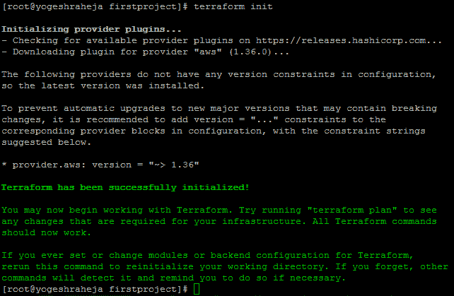

# 使用 Terraform 实现基础设施即代码

在第三章《将基础设施视为代码》中，我们熟悉了 AWS CloudFormation 和 Ansible。我们创建了一个 CloudFormation 模板来创建 EC2 环境，并在其中部署了一个 HelloWorld Web 应用程序。在自动化领域更进一步后，我们引入了**Ansible**配置管理工具。我们了解了 Ansible 如何处理应用程序部署和编排，以便 CloudFormation 模板在配置之前保持简洁和局限。这种方法在 AWS 云环境中被科技巨头们广泛接受，但当我们谈论具有多个云平台（如 AWS、Azure、Google Cloud、OpenStack 和 VMware）的异构环境时，作为 AWS 原生服务的 CloudFormation 就不再适用了。

因此，我们需要一个替代方案，不仅能够帮助我们提供计算服务，还能轻松地提供其他云原生服务。显然，这可以通过使用复杂且难以管理的命令式脚本来实现，但我们最终会使环境更加复杂。我们需要一个能够保持异构环境简单且可管理的解决方案，采用声明性方法，并遵循关于使用**基础设施即代码**（**IaC**）的推荐指南。这个解决方案就是**Terraform**，它是一个安全高效地构建、修改和版本化基础设施的工具。

本章将涵盖以下主题：

+   什么是 Terraform？

+   创建一个 Terraform 仓库

+   集成 AWS、Terraform 和 Ansible

# 技术要求

技术要求如下：

+   AWS 控制台

+   Git

+   GitHub

+   Terraform

+   Ansible

以下网站提供有关 Terraform 的更多信息：

+   Terraform 官方网站，获取产品信息：[`terraform.io`](https://terraform.io)

+   Terraform 支持的提供商详情：[`www.terraform.io/docs/providers/`](https://www.terraform.io/docs/providers/)

+   HashiCorp 配置语言详情：[`github.com/hashicorp/hcl`](https://github.com/hashicorp/hcl)

+   第一个项目的 Terraform 模板 GitHub 链接：[`raw.githubusercontent.com/yogeshraheja/EffectiveDevOpsTerraform/master/firstproject/ec2.tf`](https://raw.githubusercontent.com/yogeshraheja/EffectiveDevOpsTerraform/master/firstproject/ec2.tf)

+   第二个项目的 Terraform 模板 GitHub 链接：[`raw.githubusercontent.com/yogeshraheja/EffectiveDevOpsTerraform/master/secondproject/helloworldec2.tf`](https://raw.githubusercontent.com/yogeshraheja/EffectiveDevOpsTerraform/master/secondproject/helloworldec2.tf)

+   第三个项目的 Terraform 模板 Github 链接：[`raw.githubusercontent.com/yogeshraheja/EffectiveDevOpsTerraform/master/thirdproject/helloworldansible.tf`](https://raw.githubusercontent.com/yogeshraheja/EffectiveDevOpsTerraform/master/thirdproject/helloworldansible.tf)

+   第四个项目的 Terraform 模板 Github 链接：[`raw.githubusercontent.com/yogeshraheja/EffectiveDevOpsTerraform/master/fourthproject/helloworldansiblepull.tf`](https://raw.githubusercontent.com/yogeshraheja/EffectiveDevOpsTerraform/master/fourthproject/helloworldansiblepull.tf)

# 什么是 Terraform？

Terraform 是一个开源的基础设施即代码（IaC）软件，于 2014 年 7 月由 **HashiCorp** 公司发布。该公司还生产了包括 Vagrant、Packer 和 Vault 等工具。Terraform 以 **Mozilla 公共许可证**（**MPL**）2.0 版本发布。Terraform 的源代码可以在 GitHub 上找到：[`github.com/hashicorp/terraform`](https://github.com/hashicorp/terraform)。任何人都可以使用这些源代码并为 Terraform 的开发做出贡献。

Terraform 允许用户使用一种高级配置语言 **HashiCorp 配置语言**（**HCL**）定义数据中心基础设施。HashiCorp 还提供了 Terraform 的企业版，带有额外的支持功能。Terraform 提供了许多功能，使其成为一个完美的高级基础设施编排工具。它具有以下特点：

+   它的安装步骤非常简单，几乎不需要配置。

+   它采用声明式的方法来编写 Terraform 模板。

+   它既有开源版本，也有企业版。

+   它具有幂等性，这意味着每次应用 Terraform 模板时，都会在你的环境中提供相同的结果。

+   它几乎与所有主要的云平台完美兼容，如 AWS、Azure、GCP、OpenStack、DigitalOcean 等。更多详情请参阅[`www.terraform.io/docs/providers/`](https://www.terraform.io/docs/providers/)。

**然而，Terraform 不是：**

+   配置管理工具，如 Puppet、Chef、Ansible 或 SaltStack。你可以安装一些轻量级程序或软件，将一些重要的配置文件推送到你的实例中，但当涉及到更复杂应用程序的部署和编排时，你需要使用前面章节中提到的配置工具。

+   一个低级工具，如 AWS 的 Boto。

# 入门 Terraform

本书将重点介绍开源 Terraform。我们将展示如何在前几章中使用的 CentOS 7.x 机器上完整设置 Terraform。HashiCorp 不为操作系统提供原生软件包，因此 Terraform 作为单个二进制文件分发，并打包在 ZIP 压缩档案中。

让我们在 CentOS 服务器上设置 Terraform。请按照以下步骤操作：

1.  我们必须从官方网站下载 Terraform 二进制文件：[`www.terraform.io/downloads.html`](https://www.terraform.io/downloads.html)。在我们的案例中，我们将使用 Linux 64 位版本：


1.  解压提取的 Terraform `.zip` 文件。如果您的系统未安装 unzip 包，您需要先安装它：

```
$ yum -y install unzip
$ echo $PATH
$ unzip terraform_0.11.8_linux_amd64.zip -d /usr/bin/
```

这将把 Terraform 二进制文件提取到 `/usr/bin` 目录，Linux 系统的 PATH 环境变量中可以访问此目录。

1.  最后，检查已安装的 Terraform 版本。编写时可用的最新版本 Terraform 软件如下：

```
$ terraform -v
Terraform v0.11.8
```

正如您所看到的，设置 Terraform 仅需几分钟，而且它的二进制文件非常轻量。现在我们已准备好使用 Terraform 环境进行 AWS 服务的配置。

# 使用 Terraform 和 AWS 进行自动化配置

如前所述，Terraform 支持多个提供商，如 AWS、Azure 和 GCP，进行高级基础设施编排。在本书中，我们仅使用 AWS 平台。正如我们在第二章中所看到的，*部署您的第一个 Web 应用程序*，我们可以使用两种模式来部署计算服务或任何 AWS 服务：

+   AWS 管理控制台

+   AWS **命令行界面**（**CLI**）

# 使用 AWS 管理控制台进行部署

在这里，我们将重点介绍部署 AWS 计算服务，和之前的操作相同。使用 AWS 管理控制台部署 AWS 实例相对简单。请按照以下步骤进行：

1.  登录到您的 AWS 管理控制台，访问 [`console.aws.amazon.com`](https://console.aws.amazon.com) 或使用您的 IAM 用户账户登录。我们在第二章中创建了一个 IAM 用户账户，*部署您的第一个 Web 应用程序*，网址为 `https://AWS-account-ID-or-alias.signin.aws.amazon.com/console`。

1.  选择 "服务" 标签，接着选择 "计算" 部分中的 EC2，并点击 "Launch Instance" 按钮。

1.  在下一屏幕上，搜索并选择 **Amazon 机器映像**（**AMI**）。在本书中，我们使用的是 `ami-cfe4b2b0`，即 Amazon Linux AMI。

1.  从 "选择实例类型" 步骤中选择 `t2.micro` 类型，并点击 "Next: Configure Instance Details" 按钮。

1.  接受默认设置并点击 "Next: Add Storage" 按钮。

1.  再次接受存储的默认设置，然后点击 "Next: Add tags" 按钮，接着点击 "Next: Configure Security Group" 按钮。

1.  在此，选择您在第二章中创建的安全组，*部署您的第一个 Web 应用程序*，在我的案例中是 `sg-01864b4c`，如下图所示：


1.  现在，点击 "Review and Launch" 按钮。忽略出现的任何警告并按 "Launch" 按钮。

1.  选择密钥对，在我的案例中是 `EffectiveDevOpsAWS`。点击 "Launch Instances" 按钮。

几分钟后，你的 AWS 实例将启动并运行。服务器启动后，从本地实例（在我的例子中是 CentOS）登录到服务器。按照以下步骤手动部署 Hello World 应用程序并进行本地或浏览器验证：

```
$ ssh -i ~/.ssh/EffectiveDevOpsAWS.pem ec2-user@34.201.116.2 (replace this IP with your AWS public IP)
$ sudo yum install --enablerepo=epel -y nodejs
$ sudo wget https://raw.githubusercontent.com/yogeshraheja/Effective-DevOps-with-AWS/master/Chapter02/helloworld.js -O /home/ec2-user/helloworld.js
$ sudo wget https://raw.githubusercontent.com/yogeshraheja/Effective-DevOps-with-AWS/master/Chapter02/helloworld.conf -O /etc/init/helloworld.conf
$ sudo start helloworld
 $ curl http://34.201.116.2:3000/
Hello World
```

测试完成后，请记得通过 AWS 管理控制台终止该实例。

终止过程也非常简单。选择创建的实例，点击操作下拉菜单，选择实例状态选项，然后点击“终止”，如下图所示：


# 使用 AWS CLI 进行部署

使用 AWS CLI 创建实例并部署 Hello World Web 应用程序的步骤已经在第二章中演示过，*部署你的第一个 Web 应用程序*。你需要确保在继续之前安装 `awscli` 工具。以下是使用 AWS CLI 部署 Hello World Web 应用程序的简要概述：

```
$ aws ec2 run-instances \
 --instance-type t2.micro \
 --key-name EffectiveDevOpsAWS \
 --security-group-ids sg-01864b4c \
 --image-id ami-cfe4b2b0

$ aws ec2 describe-instances \
 --instance-ids i-0eb05adae2bb760c6 \
 --query "Reservations[*].Instances[*].PublicDnsName"
```

确保将 `i-0eb05adae2bb760c6` 替换为你在前一个命令中创建的 AWS 实例 ID。

```
$ ssh -i ~/.ssh/EffectiveDevOpsAWS.pem ec2-user@ec2-18-234-227-160.compute-1.amazonaws.com
$ sudo yum install --enablerepo=epel -y nodejs
$ sudo wget https://raw.githubusercontent.com/yogeshraheja/Effective-DevOps-with-AWS/master/Chapter02/helloworld.js -O /home/ec2-user/helloworld.js
$ sudo wget https://raw.githubusercontent.com/yogeshraheja/Effective-DevOps-with-AWS/master/Chapter02/helloworld.conf -O /etc/init/helloworld.conf
$ sudo start helloworld
 $ curl http://ec2-18-234-227-160.compute-1.amazonaws.com:3000/
 Hello World
```

测试完成后，请记得使用 `aws ec2 terminate-instances --instance-ids <AWS 实例 ID>` 终止该实例。

# 创建我们的 Terraform 仓库

现在我们已经看过了两种创建 AWS EC2 实例的方式：使用 AWS 管理控制台和使用 AWS CLI。我们可以通过 AWS 原生服务 **CloudFormation 模板**来实现自动化，如在第三章中所示，*将基础设施视为代码*。这仅适用于 AWS 云。在本章中，我们将使用 Terraform 达到相同的 AWS 实例配置效果。参考[`www.terraform.io/intro/vs/cloudformation.html`](https://www.terraform.io/intro/vs/cloudformation.html)以了解 Terraform 和 CloudFormation 的区别。

让我们在 GitHub 账户中创建一个专门的仓库，开始我们的 Terraform 之旅。登录 GitHub 后，按照以下步骤为 Terraform 模板创建一个新仓库：

1.  在浏览器中，打开 [`github.com/new`](https://github.com/new)。

1.  如下截图所示，将新仓库命名为 `EffectiveDevOpsTerraform`：


1.  勾选“初始化此仓库并添加 README”复选框。

1.  最后，点击“创建仓库”按钮。

1.  创建完仓库后，你需要将其克隆到你的系统中。为此，你需要安装 Git。如果还没有安装 Git，可以在 Google 上搜索如何为你的操作系统安装它。对于 CentOS，你只需要运行 `yum -y install git`，因为 Git 包现在已经包含在 Linux 发行版中：

```
$ git clone https://github.com/<your_github_username>/EffectiveDevOpsTerraform
```

现在仓库已被克隆，接下来是开始开发 Terraform 模板。进入 `EffectiveDevOpsTerraform` 仓库并创建一个名为 `firstproject` 的目录：

```
$ cd EffectiveDevOpsTerraform
$ mkdir firstproject
$ cd firstproject
```

# 第一个用于 AWS 实例配置的 Terraform 模板

Terraform 用于创建、管理和更新基础设施资源，例如虚拟机、云实例、物理机器、容器等几乎所有基础设施类型都可以在 Terraform 中作为资源表示。我们将在下一步创建一个资源。在此之前，我们需要了解 *Terraform 提供者*，它们负责理解 API 交互并暴露资源。提供者可以是 IaaS（如 AWS、GCP 等）、PaaS（如 Heroku）或 SaaS（如 DNSimple）。提供者是我们必须从头开始编写 Terraform 模板的第一部分。在使用 Terraform 创建实例之前，我们需要配置 AWS 提供者。这将是我们在模板中编写的第一段代码。

模板是用一种叫做 HCL 的特殊语言编写的。关于 HCL 的更多细节可以在 [`github.com/hashicorp/hcl`](https://github.com/hashicorp/hcl) 找到。你也可以用 JSON 编写模板，但我们这里将使用 HCL。Terraform 模板文件必须以 `.tf` 为扩展名，代表 **Terraform 文件**。让我们创建第一个模板，`ec2.tf`：

```
provider "aws" {
access_key = "<YOUR AWS ACCESS KEY>"
secret_key = "<YOUR AWS SECRET KEY>"
region = "us-east-1"
}
```

访问 [`www.terraform.io/docs/providers/aws/index.html`](https://www.terraform.io/docs/providers/aws/index.html) 以探索更多关于 AWS 提供者的选项。

在 Terraform 中，声明提供者的这种方式叫做 *使用静态凭证配置提供者*。这并不是声明提供者的安全方式；Terraform 还有其他选项，比如环境变量、Terraform 变量文件、AWS 本地凭证文件（`~/.aws/credentials`）等，用来存储包含敏感信息的提供者。

不要将你的 AWS 访问密钥或密钥保存在 GitHub 或任何其他公共网站上。这样做将允许黑客攻击你的 AWS 账户。

在继续之前，我们需要安装或重新初始化与 AWS 相关的 Terraform 插件。我们不需要做太多，这个配置文件中的 `provider` 插件会为我们执行这个任务。

运行以下命令：

```
$ terraform init
```

上述命令的输出如下：



下一步是配置我们的基础设施。在这里，我们开始使用 Terraform 资源来开发 `ec2.tf` 文件。资源是基础设施的组件。它们可以像一个完整的虚拟服务器一样复杂，具有多个其他服务，或者像 DNS 记录一样简单。每个资源都属于一个提供者，资源类型的后缀是提供者的名称。资源的配置，也叫做 `resource` 块，具有以下形式：

```
resource "provider-name_resource-type" "resource-name" {
parameter_name = “parameter_value”
parameter_name = “parameter_value”
.
.
}
```

在我们的例子中，我们需要创建一个 EC2 实例。Terraform 中的 `aws_instance` 资源负责完成这项工作。为了创建实例，我们至少需要设置两个参数：`ami` 和 `instance_type`。这两个参数是必需的，而其他参数是可选的。为了获取所有 `aws_instance` 资源参数的列表和描述，请访问以下网站：[`www.terraform.io/docs/providers/aws/r/instance.html`](https://www.terraform.io/docs/providers/aws/r/instance.html)。

在我们的例子中，我们将使用 AWS 管理控制台和 AWS CLI 工具创建并测试一个实例。我们使用 `ami-cfe4b2b0` 作为 AMI，`t2.micro` 作为实例类型。`EffectiveDevOpsAWS` 是我们之前创建的密钥名称，`sg-01864b4c` 是我们的安全组。我们还为实例添加了标签 `helloworld`，以便于识别。值得一提的是，像其他任何脚本或自动化语言一样，你可以在 Terraform 模板中使用 `#` 符号添加 *注释*。我们完整的文件现在应该如下所示：

```
# Provider Configuration for AWS
provider "aws" {
access_key = “<YOUR AWS ACCESS KEY>"
secret_key = "<YOUR AWS SECRET KEY>"
region = "us-east-1"
}

# Resource Configuration for AWS
resource "aws_instance" "myserver" {
ami = "ami-cfe4b2b0"
instance_type = "t2.micro"
key_name = "EffectiveDevOpsAWS"
vpc_security_group_ids = ["sg-01864b4c"]
tags {
```

```
Name = "helloworld"
}
}
```

创建的文件应该像以下网站中的文件一样：[`raw.githubusercontent.com/yogeshraheja/EffectiveDevOpsTerraform/master/firstproject/ec2.tf`](https://raw.githubusercontent.com/yogeshraheja/EffectiveDevOpsTerraform/master/firstproject/ec2.tf)。

让我们先验证 Terraform 模板，确保模板没有语法错误。Terraform 提供了一个专门的 `terraform validate` 工具，它检查 Terraform 模板的语法，并在发现需要注意的语法错误时给出输出：

```
$ terraform validate
```

由于没有输出，这意味着我们的 Terraform 模板没有语法错误。是时候进行一次干运行，以查看这个模板将执行什么操作。这只是一个烟雾测试，用来找出模板将执行哪些更改或实现。Terraform 中的这个步骤称为 **plan**：

```
[root@yogeshraheja firstproject]# terraform plan
Refreshing Terraform state in-memory prior to plan...
The refreshed state will be used to calculate this plan, but will not be
persisted to local or remote state storage.

------------------------------------------------------------------------

An execution plan has been generated and is shown below.
Resource actions are indicated with the following symbols:
 + create

Terraform will perform the following actions:

 + aws_instance.myserver
 id: <computed>
 ami: "ami-cfe4b2b0"
 arn: <computed>
 associate_public_ip_address: <computed>
 availability_zone: <computed>
 cpu_core_count: <computed>
 cpu_threads_per_core: <computed>
 ebs_block_device.#: <computed>
 ephemeral_block_device.#: <computed>
 get_password_data: "false"
 instance_state: <computed>
 instance_type: "t2.micro"
 ipv6_address_count: <computed>
 ipv6_addresses.#: <computed>
 key_name: "EffectiveDevOpsAWS"
 network_interface.#: <computed>
 network_interface_id: <computed>
 password_data: <computed>
 placement_group: <computed>
 primary_network_interface_id: <computed>
 private_dns: <computed>
 private_ip: <computed>
 public_dns: <computed>
 public_ip: <computed>
 root_block_device.#: <computed>
 security_groups.#: <computed>
 source_dest_check: "true"
 subnet_id: <computed>
 tags.%: "1"
 tags.Name: "helloworld"
 tenancy: <computed>
 volume_tags.%: <computed>
 vpc_security_group_ids.#: "1"
 vpc_security_group_ids.1524136243: "sg-01864b4c"

Plan: 1 to add, 0 to change, 0 to destroy.

------------------------------------------------------------------------
```

在这里，我们没有指定 `-out` 参数来保存这个计划，因此 Terraform 无法保证如果后续运行 `terraform apply` 时，这些操作将会 **完全** 执行。

```
[root@yogeshraheja firstproject]#
```

我们的计划阶段指示了我们在实际执行时希望创建实例的相同参数。再次强调，不要混淆 ` <computed>` 参数，这只是表示它们的值将在资源创建时分配。

现在让我们真正执行我们的计划，看看如何使用 Terraform 模板创建一个具有定义资源参数的 AWS 实例。Terraform 使用 `terraform apply` 工具来执行此操作，你可以把这个阶段看作是 **apply**。一旦执行 `terraform apply`，它默认会要求你确认操作。输入 `yes` 来开始资源创建。

如果你想在应用计划之前跳过此交互式审批，可以在`terraform apply`命令中使用`--auto-approve`选项：

```
[root@yogeshraheja firstproject]# terraform apply

An execution plan has been generated and is shown below.
Resource actions are indicated with the following symbols:
  + create

Terraform will perform the following actions:

  + aws_instance.myserver
      id: <computed>
      ami: "ami-cfe4b2b0"
      arn: <computed>
      associate_public_ip_address: <computed>
      availability_zone: <computed>
      cpu_core_count: <computed>
      cpu_threads_per_core: <computed>
      ebs_block_device.#: <computed>
      ephemeral_block_device.#: <computed>
      get_password_data: "false"
      instance_state: <computed>
      instance_type: "t2.micro"
      ipv6_address_count: <computed>
      ipv6_addresses.#: <computed>
      key_name: "EffectiveDevOpsAWS"
      network_interface.#: <computed>
      network_interface_id: <computed>
      password_data: <computed>
      placement_group: <computed>
      primary_network_interface_id: <computed>
      private_dns: <computed>
      private_ip: <computed>
      public_dns: <computed>
      public_ip: <computed>
      root_block_device.#: <computed>
      security_groups.#: <computed>
      source_dest_check: "true"
      subnet_id: <computed>
      tags.%: "1"
      tags.Name: "helloworld"
      tenancy: <computed>
      volume_tags.%: <computed>
      vpc_security_group_ids.#: "1"
      vpc_security_group_ids.1524136243: "sg-01864b4c"

Plan: 1 to add, 0 to change, 0 to destroy.

Do you want to perform these actions?
  Terraform will perform the actions described above.
  Only 'yes' will be accepted to approve.

  Enter a value: yes

aws_instance.myserver: Creating...
  ami: "" => "ami-cfe4b2b0"
  arn: "" => "<computed>"
  associate_public_ip_address: "" => "<computed>"
  availability_zone: "" => "<computed>"
  cpu_core_count: "" => "<computed>"
  cpu_threads_per_core: "" => "<computed>"
  ebs_block_device.#: "" => "<computed>"
  ephemeral_block_device.#: "" => "<computed>"
  get_password_data: "" => "false"
  instance_state: "" => "<computed>"
  instance_type: "" => "t2.micro"
  ipv6_address_count: "" => "<computed>"
  ipv6_addresses.#: "" => "<computed>"
  key_name: "" => "EffectiveDevOpsAWS"
  network_interface.#: "" => "<computed>"
  network_interface_id: "" => "<computed>"
  password_data: "" => "<computed>"
  placement_group: "" => "<computed>"
  primary_network_interface_id: "" => "<computed>"
  private_dns: "" => "<computed>"
  private_ip: "" => "<computed>"
  public_dns: "" => "<computed>"
  public_ip: "" => "<computed>"
  root_block_device.#: "" => "<computed>"
  security_groups.#: "" => "<computed>"
  source_dest_check: "" => "true"
  subnet_id: "" => "<computed>"
  tags.%: "" => "1"
  tags.Name: "" => "helloworld"
  tenancy: "" => "<computed>"
  volume_tags.%: "" => "<computed>"
  vpc_security_group_ids.#: "" => "1"
  vpc_security_group_ids.1524136243: "" => "sg-01864b4c"
aws_instance.myserver: Still creating... (10s elapsed)
aws_instance.myserver: Still creating... (20s elapsed)
aws_instance.myserver: Creation complete after 22s (ID: i-dd8834ca)

Apply complete! Resources: 1 added, 0 changed, 0 destroyed.
[root@yogeshraheja firstproject]# 
```

让我们在 AWS 控制台中确认新创建的实例，确保`helloworld`实例是由 Terraform 模板创建的：


Terraform 不仅仅创建了一个实例然后就忘记了它。实际上，Terraform 会将它所知道的关于资源（在我们的例子中是实例）的所有信息保存到一个特殊的文件中，这个文件在 Terraform 中被称为**状态文件**。在这个文件中，Terraform 存储了它所创建的所有资源的状态。它保存在与 Terraform 模板相同的目录中，并且文件扩展名为`.tfstate`。状态文件的格式是一个简单的 JSON 格式：

```
[root@yogeshraheja firstproject]# cat terraform.tfstate
{
 "version": 3,
 "terraform_version": "0.11.8",
 "serial": 1,
 "lineage": "9158b0ed-754a-e01e-094e-6b0827347950",
 "modules": [
 {
 "path": [
 "root"
 ],
 "outputs": {},
 "resources": {
 "aws_instance.myserver": {
 "type": "aws_instance",
 "depends_on": [],
 "primary": {
 "id": "i-dd8834ca",
 "attributes": {
 "ami": "ami-cfe4b2b0",
 "arn": "arn:aws:ec2:us-east-1:094507990803:instance/i-dd8834ca",
 "associate_public_ip_address": "true",
 "availability_zone": "us-east-1b",
 "cpu_core_count": "1",
 "cpu_threads_per_core": "1",
 "credit_specification.#": "1",
 "credit_specification.0.cpu_credits": "standard",
 "disable_api_termination": "false",
 "ebs_block_device.#": "0",
 "ebs_optimized": "false",
 "ephemeral_block_device.#": "0",
 "get_password_data": "false",
 "iam_instance_profile": "",
 "id": "i-dd8834ca",
 "instance_state": "running",
 "instance_type": "t2.micro",
 "ipv6_addresses.#": "0",
 "key_name": "EffectiveDevOpsAWS",
 "monitoring": "false",
 "network_interface.#": "0",
 "network_interface_id": "eni-b0683ee7",
 "password_data": "",
 "placement_group": "",
 "primary_network_interface_id": "eni-b0683ee7",
 "private_dns": "ip-172-31-74-203.ec2.internal",
 "private_ip": "172.31.74.203",
 "public_dns": "ec2-52-70-251-228.compute-1.amazonaws.com",
 "public_ip": "52.70.251.228",
 "root_block_device.#": "1",
 "root_block_device.0.delete_on_termination": "true",
 "root_block_device.0.iops": "100",
 "root_block_device.0.volume_id": "vol-024f64aa1bb805237",
 "root_block_device.0.volume_size": "8",
 "root_block_device.0.volume_type": "gp2",
 "security_groups.#": "1",
 "security_groups.2004290681": "HelloWorld",
 "source_dest_check": "true",
 "subnet_id": "subnet-658b6149",
 "tags.%": "1",
 "tags.Name": "helloworld",
 "tenancy": "default",
 "volume_tags.%": "0",
 "vpc_security_group_ids.#": "1",
 "vpc_security_group_ids.1524136243": "sg-01864b4c"
 },
 "meta": {
 "e2bfb730-ecaa-11e6-8f88-34363bc7c4c0": {
 "create": 600000000000,
 "delete": 1200000000000,
 "update": 600000000000
 },
 "schema_version": "1"
 },
 "tainted": false
 },
 "deposed": [],
 "provider": "provider.aws"
 }
 },
 "depends_on": []
 }
 ]
}
[root@yogeshraheja firstproject]#
```

Terraform 的特殊之处在于，你可以通过`terraform show`命令以人类可读的格式读取这个 JSON 输出：

```
[root@yogeshraheja firstproject]# terraform show
aws_instance.myserver:
 id = i-dd8834ca
 ami = ami-cfe4b2b0
 arn = arn:aws:ec2:us-east-1:094507990803:instance/i-dd8834ca
 associate_public_ip_address = true
 availability_zone = us-east-1b
 cpu_core_count = 1
 cpu_threads_per_core = 1
 credit_specification.# = 1
 credit_specification.0.cpu_credits = standard
 disable_api_termination = false
 ebs_block_device.# = 0
 ebs_optimized = false
 ephemeral_block_device.# = 0
 get_password_data = false
 iam_instance_profile =
 instance_state = running
 instance_type = t2.micro
 ipv6_addresses.# = 0
 key_name = EffectiveDevOpsAWS
 monitoring = false
 network_interface.# = 0
 network_interface_id = eni-b0683ee7
 password_data =
 placement_group =
 primary_network_interface_id = eni-b0683ee7
 private_dns = ip-172-31-74-203.ec2.internal
 private_ip = 172.31.74.203
 public_dns = ec2-52-70-251-228.compute-1.amazonaws.com
 public_ip = 52.70.251.228
 root_block_device.# = 1
 root_block_device.0.delete_on_termination = true
 root_block_device.0.iops = 100
 root_block_device.0.volume_id = vol-024f64aa1bb805237
 root_block_device.0.volume_size = 8
 root_block_device.0.volume_type = gp2
 security_groups.# = 1
 security_groups.2004290681 = HelloWorld
 source_dest_check = true
 subnet_id = subnet-658b6149
 tags.% = 1
 tags.Name = helloworld
 tenancy = default
 volume_tags.% = 0
 vpc_security_group_ids.# = 1
 vpc_security_group_ids.1524136243 = sg-01864b4c

[root@yogeshraheja firstproject]#
```

到目前为止，我们已经创建了一个 Terraform 模板，验证它以确保没有语法错误，并进行了`terraform plan`形式的冒烟测试，最后通过`terraform apply`应用了我们的 Terraform 模板来创建资源。

剩下的问题是，*我们如何删除或销毁 Terraform 模板创建的所有资源？*我们是否需要逐一查找并删除资源？答案是否定的，Terraform 会自动处理这个问题。通过参考 Terraform 在**apply**阶段创建的状态文件，任何由 Terraform 创建的资源都可以使用简单的`terraform destroy`命令在`template`目录中销毁：

```
[root@yogeshraheja firstproject]# terraform destroy
aws_instance.myserver: Refreshing state... (ID: i-dd8834ca)

An execution plan has been generated and is shown below.
Resource actions are indicated with the following symbols:
 - destroy

Terraform will perform the following actions:

 - aws_instance.myserver

Plan: 0 to add, 0 to change, 1 to destroy.

Do you really want to destroy all resources?
 Terraform will destroy all your managed infrastructure, as shown above.
 There is no undo. Only 'yes' will be accepted to confirm.

 Enter a value: yes

aws_instance.myserver: Destroying... (ID: i-dd8834ca)
aws_instance.myserver: Still destroying... (ID: i-dd8834ca, 10s elapsed)
aws_instance.myserver: Still destroying... (ID: i-dd8834ca, 20s elapsed)
aws_instance.myserver: Still destroying... (ID: i-dd8834ca, 30s elapsed)
aws_instance.myserver: Still destroying... (ID: i-dd8834ca, 40s elapsed)
aws_instance.myserver: Still destroying... (ID: i-dd8834ca, 50s elapsed)
aws_instance.myserver: Destruction complete after 1m0s

Destroy complete! Resources: 1 destroyed.
[root@yogeshraheja firstproject]#
```

检查你的 AWS 控制台，确保实例处于终止状态。

现在检查`terraform show`命令。由于没有任何资源可用，它应该为空。

# 用于部署 Hello World 应用程序的第二个 Terraform 模板

进入 EffectiveDevOpsTerraform 仓库并创建一个名为`second project`的目录：

```
$ mkdir secondproject
$ cd secondproject
```

现在，我们已经在上一节中使用 Terraform 模板创建了 EC2 实例，接下来我们准备扩展我们 Hello World 网页应用程序的配置。我们将使用**Terraform Provisioner**重新创建我们之前通过第二章中 CloudFormation 的`UserDatablock`字段，*部署你的第一个网页应用*以及在第三章中使用 Ansible 角色，*将基础设施视为代码*时所创建的 Hello World 堆栈。如果你还记得，`UserData`字段大致如下所示：

```
yum install --enablerepo=epel -y nodejs
wget https://raw.githubusercontent.com/yogeshraheja/Effective-DevOps-with-AWS/master/Chapter02/helloworld.js -O /home/ec2-user/helloworld.js
wget https://raw.githubusercontent.com/yogeshraheja/Effective-DevOps-with-AWS/master/Chapter02/helloworld.conf -O /etc/init/helloworld.conf
start helloworld
```

您会观察到，部署我们 Hello World 网络应用程序的操作有三种不同的类型。首先，我们准备系统以运行应用程序。在我们的示例中，我们只是安装 Node.js 包。接下来，我们复制运行应用程序所需的不同资源。在我们的例子中，这些资源包括 JavaScript 代码和 upstart 配置。最后，我们启动服务。

为了部署我们的 Hello World 网络应用程序，我们需要引入**Terraform Provisioner**。Terraform 中的 Provisioners 是可用于多个资源的配置块，允许您在资源创建后执行操作。它主要用于 EC2 实例。Provisioners 主要用作**构建后步骤**，用于安装轻量级应用程序或配置管理代理，例如**Puppet 代理**或**chef-client**。它们甚至可以用来运行配置管理工具，如**playbooks**、**Puppet 模块**、**Chef 食谱**或**Salt 配方**。在接下来的章节中，我们将查看如何将 Terraform 与 Ansible 配合使用的几个示例。

让我们创建`helloworldec2.tf` Terraform 模板来创建实例，然后引入`provisioner`块，使用`remote-exec`与新创建的实例建立连接，并在其上下载和部署 Hello World 应用程序。我们完成的 Terraform 模板应如下所示：

```
# Provider Configuration for AWS
provider "aws" {
  access_key = "<YOUR AWS ACCESS KEY>"
  secret_key = "<YOUR AWS SECRET KEY>"
  region = "us-east-1"
}

# Resource Configuration for AWS
resource "aws_instance" "myserver" {
  ami = "ami-cfe4b2b0"
  instance_type = "t2.micro"
  key_name = "EffectiveDevOpsAWS"
  vpc_security_group_ids = ["sg-01864b4c"]

  tags {
    Name = "helloworld"
  }

# Helloworld Appication code
  provisioner "remote-exec" {
    connection {
      user = "ec2-user"
      private_key = "${file("/root/.ssh/EffectiveDevOpsAWS.pem")}"
    }
    inline = [
      "sudo yum install --enablerepo=epel -y nodejs",
      "sudo wget https://raw.githubusercontent.com/yogeshraheja/Effective-DevOps-with-AWS/master/Chapter02/helloworld.js -O /home/ec2-user/helloworld.js",
      "sudo wget https://raw.githubusercontent.com/yogeshraheja/Effective-DevOps-with-AWS/master/Chapter02/helloworld.conf -O /etc/init/helloworld.conf",
      "sudo start helloworld",
    ]
  }
}
```

创建的文件应如下所示：[`raw.githubusercontent.com/yogeshraheja/EffectiveDevOpsTerraform/master/secondproject/helloworldec2.tf`](https://raw.githubusercontent.com/yogeshraheja/EffectiveDevOpsTerraform/master/secondproject/helloworldec2.tf)。

由于我们正在新目录`secondproject`中创建 Terraform 模板，因此需要安装插件或重新初始化与 AWS 相关的 Terraform 插件。配置了`provider`部分的文件将为我们执行此任务：

```
$ terraform init
```

现在，到了验证 Terraform 模板文件的时间，确保它没有任何语法错误。验证成功后，运行`plan`命令，然后使用`terraform apply`命令完整执行模板：

```
$ terraform validate
$ terraform plan
$ terraform apply
```

我们将得到以下输出：


我们的 Terraform 模板已经成功执行。我们已配置好 EC2 实例并部署了 Hello World 网络应用程序。通过执行`terraform show`命令，接着运行`curl`命令，我们可以找到实例的公网 IP，并确保应用程序已正确部署：

```
$ terraform show | grep -i public_ip
$ curl <PUBLIC_IP>:3000
```

执行前面命令的输出如下：


让我们也从浏览器验证应用程序的输出，如下截图所示：


我们已经成功地使用 Terraform 部署了我们的 Hello World 网页应用。测试完成后，确保在继续到下一章节之前，删除所有已创建的资源。执行 `terraform destroy` 命令，它将通过引用 Terraform 状态文件来删除所有已创建的资源。

运行以下命令：

```
$ terraform destroy
```

# 集成 AWS、Terraform 和 Ansible

在前面的章节中，我们学习了如何使用 Terraform 配置一个基础实例。接着，我们学习了如何使用 Terraform 配置一个基础的 EC2 实例，并通过 **post builds** 执行构建操作。现在，我们将学习如何将 Terraform 与 Ansible 集成，以执行配置管理任务。我们将考虑两种不同的场景。在第一个场景中，我们将配置一个 EC2 实例，并使用 **push** 模式运行 Ansible，这是我们使用 Ansible 执行自动化的主要方式。在第二个场景中，我们将配置一个 EC2 实例，并使用 `ansible pull` 方法在 **pull** 模式下运行 Ansible。

# 使用推送模式的 Terraform 和 Ansible

进入 `EffectiveDevOpsTerraform` 仓库，创建一个名为 `thirdproject` 的目录：

```
$ mkdir thirdproject
$ cd thirdproject
```

在这个例子中，我们将遵循推荐的实践来创建 Terraform 模板。首先，我们将从 Terraform 模板中移除我们的 AWS `access_key` 和 AWS `secret_key`。我们系统中已安装 AWS CLI，这意味着我们已经配置了该系统与我们的 AWS 账户进行通信。如果我们还没有安装 AWS CLI，我们将使用 `aws configure` 来安装它。安装后，它将在 `/root/.aws` 目录中创建一个 `credentials` 文件，其中包含我们的 AWS 访问密钥和秘密密钥。我们将利用该文件，在 Terraform 模板中使用相同的凭证在 AWS 账户上构建资源：

```
[root@yogeshraheja thirdproject]# cat /root/.aws/credentials
[default]
aws_access_key_id = <YOUR AWS SECRET KEY>
aws_secret_access_key = <YOUR AWS SECRET KEY>
[root@yogeshraheja thirdproject]#
```

现在是时候开始编写我们的 `helloworldansible.tf` Terraform 模板了。在这个例子中，我们将配置一个 EC2 实例，并通过使用 `remote-exec` provisioner 验证连接来等待 SSH 服务的出现。然后，我们将使用 `local-exec` provisioner 创建一个包含新 IP 地址的清单，并通过执行 `ansible-playbook` 命令在本地系统上使用主要的推送模型运行 Ansible 剧本。

在 provisioners（仅在 provisioners 内）中，我们可以使用一个特殊的关键字 self 来访问正在配置的资源的属性。

我们在代码中还使用了一个叫做 `output` 的块。输出块允许你在 Terraform 模板应用后，通过 Terraform `output` 命令返回数据：

```
# Provider Configuration for AWS
provider "aws" {
  region = "us-east-1"
}

# Resource Configuration for AWS
resource "aws_instance" "myserver" {
  ami = "ami-cfe4b2b0"
  instance_type = "t2.micro"
  key_name = "EffectiveDevOpsAWS"
  vpc_security_group_ids = ["sg-01864b4c"]

  tags {
    Name = "helloworld"
  }

# Provisioner for applying Ansible playbook
  provisioner "remote-exec" {
    connection {
      user = "ec2-user"
      private_key = "${file("/root/.ssh/EffectiveDevOpsAWS.pem")}"
    }
  }

  provisioner "local-exec" {
    command = "sudo echo '${self.public_ip}' > ./myinventory",
  }

  provisioner "local-exec" {
    command = "sudo ansible-playbook -i myinventory --private-key=/root/.ssh/EffectiveDevOpsAWS.pem helloworld.yml",
  } 
}

# IP address of newly created EC2 instance
output "myserver" {
 value = "${aws_instance.myserver.public_ip}"
}
```

创建的文件应类似于以下文件：[`raw.githubusercontent.com/yogeshraheja/EffectiveDevOpsTerraform/master/thirdproject/helloworldansible.tf`](https://raw.githubusercontent.com/yogeshraheja/EffectiveDevOpsTerraform/master/thirdproject/helloworldansible.tf)。

我们将在`helloworld.yml` Ansible playbook 中调用`helloworld`角色来部署 Hello World web 应用程序：

```
---
- hosts: all
  become: yes
  roles:
    - helloworld
```

Ansible 配置文件`ansible.cfg`应如下所示。它应该指向我们`thirdproject`目录结构中的`myinventory`文件：

```
[defaults]
inventory = $PWD/myinventory
roles_path = ./roles
remote_user = ec2-user
become = True
become_method = sudo
become_user = root
nocows = 1
host_key_checking = False
```

完整的项目应如下所示：[`github.com/yogeshraheja/EffectiveDevOpsTerraform/tree/master/thirdproject`](https://github.com/yogeshraheja/EffectiveDevOpsTerraform/tree/master/thirdproject)。

由于我们创建了一个新的目录`thirdproject`，我们需要重新安装与 AWS 相关的插件，或者重新初始化与 Terraform 相关的插件。带有`provider`部分的配置文件将为我们执行此任务：

```
$ terraform init
```

现在是验证 Terraform 模板文件的时候了，以确保它没有语法错误。验证成功后，执行计划并使用`terraform apply`进行实际运行：

```
$ terraform validate
$ terraform plan
$ terraform apply
```


输出清晰地显示了 Ansible playbook 的日志，并返回带有公网 IP 的`output`块。让我们使用这个公网 IP 来验证应用程序部署：

```
$ curl 54.85.107.87:3000
```

运行前面的命令后的输出如下所示：


让我们从浏览器验证应用程序输出，如下图所示：


部署成功后，执行`terraform destroy`以清理已创建的资源：

```
$ terraform destroy
```

# 使用 Ansible 的拉取方式的 Terraform

进入`EffectiveDevOpsTerraform`仓库，并创建一个名为`fourthproject`的目录：

```
$ mkdir fourthproject
$ cd fourthproject
```

我们将在这里再次遵循 Terraform 模板的最佳实践，并使用位于`/root/.aws`目录中的`credentials`文件，该文件包含我们的 AWS 访问密钥和秘密密钥。在这种情况下，我们将以反向方式使用 Ansible：*Ansible 拉取方式*。要使用这种反向方式的 Ansible，我们必须确保在已提供的 EC2 实例上安装 Ansible，并通过引用源代码仓库中存在的 Ansible 代码来运行`ansible-pull`。

在我们的案例中，我们将使用在第三章中创建的相同 Ansible 代码，*将基础设施视为代码*，该代码位于[`github.com/yogeshraheja/ansible`](https://github.com/yogeshraheja/ansible)。在我们的`helloworldansiblepull.tf` Terraform 模板中，我们将使用`remote-exec` Terraform 提供程序与新创建的实例建立连接。我们将使用`inline`属性在新创建的 EC2 实例上远程执行多个命令。我们的 Terraform 模板应如下所示：

```
# Provider Configuration for AWS
provider "aws" {
  region = "us-east-1"
}

# Resource Configuration for AWS
resource "aws_instance" "myserver" {
  ami = "ami-cfe4b2b0"
  instance_type = "t2.micro"
  key_name = "EffectiveDevOpsAWS"
  vpc_security_group_ids = ["sg-01864b4c"]

  tags {
    Name = "helloworld"
  }

# Provisioner for applying Ansible playbook in Pull mode
  provisioner "remote-exec" {
    connection {
      user = "ec2-user"
      private_key = "${file("/root/.ssh/EffectiveDevOpsAWS.pem")}"
    }
    inline = [
      "sudo yum install --enablerepo=epel -y ansible git",
      "sudo ansible-pull -U https://github.com/yogeshraheja/ansible helloworld.yml -i localhost",
    ]
  }

}

# IP address of newly created EC2 instance
output "myserver" {
 value = "${aws_instance.myserver.public_ip}"
}
```

创建的文件应与以下文件相似：[`raw.githubusercontent.com/yogeshraheja/EffectiveDevOpsTerraform/master/fourthproject/helloworldansiblepull.tf`](https://raw.githubusercontent.com/yogeshraheja/EffectiveDevOpsTerraform/master/fourthproject/helloworldansiblepull.tf)[.](https://raw.githubusercontent.com/yogeshraheja/EffectiveDevOpsTerraform/master/fourthproject/helloworldansiblepull.tf)

由于我们刚刚创建了一个新的目录`fourthproject`，我们需要为 Terraform 安装插件或重新初始化与 AWS 相关的插件。包含`provider`部分的配置文件将为我们执行此任务。

```
$ terraform init
```

现在是时候验证 Terraform 模板文件，确保没有语法错误。成功验证后，执行计划并使用`terraform apply`进行实际运行：

```
$ terraform validate
$ terraform plan
$ terraform apply
```


如预期所示，Ansible 代码已在新创建的 EC2 实例上本地运行。Terraform 模板中配置的`output`块也返回了期望的公共 IP 值。我们通过`curl`命令来验证输出：

```
$ curl 18.212.64.84:3000/
```

执行前述命令的输出如下：


最后，从浏览器验证输出，如下图所示：


很好——应用程序已部署并通过验证。一旦完成，别忘了使用以下命令销毁资源，以避免不必要的 AWS 账单：

```
$ terraform destroy
```

# 总结

在本章中，我们学习了如何使用 Terraform 模板高效管理基础设施。首先，我们了解了如何使用 Terraform 仅通过几行代码来配置 EC2 实例。接着，我们研究了如何使用 Terraform 提供者（provisioners）创建模板以部署轻量级应用程序。然后，我们通过 Ansible 扩展了 Terraform 模板，这使我们能够协调部署 Web 应用程序的不同步骤。最后，我们探讨了如何将 Terraform 与 Ansible 结合使用，以拉取方式进行集成，这在管理大规模基础设施时通常更为合理，正如我们在第三章，*将基础设施视为代码*中所观察到的那样。

我们现在有了一个良好的生产环境，准备托管任何应用程序。我们已经了解了如何使用 CloudFormation、Ansible 和 Terraform 来架构它。在第五章，*添加持续集成与持续部署*中，我们将继续使用 CloudFormation 和 Ansible，但在软件交付的背景下，因为我们将学习如何实施持续集成测试和持续部署。

# 问题

1.  什么是 Terraform，它与其他配置管理工具有何不同？

1.  如何在基于 Linux 的操作系统上安装 Terraform？

1.  如何使用 Terraform 模板配置你的第一个 AWS 实例？

1.  如何编写 Terraform 模板以集成基于拉取的 Ansible 方法？

# 深入阅读

阅读以下文章以获取更多信息：

+   **Terraform 参考** 在 [`terraform.io`](https://terraform.io)

+   **Terraform GitHub 参考** 在 [`github.com/hashicorp/terraform`](https://github.com/hashicorp/terraform)
