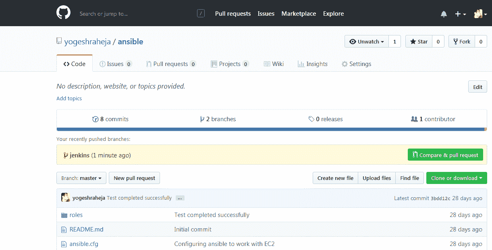

# 第五章：添加持续集成和持续部署

在前几章中，我们集中讨论了改善基础设施的创建和管理。然而，DevOps 文化并不止于此。如你从第一章《云计算与 DevOps 革命》中所记得的，DevOps 文化还包括拥有一个非常高效的代码测试和部署流程。在 2009 年 Velocity 大会上，John Allspaw 和 Paul Hammond 做了一个非常鼓舞人心的演讲，介绍了 Flickr 是如何每天进行超过 10 次部署的([`bit.ly/292ASlW`](http://bit.ly/292ASlW))。这次演讲常被提及为 DevOps 运动诞生的关键时刻之一。在他们的演讲中，John 和 Paul 谈到了开发和运维团队之间的冲突，同时也概述了一些最佳实践，使得 Flickr 能够每天多次将新代码部署到生产环境。

随着虚拟化、公共云和私有云以及自动化等创新的出现，创建新公司从未如此容易。因此，许多公司现在面临的最大问题是如何脱颖而出，区别于竞争对手。比大多数竞争者更快地迭代能力可能对公司的成功至关重要。一个高效的 DevOps 组织利用多种工具和策略，以提高工程团队将新代码发布到生产环境的速度。这正是我们将在本章中关注的内容。

我们将首先着手创建一个**持续集成**（**CI**）流水线。CI 流水线将允许我们自动且持续地测试提议的代码更改。这将释放开发人员和质量保证人员的时间，他们将不再需要进行大量的手动测试。它还使得代码更改的集成变得更加容易。为了实现我们的流水线，我们将使用 GitHub 和一个最广泛使用的集成工具——**Jenkins**。

然后我们将探讨如何创建一个**持续部署**（**CD**）流水线。一旦代码通过了 CI 流水线，我们将使用这个持续部署流水线自动部署新代码。我们将依赖两个 AWS 服务来实现这个流水线——**AWS CodeDeploy**和**AWS CodePipeline**。CodeDeploy 让我们定义如何在 EC2 实例上部署新代码，而 CodePipeline 则让我们可以协调应用程序的整个生命周期。

为了将我们的代码部署到生产环境，我们将增加一个额外的步骤，允许操作员通过按下一个按钮将最新的构建版本从预发布环境部署到生产环境。这种按需将代码部署到生产环境的能力被称为 CD（持续部署）。它的主要优势在于，它允许部署操作员在将代码部署到生产环境之前，在预发布环境中验证构建。章节末尾，我们将介绍一些有效的工程组织使用的技术和策略，帮助将持续交付管道转变为持续部署管道，从而使整个代码部署过程无需人工干预即可完成。我们将讨论以下主题：

+   构建持续集成管道

+   构建持续部署管道

# 技术要求

本章节的技术要求如下：

+   GitHub

+   Jenkins

+   Ansible

+   AWS CodeDeploy

+   AWS CodePipeline

相关链接如下：

+   **Jenkins 包管理库**: [`pkg.jenkins.io/`](https://pkg.jenkins.io/)

+   **Jenkins 设置剧本**: [`raw.githubusercontent.com/yogeshraheja/ansible/master/roles/jenkins/tasks/main.yml`](https://raw.githubusercontent.com/yogeshraheja/ansible/master/roles/jenkins/tasks/main.yml)

+   **Jenkinsfile**: [`raw.githubusercontent.com/yogeshraheja/helloworld/master/Jenkinsfile`](https://raw.githubusercontent.com/yogeshraheja/helloworld/master/Jenkinsfile)

+   **代码部署库**: [`raw.githubusercontent.com/yogeshraheja/Effective-DevOps-with-AWS/master/Chapter05/ansible/library/aws_codedeploy`](https://raw.githubusercontent.com/yogeshraheja/Effective-DevOps-with-AWS/master/Chapter05/ansible/library/aws_codedeploy)

# 构建 CI 管道

最初，在 CI 环境中工作意味着开发人员必须尽可能频繁地将代码提交到一个公共分支，而不是在一个单独的分支上工作或几周不提交更改。这可以提高当前工作的可见性，并促进沟通，避免集成问题，这种情况通常被称为 **集成地狱**。随着源代码管理、构建和发布管理相关工具集的成熟，理想世界中代码集成的愿景也逐渐明确。

如今，大多数有效的工程组织将继续沿着早期频繁集成的道路前进。然而，他们通常使用一种更现代的开发过程，在这种过程中，开发人员需要在编辑代码的同时，添加或编辑相关的测试以验证更改。这大大提高了整体生产力；现在更容易发现新错误，因为每次合并时代码的变化量相对较小。

要采用这样的工作流程，例如使用 Git 这样的源代码管理工具，你可以按以下步骤进行：

1.  作为开发者，当你想做出更改时，首先创建一个新的 Git 分支，从主分支的 HEAD 分支出。

1.  编辑代码，并同时添加或编辑不同的相关测试以验证更改。

1.  在本地测试代码。

1.  当代码准备好时，将分支 rebase 以集成其他开发者的最新更改。如有需要，解决冲突并再次测试代码。

1.  如果一切顺利，下一步是创建一个`pull request`。在这个过程中，你需要告诉其他开发者你的代码已经准备好进行审查。

1.  一旦创建了 pull request，一个自动化测试系统（如我们将在本章中构建的系统）将捕捉到更改并运行整个测试套件，以确保没有任何失败。

1.  此外，其他相关方将审查代码以及添加到分支中的不同测试。如果他们对所提议的更改满意，他们将批准它，允许开发者合并他们的更改。

1.  在最后一步，开发者合并他们的 pull requests，这将意味着将他们的新代码合并并测试主分支。其他开发者现在将在重新 base 或创建新分支时集成这个更改。

在接下来的部分中，我们将创建一个使用 Jenkins 的 CI 服务器，运行在 EC2 实例和 GitHub 之上。

随着项目的扩大，测试的数量和运行测试所需的时间也会增加。虽然像 Bazel ([`bazel.build/`](https://bazel.build/)) 这样的高级构建系统能够只运行与特定更改相关的测试，但通常更容易从简单开始，创建一个每次提交新 pull request 时都会运行所有可用测试的 CI 系统。拥有像 AWS 这样弹性的外部测试基础设施，对于那些不希望等待几分钟甚至几小时来执行所有测试的开发者来说，将节省大量时间。在本书中，我们将重点讨论 Web 应用开发。你可能会面临一个更加具有挑战性的环境，需要为特定的硬件和操作系统构建软件。拥有一个专门的 CI 系统，将允许你在最终目标的硬件和软件上运行测试。

# 使用 Ansible 和 CloudFormation 创建 Jenkins 服务器

如前所述，我们将使用 Jenkins 作为我们运行 CI 流水线的核心系统。Jenkins 有超过 10 年的开发历史，长期以来一直是实践持续集成的领先开源解决方案。Jenkins 以其丰富的插件生态系统而闻名，已经经历了一个重大的新版本发布（Jenkins 2.x），这使得它更加聚焦于一些 DevOps 中心的功能，包括能够创建可以进行版本控制和检查的原生交付流水线。它还提供了与源代码管理系统（如我们在本书中使用的 GitHub）的更好集成。

我们将继续像在第三章中一样使用 **Ansible** 和 **CloudFormation**，*将你的基础设施视为代码*，来管理我们的 Jenkins 服务器。

# 为 Jenkins 创建 Ansible playbook

首先，导航到我们的 `ansible` 角色目录：

```
$ cd ansible/roles  
```

该目录应包含 `helloworld` 和 `nodejs` 目录，以及我们在第三章中创建的配置，*将你的基础设施视为代码*。我们现在将使用 `ansible-galaxy` 命令创建我们的 Jenkins 角色：

```
$ ansible-galaxy init jenkins  
```

现在，我们将通过编辑文件 `jenkins/tasks/main.yml` 来编辑该新角色的任务定义。用你喜欢的文本编辑器打开文件。

我们任务的目标是安装并启动 Jenkins。为了实现这一目标，由于我们使用的是基于 Linux 的操作系统（在我们的例子中是 AWS Amazon Linux），我们将通过 `yum` 安装一个 RPM 包。Jenkins 维护了一个 `yum` 仓库，所以第一步将是将其导入到我们的 `yum` 仓库配置中，基本上是作为 `/etc/yum.repos.d` 中的一个条目：

以下是任务文件的初始注释，请添加以下内容：

```
- name: Add Jenkins repository
  shell: wget -O /etc/yum.repos.d/jenkins.repo https://pkg.jenkins.io/redhat/jenkins.repo
```

下一步将是导入该仓库的 GPG 密钥。Ansible 有一个模块来管理这些密钥：

```
- name: Import Jenkins GPG key 
  rpm_key: 
    state: present 
    key: https://pkg.jenkins.io/redhat/jenkins.io.key
```

我们现在已经到达了可以使用 `yum` 安装 Jenkins 的步骤。我们将通过以下调用来完成：

```
- name: Install Jenkins 
  yum: 
    name: jenkins-2.99
    enablerepo: jenkins 
    state: present
```

由于 `jenkins` 仓库默认被禁用，我们通过 `enablerepo` 标志在执行此 `yum` 命令时启用它。

此时，Jenkins 已经安装完成。为了遵循最佳实践指南，我们将指定要安装的 Jenkins 版本（在我们的例子中是 2.99）。我们还希望启动该服务并在 `chkconfig` 级别启用它，这样如果安装了 Jenkins 的 EC2 实例重新启动，Jenkins 会自动启动。我们可以通过使用服务模块来做到这一点。请在前一个调用后添加以下内容：

```
- name: Start Jenkins 
  service: 
    name: jenkins 
    enabled: yes 
    state: started 
```

对于一个简单的 Jenkins 角色，这就是我们所需要的。

我们现在应该有一个 `main.yml` 文件，如下所示：[`raw.githubusercontent.com/yogeshraheja/ansible/master/roles/jenkins/tasks/main.yml`](https://raw.githubusercontent.com/yogeshraheja/ansible/master/roles/jenkins/tasks/main.yml)。

AWS Amazon Linux 配备了 Java 7，但 Jenkins 在版本 2.54 及以上要求安装 Java 8。因此，在上面的链接中你会看到两个额外的任务，这些任务将卸载 Java 7 并安装 Java 8：

```
- name: Removing old version of JAVA from Amazon Linux
  yum:
    name: java-1.7.0-openjdk
    state: absent

- name: Install specific supported version of JAVA
  yum:
    name: java-1.8.0-openjdk
    state: present
```

随着你对 Jenkins 和 Ansible 的经验积累，探索网络或 Ansible Galaxy，你会发现更多的高级角色，允许你更详细地配置 Jenkins、生成作业并选择要安装的插件。这是一个重要的步骤，本书不会涵盖，但理想情况下，你希望你的整个系统都能通过代码来描述。此外，在本章中，我们使用的是 HTTP 协议上的 Jenkins。强烈建议使用加密协议（如 HTTPS），或者正如我们将在第八章《*强化 AWS 环境的安全性*》中看到的那样，使用 VPN 连接的私有子网。

我们现在已经构建了一个角色，使我们能够安装 Jenkins。我们希望创建一个新的 EC2 实例并在其上安装 Jenkins，最终目标是在该实例上测试我们的 Node.js 代码。为了实现这一点，Jenkins 主机还需要安装 Node 和 `npm`。

我们有两种选择。我们可以像为 `helloworld` 角色做的那样，将我们的 `nodejs` 角色作为 Jenkins 角色的依赖项，或者我们可以将 `nodejs` 角色列在我们的剧本角色列表中。由于最终 Jenkins 并不需要 Node 才能运行，我们将选择第二种方法。在我们 `ansible` 仓库的根目录中，创建 `playbook` 文件。文件名为 `jenkins.yml`，并应如下所示：

```
--- 
- hosts: "{{ target | default('localhost') }}" 
  become: yes 
  roles: 
    - jenkins 
    - nodejs 
```

现在我们的角色已经完成，因此我们可以提交我们新的角色并将其推送到 GitHub。按照之前描述的最佳实践，我们将从创建一个新的分支开始：

```
$ git checkout -b jenkins  
```

使用以下命令添加我们的文件：

```
$ git add jenkins.yml roles/jenkins  
```

提交并最终 `push` 更改：

```
$ git commit -m "Adding a Jenkins playbook and role" $ git push origin jenkins
```

从那里，在 GitHub 内部提交一个拉取请求并将分支合并回主分支：



完成后，使用以下命令返回到主分支：

```
$ git checkout master
$ git branch
    jenkins
  * master
$ git pull 
```

在实际情况中，你可能还希望定期运行以下内容：

```
$ git pull
```

这将检索其他开发人员所做的更改。

我们现在可以创建我们的 CloudFormation 模板，以便调用该角色。

# 创建 CloudFormation 模板

为了保持我们的代码与我们在第三章《*将基础设施视为代码*》中看到的代码尽可能相似，我们将从我们在该章中创建的 `helloworld` Troposphere 代码开始。首先，我们将复制 Python 脚本。前往你的 `EffectiveDevOpsTemplates` 目录，那里有你的 Troposphere 模板，然后按如下方式克隆 `ansiblebase-cf-template.py` 文件：

```
$ cp ansiblebase-cf-template.py jenkins-cf-template.py  
```

Jenkins 主机将需要与 AWS 进行交互。为此，我们将创建一个实例配置文件，稍后将详细描述它，利用由与 Troposphere 相同的作者开发的另一个库。我们将按如下方式安装它：

```
$ pip install awacs
```

我们现在将编辑 `jenkins-cf-template.py` 文件。我们将进行的前两个更改是应用程序的名称和端口。Jenkins 默认运行在 `TCP/8080` 上：

```
ApplicationName = "jenkins" 
ApplicationPort = "8080" 
```

我们还将设置一些与 GitHub 信息相关的常量。将 `GithubAccount` 的值替换为你的 GitHub 用户名或组织名：

```
GithubAccount = "yogeshraheja"
```

我们还想添加一个实例 IAM 配置文件，以更好地控制我们的 EC2 实例如何与 AWS 服务（如 EC2）进行交互。我们之前在 第二章中使用了 IAM 服务，*部署您的第一个 Web 应用程序*，当时我们创建了我们的用户。你可能还记得，除了创建用户外，我们还为其分配了管理员策略，这使得用户可以完全访问所有 AWS 服务。除此之外，我们还生成了访问密钥和秘密访问密钥，当前正使用它们来验证自己作为该管理员用户，并与 CloudFormation 和 EC2 等服务进行交互。

当你使用 EC2 实例时，提供的 **实例配置文件** 功能让你可以为实例指定一个 IAM 角色。换句话说，我们可以直接将 IAM 权限分配给 EC2 实例，而无需使用访问密钥和秘密访问密钥。

拥有一个实例配置文件将在本章后续章节中非常有用，尤其是在我们进行 CI 管道工作并将 Jenkins 实例与 AWS 托管服务集成时。为此，我们首先需要导入一些额外的库。以下内容来自 Troposphere `import()` 部分，请添加如下：

```
from troposphere.iam import ( 
    InstanceProfile, 
    PolicyType as IAMPolicy, 
    Role,  
) 

from awacs.aws import ( 
    Action, 
    Allow, 
    Policy, 
    Principal, 
    Statement, 
) 

from awacs.sts import AssumeRole 
```

然后，在变量 `ud` 实例化和实例创建之间，我们将创建并将角色资源添加到模板中，如下所示：

```
t.add_resource(Role(
    "Role",
    AssumeRolePolicyDocument=Policy(
        Statement=[
            Statement(
                Effect=Allow,
                Action=[AssumeRole],
                Principal=Principal("Service", ["ec2.amazonaws.com"])
            )
        ]
    )
))
```

和之前为角色所做的那样，我们现在可以创建实例配置文件并引用该角色。以下代码是创建角色的过程：

```
t.add_resource(InstanceProfile(
    "InstanceProfile",
    Path="/",
    Roles=[Ref("Role")]
))
```

最后，我们可以通过更新实例声明来引用我们的新实例配置文件。在 `UserData=ud` 后添加一个句点，并在初始化 `IamInstanceProfile` 的行后添加，如下所示：

```
t.add_resource(ec2.Instance(
    "instance",
    ImageId="ami-cfe4b2b0",
    InstanceType="t2.micro",
    SecurityGroups=[Ref("SecurityGroup")],
    KeyName=Ref("KeyPair"),
    UserData=ud,
    IamInstanceProfile=Ref("InstanceProfile"),
)
```

现在，文件应该如下所示：[`github.com/yogeshraheja/EffectiveDevOpsTemplates/blob/master/jenkins-cf-template.py`](https://github.com/yogeshraheja/EffectiveDevOpsTemplates/blob/master/jenkins-cf-template.py)。你可以保存更改，将新的脚本提交到 GitHub，并生成 CloudFormation 模板：

```
$ git add jenkins-cf-template.py
$ git commit -m "Adding troposphere script to generate a Jenkins instance"
$ git push
$ python jenkins-cf-template.py > jenkins-cf.template 
```

# 启动堆栈并配置 Jenkins

为了在运行 Jenkins 的 EC2 实例上创建我们的 EC2 实例，我们将按照 第三章中所做的那样，*将基础设施视为代码*，使用网页界面或命令行界面，如下所示：

```
$ aws cloudformation create-stack \
 --capabilities CAPABILITY_IAM \
      --stack-name jenkins \
      --template-body file://jenkins-cf.template \
      --parameters  
      ParameterKey=KeyPair,ParameterValue=EffectiveDevOpsAWS  
```

和之前一样，我们可以等待执行完成：

```
$ aws cloudformation wait stack-create-complete \
 --stack-name jenkins  
```

之后，我们可以提取主机的公网 IP：

```
$ aws cloudformation describe-stacks \
 --stack-name jenkins \
      --query 'Stacks[0].Outputs[0]'
    {
        "Description": "Public IP of our instance.",
        "OutputKey": "InstancePublicIp",
        "OutputValue": "18.208.183.35"
    }  
```

由于我们将 **Ansible Jenkins** 角色保持得相对简单，我们需要完成它的配置，以便完成 Jenkins 的安装。请按照以下步骤操作：

1.  在浏览器中打开实例公有 IP 的`8080`端口（在我的情况下，即`http://18.208.183.35:8080`）。等待一段时间，直到 Jenkins 配置完成，然后你将看到屏幕：


1.  使用以下`ssh`命令（请根据需要调整 IP 地址）及其远程执行命令的功能，我们可以提取管理员密码，并通过以下命令将其提供给第一个配置屏幕：

```

$ ssh -i ~/.ssh/EffectiveDevOpsAWS.pem ec2-user@18.208.183.35 \ 
sudo cat /var/lib/jenkins/secrets/initialAdminPassword 
```

1.  在下一个屏幕上，选择安装推荐的插件。

1.  在下一个屏幕上创建你的第一个管理员用户，并点击“保存并完成”按钮。

1.  最后，点击“开始使用 Jenkins”按钮。

我们的 Jenkins 实例现在已经准备好使用了。

# 准备我们的 CI 环境

我们将使用我们的 Jenkins 实例与 GitHub 一起，使用一个合适的 CI 管道重新创建我们的`helloworld`应用程序。为此，我们将经过一些初步步骤，从创建一个新的 GitHub 组织开始，这个组织里有一个名为`helloworld`的新仓库。

# 创建一个新的 GitHub 组织和仓库

我们现在将创建一个新组织，并为其创建一个新的仓库，用于托管我们的`helloworld`节点应用程序。我们将通过以下步骤创建该组织，然后使用与第三章《将基础设施视为代码》相同的步骤，在组织内部创建一个新仓库：

1.  在浏览器中打开[`github.com/organizations/new`](https://github.com/new)。

1.  设置组织名称，这将是你主 GitHub 账户下的一个独立 GitHub 账户。我创建的组织名称是`yogeshrahejahelloworld`。

1.  提供你的电子邮件 ID 并选择免费计划。

1.  点击“创建组织”按钮，并为接下来的两个步骤选择默认设置：


1.  为新创建的组织创建一个新仓库：


1.  将你的仓库命名为`helloworld`。

1.  勾选“初始化此仓库并附带 README”复选框。

1.  点击“创建仓库”按钮：


这将创建一个仓库、一个主分支，以及一个`README.md`文件。

一个合适的 CI 管道在后台静默运行。为了实现这一点，当代码托管在 GitHub 上时，Jenkins 需要从 GitHub 获取通知，以表明代码已发生变化，从而触发自动构建。这是我们可以通过一个叫做`github-organization-plugin`的插件轻松实现的。这个插件是我们在选择安装推荐插件时，Jenkins 中安装的插件之一。为了使用它，我们首先需要在 GitHub 中创建一个个人访问令牌。

# 创建一个 GitHub 个人访问令牌

创建个人访问令牌将使插件能够访问推送到 GitHub 的代码，并创建必要的钩子，以便在发生新的提交和拉取请求时获取通知。为了创建令牌，请按照以下步骤操作：

1.  在浏览器中打开 [`github.com/settings/tokens`](https://github.com/settings/tokens)。

1.  点击生成新令牌按钮。

1.  给它起一个描述性的名称，例如 `Effective DevOps with AWS Jenkins`。

1.  选择 `repo`、`admin:repo_hook` 和 `admin:org_hook` 范围。

1.  点击生成令牌按钮。

1.  这将带你回到主令牌页面。保存生成的令牌，我们稍后将需要它。

# 将访问令牌添加到 Jenkins 中的凭证

现在，我们可以按照以下步骤将令牌添加到 Jenkins 中：

1.  打开 Jenkins，在我的案例中是 `http://18.208.183.35:8080`。

1.  在左侧菜单中点击凭证，然后点击系统，接着点击全局凭证。

1.  在下一个屏幕上，点击添加凭证。

1.  我们将要创建的凭证类型是用户名与密码。

1.  范围应该是全局的。

1.  使用你的 GitHub 组织作为用户名。

1.  使用上一部分生成的令牌作为密码。

1.  ID 可以是类似 `GitHub` 的名称，如下截图所示：


1.  你也可以选择为它提供一个描述。之后点击 OK。

我们初始化过程的最后一步是创建 Jenkins 作业。

# 创建 Jenkins 作业以自动运行构建

如前所述，Jenkins 有一个插件来帮助与 GitHub 集成。我们可以通过创建一个 GitHub 组织作业轻松利用这个插件。按照以下步骤操作：

1.  在浏览器中打开 Jenkins 首页，输入 `http://18.208.183.35:8080/` 并点击创建新作业。

1.  输入项目名称，提供你的 GitHub 用户名或组织名称，点击 GitHub 组织，然后点击 OK。

1.  这将带我们到一个新页面，我们将在这里配置项目：

    1.  在凭证下拉菜单中，选择你新创建的凭证。

    1.  验证所有者是你的用户名、组织名称，或创建作业时提供的名称。这将被 Jenkins 用来扫描你所有的代码库。

    1.  由于我们已经知道我们只关心 `helloworld` 仓库，点击“行为”部分底部的“添加”按钮，然后选择第一个选项，即“按名称过滤（使用正则表达式）”。

1.  1.  在新出现的字段中，常规表达式，将`.*`替换为`helloworld`。在“发现分支”部分选择策略为“所有分支”，然后向下滚动，在同一页面的“扫描组织触发器”部分选择一分钟：


+   +   1.  点击保存。


该工作将被创建并扫描项目以找到一个分支。它会找到包含`README`文件的 master 分支，但因为我们还没有代码，所以我们不会做任何事情。在接下来的部分，我们将解决代码缺失的问题并实现我们的`helloworld`应用程序：


# 使用我们的 CI 环境实现 helloworld 应用程序

在这里，我们将再次使用我们在第二章中创建的简单`helloworld` Web 应用程序，*部署您的第一个 Web 应用程序*。这里的目标更多是为了说明我们 CI 管道的使用，而不是构建一个复杂的 Web 应用程序：

# 初始化项目

我们将使用在上一节中为 Jenkins 部署和配置的相同 AWS 实例作为开发环境。因此，我们需要在实例上安装`nodejs`和`npm`。如果您还没有安装它们，请参考第二章中的说明，*部署您的第一个 Web 应用程序：*

```
$ ssh -i ~/.ssh/EffectiveDevOpsAWS.pem ec2-user@18.208.183.35
$ node –v
$ npm –v 
```

运行前述命令的输出如下：


我们的第一步将是克隆我们在上一节中创建的`helloworld` GitHub 仓库：

```
$ git clone https://github.com/<your_github_organization>/helloworld.git
$ cd helloworld
```

我们现在可以创建一个新的分支：

```
$ git checkout -b initial-branch  
```

创建一个空文件，名为`helloworld.js`：

```
$ touch helloworld.js  
```

为这些类型的项目编写测试的最佳方法之一是使用**测试驱动开发**（**TDD**）方法。在 TDD 过程中，开发人员首先创建测试，然后运行它们以确保它们失败，编写代码，再次进行测试。此时，测试应通过。我们可以创建一个拉取请求并在审查和批准后进行合并。

# 使用 Mocha 创建功能测试

为了说明我们 TDD 方法中编写测试的过程，我们将使用一个名为**Mocha**的工具（[`mochajs.org/`](https://mochajs.org/)）。Mocha 是一个非常常见且易于使用的 JavaScript 测试框架，用于创建测试。

我们将使用以下`npm`，即 Node.js 包管理器命令，在本地安装它到我们的系统中。

首先，我们将使用以下命令初始化`npm`：

```
$ npm config set registry http://registry.npmjs.org/
$ npm init –yes
```

运行前述命令的输出如下：


这将创建一个名为`package.json`的新文件。接下来，我们将安装 Mocha 并将其添加到我们的开发依赖列表中，如下所示：

```
$ npm install mocha@2.5.3 --save-dev
```

这将创建一个名为`node_modules`的目录，Mocha 将被安装在该目录中。

除了 Mocha，我们还将使用一个无头浏览器测试模块来渲染我们的`helloworld`应用程序，名为**Zombie**。我们可以通过以下相同命令安装它：

```
$ npm install zombie@3.0.15 --save-dev 
```

为了将测试与项目的其余部分分开，我们现在将在`helloworld`项目的根目录下创建一个名为`test`的目录。默认情况下，Mocha 会在该目录中查找测试：

```
$ mkdir test 
```

我们将使用的最后一段样板代码将配置`npm`，使其使用 Mocha 来运行我们的测试。使用您的编辑器，打开`package.json`文件，并将测试脚本替换为以下命令：

```
 "scripts": {
 "test": "node_modules/mocha/bin/mocha"
 },
```

在`test`目录内，创建并编辑文件`helloworld_test.js`。

第一步是加载我们将在测试中使用并需要的两个模块。第一个是`zombie`，我们的无头浏览器，第二个是`assert`模块，它是用于在 Node.js 应用程序中创建单元测试的标准模块：

```
var Browser = require('zombie') 
var assert = require('assert') 
```

接下来，我们需要加载我们的应用程序。这可以通过调用相同的`require()`函数来完成，但这次我们将让它加载我们即将实现的`helloworld.js`文件。目前，它是一个空文件：

```
var app = require('../helloworld')
```

现在我们可以开始创建测试了。Mocha 的基本语法试图模仿它认为规范文档可能需要的内容。以下是三个必需的语句，请添加以下内容：

```
describe('main page', function() { 
  it('should say hello world')
})
```

我们现在需要向测试中添加钩子，以便与我们的 web 应用程序进行交互。

第一步是将测试指向我们的应用程序端点。如您可能记得，从前面的章节中，应用程序正在`http://localhost:3000`上运行。我们将使用名为`before()`的钩子来设置一个前提条件。在`it()`调用之上，添加以下内容，将我们的无头浏览器指向正确的服务器：

```
describe('main page', function() {
before(function() {
 this.browser = new Browser({ site: 'http://localhost:3000' })
})

it('should say hello world')
}) 
...
```

此时，我们的无头浏览器将连接到我们的应用程序，但它不会请求任何页面。让我们在另一个`before()`钩子中添加这一点，如下所示：

```
describe('main page', function() { 
  before(function() { 
    this.browser = new Browser({ site: 'http://localhost:3000' }) 
  })

 before(function(done) { this.browser.visit('/', done) })

  it('should say hello world') 
})
...
```

现在首页已经加载，我们需要在`it()`函数中实现代码来验证我们的断言。我们将编辑包含`it()`调用的行，并添加一个回调函数，如下所示：

```
describe('main page', function() { 
  before(function() {
    this.browser = new Browser({ site: 'http://localhost:3000' })
  })
  before(function(done) {
    this.browser.visit('/', done)
  })
  it('should say hello world', function() { 
    assert.ok(this.browser.success)
    assert.equal(this.browser.text(), "Hello World")
  })
})
```

我们的测试现在已经准备好。如果一切顺利，您的代码应该与以下链接中所示的代码相似：[`raw.githubusercontent.com/yogeshraheja/helloworld/master/test/helloworld_test.js`](https://raw.githubusercontent.com/yogeshraheja/helloworld/master/test/helloworld_test.js)。

我们可以通过在终端中简单地调用 Mocha 命令来进行测试，如下所示：

```
$ npm test

./node_modules/mocha/bin/mocha
 main page
 1) "before all" hook
  0 passing (48ms)
  1 failing
  1) main page "before all" hook:
 TypeError: connect ECONNREFUSED 127.0.0.1:3000  
```

如您所见，我们的测试失败了。它无法连接到 web 应用程序。这当然是预期的，因为我们还没有实现应用程序代码。

# 开发应用程序的其余部分

我们现在准备好开发我们的应用程序了。由于我们已经在第二章《部署你的第一个 Web 应用程序》中完成了相同代码的创建，我们只需按如下方式复制或直接下载它：

```
$ curl -L https://raw.githubusercontent.com/yogeshraheja/Effective-DevOps-with-AWS/master/Chapter02/helloworld.js > helloworld.js
```

我们现在可以使用`npm`命令重新测试代码：

```
$ npm test
Server running
 main page
      should say hello world
  1 passing (78ms)  
```

执行前述命令的输出如下：


我们的测试现在已经通过。

我们快完成了。我们已经完成了第一个目标，即为我们的代码提供测试覆盖率。当然，一个更复杂的实际应用会有更多的测试，但现在我们要关注的是自动化。既然我们已经学会了如何手动测试代码，我们想看看 Jenkins 如何为我们完成这一工作。

# 在 Jenkins 中创建 CI 管道

正如我们之前看到的，Jenkins 通过创建和执行作业来工作。历史上，创建管道的一种方式是打开浏览器中的 Jenkins，导航到我们之前创建的作业，并编辑它以概述测试代码的不同步骤。这个解决方案的问题在于，它没有一个好的审核过程，很难跟踪每次更改。此外，对于开发者来说，在一个涉及添加新构建步骤的项目中进行更改是非常困难的，因为项目的代码和构建该项目的作业没有同步在一起。Jenkins 2 将描述构建过程为本地文件的概念作为标准功能，我们将在接下来的部分中使用它。

我们将创建并编辑项目中的新文件 `Jenkinsfile`（大写的 `J`，没有文件扩展名）。该文件将使用 **Groovy** 编写（[`www.groovy-lang.org`](http://www.groovy-lang.org)）。

在文件的第一行，我们将放置以下内容：

```
#!groovy 
```

这对于不同的 IDE 和 GitHub 来说是有用的，因为它标明了文件的性质。我们脚本的第一步将是要求 Jenkins 将任务分配给节点，如下所示：

```
node { } 
```

我们的 Jenkins 安装相当简单。我们只有一台服务器，因此只有一个节点。如果我们有更多的节点，我们可以向调用中添加参数，以便将任务指向具有特定架构的节点，甚至可以实现并行执行。

我们的 CI 测试可以逻辑上分为几个步骤：

1.  从 GitHub 获取代码。

1.  通过调用 `npm install` 命令来安装不同的依赖项。

1.  使用命令 `mocha` 运行我们的测试。

1.  清理。

这些步骤在 Jenkins 中有一个等价的概念，叫做 **stages（阶段）**。我们将把它们添加到节点路由中。以下是第一个阶段的样子：

```
node { 
   stage 'Checkout' 
        checkout scm 
} 
```

这告诉 Jenkins 从源代码管理获取代码。当我们创建作业时，我们声明它是一个 GitHub 组织作业，因此 Jenkins 会知道如何正确地解释这一点。

接下来，我们需要调用 `npm install` 命令。Groovy 无法理解诸如调用 `npm` 这样的特定语言功能。为此，我们将使用 `sh` 命令，它允许我们启动一个 shell 并执行命令。我们的第二个阶段如下所示：

```
stage 'Checkout'
    checkout scm

stage 'Setup'
    sh 'npm config set registry http://registry.npmjs.org/'
    sh 'npm install'
```

在接下来的阶段中，我们将运行 Mocha。以下是 `Setup` 阶段；请添加以下内容：

```
   stage 'Mocha test' 
        sh './node_modules/mocha/bin/mocha' 
```

最后，我们可以继续清理代码库，使用以下阶段：

```
stage 'Cleanup'
        echo 'prune and cleanup'
        sh 'npm prune'
        sh 'rm node_modules -rf'
```

Jenkins 文件现在已经准备好，它应如下所示：[`raw.githubusercontent.com/yogeshraheja/helloworld/master/Jenkinsfile`](https://raw.githubusercontent.com/yogeshraheja/helloworld/master/Jenkinsfile)。

我们现在可以提交我们的代码并进行测试：

```
$ git add Jenkinsfile helloworld.js package.json test
$ git commit -m "Helloworld application"
$ git push origin initial-branch
```

这将创建一个名为`initial-branch`的远程分支。当分支创建时，Jenkins 会收到来自 GitHub 的通知，并会运行 CI 流水线。在几秒钟内，我们的测试将在 Jenkins 上运行，Jenkins 又会将结果返回给 GitHub。我们可以通过以下方式观察这一过程：

1.  在浏览器中打开 GitHub，导航到你创建的`helloworld`项目。

1.  点击 Branch 并选择 initial-branch。

1.  在该页面上，点击 New pull request，提供一个标题并简要描述你正在进行的更改。如果可能，提到其他开发人员，以便他们可以彻底审查你提出的更改。

1.  点击 Create pull request 并按照步骤创建拉取请求。一旦拉取请求创建完成，你将能够看到 GitHub 如何显示该拉取请求已通过所有检查：


1.  你还可以进入 Jenkins 浏览器并查看构建历史。你甚至可以通过点击组织，接着是仓库和分支，查看 Jenkins 的详细信息。这将把我们带回 Jenkins 作业页面，在那里你可以更详细地观察作业和流水线的执行：


1.  此时，如果你提到其他开发人员，他们应该会收到通知，这样他们可以查看拉取请求的内容。一旦审核通过，拉取请求可以合并。从那时起，当开发人员拉取 master 分支或进行 rebase 操作时，他们将能看到你的代码。

根据团队在仓库中的规模，通常需要对分支进行 rebase。最重要的两个时机是在创建拉取请求之前（步骤 2）和合并之前（步骤 6）。

# 将 CI 流水线投入生产

我们现在已经建立了一个基本的、但功能完备的 CI 流水线。虽然这是一个不错的起点，但你可能还希望完善这个系统的某些细节。如前所述，我们为 Jenkins 配置的 Ansible 配方可以改进，以包含诸如我们手动创建的`helloworld`作业的配置。

我们只创建了一个功能性测试来演示如何使用 TDD 方法以及如何将测试步骤集成到我们的流水线中。持续集成流水线的成功在很大程度上依赖于所编写的测试的质量和数量。测试通常会分为功能性测试和非功能性测试。为了最好地利用你的流水线，你需要尽早捕捉到可能的错误。这意味着要集中精力做功能性测试，特别是**单元测试**，这些测试用于验证小单元的代码，例如类中的方法。

之后，你可以专注于**集成测试**，它涵盖的范围更广，通常涉及数据存储和代码中的其他功能。最后，你还需要添加**验收测试**，以验证你的故事需求是否完整：


在非功能性测试方面，你通常会关注**性能**、**安全性**、**可用性**和**兼容性**测试。

最后，你可以借助代码分析工具来补充自己的测试，以了解代码覆盖率（自动化测试执行了多少行代码）。

一如既往，DevOps 中收集指标非常重要。在持续集成（CI）流水线中，你通常需要监控通过 CI 流水线的构建数量以及拉取请求的质量。

像任何其他系统一样，你需要花一些时间来设置备份和监控。如果你还没有迁移到由配置管理系统（如 Ansible）管理你的作业和 Jenkins 配置的模型，你可能会决定备份 Jenkins 主目录。在指标方面，监控系统性能、可用性和健康状况是至关重要的。构建流水线出现故障应该被视为一个关键问题，因为它会影响所有开发人员和运维人员的生产力。

最后，你应该预期随着时间推移，CI 基础设施需要扩展。随着代码和测试的增加，运行测试的时间会越来越长。你可能会决定增加更多的 Jenkins 从机，这样可以并行运行测试和/或使用更强大的实例。在当前格式下，每次有变更推送到分支时，Jenkins 都会运行 `helloworld` 流水线。你还可以决定仅在创建拉取请求时才运行流水线。

在本章的初始部分，我们采用了一个新工作流，开发人员将代码和测试提交到各自的分支，并频繁发送拉取请求，与其他工程师共享提议的变更。此外，我们通过创建持续集成流水线确保新代码经过充分测试。为此，我们创建了一个 Jenkins 服务器并将其与 GitHub 连接。通过该系统，所有与项目一起提交的测试会自动执行，测试结果会返回到 GitHub。现在，我们处于一个理想的状态，可以将工作流提升到下一个层次，并实现部署自动化。

**DevOps 是否不再需要 QA 团队？**

是的，也不是。在一个高效的 DevOps 组织中，通常不需要非技术性的 QA 工作。如果一切都已完全自动化，并且开发人员编写了足够的测试覆盖所有代码的方面，那么组织不需要安排人来编写和执行测试计划。相反，专注于 DevOps 的组织将有工程师，有时被称为 QA 工程师，他们专注于质量，但重点是自动化。这涉及到开发工具和流程，以提高自动化测试代码的能力。

# 构建持续部署流水线

通过创建 CI 流水线，我们迈出了成为高效**工程**组织的第一步。因为我们的工作流现在包括在各个分支上进行工作，并在经过自动化测试和人工审核后将其合并回主分支，我们可以假设主分支中的代码质量较高，并且可以安全部署。现在我们可以专注于下一个挑战，那就是在新代码合并到主分支后，自动发布代码。

通过持续发布新代码，你大幅加快了 DevOps 提供的反馈循环过程。以高速将新代码发布到生产环境，能够收集真实的客户数据，这通常会暴露出新的且往往是意想不到的问题。对于许多公司来说，将新代码部署到生产环境是一项挑战。特别是当涉及到成千上万的新的提交同时发布到生产环境时，这种过程一年只有几次，可能会让人感到焦虑。做这件事的公司通常会安排在深夜或周末进行维护。采用更现代化的方法，像我们将在后续章节中介绍的，将对工程团队的工作与生活平衡产生显著的积极影响。

像 Google 或 Facebook 这样的知名科技公司通常不在周五部署代码。目的是避免在周末前发布存在漏洞的代码，这可能导致周六或周日出现意外问题。因为他们不害怕部署代码，许多变更会在高峰时段发布到生产环境，以便能够快速捕捉到与负载相关的问题。

为了实现我们的持续部署流水线，我们将重点介绍两个新的 AWS 服务——**CodePipeline** 和 **CodeDeploy**：

+   CodePipeline 让我们可以创建部署流水线。我们将告诉它从 GitHub 获取代码，像之前一样，将其发送到 Jenkins 进行 CI 测试。然而，与其仅仅将结果返回到 GitHub，我们接着会通过 AWS CodeDeploy 将代码部署到我们的 EC2 实例上。

+   CodeDeploy 是一项服务，允许我们将代码正确地部署到 EC2 实例上。通过添加一定数量的配置文件和脚本，我们可以使用 CodeDeploy 来可靠地部署和测试我们的代码。得益于 CodeDeploy，我们不必担心部署顺序的复杂逻辑。它与 EC2 紧密集成，知道如何在多个实例之间执行滚动更新，并在需要时执行回滚。

在第三章《将基础设施视为代码》中，我们查看了如何使用 Ansible 配置服务器并部署`helloworld`应用程序。虽然这个解决方案允许我们演示如何使用配置管理，但它对于更关键的服务来说并不够好。没有顺序概念，也没有良好的反馈机制来告诉我们部署是否成功，此外我们也没有实现任何验证步骤。

拥有一个专门针对 AWS 部署的服务，将使得部署应用程序变得更加高效，正如我们将在接下来的部分中看到的那样。为了演示这些服务，我们将首先使用 Ansible 构建一个新的通用 Node.js web 服务器。

# 为持续部署创建新的 web 服务器

为了使用 CodeDeploy，EC2 实例需要运行 CodeDeploy 代理。通常通过从 S3 存储桶中下载一个可执行文件来完成此操作，具体取决于你的实例所在的区域。方便的是，AWS 还发布了一个自定义 Ansible 库，可以自动化这些步骤。由于该库不是标准的 Ansible 库的一部分，我们首先需要将其添加到我们的 Ansible 仓库中。

# 将自定义库导入 Ansible 以用于 AWS CodeDeploy

默认情况下，Ansible 期望在`/usr/share/my_modules/`目录中找到自定义库。之前，我们在第三章《将基础设施视为代码》中查看了清单脚本，*将基础设施视为代码*，并通过编辑`ansible.cfg`文件更改了这个默认行为。我们将进行必要的更改，使得库文件与其他 Ansible 文件一起下载到主机上。完成此操作的最简单方法是在`ansible`仓库的根目录创建一个新目录，并将库放在其中。

在你的电脑上，打开终端并进入你的`ansible`目录：

在我们`ansible`仓库的根目录中，`ansible.cfg`文件所在的位置，我们将添加一个新的目录库，用于存放 AWS CodeDeploy `ansible`库：

```
$ mkdir library  
```

文件夹创建完成后，我们可以将`ansible`库下载到其中：

```
$ curl -L https://raw.githubusercontent.com/yogeshraheja/Effective-DevOps-with-AWS/master/Chapter05/ansible/library/aws_codedeploy > library/aws_codedeploy
```

最后，我们将编辑位于`ansible`仓库根目录中的`ansible.cfg`文件，以指定库文件夹的位置，如下所示：

```
# update ansible.cfg 
[defaults]
inventory = ./ec2.py 
remote_user = ec2-user 
become = True 
become_method = sudo 
become_user = root 
nocows = 1
library = library
```

我们现在准备开始使用这个库。CodeDeploy 是一个我们可能会随着新服务加入系统而不断重用的服务。为了确保我们的 Ansible 仓库代码符合**不要重复自己**（**DRY**）原则，我们将创建一个专门用于 CodeDeploy 的 Ansible 角色。

# 创建一个 CodeDeploy Ansible 角色

我们将首先进入位于`ansible`仓库根目录的角色目录：

```
$ cd roles  
```

如前所述，我们将依赖`ansible-galaxy`来设置创建角色所需的框架：

```
$ ansible-galaxy init codedeploy  
```

我们的角色将非常简单。我们将编辑`codedeploy/tasks/main.yml`文件，并调用`aws_codedeploy`库提供的新模块，如下所示：

```
---
# tasks file for codedeploy
- name: Installs and starts the AWS CodeDeploy Agent
 aws_codedeploy: 
    enabled: yes  
```

此时，我们可以为通用`nodejs` Web 服务器创建新的剧本。首先，返回到`ansible`仓库的根目录：

```
$ cd ..  
```

创建一个名为`nodeserver.yml`的新文件：

```
$ touch nodeserver.yml  
```

我们将采用与之前其他剧本相同的方法。我们的服务器目标是运行 Node.js 应用程序并启动 CodeDeploy 守护进程。编辑`nodeserver.yml`文件，并添加如下内容：

```
--- 
- hosts: "{{ target | default('localhost') }}" 
  become: yes 
  roles: 
    - nodejs 
    - codedeploy 
```

在使用 CodeDeploy 与配置管理系统（如 Ansible 或 CloudFormation）时，重要的是始终在启动应用程序之前安装所有依赖项。这可以帮助您避免竞态条件。

现在我们可以将更改提交到`git`。首先，创建一个新分支，然后添加我们创建的新文件和目录：

```
$ git checkout -b code-deploy $ git add library roles/codedeploy nodeserver.yml ansible.cfg
```

最后，`commit`并`push`更改：

```
$ git commit -m "adding aws_codedeploy library, role and a nodeserver playbook"
$ git push origin code-deploy
```

如前所述，您现在可以创建一个拉取请求。一旦拉取请求被审查和批准，将其合并回主分支。按照这些步骤操作后，您的 Ansible 仓库应该如下所示：[`github.com/yogeshraheja/Effective-DevOps-with-AWS/tree/master/Chapter05/ansible`](https://github.com/yogeshraheja/Effective-DevOps-with-AWS/tree/master/Chapter05/ansible)。

# 创建 Web 服务器 CloudFormation 模板

现在我们已经准备好了 Ansible 剧本，可以使用 Troposphere 创建 CloudFormation 模板。首先，复制我们之前为 Jenkins 创建的 Troposphere 脚本：

```
$ cd EffectiveDevOpsTemplates
$ cp jenkins-cf-template.py nodeserver-cf-template.py
```

编辑`nodeserver-cf-template.py`文件，进行如下更改。首先，通过更新变量来更改应用程序名称和端口：

```
ApplicationName = "nodeserver" 
ApplicationPort = "3000" 
```

此外，我们的实例需要从 S3 下载文件。为了实现这一点，替换允许 Jenkins 实例上 CodePipeline 的策略，使用允许 S3 的策略。编辑名为`AllowCodePipeline`的策略，更新其名称和操作。在实例化我们的实例上方，添加一个新的 IAM 策略资源，如下所示：

```
t.add_resource(IAMPolicy( 
    "Policy", 
    PolicyName="AllowS3", 
    PolicyDocument=Policy( 
        Statement=[ 
            Statement( 
                Effect=Allow, 
                Action=[Action("s3", "*")], 
                Resource=["*"]) 
        ] 
    ), 
    Roles=[Ref("Role")] 
)) 
```

新的脚本应该如下所示：[`raw.githubusercontent.com/yogeshraheja/EffectiveDevOpsTemplates/master/nodeserver-cf-template.py`](https://raw.githubusercontent.com/yogeshraheja/EffectiveDevOpsTemplates/master/nodeserver-cf-template.py)。

由于新脚本已经准备好，我们可以保存它并按以下方式生成 CloudFormation 模板：

```
$ git add nodeserver-cf-template.py
$ git commit -m "Adding node server troposhere script"
$ git push
$ python nodeserver-cf-template.py > nodeserver-cf.template
```

# 启动我们的 Web 服务器

和以前一样，我们将使用 CloudFormation 启动我们的实例。请注意，我们将第一个堆栈命名为 `helloworld-staging`。我们将首先将 CodeDeploy 用作将代码部署到暂存环境的一种方式。我们将在 CodeDeploy 中使用这个名称，以便将部署目标定位到该特定堆栈：

```
 $ aws cloudformation create-stack \
    --capabilities CAPABILITY_IAM \
    --stack-name helloworld-staging \
    --template-body file://nodeserver-cf.template \
    --parameters ParameterKey=KeyPair,ParameterValue=EffectiveDevOpsAWS  
```

几分钟后，我们的实例将准备好。

我们现在正处于 DevOps 转型的一个重要节点。我们已经创建了通用的 `nodejs` Web 服务器，允许你轻松地在其上部署代码。我们距离一个现实的环境非常接近，企业通常用来部署和运行其服务。我们能够轻松、按需创建这些环境，正是我们成功的关键。

在架构服务时，始终确保基础设施可以轻松重建。能够排查问题是很好的，但能够快速重建服务主机并停止对用户的影响，通常是更为理想的。

# 将我们的 helloworld 应用程序与 CodeDeploy 集成

现在我们的服务器已经初始化，CodeDeploy 代理正在运行，我们可以开始使用它们了。首先，我们需要为 CodeDeploy 创建一个 IAM 服务角色。接着，我们需要在 CodeDeploy 服务中添加一个条目来定义我们的应用程序。最后，我们需要添加我们的应用程序规范文件以及一些脚本，帮助部署和运行我们的服务到 `helloworld` 应用程序。

# 创建 CodeDeploy 的 IAM 服务角色

CodeDeploy 权限在 IAM 中是以单个应用程序为单位工作的。为了提供足够的权限，我们将创建一个新的 IAM 服务角色，并附加以下策略：

```
{ 
  "Version": "2012-10-17", 
  "Statement": [ 
    { 
      "Sid": "", 
      "Effect": "Allow", 
      "Principal": { 
        "Service": [ 
          "codedeploy.amazonaws.com" 
        ] 
      }, 
      "Action": "sts:AssumeRole" 
    } 
  ] 
} 
```

我们将使用以下命令在命令行界面中创建一个名为 `CodeDeployServiceRole` 的新角色：

```
$ aws iam create-role \
 --role-name CodeDeployServiceRole \
 --assume-role-policy-document \
 https://raw.githubusercontent.com/yogeshraheja/Effective-DevOps-    
    with-AWS/master/Chapter05/misc/CodeDeploy-Trust.json
```

我们现在需要附加角色策略，以为服务角色提供适当的权限：

```

$ aws iam attach-role-policy \
 --role-name CodeDeployServiceRole \
 --policy-arn \
 arn:aws:iam::aws:policy/service-role/AWSCodeDeployRole 
```

我们的 IAM 服务角色现在已经准备好。我们终于可以开始与 CodeDeploy Web 界面交互了。

# 创建 CodeDeploy 应用程序

现在，我们已经启动了 EC2 实例，并在其上运行 CodeDeploy 服务，定义了我们的 IAM 服务角色，我们具备了创建 CodeDeploy 应用程序所需的所有条件。像往常一样，AWS 服务有许多使用方式，但在这一部分，我们将通过 Web 界面演示其基本用法：

1.  在浏览器中打开 [`console.aws.amazon.com/codedeploy`](https://console.aws.amazon.com/codedeploy)。

1.  如果有提示，点击立即开始。

1.  这将带我们进入一个欢迎页面，提供两个选项，Sample Deployment 和 Custom Deployment。选择 Custom Deployment 并点击跳过操作指南。接着，我们将进入一个名为创建应用程序的表单。

1.  在表单中，在应用程序名称下，给我们的应用程序命名为 `helloworld`。

1.  部署组可以被视为应用程序将要运行的环境。我们将首先创建一个暂存环境。在“Deployment Group Name”字段中，提供名称`staging`。

1.  现在我们需要向我们的应用程序添加实例。我们的目标是针对之前使用 CloudFormation 创建的 EC2 实例。如你所记，我们把我们的堆栈命名为`helloworld-staging`。在“环境配置”部分，选择 Amazon EC2 实例，在“Key”字段选择`aws:cloudformation:stack-name`，在“Value”字段选择`helloworld-staging`。这将确保 CodeDeploy 只选择我们打算用于应用程序的实例。AWS CodeDeploy 应该确认它匹配到了一个实例：


1.  接下来的部分叫做**部署配置**。CodeDeploy 的一个优势是它能够理解如何将代码部署到服务器集群。这一功能使得在部署过程中能够轻松避免停机。默认情况下，服务提供三种部署选项——一次一个、一次全部、和一半一个。虽然可以创建自定义的部署配置，但在我们的案例中，由于我们只有一个实例，可以保留默认选项`CodeDeployDefault.OneAtATime`。

1.  接下来的两个部分被称为触发器和警报。在本书中我们不会详细讲解这些内容，但基本上，触发器在收集部署和监控相关的指标时非常有用。通过创建触发器，将通知推送到 SNS 并创建 CloudWatch 指标，你可以轻松收集与部署相关的指标。这有助于你回答诸如发生了多少次部署、多少次失败、多少次部署导致回滚等问题。

1.  由于我们的应用程序是无状态的，因此在失败时启用回滚是个好主意。选择“部署失败时回滚”选项。

1.  最后，我们需要选择在之前步骤中创建的服务角色。在“Service Role ARN”字段中，选择以 CodeDeployServiceRole 结尾的角色。

1.  最后，点击“创建应用程序”。

这将带我们回到 CodeDeploy 应用页面，展示我们新创建的`helloworld`应用。

在 CodeDeploy 中创建应用程序使我们能够定义我们新创建的应用程序将被部署到哪里。现在我们来看看如何部署我们的代码。

# 将 CodeDeploy 配置和脚本添加到我们的仓库

当我们在本章早些时候创建 Jenkins 流水线时，我们在`helloworld` GitHub 仓库中创建了一个 Jenkinsfile 文件。这样做的原因是我们可以在同一更改集中同时更改代码和代码的测试方式。出于同样的原因，将如何部署代码的逻辑与代码本身放在一起是个好主意。

我们的`helloworld`仓库目前包含我们在一个新的 GitHub 组织（在我的情况下是`yogeshrahejahelloworld`）中创建的应用程序。它还包含应用程序的测试和一个名为`helloworld`的仓库。我们现在将添加 CodeDeploy 所需的信息，以便执行我们的服务部署。

CodeDeploy 依赖于名为`appspec.yml`的应用程序规范文件来管理部署。我们首先需要创建这个文件。进入克隆了`helloworld` GitHub 项目的目录并从 master 分支创建一个新分支：

```
$ git clone https://github.com/<YOUR GITHUB ORGANIZATION>/helloworld.git
$ cd helloworld
$ git checkout -b helloworld-codedeploy 
```

现在我们将创建并编辑文件`appspec.yml`：

```
$ touch appspec.yml  
```

在文件的第一行，我们将定义想要使用的 AppSpec 文件版本。目前，唯一支持的版本是`0.0`：

```
version: 0.0 
```

在下一行，我们将指定我们希望部署服务的操作系统。在我们的案例中，这是 Linux：

```
os: linux 
```

现在我们将描述每个文件应该放在哪里。为此，我们将创建一个名为`files`的部分，并使用格式`source destination`将我们要部署的每个文件放入其中。请注意，文件是用 YAML 编写的，因此空格和对齐非常重要：

```
version: 0.0 
os: linux 
files:
 - source: helloworld.js
 destination: /usr/local/helloworld/
```

通过这一部分，CodeDeploy 现在知道将`helloworld.js`复制到目标位置`/usr/local/helloworld`。我们的`helloworld`目录将由 CodeDeploy 自动创建。为了启动应用程序，我们还需要我们的 upstart 脚本，而它目前不在仓库中。

回到`helloworld`项目的根目录的终端，我们将创建一个名为`scripts`的子目录，并将 upstart 脚本添加到其中：

```
$ mkdir scripts
$ wget https://raw.githubusercontent.com/yogeshraheja/Effective-DevOps-with-AWS/master/Chapter02/helloworld.conf -O scripts/helloworld.conf
```

我们现在可以将新的`helloworld.conf`文件添加到我们的`appspec.yml`中，通过添加另一个块来指定 upstart 脚本的源和目标位置，如下所示：

```
files:
  - source: helloworld.js
    destination: /usr/local/helloworld/
  - source: scripts/helloworld.conf 
    destination: /etc/init/
```

运行我们的应用程序作为服务所需的两个文件现在已经放置在适当的位置。为了部署我们的应用程序，我们还需要更多的文件。我们需要 CodeDeploy 来启动和停止服务。之前，我们使用 Ansible 来启动应用程序，但这次我们不再使用 Ansible 来管理服务。CodeDeploy 提供了一个更优雅的解决方案：当部署开始时，运行在 EC2 实例上的 CodeDeploy 代理将按照以下事件序列进行操作：


包含我们应用程序的档案将在**DownloadBundle**事件期间下载到系统中。安装部分将用于将我们模板中定义的文件复制到它们的目标位置。

CodeDeploy 使用钩子（hooks）的概念。在`appspec.yml`文件中，我们可以创建多个钩子，在之前描述的每个阶段执行自定义脚本。我们将创建三个脚本：一个脚本用来启动应用程序，一个脚本用来停止它，最后一个脚本用来检查部署是否成功。

我们将这三个脚本放在之前创建的`scripts`目录中。让我们创建第一个文件`start.sh`并开始编辑它：

```
$ touch scripts/start.sh  
```

该脚本非常简单。我们只是简单地调用 upstart 来启动服务：

```
#!/bin/sh
start helloworld  
```

这就是我们所需要的一切。现在我们要创建我们的停止脚本文件：

```
$ touch scripts/stop.sh  
```

正如以前所做的那样，按以下方式编辑它：

```
#!/bin/sh
[[ -e /etc/init/helloworld.conf ]] \ 
   && status helloworld | \
      grep -q '^helloworld start/running, process' \ 
   && [[ $? -eq 0 ]] \
   && stop helloworld || echo "Application not started"
```

停止脚本比启动脚本稍微复杂，因为它将在`BeforeInstall`步骤期间执行。基本逻辑相同：我们正在调用停止`helloworld`应用程序。在此之前我们有一些额外的调用，因为我们需要处理第一次部署的情况，即应用程序在安装和启动之前尚未安装。

我们将创建的最后一个脚本称为`validate.sh`：

```
$ touch scripts/validate.sh  
```

再次，代码非常简单：

```
#!/bin/sh
curl -I localhost:3000  
```

对于本书的目的，我们正在进行尽可能基本的验证。这包括对我们的应用程序唯一路由的 HEAD 请求。在更真实的应用程序中，我们将测试更多的路由和在推送新代码时可能出错的任何内容。

我们的脚本需要是可执行的，以避免 CodeDeploy 中的任何不必要的警告：

```
$ chmod a+x scripts/{start,stop,validate}.sh 
```

现在我们可以在我们的`appspec.yml`文件中添加我们的钩子。重新打开文件并在`files`部分下创建一个`hooks`部分：

```
version: 0.0 
os: linux 
files: 
[...] 
hooks: 
```

我们将首先声明我们希望在`BeforeInstall`阶段运行的停止脚本。在 hooks 部分中，添加以下内容：

```
hooks: 
  BeforeInstall: 
    - location: scripts/stop.sh 
      timeout: 30 
```

我们允许`30`秒来完成停止命令的执行。我们将重复类似的操作以添加我们的启动和验证脚本如下：

```
hooks: 
  BeforeInstall: 
    - location: scripts/stop.sh 
      timeout: 30 
  ApplicationStart:
    - location: scripts/start.sh
      timeout: 30
  ValidateService:
    - location: scripts/validate.sh
```

当我们的部署管道运行时，它将尝试执行以下操作：

1.  下载我们的应用程序包并在临时目录中解压缩它

1.  运行停止脚本

1.  复制应用程序和 upstart 脚本

1.  运行启动脚本

1.  运行验证脚本以确保一切正常运行

我们可以将所有新文件添加到`git`中，提交并推送更改，并按以下方式发送拉取请求：

```
$ git add scripts appspec.yml
$ git commit -m "Adding CodeDeploy support to the application"
$ git push
```

分支将通过 Jenkins 进行测试。同行可以审查代码更改；一旦批准，您可以合并您的拉取请求。

为了进行部署，我们基本上需要回答三个问题—*我们试图部署什么？* *我们试图将其部署到哪里？* *我们如何部署它？* 在我们创建了 CodeDeploy 作业时，我们已经回答了第二个问题，并且在我们的 appspec 文件及其辅助脚本中回答了第三个问题。现在我们需要研究第一个问题—*我们试图部署什么？* 这就是我们将使用 AWS CodePipeline 的地方。

# 使用 AWS CodePipeline 构建我们的部署管道

AWS CodePipeline 是一项专门用于创建交付流水线的服务。你可以把它看作是类似于 Jenkins 流水线功能的 AWS 版本。这项服务与 AWS 生态系统的其他部分高度集成，这意味着它相较于 Jenkins 具有许多优秀的功能和优势。由于它是完全托管的服务，你不必像使用单个 Jenkins 实例时那样担心其正常运行时间。它与 CodeDeploy 即开即用集成，这对于我们的情况非常方便。虽然我们在这里不详细讨论，但该服务完全与 IAM 服务集成，这意味着你可以非常精细地控制谁可以做什么。例如，该服务可以阻止未经授权的用户执行部署。凭借其 API，多个服务可以集成到你的流水线中，包括 Jenkins 和 GitHub。

我们将首先探讨如何创建一个包含两个阶段的基本流水线。在第一阶段，我们将从 GitHub 获取代码，将其打包，并将包存储在 S3 中。在第二阶段，我们将使用 CodeDeploy 将该包部署到我们的暂存实例中。

接下来，我们将通过一个更高级的场景。我们将看看如何利用我们的 Jenkins 实例在将代码部署到暂存环境之前运行测试。我们还将创建一个生产环境，并添加一个按需的生产部署过程，称为持续交付流水线。最后，我们将探讨几种策略，帮助我们建立对通过流水线推送代码的信心，以便最终能够移除按需生产部署步骤，将其转变为完全自动化的流水线。

# 为暂存环境创建持续部署流水线

要创建我们的第一个部署流水线，使用 `CodePipeline`，我们将利用 AWS 控制台，这提供了一个非常直观的 Web 界面：

1.  在浏览器中打开以下链接： [h](https://console.aws.amazon.com/codepipeline)[t](https://console.aws.amazon.com/codepipeline)[t](https://console.aws.amazon.com/codepipeline)[p](https://console.aws.amazon.com/codepipeline)[s](https://console.aws.amazon.com/codepipeline)[://c](https://console.aws.amazon.com/codepipeline)[o](https://console.aws.amazon.com/codepipeline)[n](https://console.aws.amazon.com/codepipeline)[s](https://console.aws.amazon.com/codepipeline)[o](https://console.aws.amazon.com/codepipeline)[l](https://console.aws.amazon.com/codepipeline)[e](https://console.aws.amazon.com/codepipeline)[.](https://console.aws.amazon.com/codepipeline)[a](https://console.aws.amazon.com/codepipeline)[w](https://console.aws.amazon.com/codepipeline)[s](https://console.aws.amazon.com/codepipeline)[.](https://console.aws.amazon.com/codepipeline)[a](https://console.aws.amazon.com/codepipeline)[m](https://console.aws.amazon.com/codepipeline)[a](https://console.aws.amazon.com/codepipeline)[z](https://console.aws.amazon.com/codepipeline)[o](https://console.aws.amazon.com/codepipeline)[n](https://console.aws.amazon.com/codepipeline)[.](https://console.aws.amazon.com/codepipeline)[c](https://console.aws.amazon.com/codepipeline)[o](https://console.aws.amazon.com/codepipeline)[m](https://console.aws.amazon.com/codepipeline)[/c](https://console.aws.amazon.com/codepipeline)[o](https://console.aws.amazon.com/codepipeline)[d](https://console.aws.amazon.com/codepipeline) [e](https://console.aws.amazon.com/codepipeline)[p](https://console.aws.amazon.com/codepipeline)[i](https://console.aws.amazon.com/codepipeline)[p](https://console.aws.amazon.com/codepipeline)[e](https://console.aws.amazon.com/codepipeline)[l](https://console.aws.amazon.com/codepipeline)[i](https://console.aws.amazon.com/codepipeline)[n](https://console.aws.amazon.com/codepipeline)[e](https://console.aws.amazon.com/codepipeline)。

1.  如果提示，点击“开始使用”。

1.  在下一个页面，给你的管道命名为`helloworld`，然后点击“下一步”。

1.  对于源位置，选择 GitHub 作为源提供商，并点击“连接到 Github”。如果要求，登录你的 GitHub 账户。

1.  这将带你回到 AWS CodePipeline 页面。现在我们可以选择一个仓库和分支。我们将选择`helloworld`项目和主分支。点击“下一步”**。

如果你没有看到组织名/仓库名（即`yogeshrahejahelloworld/helloworld`），那么作为变通方法，可以将组织名/仓库名克隆/复制到你的全球 GitHub 仓库（即，将`yogeshrahejahelloworld/helloworld`改为`yogeshraheja/hellworld`，这是我的情况）。

1.  这将带我们进入管道的第三阶段，在这里我们可以选择我们的构建提供商。我们的应用程序是用 Node.js 编写的，所以我们不需要构建任何东西。选择“不构建”并点击“下一步”。

1.  下一个步骤叫做 **Beta**。这实际上是我们的暂存部署步骤。在部署提供者下，选择 AWS CodeDeploy。在应用程序名称下，选择 `helloworld`。最后，选择暂存环境作为部署组。点击下一步。

1.  这将带我们进入一个步骤，在这里我们需要选择角色名称。方便的是，AWS 还添加了一个创建角色按钮。点击这个按钮。

1.  在下一屏幕上，选择创建一个新的 IAM 角色，并将其命名为 `AWS- CodePipeline-Service`。使用推荐的策略并点击允许。

1.  回到 CodePipeline 步骤，确保角色名称显示为 `AWS- CodePipeline-Service`。点击下一步。

1.  在审核屏幕上，确保一切正确。最后，点击创建流水线。

由于我们使用的是 Web 界面，Amazon 会自动为您创建一个 S3 存储桶，以便存储流水线运行时生成的工件。


流水线将在几秒钟内创建并首次运行。

为了演示 CodeDeploy 和 CodePipeline 的基本功能，我们使用了 Web 和命令行界面。这个过程非常手动，并没有经过任何形式的审查过程。CloudFormation 支持这两项服务。对于实际的生产系统来说，最好使用类似 Troposphere 的工具来编程生成模板，从而管理这些服务，而不是手动进行更改。

一旦两个步骤都执行完成，您可以通过在浏览器中打开 `http://**<instanceip>**:3000` 来验证代码是否已经部署。实例的 IP 地址可以在 CloudFormation 模板或 EC2 控制台中找到。您甚至可以使用以下命令行验证成功：

```
$ aws cloudformation describe-stacks \
 --stack-name helloworld-staging \
 --query 'Stacks[0].Outputs[0].OutputValue' \
 | xargs -I {} curl {}:3000 
Hello World
```

我们已经完成了基础流水线的创建。通过利用 CodePipeline、CodeDeploy、GitHub 和 S3，我们构建了一个非常优雅的解决方案来处理我们 web 应用程序的部署。每当一个拉取请求被合并到主分支时，我们的流水线会自动获取变更，创建一个包含新代码的新包，将其存储在 S3 上，然后部署到暂存环境。感谢 CodeDeploy，我们可以进行基本的测试以验证版本是否正常工作。如有需要，我们还可以回滚到之前构建的任何版本。

我们的流水线不必仅限于暂存环境；我们实际上可以做更多的事情。正如我们之前提到的，CodePipeline 可以与 Jenkins 集成。我们可以使用 CodePipeline 来构建工件，也可以执行一些额外的测试序列。让我们在部署到暂存环境之前将其添加到我们的流水线中。

# 将 Jenkins 集成到我们的 CodePipeline 流水线中

Jenkins 受欢迎的一个特点是其插件功能。AWS 发布了多个插件，以将不同的服务与 Jenkins 集成。我们将使用为 CodePipeline 创建的插件。首先，这需要我们更改实例的 IAM 配置文件角色，以便它可以与 CodePipeline 交互。然后，我们将在 Jenkins 中安装 CodePipeline 插件，并创建一个作业来运行我们的测试。最后，我们将编辑管道以集成新的阶段。

# 通过 CloudFormation 更新 IAM 配置文件

为了将新权限添加到实例配置文件中，我们将编辑在本章早些时候创建的`jenkins-cf-template.py`模板。我们将添加一个策略，以授予 Jenkins 实例与 CodePipeline 通信的权限。这一步非常类似于我们之前为 Web 服务器授予 S3 访问权限的更改。

在实例变量实例化的上方，添加以下内容：

```
t.add_resource(IAMPolicy(
    "Policy",
    PolicyName="AllowS3",
    PolicyDocument=Policy(
        Statement=[
            Statement(
                Effect=Allow,
                Action=[Action("s3", "*")],
                Resource=["*"])
        ]
    ),

))
```

然后，保存更改并重新生成模板。新模板应如下所示：[`raw.githubusercontent.com/yogeshraheja/Effective-DevOps-with-AWS/master/Chapter05/EffectiveDevOpsTemplates/jenkins-cf-template.py`](https://raw.githubusercontent.com/yogeshraheja/Effective-DevOps-with-AWS/master/Chapter05/EffectiveDevOpsTemplates/jenkins-cf-template.py)：

```
$ git add jenkins-cf-template.py
$ git commit -m "Allowing Jenkins to interact with CodePipeline"
$ git push
$ python jenkins-cf-template.py > jenkins-cf.template 
```

使用 Web 界面更新堆栈：

1.  打开[`console.aws.amazon.com/cloudformation`](https://console.aws.amazon.com/cloudformation)。

1.  勾选 Jenkins 堆栈旁边的复选框，然后在操作菜单中选择更新堆栈。

1.  浏览到新生成的`jenkins-cf.template`并点击下一步，直到您进入审阅页面：


1.  如前所示，只有 IAM 策略被添加，因为我们是通过实例配置文件创建实例的。我们的 EC2 实例将保持不变，这使得此更改是安全的。点击更新以确认更改。

实例策略将被更新，赋予 Jenkins 足够的权限与 CodePipeline 交互。现在我们可以安装 CodePipeline 的 Jenkins 插件了。

# 安装并使用 CodePipeline Jenkins 插件

在 Jenkins 中安装插件非常简单：

1.  在浏览器中打开您的 Jenkins 实例（在我的例子中是`http://18.208.183.35:8080`）。

1.  如果需要，登录并点击管理 Jenkins。

1.  在管理 Jenkins 页面，选择管理插件。

1.  搜索名为 AWS CodePipeline Plugin 的插件，选择它并安装。我们现在可以开始使用这个插件了。

1.  返回到 Jenkins 服务器的主页。

1.  点击左侧菜单中的新建项。

1.  给新项命名为`HelloworldTest`，选择 Freestyle 项目**，然后点击页面底部的 OK 按钮。

1.  在下一个屏幕上，在 Source Code Management 部分选择 AWS CodePipeline。因为我们在实例配置文件级别配置了权限，所以我们需要配置的唯一选项是 AWS Region 和 Category，在我们的案例中分别是 `US_EAST_1` 和 `Test`。

1.  在 Build Triggers 下，选择 Poll SCM，然后输入 `* * * * *`，以告知 Jenkins 每分钟检查一次 CodePipeline，看看是否有可能的代码测试请求。

1.  在 Build 部分，点击 Add build step 然后选择 Execute shell。

1.  我们将再次运行在本章开始时创建的测试。在 Command 部分，输入以下内容：

```
npm config set registry http://registry.npmjs.org/ 
npm install
./node_modules/mocha/bin/mocha 
```

1.  添加一个构建后操作，并选择名为 AWS CodePipline Publisher 的操作。

1.  在新生成的 AWS CodePipeline Publisher 中，点击 Add，并将 Location 保留为空。

1.  你可以根据自己的偏好配置其余的作业，然后点击 Save 来创建新作业。

我们在 Jenkins 中的测试作业已经准备好使用，现在我们可以更新我们的流水线。

# 向我们的流水线添加一个测试阶段。

我们将使用 Web 界面来进行这个更改：

1.  在浏览器中打开 [`console.aws.amazon.com/codepipeline`](https://console.aws.amazon.com/codepipeline)。

1.  选择我们之前创建的 `helloworld` 流水线。

1.  在 `helloworld` 流水线页面上，点击流水线顶部的 Edit 按钮。

1.  点击 Source 和 Beta 阶段之间的 + Stage 按钮来添加一个阶段。

1.  将该阶段命名为 `Test`，然后点击 Action。

1.  在右侧菜单的 Action category 下，选择名为 `Test` 的操作。

1.  将你的操作命名为 Jenkins，并且对于 Test provider，选择 Add Jenkins。

1.  在 Add Jenkins 菜单中，将 Provider Name 设置为 `Jenkins`。提供你的 Jenkins URL，我这里是 `http://18.203.183.35:8080`。项目名称需要与 Jenkins 上作业的名称匹配。这个名称应该是 `HelloworldTest`。设置完成后，点击 Add action。

1.  通过点击流水线顶部的 Save pipeline changes 来应用你的更改。

1.  再次点击 Release change 运行流水线。几分钟后，你应该能看到 Jenkins 步骤正在执行。如果一切顺利，它应该会变成绿色。

我们的流水线现在开始变得非常有趣。在这里，我们展示了 Jenkins 集成的最基础形式，但你可以轻松想象出更现实的场景，比如在将代码部署到暂存环境后，添加一个步骤来进行更好的验证，包括更完善的集成、负载测试，甚至是渗透测试。

AWS CodePipeline 的目标是帮助你将服务从源控制一直推进到生产环境。刚开始处理一个服务时，你可能没有足够的测试覆盖来持续部署到生产环境，因此你可能会选择一键生产部署。我们将利用本章中迄今为止构建的自动化，构建一个用于生产的持续交付流水线。

# 为生产环境构建持续交付管道

为了构建我们的持续交付管道，我们将首先为生产环境创建一个 CloudFormation 堆栈。然后，我们将在 CodeDeploy 中添加一个新的部署组，这将使我们能够将代码部署到新的 CloudFormation 堆栈。最后，我们将升级管道，加入一个批准流程，以便将代码部署到生产环境，并加入生产环境的部署阶段。

# 为生产环境创建新的 CloudFormation 堆栈

在这里，我们将重新使用与之前用于预发布环境相同的模板。在你的终端中，进入你用于生成节点服务器模板的位置，然后运行与之前相同的命令，但这次使用堆栈名称`helloworld-production`：

```
$ aws cloudformation create-stack \
 --capabilities CAPABILITY_IAM \
 --stack-name helloworld-production \
 --template-body file://nodeserver.template \
 --parameters ParameterKey=KeyPair,ParameterValue=EffectiveDevOpsAWS
```

然后我们可以运行以下命令，等待堆栈准备就绪：

```
$ aws cloudformation wait stack-create-complete \
 --stack-name helloworld-production
```

你可能会意识到，我们的生产堆栈中只有一个 EC2 实例的弱点。我们将在第六章《*扩展你的基础设施*》中讨论这一问题，届时我们将讨论扩展策略。

# 创建一个 CodeDeploy 组以便部署到生产环境

之前，我们创建了一个 CodeDeploy 应用程序和第一个部署组，允许我们将代码部署到预发布环境。现在，我们将使用命令行界面，添加一个新的部署组，将代码部署到新创建的生产环境。

添加新部署组所需的参数之一是我们最初创建的策略的`arn`。我们可以轻松地从之前创建的预发布部署组中提取这一信息。我们将把结果存储在一个名为`arn`的变量中：

```
$ arn=$(aws deploy get-deployment-group \
 --application-name helloworld \
 --deployment-group-name staging \
 --query 'deploymentGroupInfo.serviceRoleArn')
```

我们现在可以运行以下命令来创建新的部署组：

```
$ aws deploy create-deployment-group \
 --application-name helloworld \
 --ec2-tag-filters Key=aws:cloudformation:stack-             
    name,Type=KEY_AND_VALUE,Value=helloworld-production \
 --deployment-group-name production \
 --service-role-arn $arn
```

如果一切顺利，新的部署组应该已经创建。我们可以通过浏览 AWS CodeDeploy 网页上的应用程序，或使用以下命令行命令来验证这一点：

```
$ aws deploy list-deployment-groups \
 --application-name helloworld
{
"applicationName": "helloworld", 
"deploymentGroups": [
 "staging",
        "production"
]
} 
```

# 向我们的管道添加持续交付步骤

正如我们在本章前面看到的，管道由多个阶段组成。在 CodePipeline 中，阶段由其类别来定义。到目前为止，我们已经探索了三种类别：源、部署和测试。为了向管道中添加一个确认步骤，以便将我们的服务部署到生产环境中，我们将使用一个新的类别，叫做**批准**。

批准操作提供了多个配置选项，用于在任务等待批准时发送通知。为了演示此功能，我们将创建一个新的 SNS 主题并订阅它。正如你在第三章《*将基础设施视为代码*》中记得的那样，SNS 是我们用来监控基础设施的简单通知服务。

我们将使用命令行创建一个新的主题并订阅它：

```
$ aws sns create-topic --name production-deploy-approval
{
"TopicArn": "arn:aws:sns:us-east-1:511912822958:production-deploy- approval"
}
```

在这里，我们将使用电子邮件订阅。SNS 还支持其他多种协议，如 SMS、HTTP 和 SQS。为了订阅，你需要知道主题 ARN，它在前一个命令的输出中：

```
$ aws sns subscribe --topic-arn \
 arn:aws:sns:us-east-1:511912822958:production-deploy-approval \
 --protocol email \
 --notification-endpoint yogeshraheja07@gmail.com
{
"SubscriptionArn": "pending confirmation"
} 
```

去你的收件箱确认订阅。

我们现在可以添加新的阶段，从批准阶段开始：

1.  在浏览器中打开 [`console.aws.amazon.com/codepipeline`](https://console.aws.amazon.com/codepipeline)。

1.  选择 `helloworld` 应用程序。

1.  点击流水线顶部的 `编辑`。

1.  点击流水线底部 Beta 阶段下方的 `+ 阶段` 按钮。

1.  给它命名为 `Approval`。

1.  点击 + 操作**。**

1.  在操作类别菜单中选择 Approval。

1.  将此操作命名为 Approval。

1.  选择批准类型手动批准**。**

1.  选择我们刚创建的 SNS 主题。输入 `production deploy` 应该能让你轻松找到该主题，因为表单的自动完成功能。

1.  最后，点击添加操作。现在，我们将添加生产部署步骤到此批准下方。

1.  点击新创建的阶段 Approval 下方的 + 阶段 按钮。

1.  将这个新阶段命名为 Production。

1.  点击 + 操作。

1.  选择部署类别。

1.  将此操作命名为 Production。

1.  选择 CodeDeploy 提供程序。

1.  选择 `helloworld` 作为我们的应用名称。

1.  选择部署组 production。

1.  选择工件 `MyApp`。

1.  点击添加操作。

1.  通过点击流水线顶部的保存流水线更改，完成创建我们的新阶段。

我们可以再次点击发布变更来测试更新后的流水线。

流水线将通过前三个阶段，然后在批准阶段暂停。如果你查看电子邮件收件箱，会发现一个链接，点击链接可以审查变更。或者，你也可以使用 Web 界面，在批准阶段点击审查按钮：


在仔细审查变更后，你可以批准或拒绝该变更。如果被批准，部署将继续进行到流水线的最后一步，将代码部署到生产环境。

我们现在已经自动化了整个发布过程。我们的 `helloworld` 应用程序可能无法完全代表一个真实的应用程序，但我们围绕它构建的流水线确实可以。我们所构建的可以作为从一个环境到另一个环境安全部署更复杂应用程序的蓝图。

毫无疑问，快速移动并将新的功能和服务发布给客户的能力，可以帮助你避免中断。构建持续部署流水线的最后一步是去除手动批准流程，以便将代码发布到生产环境，从而去掉发布过程中涉及的最后一步人工操作。多年来，不同的公司提出了几种策略，使生产部署成为一个安全的过程。在接下来的部分，我们将看看一些你可以实施的解决方案。

# 在生产中实践持续部署的策略

和往常一样，你的第一道防线是拥有足够的测试覆盖率和复杂的验证脚本，涵盖产品中大多数敏感的路由和功能。有一些广为人知的策略和技术可以使持续部署流水线在生产环境中更为安全。我们将在本节中探索三种常见的策略。

# 快速失败

我们构建的流水线相当快速且健壮。根据服务的性质，你可以选择相信你团队编写的代码质量，并始终将代码直接部署到生产环境。通过充分监控日志和应用程序指标，你将能够在代码部署后的几分钟内捕捉到问题。然后，你可以依赖 CodeDeploy 及其快速部署旧版本的能力来从这种情况中恢复。

如果你采取这种方式并检测到问题，直接回滚到之前的版本即可。你可能完全知道问题所在，并且知道修复起来很容易，但由于知道问题正在影响用户，所产生的压力可能会导致你犯更多错误，使得情况变得更糟。

# 金丝雀发布

类似地，你也可以尝试将代码直接部署到生产环境，但只将一部分流量暴露给新代码一段时间。你可以构建一个系统，让只有一小部分流量访问运行新代码的新服务器，并在短时间内对比每个版本的错误率和性能。通常，10% 的流量在 10 分钟内就足以收集到有关新构建质量的信息。如果过了这段时间后，一切看起来正常，那么你就可以将 100% 的流量切换到新版本的服务。

内存泄漏等 Bugs 通常表现较慢；一旦部署完成，继续密切监控不同的系统和关键指标，确保没有出现任何错误：


# 特性开关

这种策略也被称为“暗发布”，是最难实现但也是最有价值的策略。大多数知名科技公司都在使用这种策略。其核心思路是，在每个功能上都设置多个智能开关。当你首次部署新功能的代码时，开关是关闭的。接着，你逐步为不同的用户子集打开这些开关。你可以首先仅允许公司员工体验这个功能。接下来，你可能会通过添加一组信任的用户，增加体验该功能的人数。然后，你可能会为 20% 的用户开启该功能，再到 50%，依此类推。除了允许你进行软发布外，这种功能还可以在产品层面进行 A/B 测试、维护操作（比如关闭特定功能），甚至进行负载测试。

Facebook 在其博客中总结了暗启动的最佳应用之一。2008 年，Facebook 推出了他们的聊天功能。这是一个非常具有挑战性的功能，因为它是 Facebook 首个使用 Erlang 开发的服务。为了确保该服务能够处理 Facebook 运营规模的流量，他们依赖于暗启动策略。在正式发布之前的几个月里，他们通过发布没有 UI 的服务，模拟了真实流量的情况。真实用户的浏览器会与聊天服务器建立连接，隐形地发送和接收消息以模拟负载。当发布时，Facebook 并没有推出新代码，而只是简单地打开开关，使聊天窗口在 UI 中可见。有关此次发布的更多信息，请参见：[`www.facebook.com/notes/facebook-engineering/facebook-cha`](https://www.facebook.com/notes/facebook-engineering/facebook-chat/14218138919/) [t/14218138919/](https://www.facebook.com/notes/facebook-engineering/facebook-chat/14218138919/)。

# 总结

在本章中，我们深入探讨了 DevOps 思想中的一个重要方面——如何改变代码发布的方式。

我们的第一个目标是提高开发人员的生产力。为此，我们构建了一个持续集成管道。利用 Jenkins 和 GitHub，我们创建了一个新的工作流，开发人员在各自的分支中提交代码，并提交拉取请求。这些分支会通过 Jenkins 自动进行测试，最终的同行评审确保提交的代码质量高。

多亏了这个变更，我们可以保证项目的主分支中的代码始终是良好的，值得推送到暂存环境。为了做到这一点，我们构建了一个持续部署管道。得益于 AWS CodeDeploy 和 CodePipeline，我们能够轻松构建一个功能完整的管道。该管道具备了操作员所期望的所有特性。它会自动捕捉开发人员合并拉取请求的更改，创建新版本应用的包，将该包存储在 S3 中，然后部署到暂存环境。随着新代码的部署，验证步骤确保应用不会出现异常，并且如果需要，应用可以轻松回滚。

一旦我们完成了持续部署管道的构建，我们将其扩展为持续交付功能，以便能够按需进行生产部署。我们还在管道中添加了一个额外的阶段，通过 Jenkins 集成测试。最后，我们讨论了不同的技术和策略，以建立一个适用于生产环境的持续部署管道，这将使我们能够每天对任何给定的服务进行几十次生产部署。

自从我们开始采取更偏向 DevOps 的方式来管理我们的架构和服务后，我们就没有关注过高可用性或负载均衡的概念。即使在本章中，我们也只为生产环境创建了一个 EC2 实例。我们将在第六章，*扩展你的基础设施*中讨论这一问题。我们将探讨扩展基础设施的工具和服务，并处理海量流量。

# 问题

1.  什么是持续集成、持续部署和持续交付？

1.  什么是 Jenkins，它如何在 SDLC 周期中提供帮助？

1.  描述如何构建你的第一个持续部署流水线。

# 进一步阅读

请阅读以下文章以获取更多信息：

+   **Jenkins 参考**: [`jenkins.io/`](https://jenkins.io/)

+   **Mocha 参考**: [`mochajs.org/`](https://mochajs.org/)

+   **AWS CodeDeploy 参考**: [`docs.aws.amazon.com/codedeploy/latest/userguide/welcome.html`](https://docs.aws.amazon.com/codedeploy/latest/userguide/welcome.html)

+   **AWS CodePipeline 参考**: [`docs.aws.amazon.com/codepipeline/latest/userguide/welcome.html`](https://docs.aws.amazon.com/codepipeline/latest/userguide/welcome.html)

+   **Jenkins 参考**: [`jenkins.io/`](https://jenkins.io/)

+   **Mocha 参考**: [`mochajs.org/`](https://mochajs.org/)

+   **AWS CodeDeploy 参考**: [`docs.aws.amazon.com/codedeploy/latest/userguide/welcome.html`](https://docs.aws.amazon.com/codedeploy/latest/userguide/welcome.html)

+   **AWS CodePipeline 参考**: [`docs.aws.amazon.com/codepipeline/latest/userguide/welcome.html`](https://docs.aws.amazon.com/codepipeline/latest/userguide/welcome.html)
