# 扩展你的基础设施

本章将分析用于在**Amazon Web Services**（**AWS**）中部署完整 Web 应用程序的所有技术。特别是，我们将研究如何在单台机器上创建单体应用程序，并将应用程序拆分为多个部分，以实现可扩展性和可靠性。

本章的每个部分首先都有一个理论部分，重点介绍概念的整体思想以及实现所需的 AWS 技术。它还包括一个实际示例，使读者能够将所讲解的内容*付诸实践*。

从单体方法开始，将所有软件集中在一台机器上，我们将看到在何时何种情况下，将其拆分为多个部分以实现更好的可扩展性和可靠性是方便的。为了做到这一点，将数据（也称为应用程序的状态）移出 EC2 机器是可以使用 RDS（Amazon 云中的数据库服务）完成的第一步。添加负载均衡器可以带来许多优势，从使用**AWS 证书管理器**（**ACM**）到准备基础设施和实现横向扩展。配置自动扩展组/启动配置是为我们的应用程序启用横向扩展的最后一步。

# 技术要求

本章假定具有 AWS 控制台的基础知识。这些内容在前几章中已经覆盖，以及在第四章中完成的 Terraform 配置中提到，*使用 Terraform 进行基础设施即代码*。

在 AWS 账户中提供一个公共域。这对于测试 Web 应用程序的各个方面非常有用，但这只是一个可选步骤。

还需要具备 Linux 命令行工具的基础知识，因为该示例是在 Amazon Linux 2 操作系统上构建的。本章中包含的代码文件可以在 GitHub 上找到，链接：[`github.com/giuseppeborgese/effective_devops_with_aws__second_edition`](https://github.com/giuseppeborgese/effective_devops_with_aws__second_edition)。

# 一个单体应用程序

本章的目的是引导读者将通常称为*单体* *应用程序*的内容，转变为一个动态且可扩展的应用程序。

# 什么是单体应用程序？

当人们谈论扩展时，他们通常会使用**单体应用程序**这个术语。那么，这到底是什么呢？通常，这指的是一个软件或基础设施，其中所有内容（包括展示部分、后端和数据部分）都被合并为一个单一模块，称为单体。在我们的例子中，我们关注的是基础设施。为了说明单体应用程序的概念，我们将构建一个包含以下组件的示例应用程序，如下图所示：

+   一个 MySQL 数据库，只有一个表，里面有一个数字字段

+   一个后端前端 Java/Tomcat 服务，监听默认的 `8080` 端口，读取数据库，显示数值并增加数值

+   一个监听默认端口 `80` 的 Apache 2.2 Web 服务器，与 Tomcat 通信并显示网页

+   所有内容都包含在一个分配了公网 IP 地址的单个 EC2 虚拟机中，以便在互联网上进行通信

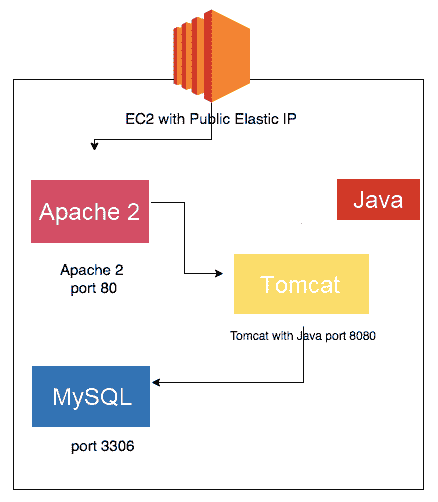

让我们创建一个示例应用程序，允许我们进行拆分和扩展：

我们在前面的章节中学习了如何使用 Terraform。为了构建 EC2 实例和安全组，可以使用名为 **monolith application** 的模块。如要在你的账户中使用它，需要更改初始化参数并提供你的个人信息：`* vpc-id * subnet * pem` 密钥。至于 AMI，你可以根据以下截图中的提示找到合适的 AMI。这个示例是在北弗吉尼亚 Amazon 区域和 Amazon Linux 2 操作系统上测试的。找到你所在区域的 AMI ID，如以下截图所示：

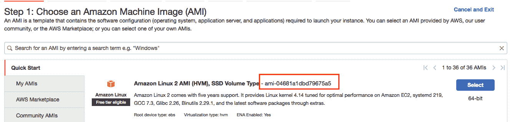

```
module "monolith_application" {
  source = "github.com/giuseppeborgese/effective_devops_with_aws__second_edition//terraform-modules//monolith-playground"
  my_vpc_id = "${var.my_default_vpcid}"
  my_subnet = "subnet-54840730"
  my_ami_id = "ami-04681a1dbd79675a5"
  my_pem_keyname = "effectivedevops"
}
```

创建模块的命令总是如下所示：

```
terraform init -upgrade
terraform plan -out /tmp/tf11.out -target module.monolith_application
terraform apply apply /tmp/tf11.out
```

你应该在输出中得到以下结果：

```
Apply complete! Resources: 3 added, 0 changed, 0 destroyed.
Outputs:
monolith_url = http://54.209.174.12/visits
```

如果你等几分钟，让应用程序运行并安装所有软件和配置，你可以在浏览器中输入 URL，看到如下截图所示的内容：

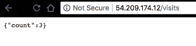

如果你收到这个结果，你需要等待几分钟。如果这不能解决错误，可能在安装过程中出了问题。错误信息如下：

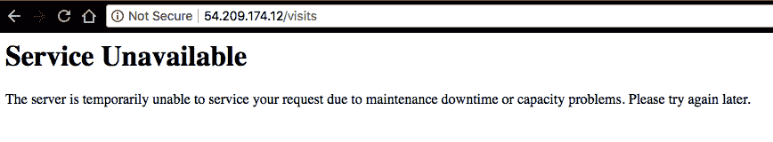

当然，你的公网 IP 地址会与此不同。每次刷新页面或从任何来源打开 URL 时，Java 应用程序都会从 MySQL 数据库读取数值，增加 1 单位的值，并写入相同的数据库字段。

值得写几行代码来查看一切是如何安装的。这个代码位于上面显示的 `monolith_application` 模块中：

以下是 `monolith_application` 的安装脚本：

```
yum -y install httpd mariadb.x86_64 mariadb-server java

systemctl start mariadb
chkconfig httpd on
chkconfig mariadb on
systemctl restart httpd
```

现在安装 MySQL（MariaDB）——这是 Amazon Linux 2 **长期支持**（**LTS**）默认仓库中提供的 MySQL 类型，同时也包含 Apache 2 和 Java 软件。

以下是我们之前开始解释的安装脚本：

```
echo "<VirtualHost *>" > /etc/httpd/conf.d/tomcat-proxy.conf
echo " ProxyPass /visits http://localhost:8080/visits" >> /etc/httpd/conf.d/tomcat-proxy.conf
echo " ProxyPassReverse /visits http://localhost:8080/visits" >> /etc/httpd/conf.d/tomcat-proxy.conf
echo "</VirtualHost>" >> /etc/httpd/conf.d/tomcat-proxy.conf
```

Apache 已配置为将流量转发到 `8080` 端口上的 Tomcat。

为了以非交互方式设置 MySQL，我使用了以下几行代码来为 Java 应用程序创建数据库、表和用户：

```
mysql -u root -e "create database demodb;"
mysql -u root -e "CREATE TABLE visits (id bigint(20) NOT NULL AUTO_INCREMENT, count bigint(20) NOT NULL, version bigint(20) NOT NULL, PRIMARY KEY (id)) ENGINE=InnoDB DEFAULT CHARSET=latin1;" demodb
mysql -u root -e "INSERT INTO demodb.visits (count) values (0) ;"
mysql -u root -e "CREATE USER 'monty'@'localhost' IDENTIFIED BY 'some_pass';"
mysql -u root -e "GRANT ALL PRIVILEGES ON *.* TO 'monty'@'localhost' WITH GRANT OPTION;"
```

`user_data` 脚本位于 `module_application` 中，并作为参数提供给 `user_data` 字段。它下载一个示例 Java 应用程序，将结果保存到数据库中。为了简化安装，`.jar` 文件中还包含了 Tomcat。这对于实验环境是可以接受的，但不适合实际使用：

```
runuser -l ec2-user -c 'cd /home/ec2-user ; curl -O https://raw.githubusercontent.com/giuseppeborgese/effective_devops_with_aws__second_edition/master/terraform-modules/monolith-playground/demo-0.0.1-SNAPSHOT.jar'
runuser -l ec2-user -c 'cd /home/ec2-user ; curl -O https://raw.githubusercontent.com/giuseppeborgese/effective_devops_with_aws__second_edition/master/terraform-modules/monolith-playground/tomcat.sh'
cd /etc/systemd/system/ ; curl -O https://raw.githubusercontent.com/giuseppeborgese/effective_devops_with_aws__second_edition/master/terraform-modules/monolith-playground/tomcat.service
chmod +x /home/ec2-user/tomcat.sh
systemctl enable tomcat.service
systemctl start tomcat.service
```

为了让 Tomcat 在启动时作为服务运行，`.jar` 文件和配置文件会被下载，并且配置会自动完成。

无论如何，`playground` 应用程序的目的是保存其计算结果（称为**状态**）到数据库中。每次访问该 URL 时，状态会从数据库中读取、递增并重新保存。

# 关联一个 DNS 名称

这对练习来说不是必须的，但如果你有公共域名注册，你可以创建一个 **A 记录**。

你需要像我一样注册一个 Route 53 公共域名：`devopstools.link`。如果你不知道如何注册，可以访问[`docs.aws.amazon.com/Route53/latest/DeveloperGuide/domain-register-update.html`](https://docs.aws.amazon.com/Route53/latest/DeveloperGuide/domain-register-update.html)并按照那里的说明进行操作。根据我的经验，你需要等待大约 30 分钟到两个小时，新域名就可以使用了。要创建记录，请按照以下步骤操作：

1.  前往 Route53 | 托管区，选择你的区域

1.  点击“创建记录集”按钮

1.  输入一个名称并选择 `bookapp` 名称

1.  输入你的 EC2 机器的公网 IP 地址

1.  点击“创建”按钮，如下图所示：

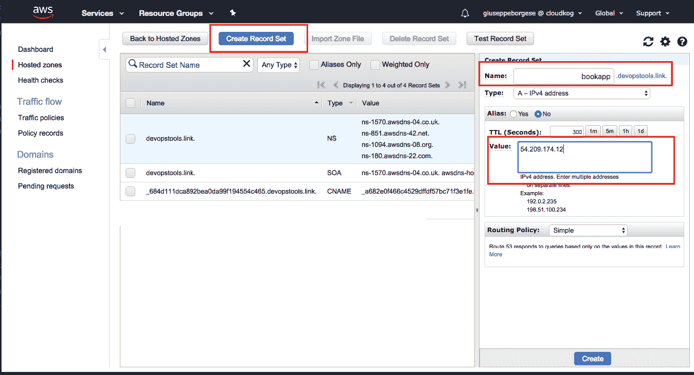

1.  现在你可以使用此记录来查询应用程序：

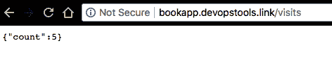

# 扩展单体应用程序

我们现在已经创建了基础设施并部署了应用程序，它运行良好。如果这个应用程序对大量用户有用，用户数量、请求量和数据量有可能会迅速增长。这正是每个应用程序所有者所希望的。

可能我们选择的 EC2 已经无法有效管理大量数据。也有可能出现以下情况：

+   CPU 或内存不足以支持我们的三大程序：Apache、Tomcat 和 MySQL

+   EC2 虚拟机的带宽不足以处理大量的并发请求

+   Tomcat 或 MySQL 需要为每个用户存储数据，而磁盘空间已不足以支持更多数据。

+   MySQL 和 Tomcat 需要同时从单个磁盘读取大量数据。此外，单个磁盘还需要进行上下文切换。

扩展应用程序有两种方式，分别是：

+   垂直扩展，这意味着使用更强大的 EC2 实例，从而获得更多的 CPU、更大的内存和更好的网络性能

+   水平扩展，这意味着添加更多的 EC2 实例，同时运行相同的代码，并将流量负载均衡地分配到这些实例上

现在我们有的是单体架构，所以我们只能进行垂直扩展。在接下来的部分，我们将把单体架构拆分成不同的部分，将*状态*从 EC2 虚拟磁盘中移除。这样，我们可以添加更多的机器，并且使用 CDN 在负载均衡器和数据库之间分配负载。

要对单体架构进行垂直扩展，您需要按照以下步骤进行：

1.  从[`aws.amazon.com/ec2/instance-types/`](https://aws.amazon.com/ec2/instance-types/)列表中选择一个新的实例类型。

1.  关闭实例。

1.  更改实例类型：

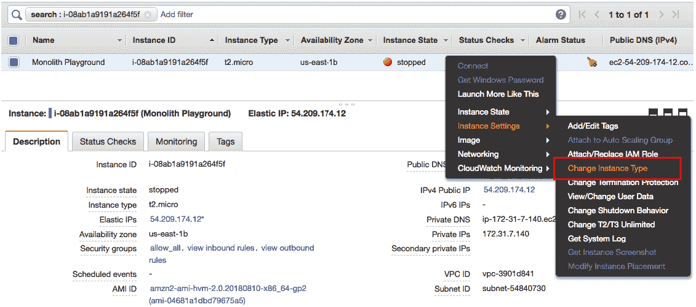

1.  开启实例。

对于磁盘空间而言，这有点复杂。这里，你必须扩展大小。具体步骤如下：

1.  关闭机器以避免日期不一致。

1.  分离每个附加到实例的卷。然而，在此之前，请记录所使用的设备：`/dev/sda1` 或 `/dev/xdc` 等等。

1.  为每个附加到实例的卷创建快照。

1.  对于前一步创建的每个快照，创建一个新卷。你需要指定卷的所需大小。

1.  使用与第 2 步相同的设备名称，将每个新卷附加到实例。

1.  开启机器。

1.  登录到机器并使用 Linux 和 Windows 的指南调整文件系统大小。有关更多细节，请参阅章节末尾的*进一步阅读*部分。

# 单体架构的优点

在拆分并扩展我们的单体架构之前，重要的是要了解是否值得为我们的应用程序付出努力。让我们来看看单一块架构的所有优点：

+   第一个优点肯定是基础设施成本。在这里，我们将其拆分成多个可扩展的部分，但这意味着我们需要为架构的每个部分付费。最终的基础设施成本将高于单一的单体架构。

+   构建一个多层可扩展架构的成本肯定比单体架构要复杂得多。这意味着需要更多的时间来构建，并且需要更多的技能来完成。此书的目的之一就是缩小这些技能差距。

+   一个分布式架构需要许多设置。例如，正确配置安全组，选择合适的负载均衡器，选择合适的 RDS，以及配置 S3 或 EFS 以将状态从虚拟磁盘中移出。唯一的例外是 SSL 配置。使用 AWS 证书管理器配置 SSL 比购买并为 Apache 配置 SSL 证书要容易得多。

所以，如果你预期流量不大，预算有限，你可以考虑构建一个*单体*架构来托管你的 Web 应用程序。当然，请记住，当你想垂直扩展时，需要接受可扩展性限制和停机时间。

# 数据库

现在我们已经了解了单体应用的优缺点，并决定将应用拆分成多个部分，是时候将第一个资源移出单体应用了。

正如我们在本章第一节中预期的那样，必须将数据（也称为*状态*）移出 EC2 机器。在某些 web 应用中，数据库是唯一的数据源。然而，在其他一些应用中，还可能有从用户上传的文件直接保存到磁盘上的数据，或者如果使用如**Apache Solr**这样的索引引擎，也可能会有索引文件。有关更多信息，请参阅[`lucene.apache.org/solr/`](http://lucene.apache.org/solr/)。

如果可能的话，使用云服务总是比在虚拟机中安装程序更方便。对于数据库，RDS 服务([`aws.amazon.com/rds/`](https://aws.amazon.com/rds/))提供了一个大型的开源或闭源数据库集合（Amazon Aurora、PostgreSQL、MySQL、MariaDB、Oracle 和 Microsoft SQL Server），因此，如果你需要**IBM Db2**，[`www.ibm.com/products/db2-database`](https://www.ibm.com/products/db2-database)，你可以使用 RDS 服务来托管你的数据库。

要创建我们的 MySQL RDS 实例，请参考官方注册表中的模块：[`registry.terraform.io/modules/terraform-aws-modules/rds/aws/1.21.0:`](https://registry.terraform.io/modules/terraform-aws-modules/rds/aws/1.21.0)

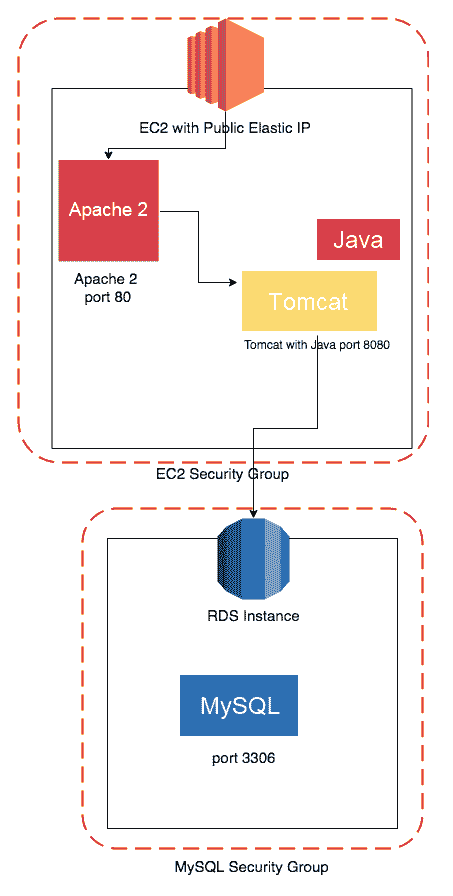

需要注意的是，在拆分应用时，必须正确配置安全组，以允许从 EC2 实例通过端口`3306`访问 RDS 实例。这也有助于避免不必要的数据库访问。

对于子网，必须为 EC2 实例保留一个公共子网。而对于 RDS 实例，选择私有子网更加方便。我们将在第八章《*硬化*你的 AWS 环境的安全性》中深入探讨这一话题。

# 将数据库迁移到 RDS

要创建 MySQL 数据库，我们可以使用一个公共模块，该模块可在官方仓库中找到，链接如下：[`registry.terraform.io/modules/terraform-aws-modules/rds/aws/1.21.0`](https://registry.terraform.io/modules/terraform-aws-modules/rds/aws/1.21.0)。

在以下代码中，我将稍微简化原始示例，并添加一个安全组，如下所示。请参阅`main.tf`文件：

```
resource "aws_security_group" "rds" {
  name = "allow_from_my_vpc"
  description = "Allow from my vpc"
  vpc_id = "${var.my_default_vpcid}"

  ingress {
    from_port = 3306
    to_port = 3306
    protocol = "tcp"
    cidr_blocks = ["172.31.0.0/16"]
  }
}

module "db" {
  source = "terraform-aws-modules/rds/aws"
  identifier = "demodb"
  engine = "mysql"
  engine_version = "5.7.19"
  instance_class = "db.t2.micro"
  allocated_storage = 5
  name = "demodb"
  username = "monty"
  password = "some_pass"
  port = "3306"

  vpc_security_group_ids = ["${aws_security_group.rds.id}"]
  # DB subnet group
  subnet_ids = ["subnet-d056b4ff", "subnet-b541edfe"]
  maintenance_window = "Mon:00:00-Mon:03:00"
  backup_window = "03:00-06:00"
  # DB parameter group
  family = "mysql5.7"
  # DB option group
  major_engine_version = "5.7"
}

the plan shows 5 these 5 resources to add 

  + aws_security_group.rds

  + module.db.module.db_instance.aws_db_instance.this

  + module.db.module.db_option_group.aws_db_option_group.this

  + module.db.module.db_parameter_group.aws_db_parameter_group.this

  + module.db.module.db_subnet_group.aws_db_subnet_group.this

Plan: 5 to add, 0 to change, 0 to destroy.
```

因为 RDS 需要在选项组、参数组和子网组中运行。

你可以在 RDS 控制台中看到新实例，并点击它以查看其属性，如下所示：

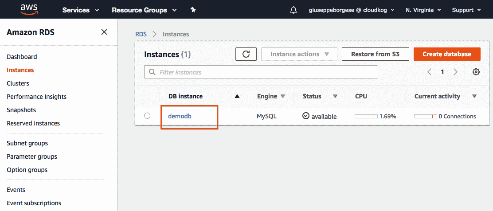

一旦打开所选实例的属性，注意记录 Endpoint 字段的值，如以下截图所示：

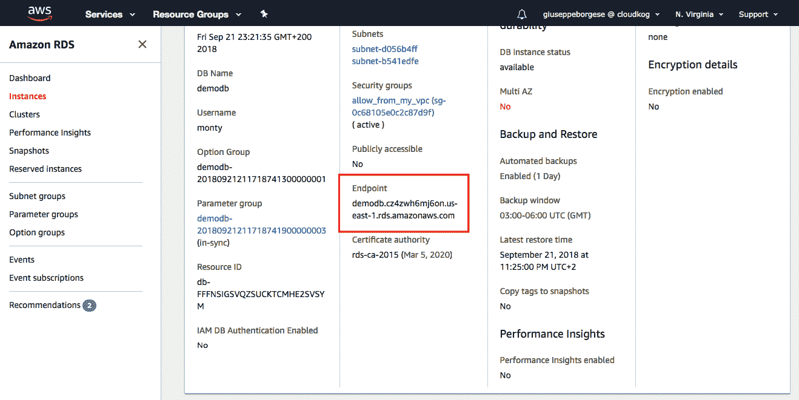

在我的例子中，这个资源是`demodb.cz4zwh6mj6on.us-east-1.rds.amazonaws.com`**。**

通过 SSH 连接到 EC2 机器，并尝试连接到 RDS：

```
[ec2-user@ip-172-31-7-140 ~]$ mysql -u monty -psome_pass -h demodb.cz4zwh6mj6on.us-east-1.rds.amazonaws.com
Welcome to the MariaDB monitor. Commands end with ; or \g.
Your MySQL connection id is 7
Server version: 5.7.19-log MySQL Community Server (GPL)

Copyright (c) 2000, 2018, Oracle, MariaDB Corporation Ab and others.

Type 'help;' or '\h' for help. Type '\c' to clear the current input statement.
```

运行`show databases`命令查看是否有`demodb`模式：

```

 MySQL [(none)]> show databases;
 +--------------------+
 | Database |
 +--------------------+
 | information_schema |
 | demodb |
 | innodb |
 | mysql |
 | performance_schema |
 | sys |
 +--------------------+
 6 rows in set (0.00 sec)
MySQL [(none)]> exit
Bye
[ec2-user@ip-172-31-7-140 ~]$
```

要转移数据库，请按照以下步骤操作：

1.  使用`pkill` java 命令关闭 Java 进程

1.  使用以下命令转储本地数据库：

```
 mysqldump -u monty -psome_pass -h localhost demodb > demodbdump.sql
```

1.  我们不再需要本地数据库，因此使用以下命令停止它：

```
sudo service mariadb stop
```

1.  现在使用以下命令在 RDS 中恢复转储：

```
 mysql -u monty -psome_pass -h demodb.cz4zwh6mj6on.us-east-1.rds.amazonaws.com demodb < demodbdump.sql
```

1.  检查内容是否已正确复制，如下所示：

```
mysql -u monty -psome_pass -h demodb.cz4zwh6mj6on.us-east-1.rds.amazonaws.com
Welcome to the MariaDB monitor. Commands end with ; or \g.
Your MySQL connection id is 12
Server version: 5.7.19-log MySQL Community Server (GPL)

Copyright (c) 2000, 2018, Oracle, MariaDB Corporation Ab and others.

Type 'help;' or '\h' for help. Type '\c' to clear the current input statement.

MySQL [(none)]> use demodb;
Reading table information for completion of table and column names
You can turn off this feature to get a quicker startup with -A

Database changed
MySQL [demodb]> select * from visits;
+----+-------+---------+
| id | count | version |
+----+-------+---------+
| 1 | 5 | 5 |
+----+-------+---------+
1 row in set (0.00 sec)
```

现在，转储已正确，你需要在`/home/ec2-user/tomcat.sh`中替换连接：

```
sudo nano /home/ec2-user/tomcat.sh
```

现在在文件中找到字符串：

```
 db_url=jdbc:mysql://localhost:3306/
```

用以下代码行替换：

```
db_url=jdbc:mysql://demodb.cz4zwh6mj6on.us-east-1.rds.amazonaws.com:3306/
```

保持其他设置不变：

```
pkill java 
systemctl start tomcat
```

现在，你应该可以看到输出并且应用程序再次正常工作。

现在，可以方便地使用以下命令删除本地数据库：

```
sudo yum remove mariadb-server 
```

# 选择 RDS 类型

如果你有一个像我们在之前示例中看到的 MySQL 引擎，你可以从以下实例类型中选择：

+   MySQL 经典版

+   Aurora MySQL

+   一种新的无服务器 Aurora MySQL，详见：[`aws.amazon.com/rds/aurora/serverless/`](https://aws.amazon.com/rds/aurora/serverless/)

在大多数情况下，MySQL 经典版是理想选择。然而，如果你知道将会有大量数据需要管理，那么 Aurora MySQL 是理想的选择。这个无服务器选项适用于**不常用**、**可变**和**不可预测**的工作负载。

# 备份

启用 RDS 实例的备份并选择 Windows 作为备份类型非常重要。当你预期数据库的写入负载较低时，这一点尤为重要，因为备份将会在没有停机的情况下完成，但它也可能影响性能。有关 Amazon RDS 最佳实践的更多信息，请参考[`docs.aws.amazon.com/AmazonRDS/latest/UserGuide/CHAP_BestPractices.html`](https://docs.aws.amazon.com/AmazonRDS/latest/UserGuide/CHAP_BestPractices.html)。

你可以设置每日备份，并保留最多 35 个快照。在恢复时，你可以选择这 35 个快照中的任意一个，或者选择这 35 天内的任何时刻，使用新的时间点恢复功能。有关更多信息，请参考[`docs.aws.amazon.com/AmazonRDS/latest/UserGuide/USER_PIT.html`](https://docs.aws.amazon.com/AmazonRDS/latest/UserGuide/USER_PIT.html)。

# 多可用区

可用的多可用区（Multi-AZ）功能，详见[`aws.amazon.com/rds/details/multi-az/`](https://aws.amazon.com/rds/details/multi-az/)，在另一个**可用区**（**AZ**）中使用**主从**技术维护 RDS 实例的第二个副本。如果主实例出现问题（或所在 AZ 的整个区域出现问题），DNS 名称将自动切换到从实例。使用此功能，两个 RDS 实例将始终保持在线。此外，成本将翻倍。因此，建议仅在生产环境中使用此功能。

在下图中，展示了一个多可用区架构：

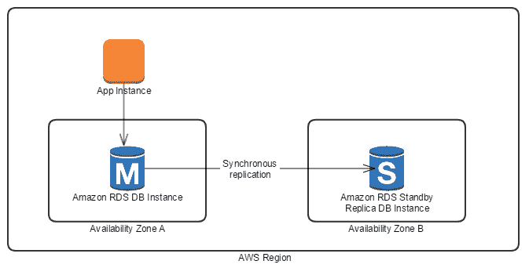

# ElastiCache

你可以考虑为你的数据库插入缓存，以减少 RDS 实例的负载。这将引入另一个基础设施组件，并且需要更改软件代码，以便使其能够使用缓存，而不仅仅是使用 RDS。根据你需要保存的数据类型，AWS 的 ElastiCache 服务可提供两种类型：[`aws.amazon.com/elasticache/`](https://aws.amazon.com/elasticache/)：**Redis** 和 **Memcached**。

# 弹性负载均衡器（ELB）

在本节中，我们将用 ELB 替换 Apache，并且还将添加一个 SSL 证书，如下图所示：

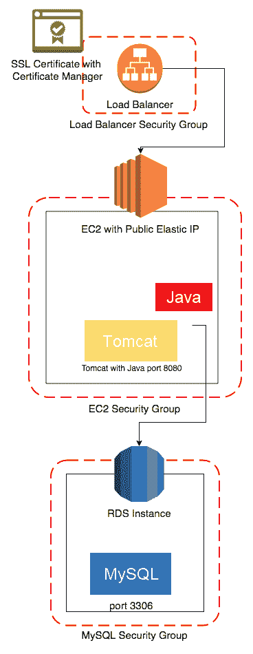

正如我们在前一节中为 RDS 所做的那样，在这里用一个托管服务替换安装在 EC2 机器上的软件是很方便的。

我们将从以下特性中受益：

+   在多个可用区部署并提高可靠性

+   一个 Web 界面来管理代理，而不是 Apache 配置文件

+   一个完全可管理的服务，不需要执行软件升级

+   可扩展性以处理请求（在某些情况下需要预热）

+   方便将日志存储在 S3 桶中

或者，当你使用 ELB 时，需要遵循 AWS 方法，不能自由定制。Apache 是 Web 服务器的瑞士军刀；它有许多模块，使得可以执行各种不同的操作和任务。使用 ELB 时，可能会丧失一些有用的功能，比如从 HTTP 重定向到 HTTPS。

# 选择合适的 ELB

正如 AWS 文档中所述，[`aws.amazon.com/elasticloadbalancing`](https://aws.amazon.com/elasticloadbalancing)，ELB 有两个版本和三种类型可供选择：

+   版本 1：**经典负载均衡器**（**CLB**）

+   版本 2：**应用程序负载均衡器**（**ALB**）和**网络负载均衡器**（**NLB**）

每个产品可以按以下方式进行描述：

+   CLB 是弹性负载均衡器的第一个版本，于 2009 年春季发布。有关此版本的更多信息，请参阅 [`aws.amazon.com/blogs/aws/new-aws-load-balancing-automatic-scaling-and-cloud-monitoring-services/`](https://aws.amazon.com/blogs/aws/new-aws-load-balancing-automatic-scaling-and-cloud-monitoring-services/)。它是最受欢迎的负载均衡器之一，但也是功能最少的。

+   ALB 在 2016 年夏季发布。如需更多信息，请参阅 [`aws.amazon.com/blogs/aws/new-aws-application-load-balancer/`](https://aws.amazon.com/blogs/aws/new-aws-application-load-balancer/)。这扩展了 CLB 版本 1，增加了许多新特性。

+   NLB 于 2017 年 9 月发布。有关更多信息，请参见 [`aws.amazon.com/blogs/aws/new-network-load-balancer-effortless-scaling-to-millions-of-requests-per-second/`](https://aws.amazon.com/blogs/aws/new-network-load-balancer-effortless-scaling-to-millions-of-requests-per-second/)。它是 ALB 的补充，更侧重于网络层面。

如果你想比较这三种产品的所有功能，可以查看 [`aws.amazon.com/elasticloadbalancing/details/#compare`](https://aws.amazon.com/elasticloadbalancing/details/#compare) 上的对比表。不过，让我们尝试将这些差异总结如下：

+   除非你有 EC2 经典网络，否则不应该再创建 CLB。在这种情况下，你应该尽快考虑迁移到 VPC 网络类型。你还需要了解 CLB，因为它是 AWS 云环境中最流行的产品。

+   如果你需要管理 HTTP/HTTPS 连接——这适用于大多数 Web 应用程序——你应该使用 ALB。

+   如果你需要管理 TCP 连接，或者需要控制负载均衡器的公网 IP，那么 NLB 是正确的选择。请记住，使用这种类型的负载均衡器时，无法使用 SSL 功能。

在我们的示例中，部署的正确负载均衡器是 ALB。这是因为我们希望使用 HTTP/S 协议的 Web 应用程序，并且希望在其中安装 SSL 证书。

# 部署负载均衡器

现在我们知道该做什么了，接下来是根据这些步骤调整我们的应用程序以适配负载均衡器：

1.  配置安全组，允许从负载均衡器访问 EC2 机器的 `8080` 端口。ALB ==> `8080` EC2（我们指的是从应用程序负载均衡器到 EC2 机器的连接）。为了简化，我们将允许整个 VPC **无类域间路由** (**CIDR**) 访问。

1.  创建 ALB，连接到 EC2 机器，并验证机器是否处于服务状态。

1.  现在你可以将 DNS 记录从 EC2 机器的公网 IP 更改为负载均衡器的别名。

1.  从机器中移除 Apache 软件；你不再需要它了。

在每个环境中，将负载均衡器部署到多个属于不同 AZ 的子网中是很方便的。记住，每个可用区就像一个数据中心，数据中心总是可能出现问题。多个可用区部署不会增加成本，和 RDS 不同，后者如果使用多 AZ 会双倍增加成本。

在 第五章*，添加持续集成和持续部署* 中，我们将使用 Terraform 来创建 ALB。在这里，我们将通过 Web 控制台执行这些更改，以便了解每个步骤的细节。

# 第一步 - 打开来自整个 VPC CIDR 的 8080 端口访问

如下所示，打开来自整个 VPC CIDR 的 8080 端口访问：

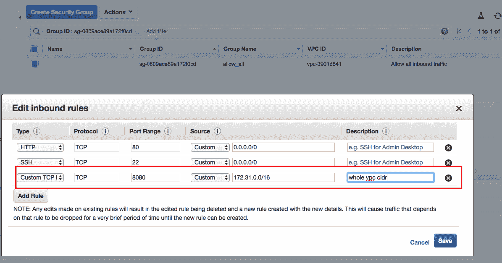

# 步骤 2 – 创建 ALB 并关联到 EC2 实例

创建 ALB 并将其关联到 EC2 实例，如下所示：

进入负载均衡器 | 创建负载均衡器，并在应用程序负载均衡器部分点击创建按钮，选择 ALB，如下图所示：

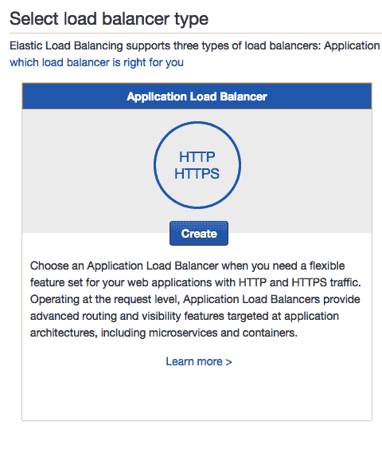

从方案部分选择面向互联网选项。这一点很重要，因为我们希望它可以从全球访问，同时我们还需要至少两个不同可用区（AZ）的子网：

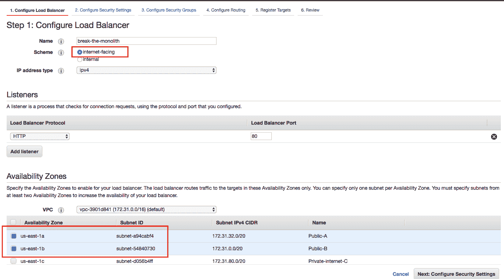

忽略以下消息：

```
Improve your load balancer's security. Your load balancer is not using any secure listener.
```

接下来，我们将添加一个安全监听器。

为此，点击创建新安全组单选按钮，为此负载均衡器打开 HTTP 的端口 `80`：

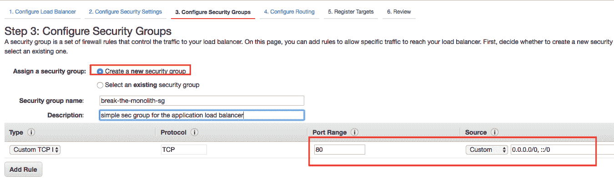

现在创建一个新的目标组。在该组中，请求会轮换并到达 EC2 实例。端口 `8080` 是 EC2 实例中 Tomcat 软件的端口。

我们的 `playground` 应用只有一个 URL，叫做 `/visits`，因此我们需要插入该 URL，每次健康检查执行时，数据库中的计数器会递增。在真实环境中，你需要一个通过读取数据库而非写入数据库来进行控制的健康检查，如下面的示例所示。在这个示例中，使用这种方法是可以接受的：

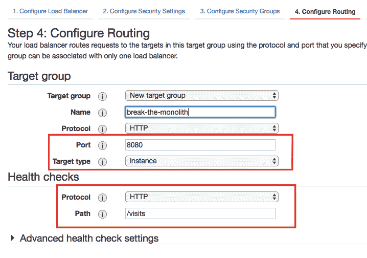

选择 EC2 实例并点击“添加到注册”按钮，如下图所示：

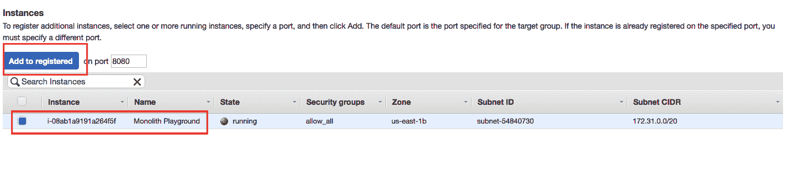

该实例将被添加到注册的目标列表中：

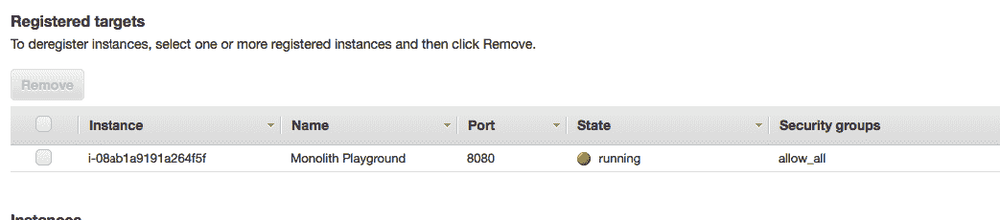

如果现在检查刚创建的目标组中的目标选项卡，你会看到你的实例和状态栏。如果状态在半分钟内没有变为健康，可能是配置出现了错误：

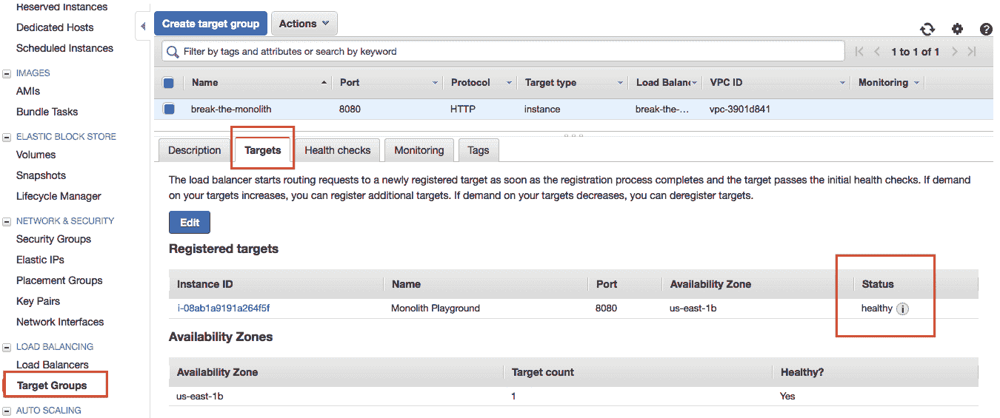

现在你可以检查负载均衡器的 URL，如下所示：`http://break-the-monolith-939654549.us-east-1.elb.amazonaws.com/visits`。

再次提醒，你的 URL 会与此不同，但此时你应该能理解它是如何工作的。

# 步骤 3 – 为 ELB 创建别名

进入新的 Route 53 区域，并用 CNAME 别名修改之前创建的 A 记录，如下图所示：

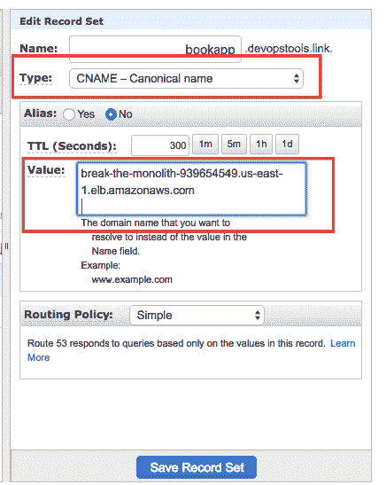

在不到 300 秒的时间内，你应该能看到更改，且 DNS 会指向新的域名。

# 步骤 4 – 从机器上移除 Apache 软件

此时，我们不再需要 EC2 实例中的 Apache 软件。要移除它，请运行以下命令：

```
sudo yum remove httpd
```

同时，清理 EC2 实例的安全组也很方便，可以移除对端口 `80` 的访问：

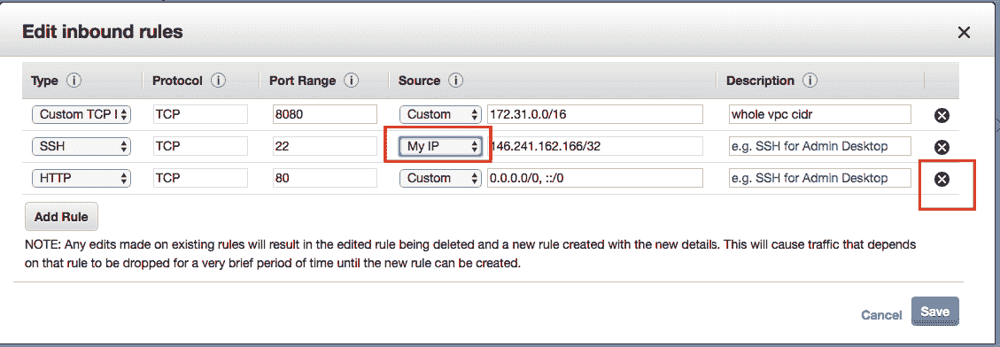

保持 SSH 对你的 IP 开放，选择我的 IP 来源选项。

# 配置 SSL 证书

你可以配置一个仅适用于某一 DNS 记录的证书，例如 `example.devopstools.link`，或者配置一个通用的证书，如 `*.devopstools.link`，它适用于每个子域。我的建议是使用 `*`，这样每次添加新资源时就不需要重复执行证书配置过程了。

证书管理器使得你可以免费获取 SSL 证书，除非你使用的是私有证书颁发机构。按照这些步骤生成 SSL 证书：

进入 AWS 证书管理器服务，并点击如下截图中所示的“Provision certificates”部分：

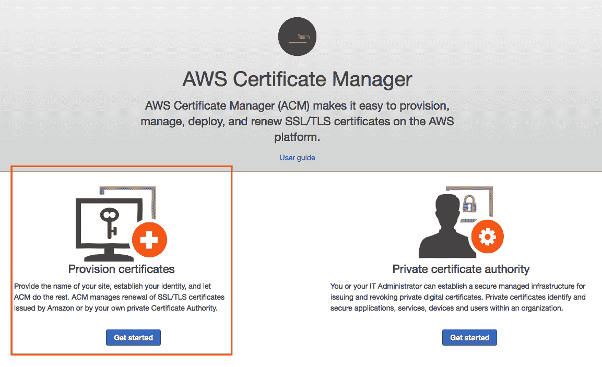

选择“Request a public certificate”选项，如下所示：

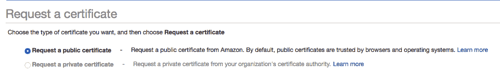

现在输入域名。在我的案例中，这包括域名和带有 `*` 的域名：

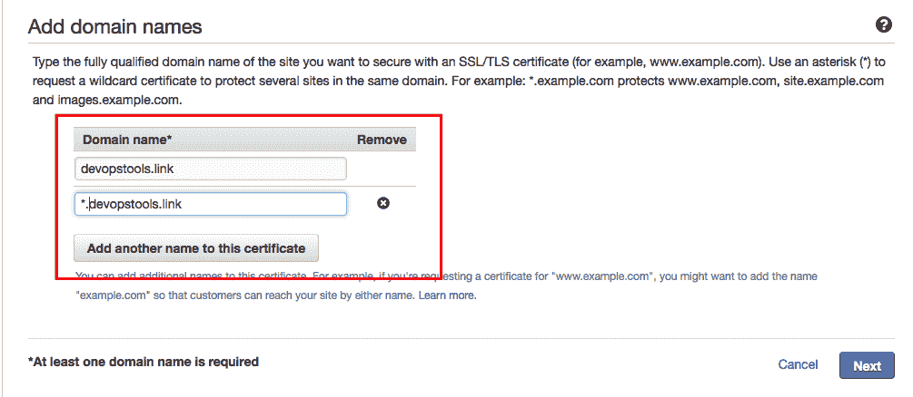

我决定使用 DNS 验证选项，但电子邮件验证选项也是可以的。在这种情况下，你需要访问用于注册域名的电子邮件地址：

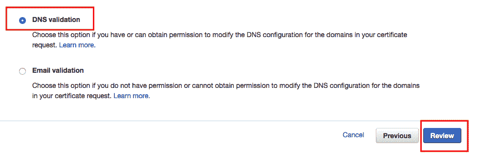

向导提示你为我们在开始时插入的每个域名创建一个 DNS 记录。在我们的案例中，这指的是两个域名（`*.devopstools.link` 和 `devopstools.link`）。你可以按照向导的提示点击“Create record in Route 53”按钮来创建记录，如下截图所示：

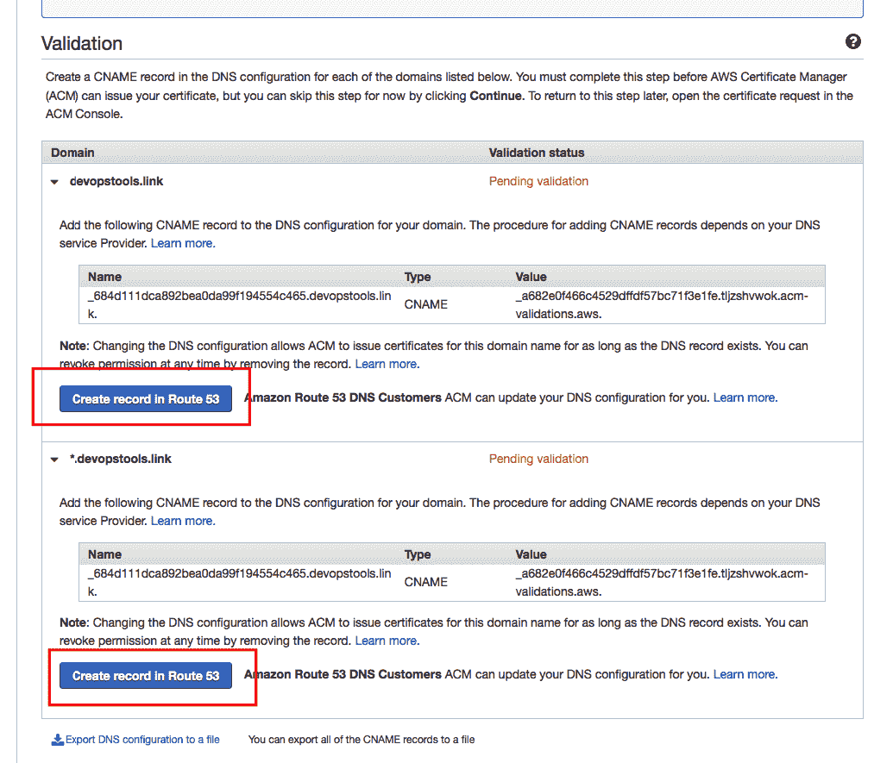

点击“Create”按钮为两个 DNS 记录创建证书。此时，创建的记录将显示出来：

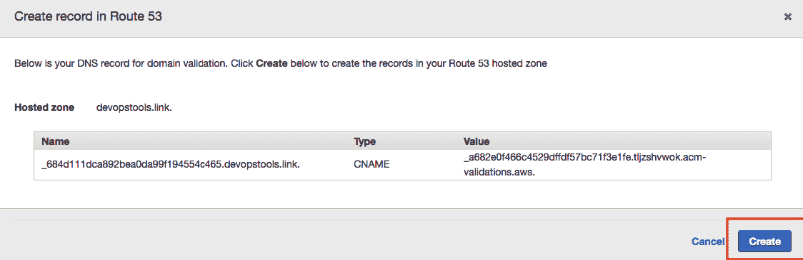

不到一分钟，新的 SSL 证书状态将显示为“已颁发”（Issued），并且可以开始使用：

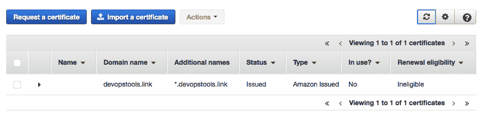

如果你以前创建过 SSL 证书，你会知道与传统方法相比，这个过程是多么简单和直接。你现在可以将新证书添加到负载均衡器中，并使用 SSL 监听器。

首先，你需要为新端口 `443` 打开 ALB 的安全组，如下截图所示：

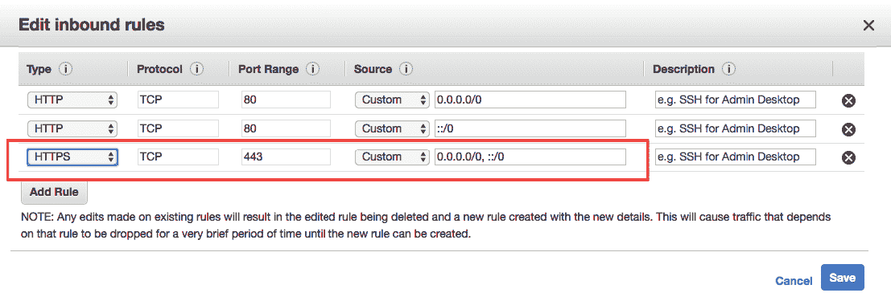

进入你的负载均衡器，然后点击“Listeners”选项卡，再点击“Add listener”按钮，如下所示：

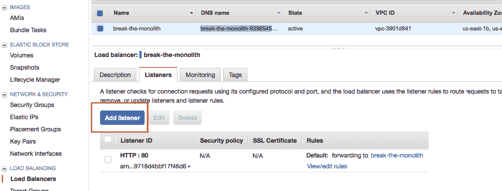

+   选择 HTTPS 协议和其默认端口 `443`

+   规则是将流量转发到创建时已定义的目标

+   最后，从“From ACM (recommended)”下拉菜单中选择之前创建的证书，如下所示：

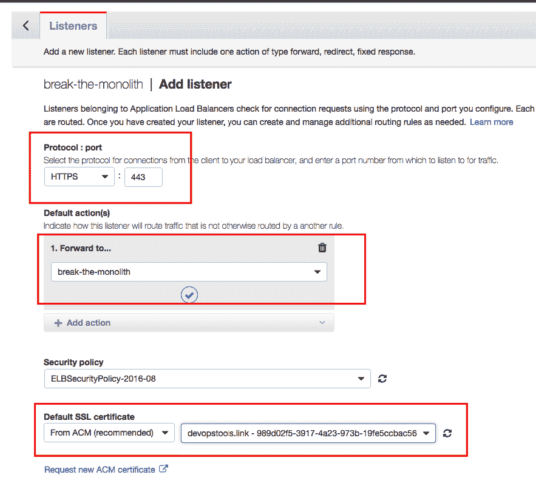

现在，你已经为应用程序创建了一个安全证书，如下所示：

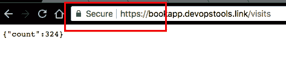

# ALB 和与 Auth0 的集成

如果您希望在用户访问由负载均衡器提供的内容之前进行身份验证，那么您可以将 ALB 与 [`auth0.com/`](https://auth0.com/) 提供的 Auth0 服务集成。这是一个云服务，旨在通过不同的身份验证方式管理用户，并提供一个通用的身份验证和授权平台，适用于 Web、移动和遗留应用程序。

如果您想尝试这个有趣的配置功能，请按照 [`medium.com/@sandrinodm/securing-your-applications-with-aws-alb-built-in-authentication-and-auth0-310ad84c8595`](https://medium.com/@sandrinodm/securing-your-applications-with-aws-alb-built-in-authentication-and-auth0-310ad84c8595) 中的指南操作。

# 预热负载均衡器

CLB 的一个著名问题是，为了管理流量峰值，需要进行预热，因为该系统是设计为扩展的，正如您在文档中可以看到的那样。我们建议您每五分钟以不超过 50% 的速率增加负载。

关于这个主题的官方声明可以在 [`aws.amazon.com/articles/best-practices-in-evaluating-elastic-load-balancing/#pre-warming`](https://aws.amazon.com/articles/best-practices-in-evaluating-elastic-load-balancing/#pre-warming) 找到。声明中提到以下内容：

"Amazon ELB 能够处理我们客户绝大多数的使用案例，而无需进行“预热”（即根据预期流量配置负载均衡器，以确保其具有适当的容量）。在某些情况下，例如预期会有突发流量，或无法配置负载测试以逐步增加流量时，我们建议您联系我们 [`aws.amazon.com/contact-us/`](https://aws.amazon.com/contact-us/)，以便对您的负载均衡器进行“预热”。我们将根据您预期的流量配置负载均衡器的适当容量。我们需要了解您的测试或预期的突发流量的开始和结束日期、每秒的预期请求速率以及您将测试的典型请求/响应的总大小。"

ALB 和 NLB 之间的区别：

+   NLB 旨在处理每秒数千万的请求，同时保持超低延迟的高吞吐量，且无需客户进行额外操作。因此，不需要预热。

+   ALB 则遵循与 CLB 相同的规则。

+   简而言之，NLB 不需要预热。然而，CLB 和 ALB 仍然需要预热。

# 访问/错误日志

配置 ELB 将访问/错误日志存储到 S3 存储桶中是一个良好的实践：

+   **对于 CLB**: [`docs.aws.amazon.com/elasticloadbalancing/latest/classic/enable-access-logs.html`](https://docs.aws.amazon.com/elasticloadbalancing/latest/classic/enable-access-logs.html)

+   **对于 ALB**：[`docs.aws.amazon.com/elasticloadbalancing/latest/application/load-balancer-access-logs.html`](https://docs.aws.amazon.com/elasticloadbalancing/latest/application/load-balancer-access-logs.html)

+   **对于 NLB**：ELB 没有这种日志，因为它在网络层级 TCP/IP 工作

# 下一步

现在，我们已经在多可用区（multi-AZ）配置了负载均衡器并启用了 SSL，同时系统是可扩展的，RDS 也部署在多可用区。然而，EC2 实例仍然位于单一可用区，因此这依然是一个单点故障，且不能自动扩展。我们需要为 EC2 部分配置自动扩展功能，但首先，如果状态仍然在机器上，我们需要将其移出。

# 将状态移出 EC2 实例

如果你的应用程序有与其状态相关的文件保存在磁盘上，你需要在应用自动扩展之前将其移除。之前保存在 EC2 实例上的文件必须移除，并由某个服务进行管理。这里有两种选择，如下所示：

+   **AWS 弹性文件系统** ([`aws.amazon.com/efs/`](https://aws.amazon.com/efs/))：简单来说，这是一个网络文件系统，安装在你的 EC2 机器上，具有几乎无限的空间，你只需为文件所占用的空间付费。

+   **AWS S3** ([`aws.amazon.com/s3/`](https://aws.amazon.com/s3/))：这是 AWS 市场上的第一个服务，是一个对象存储，旨在提供 99.999999999%的耐久性。

通常情况下，S3 应该是你的首选解决方案，但它并非总是适用，因为使用它需要修改应用软件。因此，在某些情况下，你可能需要一个可以在 EFS 上利用的替代方案。

世界上充满了围绕 S3 设计的软件和插件。例如，WordPress 默认将用户上传的文件保存到磁盘，但通过一个额外的插件，你可以将其保存到 AWS S3，并通过这种方式从 EC2 实例中移除状态。

# 推送日志

你的实例是一次性的，可以随时被替换或销毁。如果你需要应用特定的日志，你需要使用程序将日志推送到 S3 或 CloudWatch。

# 配置自动扩展

下面显示的“启动配置”和“自动扩展组”的目的是确保可扩展性和可靠性：

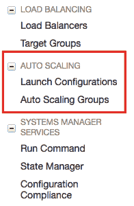

可扩展性和可靠性描述如下：

+   **可扩展性**：如果请求量/CPU 增加，系统需要进行扩展并添加实例。同样，如果流量下降，则需要移除不必要的资源。

+   **可靠性**：如果某个实例由于任何原因宕机，自动扩展系统会自动用一个新的实例替代它。

你需要快速启动实例以创建镜像，因此可以使用`user_data`选项，也可以像本章开头的单体配置中一样安装软件程序。然而，这会增加启动新实例所需的时间。

当你需要扩展时，这是因为你需要满足需求的增加，因此需要尽快执行此操作。因此，创建一个包含所有已安装软件和配置文件的镜像，然后将需要在运行时传递的参数或配置文件插入到`user_data`中是个好主意，如果有的话。

# 将我们的示例移入自动伸缩中

我们的应用现在已经准备好进行自动伸缩。在这里，状态从 EC2 中移除，仅保存在 RDS 数据库中。我们测试了负载均衡器能否访问它，并检查了它是否能够与数据库进行通信。这就是我们要创建的内容：

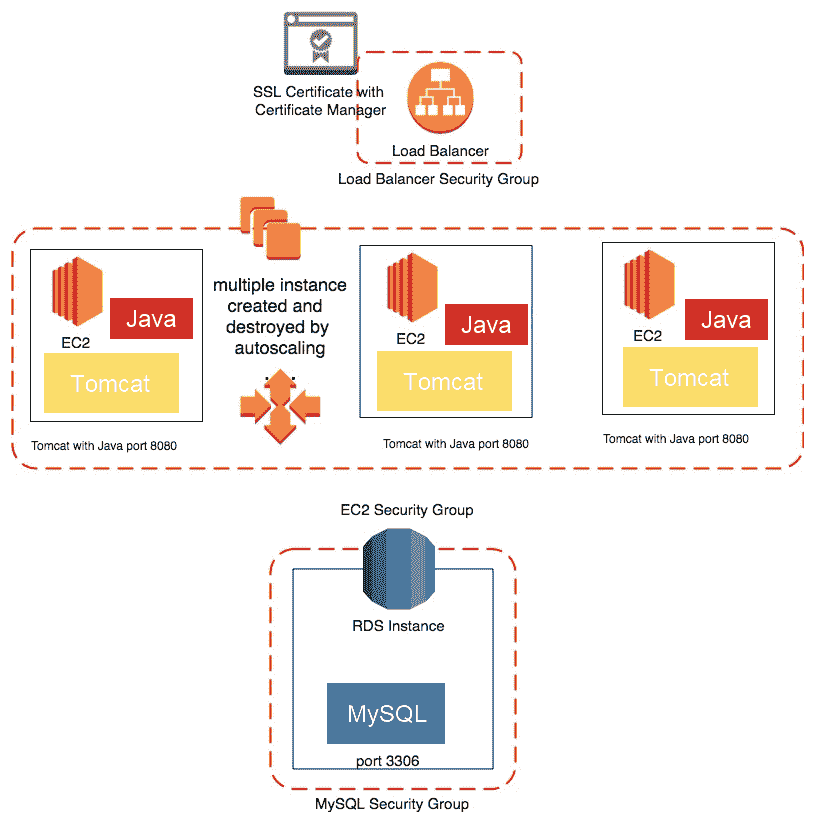

# 准备镜像

我们需要有一个 AMI，以便作为参数传递到启动配置中。为了确保你拥有一个良好的 AMI，建议首先停止机器。当机器停止时，再创建镜像。为此，右键单击镜像部分，然后点击“创建镜像”选项，如下图所示：

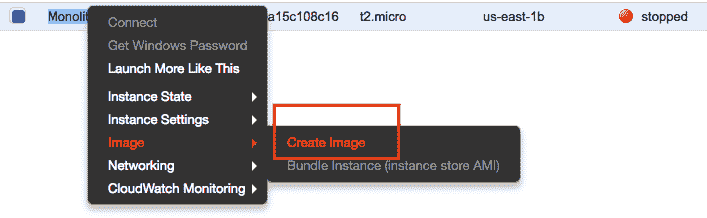

选择一个有意义的名称和描述，然后点击“创建镜像”按钮：

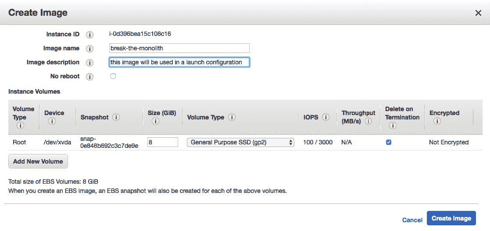

根据磁盘大小，镜像将在几分钟内可用。在我们以 8 GB 磁盘为例时，等待时间将较短。

# 使用向导启动配置部分

要启用自动伸缩过程，需要以下两个对象：

+   启动配置

+   自动伸缩组

点击“自动伸缩组”选项，自动向导将开始创建所需的资源：

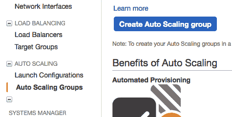

启动配置是第一步。在这里，选择“我的 AMI”选项并找到在前一步中创建的镜像，如下所示：

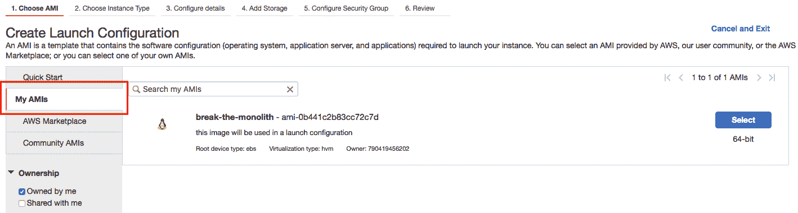

现在选择名称。在此步骤中不要修改其他任何内容：

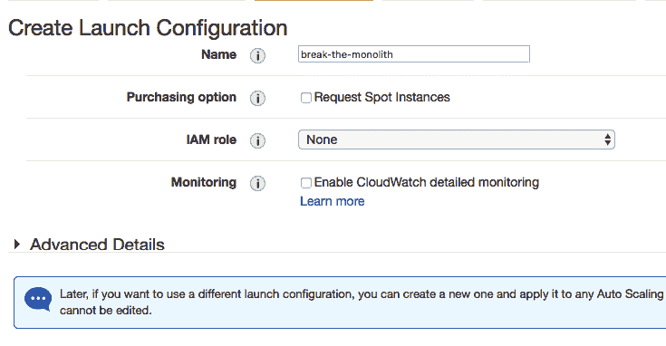

# 自动伸缩组部分

此时，向导会要求我们提供一些关于自动伸缩部分的详细信息，以便开始配置过程。可以从 1 个实例开始，首先检查一切是否正常工作。

您在自动扩展组中指定的 VPC 和子网可以与之前示例中使用的相同。但是请记住，对于 ALB，必须选择公共子网，而对于 EC2，您可以使用私有或公共子网。在第五章，*添加持续集成与持续部署*，我们关注安全性，我们将解释为何将 EC2 放置在私有子网中是有益的。

然而，现在使用任何子网都是可以的。重要的是选择多个位于不同可用区（AZ）的子网：

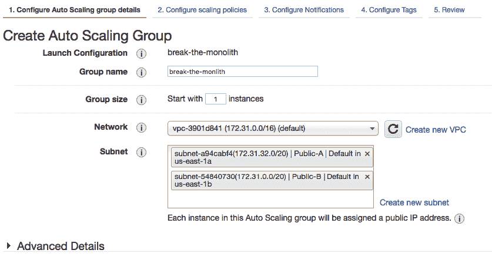

对于安全组，优先选择分配给 EC2 机器的安全组；不要创建新的安全组：

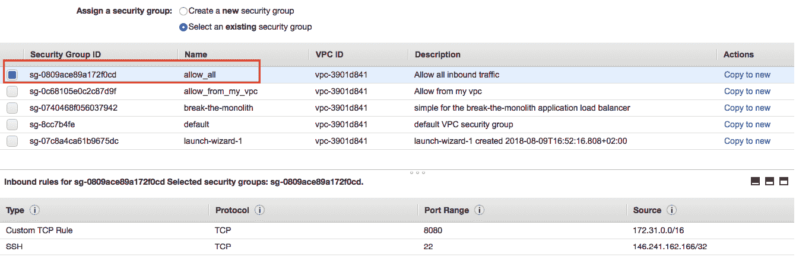

使用您拥有的密钥对来为正常的 EC2 实例进行配置。在理论上，您不需要登录到由自动扩展管理的机器。只有在出现错误且需要调试某些内容时，才需要登录并使用密钥：

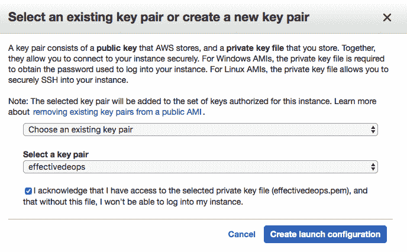

# 扩展策略

这是向导的关键部分，但这是一个稍微有些困难的阶段。扩展策略决定了是否进行扩展（向自动扩展组中添加实例）和缩减（从组中移除实例）的条件。有很多方法可以做到这一点；在这里，我选择了最简单的方法，即通过 CPU 使用率（%）：

+   如果 CPU 使用率低于 70% 且持续超过 5 分钟，添加 1 个实例

+   如果 CPU 使用率低于 40% 且持续超过 5 分钟，移除 1 个实例

当然，所选择的度量标准和数值取决于您的应用程序，但通过这个示例，您可以大致了解：

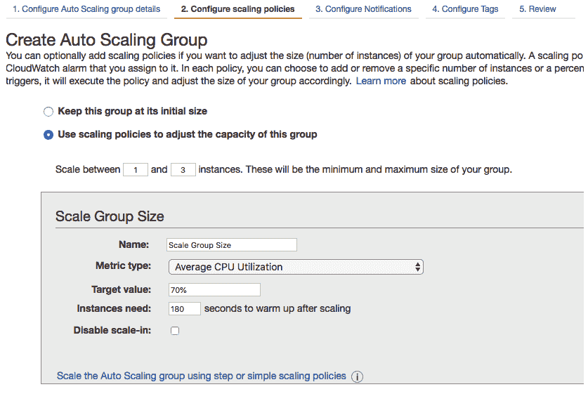

必须创建两个警报（每个规则一个），并将其关联到自动扩展组：

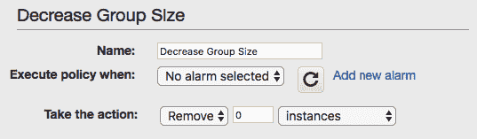

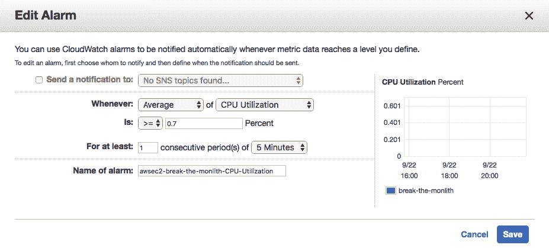

这是最终结果：

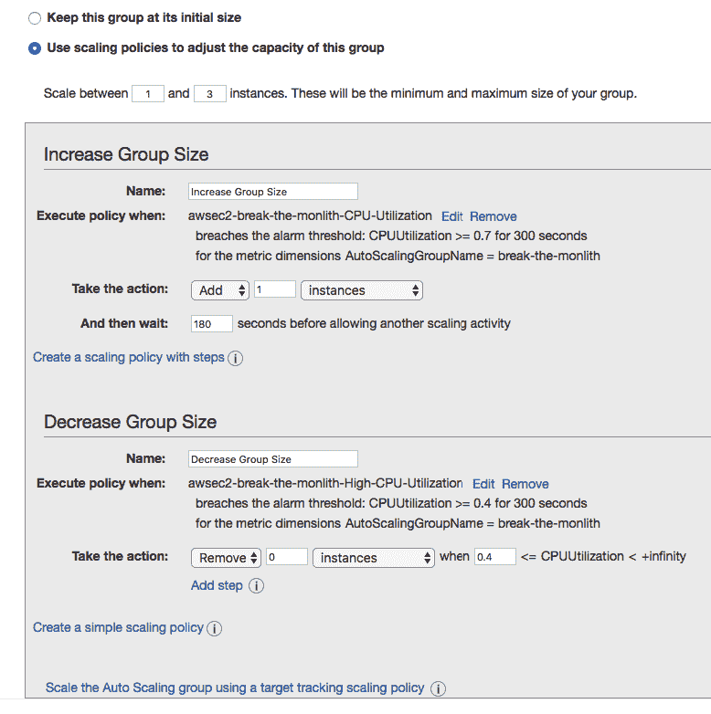

在下一步中，至少添加标签名称，以便更容易识别由自动扩展组创建的实例：

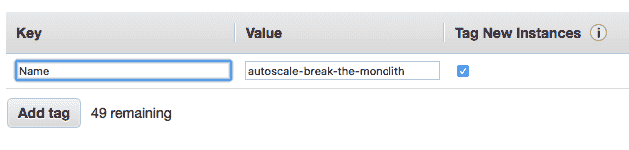

# 修改自动扩展组

如果需要修改启动配置，必须创建一个副本并在创建时进行修改，因为不允许直接修改。在自动扩展组中，可以在不重新创建的情况下进行更改。

我们需要修改自动扩展组，因为我们希望每个实例都能注册到与我们的 ALB 关联的目标组：

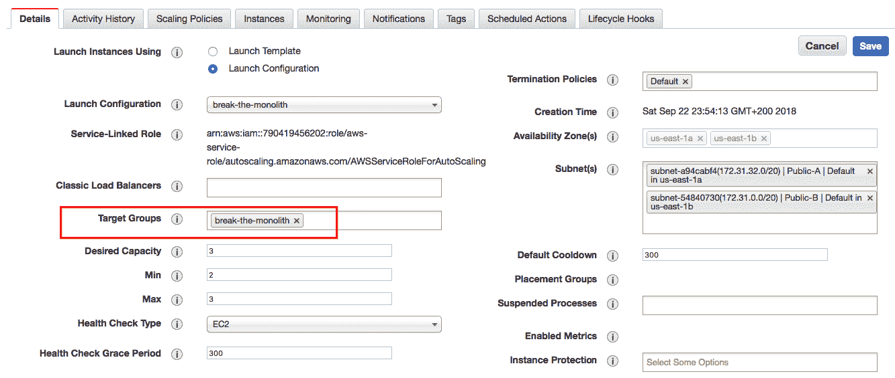

如果您想手动增加实例数量，只需修改最小大小（Min size）。请记住，所需容量（Desired Capacity）值需要介于最小值和最大值之间：

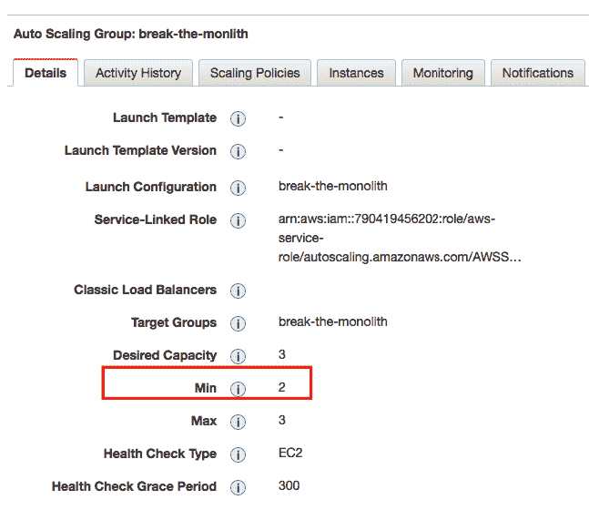

在实例中，可以看到由自动扩展组创建的新实例：

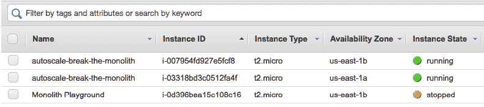

# 从负载均衡器中移除手动创建的实例

现在自动扩展功能已经生效，我们可以从负载均衡器中移除用于配置的 EC2 实例，只保留自动生成的实例。如你所见，移除实例时，它不会立即被移除，而是会进入一个短暂的“排空”状态。这样做是为了避免用户体验不佳，并处理仍可能通过该实例连接的情况：

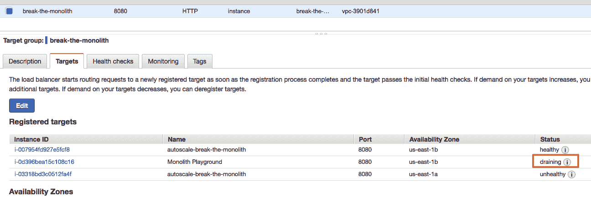

到此为止，自动扩展的配置已经完成，你现在拥有一个满足可扩展性和可靠性要求的应用。

# 使用微服务和无服务器架构

正如我们在本章测试的那样，将单体应用拆分成多个部分带来了许多优点，但也使整个系统变得更加复杂。

当我们使用微服务和无服务器架构时，这一概念变得更加明显。这是因为，如果正确使用这两种方法，确实可以提高可扩展性、增强可靠性并降低基础设施成本。然而，你总是需要考虑系统会变得更加复杂，构建和管理的难度增加。这导致构建和操作成本上升，尤其是当你的团队第一次构建和管理这种方法的系统时。

以下图像展示了微服务和无服务器架构中负载和成本的概念：

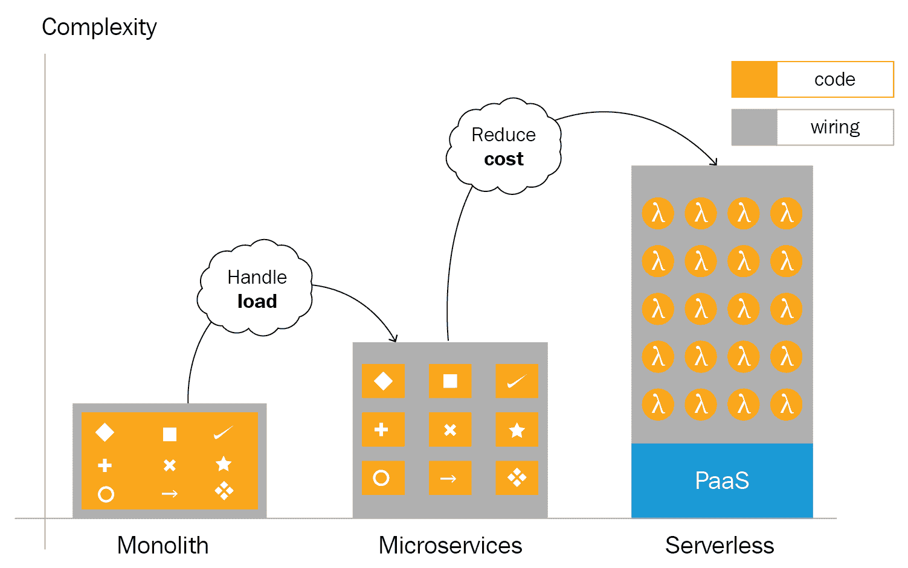

图片来源：[`medium.freecodecamp.org/serverless-is-cheaper-not-simpler-a10c4fc30e49`](https://medium.freecodecamp.org/serverless-is-cheaper-not-simpler-a10c4fc30e49)

# 总结

扩展是一个长期的过程，有可能不断改进。在本章中，我们完成了第一步，学习了如何利用 AWS 服务将一个单体应用拆分成多个部分。这种方法带来了许多优点，但也使我们的初始基础设施变得更加复杂，这意味着我们需要花费更多时间在配置、修复错误以及学习新服务上。我们已经探索了所有 AWS 工具在可扩展性方面的强大功能和实用性，但有时使用这些工具可能会比较困难，特别是第一次使用时。通过使用 Terraform 模块自动化，我们可以利用模块创建者的知识，立即实现预期的结果。此外，隐藏解决方案的复杂性并不能帮助我们理解背后发生的事情，在修复错误时，这一点尤为重要。因此，本书的某些部分，如自动扩展、ALB 和 SSL 认证，是通过使用 Web 控制台及其向导完成的。

# 问题

1.  将单体应用拆分成多层应用总是方便的吗？

1.  多层架构与微服务/无服务器架构之间有哪些区别？

1.  从安装在虚拟机中的软件迁移到服务组件时，是否可能会遇到困难？

1.  负载均衡器能在没有任何干预的情况下管理任何流量高峰吗？

1.  使用证书管理器而不是经典的 SSL 认证机构能节省费用吗？

1.  为什么将资源分布在多个可用区（AZ）中很重要？

# 深入阅读

欲了解更多信息，请阅读以下文章：

+   **更改实例类型**：[`docs.aws.amazon.com/AWSEC2/latest/UserGuide/ec2-instance-resize.html`](https://docs.aws.amazon.com/AWSEC2/latest/UserGuide/ec2-instance-resize.html)

+   **调整卷大小后扩展 Linux 文件系统**：[`docs.aws.amazon.com/AWSEC2/latest/UserGuide/recognize-expanded-volume-linux.html`](https://docs.aws.amazon.com/AWSEC2/latest/UserGuide/recognize-expanded-volume-linux.html)

+   **调整卷大小后扩展 Windows 文件系统**：[`docs.aws.amazon.com/AWSEC2/latest/WindowsGuide/recognize-expanded-volume-windows.html`](https://docs.aws.amazon.com/AWSEC2/latest/WindowsGuide/recognize-expanded-volume-windows.html)

+   **弹性负载均衡文档**：[`aws.amazon.com/documentation/elastic-load-balancing/`](https://aws.amazon.com/documentation/elastic-load-balancing/)

+   **弹性负载均衡产品的比较**：[`aws.amazon.com/elasticloadbalancing/details/#compare`](https://aws.amazon.com/elasticloadbalancing/details/#compare)

+   **评估弹性负载均衡的最佳实践**：[`aws.amazon.com/articles/best-practices-in-evaluating-elastic-load-balancing/#pre-warming`](https://aws.amazon.com/articles/best-practices-in-evaluating-elastic-load-balancing/#pre-warming) 和 [`aws.amazon.com/articles/best-practices-in-evaluating-elastic-load-balancing/`](https://aws.amazon.com/articles/best-practices-in-evaluating-elastic-load-balancing/)

+   **Spring Boot, MySQL, JPA, Hibernate Restful CRUD API 教程**：[`www.callicoder.com/spring-boot-rest-api-tutorial-with-mysql-jpa-hibernate/`](https://www.callicoder.com/spring-boot-rest-api-tutorial-with-mysql-jpa-hibernate/) 该教程用于创建我们的操作平台。

+   **无服务器更便宜，但不更简单**： [`medium.freecodecamp.org/serverless-is-cheaper-not-simpler-a10c4fc30e49`](https://medium.freecodecamp.org/serverless-is-cheaper-not-simpler-a10c4fc30e49)
