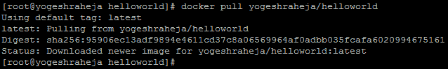

# 在 AWS 上运行容器

在第六章《**扩展你的基础架构**》中，我们的架构发生了很大的变化。我们探索了在 AWS 中扩展应用程序的不同方法，但我们遗漏的一个主要技术就是容器。容器是许多大型科技公司**软件开发生命周期**（**SDLC**）的核心。

到目前为止，我们一直使用个人电脑来开发应用程序。这对于简单的项目，如我们的 Hello World 应用程序，效果很好。然而，当涉及到有许多依赖关系的复杂项目时，情况就不同了。你是否听说过某些功能在开发者的笔记本电脑上运行正常，但在其他组织成员那里却无法运行——甚至更糟的是，*在生产环境中无法运行*？这些问题中的很多源于环境之间的差异。当我们构建我们的预发布和生产环境时，我们依赖 CloudFormation、Terraform 和 Ansible 来保持这些环境的一致性。不幸的是，我们无法轻松地将其复制到本地开发环境中。

容器解决了这个问题。通过容器，我们可以打包一个应用程序，并包括操作系统、应用程序代码以及中间所有的内容。容器还可以在稍后的阶段提供帮助，当需要突破单体架构时尤为重要。

在本章中，我们将介绍**Docker**，最受欢迎的容器技术。在简要说明 Docker 是什么以及如何使用其基本功能后，我们将对我们的应用程序进行 Docker 化。这将帮助我们理解作为开发者使用 Docker 的价值。本章将涵盖以下主题：

+   将我们的 Hello World 应用程序 Docker 化

+   使用 EC2 容器服务

+   更新我们的 CI/CD 管道以使用 ECS

本书涵盖了 ECS，但还提供了在 AWS 中使用 Docker 的更多选项。你还可以查看 CoreOS Tectonic（[`tectonic.com/`](https://tectonic.com/)）、Mesosphere DC/OS（[`mesosphere.com`](https://mesosphere.com/)）或 Docker Datacenter（[`www.docker.com/products/docker-datacenter`](https://www.docker.com/products/docker-datacenter)）。

# 技术要求

本章的技术要求如下：

+   Docker

+   Dockerfile

+   **EC2 容器注册表**（**ECR**）

+   **弹性容器服务**（**ECS**）

+   **应用负载均衡器**（**ALB**）

+   CodeBuild

+   CodePipeline

本章中使用的代码的 GitHub 链接如下：

+   [`github.com/yogeshraheja/helloworld/blob/master/helloworld.js`](https://github.com/yogeshraheja/helloworld/blob/master/helloworld.js)

+   [`github.com/yogeshraheja/helloworld/blob/master/package.json`](https://github.com/yogeshraheja/helloworld/blob/master/package.json)

+   [`github.com/yogeshraheja/helloworld/blob/master/Dockerfile`](https://github.com/yogeshraheja/helloworld/blob/master/Dockerfile)

+   [`github.com/yogeshraheja/EffectiveDevOpsTemplates/blob/master/ecr-repository-cf-template.py`](https://github.com/yogeshraheja/EffectiveDevOpsTemplates/blob/master/ecr-repository-cf-template.py)

+   [`github.com/yogeshraheja/EffectiveDevOpsTemplates/blob/master/ecs-cluster-cf-template.py`](https://github.com/yogeshraheja/EffectiveDevOpsTemplates/blob/master/ecs-cluster-cf-template.py)

+   [`github.com/yogeshraheja/EffectiveDevOpsTemplates/blob/master/helloworld-ecs-alb-cf-template.py`](https://github.com/yogeshraheja/EffectiveDevOpsTemplates/blob/master/helloworld-ecs-alb-cf-template.py)

+   [`github.com/yogeshraheja/EffectiveDevOpsTemplates/blob/master/helloworld-ecs-service-cf-template.py`](https://github.com/yogeshraheja/EffectiveDevOpsTemplates/blob/master/helloworld-ecs-service-cf-template.py)

+   [`github.com/yogeshraheja/EffectiveDevOpsTemplates/blob/master/helloworld-codebuild-cf-template.py`](https://github.com/yogeshraheja/EffectiveDevOpsTemplates/blob/master/helloworld-codebuild-cf-template.py)

+   [`raw.githubusercontent.com/yogeshraheja/EffectiveDevOpsTemplates/master/helloworld-ecs-service-cf-template.py`](https://raw.githubusercontent.com/yogeshraheja/EffectiveDevOpsTemplates/master/helloworld-ecs-service-cf-template.py)

+   [`github.com/yogeshraheja/EffectiveDevOpsTemplates/blob/master/helloworld-codepipeline-cf-template.py`](https://github.com/yogeshraheja/EffectiveDevOpsTemplates/blob/master/helloworld-codepipeline-cf-template.py)

# 将我们的 Hello World 应用程序 Docker 化

Docker 和容器总体来说是非常强大的工具，值得深入探索。通过结合资源隔离功能，包括**联合能力文件系统**（**UCF**），Docker 允许创建称为**容器**的包，这些容器包含运行应用程序所需的所有内容。容器像虚拟机一样是自包含的，但它们虚拟化的是操作系统本身，而不是硬件。实际上，这带来了巨大的差异。正如你现在可能已经注意到的那样，启动虚拟机（例如 EC2 实例）需要一定的时间。这是因为为了启动虚拟机，虚拟机监控器（这是创建和运行虚拟机的技术名称）必须模拟启动物理服务器、加载操作系统并通过不同运行级别所涉及的所有动作。此外，虚拟机在磁盘和内存上占据更大的空间。使用 Docker 时，附加的层几乎不可察觉，而且容器的大小可以保持非常小。为了更好地说明这一点，我们将首先安装 Docker，并稍微了解其基本用法。

# 入门 Docker

在开始使用 Docker 之前，最好先更好地理解 Docker 的概念和架构。首先，我们将讨论 Docker 在 SDLC 中的基本变化。介绍之后，我们将在计算机上安装 Docker，并学习一些使用 Docker 时最常用的命令。

# Docker 基础

理解 Docker 工作原理的最好方法是比较使用 Docker 与我们迄今为止所做的事情有什么不同：


上面的图示可以解释如下：

+   左侧的第一个堆栈表示我们迄今为止所做的工作。使用 EC2 服务，我们选择了提供 AWS Linux 的 AMI，并借助用户数据字段安装了 Ansible 来配置我们的系统。当 Ansible 启动时，它会安装并配置系统，以便稍后 CodeDeploy 可以部署并运行我们的应用程序。

+   中间的堆栈表示在 EC2 上使用 Docker 的含义。这个过程的开始方式与使用运行 AWS Linux 的 AMI 相同。然而，这次，我们不再依赖 Ansible 和 CodeDeploy，而是直接安装 Docker 服务器应用程序。之后，我们将部署 Docker 容器，这些容器将包含之前由 Ansible 和 CodeDeploy 提供的所有内容。

+   最终，这种架构的巨大优势在于我们在右侧最后一个堆栈中看到的内容。无论底层技术是什么，只要我们能运行 Docker 服务器，就能运行完全相同的容器。这意味着我们可以轻松地测试将要部署到 EC2 上的内容。类似地，如果一个 EC2 实例上的容器出现问题，我们可以拉取完全相同的容器并在本地运行，以便可能排除问题。

为了实现这一点，Docker 依赖于几个关键概念，如下图所示：


从本质上讲，Docker 运行一个守护进程，该进程加载镜像（描述应用栈的模板，包括操作系统、应用代码以及中间的一切）并在名为容器的自包含目录中运行它们。在 Docker 中工作时，作为开发人员，你的工作主要是通过在现有镜像上叠加新命令来构建新的镜像。镜像存储在外部注册表中，这些注册表可以是公共的，也可以是私有的。最终，所有的交互都通过 RESTful API 完成，通常使用命令行界面。

# Docker 实践

为了看到 Docker 的实际操作，我们将从在我们的计算机上安装 Docker 开始。Docker 的安装非常简单；你可以按照 [`dockr.ly/2iVx6yG`](http://dockr.ly/2iVx6yG) 上的说明，安装并启动适用于 Mac、Linux 和 Windows 的 Docker。Docker 提供了两个版本：Docker **社区版** (**CE**) 和 Docker **企业版** (**EE**)。在本书中，我们将专注于开源工具，并使用免费的 Docker CE 版本。再次声明，我们将演示的示例是在基于 Linux 的 Centos 7.x 发行版上进行的。如果你也使用相同的操作系统，请按照 [`docs.docker.com/install/linux/docker-ce/centos/`](https://docs.docker.com/install/linux/docker-ce/centos/) 上的说明，在本地系统上设置 Docker。当 Docker CE 安装完成后，使用 `docker` 工具验证安装的 Docker 版本。在编写本书时，`18.06` 是 Docker 的最新版本，尽管你现在在系统上可能会看到更新的版本：

```
$ docker –version
Docker version 18.06.1-ce, build e68fc7a 
```

一旦 Docker 启动并运行，我们可以如下使用它：

1.  我们要做的第一件事是从注册表中拉取一个镜像。默认情况下，Docker 会指向 Docker Hub ([`hub.docker.com`](https://hub.docker.com/))，这是 Docker 公司官方的 Docker 注册表。为了拉取一个镜像，我们将运行以下命令：

```
$ docker pull alpine 
```

我们将使用 `latest` 默认标签，如下所示：

```
Using default tag: latest
latest: Pulling from library/alpine
8e3ba11ec2a2: Pull complete
Digest: sha256:7043076348bf5040220df6ad703798fd8593a0918d06d3ce30c6c93be117e430
Status: Downloaded newer image for alpine:latest 
```

1.  几秒钟之内，Docker 会从注册表下载名为`alpine`的镜像，这是一个基于 Alpine Linux 的最小 Docker 镜像，包含完整的软件包索引。这个镜像的大小只有`4.41 MB`：

```
$ docker images
REPOSITORY  TAG     IMAGE ID      CREATED       SIZE
alpine      latest  11cd0b38bc3c  2 months ago  4.41 MB 
```

在使用 Docker 时，容器的大小很重要。因此，推荐使用较小的基础镜像，如 Alpine Linux。

1.  我们现在可以运行我们的容器。为了做到这一点，我们将从以下简单命令开始：

```
$ docker run alpine echo "Hello World" Hello World 
```

1.  表面上看，似乎并没有什么变化，我们得到的输出与没有 Docker 时运行 `echo Hello World` 得到的输出相同。实际上，幕后发生的事情更有趣；Docker 加载了我们之前拉取的 `alpine` Linux 镜像，并使用 Alpine 操作系统的 `echo` 命令打印出 `Hello World`。最后，由于 `echo` 命令完成，容器也被终止。

容器也可以以更交互的方式使用，如下所示：

+   例如，我们可以启动一个 shell 并通过以下命令与其互动：

```
$ docker run -it alpine /bin/sh
```

`-i` 选项表示交互式；它允许我们在容器中输入命令，而 `-t` 选项分配一个伪 TTY，既能看到我们输入的内容，也能看到命令的输出。

+   容器也可以通过使用 `-d` 选项在后台运行，这样可以将我们的容器从终端分离出来：

```
$ docker run -d alpine sleep 1000 c274537aec04d08c3033f45ab723ba90bcb40240d265851b28f39122199b0600 
```

该命令返回一个 64 位的容器 ID，表示正在运行 `alpine` 镜像和 `sleep 1000` 命令的容器。

+   我们可以通过使用以下命令跟踪不同的运行容器：

```
$ docker ps 
```

运行前述命令的输出如下：


+   运行中的容器可以通过`stop`选项停止，后面跟上容器的名称或 ID（根据`docker ps`命令的输出调整 ID 和名称）：

```
$ docker stop c274537aec04 c274537aec04 
```

你也可以使用以下命令：

```
$ docker stop friendly_dijkstra friendly_dijkstra 
```

+   停止的容器可以通过`start`选项重新启动，如下所示：

```
$ docker start friendly_dijkstra friendly_dijkstra 
```

+   最后，容器可以通过使用`rm`命令删除，但在删除之前请务必先停止容器：

```
$ docker stop <ID/NAME>
$ docker rm <ID/NAME> 
```

运行前述命令的输出如下：


这个简要概述应能为我们提供在阅读本章时所需的知识。我们将沿途发现更多命令，但要查看完整的选项列表，你可以使用`docker help`命令，或查阅 Docker CLI 文档，网址为[`dockr.ly/2jEF8hj`](http://dockr.ly/2jEF8hj)。通过容器运行简单命令有时很有用，但正如我们所知，Docker 的真正优势在于其能够处理任何代码，包括我们的 Web 应用程序。为了实现这一点，我们将使用 Docker 的另一个关键概念：Dockerfile。

# 创建我们的 Dockerfile

Dockerfile 是文本文件，通常与应用程序一起存放，指示 Docker 如何构建新的 Docker 镜像。通过创建这些文件，你可以告诉 Docker 从哪个 Docker 镜像开始、要复制到容器文件系统中的内容、要公开的网络端口等等。你可以在[`dockr.ly/2jmoZMw`](http://dockr.ly/2jmoZMw)找到 Dockerfile 的完整文档。我们将为我们的 Hello World 应用程序创建一个 Dockerfile，位于我们在 GitHub 仓库中创建的`helloworld`项目的根目录，使用以下命令：

```
$ cd helloworld
$ touch Dockerfile 
```

Dockerfile 的第一条指令始终是`FROM`指令。这告诉 Docker 从哪个 Docker 镜像开始。我们可以使用 Alpine 镜像，正如我们所做的那样，但我们也可以通过使用一个不仅仅是操作系统的镜像来节省一些时间。通过 Docker Hub，Docker 的官方注册表，Docker 提供了许多经过精心策划的 Docker 仓库集，这些仓库被称为**官方**。我们知道，为了运行我们的应用程序，我们需要 Node.js 和`npm`。我们可以使用 Docker CLI 查找官方的`node`镜像。为此，我们将使用`docker search`命令，并仅筛选官方镜像：

```
$ docker search --filter=is-official=true node
NAME    DESCRIPTION                                   STARS  OFFICIAL     
           AUTOMATED
node    Node.js is a JavaScript-based platform for s… 6123    [OK] 
```

或者，我们也可以使用浏览器进行搜索。结果，我们将看到相同的镜像，[`hub.docker.com/_/node/`](https://hub.docker.com/_/node/)。正如我们所见，以下截图有多个版本：


Docker 镜像总是由名称和标签组成，使用语法`name:tag`。如果省略标签，Docker 将默认使用`latest`标签。从前面的`docker pull`命令中，我们可以看到输出显示`Using default tag: latest`。在创建 Dockerfile 时，最佳实践是使用一个不会随着时间改变的显式标签（不同于`latest`标签）。

如果你正在尝试迁移一个当前运行在 AWS Linux 上的应用程序，并基于该操作系统做出一些假设，你可能想要使用官方的 AWS Docker 镜像。你可以在[`amzn.to/2jnmklF`](http://amzn.to/2jnmklF)上了解更多信息。

在文件的第一行，我们将添加如下内容：

```
FROM node:carbon
```

这将告诉 Docker 我们想要使用特定版本的`node`镜像。这意味着我们不需要安装`node`或`npm`。因为我们已经有了应用程序所需的操作系统和运行时二进制文件，所以我们可以开始考虑将我们的应用程序添加到这个镜像中。首先，我们需要在`node:carbon`镜像的文件系统上创建一个目录，用来存放我们的代码。我们可以使用`RUN`指令来完成，具体如下：

```
RUN mkdir -p /usr/local/helloworld/
```

现在，我们想要将应用程序文件复制到镜像中。我们将使用`COPY`指令来实现：

```
COPY helloworld.js package.json /usr/local/helloworld/
```

确保你将`helloworld.js`和`package.json`文件复制到你本地开发 Dockerfile 的`/helloworld`项目目录中。这些文件位于[`github.com/yogeshraheja/helloworld/blob/master/helloworld.js`](https://github.com/yogeshraheja/helloworld/blob/master/helloworld.js)和[`github.com/yogeshraheja/helloworld/blob/master/package.json`](https://github.com/yogeshraheja/helloworld/blob/master/package.json)。

我们将使用`WORKDIR`指令将我们的新工作目录设置为`helloworld`目录：

```
 WORKDIR /usr/local/helloworld/
```

现在我们可以运行`npm install`命令来下载并安装我们的依赖项。因为我们不会使用这个容器来测试我们的代码，我们可以只安装生产环境所需的`npm`包，如下所示：

```
RUN npm install --production
```

我们的应用程序使用`3000`端口。我们需要让这个端口对主机可访问。为此，我们将使用`EXPOSE`指令：

```
EXPOSE 3000
```

最后，我们可以启动我们的应用程序。为此，我们将使用`ENTRYPOINT`指令：

```
ENTRYPOINT [ "node", "helloworld.js" ]
```

我们现在可以保存文件。它应该看起来像[`github.com/yogeshraheja/helloworld/blob/master/Dockerfile`](https://github.com/yogeshraheja/helloworld/blob/master/Dockerfile)模板那样。我们现在可以构建我们的新镜像。

回到终端，我们将再次使用`docker`命令，但这次使用`build`参数。我们还将使用`-t`选项为我们的镜像提供名称`helloworld`，并在后面加上一个（`.`）点，表示 Dockerfile 的位置：

```
$ docker build -t helloworld .
Sending build context to Docker daemon 4.608kB
Step 1/7 : FROM node:carbon
carbon: Pulling from library/node
f189db1b88b3: Pull complete
3d06cf2f1b5e: Pull complete
687ebdda822c: Pull complete
99119ca3f34e: Pull complete
e771d6006054: Pull complete
b0cc28d0be2c: Pull complete
9bbe77ca0944: Pull complete
75f7d70e2d07: Pull complete
Digest: sha256:3422df4f7532b26b55275ad7b6dc17ec35f77192b04ce22e62e43541f3d28eb3
Status: Downloaded newer image for node:carbon
 ---> 8198006b2b57
Step 2/7 : RUN mkdir -p /usr/local/helloworld/
 ---> Running in 2c727397cb3e
Removing intermediate container 2c727397cb3e
 ---> dfce290bb326
Step 3/7 : COPY helloworld.js package.json /usr/local/helloworld/
 ---> ad79109b5462
Step 4/7 : WORKDIR /usr/local/helloworld/
 ---> Running in e712a394acd7
Removing intermediate container e712a394acd7
 ---> b80e558dff23
Step 5/7 : RUN npm install --production
 ---> Running in 53c81e3c707a
npm notice created a lockfile as package-lock.json. You should commit this file.
npm WARN helloworld@1.0.0 No description

up to date in 0.089s
Removing intermediate container 53c81e3c707a
 ---> 66c0acc080f2
Step 6/7 : EXPOSE 3000
 ---> Running in 8ceba9409a63
Removing intermediate container 8ceba9409a63
 ---> 1902103f865c
Step 7/7 : ENTRYPOINT [ "node", "helloworld.js" ]
 ---> Running in f73783248c5f 
Removing intermediate container f73783248c5f
 ---> 4a6cb81d088d
Successfully built 4a6cb81d088d
Successfully tagged helloworld:latest 
```

如你所见，每个命令都会生成一个新的中间容器，并带有该步骤所触发的更改。

现在我们可以运行我们新创建的镜像，以以下命令创建一个容器：

```
$ docker run -p 3000:3000 -d helloworld e47e4130e545e1b2d5eb2b8abb3a228dada2b194230f96f462a5612af521ddc5 
```

在这里，我们在命令中添加了`-p`选项，将容器的暴露端口映射到主机的端口。有几种方法可以验证我们的容器是否正常工作。我们可以首先查看容器生成的日志（将容器 ID 替换为之前命令的输出）：

```
$ docker logs e47e4130e545e1b2d5eb2b8abb3a228dada2b194230f96f462a5612af521ddc5 
Server running 
```

我们还可以使用`docker ps`命令查看我们容器的状态：

```
$ docker ps 
```

上述命令的输出如下：


当然，我们还可以简单地使用`curl`命令来测试应用：

```
$ curl localhost:3000
Hello World 
```

另外，如果你的主机有公共 IP，你甚至可以通过浏览器使用`<ip:exposedport>`来验证输出，在我的例子中是`54.205.200.149:3000`：


最后，使用`docker kill`命令和容器 ID 来停止容器：

```
$ docker kill e47e4130e545
e47e4130e545
```

由于我们的镜像运行正常，我们可以将代码提交到 GitHub：

```
$ git add Dockerfile
$ git commit -m "Adding Dockerfile"
$ git push 
```

此外，你现在可以在 Docker Hub 上创建一个帐户（免费）并上传这个新镜像。如果你想尝试，你可以按照[`dockr.ly/2ki6DQV`](http://dockr.ly/2ki6DQV)上的说明进行操作。

能够轻松分享容器，在协作项目中带来很大的不同。你无需分享代码并要求别人编译或构建包，而是可以直接分享 Docker 镜像。例如，可以通过运行以下命令来实现：

```
docker pull yogeshraheja/helloworld 
```

运行上述命令的输出如下：



你可以体验 Hello World 应用，正如我所看到的一样，无论你的底层架构是什么。通过这种新的应用运行方式，Docker 成为了一个非常强大的工作分享或项目协作解决方案。然而，Docker 的优势不仅限于工作协作。正如我们即将看到的，使用容器进行生产部署也是一个非常有趣的选择。为了便于实现这些解决方案，AWS 创建了 EC2 容器服务。我们将使用它来部署我们新创建的`helloworld`镜像。

# 使用 EC2 容器服务

我们刚刚讲解了如何为我们的应用创建一个 Docker 镜像。在这里，我们看到使用 Docker 启动容器是多么简单和快速。这与仅使用虚拟机技术（如 EC2）相比，带来了非常有变革性的体验。我们至今没有明确提到的一种可能性是，你可以使用相同的镜像启动多个容器。例如，我们可以启动五次`helloworld`容器，并使用以下命令绑定五个不同的端口（根据你构建的镜像 ID 调整 ID。如果需要，可以运行 Docker images 来查找镜像 ID）：

```
$ for p in {3001..3005}; do docker run -d -p ${p}:3000 4a6cb81d088d; done  
```

我们可以使用`ps`和`curl`命令验证一切是否正常：

```
$ docker ps $ curl localhost:3005 
```

运行上述命令的输出如下：


清理容器：

我们可以通过停止并删除所有容器来清理一切，使用以下两个便捷的一行命令：

+   **`$ docker stop $(docker ps -a -q)`**

+   **`$ docker system prune`**

执行前面命令的输出结果如下：


这种几乎没有开销或延迟的单主机多容器启动能力，使 Docker 成为生产环境中的理想选择。此外，越来越多的公司决定通过将每个业务功能拆分为独立服务，将面向服务的架构方法提升到一个全新的水平。这通常被称为 **微服务** 方法。Docker 非常适合微服务及其管理。这是因为它提供了一个与语言无关的平台（您可以在容器中启动任何语言编写的应用程序），能够轻松地进行横向和纵向扩展，并且围绕部署有一个共同的故事——我们部署的是容器，而不是多种服务。我们将使用 **基础设施即代码**（**IaC**）最佳实践来实现我们的容器架构，并通过 Troposphere 中介使用 CloudFormation。我们将要查看的第一个服务是 AWS 的 ECR。

# 创建 ECR 仓库来管理我们的 Docker 镜像

在本章的第一部分，我们使用了 Docker Hub 公共注册表。AWS 提供了一个类似的服务，叫做 ECR。这使您能够将镜像保存在一个名为 **repository** 的私有注册表中。ECR 完全兼容 Docker CLI，并且与其他 ECS 服务深度集成。我们将使用它来存储我们的 `helloworld` 镜像。

如前所述，我们将主要依赖 CloudFormation 来进行我们的更改。与之前看到的不同，由于其性质，我们将要构建的 ECS 基础设施需要非常模块化。这是因为在实际操作中，我们希望将其中一些组件与其他服务共享。因此，我们将创建多个模板，并将它们相互链接。实现这一点的一个好方法是依赖 CloudFormation 的导出功能，这使我们能够进行跨堆栈引用。

导出的一个附加优势是其故障保护机制。如果另一个堆栈引用了导出的输出，您就无法删除或编辑该堆栈。

为了生成我们的模板，我们将创建一个新的 Troposphere 脚本。为此，进入 `EffectiveDevOpsTemplates` 仓库，并创建一个名为 `ecr-repository-cf-template.py` 的新脚本。

我们将首先导入多个模块，包括前面提到的 `Export` 模块和 `ecr` 模块，以便创建我们的仓库。我们还将像前几章一样创建我们的模板变量 `t`：

```
"""Generating CloudFormation template."""

from troposphere import ( 
Export,
Join, 
Output,
Parameter, 
Ref, 
Template
)
from troposphere.ecr import Repository 
t = Template()
```

由于我们将在本章中创建多个 CloudFormation 模板，因此我们将添加描述，以便在 AWS 控制台中查看这些模板时更容易理解每个模板的功能：

```
t.add_description("Effective DevOps in AWS: ECR Repository") 
```

我们将为仓库名称创建一个参数，这样我们就能将此 CloudFormation 模板用于每个我们创建的仓库：

```
t.add_parameter(Parameter( 
       "RepoName", 
        Type="String",
        Description="Name of the ECR repository to create"
))
```

现在我们可以按如下方式创建我们的仓库：

```
t.add_resource(Repository( 
        "Repository", 
         RepositoryName=Ref("RepoName")
))
```

我们这里的代码保持简单，并没有强制执行任何特定的权限。如果你需要限制谁可以访问你的仓库并查看更复杂的配置，可以参考 AWS 文档，特别是 [`amzn.to/2j7hA2P`](http://amzn.to/2j7hA2P)。最后，我们将输出我们创建的仓库名称，并通过模板变量 `t` 导出其值：

```
t.add_output(Output(
    "Repository",
    Description="ECR repository",
    Value=Ref("RepoName"),
    Export=Export(Join("-", [Ref("RepoName"), "repo"])),
))
print(t.to_json())
```

现在我们可以保存我们的脚本。它应该像这样：[`github.com/yogeshraheja/EffectiveDevOpsTemplates/blob/master/ecr-repository-cf-template.py`](https://github.com/yogeshraheja/EffectiveDevOpsTemplates/blob/master/ecr-repository-cf-template.py)。接下来，我们将生成 CloudFormation 模板并按如下方式创建我们的堆栈：

```
$ python ecr-repository-cf-template.py > ecr-repository-cf.template
$ aws cloudformation create-stack \
 --stack-name helloworld-ecr \
 --capabilities CAPABILITY_IAM \
 --template-body file://ecr-repository-cf.template \
 --parameters \ ParameterKey=RepoName,ParameterValue=helloworld 
```

几分钟后，我们的堆栈将会创建完成。我们可以验证仓库是否正确创建，方法如下：

```
$ aws ecr describe-repositories
{
 "repositories": [
 {
 "registryId": "094507990803",
 "repositoryName": "helloworld",
 "repositoryArn": "arn:aws:ecr:us-east- 
             1:094507990803:repository/helloworld",
 "createdAt": 1536345671.0,
 "repositoryUri": "094507990803.dkr.ecr.us-east-
             1.amazonaws.com/helloworld"
 }
 ]
} 
```

我们可以通过以下命令查看导出的输出：

```
$ aws cloudformation list-exports
{
 "Exports": [
 {
 "ExportingStackId": "arn:aws:cloudformation:us-east-
             1:094507990803:stack/helloworld-ecr/94d9ed70-b2cd-11e8-
             b767-50d501eed2b3",
 "Value": "helloworld",
 "Name": "helloworld-repo"
 }
 ]
} 
```

现在，我们的仓库可以用来存储我们的 `helloworld` 镜像。我们将使用 Docker CLI 来完成这一步。该过程的第一步是登录到 `ecr` 服务。你可以通过以下简洁的一行命令来完成：

```
$ eval "$(aws ecr get-login --region us-east-1 --no-include-email )" 
```

执行前述命令的输出结果如下所示：


在我们 `helloworld` 目录下，也就是 Dockerfile 所在的目录，我们将按如下方式标记我们的镜像：

```
$ cd helloworld 
```

使用 `latest` 标签来指定镜像的最新版本是一种常见的做法。此外，您需要根据 `aws ecr describe-repositories` 输出的内容调整以下命令（在这里我们假设你已经构建了镜像）：

```
$ docker tag helloworld:latest 094507990803.dkr.ecr.us-east-1.amazonaws.com/helloworld:latest 
```

现在，我们可以按照以下方式将镜像推送到我们的注册表：

```
$ docker push 094507990803.dkr.ecr.us-east-1.amazonaws.com/helloworld:latest
The push refers to repository [094507990803.dkr.ecr.us-east-1.amazonaws.com/helloworld]
c7f21f8d59de: Pushed
3c36cf19a914: Pushed
8faa1d9821d6: Pushed
be0fb77bfb1f: Pushed
63c810287aa2: Pushed
2793dc0607dd: Pushed
74800c25aa8c: Pushed
ba504a540674: Pushed
81101ce649d5: Pushed
daf45b2cad9a: Pushed
8c466bf4ca6f: Pushed
latest: digest: sha256:95906ec13adf9894e4611cd37c8a06569964af0adbb035fcafa6020994675161 size: 2628 
```

我们可以看到每一层镜像是如何并行推送到我们的注册表中的。一旦操作完成，我们可以验证新的镜像是否已经出现在注册表中，方法如下：

```
$ aws ecr describe-images --repository-name helloworld
{
 "imageDetails": [
 {
 "imageSizeInBytes": 265821145,
 "imageDigest": 
"sha256:95906ec13adf9894e4611cd37c8a06569964af0adbb035fcafa6020994675161",
 "imageTags": [
 "latest"
 ],
 "registryId": "094507990803",
 "repositoryName": "helloworld",
 "imagePushedAt": 1536346218.0
 }
 ]
} 
```

此时，我们的镜像已经可以供其他基础设施使用。接下来，我们将进入流程的下一步，即创建 ECS 集群。

# 创建 ECS 集群

创建 ECS 集群的过程与我们在 第六章 *扩展基础设施* 中创建自动扩展组以运行 Hello World 应用程序时非常相似。主要的区别是，多了一个抽象层。ECS 将运行多个被称为 **任务**（task）的服务。

这些任务可能会多次存在，以便处理流量：


为了实现这一目标，ECS 服务提供了一个编排层。该编排层负责管理容器的生命周期，包括升级或降级、以及水平扩展或缩减容器。编排层还会在集群的所有实例上，优化地分配每个服务的所有容器。最后，它还提供了一种发现机制，与其他服务如 ALB 和 ELB 进行交互，用于注册和注销容器。

任务放置策略：

默认情况下，整个编排系统由 AWS 管理。然而，您也可以通过创建任务放置策略来对其进行自定义。这将允许您配置编排，以优化实例数量、负载分配、添加约束，并确保某些任务在相同的实例上启动。

我们将创建一个新的脚本来生成我们的 ECS 集群。文件名将是 `ecs-cluster-cf-template.py`。这个模板几乎与我们在第六章中为自动扩展组创建的模板完全相同，*扩展您的基础设施*：

```
"""Generating CloudFormation template."""

from ipaddress import ip_network from ipify import get_ip
from troposphere import (
    Base64,
    Export, 
    Join, 
    Output, 
    Parameter, 
    Ref,
    Sub, 
    Template, 
    ec2
)

from troposphere.autoscaling import ( 
    AutoScalingGroup, 
    LaunchConfiguration, 
    ScalingPolicy
)

from troposphere.cloudwatch import ( 
    Alarm,
    MetricDimension
)
from troposphere.ecs import Cluster
from troposphere.iam import (
    InstanceProfile, 
    Role
)
```

唯一需要导入的是来自 ECS 模块的集群模块。就像我们在第六章中所做的那样，*扩展您的基础设施*，我们将提取我们的 IP 地址，以便稍后用于 SSH 安全组，创建我们的模板变量，并为堆栈添加描述：

```
PublicCidrIp = str(ip_network(get_ip()))
t = Template()
t.add_description("Effective DevOps in AWS: ECS Cluster")
```

我们现在将继续添加我们的参数，这些参数与在第六章中使用的参数相同，*扩展您的基础设施*。这包括 SSH 密钥对、VPC ID 及其子网：

```
t.add_parameter(Parameter(
    "KeyPair",
    Description="Name of an existing EC2 KeyPair to SSH",
    Type="AWS::EC2::KeyPair::KeyName",
    ConstraintDescription="must be the name of an existing EC2   
    KeyPair.",
))

t.add_parameter(Parameter(
    "VpcId",
    Type="AWS::EC2::VPC::Id",
    Description="VPC"
))

t.add_parameter(Parameter(
    "PublicSubnet",
    Description="PublicSubnet",
    Type="List<AWS::EC2::Subnet::Id>",
    ConstraintDescription="PublicSubnet"
))
```

接下来，我们将创建我们的安全组资源：

```
t.add_resource(ec2.SecurityGroup(
    "SecurityGroup",
    GroupDescription="Allow SSH and private network access",
    SecurityGroupIngress=[
        ec2.SecurityGroupRule(
            IpProtocol="tcp",
            FromPort=0,
            ToPort=65535,
            CidrIp="172.16.0.0/12",
        ),
        ec2.SecurityGroupRule(
            IpProtocol="tcp",
            FromPort="22",
            ToPort="22",
            CidrIp=PublicCidrIp,
        ),
    ],
    VpcId=Ref("VpcId")
))
```

这里有一个重要的区别。在第六章中，*扩展您的基础设施*，我们打开了端口 `3000`，因为那是我们的应用程序使用的端口。这里，我们将所有端口都开放到 CIDR 1 `72.16.0.0/12`，这是我们内部网络的私有 IP 地址空间。这将使我们的 ECS 集群能够在相同的主机上运行多个 `helloworld` 容器，绑定不同的端口。

我们现在将创建我们的集群资源。只需使用以下命令即可完成：

```
t.add_resource(Cluster(
    'ECSCluster',
))
```

接下来，我们将专注于配置集群的实例，从它们的 IAM 角色开始。总体来说，这是 ECS 中创建的更复杂的资源之一，因为集群需要与其他 AWS 服务进行多次交互。我们可以为其创建一个完整的自定义策略，或者导入 AWS 创建的策略，如下所示：

```
t.add_resource(Role(
    'EcsClusterRole',
    ManagedPolicyArns=[
        'arn:aws:iam::aws:policy/service-role/AmazonEC2RoleforSSM',
        'arn:aws:iam::aws:policy/AmazonEC2ContainerRegistryReadOnly',
        'arn:aws:iam::aws:policy/service-role/AmazonEC2ContainerServiceforEC2Role',
        'arn:aws:iam::aws:policy/CloudWatchFullAccess'
    ],
    AssumeRolePolicyDocument={
        'Version': '2012-10-17',
        'Statement': [{
            'Action': 'sts:AssumeRole',
            'Principal': {'Service': 'ec2.amazonaws.com'},
            'Effect': 'Allow',
        }]
    }
))
```

我们现在可以将角色与实例配置文件关联起来，如下所示：

```
t.add_resource(InstanceProfile(
    'EC2InstanceProfile',
    Roles=[Ref('EcsClusterRole')],
))
```

下一步是创建我们的启动配置。以下代码片段展示了它的样子：

```
t.add_resource(LaunchConfiguration(
    'ContainerInstances',
     UserData=Base64(Join('', [
        "#!/bin/bash -xe\n",
        "echo ECS_CLUSTER=",
        Ref('ECSCluster'),
        " >> /etc/ecs/ecs.config\n",
        "yum install -y aws-cfn-bootstrap\n",
        "/opt/aws/bin/cfn-signal -e $? ",
        " --stack ",
        Ref('AWS::StackName'),
        " --resource ECSAutoScalingGroup ",
        " --region ",
        Ref('AWS::Region'),
        "\n"])),
    ImageId='ami-04351e12',
    KeyName=Ref("KeyPair"),
    SecurityGroups=[Ref("SecurityGroup")],
    IamInstanceProfile=Ref('EC2InstanceProfile'),
    InstanceType='t2.micro',
    AssociatePublicIpAddress='true',
))
```

在此示例中，我们不像之前那样安装 Ansible。相反，我们使用一个经过 ECS 优化的 AMI（您可以在[`amzn.to/2jX0xVu`](http://amzn.to/2jX0xVu)上查看更多信息），它允许我们使用`UserData`字段来配置 ECS 服务，并启动它。现在我们有了启动配置，可以创建 Auto Scaling Group 资源。

在使用 ECS 时，需要在两个层级进行扩展：

+   容器级别，因为如果流量激增，我们需要运行更多的容器来处理指定的服务

+   底层基础设施级别

通过任务定义，容器设置了对 CPU 和内存的需求。例如，它们可能需要 1024 CPU 单元，表示一个核心，以及 256 内存单元，表示 256 MB 的 RAM。如果 ECS 实例的某一约束接近满载，ECS Auto Scaling Group 需要增加更多实例：


在实现方面，该过程与我们在第六章中做的*扩展基础设施*非常相似。在这里，我们首先创建 Auto Scaling Group 资源，如下所示：

```
t.add_resource(AutoScalingGroup(
    'ECSAutoScalingGroup',
    DesiredCapacity='1',
    MinSize='1',
    MaxSize='5',
    VPCZoneIdentifier=Ref("PublicSubnet"),
    LaunchConfigurationName=Ref('ContainerInstances'),
))
```

接下来，我们将创建扩展策略和告警，以监控 CPU 和内存预留指标。为了实现这一点，我们将利用 Python 生成我们的堆栈，并创建如下的循环：

```
states = {
    "High": {
        "threshold": "75",
        "alarmPrefix": "ScaleUpPolicyFor",
        "operator": "GreaterThanThreshold",
        "adjustment": "1"
    },
    "Low": {
        "threshold": "30",
        "alarmPrefix": "ScaleDownPolicyFor",
        "operator": "LessThanThreshold",
        "adjustment": "-1"
    }
}

for reservation in {"CPU", "Memory"}:
    for state, value in states.iteritems():
        t.add_resource(Alarm(
            "{}ReservationToo{}".format(reservation, state),
            AlarmDescription="Alarm if {} reservation too {}".format(
                reservation,
                state),
            Namespace="AWS/ECS",
            MetricName="{}Reservation".format(reservation),
            Dimensions=[
                MetricDimension(
                    Name="ClusterName",
                    Value=Ref("ECSCluster")
                ),
            ],
            Statistic="Average",
            Period="60",
            EvaluationPeriods="1",
            Threshold=value['threshold'],
            ComparisonOperator=value['operator'],
            AlarmActions=[
                Ref("{}{}".format(value['alarmPrefix'], reservation))]
        ))
        t.add_resource(ScalingPolicy(
            "{}{}".format(value['alarmPrefix'], reservation),
            ScalingAdjustment=value['adjustment'],
            AutoScalingGroupName=Ref("ECSAutoScalingGroup"),
            AdjustmentType="ChangeInCapacity",
        ))
```

最后，我们将提供一些资源信息，特别是堆栈 ID、VPC ID 和公共子网：

```
t.add_output(Output(
    "Cluster",
    Description="ECS Cluster Name",
    Value=Ref("ECSCluster"),
    Export=Export(Sub("${AWS::StackName}-id")),
))

t.add_output(Output(
    "VpcId",
    Description="VpcId",
    Value=Ref("VpcId"),
    Export=Export(Sub("${AWS::StackName}-vpc-id")),
))

t.add_output(Output(
    "PublicSubnet",
    Description="PublicSubnet",
    Value=Join(',', Ref("PublicSubnet")),
    Export=Export(Sub("${AWS::StackName}-public-subnets")),
))

print(t.to_json())
```

CloudFormation 提供了许多伪参数，如`AWS::StackName`。在本章中，我们将依赖它来使我们的模板足够通用，以便在不同环境和服务中使用。在前面的代码中，我们为我们的`helloworld`容器创建了一个 ECR 仓库。该名称是通过堆栈创建命令生成的。如果需要，我们可以重用相同的模板为另一个容器创建另一个仓库。

脚本现在已经完成，应该与以下脚本相似：[`github.com/yogeshraheja/EffectiveDevOpsTemplates/blob/master/ecs-cluster-cf-template.py`](https://github.com/yogeshraheja/EffectiveDevOpsTemplates/blob/master/ecs-cluster-cf-template.py)。

如前所述，我们现在可以提交脚本并通过首先生成模板来创建我们的堆栈，如下所示：

```
$ git add ecs-cluster-cf-template.py
$ git commit -m "Adding Troposphere script to generate an ECS cluster"
$ git push
$ python ecs-cluster-cf-template.py > ecs-cluster-cf.template 
```

要创建堆栈，我们需要三个参数：密钥对、VPC ID 和子网。在前几章中，我们使用 Web 界面来创建这些堆栈。这里，我们将介绍如何使用 CLI 获取这些信息。

要获取 VPC ID 和子网 ID，我们可以使用以下命令：

```
$ aws ec2 describe-vpcs --query 'Vpcs[].VpcId' 
[
 "vpc-4cddce2a"
]
$ aws ec2 describe-subnets --query 'Subnets[].SubnetId' 
[
 "subnet-e67190bc",
 "subnet-658b6149",
 "subnet-d890d3e4",
 "subnet-6fdd7927",
 "subnet-4c99c229",
 "subnet-b03baebc"
] 
```

我们现在可以通过结合前面的输出创建我们的栈。由于 ECS 集群可以运行各种容器和多个应用程序及服务，我们将为每个环境创建一个 ECS 集群，从 staging 开始。为了区分每个环境，我们将依赖栈的名称。因此，重要的是将你的栈命名为 `staging-cluster`，如这里所示：

```
$ aws cloudformation create-stack \
    --stack-name staging-cluster \
    --capabilities CAPABILITY_IAM \
    --template-body file://ecs-cluster-cf.template \
    --parameters \             
    ParameterKey=KeyPair,ParameterValue=EffectiveDevOpsAWS \     
    ParameterKey=VpcId,ParameterValue=vpc-4cddce2a \
    ParameterKey=PublicSubnet,ParameterValue=subnet-e67190bc\\,subnet-
    658b6149\\,subnet-d890d3e4\\,subnet-6fdd7927\\,subnet-
    4c99c229\\,subnet-b03baebc
{
    "StackId": "arn:aws:cloudformation:us-east-   
    1:094507990803:stack/staging-cluster/581e30d0-b2d2-11e8-b48f-
    503acac41e99"
} 
```

我们现在将添加一个负载均衡器。在上一章中，我们为我们的自动扩展组使用了 ELB。之后，我们也提到了 ALB 服务的存在。这次，我们将创建一个 ALB 实例来代理我们的应用流量。

# 创建 ALB

如前所述，ECS 提供了一个协调器，用于管理容器在自动扩展组中的分配。它还跟踪每个容器使用的端口，并与 ALB 集成，以便我们的负载均衡器能够正确地将流量路由到运行给定服务的所有容器。ECS 支持 ELB 和 ALB 服务，但 ALB 在与容器协作时提供了更多的灵活性。我们将演示如何通过 Troposphere 使用 CloudFormation 创建 ALB。

我们将首先创建一个新文件，并将其命名为 `helloworld-ecs-alb-cf-template.py`。然后我们将像往常一样添加导入，并创建我们的模板变量，并添加描述，如下所示：

```
"""Generating CloudFormation template."""

from troposphere import elasticloadbalancingv2 as elb

from troposphere import (
    Export,
    GetAtt,
    ImportValue,
    Join,
    Output,
    Ref,
    Select,
    Split,
    Sub,
    Template,
    ec2
)

t = Template()

t.add_description("Effective DevOps in AWS: ALB for the ECS Cluster")
```

现在我们要创建安全组。这里没有惊喜；我们将 `TCP/3000` 开放给全世界，就像在第六章《*扩展你的基础设施*》中，使用 ELB 时所做的那样：

```
t.add_resource(ec2.SecurityGroup(
    "LoadBalancerSecurityGroup",
    GroupDescription="Web load balancer security group.",
    VpcId=ImportValue(
        Join(
            "-",
            [Select(0, Split("-", Ref("AWS::StackName"))),
                "cluster-vpc-id"]
        )
    ),
    SecurityGroupIngress=[
        ec2.SecurityGroupRule(
            IpProtocol="tcp",
            FromPort="3000",
            ToPort="3000",
            CidrIp="0.0.0.0/0",
        ),
    ],
))
```

与我们之前所做的主要不同之处在于，我们不再从一个参数部分开始并再次要求提供 VPC ID 和公有子网，而是利用我们之前导出的值。当我们启动这个栈时，我们将其命名为 `staging-alb`。`ImportValue` 参数中的代码块执行如下操作：

1.  首先，我们获取栈的名称。我们将使用 `staging-alb` 作为该栈的名称。

1.  `Split` 函数将栈名称按字符 `-` 拆分，意味着我们最终得到 [`staging`, `alb`]。

1.  `Select` 函数获取列表中的第一个元素：staging。

1.  `Join` 函数将该元素与字符串 `cluster-vpc-id` 连接起来。最后，我们得到 `Import("staging-cluster-vpc-id")`，这是我们在创建 ECS 集群时定义并导出 VPC ID 的键的名称：


现在，我们将创建我们的 ALB。ALB 比 ELB 更灵活、功能更强大，因此在配置时需要更多的工作。ALB 通过三种不同的资源中介工作。第一个是 ALB 资源，处理传入的连接。在另一端，我们可以找到目标组，这些是 ECS 集群用于注册到这些 ALB 的资源。最后，为了将两者连接起来，我们需要监听器资源。我们将首先定义我们的负载均衡器资源，如下所示：

```
t.add_resource(elb.LoadBalancer(
    "LoadBalancer",
    Scheme="internet-facing",
    Subnets=Split(
        ',',
        ImportValue(
            Join("-",
                 [Select(0, Split("-", Ref("AWS::StackName"))),
                  "cluster-public-subnets"]
                 )
        )
    ),
    SecurityGroups=[Ref("LoadBalancerSecurityGroup")],
))
```

我们使用与之前为 VPC ID 导入子网时非常相似的调用来导入我们的子网。

现在，我们将创建我们的目标组并配置健康检查，如下所示：

```
t.add_resource(elb.TargetGroup(
    "TargetGroup",
    DependsOn='LoadBalancer',
    HealthCheckIntervalSeconds="20",
    HealthCheckProtocol="HTTP",
    HealthCheckTimeoutSeconds="15",
    HealthyThresholdCount="5",
    Matcher=elb.Matcher(
        HttpCode="200"),
    Port=3000,
    Protocol="HTTP",
    UnhealthyThresholdCount="3",
    VpcId=ImportValue(
        Join(
            "-",
            [Select(0, Split("-", Ref("AWS::StackName"))),
                "cluster-vpc-id"]
        )
    ),
))
```

最后，我们将添加监听器，将目标组连接到负载均衡器：

```
t.add_resource(elb.Listener(
    "Listener",
    Port="3000",
    Protocol="HTTP",
    LoadBalancerArn=Ref("LoadBalancer"),
    DefaultActions=[elb.Action(
        Type="forward",
        TargetGroupArn=Ref("TargetGroup")
    )]
))
```

最后，我们希望创建两个输出。第一个输出是目标组。我们将导出其值，以便我们的应用程序可以注册到该组。第二个输出是 ALB 的 DNS 记录。这将成为我们应用程序的入口点：

```
t.add_output(Output(
    "TargetGroup",
    Description="TargetGroup",
    Value=Ref("TargetGroup"),
    Export=Export(Sub("${AWS::StackName}-target-group")),
))

t.add_output(Output(
    "URL",
    Description="Helloworld URL",
    Value=Join("", ["http://", GetAtt("LoadBalancer", "DNSName"), ":3000"])
))

print(t.to_json())
```

文件现在已经准备好，应该看起来像这个文件：[`github.com/yogeshraheja/EffectiveDevOpsTemplates/blob/master/helloworld-ecs-alb-cf-template.py`](https://github.com/yogeshraheja/EffectiveDevOpsTemplates/blob/master/helloworld-ecs-alb-cf-template.py)。我们现在可以生成我们的模板并创建堆栈，如下所示：

```
$ git add helloworld-ecs-alb-cf-template.py
$ git commit -m "Adding a Load balancer template for our helloworld application on ECS"
$ git push
$ python helloworld-ecs-alb-cf-template.py > helloworld-ecs-alb-cf.template
$ aws cloudformation create-stack \
 --stack-name staging-alb \
 --capabilities CAPABILITY_IAM \
 --template-body file://helloworld-ecs-alb-cf.template
 {
 "StackId": "arn:aws:cloudformation:us-east-        
     1:094507990803:stack/staging-alb/4929fee0-b2d4-11e8-825f-
     50fa5f2588d2"
} 
```

如前所述，重要的是将堆栈命名为`staging-alb`，并且第一个词用来导入 VPC ID 和子网。我们需要的最后一个堆栈是创建我们的容器服务。

# 创建我们的 ECS Hello World 服务

我们有一个 ECS 集群和一个负载均衡器，准备好在一侧处理流量，另一侧则有一个 ECR 仓库，包含我们应用程序的镜像。现在，我们需要将这两者连接起来。这是通过创建一个 ECS 服务资源来完成的。我们将创建一个名为`helloworld-ecs-service-cf-template.py`的新文件，并像往常一样从导入、模板变量创建和模板描述开始：

```
"""Generating CloudFormation template."""

from troposphere.ecs import (
    TaskDefinition,
    ContainerDefinition
)
from troposphere import ecs
from awacs.aws import (
    Allow,
    Statement,
    Principal,
    Policy
)
from troposphere.iam import Role

from troposphere import (
    Parameter,
    Ref,
    Template,
    Join,
    ImportValue,
    Select,
    Split,
)

from awacs.sts import AssumeRole

t = Template()

t.add_description("Effective DevOps in AWS: ECS service - Helloworld")
```

我们的模板将需要一个参数，即我们想要部署的镜像标签。我们的仓库目前只有一个标记为 latest 的镜像，但在接下来的章节中，我们将更新我们的部署管道，并自动化将我们的服务部署到 ECS：

```
t.add_parameter(Parameter(
    "Tag",
    Type="String",
    Default="latest",
    Description="Tag to deploy"
))
```

在 ECS 中，应用程序由其任务定义来定义。这里是我们声明使用哪个仓库来获取我们的镜像、应用程序需要多少 CPU 和内存，以及所有其他系统属性（如端口映射、环境变量、挂载点等）的位置。我们将保持任务定义的最小化；为了选择合适的镜像，我们将利用`ImportValue`函数（我们之前导出了仓库名称）并结合`Join`函数来构建仓库 URL。我们将需要 32 MB 的 RAM 和四分之一的 CPU 核心来运行我们的应用程序。最后，我们将指定端口`3000`需要映射到系统上：

```
t.add_resource(TaskDefinition(
    "task",
    ContainerDefinitions=[
        ContainerDefinition(
            Image=Join("", [
                Ref("AWS::AccountId"),
                ".dkr.ecr.",
                Ref("AWS::Region"),
                ".amazonaws.com",
                "/",
                ImportValue("helloworld-repo"),
                ":",
                Ref("Tag")]),
            Memory=32,
            Cpu=256,
            Name="helloworld",
            PortMappings=[ecs.PortMapping(
                ContainerPort=3000)]
        )
    ],
))
```

对于大多数 AWS 托管服务，ECS 服务需要通过角色中介提供的特定权限。我们将创建该角色，并使用默认策略来配置 ECS 服务角色，步骤如下：

```
t.add_resource(Role(
    "ServiceRole",
    AssumeRolePolicyDocument=Policy(
        Statement=[
            Statement(
                Effect=Allow,
                Action=[AssumeRole],
                Principal=Principal("Service", ["ecs.amazonaws.com"])
            )
        ]
    ),
    Path="/",
    ManagedPolicyArns=[
        'arn:aws:iam::aws:policy/service-role/AmazonEC2ContainerServiceRole']
))
```

我们将通过添加 ECS 服务资源来完成模板的创建，这将任务定义、ECS 集群和 ALB 连接在一起：

```
t.add_resource(ecs.Service(
    "service",
    Cluster=ImportValue(
        Join(
            "-",
            [Select(0, Split("-", Ref("AWS::StackName"))),
                "cluster-id"]
        )
    ),
    DesiredCount=1,
    TaskDefinition=Ref("task"),
    LoadBalancers=[ecs.LoadBalancer(
        ContainerName="helloworld",
        ContainerPort=3000,
        TargetGroupArn=ImportValue(
            Join(
                "-",
                [Select(0, Split("-", Ref("AWS::StackName"))),
                    "alb-target-group"]
            ),
        ),
    )],
    Role=Ref("ServiceRole")
))
```

最后，像往常一样，我们将使用以下命令输出由我们的代码生成的模板：

```
print(t.to_json())
```

脚本现在已准备就绪，并应如下所示： [`github.com/yogeshraheja/EffectiveDevOpsTemplates/blob/master/helloworld-ecs-service-cf-template.py`](https://github.com/yogeshraheja/EffectiveDevOpsTemplates/blob/master/helloworld-ecs-service-cf-template.py)。

现在我们将生成模板并创建堆栈，步骤如下：

```
$ git add helloworld-ecs-service-cf-template.py
$ git commit -m "Adding helloworld ECS service script"
$ git push
$ python helloworld-ecs-service-cf-template.py > helloworld-ecs-service- cf.template
$ aws cloudformation create-stack \
 --stack-name staging-helloworld-service \
 --capabilities CAPABILITY_IAM \
 --template-body file://helloworld-ecs-service-cf.template \
 --parameters \ ParameterKey=Tag,ParameterValue=latest 
```

几分钟后，堆栈应该已创建。我们可以回到 ALB 堆栈的输出，获取我们新部署应用程序的 URL 并测试其输出，步骤如下：

```
$ aws cloudformation describe-stacks \
 --stack-name staging-alb \
 --query 'Stacks[0].Outputs'

[
 {
 "Description": "TargetGroup",
 "ExportName": "staging-alb-target-group",
 "OutputKey": "TargetGroup",
 "OutputValue": "arn:aws:elasticloadbalancing:us-east-
         1:094507990803:targetgroup/stagi-Targe-
         ZBW30U7GT7DX/329afe507c4abd4d"
 },
 {
 "Description": "Helloworld URL",
 "OutputKey": "URL",
 "OutputValue": "http://stagi-LoadB-122Z9ZDMCD68X-1452710042.us-
         east-1.elb.amazonaws.com:3000"
 }
]

$ curl http://stagi-LoadB-122Z9ZDMCD68X-1452710042.us-east-1.elb.amazonaws.com:3000
Hello World
Also the same can be confirmed from the browser. 
```

这也可以通过浏览器进行确认，如以下截图所示：


我们已经完成了我们的临时 ECS 环境的创建。此时，我们可以轻松地手动将新代码部署到我们的暂存环境，步骤如下：

1.  在本地修改`helloworld`代码。例如，将`Hello World`更改为`Hello From Yogesh Raheja`，如以下截图所示：


1.  登录到`ecr`注册表，步骤如下：

```
$ eval "$(aws ecr get-login --region us-east-1 --no-include- email)" 
```

1.  构建你的 Docker 容器，步骤如下：

```
$ docker build -t helloworld 
```

1.  选择一个新的唯一标签，并使用它来标记你的镜像。例如，假设你的新标签是`foobar`，如以下代码所示：

```
$ docker tag helloworld 094507990803.dkr.ecr.us-east-1.amazonaws.com/helloworld:foobar 
```

1.  将镜像推送到`ecr`仓库，步骤如下：

```
$ docker push 094507990803.dkr.ecr.us-east-1.amazonaws.com/helloworld:foobar
```

1.  更新 ECS 服务的 CloudFormation 堆栈，步骤如下：

```
$ aws cloudformation update-stack \
 --stack-name staging-helloworld-service \
 --capabilities CAPABILITY_IAM \
 --template-body file://helloworld-ecs-service-cf.template \
 --parameters \ 
      ParameterKey=Tag,ParameterValue=foobar 
```

1.  更新后检查输出，步骤如下：

```
$ curl http://stagi-LoadB-122Z9ZDMCD68X-1452710042.us-east-1.elb.amazonaws.com:3000 

Hello From Yogesh Raheja 
```

浏览器输出也反映了更新后的镜像响应：


使用这一事件序列，我们将自动化部署过程，并创建一个新的持续集成/持续部署（CI/CD）管道。

# 创建 CI/CD 管道以部署到 ECS

如我们所知，能够在我们的环境中持续部署代码是一个非常强大的工具，因为它有助于打破传统的开发与运维隔阂，并提高新代码发布的速度。我们创建了一个管道，允许我们自动将 Hello World 应用程序的更新部署到我们的自动扩展组用于暂存和生产环境。我们将创建一个类似的管道，但这次它将更新 ECS。我们的 ECS 基础设施将如下所示：


重用上一部分中生成的 CloudFormation 模板，将创建一个与暂存环境相同的生产环境。请注意，`ecr` 仓库是特定于某个应用程序的，因此我们将在所有环境中共享它。此外，我们将遵循在第三章中学到的最佳实践，*将基础设施视为代码*，并通过 CloudFormation 堆栈创建我们的管道。我们的第一步将是为生产环境创建一个 ECS 集群。

# 创建我们的生产 ECS 集群

由于我们事先在 CloudFormation 模板中做的工作，添加新环境将变得非常简单。我们将首先启动一个生产 ECS 集群：

```
$ aws cloudformation create-stack \
 --stack-name production-cluster \
 --capabilities CAPABILITY_IAM \
 --template-body file://ecs-cluster-cf.template \
 --parameters \     
      ParameterKey=KeyPair,ParameterValue=EffectiveDevOpsAWS \ 
      ParameterKey=VpcId,ParameterValue=vpc-4cddce2a \ 
      ParameterKey=PublicSubnet,ParameterValue=subnet-
      e67190bc\\,subnet-658b6149\\,subnet-d890d3e4\\,subnet-
      6fdd7927\\,subnet-4c99c229\\,subnet-b03baebc
{
 "StackId": "arn:aws:cloudformation:us-east-
     1:094507990803:stack/production-cluster/1e1a87f0-b2da-11e8-8fd2-
     503aca4a58d1"
} 
```

我们需要等待堆栈创建完成，因为我们需要从集群创建中获取一些导出的值。我们可以运行以下命令，直到能够创建下一个堆栈为止，这样我们的终端就会暂停：

```
$ aws cloudformation wait stack-create-complete \
 --stack-name production-cluster 
```

与此同时，我们创建我们的 ALB 并等待创建过程完成：

```
$ aws cloudformation create-stack \
 --stack-name production-alb \
 --capabilities CAPABILITY_IAM \
 --template-body file://helloworld-ecs-alb-cf.template
{
 "StackId": "arn:aws:cloudformation:us-east-
    1:094507990803:stack/production-alb/bea35530-b2da-11e8-a55e-
    500c28903236"
}

$ aws cloudformation wait stack-create-complete --stack-name production-alb 
```

最后，我们可以使用以下代码创建我们的服务：

```
$ aws cloudformation create-stack \
 --stack-name production-helloworld-service \
 --capabilities CAPABILITY_IAM \
 --template-body file://helloworld-ecs-service-cf.template \
 --parameters \ ParameterKey=Tag,ParameterValue=latest
{
 "StackId": "arn:aws:cloudformation:us-east-
     1:094507990803:stack/production-helloworld-service/370a3d40-b2db-
     11e8-80a8-503f23fb5536"
}

$ aws cloudformation wait stack-create-complete \
 --stack-name production-helloworld-service 
```

此时，我们的生产环境应该已经正常运行。我们可以通过查看 ALB 堆栈创建的输出，获取其 URL，并且可以使用 CURL 访问端点以确保应用程序正在运行：

```
$ aws cloudformation describe-stacks \
 --stack-name production-alb \
 --query 'Stacks[0].Outputs'
[
 {
 "Description": "TargetGroup",
 "ExportName": "production-alb-target-group",
 "OutputKey": "TargetGroup",
 "OutputValue": "arn:aws:elasticloadbalancing:us-east-
         1:094507990803:targetgroup/produ-Targe-
         LVSNKY9T8S6E/83540dcf2b5a5b54"
 },
 {
 "Description": "Helloworld URL",
 "OutputKey": "URL",
 "OutputValue": "http://produ-LoadB-40X7DRUNEBE3-676991098.us-
         east-1.elb.amazonaws.com:3000"
 }
]

$ curl http://produ-LoadB-40X7DRUNEBE3-676991098.us-east-1.elb.amazonaws.com:3000
Hello World 
```

输出结果如下：


现在我们的生产环境已准备就绪，我们将着手自动化容器的创建。为了实现这一目标，我们将依赖 CodeBuild 服务。

# 使用 CodeBuild 自动化创建容器

AWS CodeBuild 是一项托管服务，旨在编译源代码。它类似于 Jenkins，但由于它是符合 AWS 标准的托管服务，因此提供了一组不同的功能和优点。在我们的情况下，使用 CodeBuild 而不是 Jenkins 将使我们能够创建容器，而无需启动和管理额外的 EC2 实例。该服务还与 CodePipeline 很好地集成，正如之前所述，它将驱动我们的流程。

我们将通过 Troposphere 作为中介使用 CloudFormation 来创建我们的 CodeBuild 项目。

我们还将创建一个新的脚本并命名为 `helloworld-codebuild-cf-template.py`。我们将从通常的导入、模板变量创建和描述开始，如下所示：

```
"""Generating CloudFormation template."""

from awacs.aws import (
    Allow,
    Policy,
    Principal,
    Statement
)

from awacs.sts import AssumeRole

from troposphere import (
    Join,
    Ref,
    Template
)

from troposphere.codebuild import (
    Artifacts,
    Environment,
    Project,
    Source
)
from troposphere.iam import Role

t = Template()

t.add_description("Effective DevOps in AWS: CodeBuild - Helloworld container")
```

我们现在将定义一个新角色，以授予我们的 CodeBuild 项目适当的权限。CodeBuild 项目将与多个 AWS 服务进行交互，如 ECR、CodePipeline、S3 和 CloudWatch 日志。为了加快过程，我们将依赖 AWS 默认策略来配置权限。这将给我们以下代码：

```
t.add_resource(Role(
    "ServiceRole",
    AssumeRolePolicyDocument=Policy(
        Statement=[
            Statement(
                Effect=Allow,
                Action=[AssumeRole],
                Principal=Principal("Service", ["codebuild.amazonaws.com"])
            )
        ]
    ),
    Path="/",
    ManagedPolicyArns=[
        'arn:aws:iam::aws:policy/AWSCodePipelineReadOnlyAccess',
        'arn:aws:iam::aws:policy/AWSCodeBuildDeveloperAccess',
        'arn:aws:iam::aws:policy/AmazonEC2ContainerRegistryPowerUser',
        'arn:aws:iam::aws:policy/AmazonS3FullAccess',
        'arn:aws:iam::aws:policy/CloudWatchLogsFullAccess'
    ]
))
```

CodeBuild 项目需要定义多个元素。我们首先要定义的是环境。它告诉 CodeBuild 我们需要什么类型的硬件和操作系统来构建我们的项目，以及需要预先安装哪些软件。它还允许我们定义额外的环境变量。我们将使用 AWS 提供的 Docker 镜像，它将为我们提供完成工作所需的一切。该 Docker 镜像预装并配置了 AWS 和 Docker CLI。我们还将定义一个环境变量，以便找到我们的 `ecr` 仓库端点：

```
environment = Environment(
    ComputeType='BUILD_GENERAL1_SMALL',
    Image='aws/codebuild/docker:1.12.1',
    Type='LINUX_CONTAINER',
    EnvironmentVariables=[
        {'Name': 'REPOSITORY_NAME', 'Value': 'helloworld'},
        {'Name': 'REPOSITORY_URI',
            'Value': Join("", [
                Ref("AWS::AccountId"),
                ".dkr.ecr.",
                Ref("AWS::Region"),
                ".amazonaws.com",
                "/",
                "helloworld"])},
    ],
)
```

在 CodeBuild 中，大部分逻辑都定义在一个名为 `buildspec` 的资源中。`buildspec` 部分定义了构建的不同阶段以及在这些阶段中要运行的内容。它与我们在第五章 *添加持续集成和持续部署* 中创建的 Jenkins 文件非常相似。`buildspec` 部分可以作为 CodeBuild 项目的一部分创建，或作为 YAML 文件添加到正在构建的项目的根目录中。我们将选择第一种方式，并在我们的 CloudFormation 模板中定义 `buildspec`。我们将创建一个变量并将一个 YAML 字符串存储其中。由于这是一个多行变量，我们将使用 Python 的三引号语法。

我们需要指定的第一个密钥对是模板的版本。当前的 CodeBuild 模板版本是 `0.1`：

```
buildspec = """version: 0.1
```

我们的构建过程目标是生成一个新的容器镜像，对其进行标记，并将其推送到 `ecr` 仓库。这将分三个阶段完成：

+   **预构建**：这将生成容器镜像标记并登录到 ECR。

+   **构建**：这将构建新的容器镜像。

+   **构建后**：这将把新的容器镜像推送到 ECR，并更新 `latest` 标签以指向新容器。

为了更容易理解每个容器中包含的内容，我们将使用 `helloworld` 项目中最近 Git 提交的 SHA 对它们进行标记。这有助于理解每个容器的内容，因为我们可以运行类似 `git checkout <container tag>` 或 `git log <container tag>` 的命令。由于 CodeBuild 和 CodePipeline 的架构方式，要在 CodeBuild 中获取此标签需要一些工作。我们需要运行以下两个复杂的命令：

+   第一个阶段将提取当前代码管道执行的执行 ID。这是通过结合使用 AWS CLI 和环境变量 `CODEBUILD_BUILD_ID` 和 `CODEBUILD_INITIATOR` 来实现的，这些环境变量在构建开始时由 CodeBuild 服务定义。

+   接下来，我们将使用该执行 ID 提取工件修订 ID，恰好是我们要寻找的提交 SHA。

这些命令使用了 `--query` 过滤选项的一些高级功能。你可以通过以下链接了解更多信息：[`amzn.to/2k7SoLE`](http://amzn.to/2k7SoLE)。

在 CodeBuild 中，每个命令都在其自己的环境中运行，因此跨步骤共享数据的最简单方法是使用临时文件。

在`buildspec`版本定义之后，添加以下内容以生成预构建阶段的第一部分并提取标签：

```
phases:
  pre_build:
    commands:
      - aws codepipeline get-pipeline-state --name "${CODEBUILD_INITIATOR##*/}" --query stageStates[?actionStates[0].latestExecution.externalExecutionId==\`$CODEBUILD_BUILD_ID\`].latestExecution.pipelineExecutionId --output=text > /tmp/execution_id.txt
      - aws codepipeline get-pipeline-execution --pipeline-name "${CODEBUILD_INITIATOR##*/}" --pipeline-execution-id $(cat /tmp/execution_id.txt) --query 'pipelineExecution.artifactRevisions[0].revisionId' --output=text > /tmp/tag.txt
```

我们的标签现在已出现在`/tmp/tag.txt`文件中。接下来，我们需要生成两个文件，如下所示：

+   第一个文件将包含`docker tag`命令的参数（这将类似于`<AWS::AccountId>.dkr.ecr.us-east-1.amazonaws.com/helloworld:<tag>`）。为此，我们将利用之前在模板中定义的环境变量。

+   第二个文件将是一个 JSON 文件，它将定义一个包含标签的键值对。稍后我们将在将新容器部署到 ECS 时使用该文件。

在执行了前面的命令后，添加以下命令以生成这些文件：

```
printf "%s:%s" "$REPOSITORY_URI" "$(cat /tmp/tag.txt)" > /tmp/build_tag.txt
      - printf '{"tag":"%s"}' "$(cat /tmp/tag.txt)" > /tmp/build.json
```

为了结束`pre_build`部分，我们将登录到我们的`ecr`仓库：

```
- $(aws ecr get-login --no-include-email)
```

我们现在将定义我们的构建阶段。感谢之前创建的`build_tag`文件，构建阶段将变得非常简单。我们将以与本章第一部分类似的方式调用`docker build`命令：

```
 build:
    commands:
      - docker build -t "$(cat /tmp/build_tag.txt)" .
```

我们将添加`post_build`阶段以完成构建。在这一部分，我们将把新构建的容器推送到我们的`ecr`仓库，具体如下：

```
post_build:
    commands:
      - docker push "$(cat /tmp/build_tag.txt)"
      - aws ecr batch-get-image --repository-name $REPOSITORY_NAME --image-ids imageTag="$(cat /tmp/tag.txt)" --query 'images[].imageManifest' --output text | tee /tmp/latest_manifest.json
      - aws ecr put-image --repository-name $REPOSITORY_NAME --image-tag latest --image-manifest "$(cat /tmp/latest_manifest.json)"
```

除了各个阶段外，`buildspec`中还定义了一个`artifacts`部分。该部分用于定义在构建成功后需要上传到 S3 的内容，以及如何准备它。我们将导出`build.json`文件，并将`discard-paths`变量设置为 true，以便不保留`/tmp/`目录的信息。最后，我们将关闭我们的三重引号字符串，如下所示：

```
artifacts:
  files: /tmp/build.json
  discard-paths: yes
"""
```

现在我们的`buildspec`变量已定义，我们可以添加 CodeBuild 项目资源。通过实例化该项目，我们将为项目设置一个名称，调用之前定义的变量设置其环境，设置服务角色，并配置源和工件资源，这些资源定义了如何处理构建过程及其输出：

```
t.add_resource(Project(
    "CodeBuild",
    Name='HelloWorldContainer',
    Environment=environment,
    ServiceRole=Ref("ServiceRole"),
    Source=Source(
        Type="CODEPIPELINE",
        BuildSpec=buildspec
    ),
    Artifacts=Artifacts(
        Type="CODEPIPELINE",
        Name="output"
    ),
))
```

和往常一样，我们将以以下`print`命令结束脚本的创建：

```
print(t.to_json()) 
```

我们的脚本现在已完成，应该如下所示：[`github.com/yogeshraheja/EffectiveDevOpsTemplates/blob/master/helloworld-codebuild-cf-template.py`](https://github.com/yogeshraheja/EffectiveDevOpsTemplates/blob/master/helloworld-codebuild-cf-template.py)。

我们可以保存文件，将其添加到 git 中，生成 CloudFormation 模板，并如下创建我们的堆栈：

```
$ git add helloworld-codebuild-cf-template.py
$ git commit -m "Adding CodeBuild Template for our helloworld application"
$ git push
$ python helloworld-codebuild-cf-template.py > helloworld-codebuild- cf.template
$ aws cloudformation create-stack \
 --stack-name helloworld-codebuild \
 --capabilities CAPABILITY_IAM \
 --template-body file://helloworld-codebuild-cf.template 
```

几分钟之内，我们的堆栈就会创建完成。接下来，我们希望利用它。为此，我们将再次使用 CodePipeline，创建一个全新的、容器感知的管道。

# 使用 CodePipeline 创建我们的部署管道

我们将使用 AWS CodePipeline 构建一个与第五章《*添加持续集成和持续部署*》中创建的管道非常相似的管道：


我们将从一个 Source 步骤开始，在此步骤中我们将连接到 GitHub，并在代码更改时自动触发新的管道。之后，我们将构建一个新的容器，并将其推送到我们的 `ecr` 仓库，依赖于我们刚刚创建的 CodeBuild 项目。然后，我们将把新的容器部署到暂存环境。为了做到这一点，我们将使用 CodePipeline 提供的 CloudFormation 集成功能，结合在我们的 CodeBuild 项目的 `buildspec` 部分生成的 `build.json` 文件。你可能还记得，我们的 `helloworld` 服务模板将标签作为部署参数。我们将触发一个堆栈更新操作，并用 `build.json` 文件中定义的值覆盖该参数的默认值。之后，我们将在触发相同的部署之前添加一个手动审批步骤，但这次是部署到生产环境。

通过 CodePipeline 部署和更新 CloudFormation 模板将需要在输入中指定模板的位置。为了方便提供它，我们将首先通过将 CloudFormation 模板添加到我们的源中来开始。

# 将 CloudFormation 模板添加到我们的代码库中

ECS 的变更由我们在 `helloworld-ecs-service-cf.template` 文件中定义的任务定义驱动。到目前为止，我们只在 GitHub 上存储了我们的 Python 脚本。我们需要为该模板制作一个特殊情况，并存储其 JSON 输出，以便 CodePipeline 能与我们的堆栈交互。我们将把这个文件添加到我们的 Git 仓库中，放在一个新目录下，如下所示：

```
$ cd helloworld
$ mkdir templates
$ curl -L https://raw.githubusercontent.com/yogeshraheja/EffectiveDevOpsTemplates/master/helloworld-ecs-service-cf-template.py | python > templates/helloworld-ecs-service-cf.template
$ git add templates
$ git commit -m "Adding CloudFormation template for the helloworld task"
$ git push 
```

现在我们的模板已经存在于源中，我们可以为我们的管道创建 CloudFormation 模板。

# 为 CodePipeline 创建 CloudFormation 模板

我们将从在 EffectiveDevOpsTemplates 本地创建一个名为 `helloworld-codepipeline-cf-template.py` 的文件开始。

我们将从我们的样板代码开始编写脚本：

```
"""Generating CloudFormation template."""

from awacs.aws import (
    Allow,
    Policy,
    Principal,
    Statement,
)
from awacs.sts import AssumeRole
from troposphere import (
    Ref,
    GetAtt,
    Template,
)
from troposphere.codepipeline import (
    Actions,
    ActionTypeId,
    ArtifactStore,
    InputArtifacts,
    OutputArtifacts,
    Pipeline,
    Stages
)
from troposphere.iam import Role
from troposphere.iam import Policy as IAMPolicy

from troposphere.s3 import Bucket, VersioningConfiguration

t = Template()

t.add_description("Effective DevOps in AWS: Helloworld Pipeline")
```

我们将创建的第一个资源是 S3 存储桶，管道将使用它来存储每个阶段生成的所有工件。我们还将开启该存储桶的版本控制：

```
t.add_resource(Bucket(
    "S3Bucket",
    VersioningConfiguration=VersioningConfiguration(
        Status="Enabled",
    )
))
```

我们现在将创建所需的 IAM 角色，如下所示：

1.  我们将定义的第一个角色将是用于 CodePipeline 服务的角色：

```
t.add_resource(Role(
    "PipelineRole",
    AssumeRolePolicyDocument=Policy(
        Statement=[
            Statement(
                Effect=Allow,
                Action=[AssumeRole],
                Principal=Principal("Service", ["codepipeline.amazonaws.com"])
            )
        ]
    ),
    Path="/",
    Policies=[
        IAMPolicy(
            PolicyName="HelloworldCodePipeline",
            PolicyDocument={
                "Statement": [
                    {"Effect": "Allow", "Action": "cloudformation:*", "Resource": "*"},
                    {"Effect": "Allow", "Action": "codebuild:*", "Resource": "*"},
                    {"Effect": "Allow", "Action": "codepipeline:*", "Resource": "*"},
                    {"Effect": "Allow", "Action": "ecr:*", "Resource": "*"},
                    {"Effect": "Allow", "Action": "ecs:*", "Resource": "*"},
                    {"Effect": "Allow", "Action": "iam:*", "Resource": "*"},
                    {"Effect": "Allow", "Action": "s3:*", "Resource": "*"},
                ],
            }
        ),
    ]
))
```

1.  第二个角色将由部署阶段用于执行 CloudFormation 变更：

```
t.add_resource(Role(
    "CloudFormationHelloworldRole",
    RoleName="CloudFormationHelloworldRole",
    Path="/",
    AssumeRolePolicyDocument=Policy(
        Statement=[
            Statement(
                Effect=Allow,
                Action=[AssumeRole],
                Principal=Principal(
                    "Service", ["cloudformation.amazonaws.com"])
            ),
        ]
    ),
    Policies=[
        IAMPolicy(
            PolicyName="HelloworldCloudFormation",
            PolicyDocument={
                "Statement": [
                    {"Effect": "Allow", "Action": "cloudformation:*", "Resource": "*"},
                    {"Effect": "Allow", "Action": "ecr:*", "Resource": "*"},
                    {"Effect": "Allow", "Action": "ecs:*", "Resource": "*"},
                    {"Effect": "Allow", "Action": "iam:*", "Resource": "*"},
                ],
            }
        ),
    ]
))
```

1.  现在我们可以创建我们的管道资源。我们将首先配置其名称，并指定我们刚刚创建的角色的 **Amazon 资源名称**（**ARN**）：

```
t.add_resource(Pipeline(
    "HelloWorldPipeline",
    RoleArn=GetAtt("PipelineRole", "Arn"),
```

1.  接下来，我们将引用之前创建的 S3 存储桶，以便为通过管道执行产生的不同工件提供存储位置：

```
 ArtifactStore=ArtifactStore(
        Type="S3",
        Location=Ref("S3Bucket")
```

1.  现在我们将定义管道的每个阶段。CloudFormation 结构反映了我们之前使用 Web 界面所做的操作。每个阶段都有一个唯一的名称，并由多个动作组成。每个动作由一个名称、一个类别、一个配置，以及可选的输入和输出工件定义：

我们的第一个阶段将是 GitHub 阶段，如下所示：

```
Stages=[
        Stages(
            Name="Source",
            Actions=[
                Actions(
                    Name="Source",
                    ActionTypeId=ActionTypeId(
                        Category="Source",
                        Owner="ThirdParty",
                        Version="1",
                        Provider="GitHub"
                    ),
                    Configuration={
                        "Owner": "ToBeConfiguredLater",
                        "Repo": "ToBeConfiguredLater",
                        "Branch": "ToBeConfiguredLater",
                        "OAuthToken": "ToBeConfiguredLater"
                    },
                    OutputArtifacts=[
                        OutputArtifacts(
                            Name="App"
                        )
                    ],
                )
            ]
        ),
```

1.  我们将创建一个名为`App`的第一个工件，包含存储库的内容。为了避免硬编码任何`OAuthToken`，我们将在创建 CloudFormation 堆栈后配置 GitHub 集成。

我们的下一步将是配置构建。如前所述，我们将简单地调用上一节中启动的 CodeBuild 堆栈。我们将把输出工件存储为`BuildOutput`，这意味着现在我们有两个工件：`App`工件和`BuildOutput`，后者包含由 CodeBuild 生成的`tag.json`文件：

```
Stages(
            Name="Build",
            Actions=[
                Actions(
                    Name="Container",
                    ActionTypeId=ActionTypeId(
                        Category="Build",
                        Owner="AWS",
                        Version="1",
                        Provider="CodeBuild"
                    ),
                    Configuration={
                        "ProjectName": "HelloWorldContainer",
                    },
                    InputArtifacts=[
                        InputArtifacts(
                            Name="App"
                        )
                    ],
                    OutputArtifacts=[
                        OutputArtifacts(
                            Name="BuildOutput"
                        )
                    ],
                )
            ]
        ),
```

1.  我们现在将创建暂存部署。与之前不同，我们不再使用 CodeDeploy，而是直接更新 CloudFormation 模板。为了实现这一点，我们需要将模板的位置提供给我们的操作配置。由于我们将其添加到`helloworld` GitHub 仓库中，因此可以借助`App`工件来引用它。我们的模板位于`<directory root>/templates/helloworld-ecs-service-cf.template`，对于 CodePipeline 来说就是`App::templates/helloworld-ecs-service-cf.template`。

配置 CloudFormation 操作的下一个技巧依赖于我们可以覆盖为堆栈提供的参数这一事实。CloudFormation 提供了一些函数来帮助处理动态参数。你可以在[`amzn.to/2kTgIUJ`](http://amzn.to/2kTgIUJ)了解更多关于这些函数的内容。我们在这里将重点介绍一个函数：`Fn::GetParam`。此函数从工件中存在的键值对文件中返回一个值。这就是我们利用在 CodeBuild 中创建的文件的地方，因为该文件将包含一个 JSON 字符串，格式为 `{ "tag": "<latest git commit sha>" }`：

```
Stages(
            Name="Staging",
            Actions=[
                Actions(
                    Name="Deploy",
                    ActionTypeId=ActionTypeId(
                        Category="Deploy",
                        Owner="AWS",
                        Version="1",
                        Provider="CloudFormation"
                    ),
                    Configuration={
                        "ChangeSetName": "Deploy",
                        "ActionMode": "CREATE_UPDATE",
                        "StackName": "staging-helloworld-ecs-service",
                        "Capabilities": "CAPABILITY_NAMED_IAM",
                        "TemplatePath": "App::templates/helloworld-ecs-service-cf.template",
                        "RoleArn": GetAtt("CloudFormationHelloworldRole", "Arn"),
                        "ParameterOverrides": """{"Tag" : { "Fn::GetParam" : [ "BuildOutput", "build.json", "tag" ] } }"""
                    },
                    InputArtifacts=[
                        InputArtifacts(
                            Name="App",
                        ),
                        InputArtifacts(
                            Name="BuildOutput"
                        )
                    ],
                )
            ]
        ),
```

1.  在暂存部署完成后，我们将请求手动批准，如下所示：

```
 Stages(
            Name="Approval",
            Actions=[
                Actions(
                    Name="Approval",
                    ActionTypeId=ActionTypeId(
                        Category="Approval",
                        Owner="AWS",
                        Version="1",
                        Provider="Manual"
                    ),
                    Configuration={},
                    InputArtifacts=[],
                )
            ]
        ),
```

1.  最后，我们将创建最后一个阶段来运行生产部署。此处的代码与暂存阶段完全相同，只是阶段的名称和我们的配置所针对的堆栈不同：

```
Stages(
            Name="Production",
            Actions=[
                Actions(
                    Name="Deploy",
                    ActionTypeId=ActionTypeId(
                        Category="Deploy",
                        Owner="AWS",
                        Version="1",
                        Provider="CloudFormation"
                    ),
                    Configuration={
                        "ChangeSetName": "Deploy",
                        "ActionMode": "CREATE_UPDATE",
                        "StackName": "production-helloworld-ecs-service",
                        "Capabilities": "CAPABILITY_NAMED_IAM",
                        "TemplatePath": "App::templates/helloworld-ecs-service-cf.template",
                        "RoleArn": GetAtt("CloudFormationHelloworldRole", "Arn"),
                        "ParameterOverrides": """{"Tag" : { "Fn::GetParam" : [ "BuildOutput", "build.json", "tag" ] } }"""
                    },
                    InputArtifacts=[
                        InputArtifacts(
                            Name="App",
                        ),
                        InputArtifacts(
                            Name="BuildOutput"
                        )
                    ],
                )
            ]
        )
    ],
))
```

1.  我们的管道资源现在已经创建完毕。我们可以通过打印出我们的模板来结束脚本的创建：

```
print(t.to_json()) 
```

脚本现在已准备好使用。它应与以下链接中的脚本相似：[`github.com/yogeshraheja/EffectiveDevOpsTemplates/blob/master/helloworld-codepipeline-cf-template.py`](https://github.com/yogeshraheja/EffectiveDevOpsTemplates/blob/master/helloworld-codepipeline-cf-template.py)。

我们现在可以创建我们的管道。

# 启动并配置我们的 CloudFormation 堆栈

我们将按常规步骤继续创建管道的第一部分，如下所示：

```
$ git add helloworld-codepipeline-cf-template.py
$ git commit -m "Adding Pipeline to deploy our helloworld application using ECS"
$ git push
$ python helloworld-codepipeline-cf-template.py > helloworld-codepipeline- cf.template
$ aws cloudformation create-stack \
 --stack-name helloworld-codepipeline \
 --capabilities CAPABILITY_NAMED_IAM \
 --template-body file://helloworld-codepipeline-cf.template 
```

在这种情况下，我们使用`CAPABILITY_NAMED_IAM`功能，因为我们在 IAM 级别定义了自定义名称。

这将创建我们的管道。然而，有一个小问题是，我们在管道中没有指定 GitHub 凭证。这是因为我们不想在 GitHub 中以明文存储它。AWS 在 IAM 中提供了一项加密服务，但本书不会涉及这部分内容。因此，我们将在第一次编辑管道时按如下方式进行操作：

1.  在浏览器中打开 [`console.aws.amazon.com/codepipeline`](https://console.aws.amazon.com/codepipeline)

1.  选择你新创建的管道

1.  点击顶部的编辑

1.  点击 GitHub 操作中的铅笔图标：


1.  点击右侧菜单中的连接 GitHub，并按照步骤授权 AWS CodePipeline

1.  在仓库步骤中选择你的`helloworld`项目和主分支

1.  点击更新，保存管道更改，最后，点击保存并继续

几秒钟后，你的管道将触发，你应该能看到第一次部署正在进行。这标志着我们 CI/CD 管道的创建完成：


你还可以在 AWS 控制台上看到所有 CloudFormation 堆栈的详细信息，状态为 `CREATE_COMPLETE`，如下所示：


# 总结

在本章中，我们探讨了容器的概念，使用 Docker 和 ECS。在了解 Docker 工作原理的基础上，我们为我们的应用程序创建了一个容器。将其在本地运行后，我们创建了一组新的资源，在 AWS 上运行 Docker 容器。我们通过 DevOps 最佳实践来完成此操作，并使用 CloudFormation 生成资源，将基础设施视为代码。这使我们能够将这些更改保存在源代码控制中。在资源方面，我们创建了一个 ECR 仓库来管理不同版本的容器。我们还创建了两个 ECS 集群，具备自动扩展功能，用于暂存和生产环境，两个 ALB 用于将流量代理到容器，一个任务集和一个 ECS 服务，用于配置和部署我们的应用程序。

最后，我们重新实现了一个 CI/CD 管道。我们通过使用 CodeBuild、CodePipeline 及其与 CloudFormation 的集成来完成这一工作。

我们将继续改进我们的系统，并实现 DevOps 最后一项关键特性之一：衡量一切。通过利用我们使用的不同服务中存在的一些功能，并结合其他 AWS 服务（例如 CloudWatch），我们将能够为我们的基础设施和服务实施监控策略。

# 问题

1.  什么是 Docker？列出 Docker 引擎的重要组件。

1.  你能在你选择的任何支持的平台/操作系统上安装并配置最新版本的 Docker CE 吗？

1.  你能创建一个 Docker 镜像并使用相同的镜像创建一个 Web 服务器容器吗？

1.  你能通过 AWS Web 控制台创建 ECR 和 ECS，以熟悉 ECS 术语吗？

# 进一步阅读

请参考以下链接获取更多信息：

+   **Docker 文档**: [`docs.docker.com`](https://docs.docker.com)

+   **Docker Hub**: [`hub.docker.com`](https://hub.docker.com)

+   **AWS CodeBuild**: [`aws.amazon.com/codebuild/`](https://aws.amazon.com/codebuild/)

+   **AWS CodePipeline**: [`aws.amazon.com/codepipeline/`](https://aws.amazon.com/codepipeline/)

+   **AWS Elastic Container Service**: [`aws.amazon.com/ecs/`](https://aws.amazon.com/ecs/)
