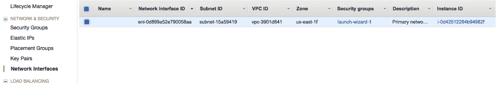
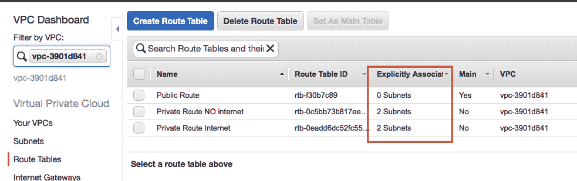

# 第八章：加强 AWS 环境的安全性

在本章中，我们将重点讨论如何确保我们的 AWS 账户和应用程序的安全。云计算和安全性是两个并不总是兼容的概念。这并非由于云的本质，而是因为人们认为本地服务器比云上的服务器更安全。因为你确切知道本地服务器的位置以及如何与它建立连接。本章的目的是通过一些实际的工具和信息，证明一个良好管理的 AWS 云环境可以比本地环境更安全。

首先，我们将研究如何为 IAM 用户确保访问安全。接着，我们将探讨如何启用 CloudTrail 记录 IAM 的使用日志，并在网络层面通过 VPC 流日志进行监控。在将应用程序和基础设施部署到云之前，创建正确的子网是至关重要的一步。最后，我们将探索 AWS 提供的一个强大工具——**Web 应用防火墙**（**WAF**）。

最重要的安全原则之一是*最小权限*原则。这意味着将用户的访问权限限制到完成其工作所需的最小权限。

在本章中，我们将在 AWS 基础设施的多个层级实施这一过程。接下来，我们将更详细地探讨以下主题：

+   **身份与访问管理**（**IAM**）安全性

+   CloudTrail

+   **虚拟私有云**（**VPC**）子网

+   AWS WAF

# 技术要求

本章中包含的代码文件可以在 GitHub 上找到，链接为：[`github.com/giuseppeborgese/effective_devops_with_aws__second_edition`](https://github.com/giuseppeborgese/effective_devops_with_aws__second_edition)。

# IAM 安全性

IAM 使你能够安全地控制对 AWS 服务的访问。在这里，我们需要实施最小权限原则，并通过记录所有用户的操作来监控谁在做什么。

# 根账户

当你创建一个 AWS 账户并使用根账户登录时，你将看到类似于以下截图的内容：


执行 IAM web 控制台所建议的所有操作非常重要，同时也要更改根账户的密码。

# 根账户密码

首先，更改根账户的密码。在页面的右上角，铃铛图标和全球下拉菜单之间，你将找到你的 AWS 别名或账户号码。点击它，然后点击“我的账户”选项：


接下来，点击“编辑”按钮。其他步骤比较直接和合乎逻辑，如下所示：


出于安全原因，网页会要求您再次提供登录信息。仅有密码保护是不够的，尤其是对于根账户；您应该绝对启用**多因素认证**（**MFA**），无论您是使用虚拟设备还是硬件设备。市场上有许多解决方案。例如，Google Authenticator 是安卓设备中最著名的应用之一。我也使用过 Yubico（[`www.yubico.com/`](https://www.yubico.com/)）生产的物理安全密钥。

# 删除根账户的访问密钥

访问密钥的权限与使用密码访问时授予的权限相同，因此，当根账户的此类访问被移除，只留下密码访问时，能够创建一个更安全的环境（除非在某些特殊情况下）。不要担心以下截图中显示的消息：


如果您为根账户创建了访问密钥，并发现该密钥已被删除，系统将显示以下消息：


# 为 IAM 用户设置密码策略

您应该应用的密码策略取决于您希望对 IAM 用户密码应用的安全级别。我建议以下类似的配置，但它会根据您的具体用例有所不同：


# 创建管理员组和个人 IAM 用户

为了更安全地操作根账户，最好创建一个个人 IAM 用户并通过该用户进行操作。将权限分配给组而不是直接分配给 IAM 用户也是最佳实践。操作方法如下：

1.  创建一个名为 `admins` 或类似名称的组。

1.  将管理员策略分配给该组。

1.  根据某些标准创建个人 IAM 用户。以我为例，我会选择 `myname.mysurname giuseppe.borgese`。

1.  将新的 IAM 用户添加到 `admins` 组。

这允许其他 IAM 用户评估是否创建权限比管理员少的组，也允许他们分配必要的权限，但不会多于需要的权限。例如，如果一个 IAM 用户需要管理 EC2 实例，我们可以给他们预定义的 AmazonEC2FullAccess 策略；如果他们需要管理 RDS 环境，则可以给他们 AmazonRDSFullAccess 策略。

# AmazonEC2FullAccess 策略

需要根账户访问权限的任务在 AWS 文档页面中列得非常清楚，网址是 [`docs.aws.amazon.com/general/latest/gr/aws_tasks-that-require-root.html`](https://docs.aws.amazon.com/general/latest/gr/aws_tasks-that-require-root.html)。以下是这些任务的列表：

+   修改根用户详情

+   更改 AWS 支持计划

+   关闭 AWS 账户

+   注册 GovCloud

+   提交 Amazon EC2 请求的反向 DNS

+   创建 CloudFront 密钥对

+   创建 AWS 创建的 X.509 签名证书

+   将 Route 53 域名转移到另一个 AWS 账户

+   更改 Amazon EC2 设置以支持更长的资源 ID

+   请求移除 EC2 实例上`25`端口的电子邮件限制

+   查找你的 AWS 账户规范用户 ID

所有这些操作都非常罕见，因此在日常任务中遇到这些事件是不寻常的。

# 最终安全状态

现在，所有任务已经完成，你可以从 root 用户注销，开始使用你创建的具有管理员权限的 IAM 用户，如下所示：


如果你对云计算方法完全陌生，建议花一些时间阅读*AWS 共享责任模型*，地址为[`aws.amazon.com/compliance/shared-responsibility-model/`](https://aws.amazon.com/compliance/shared-responsibility-model/)。在页面上，有清晰的定义，说明了 AWS 的责任是（*云的安全性*），同时也定义了我们的责任是（*云中的安全性*）。简而言之，我们的责任是确保我们在云中创建的内容，以及用于创建这些内容的所有工具，都符合 AWS 的安全要求。

过去，著名的 AWS S3 服务曾发生过许多安全漏洞，因为人们将该服务配置为可以从世界任何地方进行读写。AWS 保证该服务始终保持更新和修补，但我们在访问时所赋予的权限仍由我们自己掌控。

在 YouTube 上，你可以听到 Kate Turchin 的一首非常好听的歌，地址为[`www.youtube.com/watch?v=tIb5PGW_t1o`](https://www.youtube.com/watch?v=tIb5PGW_t1o)。这首歌以通俗易懂的方式解释了共享责任模型：


# CloudTrail

我们已启用 IAM 个人用户，并避免使用 root 账户。我们还为我们的组分配了必要的 IAM 策略，并将每个用户分配到正确的组。然而，我们也需要记录他们的所有操作。为实现这个目的，启用的 AWS 服务是 CloudTrail。

每个由 IAM 用户或分配了 IAM 角色的资源在 AWS 基础设施上执行的操作都会记录在 S3 桶中和/或 CloudWatch 日志组中。我的建议是参考 AWS 文档：[`docs.aws.amazon.com/awscloudtrail/latest/userguide/cloudtrail-create-a-trail-using-the-console-first-time.html`](https://docs.aws.amazon.com/awscloudtrail/latest/userguide/cloudtrail-create-a-trail-using-the-console-first-time.html)。如果你阅读了这篇文档，通过网页控制台创建跟踪将非常简单。

# VPC 流日志

**入侵检测系统**（**IDS**）和 **入侵预防系统**（**IPS**）是安全网络中常见的工具。在本地环境中，它们不那么容易或便宜实现，因为您需要专用硬件，以及适合此功能的网络结构。相比之下，在 AWS 中，只需使用 VPC 服务的一个特性，您可以在任何时候和任何地点启用和禁用这些工具。您可以在网络的三个级别上拥有这些工具：

+   VPC 级别

+   子网级别

+   **弹性网络接口**（**ENI**）级别

如您所知，网络接口属于一个子网，而一个子网属于一个 VPC。因此，如果在子网级别启用工具，则无需在网络接口级别应用它们，如果在 VPC 级别启用它们，则无需在子网级别应用它们。在激活此功能之前，您需要创建以下三个资源：

+   一个空的 CloudWatch 组，数据将存储在那里

+   用于执行 VPC 流日志操作的 AWS 角色

+   与角色相关联的策略，带有必要的权限

当然，您可以手动创建这些资源，并且所有执行此操作的说明都可以在流日志文档页面上找到：[`docs.aws.amazon.com/AmazonVPC/latest/UserGuide/flow-logs.html`](https://docs.aws.amazon.com/AmazonVPC/latest/UserGuide/flow-logs.html)。但是，为了采用更 DevOps/自动化的方法，我们可以使用 Terraform 模块。在这种情况下，我们使用在 GitHub 上创建的远程模块。正如您可以在有关模块来源的官方 Terraform 文档中看到的那样：[`www.terraform.io/docs/modules/sources.html#github`](https://www.terraform.io/docs/modules/sources.html#github)，GitHub 是一个支持的来源类型。但是，如果您想使用自己的 GitHub 仓库，可以使用 `ssh` 或 `https` 作为模块源。有关更多信息，请参阅：[`www.terraform.io/docs/modules/sources.html#github`](https://www.terraform.io/docs/modules/sources.html#github)。

调用模块的代码非常简单，仅需要两个参数——`source` 和 `prefix`。`prefix` 将用于命名所有模块资源。您可以下载或查看在 *技术要求* 部分提供的 GitHub 仓库链接，详细了解此模块的功能。但是，要使用它，以下几行就足够了：

```
module "flow-log-prerequisite" {
   source = "github.com/giuseppeborgese/effective_devops_with_aws__second_edition//terraform- modules//vpc-flow-logs-prerequisite"
   prefix = "devops2nd"
 }
output "role" { value = "${module.flow-log-prerequisite.rolename}" }
output "loggroup" { value = "${module.flow-log-prerequisite.cloudwatch_log_group_arn}" }
```

然后，在 Web 控制台中使用输出中的名称非常有用。

当您将模块行添加到任何现有文件中或具有 `.tf` 扩展名的新文件中后，需要使用 `terraform init` 进行初始化。

以下是 `terraform init` 命令的输出：

```
terraform init -upgrade
 Upgrading modules...
 - module.flow-log-prerequisite
 Updating source "github.com/giuseppeborgese/effective_devops_with_aws__second_edition//terraform-modules//vpc-flow-logs-prerequisite"
Initializing the backend...
Initializing provider plugins...
....
```

`terraform` 二进制文件刚刚下载了模块代码。此时，如果之前没有进行此操作，它将从最新的可用版本下载 AWS 提供程序信息。`-upgrade` 选项强制您使用最新的可用版本，因此通常这是一个好主意。

现在，通过 `terraform plan`，我们可以看到将创建的三个对象：

```
terraform plan -out /tmp/tf11.out
 Refreshing Terraform state in-memory prior to plan...
 The refreshed state will be used to calculate this plan, but will not 
 be persisted to local or remote state storage.
...
...
An execution plan has been generated and is shown below.
 Resource actions are indicated with the following symbols:
 + create
Terraform will perform the following actions:
+ module.flow-log-prerequisite.aws_cloudwatch_log_group.flow_log
 id: <computed>
 arn: <computed>
 name: "devops2nd_flowlogs"
 retention_in_days: "0"
+ module.flow-log-prerequisite.aws_iam_role.flow_role
 id: <computed>
 arn: <computed>
 assume_role_policy: "{\n \"Version\": \"2012-10-17\",\n \"Statement\": [\n {\n \"Sid\": \"\",\n \"Effect\": \"Allow\",\n \"Principal\": {\n \"Service\": \"vpc-flow-logs.amazonaws.com\"\n },\n \"Action\": \"sts:AssumeRole\"\n }\n ]\n}\n"
 create_date: <computed>
 force_detach_policies: "false"
 max_session_duration: "3600"
 name: "devops2nd_flowlogs"
 path: "/"
 unique_id: <computed>
+ module.flow-log-prerequisite.aws_iam_role_policy.flow_policy
 id: <computed>
 name: "devops2nd_flowlogs"
 policy: "{\n \"Version\": \"2012-10-17\",\n \"Statement\": [\n {\n \"Action\": [\n \"logs:CreateLogGroup\",\n \"logs:CreateLogStream\",\n \"logs:PutLogEvents\",\n \"logs:DescribeLogGroups\",\n \"logs:DescribeLogStreams\"\n ],\n \"Effect\": \"Allow\",\n \"Resource\": \"*\"\n }\n ]\n}\n"
 role: "${aws_iam_role.flow_role.id}" Plan: 3 to add, 0 to change, 0 to destroy.
-----------------------------------------------------------------------
```

该计划已保存至：`/tmp/tf11.out`。

要应用这些操作，请运行以下命令：

```
terraform apply /tmp/tf11.out
```

然后，使用 `terraform apply` 命令创建它们：

```
tf11 apply /tmp/tf11.out
 module.flow-log-prerequisite.aws_cloudwatch_log_group.flow_log: Creating...
 arn: "" => "<computed>"
 name: "" => "devops2nd_flowlogs"
 retention_in_days: "" => "0"
 module.flow-log-prerequisite.aws_iam_role.flow_role: Creating...
 arn: "" => "<computed>"
 assume_role_policy: "" => "{\n \"Version\": \"2012-10-17\",\n \"Statement\": [\n {\n \"Sid\": \"\",\n \"Effect\": \"Allow\",\n \"Principal\": {\n \"Service\": \"vpc-flow-logs.amazonaws.com\"\n },\n \"Action\": \"sts:AssumeRole\"\n }\n ]\n}\n"
 create_date: "" => "<computed>"
 force_detach_policies: "" => "false"
 max_session_duration: "" => "3600"
 name: "" => "devops2nd_flowlogs"
 path: "" => "/"
 unique_id: "" => "<computed>"
 module.flow-log-prerequisite.aws_iam_role.flow_role: Creation complete after 2s (ID: devops2nd_flowlogs)
 module.flow-log-prerequisite.aws_iam_role_policy.flow_policy: Creating...
 name: "" => "devops2nd_flowlogs"
 policy: "" => "{\n \"Version\": \"2012-10-17\",\n \"Statement\": [\n {\n \"Action\": [\n \"logs:CreateLogGroup\",\n \"logs:CreateLogStream\",\n \"logs:PutLogEvents\",\n \"logs:DescribeLogGroups\",\n \"logs:DescribeLogStreams\"\n ],\n \"Effect\": \"Allow\",\n \"Resource\": \"*\"\n }\n ]\n}\n"
 role: "" => "devops2nd_flowlogs"
 module.flow-log-prerequisite.aws_cloudwatch_log_group.flow_log: Creation complete after 3s (ID: devops2nd_flowlogs)
 module.flow-log-prerequisite.aws_iam_role_policy.flow_policy: Creation complete after 1s (ID: devops2nd_flowlogs:devops2nd_flowlogs)
Apply complete! Resources: 3 added, 0 changed, 0 destroyed.
 Outputs:
loggroup = arn:aws:logs:us-east-1:790419456202:log-group:devops2nd_flowlogs:*
 role = devops2nd_flowlogs
```

请记下最后两条输出内容，因为我们需要激活流日志。

# 为一个子网创建流日志

现在，在所有先决条件都满足的情况下，我们将为在 AWS 网页控制台中打开的 VPC 服务中的一个子网创建流日志：

1.  选择一个子网。然后，选择 "Flow Logs" 标签，点击 "Create flow log" 按钮，如下图所示：


1.  按照以下截图中提供的信息进行填写。日志组和角色是使用 Terraform 模块创建的。在这个示例中，我们关心的是查看被接受的流量，因此我们在筛选器下拉菜单中选择了 "Accept" 选项：


现在，您在 AWS 网页控制台中看到这样的情况时，请注意子网编号，因为在验证时我们将需要它。当然，您的子网 ID 会与我的不同，我的 ID 是 `subnet-15a59419`。

# 验证流日志

为了验证流日志是否正常工作，并获得流日志的实践经验，我们将为该子网创建一个 EC2 实例，并通过 SSH 登录，分析该 SSH 登录的流量。

我们不会在这里涵盖创建 EC2 实例的完整过程，因为这是一个基础任务。如果您已经阅读到本书的这一部分，您应该已经知道如何操作了。我建议使用一个 `t2.micro` 类型，它符合免费套餐的资格。此外，非常重要的一点是，您必须在刚刚激活流日志的子网上创建机器，并允许从您的位置访问 SSH。

几分钟后，您可以进入 CloudWatch 服务，点击 "Logs" 选项，选择通过 Terraform 创建的日志组 `devops2nd_flowlogs`：


在其中，您将找到与之前创建的 EC2 实例关联的网络接口名称，如下图所示：


如果您在同一子网中有多个网络接口，这意味着您有多个机器，您需要进入 EC2 服务并选择网络接口选项，利用实例 ID 列来定位网络接口，如下图所示：



然而，你可能只有一个网络接口，所以点击它的名称。在我的例子中，这是 `eni-0d899a52e790058aa-accept`。

有许多行；要了解每一行的详细信息，你可以查看记录文档，访问 [`docs.aws.amazon.com/AmazonVPC/latest/UserGuide/flow-logs.html#flow-log-records`](https://docs.aws.amazon.com/AmazonVPC/latest/UserGuide/flow-logs.html#flow-log-records)：


然而，我们想要查找我们的 SSH 连接尝试，因此有必要通过像 [`www.whatsmyip.org/`](http://www.whatsmyip.org/) 这样的服务找出我们笔记本的公网 IP，并将其放入过滤器中，如下所示：


在第一行中，你可以看到以下项目：

+   我的笔记本的公网 IP 是 `79.1.172.1`

+   EC2 实例的私有 IP 是 `172.31.61.129`

+   我的笔记本的源端口是 `61704`

+   EC2 实例的 SSH 服务的目标端口是端口 `22`

# VPC 流日志的考虑事项

我们已经完成了 VPC 流日志服务的概念验证（**PoC**）。当然，服务中还有许多其他选项，你可以在官方的 AWS 文档中找到它们。通过访问这些文档，你可以继续探索 VPC 流日志的潜力。

在此时，如果你尝试在本地环境中完成与 VPC 流日志相同的任务，应该能清楚地意识到，与在本地环境中启用完全流量监控相比，在 AWS 云上启用它是多么简单。

别忘了删除之前创建的 EC2 实例，以避免产生不必要的额外费用。其他资源不会产生费用，除非你在该子网中生成了大量流量。

# VPC 子网

在本节中，我们将看看如何按照最小权限原则组织我们的 VPC 子网。我们必须在最少的情况下暴露并授予访问权限给我们的资源（EC2、ELB 和 RDS），以限制安全攻击和数据泄露。

在每个 AWS 区域中，已经创建了一个默认 VPC。如果你想了解更多关于它的详细信息，我建议你阅读 *默认 VPC 和默认子网* 文档，地址是 [`docs.aws.amazon.com/AmazonVPC/latest/UserGuide/default-vpc.html`](https://docs.aws.amazon.com/AmazonVPC/latest/UserGuide/default-vpc.html)。不过，简而言之，可以说，任何放在这里的东西如果你配置的安全组允许，都是有可能暴露给公网的。

# 路由和子网类型

在官方文档[`docs.aws.amazon.com/AmazonVPC/latest/UserGuide/VPC_Scenarios.html`](https://docs.aws.amazon.com/AmazonVPC/latest/UserGuide/VPC_Scenarios.html)中，描述了你 VPC 配置的四种场景，查阅这些内容会很有帮助。理解你在子网中放置的资源的访问方式由以下三个因素决定是很重要的：

+   路由

+   **网络访问控制**（**NAC**）列表（无状态防火墙）

+   安全组（有状态防火墙）

我的建议是不要修改 NAC；保持默认的 NAC 附加到每个子网，它允许所有的入站和出站流量，并使用安全组作为防火墙。根据安全级别，子网可以分为三种类型：

+   公有子网

+   具有互联网访问的私有子网

+   没有互联网访问的私有子网

# 访问私有子网

公有子网中的资源可以通过使用公共 IP 并启用安全组接收连接来访问。对于私有子网，你至少有三种方式可以做到这一点，如下所示：

+   跳转到一个公有子网中的堡垒主机，然后从那里访问私有资源。

+   使用 AWS VPN 服务的站点到站点 VPN，[`docs.aws.amazon.com/AmazonVPC/latest/UserGuide/vpn-connections.html`](https://docs.aws.amazon.com/AmazonVPC/latest/UserGuide/vpn-connections.html)，连接到你办公室中的物理路由器/设备。你可以连接两个路由器以增加冗余。

+   在 EC2 实例中放置虚拟 VPN 软件，并将设备连接到它。有无数的解决方案可以做到这一点，许多都在 AWS 市场上，按月收费，可以直接使用。

如果你有带物理路由器的办公室，首选方案始终是站点到站点的解决方案。

# 在哪个子网中放置什么资源？

在我的测试 VPC 中，我有六个子网——每种类型有两个子网，您可以在以下截图中看到：


*你应该在每种类型的子网中放置什么？* 请考虑以下几点：

+   **公有子网**：指的是所有具有公共访问权限的外部**弹性负载均衡**（**ELB**），堡垒主机（如果有的话），位于 EC2 实例中的虚拟 VPN 软件，以及任何需要从互联网访问的资源，且无法通过其他方式访问。

+   **具有互联网访问的私有子网**：指的是所有内部 ELB 以及所有位于 ELB（内部或外部）后面的 EC2 实例，这些实例需要从互联网下载或上传内容，以及需要从互联网下载或上传内容的数据库。

+   **没有互联网访问的私有子网**：指的是所有不需要任何理由访问互联网的资源，以及那些从内部仓库下载更新的资源

# 在 Web 控制台中识别子网

请记住以下几点：

+   每个子网可以关联一个路由表

+   一个路由表可以与多个子网关联

+   如果您没有明确将路由表关联到子网，默认的路由表会自动关联

在以下截图中，您可以看到三个路由表，其中公共路由是默认的路由表：



在子网部分，您可以看到与该子网关联的路由表及其单个路由，但要更改路由表的内容，您必须从路由表部分进行编辑。私有路由与公共路由表/子网的区别在于`0.0.0.0/0`路由的目标。如果是一个转发互联网网关，`igw-xxxxx`意味着这个子网可以从外部世界访问，并且能够连接到互联网（假设安全组允许这样做）：


如果它指向 NAT 网关或其他 EC2 实例，这意味着它是一个具有互联网访问权限的私有子网，并且可以通过任何方式访问互联网，因此它可以从外部世界访问。首先，您必须点击“创建 NAT 网关”按钮，如下所示：


之后，您可以更改路由表，并出现如以下截图所示的情况：


如果`0.0.0.0/0`不在，如上截图所示，它是一个完全私有的子网：


# 端点路由

如果数据库必须将备份上传到同一区域的私有 S3 存储桶，则绝不应使用互联网访问，而应采用私有内部路由。这就是所谓的 VPC 端点。通过这种路由，您可以避免通过互联网访问 AWS 服务，如 S3、DynamoDB 或 CloudWatch，从而提高速度、安全性并节省成本（互联网流量是有费用的）。要查看所有支持 VPC 端点的服务，您可以查看官方文档：[`docs.aws.amazon.com/AmazonVPC/latest/UserGuide/vpc-endpoints.html`](https://docs.aws.amazon.com/AmazonVPC/latest/UserGuide/vpc-endpoints.html)。

在这里，我们将配置第一个可用的 S3 服务 VPC 端点，如下所示：

1.  转到 VPC | 端点 | 创建端点：


1.  保留默认的 AWS 服务并选择 S3 服务，如下截图所示：


1.  选择您正在使用的 VPC，并修改所有路由表：


1.  现在，您可以看到一个新的路由规则，如下截图所示：


请记住，这将适用于在同一 VPC 区域中创建的所有存储桶。在这个例子中，区域是`us-east-1`，即北弗吉尼亚。

在 AWS 文档的 *Endpoints for Amazon S3* 部分 [`docs.aws.amazon.com/AmazonVPC/latest/UserGuide/vpc-endpoints-s3.html`](https://docs.aws.amazon.com/AmazonVPC/latest/UserGuide/vpc-endpoints-s3.html)，有一个关于 S3 存储桶策略的有趣的强化规则，如下所示：

```
{
    "Version": "2012-10-17",
    "Id": "Policy1415115909152",
     "Statement": [
        {
            "Sid": "Access-to-specific-VPCE-only",
            "Principal": "*",
            "Action": "s3:*",
            "Effect": "Deny",
            "Resource": ["arn:aws:s3:::my_secure_bucket",
                         "arn:aws:s3:::my_secure_bucket/*"],
            "Condition": {
                "StringNotEquals": {
     "aws:sourceVpce": "vpce-039f31bfec07367ea"
                 }
             }
        }
       ]
 }
```

我通过添加我的 VPC 端点 ID `vpce-039f31bfec07367ea` 替换了文档中的那个。根据此规则，`my_secure_bucket` 存储桶只能从与该端点关联的 VPC 访问。

# AWS WAF

您可以通过使用安全组和私有子网限制访问所有资源。所有监视日志、VPC 流日志和 CloudTrail 都是活跃的。IAM 策略已强制执行，所有内容都得到了正确的安全保护，没有任何内容暴露。这是因为您有 VPN 服务可以访问任何资源。但是，如果您想提供 Internet 服务，您必须至少打开一个对外界的访问点。正如我们在 *VPC* *子网* 部分已经讨论过的那样，应该尽可能少地在公共子网中暴露资源，只有一个 ELB 应该处于此状态，将连接传递给私有子网中的 EC2 机器，因为 EC2 机器使用严格的安全规则与 RDS 数据库进行通信。

这是最经典的 AWS 应用程序之一，在此无需详细解释。相反，我们希望关注如何通过 AWS WAF 增强 ELB 的安全性。有关更多信息，请参阅 [`aws.amazon.com/waf/`](https://aws.amazon.com/waf/)。AWS WAF 是一种在应用程序级别工作的防火墙，可以在 TCP/IP 协议栈的第 7 层进行保护，而不是在第 4 层（安全组所在层）。

*WAF 能做什么安全组不能做到？* 考虑以下问题的答案：

+   防止 SQL 注入和跨站脚本攻击

+   阻止**拒绝服务**（**DoS**）和**分布式拒绝服务**（**DDoS**）

+   保护您 Web 应用程序 URL 的一部分，例如 `www.mywebsite/admin`

在本章中，我们将使用 Terraform 创建两个关于 DoS 和子 URL 的实用 POC。为此，我们将创建一个 Web 应用程序沙盒，应用 WAF，并测试触发其保护规则。请注意，在撰写本书的这一部分时，WAF 仅适用于**应用负载均衡器**（**ALB**）和 CloudFront，但 AWS 不断更新其服务，所以未来可能会有所改变。

# Web 应用程序沙盒

我们的测试沙盒将是一个 ALB 和一个安装了 Apache2 Web 服务器的 EC2 机器。在本节中，我们仅创建环境并进行测试，不涉及任何 WAF 配置。但在下一节中，我们将在 ALB 上添加 WAF 级别。

要创建以下沙盒，我们将使用 GitHub 上提供的一个 Terraform 模块：


首先，在你的 `main.tf` 文件中添加以下代码：

```
module "webapp-playground" {
  source = "github.com/giuseppeborgese/effective_devops_with_aws__second_edition//terraform-modules//webapp-playground"
  subnet_public_A = "subnet-a94cabf4"
  subnet_public_B = "subnet-54840730"
  subnet_private = "subnet-54840730"
  vpc_id = "vpc-3901d841"
  my_ami = "ami-b70554c8"
  pem_key_name = "effectivedevops"
}
```

需要记住的一些事项如下：

+   ALB 必须始终位于至少两个子网中，且分别位于两个不同的可用区。

+   这个 ALB 可以通过端口 `80` 访问，并使用 HTTP 监听器，这对于 PoC（概念验证）来说是可以接受的。然而，在你的真实环境中，最好通过 AWS Route 53 注册一个公共域名，使用 AWS Certificate Manager 创建一个 SSL 证书，将这个证书关联到 ALB，并使用 HTTPS 监听器。

+   安全组设置非常严格，你可以查看模块代码，看到 ALB 的安全组入口仅从端口 `80` 到整个互联网 `0.0.0.0/0` 可达，并且只能从 EC2 安全组的端口 `80` 进行 *出口* 访问。

像往常一样，要创建资源，你需要运行以下命令：

```
terraform init -upgrade
terraform plan -out /tmp/tf11.out
Plan: 12 to add, 0 to change, 0 to destroy. 
terraform apply /tmp/tf11.out
```

找到 DNS ALB 名称，如下截图所示，并复制它：


通过浏览器打开它，如下所示：


还有一个子目录，我们可以稍后用来测试我们的 WAF：


如果你没有足够快地使用它，你的 playground 会通过 `terraform` 命令销毁它，以避免产生任何不必要的费用。如果你只想销毁 playground，而不销毁其他已创建的资源，你可以使用选择性 `destroy` 模块，如下所示：

```
terraform destroy -target module.webapp-playground
```

如果你确认选择 `Yes`，那么将销毁这 12 个模块资源。

# 允许只有来自某个 IP 的子 URL 可访问

通常，在你的 Web 应用程序中，你有一个管理区域，可能这个部分的门户并不是所有人都能访问的。当然，你有用户名和密码，但攻击者可以通过多种方式窃取这些凭证。

如果这是一个敏感应用程序，为了遵循最小权限原则，限制访问仅限于需要使用这种管理访问的位置是很方便的；例如，从办公室。如果你可以为管理区域设置不同的访问权限，你可以将其放在内部负载均衡器后面，并通过使用 VPN 服务将 VPC 连接到你的办公室，正如之前的部分所讨论的那样。内部负载均衡器的 DNS 名称会转换为你的 VPC 的私有 IP 地址，通过这种方式，你可以确保连接仅来自受信任的来源，例如你的办公室。

然而，很多时候你没有这个选项，因为应用程序是一个整体打包的，无法将管理子 URL 与主部分分开。在这种情况下，唯一可用的修改是使用 AWS WAF，并仅对管理子 URL 应用过滤器。我们需要创建一个 WAF 并将其附加到 ALB 上，以供我们的 Web 应用程序使用。

为此，我创建了一个 `terraform` 模块，你可以通过以下几行代码将其用于你的代码中：

```
module "limit_admin_WAF" {
  source = "github.com/giuseppeborgese/effective_devops_with_aws__second_edition//terraform-modules//limit-the-admin-area"
  alb_arn = "${module.webapp-playground.alb_arn}"
  my_office_ip = "146.241.179.87/32"
  admin_suburl = "/subdir"
}
```

当然，不要忘记将你的办公 IP 或家庭连接的公共 IP 替换为`my_office_ip`字段中的内容，如果是单一 IP，就像我的情况一样，使用子网掩码`/32`。

命令和往常一样，如下所示：

```
terraform plan -out /tmp/tf11.out
terraform init -upgrade
terraform apply /tmp/tf11.out 
```

为了方便测试，我添加了一个`alb_url`输出变量，如下所示：

```
alb_url = playground-1940933132.us-east-1.elb.amazonaws.com
loggroup = arn:aws:logs:us-east-1:790419456202:log-group:devops2nd_flowlogs:*
role = devops2nd_flowlogs
giuseppe@Giuseppes-MacBook-Air ~/p/effectivedevops>
```

现在，WAF 已与 ALB 关联，所有请求都将被过滤。

# 使用命令行进行测试

这次，我们将使用命令行工具`curl`进行测试。从我的办公 IP 可以看到，当尝试访问根目录和子 URL 时，未出现任何问题：

```
giuseppe@Giuseppes-MacBook-Air ~> curl http://playground-1940933132.us-east-1.elb.amazonaws.com/subdir/
 This is a sub directory
giuseppe@Giuseppes-MacBook-Air ~> curl http://playground-1940933132.us-east-1.elb.amazonaws.com/
 This is a playground main directory
giuseppe@Giuseppes-MacBook-Air ~>
```

相反，当我使用带有另一个公共 IP 的虚拟机时，得到了以下结果：

```
[ec2-user@ip-172-31-6-204 ~]$ curl http://playground-1940933132.us-east-1.elb.amazonaws.com/
 This is a playground main directory
 [ec2-user@ip-172-31-6-204 ~]$ curl http://playground-1940933132.us-east-1.elb.amazonaws.com/subdir/
 <html>
 <head><title>403 Forbidden</title></head>
 <body bgcolor="white">
 <center><h1>403 Forbidden</h1></center>
 </body>
 </html>
```

# 从 Web 控制台识别 WAF

查看所创建的资源，也就是服务 WAF，如下所示：


查看 Web ACL 选项，并从过滤器菜单中选择你所在的区域。你可以看到 Terraform 模块所创建的内容，如下所示：


在“规则”部分，可以看到过滤器本身，以及允许访问受限区域的 IP：


# 阻止 DoS/DDoS 攻击

DoS 攻击是我们应用程序中的老问题，尤其是在分布式版本中，即 DDoS 攻击，其中多个来源（通常是许多被黑客攻击的设备，组成一个僵尸网络）试图通过同时发出大量查询来发起 DoS 攻击，导致网络过载。在这种情况下，为了防御并继续为合法用户提供流量服务，识别并阻止恶意源是至关重要的。

值得花一点时间阅读关于*AWS 上拒绝服务攻击缓解*的官方文档，[`aws.amazon.com/answers/networking/aws-ddos-attack-mitigation/`](https://aws.amazon.com/answers/networking/aws-ddos-attack-mitigation/)。我们在这里要做的是专注于使用 WAF 的实际示例。

AWS WAF 可以阻止发送过多请求的单一公共 IP。你可能会问，*多少请求算太多？* 这个取决于你的 Web 应用程序，因此在应用任何此类过滤器之前，你需要测量来自单一 IP 在五分钟时间范围内接收到的请求数量。

请记住，AWS WAF 的下限是 2000 个请求，并且根据我的测试，虽然请求`2001`不会被阻止，但一段时间后，你会看到许多后续请求被阻止。就像我们对其他示例所做的那样，我们不会完全相信 AWS 的声明，而是会在创建后测试我们的 PoC。为了立即看到系统是否在工作，我们将为我们的子 URL`http://playground-1940933132.us-east-1.elb.amazonaws.com/subdir/`设置 AWS 限制。我们不会对主页`http://playground-1940933132.us-east-1.elb.amazonaws.com`应用任何限制。

# 使用 Terraform 创建 AWS WAF

销毁 `limit_admin_WAF` 模块以避免冲突。你可以使用以下命令进行操作：

```
terraform destroy -target module.limit_admin_WAF
```

接下来，在你的代码中使用 `/* */` 注释掉模块：

```
/* module "limit_admin_WAF" {
 source
.............
} */
```

使用以下代码创建新的模块：

```
 module "limit_admin_WAF" {
 source = "github.com/giuseppeborgese/effective_devops_with_aws__second_edition//terraform-modules//ddos_protection"
 alb_arn = "${module.webapp-playground.alb_arn}"
 admin_suburl = "subdir"
 }
```

如往常一样，包含以下代码片段：

```
terraform init --upgrade
terraform plan -out /tmp/tf11.out
terraform apply /tmp/tf11.out
 Outputs:
alb_url = playground-1757904639.us-east-1.elb.amazonaws.com
```

从输出中获取 DNS 名称，并使用 `curl` 命令测试一切是否正常，具体如下：

```
 curl playground-1757904639.us-east-1.elb.amazonaws.com
```

以下是 `playground` 主目录：

```
curl playground-1757904639.us-east-1.elb.amazonaws.com/subdir/ 
```

这是一个子目录。登录到 Web 控制台，进入 WAF 服务，选择弗吉尼亚区域，并注意 Rate-based 类型的 `subdir` 规则，如下图所示：


此外，在“规则”部分，你会注意到目前没有任何 IP 被阻止：


请记住，AWS 默认禁止任何形式的 DoS 测试，并且可能会被阻止，因为它违反了条款和条件。有关 *AWS 服务条款* 的更多信息，请参阅 [`aws.amazon.com/service-terms/`](https://aws.amazon.com/service-terms/)。在我们的案例中，我们将从单个 IP 在短时间内发送 2,000/4,000 个请求。这么大数量的请求不会触发 AWS 的警报。如果你有非常好的互联网连接，可以从你的笔记本电脑运行此脚本，但我的建议是使用直接暴露在互联网上的 Amazon Linux EC2 机器，这样我们能在相同的实验条件下进行操作。

登录到你的机器，并使用以下命令下载脚本：

```
curl -O https://raw.githubusercontent.com/giuseppeborgese/effective_devops_with_aws__second_edition/master/terraform-modules/ddos_protection/test_protection.sh
chmod +x test_protection.sh
./test_protection.sh ...
```

这将向你的 ALB 测试环境发送 4,000 个请求。从输出中，你可以看到前 2,000/3,000 个请求将会成功：

```
This is a subdirectory
 538
This is a subdirectory
 539
This is a subdirectory
 540
This is a subdirectory
 541
This is a subdirectory
```

然而，你将开始收到如下的拒绝请求：

```
259
 <html>
 <head><title>403 Forbidden</title></head>
 <body bgcolor="white">
 <center><h1>403 Forbidden</h1></center>
 </body>
 </html>
 260
 <html>
 <head><title>403 Forbidden</title></head>
 <body bgcolor="white">
 <center><h1>403 Forbidden</h1></center>
 </body>
 </html>
```

如果你在第一次运行时没有看到此项，你需要重新运行脚本来触发请求。你可以通过 WAF 服务中的 Web 控制台登录，然后在“规则”部分看到你的 EC 机器的公共 IP：


然而，如果你运行 `curl` 请求根目录，你会看到它仍然可以从你的 EC2 机器访问。如果你尝试从你的笔记本电脑访问，`subdir` URL 仍然可以访问。如果你暂时不再发送请求，你 EC2 机器的公共 IP 会从黑名单中移除，这是正确的，因为如果该 IP 恢复正常流量传输，它就不再是威胁。

# DDoS 攻击考虑

AWS WAF 是缓解 DoS 和 DDoS 攻击的非常有用的工具，但在开始使用之前，建议执行以下操作：

+   阅读并观察如何在 AWS 上实现 DoS 攻击缓解

+   了解你的应用程序，并为并发连接设置合理的限制，避免阻塞有效流量并获得误报响应

+   构建一个可扩展的 web 应用程序，以响应请求，直到 WAF 理解到它正受到攻击并触发其过滤器。

# SQL 注入（SQLi）的 WAF 防护

我们创建并测试了 WAF 的速率规则和子 URL 限制功能。正如我们在开始时所说的，还有 SQLi 功能，并且可以在官方 AWS 网站的[`github.com/aws-samples/aws-waf-sample`](https://github.com/aws-samples/aws-waf-sample) GitHub 仓库中找到与此相关的一些 CloudFormation 模板。

# 总结

在本章中，我们在不同级别应用了最小权限原则。在 IAM 部分，您学习了如何锁定根账户并将控制权交给 IAM 用户，通过配置密码策略、设置权限和创建组。通过启用 CloudTrail，我们跟踪并监控了由 IAM 用户或服务在我们环境中执行的每个操作。使用 VPC Flow Logs，我们观察到适用于 VPC 任意位置的强大网络监控工具，并且我们还使用 Terraform 创建了我们的前提条件，Terraform 是一个用于扩展我们实践的绝佳工具。我们还介绍了 Terraform 模块的概念。在 *VPC 子网* 部分，我们研究了可以在 AWS 云中使用的三种子网类型，以及如何将不同种类的资源放置在我们的基础设施中，尽量减少将其暴露到互联网，并尽可能将其保留在私有区域。

在讨论 WAF 服务时，我们探索了 AWS 世界中最强大的安全服务之一。保护 Web 应用程序的某些敏感部分是非常有用的。DoS 保护是专业 Web 服务中应该始终存在的东西。配置 WAF 并不总是容易的，但得益于 Terraform 自动化的强大功能以及本书中提供的 PoC 模块，理解原理并进行相应配置只需一些 `terraform` 和 `git` 命令即可。

# 问题

1.  假设我刚刚注册了 AWS 云并通过电子邮件收到了我的密码。我可以开始构建我的基础设施吗？还是必须先遵循一些最佳实践？

1.  我应该在我的 AWS 账户中启用哪种类型的登录？

1.  安全组和 NACL 是 AWS 中唯一的防火墙吗？

1.  我如何使用 AWS 保护我的 web 应用程序免受 DDoS 攻击？

1.  我可以将所有资源放在一个子网中吗？

# 深入阅读

安全是一个非常广泛的领域，一章内容无法面面俱到。更多资源可以在[`aws.amazon.com/whitepapers/aws-security-best-practices/`](https://aws.amazon.com/whitepapers/aws-security-best-practices/)找到。

**互联网安全中心**（**CIS**）的 AWS 基础安全基准是一个用于保护 AWS 账户/环境的安全加固指南。请参考以下链接：

+   *CIS Amazon Web Services 基础* 请参阅 [`d0.awsstatic.com/whitepapers/compliance/AWS_CIS_Foundations_Benchmark.pdf`](https://d0.awsstatic.com/whitepapers/compliance/AWS_CIS_Foundations_Benchmark.pdf)。

+   *CIS **用于检查与 AWS API 基准匹配的脚本* 请参阅 [`github.com/awslabs/aws-security-benchmark`](https://github.com/awslabs/aws-security-benchmark)。

有关更多关于 *AWS 认证安全专家* 的信息，请参考 [`aws.amazon.com/certification/certified-security-specialty/`](https://aws.amazon.com/certification/certified-security-specialty/)。
