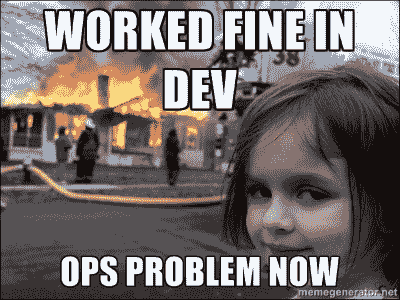
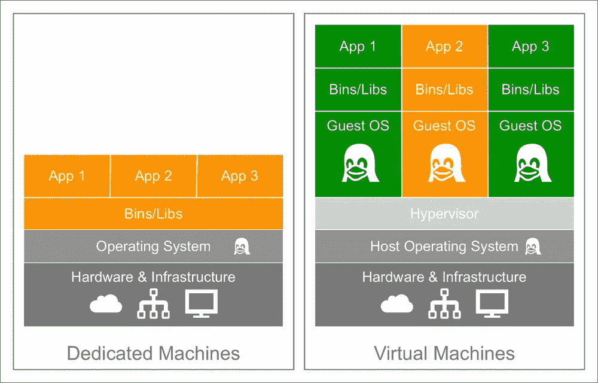
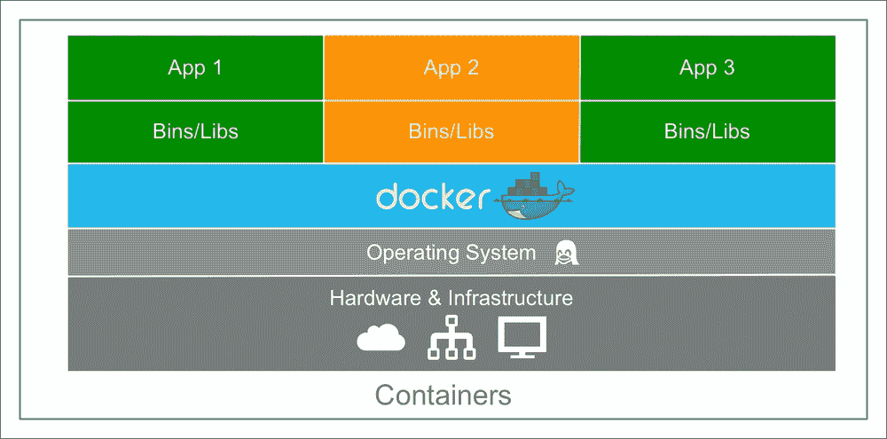
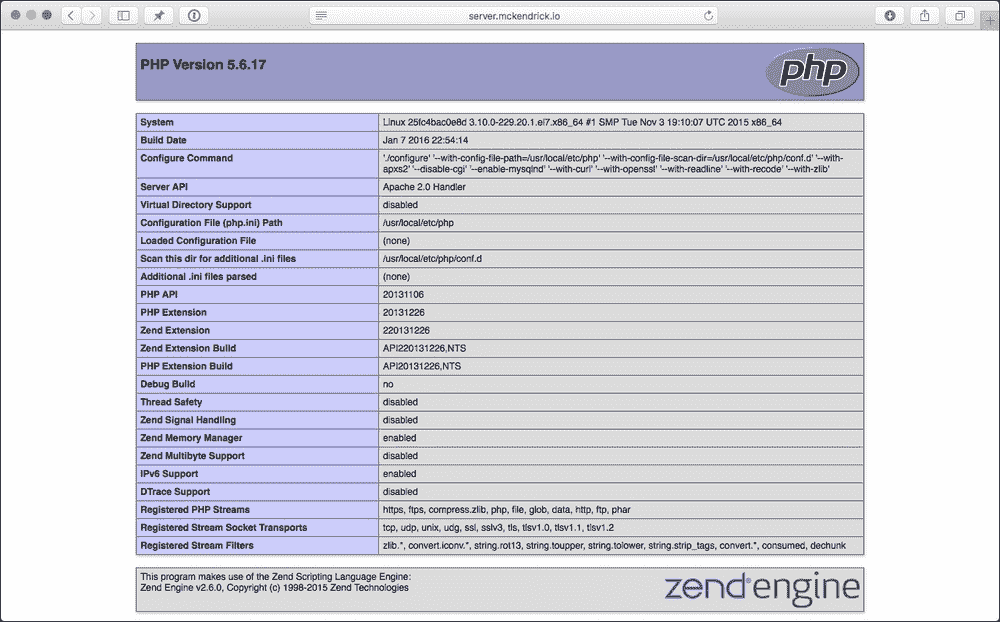
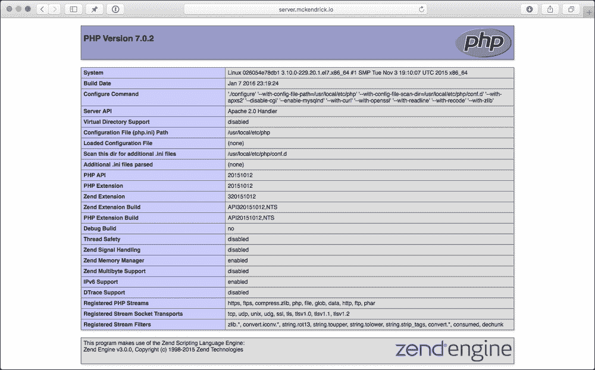
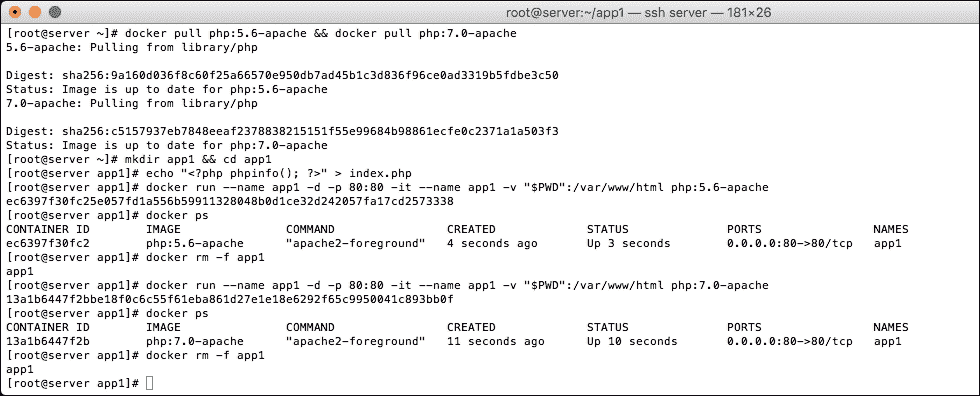
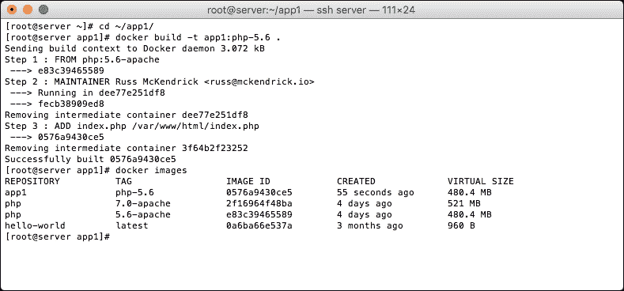
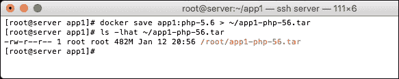
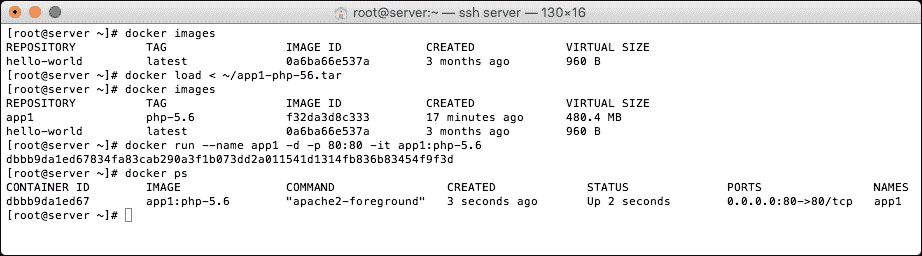

# 第一章：扩展 Docker 简介

在本章中，我们将讨论以下主题：

+   为什么 Docker 会被整个行业广泛接受

+   一个典型的容器生命周期是什么样的？

+   接下来的章节将涵盖哪些插件和第三方工具？

+   接下来章节你需要什么？

# Docker 的崛起

很少有技术能够在整个行业中如此广泛地被采纳。自 2013 年 3 月首次公开发布以来，Docker 不仅赢得了像你我这样的最终用户的支持，还得到了 Amazon、Microsoft 和 Google 等行业领袖的支持。

Docker 目前在其网站上使用以下句子来描述为什么你会想要使用它：

> *"Docker 提供了一套集成技术套件，使开发和 IT 运维团队能够在任何地方构建、交付和运行分布式应用程序。"*

有一个基于灾难女孩照片的网络迷因，总结了为什么这样一个看似简单的解释实际上非常重要：



尽管 Docker 的描述听起来简单，但实际上，对于大多数开发人员和 IT 运维团队来说，它一直是一个理想的工具，可以确保一个应用程序在以下三个主要阶段的生命周期中始终如一地运行：

1.  开发

1.  预发布和预生产

1.  生产

为了说明在 Docker 出现之前为什么这是一个问题，让我们看看这些服务传统上是如何配置和部署的。人们通常倾向于使用专用机器和虚拟机器的组合。让我们更详细地看一下这些。

尽管可以使用配置管理工具，如 Puppet，或者像 Ansible 这样的编排工具来保持服务器环境之间的一致性，但在服务器和开发者的工作站之间强制执行这些一致性仍然是困难的。

## 专用机器

传统上，这些是单个硬件设备，经过配置以运行你的应用程序。虽然这些应用程序可以直接访问硬件，但你受限于可以安装在专用机器上的二进制文件和库，因为它们必须在整个机器上共享。

为了说明 Docker 解决的一个潜在问题，假设你有一台单独的专用服务器运行你的 PHP 应用程序。当你最初部署这台专用机器时，构成你电子商务网站的三个应用程序都使用 PHP 5.6，因此在兼容性方面没有问题。

你的开发团队一直在缓慢地处理这三个 PHP 应用程序。你已经将它部署到主机上，以便让它们与 PHP 7 兼容，因为这将大大提升它们的性能。然而，他们始终无法解决 App2 中的一个错误，这意味着在用户将物品添加到购物车时，应用程序将无法在 PHP 7 下运行，并会崩溃。

如果你只有一个主机运行三款应用程序，直到开发团队解决 App2 的错误，你将无法从 PHP 5.6 升级到 PHP 7，除非你做以下其中一项：

+   部署一个运行 PHP 7 的新主机，并将 App1 和 App3 迁移到该主机上；这可能既费时又昂贵

+   部署一个运行 PHP 5.6 的新主机，并将 App2 迁移到该主机上；同样，这也可能既费时又昂贵。

+   等待直到错误被修复；从 PHP 5.6 升级到 PHP 7 所带来的性能提升可能会增加销售额，但目前没有修复的预计时间。

如果你选择前两个选项，你还需要确保新专用主机要么与开发者的 PHP 7 环境匹配，要么按完全相同的方式配置新专用主机；毕竟，你不希望因为机器配置不当而引入更多问题。

## 虚拟机

解决前面提到的情况的一种方法是，通过安装一个如以下的虚拟化管理程序，将专用主机的资源切割并提供给应用程序：

+   **KVM**: [`www.linux-kvm.org/`](http://www.linux-kvm.org/)

+   **XenSource**: [`www.xenproject.org/`](http://www.xenproject.org/)

+   **VMware vSphere**: [`www.vmware.com/uk/products/vsphere-hypervisor/`](http://www.vmware.com/uk/products/vsphere-hypervisor/)

一旦安装完成，你就可以在每个不同的虚拟主机上安装你的二进制文件和库，并在每个虚拟主机上安装你的应用程序。

回到专用主机部分提到的场景，你将能够在安装了 App1 和 App2 的虚拟机上升级到 PHP 7，同时在修复开发工作进行时保持 App2 不变且可正常工作。

很好，那么问题在哪？从开发者的角度来看，根本没有问题，因为他们的应用程序可以在适合他们的 PHP 版本下运行；然而，从 IT 运维的角度来看：

+   **更多的 CPU、RAM 和磁盘空间**：每个虚拟机都将需要额外的资源，因为运行三个来宾操作系统以及三款应用程序的开销需要考虑。

+   **更多的管理**：现在，IT 运维需要修补、监控并维护四台机器，包括专用主机和三台虚拟机，而之前他们只需要维护一台专用主机。

如前所述，你还需要确保托管应用程序的三个虚拟机的配置与开发人员在开发过程中使用的配置一致；同样，你不希望因为部门之间的配置和流程偏差而引入额外问题。

## 专用主机与虚拟机

下图展示了典型的专用主机与虚拟机主机配置方式：



如你所见，二者之间的最大区别非常明显。你正在进行资源利用与能够使用不同二进制文件/库运行应用之间的权衡。

## 容器

现在我们已经涵盖了传统应用部署的方式。接下来，让我们看看 Docker 为这个过程带来了什么。

回到我们的场景，三款应用运行在同一台主机上。你可以在主机上安装 Docker，然后将每个应用部署为容器，这样既能享受虚拟机的好处，又大大减少了占用空间，也就是完全去除了虚拟机管理程序和客户操作系统，取而代之的是一个直接与主机内核对接的精简界面。

这为 IT 运维和开发团队带来的优势如下：

+   **低开销**：如前所述，IT 运维团队的资源和管理负担较低

+   **开发团队提供容器**：与其依赖 IT 运维团队为每个应用配置三个不同的环境，将它们与开发环境对接，不如直接将容器交给运维团队进行生产部署。

从下面的图示可以看到，应用与主机操作系统之间的层次已被简化：



所有这些意味着，开篇提到的“灾难女孩”表情包应该不再适用了，因为开发团队已经将应用与所有配置、二进制文件和库一起打包成容器交给运维团队，这意味着如果在开发环境中能正常运行，那么在生产环境中也能运行。

这看起来可能太好了，甚至让人怀疑，老实说，确实有一个“但是”。对于大多数 web 应用或已经预编译的静态二进制文件应用，你应该不会遇到问题。

然而，由于 Docker 与底层主机共享资源，如内核版本，如果你的应用需要编译或依赖某些仅与共享资源兼容的库，那么你必须在相同的操作系统上部署容器，在某些情况下，甚至需要相同的硬件。

Docker 通过收购一家名为 Unikernel Systems 的公司，试图解决这个问题，收购发生在 2016 年 1 月。到写本书时，关于 Docker 如何将这一技术整合到其核心产品中的细节还不多。如果你想了解更多关于这一技术的信息，可以访问 [`blog.docker.com/2016/01/unikernel/`](https://blog.docker.com/2016/01/unikernel/)。

# 每个人都应该使用 Docker 吗？

那么，真的这么简单吗？每个人应该停止使用虚拟机，改用容器吗？

2014 年 7 月，Wes Felter、Alexandre Ferreira、Ram Rajamony 和 Juan Rubio 发表了一篇名为《虚拟机与 Linux 容器的性能更新比较》的 IBM 研究报告，并得出结论：

> *“虚拟机和容器都是成熟的技术，受益于十年的硬件和软件渐进式优化。通常，Docker 在我们测试的所有案例中都等同于或超越了 KVM 性能。我们的结果显示，KVM 和 Docker 都对 CPU 和内存性能引入了微不足道的开销（除了极端情况下）。对于 I/O 密集型工作负载，这两种虚拟化方式都应该谨慎使用。”*

接着，它提到以下内容：

> “虽然容器本身几乎没有开销，但 Docker 并非没有性能陷阱。Docker 卷比存储在 AUFS 中的文件有明显更好的性能。Docker 的 NAT 也会为高数据包率的工作负载引入开销。这些特性代表了管理简便性与性能之间的权衡，应根据具体情况进行考虑。”

这份完整的 12 页报告，详细对比了我们讨论过的传统技术与容器，可以从以下网址下载：

[`domino.research.ibm.com/library/cyberdig.nsf/papers/0929052195DD819C85257D2300681E7B/$File/rc25482.pdf`](http://domino.research.ibm.com/library/cyberdig.nsf/papers/0929052195DD819C85257D2300681E7B/$File/rc25482.pdf)

在 IBM 研究报告发布不到一年后，Docker 为其生态系统引入了插件。我看到的其中一个最佳描述来自 Docker 软件工程师 Jessica Frazelle，她形容这个发布就像是“包含电池，但可以替换”，意味着核心功能可以轻松地被第三方工具替代，这些工具可以用来解决 IBM 研究报告中的结论。

在撰写本书时，Docker 目前支持卷和网络驱动插件。未来将会增加更多插件类型，以将更多 Docker 核心功能暴露给第三方。

# 容器的生命周期

在我们查看各种插件和扩展 Docker 的方式之前，应该先了解容器的典型生命周期。

使用前一节中的示例，让我们启动官方的 PHP 5.6 容器，然后将其替换为官方的 PHP 7.0 容器。

## 安装 Docker

在我们启动容器之前，需要先让 Docker 正常运行；幸运的是，这个过程很简单。

在接下来的章节中，我们将使用 Docker Machine 来引导我们的 Docker 环境；但是现在，让我们先在云服务器上快速安装 Docker。

以下指令适用于托管在公共云上的 Ubuntu 14.04 LTS 或 CentOS 7 实例，示例如下：

+   **Digital Ocean**: [`www.digitalocean.com/`](https://www.digitalocean.com/)

+   **亚马逊云服务**: [`aws.amazon.com/`](https://aws.amazon.com/)

+   **微软 Azure**: [`azure.microsoft.com/`](https://azure.microsoft.com/)

+   **VMware vCloud Air**: [`vcloud.vmware.com/`](http://vcloud.vmware.com/)

你也可以尝试在本地运行一个虚拟机，使用以下方法：

+   **Vagrant**: [`www.vagrantup.com/`](https://www.vagrantup.com/)

+   **Virtualbox**: [`www.virtualbox.org/`](https://www.virtualbox.org/)

+   **VMware Fusion**: [`www.vmware.com/uk/products/fusion/`](http://www.vmware.com/uk/products/fusion/)

+   **VMware Workstation**: [`www.vmware.com/uk/products/workstation/`](http://www.vmware.com/uk/products/workstation/)

我将使用托管在 Digital Ocean 上的 CentOS 7 服务器，因为它方便快捷，可以快速启动并随时终止。

一旦你的服务器启动并运行，你可以通过运行以下命令从官方 Yum 或 APT 仓库安装 Docker：

```
curl -sSL https://get.docker.com/ | sh

```

如果你像我一样运行的是 CentOS 7 服务器，你需要确保该服务正在运行。为此，请输入以下命令：

```
systemctl start docker

```

安装完成后，你应该能够通过运行 Docker `hello-world` 容器来检查一切是否按预期工作，输入以下命令：

```
docker run hello-world

```

一旦你安装了 Docker，并确认它按预期运行，你可以通过运行以下命令来下载官方 PHP 5.6 和 PHP 7.0 镜像的最新版本：

```
docker pull php:5.6-apache && docker pull php:7.0-apache

```

有关官方 PHP 镜像的更多信息，请参阅 Docker Hub 页面：[`hub.docker.com/_/php/`](https://hub.docker.com/_/php/)。

现在我们已经下载了镜像，是时候部署我们的应用程序了，因为我们保持得非常简单；我们将要部署的仅仅是一个 `phpinfo` 页面，这将确认我们正在运行的 PHP 版本，以及容器环境的其他详细信息：

```
mkdir app1 && cd app1
echo "<?php phpinfo(); ?>" > index.php
```

现在，index.php 文件已经到位。让我们通过运行以下命令来启动 PHP 5.6 容器：

```
docker run --name app1 -d -p 80:80 -it -v "$PWD":/var/www/html php:5.6-apache

```

这将启动一个 `app1` 容器。如果你输入你的服务器实例的 IP 地址或解析到该地址的域名，你应该看到一个页面，显示你正在运行 PHP 5.6：



现在你已经成功运行了 PHP 5.6，让我们将其升级到 PHP 7。传统上，这意味着使用第三方 YUM 或 APT 仓库安装一组新的软件包；根据经验，这个过程可能有点不稳定，取决于你安装的 PHP 先前版本的软件包的兼容性。

幸运的是，在我们的案例中，我们正在使用 Docker，所以我们所需要做的就是终止 PHP 5.6 容器，并替换为运行 PHP 7 的容器。在这个过程中，任何时候你都可以使用以下命令检查正在运行的容器：

```
docker ps

```

这将打印出正在运行的容器列表（如本节末尾截图所示）。要停止并移除 PHP 5.6 容器，请运行以下命令：

```
docker rm -f app1

```

一旦容器终止，运行以下命令来启动 PHP 7 容器：

```
docker run --name app1 -d -p 80:80 -it -v "$PWD":/var/www/html php:7.0-apache

```

如果你返回浏览器中的 `phpinfo` 页面，你将看到现在它正在运行 PHP 7：



要终止 PHP 7 容器，请再次运行 `docker rm` 命令：

```
docker rm -f app1

```

前面终端会话的完整副本可以在以下截图中找到：



这个例子可能展示了 Docker 的最大优势，那就是能够在存储在本地存储上的代码库之上，快速而一致地启动容器。不过，还是存在一些限制。

# 有什么限制？

所以，在前面的例子中，我们启动了两个容器，每个容器运行不同版本的 PHP，并在我们的（极其简单的）代码库上运行。虽然它演示了启动容器有多简单，但也暴露了一些潜在问题和单点故障。

首先，我们的代码库存储在主机机器的文件系统中，这意味着我们只能在单台主机上运行容器。如果主机因任何原因宕机怎么办？

在纯 Docker 安装中，有几种方法可以解决这个问题。第一种方法是使用官方 PHP 容器作为基础，构建我们自己的自定义镜像，这样我们就可以将代码和 PHP 一起打包。为此，请在包含以下内容的 `app1` 目录中添加 `Dockerfile`：

```
### Dockerfile
FROM php:5.6-apache
MAINTAINER Russ McKendrick <russ@mckendrick.io>
ADD index.php /var/www/html/index.php
```

我们还可以使用以下命令来构建自定义镜像：

```
docker build -t app1:php-5.6 .

```

当您运行构建命令时，您将看到以下输出：



一旦构建好镜像，您可以将其作为私有镜像推送到 Docker Hub 或您自己的自托管私有注册中心；另一种选择是将自定义镜像导出为 `.tar` 文件，然后将其复制到每个需要运行您自定义 PHP 容器的实例中。

为此，您需要运行 Docker save 命令：

```
docker save app1:php-5.6 > ~/app1-php-56.tar

```

这将创建我们自定义镜像的副本，从以下终端输出中可以看到，镜像大小应约为 `482M` 的 tar 文件：



现在我们已经将镜像作为 tar 文件保存，我们可以将其复制到其他主机。一旦复制了 tar 文件，您需要运行 Docker load 命令将其导入到第二台主机上：

```
docker load < ~/app1-php-56.tar

```

然后我们可以通过运行以下命令启动一个包含我们代码的容器：

```
docker run --name app1 -d -p 80:80 -it app1:php-5.6

```

以下终端输出展示了在导入并运行我们自定义容器时应该看到的内容：



到目前为止，进展如何？好吧，有是有，不是也不是。

我们可以将代码库轻松地添加到自定义镜像中，然后通过以下方式之一将镜像发布：

+   官方 Docker Hub

+   我们自己的私有注册中心

+   将镜像导出为 tar 文件并复制到其他主机

然而，对于那些处理不断变化的数据的容器，比如数据库，情况如何呢？我们的数据库选项是什么？

假设我们运行的是来自 [`hub.docker.com/_/mysql/`](https://hub.docker.com/_/mysql/) 的官方 MySQL 容器，我们可以将数据库存储目录（即 `/var/lib/mysql/`）从主机挂载，但这可能会导致挂载后容器中文件的权限问题。

为了避免这种情况，我们可以创建一个数据卷，包含我们 `/var/lib/mysql/` 目录的副本，这意味着我们将数据库与容器分离，这样我们就可以停止、启动，甚至替换 MySQL 容器，而不会丢失数据。

然而，这种方法使我们只能将 MySQL 容器运行在单台主机上，这会成为一个大的单点故障。

如果资源允许，我们可以确保承载 MySQL 容器的主机具有多重冗余，例如多个硬盘的 RAID 配置，能够承受多个硬盘故障。我们可以使用多个**电源供应单元**（**PSU**），由不同的电源线路供电，这样即使某一电源线路出现问题，主机仍能保持在线。

主机上的网络也可以做到同样的方式，网络接口卡（NIC）连接到不同的交换机，并由不同的电源线路和网络提供商供电。

尽管这种做法为我们提供了很多冗余，但我们仍然只有一台主机，而这台主机的成本也变得非常高，因为所有这些冗余——包括多个硬盘、网络和电源线路——都会增加我们原本已经支付的主机费用。

那么，解决方案是什么呢？

这就是 Docker 扩展的作用，尽管 Docker 默认不支持在主机服务器之间移动卷，但我们可以插入一个文件系统扩展，使我们能够在主机之间迁移卷，或从共享文件系统（例如 NFS）挂载卷。

如果我们的 MySQL 容器已经设置好，一旦主机出现问题，我们不会遇到问题，因为数据卷可以挂载到另一台主机上。

一旦我们挂载了卷，容器可以继续从上次停止的地方运行，因为我们把数据保存在一个正在复制到新主机的卷中，或者通过来自某个冗余存储（例如 SAN）的文件系统共享进行访问。

网络方面也可以做同样的处理。正如 IBM 研究报告总结中提到的，基于 Docker NAT 的网络在性能方面可能成为瓶颈，并且在设计容器基础设施时也可能会遇到问题。如果这是一个问题，那么可以添加网络扩展，将容器的网络卸载到**软件定义网络**（**SDN**）中，而不是让 Docker 核心通过主机上的 iptables 使用 NAT 和桥接接口来管理网络。

一旦你将这种功能引入到 Docker 的核心中，就可能会变得很难管理你的容器。在理想的情况下，你不应该担心容器运行在哪个主机上，或者如果容器/主机因某种原因停止响应，那么你的容器将不会自动在容器网络中的另一个主机上弹出并继续上次的工作。

在本书的后续章节中，我们将探讨如何实现本章讨论的一些概念，并查看由 Docker 编写的工具，这些工具旨在与核心 Docker 引擎一起运行。虽然这些工具的功能可能不如我们在后续章节中讨论的某些工具那样强大，但它们为我们在创建 Docker 主机集群并协调容器时所要覆盖的核心概念提供了一个很好的入门。

在我们查看这些工具之后，我们将探讨卷和网络插件。我们将介绍一些更著名的插件，这些插件为 Docker 核心添加了功能，使我们能够拥有一个更具冗余性的平台。

一旦我们对预编写的插件进行实践操作后，我们将探讨编写你自己插件的最佳方法。

在书的最后几章，我们将开始关注一些第三方工具，这些工具允许你配置、部署并管理容器的整个生命周期。

# 总结

在本章中，我们探讨了 Docker 及其解决的一些问题。我们还讨论了 Docker 核心引擎可以扩展的几种方式，以及通过扩展 Docker 获得的额外功能可以解决的一些问题。

在下一章中，我们将查看 Docker 提供的四种不同工具，使得部署、管理和配置 Docker 主机实例和容器尽可能简单和无缝。
