# 第三章：卷插件

本章将概述第一方和第三方卷插件。我们将讨论安装、配置和使用以下存储插件：

+   **Docker 卷**：[`docs.docker.com/engine/userguide/containers/dockervolumes/`](https://docs.docker.com/engine/userguide/containers/dockervolumes/)

+   **Convoy**：[`github.com/rancher/convoy/`](https://github.com/rancher/convoy/)

+   **REX-Ray**：[`github.com/emccode/rexray/`](https://github.com/emccode/rexray/)

+   **Flocker**：[`clusterhq.com/flocker/introduction/`](https://clusterhq.com/flocker/introduction/)

你还将了解如何与 Docker 插件交互，以及它们与我们在第二章中讨论的支持工具的区别和如何协同工作，*介绍第一方工具*。

### 注意

本章假设你使用的是 Docker 1.10+。请注意，某些命令在旧版本中可能无法工作。

# 零卷

在我们查看卷之前，让我们先看看如果不使用任何卷，将一切存储在容器中会发生什么。

首先，让我们使用 Docker Machine 在本地创建一个名为 `chapter03` 的新 Docker 实例：

```
docker-machine create chapter03 --driver=virtualbox
eval $(docker-machine env chapter03)

```

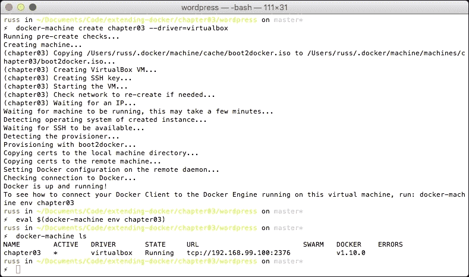

既然我们已经有了机器，可以使用 Docker Compose 来运行 WordPress 场景。首先，我们需要启动我们的 WordPress 容器，正如之前那样，我们使用来自 Docker Hub 的官方 WordPress 和 MySQL 镜像，我们的 `docker-compose.yml` 文件类似于以下代码：

```
version: '2'
services:
  wordpress:
    container_name: my-wordpress-app
    image: wordpress
    ports: 
      - "80:80"
    links:
      - mysql
    environment:
      WORDPRESS_DB_HOST: "mysql:3306"
      WORDPRESS_DB_PASSWORD: "password"
  mysql:
    container_name: my-wordpress-database
    image: mysql
    environment:
      MYSQL_ROOT_PASSWORD: "password"
```

如你所见，compose 文件没有什么特别之处。你可以通过运行以下命令启动它：

```
docker-compose up -d

```

启动容器后，通过运行以下命令检查它们的状态：

```
docker-compose ps

```

如果它们的状态都为 `Up`，你可以通过运行以下命令进入 WordPress 安装界面：

```
open http://$(docker-machine ip chapter03)/

```

这将打开你的浏览器并转到 Docker 实例的 IP 地址。在我的例子中是 `http://192.168.99.100/`。你应该看到以下屏幕：

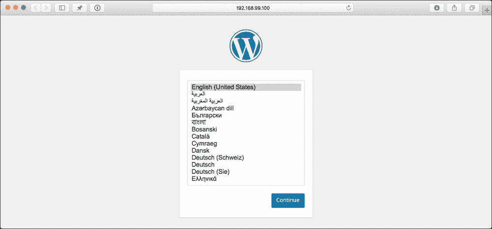

点击 **继续** 按钮并安装 WordPress：

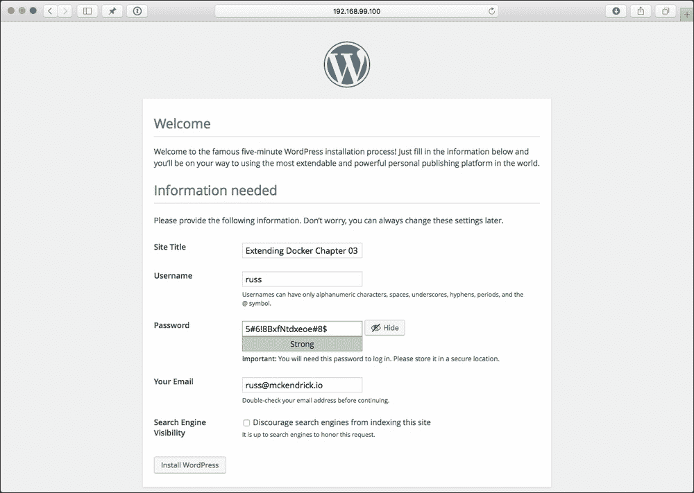

填写完信息后，点击安装 WordPress 以完成安装。完成后，MySQL 数据库将更新你的设置，测试帖子和评论也将被添加。当安装完成后，你将看到一个成功屏幕：

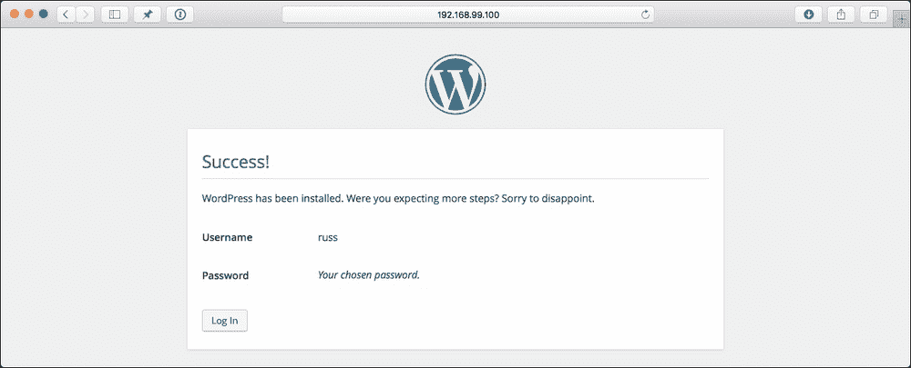

现在你应该能够重新运行以下命令：

```
open http://$(docker-machine ip chapter03)

```

这将带你到一个非常空的 WordPress 网站：

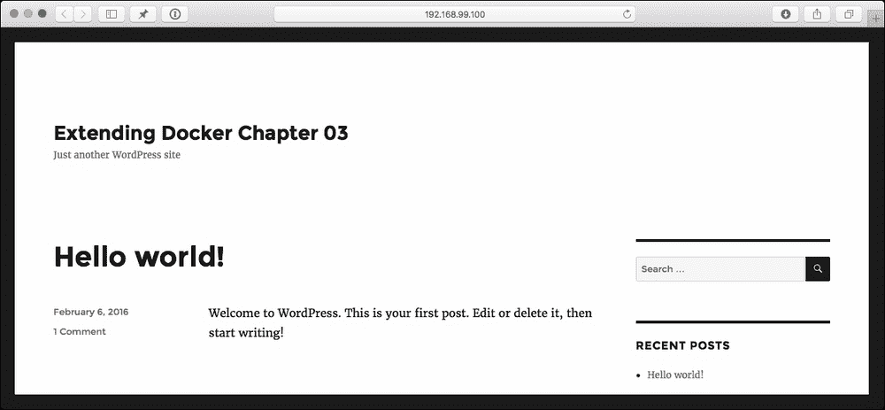

你的命令行历史记录应该类似于以下终端输出：

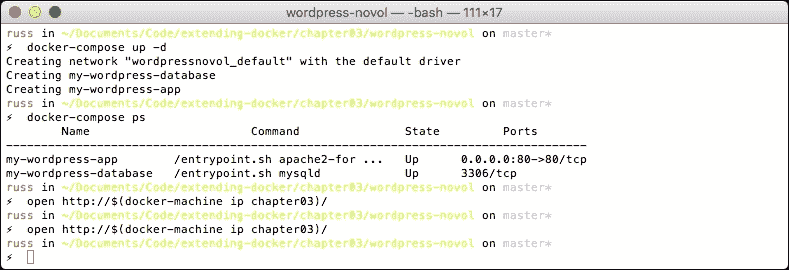

现在我们已经安装了 WordPress 网站，让我们通过运行以下命令销毁容器：

```
docker-compose stop && docker-compose rm

```

确保在提示时输入`y`。然后你会收到一个确认信息，说明你的两个容器已经被删除：

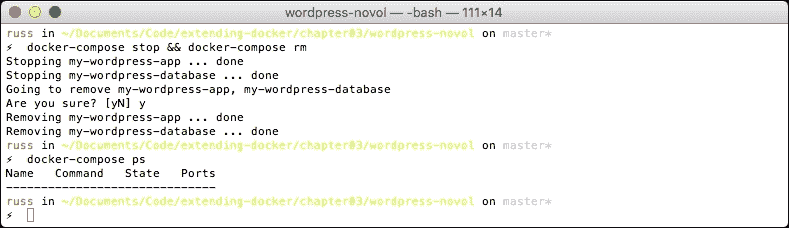

现在我们已经删除了容器，让我们通过重新执行命令来重新创建它们：

```
docker-compose up -d
docker-compose ps
open http://$(docker-machine ip chapter03)/

```

如你所见，你再次看到一个安装界面，这是正常的，因为 MySQL 数据库存储在我们已删除的`mysql`容器中。

在我们继续查看 Docker 自带的功能之前，先做一些整理，删除掉容器：

```
docker-compose stop && docker-compose rm

```

# 默认卷驱动

在我们开始使用第三方卷插件之前，应该先了解一下 Docker 自带的功能以及卷如何解决我们刚才处理的场景。再次提醒，我们将使用一个`docker-compose.yml`文件；不过这次，我们会添加几行代码来创建和挂载卷：

```
version: '2'
services:
  wordpress:
    container_name: my-wordpress-app
    image: wordpress
    ports: 
      - "80:80"
    links:
      - mysql
    environment:
      WORDPRESS_DB_HOST: "mysql:3306"
      WORDPRESS_DB_PASSWORD: "password"
 volumes:
 - "uploads:/var/www/html/wp-content/uploads/"
  mysql:
    container_name: my-wordpress-database
    image: mysql
    environment:
      MYSQL_ROOT_PASSWORD: "password"
    volumes:
      - "database:/var/lib/mysql"
volumes:
 uploads:
 driver: local
 database:
 driver: local

```

如你所见，这里我们创建了两个卷，一个叫`uploads`，它被挂载到 WordPress 容器的上传文件夹中。第二个卷叫`database`，它被挂载到 MySQL 容器的`/var/lib/mysql`目录中。

你可以使用以下命令启动容器并打开 WordPress：

```
docker-compose up -d
docker-compose ps
open http://$(docker-machine ip chapter03)/

```

在我们完成浏览器中的 WordPress 安装之前，我们应该通过运行`docker exec`命令确保`uploads`文件夹具有正确的权限：

```
docker exec -d my-wordpress-app chmod 777 /var/www/html/wp-content/uploads/

```

现在`uploads`文件夹的权限已经正确设置，我们可以按照之前的测试继续进行 WordPress 安装：

由于 WordPress 会在安装过程中创建一个`Hello World!`测试帖子，我们应该去编辑该帖子。要做到这一点，请使用安装时输入的凭证登录到 WordPress。登录后，进入**文章** | **Hello World**，然后点击**设置特色图片**按钮上传一张特色图片。上传完特色图片后，你的编辑界面应该类似于以下截图：

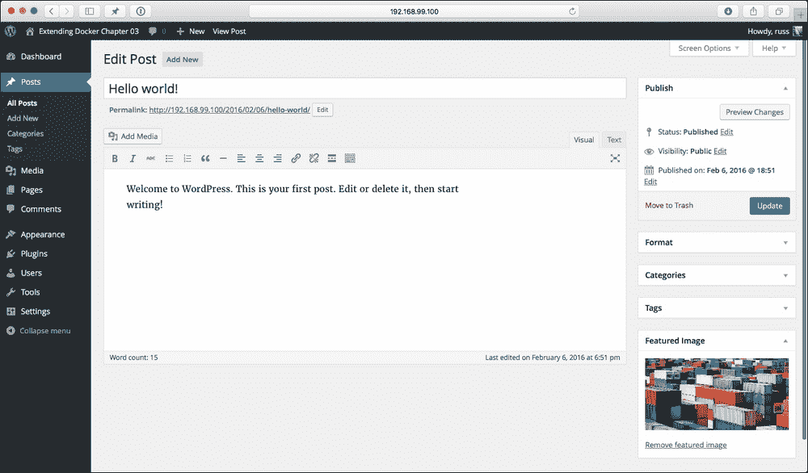

上传完图片后，点击**更新**按钮，然后通过点击屏幕左上角的标题返回到你的 WordPress 首页。当首页打开后，你应该能看到你上传的特色图片：

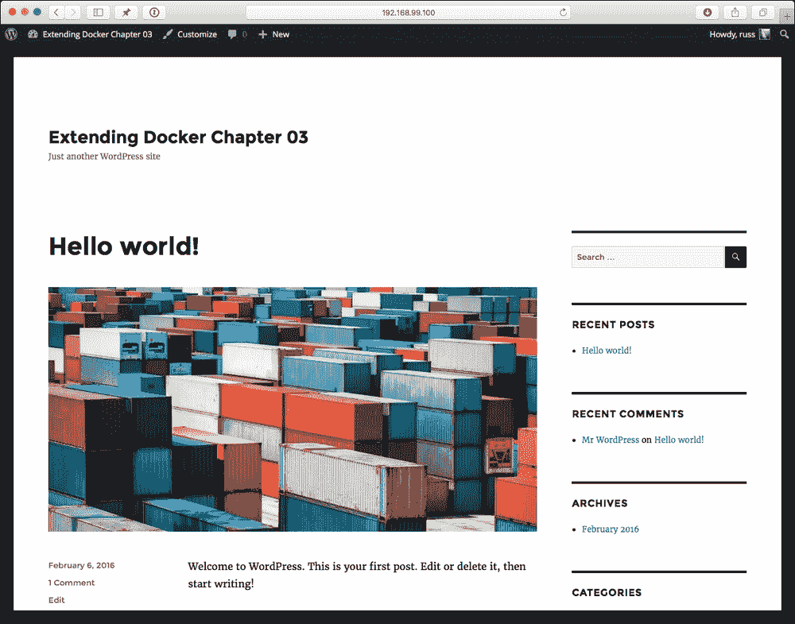

在删除容器之前，你可以运行以下命令来显示 Docker 中已创建的所有卷：

```
docker volume ls

```

运行该命令时，你应该能看到我们在`docker-compose.yml`文件中定义的两个卷：

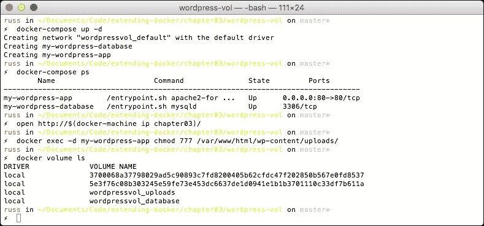

记得，正如我们在上一章讨论的那样，Docker Compose 会将项目标题（即`docker-compose.yml`所在文件夹的名称）作为前缀，这个项目名叫做`wordpress-vol`，由于名称中不允许有`-`，因此它被去掉了，留下了`wordpressvol`。

现在我们有了基本的 WordPress 安装并且更新了内容，让我们像之前一样删除容器：

```
docker-compose stop && docker-compose rm
docker-compose ps

```

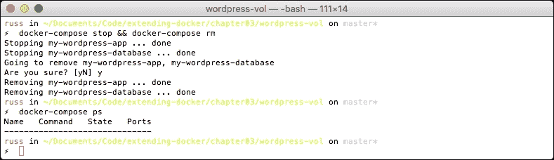

到此为止，你大概可以猜到接下来会发生什么，让我们重新启动容器，并在浏览器中打开 WordPress 网站：

```
docker-compose up -d
open http://$(docker-machine ip chapter03)/

```

启动可能需要几秒钟的时间，因此如果浏览器打开时没有看到你的 WordPress，刷新页面。如果一切顺利，你应该能看到你编辑过的 `Hello World!` 博客文章：

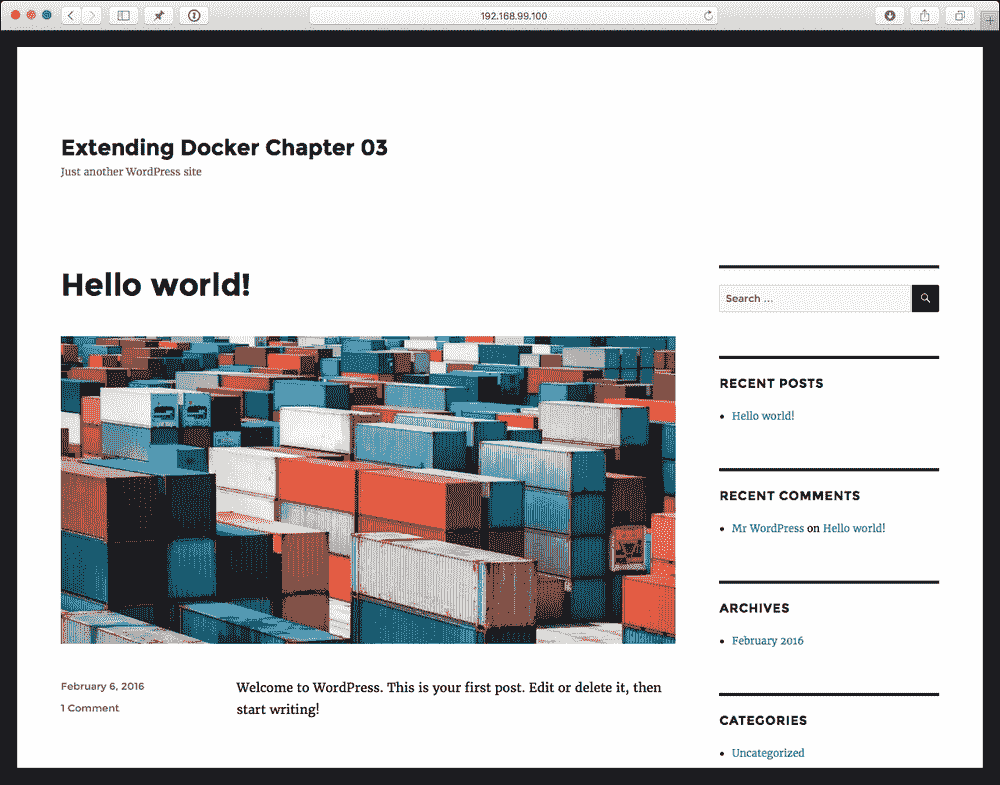

虽然这看起来和之前的截图相同，但你会注意到你已经从 WordPress 中登出了。这是因为默认情况下，WordPress 将其会话存储在文件系统中，并且由于会话文件不存储在上传目录中，因此在我们删除容器时会丢失会话文件。

卷也可以在容器之间共享，如果我们在 `docker-compose.yml` 文件的 `Services` 部分添加以下内容：

```
  wordpress8080:
    container_name: my-wordpress-app-8080
    image: wordpress
    ports: 
      - "8080:80"
    links:
      - mysql
    environment:
      WORDPRESS_DB_HOST: "mysql:3306"
      WORDPRESS_DB_PASSWORD: "password"
    volumes:
      - "uploads:/var/www/html/wp-content/uploads/"
```

你可以启动一个第二个容器，在 `port 8080` 上运行 WordPress，并访问我们上传的文件，网址是 `http://192.168.99.100:8080/wp-content/uploads/2016/02/containers-1024x512.png`。

请注意，前面的 URL 会因你的安装环境而有所不同，因为 IP 地址可能不同，上传日期和文件名也可能不同。

你可以通过运行以下命令获取更多关于卷的信息：

```
docker volume inspect <your_volume_name>

```

在我们的案例中，返回以下信息：

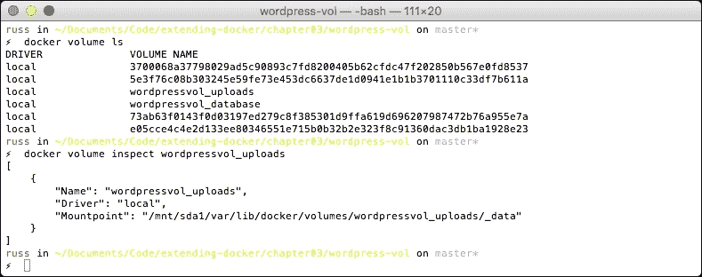

你可能已经注意到，我们为两个卷使用了 `local` 驱动，这会在我们的 Docker 实例上创建卷，并挂载来自主机的文件夹，这里是指运行在 VirtualBox 下的 Docker Machine 主机。

你可以通过 SSH 登录到主机并进入 `docker volume inspect` 命令返回的挂载点目录来查看文件夹中的内容。要通过 SSH 登录并切换到 root 用户，运行以下命令：

```
docker-machine ssh chapter03
sudo su -

```

然后你就可以切换到包含卷的文件夹，切换到 root 用户的原因是确保你有权限查看文件夹中的内容：

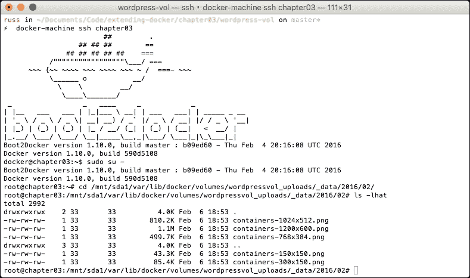

如前面终端输出所示，这些文件属于一个未知用户，其用户 ID 和组 ID 为 32，在容器中，这是 Apache 用户。如果你直接添加文件或进行更改，请小心，因为你可能会遇到各种权限错误，尤其是在容器访问你添加或更改的文件时。

到目前为止一切顺利，但有什么限制呢？最大的限制是你的数据绑定到单个实例。在上一章中，我们讨论了如何使用 Swarm 进行 Docker 集群化，我们提到使用 Docker Compose 启动的容器绑定到单个实例，这对于开发非常好，但对于生产环境来说就不太适用了，因为我们可能有多个主机实例，希望将容器分布到多个实例上，这时候第三方卷驱动就派上用场了。

## 第三方卷驱动

有多种第三方卷驱动可供选择，它们各自提供不同的功能。首先，我们将研究 Rancher 提供的 Convoy。

在我们开始安装 Convoy 之前，应该先考虑在云端某个地方启动一个 Docker 实例。由于我们已经在 DigitalOcean 和 Amazon Web Services 中启动了 Docker 实例，我们应该终止本地的 `chapter03` 实例，并在这些提供商中重新启动它，我将使用 DigitalOcean：

```
docker-machine stop chapter03 && docker-machine rm chapter03
docker-machine create \
 --driver digitalocean \
 --digitalocean-access-token sdnjkjdfgkjb345kjdgljknqwetkjwhgoih314rjkwergoiyu34rjkherglkhrg0\
 --digitalocean-region lon1 \
 --digitalocean-size 1gb \
 chapter03
eval "$(docker-machine env chapter03)"

```

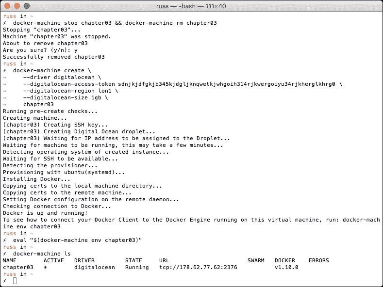

我们在云提供商中启动实例的原因之一是，我们需要一个完整的底层操作系统来安装和使用 Convoy，而 Boot2Docker 提供的镜像虽然不错，但对于我们的需求来说，它稍微有些轻量级。

### 提示

在进一步操作之前，我建议您为 DigitalOcean 的 Droplet 配置一个浮动 IP 地址。原因是，在本章节中，我们将安装 WordPress，并将安装迁移到新机器上。如果没有浮动 IP 地址，您的 WordPress 安装可能会出现问题。您可以在 DigitalOcean 网站上找到有关浮动 IP 地址的更多信息，网址是 [`www.digitalocean.com/community/tutorials/how-to-use-floating-ips-on-digitalocean`](https://www.digitalocean.com/community/tutorials/how-to-use-floating-ips-on-digitalocean)。

### 安装 Convoy

如前所述，我们需要在底层 Docker 主机操作系统上安装 Convoy。为此，您应首先通过 SSH 登录到 Docker 主机：

```
docker-machine ssh chapter03

```

### 提示

由于机器已在 DigitalOcean 启动，我们已经以 root 用户身份连接；这意味着我们在执行命令时不需要加 `sudo`，但是由于您可能在其他提供商处启动实例，我会保留 `sudo`，以防您不是 root 用户而遇到权限错误。

现在，您已经使用 `ssh` 命令登录到 Docker 主机，我们可以安装并启动 Convoy。Convoy 是用 Go 编写的，并以静态二进制文件形式发布。这意味着我们不需要手动编译它；我们只需获取二进制文件并将其复制到指定位置：

```
wget https://github.com/rancher/convoy/releases/download/v0.4.3/convoy.tar.gz
tar xvf convoy.tar.gz
sudo cp convoy/convoy convoy/convoy-pdata_tools /usr/local/bin/

```

Convoy 的更新版本可以在 [`github.com/rancher/convoy/releases`](https://github.com/rancher/convoy/releases) 上找到；不过，这些版本仅供 Rancher 使用。我们将在后面的章节中详细讨论 Rancher。

现在我们已经准备好了二进制文件，接下来需要设置我们的 Docker 安装，以便加载插件：

```
sudo mkdir -p /etc/docker/plugins/
sudo bash -c 'echo "unix:///var/run/convoy/convoy.sock" > /etc/docker/plugins/convoy.spec'

```

`convoy.spec` 文件告诉 Docker 如何访问 Convoy；有关插件工作的更多细节，请参阅 第五章，*构建您自己的插件*。

Convoy 已安装并准备就绪，接下来我们只需添加一些存储。出于测试目的，我们将创建并使用一个回环设备；但是，请不要在生产环境中这样做！

### 注意

回环设备是一种将文件作为真实设备进行解释的机制。此方法的主要优势是，所有用于真实磁盘的工具都可以与回环设备一起使用。请参考[`wiki.osdev.org/Loopback_Device`](http://wiki.osdev.org/Loopback_Device)。

要创建回环设备并挂载它，请运行以下命令：

```
truncate -s 4G data.vol
truncate -s 1G metadata.vol
sudo losetup /dev/loop5 data.vol
sudo losetup /dev/loop6 metadata.vol

```

现在我们的存储已经准备好，我们可以通过运行以下命令启动 Convoy：

```
sudo convoy daemon --drivers devicemapper --driver-opts dm.datadev=/dev/loop5 --driver-opts dm.metadatadev=/dev/loop6 &

```

您应该会看到类似于以下的输出：

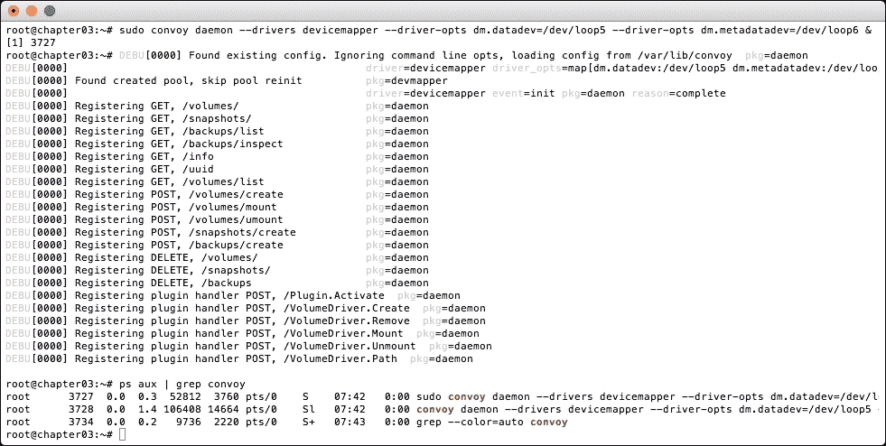

现在我们已经启动了 Convoy，输入`exit`以退出 Docker 主机并返回本地机器。

### 使用 Convoy 卷启动容器

现在我们已经启动了 Convoy，可以对我们的`docker-compose.yml`文件进行一些更改：

```
version: '2'
services:
  wordpress:
    container_name: my-wordpress-app
    image: wordpress
    ports: 
      - "80:80"
    links:
      - mysql
    environment:
      WORDPRESS_DB_HOST: "mysql:3306"
      WORDPRESS_DB_PASSWORD: "password"
    volumes:
      - "uploads:/var/www/html/wp-content/uploads/"
  mysql:
    container_name: my-wordpress-database
 image: mariadb
    environment:
      MYSQL_ROOT_PASSWORD: "password"
 command: mysqld --ignore-db-dir=lost+found
    volumes:
      - "database:/var/lib/mysql/"
volumes:
 uploads:
 driver: convoy
 database:
 driver: convoy

```

如果你没有将`docker-compose.yml`文件放入`wordpressconvoy`文件夹中，你会发现稍后在本节中的某些步骤需要更改卷的名称。

如您所见，我突出显示了一些更改。首先，我们已经切换到了使用 MariaDB，原因是现在我们使用的是实际的文件系统，而不是仅仅在主机上使用一个文件夹。我们有一个`lost` + `found`文件夹，目前官方的 MySQL 容器无法正常工作，因为它认为卷中已经有数据库。为了解决这个问题，我们可以在启动 MySQL 时使用`--ignore-db-dir`指令，而 MariaDB 支持该指令。

让我们启动容器并查看通过以下命令创建的卷：

```
docker-compose up -d
open http://$(docker-machine ip chapter03)/
docker-compose ps
docker volume ls
docker volume inspect wordpressconvoy_database

```

您应该会看到类似于以下的终端输出：

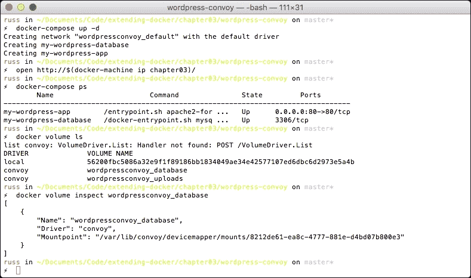

在进行其他操作之前，完成 WordPress 安装并上传一些内容：

```
open http://$(docker-machine ip chapter03)/

```

记得在上传内容之前为卷设置正确的权限：

```
docker exec -d my-wordpress-app chmod 777 /var/www/html/wp-content/uploads/

```

### 使用 Convoy 创建快照

到目前为止，它与默认的卷驱动没有什么不同。让我们来看看创建快照并备份卷的过程，稍后你会明白为什么要这样做。

首先，让我们跳回 Docker 主机：

```
docker-machine ssh chapter03

```

让我们通过运行以下命令来创建我们的第一个快照：

```
sudo convoy snapshot create wordpressconvoy_uploads --name snap_wordpressconvoy_uploads_01
sudo convoy snapshot create wordpressconvoy_database --name snap_wordpressconvoy_database_01

```

一旦创建了快照，您将收到一个唯一的 ID。就我而言，这些 ID 分别是`c00caa88-087d-45ad-9498-7610844c075e`和`4e2a2a6f-887c-4692-b2a8-e1f08aa42400`。

### 备份我们的 Convoy 快照

现在我们已经有了快照，我们可以以此为基础创建备份。为此，我们必须首先确保存储备份的目标目录存在：

```
sudo mkdir /opt/backup/

```

现在我们有了存储备份的地方，让我们创建备份：

```
sudo convoy backup create snap_wordpressconvoy_uploads_01 --dest vfs:///opt/backup/
sudo convoy backup create snap_wordpressconvoy_database_01 --dest vfs:///opt/backup/

```

一旦备份完成，您将收到一个 URL 形式的确认。对于上传，返回的 URL 如下：

```
vfs:///opt/backup/?backup=34ca255e-7164-4734-8b96-579b4e79f728\u0026volume=26a5913e-4794-4df3-bbb9-7a6361c23a75

```

对于数据库，URL 如下：

```
vfs:///opt/backup/?backup=41731035-2760-4a1b-bba9-5e906e2471bc\u0026volume=8212de61-ea8c-4777-881e-d4bd07b800e3

```

记得记录下这些 URL，因为你需要它们来恢复备份。存在一个问题，我们创建的备份存储在我们的 Docker 主机上。如果它出现故障怎么办？那时我们所有的辛勤工作将会丢失！

Convoy 支持为 Amazon S3 创建备份，所以我们来做这件事。首先，你需要登录到你的 Amazon Web Services 账户，并创建一个 S3 桶来存储你的备份。

一旦你创建了一个桶，你需要将凭证添加到服务器：

```
mkdir ~/.aws/
cat >>  ~/.aws/credentials << CONTENT
[default]
aws_access_key_id = JHFDIGJKBDS8639FJHDS
aws_secret_access_key = sfvjbkdsvBKHDJBDFjbfsdvlkb+JLN873JKFLSJH
CONTENT

```

### 注意

要了解如何创建 Amazon S3 桶的更多信息，请参考 [`aws.amazon.com/s3/getting-started/`](https://aws.amazon.com/s3/getting-started/) 的入门指南，关于 `credentials` 文件的详细信息，请参见 [`blogs.aws.amazon.com/security/post/Tx3D6U6WSFGOK2H/A-New-and-Standardized-Way-to-Manage-Credentials-in-the-AWS-SDKs`](http://blogs.aws.amazon.com/security/post/Tx3D6U6WSFGOK2H/A-New-and-Standardized-Way-to-Manage-Credentials-in-the-AWS-SDKs)。

现在你的 Amazon S3 桶已经创建。我将其命名为 `chapter03-backup-bucket` 并创建在 `us-west-2` 区域。你的 Docker 主机已能访问 Amazon 的 API。你可以重新备份数据，但这次，将它们推送到 Amazon S3：

```
sudo convoy backup create snap_wordpressconvoy_uploads_01 --dest s3://chapter03-backup-bucket@us-west-2/
sudo convoy backup create snap_wordpressconvoy_database_01 --dest s3://chapter03-backup-bucket@us-west-2/

```

如你所见，目标 URL 的格式如下：

```
s3://<bucket-name>@<aws-region>

```

一旦备份完成，你将再次收到 URL。在我的例子中，备份的 URL 如下：

```
s3://chapter03-backup-bucket@us-west-2/?backup=6cb4ed46-2084-42bc-8261-6b4da690bd5e\u0026volume=26a5913e-4794-4df3-bbb9-7a6361c23a75

```

对于数据库备份，我们将看到以下内容：

```
s3://chapter03-backup-bucket@us-west-2/?backup=75608b0b-93e7-4319-b212-7a1b0ccaf289\u0026volume=8212de61-ea8c-4777-881e-d4bd07b800e3

```

当运行前述命令时，你的终端输出应该类似于以下内容：

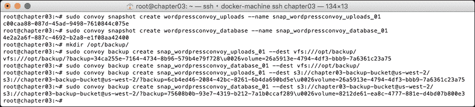

现在我们已经有了数据卷的实例备份，让我们终止 Docker 主机并启动新的主机。如果你还没这样做，`exit` 离开 Docker 主机，并通过运行以下命令终止它：

```
docker-machine stop chapter03 && docker-machine rm chapter03

```

### 恢复我们的 Convoy 备份

如下图所示，我们已将快照备份存储在 Amazon S3 桶中：

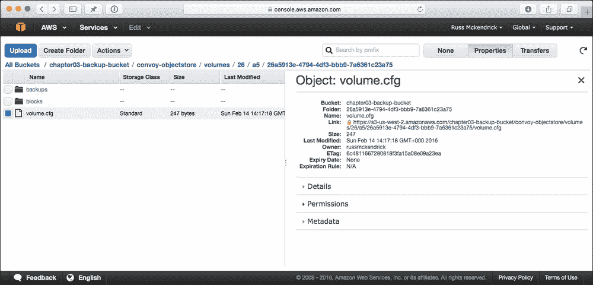

在恢复备份之前，我们需要重新创建我们的 Docker 实例。使用本章前面的部分中提供的在 DigitalOcean 启动 Docker 主机、安装和启动 Convoy 以及设置 AWS 凭证文件的说明。

### 小贴士

在继续之前，记得将你的浮动 IP 地址重新分配给 Droplet。

一旦你完成备份并且系统运行正常，你应该能够运行以下命令来恢复卷：

```
sudo convoy create wordpressconvoy_uploads --backup s3://chapter03-backup-bucket@us-west-2/?backup=6cb4ed46-2084-42bc-8261-6b4da690bd5e\u0026volume=26a5913e-4794-4df3-bbb9-7a6361c23a75 

```

你还应该能够运行以下命令：

```
sudo convoy create wordpressconvoy_database --backup s3://chapter03-backup-bucket@us-west-2/?backup=75608b0b-93e7-4319-b212-7a1b0ccaf289\u0026volume=8212de61-ea8c-4777-881e-d4bd07b800e3

```

恢复卷的过程将需要几分钟，在此期间，你将看到大量输出流向你的终端。输出应该类似于以下截图：

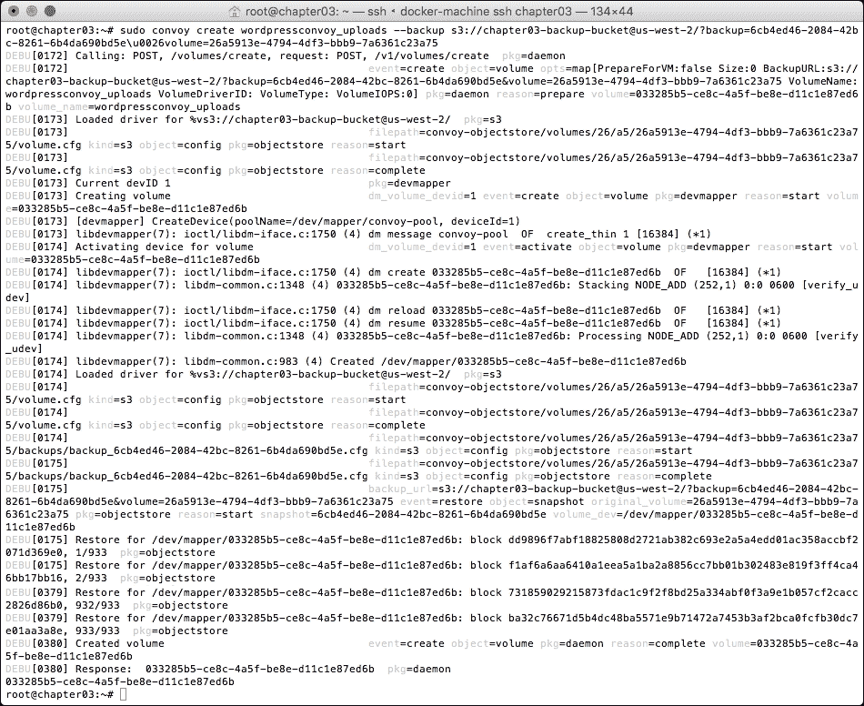

如你在前面的终端会话结束时所见，恢复过程会从 S3 桶中恢复每个块，因此你会看到这些消息不断滚动。

一旦你恢复了这两个卷，返回到你的 Docker Compose 文件并运行以下命令：

```
docker-compose up -d

```

如果一切按计划进行，你应该能够打开浏览器并查看你的内容保持完好，且按你所见的方式显示，使用以下命令：

```
open http://$(docker-machine ip chapter03)/

```

### 提示

别忘了，如果你已经完成了 Docker 主机的操作，你需要使用 `docker-machine stop chapter03 && docker-machine rm chapter03` 来停止并移除它，否则你可能会产生不必要的费用。

### 总结 Convoy

Convoy 是一个很好的工具，可以开始查看 Docker 卷，它非常适合快速在不同环境之间移动内容，这意味着你不仅可以共享容器，还可以与其他开发人员或系统管理员共享卷。它的安装和配置也非常简单，因为它以预编译的二进制文件形式发布。

### 使用 REX-Ray 的块存储

到目前为止，我们已经查看了使用本地存储并备份到远程存储的驱动程序。现在我们将进一步探索，查看直接附加到我们容器的远程存储。

在这个例子中，我们将启动一个 Docker 实例，在 Amazon Web Services 中启动我们的 WordPress 示例，并使用 EMC 提供的卷驱动程序 REX-Ray 将 Amazon Elastic Block Store 卷附加到我们的容器上。

REX-Ray 支持公共云和 EMC 自有存储类型，如下所示：

+   AWS EC2

+   OpenStack

+   Google 计算引擎

+   EMC Isilon, ScaleIO, VMAX 和 XtremIO

该驱动程序正在积极开发中，承诺很快会支持更多类型的存储。

### 安装 REX-Ray

由于我们将使用 Amazon EBS 卷，我们需要在 AWS 中启动 Docker 主机，因为 EBS 卷不能作为块设备挂载到其他云提供商的实例上。根据前一章内容，这可以使用 Docker Machine 和以下命令完成：

```
 docker-machine create \
 --driver amazonec2 \
 --amazonec2-access-key JHFDIGJKBDS8639FJHDS \
 --amazonec2-secret-key sfvjbkdsvBKHDJBDFjbfsdvlkb+JLN873JKFLSJH \
 --amazonec2-vpc-id vpc-35c91750 \
 chapter03

```

切换 Docker Machine 使用新创建的主机：

```
eval "$(docker-machine env chapter03)"

```

然后，使用 SSH 进入主机，如下所示：

```
docker-machine ssh chapter03

```

一旦你进入 Docker 主机，运行以下命令来安装 REX-Ray：

```
curl -sSL https://dl.bintray.com/emccode/rexray/install | sh -

```

这将下载并执行 REX-Ray 最新稳定版本的基本配置：

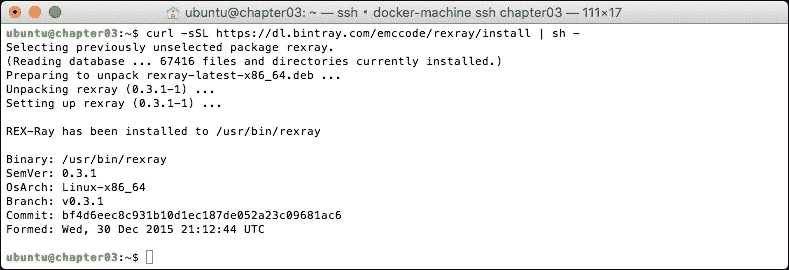

安装 REX-Ray 后，我们需要配置它以使用 Amazon EBS 卷。作为 root 用户，执行以下操作，在 `/etc/rexray/` 中添加一个名为 `config.yml` 的文件：

```
sudo vim /etc/rexray/config.yml

```

文件应包含以下内容，记得替换 AWS 凭证的值：

```
rexray:
  storageDrivers:
  - ec2
aws:
  accessKey: JHFDIGJKBDS8639FJHDS
  secretKey: sfvjbkdsvBKHDJBDFjbfsdvlkb+JLN873JKFLSJH
```

一旦你添加了配置文件，你应该能够直接使用 REX-Ray，运行以下命令应该返回一个 EBS 卷的列表：

```
sudo rexray volume ls

```

如果你看到卷的列表，那么你需要启动该过程。如果没有看到卷，请检查你为 `accesskey` 和 `secretkey` 提供的用户是否具有读取和创建 EBS 卷的权限。要启动过程并检查一切是否正常，运行以下命令：

```
sudo systemctl restart rexray
sudo systemctl status rexray

```

如果一切按预期工作，你应该看到类似以下的终端输出：

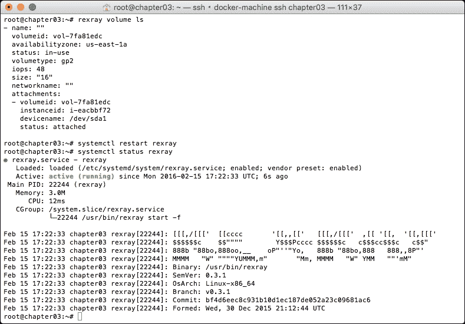

安装的最后一步是重新启动实例上的 Docker，以便它识别新的卷驱动程序。为此，运行以下命令：

```
sudo systemctl restart docker

```

现在是时候启动一些容器了。我们需要对 Docker Compose 文件做的唯一更改是修改卷驱动程序的名称，其他内容保持不变：

```
version: '2'
services:
  wordpress:
    container_name: my-wordpress-app
    image: wordpress
    ports: 
      - "80:80"
    links:
      - mysql
    environment:
      WORDPRESS_DB_HOST: "mysql:3306"
      WORDPRESS_DB_PASSWORD: "password"
    volumes:
      - "uploads:/var/www/html/wp-content/uploads/"
  mysql:
    container_name: my-wordpress-database
    image: mariadb
    environment:
      MYSQL_ROOT_PASSWORD: "password"
    command: mysqld --ignore-db-dir=lost+found
    volumes:
      - "database:/var/lib/mysql/"
volumes:
  uploads:
    driver: rexray
  database:
    driver: rexray
```

一旦应用程序启动，运行以下命令设置上传文件夹的权限：

```
docker exec -d my-wordpress-app chmod 777 /var/www/html/wp-content/uploads/

```

在 AWS 控制台中，你会注意到现在有一些额外的卷：

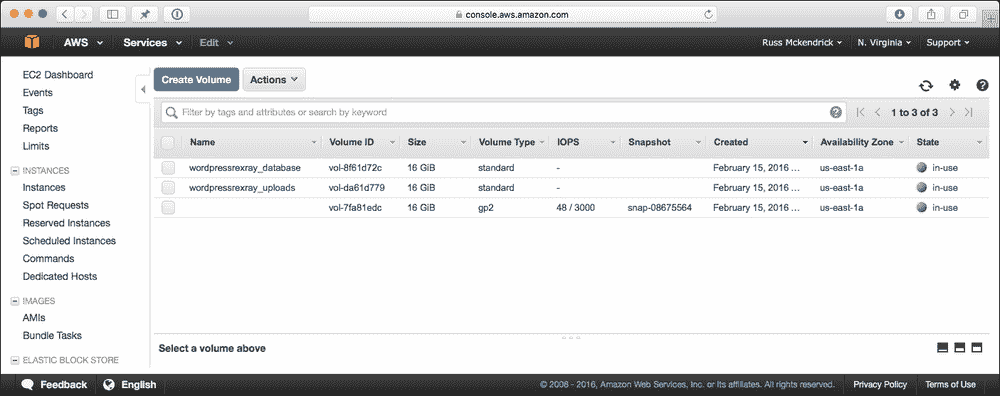

通过运行以下命令，在浏览器中打开你新的 WordPress 安装：

```
open http://$(docker-machine ip chapter03)/

```

如果你在浏览器中打开 WordPress 站点时遇到问题，请在 AWS 控制台中找到正在运行的实例，并为 `port 80`/`HTTP` 添加规则到 **DOCKER-MACHINE** 安全组。你的规则应类似于以下图像：

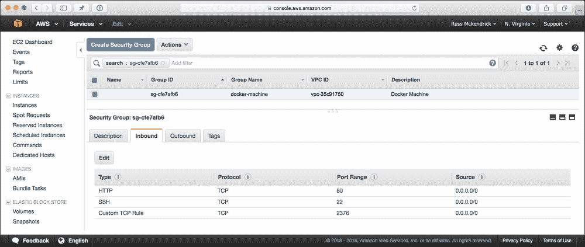

你只需添加一次规则，因为每当你启动更多的 Docker 主机时，Docker Machine 会重新分配 `docker-machine` 安全组。

一旦页面打开，完成 WordPress 安装并编辑或上传一些内容。你现在应该知道流程了，添加完内容后，是时候停止容器、删除容器，然后终止 Docker 主机：

```
docker-compose stop
docker-compose rm

```

在移除主机之前，你可以通过运行以下命令检查卷的状态：

```
docker volume ls

```

你将看到类似以下的图像：

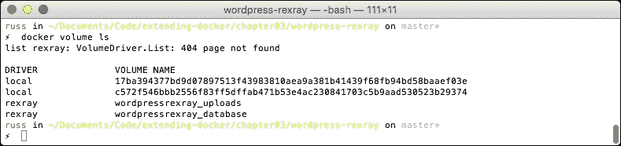

最后，是时候移除 Docker 主机了：

```
docker-machine stop chapter03 && docker-machine rm chapter03

```

### 移动 REX-Ray 卷

在我们用 Docker Machine 启动新 Docker 主机之前，值得指出的是，我们的 WordPress 安装可能看起来有些损坏。

这是因为将我们的容器迁移到新的主机会改变我们访问 WordPress 站点的 IP 地址，意味着在你将设置更改为使用第二个节点的 IP 地址之前，你将看到一个损坏的站点。

这是因为它尝试从第一个 Docker 主机的 IP 地址加载内容，如 CSS 和 JavaScript。

关于如何更新这些设置的更多信息，请参阅 WordPress Codex：[`codex.wordpress.org/Changing_The_Site_URL`](https://codex.wordpress.org/Changing_The_Site_URL)。

此外，如果你已经登录到 AWS 控制台，你可能注意到你的 EBS 卷目前没有附加到任何实例：

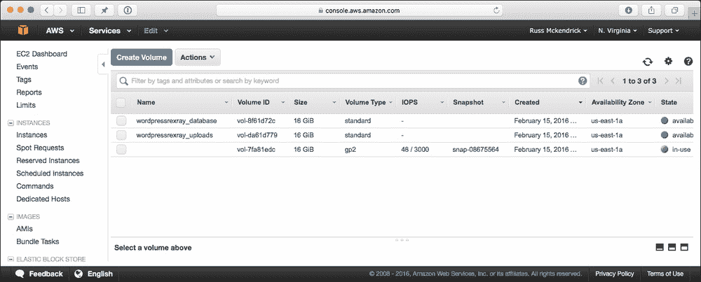

既然这些都处理好了，让我们使用 Docker Machine 启动新的 Docker 主机。如果你按照上一节的说明启动主机、连接、安装 REX-Ray 并启动 WordPress 和数据库容器，正如我们之前讨论的，你可以通过连接到数据库来更新站点的 IP 地址：

1.  如果你想更新 IP 地址，可以运行以下命令。首先，连接到你的数据库容器：

    ```
    docker exec -ti my-wordpress-database env TERM=xterm bash -l

    ```

1.  然后使用 MySQL 客户端连接到 MariaDB：

    ```
    mysql -uroot -ppassword --protocol=TCP -h127.0.0.1

    ```

1.  切换到 `wordpress` 数据库：

    ```
    use wordpress;

    ```

1.  然后最后运行以下 SQL。在我的例子中，`http://54.175.31.251` 是旧的 URL，而 `http://52.90.249.56` 是新的 URL：

    ```
    UPDATE wp_options SET option_value = replace(option_value, 'http://54.175.31.251', 'http://52.90.249.56') WHERE option_name = 'home' OR option_name = 'siteurl';
    UPDATE wp_posts SET guid = replace(guid, 'http://54.175.31.251','http://52.90.249.56');
    UPDATE wp_posts SET post_content = replace(post_content, 'http://54.175.31.251', 'http://52.90.249.56');
    UPDATE wp_postmeta SET meta_value = replace(meta_value,'http://54.175.31.251','http://52.90.249.56');
    ```

你的终端会话应该类似于以下截图：

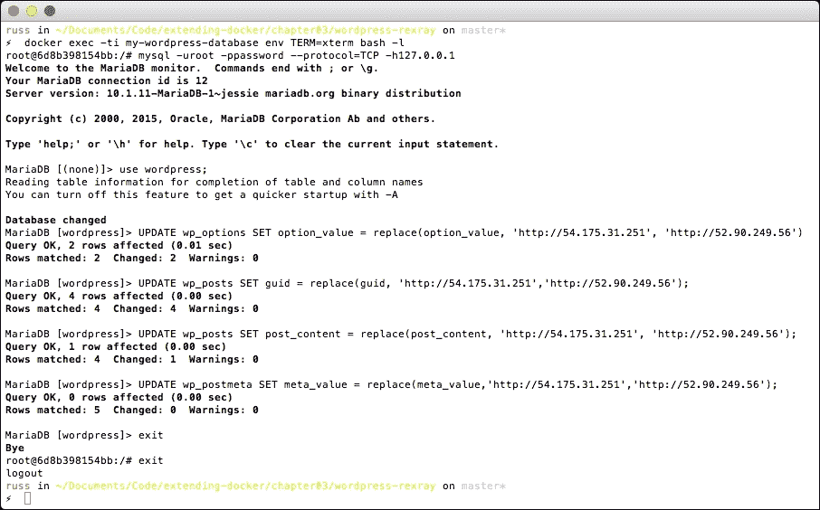

不过，我们可以看到内容确实存在，尽管站点看起来像是坏了。

### 总结 REX-Ray

REX-Ray 仍然处于早期开发阶段，正在不断添加更多功能。在接下来的几个版本中，我预见它将变得越来越有用，因为它正逐渐朝着成为一个集群感知工具而非目前的独立工具发展。

然而，即使在其开发的早期阶段，它仍然是使用 Docker 卷与外部存储的一个极好的入门工具。

## Flocker 和 Volume Hub

我们将要看的下一个工具是 ClusterHQ 提供的 Flocker。它无疑是我们将在本章中看到的第三方卷驱动中功能最丰富的。如以下支持的存储选项所示，它涵盖了最广泛的存储后端：

+   AWS Elastic Block Storage

+   OpenStack Cinder 与任何支持的后端

+   EMC ScaleIO、XtremeIO 和 VMAX

+   VMware vSphere 和 vSan

+   NetApp OnTap

+   戴尔存储 SC 系列

+   HPE 3PAR StoreServ 和 StoreVirtual（仅支持 OpenStack）

+   华为 OceanStor

+   Hedvig

+   NexentaEdge

+   ConvergeIO

+   Saratoga Speed

还将很快支持以下存储选项：

+   Ceph

+   Google Persistent Disk

由于大多数人都可以访问 AWS，我们将查看如何在 AWS 上启动 Flocker 集群。

### 形成你的 Flock

我们将不再亲自手动安装 Flocker，而是将快速了解如何快速启动 Flocker。

本章的这一部分，我们将通过 ClusterHQ 提供的 AWS CloudFormation 模板启动一个集群，快速启动一个 Flocker 集群。

### 注意

AWS CloudFormation 是亚马逊提供的编排工具，允许你定义你希望的 AWS 基础设施的外观和配置方式。CloudFormation 是免费使用的；但是，你需要为它启动的资源付费。截至撰写时，运行模板一个月的预计费用是 $341.13。有关 CloudFormation 的更多信息，请参考 [`aws.amazon.com/cloudformation/`](https://aws.amazon.com/cloudformation/)，或者要了解费用详情，请参考 [`calculator.s3.amazonaws.com/index.html#r=IAD&s=EC2&key=calc-D96E035B-5A84-48DE-BF62-807FFE4740A8`](http://calculator.s3.amazonaws.com/index.html#r=IAD&s=EC2&key=calc-D96E035B-5A84-48DE-BF62-807FFE4740A8)。

在启动 CloudFormation 模板之前，我们需要执行一些步骤。首先，您需要创建一个密钥对供模板使用。为此，请登录到 AWS 控制台 [`console.aws.amazon.com/`](https://console.aws.amazon.com/)，选择您的区域，然后点击 EC2，再在左侧点击**密钥对**菜单，您创建的密钥对应命名应类似于 flocker-test：

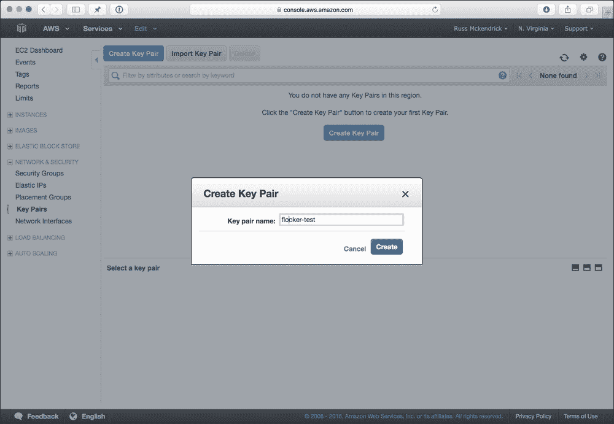

点击**创建**按钮后，您的密钥对将被下载，**请妥善保管**，因为以后无法再次下载。现在您已创建并安全下载了密钥对，接下来是时候在 ClusterHQ Volume Hub 上创建一个账户了，您可以访问[`volumehub.clusterhq.com/`](https://volumehub.clusterhq.com/)进行注册。

Volume Hub（在写本书时仍处于 Alpha 测试阶段）是一个基于 Web 的接口，用于管理您的 Flocker 卷。您可以使用您的电子邮件地址注册账户，或使用 Google ID 进行登录。

登录/注册后，您将看到一条提示，显示*您似乎还没有集群*，并提供创建新集群或连接到现有集群的选项：

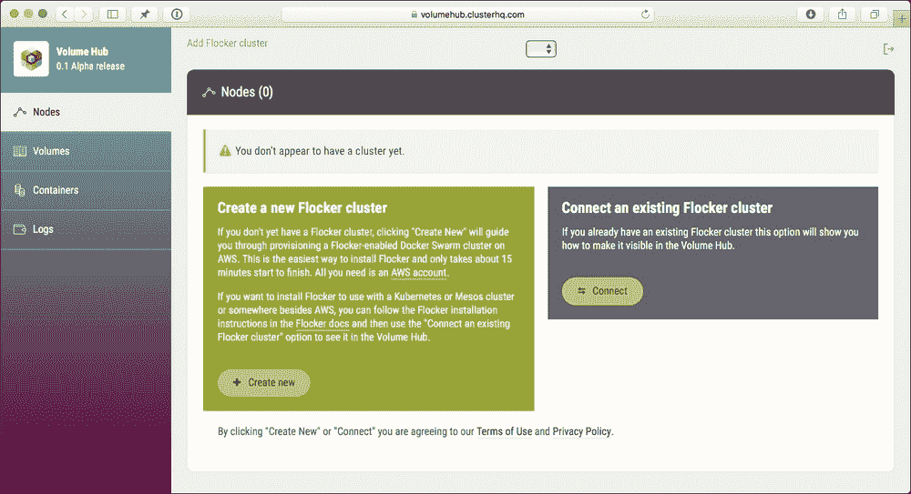

点击**创建新建**按钮将弹出一个覆盖层，里面包含了如何使用 AWS CloudFormation 创建集群的说明。由于我们已经完成了第一步，向下滚动到第二步。在这里，您应该看到一个按钮，显示**开始 CloudFormation 配置过程**，点击它将打开一个新标签页，直接带您进入 AWS 控制台中的 AWS CloudFormation 页面：

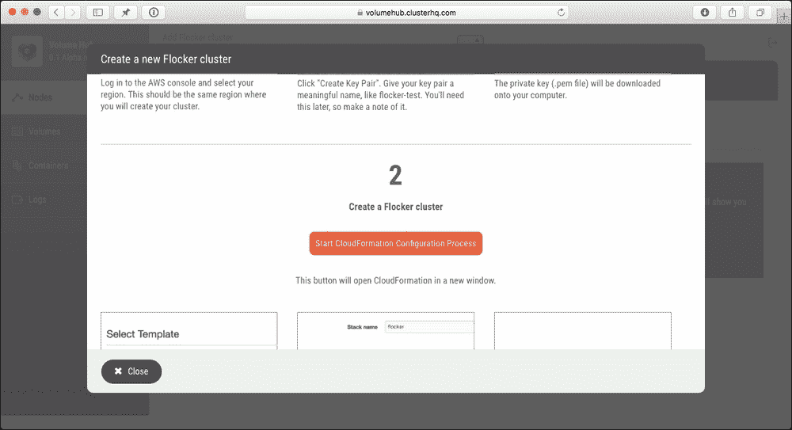

启动 AWS CloudFormation 堆栈的第一步是选择模板，这一步已经为我们完成，您可以点击**下一步**按钮。

接下来，您将需要提供一些关于堆栈的详细信息，包括堆栈名称、EC2 密钥对名称、AWS 访问和密钥秘钥以及您的 Volume Hub 令牌。

要获取您的 Volume Hub 令牌，请访问[`volumehub.clusterhq.com/v1/token`](https://volumehub.clusterhq.com/v1/token)，系统会展示给您一个令牌。此令牌是唯一与您的 Volume Hub 账户相关联的，请务必不要与他人分享：

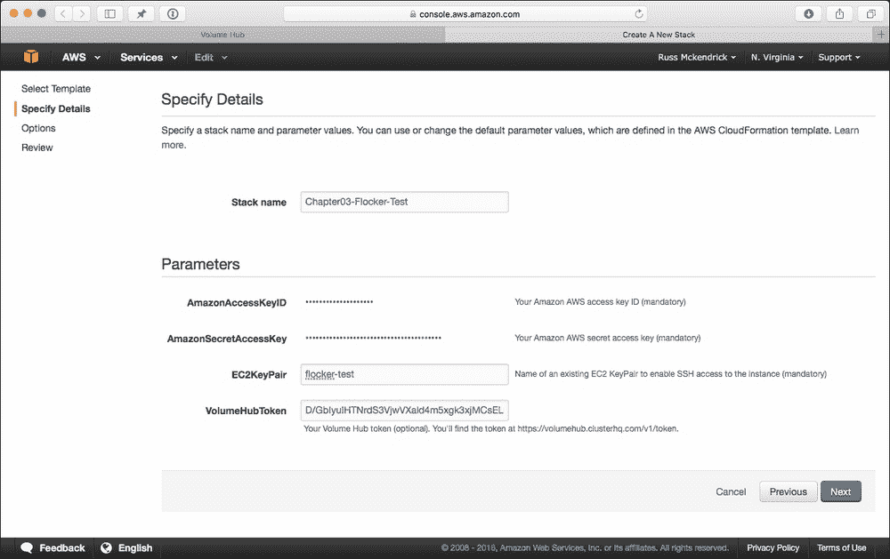

填写完详细信息后，您可以点击**下一步**按钮。在下一页中，系统会要求您为资源添加标签，这是可选的。您应该按照平常的流程为资源打标签。添加完标签后，点击**下一步**按钮。

### 提示

请注意，点击创建将会在您的 AWS 账户中启动资源，并产生按小时计费的费用。仅在您打算继续执行接下来的步骤时点击创建。

下一页将展示您提供的详细信息的概览。如果您对这些信息满意，请点击**创建**按钮。

点击**创建**按钮后，你将被带回到 AWS CloudFormation 页面，在那里你应该看到你的堆栈状态为**CREATE_IN_PROGRESS**：

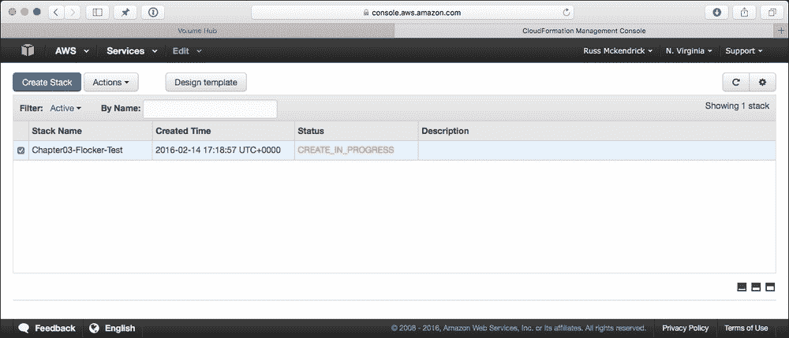

如果你没有看到你的堆栈，点击右上角的刷新图标。通常情况下，创建集群大约需要 10 分钟。在堆栈创建过程中，你可以点击屏幕右下角的一个**拆分窗格**图标，查看正在进行的事件。

此外，在集群启动时，你应该开始看到节点在你的 Volume Hub 账户中注册。然而，尽管很诱人，还是不要在你的堆栈状态为**CREATE_COMPLETE**之前使用 Volume Hub。

一旦堆栈部署完成，点击**输出**标签。这将给你提供连接到集群所需的详细信息。你应该看到类似以下的内容：

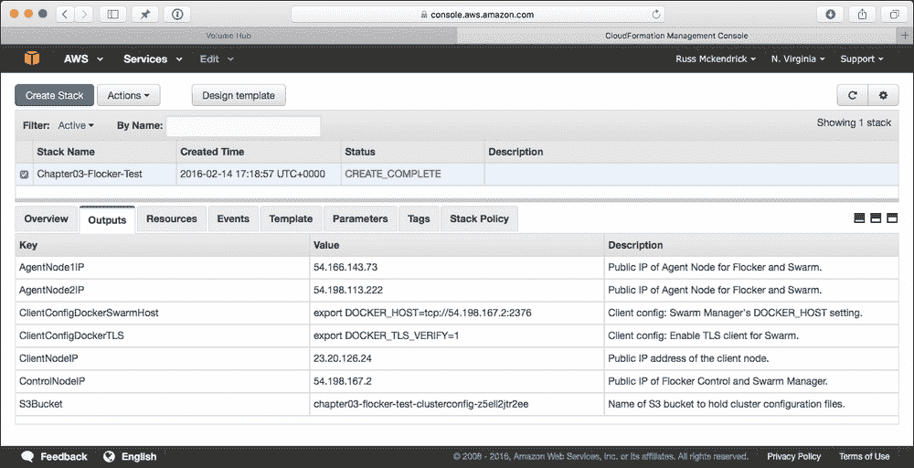

我们需要做的第一件事是为之前创建的密钥对设置正确的权限。在我的案例中，它位于我的`Downloads`文件夹中：

```
chmod 0400 ~/Downloads/flocker-test.pem.txt

```

一旦你设置了权限，你需要使用`ubuntu`作为用户名和你的密钥对登录到客户端节点。在我的案例中，客户端节点的 IP 地址是 23.20.126.24：

```
ssh ubuntu@23.20.126.24 -i ~/Downloads/flocker-test.pem.txt

```

登录后，你需要运行一些额外的命令来准备集群。为此，你需要记下**控制节点**的 IP 地址，在前面的屏幕中是`54.198.167.2`：

```
export FLOCKER_CERTS_PATH=/etc/flocker
export FLOCKER_USER=user1
export FLOCKER_CONTROL_SERVICE=54.198.167.2

```

现在你已经连接到控制服务，你应该能够使用`flockerctl`命令查看集群概况：

```
flockerctl status
flockerctl ls

```

在运行`flockerctl ls`命令时，你不应该看到任何数据集列出。现在我们应该连接到 Docker。为此，运行以下命令：

```
export DOCKER_TLS_VERIFY=1
export DOCKER_HOST=tcp://$FLOCKER_CONTROL_SERVICE:2376
docker info | grep Nodes

```

在写这本书时，Flocker AWS CloudFormation 模板安装并配置了 Docker 1.9.1 和 Docker Compose 1.5.2。这意味着你将无法使用新的 Docker Compose 文件格式。然而，在 GitHub 仓库中，应该有旧版和新版格式的 Docker Compose 文件，这些文件伴随本书提供。

你可以在 [`github.com/russmckendrick/extending-docker/`](https://github.com/russmckendrick/extending-docker/) 找到该代码库。

你的终端输出应该看起来类似于以下的会话：

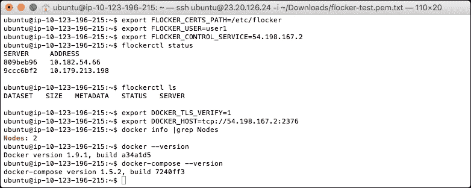

现在一切都已启动运行，让我们使用 Flocker 卷启动我们的 WordPress 安装。

### 部署到 Flock 中

我们首先要做的是创建卷。我们可以让 Flocker 使用其默认值，即 75 GB 的 EBS 卷，但这对于我们的需求来说有些过大：

```
docker volume create -d flocker -o size=1G -o profile=bronze --name=database
docker volume create -d flocker -o size=1G -o profile=bronze --name=uploads

```

如您所见，这是一个更合适的大小，我们选择了与之前示例相同的卷名称。现在我们已经创建了卷，可以启动 WordPress。为此，我们有两个 Docker Compose 文件，一个将在 AgentNode1 上启动容器，另一个将在 AgentNode2 上启动容器。首先，创建一个文件夹来存储文件：

```
mkdir wordpress
cd wordpress
vim docker-compose-node1.yml

```

如前所述，在编写本书时，仅支持原始的 Docker Compose 文件格式，因此我们的文件应包含以下内容：

```
wordpress:
  container_name: my-wordpress-app
  image: wordpress
  ports: 
    - "80:80"
  links:
    - mysql
  environment:
 - "constraint:flocker-node==1"
    - "WORDPRESS_DB_HOST=mysql:3306"
    - "WORDPRESS_DB_PASSWORD=password"
  volume_driver: flocker
  volumes:
    - "uploads:/var/www/html/wp-content/uploads/"
mysql:
  container_name: my-wordpress-database
  image: mariadb
  environment:
 - "constraint:flocker-node==1"
     - "MYSQL_ROOT_PASSWORD=password"
  command: mysqld --ignore-db-dir=lost+found
  volume_driver: flocker
  volumes:
    - "database:/var/lib/mysql/"
```

如您所见，它与新格式没有太大区别。需要注意的是绑定容器到节点的行，已在前面的代码中突出显示。

要启动容器，我们必须将文件名传递给 `docker-compose`。为此，请运行以下命令：

```
docker-compose -f docker-compose-node1.yml up -d
docker-compose -f docker-compose-node1.yml ps

```

启动容器后，运行以下命令以设置 `uploads` 文件夹的正确权限：

```
docker exec -d my-wordpress-app chmod 777 /var/www/html/wp-content/uploads/

```

现在我们已经创建了卷并启动了容器，让我们快速查看 Volume Hub：


如您所见，两个卷已显示为附加到内部 IP 为 `10.168.86.184` 的节点。查看 Volumes 页面可以提供更多详细信息：

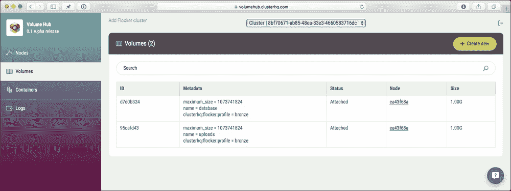

如您所见，我们有关于卷的大小、名称、唯一 ID 以及它附加到哪个节点的信息。我们还可以看到在集群中运行的容器信息：

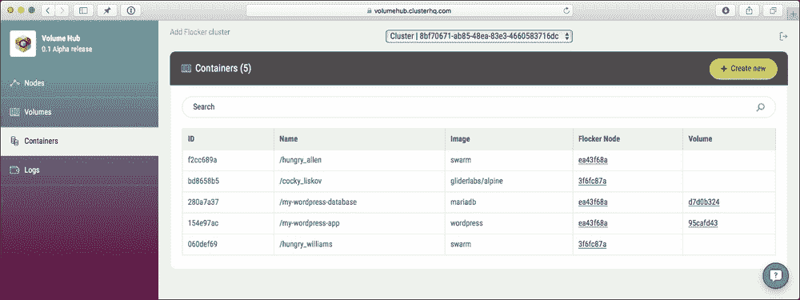

在我们停止并移除容器之前，您应该配置 WordPress，然后登录并上传一个文件。您可以通过运行以下命令并在浏览器中打开映射到端口 80 的 IP 地址来获取可以访问 WordPress 的 IP 地址：

```
docker-compose -f docker-compose-node1.yml ps

```

完成这些更改后，您可以通过运行以下命令来停止并移除容器：

```
docker-compose -f docker-compose-node1.yml stop
docker-compose -f docker-compose-node1.yml rm -f

```

现在您已经移除了容器，是时候在第二个节点上启动它们了。您需要创建第二个 Docker Compose 文件，如下所示：

```
vim docker-compose-node2.yml

```

```
wordpress:
  container_name: my-wordpress-app
  image: wordpress
  ports: 
    - "80:80"
  links:
    - mysql
  environment:
 - "constraint:flocker-node==2"
    - "WORDPRESS_DB_HOST=mysql:3306"
    - "WORDPRESS_DB_PASSWORD=password"
  volume_driver: flocker
  volumes:
    - "uploads:/var/www/html/wp-content/uploads/"
mysql:
  container_name: my-wordpress-database
  image: mariadb
  environment:
 - "constraint:flocker-node==2"
     - "MYSQL_ROOT_PASSWORD=password"
  command: mysqld --ignore-db-dir=lost+found
  volume_driver: flocker
  volumes:
    - "database:/var/lib/mysql/"
```

如您所见，唯一变化的是节点编号。要启动容器，请运行以下命令：

```
docker-compose -f docker-compose-node2.yml up -d

```

启动时间会稍长一些，因为 Flocker 需要取消附加并重新附加卷到第二个节点。一旦容器开始运行，您将看到它们现在显示为附加到第二个节点，在 Volume Hub 中，如下图所示：

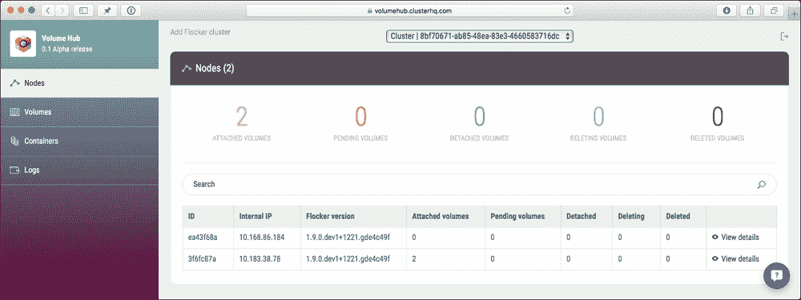

这在 Volume Hub 的其他部分也有体现：


最后，您可以在 **容器** 页面上看到您的新容器：

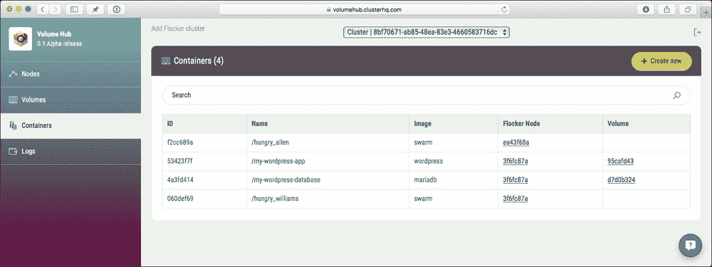

运行以下命令并在浏览器中打开 IP 地址：

```
docker-compose -f docker-compose-node2.yml ps

```

如本章 REX-Rey 部分所提到的，打开 WordPress 时你应该看到一个破损的 WordPress 页面，但这不应该影响你，因为一些内容是从数据库卷中提供的；否则，你将看到安装 WordPress 页面。

所以，这就是你所做的。你使用 Flocker 和 Volume Hub 启动并查看了 Docker 卷，并将它们在主机之间移动。

如本节开头所述，你是按小时收费来运行集群的。要删除集群，你应该进入 AWS 控制台，切换到 CloudFormation 服务，选择你的堆栈，然后从操作下拉菜单中选择删除：

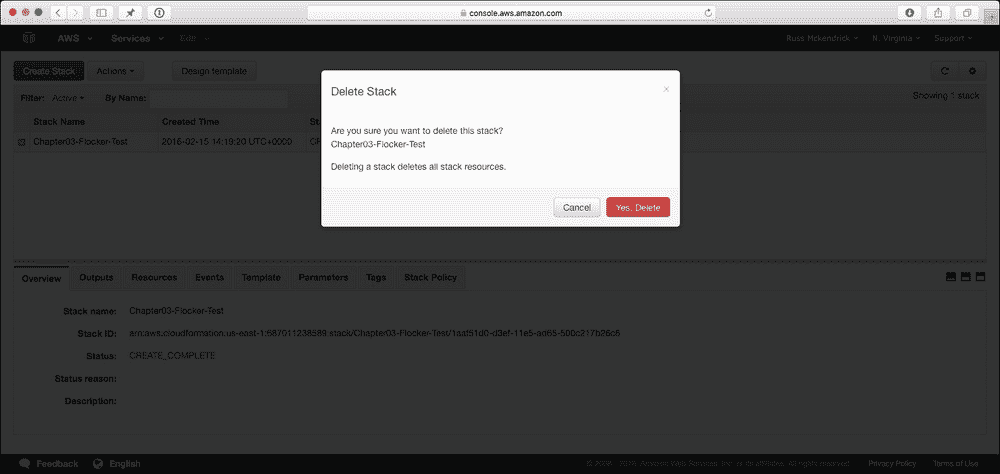

如果你收到无法删除 S3 存储桶的错误，别担心，所有昂贵的东西已经被终止。要解决此错误，只需在 AWS 控制台中找到它所抱怨的 S3 存储桶并删除内容。删除内容后，返回 CloudFormation 页面，再次尝试删除堆栈。

### 总结 Flocker

Flocker 是 Docker 卷的“祖父”，它在卷插件架构发布之前就是管理卷的原始解决方案之一。这意味着它既成熟，又是我们查看过的所有卷插件中最复杂的。

要了解其复杂性，你可以查看[CloudFormation 模板](https://s3.amazonaws.com/installer.downloads.clusterhq.com/flocker-cluster.cloudformation.json)。

如你所见，有很多步骤。在 CloudFormation 可视化工具中查看模板可以让你更清楚地了解所有内容是如何关联的：

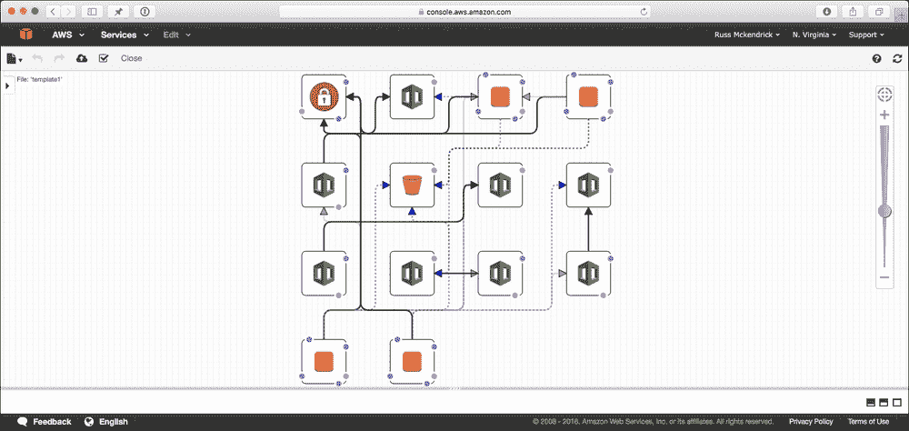

再加上 Docker 本身也在定期更新，你就拥有了一个非常复杂的安装过程。这也是为什么我在本章中没有详细讲解如何手动安装它，因为到你阅读时，过程无疑会有所变化。

幸运的是，Cluster Labs 有一个非常好的文档，且定期更新。你可以在[`docs.clusterhq.com/en/latest/`](https://docs.clusterhq.com/en/latest/)找到它。

同时值得指出的是，在写这本书时，Volume Hub 仍处于早期 Alpha 阶段，功能正在不断添加。最终，我认为这将成为一个非常强大的工具组合。

# 总结

在本章中，我们查看了三种不同的卷驱动程序，它们都与 Docker 的插件架构兼容。

尽管这三种驱动程序提供了三种完全不同的方式来为容器提供持久化存储，但你可能已经注意到，Docker Compose 文件以及我们如何通过 Docker 客户端与卷交互的方式，在所有三种工具中几乎是一样的体验，可能到了一种我敢肯定它开始显得有点重复的地步。

在我看来，这种重复性展示了使用 Docker 插件的最佳特性之一——从客户端角度来看的一致体验。在我们配置好工具后，在任何时刻，我们都无需真正思考或考虑如何使用存储，我们只需要继续进行。

这使我们能够在多个环境中重用我们的资源，如 Docker Compose 文件和容器，包括本地虚拟机、基于云的 Docker 主机，甚至是 Docker 集群。

然而，目前我们仍然局限于单一的 Docker 主机。 在下一章中，我们将探讨如何通过查看 Docker 网络插件来开始跨多个 Docker 主机进行部署。
