# 第四章：网络插件

在本章中，我们将介绍下一种插件类型：网络。我们将讨论如何使用 Docker 1.9 引入的新网络工具，以及第三方工具，这些工具为已经强大的内置工具增加了更多功能。我们将关注的两个主要工具如下：

+   **Docker 覆盖网络**: [`docs.docker.com/engine/userguide/networking/dockernetworks/`](https://docs.docker.com/engine/userguide/networking/dockernetworks/)

+   **Weave**: [`weave.works/`](https://weave.works)

### 注意

本章假设您使用的是 Docker 1.10+ 版本，某些命令可能在旧版本中无法使用。

# Docker 网络

在我们开始详细讨论 Docker 中的网络之前，我应该提到，我们已经顺利进入本书的第四章，而不需要真正思考网络问题，这是因为 Docker 默认在容器和主机机器的网络接口之间创建了一个网络桥接。这是 Docker 网络的最基本形式。

就像基本存储一样，这限制了您在单个主机上启动容器，即使您使用了像 Docker Swarm 这样的集群工具，正如您在第二章，*引入第一方工具*中所看到的，当我们启动 WordPress 安装时，Web 和数据库容器都是在集群中的单个主机上启动的。如果我们尝试将这两个容器绑定到不同的主机，它们将无法相互通信。

幸运的是，Docker 为您提供了支持，并提供了自己的多主机网络层，供 Docker Swarm 使用。

# 多主机网络与覆盖网络

Docker 在 Docker 1.9 中发布了其生产就绪的多主机覆盖网络功能。在此版本之前，这个功能被视为实验性的。

### 注意

覆盖网络是一种建立在另一个网络之上的计算机网络。覆盖网络中的节点可以被认为是通过虚拟或逻辑链路连接的，每条链路对应一个路径，可能通过许多物理链路，在底层网络中传输：

[`en.wikipedia.org/wiki/Overlay_network`](https://en.wikipedia.org/wiki/Overlay_ne)

在 Docker 术语中，它允许一个 Docker 主机上的容器直接与另一个 Docker 主机上的容器通信，就好像它们在同一主机上一样，如下图所示：

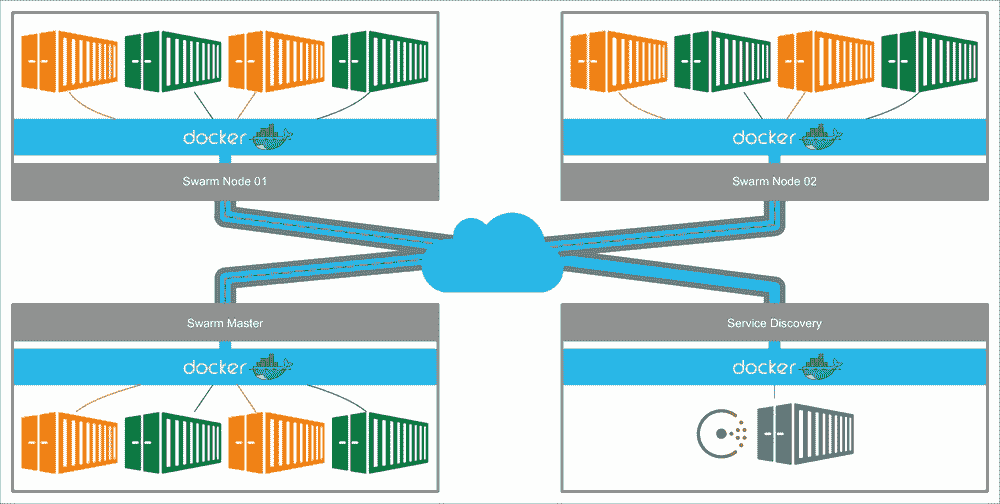

正如您从前面的图示中看到的，首先有一些前提条件。首先，您必须运行一个 Docker Swarm 集群。在这里，我们有一个由两个节点和一个主节点组成的 Docker Swarm 集群，它们都已配置了覆盖网络。您还需要一个服务发现服务，该服务可以被 Docker Swarm 集群访问。为此，您可以使用以下应用程序：

+   **Consul**: [`www.consul.io/`](https://www.consul.io/)

+   **Etcd**：[`coreos.com/etcd/`](https://coreos.com/etcd/)

+   **ZooKeeper**：[`zookeeper.apache.org/`](http://zookeeper.apache.org/)

在本章中，我们将使用 HashiCorp 的 Consul（[`hashicorp.com/`](https://hashicorp.com/)），并且我们还将通过 Docker Machine 在 DigitalOcean 上启动我们的集群。

## 启动发现

在第二章，*介绍第一方工具*，我们通过 Docker Hub 中的一次性令牌启动了我们的 Docker Swarm 集群。多主机网络的一个要求是持久化的键值存储，以便我们有一个永久且可访问的地方来存储有关集群的值，我们将在我们的示例集群中使用 Consul 来提供这个功能。

Consul 是由 HashiCorp 编写的开源工具，用于在基础设施中发现和配置服务。它提供了多个关键功能，包括服务发现、健康检查和键值存储，并且能够支持多数据中心。

要启动将运行 Consul 的 Docker 主机，运行以下命令：

```
docker-machine create \
 --driver digitalocean \
 --digitalocean-access-token sdnjkjdfgkjb345kjdgljknqwetkjwhgoih314rjkwergoiyu34rjkherglkhrg0 \
 --digitalocean-region lon1 \
 --digitalocean-size 512mb \
 --digitalocean-private-networking \
 service-discovery

```

你可能会注意到我们在`docker-machine`命令中添加了一个额外的行，这样会启动具有私有网络的 DigitalOcean Droplet。一旦 Docker 主机启动完成，我们可以通过运行以下命令启动 Consul 服务：

```
docker $(docker-machine config service-discovery) run -d \
 -p "8400:8400" \
 -p "8500:8500" \
 -h "consul" \
 russmckendrick/consul agent -data-dir /data -server -bootstrap-expect 1 -ui-dir /ui -client=0.0.0.0

```

这将下载我的 Consul 容器镜像，现在也有一个官方镜像，可以在[`hub.docker.com/_/consul/`](https://hub.docker.com/_/consul/)找到；然而，由于这个镜像是新的，可能不适用于前面的示例。

由于这是我们在此主机上需要运行的唯一命令，我们没有配置本地的 Docker 客户端以使用该主机；相反，我们是在运行时通过`$(docker-machine config service-discovery)`传递配置。为了检查一切是否按预期运行，你可以运行以下命令：

```
docker $(docker-machine config service-discovery) ps

```

在这里，你应该看到一个正在运行的容器，类似于以下终端输出：

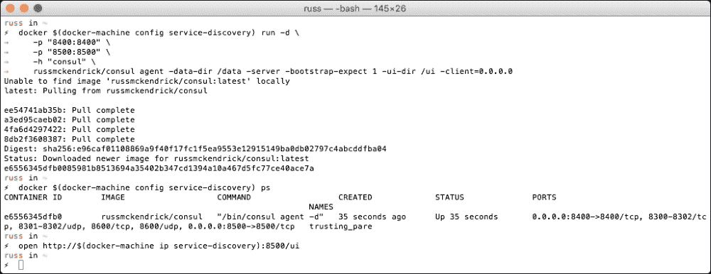

### 注意

在我们进一步推进之前，应该注意，使用`-bootstrap-expect 1`标志启动 Consul 不应在生产环境中尝试。你应该考虑引入多个 Consul 主机。有关如何配置高度可用的 Consul 集群的更多信息，请参考以下网址，了解如何配置完整的 Consul 集群：

[`www.consul.io/docs/guides/bootstrapping.html`](https://www.consul.io/docs/guides/bootstrapping.html)

你还可以通过打开 Web 界面来了解 Docker 将会在 Consul 中存储哪些信息，方法是输入以下命令：

```
open http://$(docker-machine ip service-discovery):8500/ui

```

你应该看到一个几乎空白的 Consul 视图，如下图所示：

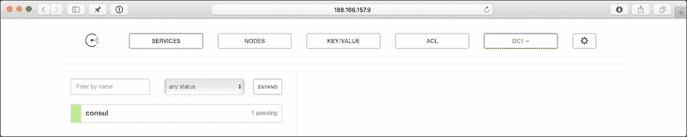

一旦启动了 Docker Swarm 集群并且服务发现容器正在运行并可以访问，我们将返回 Web 界面，开始启动其余的集群部分。

## 准备 Swarm

让我们开始启动 Docker Swarm 集群，首先是 Swarm 主节点。我们将其命名为`chapter04-00`：

```
docker-machine create \
 --driver digitalocean \
 --digitalocean-access-token sdnjkjdfgkjb345kjdgljknqwetkjwhgoih314rjkwergoiyu34rjkherglkhrg0 \
 --digitalocean-region lon1 \
 --digitalocean-size 1gb \
 --digitalocean-private-networking \
 --swarm --swarm-master \
 --swarm-discovery="consul://$(docker-machine ip service-discovery):8500" \
 --engine-opt="cluster-store=consul://$(docker-machine ip service-discovery):8500" \
 --engine-opt="cluster-advertise=eth1:2376" \
 chapter04-00

```

如你所见，命令与第二章中的命令非常相似，*介绍第一方工具*；然而，我们这里提供了 Consul 安装的详细信息。我们通过使用`docker-machine ip`命令传递`service-discovery`主机的 IP 地址来做到这一点。

一旦 Swarm 主节点启动，我们将使用以下命令启动两个 Swarm 节点：

```
docker-machine create \
 --driver digitalocean \
 --digitalocean-access-token sdnjkjdfgkjb345kjdgljknqwetkjwhgoih314rjkwergoiyu34rjkherglkhrg0 \
 --digitalocean-region lon1 \
 --digitalocean-size 1gb \
 --digitalocean-private-networking \
 --swarm \
 --swarm-discovery="consul://$(docker-machine ip service-discovery):8500" \
 --engine-opt="cluster-store=consul://$(docker-machine ip service-discovery):8500" \
 --engine-opt="cluster-advertise=eth1:2376" \
 chapter04-01

```

对于第二个节点，我们将使用以下命令：

```
docker-machine create \
 --driver digitalocean \
 --digitalocean-access-token sdnjkjdfgkjb345kjdgljknqwetkjwhgoih314rjkwergoiyu34rjkherglkhrg0 \
 --digitalocean-region lon1 \
 --digitalocean-size 1gb \
 --digitalocean-private-networking \
 --swarm \
 --swarm-discovery="consul://$(docker-machine ip service-discovery):8500" \
 --engine-opt="cluster-store=consul://$(docker-machine ip service-discovery):8500" \
 --engine-opt="cluster-advertise=eth1:2376" \
 chapter04-02

```

现在我们已经启动了主节点和两个节点，让我们切换到环境中，并确保集群显示正确的主机数量：

```
eval $(docker-machine env --swarm chapter04-00)
docker info

```

运行`docker info`时，你应该会看到类似于以下截图的内容：

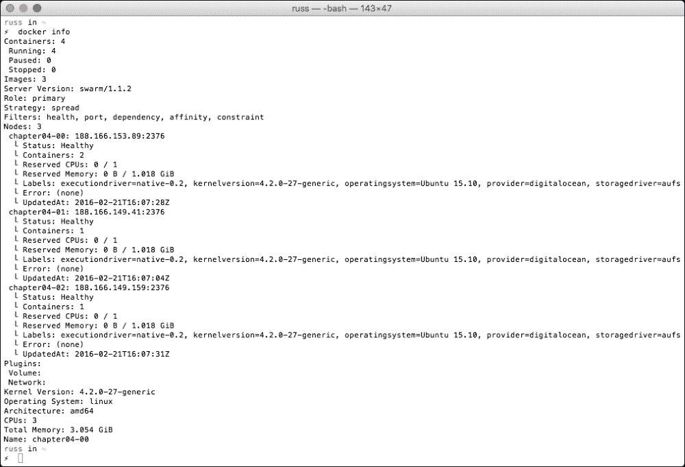

所以，现在我们已经启动了集群，所有节点都能相互通信。接下来，我们将能够创建我们的覆盖网络。

## 添加覆盖网络

为了测试，我们将创建一个非常基础的网络并启动一个非常基础的容器。以下命令将创建覆盖网络，并且得益于 Consul 提供的服务发现，网络设置将分发到 Docker Swarm 集群中的每个节点：

```
docker network create --driver overlay --subnet=10.0.9.0/24 chapter04-overlay-network

```

如此，我们已经在集群中创建了一个名为`chapter04-overlay-network`的覆盖网络，子网为`10.0.9.0/24`。为了确保一切正常，你可以运行以下命令来列出集群中配置的网络：

```
docker network ls

```

你也可以通过运行以下命令来检查各个节点：

```
docker $(docker-machine config chapter04-01) network ls
docker $(docker-machine config chapter04-02) network ls

```

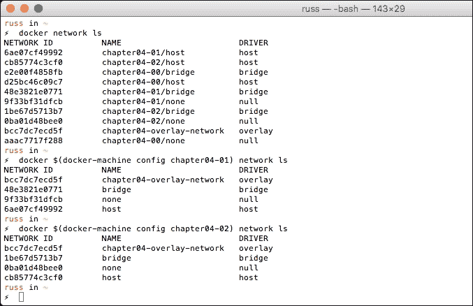

如你所见，每个节点都有自己的主机和桥接网络，这意味着如果你不想使用覆盖网络，完全可以不使用；不过，我们使用它，这样就可以启动一个容器并配置它使用我们新添加的网络。

## 使用覆盖网络

首先，我们将启动一个运行 NGINX 的容器：

```
docker run -itd \
 --name=chapter04-web \
 --net=chapter04-overlay-network \
 -p 80:80 \
 --env="constraint:node==chapter04-01" \
 russmckendrick/nginx

```

如你所见，我们通过传递`--net`标志来配置容器使用`chapter04-overlay-network`。我们还确保容器在`chapter04-01`节点上启动。接下来，让我们看看能否查看到 NGINX 容器提供的内容。

为此，我们将在第二个节点`chapter04-02`上启动一个容器，并运行`wget`来获取 NGINX 提供的页面：

```
docker run -it \
 --rm \
 --net=chapter04-overlay-network \
 --env="constraint:node==chapter04-02" \
 russmckendrick/base wget -q -O- http://chapter04-web

```

如果一切按计划进行，你将会看到命令返回`Hello from NGINX`。我们也可以通过在第二个节点上运行以下命令来 ping NGINX 容器：

```
docker run -it \
 --rm \
 --net=chapter04-overlay-network \
 --env="constraint:node==chapter04-02" \
 russmckendrick/base ping -c 3 chapter04-web

```

你应该能看到一个 IP 地址，位于 10.0.9.0/24 子网范围内，正如下面的截图所示：

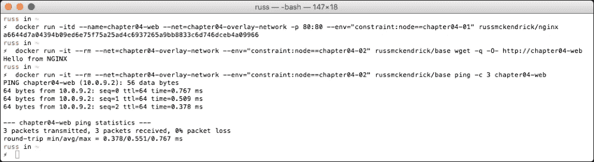

如果你想查看已经配置在`chapter04-web`容器上的网络，可以运行以下命令：

```
docker exec chapter04-web ip addr
docker exec chapter04-web route -n
docker exec chapter04-web ping -c 3 google.com

```

你应该会看到类似于以下终端输出的内容：

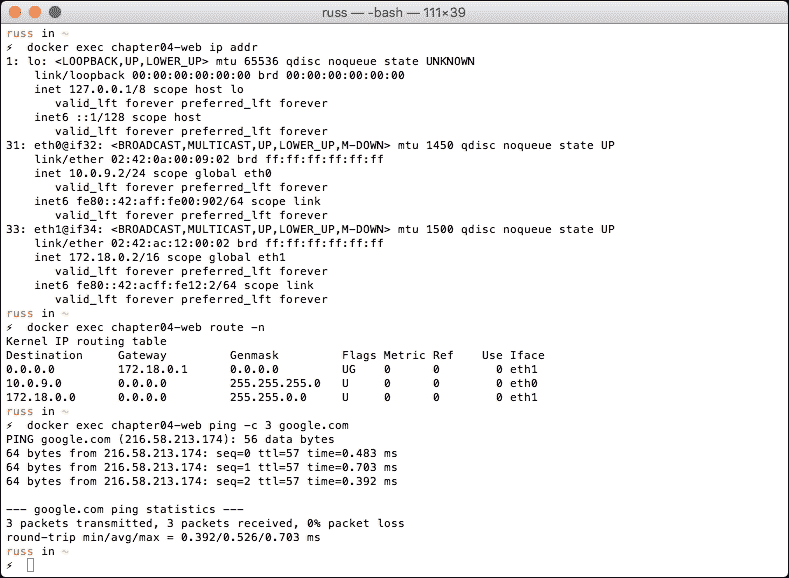

最后，你可以通过运行以下命令在浏览器中访问容器：

```
open http://$(docker-machine ip chapter04-01)/

```

页面将会类似于以下截图所示：

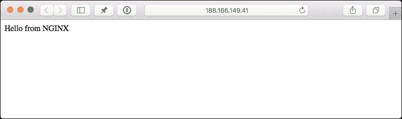

虽然页面本身看起来并不复杂，但实际上后台有一些相当巧妙的操作你可能没有注意到，其中最大的一点是我们不再需要手动链接我们的容器。在前几章中，我们在启动多个容器时使用了 link 标志来将它们链接在一起。现在，我们在同一个 Overlay 网络中启动容器，Docker 假设这个网络中的所有容器都能相互通信，并且它会自动处理容器之间的链接。

Docker 还为容器配置了一个网关，以便能够默认将流量路由到我们的 Overlay 网络外部。如果你想创建一个仅限内部的网络，可以添加`--internal`标志。

## 返回到 Consul

别忘了，在我们创建网络和启动容器时，服务发现容器一直在后台运行。返回到 Consul 的 Web 界面，你应该会注意到在**Key/Value**选项下，你会看到 Docker Swarm 集群内节点的列表：

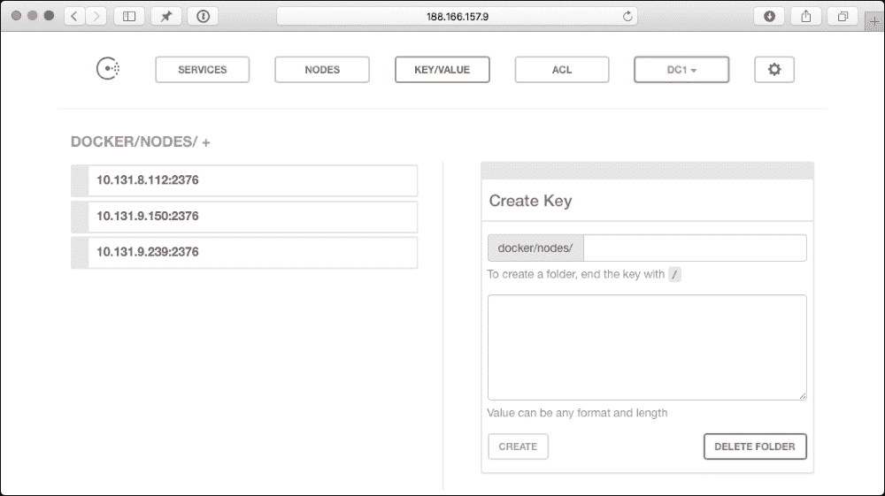

点击查看，你还应该看到其他一些共享的值，例如网络相关的，这些都在 Docker Swarm 集群中共享：

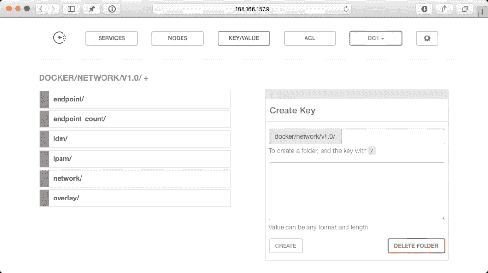

在我们拆除 Docker Swarm 集群之前，让我们先看看如何使用 Docker Compose 启动 WordPress 栈。

## 创建多主机网络

如同前几章一样，我们将启动我们可靠的 WordPress 安装。我们将稍微有些不同，添加一些有趣的部分：

+   创建一个名为`wpoutside`的外部网络。这个网络将能够进行外部访问，我们的网站服务器将会在这里启动。

+   创建一个名为`wpinside`的内部网络。这个网络无法进行外部访问，但同一网络上的容器能够相互访问，我们将把网站服务器和数据库容器添加到这个网络中。

+   启动我们的网站服务器容器在一个节点上，数据库容器在第二个节点上。

在我们启动容器之前，我们应该终止`chapter04-web`容器：

```
docker rm -f chapter04-web

```

现在，让我们创建两个覆盖网络：

```
docker network create --driver overlay --subnet=10.0.10.0/24 wpoutside
docker network create --driver overlay --internal --subnet=10.0.11.0/24 wpinside

```

如您所见，我们为网络分配了不同的子网，而对于`wpinside`，我们传递了`--internal`标志，这意味着该网络将没有外部网关。

现在，让我们来看一下我们的`docker-compose.yml`文件：

```
version: '2'
services:
  wordpress:
    container_name: my-wordpress-app
    image: wordpress
    ports:
      - "80:80"
 networks:
 - wpoutside
 - wpinside
    environment:
      - "WORDPRESS_DB_HOST=mysql:3306"
      - "WORDPRESS_DB_PASSWORD=password"
 - "constraint:node==chapter04-01"
    volumes:
      - "uploads:/var/www/html/wp-content/uploads/"
  mysql:
    container_name: my-wordpress-database
    image: mysql
 networks:
 - wpinside
    environment:
      - "MYSQL_ROOT_PASSWORD=password"
 - "constraint:node==chapter04-02"
    volumes:
      - "database:/var/lib/mysql"
volumes:
  uploads:
    driver: local
  database:
    driver: local
networks:
 wpoutside:
 external: true
 wpinside:
 external: true

```

如您所见，我已经标出了自上一章以来文件中的更改。有趣的是，尽管可以在`docker-compose.yml`文件中定义网络，但通过使用`docker network create`命令设置网络，您将获得更多的控制权。为此，我们需要告诉 Docker Compose 使用为项目外部定义的网络。我们还使用标签将容器绑定到我们 Docker Swarm 集群中的主机。

现在我们已经创建了两个覆盖网络，您可以通过运行以下命令启动 WordPress 堆栈：

```
docker-compose up -d

```

您可以通过运行以下命令检查一切是否按预期启动：

```
docker-compose ps

```

为了确保容器在不同主机上启动，请运行以下命令并检查最后一列：

```
docker ps

```

要查看分配给容器的 IP 地址，请运行以下命令：

```
docker inspect my-wordpress-app | grep IPAddress
docker inspect my-wordpress-database | grep IPAddress

```

您应该会看到`my-wordpress-app`的两个 IP 地址和`my-wordpress-database`的单个 IP 地址：

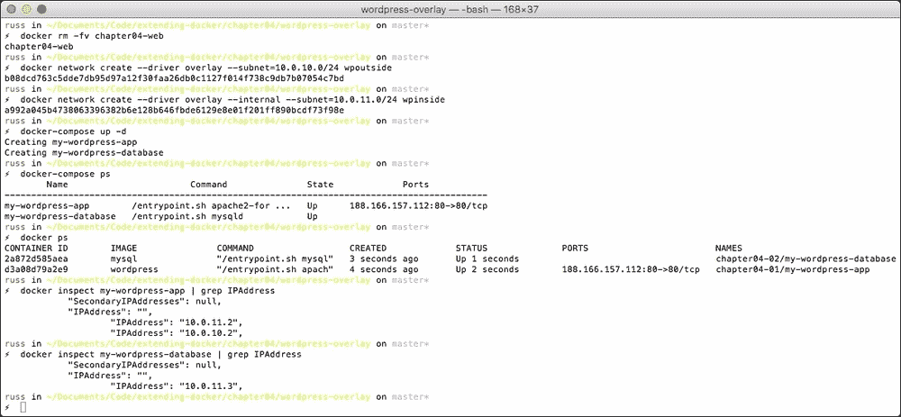

在我们登录 WordPress 之前，可以尝试一些 ping 测试。首先，我们将在您的`my-wordpress-app`容器上运行以下命令：

```
docker exec my-wordpress-app ping -c 3 google.com
docker exec my-wordpress-app ping -c 3 my-wordpress-database

```

对于第一条命令，您将看到返回的谷歌外部 IP 地址。对于第二条命令，您将获得`my-wordpress-database`容器的 IP 地址，它位于我们为`wpinside`覆盖网络定义的`10.0.11.0/24`子网中：


在`my-wordpress-database`上尝试类似命令应该会给您不同的结果，尝试运行以下命令：

```
docker exec my-wordpress-database ping -c 3 my-wordpress-app
docker exec my-wordpress-database ping -c 3 google.com

```

如您所见，ping `my-wordpress-app`正常工作；但是，当您尝试 ping Google 时，会收到类似“网络无法访问”或其他错误的消息。这正是我们预期的结果，因为`my-wordpress-database`没有外部网络访问权限，因此无法路由到`www.google.com`：

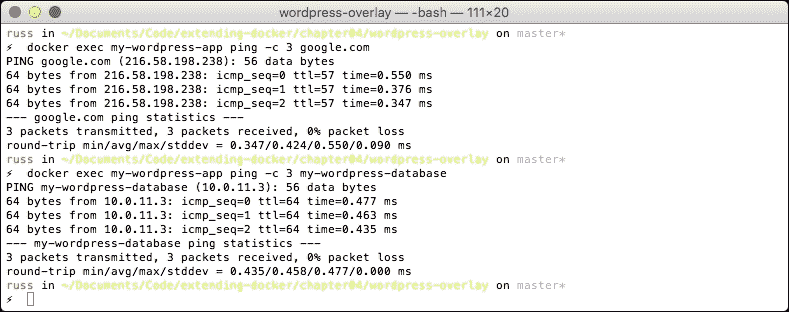

最后，如果您想访问 WordPress，可以输入以下命令之一。首先，我们需要确认`my-wordpress-app`容器启动在哪个主机上。要确认主机，请运行：

```
docker ps

```

然后，根据不同的主机，运行以下三条命令之一：

```
open http://$(docker-machine ip chapter04-00)/
open http://$(docker-machine ip chapter04-01)/
open http://$(docker-machine ip chapter04-02)/

```

您的浏览器将打开现在熟悉的 WordPress 安装页面。

在继续之前，您应该拆除 Docker Swarm 集群。为此，请运行以下命令：

```
docker-machine stop chapter04-00 chapter04-01 chapter04-02 service-discovery
docker-machine rm chapter04-00 chapter04-01 chapter04-02 service-discovery

```

## 总结多主机网络

尽管在 Docker 1.9 版本中，覆盖网络被视为生产就绪，但随着 Docker 1.10 版本的进步以及新的 Docker Compose v2 文件格式的推出，Docker 网络真的得到了更好的发展。

虽然覆盖网络功能已内置于 Docker 和 Swarm 中，正如我们在之前的示例中所看到的，它非常强大。当与我们在第三章中介绍的第三方卷插件、*卷插件*以及 Docker Swarm 结合使用时，我们可以开始构建高可用的部署。

# 编织网络

接下来，我们将看看 Weave Net 和 Weaveworks 的 Scope。这是最初的 Docker 网络工具之一，其核心是一个成熟的软件定义网络服务。

Weave Net 的描述如下：

> *"Weave Net 创建了一个容器 SDN，可以跨任何公共和私有云、虚拟机以及裸机运行。容器 SDN 可以承载任何二层和三层流量，包括多播。如果它可以通过以太网运行，您就可以在 Weave Net 上运行。"*

事实上，Weave 提供了两个驱动，如下所示：

+   Weave Mesh 是一个本地作用域驱动，它在不需要集群存储的情况下运行。它可以用来创建跨非集群机器的网络。通过这种方式，您可以获得一个名为 Weave 的单一网络，覆盖您启动 Weave 的所有机器。

+   Weave 像 Docker 自己的覆盖驱动一样，是一个全局作用域驱动。这意味着它可以与 Docker Swarm 和 Docker Compose 一起使用，因此，您需要启动一个集群存储。

首先，我们来看一下 Weave 驱动及其如何与 Docker Swarm 一起使用，然后我们将看看如何使用 Weavemesh 驱动。

## 再次配置集群

像 Docker 的多主机网络一样，我们需要启动一个服务发现实例和我们的 Swarm 集群。让我们使用 Docker Machine 启动服务发现主机：

```
docker-machine create \
 --driver digitalocean \
 --digitalocean-access-token sdnjkjdfgkjb345kjdgljknqwetkjwhgoih314rjkwergoiyu34rjkherglkhrg0 \
 --digitalocean-region lon1 \
 --digitalocean-size 512mb \
 --digitalocean-private-networking \
 service-discovery

```

这次，我们不需要启用 Consul web 界面，因此运行以下命令：

```
docker $(docker-machine config service-discovery) run -d \
 -p "8400:8400" \
 -p "8500:8500" \
 -h "consul" \
 russmckendrick/consul agent -data-dir /data -server -bootstrap-expect 1 -client=0.0.0.0

```

现在启动 Docker Swarm 集群，首先是主节点：

```
docker-machine create \
 --driver digitalocean \
 --digitalocean-access-token sdnjkjdfgkjb345kjdgljknqwetkjwhgoih314rjkwergoiyu34rjkherglkhrg0 \
 --digitalocean-region lon1 \
 --digitalocean-size 1gb \
 --digitalocean-private-networking \
 --swarm --swarm-master \
 --swarm-discovery="consul://$(docker-machine ip service-discovery):8500" \
 --engine-opt="cluster-store=consul://$(docker-machine ip service-discovery):8500" \
 --engine-opt="cluster-advertise=eth1:2376" \
 chapter04-00

```

然后我们将启动我们的第一个节点：

```
docker-machine create \
 --driver digitalocean \
 --digitalocean-access-token sdnjkjdfgkjb345kjdgljknqwetkjwhgoih314rjkwergoiyu34rjkherglkhrg0 \
 --digitalocean-region lon1 \
 --digitalocean-size 1gb \
 --digitalocean-private-networking \
 --swarm \
 --swarm-discovery="consul://$(docker-machine ip service-discovery):8500" \
 --engine-opt="cluster-store=consul://$(docker-machine ip service-discovery):8500" \
 --engine-opt="cluster-advertise=eth1:2376" \
 chapter04-01

```

最后，我们将启动第二个节点：

```
docker-machine create \
 --driver digitalocean \
 --digitalocean-access-token sdnjkjdfgkjb345kjdgljknqwetkjwhgoih314rjkwergoiyu34rjkherglkhrg0 \
 --digitalocean-region lon1 \
 --digitalocean-size 1gb \
 --digitalocean-private-networking \
 --swarm \
 --swarm-discovery="consul://$(docker-machine ip service-discovery):8500" \
 --engine-opt="cluster-store=consul://$(docker-machine ip service-discovery):8500" \
 --engine-opt="cluster-advertise=eth1:2376" \
 chapter04-02

```

为了检查一切是否按预期工作，运行以下命令切换我们的本地 Docker 客户端连接到 Swarm 集群，并检查三个节点是否可见：

```
eval $(docker-machine env --swarm chapter04-00)
docker info

```

## 安装和配置 Weave

现在我们的集群已经启动并运行，我们可以安装和配置 Weave。安装 Weave 非常简单，您只需下载二进制文件并给予正确的权限。在 Swarm 主节点上使用`docker-machine ssh`连接到主机并运行`install`命令来完成此操作：

```
docker-machine ssh chapter04-00 'curl -L git.io/weave -o /usr/local/bin/weave; chmod a+x /usr/local/bin/weave'

```

接下来，我们启动 Weave，再次使用`docker-machine ssh`，我们可以运行以下命令：

```
docker-machine ssh chapter04-00 weave launch --init-peer-count 3

```

您会注意到，Weave 从 Docker Hub 部署了三个容器，它们如下所示：

+   weaveworks/weaveexec

+   weaveworks/weave

+   weaveworks/plugin

此外，我们告诉 Weave 预期有三个节点加入集群，通过传递`--init-peer-count 3`标志来实现，这基本上就是我们在第一个集群节点上配置 Weave 所需做的全部。

接下来，我们需要在其他两个集群节点上安装 Weave，仍然使用 `docker-machine ssh` 命令运行以下内容：

```
docker-machine ssh chapter04-01 'curl -L git.io/weave -o /usr/local/bin/weave; chmod a+x /usr/local/bin/weave'
docker-machine ssh chapter04-01 weave launch --init-peer-count 3

```

既然 Weave 已经在节点上启动并运行，我们需要告诉它连接到 Swarm 主节点上运行的 Weave 安装。为此，请运行以下命令：

```
docker-machine ssh chapter04-01 weave connect "$(docker-machine ip chapter04-00)"

```

然后在我们最后一个集群节点上，我们将运行以下命令：

```
docker-machine ssh chapter04-02 'curl -L git.io/weave -o /usr/local/bin/weave; chmod a+x /usr/local/bin/weave'
docker-machine ssh chapter04-02 weave launch --init-peer-count 3
docker-machine ssh chapter04-02 weave connect "$(docker-machine ip chapter04-00)"

```

一旦 Swarm 集群中的所有三个节点都安装并配置了 Weave，我们将运行以下命令，以确保所有三个节点能够相互通信：

```
docker-machine ssh chapter04-00 weave status

```

该命令应该返回确认信息，显示有三个对等节点以及六个已建立的连接，并附带其他安装信息，如以下截图所示：

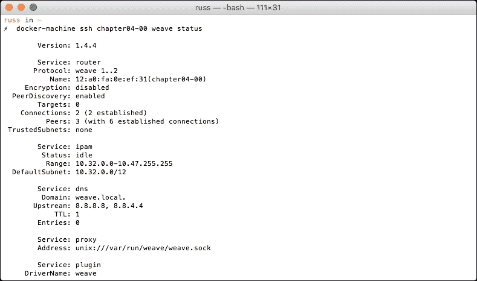

现在我们已经确认一切按预期工作，我们将使用以下命令列出 Docker 中的网络：

```
docker network ls

```

根据以下终端会话，你应该会看到集群中每个节点都有一个名为 `weave` 的 `weavemesh` 网络；我们稍后会进一步讨论这点：

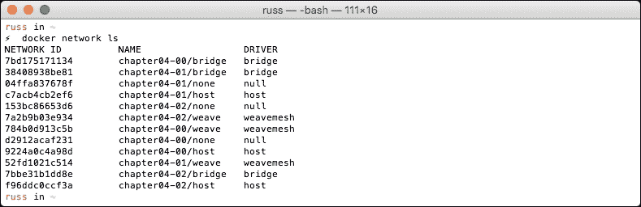

## Docker Compose 和 Weave

所以，让我们启动我们的 WordPress 安装。Docker Compose 文件看起来与 Overlay 网络的文件略有不同：

```
version: '2'
services:
  wordpress:
    container_name: "my-wordpress-app"
    image: wordpress
    ports:
      - "80:80"
    environment:
 - "WORDPRESS_DB_HOST=mysql.weave.local:3306"
      - "WORDPRESS_DB_PASSWORD=password"
      - "constraint:node==chapter04-01"
 hostname: "wordpress.weave.local"
 dns: "172.17.0.1"
 dns_search: "weave.local"
    volumes:
      - "uploads:/var/www/html/wp-content/uploads/"
  mysql:
    container_name: "my-wordpress-database"
    image: mysql
    environment:
      - "MYSQL_ROOT_PASSWORD=password"
      - "constraint:node==chapter04-02"
 hostname: "mysql.weave.local"
 dns: "172.17.0.1"
 dns_search: "weave.local"
    volumes:
      - "database:/var/lib/mysql"
volumes:
  uploads:
    driver: local
  database:
    driver: local
networks:
 default:
 driver: weave

```

我突出显示了 Overlay Docker Compose 文件中的一些更改：首先，我们将定义一个主机名并提供 DNS 服务器和搜索域。为了获得 `dns` 和 `dns_search` 键的正确值，你可以运行以下命令，让 Weave 告诉你它已配置的内容：

```
docker-machine ssh chapter04-00 weave dns-args

```

如你所见，在我的情况下，它返回了`172.17.0.1`和`weave.local`：

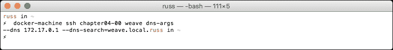

此外，对于从 WordPress 容器到数据库容器的 MySQL 连接，我们也在使用内部 DNS 名称。

我们还让 Docker Compose 为我们创建一个使用 Weave 驱动程序的网络，这将添加一个以项目命名的单一网络。Docker Compose 从 Docker Compose 文件所在的文件夹中获取项目名称，在我的例子中，它是一个名为 `wordpress` 的文件夹。

要启动你的容器并检查它们是否按预期运行，请运行以下命令：

```
docker-compose up -d
docker-compose ps
docker ps

```

你应该会看到类似于以下终端输出的内容：

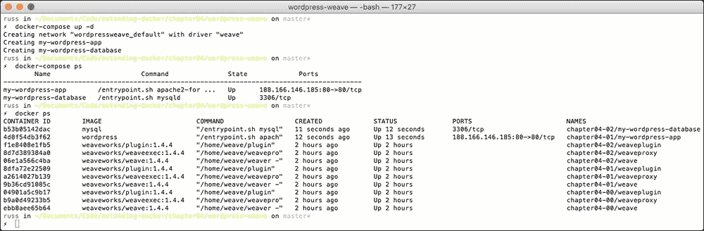

如果你真的想要，你可以通过运行以下命令访问你的 WordPress 安装：

```
open http://$(docker-machine ip chapter04-01)/

```

在后台有一些 Docker 的多主机网络无法提供的功能，例如内部 DNS。Weave 有自己的内部 DNS 系统，你可以在其中注册你的容器，正如我们在 Docker Compose 文件中为两个容器提供的记录详细信息所示。运行以下命令：

```
docker-machine ssh chapter04-00 weave status dns

```

它将显示 Weave 配置的所有 DNS 记录。在我的情况下，它看起来像以下截图：

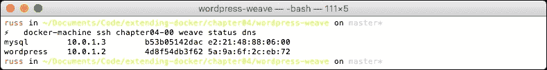

## Weave Scope

当我们的三节点 Swarm 集群启动并运行时，快速安装 Scope。Scope 是一个用于可视化你的容器和主机的工具。我们将只在本地安装它，但 Weave Works 会提供基于云的服务，可以在 [`scope.weave.works/`](http://scope.weave.works/) 找到（在编写本书时，它还处于私有测试阶段）。

类似于我们安装 Weave Net 的方式，我们将使用 `docker-machine ssh` 命令来下载二进制文件并启动和配置服务。

我们首先在 Swarm 主节点上编写代码：

```
docker-machine ssh chapter04-00 'curl -L git.io/scope -o /usr/local/bin/scope; chmod a+x /usr/local/bin/scope'
docker-machine ssh chapter04-00 scope launch

```

然后，我们将为剩下的两个节点编写代码：

```
docker-machine ssh chapter04-01 'curl -L git.io/scope -o /usr/local/bin/scope; chmod a+x /usr/local/bin/scope'
docker-machine ssh chapter04-01 scope launch $(docker-machine ip chapter04-00)
docker-machine ssh chapter04-02 'curl -L git.io/scope -o /usr/local/bin/scope; chmod a+x /usr/local/bin/scope'
docker-machine ssh chapter04-02 scope launch $(docker-machine ip chapter04-00)

```

如你所见，在剩下的两个节点上，我们正在告诉 Scope 连接到在 Swarm 主节点上运行的 Scope 实例。

现在 Scope 已经安装，运行以下命令在浏览器中打开它：

```
open http://$(docker-machine ip chapter04-00):4040/

```

当你的浏览器打开时，你将看到一个关于你 Swarm 集群和正在运行的容器的可视化表示。

我在这里不打算深入讲解 Scope，因为目前它与网络配置关系不大，先浏览一下你的集群，看看它是如何连接在一起的。我的界面看起来类似于下面的截图：

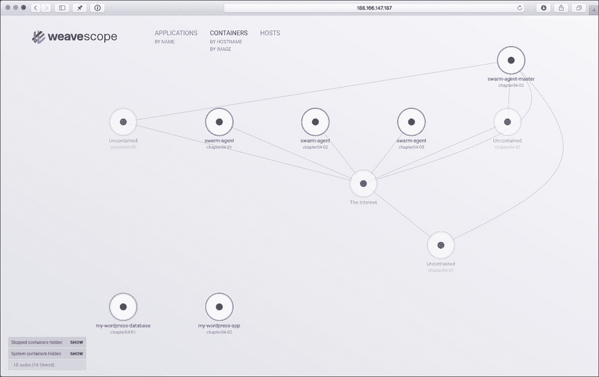

## 取消 Swarm

如你所见，虽然 Weave 是一个功能强大的 SDN，但它的配置非常简单。然而，复制 Docker 提供的多主机网络仅仅是它的一个小技巧。

在开始查看 Weavemesh 网络驱动之前，让我们关闭我们的 Swarm 集群并终止主机：

```
docker-machine stop chapter04-00 chapter04-01 chapter04-02 service-discovery
docker-machine rm chapter04-00 chapter04-01 chapter04-02 service-discovery

```

在继续之前，登录到你的 DigitalOcean 控制面板，确保没有标记为 `chapter04` 的机器正在运行，记住，无论你是否使用这些机器，都会按小时收费。

## Weavemesh 驱动

我们已经了解了如何将 Weave Net 与 Docker Swarm 集群一起使用来创建多主机网络，现在让我们来看看第二个 Weave 网络驱动——Weavemesh。正如你可能记得的那样，当我们第一次安装 Weave Net 时，系统会自动创建一个名为 "weave" 的网络，并使用 "weavemesh" 驱动程序在我们集群的每个节点上配置。

这一次，让我们使用 Docker Machine 在 DigitalOcean 上启动两个独立的 Docker 主机。为了增加趣味性，我们将在伦敦启动一台主机，另一个则在纽约市。由于这些将作为独立主机运行，我们不需要启动键值存储，也不需要配置 Docker Swarm。

首先，输入以下命令来启动一个位于伦敦的主机：

```
docker-machine create \
 --driver digitalocean \
 --digitalocean-access-token sdnjkjdfgkjb345kjdgljknqwetkjwhgoih314rjkwergoiyu34rjkherglkhrg0 \
 --digitalocean-region lon1 \
 --digitalocean-size 1gb \
 mesh-london

```

然后，下面的命令是用来启动另一个位于纽约市的主机。

```
docker-machine create \
 --driver digitalocean \
 --digitalocean-access-token sdnjkjdfgkjb345kjdgljknqwetkjwhgoih314rjkwergoiyu34rjkherglkhrg0 \
 --digitalocean-region nyc2 \
 --digitalocean-size 1gb \
 mesh-nyc

```

现在我们的两台 Docker 主机都已启动并运行，接下来让我们安装并配置 Weave：

```
docker-machine ssh mesh-london 'curl -L git.io/weave -o /usr/local/bin/weave; chmod a+x /usr/local/bin/weave'
docker-machine ssh mesh-london weave launch --password 3UnFh4jhahFC

```

如你所见，这次我们告诉 Weave 启动时使用密码。这个标志将启用我们两个主机之间网络层的加密。现在我们已经配置了伦敦主机，让我们配置纽约市的主机，并让它与伦敦主机进行通信：

```
docker-machine ssh mesh-nyc 'curl -L git.io/weave -o /usr/local/bin/weave; chmod a+x /usr/local/bin/weave'
docker-machine ssh mesh-nyc weave launch --password 3UnFh4jhahFC
docker-machine ssh mesh-nyc weave connect "$(docker-machine ip mesh-london)"

```

现在我们已经在两台主机上配置了 Weave，我们可以通过运行以下命令来检查 Weave 的状态：

```
docker-machine ssh mesh-nyc weave status

```

如你所见，从下面的终端输出可以看出，已启用加密，并且我们在 Weave 网络中有两个对等节点：

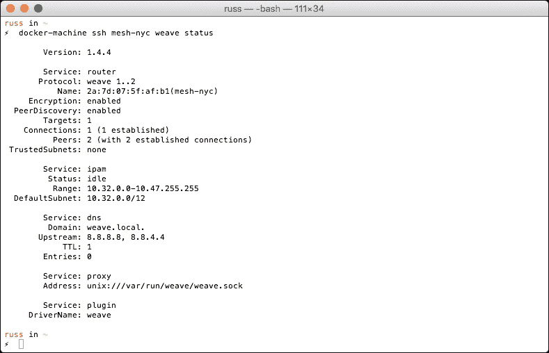

所以，让我们看看 Weave 的绝招。我们将从启动我们的 NGINX 容器开始，保持简单：

```
docker $(docker-machine config mesh-nyc) run -itd \
 --name=nginx \
 --net=weave \
 --hostname="nginx.weave.local" \
 --dns="172.17.0.1" \
 --dns-search="weave.local" \
 russmckendrick/nginx

```

现在我们可以检查容器是否已启动并正在运行：

```
docker $(docker-machine config mesh-nyc) ps

```

让我们检查它是否在端口 80 上响应：

```
docker $(docker-machine config mesh-london) run -it \
 --rm \
 --net=weave \
 --dns="172.17.0.1" \
 --dns-search="weave.local" \
 russmckendrick/base wget -q -O- http://nginx.weave.local

```

最后，让我们进行一次 ping 测试：

```
docker $(docker-machine config mesh-london) run -it \
 --rm \
 --net=weave \
 --dns="172.17.0.1" \
 --dns-search="weave.local" \
 russmckendrick/base ping -c 3 nginx.weave.local

```

你的终端会话应该看起来像下面的截图：

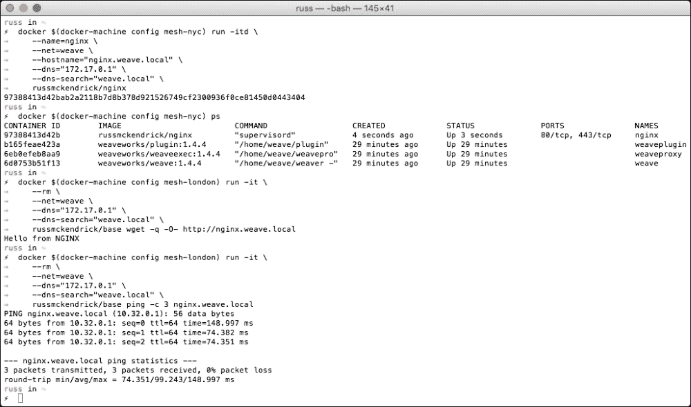

从表面上看，这个测试似乎没有什么特别的；然而，如果你仔细查看我们使用的命令，你会看到 weavemesh 驱动程序的强大功能。

首先，当我们在纽约市的 Docker 主机上启动 NGINX 容器时，我们没有发布任何端口，这意味着端口 80 只在我们附加的 weave 网络上可用。

其次，当我们在端口 80 上进行检查并进行 ping 测试时，是在伦敦的 Docker 主机上进行的。我们临时启动了一个基本容器，将其附加到 `weave` 网络，并配置它使用 Weave DNS 服务，这样它就可以解析 `nginx.weave.local` 域名。

让我们再次进行测试，这次使用本地虚拟机：

```
docker-machine create -d virtualbox mesh-local

```

现在，按照我们在其他两个 Docker 主机上所做的步骤安装 Weave：

```
docker-machine ssh mesh-local 'sudo curl -L git.io/weave -o /usr/local/bin/weave; sudo chmod a+x /usr/local/bin/weave'
docker-machine ssh mesh-local sudo weave launch --password 3UnFh4jhahFC
docker-machine ssh mesh-local sudo weave connect "$(docker-machine ip mesh-london)"

```

然后再次运行测试：

```
docker $(docker-machine config mesh-local) run -it \
 --rm \
 --net=weave \
 --dns="172.17.0.1" \
 --dns-search="weave.local" \
 russmckendrick/base wget -q -O- http://nginx.weave.local

```

运行 ping 测试，如下所示：

```
docker $(docker-machine config mesh-local) run -it \
 --rm \
 --net=weave \
 --dns="172.17.0.1" \
 --dns-search="weave.local" \
 russmckendrick/base ping -c 3 nginx.weave.local

```

如你所见，它工作正常！

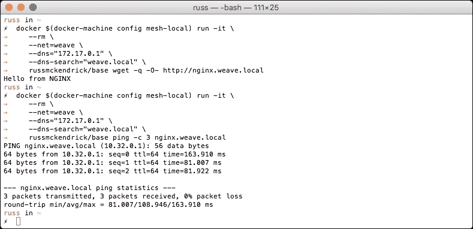

现在，我们的 Weavemesh 网络中有三台 Docker 主机，它们都可以互相通信。为了证明这一点，我们将进行最后一次测试。让我们在本地 Docker 主机上启动一个容器，并尝试从纽约市主机进行测试。

在我们的本地 Docker 主机上创建一个名为 `vm.weave.local` 的 NGINX 容器：

```
docker $(docker-machine config mesh-local) run -itd \
 --name=vm \
 --net=weave \
 --hostname="vm.weave.local" \
 --dns="172.17.0.1" \
 --dns-search="weave.local" \
 russmckendrick/nginx

```

然后尝试从纽约市的 Docker 主机连接到端口 80 并 ping 新容器：

```
docker $(docker-machine config mesh-nyc) run -it \
 --rm \
 --net=weave \
 --dns="172.17.0.1" \
 --dns-search="weave.local" \
 russmckendrick/base wget -q -O- http://vm.weave.local

```

```
docker $(docker-machine config mesh-nyc) run -it \
 --rm \
 --net=weave \
 --dns="172.17.0.1" \
 --dns-search="weave.local" \
 russmckendrick/base ping -c 3 vm.weave.local

```

我的终端会话看起来像下面的截图：

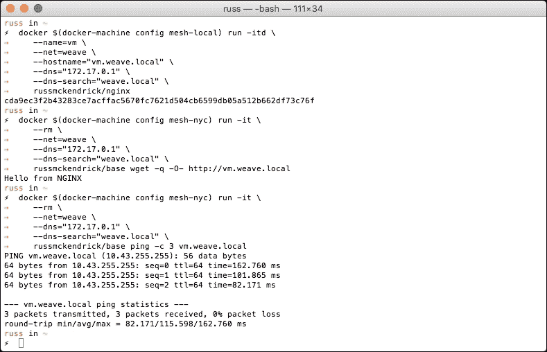

现在，由于没有 Docker Swarm 集群的常量，我们也可以开始执行一些只有在 Swarm 外部才可用的任务。

首先，在启动容器后将其连接到 Weave 网络，让我们在伦敦的 Docker 主机上启动一个名为 `lonely` 的 NGINX 容器：

```
docker $(docker-machine config mesh-london) run -itd \
 --name=lonely \
 russmckendrick/nginx

```

现在，让我们连接到伦敦的 Docker 主机并将容器连接到 weave 网络：

```
docker-machine ssh mesh-london weave attach lonely

```

当你运行命令时，它会返回一个 IP 地址。这将是我们容器的新 IP 地址；在我的例子中，它是 10.40.0.0。让我们从纽约市和本地 Docker 主机运行我们的测试：

```
docker $(docker-machine config mesh-nyc) run -it \
 --rm \
 --net=weave \
 --dns="172.17.0.1" \
 --dns-search="weave.local" \
 russmckendrick/base wget -q -O- 10.40.0.0
docker $(docker-machine config mesh-local) run -it \
 --rm \
 --net=weave \
 --dns="172.17.0.1" \
 --dns-search="weave.local" \
 russmckendrick/base ping -c 3 10.40.0.0

```

你的终端会话应该类似于下面的截图：

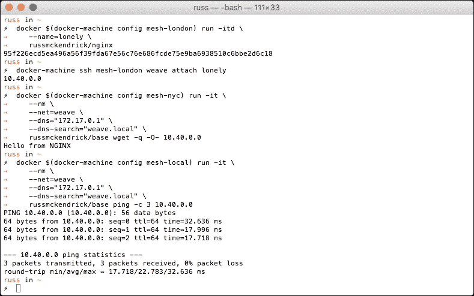

既然我们的容器已接入网络，我们可以通过运行以下命令手动为主机添加 DNS：

```
docker-machine ssh mesh-london weave dns-add lonely -h lonely.weave.local

```

如你所见，我们现在可以通过[`lonely.weave.local`](http://lonely.weave.local)从我们的纽约市 Docker 主机访问端口 80：

```
docker $(docker-machine config mesh-nyc) run -it \
 --rm \
 --net=weave \
 --dns="172.17.0.1" \
 --dns-search="weave.local" \
 russmckendrick/base wget -q -O- lonely.weave.local

```

唯一的缺点是，无法轻松地为我们已连接到 "weave" 网络的主机添加 DNS 解析。

既然我们已经完成了 Docker 主机的配置，接下来让我们终止它们，以避免不必要的费用：

```
docker-machine stop mesh-local mesh-london mesh-nyc
docker-machine rm mesh-local mesh-london mesh-nyc

```

再次提醒，请检查你的 DigitalOcean 控制面板，确保主机已正确终止。

## Weave 总结

正如你所看到的，我也已经提到过，Weave 是一个极其强大的软件定义网络，配置起来非常简单。根据我的经验，这是一个难得的组合，因为大多数 SDN 解决方案的安装、配置和维护都非常复杂。

我们只是初步接触了 "weave" 和 "weavemesh" 驱动的可能性。有关完整的功能列表以及一些高级用例的说明，请参考[`docs.weave.works/weave/latest_release/features.html`](http://docs.weave.works/weave/latest_release/features.html)。

# 总结

在本章中，我们探讨了三种不同的网络驱动，它们都为你的基本 Docker 安装增添了非常强大的功能。与卷驱动一起，这些驱动真正扩展了 Docker，使你能够运行大规模的容错容器集群。

就我个人而言，当我第一次安装 Weave 并开始在不同托管提供商的 Docker 主机上轻松地与容器进行通信时，我简直是惊呆了。

在下一章，我们将探讨如何着手创建你自己的扩展。
