# 第七章：调度器的介绍

在本章中，我们将介绍几种不同的调度器，它们能够在您自己的基础设施以及公共云基础设施上启动容器。首先，我们将查看两种不同的调度器，两个调度器我们都将用来在亚马逊云服务（Amazon Web Services）上启动集群。这两个调度器如下：

+   **Kubernetes**：[`kubernetes.io/`](http://kubernetes.io/)

+   **Amazon** **ECS**：[`aws.amazon.com/ecs/`](https://aws.amazon.com/ecs/)

接下来，我们将介绍一个提供自己调度器并支持其他调度器的工具：

+   **Rancher**：[`rancher.com/`](http://rancher.com/)

让我们直接深入了解 Kubernetes。

# 入门 Kubernetes

Kubernetes 是一个开源工具，最初由 Google 开发。它被描述为：

> *“一个用于自动化部署、操作和扩展容器化应用程序的工具。它将组成应用程序的容器分组为逻辑单元，以便于管理和发现。Kubernetes 基于 Google 在过去十多年中运行生产工作负载的经验，并结合了社区中最佳的理念和实践。” [`www.kubernetes.io`](http://www.kubernetes.io)*

虽然它不是 Google 用来在内部部署容器的确切工具，但它从零开始构建，提供相同的功能。Google 也在慢慢过渡，计划在内部自己使用 Kubernetes。它基于以下三个原则进行设计：

+   **行星级扩展**：Kubernetes 在与 Google 每周运行数十亿个容器的相同原则下设计，能够在不增加运维团队的情况下扩展。

+   **永不停止成长**：无论是在本地进行测试还是运行全球企业，Kubernetes 的灵活性都会随着您的需求增长，以便无论需求多么复杂，都能始终如一且轻松地交付您的应用程序。

+   **随处运行**：Kubernetes 是开源的，您可以自由选择在本地、混合或公共云基础设施上使用，让您轻松地将工作负载迁移到对您来说重要的地方。

开箱即用，它配备了一个相当成熟的功能集：

+   **自动装箱**：这是该工具的核心，一个强大的调度器，基于当前集群节点上消耗的资源来决定在哪里启动容器。

+   **水平扩展**：这使您能够扩展应用程序，无论是手动扩展还是基于 CPU 使用率自动扩展。

+   **自我修复**：您可以配置状态检查；如果容器未通过检查，它将重新启动，并且资源可用时会重新部署。

+   **负载均衡与服务发现**：Kubernetes 允许您将容器附加到服务上，这些服务可以将您的容器暴露到本地或外部。

+   **存储编排**：Kubernetes 开箱即用地支持多种后端存储模块，包括 Google Cloud Platform、AWS 以及 NFS、iSCSI、Gluster 和 Flocker 等服务。

+   **机密和配置管理**：这允许你将 API 密钥等机密信息部署并更新到容器中，而无需暴露它们或重建容器镜像。

我们可以讨论更多的功能；但与其一一介绍这些功能，不如直接进入正题，安装一个 Kubernetes 集群。

## 安装 Kubernetes

正如 Kubernetes 官网所提示的，安装 Kubernetes 的方式有很多种。很多文档都提到了 Google 自家的公有云；然而，我们并不打算引入第三方公有云，而是要将 Kubernetes 集群部署到 Amazon Web Services 上。

在开始 Kubernetes 安装之前，我们需要确保已安装并配置了 AWS 命令行工具。

### 注意

AWS **命令行工具** (**CLI**) 是一个统一的工具，用于管理 AWS 服务。只需下载并配置一个工具，你就可以通过命令行控制多个 AWS 服务，并通过脚本实现自动化：

[`aws.amazon.com/cli/`](https://aws.amazon.com/cli/)

由于我们在前几章已经多次使用了 Homebrew，因此我们将使用它来安装工具。只需运行以下命令：

```
brew install awscli

```

工具安装完成后，你可以通过运行以下命令来配置这些工具：

```
aws configure

```

系统将提示你输入以下四项信息：

+   AWS 访问密钥 ID

+   AWS 密钥访问密钥

+   默认区域名称

+   默认输出格式

你应该已经从第二章《引入第一方工具》中获取了 AWS 访问密钥和密钥访问密钥。对于`默认区域名称`，我使用了`eu-west-1`（这是离我最近的区域），并将`默认输出格式`保持为`None`：

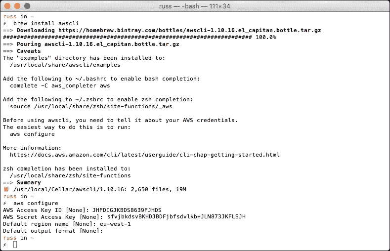

现在我们已经安装并配置了 AWS 命令行工具，接下来可以安装 Kubernetes 命令行工具。这是一个二进制文件，可以让你与 Kubernetes 集群进行交互，就像本地 Docker 客户端连接远程 Docker 引擎一样。可以通过 Homebrew 安装，运行以下命令即可：

```
brew install kubernetes-cli

```

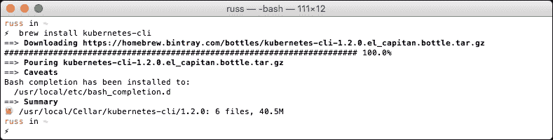

一旦安装完成，我们不需要再配置工具，因为接下来我们运行的 Kubernetes 主部署脚本会自动处理这些配置。

现在我们已经具备了启动和与 AWS Kubernetes 集群交互所需的工具，可以开始部署集群本身了。

在开始安装之前，我们需要让安装脚本了解一些关于我们希望在哪里启动集群以及我们希望集群的规模的信息，这些信息将作为环境变量传递给安装脚本。

首先，我希望它在欧洲启动：

```
export KUBE_AWS_ZONE=eu-west-1c
export AWS_S3_REGION=eu-west-1

```

另外，我需要两个节点：

```
export NUM_NODES=2

```

最后，我们需要指示安装脚本，我们希望在 Amazon Web Services 中启动 Kubernetes：

```
export KUBERNETES_PROVIDER=aws

```

现在我们已经告诉安装程序我们希望在何处启动 Kubernetes 集群，是时候实际启动它了。为此，请运行以下命令：

```
curl -sS https://get.k8s.io | bash

```

这将下载安装程序和最新的 Kubernetes 代码库，然后启动我们的集群。这个过程本身可能需要八到十五分钟，具体取决于你的网络连接。

如果你不想自己运行这个安装过程，你可以在以下网址查看 Kubernetes 集群在 Amazon Web Services 上部署的录制视频：

[`asciinema.org`](https://asciinema.org)

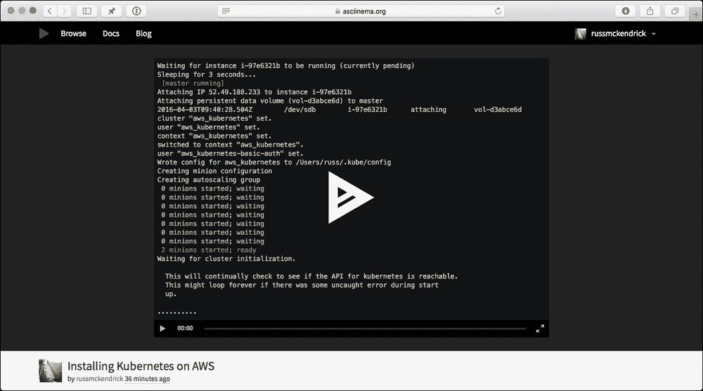

一旦安装脚本完成，你将获得访问你的 Kubernetes 集群的信息，你还应该能够运行以下命令来获取集群内节点的列表：

```
kubectl get nodes

```

这应该返回类似于以下截图的内容：

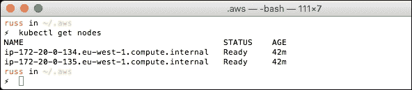

此外，如果你打开了 AWS 控制台，你应该会看到一个新的专用于 Kubernetes 的 VPC 已被创建：

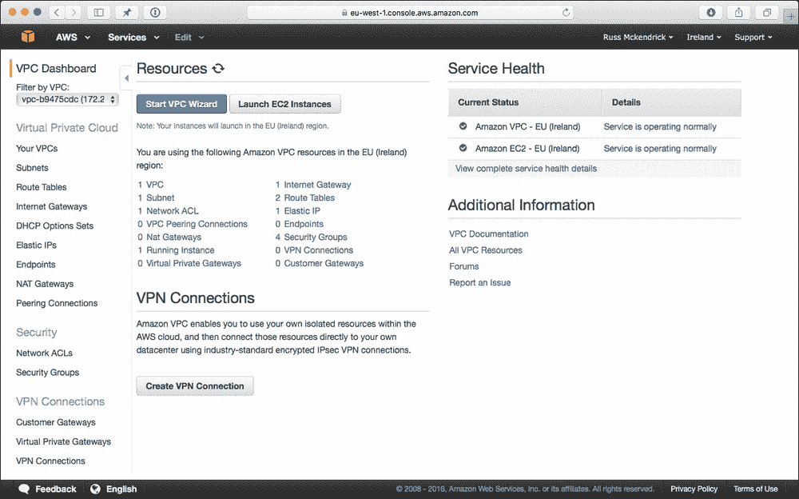

你还会看到三个 EC2 实例已经启动到 Kubernetes 的 VPC 中：

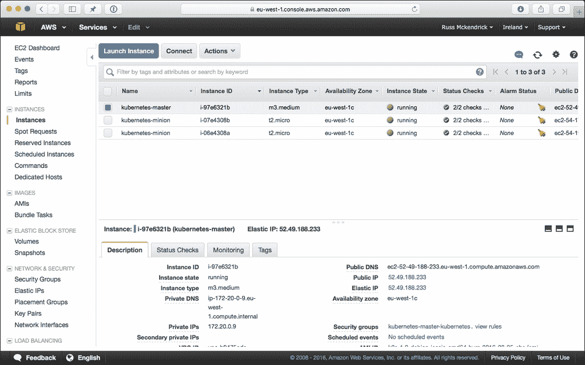

在我们开始将应用程序部署到 Kubernetes 集群之前，最后需要注意的一点是集群的用户名和密码凭据。

正如你在安装过程中看到的那样，这些信息存储在 Kubernetes CLI 配置文件的最底部，你可以通过运行以下命令来获取这些信息：

```
tail -3 ~/.kube/config

```

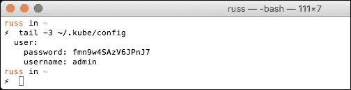

现在我们的 Kubernetes 集群已经启动，并且我们可以使用命令行工具访问它，我们可以开始启动应用程序。

## 启动我们的第一个 Kubernetes 应用程序

首先，我们将启动一个非常基础的 NGINX 容器集群，集群中的每个容器将提供一个简单的图形，并在页面上显示其主机名。你可以在 Docker Hub 上找到该容器的镜像，网址是[`hub.docker.com/r/russmckendrick/cluster/`](https://hub.docker.com/r/russmckendrick/cluster/)。

就像我们在前面章节中查看的许多工具一样，Kubernetes 使用 YAML 格式来定义文件。我们将要部署到集群中的文件是以下文件：

```
apiVersion: v1
kind: ReplicationController
metadata:
  name: nginxcluster
spec:
  replicas: 5
  selector:
    app: nginxcluster
  template:
    metadata:
      name: nginxcluster
      labels:
        app: nginxcluster
    spec:
      containers:
      - name: nginxcluster
        image: russmckendrick/cluster
        ports:
        - containerPort: 80
```

我们将文件命名为`nginxcluster.yaml`。要启动它，请运行以下命令：

```
kubectl create -f nginxcluster.yaml

```

一旦启动，你可以通过运行以下命令查看活动的 pod：

```
kubectl get pods

```

你可能会发现需要多次运行`kubectl` `get pods`命令，确保一切正常运行：

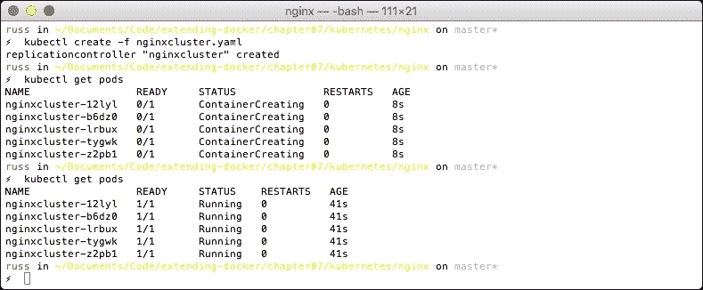

现在你的 pod 已经启动并运行，我们需要将它们暴露出去，这样就可以通过浏览器访问集群了。为此，我们需要创建一个服务。要查看当前的服务，输入以下命令：

```
kubectl get services

```

你应该只看到主要的 Kubernetes 服务。当我们启动 pod 时，我们定义了一个副本控制器，这是管理 pod 数量的过程。要查看副本控制器，运行以下命令：

```
kubectl get rc

```

你应该能看到 nginxcluster 控制器，并且在期望和当前列中都有五个 pod。现在，我们已经确认我们的副本控制器处于活动状态，并且注册了期望数量的 pod，接下来让我们创建服务并通过运行以下命令将 pod 暴露到外部：

```
kubectl expose rc nginxcluster --port=80 --type=LoadBalancer

```

现在，如果你再次运行`get services`命令，你应该能看到我们的新服务：

```
kubectl get services

```

你的终端会话应该类似于以下截图：

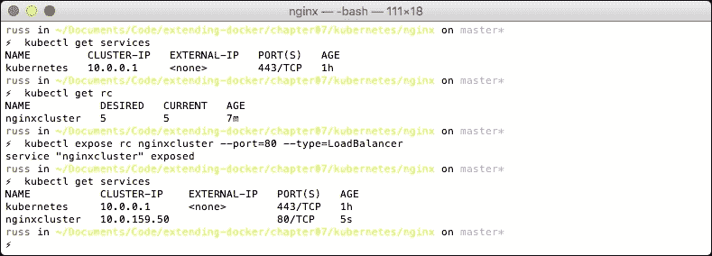

很好，现在你已经将 pod 暴露到互联网。但你可能注意到集群的 IP 地址是内部地址，那你该如何访问你的集群呢？

由于我们在 Amazon Web Services 上运行 Kubernetes 集群，当你暴露服务时，Kubernetes 会向 AWS 发出 API 调用并启动一个弹性负载均衡器。你可以通过运行以下命令获取负载均衡器的 URL：

```
kubectl describe service nginxcluster

```

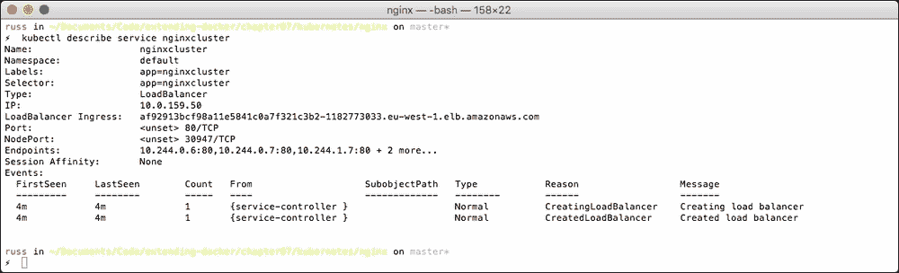

如你所见，在我的情况下，负载均衡器可以通过`http:// af92913bcf98a11e5841c0a7f321c3b2-1182773033.eu-west-1.elb.amazonaws.com/`访问。

在浏览器中打开负载均衡器 URL 可以看到我们的容器页面：

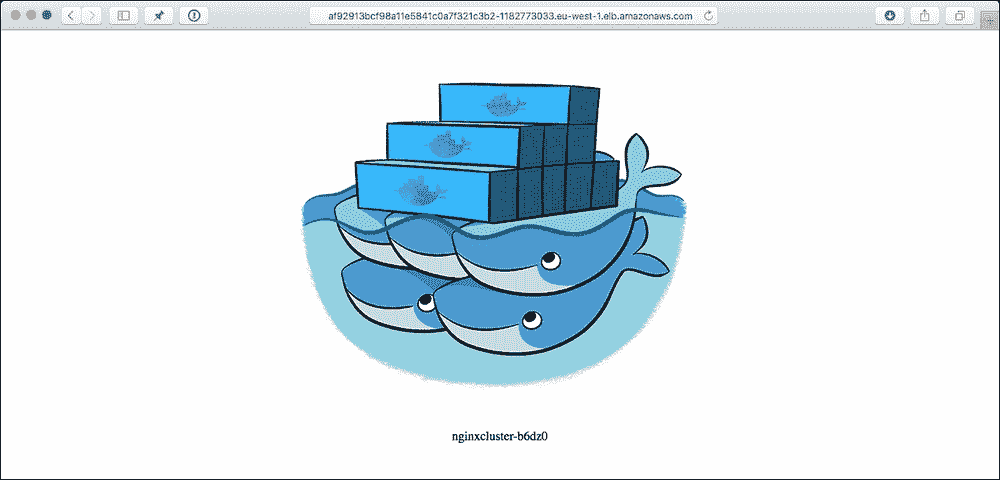

最后，如果你打开 AWS 控制台，你应该能够看到 Kubernetes 创建的弹性负载均衡器：

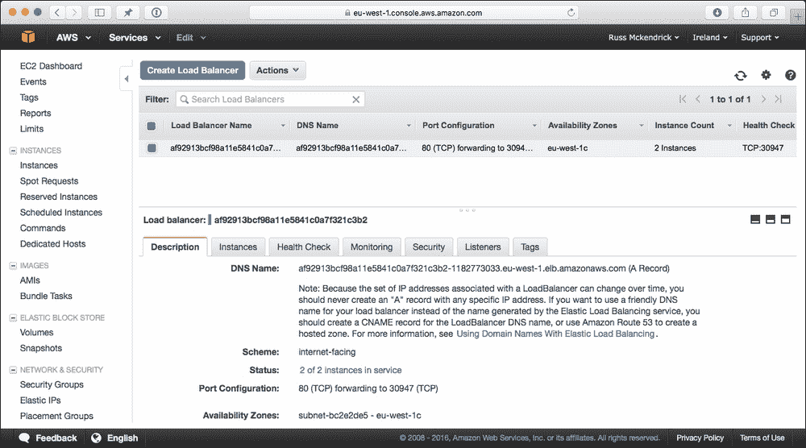

## 一个高级示例

让我们尝试做一些比启动几个相同实例并进行负载均衡更高级的操作。

在以下示例中，我们将启动我们的 WordPress 堆栈。这次我们将挂载弹性块存储卷来存储我们的 MySQL 数据库和 WordPress 文件：

> *“Amazon Elastic Block Store (Amazon EBS) 为在 AWS 云中与 Amazon EC2 实例一起使用的持久性块级存储卷提供服务。每个 Amazon EBS 卷会自动在其可用区内进行复制，以保护您免受组件故障的影响，提供高可用性和持久性。Amazon EBS 卷提供了运行工作负载所需的一致性和低延迟性能。使用 Amazon EBS，您可以在几分钟内扩展或缩减您的使用量——所有这些都只需为您配置的部分支付低廉的费用。” - [`aws.amazon.com/ebs/`](https://aws.amazon.com/ebs/)*

### 创建卷

在启动我们的 Pod 和服务之前，我们需要创建两个将附加到 Pod 的 EBS 卷。由于我们已经安装并配置了 AWS 命令行接口，因此我们将使用它来创建卷，而不是登录控制台并通过 GUI 创建。

要创建这两个卷，只需运行以下命令两次，确保更新可用区，以匹配您的 Kubernetes 集群配置启动的位置：

`aws ec2 create-volume --availability-zone eu-west-1c --size 10 --volume-type gp2`

每次运行该命令时，您将获得一个返回的 JSON 块，其中包含在创建卷时生成的所有元数据：

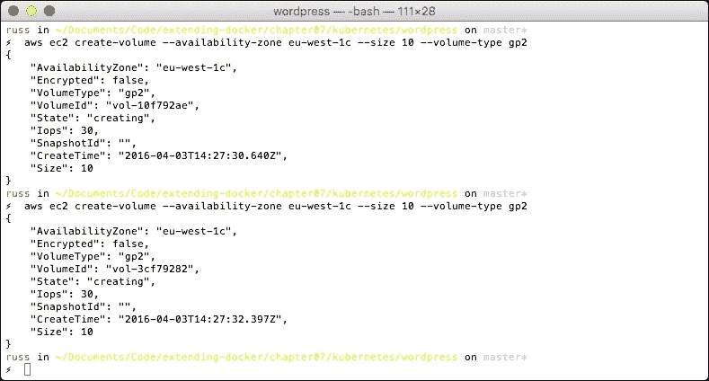

记录下每个卷的 VolumeId，当我们创建 MySQL 和 WordPress Pod 时，您将需要知道这些 ID。

### 启动 MySQL

现在我们已经创建了卷，接下来可以启动 MySQL Pod 和服务。首先，从 Pod 定义开始，确保在文件的底部添加一个卷 ID：

```
apiVersion: v1
kind: Pod
metadata:
  name: mysql
  labels: 
    name: mysql
spec: 
  containers: 
    - resources:
      image: russmckendrick/mariadb
      name: mysql
      env:
        - name: MYSQL_ROOT_PASSWORD
          value: yourpassword
      ports: 
        - containerPort: 3306
          name: mysql
      volumeMounts:
        - name: mysql-persistent-storage
          mountPath: /var/lib/mysql
  volumes:
    - name: mysql-persistent-storage
      awsElasticBlockStore:
        volumeID:<insert your volume id here>
        fsType: ext4
```

如您所见，这与我们第一个 Kubernetes 应用程序非常相似，只不过这次我们仅创建了一个 Pod，而不是带有复制控制器的 Pod。

如您所见，我已将我的卷 ID 添加到文件的底部；在启动 Pod 时，您需要添加您自己的卷 ID。

我将文件命名为`mysql.yaml`，因此要启动它，我们需要运行以下命令：

```
kubectl create -f mysql.yaml

```

Kubernetes 将在尝试启动 Pod 之前验证`mysql.yaml`文件；如果出现任何错误，请检查缩进是否正确：

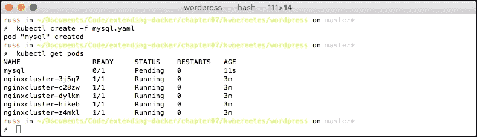

现在应该已经启动了 Pod；但是，您可能需要检查它是否成功启动。运行以下命令查看 Pod 的状态：

```
kubectl get pods

```

如果您看到 Pod 的状态为`Pending`，就像我一样，您可能会想知道*发生了什么？*幸运的是，您可以通过使用`describe`命令，轻松获取关于我们尝试启动的 Pod 的更多信息：

```
kubectl describe pod mysql

```

这将打印出有关 Pod 的所有信息，从以下终端输出可以看出，我们的集群容量不足，无法启动 Pod：

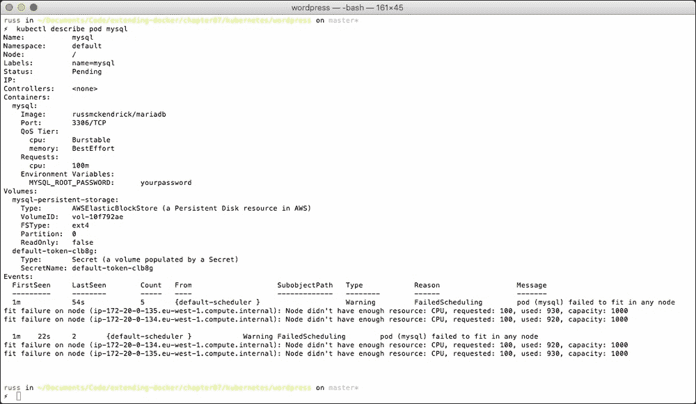

我们可以通过运行以下命令，删除之前的 Pods 和服务来释放一些资源：

```
kubectl delete rc nginxcluster
kubectl delete service nginxcluster

```

当你运行命令删除 `nginxcluster` 后，mysql Pod 应该会在几秒钟内自动启动：

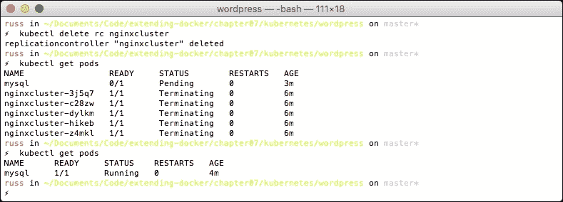

现在 Pod 已经启动，我们需要附加一个服务，使得 `3306` 端口能够暴露。与之前使用 `kubectl` 命令不同，我们将使用一个名为 `mysql-service.yaml` 的第二个文件：

```
apiVersion: v1
kind: Service
metadata: 
  labels: 
    name: mysql
  name: mysql
spec: 
  ports:
    - port: 3306
  selector: 
    name: mysql
```

要启动服务，只需运行以下命令：

```
kubectl create -f mysql-service.yaml

```

现在我们已经启动了 MySQL Pod 和服务，是时候启动实际的 WordPress 容器了。

### 启动 WordPress

和 MySQL Pod 及服务一样，我们将使用两个文件来启动我们的 WordPress 容器。第一个文件是 Pod 配置：

```
apiVersion: v1
kind: Pod
metadata:
  name: wordpress
  labels: 
    name: wordpress
spec: 
  containers: 
    - image: wordpress
      name: wordpress
      env:
        - name: WORDPRESS_DB_PASSWORD
          value: yourpassword
      ports: 
        - containerPort: 80
          name: wordpress
      volumeMounts:
        - name: wordpress-persistent-storage
          mountPath: /var/www/html
  volumes:
    - name: wordpress-persistent-storage
      awsElasticBlockStore:
        volumeID: <insert your volume id here>
        fsType: ext4
```

由于 EBS 卷一次只能附加到一个设备，记得在此使用你创建的第二个 EBS 卷。调用 `wordpress.yaml` 文件并使用以下命令启动：

```
kubectl create -f wordpress.yaml

```

然后等待 Pod 启动：

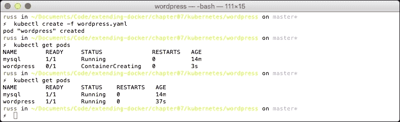

由于我们已经删除了 `nginxcluster`，应该有足够的资源直接启动 Pod，这意味着你不应该遇到任何错误。

尽管 Pod 应该已经在运行，但最好检查容器是否没有问题地启动。为此，运行以下命令：

```
kubectl logs wordpress

```

这应该会打印出容器日志，你将看到类似以下截图的内容：

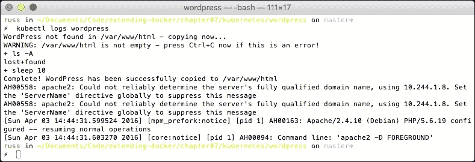

既然 Pod 已经启动，且 WordPress 看起来已按预期引导完成，我们应该启动服务。和 `nginxcluster` 一样，这将创建一个弹性负载均衡器。服务定义文件类似于以下代码：

```
apiVersion: v1
kind: Service
metadata: 
  labels: 
    name: wpfrontend
  name: wpfrontend
spec: 
  ports:
    - port: 80
  selector: 
    name: wordpress
  type: LoadBalancer
```

要启动它，运行以下命令：

```
kubectl create -f wordpress-service.yaml

```

启动后，检查是否已创建服务，并通过运行以下命令获取弹性负载均衡器的详细信息：

```
kubectl get services
kubectl describe service wpfrontend

```

当我运行命令时，我得到了以下输出：

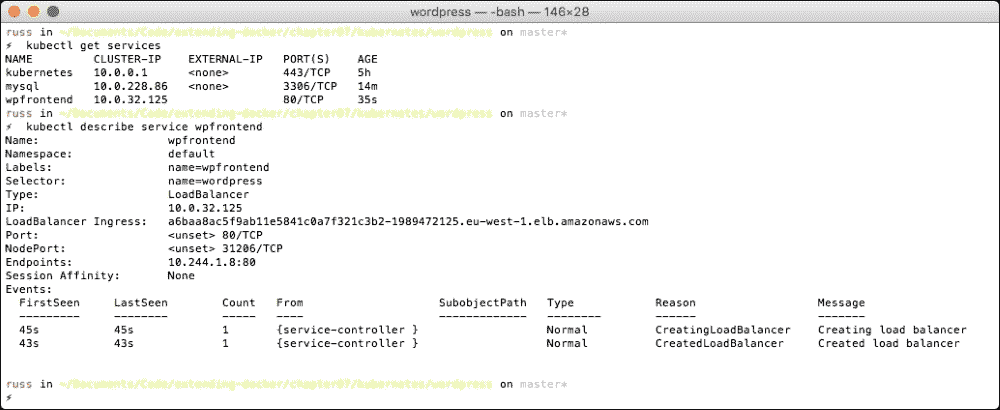

几分钟后，你应该能够访问弹性负载均衡器的 URL，正如预期的那样，你会看到一个 WordPress 安装界面：


如同我们在第三章中讲解 *卷插件* 时所做的那样，完成安装，登录并附加一张图片到 `Hello World` 帖子。

现在 WordPress 网站已启动并运行，让我们尝试删除 wordpress Pod 并重新启动它。首先，记录下容器 ID：

```
kubectl describe pod wordpress | grep "Container ID"

```

然后删除 Pod 并重新启动：

```
kubectl delete pod wordpress
kubectl create -f wordpress.yaml

```

再次检查容器 ID，以确保我们有一个不同的 ID：

```
kubectl describe pod wordpress | grep "Container ID"

```

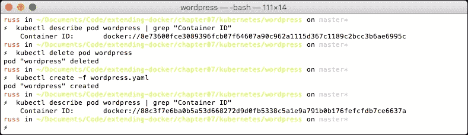

访问你的 WordPress 网站时，你应该会看到一切就如你离开时的状态：

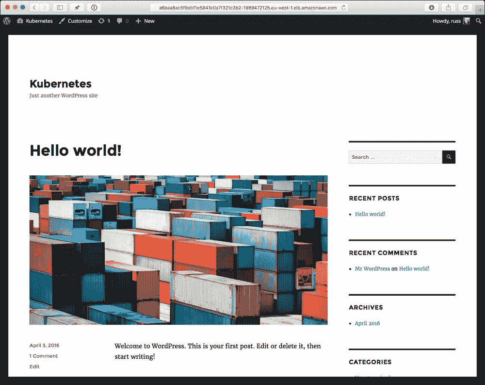

如果我们愿意，我们也可以对 MySQL Pod 执行相同的操作，而我们的数据会保持原样，因为它存储在 EBS 卷中。

让我们通过运行以下命令来删除 WordPress 应用的 Pod 和服务：

```
kubectl delete pod wordpress
kubectl delete pod mysql
kubectl delete service wpfrontend
kubectl delete service mysql

```

这样我们就可以为本章的下一部分准备一个干净的 Kubernetes 集群。

### 支持工具

你可能会想，为什么我们一开始部署 Kubernetes 集群时还要抓取用户名和密码，因为到目前为止我们还没用到它。让我们来看看作为 Kubernetes 集群一部分部署的支持工具。

当你首次部署 Kubernetes 集群时，屏幕上会打印出一系列 URL，我们将在本节中使用这些。如果你没有记下这些 URL，不用担心，你可以通过运行以下命令获取所有支持工具的 URL：

```
kubectl cluster-info

```

这将列出你 Kubernetes 集群各个部分的 URL：

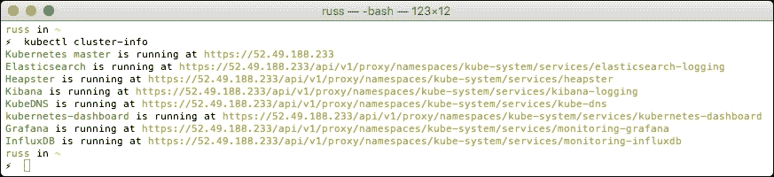

你需要用户名和密码才能查看其中的一些工具，如果你手头没有这些信息，可以通过运行以下命令获取：

```
tail -3 ~/.kube/config

```

#### Kubernetes 仪表盘

首先，让我们来看一下 Kubernetes 仪表盘。你可以通过在浏览器中输入 Kubernetes-dashboard 的 URL 来访问它。进入后，根据浏览器的不同，你可能会收到证书的警告，接受这些警告后，你将看到登录提示。在这里输入用户名和密码。登录后，你将看到如下屏幕：

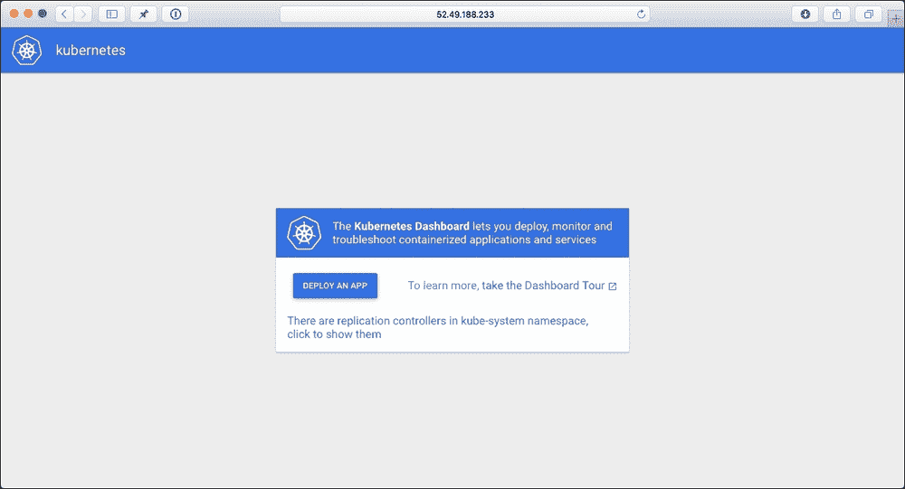

让我们通过 UI 部署 NGINX Cluster 应用。为此，点击 **部署应用** 并输入以下内容：

+   **应用名称** = `nginx-cluster`

+   **容器镜像** = `russmckendrick/cluster`

+   **Pod 数量** = `5`

+   **端口** = 留空

+   **端口** = `80`

+   **目标端口** = `80`

+   勾选 **将服务暴露到外部**

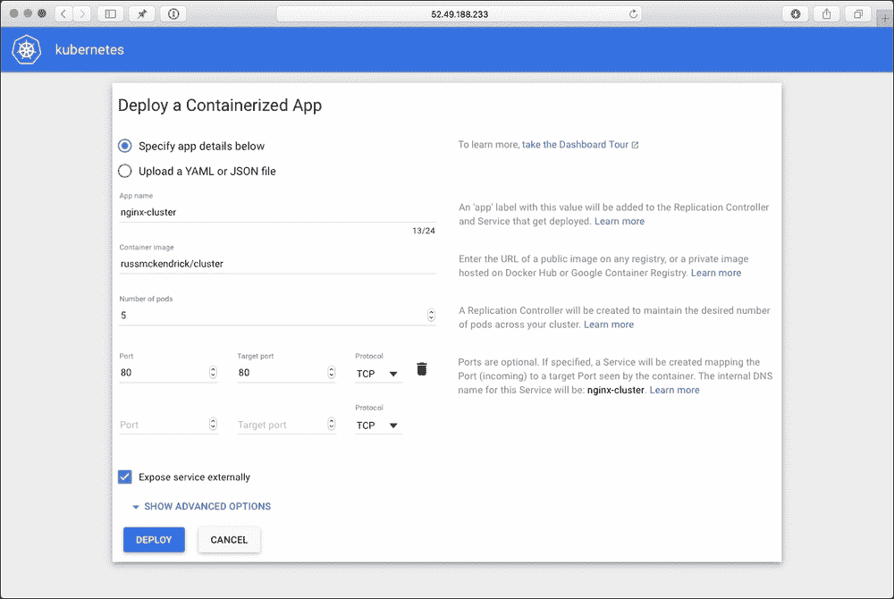

点击 **部署** 后，你将返回到概览页面：

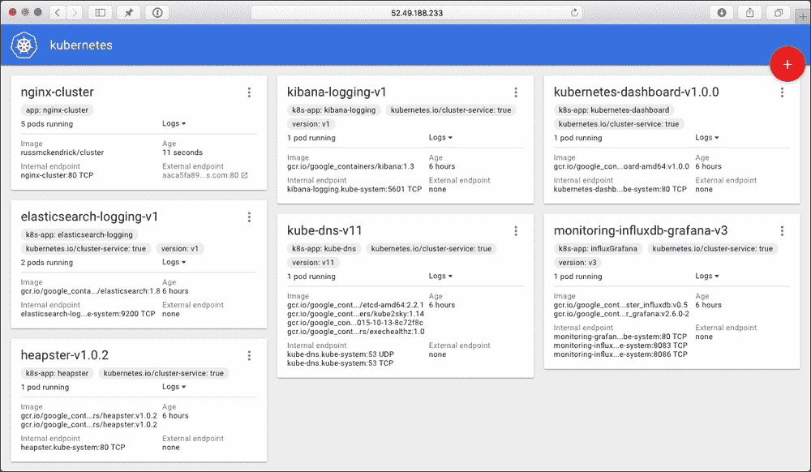

在这里，你可以点击 **nginx-cluster**，进入概览页面：

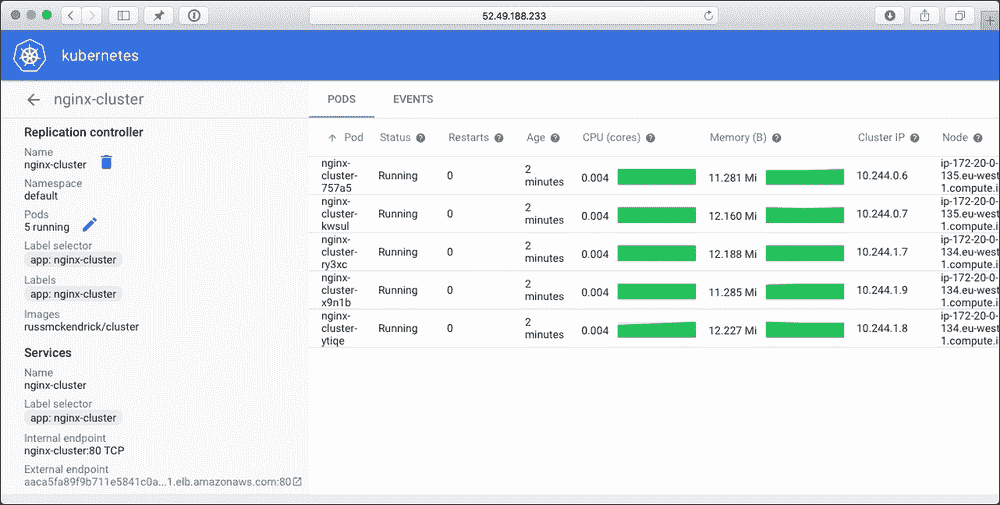

如你所见，这里提供了 Pod 和服务的所有详细信息，包括 CPU 和内存利用率，以及 Elastic Load Balancer 的链接。点击该链接将带你进入镜像的默认集群页面以及容器的主机名。

让我们保持 nginx-cluster 运行，以便查看下一个工具。

#### Grafana

接下来我们要打开的 URL 是 Grafana；访问该 URL 后，你应该会看到一个比较暗且大部分为空的页面。

Grafana 是记录我们在 Kubernetes 仪表盘中看到的所有指标的工具。让我们来看看集群的统计信息。为此，点击 **集群** 仪表盘：

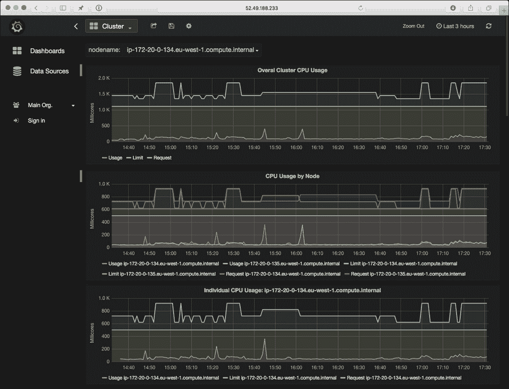

如你所见，这里为我们提供了一个系统监控工具应显示的所有指标的细分。向下滚动，你可以看到：

+   CPU 使用情况

+   内存使用情况

+   网络使用情况

+   文件系统使用情况

无论是整体还是单个节点，你都可以通过点击**Pods**仪表板查看 Pods 的详细信息。由于 Grafana 从运行中的 InfluxDB Pod 获取数据，而该 Pod 自我们首次启动 Kubernetes 集群以来一直在运行，因此你可以查看每个已启动 Pod 的指标，即使它当前并未运行。以下是我们在安装 WordPress 时启动的`mysql` Pod 的 Pod 指标：

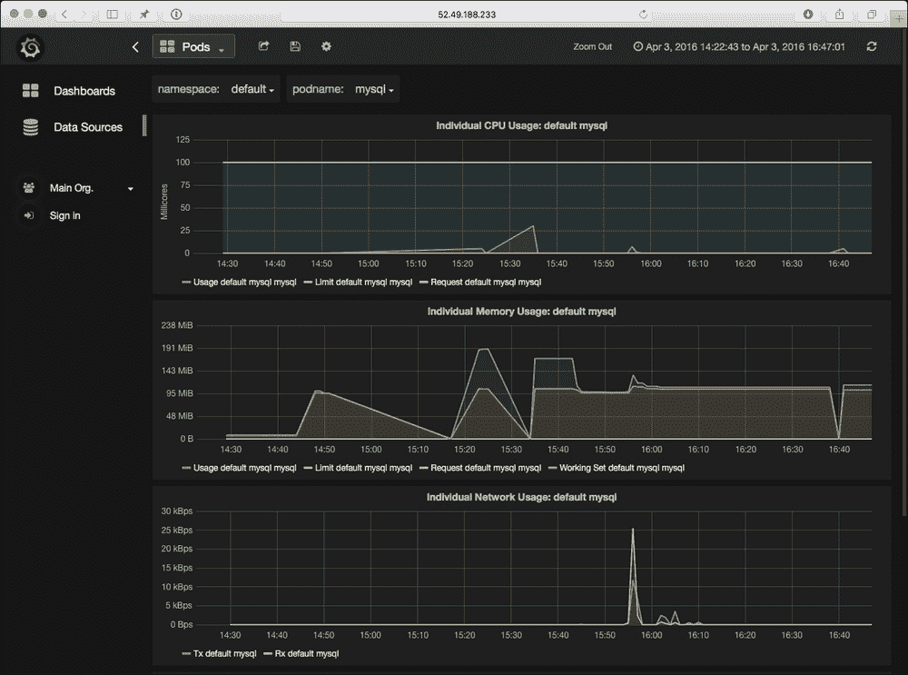

我建议你四处浏览，查看一些其他 Pod 的指标。

#### ELK

最后一个我们要查看的工具是自我们首次启动 Kubernetes 集群以来一直在后台运行的 ELK 栈。ELK 栈是以下三种不同工具的集合：

+   **Elasticsearch**: [`www.elastic.co/products/elasticsearch`](https://www.elastic.co/products/elasticsearch)

+   **Logstash**: [`www.elastic.co/products/logstash`](https://www.elastic.co/products/logstash)

+   **Kibana**: [`www.elastic.co/products/kibana`](https://www.elastic.co/products/kibana)

它们共同构成了一个强大的中央日志平台。

当我们在本章节前面运行以下命令时（请注意，由于我们已经移除了 WordPress Pod，你将无法再次运行该命令）：

```
kubectl logs wordpress

```

对于我们的`wordpress` Pod，显示的日志文件条目实际上是从 Elasticsearch Pod 读取的。Elasticsearch 自带一个名为 Kibana 的仪表板。让我们打开 Kibana 的 URL。

当你首次打开 Kibana 时，系统会要求你配置一个索引模式。为此，只需从下拉框中选择时间字段名称，并点击**创建**按钮：

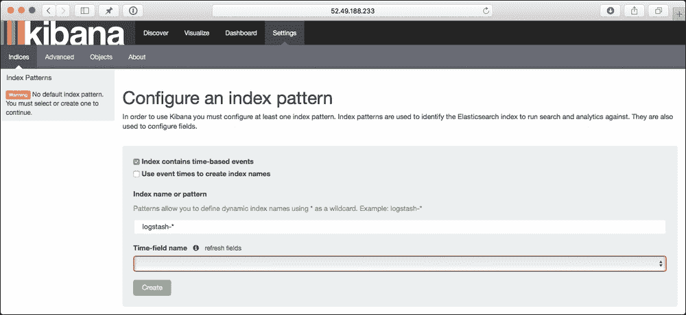

一旦索引模式创建完成，点击顶部菜单中的**Discover**链接。你将看到 Logstash 安装在每个节点上，并将日志数据发送到 Elasticsearch 后的所有日志数据概览：

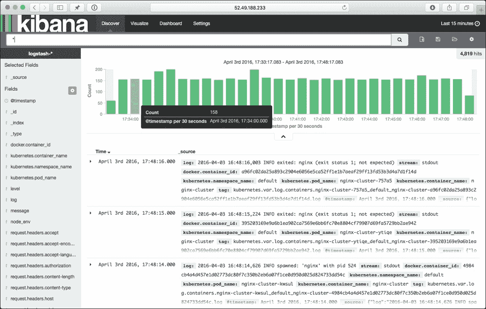

如你所见，有大量的数据被记录；事实上，当我查看时，仅 15 分钟内就记录了 4,918 条消息。这里有很多数据，我建议你点击查看并尝试一些搜索，以了解记录了什么内容。

为了让你了解每个日志条目是什么样的，下面是我其中一个 nginx-cluster Pod 的日志条目：

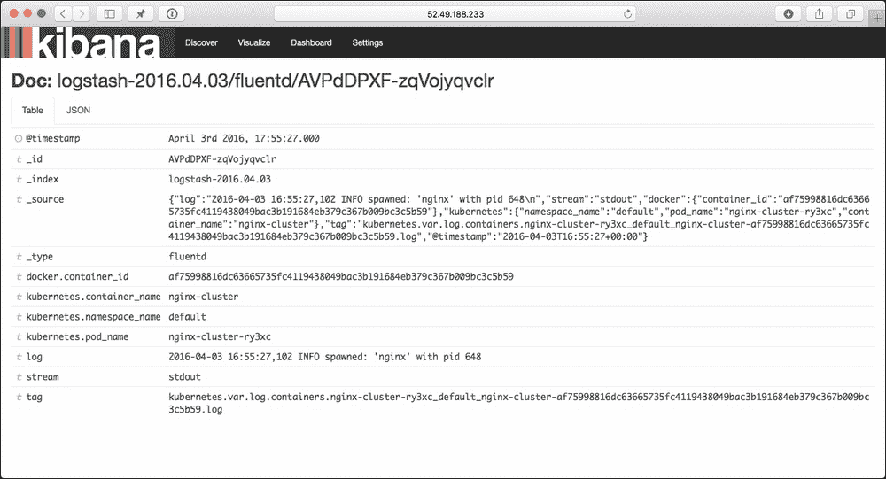

#### 剩余的集群工具

我们尚未在浏览器中打开的剩余集群工具如下：

+   **Kubernetes**

+   **Heapster**

+   **KubeDNS**

+   **InfluxDB**

这些都是 API 端点，因此你不会看到除 API 响应之外的任何内容，它们是 Kubernetes 内部用来管理和调度集群的。

## 销毁集群

由于集群位于你的亚马逊云服务账户中的按需计费实例上，我们应当考虑删除该集群；为此，让我们通过运行以下命令重新输入我们首次部署 Kubernetes 集群时使用的原始配置：

```
export KUBE_AWS_ZONE=eu-west-1c
export AWS_S3_REGION=eu-west-1
export NUM_NODES=2
export KUBERNETES_PROVIDER=aws

```

然后，从你首次部署 Kubernetes 集群的相同位置，运行以下命令：

```
./kubernetes/cluster/kube-down.sh

```

这将连接到 AWS API，并开始拆除所有与 Kubernetes 一起启动的实例、配置和其他资源。

该过程需要几分钟时间，请勿中断，否则可能会留下会产生费用的资源，这些资源将继续在你的亚马逊云服务账户中运行：

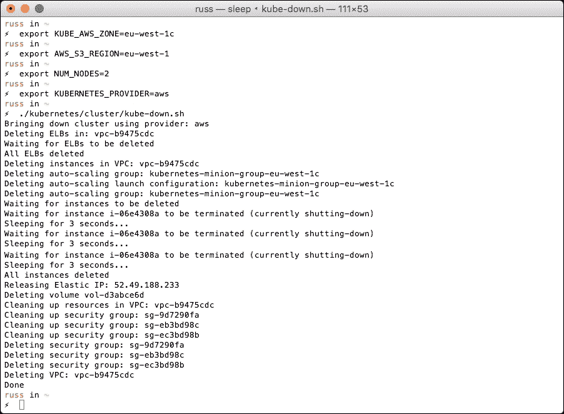

我还建议登录到你的亚马逊云服务控制台，移除我们为 WordPress 安装创建的未附加 EBS 卷，以及任何带有 Kubernetes 标签的 S3 存储桶，因为这些也会产生费用。

## 回顾

Kubernetes 像 Docker 一样，自首次公开发布以来已经成熟了很多。每一次发布都让部署和管理变得更容易，并且不会对功能集产生负面影响。

作为一个为容器提供调度的解决方案，它无与伦比，而且由于它不依赖于任何特定的供应商，你可以轻松将其部署到除了亚马逊云服务外的其他供应商，例如谷歌的云平台，那里它被视为一等公民。也可以在本地的裸金属服务器或虚拟服务器上进行部署，确保它遵循 Docker 的“构建一次，部署到任何地方”的理念。

此外，它能够适应每个平台上可用的技术；例如，如果你需要持久存储，正如前面提到的，你有多个选项可供选择。

最后，就像过去 18 个月的 Docker 一样，Kubernetes 也有一个相当统一的平台，多个厂商，如谷歌、微软和红帽，都支持并将其作为其产品的一部分使用。

# 亚马逊 EC2 容器服务（ECS）

我们接下来要了解的工具是亚马逊的弹性容器服务（Elastic Container Service）。亚马逊给出的描述如下：

> *“Amazon EC2 容器服务 (ECS) 是一个高度可扩展、高性能的容器管理服务，支持 Docker 容器，并允许您轻松地在 Amazon EC2 实例的托管集群上运行应用程序。Amazon ECS 消除了您需要安装、操作和扩展自己的集群管理基础设施的需求。通过简单的 API 调用，您可以启动和停止启用 Docker 的应用程序，查询集群的完整状态，并访问许多熟悉的功能，如安全组、弹性负载均衡、EBS 卷和 IAM 角色。您可以使用 Amazon ECS 根据资源需求和可用性要求调度容器在集群中的位置。您还可以集成您自己的调度器或第三方调度器，以满足业务或应用程序的特定需求。”* - [`aws.amazon.com/ecs/`](https://aws.amazon.com/ecs/)

亚马逊提供自有容器服务并不令人意外。毕竟，如果您遵循亚马逊的最佳实践，您会发现自己已经将每个 EC2 实例当作容器来处理。

当我将应用程序部署到亚马逊 Web 服务时，我总是尽力确保构建并部署生产就绪的镜像，并确保所有由应用程序写入的数据都发送到共享源，因为实例可能会因扩展事件随时终止。

为了支持这种方法，亚马逊提供了广泛的服务，例如：

+   **弹性负载均衡** (**ELB**)：这是一个高可用且可扩展的负载均衡器。

+   **Amazon 弹性块存储** (**EBS**)：为您的计算资源提供持久化块级存储卷。

+   **自动扩展**：这会自动扩展 EC2 资源的规模，帮助您管理流量高峰和应用程序中的故障。

+   **Amazon 关系数据库服务** (**RDS**)：这是一个高可用的数据库即服务，支持 MySQL、Postgres 和 Microsoft SQL。

所有这些都是为了帮助您消除亚马逊托管应用程序中的所有单点故障。

此外，由于亚马逊的所有服务都是基于 API 驱动的，因此他们将支持 Docker 容器扩展并不算太难。

## 在控制台中启动 ECS。

我将使用 AWS 控制台来启动我的 ECS 集群。由于我的 AWS 账户已经很久，因此某些步骤可能会有所不同。为了适应这种情况，我将会在 AWS 的较新区域启动我的集群。

一旦您登录到 AWS 控制台 [`console.aws.amazon.com/`](http://console.aws.amazon.com/)，确保您所在的区域是您希望启动 ECS 集群的区域，然后点击 **EC2 容器服务** 链接，位于 **服务** 下拉菜单中。

由于这是您第一次启动 ECS 集群，您将看到一个关于该服务的概述视频。

点击 **开始使用**，将引导您进入向导，帮助我们启动第一个集群。

首先，你将被提示创建任务定义。这相当于创建一个 Docker Compose 文件。在这里，你将定义希望运行的容器镜像及其允许消耗的资源，比如内存和 CPU。你还将在此处将主机端口映射到容器端口。

现在，我们将使用默认设置，等集群启动并运行后再来看如何启动我们自己的容器。按照以下截图填写详细信息，然后点击**下一步**：

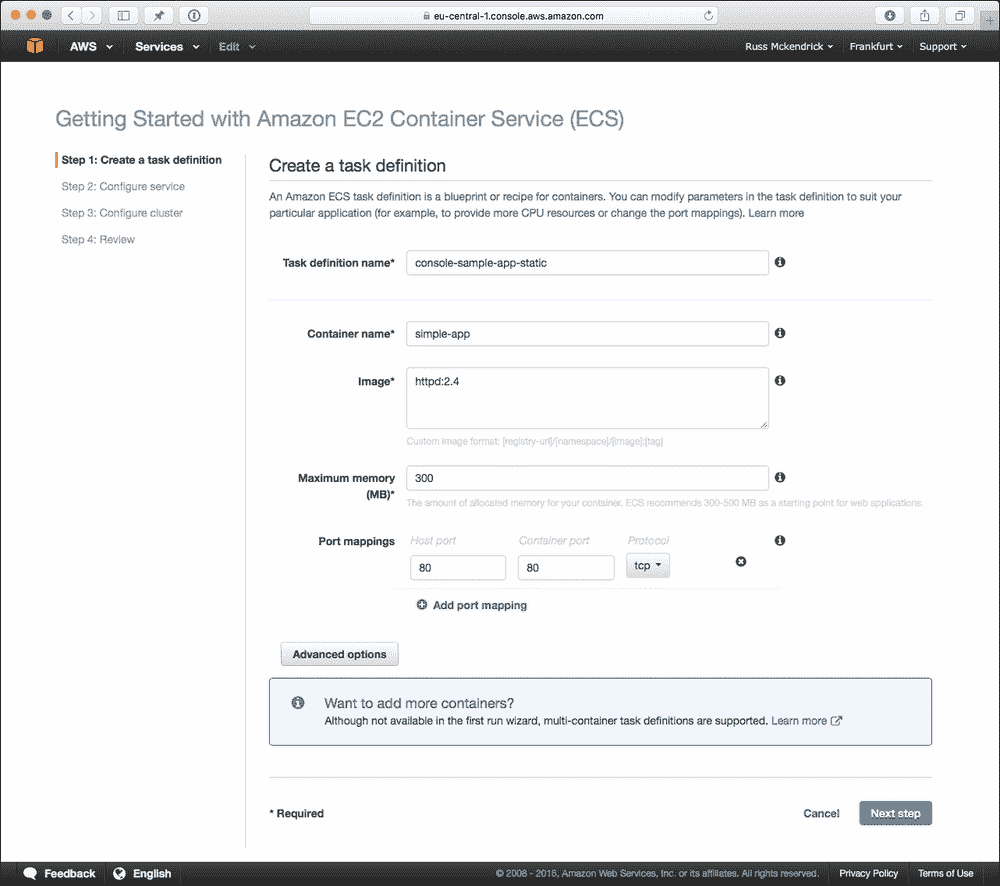

现在任务已经定义，我们需要将其附加到一个服务。这允许我们创建一个任务组，最初将是`console-sample-app-static`任务的三个副本，并将它们注册到弹性负载均衡器。按照以下截图填写详细信息，然后点击**下一步**按钮：

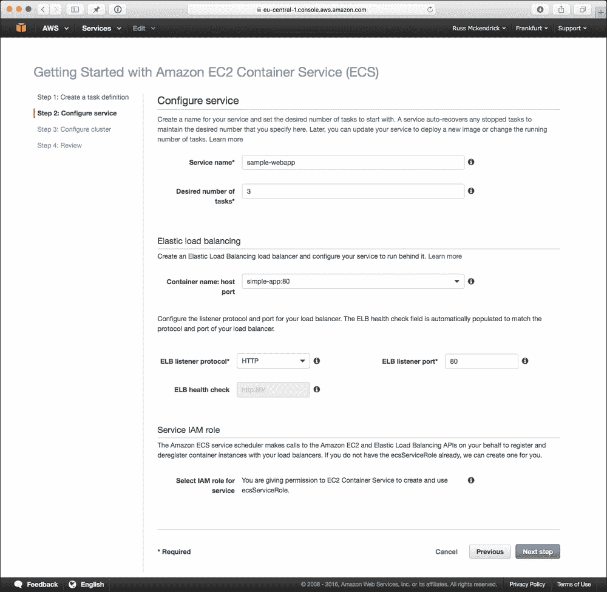

现在我们已经定义了服务，接下来需要为其选择一个启动位置。这时，EC2 实例就发挥作用了，也是你仍需付费的地方。尽管 Amazon EC2 容器服务的设置是免费的，但你将为交付集群计算资源所使用的资源付费。这些将是你的标准 EC2 实例费用。按照以下截图填写详细信息，然后点击**审查并启动**：

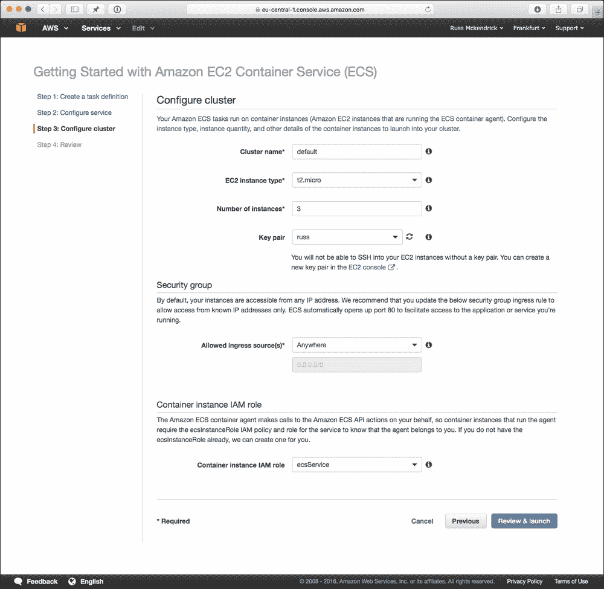

在启动之前，你将有机会重新检查在 AWS 账户中配置的所有内容，这是你放弃启动 ECS 集群的最后机会。如果你对一切都满意，点击**启动实例并运行服务**按钮：

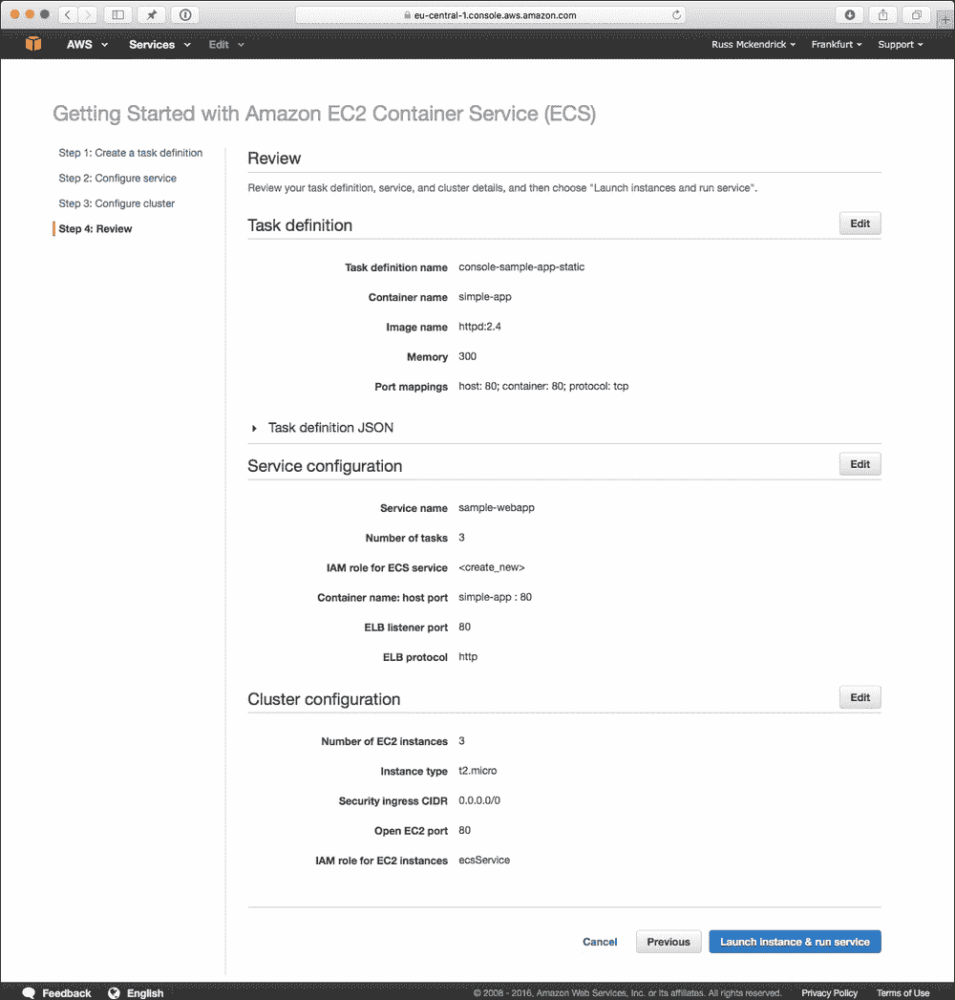

现在你将看到的是正在发生的概览。通常，完成这些任务大约需要 10 分钟。后台正在执行以下操作：

+   创建一个可以访问 ECS 服务的 IAM 角色

+   为你的集群创建一个 VPC，以便启动

+   创建一个启动配置，运行一个经过 ECS 优化的 Amazon Linux AMI，并使用 ECS IAM 角色

+   将新创建的启动配置附加到自动扩展组，并按照你定义的实例数量进行配置

+   在控制台内创建 ECS 集群、任务和服务

+   等待由自动扩展组启动的 EC2 实例启动并与 ECS 服务注册

+   在新创建的 ECS 集群上运行服务

+   创建一个弹性负载均衡器并将你的服务注册到该负载均衡器

你可以在其 AWS Marketplace 页面上找到有关 Amazon ECS 优化的 Amazon Linux AMI 的更多信息，网址为[`aws.amazon.com/marketplace/pp/B00U6QTYI2/ref=srh_res_product_title?ie=UTF8&sr=0-2&qid=1460291696921`](https://aws.amazon.com/marketplace/pp/B00U6QTYI2/ref=srh_res_product_title?ie=UTF8&sr=0-2&qid=1460291696921)。此镜像是 Amazon Linux 的精简版，仅在 Docker 上运行。

一旦完成所有设置，你将获得前往新创建的服务的选项。你应该看到类似于下图的界面：

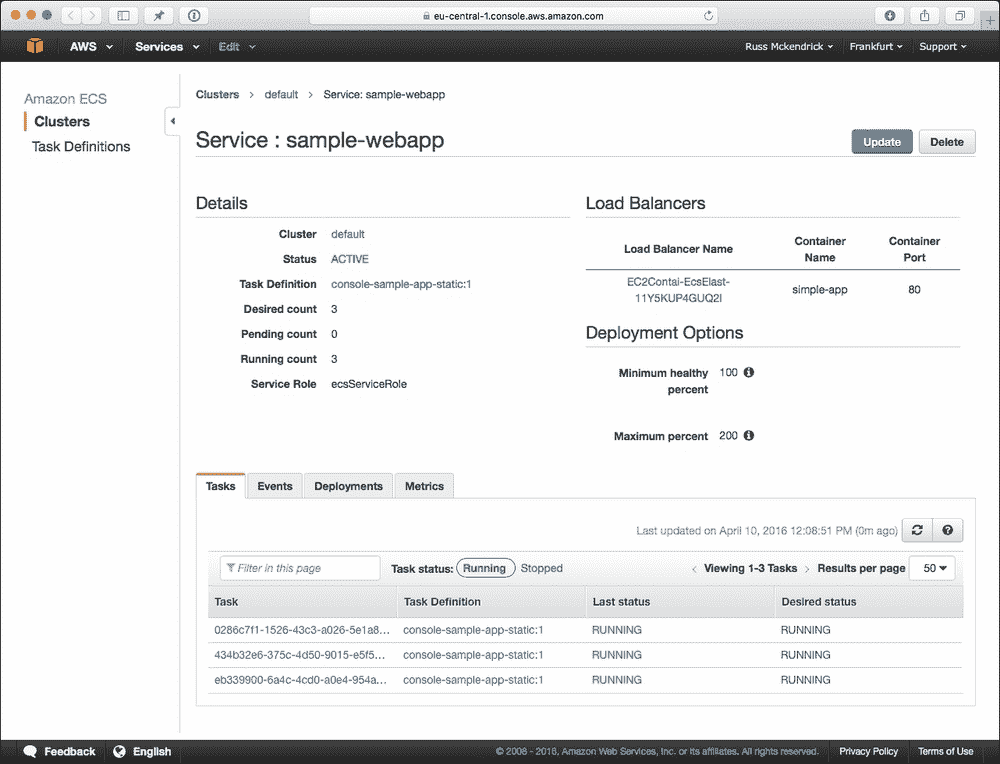

如你所见，我们有三个正在运行的任务和一个负载均衡器。

现在让我们创建自己的任务和服务。从前面的服务视图中，点击**Update**按钮并将所需的数量从三改为零，这将停止任务并允许我们删除服务。为此，点击**default**按钮进入集群视图，然后删除该服务。

由于`sample-webapp`服务已经被移除，点击**Task Definitions**按钮，然后点击**Create new task definition**按钮。在打开的页面中，点击**Add container**按钮并填写以下详细信息：

+   **Container name**: `cluster`

+   **Image**: `russmckendrick/cluster`

+   **Maximum memory (MB)**: `32`

+   **Port mappings**: `80` (**Host port**) `80` (**Container port**) `tcp` (**Protocol**)

其他项可以保留默认值：

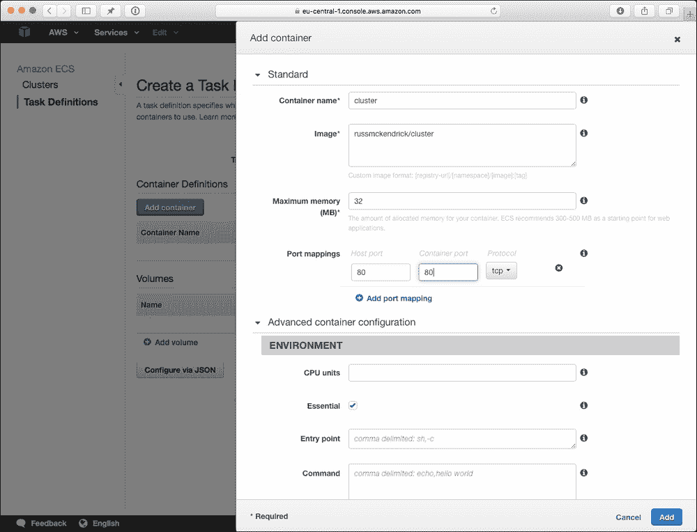

填写完成后，点击**Add**按钮。这将带你回到**Create a Task Definition**屏幕，填写任务定义名称，我们称之为`our-awesome-cluster`，然后点击**Create**按钮：

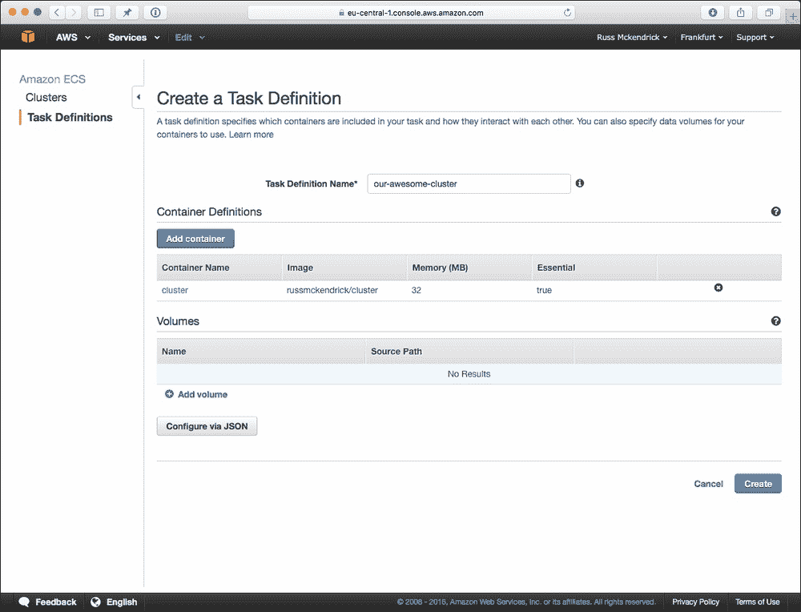

现在我们已经定义了新的任务，接下来需要创建一个服务来将其附加到任务上。点击**Clusters**标签，然后点击**default**集群，你应该看到类似于下图的界面：

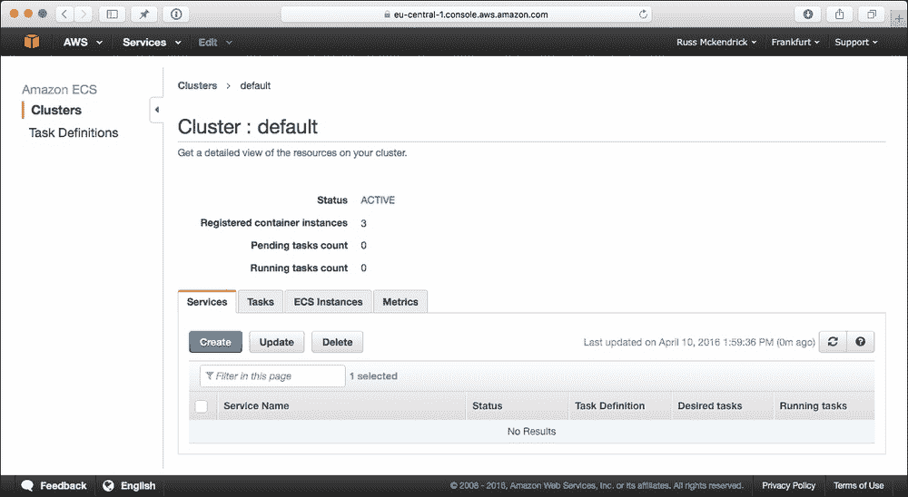

点击**Services**标签中的**Create**按钮。在这个页面中，填写以下信息：

+   **Task Definition**: `our-awesome-cluster:1`

+   **Cluster**: `default`

+   **Service name**: `Our-Awesome-Cluster`

+   **Number of tasks**: `3`

+   **Minimum healthy percent**: `50`

+   **Maximum percent**: `200`

此外，在**Optional configurations**部分，点击**Configure ELB**按钮，并使用原本为`sample-webapp`服务配置的弹性负载均衡器：

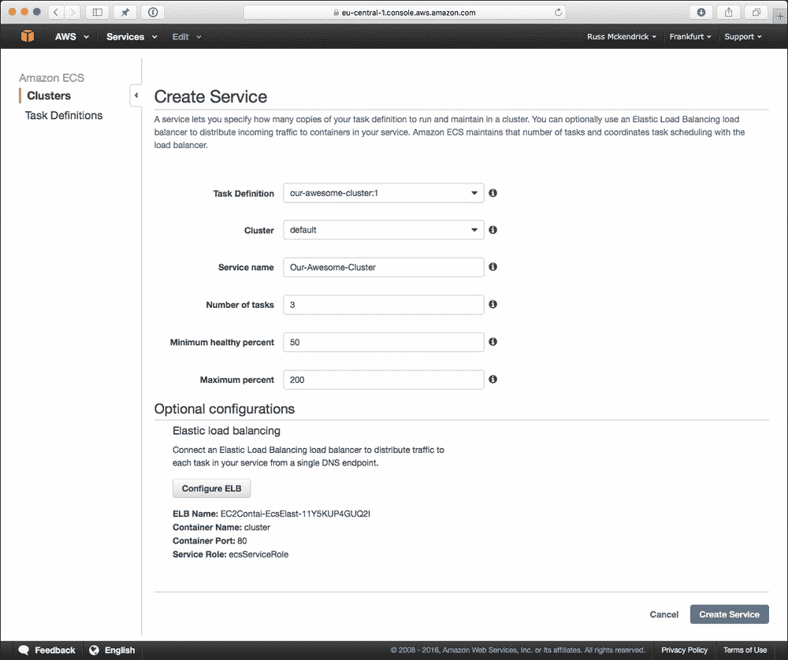

填写完信息后，点击**Create Service**按钮。如果一切顺利，你应该看到类似于下图的页面：

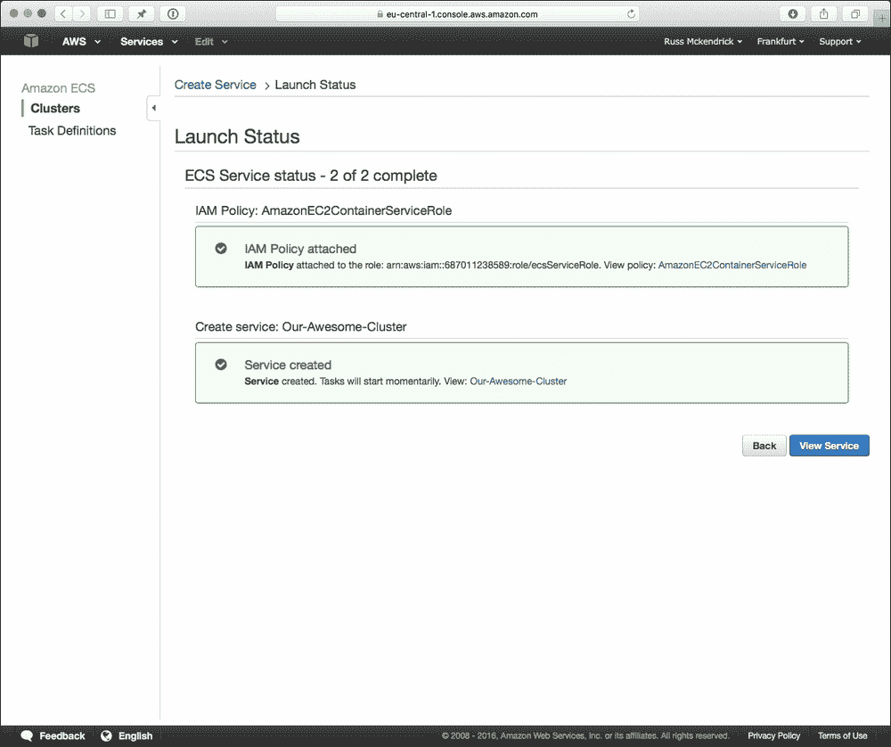

点击**View Service**将为你提供类似于我们首次看到的`Sample-Webapp`服务的概览：

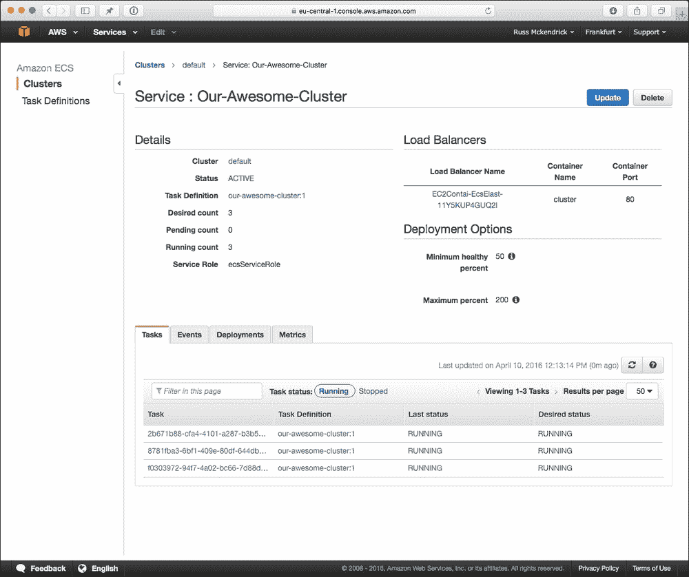

现在只剩下做的就是点击**负载均衡器名称**，你将进入 ELB 概览页面；从这里，你将能够获取 ELB 的 URL，将其放入浏览器中应该能展示我们的集群应用：

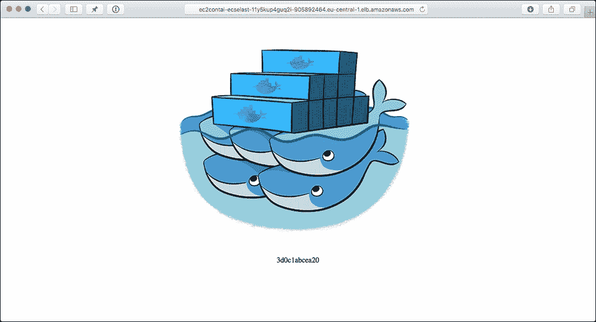

点击刷新几次，你应该会看到容器的主机名发生变化，表明我们正在不同的容器之间进行负载均衡。

与其再启动更多实例，不如终止我们的集群。为此，进入 AWS 控制台顶部的**EC2**服务菜单。

在这里，向下滚动到位于左侧菜单底部的**自动扩展组**。在这里，移除自动扩展组，然后移除启动配置。这将终止我们 ECS 集群中的三个 EC2 实例。

一旦实例被终止，点击**负载均衡器**，然后终止弹性负载均衡器（Elastic Load Balancer）。

最后，返回到**EC2 容器服务**，通过点击**x**删除默认集群。这将移除我们启动 ECS 集群时创建的剩余资源。

## 回顾

如你所见，亚马逊的 EC2 容器服务可以通过基于 Web 的 AWS 控制台运行。虽然也有命令行工具可用，但这里不再介绍它们。你可能会问，为什么呢？

好吧，尽管亚马逊所构建的服务产品已经相当完整，但它仍然给人一种处于早期 Alpha 阶段的产品感。亚马逊 ECS 优化版的 Amazon Linux AMI 中所提供的 Docker 版本相当陈旧。必须在默认堆栈之外启动实例的过程显得非常笨重。它与亚马逊提供的一些支持服务的集成也是一个非常手动的过程，使得它感觉不够完善。还有一种感觉就是你对它的控制权不大。

就个人而言，我认为这个服务具有很大的潜力；然而，在过去的 12 个月里，许多替代产品已经发布，并且开发进展更快，这意味着与我们正在查看的其他服务相比，亚马逊的 ECS 服务显得陈旧且过时。

# Rancher

Rancher 是一个相对较新的玩家，撰写本书时，它刚刚发布了 1.0 版本。Rancher Labs（开发者）将 Rancher（平台）描述为：

> *"一个开源软件平台，实现了一个专门为在生产中运行容器而构建的基础设施。Docker 容器作为一种日益流行的应用工作负载，在网络、存储、负载均衡、安全性、服务发现和资源管理等基础设施服务中创造了新的需求。"*
> 
> *Rancher 从任何公共或私有云中以 Linux 主机的形式接收原始计算资源。每个 Linux 主机可以是虚拟机或物理机。Rancher 对每个主机的要求仅限于 CPU、内存、本地磁盘存储和网络连接。从 Rancher 的角度来看，来自云服务提供商的虚拟机实例和托管在合租数据中心设施中的裸金属服务器是不可区分的。" - [`docs.rancher.com/rancher/`](http://docs.rancher.com/rancher/)*

Rancher Labs 还提供了 RancherOS——一个轻量级的 Linux 发行版，将整个操作系统作为 Docker 容器运行。我们将在下一章中讨论这个。

## 安装 Rancher

Rancher 需要一个主机来运行，所以让我们使用 Docker Machine 在 DigitalOcean 上启动一台服务器：

```
docker-machine create \
 --driver digitalocean \
 --digitalocean-access-token sdnjkjdfgkjb345kjdgljknqwetkjwhgoih314rjkwergoiyu34rjkherglkhrg0 \
 --digitalocean-region lon1 \
 --digitalocean-size 1gb \
 rancher

```

Rancher 以容器形式运行，因此我们不使用 SSH 连接到新启动的 Docker 主机，而是配置本地客户端连接到主机，然后启动 Rancher：

```
eval $(docker-machine env rancher)
docker run -d --restart=always -p 8080:8080 rancher/server

```

就这样，Rancher 很快就会启动并运行。你可以查看日志，随时关注 Rancher 何时准备好。

首先，通过运行以下命令检查 Rancher 容器的名称：

```
docker ps

```

在我的情况下，它是`jolly_hodgkin`，现在运行以下命令：

```
docker logs -f <name of your container>

```

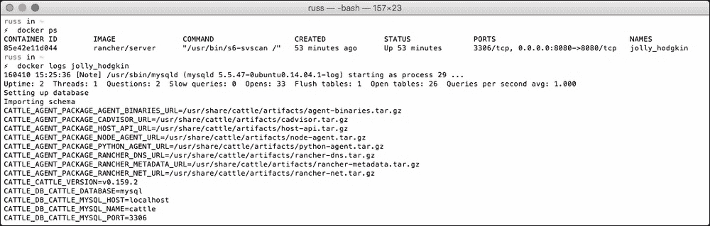

你应该能看到很多日志文件条目滚动经过，过一会儿，日志停止写入。这是 Rancher 准备好的标志，你可以登录到 Web 界面。为此，运行以下命令打开浏览器：

```
open http://$(docker-machine ip rancher):8080/

```

打开后，你应该能看到类似于以下截图的内容：

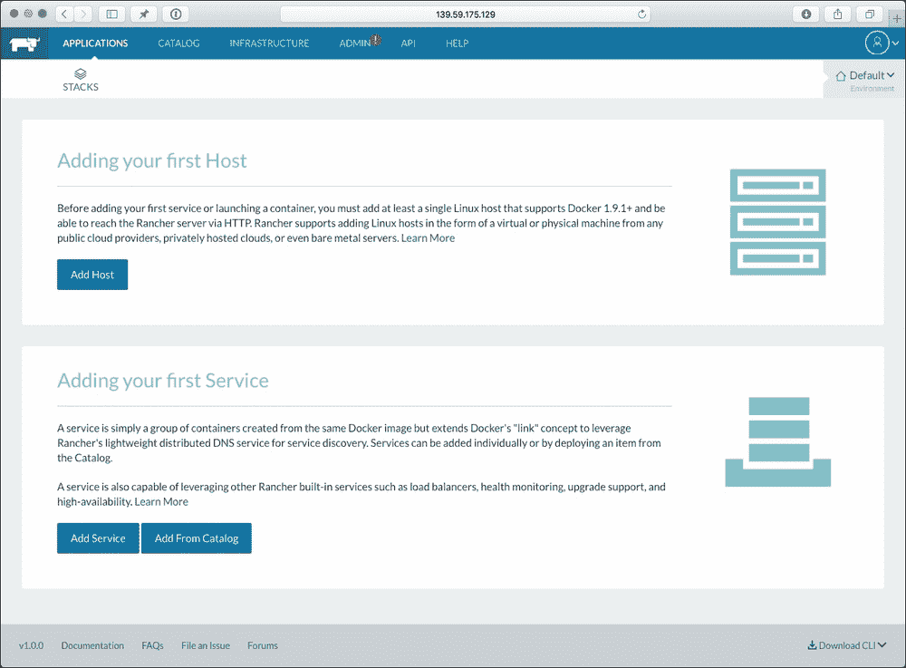

如你所见，我们已直接登录。由于这个页面可通过公共 IP 地址访问，我们最好对安装进行安全加固。这就是为什么在顶部菜单中的**管理员**旁边会出现红色警告图标的原因。

## 加固你的 Rancher 安装

由于我没有配置 Active Directory 服务器，我将使用 GitHub 来对我的 Rancher 安装进行身份验证。就像安装过程本身一样，Rancher Labs 使这个过程变得非常简单。首先，点击顶部菜单中的**管理员**，然后在次级菜单中点击**访问控制**，你将进入一个页面，页面上列出了配置 Rancher 以使用 GitHub 作为身份验证后端所需的所有信息。

对我而言，这个屏幕看起来类似于以下图片：

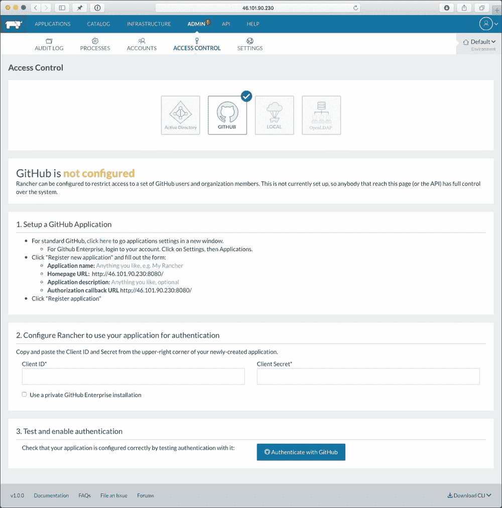

由于我拥有的是标准的 GitHub 账户，而不是企业版安装，我所需要做的就是点击链接，它会带我到一个页面，在那里我可以注册我的 Rancher 安装。

这要求输入几项信息，所有这些信息都显示在以下页面中：

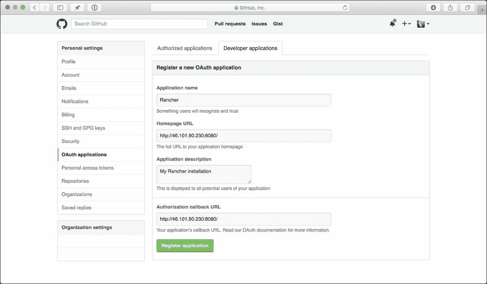

填写完信息后，我点击了**注册应用**按钮。应用注册成功后，我被引导到一个页面，页面上显示了客户端 ID 和客户端密钥：

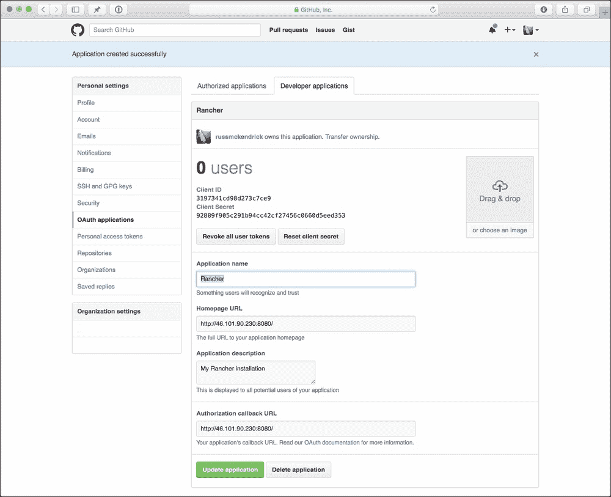

我将这些参数输入到 Rancher 页面上的相应框中，然后点击**用 GitHub 认证**。这时弹出了一个 GitHub 授权窗口，要求我授权该应用。点击**授权应用**按钮后，Rancher 界面刷新并让我登录，正如下面的截图所示，我的应用现在已经安全：

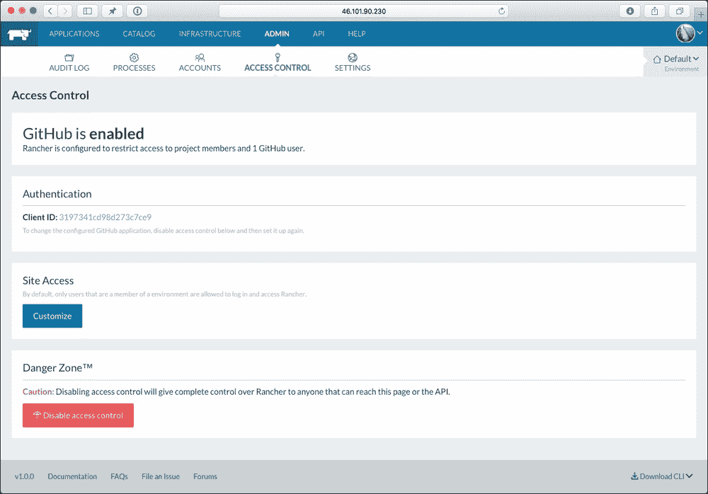

现在我们已经配置了认证，您应该重新退出并重新登录，以确保一切按预期工作，然后再继续下一步。为此，请点击页面右上角的头像，并点击**登出**。

您将立即被带到以下页面：

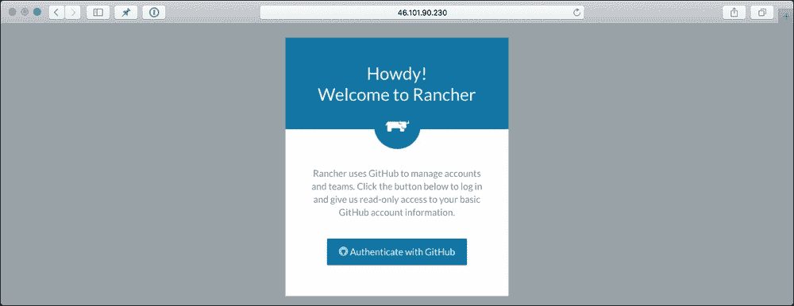

点击**用 GitHub 认证**以重新登录。

那么，我们为什么要退出然后再重新登录呢？接下来，我们将为 Rancher 安装提供 DigitalOcean API 密钥，以便它可以启动主机。如果在添加此 API 密钥之前没有保护我们的安装，意味着任何人都可以偶然发现我们的 Rancher 安装并开始按他们的意愿启动主机。这，正如你可以想象的那样，可能会非常昂贵。

## Cattle 集群

Rancher 支持三种不同的调度程序，我们已经在本章和上一章中查看了其中的两种。从我们的 Rancher 安装中，我们将能够启动 Docker Swarm 集群、Kubernetes 集群，以及 Rancher 集群。

在本章的这一部分，我们将研究 Rancher 集群。这里使用的调度程序叫做 Cattle。它也是默认的调度程序，所以我们不需要进行配置，我们只需要添加一些主机即可。

如前一节所提到的，我们将要在 DigitalOcean 中启动我们的主机；为此，请点击首页“添加第一个主机”部分中的**添加主机**。

您将被带到一个页面，页面顶部列出了多个托管提供商，点击 DigitalOcean，然后输入以下详细信息：

+   **数量**：我希望启动三个主机，因此将滑块拖动到 `3`。

+   **名称**：这是主机在我的 DigitalOcean 控制面板中显示的名称。

+   **描述**：一个简短的描述，附加到每个主机。

+   **访问令牌**：这是我的 API 令牌，您应该在第二章中获得属于您的令牌，*第方工具*。

+   **镜像**：目前仅支持 Ubuntu 14.04x64。

+   **大小**：这是您希望启动的主机的大小。别忘了，主机越大，主机在线时您支付的费用就越高。

+   **区域**：您希望在哪个 DigitalOcean 数据中心启动主机？

我将其余的选项保持在默认设置：

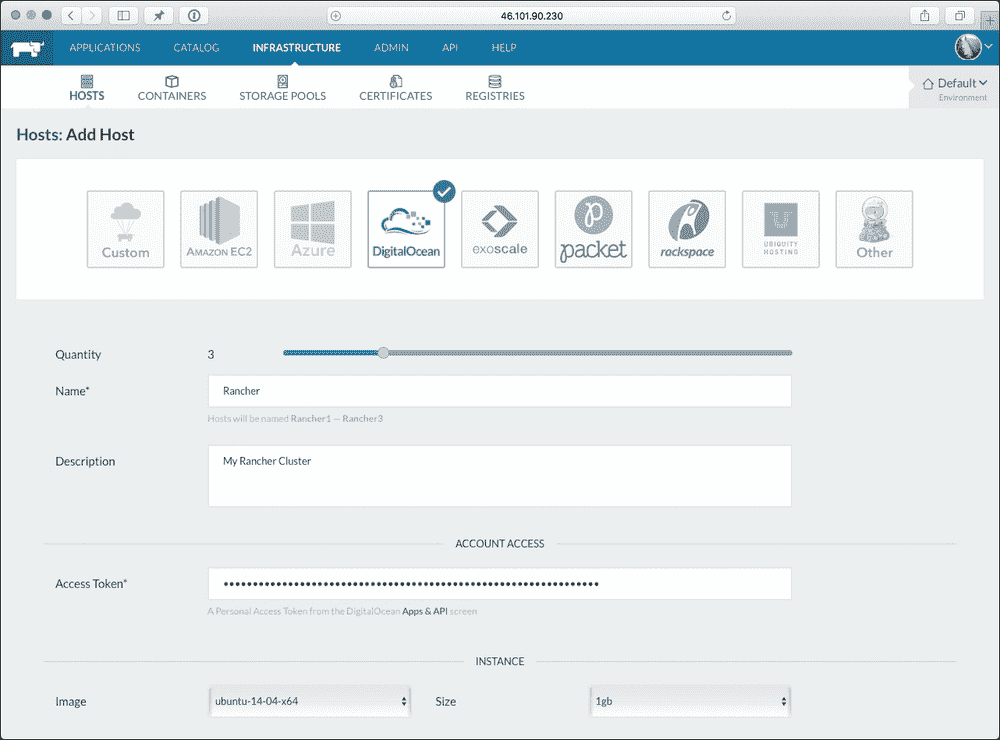

当我对所填写的内容满意后，我点击了**创建**按钮。然后，Rancher 使用 DigitalOcean API 启动了我的主机。

要检查主机的状态，你应该点击顶部菜单中的**基础设施**，然后在次级菜单中选择**主机**。

在这里，你应该看到你正在部署的主机及其状态，状态正在实时更新。你应该会看到以下信息：

+   主机已经启动

+   Docker 正在安装并配置

+   Rancher 代理正在安装并配置

最终，你的三个主机都显示为活动状态：

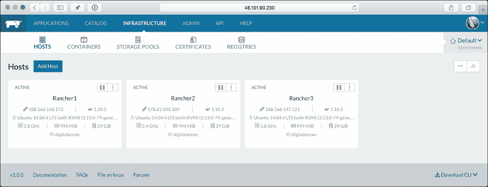

你看，完成了，这是你第一个 Cattle 集群。如你所见，到目前为止，在 Rancher 中安装、配置和保护我们的第一个集群非常简单。接下来，我们需要部署我们的容器。

## 部署集群应用程序

根据前两个调度程序，接下来我们来看看如何部署我们的基本集群应用程序。为此，点击顶部菜单中的**应用程序**选项卡，然后点击**添加服务**。有一个**从目录添加**的选项，我们将在启动自己的应用程序时查看这个选项。

在**添加服务**页面，输入以下信息：

+   **规模**: `在每个主机上始终运行此容器的一个实例`

+   **名称**: `MyClusterApp`

+   **描述**: `我真的很棒的集群应用`

+   **选择镜像**: `russmckendrick/cluster`

+   **端口映射**: 在**私有端口**框中添加端口 `80` 的端口映射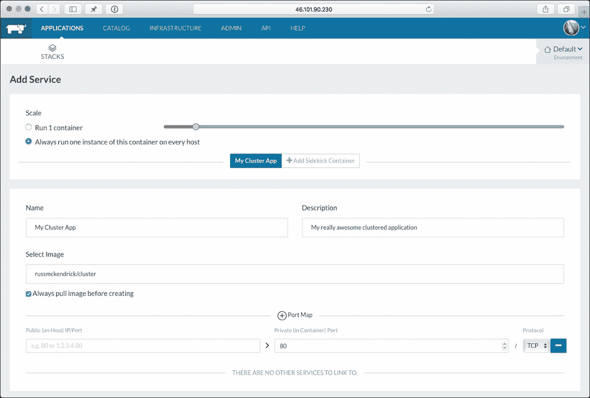

现在，保持其余表单的默认值，点击**创建**按钮。

几分钟后，你应该能看到你的服务处于活动状态，点击服务名称将带你进入一个显示所有在该服务中运行的容器的详细信息页面：

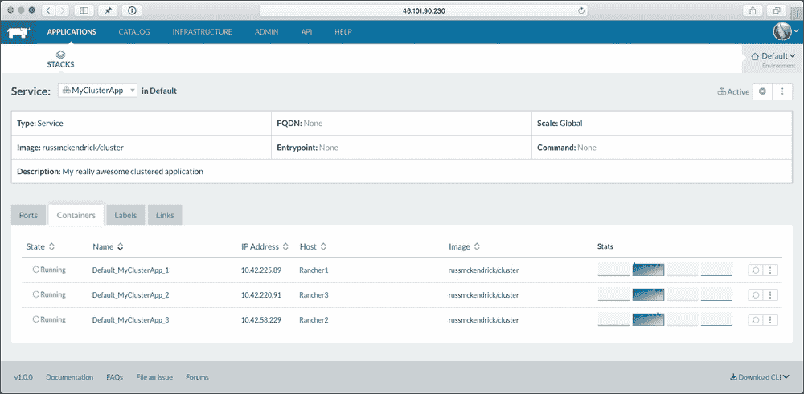

现在，我们的容器已经在运行，我们真的需要能够访问它们。要配置负载均衡器，点击**堆栈**，然后点击默认服务上的下拉箭头：

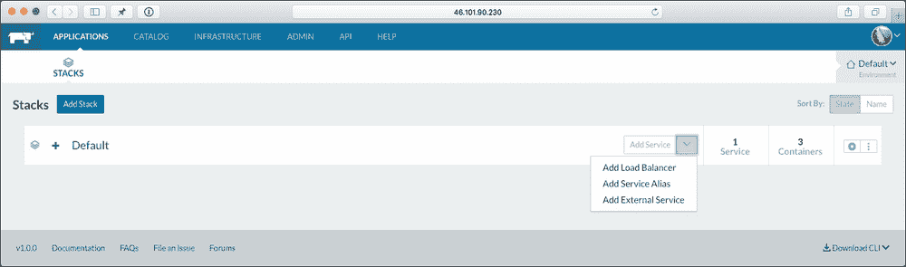

从下拉菜单中选择**添加负载均衡器**将带你进入一个类似我们添加集群应用的界面。

填写以下信息：

+   **规模**: `运行 1 个容器`

+   **名称**: `ClusterLoadBalancer`

+   **描述**: `我的集群应用的负载均衡器`

+   **监听** **端口**: `源 IP/端口 80 默认目标端口 80`

+   **目标** **服务**: `MyClusterApp`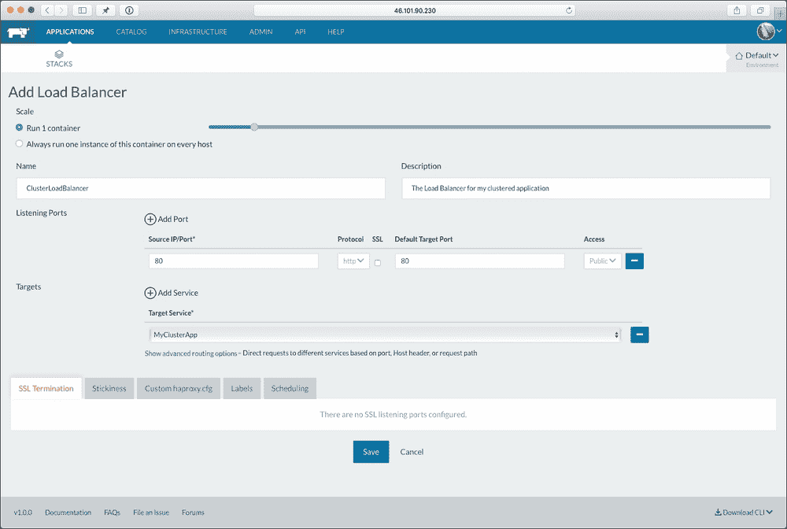

点击**保存**按钮并等待服务启动。你将被带回到你启动的服务列表中，点击负载均衡器名称旁的信息图标将在屏幕底部打开一个信息面板。从这里，点击端口部分列出的 IP 地址：

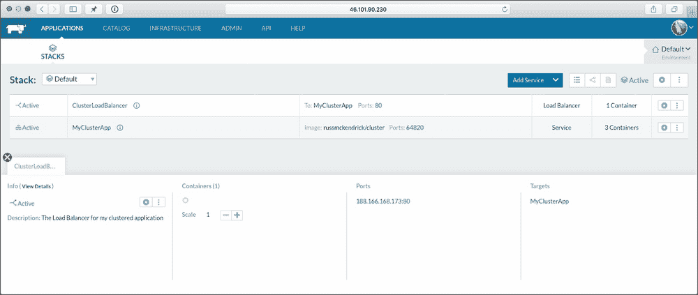

你的浏览器应该会打开我们熟悉的集群应用程序页面。

刷新几次应该会改变你所连接容器的主机名。

## 后台发生了什么？

Rancher 的一个优势是，后台有很多任务、配置和进程在运行，这些都被一个直观且易于使用的 Web 界面隐藏起来。

为了了解正在发生的情况，让我们浏览一下界面。首先，点击顶部菜单中的**Infrastructure**，然后点击**Hosts**。

如你所见，现在列出了正在运行的容器；在我们的默认堆栈容器旁边，每台主机上都运行着一个网络代理容器：

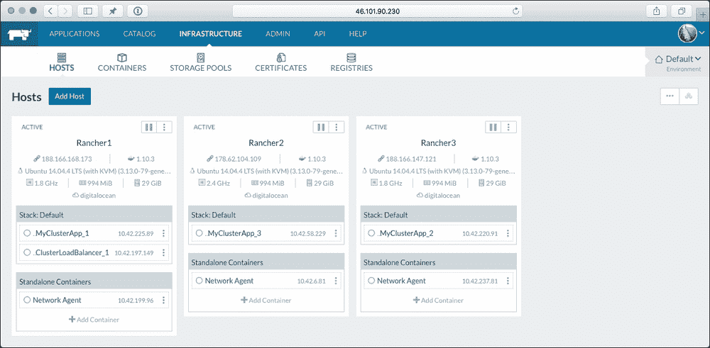

这些容器通过 iptables 在我们三台主机之间形成了一个网络，实现了容器间的跨主机连接。

### 注意

iptables 是一个用户空间的应用程序，允许系统管理员配置由 Linux 内核防火墙（通过不同的 Netfilter 模块实现）提供的表，以及它所存储的链和规则：

[`en.wikipedia.org/wiki/Iptables`](https://en.wikipedia.org/wiki/Iptables)

为了确认这一点，点击副菜单中的**Containers**按钮。你将看到当前正在运行的容器列表，列表中应该包括三个运行我们集群应用程序的容器。

记下**Default_MyClusterApp_2**的 IP 地址（在我的例子中是`10.42.220.91`），然后点击**Default_MyClusterApp_1**。

你将被带到一个页面，提供有关容器的 CPU、内存、网络和存储使用情况的实时信息：

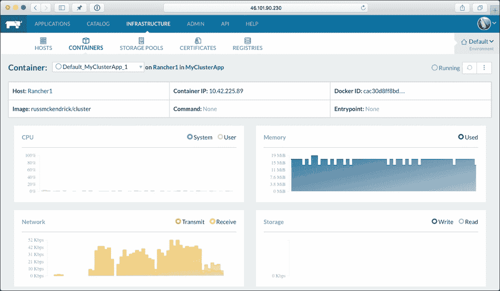

如你所见，容器目前活跃在我的第一台 Rancher 主机上。让我们通过连接到容器获取更多信息。在页面右上角，显示**Running**的地方，有一个带有三个点的图标，点击它，然后从下拉菜单中选择**Execute Shell**。

这将会在你的浏览器中打开一个终端，连接到正在运行的容器。尝试输入以下命令之一：

```
ps aux
hostname
cat /etc/*release

```

此外，当我们打开 Shell 时，让我们 ping 一下托管在我们另一台主机上的第二个容器（确保你将 IP 地址替换为之前记录下的那个）：

```
ping -c 2 10.42.220.91

```

如你所见，尽管它位于我们集群中的不同主机上，我们仍然能够无问题地 ping 通它：

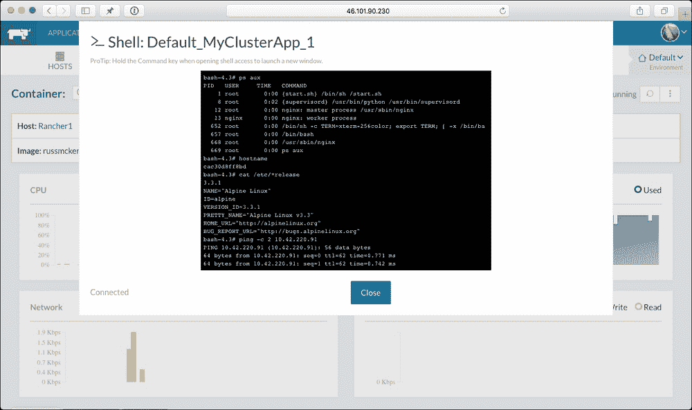

另一个有用的功能是健康检查。让我们为我们的服务配置健康检查，然后模拟一个错误。

点击顶部菜单中的**Applications**，然后点击我们默认堆栈旁边的**+**，这将弹出一个服务列表，显示堆栈的组成部分。点击**MyClusterApp**服务以进入概览页面。

从这里，像我们访问容器 shell 一样，点击右上角的三个点图标，靠近**活动**处。然后从下拉菜单中选择**升级**，这将带我们进入一个精简版本的页面，我们之前填写了该页面来创建初始服务。

在此页面的底部有几个标签，点击**健康检查**并填写以下信息：

+   **健康检查**：`HTTP 响应 2xx/3xx`

+   **HTTP 请求**：`/index.html`

+   **端口**：`80`

+   **当不健康时**：`重新创建`

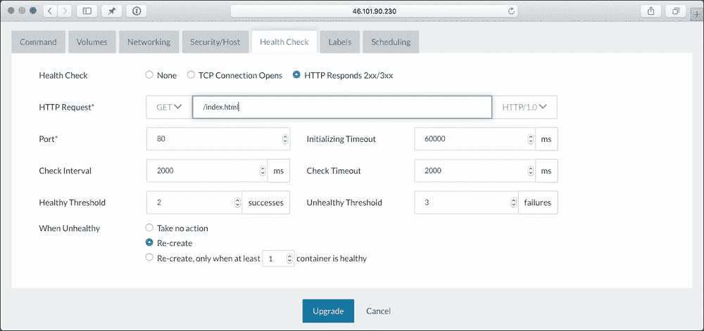

保留其余设置不变，然后点击**升级**按钮。你将被带回默认堆栈中的服务列表，在**MyClusterApp**服务旁边会显示**正在升级**。

在升级过程中，Rancher 已经用新配置重新启动了我们的容器。它是逐个进行的，这意味着从用户浏览我们的应用的角度来看，没有任何停机时间。

你也可能注意到它显示有六个容器，同时堆栈处于降级状态；为了解决这个问题，点击**MyClusterApp**服务以查看容器列表。

如你所见，其中三个处于停止状态。要移除它们，点击**完成升级**按钮，位于**降级**旁边，这样就会移除停止的容器，并将我们恢复到停止状态。

现在我们已经进行了健康检查，确保每个容器都在提供网页，接下来我们来停止 NGINX 并观察会发生什么。

为此，点击我们的任意一个容器，然后通过从下拉菜单中选择**执行 Shell**来打开控制台。

由于我们的容器是以受监督的方式运行来管理容器内的进程，我们只需运行以下命令来停止 NGINX：

```
supervisorctl stop nginx

```

接下来我们需要终止 NGINX 进程；为此，通过运行以下代码查找进程 ID：

```
ps aux

```

在我的案例中，PID 是 12 和 13，因此要终止它们，我将运行以下命令：

```
kill 12 13

```

这将停止 NGINX，但容器仍然保持运行。几秒钟后，你会注意到后台的统计数据消失了：

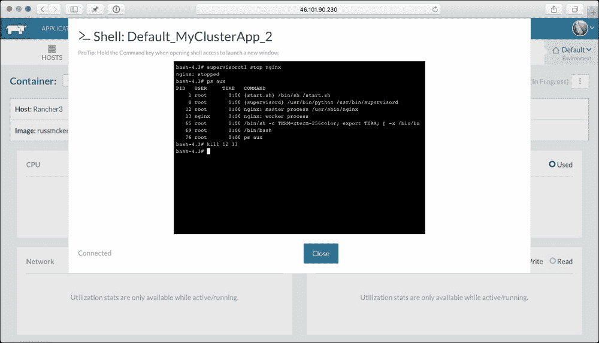

然后你的控制台会关闭，留下类似以下截图的内容：

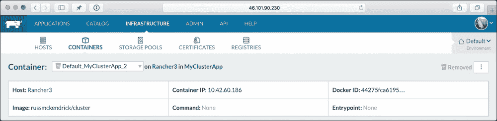

返回到 MyClusterApp 服务的容器列表，你会注意到有一个新的**Default_MyClusterApp_2**容器在不同的 IP 地址下运行：

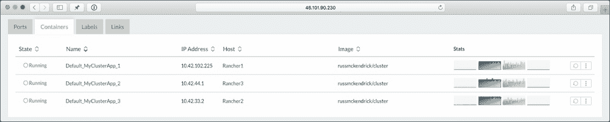

Rancher 完全按照我们指示的操作进行，如果任何一个容器的 80 端口超过六秒钟没有响应，它必须连续失败三次检查（每次检查间隔 2000 毫秒），然后移除该容器，并用新的容器替换它。

## 目录

我敢肯定，你应该已经点击了顶部菜单中的**Catalog**项，它列出了你可以在 Rancher 中启动的所有预构建堆栈。让我们来看一下如何使用目录项启动 WordPress。为此，点击**Catalog**并向下滚动到底部，你会看到一个 WordPress 的条目。

### WordPress

点击**查看详细信息**将带你进入一个屏幕，在那里你可以添加一个 WordPress 堆栈。它只要求你提供堆栈的**名称**和**描述**，填写这些信息后，点击**启动**。

这将启动两个容器，一个运行 MariaDB，另一个运行 WordPress 容器。这些容器使用我们在本书中一直使用的 Docker Hub 中的相同镜像。

如果你点击次级菜单中的**Stacks**，然后展开两个堆栈。当 WordPress 堆栈激活后，你可以点击显示**wordpress**旁边的信息图标。像之前一样，这将显示一个 IP 地址，你可以通过这个地址访问你的 WordPress 安装：

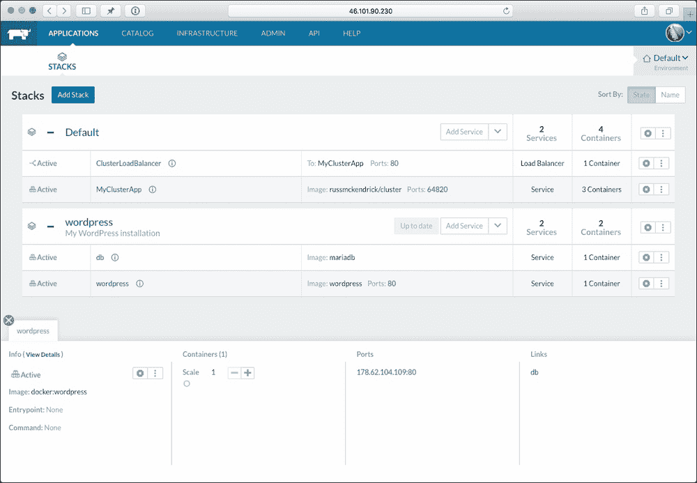

点击它会打开一个新的浏览器窗口，你将看到一个非常熟悉的 WordPress 安装屏幕。

同样，Rancher 在这里做了一些有趣的事情。记住我们总共有三个主机。这里的一个主机正在运行一个作为我们**ClusterApp**负载均衡器的容器，这个容器绑定了端口 80。

默认情况下，WordPress 目录堆栈启动 WordPress 容器，并将主机的端口 80 映射到容器的端口 80。在没有任何提示的情况下，Rancher 意识到我们的一个主机已经绑定了端口 80 的服务，因此它没有尝试在这里启动 WordPress 容器，而是选择了下一个没有绑定端口 80 服务的主机，并在该主机上启动了 WordPress 容器。

这是 Rancher 在后台执行任务的另一个例子，目的是最大限度地利用你已启动的资源。

### 存储

到目前为止，Rancher 运行得很好，让我们看看如何为我们的安装添加一些共享存储。DigitalOcean 不提供的一项服务是块存储，因此我们需要使用集群文件系统，因为我们不希望在应用程序中引入单点故障。

### 注意

Gluster FS 是一个可扩展的网络文件系统。通过使用常见的现成硬件，你可以为媒体流媒体、数据分析以及其他数据和带宽密集型任务创建大型分布式存储解决方案：

[`www.gluster.org`](https://www.gluster.org)

正如你在浏览目录时可能注意到的，目录中有几个存储项，我们将使用 GlusterFS 提供我们的分布式存储：

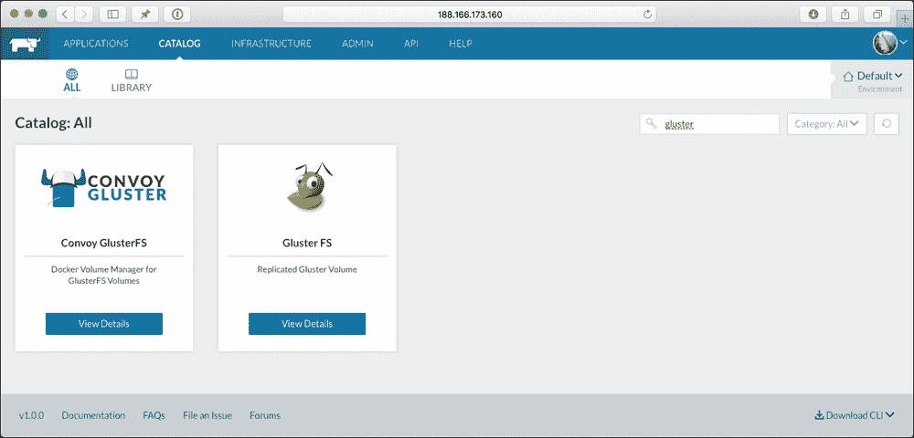

一旦我们的 Gluster 集群启动并运行，我们将使用 Convoy 将其暴露给我们的容器。在此之前，我们需要启动 GlusterFS。为此，点击**查看详情**，然后点击**Gluster FS**目录项。

您将进入一个表单，详细说明将配置的内容和方式。为了我们的目的，您可以保持所有设置不变，并点击页面底部的**启动**按钮。

启动过程需要几分钟。当完成时，您将看到总共创建了 12 个容器。其中六个容器正在运行，其他六个容器标记为已启动。无需担心，这些容器作为运行容器的卷。

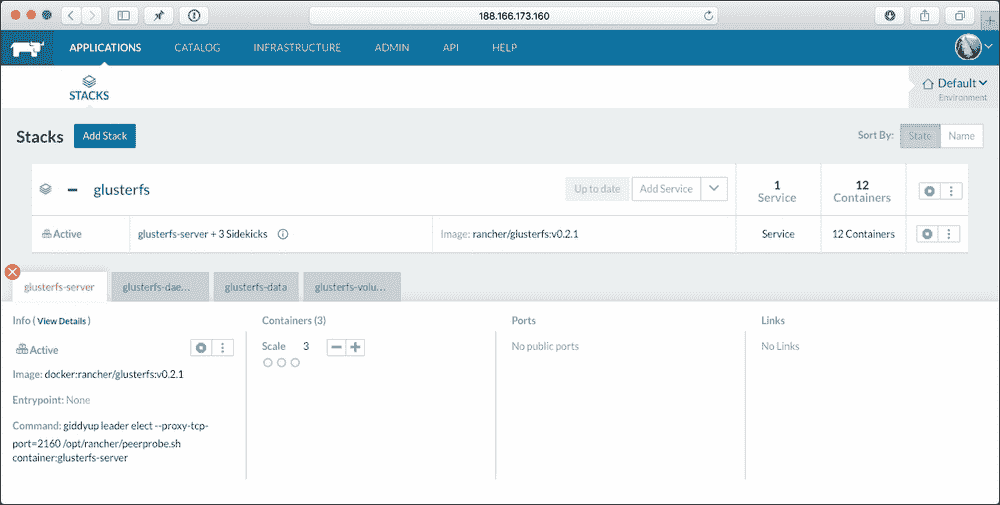

现在，我们已经让 Gluster FS 集群启动并运行，接下来我们需要启动 Convoy 并让它知道关于 Gluster FS 集群的事情。返回目录页面，点击**查看详情**，然后点击**Convoy Gluster FS**条目。

由于我们在启动 Gluster FS 集群时保持了默认选项和名称，因此在这里我们可以将所有内容保持为默认，只需从 Gluster FS 服务下拉菜单中选择我们的 Gluster FS 集群即可。

一旦您做出选择并点击**启动**，下载并启动`convoy-gluster`容器的过程不会太长。一旦完成，您应该会看到四个容器在运行。正如您可能已经注意到的那样，**系统**的新图标出现在次级菜单的**堆栈**旁边，这里就是您将找到`Convoy Gluster`堆栈的地方：

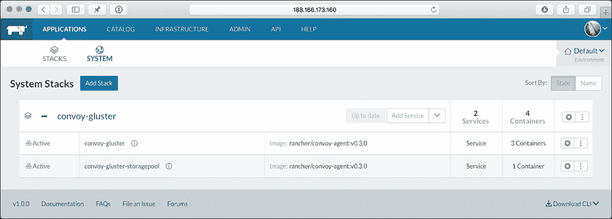

所以，我们现在已经准备好分布式存储了。在使用之前，让我们再看一下另一个目录项。

### 集群数据库

我们并不希望将数据库存储在共享或不信任的文件系统上，目录中的另一个项启动了一个 MariaDB Galera Cluster。

### 注意

MySQL 的 Galera Cluster 是基于同步复制的真正的多主集群。Galera Cluster 是一种易于使用、高可用的解决方案，提供高系统正常运行时间、无数据丢失和未来扩展的可扩展性：

[`galeracluster.com/products/`](http://galeracluster.com/products/)

集群将位于负载均衡器后面，这意味着您的数据库请求将始终被定向到一个活跃的主数据库服务器。如前所述，点击**查看详情**，然后在**Galera Cluster**项中填写您希望集群配置的数据库凭证。这些凭证如下所示：

+   MySQL 根密码

+   MySQL 数据库名称

+   MySQL 数据库用户

+   MySQL 数据库密码

填写完毕后，点击**启动**按钮。集群需要几分钟时间启动。启动后，它将包含 13 个容器，这些容器组成了集群和负载均衡器。

### 再次查看 WordPress

现在，我们已经配置了集群文件系统，并且集群数据库也已准备好，让我们再次看看如何启动 WordPress。

为此，请从顶部菜单点击**应用程序**，然后确保你在**堆栈**页面，点击**新建堆栈**。

在这里，给它命名为 `WordPress`，然后点击**创建**，接着点击**添加服务**。你需要填写以下信息：

+   **规模**：`运行 1 个容器（我们稍后会扩展）`

+   **名称**：`WordPress`

+   **描述**：`我的 WordPress 集群`

+   **选择镜像**：`wordpress`

+   **端口映射**：`将公共端口留空，并在私有端口添加 80`

+   **服务链接**：**目标服务**应为你的 `galera-lb`，**作为名称**为 `galera-lb`

接下来，我们需要在底部的标签选项中输入以下详细信息：

命令：

+   环境变量：添加以下变量：

    +   **变量** = `WORDPRESS_DB_HOST`

    +   **值** = `galera-lb`

    +   **变量** = `WORDPRESS_DB_NAME`

    +   **值** = 在设置 Galera 时创建的数据库名称

    +   **变量** = `WORDPRESS_DB_USER`

    +   **值** = 在设置 Galera 时创建的用户

    +   **变量** = `WORDPRESS_DB_PASSWORD`

    +   **值** = 在设置 Galera 时创建的用户密码

卷：

+   添加一个卷为 `wpcontent:/var/www/html/wp-content/`

+   卷驱动：convoy-gluster

然后点击**启动**按钮。下载并启动容器需要一分钟，启动后，状态应会变为“活动”。当服务健康后，点击“添加服务”旁边的下拉菜单，添加一个负载均衡器：

+   **名称**：`WordPressLB`

+   **描述**：`我的 WordPress 负载均衡器`

+   **源 IP/端口**：`80`

+   **默认目标端口**：`80`

+   **目标服务**：`WordPress`

一旦添加了负载均衡器，点击负载均衡器服务旁的信息图标获取 IP 地址，在浏览器中打开它，然后执行 WordPress 安装，并添加如其他章节中所示的特色图像。

现在我们有一个运行中的 WordPress 容器，并且通过负载均衡器和 Gluster FS 存储，能够在不同主机之间迁移，保持相同的 IP 地址和内容，后端数据库具有高度可用性。

### DNS

我最后要介绍的目录项是 DNS 管理器之一。这些项的作用是自动与 DNS 提供商的 API 连接，并为你启动的每个堆栈和服务创建 DNS 记录。由于我使用 Route53 管理我的 DNS 记录，我在目录屏幕上点击了**查看详情**，进入了**Route53 DNS 堆栈**。

在*配置选项*部分，我输入了以下信息：

+   **AWS 访问密钥**：我的访问密钥，用户必须有权限访问 Route53

+   **AWS 密钥**：与上述访问密钥配套的密钥

+   **AWS 区域**：我想使用的区域

+   **托管区域**：我想使用的区域是`mckendrick.io`，所以我在这里输入了它

+   **TTL**：我将其保持为默认值 `299 秒`，如果你希望更快更新 DNS，可以将其设置为 `60 秒`

然后我点击了**启动**按钮。几分钟后，我检查了 Route53 控制面板中的托管区，服务已经自动连接并为我已运行的堆栈和服务创建了以下记录。

DNS 条目按以下方式格式化：

```
<service>.<stack>.<environment>.<hosted zone>
```

所以在我的情况下，我有以下条目：

+   `clusterloadbalancer.default.default.mckendrick.io`

+   `myclusterapp.default.default.mckendrick.io`

由于`myclusterapp`包含三个容器，所以向条目中添加了三个 IP 地址，以便轮询 DNS 会将流量指向每个容器：

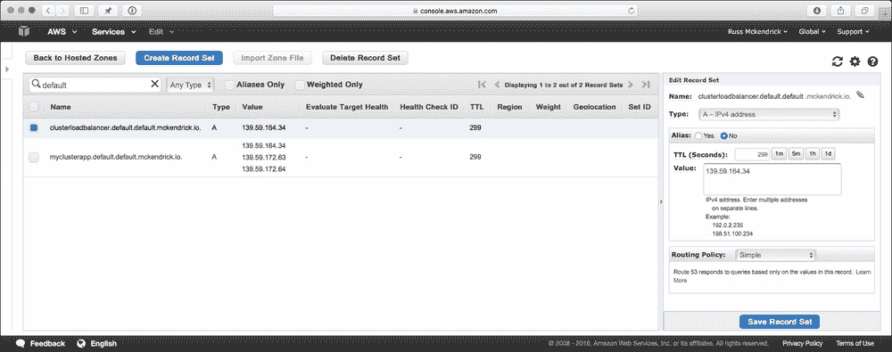

DNS 目录项的另一个优点是它们会自动更新，这意味着如果我们将一个容器移动到不同的主机，容器的 DNS 会自动更新以反映新的 IP 地址。

## Docker & Rancher Compose

你可能还注意到的另一件事是，当你添加堆栈时，Rancher 会给你两个框，你可以在其中输入 Docker 和 Rancher Compose 文件的内容。

到目前为止，我们一直通过 Web 界面手动创建服务，对于我们已经构建的每个堆栈，你都有查看它作为配置文件的选项。

在以下截图中，我们查看的是我们集群应用程序堆栈的 Docker 和 Rancher Compose 文件。要获得这个视图，点击**活动**旁边的图标：

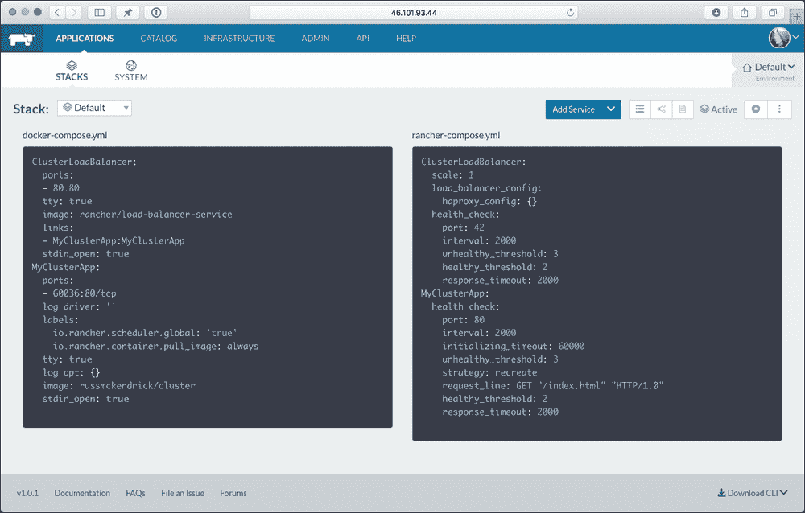

这个功能允许你将堆栈传输给其他 Rancher 用户。以下文件的内容将展示给你，以便你可以在自己的 Rancher 安装上尝试。

### Docker Compose

这是一个标准版本的 Docker Compose 文件，传递了作为标签的 Rancher 设置：

```
ClusterLoadBalancer:
  ports:
  - 80:80
  tty: true
  image: rancher/load-balancer-service
  links:
  - MyClusterApp:MyClusterApp
  stdin_open: true
MyClusterApp:
  ports:
  - 60036:80/tcp
  log_driver: ''
  labels:
    io.rancher.scheduler.global: 'true'
    io.rancher.container.pull_image: always
  tty: true
  log_opt: {}
  image: russmckendrick/cluster
  stdin_open: true
```

### Rancher Compose

Rancher Compose 文件将 Docker Compose 文件中定义的容器包装成 Rancher 服务，如你所见，我们在这里为负载均衡器和集群容器定义了健康检查：

```
ClusterLoadBalancer:
  scale: 1
  load_balancer_config:
    haproxy_config: {}
  health_check:
    port: 42
    interval: 2000
    unhealthy_threshold: 3
    healthy_threshold: 2
    response_timeout: 2000
MyClusterApp:
  health_check:
    port: 80
    interval: 2000
    initializing_timeout: 60000
    unhealthy_threshold: 3
    strategy: recreate
    request_line: GET "/index.html" "HTTP/1.0"
    healthy_threshold: 2
    response_timeout: 2000
```

Rancher Compose 也是一个命令行工具的名称，可以本地安装并与 Rancher 安装进行交互。由于命令行复制了我们已经讨论的功能，我在这里不再详细讲解；不过，如果你想尝试，关于它的完整细节可以在官方 Rancher 文档中找到，地址是[`docs.rancher.com/rancher/rancher-compose/`](http://docs.rancher.com/rancher/rancher-compose/)。

## 回到我们开始的地方

我们将使用 Rancher 做的最后一项任务是启动一个 DigitalOcean 中的 Kubernetes 集群。如本章开始时提到的，Rancher 不仅管理自己的 Cattle 集群，还管理 Kubernetes 和 Swarm 集群。

要创建一个 Kubernetes 集群，点击显示**环境**的下拉菜单，在你的头像下方，然后点击**添加环境**：

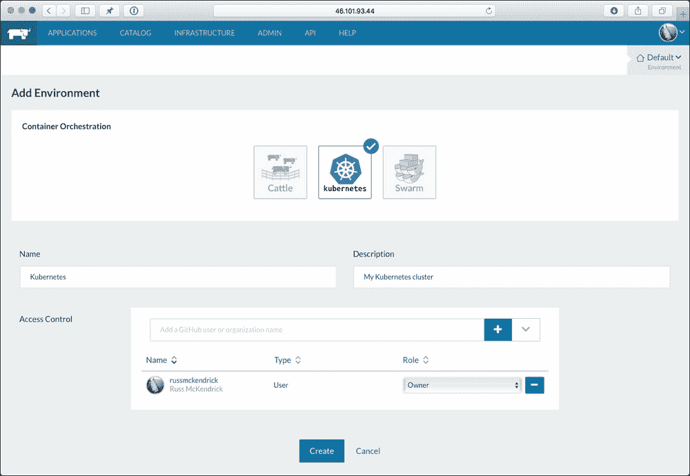

在该页面，你将被要求选择要为环境使用哪个容器编排工具，给它命名，以及最终谁可以访问它。

选择 Kubernetes，填写剩余信息，并点击 **创建** 按钮。创建第二个环境后，你将能够在 **环境** 下拉菜单中进行切换。

类似于我们第一次启动 Rancher 时，我们需要添加一些主机来组成我们的 Kubernetes 集群。为此，点击 **添加主机**，然后按照之前的方式输入详细信息，唯一不同的是这次要将它们命名为 Kubernetes，而不是 Rancher。

然后你将被带到一个看起来像下面截图的页面：

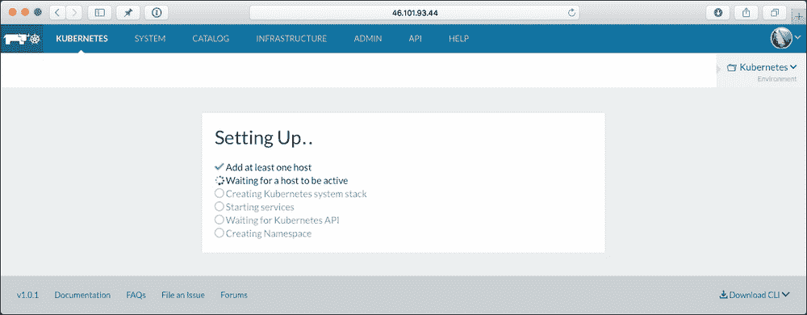

安装完成大约需要 10 分钟。完成后，你将进入一个熟悉的 Rancher 页面；不过，你现在会在次级菜单中看到 **服务**、**RCS**、**Pods** 和 **kubectl**。

点击 **kubectl** 会带你到一个页面，在该页面上你可以在浏览器中运行 kubectl 命令，并且你将获得一个下载 kubectl 配置文件的选项，这样你就可以从本地机器与 Kubernetes 进行交互：

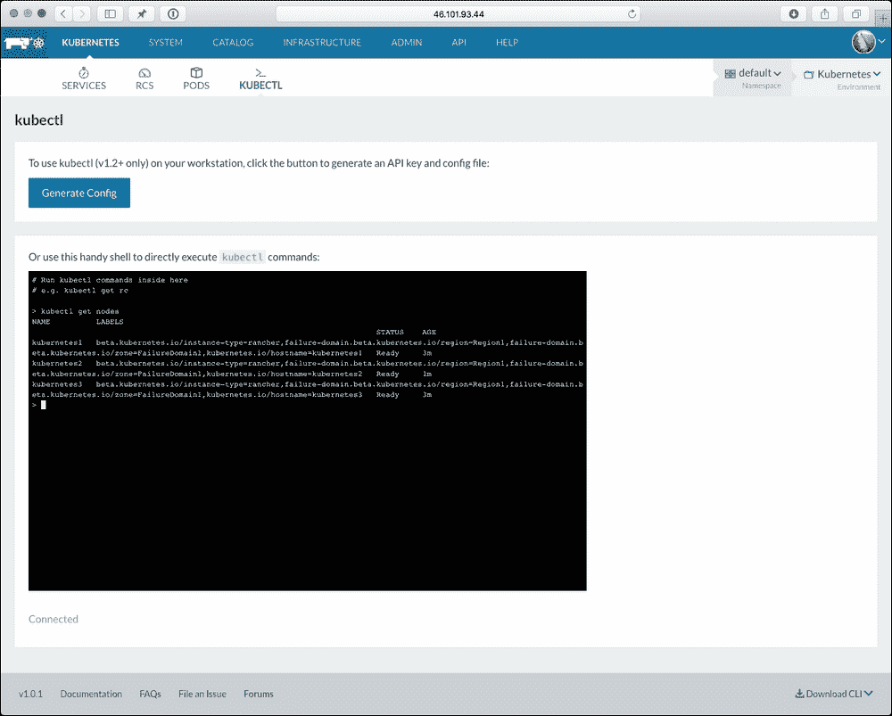

另一个你会注意到的变化是加载了不同的目录，这是因为 Docker 和 Rancher Compose 文件无法与 Kubernetes 一起使用：

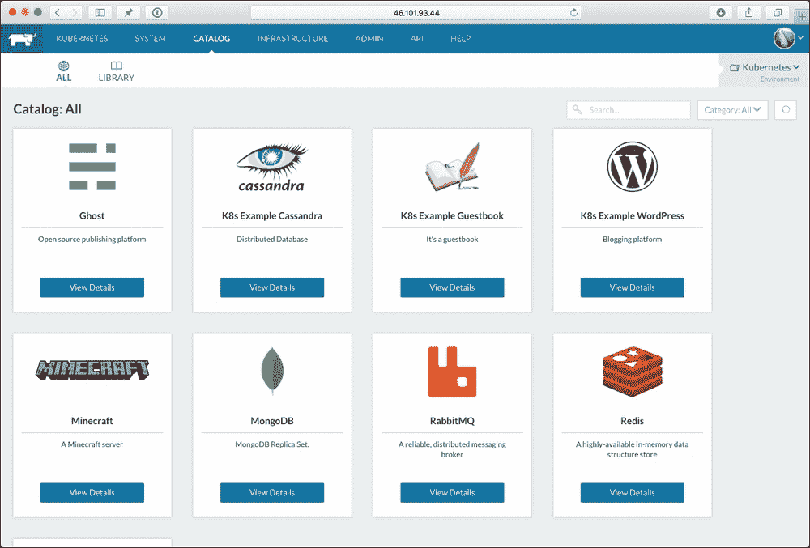

随时可以像本章第一部分那样启动服务，或者使用目录中的项目来创建服务。

## 删除主机

到这个时候，你将在 DigitalOcean 上启动大约七个实例。随着本章的结束，你应该终止所有这些机器，这样你就不会为未使用的资源付费。

我建议通过 DigitalOcean 控制面板来进行操作，而不是通过 Rancher，这样你可以百分百确定 Droplets 已成功关机并删除，这样就不会再为它们付费。

## 总结 Rancher

正如你所看到的，Rancher 不仅是一个极其强大的开源软件，它还是一个非常用户友好且精心打磨的工具。

我们这里只触及了 Rancher 的一些功能，例如，你可以将主机划分到不同的提供商中，以创建你自己的区域，还有一个完整的 API 让你可以通过自己的应用程序与 Rancher 交互，此外还有完整的命令行接口。

作为一个 1.0 版本，它的功能非常丰富且稳定。在我使用的过程中，我没看到它出现任何问题。

如果你需要一个能够让你启动自己的集群并为终端用户（如开发者）提供直观界面的工具，那么 Rancher 将是一个天作之合。

# 总结

我们讨论的这三种工具并不是唯一的调度器，实际上还有一些其他的工具，比如以下几种：

+   **Nomad**: [`www.nomadproject.io/`](https://www.nomadproject.io/)

+   **Fleet**: [`coreos.com/using-coreos/clustering/`](https://coreos.com/using-coreos/clustering/)

+   **Marathon**: [`mesosphere.github.io/marathon/`](https://mesosphere.github.io/marathon/)

所有这些调度器都有各自的要求、复杂性和使用场景。

如果你在一年前问我，在我们本章讨论的三个调度器中，我会推荐哪一个，我会说是亚马逊的 EC2 容器服务。Kubernetes 会排在第二，而我可能不会提到 Rancher。

在过去的 12 个月里，Kubernetes 在安装服务的复杂性方面做出了巨大的简化，消除了其最大障碍，使得更多人能够采用它，而正如我们所展示的，Rancher 进一步简化了这一复杂性。

不幸的是，与其他工具相比，这使得 EC2 容器服务在配置和操作上显得更加复杂，尤其是因为 Kubernetes 和 Rancher 都支持在亚马逊 Web 服务上启动主机，并能够利用亚马逊公共云提供的众多支持服务。

在我们接下来的最后一章中，我们将回顾之前章节中讨论过的所有工具，我们还将提出一些使用场景，并讨论在使用这些工具时需要考虑的安全问题。
