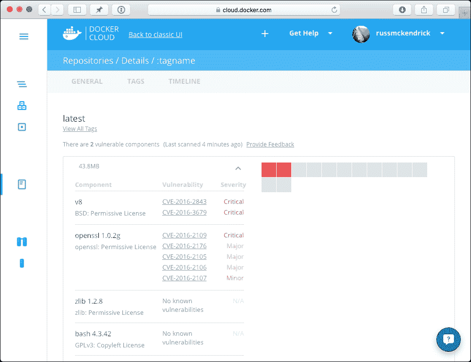

# 第八章：安全性、挑战与结论

在本章的最后，我们将回顾本书中介绍的所有工具，并回答以下问题：

+   这些工具如何影响你 Docker 安装的安全性？

+   它们如何协同工作，并且什么时候应该使用？

+   这些工具可以解决哪些问题和挑战？

# 容器的安全性

到目前为止，我们相当愉快地从 Docker Hub 拉取镜像，而没有太多考虑是谁创建的，或者实际安装了什么。由于我们一直在创建临时环境来启动容器，这也没带来太多担忧。

随着我们向生产环境过渡并解决开发过程中遇到的问题，了解你正在安装的内容变得越来越重要。

在前面的章节中，我们使用了以下容器镜像：

+   WordPress: [`hub.docker.com/_/wordpress/`](https://hub.docker.com/_/wordpress/)

+   MySQL: [`hub.docker.com/_/mysql/`](https://hub.docker.com/_/mysql/)

+   MariaDB: [`hub.docker.com/_/mariadb/`](https://hub.docker.com/_/mariadb/)

这三张镜像都被归类为官方镜像，不仅遵循了文档化标准，还在每次拉取请求时进行了同行评审。

然后是来自我自己 Docker Hub 账户的三张镜像：

+   Consul: [`hub.docker.com/r/russmckendrick/consul/`](https://hub.docker.com/r/russmckendrick/consul/)

+   NGINX: [`hub.docker.com/r/russmckendrick/nginx/`](https://hub.docker.com/r/russmckendrick/nginx/)

+   集群示例: [`hub.docker.com/r/russmckendrick/cluster/`](https://hub.docker.com/r/russmckendrick/cluster/)

在我们查看官方镜像之前，先看一下我自己在 Docker Hub 账户中的 Consul 镜像，了解为什么它是值得信任的。

## Docker Hub

在这里，我们将看一下可以从 Docker Hub 下载的三种类型的镜像。

我选择专注于 Docker Hub，而不是私有注册表，因为我们在前几章中查看的所有工具都来自 Docker Hub，而且你或你的最终用户也更可能将 Docker Hub 作为他们的主要镜像资源。

### Dockerfile

Consul 容器镜像是通过一个 Dockerfile 构建的，这个 Dockerfile 可以公开访问，我的 GitHub 账户上也有。与推送镜像不同，稍后在本章中会讨论，这意味着你可以清楚地看到为了构建该镜像所采取的具体操作。

首先，我们使用`russmckendrick/base`镜像作为起始点。再次强调，这个镜像的 Dockerfile 是公开可用的，所以让我们现在来看一下：

```
### Dockerfile
#
#   See https://github.com/russmckendrick/docker
#
FROM alpine:latest
MAINTAINER Russ McKendrick <russ@mckendrick.io>
RUN apk update && apk upgrade && \
    apk add ca-certificates bash && \
    rm -rf /var/cache/apk/*
```

正如你所看到的，这个操作的作用是：

+   使用官方 Alpine Linux 镜像的最新版本

+   执行`apk update`，然后执行`apk upgrade`，以确保所有软件包都已更新

+   安装`ca-certificates`和`bash`软件包

+   清理升级和安装软件包后遗留的任何残余物

现在我们已经知道基础镜像是什么样子了，接下来我们来看看 Consul 容器的 Dockerfile：

```
### Dockerfile
#
#   See https://github.com/russmckendrick/docker
#
FROM russmckendrick/base:latest
MAINTAINER Russ McKendrick <russ@mckendrick.io>
ENV CONSUL_VERSION 0.6.4
ENV CONSUL_SHA256 abdf0e1856292468e2c9971420d73b805e93888e006c76324ae39416edcf0627
ENV CONSUL_UI_SHA256 5f8841b51e0e3e2eb1f1dc66a47310ae42b0448e77df14c83bb49e0e0d5fa4b7
RUN  apk add --update wget \
  && wget -O consul.zip https://releases.hashicorp.com/consul/${CONSUL_VERSION}/consul_${CONSUL_VERSION}_linux_amd64.zip \
  && echo "$CONSUL_SHA256 *consul.zip" | sha256sum -c - \
  && unzip consul.zip \
  && mv consul /bin/ \
  && rm -rf consul.zip \
  && cd /tmp \
  && wget -O ui.zip https://releases.hashicorp.com/consul/${CONSUL_VERSION}/consul_${CONSUL_VERSION}_web_ui.zip \
  && echo "$CONSUL_UI_SHA256 *ui.zip" | sha256sum -c - \
  && unzip ui.zip \
  && mkdir -p /ui \
  && mv * /ui \
  && rm -rf /tmp/* /var/cache/apk/*
EXPOSE 8300 8301 8301/udp 8302 8302/udp 8400 8500 8600 8600/udp
VOLUME [ "/data" ]
ENTRYPOINT [ "/bin/consul" ]
CMD [ "agent", "-data-dir", "/data", "-server", "-bootstrap-expect", "1", "-ui-dir", "/ui", "-client=0.0.0.0"]
```

如你所见，这个 Dockerfile 里面有更多的内容：

1.  我们将定义使用最新版本的`russmckendrick/base`作为我们的基础镜像。

1.  然后，我们将设置三个环境变量。首先是我们想要下载的 Consul 版本，然后是文件的校验和，我们将从第三方网站获取它。

1.  然后，我们将使用 APK 包管理器安装`wget`二进制文件。

1.  接下来，我们将从 HashiCorp 网站下载 Consul 二进制文件，注意我们是通过 HTTPS 下载，并且运行`sha256sum`命令检查下载的文件是否被篡改。如果文件没有通过这个测试，构建将会失败。

1.  一旦确认 zip 文件是正确的，我们解压它并将二进制文件复制到正确的位置。

1.  然后，我们将对 Consul Web 界面执行相同的操作。

1.  最后，我们将配置一些容器启动时的默认行为，例如暴露正确的端口、入口点和默认命令。

所有这些意味着，在决定下载使用该镜像的容器之前，你可以确切看到安装了什么，以及镜像是如何配置的。

### 官方镜像

官方标记的镜像数量略超过 100 个。你可以在 Docker Hub 中查看这些镜像，网址为[`hub.docker.com/explore/`](https://hub.docker.com/explore/)。官方镜像很容易辨识，因为它们前面没有用户名，例如，以下是官方 NGINX 镜像和我自己镜像的 docker pull 命令：

```
docker pull nginx
docker pull russmckendrick/nginx

```

如你所见，顶部的那个是官方镜像。

很多官方镜像是由上游提供商维护的，例如，CentOS、Debian 和 Jenkins 镜像是由各自项目的成员维护的：

+   [`github.com/docker-library/official-images/blob/master/library/centos`](https://github.com/docker-library/official-images/blob/master/library/centos)

+   [`github.com/docker-library/official-images/blob/master/library/debian`](https://github.com/docker-library/official-images/blob/master/library/debian)

+   [`github.com/docker-library/official-images/blob/master/library/jenkins`](https://github.com/docker-library/official-images/blob/master/library/jenkins)

此外，每个提交的拉取请求都有一个审核流程。这有助于确保每个官方镜像都是一致的，并且在构建时考虑到安全性。

另一个关于官方镜像需要注意的重要点是，任何官方镜像都不能从非官方镜像派生或依赖于非官方镜像。这意味着，非官方镜像的内容不应以任何方式进入官方镜像。

官方镜像的构建标准以及官方镜像维护者的要求，详细说明可以在 Docker Library GitHub 页面找到，地址是 [`github.com/docker-library/official-images/`](https://github.com/docker-library/official-images/)。

Docker Hub 的缺点之一是它有时会非常慢，我指的是真正的慢。过去 12 个月中情况有所改善，但有时 Docker 的构建系统会出现大量积压，导致你的构建被排队。

只有在需要触发构建并希望它立即可用时，这才是一个问题。如果你需要在别人注意到之前快速修复应用程序 bug，可能就会遇到这种情况。

### 推送的镜像

最后，有一个显而易见的问题，就是那些已经从用户推送到 Docker Hub 的完整镜像。

个人来说，我尽量避免将完整镜像推送到我的 Docker Hub 账户，因为这些镜像通常是我不推荐使用的，那么为什么我会期望其他用户使用它们呢？

由于这些镜像并非通过发布的 Dockerfile 构建，因此很难了解它们所遵循的标准以及具体包含了什么内容。

Docker 通过引入内容信任机制来解决这个问题，内容信任会在镜像推送到 Docker Hub 之前，用发布者的私钥对镜像进行签名。当你下载镜像时，Docker 引擎会使用发布者的公钥来验证镜像的内容是否与发布者的原意完全一致。

这有助于确保镜像在从发布者到你运行容器的整个过程中没有被篡改。

关于内容信任的更多信息可以在 [`docs.docker.com/engine/security/trust/content_trust/`](https://docs.docker.com/engine/security/trust/content_trust/) 找到。

如果你使用 Docker Hub 发布包含专有应用程序或代码库的私有镜像，并且这些内容不希望公开，那么这个功能非常有用。

然而，对于公开可用的镜像，我总会质疑为什么镜像要被推送到 Docker Hub，而不是通过 Dockerfile 来构建。

### Docker Cloud

自从我开始写这本书以来，Docker 推出了名为 Docker Cloud 的商业服务。该服务被描述为 Docker 提供的用于 Docker 容器管理和部署的托管服务。

你可以通过以下网址了解该服务的详细信息：

+   [`www.docker.com/products/docker-cloud`](https://www.docker.com/products/docker-cloud)

+   [`cloud.docker.com/`](https://cloud.docker.com/)

那么，为什么在讨论安全时要提到这项服务呢？好吧，2016 年 5 月，Docker 宣布他们将增加一个安全扫描功能，截至本书撰写时，这项功能是免费的。

这个功能适用于你在 Docker Hub 上托管的私有仓库，这意味着你推送的任何镜像都可以进行扫描。

该服务对你的镜像执行静态分析，寻找已安装二进制文件中的已知漏洞。

例如，在第六章，*扩展你的基础设施*中，我们使用 Packer 创建了一个镜像，我的本地机器上还保留着这个镜像的旧版本，所以我将其推送到私人 Docker Hub 仓库，并利用 Docker Cloud 和 Docker Security Scanning 的免费试用。

如下结果所示，该服务在镜像中发现了三个严重漏洞：



这意味着是时候更新我的基础镜像和正在使用的 NodeJS 版本了。

有关该服务及其工作原理的更多细节，请参见以下公告博客文章：

[`blog.docker.com/2016/05/docker-security-scanning/`](https://blog.docker.com/2016/05/docker-security-scanning/)

这个服务有一些替代方案，比如：

+   **Clair**: [`github.com/coreos/clair`](https://github.com/coreos/clair)

+   **Banyan** **Collector**: [`github.com/banyanops/collector`](https://github.com/banyanops/collector)

+   **Docker 安全基准**： [`github.com/docker/docker-bench-security`](https://github.com/docker/docker-bench-security)

然而，刚刚推出的 Docker 服务是最简单的入门方式，因为它已经与其他 Docker 服务深度集成。

### 私人注册表

记住，你可以使用私人注册表分发 Docker 镜像。如果你必须将应用程序的代码打包到镜像中，我建议采用这种方法。

私人注册表是一种资源，允许你推送和拉取镜像；通常它仅对网络中的受信主机开放，不对公众开放。

私人注册表不允许你托管自动化构建，并且目前不支持内容信任，这就是它们被部署在私人或封闭网络中的原因。

有关托管私人注册表的更多信息，请参阅官方文档：[`docs.docker.com/registry/`](https://docs.docker.com/registry/)。

# 挑战

那么，为什么我们要研究扩展核心 Docker 引擎呢？以下是我们在前几章中所讨论的工具可以用于增值或解决潜在问题的一些场景。

## 开发

很久以前，在第一章，*扩展 Docker 简介*中，我们看到了*开发中运行良好，现在是运维问题*的梗图，以及它如今依然令人担忧地相关。容器在很大程度上解决了这个问题；事实上，许多人认为 Docker 是一个伟大的统一者。

然而，如果开发者没有一种简单的方式将这些工具融入到日常工作中，那么你就无法解决由梗图所揭示的问题。

可以帮助开发人员开始在本地使用 Docker 作为开发过程的第一步的工具如下：

+   Docker 工具箱

+   Docker Machine

+   Vagrant

结合最近发布的、目前处于私人测试版的 Docker 原生版本，适用于 OS X 和 Windows，更多详情可以在[`blog.docker.com/2016/03/docker-for-mac-windows-beta/`](https://blog.docker.com/2016/03/docker-for-mac-windows-beta/)的公告博客中找到。

此外，根据你现有的工作流程，你还可以使用以下工具将容器引入到现有的工作流程中：

+   Ansible

+   Jenkins

+   Packer

+   Puppet

## Staging

根据你的需求，你可以结合 Docker Compose 使用以下插件，创建一个具有多主机网络和存储的基本预发布环境：

+   Convoy

+   Docker 覆盖网络

+   Docker 卷

+   Flocker

+   REX-Ray

+   Weave

你还可以使用这些工具，方便你控制容器在预发布环境中的部署位置：

+   Ansible

+   Docker Swarm

+   Jenkins

+   Puppet

+   Rancher

此外，你的开发人员可以在一定程度上访问这些工具，以便通过持续集成工具、网页界面或命令行部署测试版本。

## 生产

再次，你可以使用以下插件，通过 Docker Compose 创建一个基本的生产就绪环境：

+   Convoy

+   Docker 覆盖网络

+   Docker 卷

+   Flocker

+   REX-Ray

+   Weave

然而，你可能希望你的生产环境能够更好地应对故障、扩展事件，并自动将容器注册到 DNS 和负载均衡器等服务中：

+   Ansible

+   Amazon ECS

+   Docker Swarm

+   Kubernetes

+   Puppet

+   Rancher

所有这些列出的工具应该被视为生产就绪。然而，由于 Puppet 和 Ansible 在调度方面的功能有限，只有在你将 Docker 引入到现有的 Puppet 或 Ansible 管理的环境中时，才应真正考虑使用它们。

如果我希望你从本书中学到一点，那就是使用 Docker 时，不必是“一刀切”的解决方案。

正如我们讨论的那样，Docker 和第三方提供的工具可以让你将容器从单一主机扩展到可能达到数百或数千台主机。

# 总结

在前面的章节中，我们体验了将这些工具组合使用的方式。

例如，我们一直在使用 Docker 存储和网络插件，通过 Docker 自身提供的工具（即 Docker Compose 和 Docker Swarm），以及 Kubernetes 和 Rancher，来创建一个高可用的 WordPress 安装。

我们还通过 Docker Machine、Ansible，以及 Kubernetes 和 Rancher 等工具部署了底层的 Docker 基础设施。

然后，我们部署了各种第一方和第三方插件，帮助解决存储、网络和负载均衡等功能，以充分利用我们所部署的环境，例如亚马逊 Web 服务和 DigitalOcean。

我们所查看的所有工具都与核心 Docker 引擎相辅相成，在大多数情况下，几乎不需要对你的 Docker 镜像进行任何更改就可以开始使用插件或第三方工具。

所有这些意味着，无论你是使用公共云、自己的虚拟机、裸机服务器，还是仅仅使用本地笔记本，都可以相对轻松地构建一个高可用且易于使用的平台来部署应用程序，并根据开发人员、应用程序和自己的需求进行定制，同时确保在开发中能够正常工作的应用程序也能在生产环境中正常运行。
