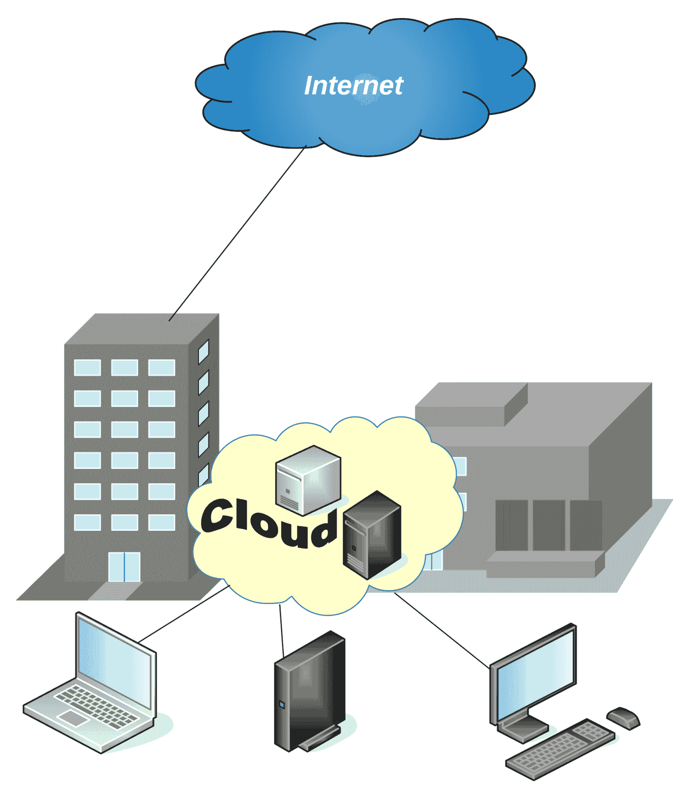
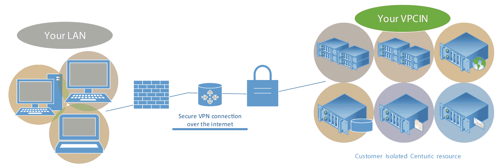
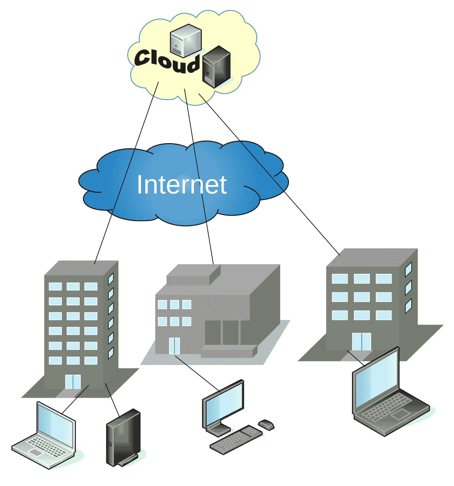
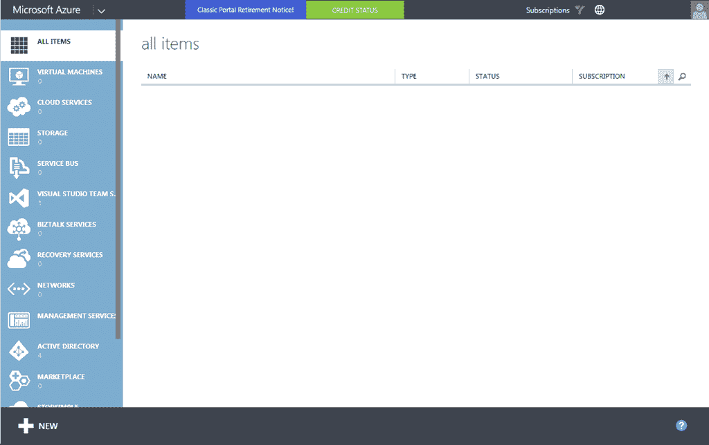
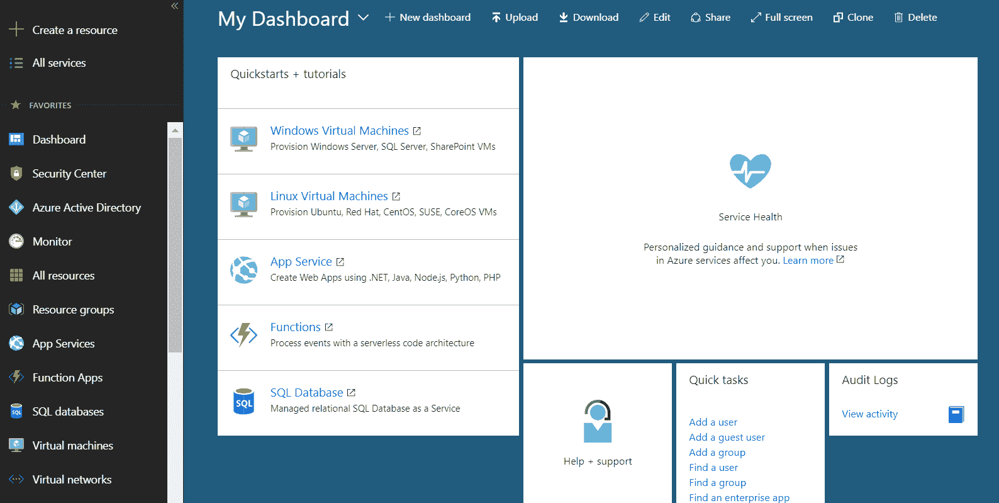
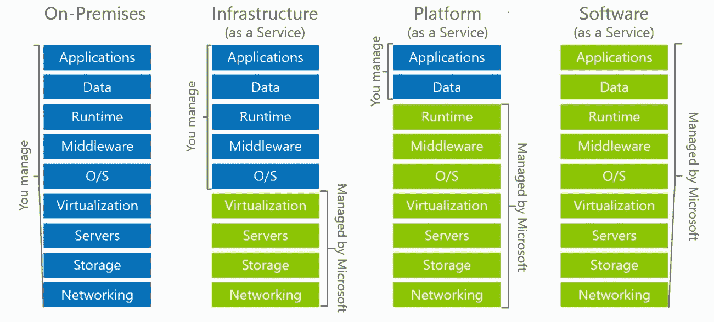
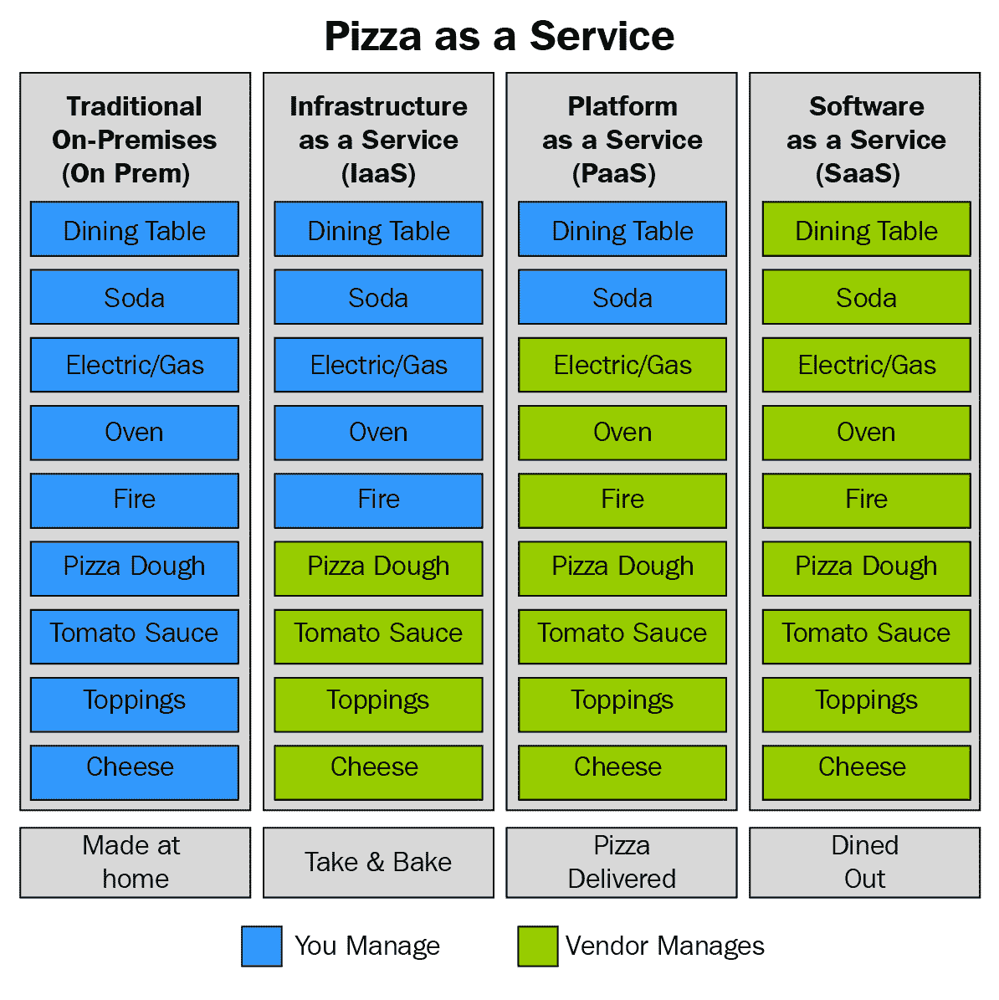

# 第一章：云计算的关键概念

云计算已经成为一个流行词，并且在 IT 领域是一个大趋势。越来越多的公司开始了他们的云计算之旅，但开始这些旅程并不容易。与传统的本地 IT 环境相比，云计算需要不同的技能和思维方式，而云管理员的需求也在不断增长。在本书中，我们将共同开启云计算之旅，帮助你掌握云管理并理解 Microsoft Azure 的服务与架构。成为 Azure 专家，帮助你的公司顺利且安全地过渡到 Azure。

我们将要讨论的主题包括以下内容：

+   云计算概念

+   云服务模型

+   Azure 订阅模型

# 云计算概念

由于我们将使用 Microsoft Azure，因此理解云计算的关键概念，尤其是公共云的概念非常重要，因为 Azure 正是一个公共云。

在过去，我们看到过许多 IT 行业的趋势；其中一些是短期的，而另一些则持续了很长时间。许多人认为云计算是一个短期趋势，未来不会存在太久，但他们并没有真正理解云计算的概念以及这一切是如何开始的。

云计算并不是从公共云服务开始的，而是始于 1990 年代。显然，云计算的形式与今天并不相同，而是更多地作为企业内部实施的一种方式，为员工提供按需创建虚拟机的选项。在这一阶段，云计算包括一个虚拟化平台，允许员工基于预先准备好的镜像按需创建开发/测试环境。云计算的基础包括两个组成部分：虚拟化和按需资源。没有服务器虚拟化，这一切都无法实现，服务器虚拟化允许我们在单一物理服务器上创建多个虚拟机。云计算将虚拟化提升到另一个层次，超越了单纯的服务器虚拟化，但我们稍后会详细讨论。

按需获取资源的能力，正是云计算的基础。如前所述，云计算始于虚拟化平台，企业通过创建平台使员工能够按需创建虚拟机。今天，我们称之为私有云。

# 云计算的类型

云计算有不同的类型，而且对如何分类也有不同的看法。就我个人而言，我认为以下四种类型是最合逻辑的：

+   **私有**：一切都托管在内部，即我们自己的数据中心。

+   **托管**：介于私有云和公共云之间；服务提供商在他们的数据中心创建一个独立的环境，仅为我们提供一个专用的云。

+   **公共**：服务提供商提供的服务对所有人开放——公共可用。虽然仍然有租户隔离，但我们稍后会讨论这个问题。

+   **混合云**：私有云与公共云的结合。部分服务使用公共云，但一些服务保留在本地数据中心，并且两个或多个环境之间有直接连接。根据我的经验，这是最常见的云计算形式。我们稍后会详细解释更多内容。

在私有云中，所有资源都位于本地数据中心，无需互联网访问即可访问资源。互联网和资源是分开访问的，如下图所示。构建自己的私有云以前需要大量的投资，无论是物质上还是在知识上。首先，你需要空间，并且需要考虑其他因素，如冷却和电力。然后，你需要投资硬件，如防火墙、路由器、网络交换机、服务器和存储设备。

你需要为虚拟化层、虚拟机的操作系统许可证以及各种软件购买许可证。最终，如果没有合适的人来设置和维护系统，所有的物质投资都将付之东流。一旦一切就绪，私有云投入运行后，每隔几年就需要进行新的投资，因为你需要新版本的软件（虚拟化、操作系统及其他软件），硬件也需要替换：



托管云是从私有云到公共云过渡的第一步。由于创建和维护自己的私有云需要大规模投资，一些公司开始提供租用部分数据中心的服务，将其作为自己的私有云使用。他们专注于此类服务；由于供应商提供大宗采购折扣，他们更容易购买硬件和软件。因此，在托管云中创建环境比在私有云中创建相同的环境要便宜。

另一个问题是前期投资；使用私有云要求所有硬件和大部分软件许可证需提前支付，因此许多公司决定使用托管云，因为他们不需要进行前期投资，而是每月或每年订阅。此外，数据中心更容易提供专家来维护系统，因为一个专家可以同时照看多个客户的环境。而对于私有云，你需要网络工程师、存储专家、虚拟化专家等，这些仅仅是单一数据中心所需的人员。

在托管云的情况下，仍然需要所有工作人员，但一名专家可以为多个客户设置和维护环境，且维护成本低于私有云。请注意，访问托管云通常需要某种形式的**虚拟专用网络**（**VPN**），无论是站点到站点还是点到站点。我们通过访问位于自己网络外部并位于其他托管网络中的资源，如下图所示：



在云计算发展的下一阶段，公共云应运而生。大型服务提供商提供大量的资源供按需使用。与托管云类似，你使用的资源仍然位于本地基础设施之外，并由专门提供此类服务的服务提供商托管。

有两个关键区别。第一个区别是，在托管数据中心中，资源的数量通常是预先确定的，若需要更多资源，你必须等待新资源的配置（如果资源有可用的话）。而在公共云中，服务提供商有大量的资源可供按需请求，你可以随时获取所需资源。你可以根据需要创建任何种类和数量的资源。所需的仅是创建一个订阅并连接互联网以开始部署。这也意味着你拥有高度可扩展的环境，不受初始创建的资源大小限制。例如，如果你创建了一个有四个 CPU 和 16 GB RAM 的虚拟机，并且随着时间的推移发现该虚拟机无法处理你所需的工作负载，你不需要创建新的虚拟机；你可以使用扩展选项来更改大小。扩展的详细信息将在后面解释。反过来，如果你发现最初创建的虚拟机的大小对于你的工作负载来说过大，你不需要继续保持该大小并为不需要的部分支付费用。只需缩小即可解决问题。在这种情况下，我们通过互联网访问资源，如下图所示：



托管云与私有云的另一个区别在于定价。在托管云中，您将获得一定量的资源，并且无论这些资源以何种容量使用，您都要支付每月或每年的订阅费用，无论是 10%还是 100%。在公共云中，定价是基于使用量，支付模式是您仅支付实际使用的内容。因此，在公共云中，如果您创建了虚拟机，您将仅为实际使用的时间支付该虚拟机的费用。如果停止或删除此虚拟机，您将不再支付费用。不同云服务提供商的支付模式不同，可以按每天、每小时或每分钟使用量变化而异。由于我们将讨论微软 Azure，重要的是要提到 Azure 使用的是按分钟计费系统。因此，例如，如果您在 Microsoft Azure 中创建了一个虚拟机，并在 12 天 11 小时 13 分钟后将其删除，您将按照精确的使用时间计算支付金额。在按小时计费系统中，您将支付 12 天 12 小时的费用。在按天计费系统中，您将支付 13 天的费用。

另一个不同之处是多租户。即使公共云对所有人都可用；创建自己的订阅会生成自己的租户。通过使用特定的基础结构，这个租户会将您的资源与其他租户分离开来，而在该租户中创建的资源仅对具有访问该特定租户权限的人员可用。

总之，公共云的关键概念包括：

+   通过互联网访问

+   多租户

+   资源池化

+   按需消费

+   高度可扩展

术语云或公共云并非始于现代 IT，而是始于上世纪六十年代的资源时间共享概念。该概念在上世纪九十年代随着私有云而演变。然而，云技术在二十一世纪进一步演变和转型成为现代形式。

一切都始于亚马逊网络服务（Amazon Web Services），这是亚马逊的子公司，当他们在 2006 年发布了他们的**弹性云计算**（**EC2**）。Google 在 2008 年发布了 Google App Engine。微软在 2008 年 10 月宣布了他们的云版本，并在 2010 年 2 月公开可用。其他服务提供商纷纷效仿，如 IBM 或 Oracle 都有自己的公共云服务。就市场份额和发展速度而言，我们可以将云服务提供商中的前两名列为亚马逊网络服务和微软。

# Azure 的简要历史（从 ASM 到 ARM）

我们之前提到过，微软在 2008 年宣布了他们的公共云版本，公共发布是在 2010 年。那时，微软公共云平台的正式名称是 Windows Azure。2014 年 4 月，该名称更改为 Microsoft Azure。更名的原因从未公开宣布，但有很多猜测。一个理论是，微软需要更改名称以适应开源软件的拥抱。随着微软将 Linux 虚拟机添加到其产品中，名称的命名规则变得过于混乱。最初，运行 Linux 的虚拟机在微软公共云上会被称为 Windows Azure Linux 虚拟机，而 Windows 和 Linux 放在同一个名称中确实让人困惑。将其更名为 Microsoft Azure Linux 虚拟机则更为合理。现在，这只是你可以找到的理论之一，并非官方更名原因。

不仅仅是名称在这些年中发生了变化。Azure 的第一个版本，Windows Azure，拥有完全不同的规格和类型的门户。第一个 Azure 门户可以通过地址`https://manage.windowsazure.net`访问，并且基于 Silverlight 技术。这个门户后来被称为**经典**门户，而在**经典**门户中创建的资源管理模型被称为**Azure 标准管理**（**ASM**）。经典门户的布局如下图所示：



在这个时候，微软意识到他们的云模型存在问题，并开始着手开发全新的架构。2014 年，微软宣布了全新的 Azure 门户。伴随着新的门户，我们还迎来了全新的管理模型，称为**Azure 资源管理器**（**ARM**）。ARM 带来了像**基于角色的访问控制**（**RBAC**）和资源组等新特性。

这些特性改变了我们在云中管理资源的方式。在 ASM 中，允许某人管理 Azure 资源的唯一方式是将其添加为 Azure 订阅的共同管理员。这个人将拥有对该订阅的完全访问和控制权。通过 RBAC，我们有了为用户提供不同权限级别的选项，例如阅读者或贡献者，而不需要给予他们对订阅的完全访问权限。

资源组更进一步。Azure 中的资源组代表逻辑容器，你可以根据选择的约定将资源放入其中。例如，你可以将单个应用程序使用的所有资源放入一个资源组中。这将允许你为用户分配访问某个资源组的权限，并且该用户只能管理或访问该特定资源组。当该用户登录到租户时，他将只能看到分配给他的资源组，即使你在同一订阅或租户下有其他资源组。你还可以使用 RABC 进一步细化权限，指定用户只能访问特定资源，但这过于细化且难以管理。基于资源组的分配被认为是最佳实践，也是管理 Azure 资源的最佳方式。

新的 Azure 门户在 2015 年 12 月之前被视为预览版本。当时，它成为了正式门户，并可以通过[`portal.azure.com`](https://portal.azure.com)访问。该门户在 2014 年 4 月宣布时就已上线，但当时只是预览版本。新的门户布局如下截图所示：



经典门户宣布将被淘汰，并最终在 2018 年 1 月完成退役。与 RBAC 和资源组一起，ARM 为我们带来了另一个惊人的功能——ARM 模板。ARM 模板是包含 Azure 资源信息的 JSON 文件，可用于部署新资源或编辑现有资源。

通过 ARM 模型和 ARM 模板，微软提升了云计算业务，并且真正改变了云业务。在云计算和 DevOps 领域，**基础设施即代码**（**IaC**）概念非常重要，这正是 ARM 模板的作用。你可以创建一个 ARM 模板，并多次重复使用它来创建类似的环境。通过这种方式，你自动化了基础设施部署步骤，并消除了部署和配置过程中的潜在错误。

# 云服务模型

说到 IaC，我们在云计算领域有很多术语。微软 Azure（以及一般云计算）的主要服务类型包括：

+   **基础设施即服务**（**IaaS**）

+   **平台即服务**（**PaaS**）

+   **软件即服务**（**SaaS**）

每种类型代表不同的服务级别以及我们对该资源的控制。为了说明每种类型及其关系，最好将它们与本地数据中心的服务进行对比。所有模型的服务层在下图中展示，我们将利用此图来解释云模型之间的关系：



在私人数据中心中，我们需要负责搭建和维护所有内容。我们需要设置网络堆栈，准备和配置存储，购买和准备硬件，安装软件，配置虚拟化主机。然后，我们需要配置镜像和服务器，部署并管理数据库。安全性在所有方面都是我们的责任——物理安全、网络安全、主机和操作系统安全，最后是所有运行在我们服务器上的应用程序软件的应用安全。

使用 IaaS，事情变得更简单了。我们不再需要准备任何东西；我们只需要注册订阅，在需要时创建一个虚拟机并开始使用。我们不再需要关心购买、准备、配置和维护这些工作，这些都由云服务提供商负责，在我们的例子中是微软的 Azure。准备镜像和部署也不再是我们的责任。安全性变得更加简单，微软负责处理物理、安全、网络和主机的安全。我们仍然在安全方面有一定责任，需要保持操作系统的最新版本、修补和确保安全。应用程序安全也是我们的责任，我们需要不断应用最佳的安全实践，以保持安全和稳定。许多人忘记了，迁移到云时，我们需要加强安全性。由于云服务提供商负责了大部分安全工作，很多人因此变得舒适和放松，忽视了自己需要负责的安全部分。当迁移到云时，我们需要记住，资源和应用程序会公开暴露，相比使用本地基础设施时，它们将面临更多的“攻击”。在本地基础设施上攻击资源通常意味着突破防火墙、入侵服务器并获取数据。而现在，许多服务可以通过互联网访问，因此你需要比以往任何时候都更加重视安全性。当谈到 IaaS 时，微软 Azure 的最佳示例就是 Azure 虚拟机。微软 Azure 中既有 Windows Server 虚拟机，也有 Linux 虚拟机。一个有趣的事实是，根据微软 2017 年 10 月发布的信息，Azure 中超过 40%的虚拟机运行的是 Linux。

PaaS 比 IaaS 更容易使用。我们所说的云服务提供商负责的内容都适用，而且更多。在这种服务中，微软负责操作系统、所需的附加软件和额外的安全层。我们仍然需要维护我们放置在其中的所有内容（取决于 PaaS 服务），而剩下的安全问题仍然是我们的问题。再次强调，人们往往很快忘记这一点，认为更多的责任转嫁到了微软。然而，IaaS 通常与 VPN 连接一起使用（无论是点对点还是站点到站点），此时端点不会公开暴露。而 PaaS 则通常通过互联网进行访问。因此，我们需要非常重视安全性，除非我们希望丢失数据或无法访问我们的服务。Azure 中 PaaS 的最佳例子是 Azure 应用服务或 Azure SQL 数据库。

最后，我们来看 SaaS。在 SaaS 中，云服务提供商几乎全程负责，处理所有事情。在这种情况下，我们拥有一个完整的解决方案，只需要创建一个订阅并为用户分配不同的访问权限。通常，SaaS 需要模块、管理员和用户。管理员模块用于管理用户和访问级别；用户模块则用于实际使用我们订阅的软件功能。安全性也是我们的责任，只有在用户级别上，我们需要确保用户意识到他们需要保护好自己的凭证，并设置足够强大的密码以防止账户被暴力破解。Microsoft Cloud 中 SaaS 的最佳例子就是 Office 365。

这个解释“披萨即服务”的图表通常用来描述云服务如何与现实生活情境相关，并帮助更好地理解云计算所提供的内容：



在这种情况下，我们可以将披萨与前面图表中解释的 IaaS、PaaS、SaaS 和本地计算的四种类型进行比较。

与本地计算相比，披萨就像是自制的选择。我们需要购买所有的配料，混合所有的材料，烘烤它，买饮料，并进行服务。将披萨与 IaaS 相比，我们会买冷冻披萨并烘烤，准备好桌子并进行服务。相比 PaaS，披萨就像是外卖——我们只需要点披萨，买饮料并提供服务。最后，SaaS 版本的披萨就像是在餐馆里用餐：我们出去点餐，一切都为我们准备好了。我们得到披萨，得到饮料，一切都有人服务。

# 云服务模型的优缺点

我们已经讨论了每种云服务模型为我们带来的一些特点和优势。IaaS 比 PaaS 需要更多的注册和维护。SaaS 比 PaaS 更少需要人工干预，几乎不需要维护，除了用户管理。

但这也有另一面。SaaS 要求最小的维护和管理，但也提供最少的定制。如果你需要在 SaaS 中做出更改，你可能需要联系你的云服务提供商，由他们进行更改。

在 PaaS 中，你在管理、维护和定制方面拥有更多自由。然而，这些变化通常是一个预配置的选项集，你可以从中选择，但比 SaaS 有更多的选择。

IaaS 需要最多的管理和维护，但也为你提供了最好的定制选项。因为你控制着从操作系统开始的一切（你可以选择不同的预配置镜像，甚至带入自己的操作系统镜像），所以你也有最好的控制权。你可以选择你要配置的功能，服务器上要配置的角色，甚至在虚拟机上安装任何类型的软件。

关键是你需要决定在特定情况下哪种功能最适合你。在某些情况下，最简单的解决方案可能是 SaaS，因为该产品提供了你所需要的一切。如果你需要最新的设置和功能，你可能会使用 PaaS 模型。如果你有一些遗留依赖，IaaS 将是最合适的选择。通过这种方式，你将能够配置和安装与该依赖相关的所有内容。

# 云的其他好处

云计算的第一个好处显而易见，正如之前所说的：它更容易维护和管理。

使用云计算时，有许多专业领域你不需要自己提供；云服务提供商会为你管理这些事情。但这也可能是一种陷阱——云资源不是自我管理的，你仍然需要 IT 专业人员来管理和维护你的资源，确保它们的健康。这些 IT 专业人员与本地数据中心的有所不同，但我们仍然需要懂得核心 IT 的人。如果你使用的是 IaaS，你仍然需要 Windows 服务器管理员（或 Linux 服务器管理员，取决于你的偏好）。如果你使用的是数据库，你仍然需要数据库管理员。IT 专业人员需要调整他们的技能和角色以适应云计算，并告别本地部署，但我们依然非常需要他们。

财务上的好处也是明显的优点之一。在本地环境中，你需要预先购买并支付所有资源费用，然后才能开始使用它们。为了建设本地数据中心，我们需要准备许多不同的硬件组件，比如防火墙、网络交换机、存储设备、服务器、不间断电源等。我们还需要为这种硬件准备基础设施，比如一个合适的服务器房间。冷却系统必须保持硬件在最佳温度，或者提供足够的电力，使我们能够运行而不至于超载电网。而当所有这些都准备好之后，我们还需要为虚拟化主机购买合适的许可，为每台虚拟机购买操作系统许可，以及为任何计划使用的额外软件（如 SQL Server、端点保护或其他所需软件）购买许可证。在本地数据中心，你需要提前购买并准备一切。这对任何组织来说可能是一次巨大的财务冲击。

而且，在初期成本之后，我们还需要支付维护费用。我们需要支付电费、冷却系统费用、所需的备用零件费用，以及雇佣人员来维护这一切。

几年之后，我们的硬件和软件就会变得过时，需要重新开始一切。在这种情况下，保持跟上并保持相关性可能会很困难。

在云端，我们无需为任何东西预先支付费用；我们使用的是按需付费的服务模型，根据实际使用的资源按分钟计费。我们不需要对任何东西进行大量投资——你可以在需要时创建资源，只使用所需的时间，使用完毕后可以删除它们。

如果我们需要一台新服务器，在云端几分钟内就能完成。无需联系不同的经销商，不需要填写订单和等待交付。在 Azure 中，你只需在需要时启动虚拟机（或其他任何资源）。一旦不再需要，删除它，它就不再收费了。这也是云和本地部署之间的一个区别：你不会被你购买的资源束缚。在本地数据中心，你需要先购买资源才能使用。一旦不再需要它们，它们并不会从你的服务器室中神奇地消失。即使它们真的消失了，你仍然花了钱。

关于我们为特定服务所需资源的评估也可能是一个大问题。假设我们正在创建一个新的网站应用程序，准备向最终用户提供。应用程序已经完成，我们需要在某个地方托管它，以便用户开始注册并使用该应用程序。这个应用程序可能需要服务器、Web 服务器和数据库服务器。我们需要为这些服务器购买新硬件和许可证。这里的问题是，我们需要购买能够处理工作负载的硬件。工作负载需要根据初始用户数量以及随时间的增长来估算，但这非常难以预估。如果我们猜测初始的工作负载，很容易在增长数据上犯错。如果我们高估了工作负载，我们会被一些我们实际上不需要但已经付费的东西困住。如果我们低估了工作负载，我们就需要非常快速地进行升级。升级可能带来两个问题：时间和金钱。

升级和解决工作负载问题可能需要一些时间。在此期间，用户可能会因为高负载导致的糟糕性能而流失。由于应用程序的性能不佳而失去用户是我们绝对希望避免的，但有时这可能是不可控的，因为获取权限（特别是在大公司中）来订购升级组件、接收它们并升级我们的服务器需要时间。升级服务器还会导致一定的停机时间，因为我们需要关闭服务器以便添加新组件。同样，这也是我们想要避免的。

关于升级的第二个问题是它们需要花费金钱。增加服务器工作负载可能需要相当大的费用。在某些情况下，如果我们需要升级内存，除非我们同时升级 CPU，否则无法做到。有时，升级 CPU 需要先升级主板才能继续。但这也取决于服务器是否可以升级，因为有时我们受限于现有设备，根本无法进行升级。在这种情况下，我们需要购买全新的硬件，而我们已经支付的旧服务器却成了不需要的负担。

云计算使这些问题变得更加简单，且更容易解决。如果我们决定使用 IaaS，我们将创建两个服务器；如果我们决定使用 PaaS（我们在这里有多个选择），则会创建两个其他服务。管理工作负载和资源数量简单、快速且容易。

如果时间证明我们高估了自己的需求，我们可以简单地缩减资源，问题就得到解决。我们不会被不需要的东西困住，也不需要为其付费。我们只需缩减服务器/资源，从那时起，我们只需为一个**更小**的服务器付费，而这个服务器我们实际上是需要的。

如果我们低估了需求，我们也可以像扩容一样轻松快速地增加资源量。我们不需要等待零件，也不必等到升级组件最终交付。我们只需增加资源量，问题就解决了。

云计算的另一个好处与资源数量相关。在某些情况下，我们的应用程序会出现**流量峰值**。流量峰值是工作负载的突然增加，可能是可预测的也可能是不可预测的。例如，如果我们在运营一个在线商店应用程序，当我们对热销商品提供折扣或者节假日期间的工作负载增加时，可以预测到流量峰值。如果我们运营的是新闻门户网站，那么由于突发新闻等原因，可能会出现不可预测的流量峰值。

无论是不可预测的还是可预测的流量峰值，我们在设置将要使用的资源时都需要考虑到它们。即使我们的资源大部分时间处于闲置和未被充分利用的状态，我们仍然需要购买能够处理这些工作负载的硬件。所以，如果我们在正常情况下有 10,000 个用户，而在流量峰值时有 1,000,000 个用户，我们就需要购买能够处理 1,000,000 用户工作负载的资源。否则，在流量峰值期间，用户将面临高负载和无法响应的应用程序，最终我们将再次失去用户。然而，购买一台 90%的时间都不被充分利用的服务器是我们希望避免的，因为这很昂贵。我们只有两种选择：要么支付费用，要么失去客户。

云计算还可以帮助我们快速处理这个问题。我们可以非常轻松、简单且快速地进行扩展和缩减。根据是否是不可预测或可预测的流量峰值，可以采取两种不同的方式。

在可预测的流量峰值情况下，我们可以根据需求增加或减少资源量。通过这样做，我们就不再为我们实际不需要的资源支付费用。在正常期间，我们只为正常工作负载付费，而在流量增加的情况下，我们为高负载付费，但仅限于高负载期间，之后我们将资源缩回到正常状态时，就不会继续支付额外费用。

在不可预测的流量峰值情况下，我们可以设置性能计数器和警报，按需触发扩容（或缩容）。例如，我们可以设置一个监控 CPU 的触发器。一旦 CPU 使用率达到 90%，我们可以安排自动扩展，并增加分配给该服务的资源量。通过这种方式，用户不会因为高负载和应用程序使用量增加而遇到任何问题。我们需要注意自动扩展，因为这会导致价格上涨，除非我们缩回资源，否则我们将支付更高的费用。缩容可以手动进行，但也可以自动完成。我们可以创建另一个触发器，当 CPU 降到 50%以下时执行缩容。这样，我们就能始终只使用实际需要和使用的资源。

# 理解 Azure 订阅模型

大多数云服务提供商都有类似的订阅模型，但也有一些独特的功能。我们将重点介绍 Microsoft Azure，因为这是本书中将要讨论的云服务。从现在起，我们将讨论的所有功能都是针对 Azure 的。

对于 Microsoft Azure 订阅，最高级别的管理是租户。Azure 是一个公共云，拥有遍布全球的数据中心，向所有人开放。也有一些例外，比如仅供美国政府机构使用的美国政府数据中心、仅供中国官方机构使用的中国政府数据中心，或仅供注册在德国的公司使用的德国数据中心。

作为公共云提供商，Microsoft 必须为每个用户保持数据隔离。Azure 架构用于在数据中心中隔离资源，并将其绑定到特定客户。因此，即使你共享物理资源，如网络、服务器和存储，你的服务只能由你自己访问和管理。

作为 Azure 的最高级别，租户在你创建第一个 Azure 订阅时默认创建。很多人没有意识到，如果他们使用 Office 365，那么他们已经有了一个 Azure 租户。Office 365 需要 Azure Active Directory，并且会创建你的第一个 Azure 租户。我见过很多人犯这样的错误：即使他们已经在使用 Office 365，仍然创建了一个新的 Azure 租户。问题在于，租户是与 Azure Active Directory 绑定的，创建一个新租户相当于创建一个新的 Azure Active Directory 副本。这使得 Azure Active Directory 难以管理，因为你会有两个副本，并且随着时间的推移会出现差异。

创建你的第一个 Azure 订阅时，会创建一个新的 Azure 租户和一个新的 Azure Active Directory。管理 Azure Active Directory 有多种选择，但我们将在第八章中讨论，*Azure Active Directory – 云中的身份管理*。创建额外的 Azure Active Directory 也会创建一个新的 Azure 租户。

在租户下的下一级是 Azure 订阅。你可以在单个租户下拥有多个 Azure 订阅。创建一个新的租户将导致一个空租户，仅包含 Azure Active Directory 而没有订阅。由于 Azure Active Directory 有多个层级，你无法在没有有效订阅的情况下将 Azure Active Directory 从基础版（即免费版）升级到其他层级。为了收集使用信息、生成账单报告，并最终开具服务使用发票，必须有一个订阅。

Azure 订阅可以用来通过财务和管理逻辑将 Azure 环境进行隔离。你可以通过多种方式来实现这一点，设计方案可以根据你的需求来定制。一个例子是，企业层面使用一个租户，并为每个部门设置一个 Azure 订阅。这样，你可以为每个订阅/部门指定不同的管理员，并跟踪每个部门的开支。另一个订阅隔离的例子是使用不同的阶段环境。我见过许多公司将他们的订阅分为开发、测试和生产环境，并为每个环境设置不同的 Azure 订阅。这种方式使你能够分别管理每个环境，但同时也能洞察你在每个环境中的花费。

隔离资源的第三部分是使用资源组。资源组是在 ARM 模型中引入的，并带来了许多好处。和订阅一样，你可以使用资源组从逻辑或计费层面来隔离资源。一个例子是为每个部门或开发/测试/生产环境设置不同的资源组。然后，你可以为每个资源组分配不同的管理员，并跟踪每个资源组的计费。请注意，计费时你仍然会在月底收到一张合并账单，并需要手动管理和跟踪开支。订阅层面的计费隔离要容易得多。如果你需要按部门/环境隔离账单，应该选择订阅隔离。

Azure 中的每个资源都可以通过层级结构进行追踪。资源属于资源组，资源组属于订阅，订阅属于租户。登录到 Azure 门户将连接到默认租户。你可以管理哪个租户是默认租户，因为一个账户可以在多个租户中存在。例如，我的公司账户默认在我的公司租户中，但我还是多个客户租户中的访客用户。默认情况下，我连接到公司租户，但可以从下拉列表中选择客户租户。我还可以更改默认租户，并选择在登录到我的 Microsoft Azure 账户时，默认登录哪个租户。

从微软 Azure 的角度来看，当你使用账户登录 Microsoft Azure 时，Azure fabric 会确定你可以访问哪个租户，并将你登录到默认租户，你可以访问该租户中的所有订阅。从那里，你可以管理属于该租户的所有订阅、资源组和资源。通过切换租户，你可以访问属于不同租户的订阅、资源组和资源。所有这些操作都由 Azure fabric 处理，以便将客户端环境进行隔离。

这种方法要好得多，因为 ARM 模型引入后，事情变得与 ASM 时代大不相同。在 ASM 中，登录后你会访问所有属于该单一帐户的订阅。Azure Active Directory 并未与特定的租户绑定，一个租户中可以有多个 Azure Active Directory。在没有资源组的情况下，很难跟踪资源，唯一的区分方式是订阅级别。

类似的层级结构也可以应用到资源管理上。你也可以为用户分配一定的资源访问权限。访问级别可以具有不同的权限，例如所有者、贡献者、读取者等。你可以构建自定义权限来实现自己的规则和政策。用户角色可以在租户、订阅、资源组或单个资源级别上分配。管理资源级别的用户访问可能很困难且费时，我不建议采用这种方法。

另一方面，租户级别的访问通常是你要避免的，因为在大多数情况下，你不希望用户对所有资源具有相同的访问权限。少数管理员可以作为例外，但这种方法一般来说是你要避免的。最佳且最常见的选项是为用户分配订阅或资源组级别的访问权限。如果你为每个订阅设置不同的部门或环境，则可以使用订阅级别的访问权限，并可以为该部门或环境指定管理员作为订阅管理员。如果你在资源组中有一个单一的应用程序或环境，可以将访问权限应用到资源组级别，并为相应的资源组指定应用程序/环境管理员。这些并不是你可以使用的唯一选项或模型，但你可以根据需要调整并创建最适合你的选项。例如，我见过一些组织将相似的资源放在一个资源组中，并根据他们在本地的角色分配管理员。所有的网络资源都会放在一个资源组中，网络工程师则被分配到网络资源组中。所有数据库都会放在另一个资源组中，并为该资源组指定数据库管理员，依此类推。

# Azure 订阅类型

要创建你的第一个 Azure 订阅，你需要做几件事。第一件事是提供一个电子邮件地址，必须是 Microsoft Live 账户或 Office 365 账户。你还需要提供一个电话号码。最后，你需要提供信用卡或借记卡信息以及账单地址。即使是免费订阅，也需要信用卡信息，因为 Microsoft 会用它来验证你的身份。

当谈到 Azure 订阅时，我们可以将其分为三种不同的类型：

+   赞助订阅

+   按需付费

+   企业订阅

Azure 中有几种不同的赞助订阅：试用版、Azure Pass、MSDN 订阅、Azure 赞助等。它们的共同点是都有一定数量的免费资源可以供你使用。另一个共同点是，并非所有服务都可以在所有区域使用。例如，只有在选择北欧地区时，你才可以创建 A2 标准虚拟机，而在其他任何地区都无法创建这种虚拟机。

Azure 试用版为你提供 200 美元的服务，期限为 30 天。订阅会在以下两种情况中到期：要么你用完了 200 美元，要么在月底到期。你需要提供信用卡/借记卡信息来进行这种类型的订阅。你可以随时通过该卡或提供新卡信息将试用订阅转换为按需付费模式。必须提供信用卡信息——这仅用于身份验证，除非你明确表示希望取消消费限制并在试用期结束后开始计费，否则你不会被收取任何费用。微软希望通过这种方式防止用户利用 Azure 从事非法活动。如果没有信用卡信息，任何人都可以创建一个试用订阅，并用它来托管非法内容，期限为 30 天。在试用期结束时，这个人可能会重新创建一个试用订阅，继续使用 Azure 服务来托管非法内容。在这种情况下，微软将无法提供谁在使用 Azure 从事非法活动的信息，相关当局将追究他们的责任。

Azure Pass 是另一种试用订阅类型，提供一定额度的信用，期限为 30 天。这种订阅与微软的官方课程相关联，信用额度取决于课程的类型，每种课程的信用额度不同。这种订阅不需要信用卡，你只需要注册课程，并且可以使用课程注册信息在必要时进行身份验证。与试用订阅类似，创建的资源类型、可用资源数量以及资源可创建的区域都会受到限制。

MSDN Azure 订阅与用户的 MSDN 订阅相关联，根据信息技术和开发人员 MSDN 订阅的不同级别（例如专业版和企业版），每个级别的额度也会有所不同。所提供的信用额度是按月计算的，并且你在每个计费周期的开始时会获得一定额度（计费周期取决于激活日期，激活日期将成为计费周期的开始日期，而计费周期的结束日期为 30 天后）。

只要 MSDN 订阅仍然有效，Azure 订阅就会保持激活状态。无需提供信用卡信息，因为可以使用另一种验证方式（MSDN 支付信息）。如果你在某个月达到支出限制，你的资源将在计费周期结束之前被停用并停止服务。

若要再次使用这些服务，你需要等到新计费周期开始，或者提供信用卡信息，该信息将用于收费超出赞助金额的部分。可以选择将移除限制应用到单个月份或整个订阅。单月移除将仅在该月移除支出限制，而订阅移除则会永久移除支出限制，并在每次达到支出限制时开始计费。在单月移除限制的情况下，限制只会移除指定月份，如果下个月再次发生同样的问题，服务将会被禁用。如果限制被从订阅中移除，一旦达到支出限制，系统将自动开始对你的使用进行收费。

请注意，在每种情况下，首先会使用赞助金额，然后才会激活信用卡。MSDN 的 Azure 订阅仅限于开发和测试；绝不能用于商业或生产用途。你还会遇到资源和区域的使用限制。MSDN 订阅对于资源也有不同的定价。在这种开发/测试环境下，你不需要支付软件许可费用，且资源价格也因此更便宜。

Azure 赞助与 MSDN 订阅非常相似。它不应被用于商业或生产用途。Azure 赞助也有支出限制，但这次的限制不是按月计算，而是按年计算。计费周期是 Azure 赞助与 Azure MSDN 订阅之间的两个区别之一，其中赞助是按年计费，MSDN 是按月计费。支出限制可以移除；资源和区域也有限制。第二个区别是适用正常价格，你将为软件许可付费。

按需付费是 Azure 最简单且最常见的订阅类型。你注册 Azure 订阅，提供信用卡信息，且此信用卡将在每个月底用于计费。这个名称几乎解释了所有内容：没有任何限制，你只需为自己使用的部分付费。如果你在订阅中没有任何资源，微软将不会因仅有订阅而向你收费。如果你在订阅中有资源，只有这些资源会被收费。如果你添加了一些资源，你将额外收费。如果你删除了某些资源，你将只为仍然激活的资源付费。你的订阅没有最低或最高限制；你可以每月不花费一分钱，也可以花费数百万。

企业订阅需要签订一份合同，合同中确定了你在 Azure 资源上的最低支出金额。你承诺每年花费一定金额，便可以享受资源价格的折扣。费用按月结算，基于合同中的金额。任何超过合同规定的最低金额部分，将在年底单独计费。使用企业订阅时，还可以选择将自己的许可证带入 Azure，从而允许你重用已有的本地资源许可证。

此外，还有预留实例折扣。这可以应用于按需计费和企业订阅。你需要确定在接下来一段时间内将使用的虚拟机数量和类型。时间段可以是 1 年或 2 年。一年期为你提供折扣，而两年期则给予额外折扣（因为你承诺更长时间使用服务，折扣也更大）。你可以随时编辑预留实例协议，增加或删除虚拟机。增加数量可以提供额外折扣，而减少数量则会导致处罚。

# 在 IaaS 和 PaaS 之间做决定

一旦订阅完成，你就可以开始创建资源，以便使用它们并部署你的应用程序。在微软 Azure 提供的广泛选择面前，选择使用什么以及何时使用可能会让人感到不知所措。在开始之前，我们需要考虑不同的方法和架构。

我们已经讨论过 IaaS、PaaS 和 SaaS。微软 SaaS 的一个例子是 Office 365，作为一种云软件，它采用订阅模式提供。Office 365 甚至运行在 Azure 数据中心（这也是这些数据中心的最初目的之一，除了身份管理——我们现在称之为 Azure Active Directory），但我们不会进一步讨论这个产品，因为它与 Azure 订阅没有直接关系。我们的目标是区分微软 Azure 在 IaaS 和 PaaS 方面的产品。

IaaS 是迁移到云的第一步。传统 IT 专业人员通常会接受这作为云之旅的第一步。创建 Azure 虚拟机非常简单，从虚拟机层面看，本地虚拟机与云虚拟机之间没有太大区别。你无法访问硬件或主机组件，这使得维护更简单、更便宜。但是，在 Azure 中管理虚拟机和管理本地版本差别不大，无论我们本地使用什么主机——Hyper-V、VMWare 或其他（微软 Azure 使用的是修改版的 Hyper-V 主机，与本地使用的版本有所不同）。

你选择操作系统的镜像，选择虚拟机的大小，以及其他一些参数。从这里开始，你可以连接到虚拟机并根据需要安装特性和软件。你可以控制所有安装在虚拟机上的软件的访问、框架和数据；你需要为其支付订阅费用，或者提供你自己的有效许可证。如果你创建一个带有 Windows Server 2016 和 SQL Server 2016 的虚拟机，你将额外支付这两项许可证费用。

创建 PaaS 资源比 IaaS 更简单。它也更容易管理和维护。但另一方面，控制权不再完全掌握在自己手中。你可以编辑一些预定义的关键特性，使它们具有不同的值或开关状态。但有些内容是默认的，你将无法编辑它们。所有的许可证都已默认包含在资源的价格中。

假设你有一个运行在 IIS 前端的 Web 应用程序和一个在 SQL Server 后端的数据库，让我们考虑一个简单的场景。

对于 IaaS，你需要创建两个虚拟机，一个 Web 服务器和一个数据库服务器。为了托管你的应用程序，你需要在将运行 Windows Server 2016 的 Web 服务器上设置 IIS。数据库服务器可以是一个运行 Windows Server 2016 上的 SQL Server 2016 的虚拟机。到目前为止，加上我们的计算价格，我们已经有了两个 Windows Server 许可证和一个 SQL Server 许可证（如果选择 Web、Standard 或 Enterprise 版本，SQL Server 的价格也会有所不同）。一旦我们安装并配置好 IIS，我们需要创建防火墙和网络安全组规则，这将允许我们通过互联网访问我们的应用程序。我们还需要设置 Web 服务器和数据库服务器之间的通信，并创建类似的规则，以便我们的应用程序与数据库之间能够相互通信。到这里，我们已经很忙了，在 IaaS 中启用一个简单的场景。

对于 IaaS，我们将设置应用服务计划，以托管我们的 Web 应用程序和后端的 Azure SQL 数据库。所有许可证已经配置好，我们不需要做其他的配置工作。这个过程更加简单易行。

请注意，PaaS 在大多数情况下的定价更便宜。

但另一方面，PaaS 并不总是能满足我们运行应用程序所需的一切。如果我们需要使用某个框架的旧版本，PaaS 将无法工作。PaaS 已经预配置了一些框架，你可以使用它们，但无法额外安装任何内容。如果你的数据库有一些在 Azure SQL 中不受支持的特性，或者存在兼容性问题，你需要在虚拟机中使用 SQL Server。

总体而言，PaaS 通常比 IaaS 更便宜且需要更少的关注，但 IaaS 提供了更好的控制和更好的传统支持。

服务产品每天都在增长，每隔几周，Microsoft Azure 就会推出新服务和新功能。我们提到的几个服务只是简单场景中的示例。IaaS 确实让我们可以控制 VM 中的内容，并提供比单一资源更好的组合，但 PaaS 的服务列表远不止于此。对于 Azure PaaS，我们可以创建应用服务、内容分发网络、Azure SQL 数据库、流量管理器、服务总线、Azure Functions、Azure CosmosDB、Azure 存储、Redis 缓存等，以上只是其中的一些。

Azure 数据平台有超过 50 种不同的 PaaS 服务，其他平台如网页、媒体、计算等也是如此。从财务角度和性能角度来看，选择合适的服务都很有利。我们需要考虑是否有些服务存在限制，迫使我们使用其他服务来弥补这一限制。同时，也有可能存在其他服务能够覆盖这两个方面，这样就无需使用额外的服务。如果我们没有全面考虑所有方面，并试图预测所有可能的场景，限制可能会导致性能问题。幸运的是，在 Azure 中，我们不会被单一的解决方案束缚，即便我们发现自己选择的服务并不能真正满足需求——我们可以随时扩展或完全切换到另一个服务。

# 了解 Azure 资源的定价

在 Microsoft Azure 中，关于定价有几个需要考虑的方面。有些资源有固定定价，有些资源则按消费定价。此外，固定定价的资源有时会包括基础价格中的服务级别限制。一旦达到该限制，您将根据消费量额外收费。这可能会将固定定价资源转变为消费定价资源。还有一些例外情况，适用不同的使用方式。

固定定价的资源会在您创建时立即加入到账单中。固定定价资源按月计费，具有固定价格，并在创建时加入到您的账单中。此类服务的示例包括 OMS 或 Azure Active Directory（在更高的服务等级上）。预留公共 IP 地址也是固定成本资源之一。在您删除此类资源后，它将被加入到当前计费周期的账单中。

Azure 存储基于消费模式，您为存储账户中的数据量付费。但是，数据量每个月都在变化，月初或月末可能数据较少，而月中数据量则可能较多。在这种情况下，会计算平均消费量，并且您会根据 Azure 存储的平均消费量进行计费。

一个有性能级别限制的服务的例子是带宽。传入数据传输是免费的，只要数据流向 Azure 数据中心，你不需要支付任何费用。每月前 5 GB 的外发数据是免费的，超过 5 GB 的部分需要额外收费。另一个服务限制的例子是 Azure 容器注册表，你有 100 分钟的 CPU 时间包含在内，但超过这个限制会额外收费。Azure Function 也是这种资源类型的一个例子，前 1,000,000 次执行是免费的，之后的执行则需要收费。

基于计算的资源是按分钟计算的。如果你运行虚拟机或应用服务，只要删除这些资源，计费就会停止。这同样适用于某些情况下停止的资源。Azure SQL 数据库不能停止，但定价会按分钟计算。如果你删除 Azure SQL 数据库，删除的那一刻起就停止支付费用。对于虚拟机和应用服务，你可以停止这些资源，之后就不再支付计算小时费用。需要注意的是，虚拟机的定价有一些细节。虚拟机价格信息，你可以在 Azure 门户中创建虚拟机时找到，或在 Azure 计算器中查看，它仅适用于计算小时。虚拟机还使用 Azure 存储，存储费用与计算费用分开计算，无论虚拟机是否正在运行，你都会为存储付费。某些网络组件可能会为虚拟机产生额外费用。例如，你可以预留一个公共 IP 地址，并为此单独收费。

在 Azure 中，跟踪你的资源并了解你正在使用什么，资源是否被利用，以及当前资源的限制是什么，非常重要。如果你没有正确使用某个资源，或者根本没有使用它，你仍然需要为它付费。这与传统 IT 环境不同，在传统环境中，你的资源是预付费的，只要你没有达到主机级别的资源限制，即使某个虚拟机没有被使用，也不会影响费用。在 Azure 中，你为你创建的每个资源（或在某些情况下运行的资源）付费，因此你需要跟踪活跃的资源以及你实际需要的资源。否则，云可能变成一个非常昂贵的解决方案，账单会开始堆积。财务上的好处可以是巨大的，但如果你不小心，也可能适得其反。我见过很多公司在没有控制的情况下使用开发和测试环境，许多资源是没人知道是谁创建的，更别提是否有实际使用这些资源的人了。生产环境中不太常见这种问题，但在某些情况下也会发生。

聪明一点，Azure 会帮助你，但如果你不跟踪使用情况和账单，它可能会反过来对你不利。这是你的选择：你可以被晋升，也可以被解雇！

# ARM 革命

2014 年 4 月，微软宣布了对 Azure 的新方法，引入了新的门户和 ARM 模型。我们已经讨论过 ARM 和 RBAC 如何改变了 Azure 资源的管理，使得云端生活变得更加轻松。

但 ARM 带来的另一个选项是 ARM 模板。ARM 模板是 JSON 格式的文件，包含单个资源组中所有资源的信息。我们可以使用 ARM 模板来部署新资源、更新资源或从资源组中删除资源。Azure 门户中的每个资源组都有一个自动化面板，允许我们保存该资源组的 ARM 模板、重新部署资源或将模板下载到本地。这使得我们能够快速且简单地复制资源组中的资源。

这就是为什么在 Azure 中为单一应用程序放置资源是常见做法。如果我们有一个复杂的环境，部署可能需要一些时间，这时 ARM 模板就非常有用。例如，假设我们有一个 SharePoint 集群，其中有运行域控制器角色的 Windows Server，两个 SharePoint 集群服务器，以及两台额外运行 SQL Server 的服务器。这要求我们创建一个虚拟网络，创建五个服务器，并将它们加入到虚拟网络中。手动在 Azure 门户中执行这些操作需要一些时间。但使用 ARM 模板，我们可以在几秒钟内完成这些操作。

使用 ARM 模板部署基础设施只是作为代码的基础设施的一种方式。我们也可以通过 PowerShell 和 Azure CLI 实现类似的功能。使用作为代码的基础设施使我们能够以快速可靠的方式部署运行应用程序所需的基础设施。它也是一种更一致的选择，因为我们排除了部署中的手动任务，创建了自动化过程，并消除了部署中的人为错误。

关于 ARM 模板的另一个好处是，它们可以被添加到我们的应用程序项目中并存储在代码仓库中，我们可以跟踪环境的版本。不同版本的应用程序可能需要改变环境，而通过 ARM 模板和代码仓库，我们可以追踪这些变化，确保为我们要部署的应用程序版本部署正确的环境。

总结一下，ARM 模板是一种快速、可靠、一致的部署 Azure 资源的方法，能够帮助我们跟踪环境版本并自动化部署过程。这对于在软件交付中实现 DevOps 尤为有趣和有用。结合作为代码的配置（我们将在后面的章节中讨论），我们可以构建或复制任何环境，包含所有所需资源，并应用所需配置，确保一切顺利运行。

下面是一个空的 ARM 模板示例：

```
{
 "$schema": "https://schema.management.azure.com/schemas/2015-01-01/deploymentTemplate.json#",
 "contentVersion": "1.0.0.0",
 "parameters": {
 },
 "variables": {
 },
 "resources": [
 ],
 "outputs": {
 }
}
```

ARM 模板包含有关参数、变量、资源和输出的信息。通过这些信息，我们定义了需要部署哪些资源，使用哪些参数，以及哪些参数可以是可以更改的变量。最后，我们定义了输出作为回应，但这一部分是可选的。

# 总结

在本章中，我们解释了云计算类型及其随时间演变的过程，重点介绍了公有云和微软 Azure。下一步是解释公有云服务模型，以及 IaaS、PaaS 和 SaaS 的工作原理和这些公有云类型的基本概念。你还应该了解 Azure 订阅是如何工作的，资源的价格是如何计算的，以及与 Azure 订阅和 ARM 模型相关的基本管理概念。我们提供了关于 ARM 的一般信息，并解释了它如何与 RBAC 和 ARM 模板连接。

理解 Azure 订阅和 ARM 模板，以及 IaaS 和 PaaS 在 Azure 中的应用非常重要，因为我们将在接下来的章节中使用这些知识。

下一步将是 IaaS，作为云计算的第一步。IaaS（以及所有其他 Azure 服务）的基础是 Azure 网络堆栈，我们将从这一部分开始。

# 问题

1.  哪种类型的云需要互联网连接并允许任何人注册服务？

    1.  私有云

    1.  托管云

    1.  公有云

1.  哪种云服务模型允许我们对资源进行最多的控制？

    1.  IaaS

    1.  PaaS

    1.  SaaS

1.  哪种云服务模型需要最少的管理和行政操作？

    1.  IaaS

    1.  PaaS

    1.  SaaS

1.  哪种云服务模型始终提供最新的功能和更新？

    1.  IaaS

    1.  PaaS

    1.  SaaS

1.  在 Azure 中，是什么负责将客户端环境与其他客户端分隔开？

    1.  Azure 架构

    1.  Azure 租户

    1.  Azure 订阅

1.  Microsoft Azure 中的第一个访问层是什么？

    1.  Azure 架构

    1.  Azure 租户

    1.  Azure 订阅

1.  在 Azure 资源中，你可以分配访问权限的最低粒度是什么？

    1.  Azure 资源

    1.  Azure 资源组

    1.  Azure 订阅

1.  应为 Azure 资源分配什么访问级别是推荐的？

    1.  Azure 资源

    1.  Azure 资源组

    1.  Azure 订阅

1.  如何计算 Microsoft Azure 的定价？

    1.  每年

    1.  每月

    1.  每分钟

1.  ARM 模板属于什么？

    1.  基础设施即代码

    1.  IaaS

    1.  配置即代码
