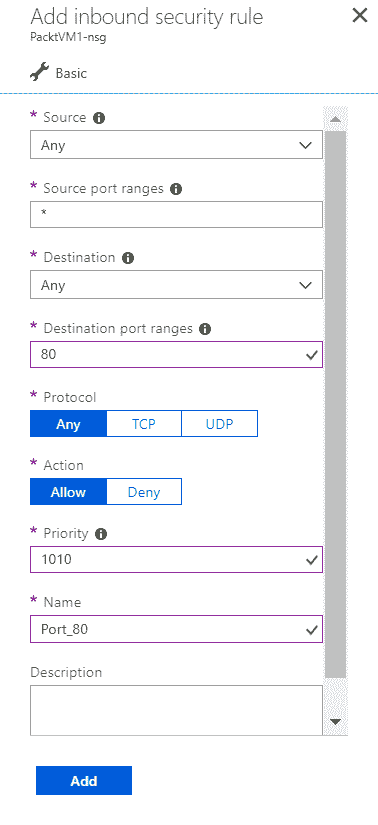

# Azure 网络 - Azure IaaS 的基础

我们云旅程中的下一步是 Azure 网络。此步骤将为我们的 Azure 基础设施奠定基础，并将在接下来的章节中为 IaaS 和 PaaS 使用。设计和实施 Azure 网络时，必须考虑到未来将使用的所有 Azure 服务。这将为你节省大量麻烦，并使你的云之旅安全且稳定。

本章将涵盖以下内容：

+   Azure VNet

+   地址范围

+   子网

+   IP 地址类型和预留

+   DNS

+   **网络安全组**（**NSGs**）

+   Azure 虚拟机网络

# 技术要求

本章内容你需要一个 Azure 订阅。

# Azure 网络基础

Microsoft Azure 中的网络栈非常重要，它是其他服务的基础，特别是当我们谈到 IaaS 时。正确设置 Azure 网络非常重要，因为它是设置 IaaS 基础设施并允许虚拟机进行通信的关键。Azure 中的网络栈由两个组成部分构成，外部和私有。外部用于通过互联网访问服务端点，私有用于 Azure 服务之间的内部通信。

几乎所有 Azure 服务默认都有外部端点配置，但在某些特殊情况下，我们不希望启用互联网访问。在这些情况下，我们可以禁用外部端点，并将这些服务设置为仅使用私有流量。这同样适用于 PaaS，尽管这些服务通常默认没有配置私有网络访问（除了某些为此设计的 PaaS 服务，例如隔离应用服务）。在本章中，我们将讨论基本的网络功能，并将在适当时继续探讨针对特定服务的网络选项。

IaaS 通常也有外部端点配置，但我们可以选择禁用这些端点，不允许通过互联网访问。另一方面，IaaS 总是会配置一个私有网络。每个 Azure 虚拟机都必须分配到一个虚拟网络，并分配一个私有 IP 地址。即使我们只配置了一个虚拟机，并希望它仅用于公共互联网访问，系统也会在后台创建一个虚拟网络，并为该虚拟机分配一个私有 IP 地址。

Azure 网络还扩展到 VPN 选项，允许你仅通过私有网络和私有 IP 地址访问服务。这使你能够进一步保护资源，并禁用任何类型的公共访问。我们将在讨论与 Microsoft Azure 的混合云时探讨这些功能和选项。

# 在 Azure 中创建你的第一个虚拟网络

**Azure 虚拟网络**（**Azure VNet**）有两种创建方式：一种是创建新的 VNet，另一种是创建新的 Azure 虚拟机。两者的选项相似，但我建议先创建 Azure VNet，并将虚拟机加入到现有的 VNet 中，因为这样会有更多的选项。

要创建一个新的 Azure Vnet，请打开 Azure 门户，选择“创建资源”，然后在“网络服务”中选择“虚拟网络”（或在搜索栏中搜索`Virtual network`），如下面的截图所示：


你需要为虚拟网络提供一些参数。资源名称在资源组级别必须唯一，并且必须是单个字符串，不允许有空格。我的资源名称是 `PacktVNet`，但如果我想分开这两个词，也可以使用 `Packt_VNet`。接下来的参数是地址空间。这将定义在此 VNet 中可用的 IP 地址数量，使用 CIDR 格式。最大的地址空间是 `/8`，最小的是 `/29`。在这种情况下，我将使用 `/16`，这将为我提供足够的地址空间。我们需要选择放置资源的订阅（仅当有多个订阅时需要选择；如果只有一个订阅，系统将默认选择）。资源组名称有两个选项，可以选择创建一个新的资源组，也可以选择现有的资源组。由于我通常会在创建其他资源之前配置虚拟网络，因此会与 VNet 一起创建一个新的资源组。接下来的步骤是选择我们希望创建资源的区域。我建议选择离你最近的 Azure 数据中心，因为这样将来能提供最低的网络延迟。如果选择了现有的资源组，该选项将自动选择资源组所在的相同区域。你需要为默认子网命名，并为该子网提供地址空间。子网的地址范围必须在 VNet 地址空间的地址范围内。

默认情况下提供基础的 DDoS 保护，是免费的，但你可以选择标准层，它需要单独收费。我们将在 第九章，*Azure 安全与管理* 中进一步讨论 DDoS。以下截图展示了虚拟网络部署所需的信息示例：


最后的选项与服务端点有关。如果我们启用此功能，会显示新的窗口，如下面的截图所示。此选项允许你将 PaaS 服务附加到你的 VNet。你可以选择 Azure Cosmos DB、事件中心、密钥保管库、服务总线、SQL 和存储，或者选择全部。在此，我将禁用端点，稍后我们会讨论它们：


最后一步是确认选项并开始创建资源的过程。Azure 虚拟网络工作相对较快，资源应该在不到一分钟的时间内创建完成。这可能取决于数据中心的工作负载和请求数量，但即使在需求量大的情况下，也应能相对快速地完成。

Azure 虚拟网络代表了你在云中的自有网络。它具备类似于本地网络的特性，例如 IP 地址范围和子网。如果你熟悉本地网络环境的网络设置，那么理解 Azure 网络将会非常容易。

# Azure 虚拟网络选项

部署完成后，你会有不同的管理选项可供选择。定位到你的资源组并打开虚拟网络选项卡。在“概览”标签页中，你可以看到有关虚拟网络的不同信息，比如资源组、订阅位置等等。

在设置中，我们有多个可供配置的选项：地址空间、连接设备、子网、DDoS 保护、DNS 服务器、对等连接和服务端点。每个 Azure 资源都有属性、锁定和自动化脚本，而这些不仅仅限于 Azure 虚拟网络。属性提供关于资源的只读信息，锁定显示是否有依赖于该服务的其他服务。自动化脚本会为资源的重新部署生成 ARM 模板。请注意，此选项会为整个资源组生成 ARM 模板，而不仅仅是为某个特定资源。自动化脚本可以在未来的重新部署中使用，万一我们需要为新的客户或新环境复制资源。

在地址空间中，我们可以编辑现有的地址空间或添加新的地址空间。这里有两个限制：地址空间不能重叠，并且不能将一个地址空间缩小到比使用该地址空间的子网还要小。例如，如果你创建了地址空间`10.1.0.0/16`和子网`10.1.0.0/16`，那么该地址空间不能更改为小于`10.1.0.0/16`，除非先更改子网。如何使用地址空间是很重要的；在未来的 VPN 连接中，你不能将 Azure 虚拟网络连接到使用相同地址空间的网络（无论是 Azure 网络还是物理网络）。添加新地址空间可以参见以下截图。确保新的地址空间不会与现有地址空间重叠：


在子网选项卡中，你有两个选择：更改现有子网或添加一个新的子网。对于这两种选项，你必须使用现有的地址空间，且子网不能重叠。现有的子网不能更改为使用比已用的地址空间更少的空间。例如，如果你的地址空间是`10.1.0.0/24`并且该子网已经有 200 个虚拟机，那么你不能将其更改为小于`/24`的地址空间，因为`/25`只有 128 个可用地址。

另一个需要注意的事项是，你在子网中并没有完整的 IP 地址范围；有五个 IP 地址被保留用于 Azure 提供的网络角色，例如 DNS 或 DHCP。说到 DHCP，Azure 不支持自定义 DHCP 解决方案，你必须使用 Azure 提供的 DHCP。DNS 则不同；默认情况下，你使用的是 Azure DNS 服务，但也可以使用自定义解决方案。

要添加一个新子网，你需要提供与 VNet 部署时创建默认子网时相似的信息，但你会有几个额外的选项。你需要提供子网的名称和 IP 地址范围，这些范围必须使用你 VNet 中现有的 IP 地址，并且不能与 VNet 上的其他子网重叠。请注意，在这里你会看到关于为 Azure 网络服务保留五个 IP 地址的信息。类似的 VNet 部署选项是服务端点选项，允许你将 PaaS 服务添加到子网中。你可以将网络安全组分配到子网级别，并分配路由表。

网络安全组（NSG）是你控制 Azure VNet 流量的主要工具，我们稍后会详细讨论它们。Azure 会自动在同一 VNet 上的所有子网之间路由流量，但你可以创建自定义路由表来覆盖默认选项。这在你使用 VPN 或虚拟设备（例如第三方防火墙）时非常有用。如下图所示，这是向 VNet 添加新子网的示例：


DNS 窗格允许我们为 VNet 添加自定义 DNS 解决方案。如前所述，默认情况下这是 Azure 提供的，但你也可以使用自己的 DNS，无论是使用带有 DNS 的虚拟机还是公共 DNS。

如果你有一个 Site2Site 连接到本地网络，那么它可以作为本地网络的 DNS。如果是这种情况，我建议在 Azure 中使用 DNS 的副本。这将使响应更快，并确保在 VPN 连接或本地网络因某些原因不可用时，DNS 仍可在 Azure VNet 中使用。提供自定义 DNS 的选项如下图所示。你需要提供 DNS 服务器的 IP 地址，如果选择使用公共 DNS，则提供公共 IP 地址；如果在 VNet 中部署 DNS，则提供私有 IP 地址：


在部署过程中，我们有机会为 VNet 添加服务端点，但我们可以随时使用服务端点窗格添加，如下图所示。由于添加这些服务会启动一个配置过程，设置路由和规则，因此该过程可能需要最多 15 分钟才能完成。服务端点选项可用于 VNet 和子网级别，因此你可以为整个网络或单个子网启用端点。使用单个子网可以提供更多控制，并能够将 PaaS 服务与虚拟网络的其他部分分离：


对等连接允许你将 VNet 连接到其他 VNet，以便交换流量。这仅适用于同一个 Azure 租户中的 VNet（但可跨该租户中的订阅使用）。你需要为连接指定一个名称，然后选择适当的订阅和虚拟网络。你还有一些额外的选项可以定义，例如是否需要流量转发、是否允许网关中继以及是否使用远程网关。默认情况下，只有来自一个 VNet 的流量会被转发到第二个 VNet。来自对等连接外部的流量（例如来自第二个对等网络，只有一个 VNet 涉及，或者通过网关传输的流量）不会被转发，除非你指定这些选项。

例如，假设我们有三个 VNet：A、B 和 C。A 连接到 B，C 也连接到 B，但 A 和 C 之间没有直接连接。默认情况下，流量会被允许从 A 到 B，从 B 到 A，从 B 到 C，以及从 C 到 B。A 到 C 或 C 到 A 的流量不会被允许。如果我们启用流量转发，A 到 C 和 C 到 A 的流量将会被转发。

虚拟网关也有类似的情况。假设我们有 A 和 B 两个网络，并且这两个 VNet 之间有对等连接。VNet A 有一个虚拟网关，并且已连接到我们的本地网络。默认情况下，A 到 B、B 到 A、本地网络到 A 以及 A 到本地网络的流量都会被允许。除非我们使用额外选项允许网关中继和远程网关的使用，否则本地网络到 B 和 B 到本地网络的流量将不被允许。

另一种实现方式是为每个 VNet 创建一个虚拟网关，并创建一个 Site2Site 连接，这与连接到本地网络时所使用的连接方式相同（我们将在混合云章节讨论这个问题）。这两种方法的主要区别在于，对等连接是免费的，而虚拟网关是收费的。如果你希望连接位于不同租户的两个 VNet，你需要使用虚拟网关；而对等连接仅适用于同一个租户中的 VNet。

为了连接不同的网络，无论是 VNet 到 VNet 还是 VNet 到本地网络，IP 地址空间/子网不能重叠。如果两个网络使用相同的子网，你将无法创建该连接，因为这会造成混淆，并使路由变得不可能。将无法区分哪个设备属于哪个网络，也无法确定流量应该流向哪里。如何在你的订阅中将 VNet 连接到另一个 VNet，如下图所示：


在多个网络通过对等连接或 Site2Site 连接的情况下，建议使用路由表。自定义路由表允许我们在特定情况下创建并转发流量，并定义有关流量应该去往哪里的一些规则。

# 连接的设备

我们的虚拟网络已经配置好并准备就绪，但我们需要在其中添加资源才能实际使用它。第一步是将新的 Azure 虚拟机添加到虚拟网络中，以便开始使用 Azure 网络栈。

# 创建 Azure 虚拟机

为了通过门户创建新的 Azure 虚拟机，我们需要执行三个步骤。我们需要选择“新建资源”，然后选择新的虚拟机。我们有成百上千的镜像可供选择，稍后将在章节中讨论这些镜像：

1.  在这种情况下，我们只需要一台虚拟机来展示其网络选项，并且我们将设置所有默认参数以便快速完成。我选择了 Windows Server 2016 镜像，并开始提供所需的基本信息：名称、虚拟机磁盘类型、用户名、密码、订阅、资源组和位置。请注意，在位置选项下，你可以选择创建新的资源组或选择现有的资源组。我选择了“使用现有资源组”，即与我们的虚拟网络所在的资源组相同。

基本虚拟机创建的示例如下所示：


1.  下一步是选择虚拟机的大小。这个步骤与网络部分无关，我将选择系统提供的第一个选项，B1s，见下图：


1.  在最后一步，我们进入了包含网络选项的部分。我将所有其他选项保留默认设置，并专注于网络部分。

首先，我们需要选择虚拟机将连接的虚拟网络（VNet）。我们可以选择一个现有的虚拟网络或创建一个新的虚拟网络。如果没有找到任何虚拟网络，将自动提供新的虚拟网络参数。如果在我们放置虚拟机的资源组中已经存在一个虚拟网络，系统会自动选择该虚拟网络。在我们的案例中，第一步创建的 PacktVNet 在以下截图中显示：


我们的第二个选项是选择虚拟机的子网。如果我们在创建虚拟机的同时也创建了一个新的虚拟网络，这个选项将不可用；只有默认子网会被创建。为了能够在子网之间进行选择，虚拟网络必须在虚拟机之前创建，并且需要指定要使用的子网。在这种情况下，我将选择将虚拟机加入之前创建的 DMZ 子网。选择子网选项如下图所示：


我们还可以选择虚拟机的公共 IP 地址。我们可以选择一个现有的公共 IP 地址（一个不再使用的保留 IP 地址）或创建一个新的公共 IP 地址。网络安全组也是如此：我们可以选择现有的一个或创建一个新的。我将选择为我的虚拟机创建一个新的公共 IP 地址和新的网络安全组，如下图所示：


完成后，虚拟机的部署开始，直到过程完成通常需要几分钟。部署一个新的 Azure 虚拟机所需的时间取决于虚拟机的大小、截图以及对数据中心的请求次数。

# IP 地址类型

一旦虚拟机的部署完成，我们可以在虚拟网络刃下的“已连接设备”中看到该设备。以下截图显示了连接设备刃的示例。这里显示的信息包括设备名称、连接的设备类型、私有 IP 地址以及设备分配的子网。IP 地址信息与私有 IP 地址相关，这个 IP 地址是在 VNet 级别分配给我们虚拟机的，仅用于内部流量。请注意，设备类型是网络接口。每个虚拟机都有一个**网络接口卡**（**NIC**），用于与网络通信，并且会在创建虚拟机时自动创建一个。虚拟机可以有多个 NIC，如果需要连接多个子网，或者确保虚拟机在一个 NIC 故障时仍然可用。NIC 的数量取决于虚拟机的大小，从基本层虚拟机的 1 个 NIC 到更高层虚拟机的 8 个 NIC：


如果我们点击设备，它将带我们进入 NIC 刃如以下截图所示。我们也可以通过在资源组中选择 NIC 来进入相同的页面。在 IP 配置中，我们可以启用或禁用 IP 转发，改变 NIC 连接的子网，并查看私有和公共 IP 地址的 IP 配置：


# 私有 IP 地址

如果我们选择 IP 配置，我们将有更多的 IP 地址选项。以下截图展示了一个示例。

默认情况下，公共 IP 地址是启用的，但如果需要，我们可以禁用它。这通常用于虚拟机位于后端且不需要公共曝光的场景。在这种情况下，我们需要确保有其他方式连接到虚拟机，通常是通过 VPN。禁用公共 IP 地址通常发生在混合云场景中，当不需要通过互联网访问时。除了使用分配的公共 IP 地址外，我们还可以在这里创建一个新的 IP 地址。

默认情况下，私有 IP 地址是动态的，并且会随着时间变化。IP 地址的变化不会无缘无故发生，而是在虚拟机重启或关闭的情况下发生。如果我们使用私有 IP 地址与 VNet 上的其他虚拟机通信，我们可能希望保持该地址不变。可以通过将 IP 地址分配方式从动态设置为静态来实现。这将为该 NIC 保留 IP 地址，即使虚拟机长时间关闭：


DNS 是 VNet 和虚拟机级别都可用的另一选项。我们可以为特定的 NIC 分配自定义 DNS。如果我们将 DNS 分配到 VNet 级别，该 DNS 将应用于连接到该 VNet 的所有虚拟机。NIC DNS 的默认选项是继承自虚拟网络设置。在这种情况下，它将是 Azure DNS 或自定义 DNS，具体取决于 VNet 设置。如果我们为 VNet 选择了自定义 DNS，则无法在 NIC 级别选择 Azure DNS。我们唯一的可选项是使用“从虚拟网络继承”或“自定义 DNS”。NIC 级别的 DNS 刀锋如下图所示：


# 网络安全组

NSG（网络安全组）是一组应用于您的 Azure 网络资源的安全规则。它们是执行和控制资源网络流量规则的主要工具。NSG 可以应用于两种类型的资源：子网和 NIC。如果 NSG 应用于子网，规则将应用于连接到该子网的所有设备。当 NSG 应用于 NIC 时，规则仅适用于该设备。

在 NSG 刀锋的概览中，我们可以看到当前应用的所有规则，包括入站和出站规则。默认情况下，来自外部的所有入站流量都会被禁用，除了 `3389` 端口，它允许我们远程连接到虚拟机。来自虚拟网络内部或 Azure 负载均衡器的所有入站流量是允许的。这些规则可以根据需要进行编辑和添加。

默认情况下，所有级别的出站流量都允许流向虚拟网络或外部。 这些规则也可以编辑，但通常无需限制出站流量。

所有规则都有一个优先级分配给它们；较低的数字表示具有较高优先级的规则。例如，我们有优先级为 `1000` 的 RDP 规则，以及优先级为 `65500` 的 `DenyAllInBound` 规则（该规则会阻止所有入站流量）。即使强制执行了 `DenyAllInBound` 规则来阻止所有入站流量，允许 RDP 的规则优先级更高，将首先执行。因此，所有入站流量都会被阻止，除了 RDP 规则，由于其优先级更高，允许连接。

NSG 设置可以通过 NIC 刀锋或通过在资源组的资源列表中选择 NSG 打开。NSG 刀锋的概览如下图所示：


要添加新规则，请转到入站安全规则并选择添加新规则。您可以选择基本或高级。如果选择基本，则只会提供一些选项供选择。我建议使用高级，这样可以让您对规则有更多的控制权：

+   源：对于源，你可以在几个选项之间进行选择。`Any`将允许来自任何源的流量。`IP 地址`将仅允许来自指定地址的流量；你可以输入单个 IP 或 CIDR 格式的 IP 地址范围。这对于限制通过端口`3389`的访问以及保护虚拟机非常有用。`服务标签`将允许来自特定服务的流量。例如，使用服务标签选项，你可以允许来自 Azure 存储的流量，但阻止其他所有流量。

    源的最后一个选项是**应用程序安全组**（**ASG**）。ASG 允许你创建规则并仅允许流量进入网络上某一特定资源组。例如，我们在 VNet 中有多个服务器，Web 服务器和数据库服务器。允许通过端口`1433`到数据库服务器的流量应该对 Web 服务器启用，但不允许通过互联网。将 Web 服务器放入 ASG 并创建规则，可以只允许 Web 服务器通过端口`1433`访问我们的数据库，并阻止任何其他流量。

+   源端口范围：通过源端口范围，我们还可以限制流量，仅允许来自特定端口或端口范围的流量。

+   目标端口范围：目标端口范围选项与源选项类似；我们有相同的可用选项集。ASG 可以用于仅允许网络中特定类型的虚拟机访问。例如，将 Web 服务器放入 ASG，并允许通过端口`443`或`80`的流量，这样就只有这些服务器可以通过这些端口进行访问，并且阻止对任何其他类型虚拟机的流量。

    目标端口范围允许我们指定流量允许经过的端口，可以将其限制为单一端口或一个范围。

+   协议：它帮助我们定义哪些协议是允许的，可以选择 TCP 或 UDP。

+   操作：它定义了这个规则是用于允许流量还是阻止流量。NSG 可以双向使用，它可以帮助我们定义是否允许特定的流量，但也可以用于拒绝流量，从而帮助我们在 Azure 中保护资源。

+   优先级：此选项非常重要，因为它帮助我们定义首先应用哪些规则，哪些规则具有优先权。如前所述，分配给规则的优先级数字越低，规则的优先级越高。规则会按顺序处理，从最高优先级的规则（数字最小）到优先级较低的规则（数字较大），直到满足条件。一旦条件满足，规则就会被处理，并且规则处理停止。例如，我们创建一个规则，阻止所有通过端口`1433`的流量，并给它优先级`1000`，然后创建一个规则，允许某些来源通过端口`1433`的流量，优先级为`2000`。由于优先级较高的规则正在阻止该流量，因此端口`1433`上的流量永远无法通过。

+   名称：最后的选项是为规则命名并输入描述。描述是可选的，但我建议您填写，因为这将帮助您日后跟踪和理解为何首次创建某个规则。

示例设置展示了 NSG 中高级选项的配置，如下截图所示：



NSG 可以应用于两个级别，即网络接口卡 (NIC) 和子网。如果将 NSG 应用于 NIC，则该 NSG 中定义的规则仅对连接到该 NIC 的虚拟机生效。如果将 NSG 应用于子网，则该子网上的所有虚拟机都将遵循这些规则。

在某些情况下，可以同时在子网和 NIC 上应用 NSG。在这种情况下要小心配置，因为只有在两个级别都允许的流量才会通过。如果在子网级别允许端口 `80` 的流量但在 NIC 级别阻止，端口 `80` 上将不会有流量通过。反之亦然，如果在 NIC 上允许但在子网上阻止，则端口上也不会有流量通过。如果要在已在子网和 NIC 级别应用了 NSG 的 VM 上阻止某些内容，只需在其中一个 NSG 上阻止命名端口上的流量即可。

使用 NSG 与 ASG 结合是保护和确保资源安全的最佳方式。

让我们创建一个场景，其中我们有三组服务器：web、应用和数据库。

我们需要使 web 服务器能够连接到应用服务器，应用服务器能够连接到数据库服务器。仅允许通过互联网连接到 web 服务器，而我们不希望在任何情况下通过互联网连接到数据库服务器。第一步是创建三个 Azure 安全组，每个安全组用于一个服务器角色。接下来是使用 ASG 配置 NSG 规则。

仅允许通过互联网连接到位于 web ASG 中的服务器。仅允许来自位于 web ASG 中的服务器的流量连接到应用服务器。通过设置一条规则来实现此目标，该规则允许来自应用 ASG 的流量到达应用 ASG，阻止其他一切。最后，我们创建一条规则，允许仅在流量来自应用 ASG 时连接到数据库服务器 (数据库 ASG)。

这种方法使管理和维护变得更加简单和一致。如果要将服务器添加到任何三个池中的一个，您需要设置适当的规则并应用所需的设置。很容易犯错，导致该服务器未拥有所有必要的连接，或者在最坏的情况下成为安全问题。使用 NSG 和 ASG 来跟踪所有规则时，我们只需将新服务器添加到适当的 ASG 中，所有规则和设置将自动应用。

# 公共 IP 地址

公共 IP 地址设置可以通过 NSG 设置进行访问，或者通过在资源组面板中选择公共 IP 地址来访问。

公共 IP 地址的设置与私有 IP 地址类似。默认情况下，它们是动态的，因此在重启或关机时，IP 可能会发生变化，但我们可以将此设置更改为静态。静态 IP 会保留我们的 IP 地址，但在这种情况下，公共 IP 地址和私有 IP 地址之间有一个区别。私有 IP 地址的保留是免费的，因为这是一个内部 IP 地址，所以你可以选择范围，甚至为特定虚拟机（VM）保留该范围内的 IP 地址。而公共 IP 地址是分配的，并且没有选择所需 IP 地址的选项。另一个区别是，公共 IP 地址的保留是收费的；每个订阅可以免费保留前五个公共 IP 地址，但超过这个数量的每次保留都将收费。超过前五个公共 IP 地址的保留价格并不高（大约每月$3），但了解你为此付费是很重要的。

如果你想限制访问，可以从 NIC 中删除公共 IP 地址（私有 IP 地址不能删除）。如果你选择使用公共 IP 地址，你可能需要它来远程连接到虚拟机，或者用于应用程序。如果你不想创建保留，还有一个选项，可以使用 DNS 名称标签。此选项将为你的 NIC 分配一个 DNS 名称，你可以使用它来访问虚拟机。任何公共 IP 地址的变化（可能由于虚拟机重启或关机而发生）将由 Azure DNS 处理。公共 IP 地址配置的选项如下图所示：


# 其他 Azure 网络服务

我们目前所涵盖的 Azure 服务只是 Azure 网络栈的一部分。Azure 网络栈并不止于此，还有许多其他与网络相关的 Azure 服务，例如流量管理器、负载均衡器或虚拟网关。其中一些将在后续章节中介绍。

例如，我们将讨论具有虚拟机高可用性的负载均衡器。当我们讨论 PaaS 的高可用性时，流量管理器将是一个类似的案例。虚拟网关将在关于 Microsoft Azure 混合云的章节中讨论。

混合场景和安全性可以通过虚拟设备进行管理。虚拟设备是带有第三方防火墙软件的 Azure 虚拟机。大多数领先的行业防火墙都受支持并可用（例如 Barracuda、CheckPoint、Cisco 和 PaloAlto）。虚拟设备的虚拟机镜像可以通过 Azure 市场获得，你可以轻松配置并设置虚拟设备，使用它来管理和保护你的 Azure 网络。

然而，Microsoft Azure 正在不断发展，越来越多的服务正在推出。涵盖所有服务和功能是不可能的。本书的每一章都可能成为一本独立的书。

# ARM 模板

我们已经讨论了 ARM 模板以及它们如何帮助我们实现自动化。在本章中，我创建了一个虚拟网络，并将一台虚拟机加入到该网络中。

如果您转向自动化，您可以找到一个 JSON 格式的 ARM 模板，您可以使用它重新部署我的资源。该 ARM 模板将包含所有资源和所有设置：虚拟网络及其参数、包含有关镜像和大小的虚拟机、NSG 规则等。它将包含所有依赖项的信息，以及需要首先创建的内容。例如，为了创建虚拟机，需要先创建一个子网，将虚拟机加入到该子网，而子网无法在虚拟网络创建之前创建。

请注意，某些`参数`（例如密码）没有提供，因为密码不能以明文显示，只能作为安全字符串提供，因此您需要手动提供这些`参数`：

```
{
 "$schema": "https://schema.management.azure.com/schemas/2015-01-01/deploymentTemplate.json#",
 "contentVersion": "1.0.0.0",
 "parameters": {
 "virtualMachines_PacktVM1_name": {
 "defaultValue": "PacktVM1",
 "type": "String"
 },
 "virtualNetworks_PacktVNet_name": {
 "defaultValue": "PacktVNet",
 "type": "String"
 },
 "networkInterfaces_packtvm1240_name": {
 "defaultValue": "packtvm1240",
 "type": "String"
 },
 "publicIPAddresses_PacktVM1_ip_name": {
 "defaultValue": "PacktVM1-ip",
 "type": "String"
 },
 "networkSecurityGroups_PacktVM1_nsg_name": {
 "defaultValue": "PacktVM1-nsg",
 "type": "String"
 },
 "subnets_DMZ_name": {
 "defaultValue": "DMZ",
 "type": "String"
 },
 "subnets_default_name": {
 "defaultValue": "default",
 "type": "String"
 },
 "securityRules_default_allow_rdp_name": {
 "defaultValue": "default-allow-rdp",
 "type": "String"
 },
 "adminUsername": {
 "type": "string",
 "metadata": {
 "description": "Default Admin username"
 }
 },
 "adminPassword": {
 "type": "securestring",
 "metadata": {
 "description": "Default Admin password"
 }
 }
 },
 "variables": {},
 "resources": [
 {
 "type": "Microsoft.Compute/virtualMachines",
 "name": "[parameters('virtualMachines_PacktVM1_name')]",
 "apiVersion": "2017-12-01",
 "location": "westeurope",
 "scale": null,
 "properties": {
 "hardwareProfile": {
 "vmSize": "Standard_B1s"
 },
 "storageProfile": {
 "imageReference": {
 "publisher": "MicrosoftWindowsServer",
 "offer": "WindowsServer",
 "sku": "2016-Datacenter",
 "version": "latest"
 },
 "osDisk": {
 "osType": "Windows",
 "name": "[concat(parameters('virtualMachines_PacktVM1_name'),'_OsDisk_1_b6ae3bba44ef491f8c2acd7bfb5aa975')]",
 "createOption": "FromImage",
 "caching": "ReadWrite",
 "managedDisk": {
 "storageAccountType": "Standard_LRS"
 },
 "diskSizeGB": 127
 },
 "dataDisks": []
 },
 "osProfile": {
 "computerName": "[parameters('virtualMachines_PacktVM1_name')]",
 "adminUsername": "[parameters('adminUsername')]",
 "adminPassword": "[parameters('adminPassword')]",
 "windowsConfiguration": {
 "provisionVMAgent": true,
 "enableAutomaticUpdates": true
 },
 "secrets": []
 },
 "networkProfile": {
 "networkInterfaces": [
 {
 "id": "[resourceId('Microsoft.Network/networkInterfaces', parameters('networkInterfaces_packtvm1240_name'))]"
 }
 ]
 },
 "diagnosticsProfile": {
 "bootDiagnostics": {
 "enabled": true,
 "storageUri": "https://nagiosdiag316.blob.core.windows.net/"
 }
 }
 },
 "dependsOn": [
 "[resourceId('Microsoft.Network/networkInterfaces', parameters('networkInterfaces_packtvm1240_name'))]"
 ] 
 },
 {
 "type": "Microsoft.Network/networkInterfaces",
 "name": "[parameters('networkInterfaces_packtvm1240_name')]",
 "apiVersion": "2018-02-01",
 "location": "westeurope",
 "scale": null,
 "properties": {
 "provisioningState": "Succeeded",
 "resourceGuid": "2d51720b-041b-4248-ab04-8dd9fd3fa7d9",
 "ipConfigurations": [
 {
 "name": "ipconfig1",
 "etag": "W/\"b681e202-2d98-4d28-a30d-aaf93b9f1243\"",
 "properties": {
 "provisioningState": "Succeeded",
 "privateIPAddress": "10.1.1.4",
 "privateIPAllocationMethod": "Static",
 "publicIPAddress": {
 "id": "[resourceId('Microsoft.Network/publicIPAddresses', parameters('publicIPAddresses_PacktVM1_ip_name'))]"
 },
 "subnet": {
 "id": "[resourceId('Microsoft.Network/virtualNetworks/subnets', parameters('virtualNetworks_PacktVNet_name'), parameters('subnets_DMZ_name'))]"
 },
 "primary": true,
 "privateIPAddressVersion": "IPv4"
 }
 }
 ],
 "dnsSettings": {
 "dnsServers": [],
 "appliedDnsServers": [],
 "internalDomainNameSuffix": "gbyhmwrx0mmutogdwlxg2i521c.ax.internal.cloudapp.net"
 },
 "macAddress": "00-0D-3A-2E-EA-03",
 "enableAcceleratedNetworking": false,
 "enableIPForwarding": false,
 "networkSecurityGroup": {
 "id": "[resourceId('Microsoft.Network/networkSecurityGroups', parameters('networkSecurityGroups_PacktVM1_nsg_name'))]"
 },
 "primary": true
 },
 "dependsOn": [
 "[resourceId('Microsoft.Network/publicIPAddresses', parameters('publicIPAddresses_PacktVM1_ip_name'))]",
 "[resourceId('Microsoft.Network/virtualNetworks/subnets', parameters('virtualNetworks_PacktVNet_name'), parameters('subnets_DMZ_name'))]",
 "[resourceId('Microsoft.Network/networkSecurityGroups', parameters('networkSecurityGroups_PacktVM1_nsg_name'))]"
 ]
 },
 {
 "type": "Microsoft.Network/networkSecurityGroups",
 "name": "[parameters('networkSecurityGroups_PacktVM1_nsg_name')]",
 "apiVersion": "2018-02-01",
 "location": "westeurope",
 "scale": null,
 "properties": {
 "provisioningState": "Succeeded",
 "resourceGuid": "11b65174-a94e-44e1-947c-dd140c45a6c8",
 "securityRules": [
 {
 "name": "default-allow-rdp",
 "etag": "W/\"9b7736d4-5a76-4804-a63f-6cd1875f1d5c\"",
 "properties": {
 "provisioningState": "Succeeded",
 "protocol": "TCP",
 "sourcePortRange": "*",
 "destinationPortRange": "3389",
 "sourceAddressPrefix": "*",
 "destinationAddressPrefix": "*",
 "access": "Allow",
 "priority": 1000,
 "direction": "Inbound",
 "sourcePortRanges": [],
 "destinationPortRanges": [],
 "sourceAddressPrefixes": [],
 "destinationAddressPrefixes": []
 }
 }
 ],
 "defaultSecurityRules": [
 {
 "name": "AllowVnetInBound",
 "etag": "W/\"9b7736d4-5a76-4804-a63f-6cd1875f1d5c\"",
 "properties": {
 "provisioningState": "Succeeded",
 "description": "Allow inbound traffic from all VMs in VNET",
 "protocol": "*",
 "sourcePortRange": "*",
 "destinationPortRange": "*",
 "sourceAddressPrefix": "VirtualNetwork",
 "destinationAddressPrefix": "VirtualNetwork",
 "access": "Allow",
 "priority": 65000,
 "direction": "Inbound",
 "sourcePortRanges": [],
 "destinationPortRanges": [],
 "sourceAddressPrefixes": [],
 "destinationAddressPrefixes": []
 }
 },
 {
 "name": "AllowAzureLoadBalancerInBound",
 "etag": "W/\"9b7736d4-5a76-4804-a63f-6cd1875f1d5c\"",
 "properties": {
 "provisioningState": "Succeeded",
 "description": "Allow inbound traffic from azure load balancer",
 "protocol": "*",
 "sourcePortRange": "*",
 "destinationPortRange": "*",
 "sourceAddressPrefix": "AzureLoadBalancer",
 "destinationAddressPrefix": "*",
 "access": "Allow",
 "priority": 65001,
 "direction": "Inbound",
 "sourcePortRanges": [],
 "destinationPortRanges": [],
 "sourceAddressPrefixes": [],
 "destinationAddressPrefixes": []
 }
 },
 {
 "name": "DenyAllInBound",
 "etag": "W/\"9b7736d4-5a76-4804-a63f-6cd1875f1d5c\"",
 "properties": {
 "provisioningState": "Succeeded",
 "description": "Deny all inbound traffic",
 "protocol": "*",
 "sourcePortRange": "*",
 "destinationPortRange": "*",
 "sourceAddressPrefix": "*",
 "destinationAddressPrefix": "*",
 "access": "Deny",
 "priority": 65500,
 "direction": "Inbound",
 "sourcePortRanges": [],
 "destinationPortRanges": [],
 "sourceAddressPrefixes": [],
 "destinationAddressPrefixes": []
 }
 },
 {
 "name": "AllowVnetOutBound",
 "etag": "W/\"9b7736d4-5a76-4804-a63f-6cd1875f1d5c\"",
 "properties": {
 "provisioningState": "Succeeded",
 "description": "Allow outbound traffic from all VMs to all VMs in VNET",
 "protocol": "*",
 "sourcePortRange": "*",
 "destinationPortRange": "*",
 "sourceAddressPrefix": "VirtualNetwork",
 "destinationAddressPrefix": "VirtualNetwork",
 "access": "Allow",
 "priority": 65000,
 "direction": "Outbound",
 "sourcePortRanges": [],
 "destinationPortRanges": [],
 "sourceAddressPrefixes": [],
 "destinationAddressPrefixes": []
 }
 },
 {
 "name": "AllowInternetOutBound",
 "etag": "W/\"9b7736d4-5a76-4804-a63f-6cd1875f1d5c\"",
 "properties": {
 "provisioningState": "Succeeded",
 "description": "Allow outbound traffic from all VMs to Internet",
 "protocol": "*",
 "sourcePortRange": "*",
 "destinationPortRange": "*",
 "sourceAddressPrefix": "*",
 "destinationAddressPrefix": "Internet",
 "access": "Allow",
 "priority": 65001,
 "direction": "Outbound",
 "sourcePortRanges": [],
 "destinationPortRanges": [],
 "sourceAddressPrefixes": [],
 "destinationAddressPrefixes": []
 }
 },
 {
 "name": "DenyAllOutBound",
 "etag": "W/\"9b7736d4-5a76-4804-a63f-6cd1875f1d5c\"",
 "properties": {
 "provisioningState": "Succeeded",
 "description": "Deny all outbound traffic",
 "protocol": "*",
 "sourcePortRange": "*",
 "destinationPortRange": "*",
 "sourceAddressPrefix": "*",
 "destinationAddressPrefix": "*",
 "access": "Deny",
 "priority": 65500,
 "direction": "Outbound",
 "sourcePortRanges": [],
 "destinationPortRanges": [],
 "sourceAddressPrefixes": [],
 "destinationAddressPrefixes": []
 }
 }
 ]
 },
 "dependsOn": []
 },
{
 "type": "Microsoft.Network/publicIPAddresses",
 "sku": {
 "name": "Basic",
 "tier": "Regional"
 },
 "name": "[parameters('publicIPAddresses_PacktVM1_ip_name')]",
 "apiVersion": "2018-02-01",
 "location": "westeurope",
 "scale": null,
 "properties": {
 "provisioningState": "Succeeded",
 "resourceGuid": "972b3091-fe6e-49cc-bd06-22d260608254",
 "ipAddress": "40.74.60.181",
 "publicIPAddressVersion": "IPv4",
 "publicIPAllocationMethod": "Dynamic",
 "idleTimeoutInMinutes": 4,
 "ipTags": []
 },
 "dependsOn": []
 },
{
 "type": "Microsoft.Network/virtualNetworks",
 "name": "[parameters('virtualNetworks_PacktVNet_name')]",
 "apiVersion": "2018-02-01",
 "location": "westeurope",
 "scale": null,
 "properties": {
 "provisioningState": "Succeeded",
 "resourceGuid": "5a767030-d337-4919-b8c3-b2ee6e23fcda",
 "addressSpace": {
 "addressPrefixes": [
 "10.1.0.0/16",
 "10.2.0.0/16"
 ]
 },
 "subnets": [
 {
 "name": "default",
 "etag": "W/\"98f91850-e7b2-40b6-8043-1caa5bf4865a\"",
 "properties": {
 "provisioningState": "Succeeded",
 "addressPrefix": "10.1.0.0/24",
 "serviceEndpoints": []
 }
 },
 {
 "name": "DMZ",
 "etag": "W/\"98f91850-e7b2-40b6-8043-1caa5bf4865a\"",
 "properties": {
 "provisioningState": "Succeeded",
 "addressPrefix": "10.1.1.0/24",
 "serviceEndpoints": []
 }
 }
 ],
 "virtualNetworkPeerings": [],
 "enableDdosProtection": false,
 "enableVmProtection": false
 },
 "dependsOn": []
 },
{
 "type": "Microsoft.Network/networkSecurityGroups/securityRules",
 "name": "[concat(parameters('networkSecurityGroups_PacktVM1_nsg_name'), '/', parameters('securityRules_default_allow_rdp_name'))]",
 "apiVersion": "2018-02-01",
 "scale": null,
 "properties": {
 "provisioningState": "Succeeded",
 "protocol": "TCP",
 "sourcePortRange": "*",
 "destinationPortRange": "3389",
 "sourceAddressPrefix": "*",
 "destinationAddressPrefix": "*",
 "access": "Allow",
 "priority": 1000,
 "direction": "Inbound",
 "sourcePortRanges": [],
 "destinationPortRanges": [],
 "sourceAddressPrefixes": [],
 "destinationAddressPrefixes": []
 },
 "dependsOn": [
 "[resourceId('Microsoft.Network/networkSecurityGroups', parameters('networkSecurityGroups_PacktVM1_nsg_name'))]"
 ]
 },
{
 "type": "Microsoft.Network/virtualNetworks/subnets",
 "name": "[concat(parameters('virtualNetworks_PacktVNet_name'), '/', parameters('subnets_default_name'))]",
 "apiVersion": "2018-02-01",
 "scale": null,
 "properties": {
 "provisioningState": "Succeeded",
 "addressPrefix": "10.1.0.0/24",
 "serviceEndpoints": []
 },
 "dependsOn": [
 "[resourceId('Microsoft.Network/virtualNetworks', parameters('virtualNetworks_PacktVNet_name'))]"
 ]
 },
{
 "type": "Microsoft.Network/virtualNetworks/subnets",
 "name": "[concat(parameters('virtualNetworks_PacktVNet_name'), '/', parameters('subnets_DMZ_name'))]",
 "apiVersion": "2018-02-01",
 "scale": null,
 "properties": {
 "provisioningState": "Succeeded",
 "addressPrefix": "10.1.1.0/24",
 "serviceEndpoints": []
 },
"dependsOn": [
"[resourceId('Microsoft.Network/virtualNetworks', parameters('virtualNetworks_PacktVNet_name'))]"
]
}
]
}
```

一旦我们在资源组中部署了多个资源，这将特别有帮助。使用这些模板，我们可以自动、快速且精准地配置相同的环境。手动重新部署资源组以重新创建环境可能会导致不一致和漏掉步骤。而使用 ARM 模板，每次都会产生相同的结果。

# 总结

我们已经覆盖了 Azure 网络的基本功能，包括虚拟网络、IP 地址类型和 NSG。这些关于 Azure 网络的基本知识将成为后续章节的基础。

理解 ARM 模板也非常重要，因为一旦我们的基础设施变得更复杂，它们将非常有帮助。

从这里开始，我们将深入探讨 Azure IaaS，它将使用 Azure 网络作为支撑，并且是将一切整合在一起的服务。我们将展示如何创建高级 VM 场景，这些场景将使用 Azure 网络，私有网络用于 VM 之间的通信，公共网络用于外部访问。我们将更详细地解释如何创建新的 Azure 虚拟机、可用性组以及在 Azure 中为 IaaS 提供高可用性的选项。

# 问题

1.  哪些服务依赖于 Microsoft Azure 中的 Azure 网络？

    1.  IaaS

    1.  PaaS

    1.  两者

1.  什么定义了 Azure 中的 IP 地址范围？

    1.  子网掩码

    1.  CIDR

    1.  RIP

1.  服务端点用于将哪些服务连接到您的虚拟网络？

    1.  虚拟机

    1.  PaaS

    1.  SaaS

1.  Microsoft Azure 中的默认 DNS 服务是...?

    1.  Azure DNS

    1.  公共 DNS

    1.  自定义 DNS

1.  什么时候可以添加服务端点？

    1.  创建虚拟网络时

    1.  创建虚拟网络后

    1.  任何时候

1.  Azure 中的私有 IP 地址可以是...?

    1.  动态

    1.  静态

    1.  两者

1.  Azure 中的公共 IP 地址可以是...?

    1.  动态

    1.  静态

    1.  两者

1.  NSG 是什么？

    1.  定义流量流向的安全规则

    1.  关于 IP 地址预留的规则

    1.  两者

1.  NSG 定义了什么？

    1.  出站流量规则  

    1.  入站流量规则

    1.  两者  

1.  NSG 不能分配给什么？  

    1.  虚拟网络  

    1.  网络接口卡（NIC）  

    1.  子网  
