# 第三章：基础设施即服务 - 云计算的第一层

在我们的云旅程中的下一步是利用 Azure 虚拟机作为 Azure IaaS 的一部分。这是将工作负载转移到云端的第一个逻辑步骤，因为管理 Azure 虚拟机与管理本地虚拟机并无多大不同。虽然我们不再访问虚拟化主机和硬件，但管理 Azure VM 与管理本地服务器或虚拟机没有任何区别。

我们将向您展示如何实现服务的高可用性以及如何扩展工作负载，这是 Microsoft Azure 提供的主要优势之一。

本章涵盖的领域包括：

+   创建 Azure 虚拟机

+   管理 Azure 虚拟机

+   创建 Azure 负载均衡器

+   配置 Azure 负载均衡器

+   创建 Azure 虚拟机规模集

# 技术要求

本章需要：

+   Azure 订阅

# 部署 Azure 虚拟机

任何 Azure 资源的部署都可以通过多种方式进行，Azure 虚拟机也不例外。我们可以使用 Azure 门户、ARM 模板、Azure PowerShell 或 Azure CLI。我们将讨论所有这些方法，但目前我们将专注于使用 Azure 门户，并偶尔使用 ARM 模板。这是为了更好地了解 Azure 服务以及每次部署创建了什么。其他工具在长远来看也会对我们有所帮助，特别是当我们谈论重新部署和自动化时，但这部分我们稍后再谈。

我们已经快速创建了一个 Azure VM，但这一次我们将更仔细地查看可用的选项，因为上次我们只考虑了 Azure 网络部分作为重点。

# 创建新的 Azure 虚拟机

要创建新的 Azure VM，我们需要选择新资源并选择新虚拟机。

第一步是为我们的 VM 选择操作系统。Windows 和 Linux 都有数百个可供选择的镜像。重要的是要提到，越来越多的 Linux VM 每天都被部署到 Azure 中。来自 2017 年底的信息告诉我们，超过 40% 的所有 Azure 虚拟机正在运行 Linux，而该百分比可能自那时以来已经增加。

Azure 中支持的 Windows Server 版本有：

+   Windows Server 2008 R2 SP1

+   Windows Server 2012

+   Windows Server 2012 R2

+   Windows Server 2016

对于 Linux，有太多版本以至于无法一一列举，但支持的发行版包括：

+   Ubuntu

+   CentOS

+   RHEL

+   Kali

+   Oracle

所有镜像都可以选择最小安装或预配置安装额外软件。例如，我们可以选择默认设置的 Windows Server 2016 或选择已安装 SQL Server 并且准备好使用的镜像。对于 Linux，我们可以选择最小安装，或者选择已配置好软件如 Chef、Puppet、Jenkins 等的镜像。

还可以选择自定义映像，使用自己选择的配置和软件。这可以是上传到 Azure 的本地虚拟机映像，也可以是从另一个 Azure 虚拟机创建的映像。

选择操作系统后，我们将进入一个新的面板，指导我们完成三个阶段。

# 基本 Azure 虚拟机信息

第一步是为我们的虚拟机提供基本信息。Azure 中的任何资源都需要提供名称。最好根据过程和角色为资源命名，这将有助于后续管理。当虚拟机的名称能提示其用途时，管理起来会更方便。由于我打算将其用作 web 服务器，因此我会将其命名为`WebSrv1`。

VM 磁盘类型让我们可以在两种值之间选择——HDD 和 SSD。磁盘类型对虚拟机性能有重大影响，因此选择合适的磁盘类型对我们非常关键。由于磁盘类型也会影响虚拟机的价格，我们需要在预期工作负载的基础上找到平衡。若我们创建的是 web 服务器，选择 HDD 可能就足够了，但如果打算部署数据库服务器，推荐选择 SSD。

用户名选项不允许我们使用如 `Admin`、`Administrator`、`SysAdmin` 等常见服务器用户名。这是为了保护你的云资源。由于大多数带有公网 IP 地址的 Azure 虚拟机可以通过 RDP 访问，因此限制访问非常关键。我有多台虚拟机每天都受到攻击，最常见的攻击就是使用这些用户名。我们可以为虚拟机和用户名应用额外的安全措施，但这些将在后续章节中讨论。

与其他资源类似，我们需要提供虚拟机部署所在的订阅、资源组和位置等信息。这里可以看到一个基本信息的示例：

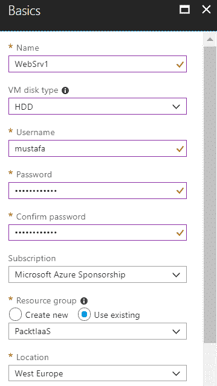

# Azure 虚拟机规格

创建虚拟机的第二步是选择虚拟机的规格。虚拟机的规格将决定三项内容——CPU 数量、内存大小以及操作系统磁盘类型。由于在第一步中也选择了磁盘类型，这将缩小可用选项范围。虚拟机规格有三个不同的定价层级：

+   基础

+   标准

+   低优先级

基础层虚拟机用于`开发/测试`环境，尽管它们与标准层虚拟机在性能上相似，但有一些限制。它们的 IOPS 比标准层虚拟机低，并且不支持负载均衡或自动扩展。

标准层虚拟机用于生产环境，提供更好的 CPU 和 IOPS 性能。

低优先级虚拟机根据 Azure 数据中心中空闲和未使用的资源分配。它们价格较低，但可能随时不可用，因为微软 Azure 可能会回收这些资源以满足更高优先级的请求。它们主要用于批处理和随机任务。

但定价层级并不是唯一决定虚拟机价格的因素。每个层级都有不同的大小，提供一定数量的 CPU 和内存；数量越高，价格越高。

标准层根据虚拟机的用途有额外的类别：

+   一般用途

+   计算优化型

+   内存优化型

+   存储优化型

+   GPU

+   高性能计算

这些大部分都不难理解，一般用途虚拟机有平衡的 CPU 与内存比例，计算优化型有更多的 CPU，内存优化型有更多的内存，存储优化型有最佳的 IOPS。GPU 是专门用于重型图形渲染和视频编辑的虚拟机。高性能虚拟机至少有八个虚拟 CPU，并使用 DDR4 内存。

虚拟机的大小还决定了可以附加到虚拟机的网络接口卡（NIC）的数量。

这个数量从一个到八个不等，具体取决于用途和大小。

可以在以下截图中查看选择虚拟机大小的选项：

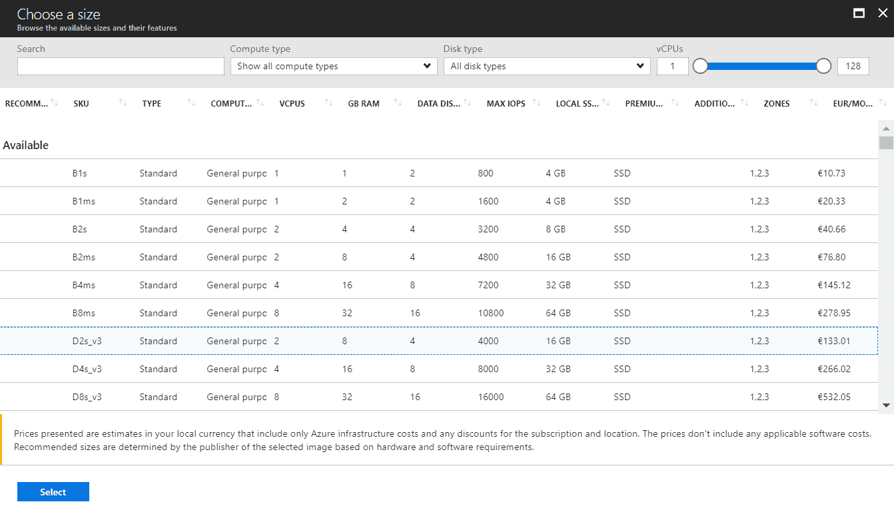

# 高级虚拟机选项

第三部分提供了配置许多额外设置的选项。在上一章中，我们只关注了网络部分，但这一次我们将更仔细地探索这些选项。

高可用性部分提供了两个选项——可用性区域和可用性集。

可用性区域决定了 Azure 数据中心内的区域。这些区域有独立的电源、网络和冷却系统，能够保护你的虚拟机免受数据中心内故障的影响。如果你有需要在多个虚拟机上运行的关键服务，你应该将这些虚拟机放置在不同的可用性区域中，这样如果数据中心级别发生故障，所有虚拟机受到影响的可能性就会减少。

可用性集在主机级别做类似的事情，确保你的虚拟机分布在多个物理服务器、计算机机架、存储单元和网络交换机上。如果发生硬件故障，所有虚拟机受到影响的可能性较小。

请注意，这些可用性选项在后续不能更改。在创建过程中需要定义可用性区域和可用性集。如果你计划设计高可用性解决方案和服务，这一点特别重要。

我将把这个虚拟机放入名为（new）WebSet 的可用性集，因为我打算稍后使用它。

存储选项允许我们选择磁盘类型和使用托管磁盘。磁盘类型选项与之前一样，我们可以选择 HDD 或 SSD。根据所选择的虚拟机大小，并非所有类型的磁盘都可以在此处选择。如果你想选择一个不可用的选项，你需要返回并选择一个不同的虚拟机大小。

使用托管磁盘可以让我们的工作变得更加轻松。这个选项自 2017 年 2 月起提供，在此之前，我们需要自己管理存储。创建一个磁盘实际上是创建一个存储账户，我们需要管理该存储。使用托管磁盘后，我们不必关心这些，所有的管理都会自动完成。虽然存储依然会被创建，但如果选择使用托管磁盘，一切都会在后台处理，无需用户操作。尤其是在扩展虚拟机（或虚拟机规模集）时，这个功能特别有用。托管磁盘还引入了一些非常实用的功能，如快照和备份。我强烈建议使用托管磁盘，因为它可以帮助你获得更好的性能，且管理更简便。

高可用性和磁盘设置可以在下面的截图中看到：

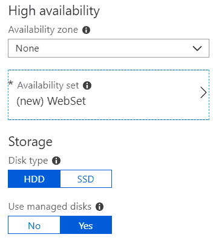

网络选项在前一章中已经讨论过，但我们快速回顾一下这里的选项。我们可以选择虚拟网络（VNet）、该 VNet 上的子网以及虚拟机的公共 IP 地址。最后一个网络选项是选择**网络安全组**（**NSG**）用于虚拟机。在下面的截图中，你可以看到我选择了 PacktVNet 和 DMZ（10.1.1.0/24）子网。由于我打算将其作为 Web 服务器使用，所以为我的新虚拟机创建了一个新的公共 IP 地址。由于我已经在 DMZ 子网上应用了 NSG 规则，我不想在虚拟机级别单独设置 NSG。这将帮助我简化管理，并保持所有虚拟机上的标准化规则，因此我会像下面这样保持 NSG 字段为空：

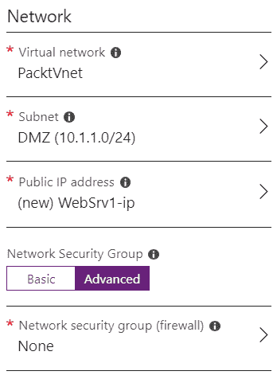

扩展功能使我们可以为虚拟机添加额外的功能。你可以从预设的软件中选择，或者执行自定义脚本来安装额外的软件或功能。

自动关机可以帮助你节省计算时长，如果你不需要虚拟机 24 小时运行。例如，如果这是一个`dev`环境，且下班后没有人使用它，你可以设置自动关机，每天在下午 5 点关机，这样你就不用为它支付夜间费用。当然，如果这是一个生产环境中的 Web 或数据库服务器，那就不建议使用这个选项。

监控可以启用启动诊断和客户操作系统监控。这是默认情况下提供的基本监控选项之外的功能。启用这两个选项需要一个存储账户来存储日志。避免使用虚拟机磁盘的存储，因为这可能导致性能问题。如果虚拟机在磁盘层面出现性能问题，这将生成更多日志，这些日志将进一步增加存储的负载。这会导致更多的磁盘问题，进入一个无法分辨问题是由磁盘还是日志引起的无限循环。

最后的选项是托管服务标识和备份。托管服务标识允许你使用 Azure Active Directory 来管理虚拟机，而备份将创建一个额外的备份服务（Azure 备份）。这两个服务将在后续章节中详细讨论。

以下截图显示了扩展、自动关机、监控、托管服务标识和备份的选项：

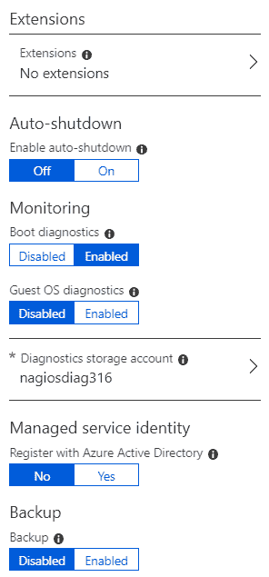

最后，我们可以开始部署，几分钟后便可以开始使用我们的虚拟机。如前所述，创建新虚拟机所需的时间可能取决于虚拟机的大小和 Azure 数据中心中的资源可用性。

# 管理 Azure 虚拟机

部署完成后，我们可以看到已经创建了四个不同的资源——`虚拟机`、`磁盘`、`网络接口`和`公共 IP 地址`。`公共 IP 地址`是可选的，如果你打算仅使用私有 IP 地址并通过 VPN 管理虚拟机，则不需要创建公共 IP 地址。如果没有选择托管磁盘，那么这里也会有一个存储账户，用来存放磁盘，如下所示：

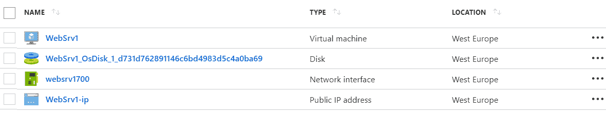

每一个这些资源都有不同的管理选项。我们已经看过了 IP 地址和 NIC 的选项，稍后我们会探讨磁盘和存储的选项。目前，让我们集中关注虚拟机以及可用的管理选项。

# 虚拟机设置

在虚拟机刀片下，我们有多个选项，如设置、操作、监控和支持。在设置下，我们还有多个选项：网络、磁盘、大小、安全、扩展、可用性集和配置。属性、锁和自动化脚本也适用于所有其他 Azure 资源。请注意，我们这里还有“持续交付（预览）”。预览功能仍在开发中，不能用于生产环境。测试是可以的，但在这些功能正式发布之前，最好不要依赖它们。在这种情况下，持续交付（预览）允许我们连接到 VSTS 项目，并简化 CI/CD 流程。

这里的一些选项与虚拟机创建过程中的选项类似。大小允许我们随时打开刀片，选择不同的虚拟机大小。请注意，要完成此过程，虚拟机需要重启。扩展可以用来添加软件或执行自定义脚本，与之前一样。可用性集仅供参考，因为此设置需要在虚拟机创建时定义。安全性和配置将是我们接下来章节的重点，暂时我们将这些设置保留为默认值。

网络选项为我们提供了关于虚拟机所有网络信息的概览。我们可以看到网卡信息、与虚拟机关联的地址、与虚拟机关联的网络安全组以及所有的 NSG 规则。我们可以在此处附加额外的网卡，并添加额外的 NSG 规则。请注意，在下面的截图中，NSG 应用于子网级别。如果对 NSG 进行更改，这些更改将应用于该子网中的所有虚拟机，因此需要小心。例如，如果这个子网有多个虚拟机，并且我们想为其中的某一个虚拟机允许 RDP 访问，创建这个规则将导致所有虚拟机都可以通过 RDP 访问：

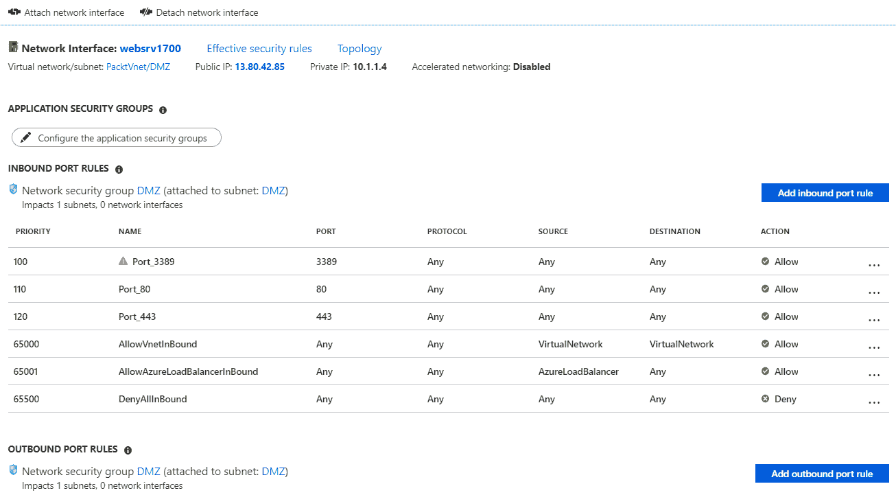

在磁盘刀片下，我们可以看到与虚拟机关联的所有磁盘。操作系统磁盘无法更改，但可以添加或移除数据磁盘。以下截图展示了磁盘刀片的示例：

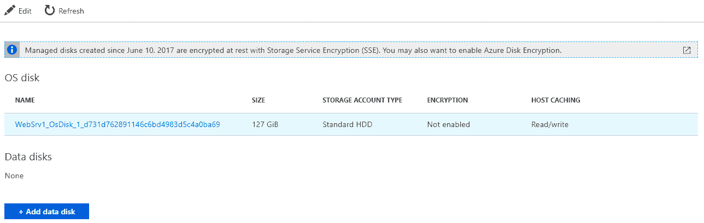

# Azure 虚拟机操作与监控

操作（OPERATIONS）和监控（MONITORING）为我们提供了更多的 Azure 虚拟机管理和操作选项。在操作（OPERATIONS）中，我们有自动关机、备份、灾难恢复、更新管理、清单、变更跟踪和运行命令。我们将现在解释自动关机和运行命令，但这些其他功能需要额外的服务，稍后我们会介绍。

我们在监控（MONITORING）方面有类似的情况，我们现在将介绍“指标”和“警报（经典）”，而其他服务将在后续章节中讲解。

自动关机选项使您可以安排在 Azure 中关闭虚拟机。如前所述，如果我们不需要虚拟机全天运行，这个选项可以帮助我们节省开销。此功能旨在用于 `dev/test` 环境，而不适用于生产环境。

然而，我也见过一些人将其用于只在工作时间需要的应用程序。在这种情况下，自动关机用于在特定时间关闭虚拟机，并使用 Azure 自动化在工作时间开始前启动虚拟机。除此之外，我们还可以在虚拟机关闭前发送通知，以告知使用该虚拟机的人员即将关闭。我们可以使用电子邮件或 Webhook 进行通知。以下截图展示了 `run` 脚本选项。我们可以使用各种预设脚本，如 `EnableAdminAcount`、`SetRDPPort`、`ResetAccountPassword` 等等，或者执行自定义脚本。脚本执行选项可以在以下截图中看到：

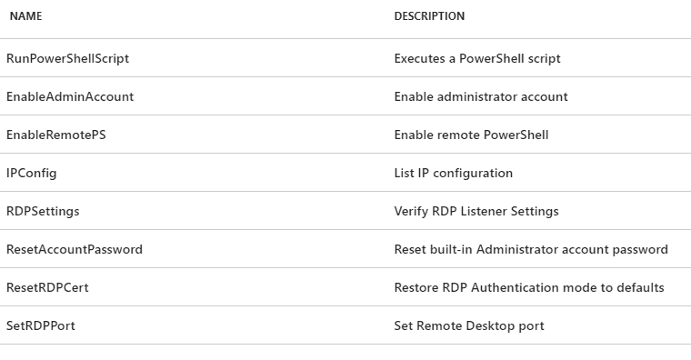

运行命令可以直接通过门户完成。这在我们无法以其他方式访问虚拟机时（例如，通过移动设备或没有 PowerShell 的机器）非常有用。以下截图展示了启用 `PSRemoting` 的脚本执行示例：

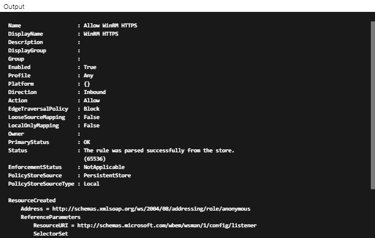

这里还有一个脚本，用于在 Azure 虚拟机上启用 `PSRemote`：

```
Enable-PSRemoting -Force
New-NetFirewallRule -Name "Allow WinRM HTTPS" -DisplayName "WinRM HTTPS" -Enabled True -Profile Any -Action Allow -Direction Inbound -LocalPort 5986 -Protocol TCP
$thumbprint = (New-SelfSignedCertificate -DnsName $env:COMPUTERNAME -CertStoreLocation Cert:\LocalMachine\My).Thumbprint
$command = "winrm create winrm/config/Listener?Address=*+Transport=HTTPS @{Hostname=""$env:computername""; CertificateThumbprint=""$thumbprint""}"
cmd.exe /C $command
```

监控您的 Azure 资源在多个方面都很重要。它使您能够查看资源的消耗情况，并相应地规划定价层级。如果监控显示您的资源工作负载处于某个百分比以下，可能是时候降低资源层级了。如果情况相反，您的资源长期处于高负载，可能需要更高的层级。提供了许多不同的指标，但对于 CPU 和内存监控，您需要启用客户级别的监控。指标让我们可以根据不同的时间周期改变不同的度量值。下面的截图展示了一个示例，您可以看到过去一小时磁盘 `读` 和 `写` 操作的图表：

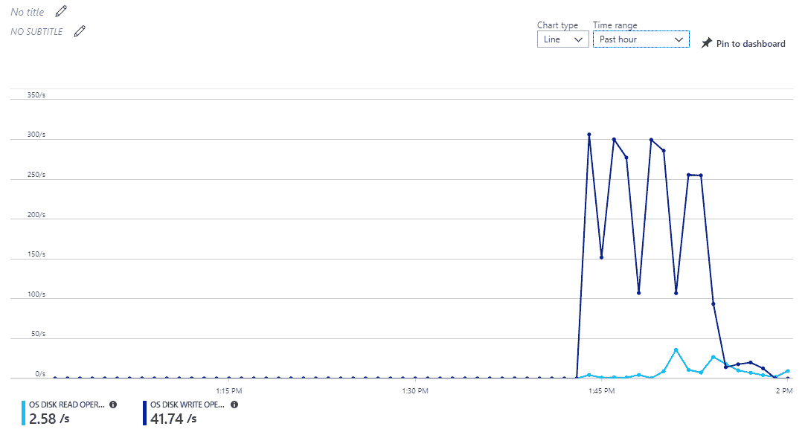

警报是 Azure 资源管理的重要组成部分，可以在关键时刻救命。在警报中，您可以创建自定义规则，如果激活了定义的触发条件，将通知您。例如，您可以设置警报，当 CPU 使用率在超过 5 分钟的时间段内达到 90% 时，会通知您。类似于自动关机，您可以通过电子邮件或 Webhook 发送通知。

以下截图展示了这个示例：

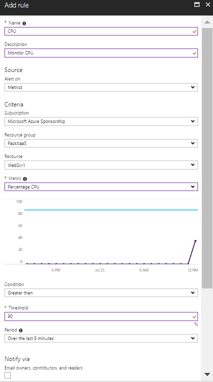

除了发送通知外，还可以通过使用运行手册或逻辑应用程序设置警报，以触发自定义操作。两者都是在需要时执行自定义操作的强大工具。逻辑应用程序通过工作流图使其易于使用，您可以拖放需要执行的操作，以进行一些维护任务或解决问题。运行手册需要一个 Azure 自动化帐户，并且可以根据预定义的计划或使用自定义脚本执行操作。大多数管理员发现运行手册更有用，因为它们允许您使用 PowerShell 执行任何类型的操作。依我看，两者都非常有用，但管理员更熟悉运行手册，因为他们可以使用 PowerShell，这是他们用于本地管理的工具：

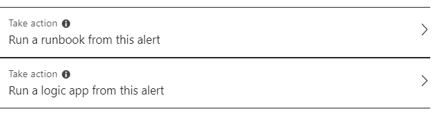

如果我们选择通过运行手册执行某个操作，我们可以选择用户定义的操作或内置操作。使用用户定义的操作时，您需要选择一个自动化帐户，并在该帐户中选择要执行的自定义运行手册。这可以是任何类型的脚本，将在您的 Azure 虚拟机上执行。

内置操作提供了五个选项：重启虚拟机、停止虚拟机、扩展虚拟机、缩减虚拟机和移除虚拟机。以下是一个运行手册配置的示例，其中列出了内置运行手册：

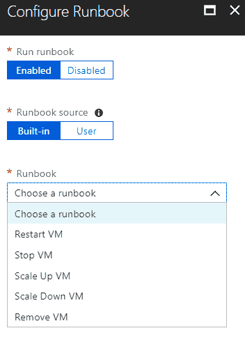

这些操作大多数是显而易见的，但请注意你有**扩展虚拟机**和**缩减虚拟机**选项。这允许我们根据需求对资源进行扩展或缩减。云计算的一个好处就是按需付费。因此，如果我们的虚拟机在 90% 的时间里能够处理工作负载，但工作负载偶尔会有高峰，我们就应该避免仅为了满足高峰期而支付更多费用。如果我们为了应对高峰工作负载而永久性地扩展虚拟机，我们就需要支付更多费用，而此时的虚拟机并未充分利用，在 90% 的时间里可能一台价格较低的虚拟机就能应对所有工作负载。设置**扩展虚拟机**规则可以让你在 CPU 达到 90% 时将虚拟机大小调整到更高的等级，这样就能在阈值达到时应对工作负载并按需增加虚拟机大小。为了充分利用 Microsoft Azure 提供的功能，你需要在另一方向创建一个类似的规则，以便在工作负载减少时进行缩减。当只创建扩展规则时，虚拟机的费用会增加，你最终会支付更多费用。为了防止这种情况，你可以创建一个规则，当 CPU 低于 40% 时执行**缩减虚拟机**操作，并将虚拟机恢复到原始大小。通过这种方式，你只会在工作负载高峰时支付更多费用，而在工作负载不高时支付更少的费用。

**支持 + 故障排除**部分为我们提供了一些额外的选项。资源健康和新的支持请求是所有 Azure 资源都有的选项。第一个选项可以在 Azure 数据中心层面上提供有关虚拟机是否存在问题的信息，第二个选项则会将你带到提交 Azure 支持票据的表单。资源健康可以帮助你检查当资源的表现不如预期时的情况。这可以节省你故障排除的时间，避免你浪费精力去弄清楚发生了什么问题，实际上可能是数据中心层面出现了重大问题，而你无法采取任何行动。幸运的是，这种情况并不常见。

**启动诊断**功能允许你查看虚拟机当前的屏幕和串行日志。当虚拟机没有响应时，它可以非常有帮助，帮助你检查当前的状态。

使用**重置密码**选项，你可以重置虚拟机的密码，但前提是你知道正确的用户名。一旦你登录虚拟机后，还需要再次重置密码，因为这里使用的密码只是临时的。重置密码还提供了重置远程桌面服务配置的选项。

**串行控制台（预览版）**允许你通过浏览器访问 Windows 串行控制台。不过，这项功能仍处于预览阶段，所以你不应该过于依赖它。

**重新部署**是一个非常有趣的功能。如果你的虚拟机没有响应，且无法连接，你可以使用这个功能。重新部署虚拟机会将虚拟机迁移到 Azure 数据中心的另一台主机上，尝试解决你的问题。迁移会导致虚拟机重启，而虚拟机本来就没有响应，因此这并不算什么问题，且可能解决你遇到的问题。

这里列出的功能和选项是特定于 Azure 虚拟机的管理选项。虚拟机的管理将继续使用标准管理员工具。我们可以通过 RDP 连接到虚拟机并执行任何我们需要的任务。我们可以为虚拟机安装角色和功能，添加任何第三方软件或我们的自定义软件。其他管理工具，如**远程服务器管理工具**（**RSAT**）或 PowerShell，也是可选的。

# Azure 负载均衡器

部署 Azure 虚拟机是第一步，但商业关键服务和应用程序怎么办呢？对于这些服务，我们可能希望设计高度可用的解决方案，确保**服务级别协议**（**SLA**）和运行时间达到最佳。

这一过程的第一步必须在创建虚拟机时完成，设置可用性区域和可用性集。接下来，我们将在解决方案中添加另一台虚拟机，并选择不同的可用性区域以及相同的可用性集。这将确保虚拟机被放置在 Azure 数据中心的不同区域，并且不依赖于相同的电源、网络和冷却设施。如果 Azure 数据中心出现问题，两个虚拟机受到影响的可能性较小。

设置相同的可用性集将确保虚拟机（VM）被放置在不同的物理服务器、计算机机架、存储单元和网络交换机上。如果发生硬件故障，两个虚拟机同时受到影响的可能性较小。可用性集还会确保微软永远不会进行同时影响两个虚拟机的维护。为了保持 Azure 数据中心的安全并确保最佳性能，必须定期执行维护任务，安装主机更新或升级硬件固件。将虚拟机放入可用性集意味着这些虚拟机是为了实现高可用性而设置的，维护将考虑到这一点，并确保不会同时影响所有虚拟机。

因此，为了实现高可用性，我们需要至少设置两台虚拟机。但流量该如何处理呢？我们如何确定流量是流向第一台还是第二台虚拟机？如果第一台虚拟机不可用，我们如何将流量引导到第二台虚拟机？

这就是 Azure 负载均衡器发挥作用的地方。这是 Azure 的一项网络服务，我们之前略过了它，稍后会在合适的时机进行解释。后续章节中也会有类似的情况。Azure 负载均衡器将前端流量分配到后端池实例。它们可以支持传入和传出场景，具有低延迟和高吞吐量。在这种场景下，传入流量会到达负载均衡器的 IP 地址，然后负载均衡器会将流量分配到配置在后端池中的虚拟机。Azure 负载均衡器可以是内部的或公共的，具体取决于我们需要分配哪种类型的流量。对于 Web 服务器角色，我们可能希望使用公共负载均衡器。但对于数据库服务器，我们可能希望使用内部负载均衡器，因为我们不希望数据库暴露在互联网上。

# 创建一个 Azure 负载均衡器

要创建一个新的 Azure 负载均衡器，我们需要选择创建一个新资源，并从列表中选择 Azure 负载均衡器。这将打开创建负载均衡器的界面，在此界面中我们需要提供基本信息。

所有资源共有的信息包括名称、订阅、资源组和位置。

Azure 负载均衡器特有的选项包括类型、SKU 和公共 IP 地址。

负载均衡器的类型可以是内部的或外部的，具体取决于您希望路由哪种类型的流量。公共类型必须配置公共 IP 地址，并且我建议您为该 IP 地址配置静态 IP。您还可以选择启用 Azure 负载均衡器的公共 IPv6，而公共 IPv4 是默认设置。

**库存单位**（**SKU**）可以是 Basic 或 Standard。Standard 提供更多的选项和功能，但其价格是基于负载均衡规则的数量来形成的。另一方面，Basic 是免费的，唯一的费用来自于预留公共 IP 地址和外发流量。

创建新的 Azure 负载均衡器所需信息的示例如下图所示：

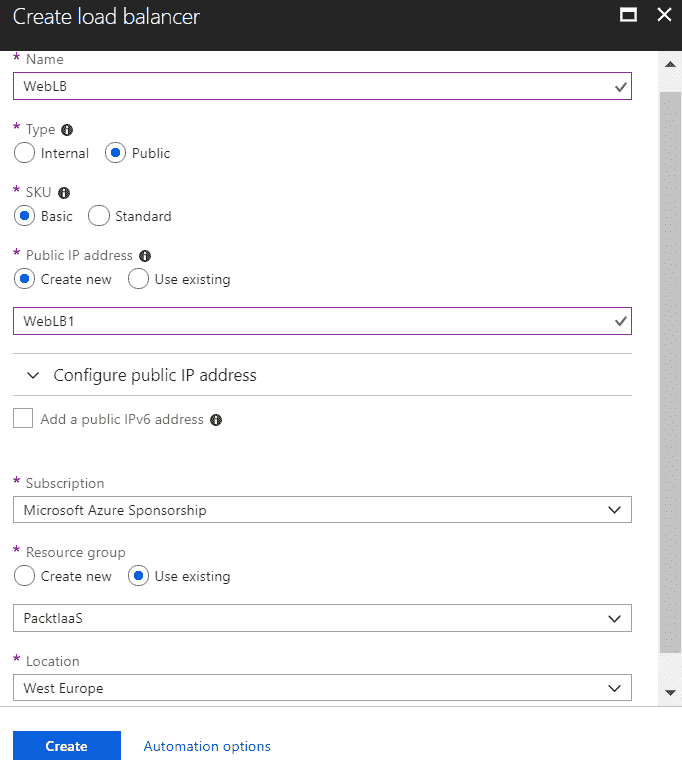

大多数 Azure 网络功能的部署时间都在一分钟以内，Azure 负载均衡器也不例外，部署过程应该非常快速。

# 配置 Azure 负载均衡器

在 Azure 负载均衡器部署完成后，我们可以进入资源并查看不同的选项。设置项对我们最为重要，我们需要它来配置我们的负载均衡器。我们可以找到所有 Azure 资源共有的标准设置，如属性、锁定和自动化脚本。前端 IP 配置使我们能够管理与负载均衡器关联的 IP 地址，添加新的 IP 地址或移除现有的 IP 地址。其他设置将用于配置负载均衡器以分配传入流量，并配置该流量应该被定向到哪里。

首先，我们需要为负载均衡器配置后端池。我将选择将我的负载均衡器与一个可用性集关联。在本章前面，我创建了一台名为 `WebSrv1` 的虚拟机，并将其与名为 `WebSet` 的可用性集关联。然后，我添加了一个名为 `WebSrv2` 的相同虚拟机，并将其添加到相同的可用性集中。因此，我有两台相同的虚拟机在同一个可用性集中，并且将我的 Azure 负载均衡器与这个可用性集关联。最后，我们需要定义将要使用的网络 IP 配置，并设置它以使用该可用性集中这两台虚拟机。如果我们在此可用性集中有更多虚拟机，还可以设置更多的 IP 配置来进行目标选择。如何设置后端池的示例可以在这张截图中看到：

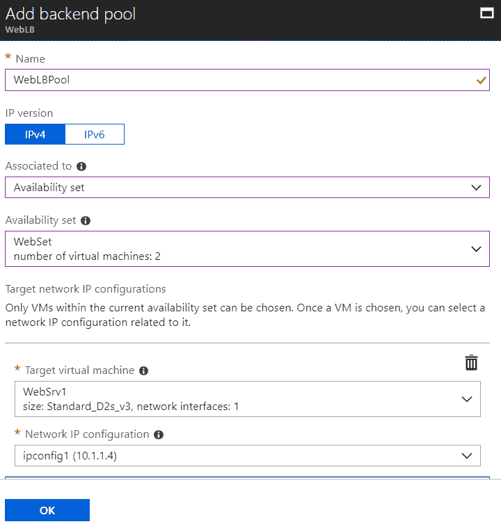

第二步是设置健康探测。我们需要定义协议、端口、间隔和不健康阈值。协议和端口将定义需要监控的内容。由于我打算使用 `WebSrv1` 和 `WebSrv2` 作为 Web 服务器，我将设置对 `80` 端口的监控。间隔将定义检查的频率，以确保服务器响应。阈值定义了多少个连续的检查未能成功联系到服务器时，将其声明为无响应。如何在 `80` 端口上设置健康探测的示例可以在这张截图中看到：

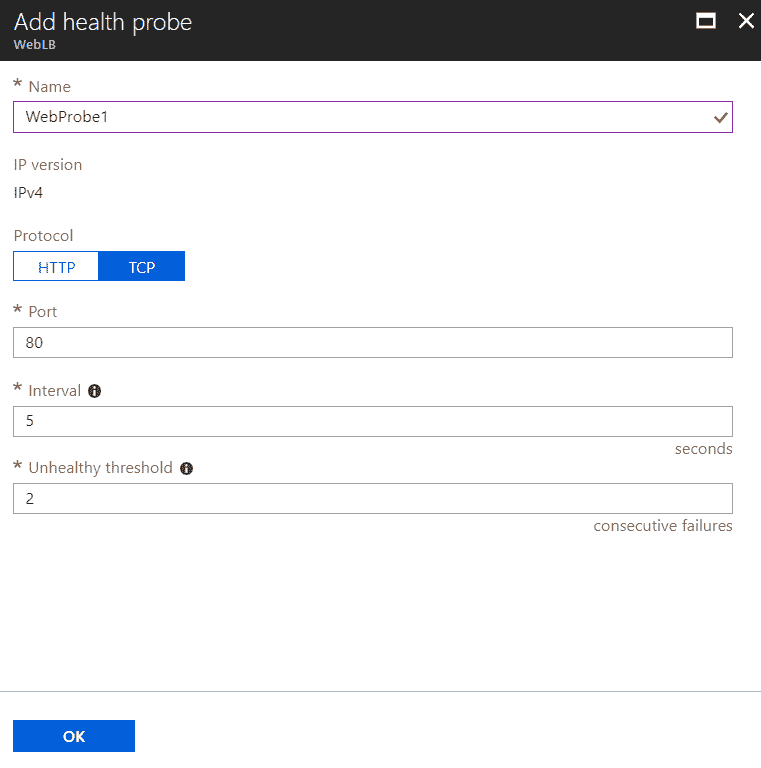

由于我想使用 Web 服务器角色，我将在 `443` 端口上重复相同的操作。在这里的截图中，我们可以看到两个探测都已创建，但“使用者”信息为空：

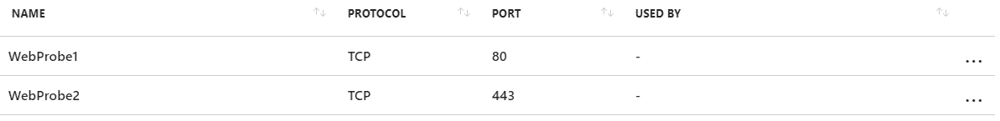

第三步是创建负载均衡规则。我们需要提供名称、IP 版本、前端 IP 地址、协议、前端端口、后端端口、后端池、健康探测、会话保持性和空闲超时（分钟）。名称和 IP 版本是显而易见的选项，因此我们直接跳到其他选项。

对于前端 IP 地址，你可以选择任何一个负载均衡器的 IP 地址，因为它可以与多个 IP 地址关联。根据选择的 IP 版本，存在一些关于可以选择的 IP 地址的限制。如果 IP 版本设置为 IPv4，则只能选择 IPV4 地址。如果选择了 IPv6，则只能选择与负载均衡器关联的同一版本的 IP 地址。

协议和端口已连接，通过此选项，你可以选择需要从定义的端口转发到定义的后端端口的协议。例如，TCP 协议的 `80` 端口应转发到 `80` 端口。

通过后端池，我们定义了流量的转发目标。由于在一个 Azure 负载均衡器中可以有多个后端池，你可以选择这些池中的任何一个。

必须选择健康探测，以便检查虚拟机的状态。你需要选择执行检查的探测器，检查你正在创建的规则中使用的后端端口。

会话保持和空闲超时（分钟）选项与客户端连接的处理方式相关。由于您的后端池中至少有两台虚拟机，因此您需要设置流量在一个会话期间由同一台虚拟机处理。如果您选择来自相同客户端 IP 地址、相同协议的流量，这将保持会话活动。只要会话处于活动状态，客户端将被定向到同一虚拟机。

空闲超时（分钟）决定如果没有采取任何操作，会话将保持活动多长时间。默认值为 4 分钟，但可以更改为最多 30 分钟。通过此设置，您可以确定如果客户端没有使用应用程序并且没有发送任何消息以保持会话活动，连接将保持多长时间。

浮动 IP（直接服务器返回）地址的选项默认情况下是禁用的，应该仅在 SQL AlwaysOn 可用性监听器中使用。

在此屏幕截图中，您可以看到设置负载均衡规则 HTTP 的选项：

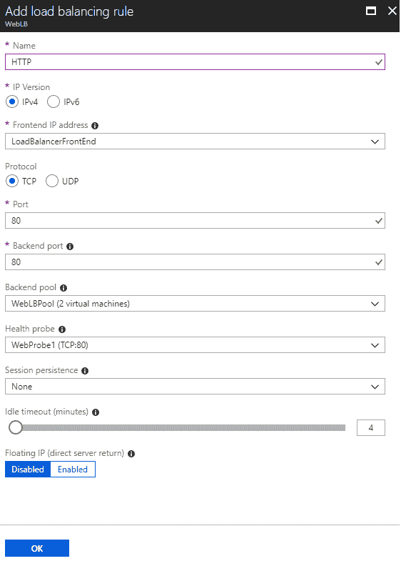

我将为端口`443`创建另一个名为 HTTPS 的规则。请注意，在此屏幕截图中，之前创建的探测现在被负载均衡规则使用：

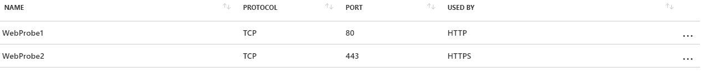

负载均衡器设置中的最后一个选项是入站 NAT 规则。它具有与负载均衡规则类似的选项，唯一的区别是，在这种情况下，流量不是转发到后端池，而是转发到单个虚拟机。在此屏幕截图中，您可以看到如何设置一个入站 NAT 规则，该规则将流量从端口 `5589`（WinRM）转发到 WebSrv1：

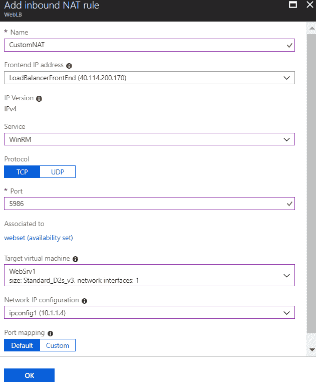

那么，让我们回顾一下通过设置负载均衡器和可用性集所取得的成果。我们在后端池中有两台虚拟机作为 Web 服务器。虚拟机被放置在不同的可用性区域和相同的可用性集中，以增加至少一台虚拟机运行的机会。健康探测会检查虚拟机是否在定义的端口上可用。如果任何一台虚拟机连续两次未响应，它将被标记为失败。已经设置了一个负载均衡规则，将通过负载均衡器公共 IP 地址传入的流量转发到后端池。如果后端池中的两台虚拟机都健康，流量将根据轮询规则转发。如果健康探测将任何虚拟机标记为未响应，所有流量将转发到健康状态的虚拟机。基于客户端 IP、协议和空闲超时，保持会话存活。来自相同 IP 地址的会话，只要每隔 4 分钟发送一次保持活动信号，将会被转发到相同的虚拟机。

这将确保我们的应用程序始终运行，即使某个虚拟机发生故障。故障可能是由于 Azure 数据中心的硬件或网络错误引起的（可用性区域和可用性集确保两个虚拟机不会受到影响）。将更多虚拟机放入可用性集和后端池可以增加至少一个虚拟机正常运行的机会。

# Azure 负载均衡器 ARM 模板

这是创建一个新的 Azure 负载均衡器的 ARM 模板：

```
{
"$schema": "http://schema.management.azure.com/schemas/2015-01-01/deploymentTemplate.json#",
"contentVersion": "1.0.0.0",
"parameters": {
"name": {
"type": "string"
},
"location": {
"type": "string"
},
"sku": {
"type": "string"
},
"publicIPAddressName": {
"type": "string"
}
},
"resources": [
{
"apiVersion": "2017-08-01",
"name": "[parameters('name')]",
"type": "Microsoft.Network/loadBalancers",
"location": "[parameters('location')]",
"sku": {
"name": "[parameters('sku')]"
},
"dependsOn": [
"[concat('Microsoft.Network/publicIPAddresses/', parameters('publicIPAddressName'))]"
],
"properties": {
"frontendIPConfigurations": [
{
"name": "LoadBalancerFrontEnd",
"properties": {
"publicIPAddress": {
"id": "[resourceId('test', 'Microsoft.Network/publicIPAddresses', parameters('publicIPAddressName'))]"
}
}
}
]
}
},
{
"apiVersion": "2017-08-01",
"type": "Microsoft.Network/publicIPAddresses",
"name": "[parameters('publicIPAddressName')]",
"location": "[parameters('location')]",
"sku": {
"name": "[parameters('sku')]"
},
"properties": {
"publicIPAllocationMethod": "Dynamic",
"publicIPAddressVersion": "IPv4"
}
}
]
}
```

# Azure 虚拟机规模集

弹性是云计算的一大优势。我们可以根据工作负载和需求进行扩展和缩减。如果工作负载增加，我们就扩展；如果工作负载减少，我们就缩减。采用按需付费和按分钟计费的定价模式，这使我们能够节省成本。

我们已经解释了如何在 Microsoft Azure 中设置虚拟机的扩展和缩减。扩展和缩减是指将虚拟机的大小调整为更大或更小的实例。这被称为垂直扩展。这种方式非常有用，但也有一个后果——每次更改虚拟机大小时，都会发生重启。因此，垂直扩展可以增加虚拟机的大小以处理更多的工作负载，但它总会在虚拟机重启期间导致停机。

解决方案是横向扩展，对于 Azure 虚拟机，我们可以使用 Azure 虚拟机规模集。与其调整虚拟机的大小，规模集通过创建虚拟机的额外实例，并使用 Azure 负载均衡器将工作负载分配到这些实例上。这个过程称为横向扩展。该方法类似于高可用性场景，但不同之处在于，规模集不是在可用性集中创建多个虚拟机，而是根据工作负载启动虚拟机，并且仅在需要时启动它们。另一个区别是，在可用性集中，虚拟机是独立的，一个虚拟机的问题不会影响到其他虚拟机。而在规模集中，所有虚拟机都复制了主虚拟机，如果主虚拟机出现故障，问题将反映到整个规模集。我们需要指出，规模集并不是一个高可用性解决方案，而是基于工作负载的横向扩展。

# 创建一个 Azure 虚拟机规模集

让我们创建一个新的 Azure 虚拟机规模集，并在过程中解释所有细节。

要创建一个新的 Azure 虚拟机规模集，所有信息都在一个屏幕中提供。为了让它更加清晰可见，我将屏幕分为三张图片——基本信息和实例、自动缩放、以及网络配置。

规模集的基本信息与虚拟机的基本信息非常相似。这是合乎逻辑的，因为规模集首先创建一个主虚拟机，然后克隆该虚拟机以进行横向扩展。我们需要提供虚拟机规模集名称、操作系统磁盘映像、订阅、资源组、位置、用户名、密码，并可以选择添加可用性区域。

接下来，我们创建实例规则。这将决定规模集中的虚拟机（VM）的大小以及规模集允许创建的实例数量。对于 Azure 提供的操作系统镜像，允许的最大实例数为 1,000 个；对于自定义操作系统镜像，最大实例数为 300 个。如果应用程序出现问题，并且应用程序本身导致 CPU 或内存过高，这将导致规模集扩展并创建新的实例。由于新实例是主虚拟机的完全副本，因此问题将在这些虚拟机上持续存在，扩展将继续，直到达到最大实例数。重要的是要设置实例数量为您实际准备支付的数量，因为即使是短时间内启动 1,000 个虚拟机也可能带来巨大的财务影响。

将规模集虚拟机部署为低优先级虚拟机可以为您节省最多 80% 的费用。低优先级虚拟机使用 Azure 数据中心中分配的未使用资源创建，但这些资源可以被更高优先级的资源抢占，并且可能随时不可用。因此，尽管此选项可以帮助您节省大量费用，但资源在需要时可能无法提供。此选项不应用于需要随时可用的服务，或关键服务。建议仅将低优先级用于低优先级服务或批处理任务。

规模集创建了多个虚拟机实例，并且所有这些虚拟机都有各自的磁盘。在扩展过程中管理这些磁盘和存储账户，尤其是当我们启动 1,000 个实例时，可能会非常具有挑战性。我建议使用 Azure 自动管理的托管磁盘，这样您就不必担心这一部分。

基本设置和实例设置的示例如下图所示：

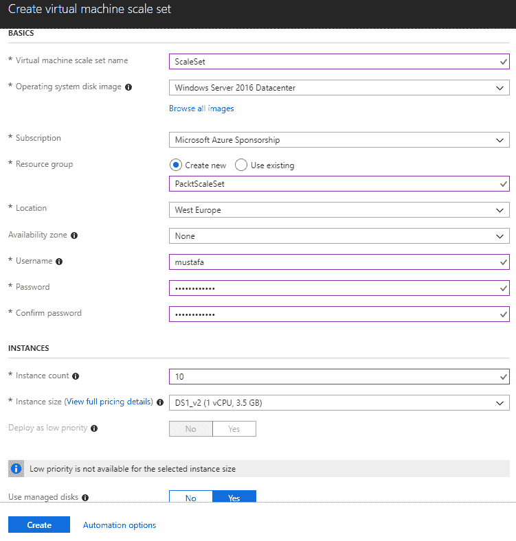

自动扩展创建了一组规则，定义了规模集如何进行扩展和收缩。我们需要设置规模集中的虚拟机最小和最大数量。最大数量会根据之前设置的实例数量自动收集，但不一定必须相同。实例数量决定了最初要创建多少虚拟机，而最大数量则决定了可以创建多少虚拟机。

我们创建了扩展和收缩规则，这些规则将增加和减少规模集中的虚拟机数量。例如，如果 CPU 使用率达到 `75`%，则会启动额外的虚拟机。如果使用率降到 `25`%以下，则会减少规模集中的虚拟机数量。将添加/移除的虚拟机数量可以单独设置。

假设我们将虚拟机的最小数量设置为 `1`，实例数量设置为 `10`，最大虚拟机数量设置为 `100`。当扩展集创建时，它将创建 `10` 个虚拟机副本并只启动其中一个副本，作为主副本。当触发扩展阈值时，它将向扩展集添加一个新的虚拟机。这个虚拟机是最初创建的 `10` 个虚拟机之一。如果利用率继续上升，它将继续添加新的虚拟机，直到达到 10 个虚拟机。如果最大虚拟机数量与实例数量不同，则将创建并启动新的虚拟机。前 `10` 个虚拟机和后续虚拟机的区别在于，最初的虚拟机已创建，只需要启动。额外的虚拟机需要先进行配置，再启动，这使得扩展过程变得较慢。然而，即使虚拟机未运行，初始虚拟机也会产生费用，因为即使虚拟机关闭，您也需要为磁盘付费。最好在初始虚拟机数量和最大虚拟机数量之间找到一个平衡。自动扩展（AUTOSCALE）在以下截图中展示：

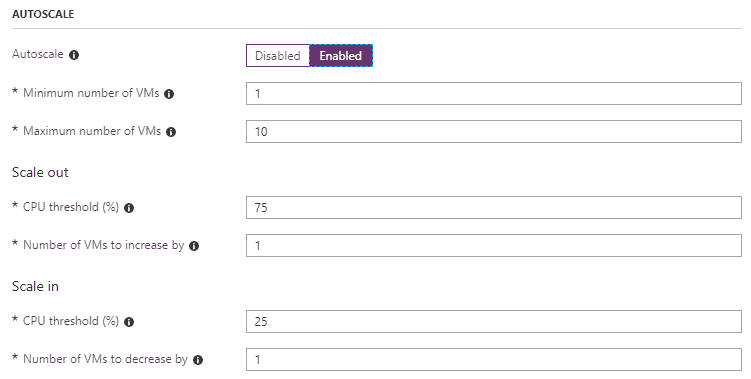

网络（NETWORKING）部分让我们可以选择应用程序网关（Application Gateway）和负载均衡器（Load balancer）之间的选项。无论选择哪一个，它将作为您的用户的终端，并自动将流量分配到 Azure 虚拟机扩展集中。Azure 虚拟机的负载均衡器是免费的，而应用程序网关按小时计费，但支持许多附加功能。应用程序网关支持 SSL 终止、基于 URL 的路由、多站点路由、基于 cookie 的会话亲和性、Web 应用防火墙和可路由的 IP 地址。

使用负载均衡器时，应用于可用性集和扩展集的负载均衡器的区别在于，扩展集不需要额外的管理（您可以选择设置额外的规则和设置，但这不是必需的）。负载均衡规则和将虚拟机添加到后端池的操作是自动完成的，用户无需任何操作。以下是使用 Azure 负载均衡器的网络设置示例，见下图：

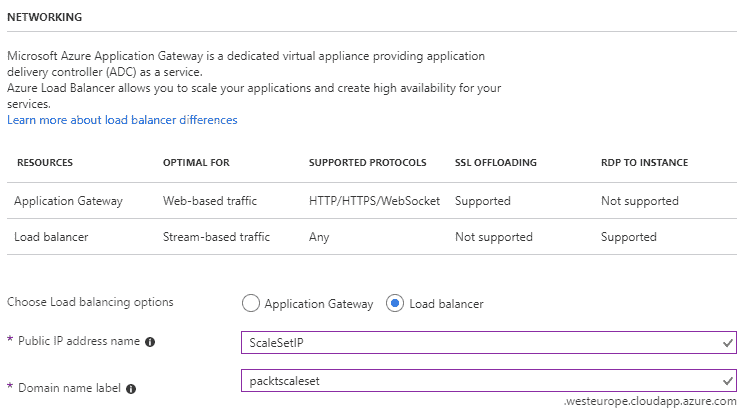

Azure 虚拟机扩展集的部署依赖于许多不同的参数。扩展集所需的网络服务必须在虚拟机之前部署，但这一过程非常快速。然后，虚拟机被部署，根据实例数量和虚拟机大小，这可能需要一些时间。部署少量大型实例可以相对快速完成，但如果部署数百个小虚拟机，可能需要长达一小时。

# 管理 Azure 虚拟机扩展集

部署完成后，会在我们的资源组中创建多个资源，我们可以看到虚拟机规模集以及一组与网络相关的资源。创建的网络资源包括负载均衡器、公共 IP 地址（由负载均衡器使用）、虚拟网络和网络安全组。NSG（网络安全组）应用于子网级别，并且 NSG 规则将对规模集中的所有虚拟机生效。这是合理的，因为所有虚拟机都是相同的，均由同一个应用程序使用，并且具有相同的用途。我们可以在这里的截图中看到为我们的规模集创建的所有资源：

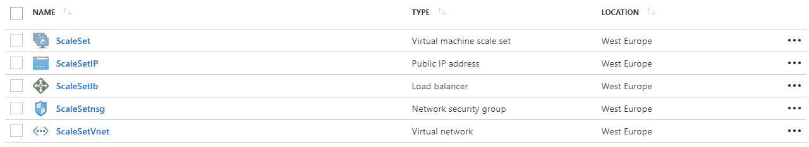

由于我们已经讨论过所有涉及的网络功能，接下来我们将重点关注虚拟机规模集以及用于管理它的选项。许多选项与虚拟机设置相同，例如大小、持续交付（预览版）、配置、属性、锁定和自动化脚本。对规模集独有的设置包括实例、扩展、存储和操作系统。操作系统仅供参考，我们只能看到如用于创建规模集的映像和操作系统版本等信息。

存储设置还为我们提供了有关所使用存储类型和磁盘的信息，并且只有一个可供选择的选项——缓存。可用选项包括无、只读和读/写。

实例选项卡显示了规模集中的所有虚拟机及其状态。我们可以看到哪些虚拟机正在运行，并执行不同的操作，如启动、停止、取消分配和删除。特别有趣的选项是重新映像和升级。重新映像将重置选定虚拟机的所有设置，并将其恢复为默认版本。升级将手动将选定虚拟机升级到最新的更改。规模集中的所有虚拟机都是主虚拟机的完全复制品，如果主虚拟机发生更改，这些更改将及时复制到所有实例。升级选项使我们能够手动执行升级，并立即强制应用更改。当规模集中有大量虚拟机时，这非常有用，因为复制更改需要时间，而更改可能需要尽快应用。然而，重新映像和升级选项都会在过程中重启虚拟机，因此也需要考虑这一点。最后，Azure 虚拟机规模集中独有的选项是扩展，但详细解释这一选项还需要一些时间。

扩展选项卡向我们展示了所有有效的扩展规则，这些规则适用于我们的规模集。如果规则是在部署过程中创建的，它们将显示在此处，我们可以编辑或删除它们。也可以创建附加规则，我们可以监控多个参数。例如，我们可以为 CPU、内存和磁盘使用率创建单独的规则。如果触发任何这些规则，它将执行相应的扩展或收缩过程。创建更多的扩展规则能为我们提供更好的灵活性和性能，因为我们不再依赖于单一的点。如果我们只监控 CPU，但遇到内存问题，则无法扩展，性能也会下降。如果我们监控内存，但磁盘使用率很高，同样不会发生自动扩展，性能也会下降：

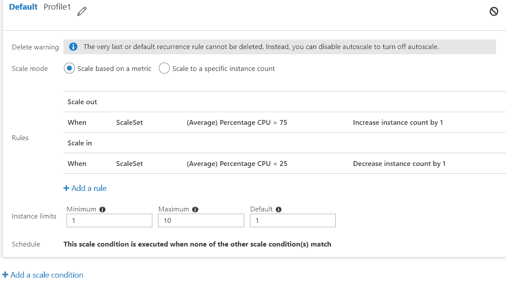

在讨论 Azure 虚拟机规模集时，有两点非常重要。规模集与可用性集是非常不同的。在可用性集中，我们保持一个固定数量的虚拟机，以提高至少一台虚拟机始终可用并实现高可用性的概率。规模集则监控工作负载，并根据需求增加虚拟机的数量，但所有虚拟机都是副本，任何问题都可能导致所有虚拟机都复制该问题。

另一个需要明确的事项是我们可以在什么场景下使用 Azure 虚拟机规模集。由于规模集中的所有虚拟机都是初始映像的副本，任何更改都会从初始映像同步到所有其他虚拟机。但这个过程是单向的，新增实例上的更改不会应用到其他地方。因此，Azure 虚拟机规模集不适合像 SQL Server 或 Exchange Server 这样的角色，这些角色要求更改必须应用到所有实例。相反，应将规模集用于应用场景，这些场景中的更改不是由用户会话引起的，且数据会随着时间的推移保持持久。

# Azure 虚拟机规模集 ARM 模板

此外，以下是用于部署新 Azure 虚拟机规模集的 ARM 模板：

```
{
 "$schema": "http://schema.management.azure.com/schemas/2015-01-01/deploymentTemplate.json",
 "contentVersion": "1.0.0.0",
 "parameters": {
 "vmSku": {
 "type": "string",
 "defaultValue": "Standard_D1",
 "metadata": {
 "description": "Size of VMs in the VM Scale Set."
 }
 },
 "vmssName": {
 "type": "string",
 "metadata": {
 "description": "String used as a base for naming resources. Must be 3-61 characters in length and globally unique across Azure. A hash is prepended to this string for some resources, and resource-specific information is appended."
 },
 "maxLength": 61
 },
 "instanceCount": {
 "type": "int",
 "metadata": {
 "description": "Number of VM instances (100 or less)."
 },
 "defaultValue": 2,
 "maxValue": 100
 },
 "adminUsername": {
 "type": "string",
 "metadata": {
 "description": "Admin username on all VMs."
 }
 },
 "adminPassword": {
 "type": "securestring",
 "metadata": {
 "description": "Admin password on all VMs."
 }
 }
 },
 "variables": {
 "vnetName": "vnet",
 "subnetName": "subnet",
 "subnetRef": "[resourceId('Microsoft.Network/virtualNetworks/subnets', variables('vnetName'), variables('subnetName'))]",
 "publicIPAddressName": "pip",
 "loadBalancerName": "loadBalancer",
 "loadBalancerFrontEndName": "loadBalancerFrontEnd",
 "loadBalancerBackEndName": "loadBalancerBackEnd",
 "loadBalancerProbeName": "loadBalancerHttpProbe",
 "loadBalancerNatPoolName": "loadBalancerNatPool"
 },
 "resources": [
 {
 "type": "Microsoft.Compute/virtualMachineScaleSets",
 "name": "[parameters('vmssName')]",
 "location": "[resourceGroup().location]",
 "apiVersion": "2017-03-30",
 "dependsOn": [
 "[concat('Microsoft.Network/virtualNetworks/', variables('vnetName'))]",
 "[resourceId('Microsoft.Network/loadBalancers', variables('loadBalancerName'))]"
 ],
 "sku": {
 "name": "[parameters('vmSku')]",
 "capacity": "[parameters('instanceCount')]"
 },
 "properties": {
 "overprovision": "true",
 "upgradePolicy": {
 "mode": "Manual"
 },
 "virtualMachineProfile": {
 "storageProfile": {
 "osDisk": {
 "createOption": "FromImage",
 "caching": "ReadWrite"
 },
 "imageReference": {
 "publisher": "MicrosoftWindowsServer",
 "offer": "WindowsServer",
 "sku": "2016-Datacenter",
 "version": "latest"
 }
 },
 "osProfile": {
 "computerNamePrefix": "[parameters('vmssName')]",
 "adminUsername": "[parameters('adminUsername')]",
 "adminPassword": "[parameters('adminPassword')]"
 },
 "networkProfile": {
 "networkInterfaceConfigurations": [
 {
 "name": "nic",
 "properties": {
 "primary": true,
 "ipConfigurations": [
 {
 "name": "ipconfig",
 "properties": {
 "subnet": {
 "id": "[variables('subnetRef')]"
 },
 "loadBalancerBackendAddressPools": [
 {
 "id": "[concat('/subscriptions/', subscription().subscriptionId,'/resourceGroups/', resourceGroup().name, '/providers/Microsoft.Network/loadBalancers/', variables('loadBalancerName'), '/backendAddressPools/', variables('loadBalancerBackEndName'))]"
 }
 ],
 "loadBalancerInboundNatPools": [
 {
 "id": "[concat('/subscriptions/', subscription().subscriptionId,'/resourceGroups/', resourceGroup().name, '/providers/Microsoft.Network/loadBalancers/', variables('loadBalancerName'), '/inboundNatPools/', variables('loadBalancerNatPoolName'))]"
 }
 ]
 }
 }
 ]
 }
 }
 ]
 }
 }
 }
 },
 {
 "type": "Microsoft.Network/virtualNetworks",
 "name": "[variables('vnetName')]",
 "location": "[resourceGroup().location]",
 "apiVersion": "2017-04-01",
 "properties": {
 "addressSpace": {
 "addressPrefixes": [
 "10.0.0.0/16"
 ]
 },
 "subnets": [
 {
 "name": "[variables('subnetName')]",
 "properties": {
 "addressPrefix": "10.0.0.0/24"
 }
 }
 ]
 }
 },
 {
 "type": "Microsoft.Network/publicIPAddresses",
 "name": "[variables('publicIPAddressName')]",
 "location": "[resourceGroup().location]",
 "apiVersion": "2017-04-01",
 "properties": {
 "publicIPAllocationMethod": "Dynamic",
 "dnsSettings": {
 "domainNameLabel": "[toLower(parameters('vmssName'))]"
 }
 }
 },
 {
 "type": "Microsoft.Network/loadBalancers",
 "name": "[variables('loadBalancerName')]",
 "location": "[resourceGroup().location]",
 "apiVersion": "2017-04-01",
 "dependsOn": [
 "[concat('Microsoft.Network/publicIPAddresses/', variables('publicIPAddressName'))]"
 ],
 "properties": {
 "frontendIPConfigurations": [
 {
 "name": "[variables('loadBalancerFrontEndName')]",
 "properties": {
 "publicIPAddress": {
 "id": "[resourceId('Microsoft.Network/publicIPAddresses', variables('publicIPAddressName'))]"
 }
 }
 }
 ],
 "backendAddressPools": [
 {
 "name": "[variables('loadBalancerBackendName')]"
 }
 ],
 "loadBalancingRules": [
 {
 "name": "roundRobinLBRule",
 "properties": {
 "frontendIPConfiguration": {
 "id": "[concat(resourceId('Microsoft.Network/loadBalancers', variables('loadBalancerName')), '/frontendIPConfigurations/', variables('loadBalancerFrontEndName'))]"
 },
 "backendAddressPool": {
 "id": "[concat(resourceId('Microsoft.Network/loadBalancers', variables('loadBalancerName')), '/backendAddressPools/', variables('loadBalancerBackendName'))]"
 },
 "protocol": "Tcp",
 "frontendPort": 80,
 "backendPort": 80,
 "enableFloatingIP": false,
 "idleTimeoutInMinutes": 5,
 "probe": {
 "id": "[concat(resourceId('Microsoft.Network/loadBalancers', variables('loadBalancerName')), '/probes/', variables('loadBalancerProbeName'))]"
 }
 }
 }
 ],
 "probes": [
 {
 "name": "[variables('loadBalancerProbeName')]",
 "properties": {
 "protocol": "Tcp",
 "port": 80,
 "intervalInSeconds": "5",
 "numberOfProbes": "2"
 }
 }
 ],
 "inboundNatPools": [
 {
 "name": "[variables('loadBalancerNatPoolName')]",
 "properties": {
 "frontendIPConfiguration": {
 "id": "[concat(resourceId('Microsoft.Network/loadBalancers', variables('loadBalancerName')), '/frontendIPConfigurations/', variables('loadBalancerFrontEndName'))]"
 },
 "protocol": "Tcp",
 "frontendPortRangeStart": 50000,
 "frontendPortRangeEnd": 50019,
 "backendPort": 3389
 }
 }
 ]
 }
 }
 ]
}
```

# 摘要

我们已经涵盖了基本的 IaaS 概念，以及如何设置 Azure 虚拟机。扩展 IaaS 场景的逻辑步骤是涵盖高可用性，我们通过 Azure 负载均衡器和可用性集成功地实现了这一目标。

云计算的一个关键概念是弹性和按需资源。我们展示了如何实现垂直扩展（通过警报和自定义操作）和水平扩展（通过 Azure 虚拟机规模集）。

在下一章中，我们将进入 PaaS 模型，并探索 Azure 应用服务，相比于 Azure 虚拟机，它提供了更抽象的模型。应用服务为我们提供了一些独特的选项，这些选项将帮助我们在云端之旅中取得进展，但相比虚拟机，它对基础设施的控制较少。我们将比较 IaaS 功能与 PaaS 的关系，并探索如何通过应用服务实现扩展和高可用性。

# 问题

1.  支持 Azure 虚拟机的最旧版本 Windows Server 是哪个？

    1.  Windows Server 2003

    1.  Windows Server 2008 R2 SP1

    1.  Windows Server 2012 R2

1.  基础层虚拟机支持什么？

    1.  较低的 IOPS

    1.  负载均衡器

    1.  自动扩展

1.  低优先级虚拟机的用途是什么？

    1.  高可用性

    1.  批处理

    1.  平衡的工作负载

1.  在 Azure 虚拟机刀片中设置大小用于...？

    1.  向上扩展

    1.  缩减规模

    1.  两者

1.  运行手册可以用于执行什么？

    1.  维护任务

    1.  虚拟机的横向和纵向扩展

    1.  两者

1.  Azure 负载均衡器用于...？

    1.  在后端池中分配流量到虚拟机

    1.  隔离流量并防止对虚拟机的攻击

    1.  两者

1.  将虚拟机放置在同一可用性集中将导致...？

    1.  虚拟机将被创建在不同的 Azure 数据中心

    1.  虚拟机将被放置在不同的机架上

    1.  虚拟机将被放置在同一机架上

1.  通过创建虚拟机的额外实例来扩展规模被称为...？

    1.  向上扩展

    1.  缩小规模

    1.  横向扩展

1.  横向扩展是...的例子？

    1.  纵向扩展

    1.  水平扩展

    1.  对角线扩展

1.  横向扩展 Azure 虚拟机我们使用...？

    1.  可用性区域

    1.  可用性集

    1.  扩展集
