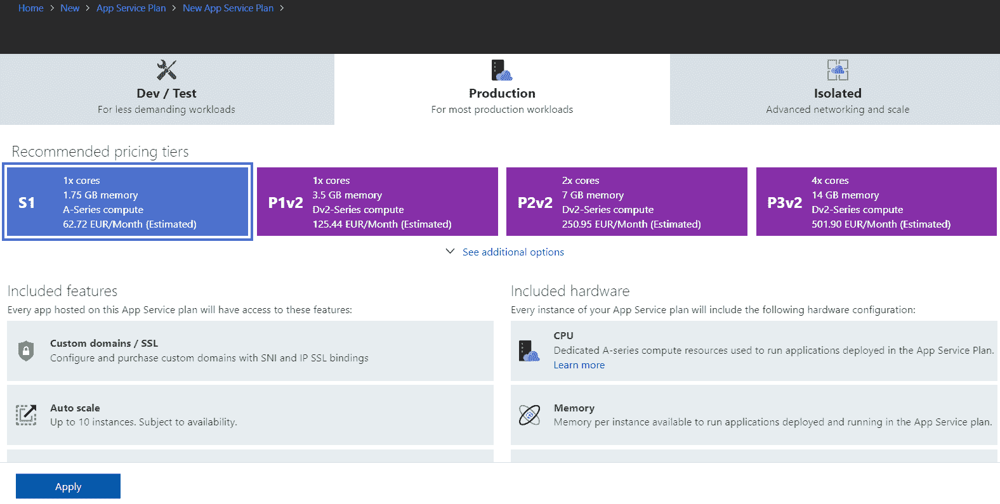
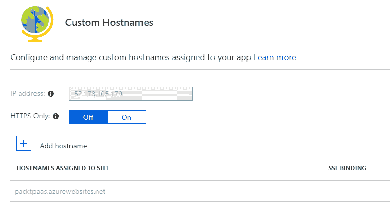

# 第四章：Azure 应用服务 - 无服务器托管 Web 应用程序

我们云端之旅的下一步是 PaaS，我们将介绍 Azure 应用服务。Azure 应用服务是 Azure PaaS 最简单的例子，旨在托管 Web 应用程序。我们将了解在 IaaS 和 PaaS 中托管应用程序的区别。

本章将涵盖以下内容：

+   Azure 应用服务计划

+   Azure Web 应用

+   流量管理器

+   应用服务环境

# 技术要求

本章需要一个 Azure 订阅。

# Azure 应用服务计划和 Azure Web 应用

Azure 中的 PaaS（或任何公共云中的 PaaS）比 IaaS 更抽象。理解 IaaS 模型很简单，因为它与本地环境没什么不同：我们创建虚拟机，按照我们的方式进行配置，安装我们需要的软件（当然，也受限于操作系统本身；我们不能安装一些无法在本地运行的东西）。

在我们创建 Azure 虚拟机后，我们对该虚拟机上的所有内容拥有完全的控制权。例如，在上一章创建的虚拟机旨在作为 web 服务器使用。我们可以连接到该虚拟机并安装所有所需的角色、功能和软件，以开始托管我们的应用程序。

那么，如果我们想用 PaaS 做类似的事情怎么办？

Azure 应用服务计划用于在 Azure 中托管我们的 web 应用程序。我们需要创建一个 Azure 应用服务计划，然后为我们的应用程序添加 Azure Web 应 s。一个应用服务计划可以托管多个 Azure Web 应用。如果我们在 web 服务器上安装 IIS，我们也可以托管多个应用。应用服务计划可以与 IIS 类比，但有一个重要区别：使用 IIS，我们可以完全控制配置，而使用应用服务计划，我们只能选择有限的选项。这本质上是 IaaS 和 PaaS 之间的区别。

控制权减少意味着维护工作也减少，因为许多在本地环境中需要执行的任务现在已经自动化，我们不需要担心它们。例如，在本地环境中必须定期安装更新，以确保一切保持最新并保持安全。而在 PaaS 中，我们不需要安装任何更新，因为这会在主机级别自动完成。

# 创建应用服务计划

我们从创建一个新的应用服务计划开始。与所有 Azure 资源类似，我们需要提供名称、订阅、资源组和位置。其他可用选项是操作系统和定价层。操作系统的选项有 Windows 和 Linux。以下截图展示了创建新应用服务计划所需的所有信息示例：


应用服务计划定价层的默认值是 S1 标准或标准 1。如果我们更改此值，将会打开一个新的面板，提供更多选项。以下截图展示了应用服务计划定价面板：



App Service 计划定价分为三个部分：

+   开发/测试

+   生产环境

+   隔离

开发/测试适用于开发/测试环境中的小型工作负载。它有不同的大小：F1、D1 和 Basic（B1、B2 和 B3）。F1 是免费的，基于共享基础设施，每天的计算时间有限，并且不支持自定义域名。D1 每天有更多的计算时间，并支持自定义域名。Basic 层有专用基础设施，并支持自定义域名、SSL 和手动扩展。

生产环境适用于更大工作负载的生产环境。它提供标准和高级层，每个层都有额外的大小（S1、S2、S3、P1、P2、P3、P1v2、P2v2 和 P3v2）。生产部分的所有大小都带有额外的功能，如自动扩展、插槽、备份和流量管理器支持。App Service 计划可用的资源量取决于大小，因为每个大小有不同的内存和核心数。即使 Basic 层不适用于生产环境，这也同样适用。标准层和高级层之间的主要区别在于磁盘类型，标准层使用标准存储（HDD），而高级层使用高级存储（SSD）。高级层还可以分为 v1 和 v2，其中 v2 使用不同的处理器类型并具有更多的内存。

在创建了 App Service 计划后，你可以开始添加 Web 应用。重要的是要说明，你可以将多个 Web 应用添加到单个 App Service 计划中。计费是在 App Service 计划级别进行的，你为整个 App Service 计划付费，而不是为每个单独的应用付费。每个 App Service 计划可以添加的应用数量取决于层和大小。

# 创建 Azure Web 应用

要创建一个新的 Azure Web 应用，需要提供的标准值包括应用名称、订阅、资源组和 Application Insights 位置。其他必需的值包括操作系统、App Service 计划/位置和 Application Insights。操作系统的可选值包括 Windows、Linux 和 Docker。具体值将取决于你要运行的应用类型。在 App Service 计划/位置中，你可以创建一个新的 App Service 计划或使用现有的。

App Service 计划/位置将决定你的 Web 应用的位置，因为它需要与关联的 App Service 计划位于相同的位置。最后，我鼓励启用 Application Insights，因为这将让你更好地监控和报告应用的使用情况和性能。

创建 Web 应用所需的所有信息示例如下图所示：


部署完成后，我们可以看到以下资源已创建：App Service 计划、App Service 和 Application Insights。这可能有些令人困惑，因为在创建资源时和资源实际创建后使用了不同的名称。App Service 计划在两种情况下都是 App Service 计划。

在 Web 应用程序的情况下，名称是不同的。当你想创建一个新的 Web 应用时，面板会显示 Web 应用的名称，但在创建后你会看到它作为应用服务。总结来说，应用服务计划被称为应用服务计划，而 Web 应用则被称为 Web 应用和应用服务：


# 管理 Azure Web 应用

资源部署完成后，我们需要进行配置。由于我们无法直接访问，也不能安装软件、角色或功能，我们有一组可编辑的预配置设置。相比虚拟机面板，应用服务面板中有更多的选项，但总体而言，由于无法进行直接配置，我们的选择会较少。

让我们从 Azure Web 应用程序开始，然后继续配置。

# Azure Web 应用部署设置

Azure Web 应用的第一组选项是部署。快速入门为我们提供了指向各种文档和指南的链接。

我们可以设置用于部署和 FTP 访问的部署凭据：


部署插槽是一个非常有趣的功能，它允许我们为应用程序创建多个环境。插槽是独立的环境，但也可以用于交换应用程序版本。要创建一个新的插槽，我们选择“添加插槽”，然后提供名称和配置源。配置源可以是现有的插槽之一（选定插槽的配置将被克隆），或者我们可以选择不克隆并保留默认值。添加新插槽的示例如下图所示：


插槽的名称将由应用程序名称和插槽名称组成。例如，我创建了两个插槽：staging 和 test。如下图所示：


一个很棒的功能是交换槽位的选项。例如，我们可以运行一个生产槽，并将所有用户指向此槽位来使用应用程序。我们可以在不同的槽位上进行部署和测试，这不会影响用户当前使用的生产版本。一旦我们测试完毕，就可以将新版本部署到暂存槽。交换槽位的选项使我们能够在几秒钟内在旧的生产版本和新版本之间切换，且对用户的影响最小。当我们点击交换时，暂存中的一切将变成生产版本，旧的生产版本变为暂存。槽位之间的设置不会改变，因此，暂存槽可以使用与生产环境不同的数据库。例如，另一个很棒的功能是我们也可以进行反向交换。即使我们已经进行测试和验证，用户可能会在新版本的应用程序中遇到问题和错误。在这种情况下，我们只需切换回之前的生产版本，将其从暂存槽移动到生产槽，并将新版本从生产槽移到暂存槽。这将允许用户继续使用上一个稳定版本的应用程序，同时我们可以在暂存槽中检查和排查问题。一旦解决了问题，只需再次交换，新的版本就会回到生产环境。

以下截图展示了一个槽位交换的示例：


部署选项和部署中心（预览版）为您提供了连接到代码仓库的选项。最常见的仓库是默认选项，如 Visual Studio Team Services、GitHub 或 Bitbucket。像 OneDrive 或 Dropbox 这样的文件共享也是一个选项，您也可以链接到自定义的外部仓库，比如本地 Git 仓库或团队基础服务器。不同之处在于，除了连接仓库之外，部署中心（预览版）还为您提供了建立持续集成/持续交付管道的选项。以下截图展示了部署选项的源：


# Azure Web App 一般设置

Azure Web 应用设置与其他 Azure 服务有一些相似功能，例如属性和锁定。此外，大多数 Azure 服务都有“扩展”（应用服务计划）和/或“扩展”（应用服务计划）选项。一些独特的设置包括应用设置、身份验证/授权、应用洞察、托管服务身份、备份、自定义域名、SSL 设置、网络、WebJobs、推送通知和 MySQL In App。网络选项允许我们将 Web 应用连接到 Azure VNet，甚至创建与本地环境的混合连接。WebJobs 允许我们创建可以按计划执行或由事件触发的后台进程。推送通知通常用于移动应用程序，以向正在运行应用程序的移动设备发送各种通知，例如新闻、更新等。MySQL In App 创建一个 MySQL 实例，供应用程序使用。

然而，这适用于小型工作负载，我不建议除了用于开发和测试之外使用它。以下截图显示了所有设置的列表：


常规设置提供了一组预配置的选项，允许我们更改框架版本和应用程序所需的其他设置。例如，我们可以在不同版本的 .NET、PHP、Python 或 Java 之间切换。我们还可以在 32 位和 64 位平台之间切换，打开或关闭 Websockets，设置托管管道版本为经典或集成等。

有一个非常重要的选项始终处于开启状态，我强烈建议您将其设置为开启。如果应用程序在一段时间内未使用，首次连接可能需要一些时间。例如，如果应用程序在工作时间内使用，早晨首次使用时可能需要一些时间才能连接，因为应用程序在晚上未使用。设置为始终开启会定期 ping 应用程序，保持其活跃。这样，无论何时用户尝试连接，应用程序都会准备就绪，不会有等待时间：


身份验证/授权选项允许我们为应用程序设置用户登录。默认选项为匿名访问，但我们可以设置 Azure Active Directory、Microsoft Live 账户、Facebook、Google 和 Twitter。托管服务身份允许应用程序在 Azure Active Directory 中注册，并使用该注册与 Azure Active Directory 中的其他应用程序进行通信。以下是身份验证/授权面板中显示的身份验证提供者列表：


备份选项允许我们为应用程序创建备份。我们需要提供存储设置（备份将存储在哪个存储账户）、备份计划和保留期。默认的保留期为 30 天，默认计划为每天一次，但您可以更改这些设置。如果您设置了与代码仓库的连接，则此选项并不真正必要，因为您可以随时重新部署应用程序，但如果您希望快速恢复，或者如果您没有使用代码仓库，它是一个有用的功能：


# 自定义域名、证书和扩展

自定义域名和 SSL 设置使我们能够自定义应用程序的 URL，并应用证书来加密连接并提高安全性。这些设置是直接关联的，因为没有自定义域名，您无法为 Web 应用应用有效的 SSL 证书。

默认情况下，Azure Web 应用的 URL 为 `customname.azurewebsites.net`（其中 `customname` 是您在创建 Web 应用时提供的名称）。为了简化访问，您可以使用已经拥有的自定义 URL，或者购买一个新的域名。甚至可以通过 Azure 门户购买新域名，但该服务并非由微软提供，而是由合作伙伴提供。如果您通过 Azure 门户购买新域名，这将被添加到您的 Azure 账单中。

为了设置自定义域名，需要验证域名所有权。通过在您的 DNS 中添加 CNAME（`customname.azurewebsites.net`）或记录（Azure Web 应用 IP 地址）来完成此验证，这将把您的自定义域名指向 Azure Web 应用。一旦验证完成，您只需确认是否希望使用该域名为您的 Azure Web 应用。此外，您还可以将网站设置为仅使用 HTTPS，以提高安全性，特别是当您使用 SSL 时。有关 CNAME 和需要添加的 IP 地址的信息，这些信息用于验证所有权，并在稍后指向您的网站，您可以在此页面找到：



SSL 配置允许我们重新设置为仅支持 HTTPS。我强烈建议在可能的情况下使用此选项。另一个安全选项是最低 TLS 版本，您可以在 1.0、1.1 和 1.2 之间进行选择。建议使用 TLS 1.2，因为如果不使用，可能会被报告为不安全。绑定选项允许您将自定义域名与可用证书配对。由于您可以让更多自定义域名指向同一个网站，因此所有启用 SSL 的域名将显示在列表中，如下所示：


SSL 设置下的证书部分允许您管理网站的证书。您可以选择导入应用服务证书或上传证书。应用服务证书是允许您通过 Azure 门户购买证书并将该证书用于您的应用程序的选项。此证书将对租户中的所有应用程序可用。上传证书选项允许您上传已有的证书，或上传您从外部来源购买的证书。证书会根据您上传或导入的证书类型显示在公共或私有列表中。您还可以根据需要请求客户端证书。所有证书选项如以下截图所示：


Azure Web 应用的自动缩放与**虚拟机规模集**（**VMSS**）类似。在“扩展”部分，您可以找到一个与 VMSS 中的扩展面板相同的面板。为了配置扩展规则，您需要设置扩展和缩减的参数。例如，您可以设置 Web 应用，当 CPU 超过 70% 时，添加一个额外实例；而当 CPU 降低到 25% 以下时，减少实例数量。您可以设置最小、最大和默认实例数。还可以添加更多扩展和缩减规则，根据不同的指标进行扩展或缩减。这将帮助您节省成本，并且仅运行所需的最少实例数量，避免性能问题。以下截图显示了扩展条件的示例：


# Azure Web App 工具

Azure Web 应用有一些独特的工具，专门针对该服务：开发工具、移动和 API。

开发工具以“克隆应用”选项开始，该选项允许我们创建一个新的 Web 应用实例，该实例将与现有的应用程序完全相同。然而，此选项仅限于**高级**等级，如果您使用的是其他等级，则该选项不可用，除非您进行升级。控制台为您提供了对控制台的 Web 访问，您可以在其中浏览文件并执行命令行操作。

高级工具会打开一个额外的窗口，包含一些不同的选项，如调试控制台、进程资源管理器、资源浏览器以及用于调试和部署的不同信息。我们还可以向 Web 应用添加扩展，并从网站扩展部分选择数百种不同的扩展。

应用服务编辑器（预览）允许您访问代码编辑器，您可以在其中直接修改应用程序代码，无需任何额外工具。性能测试允许您对应用进行负载测试，查看它如何处理任意数量的并发用户。资源浏览器和扩展是我们讨论过的高级工具中的选项。

一个非常有趣的选项是生产环境中的测试。它需要使用插槽，并允许你将一定比例的用户重定向到不同的插槽进行用户测试。例如，我们将应用程序的新版本部署到暂存插槽。使用此功能，我们可以将 10% 的用户指向此插槽，以验证应用程序是否按预期工作。一旦确认 10% 的用户没有问题，我们可以将其增加到 25%，然后是 50%，最后将所有用户切换到新版本。以下是所有开发工具的列表：


其他可用的部分包括 MOBILE、API 和 MONITORING：

+   MOBILE：该部分有三个选项，旨在用于移动应用程序。这些选项包括 Easy tables、Easy APIs 和 Data connections。Data connections 定义了与 Azure SQL 数据库的连接，同时也是 Easy tables 和 Easy APIs 的要求。Easy tables 和 Easy APIs 都需要在 Web 应用上安装移动扩展。

+   API：API 部分包含 API 定义和 CORS。API 定义让你可以配置描述 API 的 Swagger 2.0 元数据的位置。这使得其他人能够轻松发现并使用你的 API。请注意，URL 可以是相对路径或绝对路径，但必须是公开可访问的。**跨域资源共享**（**CORS**）允许在外部主机上的浏览器中运行的 JavaScript 代码与你的后台进行交互。

+   MONITORING：这适用于其他资源，我们已经涵盖了其中大部分选项。监控选项包括 Alerts（经典）、诊断日志、日志流和进程资源管理器。在诊断日志中，你可以设置要保存的日志级别。日志流则提供了实时查看日志的选项。MOBILE、API 和 MONITORING 部分中的选项如下所示：


# 在 Azure 中监控 Web 应用

默认的 Azure Web 应用监控选项虽然有用，但它仅仅是 Web 应用监控选项的开始。如果你想要一个强大的工具来进行监控和告警，同时提供仪表盘和分析，Application Insights 是你想要使用的工具。可以在创建 Web 应用时或之后创建并将 Application Insights 链接到 Web 应用。

此外，你还可以使用单个 Application Insights 来监控多个 Azure Web 应用。值得注意的是，Application Insights 并不限于 Azure Web 应用，它可以与任何托管的应用程序一起使用，包括其他云提供商或本地数据中心。

# Application Insights

初次查看应用程序洞察，你会看到几个仪表板，显示过去两小时内关于请求、响应时间和应用程序可用性的基本信息。这些仪表板可以根据不同的时间框架进行自定义，并显示不同的指标。以下是 App Insights 仪表板的示例：


在应用程序洞察下的第一个选项组位于调查（INVESTIGATE）部分。在此部分中，我们有多个指标选项，允许我们跟踪不同的性能计数器和依赖项。大多数这些选项可以编辑，我们可以提取特定信息，并创建自定义仪表板和警报。某些指标只有在应用程序中安装了应用程序洞察 SDK 时才能收集。调查部分下的所有选项列表如下所示：


这些警报的一个示例是可用性。我们可以创建一个测试，持续从不同的位置测试我们的应用程序，以确认应用程序是否可用。

我们可以编辑测试频率、测试位置、成功标准和警报。如果使用默认设置，应用程序将在五个不同的位置每 5 分钟进行一次 ping 操作。如果三个或更多位置无法联系到应用程序，将触发警报并发送通知。以下截图展示了一个可用性测试的示例：


使用情况（USAGE）部分包含有关用户、会话、事件和用户流程的各种信息。要在此部分获取指标，你需要使用应用程序洞察 JavaScript SDK 并将 JavaScript 代码片段添加到你的应用程序中。以下是用户部分下的所有选项列表：


以下是一个需要添加到应用程序中的代码片段示例，以便收集使用情况信息：

```
<!-- To collect end-user usage analytics about your application, insert the following script into each page you want to track. Place this code immediately before the closing </head> tag, and before any other scripts. Your first data will appear automatically in just a few seconds. --> <script type="text/javascript"> var appInsights=window.appInsights||function(a){ function b(a){c[a]=function(){var b=arguments;c.queue.push(function(){c[a].apply(c,b)})}}var c={config:a},d=document,e=window;setTimeout(function(){var b=d.createElement("script");b.src=a.url||"https://az416426.vo.msecnd.net/scripts/a/ai.0.js",d.getElementsByTagName("script")[0].parentNode.appendChild(b)});try{c.cookie=d.cookie}catch(a){}c.queue=[];for(var f=["Event","Exception","Metric","PageView","Trace","Dependency"];f.length;)b("track"+f.pop());if(b("setAuthenticatedUserContext"),b("clearAuthenticatedUserContext"),b("startTrackEvent"),b("stopTrackEvent"),b("startTrackPage"),b("stopTrackPage"),b("flush"),!a.disableExceptionTracking){f="onerror",b("_"+f);var g=e[f];e[f]=function(a,b,d,e,h){var i=g&&g(a,b,d,e,h);return!0!==i&&c"_"+f,i}}return c }({ instrumentationKey:"ebfab75c-e0ea-4d45-8aa9-ac11e656e644" }); window.appInsights=appInsights,appInsights.queue&&0===appInsights.queue.length&&appInsights.trackPageView(); </script>
```

配置（CONFIGURE）部分包含许多已经包含在其他应用程序洞察设置（如智能检测设置）和 Azure Web 应用设置（如性能测试）中的设置。最有趣的功能是 API 访问（允许你管理 API 密钥，从而让其他应用程序访问你的 Azure Web 应用上的 API）和工作项（允许你连接到 Visual Studio Team Services 并将工作项直接链接到你的应用程序）。在应用程序洞察的配置部分下的设置列表如下所示：


APPLICATION INSIGHTS 记录了许多不同的指标。你可以在 Application Insights Analytics 中创建自定义查询，获取不同类型的信息。这些查询的结果可以以表格或图表的形式显示。以下是 Application Insight Analytics 的截图：


这是一个 Application Insights 查询的示例：

```
requests
| where timestamp >= ago(24h)
| summarize percentiles(duration, 50, 90, 95) by bin(timestamp, 1h)
| render timechart
```

# Azure App Service Plan

在创建 Azure Web App 的过程中，我们需要创建一个 Azure App Service Plan。让我们回顾一下 Azure App Service Plan 中可用的设置。

在 SETTINGS 下，我们有一些在 Azure Web Apps 中可用的选项，如网络、扩展（App Service 计划）和扩展（App Service 计划）。还有属性、锁定和自动化脚本等选项，和所有其他 Azure 资源一样。请注意，一个 App Service Plan 可以托管多个 Azure Web Apps。计费是按 Azure App Service Plan 进行的；你不需要按 Web App 计费。因此，Azure Web App 的层级变化与 Azure App Service Plan 中的层级变化是直接相关的。在 Web App 刀片中进行的扩展/缩减和横向扩展/缩减操作将在此处显示，因为层级不会在 Azure Web App 中变化，而是在 Azure App Service Plan 中变化。

以下截图显示了 Azure App Service Plan 中的所有设置选项：


Azure App Service Plan 的一个不同和独特之处是应用程序。如前所述，可以在单一 Azure App Service Plan 上托管多个 Azure Web Apps。设置下的 Apps 选项列出了所有这些 Web Apps，以及在这些 Web Apps 下创建的任何槽位。以下是应用程序列表的示例：


另一个不同的选项是文件系统存储。每个 Azure App Service Plan 都有资源限制。在文件系统存储下，我们可以查看总空间和可用空间的信息。以下是文件系统存储的截图：


# Azure Web App 高可用性

我们已经看过如何为 Azure Web Apps 设置自动扩展以及如何创建扩展和缩减规则。但是，扩展可以提高性能，并且在请求增加时保持应用程序正常运行，但并不能真正保证应用程序的高可用性。如果 Azure 数据中心出现问题，或者托管主机正在进行维护，应用程序将在单一位置托管时不可用。

为了实现高可用性，我们需要引入另一个 Azure 服务：Traffic Manager。Azure Traffic Manager 在 DNS 级别操作，根据自定义路由规则将传入请求定向到端点。

让我们从创建一个新的 Azure 流量管理器开始，并通过配置过程展示如何为 Azure Web 应用设置高可用性。

# 创建流量管理器

要创建一个新的 Azure 流量管理器，我们需要提供名称、路由方法、订阅资源组和位置。如果使用现有的资源组，位置将自动选择。流量管理器特有的选项是路由方法，提供的可选方法有性能、加权、优先级和地理。

性能选项用于当你希望根据响应时间、网络延迟等因素将用户指向提供最佳性能的地点时。

加权将根据权重规则均匀地分配请求。例如，默认规则会将请求均匀分配，如果我们定义了两个端点，则一半的请求会发送到一个端点，另一半会发送到第二个端点。但可以定义权重规则，使得一个端点接收 70%（或任何其他数值）的请求，其余请求则发送到第二个端点。当然，你可以定义多个端点（两个是最少的）并创建任何你想要的权重比例规则。

地理选项将引导用户到最近的地理位置。例如，我们可以有两个端点，一个位于西欧，另一个位于东美洲。如果使用地理路由方法，来自欧洲的用户将被引导到西欧的端点，而来自美国的用户将被引导到东美洲的端点。

最后，优先级路由方法通常在高可用性是目标时使用。一个端点将作为主端点，因此所有流量只会指向主端点。如果主端点不可用，所有流量将指向备用实例。当然，你可以定义多个端点，而不仅仅是两个。更多的端点确保至少有一个端点是可用的，从而提高高可用性的百分比。

在某些情况下，性能方法可以用来实现类似端点跟踪的目标，用户将被引导到在特定情况下表现最佳的端点。如果端点不可用，这将表现为性能下降，用户将被引导到另一个表现更好的端点。使用这种方法的问题是，性能下降的情况可能需要一些时间才能被检测到，用户在性能下降之前可能会遇到问题，直到端点的性能被确认下降并重新定向到其他端点。使用优先级方法时，端点的可用性被监控，问题被更快地检测到，用户将更快地被引导到健康的实例，并且遇到问题的可能性较小。

以下截图显示了一个用于创建新的 Azure 流量管理器的填写模板示例：


# Traffic Manager 配置和设置

一旦创建了 Azure Traffic Manager，我们可以继续配置。Traffic Manager 特定的设置包括配置、实际用户度量、流量视图和端点。

实际用户度量和流量视图可以让你监控用户行为，查看用户的指向位置以及流量的流动情况。流量视图将为你提供有关请求来源的见解，使用地图并指示请求的地理来源。实际用户度量可以为你提供更多关于请求和流量的见解，但需要一个度量密钥和一个 JavaScript 代码片段嵌入到应用程序代码中：


Endpoint 选项允许你注册流量将被指向的端点。这些端点可以是 Azure 端点或外部端点。在外部端点的情况下，只允许使用**完全限定域名**（**FQDN**）。对于 Azure 端点，可以是云服务、应用服务、应用服务插槽或公共 IP 地址。这是另一个可能会引起混淆的命名示例。在这种情况下，应用服务和应用服务插槽实际上是 Web 应用和 Web 应用插槽。以下截图展示了如何添加一个 Azure Web 应用（应用服务）的示例：


只有一个端点实际上无法帮助我们实现高可用性，我们需要至少再添加一个端点。我建议第二个端点位于不同的区域，以解决单个数据中心可能出现的维护或服务问题。所有可用端点的列表位于端点下，显示名称、状态、类型和位置。以下截图展示了一个示例：


最后一步是在配置下创建规则。请注意，我们可以在这里更改路由方式，并且在创建 Traffic Manager 后，该选项仍然可以更改。这并非所有 Azure 资源的情况，某些设置一旦创建就无法更改。例如，Azure 中的任何资源都不能重命名：如果需要更改名称，唯一的选择是删除该资源并重新创建。你可以在端点监控设置下选择你希望监控的协议、端口和路径。

最后，需要配置快速端点故障切换设置。探测间隔可以设置为 10 或 30 秒，这决定了端点状态检查的频率。容忍的失败次数可以设置为 `0`-`9`，这决定了在端点被声明为失败之前，检查失败的次数。探测超时时间决定了探测超时之前所需的时间。这个值至少需要为 `5`，且小于探测间隔时间。这些设置的较低数字意味着问题会更快被检测到，并且故障切换会在用户发现问题之前发生。然而，您需要小心，因为比需要的更频繁地 ping 应用程序，并设置过少的容忍失败次数，可能会导致应用程序在实例之间切换得过于频繁，进而产生额外的问题。以下截图显示了一个示例配置：


# 在专用环境中运行 Azure Web 应用

Azure Web 应用使用公共端点，通常通过互联网访问，没有任何限制。在需要更隔离的访问情况下，还有另一个选择：**Azure 应用服务环境**（**ASE**）。Azure ASE 为高规模的安全应用程序提供完全隔离的专用环境。Azure ASE 通常用于需要非常高规模、隔离和安全网络访问以及高内存利用率的工作负载。由于 ASE 作为专用环境提供，这消除了“吵闹邻居”问题（可能由于另一个应用程序共享同一主机而导致的性能问题），并允许您充分利用所有资源。

Azure 应用服务计划可以连接到 Azure VNet，但这需要额外的工作。另一方面，ASE 会自动连接到 VNet，并且只能通过私有连接和私有 IP 地址进行访问。

# 总结

Azure 应用服务计划是 Microsoft Azure 中 PaaS 模式的最佳示例。它允许我们无需服务器和虚拟机即可托管应用程序。尽管管理选项被简化到最小化，但我们仍然有很多配置选项。传统支持几乎为零，但 PaaS 模式旨在为需要最新功能和框架的现代应用程序提供服务。如果您需要运行传统软件，IaaS 是最佳选择。

我们从应用角度介绍了 Azure 中的 IaaS 和 PaaS。但是，**没有数据，应用就无从谈起**。在下一章中，我们将讨论 Azure 中的数据平台，并展示如何在云端创建和管理数据库。

# 问题

1.  Azure 应用服务是...

    1.  IaaS

    1.  PaaS

    1.  SaaS

1.  与虚拟机相比，我们在应用服务计划中有多少控制权？

    1.  更多

    1.  更少

    1.  相同

1.  与虚拟机相比，我们在 Azure 应用服务计划中的管理权限有多少？

    1.  更多

    1.  更少

    1.  相同

1.  应用服务计划用于托管...

    1.  Web 应用

    1.  数据库

    1.  两者

1.  插槽用于...

    1.  托管应用程序的不同版本

    1.  在不同区域托管应用程序

    1.  处理增加的工作负载

1.  Azure 应用服务计划的增加工作负载由...处理

    1.  扩展

    1.  横向扩展

    1.  WebJobs

1.  最好的 Azure Web 应用监控工具是...

    1.  Splunk

    1.  日志分析

    1.  应用洞察

1.  Azure Web 应用的高可用性通过...实现

    1.  扩展

    1.  横向扩展

    1.  流量管理器

1.  流量管理器支持...

    1.  Azure 终结点

    1.  外部终结点

    1.  两者

1.  为 Azure Web 应用提供的隔离和专用环境是...

    1.  Azure 应用服务计划

    1.  Azure ASE

    1.  Azure 虚拟机
