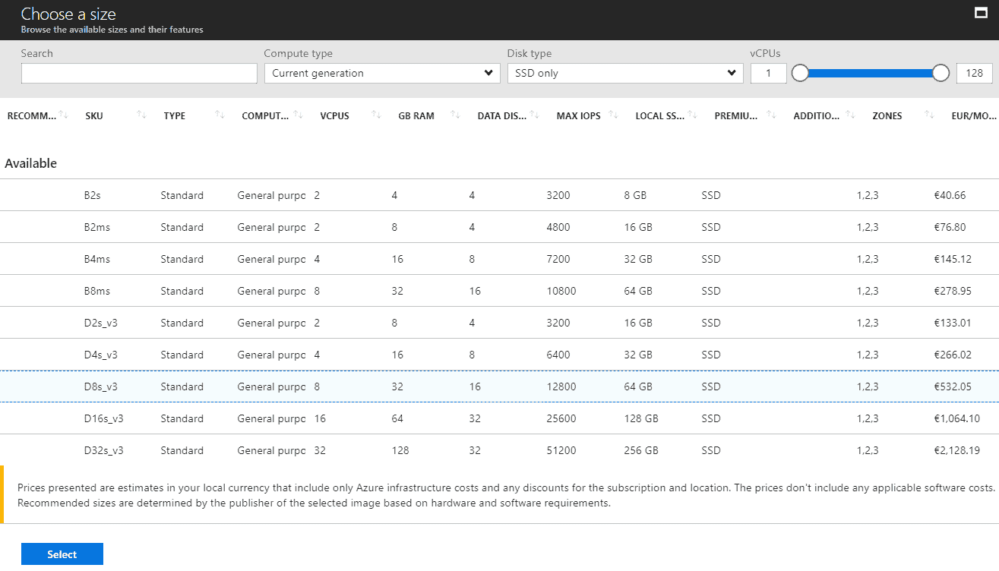
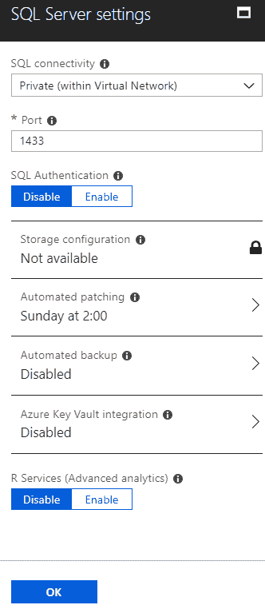

# 第五章：Azure 数据平台

任何 IT 系统中最重要的部分是数据。没有数据，应用程序和 IT 系统就没有意义。我们讨论了如何在 IaaS 和 PaaS 模型中设置应用程序，但我们如何设置数据库呢？

在本章中，我们将讨论数据库选项以及如何创建托管我们数据库的环境。

我们将涵盖以下主题：

+   Azure 虚拟机中的 SQL Server

+   **数据库即服务**（**DaaS**）

+   Azure SQL 数据库

+   Azure 数据和分析平台

# 技术要求

本章您需要以下内容：

+   一个 Azure 订阅

+   SQL Server 管理工作室

# Azure 数据库选项

理解 Azure 中的数据库选项是我们云端旅程中的一个非常重要的部分。我们使用的所有服务最终都需要在某个地方存储信息。微软 Azure 提供了广泛的数据平台和多个服务，供我们存储数据。我们将从**关系型数据库管理系统**（**RDBMS**）开始，这是最传统的数据库模型，并将讨论 SQL Server 的云选项，作为微软的本地解决方案用于 RDBMS。

在 Azure 中运行 SQL Server 有两种不同的选项——IaaS 和 PaaS。PaaS 中的数据库通常被称为 DaaS。我们将解释这两种方法，并研究 Azure 数据平台中的其他服务。

# SQL Server 作为 IaaS

将 SQL Server 作为 IaaS 运行需要创建一个 Azure 虚拟机来托管我们的 SQL Server。我们可以选择创建一个干净的虚拟机，并使用操作系统镜像自行安装 SQL Server，或者我们可以创建一个已包含 SQL Server 的虚拟机。在这两种情况下，管理数据库与在本地环境中管理数据库的方式没有太大区别。您将拥有完整版本的 SQL Server，包含您在本地版本中所有的选项。

让我们开始创建一个用于 SQL Server 的虚拟机，并解释所有细节。

# 创建一个包含 SQL 镜像的 Azure 虚拟机

如前所述，您可以选择创建一个虚拟机（VM）并稍后安装 SQL Server，或者选择一个已经包含 SQL Server 的镜像。在这种情况下，我将选择一个名为 SQL Server 2016 SP1 企业版的镜像，该镜像已经包含 SQL Server。这个虚拟机是基于 Windows Server 2016 的，这将是我们的操作系统。

大多数选项与我们在未包含 SQL Server 的镜像中创建虚拟机时的选项非常相似。我们从基本信息开始，需要提供名称、虚拟机磁盘类型、用户名、密码、订阅、资源组和位置。强烈建议您在创建将运行 SQL Server 的虚拟机时使用 SSD 作为虚拟机磁盘类型。

磁盘速度对 SQL Server 性能影响很大，选择更快的磁盘类型有助于获得最佳性能。以下是所有基本设置的列表和示例截图：


我们的下一步是选择虚拟机的大小。根据磁盘类型，列表将限制为仅支持所选磁盘类型的大小。在为运行 SQL Server 的虚拟机选择大小时，我建议选择更多的 CPU 和内存。SQL Server 需要大量资源，选择合适的大小有利于性能。幸运的是，如果你选择的大小过大或过小，可以稍后进行更改。这是云计算的一个优势，你不会被初始大小所束缚。基于 SSD 的虚拟机大小列表如下所示：



设置面板包含我们之前使用过的所有选项，并且我们可以为每个选项设置默认值。如果你打算为 SQL Server 设置高可用性，请确保现在选择可用性区域和可用性集，因为这些设置无法在后续进行。此外，请注意虚拟机将要连接的网络、子网和网络安全组。如果使用了多个子网，你可能不希望 SQL Server 最终出现在 DMZ 中。NSG 也是如此——你可能希望为 SQL Server 设置与 Web 服务器不同的安全设置。幸运的是，这些设置可以稍后更改。设置的示例如下图所示：


最后，我们有一组特定于包含 SQL Server 的镜像的设置，这些设置在创建不包含 SQL Server 的虚拟机时无法找到。在 SQL Server 设置中，我们可以配置 SQL 连接性、SQL 身份验证、存储配置、自动修补、自动备份、Azure 密钥保管库集成和 R 服务（高级分析）。

SQL 连接性允许我们设置连接级别和端口。对于连接级别，我们可以仅允许从虚拟机内连接 SQL Server：私有（来自虚拟网络）和公共（通过互联网）。我强烈建议不要使用公共访问 SQL Server，这将使你的数据库暴露在互联网上，任何人都可以尝试访问，且你暴露了数据库给暴力破解攻击。仅从虚拟机内访问 SQL Server 也可能不是一个选项，除非你在单一虚拟机上运行所有服务，并且打算在同一服务器上运行应用程序。最常见的情况是来自虚拟网络内的私有访问，允许同一网络上的其他虚拟机访问数据库。SQL Server 的默认端口是 `1433`，但可以根据需要进行更改。

SQL Server 的默认身份验证方式为 Windows 身份验证，但如果需要，可以启用 SQL 身份验证。如果启用了 SQL 身份验证，虚拟机使用的用户名和密码也将作为 SQL 登录凭据。

目前，存储配置不可用，且此设置将在虚拟机创建后使用。

自动补丁更新默认设置为每周日 2:00。你可以将此设置更改为其他时间，或者将其禁用。我建议不要禁用此功能，因为它将确保你的 SQL Server 始终是最新的并已安装最新的更新，包括安全更新。然而，在某些情况下，你需要在安装更新之前进行测试，这时你可以选择禁用它们。请注意，在这种情况下，你需要负责保持服务器的更新。

默认情况下，自动备份是禁用的。如果启用，你将有多个可用选项。你可以选择存储帐户来存放备份；默认保留期为 30 天，可以设置为较低的值（最小 1 天，最大 30 天）。备份加密可以设置为开启或关闭；如果需要，可以包括系统数据库的备份。最后一个选项是配置备份计划。默认设置的自动备份将每周执行一次备份操作。你可以将此设置更改为每天备份。你可以设置备份的时间以及频率。（可以配置为每 5 分钟备份一次，或者每天备份一次。）

最后两个选项是 Azure Key Vault 集成和 R 服务（高级分析），它们允许你在需要时启用这些功能。Azure Key Vault 将要求提供将使用的 Key Vault 信息，R 服务将简单地安装附加的分析功能。

以下是 SQL Server 设置的示例：



部署带有 SQL Server 的 Azure 虚拟机比部署没有 SQL Server 的类似虚拟机需要更长的时间。这是因为需要传递额外的信息并在虚拟机内配置 SQL Server 实例。

# 在 Azure 虚拟机中管理 SQL Server

一旦带有 SQL Server 的虚拟机部署完成，你可以找到与其他 Azure 虚拟机非常相似的设置。唯一的区别是可以在这里找到 SQL Server 配置。

在 SQL Server 配置下，新增了一个选项卡，它具有与创建带有 SQL Server 的新虚拟机步骤中的 SQL Server 设置相同的选项。

此选项卡中的第一个选项是存储；这是之前被禁用的选项。在这里你可以找到存储使用情况和性能。

接下来是 SQL 连接设置，你可以在其中更改访问级别和 SQL Server 端口，并启用 SQL 身份验证（如果之前已启用，则可以关闭）。

以下是显示存储和连接部分的屏幕截图：


在 SQL Server 配置下，其他可用的设置包括自动补丁更新、自动备份、Azure Key Vault 集成和 R 服务（高级分析）。这些功能的所有设置与创建虚拟机时的设置相同。以下是带有其他设置的屏幕截图：


我们可以连接到虚拟机并使用 SQL Server Management Studio 连接到 SQL Server。或者，如果 SQL Server 访问已设置为公开，您也可以从自己的计算机执行相同的操作。正如您所见，连接到 SQL Server 时，您可以使用所有本地 SQL Server 环境中可用的选项和功能。从此时起，在云中管理和维护数据库与在本地服务器或虚拟机中操作没有区别。

我们可以执行任何操作并进行任何更改，就像在本地环境中一样。以下截图显示了所有可用于本地 SQL Server 的选项也适用于 Azure 虚拟机中的 SQL Server：


管理和维护虚拟机本身与管理任何其他 Azure 虚拟机没有区别。所有设置完全相同；唯一的区别是带有 SQL 的虚拟机具有额外的功能，如 SQL Server 配置。

现在我们将转向 SQL Server 作为 PaaS，并尝试比较每个选项为我们提供的内容以及可用的选择。

# Azure 虚拟机上的 SQL Server 高可用性

在 Azure 虚拟机中管理 SQL Server 与本地 SQL Server 没有太大区别。创建高可用性解决方案时也可以说类似的事情。

在 Azure 虚拟机中为 SQL Server 创建高可用性有几个选项：

+   Always On 故障转移集群实例

+   Always On 可用性组

+   数据库镜像

+   日志传输

请注意，为了创建这样的解决方案，虚拟机必须放置在可用区和/或可用性集内。

# SQL Server 作为 PaaS

以 PaaS（平台即服务）或 DaaS（数据库即服务）形式运行数据库让我们可以利用 PaaS 的优势。这意味着我们可以使用更少的设置，但也有更少的维护需求。我们无法直接访问 SQL Server，也不能执行许多操作，但我们仍然可以通过可用的预配置选项进行管理。

让我们开始创建 Azure SQL 数据库并解释所有选项。

# 创建 Azure SQL 数据库

要创建一个新的 Azure SQL 数据库，我们需要提供一组标准信息，如数据库名称、订阅和资源组。额外的信息特定于 Azure SQL 数据库；我们需要选择源，提供服务器和定价层。还可以选择是否希望使用 SQL 弹性池？这个选项与定价层直接相关，稍后我们会详细介绍。对于数据库源，我们可以选择空白（空数据库）、样本（`AdventureWorkLT`，标准的微软样本数据库）或从备份（如果选择此选项，我们需要提供备份存储位置的信息）。

数据库的排序规则始终为 `SQL_Latin1_General_CP1_CI_AS`，并且无法更改。以下截图显示了设置列表：


数据库无法独立存在，必须有一个服务器，因此在创建 Azure SQL 数据库时，我们需要提供服务器。如果没有现有的服务器，我们需要创建一个新的服务器。我们需要提供一个名称（一个唯一的名称，将作为公共端点使用）、用户名、密码和位置。

Azure SQL 数据库的定价可能会让人感到困惑，因为有多种定价方式。第一种方式是单一数据库定价。在这种定价模式下，按数据库收费，服务器是免费的。您可以在单台或多台服务器上拥有多个数据库；价格是基于数据库数量，服务器数量不会影响定价。例如，我们可以拥有 10 个 Azure SQL 数据库。如果这些数据库位于同一台服务器或 10 台不同的服务器上，价格都是一样的。真正复杂的部分在于定价单位，**数据库事务单位**（**DTU**）。这是一个综合指标，衡量 CPU、内存、数据 I/O 和事务日志 I/O。传统上，在本地环境中，我们会监控 CPU、内存和磁盘 IOPS，然后将其转化为 DTU，但事情并不那么简单。幸运的是，我们有能力随时间调整选择的规格，如果我们确定数据库性能受影响或未能充分利用现有资源，可以进行更改。DTU 模型中的可用层级有 Basic、Standard 和 Premium，每个层级对应不同的 DTU 值。Basic 层提供 5 个 DTU，Premium P15 层最高可达 4000 个 DTU。可用空间也会受到层级的影响，从 Basic 层的 2 GB 到 P15 层的 4 TB 不等。以下是 DTU 层级选择的截图：


由于 DTU 模型过于复杂，微软最近决定引入一种基于 vCore 的新 Azure SQL 数据库定价模型。该模型允许您选择将分配给数据库的 vCore 数量以及可用的内存大小。vCore 的数量可以从 2 个到 80 个不等。内存大小取决于 vCore 的数量，范围从 5.5 GB 到 408 GB。以下是 vCore 层级选择的截图：


我们提到过，弹性池也是一个与定价相关的选项。这是基于资源池化的完全不同的模型。如果选择弹性池作为 Azure SQL 数据库的定价模型，则价格不由数据库数量决定，而是由池的大小决定。对于单个数据库的定价模型适用的两种定价模式也适用于弹性池，我们可以选择弹性池资源是基于 DTU 还是 vCore 来计算的。弹性池和单个数据库定价模型的区别在于，选择的资源数量是可供池使用的，并且池中的数据库共享这些资源。因此，如果我们为弹性池选择 4000 DTU，这些资源将由池中所有的数据库共享。如果所有数据库在同一时间高度利用，这种方式并不理想，此时应选择单个数据库定价模型。但如果你的数据库在一天中的不同时间有较高的工作负载，这就是理想的场景。

假设你正在为全球各地的客户托管应用程序。这将导致每个客户的数据库工作负载不同，且根据时区的不同，在不同的时间表现不同。一个数据库在欧洲的工作时间内将有较高的工作负载，而在美国的工作时间内工作负载较低。位于美国的客户的数据库在欧洲的工作时间内负载较低，但在美国的工作时间内负载较高。将这些数据库放置到弹性池中可以让你共享资源，数据库可以在不同时间段内使用更多可用资源。

Azure SQL 数据库的部署时间取决于层级和来源。来源决定了数据库的大小以及需要执行的操作类型。从逻辑上讲，创建一个空数据库的时间要比恢复一个包含数 GB 或 TB 数据的备份所需的时间短。

部署完成后，我们可以看到两个资源：SQL 服务器和 SQL 数据库：


# 管理 Azure SQL 数据库

管理 Azure SQL 数据库从防火墙设置开始。默认情况下，只有 Azure 服务可以连接到你的数据库。要允许其他连接，你需要设置一个防火墙规则，允许来自指定 IP 地址的连接。要添加你的 IP 地址，选择“添加客户端 IP”。Azure 门户会自动检测你当前的 IP 地址并添加防火墙规则。注意，执行更改时始终需要选择“保存”选项。如果你不保存新设置，添加新 IP 地址到防火墙规则中是没有意义的。

这种情况曾多次发生在我身上——我添加了一个新的 IP 地址，花了一些时间去弄清楚为什么无法连接，结果才意识到我忘了点击“保存”。防火墙设置如下图所示：


一旦添加了我们的 IP 地址，我们就可以使用**SQL Server Management Studio**（**SSMS**）连接到 Azure SQL Server。请注意，与本地 SQL Server 实例相比，我们可用的选项有限。除了数据库和安全性外，其他所有选项都已消失，我们不能像在本地环境中那样管理数据库。SQL Server 与 Azure SQL 之间的对比如下所示：


幸运的是，Azure 提供了许多管理数据库的选项，大多数功能都不会被错过。数据库的管理和维护在 Azure SQL 中变得前所未有的简单。

Azure SQL 的第一个独特选项是查询编辑器。这意味着我们不再需要 SSMS；可以直接通过浏览器运行任何查询。在 SSMS 中执行的一些任务也可以在 Azure 门户中完成。Web 查询编辑器的截图如下：


Azure SQL 数据库的 SETTINGS 包含常见选项，如属性、锁定和自动化脚本。配置也是 Azure 资源设置中常见的选项，但独特的选项包括地理复制、连接字符串、同步到其他数据库和添加 Azure 搜索。同步到其他数据库允许你创建同步组，并设置一组将自动同步的数据库。添加 Azure 搜索选项允许你将数据库连接到搜索服务，从而无需额外的编码或配置即可执行全文搜索。

SETTINGS 下的配置选项允许你更改数据库层级。这将打开一个新的面板，界面与创建数据库时选择数据库层级相同。数据库层级更改的截图如下：


连接字符串允许你为各种编程语言查找数据库的连接字符串。

以下是`ADO.NET`的连接字符串示例：

```
Server=tcp:packt.database.windows.net,1433;Initial Catalog=Demo;Persist Security Info=False;User ID={your_username};Password={your_password};MultipleActiveResultSets=False;Encrypt=True;TrustServerCertificate=False;Connection Timeout=30;
```
