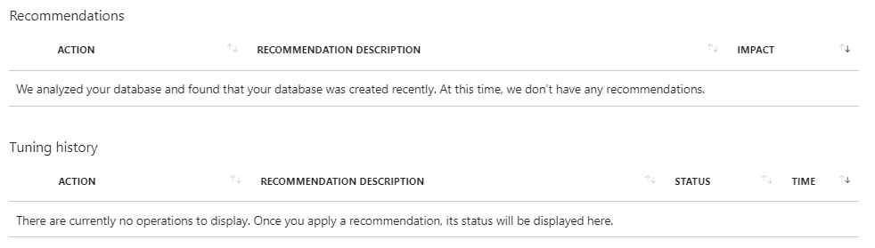

# 第六章：Azure Storage、备份和站点恢复 - 将数据迁移到 Azure

本章将重点讨论将数据迁移到 Azure。我们将从 Azure Storage 开始，因为它是 Azure 中最重要的服务之一。一切从 Storage 开始，了解它的使用非常重要。我们将讨论如何使用 Azure Storage 进行备份，以及如何将工作负载迁移到云端。此外，我们还将讨论如何使用**Azure 备份**和**Azure 站点恢复**（**ASR**）加快迁移过程，并将数据迁移到 Azure。

本章将涵盖以下主题：

+   Azure Storage

+   Azure 备份

+   Azure 站点恢复

# 创建高可用性的 Azure SQL 数据库

创建 SQL Server 高可用性解决方案可能会非常复杂，配置困难，维护和管理起来更是困难重重。而 Azure SQL 数据库的高可用性则容易得多，几乎不需要维护。

我们需要从 Geo-Replication 开始。地理复制刀片显示了世界地图，并标示了当前数据库所在的以及所有可供复制的数据中心。当前数据库所在的数据中心用蓝色标记。建议用于复制的数据中心用紫色标记（这是离当前数据中心最近的数据中心），其他所有可用数据中心用绿色标记。在地图上，您可以看到有关当前数据库的信息，该数据库将是我们的主数据库。以下是地理复制刀片的示意图：

要创建新的数据库副本，我们可以在地图上选择任何数据中心来启动新的刀片。将打开“创建辅助刀片”，在其中我们需要提供目标 SQL Server（如果选定位置没有该服务器，则创建新服务器）。数据库名称将与原始名称相同，并且数据库将处于只读模式。定价层次将与原始相同，但您可以将层次更改为另一个值。创建辅助数据库所需的设置示例如下所示：

部署完成后，地图会发生变化，显示主数据库和辅助数据库之间的连接。部署时间取决于数据库的大小。

在部署过程中，空数据库会在辅助数据中心创建，然后数据从主数据库复制到辅助数据库。以下是实施复制后的地图示例：

然而，请注意，这只是创建主数据库的可读副本。在灾难发生或主数据库不可用的情况下，辅助数据库必须手动从只读模式切换为读/写模式，并且所有连接字符串必须手动更改。这实际上并不能算作高可用性解决方案，因此我们需要通过创建故障切换组来采取额外的步骤。

在故障转移组面板中，我们需要提供主服务器、备用服务器、故障转移组名称、读/写故障转移策略以及读/写宽限期（小时）。故障转移组名称必须唯一，这将成为连接到数据库的新端点。连接到故障转移组名称时，只要主服务器可用，连接将自动指向主服务器。

如果主服务器不可用，所有指向故障转移组名称的连接将会自动指向备用服务器。所有故障转移和故障恢复过程都将自动进行，无需用户操作。这里展示了故障转移组选项的截图：

如您所见，创建 Azure SQL 数据库高可用性解决方案简单快捷。创建后无需用户操作，故障转移和故障恢复都会自动进行。如果您曾在本地环境中创建过类似的解决方案，您可能知道故障恢复过程有多复杂。

# Azure SQL 数据库安全

对于数据而言，安全性非常重要（并非其他资源可以忽视安全性）。在 Azure SQL 数据库面板下，我们有一组与安全性相关的选项。安全选项包括高级威胁保护、审计、动态数据掩码和透明数据加密。高级威胁保护和审计可以在服务器级别（针对该服务器上的所有数据库）或单个数据库上应用。

高级威胁保护包含三个子部分：

+   数据发现与分类（预览）

+   漏洞评估

+   威胁检测

数据发现与分类（预览）功能仍处于测试阶段，但非常有用。数据库将进行扫描，并提供建议，指出哪些列应标记为分类数据。在考虑需要遵守**通用数据保护条例**（**GDPR**）时，这尤其有用。

漏洞评估将进行安全扫描，并为您的数据库提供安全建议。例如，建议跟踪防火墙规则或分类敏感数据。

威胁检测将机器学习应用于您的安全性。此功能分析正常行为，并提醒您任何异常操作。例如，如果某个 SQL 登录帐户通常只在工作时间访问数据库，而突然在其他时间尝试登录，您将收到警报。或者，如果某个登录帐户始终来自特定 IP 地址，但尝试从世界另一端访问数据库，系统也会检测到并提醒您。

这里展示了高级威胁保护的截图：

审计功能允许我们跟踪事件并将其记录到存储帐户中。我们可以定义日志保留期，以及是否在数据库或服务器级别记录事件。由于审计通常是许多组织的要求，特别是为了符合不同的标准，这个选项允许您满足这一要求。以下是审计日志的截图：

在继续进行动态数据屏蔽之前，让我们先运行一个简单的查询。在表 `SalesLT.Customers` 中选择前 100 行将返回该表中前 100 个客户的所有信息。这里有各种类型的数据，我们可能不希望所有有数据库访问权限的人都能看到这些信息。我们以电话号码为例。请注意，在以下截图中，我们可以看到运行查询会返回电话列：

动态数据屏蔽面板将提供有关当前应用的所有屏蔽规则的信息，并建议您可能想要考虑用于屏蔽的其他规则。请注意，SQL 管理员不受数据屏蔽影响，您可以添加额外的用户来排除在外。以下是动态数据屏蔽的截图：

要添加新的规则，我们需要提供架构、表、列和屏蔽字段格式。屏蔽字段格式将允许您控制查询结果中屏蔽数据的显示方式。下面是如何为数据屏蔽添加电话列的示例：

一旦应用了数据屏蔽规则，我们可以再次运行查询。如以下截图所示，应用屏蔽规则后，结果将会不同，电话列的所有值都会返回`xxx`：

使用动态数据屏蔽，我们可以控制用户对数据的访问，防止他们查看机密信息。例如，如果我们在同一张表中有账单信息和联系信息，我们可能希望为不同的用户提供对该表的访问权限，但允许他们查看不同的信息。我们可以允许销售部门查看电子邮件或电话号码，但希望防止他们查看信用卡信息。另一方面，我们不希望阻止所有人查看信用卡信息，并希望允许财务部门访问这些信息。动态数据屏蔽非常适合这种场景，其中用户可以访问相同的表格，但查看不同的信息集。

**透明数据加密**（**TDE**）用于加密处于静态状态的数据库。此功能适用于本地版本的 SQL Server，但实现起来并不简单。对于 Azure SQL 数据库，创建的新数据库会自动开启此功能。以前并非如此，对于旧数据库，可以通过简单地开启 TDE 选项来启用此功能。就是这么简单，数据库（以及所有备份）都会在静态状态下被加密。下面的截图展示了透明数据库加密的界面：

# 监控和故障排除 Azure SQL 数据库

Azure SQL 数据库的监控选项与其他 Azure 资源的选项非常相似。监控选项包括警报（经典）、度量（预览）和诊断设置。所有这些功能也适用于 Azure 虚拟机和 Azure Web 应用程序，这些内容在前几章中已有介绍。

支持 + 故障排除选项为我们提供了一些特定于 Azure SQL 数据库的功能。功能包括资源健康和新支持请求，和其他 Azure 资源类似。新功能包括性能概述、性能推荐、查询性能洞察和自动调优。

性能概述为我们提供了查询性能的概览。在这里，我们可以查看查询的资源消耗情况。概述为我们提供了按资源类型聚合的查询消耗情况。资源类型包括 DTU、CPU 和 IOPS。此聚合会显示消耗最大资源的查询，但由于这是聚合消耗，可能是查询频繁执行的结果，而不是单次执行时消耗大量资源。我们可以在“长时间运行的查询”选项卡下查看执行时间较长的查询列表。这些信息可以帮助我们提高性能，因为经常执行的查询和执行时间较长的查询消耗了大量资源。优化这些查询可以提高性能，并在长期内节省成本。以下图表展示了性能概述中 CPU 消耗的情况：

在性能列表下，我们可以看到根据数据库的性能历史记录提供的推荐事项。它会给出推荐的列表，并提供自动应用这些建议的选项。在性能推荐面板中，我们可以看到新的推荐事项以及已应用的推荐，如下所示：

查询性能洞察提供了与性能概览非常相似的选项。不同之处在于，你可以在查询性能洞察中自定义和编辑图表与仪表板。你可以更改显示的不同指标和时间段，帮助你在更长时间内观察性能。查询性能洞察的默认界面如下所示：

自动调优选项是所有数据库管理员的梦想成真。此选项将使用内置的智能，观察性能随时间的变化，并应用机器学习解决方案来提高数据库性能。此选项可以在服务器或订阅级别自动启用。此外，还可以为单个数据库启用或禁用该选项。自动调优可用的设置包括 FORCE PLAN、CREATE INDEX 和 DROP INDEX。如果启用，自动调优将分析性能并自动应用有助于提高性能的更改。以下是自动调优设置的示例：

# Azure SQL 数据库备份

对任何数据库管理员来说，备份是非常重要的任务。此选项在 Azure SQL 数据库中默认启用。当创建新的数据库时，会在过程中创建地理冗余存储，并在此存储中执行备份。此功能是自动提供的，且免费。对于 Azure SQL 数据库，使用 SQL Server 备份技术来创建完整、差异和事务备份。事务备份每 12 小时执行一次，差异备份则根据数据库大小和活动，每 5 至 10 分钟执行一次。这使得我们能够通过恢复所选时间点之前的最后一次完整备份、完整备份和所选时间点之间的所有差异备份，最后还原最后一次差异备份和所选时间点之间的所有事务备份，从而实现时间点恢复。

备份的保留期限取决于数据库层级，可从 7 天至 35 天不等。还可以启用**长期保留备份**（**LTRB**）选项，保留备份最长可达 10 年。默认备份是提供的无额外费用的选项，但 LTRB 使用额外的存储，且需要额外收费。然而，在某些情况下，我们需要长时间保留备份，这时此选项非常有用。此外，存储费用较低，因此不会对账单产生较大的影响。

另一个与备份直接相关的选项是数据库导出。此功能允许你将数据库的额外副本保存在独立存储中。此备份可以用于在新服务器或另一个订阅中恢复数据库。导出将创建一个包含模式和数据的 BACPAC 文件。

# Azure 中的其他数据服务

虚拟机中的 SQL Server 和 Azure SQL 数据库仅是 Azure 数据平台的一部分。

当我们谈论 IaaS 中的 RDBMS 时，其实我们没有任何限制。我们可以创建任何类型的虚拟机，安装多种不同的操作系统，安装任何我们想要的软件，比如 Oracle、MySQL、PostgreSQL 等。也有许多包含预装该软件的镜像。同样，NoSQL 数据库也是如此：我们可以在虚拟机上安装任何东西，或者选择一个已经包含 MongoDB、CouchDB 等的镜像。

当谈论 PaaS 模型中的 RDBMS 时，我们也有不同的选项，如 MySQL、PostgreSQL、SQL 数据仓库等。作为 PaaS 运行 NoSQL 也提供了不同的选项，包括 Azure Cosmos DB 或 MongoDB。

Azure 数据平台通过 Azure 的分析服务得到扩展，这些服务在 IaaS 或 PaaS 模型中都有多种选择。

总的来说，Microsoft Azure 为数据和分析提供了不同的选项，无论你是迁移现有解决方案还是构建新的云解决方案。你可以在不同的 IaaS 和 PaaS 服务之间进行选择，并结合它们为特定场景提供最佳的结果。

以下是显示 Azure 中一些数据库和分析选项的截图：

# 摘要

Azure 数据平台在选择同时使用 IaaS 和 PaaS 时提供了多种选项。在 IaaS 中运行数据库提供了更多的控制，但也需要更多的维护和管理。DaaS 具有许多使数据库管理员生活更轻松的功能，但它不支持运行某些功能和遗留应用程序。最重要的是，我们需要决定如何继续，并根据我们解决方案所需的选项以及不同数据服务提供的选项来评估理想的选择。

一旦数据进入云端，Azure 提供了许多分析选项，这些选项可以帮助我们扩展我们的解决方案。同样，我们可以在不同的 IaaS 和 PaaS 服务中进行选择，挑选最适合我们的服务。

在前几章中，我们讨论了如何在 Azure 中设置应用程序和数据。创建和设计新应用程序是很棒的，但并不总是可行的。在大多数情况下，旅程从将现有解决方案从本地迁移到云开始。在下一章中，我们将解释迁移现有应用程序和数据库到 Azure 的可用选项。

# 问题

1.  在 Azure 中，数据库可以运行为...

    1.  IaaS

    1.  PaaS

    1.  两者

1.  带有 SQL 的 Azure 虚拟机与不带 SQL 的虚拟机不同，因为...

    1.  SQL 服务器配置

    1.  内存和 CPU 的数量

    1.  它的名称

1.  Azure SQL 数据库也叫做...

    1.  数据库即服务

    1.  SQL 即服务

    1.  数据即服务

1.  Azure SQL 数据库的层级可以以...来衡量

    1.  DTU

    1.  vCores

    1.  两者

1.  你可以在 Azure SQL 数据库上运行查询，使用...

    1.  SQL Server 管理工作室

    1.  Azure 门户中的查询编辑器

    1.  两者

1.  要连接到 Azure SQL 数据库，你需要...

    1.  向防火墙规则添加 IP 地址

    1.  在 VNet 中允许 IP

    1.  在主数据库中允许 IP

1.  要创建 Azure SQL 数据库副本，您可以使用...

    1.  数据库备份

    1.  数据库导出

    1.  地理复制

1.  要创建一个高度可用的 Azure SQL 数据库，您需要创建一个...

    1.  故障切换组

    1.  故障切换集群

    1.  常开

1.  要在 Azure SQL 数据库中遮蔽列，您可以使用...

    1.  透明数据加密

    1.  动态数据遮蔽

    1.  数据分类

1.  为了检测数据库的潜在威胁，您可以使用...

    1.  漏洞评估

    1.  高级威胁防护

    1.  两者

# 技术要求

本章所需内容：

+   一个 Azure 订阅

+   一个运行 Windows Server 2012 R2 或更高版本的本地服务器

+   一个 Hyper-V 服务器

+   一个本地的 SQL Server 2012 或更高版本实例

# Azure 存储

Azure 存储是 Microsoft Azure 中一个非常重要的服务。几乎所有 Azure 服务都以某种形式使用存储。在某些情况下，存储的使用是显而易见的，而在其他情况下，它则是一个我们未曾察觉、默默运行的后台服务。

例如，如果我们创建一个新的虚拟机，虚拟磁盘将在此过程中创建。这些磁盘会存储在 Azure 存储中。如果使用托管磁盘，存储会在后台创建且不可见。如果我们不使用托管磁盘，创建过程中产生的存储将显示在资源中，因为当没有使用托管磁盘时，存储的管理由我们负责。

类似地，当任何 PaaS 资源被创建时，存储会在后台创建。在大多数 PaaS 案例中，存储不可直接看到，但我们可以在资源面板中看到可用和使用的存储量。例如，Azure SQL 数据库或 Azure 应用服务计划会根据不同的层级提供一定数量的资源。我们没有直接访问存储管理的权限，但可以看到关于存储空间的信息。

但 Azure 存储也可以作为独立服务使用并进行独立管理。为了说明这个服务，我们先从创建一个新的 Azure 存储账户开始。

# Azure 恢复服务

另一个帮助迁移到云的服务是 Azure 恢复服务。这个服务包含一些功能，能够帮助我们将数据迁移到云端：

+   Azure 备份

+   Azure 站点恢复

这两项服务不仅用于将数据迁移到云端，还用于保护 Azure 和本地资源。它们的主要目的是保护资源，但一旦我们将数据存储在云中，这些数据也可以用于迁移操作。

# 创建恢复服务保管库

为了开始使用 Azure 恢复服务，我们必须创建一个恢复服务保管库。需要提供所有常规参数：名称、订阅、资源组和位置。请注意，如果您想保护 Azure 资源，位置非常重要。您将无法保护与恢复服务保管库位于同一位置的资源。下面是一个示例截图，展示了恢复服务保管库的参数设置：

# 创建一个 Azure 存储账户

为了创建 Azure 存储账户，我们需要提供名称、部署模型、账户类型、位置、复制策略、性能、安全传输要求、订阅和资源组。订阅、位置和资源组是所有 Azure 资源所需的常见设置。

存储账户名称必须在 Azure 中唯一，因为它用于构建存储账户的 URL。URL 是通过将存储账户名称加在标准 DNS 后缀前面构成的。例如，将存储账户命名为 `packtdemo` 会创建 URL `packtdemo.core.windows.net`，因此存储账户名称必须唯一。

部署模型允许我们在资源管理器和经典模型之间进行选择。由于经典模型已过时，推荐使用资源管理器，因此每次创建新资源时，我建议你选择资源管理器。

性能选项让我们可以在标准存储和高级存储之间进行选择。这基本上是选择 HDD 和 SSD，但也会影响存储的价格。高级存储采用 SSD，提供显著更好的性能，但价格上涨同样显著。

安全传输要求让我们选择启用或禁用此选项。启用时，所有传入的请求都必须通过 HTTPS 完成，并自动阻止任何通过 HTTP 的请求。此功能类似于 Azure Web 应用中的“仅允许 HTTPS”。由于此功能与安全性相关，我建议启用此选项。

这里显示了一张带有 Azure 存储账户选项的截图：

接下来，我们将介绍一些仅与 Azure 存储账户相关的设置。尽管性能选项也直接与存储相关，我们还可以在其他服务中看到选择存储性能的选项，例如虚拟机或某些 PaaS 资源。仅与存储账户相关的选项有账户类型和复制策略。

**账户类型** 让我们在三种选项之间进行选择：

+   存储（通用目的 v1）

+   存储 V2（通用目的 v2）

+   Blob 存储

通用目的 v2 存储支持所有通用目的 v1 支持的功能，并带来了一些更新的功能。特别是如果你想使用最新的 API 和功能，比如访问层，推荐使用通用目的 v2 存储，这样你可以使用热存储和冷存储。

热存储和冷存储让你可以根据存储的数据选择你想要使用的访问层。热存储每 GB 存储的费用较高，但存储事务的费用较低。冷存储每 GB 存储的费用较低，但存储事务的费用较高。因此，冷存储更适合用于归档，而热存储则适用于活跃的存储。这个功能的优势在于，你可以随时在不同的访问层之间切换，进行更改。

从通用目的 v1 升级到通用目的 v2 可以在任何时候进行（但不能反向操作），如果您已经拥有 v1 存储帐户并希望受益于 v2 的功能。然而，在某些情况下，您需要使用 v1 作为唯一选项。例如，当需要经典部署时（通用目的 v2 仅在资源管理器中受支持），或者当您需要使用较旧的存储服务 REST API 时。

Blob 存储帐户在处理块 Blob 时，支持与通用目的 v2 相同的功能，但仅限于块 Blob，不支持页面 Blob。由于价格非常相似，建议使用通用目的 v2 存储，因为它具有相同的价格但更多的选项。

帐户类型的选项如下图所示：

复制有三种选项，这些选项与帐户类型相同。我们可以在以下选项中进行选择：

+   本地冗余存储（LRS）

+   地理冗余存储（GRS）

+   只读访问地理冗余存储（RA-GRS）

LRS 基于类似于虚拟机的可用性集和可用性区域的策略。数据的额外副本保存在 Azure 数据中心中，以在硬件故障或更新时提供持久性和冗余。它旨在提供 99.999999999%（11 个 9）的 SLA。所有数据都保存在单一的数据中心内，并且可能的故障切换会自动触发。

GRS 的设计方式与 LRS 非常相似，不同之处在于副本存储在不同的 Azure 数据中心，这些数据中心距离原始数据中心数千英里。由于这一点，增加了持久性，SLA 为 99.99999999999999%（16 个 9）。冗余副本仅在自动故障切换触发时可供访问。

RA-GRS 与 GRS 的设计方式相同，不同之处在于即使未激活故障切换，冗余副本也可以进行读取。

复制选项如下截图所示：

Azure 存储帐户的其他选项包括虚拟网络和数据湖存储 v2。

如果我们启用虚拟网络，我们可以选择现有的虚拟网络（或创建一个新网络）并选择子网。这样，我们的存储将加入到选定虚拟网络上的子网，并为我们的存储分配一个私有 IP 地址，允许我们通过私有网络而不是互联网访问存储。数据湖存储 v2 目前是预览版，仅在满足一些要求的情况下可以启用。我们需要选择通用目的 v2 存储，它仅在有限数量的 Azure 数据中心中可用，并且预览版必须经过预批准。以下截图展示了这些选项：

请注意，帐户类型、复制和性能会影响 Azure 存储的价格。位置也是一个因素，因为并非所有资源在所有 Azure 数据中心的费用相同，但这对价格的影响不如其他三个选项重要。

Azure 存储帐户的部署非常迅速，通常在一分钟内完成。

# Azure 存储设置

创建 Azure 存储帐户后，我们可以使用不同的选项来管理它。一些选项与其他 Azure 资源的选项相似，因此我们将重点关注 Azure 存储帐户的独特选项。

设置中的第一个选项是访问密钥。访问密钥用于验证对 Azure 存储帐户的访问。它们通常用于启用应用程序访问，因此你可以在这里找到连接字符串和访问密钥。共有两个访问密钥，如果你认为原始密钥已被窃取或泄露，可以重新生成它们。

**跨源资源共享**（**CORS**）允许你定义受信任的域。Web 浏览器实施安全限制，防止应用程序调用来自不同域的 API。CORS 提供了原始域安全访问来自其他域的 API 的方式。

配置允许我们更改一些在创建存储帐户时可用的设置。在此选项下，我们可以将存储从通用目的 v1 升级到 v2，修改性能和复制设置，启用或禁用安全传输要求。

Azure 存储会自动加密并保护静态数据。自动加密使用 Microsoft 管理密钥对 Azure 的 Blob、表、文件和队列进行加密。然而，加密选项允许我们使用自定义密钥进行加密。

**共享访问签名**（**SAS**）提供了一个有限时长的访问密钥。我们可以使用这个密钥为存储提供临时访问，并定义访问持续的时间。密钥过期后，无法再次使用。

在防火墙和虚拟网络设置下，我们可以更改存储的网络和访问设置。我们可以将存储附加到虚拟网络（VNet）和子网，或者更改它所关联的虚拟网络。通过防火墙，我们可以阻止来自不受信任 IP 地址的存储访问。我们可以将本地 IP 地址或其他受信任的 IP 地址列入白名单，只允许这些地址访问 Azure 存储，并防止其他人访问。

属性、锁定和自动化脚本是所有 Azure 资源的可用选项。

下一组选项与 Blob 服务相关。这里有 Blobs、定制域、软删除、Azure CDN 和 Azure 搜索。

Blob 允许您查看存储帐户中当前的 Blob 列表，并执行如创建新 Blob 或删除现有 Blob 等操作。此外，您可以访问 Blob 并查看其中的文件列表，并对文件执行操作，如下载或删除。

自定义域名允许您为存储帐户使用自定义域名。您可以设置 CNAME 记录，将其指向您的存储帐户，从而开始使用自定义域名，而无需使用提供的 DNS。

软删除允许您为存储设置保留策略。如果启用，默认的保留策略是七天，但可以更改为最长 365 天。软删除使您能够恢复任何已删除的 Blob。这也适用于由于覆盖而删除的 Blob，因此您可以恢复已删除的 Blob 或 Blob 的旧版本。

Azure CDN 和 Azure 搜索是将这些 Azure 服务链接到您的存储帐户的选项。Azure CDN 用于缓存存储内容，从而提高性能并减少延迟。Azure 搜索是一个完全托管的云搜索服务，提供更好的用户体验。

以下选项允许我们管理文件服务、表服务和队列服务。对于这些服务中的每一个，我们可以看到存储帐户中现有文件服务的列表，并且可以执行不同的操作，如删除现有服务、创建新服务或设置访问策略。

# 将数据库迁移到云端

一旦我们拥有存储帐户，就可以开始加载数据。这可以是任何类型的文件，我们可以将存储用作暂存阶段，在此阶段我们准备上传的文件，之后这些文件将被实际使用，或者我们可以上传直接由应用程序使用的文件。

多年来，我看到许多组织使用 Azure 存储作为本地 SQL 数据库的备份位置。这是一种便捷的方式，可以让我们开始云端之旅，因为它提供了相对便宜、离线且加密的存储。

一旦数据库存储到云端，下一步将是使用备份恢复 Azure 中的数据库，并开始将其作为 IaaS 或 PaaS 使用。

让我们看看如何直接将数据库备份到 Azure 存储。

# 将数据库备份到存储

为了将数据库备份到 Azure 存储，首先需要打开**SQL Server Management Studio**（**SSMS**），选择要备份的数据库，然后选择任务 | 备份.... 第一步在此截图中显示：

新窗口将打开，提供选项以选择数据库（如果在第一步中选择了正确的数据库，则该选项已经被选中，但可以更改，或者我们可以选择多个数据库）、备份类型（通常推荐全量备份）以及最后的目标位置。默认选项是磁盘，我们需要将其更改为 URL。以下是这些选项的截图：

选择 URL 作为目标后，我们必须选择添加，以提供路径。这将打开一个新窗口，我们需要提供 Azure 帐户信息以访问 Azure 订阅。完成后，我们可以从 SSMS 访问 Azure 订阅，并选择存储账户和 Blob 来存储备份。由于备份是通过 **共享访问签名**（**SAS**）执行的，因此我们必须创建一个新的 SAS 并提供过期日期。设置备份目标的过程如以下截图所示：

最后，我们点击确定，执行备份。备份所需的时间取决于带宽、数据库大小和存储类型。在此案例中，存储类型通常是标准存储，因为将备份存储到高级存储是多余的，并且我们为存档付费的服务是高端的。备份完成后，我们可以在 Azure 门户中看到存储账户下所选 Blob 中的文件信息。以下是 Azure 门户中文件信息的示例：

备份完成后，我们可以使用该备份在 Azure 中恢复数据库。然而，完整备份只能恢复到运行在 Azure 虚拟机（IaaS）上的 SQL Server 中。为了在 Azure SQL 数据库（PaaS）中恢复备份，我们必须使用 BACPAC。BACPAC 包含 SQL 数据库的 数据和元数据。将 BACPAC 备份到 Azure 存储的过程与创建数据库完整备份的过程类似。

# 将数据库迁移到 Azure SQL

创建备份并恢复并不是迁移数据库到 Azure 的唯一选项。此过程可以在不使用备份的情况下，直接将数据库迁移到 Azure。

为了实现这一目标，第一步是选择数据库，点击加粗的任务（**Tasks**）并选择在 SSMS 中将数据库部署到 Microsoft Azure SQL 数据库的选项。第一步如以下截图所示：

第二步是连接到你的 Azure SQL Server。为此，我们需要在选择第一步中的选项后，选择新窗口中的连接...。此窗口如以下截图所示：

为了连接到 Azure SQL 数据库，我们需要提供服务器 URL、用户名和密码。确保你的服务器的公共 IP 地址已添加到 Azure SQL Server 的防火墙规则中，否则将无法连接。以下是连接选项的示例：

连接建立后，我们回到上一步的窗口。最后，我们必须提供将用于迁移的 Azure SQL 数据库的数据库层（将创建一个新数据库）。以下是数据库大小选项的示例：

处理完成后，我们将收到关于任务成功的消息。完成迁移所需的时间可能会受到多个因素的影响，如数据库大小、带宽和 Azure SQL 数据库层级。请注意，选择过小的层级（如果我们迁移的是大型数据库）将导致错误，因为目标数据库的性能可能不足以处理迁移大型数据库所需的工作负载。成功迁移的截图如下所示：

迁移完成后，我们可以使用 SSMS 连接到 Azure SQL 服务器，并找到已迁移的数据库，如下所示：

在某些情况下，即使选择了正确的 Azure SQL 数据库层级，迁移仍然会失败。这是由于数据库与 Azure SQL 数据库不兼容。例如，在使用 Azure SQL 数据库时，需要有聚集索引（对于本地部署的数据库推荐）。如果迁移的数据库没有聚集索引，迁移将会失败。幸运的是，有一个工具可以帮助我们进行评估，告诉我们数据库中可能存在的问题和问题。

# 数据库评估

要创建我们数据库的评估并确保它准备好进行迁移，我们可以使用 Microsoft 数据迁移助手。这个工具是免费的，可以从 Microsoft 下载中心下载。

安装此工具后，您可以开始一个新项目。选择评估，提供项目名称，源服务器类型和目标服务器类型。对于源，选择 SQL Server，对于目标，选择 Azure SQL 数据库。新项目的示例如下所示：

第二步是选择评估选项。您可以选择检查兼容性和功能一致性。兼容性将检查您的数据库功能，并提供是否存在任何阻止迁移的问题或已弃用的功能。功能一致性将检查是否有任何不受支持的功能或功能。例如，Azure SQL 数据库不支持 SQL Server Reporting Service (SSRS)，因此如果您的应用程序正在使用 SSRS，这可能会导致问题。我建议选择这两个选项，如下所示：

选择要检查的内容后，我们需要提供将要检查的源。为了进行评估，工具需要访问数据库，因此我们必须提供 SQL Server、凭据和数据库。选定的数据库将与 SQL Server 版本一起显示在列表中，如下所示：

执行评估所需的时间取决于数据库的大小和复杂性，可能需要几分钟到几个小时不等。评估完成后，我们将收到两个报告。第一个报告是关于功能兼容性的，以下是示例：

第二个报告是关于数据库兼容性的。如果运气好，而且数据库的维护定期进行，你将得到以下示例中的报告，显示没有兼容性问题，允许你将数据库迁移到 Azure SQL 数据库：

可能的兼容性问题之一是聚集索引。建议为数据库中的每个表都有一个聚集索引，但在 Azure SQL 数据库中，这是一个要求。另一个例子是 CLR 函数，它在 Azure SQL 数据库中不被支持。

可以使用评估工具进行评估，不仅适用于迁移到 Azure SQL 数据库，还适用于其他版本的 SQL Server。所以，如果你计划将数据库迁移到新版 SQL Server（无论是在 Azure 还是本地部署），该工具也能对这些迁移进行评估。

Microsoft 数据迁移助手也可以用于执行数据库迁移。请注意，使用此迁移与通过 SSMS 迁移的区别在于，这里必须先创建 Azure SQL 数据库（空的 Azure SQL 数据库），然后才能进行迁移。

作为第三种迁移选项，Azure 数据库迁移服务也可以使用。实际上，这个迁移是一种数据同步选项，因为在运行此服务之前，必须先存在数据库和架构。Azure 数据库迁移服务允许你链接源数据库和目标数据库，将数据从源复制到目标，适用于整个数据库或选择的表。

# 启用 Azure 备份

一旦恢复服务库创建完成，我们就可以开始配置。如前所述，我们有两种不同的服务，且两种服务都可以用于保护 Azure 和本地资源。

让我们从在 Azure 资源上启用 Azure 备份开始。如果我们选择保护 Azure 中的工作负载，Azure 备份配置中可选的保护项有：虚拟机、Azure 文件共享（预览版）和 SQL Server 在 Azure VM 中（预览版）。我们选择虚拟机并继续。Azure 备份的 Azure 资源示例如下：

可用资源的列表将自动提供。选择虚拟机时，这将是一个包含 Azure 虚拟机的列表。如果选择的是 Azure 文件共享（预览版），那么将是一个包含文件共享的 Azure 存储帐户列表。我们选择要备份的虚拟机，如下截图所示：

启用备份后，我们可以在备份项下查看受保护虚拟机的列表。该列表还将显示状态、受保护资源的类型以及其他有用信息，如下所示：

# 备份本地资源

使用 Azure 备份保护本地资源需要多做一些工作。在 Azure 备份配置中选择本地资源后，我们会看到一个与选择 Azure 资源时不同的列表。我们可以选择文件和文件夹、Hyper-V 虚拟机、VMware 虚拟机、Microsoft SQL Server、Microsoft SharePoint、Microsoft Exchange、系统状态和裸机恢复。

在 Azure 门户进行配置后，我们需要安装恢复服务代理，它将允许我们在恢复服务库中注册本地资源。下面是恢复服务代理的截图：

为了继续注册，我们必须提供库凭证。库凭证以文件的形式提供，可以从恢复服务库下载。提供库凭证后，恢复服务代理将自动加载备份库信息，如下所示：

下一步是提供用于加密和解密备份的密码短语。密码短语必须至少包含 16 个字符，并将存储在您选择的位置。确保您知道密码短语存储的位置。否则，您将无法在需要时恢复任何备份。创建密码短语的过程如下所示：

一旦服务器在恢复服务库中注册，我们可以在目标服务器（也可以安装在客户端操作系统上）上使用 Microsoft Azure Backup 软件，配置备份的内容和时间。我们可以查看当前任务的状态并执行其他操作，如下所示：

要配置备份任务，我们需要提供备份的内容。我们可以选择整个驱动器，或选择特定的文件和文件夹，如下所示：

选择备份内容后，我们需要定义备份的时间和计划。我们可以选择每周或每天备份（最多一天三次）。以下是一个计划示例：

在设置了计划后，我们需要提供保留策略。保留策略定义了我们的备份将保持可用的时间，并可以按周、月和年进行配置。默认的保留策略如下所示：

最后的选项是配置初始备份将如何执行。由于初始备份通常意味着将备份大量数据，我们需要定义是通过网络直接执行备份（可能会产生过载），还是通过分阶段将数据部分复制到 Azure 存储，然后再复制到恢复库。下面显示了一个选项示例：

执行初始备份的时间取决于数据的大小和网络带宽。初始备份后，备份会以增量的形式执行（仅复制更改），并且完成时间不应很长。再次强调，保存密码短语非常重要，因为备份是加密的，如果没有用于加密的密码短语，您将无法恢复任何数据。

# Azure 站点恢复

ASR 不是一个备份解决方案，而是一个**灾难恢复**（**DR**）站点，位于云中。拥有一个 DR 站点从未像在 Azure 中那样变得更容易且更便宜。大多数传统的 DR 站点涉及与受保护站点相同（或至少非常相似）的设备，成本约为原站点价格的 80%。另一方面，ASR 按受保护节点和存储数据的存储收费，因此非常便宜。如果在 Azure 中启用恢复，那么还会按虚拟机的计算价格收费。通过这种方式，您只需在发生故障转移时支付保护和计算费用。如果我们创建本地 DR 站点，我们即使在没有发生故障转移时，也必须支付用于运行 DR 所需的硬件费用，但仅作为保护使用。

ASR 还可以用于将虚拟机从本地迁移到云端。由于保护 Azure 虚拟机相对简单，我们将跳过保护 Azure 虚拟机的部分，直接演示如何保护本地虚拟机资源并使用 ASR 进行迁移。

# 配置 ASR 以保护本地资源

要开始在 Azure 中创建灾难恢复，我们必须首先在恢复服务库中配置 ASR。涉及三个步骤：

1.  准备基础设施

1.  复制应用程序

1.  管理恢复计划

选择准备基础设施后，会打开一个新页面。在这里，我们有几个选项需要定义。首先，我们需要选择是否要保护 Azure 或本地资源。由于我想演示如何使用 ASR 进行迁移，我将选择本地资源。下一个选项是定义我们希望将资源复制到哪里，提供的选项是 Azure 或其他站点。

我们需要定义我们要保护的基础设施是否是虚拟化的，如果是，我们选择 Hyper-V 或 VMware。如果我们使用 Hyper-V，则需要定义是否使用 SC VMM。下面是保护目标页面的截图：

第二步将引导您进行部署规划。在此，我们可以下载工具来估算本地基础架构中 ASR 的要求。此步骤不是必须的，但建议执行，因为容量不足可能导致复制问题。可以直接从 Azure 门户下载部署规划工具，如下所示：

如果容量没问题，我们可以继续进行源准备。我们需要创建一个 Hyper-V 站点并注册一个应包含在复制中的 Hyper-V 服务器，如下所示：

在创建新站点后，我们需要在所有希望在该站点上保护的 Hyper-V 主机上下载并安装代理程序。此代理的安装类似于备份代理（我们需要从恢复服务保险库中下载的保险库凭据），完成安装后，Hyper-V 主机将显示在我们站点下。请注意，安装完成后，可能需要 15 到 30 分钟才能在 Azure 门户中看到 Hyper-V 主机。以下是成功注册的站点和主机的示例：

在设置完源环境后，我们还需要准备目标环境。我们需要选择 Azure 订阅和部署模型，并准备 Azure 基础架构。在基础架构下，我们需要为目标环境提供至少一个存储帐户和一个 VNet。存储帐户用于虚拟机磁盘，而 VNet 用于灾难恢复时，如果必须将虚拟机恢复到 Azure，虚拟机必须连接到 VNet。以下是目标配置的示例：

基础架构准备的最后一步是创建复制策略。我们需要定义频率、恢复点保留以及一些其他设置的规则。我建议保留所有默认设置，除了可能基于受保护服务器的角色更改的复制频率外。您还可以创建多个策略并根据需要应用它们。您可能不需要像数据库或文件服务器那样频繁地复制 Web 服务器，可以根据受保护服务器的角色使用不同的复制策略。以下是默认复制策略的示例：

基于前面的步骤，我们可以将多个源添加到单个密钥保险库。在同一个密钥保险库中，我们可以注册 Azure 资源、多个 Hyper-V 站点、VMware 站点或物理服务器。

在为 ASR 准备好基础架构后，我们需要定义要复制的内容及其时间。我们需要选择一个源（Azure 或本地）并选择在恢复服务保险库中注册的适当位置。以下是源选择的示例：

选择源后，我们还需要选择目标。必需的参数包括 Azure 订阅、资源组、部署模型、存储和网络设置。资源组将作为故障转移时虚拟机创建的位置。

虚拟网络也是如此，只有在发生故障转移并且需要在 Azure 中创建虚拟机时才会使用。存储用于放置虚拟机磁盘（VHD），即使没有故障转移，它也会被使用，因为即使虚拟机没有运行，数据也必须存储。目标设置的示例如下所示：

源和目标已经设置完毕，现在我们需要选择要保护的内容。这分为两步。第一步是选择我们希望保护的虚拟机，它们位于之前选择的站点中，如下所示：

在选择要保护的虚拟机后，我们必须为这些虚拟机提供其他设置。所需的设置包括虚拟机的操作系统和我们希望复制的磁盘。示例如下所示：

最后的步骤之一是选择要应用的复制策略。由于我们可以创建多个策略，因此可以分配一个最适合受保护虚拟机角色和设置的策略。复制设置的示例如下所示：

最后，一切就绪，点击“确定”后，我们可以启用复制并开始保护我们的虚拟机。最后一步如下所示：

# 使用 ASR 作为迁移工具

复制完成后，您可以在恢复服务保管库中的“受保护项”下查看已复制虚拟机的状态。您可以使用相同的面板来监视复制过程，并查看已复制项的百分比。完成初始复制所需的时间取决于网络带宽、存储设置和要复制的数据大小。成功复制的示例如下所示：

如果我们选择任何已复制项下的虚拟机，我们可以找到有关健康状态、事件以及故障转移选项（计划故障转移、故障转移和测试故障转移）的额外信息，如下所示：

不同的故障转移方式以及它们对主虚拟机的影响是不同的。例如，测试故障转移将在 Azure 中创建一个虚拟机实例，但不会对本地（主）虚拟机产生任何影响。另一方面，计划故障转移和故障转移会在 Azure 中创建一个新的虚拟机实例，将其声明为主虚拟机，甚至可以关闭本地虚拟机。

此窗格中还可以找到一个包含基础设施图的示意图，展示了在过程中涉及的所有组件如何连接。Hyper-V 站点的示意图如下所示：

# 故障切换和迁移虚拟机

由于我们复制虚拟机的目的是将其迁移到云端，让我们继续并展示如何执行此任务。

首先，我们需要执行虚拟机的故障切换。这里我们需要选择一个恢复点作为使用的恢复点，因为我们有多个恢复点。完成故障切换所需的时间取决于将要创建的虚拟机的大小、磁盘的数量以及这些磁盘上的数据大小。故障切换设置的示例如下所示：

故障切换完成后，虚拟机将会在 Azure 中运行，你可以像管理其他 Azure 虚拟机一样进行管理。请注意，这个虚拟机不会使用托管磁盘。这是因为 ASR 会将磁盘复制到存储中，并创建本地 VHD 的副本。当故障切换发生时，VHD 会用于我们的虚拟机并附加到虚拟机上，但因此这些磁盘没有托管。不过，您可以在需要时将迁移到托管磁盘。如果你计划完全迁移该虚拟机，我强烈建议执行迁移到托管磁盘。故障切换后的虚拟机如下所示：

完成故障切换后，虚拟机将在 Azure 中运行，但仍然与本地虚拟机相连。我们可以随时执行故障恢复操作，虚拟机会在恢复服务库中的复制项下列出。要完成迁移并仅在 Azure 中运行虚拟机，我们需要执行完整的迁移步骤。这将移除虚拟机与本地虚拟机以及恢复服务库的关联，如下所示：

# 其他选项

最终，我们的虚拟机已迁移到云端并在 Azure 中运行。使用 ASR 进行迁移可以最小化服务的停机时间，但这并不是唯一的选项。

AzCopy 也允许我们将数据从本地复制到云端，并可以作为所有类型文件的迁移工具。另一种选择是使用 PowerShell 将 VHD 上传到 Azure 并利用它们部署 Azure 虚拟机。

Azure 导入/导出作业用于将大量数据传输到 Azure。假设你有 4 TB 数据的磁盘，若通过互联网复制这些数据会耗费大量时间。使用 Azure 导入/导出作业，你可以在 Azure 中创建一个作业，将数据复制到物理磁盘上并将其运送到 Azure 数据中心。然后，磁盘将会在 Azure 门户中对你可用，你可以在云中使用这些数据。该过程也可以反向进行，你可以将数据从 Azure 导出并运送回自己。

# 总结

在我们介绍了基本的 Azure 服务，包括 IaaS 和 PaaS 后，我们讲解了将数据迁移到 Azure 的过程。微软提供了多种评估数据是否适合迁移到云端的选项，并且提供了多个工具来帮助将数据从本地迁移到 Azure。由于传入流量费用为 `0`，且只有从 Azure 输出的流量才会收费，因此我们可以看到微软希望数据去向何处。

Azure 之旅的下一步是混合云，它将帮助我们利用已有的本地资源，并结合云端的所有好处进行扩展。对于大多数公司来说，这种情形已经成为现实，因为大多数公司已经投资于本地资源。忽视现有资源并非一种选择，我们可以通过使用混合云扩展现有资源，从而利用 Azure 提供的服务。在第七章，《混合云与 Azure - 将本地工作负载扩展到云端》中，我们将讨论如何在 Azure 与本地基础设施之间创建安全连接，并将 Azure 用作混合云。

# 问题

1.  Azure 存储帐户可以部署为...

    1.  资源管理器

    1.  经典

    1.  两者

1.  为了获得最佳的服务级别协议（SLA），存储帐户应为...

    1.  本地冗余

    1.  地理冗余

    1.  两者

1.  存储帐户层级可以是...

    1.  标准

    1.  高级

    1.  两者

1.  本地数据库能否备份到 Azure 存储帐户？

    1.  是的

    1.  不是

1.  本地数据库能否直接部署到 Azure SQL 数据库？

    1.  是的

    1.  不是

1.  要使用 ASR，您需要创建...

    1.  Azure 存储帐户

    1.  恢复服务保管库

    1.  Azure 备份

1.  使用 Azure 备份，您可以保护...

    1.  Azure 资源

    1.  本地资源

    1.  两者

1.  使用 ASR，您可以保护...

    1.  Azure 虚拟机

    1.  本地虚拟机

    1.  两者

1.  为了将受 ASR 保护的虚拟机迁移到云端，您必须...

    1.  复制虚拟机

    1.  执行故障转移

    1.  启动 Azure 中的虚拟机

1.  为了将大量数据迁移到 Azure，必须使用...

    1.  AzCopy

    1.  PowerShell

    1.  Azure 导入/导出作业
