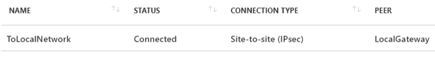

# 第七章：Azure 的混合云 - 将本地工作负载扩展到云端

混合云是云计算旅程中的一个重要组成部分，它帮助我们将 Azure（或任何其他云）与本地资源结合。在本章中，我们将讨论如何配置环境以及如何设置 Azure 和本地基础设施之间的连接，以便充分利用本地和云基础设施的优势。

本章将涵盖以下主题：

+   混合云

+   将虚拟网络连接到本地环境

+   本地数据网关

+   Azure Stack

# 技术要求

本章所需的内容：

+   一个 Azure 订阅

+   运行 Windows Server 2012 R2 或更高版本的本地服务器

+   支持 S2S 连接的 VPN（防火墙）设备

# 混合云

对于许多组织来说，完全迁移到云端并不是一个选择。尽管云提供了多种好处，但仍然有很多场景需要考虑。

例如，如果一家公司已经投资了本地基础设施，那么仅仅放弃所有投资并将所有内容迁移到云端是困难的。在创建本地数据中心时，我们需要投资服务器机房、网络、服务器、存储和软件许可证。没有商业理由放弃所有投资并开始在云上投资。

另一种场景是我们无法迁移特定服务的情况。在这种情况下，法律合规性可能会阻止我们将某些内容从本地数据中心迁移出去。例如，某些国家/地区不允许将用户的个人信息存储在该国之外。如果您所在地区没有 Azure 数据中心，这可能成为一个障碍，您可能需要将数据保留在本地数据中心。

在这两种情况下，当某些因素使我们无法使用云的所有服务时，我们可以通过设置混合云来利用云所提供的服务。这使我们能够将云服务与本地基础设施结合使用，创造出本地和云基础设施的最佳组合。

例如，我们可以在本地数据中心设置数据库（如果我们不能迁移数据库或有全新的数据库服务器），并设置会在后台使用本地数据库的云服务。这尤其适用于 Azure 数据分析平台，它提供多个强大的服务，可以为您提供快速的数据处理，并且仍然保留本地数据。

还有一种第三种场景，您可以使用来自多个云提供商的服务，并从每个提供商所提供的服务中受益。同样，我们需要设置混合云场景，以确保在您使用每个云中的服务之间的通信安全，并交换资源。

在混合云中设置安全性并确保数据安全的最佳方式是创建 Azure 与本地基础设施之间的直接连接。

# 连接本地网络和 Azure 虚拟网络

为了连接本地基础设施和 Azure，我们需要在本地网络和 Azure 虚拟网络之间创建一个连接。这个连接可以是**点对站点**（**P2S**）或者**站点对站点**（**S2S**）。由于 P2S 允许单个计算机访问 Azure 虚拟网络，它并不适合真正的混合云应用，更适合作为远程工作人员的访问点。

要建立真正的混合云，我们需要创建一个 S2S 连接，使得我们的本地网络和 Azure 虚拟网络之间可以进行全面的通信。通过这样做，我们将本地网络扩展到 Azure，并能够像访问本地环境中的资源一样访问 Azure 中的资源。

创建 S2S 连接有两种方式：使用 VPN 和使用 ExpressRoute。VPN 将提供两个网络之间的通信加密，而 ExpressRoute 更进一步，提供本地网络和 Azure 虚拟网络之间的专用连接。专用连接提供了更高的可靠性、更快的速度、更低的延迟和更高的安全性，但它必须作为由 ISP 提供的单独服务购买。

在本地网络和 Azure 虚拟网络之间建立连接是一个两步过程。首先，我们需要创建和配置 Azure 资源，第二步则需要配置我们的本地防火墙。在本地环境中，我们需要一个支持创建 S2S 连接并具备公网 IP 地址的 VPN（防火墙）设备。请注意，带有 S2S 选项的所有设备不都支持与 Azure 建立 S2S 连接。

# 创建 S2S 连接

要在 Azure 虚拟网络和本地网络之间创建 S2S 连接，首先我们必须创建两个 Azure 资源：虚拟网络网关和本地网络网关。

创建虚拟网络网关是在一个面板中完成的。我们需要提供的信息包括：名称、网关类型、VPN 类型、SKU、虚拟网络、网关子网地址范围、公网 IP 地址、订阅和位置。名称、订阅和位置是常规参数。

第一个选项是选择网关类型。可以选择 VPN 或 ExpressRoute（如前所述）。如果选择 VPN，则需要选择 VPN 类型是基于策略还是基于路由。（这个选项可能取决于您本地网络的设置。）下一步是选择一个 SKU，决定可用的带宽和连接数。可以启用或禁用活动-活动模式。此模式允许您创建冗余连接，从流量的角度来看，它们将被视为一个连接。换句话说，您需要在本地设备上创建两个 S2S 连接，这两个连接将流量路由到同一个虚拟网络。除非其中一个连接不可用，否则流量将通过两个连接路由，如果一个连接不可用，流量将通过仍然可用的 S2S 连接路由。

活动-活动模式不仅用于高可用性连接，还用于更好的性能。您需要选择一个可用的虚拟网络。可用的网络将取决于选择的订阅和位置。选择虚拟网络后，您需要为网关子网提供一个地址范围。如果该子网不存在，将自动创建（除非网络上没有空闲地址空间，否则该过程将失败）。请注意，不需要资源组。虚拟网络网关将在虚拟网络所在的同一资源组中创建。

接下来，您需要创建或选择一个现有的公共 IP 地址，该地址将用于连接。此 IP 地址用于与本地网络建立连接，并将在本地防火墙的配置中使用，以接受来自 Azure 的连接。我建议使用静态 IP 地址，以免 IP 地址发生变化时，您需要重新配置。

接下来是虚拟网络网关配置的示例：


创建虚拟网络网关需要 30 到 90 分钟。这是 Azure 中部署时间最长的资源之一。

Azure 虚拟网络网关部署的 ARM 模板在这里提供：

```
{
"$schema": "http://schema.management.azure.com/schemas/2015-01-01/deploymentTemplate.json#",
"contentVersion": "1.0.0.0",
"parameters": {
"name": {
"type": "string"
},
"location": {
"type": "string"
},
"sku": {
"type": "string"
},
"gatewayType": {
"type": "string",
"defaultValue": "Vpn",
"allowedValues": [
"Vpn",
"ExpressRoute"
]
},
"vpnType": {
"type": "string",
"defaultValue": "RouteBased",
"allowedValues": [
"RouteBased",
"PolicyBased"
]
},
"existingVirtualNetworkName": {
"type": "string"
},
"newSubnetName": {
"type": "string"
},
"subnetAddressPrefix": {
"type": "string"
},
"newPublicIpAddressName": {
"type": "string"
}
},
"resources": [
{
"apiVersion": "2017-06-01",
"name": "[parameters('name')]",
"type": "Microsoft.Network/virtualNetworkGateways",
"location": "[parameters('location')]",
"dependsOn": [
"Microsoft.Network/virtualNetworks/PacktVnet/subnets/GatewaySubnet",
"[concat('Microsoft.Network/publicIPAddresses/', parameters('newPublicIpAddressName'))]"
],
"properties": {
"gatewayType": "[parameters('gatewayType')]",
"ipConfigurations": [
{
"name": "default",
"properties": {
"privateIPAllocationMethod": "Dynamic",
"subnet": {
"id": "[resourceId('PacktIaaS', 'Microsoft.Network/virtualNetworks/subnets', parameters('existingVirtualNetworkName'), parameters('newSubnetName'))]"
},
"publicIpAddress": {
"id": "[resourceId('PacktIaaS', 'Microsoft.Network/publicIPAddresses', parameters('newPublicIpAddressName'))]"
}
}
}
],
"vpnType": "[parameters('vpnType')]",
"sku": {
"name": "[parameters('sku')]",
"tier": "[parameters('sku')]"
}
}
},
{
"apiVersion": "2018-04-01",
"type": "Microsoft.Network/virtualNetworks/subnets",
"name": "[concat(parameters('existingVirtualNetworkName'), '/', parameters('newSubnetName'))]",
"location": "[parameters('location')]",
"properties": {
"addressPrefix": "[parameters('subnetAddressPrefix')]"
}
},
{
"apiVersion": "2017-08-01",
"type": "Microsoft.Network/publicIPAddresses",
"name": "[parameters('newPublicIpAddressName')]",
"location": "[parameters('location')]",
"properties": {
"publicIPAllocationMethod": "Dynamic"
}
}
]
}
```

在虚拟网络网关部署完成后，我们可以继续创建本地网络网关。本地网络网关用于输入本地防火墙和网络的信息。您需要提供本地防火墙的公共 IP 地址以及本地网络的地址空间（或者根据防火墙，提供本地网络的网关子网）。您还需要提供订阅、位置和资源组。位置应与虚拟网络网关和虚拟网络使用的相同。我建议将它们放在同一资源组中，以便于管理。以下是本地网络网关的示例设置：


本地网络网关部署的 ARM 模板在这里提供：

```
{
"$schema": "http://schema.management.azure.com/schemas/2015-01-01/deploymentTemplate.json#",
"contentVersion": "1.0.0.0",
"parameters": {
"localNetworkGatewayName": {
"type": "string"
},
"location": {
"type": "string"
},
"gatewayIpAddress": {
"type": "string"
},
"addressPrefixes": {
"type": "array"
}
},
"resources": [
{
"name": "[parameters('localNetworkGatewayName')]",
"type": "Microsoft.Network/localNetworkGateways",
"apiVersion": "2017-06-01",
"location": "[parameters('location')]",
"properties": {
"localNetworkAddressSpace": {
"addressPrefixes": "[parameters('addressPrefixes')]"
},
"gatewayIpAddress": "[parameters('gatewayIpAddress')]"
}
}
]
}
```

与虚拟网络网关相比，部署本地网络网关相对较快，部署应在 5 分钟内完成。

# 配置 Azure 的 S2S 设置

在虚拟网络网关和本地网络网关创建后，我们可以继续进行配置。在虚拟网络网关中，我们在设置下选择连接类型选项。您将看到设置中有配置、连接和点对站点连接的选项。

由于我们将专注于 S2S 连接，因此我们只使用连接面板并添加一个新连接。我们需要像往常一样提供一个名称。虚拟网络网关、订阅、资源组和位置的选项是锁定的，无法更改，因为它们取决于用于创建连接的虚拟网络网关。我们需要提供的参数是连接类型和共享密钥（PSK）。连接类型的选项有 VNet 到 VNet、站点到站点（IPsec）和 ExpressRoute。由于我们希望连接到本地网络，因此选择站点到站点（IPsec）选项。对于共享密钥（PSK），我建议它尽可能复杂，因为安全性可能依赖于此。新连接的示例设置如下：


创建连接只是第一步；我们还需要为本地网络配置设置。在初步创建后，连接的状态将显示为未知，如下图所示：


# 配置本地防火墙以支持 S2S

本地防火墙的配置取决于供应商和设备类型。在已创建的连接下，有一个选项可以下载某些设备的配置。您可以选择不同的供应商（例如，Cisco 和 Juniper），并且还可以根据设备供应商、设备系列和固件版本下载特定的配置。只有少数设备可以直接从 Azure 门户下载。您可以在微软的文档中找到更多设备，有些供应商在其网站上有关于 Azure S2S 配置的部分。以下是配置下载过程的截图：


在双方配置完连接后，状态将更改为已连接，如下所示：



这将允许您通过安全的、私有的连接直接从本地网络连接到 Azure 虚拟网络中的任何资源。在某些情况下，您可能不希望将资源公开供公共访问，因此这是连接到资源的唯一方法。

在其他情况下，通常最常见的做法是服务公开访问，但管理是在私有网络上进行的。例如，允许通过互联网以 HTTP 或 HTTPS 访问网站，但仅允许通过私有网络访问数据库或 RDP 连接到虚拟机。

# 配置混合环境中的服务

一旦我们在本地网络和 Azure 之间建立了连接，我们就可以开始使用这两个环境中的服务，就像它们是一个单一站点或网络一样。然而，有一些事情需要我们牢记。

如果我们在本地环境中已设置了一个域，并希望在云端使用相同的域，那么在 Azure 虚拟网络中运行一个域控制器是一个不错的选择。即使我们已经建立了 S2S 连接，也可能会出现偶尔的连接中断。通过在云端运行一个 DC，我们可以确保 Azure 中的服务能够在中断发生时使用所有功能并独立运行。

当运行 SQL Server 并使用 Always On 可用性组时，你可以使用 Azure 扩展服务并在云端添加一个副本。如前所述，运行 Azure 有两种模式：资源管理器和经典模式。经典模式支持通过向导在 Azure 中添加副本，并且相对容易设置。

资源管理器需要使用 T-SQL 命令在 Azure 资源管理器模式下添加副本，但这稍微有些复杂。不过，由于资源管理器是推荐的模式，我建议使用资源管理器，因为经典模式迟早会被淘汰，最终你还是需要设置资源管理器。

另一个需要考虑的因素是 Azure 混合权益（Azure Hybrid Benefit），它允许你在 Azure 中使用现有的本地许可证。通过软件保证，你可以使用 Windows Server 和 SQL Server 的许可证，并以显著的折扣部署 Azure 资源。

在建立本地网络与 Azure 之间的连接时，数据中心的位置非常重要。如果你位于一个大陆，而 Azure 数据中心（虚拟网络部署所在的数据中心）位于另一个大陆，你将会遇到网络延迟和滞后。选择离你最近的地理位置是最佳的选择。

如果你遇到网络延迟和滞后问题或性能问题，可以考虑使用 ExpressRoute 服务。虽然这需要付费，但它提供了企业级的连接，具有最佳的可靠性、速度和安全性。

# 跨 Azure 连接虚拟网络

虚拟网络网关可用于连接不同的 Azure 虚拟网络。但因为你需要为虚拟网络网关付费，我建议采用另一种方法。要将 Azure 虚拟网络连接到另一个 Azure 虚拟网络，我们可以使用**对等连接**。通常，对等连接是将独立的网络互联以交换流量。对等连接的选项可以在虚拟网络面板的设置下找到。如果我们选择创建一个新的对等连接，需要提供一个名称，并选择是连接到资源管理器还是经典虚拟网络。由于推荐使用资源管理器，我们将在这里解释该过程。如果选择了资源管理器，我们可以提供一个资源 ID，或者使用下拉菜单选择我们的 Azure 订阅和要连接的虚拟网络。

如果需要，还可以提供一些额外的选项来转发流量和配置远程网关。以下截图展示了一个示例对等连接设置：


# 本地数据网关

在某些情况下，创建到 Azure 的 S2S 连接所需的所有要求未满足，但我们仍然需要连接到本地资源。例如，我们需要连接到本地数据库，但我们本地的 VPN 设备不支持与 Azure 的连接。

在这种情况下，我们可以使用本地数据网关，使 Azure 服务能够以安全的方式访问本地数据库。

本地数据网关充当桥梁，允许我们通过 Azure 服务访问本地数据。目前支持的服务包括 Power BI、Microsoft Flow、PowerApps、Azure 分析服务和 Azure Logic Apps。Logic Apps 也可以用来将数据传递到其他服务。

支持的连接器有：

+   BizTalk Server 2016

+   文件系统

+   IBM DB2

+   IBM Informix

+   IBM MQ

+   MySQL

+   Oracle Database

+   PostgreSQL

+   SAP 应用服务器

+   SAP Message Server

+   SharePoint Server

+   SQL Server

+   Teradata

设置本地数据网关是一个两步过程；我们需要先在本地安装代理，然后在 Azure 中配置网关。

# 本地安装

要开始安装过程，我们需要使用具有 Azure 订阅访问权限的账户进行登录。通常，要访问 Azure 订阅，您需要使用 Microsoft Live 账户或工作/学校/O365/AAD 账户。在此情况下，我们无法使用 Microsoft Live 账户，因为仅允许使用工作账户。登录表单如下所示：


在完成登录过程后，我们需要提供一个新的本地数据网关名称和一个恢复密钥（至少 8 个字符）。恢复密钥在您需要重启服务或更改其配置时使用：


部署完成后，您将看到一个状态页面和一些额外的配置。您可以更改服务设置、网络设置和连接器，或者如果遇到服务问题，可以启动诊断。为了再次访问这些设置，您需要使用恢复密钥：


# 云服务

本地服务器安装完成后，我们还需要在 Azure 中配置网关。我们需要提供的参数包括资源名称、订阅、资源组和位置。根据其他信息，可用的网关将可以在安装名称下选择：


部署完成后，我们可以使用本地数据网关将 Azure 与本地服务器连接。可以使用这种连接的服务数量有限，但我们可以使用逻辑应用扩展连接到其他服务。配置逻辑应用以使用本地数据网关，使我们能够在单个逻辑应用流程中扩展连接到其他服务，并访问相同的数据。连接虽然有限，但它能在 S2S 不是选项的某些场景下提供帮助。

# Azure Stack

微软可能是唯一一个提供真正混合云选项的云服务商。大多数云服务商都提供某种形式的混合云，允许你将本地服务和云服务结合起来。在大多数情况下，通过 IaaS，我们可以轻松地将所有本地资源运行在云端，几乎不需要任何努力。将本地资源迁移到云端是每个云服务商都在提供的选项。

Azure Stack 是唯一一个允许你将云服务在本地数据中心运行的选项。使用 Azure Stack，你可以在自己的环境中运行 IaaS 甚至 PaaS。基本上，Azure Stack 是 Azure 在本地环境中的扩展，它使用与公有版 Azure 相同的架构，但规模要小得多。它以预配置的盒子形式提供，必须从授权供应商处购买，并使用与公有版 Azure 相同的“真实”架构。它支持与公有版 Azure 相同的模型和部署工具。在 Azure 中部署的所有应用和服务都可以在 Azure Stack 中运行，而在 Azure Stack 中部署的所有应用和服务也能在 Azure 中运行。该模型一次开发，随时可以部署到任何地方。

在一些场景中，Azure Stack 可能是一个值得考虑的选择。第一个场景是我们在讨论混合云选项时已经提到的：当我们有法规要求必须将数据保留在本地数据中心或本国境内时。即使是混合云，在这种情况下我们也必须使用 SQL Server。而使用 Azure Stack，这个问题就不存在了；我们可以使用 Azure SQL 数据库，并且即使将数据库保留在本地，也能享受 PaaS 的优势。

在处理大数据集时，延迟和连接性可能成为问题。Azure Stack 是一个解决方案，可以让我们在本地处理数据，然后将其聚合到 Azure 中进行进一步分析，同时在两者之间共享通用的应用逻辑。

另一个例子是那些断开连接或部分断开连接的系统，这些系统偶尔能连接到互联网。使用 Azure Stack，我们可以在飞机或船只等没有持续互联网连接的环境中提供云应用。航空公司可以为客户创建云应用，客户可以在飞机离线时访问该应用。一旦建立互联网连接，就可以进行数据同步，并更新所有内容。

在某些场景下，公司可能拥有多个位置，并且其中一些位置可能需要离线。在这种情况下，云应用程序之前无法作为选项，但通过 Azure Stack，即使在使用云的情况下，所有位置也可以使用相同的应用程序。有些位置可能使用公共 Azure 中的应用程序，而有些可能使用 Azure Stack，但它们具有相同的功能和能力。

Azure Stack 可能是微软合作伙伴的一个有趣选择，这些合作伙伴可能希望在他们的数据中心托管 Azure Stack，并在他们的国家提供 Azure 服务。如果公司或政府机构需要将数据保存在本国，托管服务提供商可以使用 Azure Stack 在该国为这些组织提供 Azure 服务。

架构、模型和部署工具不仅是 Azure 和 Azure Stack 共享的东西。Azure 门户也是两者非常相似的一项内容。Azure Stack 提供了两个版本的门户：用户版和管理版。用户版用于消耗和创建资源，类似于我们在公共 Azure 门户中看到的内容，之后用于配置配额和限制。门户的管理部分对于那些决定使用 Azure Stack 在本地托管 Azure 服务并将其提供给他人的人尤其重要，因为这将使他们能够控制每个客户的限制和支出。

您可以通过接下来的两个截图对比 Azure 和 Azure Stack 门户的设计，第一个是**公共 Azure**，第二个是**Azure Stack**。如您所见，设计非常相似，区别在于左上角的名称：


# 总结

如前所述，混合云已成为大多数组织的现实，无论是因为法规要求，还是投资于本地基础设施。我们已经讨论了如何迁移或将服务扩展到云，管理云中的身份是这一过程的一个非常重要部分。数据很重要，但管理谁可以访问这些数据同样重要。在将本地基础设施扩展到云时，我们可以设置域控制器的副本，并使用 Active Directory 来管理身份和委派访问权限，但这仅限于 IaaS。

要使用 PaaS 管理此项服务，我们必须使用 Azure Active Directory，通常称为身份即服务。在下一章中，我们将讨论 Azure Active Directory，如何使用它，甚至如何将本地身份扩展到 Azure Active Directory。

# 问题

1.  混合云通常仅仅是一个选择，因为...

    1.  法规

    1.  投资

    1.  两者

1.  我们可以使用...连接本地网络和 Azure。

    1.  站点到站点

    1.  ExpressRoute

    1.  两者

1.  为 S2S 所需的 Azure 资源...

    1.  虚拟网络网关

    1.  本地数据网关

    1.  两者

1.  本地网络网关包含...

    1.  虚拟网络

    1.  本地网络

    1.  两者

1.  VPN 设备配置可以从 Azure 门户下载。

    1.  正确

    1.  正确，但仅限少数设备

    1.  错误

1.  S2S 连接的推荐模式是...

    1.  资源管理器

    1.  经典版

    1.  两者

1.  为确保在混合云中可以使用本地身份，必须部署...

    1.  灾难恢复中的域控制器

    1.  Azure 中的域控制器

    1.  始终在线可用性组

1.  本地数据网关可以与...

    1.  所有 Azure 服务

    1.  限量提供的 Azure 服务

    1.  单一的 Azure 服务

1.  Azure Stack 是...

    1.  在本地数据中心扩展 Azure

    1.  Azure 中本地数据中心的扩展

    1.  在另一个公共云中扩展 Azure

1.  Azure Stack 提供...

    1.  IaaS

    1.  PaaS

    1.  两者
