# Azure Active Directory - 云中的身份

我们已经在 Azure 中有了应用程序和数据，本地网络与 Azure 之间的连接也已建立。但是身份验证和授权怎么办？我们如何管理用户的权限和访问？所有这些问题的答案是 **Azure Active Directory** (**AAD**)，它允许我们设置基于云的身份认证，并且结合 **Azure 基于角色的访问控制** (**RBAC**)，可以进行用户身份验证并允许他们访问特定资源。

本章将涵盖以下主题：

+   Azure Active Directory

+   将本地 AD 与 AAD 同步

+   在 AAD 中管理用户和应用程序

# 技术要求

本章需要以下内容：

+   一个 Azure 订阅

+   一台运行 Windows Server 2012 R2 或更高版本的本地服务器，已安装域控制器角色

# Azure Active Directory

AAD 是一种基于云的目录和身份管理服务，提供应用访问管理和身份保护。它通常被称为 IaaS（基础设施即服务）。

我们已经提到过这个，但还是要再回顾一下。AAD 处于 Azure 管理链的最上层，并且直接与租户相关联。在租户下，我们可以拥有多个订阅，每个订阅下有多个资源组，每个资源组下有多个资源。

单个帐户可以访问多个租户，但每个租户都是隔离的。当用户登录时，会选择默认目录和租户。仅可访问该租户下订阅中的资源。若要管理其他租户中的资源，我们必须切换目录。

AAD 有四个版本：

+   Azure Active Directory 免费版

+   Azure Active Directory 基本版

+   Azure Active Directory Premium P1

+   Azure Active Directory Premium P2

Azure Active Directory 基本版提供基于云的应用访问和自助身份管理解决方案，包括基于组的访问管理、云应用的自助密码重置以及 AAD 应用代理。

高级版本提供了额外的功能和企业级管理工具，如动态组、自助组管理和 Microsoft 身份管理（P1），或身份保护和特权身份管理（P2）。Azure Active Directory Premium P2 包含所有 P1 的功能，并增加了身份保护和特权身份管理。

在这里，我们将重点关注由 Azure Active Directory 免费版提供的功能。免费版的目录对象数量限制为 500,000，支持的功能集较为有限，但允许进行用户/组管理、将本地目录同步到 Azure 以及基本的安全报告。它足以提供一般性的图像并介绍 AAD。涵盖所有 AAD 版本提供的功能可能会导致一本单独的书籍，且讨论 Azure 管理时会过于冗长。

# 创建新目录

即使 AAD 在 Azure 订阅存在的情况下可能已经存在，还是从创建一个新的 AAD（一个新的租户）开始吧。

要创建一个新目录，我们需要提供组织名称、初始域名和国家或地区。请注意，初始域名将用于创建一个初始域名，格式为`yourdomain.onmicrosoft.com`。域名必须是唯一的，之后可以为您的自定义域名进行自定义。以下截图显示了设置的示例：

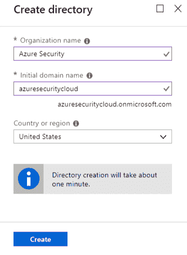

创建一个新目录大约需要 1 分钟。新目录创建后，您需要切换目录才能进行管理。请注意，目录名称位于您的个人资料下方。要更改目录，请点击个人资料左侧的“目录”菜单，并从列表中选择目录；它将会打开，如下所示：

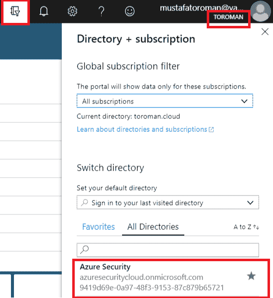

在切换目录后，您将进入一个新租户。如果您创建了一个新的目录，该租户将是空的，并且不会分配任何订阅。要开始创建 Azure 资源，您必须在此租户下创建一个新订阅。在空的租户中，您唯一可以管理的是 AAD。Azure Active Directory Free 的概览和管理选项如以下截图所示：

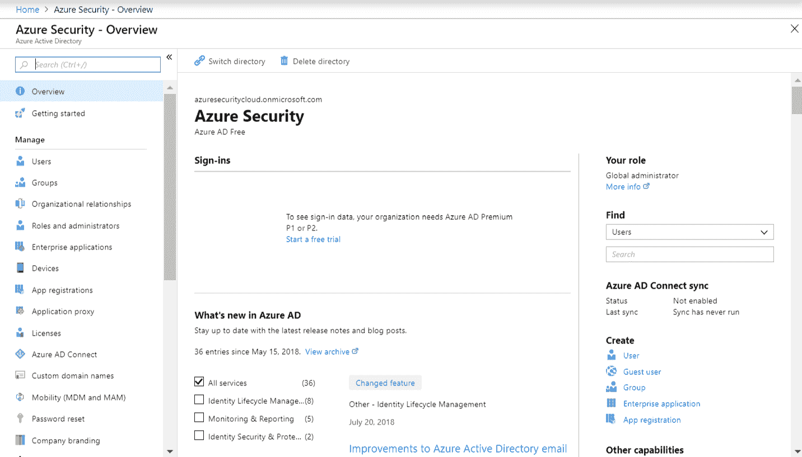

# 自定义您的域名

我们需要自定义的第一件事是域名。为了将自定义域添加到您的目录，您需要输入一个自定义域名，它实际上是您拥有的公共域名。例如，我将使用我的域名，`azuresecurity.cloud`：

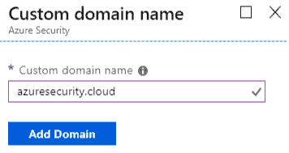

在添加自定义域名后，需要验证该域名，或者更准确地说，需要验证域名的所有权。为了验证域名所有权，您需要在域名注册商中输入 TXT 或 MX 记录。TXT 记录的示例如下：

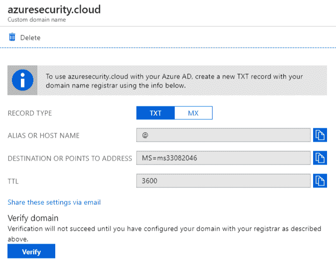

在输入记录并点击“验证”按钮后，您可能会收到错误。DNS 记录可能需要最多 72 小时才能传播更改。传播时间取决于您使用的 DNS，但通常不会超过 30 分钟。如果更改尚未传播，您将收到错误，如下图所示：

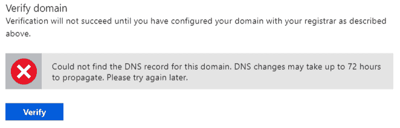

在变更传播并且验证通过后，您将收到一条消息，说明验证已通过。系统会提供两个额外选项——将此域设为主域，并下载 Azure AD Connect。我们现在忽略 Azure AD Connect，但我建议将自定义域设为主域。这样，自定义域将成为主域并成为首选域后缀。默认的用户名 `username@yourdomain.onmicrosoft.com` 将变成 `username@yourdomain.com`。如前面的示例所示，`username@azuresecuritycloud.onmicrosoft.com` 将变为 `username@azuresecurity.cloud`。下面是验证过的自定义域截图：

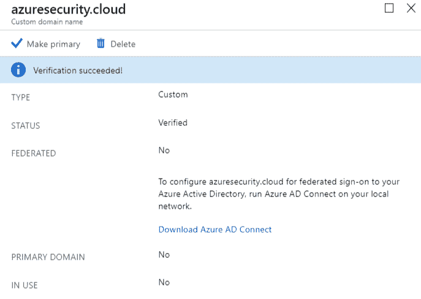

# 同步 AAD 与本地 AD

我们已经建立了一个新的目录，现在可以开始添加用户并为他们分配访问权限。但很可能我们已经在本地环境中有一个身份解决方案，并且用户已经有了一个身份。如果为用户提供额外的身份可能会导致问题和混淆。用户将遇到问题，无法确定何时使用哪个账户，如果创建了相同或相似的账户，用户会开始输入错误账户的密码……

幸运的是，通过 AAD，我们可以使用 Azure AD Connect，这将允许我们将账户从本地 AD 同步到 Azure，并让用户使用相同的账户进行一切操作。这将使每个人的工作变得更轻松；用户不必再考虑使用哪个账户（因为是同一个账户），管理员也会减少解决问题的数量（账户更少，用户因错误密码尝试而锁定账户的情况也减少）。

此外，通过 Azure AD Connect，我们可以实现**单点登录**（**SSO**），这样用户可以通过单次登录过程访问 Azure 和本地资源。用户只需输入一次凭据，相同的凭据就可以用来访问所有他们有权限访问的内容。

为了开始与本地 AD 同步，我们需要进入 Azure AD Connect 面板。在这里，我们可以查看当前的同步状态。如果同步尚未启用，您还会看到 Azure AD Connect 客户端的下载链接，正如您在这里所看到的：

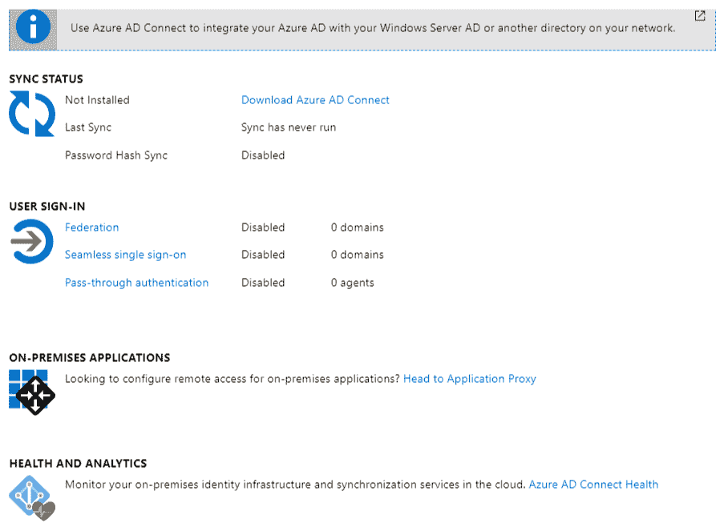

# 安装 Azure AD Connect

Azure AD Connect 必须安装在本地环境中的一台服务器上。建议您使用一台没有域控制器角色但可以访问域控制器的服务器。安装 Azure AD Connect 的服务器必须能够连接互联网，因为它需要通过互联网同步本地 AD 和 AAD 之间的信息。所有通过 Azure AD Connect 传输的流量都是加密和安全的。

安装向导非常直观，并解释了每个步骤；您只需要按照指南操作（并理解本地 AD 结构）。以下截图展示了安装过程中的第一个屏幕，解释了工具将执行的操作：

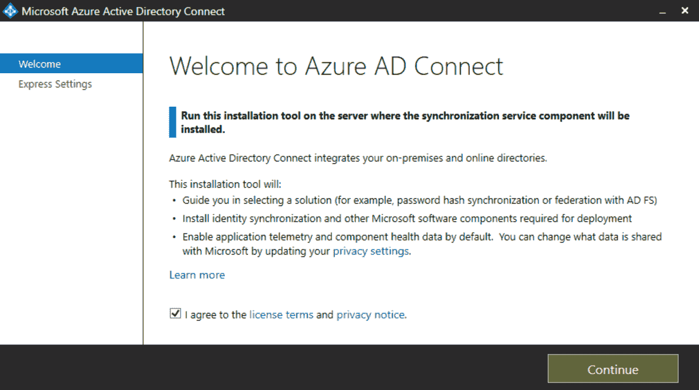

您需要做出的第一个选择是是否使用快速设置或自定义设置。如果选择使用快速设置，所有功能都会预先确定。安装将使用默认的安装路径，安装 SQL Express，并使用默认的同步选项，如密码哈希同步、同步所有属性或跨 AD 林同步所有身份。

这里展示了 Azure AD Connect 快速设置的示例：

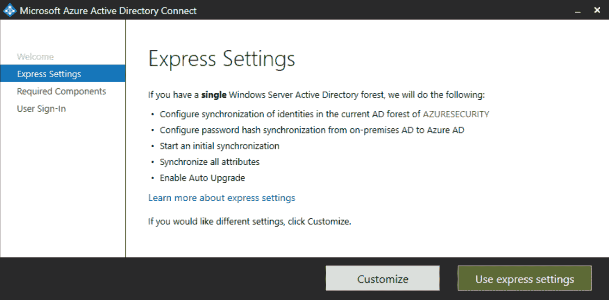

如果选择使用“自定义”选项，您可以设置一些功能，如安装路径、SQL Server 实例和同步组。例如，您可以使用现有的 SQL Server 实例，或选择只同步特定的用户组。另外，将为同步过程创建一个新的服务帐户，并使用快速设置；在自定义设置中，您可以选择使用现有的服务帐户。以下截图展示了自定义设置的示例：

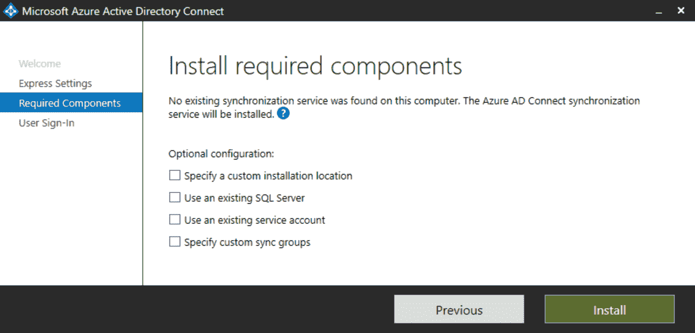

选择设置后，您需要提供可以启用同步的帐户。首先，您需要提供具有全局管理权限的 AAD 凭据。建议为此创建一个单独的帐户，而不是将其与个人帐户绑定。如果管理员离职，该帐户很可能会被停用，导致同步停止。以下是输入 AAD 帐户的截图：

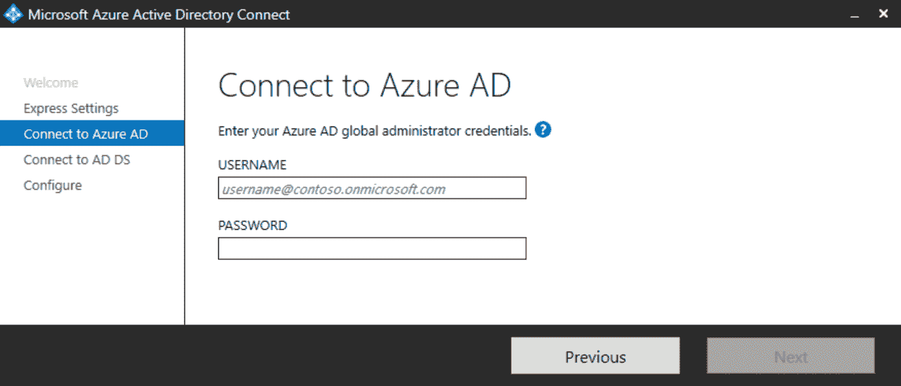

您需要提供的第二个帐户是 AD DS 企业管理员帐户。对于本地帐户和 Azure 帐户，情况相同：建议使用专门为此服务创建的服务帐户，而不是个人管理员帐户。输入 AD DS 帐户的截图如下所示：

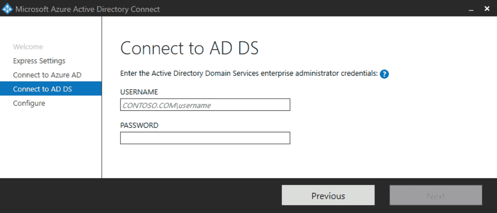

最后，您将进入一个确认安装的屏幕。此屏幕将再次列出所有将要执行的操作，并允许您在配置完成后启用同步过程的启动。您可以在以下截图中看到确认屏幕：

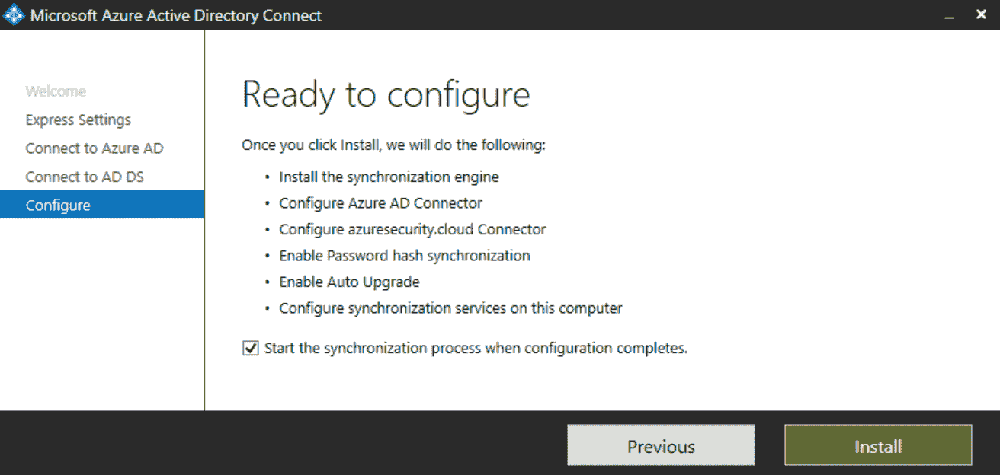

安装完成后，系统会提供一个状态报告，并给出建议，告诉你还需要做些什么。例如，在我的域中，未启用 Active Directory 回收站。此过程将检测到这一设置，并建议你启用它，如下图所示：

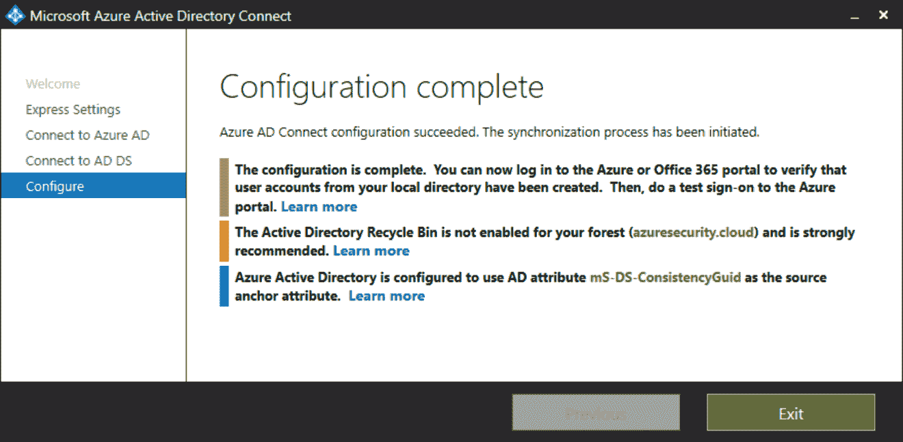

在 Azure 门户中，在 Azure AD Connect 选项卡下，您将看到新的状态。Azure AD Connect 的链接消失了，您可以看到同步已启用，并且`最后同步`是`不到 1 小时前`。根据本地环境，您还可以配置联合身份验证、单点登录（SSO）和一些其他设置。以下截图展示了一个已同步目录的示例：

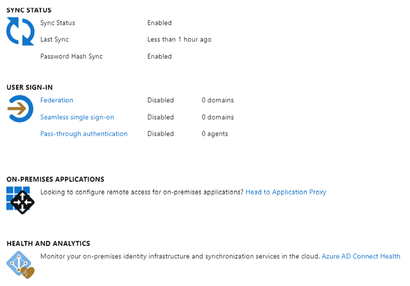

# 管理 AAD

同步完成后，所有同步的用户将出现在 AAD 中。在 AAD 中，帐户可以来自两个不同的来源：AAD 和 Windows 服务 AD。来自 Windows Server AD 来源的帐户是已从本地 Active Directory 同步的帐户。AAD 帐户仅存在于 AAD 中，这些帐户是在 Azure 中创建的。还有第三种类型的帐户，即 Microsoft 帐户。这些帐户实际上是 Microsoft Live 帐户，可以添加到您的 AAD 中。

AAD 中的用户类型可以是`Member`或`Guest`。成员是 AAD 中的帐户（带有您的域名），而访客是来自其他 AAD 或 Microsoft Live 帐户的帐户。唯一的例外是，当 Microsoft Live 帐户用于创建 AAD 时，该帐户可以是您的 AAD 成员。外部 AAD 帐户（来自您租户外部的 AAD 帐户）也是如此；这些帐户只能在用于创建新租户时具有成员身份。以下截图展示了一个成员列表的示例：

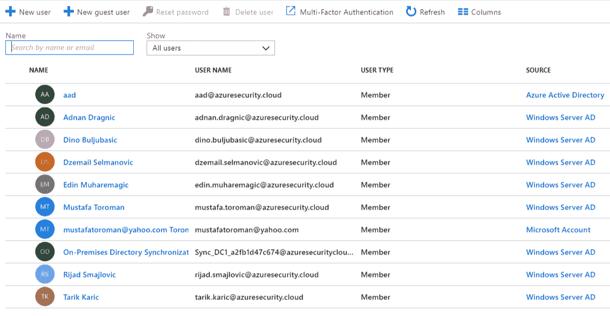

# 创建新用户

来自 AAD 来源的帐户是已在 Azure 中创建的帐户。我提到过，对于 Azure AD Connect，您应该使用服务帐户进行同步。请注意，该帐户必须具有全局管理员角色。以下是如何创建此类帐户的示例：

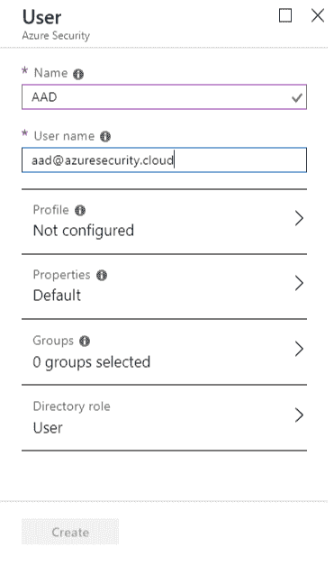

创建新 AAD 用户时，默认的用户角色是“用户”。在创建过程中或创建后，您可以将此选项更改为管理员。

# 管理用户选项和权限

创建用户后，您可以管理该用户并分配不同的角色和权限。除了管理选项外，您还可以在活动部分监视和审计用户的活动。以下截图展示了一个用户资料的示例：

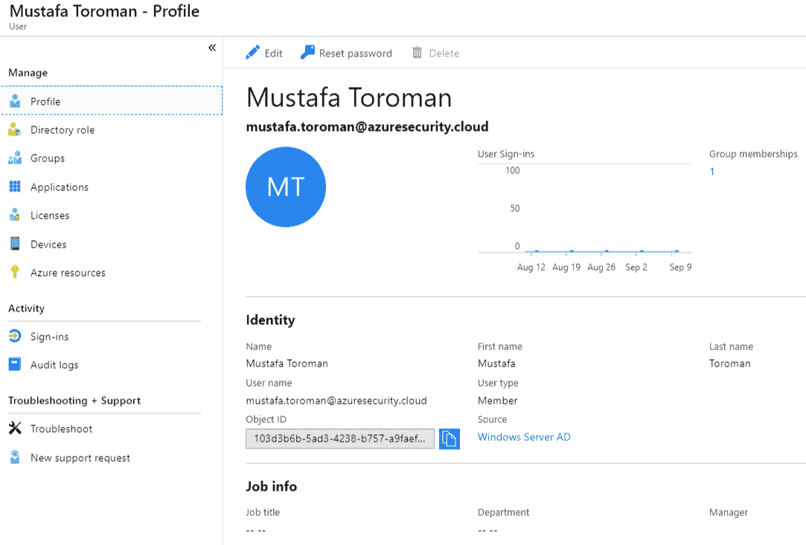

最重要的管理选项之一是角色分配。在“目录角色”下，您可以选择可以分配给用户的多个预定义角色。每个角色都有相应的说明，如下所示：

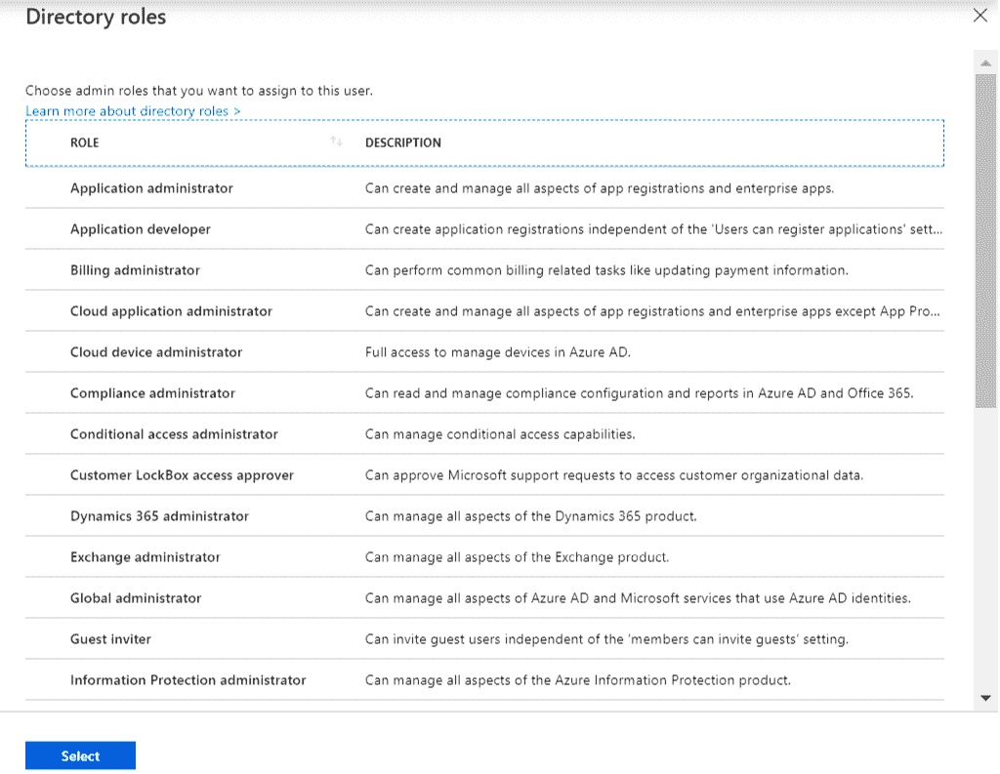

用户可以被添加到组中以简化管理。例如，我们可以将多个角色分配给组，通过将用户分配给某个组，用户将自动获得该组中所有分配给该组的角色。组可以被分配并同步，类似于帐户。分配的组起源于 AAD，并通过 Windows Server AD 进行同步。以下是分配给 AAD 用户的组的示例：

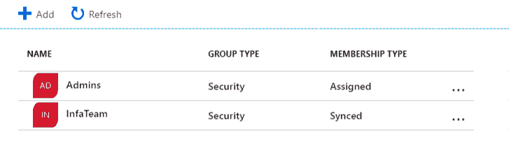

# 在 AAD 中注册应用程序

为了使用 AAD 作为应用程序的认证方法，您需要在 AAD 中注册该应用程序。这将创建两个对象：一个应用程序对象和一个服务主体。

要注册一个新的应用程序，我们需要进入 AAD 面板中的应用程序注册，并选择“新建应用程序注册”。我们需要提供的信息包括应用程序名称、应用程序类型（Web 应用程序 / API 或本地应用）以及登录 URL（这里我使用本地主机作为示例）：

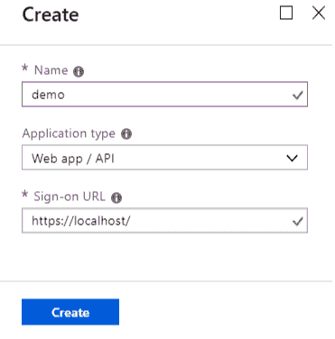

创建应用程序只是第一步，因为你还需要额外的配置才能使用这个注册。在应用程序创建后打开的第一个屏幕中，有两个非常重要的部分：应用程序 ID 和对象 ID。这些将在稍后用于通过 AAD 来识别应用程序。换句话说，应用程序使用 ID 来联系 AAD 并获取有关用户是否被授权访问该应用程序的信息。用于认证的 ID、应用程序或对象取决于认证方法。以下是一个示例：

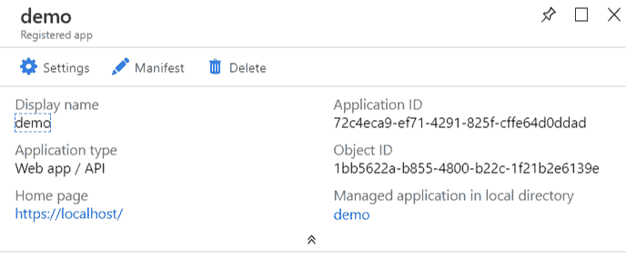

为了为已注册的应用程序提供访问权限，我们需要配置权限和密钥。要为应用程序提供权限，我们必须在设置面板中的所需权限下设置所需的权限。在这里你需要非常小心，因为使用过多权限可能会让你陷入陷阱。

我常常看到人们给只需要基本认证的应用程序授予所有可能的权限。如果分配了太多权限，这可能会被利用，并且会带来很高的安全风险。以下截图展示了一个示例权限面板：

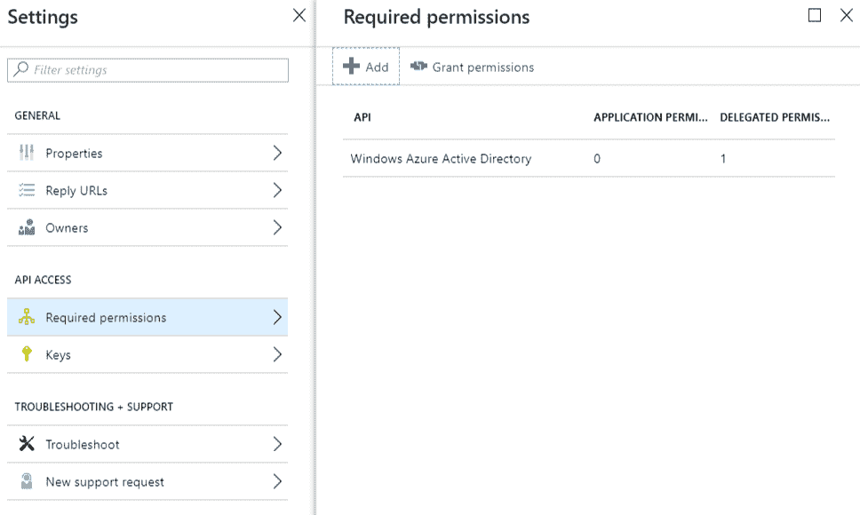

一旦我们拥有了 ID 和权限，最后缺少的是密钥。应用程序将使用 ID 和密钥来授权访问 AAD。要添加一个新的密钥，我们必须提供一个描述、过期时间（EXPIRES）和密钥的值（VALUE）。过期时间可以设为 1 年、2 年或永不过期。我强烈建议不要使用永不过期，因为这又是一个可能的安全风险。密钥的值并不是实际的密钥；该值将被加密，然后提供一个新的值。在输入所有值后，点击保存。以下是添加新密钥的示例：

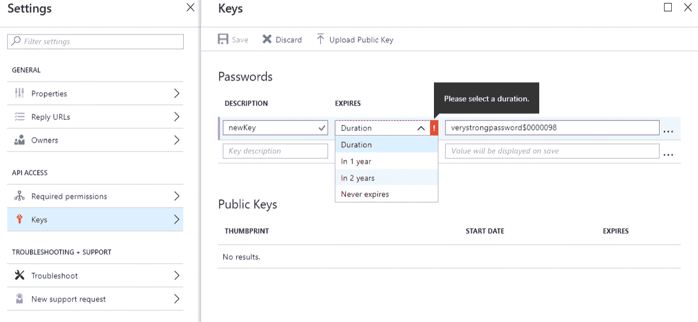

保存后，将提供密钥的新值。确保复制此值，因为这是你唯一能获取它的时机。一旦离开这个控制面板，你将无法重新获取此值。以下截图显示了一个生成的密钥示例（请注意控制面板顶部的警告）：

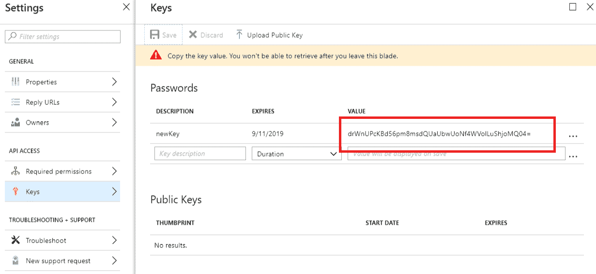

使用在 AAD 中注册的 ID 和密钥的应用程序将能够与 AAD 进行通信。这些应用程序不必托管在 Azure 中；它们可以用于本地应用程序或其他云中的应用程序。

请注意，当使用 Azure Web 应用程序时，你可以通过在 Web 应用程序控制面板中使用身份验证/授权来实现类似的目标。这个选项会自动创建所有必要的对象，并为 Web 应用程序提供一个 ID 和密钥。会创建最小的权限，这是一件好事，但如果你需要为应用程序提供更多权限，则需要手动操作。

我们已经提到，在这个过程中将会创建两个对象：一个应用程序对象和一个服务主体。

现在是讨论多租户概念的好时机。多租户应用程序允许来自多个租户的用户使用相同的应用程序和资源。例如，我们可以为客户开发一个应用程序，并将其托管在我们的订阅中（以及我们的租户）。然后，我们可以为多个客户设置应用程序的访问权限，并允许他们使用自己的 AAD 进行身份验证和授权。在这个概念中，来自多个租户的用户使用相同的应用程序和相同的资源。如果使用多租户方法，应用程序将在主租户中拥有一个应用程序对象，并为每个目录提供多个服务主体。基本上，一个应用程序对象与应用程序之间是“一对一”的关系，与服务主体之间是“一对多”的关系。

# 基于角色的访问控制

我们已经提到过 RBAC 以及它如何帮助管理和维护云资源。RBAC 允许你使用 AAD 帐户在 Azure 租户的不同级别上设置不同的角色和权限。为了提供租户中的用户管理权限，我们必须使用 AAD 控制面板。这些权限不会被进一步传递。在租户下，我们可以有多个订阅，并且每个订阅的参与是单独进行的。

将用户分配为管理员（或其他角色）将自动为他们在该订阅下的所有资源组和资源提供相同的角色。如果我们在资源组级别为用户分配角色，该角色将自动为该资源组中的所有资源提供权限。将角色访问权限授予单个资源，将仅给予用户对该资源的访问权限。

在为这些级别（订阅、资源组、资源）分配权限的过程中，我们使用相同的选项：访问控制（IAM）。在这里，我们选择角色、分配类型和用户。您也可以使用组或服务主体代替用户。以下截图展示了如何将新贡献者添加到订阅/资源组/资源：

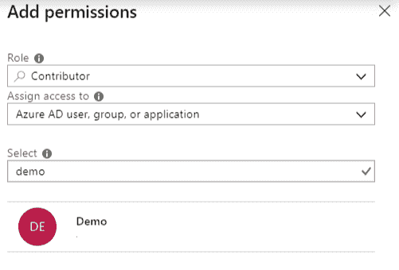

您可以选择多个预定义角色，创建自定义角色，或将用户分配到多个角色。如果用户被分配多个冲突的角色，将应用最高权限角色。

例如，Reader 角色只允许您查看资源的信息，不能进行任何更改。如果同时分配了 Reader 角色和 Contributor 角色（允许您进行更改），则将应用 Contributor 角色。

下面是可用角色的截图：

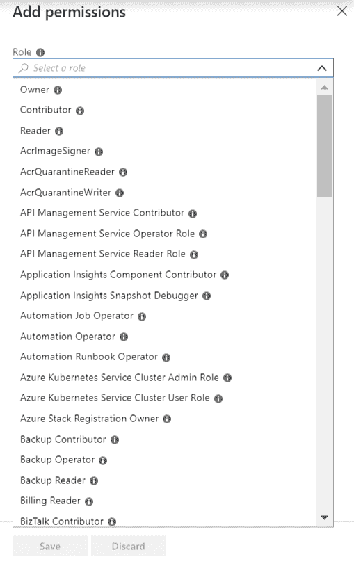

如前所述，组可以在任何级别分配角色。在这种情况下，所有属于该组的用户将自动被分配该角色。

服务主体通常用于为需要更改或创建某些内容的应用程序设置访问权限。例如，服务主体常用于允许 Azure DevOps 在发布过程中访问您的订阅，并创建或编辑部署所需的资源。

# 总结

AAD 提供 Azure 中的身份验证和授权。与 RBAC 一起，它允许您控制谁可以做什么以及在哪里做。这些工具是您管理和保护云资源时的第一道防线。

现在，我们将集中讨论在 Azure 中还需要保护哪些内容以及如何保护我们的数据和其他资源。保护 Azure 与保护我们本地基础设施不同，且需要不同的思维方式。在 第九章 *Azure 安全性与管理* 中，我们将讨论如何加固 Azure 安全性以及有哪些可用的工具来保护我们。

# 问题

1.  AAD 位于...

    1.  租户

    1.  订阅

    1.  资源组

1.  一个帐户可以属于多个租户：

    1.  是的

    1.  不是

1.  AAD 可以包含 Microsoft Live 账户：

    1.  是的

    1.  不是

1.  AAD 可以与 Windows Server AD 同步：

    1.  是的

    1.  不是

1.  Azure Active Directory 免费版的限制为...

    1.  5,000 个对象

    1.  500,000 个对象

    1.  5,000,000 个对象

1.  要设置自定义域...

    1.  您可以选择任何域

    1.  您必须拥有该域

    1.  您必须使用 `.onmicrosoft.com`

1.  要验证您的自定义域，您必须使用...

    1.  MX 记录

    1.  TXT 记录

    1.  任意

    1.  两者

1.  使用 RBAC，您可以为...分配角色

    1.  订阅

    1.  资源组

    1.  一个资源

    1.  上述所有内容

1.  角色可以分配给...

    1.  用户

    1.  组

    1.  两者

1.  要从应用程序设置 AAD 登录，您必须...

    1.  在 AAD 中注册应用程序

    1.  为应用程序创建一个 AAD 组

    1.  两者
